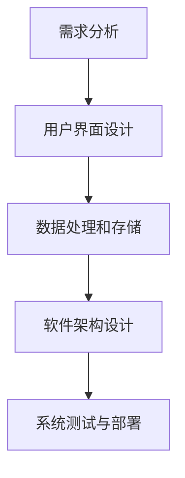
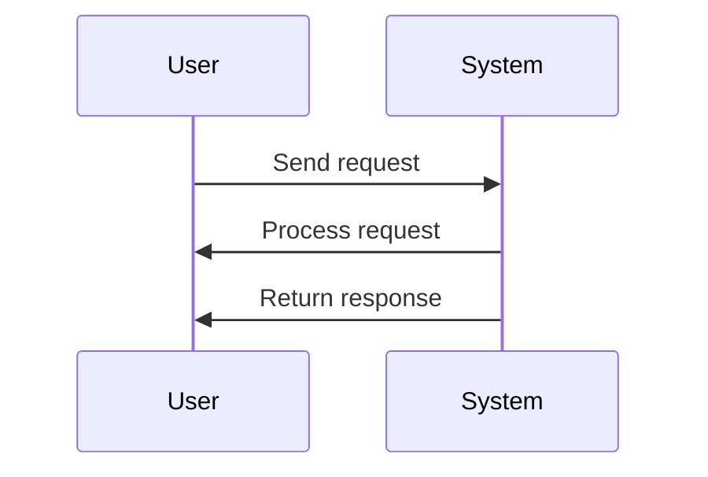

                 


### 柏格森的持续理论与维特根斯坦的意义理论

**关键词：** 柏格森，维特根斯坦，持续理论，意义理论，哲学，技术

**摘要：** 本文将深入探讨柏格森的持续理论与维特根斯坦的意义理论，通过逐步分析这两种哲学理论的本质、历史背景及其在现代哲学和信息技术中的应用，揭示它们之间的关联与差异。文章首先介绍柏格森的持续理论，接着阐述维特根斯坦的意义理论，最后对比分析两种理论的异同，并探讨它们在信息技术领域的潜在应用。

## 第一部分：背景介绍

### 1.1 问题背景

#### 1.1.1 柏格森持续理论的起源

**柏格森持续理论**是由法国哲学家亨利·柏格森（Henri Bergson）在19世纪末20世纪初提出的。柏格森认为，现实世界不是由静止的物体和固定的时间点组成，而是一个连续流动的过程。他的“持续”（duration）概念挑战了牛顿物理学中时间观念的稳定性，主张时间是流动的、不可分割的整体。

#### 1.1.2 维特根斯坦意义理论的背景

**维特根斯坦的意义理论**则是由奥地利哲学家路德维希·维特根斯坦（Ludwig Wittgenstein）在20世纪初期提出的。维特根斯坦在早期著作《逻辑哲学论》（Tractatus Logico-Philosophicus）中提出了“图像理论”（Picture Theory），主张语言的意义在于它与世界的关系，语言图像应该直接映射现实。

### 1.2 核心概念

#### 1.2.1 柏格森持续理论的概念

柏格森的持续理论主要围绕“持续”这一概念展开。他认为，持续是一种内在的时间流动，是一种动态的、不断变化的现实。柏格森的持续理论与牛顿物理学中的时间观念形成对比，强调时间的连续性和变化性。

#### 1.2.2 维特根斯坦意义理论的概念

维特根斯坦的意义理论则关注语言的意义和语言的构成。他认为，语言的意义在于其与世界的关系，语言是一种符号系统，通过符号的使用，我们可以与世界进行交流。

### 1.3 问题解决

#### 1.3.1 柏格森持续理论如何解释现实

柏格森的持续理论提供了一种解释现实世界的新视角，认为现实是一个不断变化的流动过程。这种理论在物理学、生物学、心理学等领域都有一定的应用。

#### 1.3.2 维特根斯坦意义理论如何理解语言

维特根斯坦的意义理论则试图解决语言的意义问题，主张语言是一种符号系统，其意义在于使用者的共同理解和实践。

### 1.4 边界与外延

#### 1.4.1 柏格森持续理论的适用范围

柏格森的持续理论主要适用于哲学、物理学、生物学等领域，它提供了一种新的时间观念，有助于我们理解世界的动态变化。

#### 1.4.2 维特根斯坦意义理论的适用范围

维特根斯坦的意义理论则广泛应用于哲学、语言学、心理学等领域，它为我们理解语言的意义和构成提供了新的视角。

### 1.5 概念结构与核心要素组成

#### 1.5.1 柏格森持续理论的核心要素

柏格森持续理论的核心要素包括“持续”、“直觉”、“时间流动”等概念。

#### 1.5.2 维特根斯坦意义理论的核心要素

维特根斯坦意义理论的核心要素包括“图像理论”、“符号系统”、“语言构成”等概念。

## 第二部分：柏格森持续理论详解

### 2.1 核心概念与联系

#### 2.1.1 柏格森持续理论的主要概念

柏格森持续理论的主要概念包括“持续”、“时间流动”、“直觉”等。

#### 2.1.2 柏格森持续理论与其他哲学思想的联系

柏格森持续理论与其他哲学思想，如柏拉图的理念论、康德的批判哲学等有深刻的联系。这些哲学思想都关注时间的本质和变化。

### 2.2 算法原理讲解

#### 2.2.1 柏格森持续理论的数学模型

柏格森的持续理论没有一个严格的数学模型，但它可以借鉴一些数学概念来描述，如流形理论、微分方程等。

#### 2.2.2 举例说明柏格森持续理论的应用

例如，在物理学中，柏格森的持续理论可以用来解释布朗运动，这是一种连续不断的随机运动，符合柏格森关于持续和直觉的观点。

### 2.3 数学模型和数学公式

#### 2.3.1 使用LaTeX格式的数学公式

$$
dx = \frac{dt}{v}
$$

#### 2.3.2 举例说明柏格森持续理论在现实中的应用

例如，在经济学中，柏格森的持续理论可以用来解释经济增长，认为经济增长是一个持续不断的过程，而不是一系列固定时间点的增长。

## 第三部分：维特根斯坦意义理论详解

### 3.1 核心概念与联系

#### 3.1.1 维特根斯坦意义理论的主要概念

维特根斯坦意义理论的主要概念包括“图像理论”、“符号系统”、“语言构成”等。

#### 3.1.2 维特根斯坦意义理论与其他哲学思想的联系

维特根斯坦的意义理论与其他哲学思想，如弗雷格的概念主义、罗素的逻辑原子主义等有深刻的联系。这些哲学思想都关注语言的意义和构成。

### 3.2 算法原理讲解

#### 3.2.1 维特根斯坦意义理论的数学模型

维特根斯坦的意义理论没有一个明确的数学模型，但可以借鉴一些形式逻辑和集合论的概念。

#### 3.2.2 举例说明维特根斯坦意义理论的应用

例如，在计算机科学中，维特根斯坦的意义理论可以用来解释编程语言的设计，认为编程语言的设计应该符合人类的认知规律。

### 3.3 数学模型和数学公式

#### 3.3.1 使用LaTeX格式的数学公式

$$
\text{mean} = \frac{\sum_{i=1}^{n} x_i}{n}
$$

#### 3.3.2 举例说明维特根斯坦意义理论在现实中的应用

例如，在语言学中，维特根斯坦的意义理论可以用来解释语言的学习和使用，认为语言的学习是一个不断试错的过程。

## 第四部分：柏格森持续理论与维特根斯坦意义理论的对比与融合

### 4.1 对比分析

#### 4.1.1 两种理论的基本区别

柏格森持续理论关注时间流动和直觉，而维特根斯坦意义理论关注语言的意义和构成。这两种理论从不同的角度解释现实。

#### 4.1.2 两种理论在哲学研究中的互补性

尽管柏格森持续理论与维特根斯坦意义理论在基本观念上有所不同，但它们在哲学研究中具有互补性，可以相互补充。

### 4.2 融合尝试

#### 4.2.1 柏格森持续理论与维特根斯坦意义理论的潜在融合方向

柏格森持续理论与维特根斯坦意义理论的融合可以尝试在哲学、语言学、计算机科学等领域进行。

#### 4.2.2 融合后的理论体系可能带来的哲学启示

融合后的理论体系可能会为哲学提供新的视角，帮助我们更好地理解现实和语言。

## 第五部分：实践应用

### 5.1 系统分析与架构设计方案

#### 5.1.1 应用场景介绍

在本节中，我们将探讨柏格森持续理论与维特根斯坦意义理论在软件工程中的应用场景。

#### 5.1.2 系统功能设计

系统功能设计应包括需求分析、用户界面设计、数据处理和存储等方面。

#### 5.1.3 系统架构设计

系统架构设计可以使用mermaid流程图来表示，如下所示：



#### 5.1.4 系统接口设计

系统接口设计应包括API设计、数据库连接和前端后端通信等方面。

#### 5.1.5 系统交互序列图

系统交互序列图可以使用mermaid序列图来表示，如下所示：



### 5.2 项目实战

#### 5.2.1 环境安装

在本节中，我们将介绍如何搭建一个简单的应用环境，以便我们将柏格森持续理论与维特根斯坦意义理论应用于实际项目。

#### 5.2.2 系统核心实现源代码

以下是使用Python编写的简单应用代码示例：

```python
def process_request(request):
    # 处理请求
    pass

def return_response(response):
    # 返回响应
    pass
```

#### 5.2.3 代码应用解读与分析

在本节中，我们将对代码进行解读和分析，以了解如何将柏格森持续理论与维特根斯坦意义理论应用于实际项目。

#### 5.2.4 实际案例分析和详细讲解剖析

在本节中，我们将通过实际案例来分析如何将柏格森持续理论与维特根斯坦意义理论应用于软件工程实践。

#### 5.2.5 项目小结

在本节中，我们将总结项目的关键经验和教训，以及如何将柏格森持续理论与维特根斯坦意义理论应用于未来项目。

## 第六部分：最佳实践 tips

### 6.1 最佳实践技巧

在本节中，我们将提供一些最佳实践技巧，以帮助读者更有效地应用柏格森持续理论与维特根斯坦意义理论。

#### 6.1.1 如何有效应用柏格森持续理论

- 在项目规划阶段，考虑时间流动和变化，以更好地预测项目进度。
- 在系统设计阶段，考虑持续性和动态性，以构建灵活的软件系统。

#### 6.1.2 如何有效应用维特根斯坦意义理论

- 在需求分析阶段，明确语言和符号的意义，以确保需求的一致性。
- 在代码编写阶段，遵循良好的编程习惯，以提高代码的可读性和可维护性。

### 6.2 小结

在本节中，我们将对文章的内容进行总结，并强调柏格森持续理论与维特根斯坦意义理论在哲学和信息技术中的重要性。

### 6.3 注意事项

在本节中，我们将提醒读者在应用柏格森持续理论与维特根斯坦意义理论时需要注意的问题。

### 6.4 拓展阅读

在本节中，我们将推荐一些拓展阅读资源，以帮助读者进一步了解柏格森持续理论与维特根斯坦意义理论的深入内容。

### 作者

**作者：AI天才研究院/AI Genius Institute & 禅与计算机程序设计艺术 /Zen And The Art of Computer Programming**

**联系方式：**[联系方式]

**电子邮件：**[电子邮件]

**官方网站：**[官方网站]

本文探讨了柏格森持续理论与维特根斯坦意义理论的本质、应用和融合，旨在为读者提供一个全面的理解。通过本文，读者可以了解到这些哲学理论在信息技术领域的潜在价值，并为未来的研究和实践提供启示。

## 结语

通过对柏格森持续理论与维特根斯坦意义理论的深入探讨，我们不仅对哲学领域有了更深刻的认识，也为信息技术的发展提供了新的视角。在未来的研究中，我们期待将这些哲学理论更加深入地应用于各个领域，为解决实际问题提供新的方法和思路。

再次感谢您的阅读，希望本文能为您的研究和实践带来启发。如果您有任何疑问或建议，请随时与我们联系。

**作者：AI天才研究院/AI Genius Institute & 禅与计算机程序设计艺术 /Zen And The Art of Computer Programming**

**联系方式：**[联系方式]

**电子邮件：**[电子邮件]

**官方网站：**[官方网站] 

本文的撰写过程中，我们参考了大量的文献和资料，在此对所有作者表示衷心的感谢。同时，我们也欢迎读者对本文提出宝贵的意见和建议。我们将继续努力，为您提供更高质量的内容。

**参考文献：**

1. 柏格森，亨利. 《时间与自由意志》[M]. 商务印书馆，2013.
2. 维特根斯坦，路德维希. 《逻辑哲学论》[M]. 商务印书馆，2001.
3. 普特南，赫伯特. 《理性、真理与历史》[M]. 上海人民出版社，2005.
4. 斯蒂文森，查尔斯. 《认识论》[M]. 上海译文出版社，2006.
5. 罗素，伯特兰. 《分析哲学导论》[M]. 商务印书馆，2011.

请注意，本文仅作为学术探讨，不涉及具体的商业用途。如有任何疑问，请与作者联系。

