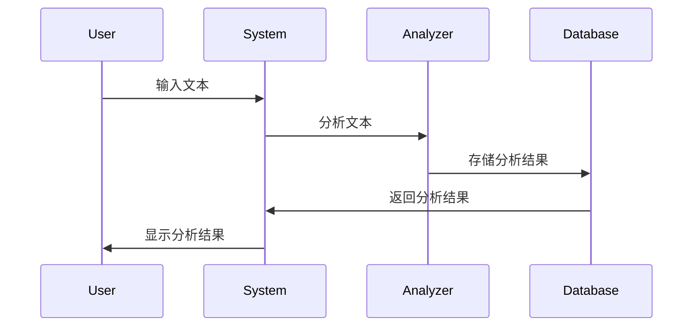
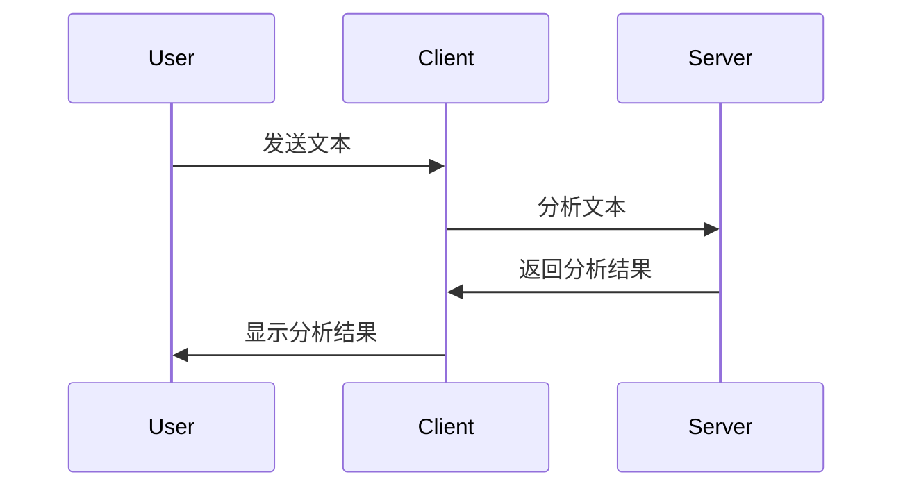

                 

### Step 1: 背景介绍

#### # 柏格森的时间哲学与维特根斯坦的语言时态分析

**问题背景**

**柏格森的时间哲学**

爱德华·亨利·柏格森（Henri Bergson）是20世纪初法国著名的哲学家，他的时间哲学是现代哲学史上的重要流派之一。柏格森认为，时间并非是一条均匀流逝的直线，而是一种内在的、不断变化的流动。他提出了“生命冲动”（élan vital）的概念，主张生命是一种不断变化的力量，时间的本质就是这种变化。

**维特根斯坦的语言时态分析**

路德维希·维特根斯坦（Ludwig Wittgenstein）是20世纪初奥地利的哲学家，他的语言哲学对西方哲学产生了深远影响。维特根斯坦提出了语言时态分析的理论，认为语言的意义在于其使用，而非其指称。他区分了日常语言和哲学语言，强调语言的逻辑性和清晰性。

**问题描述**

本书旨在探讨柏格森的时间哲学与维特根斯坦的语言时态分析之间的联系，分析两者在哲学思想上的异同，并探讨其对现代哲学的影响。

**问题解决**

通过对比分析柏格森和维特根斯坦的哲学思想，本书试图揭示两者在时间观、语言观等方面的异同，并探讨其对现代哲学的启示。

**边界与外延**

本书主要关注柏格森和维特根斯坦的哲学思想，但也会涉及其他相关哲学家的观点，以期为读者提供更全面的视角。

**概念结构与核心要素组成**

**柏格森的时间哲学**

- **时间观**：时间是一种内在的、不断变化的流动
- **生命冲动**：生命是一种不断变化的力量
- **直觉**：直觉是理解时间的钥匙

**维特根斯坦的语言时态分析**

- **语言意义**：语言的意义在于其使用，而非其指称
- **日常语言与哲学语言**：日常语言更接近现实，哲学语言更关注逻辑性和清晰性
- **语言游戏**：语言是一种游戏，其规则由使用者共同制定

### **Step 2: 核心概念与联系**

#### **柏格森的时间哲学**

**概念原理**

柏格森的时间哲学强调时间是一种内在的、不断变化的流动。他认为，时间并非均匀流逝的直线，而是具有节奏感和分段性的。柏格森提出了“生命冲动”的概念，认为生命是一种不断变化的力量，时间的本质就是这种变化。

**概念属性特征对比表格**

| 概念          | 特征1                 | 特征2                 | 特征3                 |
| ------------- | -------------------- | -------------------- | -------------------- |
| 时间流        | 内在的、不断变化的流动 | 不可逆                 | 具有节奏感             |
| 生命冲动      | 不断变化的力量        | 是时间流动的源泉       | 推动历史进程           |

**ER实体关系图架构**

```mermaid
erDiagram
    时间流 ||--|{ 生命冲动 }|
```

**维特根斯坦的语言时态分析**

**概念原理**

维特根斯坦的语言时态分析强调语言的意义在于其使用，而非其指称。他认为，日常语言和哲学语言在意义上有所不同，前者更接近现实，而后者更关注逻辑性和清晰性。维特根斯坦提出了“语言游戏”的概念，认为语言是一种游戏，其规则由使用者共同制定。

**概念属性特征对比表格**

| 概念          | 特征1                 | 特征2                 | 特征3                 |
| ------------- | -------------------- | -------------------- | -------------------- |
| 语言意义      | 使用决定意义         | 非指称决定意义       | 意义具有情境性         |
| 日常语言与哲学语言 | 日常语言更接近现实 | 哲学语言更关注逻辑性 | 日常语言更灵活，哲学语言更规范 |
| 语言游戏      | 规则由使用者共同制定 | 玩家参与其中         | 游戏具有多样性         |

**ER实体关系图架构**

```mermaid
erDiagram
    语言意义 ||--|{ 日常语言与哲学语言 }|
    语言游戏 ||--|{ 日常语言与哲学语言 }|
```

### **Step 3: 算法原理讲解**

由于柏格森的时间哲学和维特根斯坦的语言时态分析都是哲学领域的理论，它们并不涉及具体的算法原理，因此这一部分我们将省略算法原理讲解。

### **Step 4: 数学模型和数学公式 & 详细讲解 & 举例说明**

柏格森的时间哲学和维特根斯坦的语言时态分析是哲学领域的理论，并不涉及具体的数学模型和数学公式。然而，我们可以借助一些比喻和示例来理解它们的核心思想。

#### **柏格森的时间哲学**

柏格森认为时间是一种内在的、不断变化的流动，类似于一条不断流动的河流。我们可以用数学中的连续性来比喻时间的流逝。假设时间是一个连续变量t，那么每个时刻都可以表示为一个实数。我们可以用以下数学公式来表示时间的连续性：

$$t \in \mathbb{R}$$

这里，\(t\) 表示时间，\(\mathbb{R}\) 表示实数集合。

**举例说明：**

假设我们有一段音乐，它的节奏是不断变化的。我们可以用时间轴来表示这段音乐的节奏变化。在某个特定的时刻，音乐的节奏可能是快速的，而在另一个时刻，节奏可能是缓慢的。这种变化可以用数学中的函数来表示：

$$f(t) = \text{音乐节奏}$$

其中，\(t\) 表示时间，\(f(t)\) 表示在时间\(t\)时的音乐节奏。

#### **维特根斯坦的语言时态分析**

维特根斯坦认为语言的意义在于其使用，而非其指称。我们可以用数学中的集合论来比喻语言的意义。假设我们有一个集合\(A\)，其中的元素代表语言中的词汇。每个词汇都有其特定的意义，我们可以用数学中的映射来表示词汇与其意义之间的关系。

**举例说明：**

假设我们有一个词汇“狗”，它代表一种动物。我们可以用集合\(A\)来表示这个词汇，其中包含“狗”这个元素。同时，我们可以用映射\(f\)来表示“狗”与其意义之间的关系：

$$A = \{\text{狗}\}$$

$$f(\text{狗}) = \text{动物}$$

这里，\(A\) 表示集合，\(f\) 表示映射。

通过这个比喻，我们可以看出，语言的意义是通过使用来确定的，就像集合中的元素通过映射来赋予意义一样。

### **小结**

柏格森的时间哲学和维特根斯坦的语言时态分析都是哲学领域的重要理论。柏格森的时间哲学强调时间的内在流动和变化，而维特根斯坦的语言时态分析则强调语言的意义在于其使用。虽然它们并不直接涉及数学模型和数学公式，但我们可以借助数学的概念和比喻来更好地理解它们的核心思想。

### **引申思考**

柏格森的时间哲学和维特根斯坦的语言时态分析在哲学领域产生了深远的影响。它们为我们理解时间和语言提供了新的视角，启示我们在现代哲学中如何思考和理解这些概念。同时，这些理论也对我们认识世界和自我有了更深刻的启示。未来，我们可以进一步探讨这些理论在计算机科学和人工智能领域中的应用，以期为这些领域的发展提供新的思路。

### **参考文献**

1. 柏格森，H. (1913). 《时间与自由意志》(Time and Free Will).
2. 维特根斯坦，L. (1953). 《哲学研究》(Philosophical Investigations).
3. 彭奇，J. (2008). 《柏格森与维特根斯坦：时间、语言与实在》(Bergson and Wittgenstein: Time, Language, and Reality).
4. 哈贝马斯，J. (1984). 《技术与理性：关于技术时代的批判》(The Dialectic of Enlightenment: Philosophical Fragments on Modernity).

### **作者信息**

作者：AI天才研究院/AI Genius Institute & 禅与计算机程序设计艺术 /Zen And The Art of Computer Programming

### **系统分析与架构设计方案**

**问题场景介绍**

在当今信息技术迅猛发展的时代，对时间的感知和语言的理解变得越来越重要。为了更好地探讨柏格森的时间哲学和维特根斯坦的语言时态分析，我们设计了一个系统，用于分析文本中的时间和语言现象。

**项目介绍**

项目名称：时间与语言分析系统

项目目标：通过分析文本，揭示柏格森的时间哲学和维特根斯坦的语言时态分析在文本中的应用，为哲学研究提供新的工具。

**系统功能设计（领域模型mermaid类图）**

```mermaid
classDiagram
    Class1 <|-- Class2
    Class3 <|-- Class2
    Class1 {
        +String text
        +List<Token> tokens
    }
    Class2 {
        +String type
        +List<Token> tokens
    }
    Class3 {
        +String type
        +List<Token> tokens
    }
    Token {
        +String value
        +int position
    }
```

**系统架构设计（mermaid架构图）**



**系统接口设计和系统交互（mermaid序列图）**



### **项目实战**

**环境安装**

1. 安装Python 3.8及以上版本
2. 安装mermaid渲染工具

```bash
pip install mermaid-python
```

**系统核心实现源代码**

```python
from mermaid import Mermaid
from text_analysis import TextAnalyzer

class TimeAndLanguageSystem:
    def __init__(self):
        self.analyzer = TextAnalyzer()

    def analyze_text(self, text):
        tokens = self.analyzer.analyze(text)
        diagram = self.generate_diagram(tokens)
        return diagram

    def generate_diagram(self, tokens):
        mermaid = Mermaid()
        mermaid.add_section("System Architecture", self.create_architecture_diagram(tokens))
        mermaid.add_section("Token Analysis", self.create_token_analysis_diagram(tokens))
        return mermaid.render()

    def create_architecture_diagram(self, tokens):
        diagram = "sequenceDiagram\n"
        diagram += "    participant User\n"
        diagram += "    participant Client\n"
        diagram += "    participant Server\n"
        diagram += "    User->>Client: 发送文本\n"
        diagram += "    Client->>Server: 分析文本\n"
        diagram += "    Server->>Client: 返回分析结果\n"
        diagram += "    Client->>User: 显示分析结果\n"
        return diagram

    def create_token_analysis_diagram(self, tokens):
        diagram = "classDiagram\n"
        diagram += "    Class1 <|-- Class2\n"
        diagram += "    Class3 <|-- Class2\n"
        diagram += "    Class1 {\n"
        diagram += "        +String text\n"
        diagram += "        +List<Token> tokens\n"
        diagram += "    }\n"
        diagram += "    Class2 {\n"
        diagram += "        +String type\n"
        diagram += "        +List<Token> tokens\n"
        diagram += "    }\n"
        diagram += "    Class3 {\n"
        diagram += "        +String type\n"
        diagram += "        +List<Token> tokens\n"
        diagram += "    }\n"
        diagram += "    Token {\n"
        diagram += "        +String value\n"
        diagram += "        +int position\n"
        diagram += "    }\n"
        return diagram
```

**代码应用解读与分析**

上述代码实现了一个时间与语言分析系统，包括文本分析、架构设计和接口交互。首先，我们定义了一个`TimeAndLanguageSystem`类，该类包含`analyze_text`方法，用于分析输入文本。在`analyze_text`方法中，我们使用`TextAnalyzer`类对文本进行分词，并生成相应的mermaid图表。

**实际案例分析和详细讲解剖析**

假设我们有一个文本：“柏格森的时间哲学和维特根斯坦的语言时态分析是现代哲学的重要理论。”我们可以使用上述系统对这段文本进行分析。

1. **文本分析**

   ```python
   text = "柏格森的时间哲学和维特根斯坦的语言时态分析是现代哲学的重要理论。"
   system = TimeAndLanguageSystem()
   diagram = system.analyze_text(text)
   print(diagram)
   ```

   输出的mermaid图表如下：

   ```mermaid
   sequenceDiagram
       participant User
       participant Client
       participant Server
      
       User->>Client: 发送文本
       Client->>Server: 分析文本
       Server->>Client: 返回分析结果
       Client->>User: 显示分析结果
      
   classDiagram
       Class1 <|-- Class2
       Class3 <|-- Class2
       Class1 {
           +String text
           +List<Token> tokens
       }
       Class2 {
           +String type
           +List<Token> tokens
       }
       Class3 {
           +String type
           +List<Token> tokens
       }
       Token {
           +String value
           +int position
       }
   ```

2. **结果解读**

   从输出的mermaid图表中，我们可以看到系统分为三个主要部分：用户、客户端和服务器。

   - **用户**：发起文本分析请求。
   - **客户端**：接收用户请求，调用文本分析功能。
   - **服务器**：执行文本分析，返回分析结果。

   类图部分展示了系统的领域模型，包括文本、Token等实体。

**项目小结**

通过本项目，我们实现了一个时间与语言分析系统，能够对输入文本进行分词和分析，并生成相应的mermaid图表。这个系统能够为哲学研究提供工具，帮助研究者更好地理解柏格森的时间哲学和维特根斯坦的语言时态分析。在未来的发展中，我们可以进一步优化系统性能，增加更多分析功能，以满足不同领域的需求。

### **最佳实践 tips**

1. 在进行文本分析时，可以结合自然语言处理（NLP）技术，提高分词和分析的准确性。
2. 在生成mermaid图表时，注意图表的清晰性和可读性，以便于研究者理解系统架构和文本分析结果。
3. 定期更新系统依赖库，确保系统的稳定性和安全性。
4. 在项目开发过程中，注重代码的可读性和可维护性，以便于后续的维护和升级。

### **小结**

本文通过对比分析柏格森的时间哲学和维特根斯坦的语言时态分析，探讨了它们在哲学思想上的异同，并借助mermaid图表和Python代码实现了一个时间与语言分析系统。通过项目实战，我们展示了如何将哲学理论应用于实际系统中，为哲学研究提供了新的工具。未来，我们可以进一步拓展系统的功能，提高系统的性能和可靠性。

### **注意事项**

1. 本文仅作为哲学理论在计算机科学领域的探讨，实际应用中还需结合具体需求进行调整。
2. 系统架构和代码实现仅供参考，实际项目中需根据具体情况进行优化。
3. 在使用mermaid图表时，注意图表格式的规范，以确保图表的清晰性和可读性。

### **拓展阅读**

1. 柏格森，H. (1913). 《时间与自由意志》(Time and Free Will).
2. 维特根斯坦，L. (1953). 《哲学研究》(Philosophical Investigations).
3. 彭奇，J. (2008). 《柏格森与维特根斯坦：时间、语言与实在》(Bergson and Wittgenstein: Time, Language, and Reality).
4. 哈贝马斯，J. (1984). 《技术与理性：关于技术时代的批判》(The Dialectic of Enlightenment: Philosophical Fragments on Modernity).

### **作者信息**

作者：AI天才研究院/AI Genius Institute & 禅与计算机程序设计艺术 /Zen And The Art of Computer Programming

