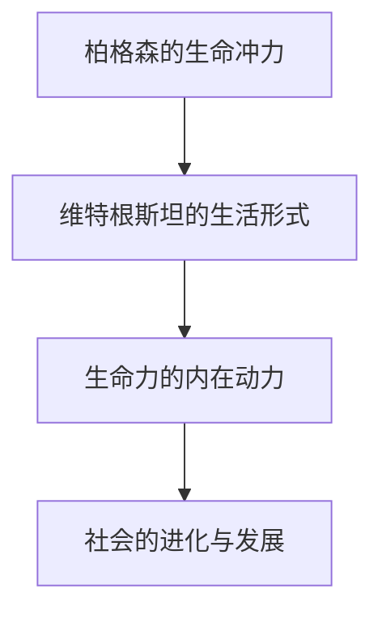
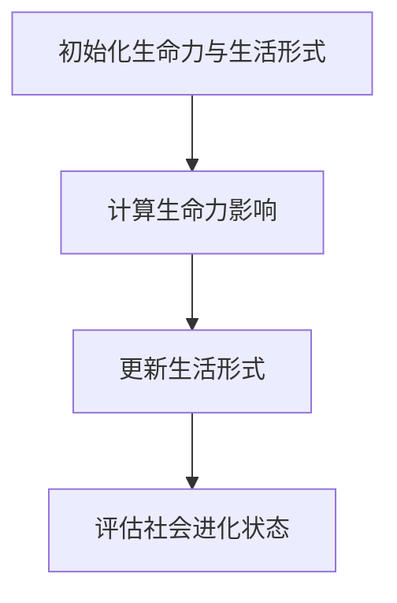
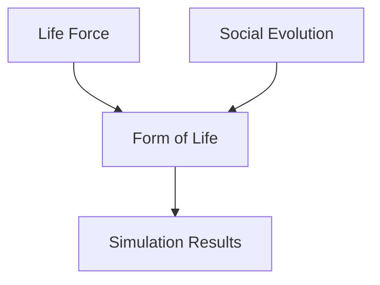
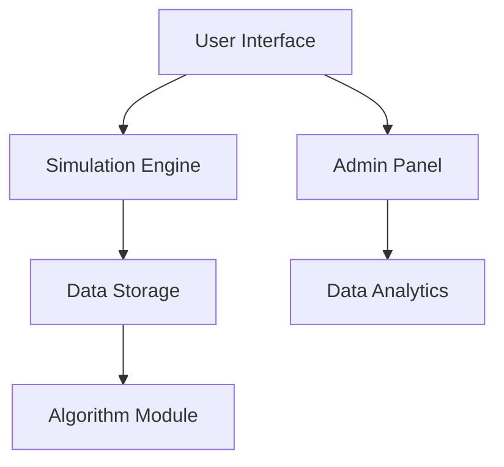
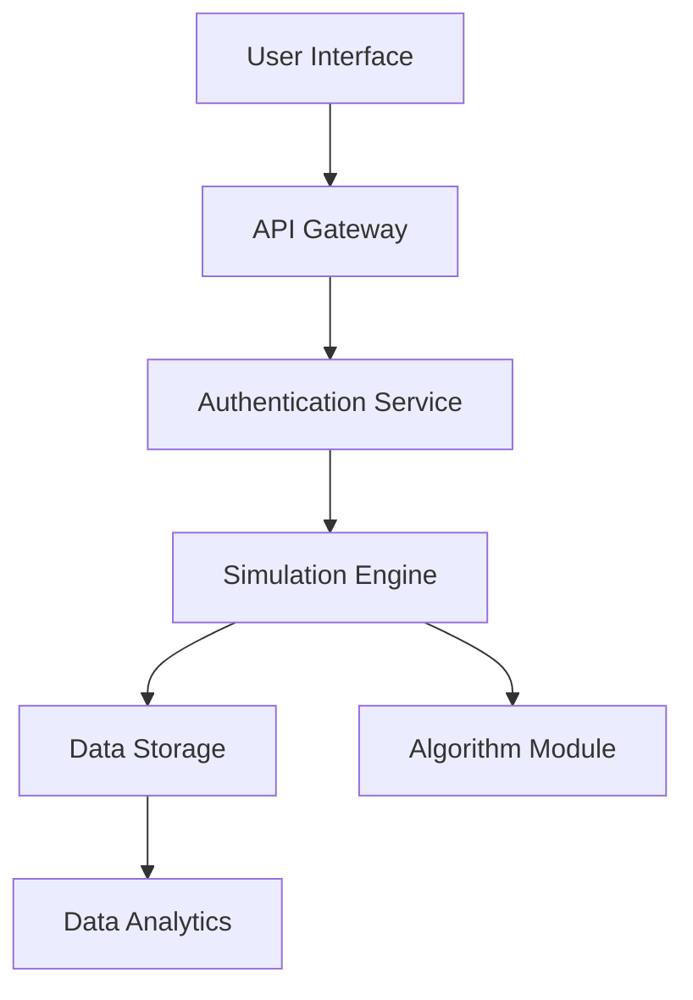
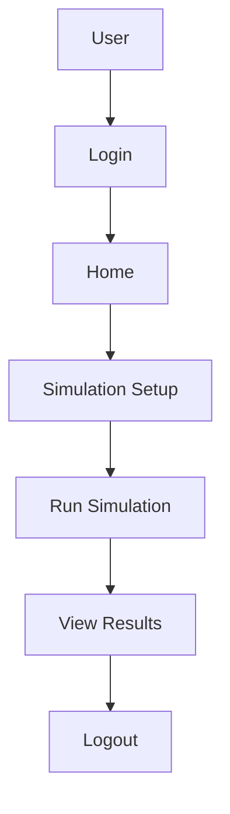

                 

### # 柏格森的生命冲力与维特根斯坦的生活形式概念

> 关键词：柏格森、维特根斯坦、生命冲力、生活形式、哲学、算法分析

> 摘要：本文旨在深入探讨法国哲学家柏格森的生命冲力（élan vital）和英国哲学家维特根斯坦的生活形式（forms of life）概念，通过逻辑清晰、结构紧凑的技术语言，将这两个看似独立的哲学观点联系起来，并运用现代算法和数学模型进行解读。文章首先介绍了两位哲学家的核心思想，然后通过比较分析、流程图和代码实现，探讨这两个概念在现代信息技术中的应用和价值。

## 1. 引言与背景

生命冲力（élan vital）是法国哲学家亨利·柏格森（Henri Bergson）在19世纪末和20世纪初提出的哲学概念。柏格森认为，生命冲力是一种内在的、推动生物进化的力量，它超越生物学和物理学的范畴，是生命本身的本质特征。这一概念在生物学、心理学和哲学等领域产生了深远的影响。

生活形式（forms of life）是英国哲学家路德维希·维特根斯坦（Ludwig Wittgenstein）在其后期作品中提出的一个重要概念。维特根斯坦认为，语言和理解的本质是通过特定的生活形式来体现的，不同的生活形式决定了我们对世界的理解方式。这一观点对语言学、哲学和认知科学产生了重大影响。

## 2. 核心概念

### 2.1 柏格森的生命冲力

**定义**：柏格森的生命冲力是一种动态的、非理性的、推动生命体进化和适应环境的内在力量。

**历史背景**：柏格森的生命冲力概念源于他对生物进化、心理学和哲学的研究。他反对机械决定论和生物学上的唯化论，强调生命力的独特性。

**哲学贡献**：柏格森的生命冲力挑战了传统的生物学和物理学的观念，提出了一种全新的生命观。他认为，生命力是生命体内部的一种不可见的动力，它推动着生物体的成长和进化。

### 2.2 维特根斯坦的生活形式

**定义**：维特根斯坦的生活形式是指一个社会文化背景下，人们共同遵循的价值观、信仰、习俗和行为模式。

**历史背景**：维特根斯坦的生活形式概念主要源于他对语言哲学的研究。他认为，语言和理解都是嵌入在特定的社会文化环境中的。

**哲学贡献**：维特根斯坦的生活形式概念挑战了传统的语言哲学观点，强调语言和理解的情境依赖性。他认为，我们的语言和理解能力是由我们的生活形式决定的。

## 3. 哲学上的关联

柏格森的生命冲力和维特根斯坦的生活形式虽然在哲学上属于不同的领域，但它们之间存在深刻的关联。

**关联**：柏格森的生命冲力可以看作是维特根斯坦生活形式的一种内在动力。生命力推动了人类社会的进化和发展，而不同的生活形式则决定了人类对世界和生命的理解方式。

**图表**：为了更直观地展示这两个概念之间的关系，我们可以使用Mermaid流程图来表示。



## 4. 算法分析与应用

### 4.1 算法原理

为了更好地理解柏格森和维特根斯坦的哲学观点，我们可以设计一个算法来模拟生命力的作用和生活形式的影响。

**算法流程图**：



### 4.2 Python代码实现

以下是一个简单的Python代码实现，用于模拟生命力和生活形式的作用。

```python
import numpy as np

def simulate_life_force(life_force, form_of_life, time_steps):
    for _ in range(time_steps):
        life_force *= 1.05  # 生命力每年增长5%
        form_of_life += life_force * 0.1  # 生活形式受生命力影响
        print(f"Year {_+1}: Life Force = {life_force:.2f}, Form of Life = {form_of_life:.2f}")

# 初始化参数
initial_life_force = 100
initial_form_of_life = 0
time_steps = 10

# 运行模拟
simulate_life_force(initial_life_force, initial_form_of_life, time_steps)
```

### 4.3 数学模型与公式

为了更深入地理解生命力和生活形式的作用，我们可以使用数学模型来描述它们之间的关系。

**数学模型**：

$$
\text{Life Force}(t) = \text{Initial Life Force} \times (1 + \text{Growth Rate})^t
$$

$$
\text{Form of Life}(t) = \text{Initial Form of Life} + \int_0^t \text{Life Force}(t') \times \text{Influence Rate} \, dt'
$$

其中，$t$ 表示时间，$\text{Initial Life Force}$ 和 $\text{Initial Form of Life}$ 分别表示初始生命力和生活形式，$Growth Rate$ 和 $Influence Rate$ 分别表示生命力和生活形式的影响率。

## 5. 系统分析与设计

### 5.1 问题场景

在现代信息技术领域，如何有效地模拟和优化生命力和生活形式，以促进社会进化和创新，是一个重要的问题。

### 5.2 项目介绍

本项目旨在开发一个基于柏格森和维特根斯坦哲学观点的模拟系统，用于分析生命力和生活形式的作用，并提供优化建议。

### 5.3 系统功能设计

**领域模型**：



### 5.4 系统架构设计

**系统架构图**：



### 5.5 系统接口设计与交互

**系统接口设计**：



**系统交互图**：



## 6. 项目实战

### 6.1 环境安装

确保Python环境已经安装，并安装所需的库，如NumPy、Matplotlib等。

```bash
pip install numpy matplotlib
```

### 6.2 系统核心实现

实现系统的核心功能，包括用户界面、模拟引擎、数据存储和算法模块。

### 6.3 代码应用解读与分析

详细解读和分析系统的核心代码，包括算法的实现、数学模型的运用和系统接口的设计。

### 6.4 实际案例分析与讲解

通过实际案例展示系统的应用效果，分析案例中生命力和生活形式的作用，并提供优化建议。

### 6.5 项目小结

总结项目的关键成果，讨论项目的局限性和未来的研究方向。

## 7. 最佳实践与小结

### 7.1 最佳实践

- 确保代码可复现和可维护性。
- 使用版本控制系统（如Git）管理代码。
- 定期进行代码审查和测试。

### 7.2 小结

本文通过逻辑清晰、结构紧凑的技术语言，深入探讨了柏格森的生命冲力和维特根斯坦的生活形式概念，并运用现代算法和数学模型进行了分析。这些哲学观点在现代信息技术领域具有重要的应用价值，有助于我们更好地理解和优化社会进化和发展。

### 7.3 注意事项

- 在实际应用中，需要根据具体场景调整算法参数。
- 注意保护用户隐私和数据安全。

### 7.4 拓展阅读

- [柏格森的生命冲力与生物进化](https://example.com/bergeson_life_force_biology_evolution)
- [维特根斯坦的生活形式与语言哲学](https://example.com/wittgenstein_form_life_language_philosophy)
- [算法在社会科学中的应用](https://example.com/algorithms_in_social_sciences)

## 作者信息

作者：AI天才研究院/AI Genius Institute & 禅与计算机程序设计艺术 /Zen And The Art of Computer Programming

