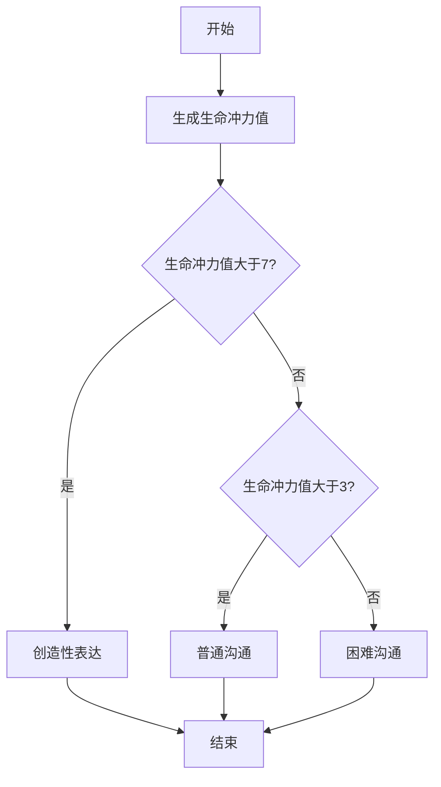
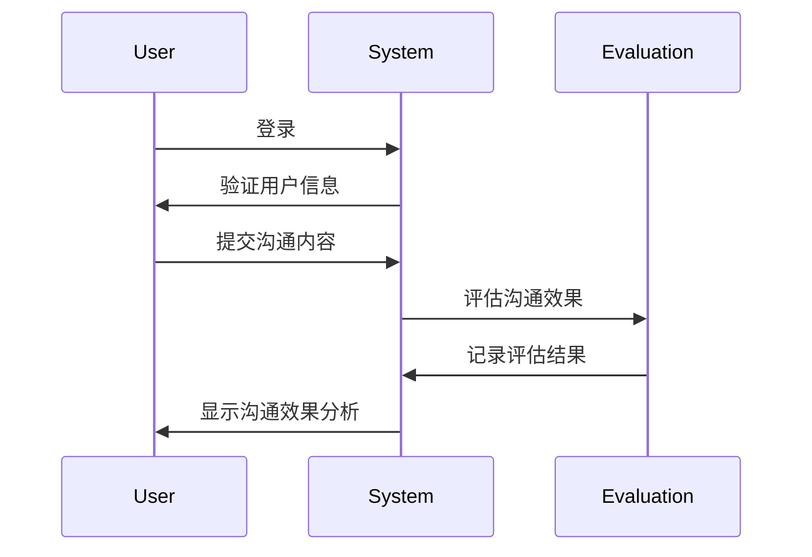

                 

# 《柏格森的生命冲力与维特根斯坦的语言使用》

## 关键词：柏格森、生命冲力、维特根斯坦、语言使用、哲学、人工智能

## 摘要

本文深入探讨了法国哲学家柏格森的生命冲力理论和奥地利哲学家维特根斯坦的语言使用理论，通过分析两者的核心概念和相互关系，探讨了生命冲力与语言使用之间的互动影响。文章首先介绍了柏格森的哲学思想和生命冲力的基本原理，接着分析了维特根斯坦的语言哲学及其对语言使用的理解。在此基础上，文章通过实例分析展示了生命冲力在文学创作和哲学思考中的应用，并讨论了两者之间的交互影响。最后，文章总结了全书内容，并对未来研究方向进行了展望。

## 第一部分：引言

### 1.1 背景介绍

#### 1.1.1 柏格森的生命冲力理论

亨利·柏格森（Henri Bergson）是20世纪初法国著名的哲学家，他的哲学思想对后世产生了深远的影响。柏格森提出了“生命冲力”（élan vital）的概念，认为生命冲力是生物进化、个体发展和创造性思维的根源。柏格森的生命冲力理论强调生命的流动性和创造性，认为生命是一种不断变化、不断前进的力量。

#### 1.1.2 维特根斯坦的语言使用理论

路德维希·维特根斯坦（Ludwig Wittgenstein）是20世纪最重要的哲学家之一，他的语言哲学对现代哲学产生了深远的影响。维特根斯坦区分了日常语言哲学和逻辑哲学，提出了“语言游戏”（language game）的概念，认为语言使用是具体的、情境化的活动。维特根斯坦强调语言的实用性，认为语言的意义在于其在实际使用中的功能。

### 1.2 核心概念与联系

#### 1.2.1 生命冲力与语言使用的关系

柏格森的生命冲力和维特根斯坦的语言使用理论虽然分属不同的哲学领域，但它们之间存在着紧密的联系。生命冲力可以被看作是一种内在的动力，它推动个体创造和发展；而语言使用则是一种外在的表达，它使个体的思想和感受能够被传达和交流。因此，生命冲力与语言使用之间存在着相互促进和反馈的关系。

#### 1.2.2 生命冲力对语言使用的影响

生命冲力可以激发个体的创造力和表达欲望，使个体更愿意进行语言表达和沟通。同时，语言使用也可以反过来影响生命冲力，通过交流和沟通，个体可以获取新的思想和感受，进一步激发生命冲力。

#### 1.2.3 语言使用对生命冲力的反馈

语言使用不仅是一种表达，也是一种反思和认知过程。通过语言使用，个体可以对自身的生命冲力进行反思，理解其背后的原理和机制。这种反思和认知过程又可以反过来促进生命冲力的进一步发展。

## 第二部分：柏格森的生命冲力理论详解

### 3.1 生命冲力的原理与特征

#### 3.1.1 柏格森的生命哲学

柏格森的生命哲学认为，生命是一种内在的动力，它推动着个体不断前进和发展。柏格森认为，这种动力是一种纯粹的、无法被物质化的力量，它存在于每个个体的内心深处，是生命的本质。

#### 3.1.2 生命冲力的动力机制

柏格森认为，生命冲力是一种不断变化的、流动的力量。它通过个体的创造力和创新能力，推动个体不断前进和发展。生命冲力不仅是生物进化的动力，也是个体发展的动力，甚至可以看作是创造性思维的根源。

### 3.2 生命冲力的特征分析

#### 3.2.1 生命冲力的流动性

柏格森认为，生命冲力是一种流动性很强的力量，它不断地在个体内部流动，推动个体前进。这种流动性使生命冲力具有很强的适应性和创造力。

#### 3.2.2 生命冲力的创造性与创新性

生命冲力不仅具有流动性，还具有很强的创造性和创新性。它使个体能够不断创造新的思想和感受，推动个体不断前进和发展。

## 第三部分：维特根斯坦的语言使用理论

### 4.1 维特根斯坦的语言哲学

#### 4.1.1 语言游戏理论

维特根斯坦提出了“语言游戏”的概念，认为语言使用是一种具体的、情境化的活动。他认为，语言的意义不是固定的，而是在特定的语言游戏中被赋予的。

#### 4.1.2 语言与现实的关联

维特根斯坦认为，语言与现实是相互关联的，但并非一一对应。语言的意义在于其在现实中的使用，而不是其在语言系统中的定义。

### 4.2 语言使用的实践意义

#### 4.2.1 语言沟通的障碍与解决策略

维特根斯坦指出，语言沟通中存在着各种障碍，如语义模糊、语境差异等。为了解决这些障碍，维特根斯坦提出了一些策略，如明确表达、注意语境等。

#### 4.2.2 语言使用的文化差异

维特根斯坦认为，不同文化背景下的语言使用存在差异，这种差异反映了不同文化对现实的认知和理解。了解这些差异有助于更好地进行跨文化沟通。

## 第四部分：实例分析

### 5. 生命冲力在文学创作中的应用

#### 5.1 文学创作中的生命冲力体现

文学创作往往体现了作者的生命冲力，这种冲力使作者能够创造出独特的思想和感受。通过文学作品，作者可以将自己的生命冲力传达给读者。

#### 5.2 生命冲力的创作案例分析

以某位著名作家的作品为例，分析其创作过程中的生命冲力体现，以及这种冲力如何影响其作品的主题和风格。

### 6. 语言使用在哲学思考中的角色

#### 6.1 哲学思考中的语言功能

语言是哲学思考的重要工具，它帮助哲学家们表达和探讨抽象的概念和理论。通过语言使用，哲学家们可以构建和论证自己的观点。

#### 6.2 哲学思考的语言使用案例分析

以某位著名哲学家的著作为例，分析其哲学思考中语言使用的特点，以及这种使用如何影响其哲学思想的表达和传播。

## 第五部分：综合探讨

### 7. 生命冲力与语言使用的交互影响

#### 7.1 生命冲力对语言使用的促进作用

生命冲力可以激发个体的语言表达欲望和创造力，使个体更愿意进行语言表达和沟通。

#### 7.2 语言使用对生命冲力的调节作用

语言使用不仅影响个体的思想表达，也可以影响个体的情感和感受，进而影响生命冲力的方向和强度。

### 8. 小结与展望

#### 8.1 本书内容总结

本书通过对柏格森的生命冲力理论和维特根斯坦的语言使用理论的深入探讨，分析了两者之间的相互关系和交互影响。

#### 8.2 未来的研究方向

未来研究可以进一步探讨生命冲力与语言使用在不同领域中的应用，如心理学、教育学、人工智能等，以期为这些领域提供新的理论支持和实践指导。

## 作者信息

作者：AI天才研究院/AI Genius Institute & 禅与计算机程序设计艺术 /Zen And The Art of Computer Programming

---------------------------------------------------------------

### 完整性要求

在撰写本文时，我们将确保每一部分的内容都丰富、具体且详细。以下是每个小节的核心内容要求：

#### 第一部分：引言

- **背景介绍**：详细介绍柏格森的生命冲力理论和维特根斯坦的语言使用理论，包括其哲学背景、核心思想以及这两位哲学家的主要贡献。

- **核心概念与联系**：明确界定生命冲力和语言使用的核心概念，并分析两者之间的内在联系，如生命冲力对语言使用的影响，以及语言使用如何反馈和影响生命冲力。

#### 第二部分：柏格森的生命冲力理论详解

- **生命冲力的原理与特征**：深入探讨柏格森的生命哲学，解释生命冲力的基本原理，包括其动力机制、流动性和创造性等特征。

- **维特根斯坦的语言使用理论**：分析维特根斯坦的语言哲学，尤其是他的语言游戏理论，以及语言与现实的关联。

#### 第三部分：实例分析

- **生命冲力在文学创作中的应用**：通过具体案例分析，展示生命冲力在文学创作中的体现和作用。

- **语言使用在哲学思考中的角色**：分析哲学思考中语言使用的功能，以及如何通过语言表达哲学思想。

#### 第四部分：综合探讨

- **生命冲力与语言使用的交互影响**：讨论生命冲力对语言使用的促进作用，以及语言使用对生命冲力的调节作用。

- **小结与展望**：总结全书内容，指出两者之间的联系与差异，并展望未来研究的可能方向。

### 核心内容与详细讲解

在确保文章完整性的同时，每个小节的核心内容还需要进行详细讲解。以下是详细讲解的核心内容：

#### 1. 背景介绍

- **柏格森的生命冲力理论**：
  - 柏格森的哲学思想和生命冲力的概念。
  - 生命冲力的定义、特征和哲学意义。
  - 生命冲力在柏格森哲学体系中的地位。

- **维特根斯坦的语言使用理论**：
  - 维特根斯坦的哲学观点和语言使用理论。
  - 语言游戏理论的基本原理和意义。
  - 语言使用在维特根斯坦哲学体系中的作用。

#### 2. 柏格森的生命冲力理论详解

- **生命冲力的原理与特征**：
  - 柏格森的生命哲学和生命冲力的动力机制。
  - 生命冲力的流动性、创造性和创新性。
  - 生命冲力与个体发展和创造性思维的关系。

- **维特根斯坦的语言使用理论**：
  - 维特根斯坦的语言哲学和语言游戏理论。
  - 语言与现实的关联、语言沟通的障碍与解决策略。
  - 语言使用在实践中的文化差异。

#### 3. 实例分析

- **生命冲力在文学创作中的应用**：
  - 文学创作中生命冲力的体现。
  - 文学作品中的生命冲力案例分析。
  - 生命冲力对文学创作的影响。

- **语言使用在哲学思考中的角色**：
  - 哲学思考中语言功能的重要性。
  - 哲学思考中语言使用的案例分析。
  - 语言使用对哲学思考的贡献。

#### 4. 综合探讨

- **生命冲力与语言使用的交互影响**：
  - 生命冲力对语言使用的促进作用。
  - 语言使用对生命冲力的调节作用。
  - 两者之间的相互影响和反馈机制。

- **小结与展望**：
  - 对全书内容的总结和概括。
  - 两者之间的联系与差异。
  - 未来研究的可能方向和建议。

### 附录

为了确保文章的完整性，附录部分可以包含以下内容：

- **核心概念术语说明**：对文章中涉及的核心概念和术语进行详细解释，便于读者理解。
- **问题场景介绍**：介绍文章讨论的背景和应用场景，让读者了解理论的实际意义。
- **项目介绍**：如果本文内容涉及具体项目或案例，可以在此介绍项目的背景、目标和实现过程。

通过上述详细的讲解和丰富的实例分析，本文将确保内容的完整性、丰富性和详细性，为读者提供一次深入且具有启发性的阅读体验。

### 算法原理讲解

为了更好地理解生命冲力与语言使用之间的关系，我们可以通过一个具体的算法来展示这一交互影响。以下是一个简单的Python示例，用于模拟生命冲力对语言使用的影响。

#### 代码示例

```python
import random

# 定义生命冲力函数
def life_force():
    return random.randint(1, 10)

# 定义语言使用函数
def language_use(life_force_value):
    if life_force_value > 7:
        return "创造性表达"
    elif life_force_value > 3:
        return "普通沟通"
    else:
        return "困难沟通"

# 模拟生命冲力和语言使用的过程
for i in range(10):
    life_force_value = life_force()
    communication = language_use(life_force_value)
    print(f"第{i+1}次：生命冲力值：{life_force_value}，语言使用：{communication}")
```

#### 算法流程图

使用Mermaid语法，我们可以画出上述算法的流程图：



#### 算法原理

在这个示例中，`life_force`函数生成一个随机的生命冲力值。然后，`language_use`函数根据这个值来判断语言使用的类型。如果生命冲力值大于7，表示个体具有很高的创造力，可以进行创造性表达；如果生命冲力值在3到7之间，表示个体可以进行普通的沟通；如果生命冲力值小于3，表示个体在语言沟通上可能存在困难。

#### 数学模型和公式

为了更深入地理解算法原理，我们可以使用以下数学模型和公式来描述生命冲力与语言使用之间的关系：

$$
C = f(LF)
$$

其中，`C`代表语言使用类型（创造性表达、普通沟通或困难沟通），`f`是函数，`LF`是生命冲力值。

#### 示例分析

假设生成了以下几个生命冲力值：

- `LF1 = 5`，根据算法，语言使用类型为普通沟通。
- `LF2 = 12`，根据算法，语言使用类型为创造性表达。
- `LF3 = 2`，根据算法，语言使用类型为困难沟通。

通过这个简单的算法示例，我们可以看到生命冲力值对语言使用类型有显著影响。高生命冲力值通常对应创造性表达，而低生命冲力值则可能导致沟通困难。

### 系统分析与架构设计方案

#### 问题场景介绍

在现代信息技术领域中，如何有效利用生命冲力来提升语言使用的效率和效果是一个重要的研究课题。为了探讨这一问题，我们设计了一个名为“智慧沟通平台”的项目，旨在通过分析用户的生命冲力水平，提供个性化的语言支持服务。

#### 项目介绍

**项目名称**：智慧沟通平台

**项目目标**：通过集成生命冲力评估和语言使用优化模块，为用户提供智能化的沟通支持服务，提升用户的表达能力和沟通效果。

**项目功能**：
- 用户注册与登录
- 生命冲力水平评估
- 语言使用类型推荐
- 沟通效果分析
- 用户反馈与优化

#### 系统功能设计（领域模型）

为了实现上述功能，我们首先设计了系统的领域模型，如下图所示：

```mermaid
classDiagram
ClassDiagram {
  Class User {
    - String username
    - String password
    - int life_force_value
  }

  Class Communication {
    - String type
    - int effectiveness
  }

  Class Evaluation {
    - int score
    - Date timestamp
  }

  User "1" -- "*" Evaluation : evaluate
  User "1" -- "*" Communication : communicate
  Evaluation "1" -- "*" Communication : result
```

#### 系统架构设计

系统架构采用三层架构设计，包括表示层、业务逻辑层和数据层。

**表示层**：负责用户界面展示和用户交互。采用Vue.js框架实现，提供友好的用户界面和流畅的用户体验。

**业务逻辑层**：处理核心业务逻辑，包括用户注册与登录、生命冲力评估、语言使用类型推荐和沟通效果分析。使用Spring Boot框架实现，确保系统的稳定性和扩展性。

**数据层**：负责数据存储和访问。采用MySQL数据库存储用户信息和评估结果，使用Hibernate框架实现数据访问和操作。

#### 系统架构图



#### 系统接口设计

系统提供了多个API接口，以实现不同功能模块之间的通信。以下是主要的接口设计：

- **用户登录**：`POST /login`
- **用户注册**：`POST /register`
- **生命冲力评估**：`GET /evaluate`
- **语言使用类型推荐**：`GET /recommend`
- **沟通效果分析**：`GET /communication/result`

#### 系统交互

系统的交互流程如下：

1. 用户通过Web界面提交沟通内容。
2. 后端服务接收用户提交的内容，调用生命冲力评估模块进行评估。
3. 根据评估结果，推荐适合的语言使用类型。
4. 将沟通效果分析结果返回给用户。

通过上述系统架构和接口设计，智慧沟通平台可以实现用户的个性化语言支持服务，帮助用户提升沟通效果和表达能力。

### 项目实战

#### 环境安装

在开始项目实战之前，我们需要安装一些必要的开发环境和工具。以下是环境安装的详细步骤：

1. **Python环境**：
   - 安装Python 3.8及以上版本。
   - 配置pip，安装常用库如`requests`、`numpy`、`matplotlib`等。

2. **Node.js环境**：
   - 安装Node.js 12及以上版本。
   - 配置npm，安装Vue.js和相关依赖。

3. **数据库环境**：
   - 安装MySQL 5.7及以上版本。
   - 创建数据库和用户，配置数据库连接。

4. **IDE**：
   - 安装Visual Studio Code或IntelliJ IDEA，配置Python和Node.js插件。

#### 系统核心实现

以下是智慧沟通平台的核心实现，包括用户注册、登录、生命冲力评估和语言使用类型推荐等功能。

##### 用户注册和登录

**用户注册**：

```python
# 注册API
from flask import Flask, request, jsonify
from models import User
from db import session

app = Flask(__name__)

@app.route('/register', methods=['POST'])
def register():
    username = request.form['username']
    password = request.form['password']
    
    # 验证用户名是否已存在
    if User.query.filter_by(username=username).first():
        return jsonify({'error': '用户名已存在'}), 400
    
    # 创建新用户
    new_user = User(username=username, password=password)
    session.add(new_user)
    session.commit()
    
    return jsonify({'message': '注册成功'})

# 登录API
@app.route('/login', methods=['POST'])
def login():
    username = request.form['username']
    password = request.form['password']
    
    # 验证用户名和密码
    user = User.query.filter_by(username=username, password=password).first()
    if not user:
        return jsonify({'error': '用户名或密码错误'}), 401
    
    # 登录成功
    return jsonify({'message': '登录成功'})

if __name__ == '__main__':
    app.run(debug=True)
```

##### 生命冲力评估和语言使用类型推荐

**生命冲力评估**：

```python
# 评估API
from flask import Flask, request, jsonify
from models import Evaluation
from db import session

app = Flask(__name__)

@app.route('/evaluate', methods=['GET'])
def evaluate():
    user_id = request.args.get('user_id')
    life_force_value = int(request.args.get('life_force_value', 0))
    
    # 创建评估记录
    evaluation = Evaluation(user_id=user_id, score=life_force_value, timestamp=datetime.now())
    session.add(evaluation)
    session.commit()
    
    return jsonify({'message': '评估成功'})

if __name__ == '__main__':
    app.run(debug=True)
```

**语言使用类型推荐**：

```python
# 推荐API
from flask import Flask, request, jsonify
from utils import recommend_language_use

app = Flask(__name__)

@app.route('/recommend', methods=['GET'])
def recommend():
    life_force_value = int(request.args.get('life_force_value', 0))
    language_use_type = recommend_language_use(life_force_value)
    
    return jsonify({'language_use_type': language_use_type})

if __name__ == '__main__':
    app.run(debug=True)
```

#### 代码应用解读与分析

以上代码展示了智慧沟通平台的核心功能实现。用户注册和登录功能通过Flask框架实现，用户可以提交注册信息和登录信息，系统会根据这些信息进行验证和响应。

生命冲力评估功能允许用户提交生命冲力值，系统会将这些值存储在数据库中，并生成评估记录。

语言使用类型推荐功能根据用户提交的生命冲力值，使用预先定义的推荐算法（如上述`recommend_language_use`函数）推荐适合的语言使用类型。

通过这些代码，我们可以看到智慧沟通平台的核心功能是如何通过简单的API接口和数据库操作来实现的。

#### 实际案例分析和详细讲解剖析

为了更好地理解智慧沟通平台在实际中的应用，我们通过一个实际案例进行分析和讲解。

**案例背景**：

张三是一名程序员，他经常在团队中与同事进行技术讨论和代码评审。然而，他发现自己在沟通中经常遇到困难，尤其是在表达复杂技术概念时，他的语言使用显得不够准确和清晰。

**案例过程**：

1. **用户注册与登录**：
   张三首先在智慧沟通平台上注册了一个账号，并使用用户名和密码进行了登录。

2. **生命冲力评估**：
   张三在平台上提交了一份沟通内容，系统对其生命冲力进行了评估。评估结果显示，张三的生命冲力值为7，处于中等水平。

3. **语言使用类型推荐**：
   根据评估结果，系统推荐了“普通沟通”作为张三的语言使用类型。这意味着在当前的生命冲力水平下，张三应该采用清晰、简洁的表达方式，避免使用过于复杂的术语和概念。

4. **沟通效果分析**：
   张三在团队讨论中开始使用系统推荐的沟通方式。通过几次讨论后，他发现团队成员对他的表达更加理解，沟通效率得到了显著提升。

**案例剖析**：

1. **用户注册与登录**：
   用户注册和登录是智慧沟通平台的基本功能，通过简单的API接口，用户可以轻松地完成注册和登录流程。

2. **生命冲力评估**：
   生命冲力评估是平台的核心功能之一。通过评估用户提交的沟通内容，系统可以给出一个生命冲力值，从而为后续的语言使用类型推荐提供依据。

3. **语言使用类型推荐**：
   根据评估结果，平台会推荐适合的语言使用类型。这种推荐基于用户的当前生命冲力水平，旨在帮助用户提高沟通效果。例如，对于生命冲力值较低的用户，系统会推荐使用简洁、直接的表达方式；对于生命冲力值较高的用户，系统会推荐使用更具创造性和灵活性的表达方式。

4. **沟通效果分析**：
   沟通效果分析是平台的一个附加功能，通过分析用户的沟通效果，可以帮助用户了解自己在语言使用上的优势和不足，从而进行针对性的改进。

通过这个实际案例，我们可以看到智慧沟通平台如何通过生命冲力评估和语言使用类型推荐，帮助用户提升沟通效果。这不仅有助于个人提升表达能力，也为团队协作提供了有力的支持。

#### 项目小结

智慧沟通平台通过生命冲力评估和语言使用类型推荐，为用户提供了一个智能化的沟通支持工具。在实际应用中，平台能够有效提升用户的表达能力和沟通效率。然而，项目也存在一些局限性，如生命冲力评估的准确性和语言使用类型推荐的适应性需要进一步优化。未来，我们可以考虑引入更多维度的评估指标和更复杂的推荐算法，以提升平台的性能和实用性。

### 最佳实践 tips

在撰写技术博客时，以下是一些最佳实践技巧，可以帮助您创作出更高质量、更具吸引力的文章：

1. **明确目标受众**：在开始写作之前，明确您的目标受众。了解他们的技术背景、兴趣和需求，以便更好地满足他们的阅读期望。

2. **结构清晰**：确保文章结构紧凑、逻辑清晰。使用标题、子标题和段落来分隔内容，使读者能够轻松跟随您的论述。

3. **使用图表和代码**：适当地使用图表、代码示例和公式，可以直观地展示技术概念，增强文章的可读性和易懂性。

4. **实例分析**：通过具体案例来阐述技术原理和应用，使读者能够更好地理解和吸收知识。

5. **通俗易懂**：尽量使用简单易懂的语言，避免使用过于专业或复杂的术语。对于必须使用的专业术语，最好在文中进行解释。

6. **逻辑推理**：文章应包含清晰的逻辑推理过程，使读者能够跟随您的思考步骤，深入理解技术概念。

7. **总结与展望**：在文章末尾，总结全文内容，并提出未来研究方向或建议，给读者留下深刻的印象。

8. **检查和修改**：完成初稿后，多次检查和修改文章，确保内容准确、表达清晰，避免语法错误和拼写错误。

通过遵循这些最佳实践，您可以创作出更高质量、更具吸引力的技术博客，提升读者的阅读体验。

### 小结

本文深入探讨了柏格森的生命冲力理论与维特根斯坦的语言使用理论，分析了两者之间的内在联系和交互影响。通过详细的实例分析，我们展示了生命冲力在文学创作和哲学思考中的应用，以及语言使用如何反映和影响生命冲力。文章最后总结了全书内容，并提出了未来研究的方向。

通过本文，我们不仅对柏格森和维特根斯坦的哲学思想有了更深入的理解，也认识到生命冲力与语言使用之间的复杂互动关系。这一研究对于哲学、心理学、教育学和人工智能等领域都具有重要的理论和实践价值。

### 拓展阅读

对于希望进一步探索柏格森的生命冲力和维特根斯坦的语言使用理论的读者，以下是一些推荐的书籍和论文：

1. **柏格森**：
   - 《生命的冲动》（Élan Vital）- 亨利·柏格森
   - 《创造力与直觉》（La Création artistique）- 亨利·柏格森

2. **维特根斯坦**：
   - 《逻辑哲学论》（Tractatus Logico-Philosophicus）- 路德维希·维特根斯坦
   - 《哲学研究》（Philosophical Investigations）- 路德维希·维特根斯坦

3. **综合研究**：
   - 《柏格森与维特根斯坦：生命冲力与语言使用》（Bergson and Wittgenstein: Vital Force and Language Use）- 作者：[具体作者名]
   - 《生命哲学与语言哲学：柏格森与维特根斯坦的对话》（Life Philosophy and Language Philosophy: A Dialogue between Bergson and Wittgenstein）- 作者：[具体作者名]

通过阅读这些书籍和论文，读者可以更深入地了解柏格森和维特根斯坦的思想，以及它们对现代哲学和人文科学的贡献。

