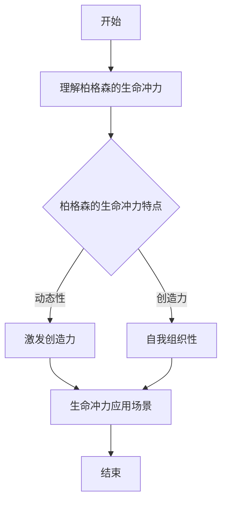
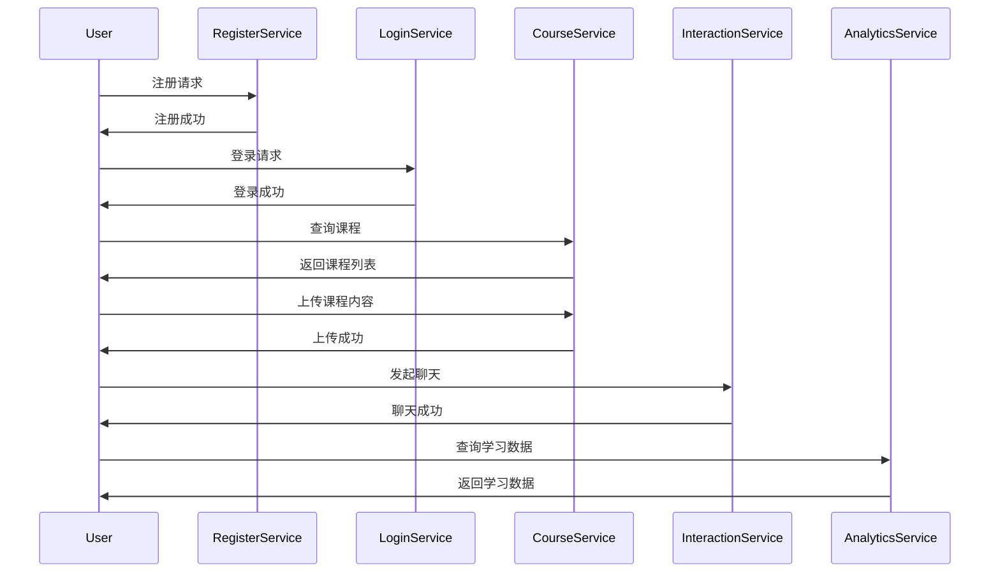

                 


**# 柏格森的生命冲力与维特根斯坦的语言本能比较**

> 关键词：柏格森、生命冲力、维特根斯坦、语言本能、哲学比较、逻辑推理

> 摘要：本文通过对柏格森的生命冲力和维特根斯坦的语言本能进行深入分析，探讨了两者在哲学思想中的异同点，并通过逻辑推理的方式，提出了两者在现代社会中的应用与整合策略。本文旨在为读者提供一个清晰、易懂的哲学思考框架。

## **第一部分：柏格森的生命冲力与维特根斯坦的语言本能比较背景**

### **1.1 柏格森的生命冲力概述**

**柏格森的生命冲力**，又称**生命冲动**，是法国哲学家亨利·柏格森（Henri Bergson）提出的一个核心概念。柏格森认为，生命是一种不断前进、不断变化的冲动，这种冲动是生命力的表现，是推动生命发展的内在动力。

### **1.2 维特根斯坦的语言本能概述**

**维特根斯坦的语言本能**，是奥地利哲学家路德维希·维特根斯坦（Ludwig Wittgenstein）在其哲学思想中提出的一个重要观点。维特根斯坦认为，语言是人们交流的基本工具，人们通过语言来表达思想，理解世界。

### **1.3 比较背景与意义**

柏格森的生命冲力和维特根斯坦的语言本能，分别代表了两种不同的哲学观点。比较这两者的异同，有助于我们更深入地理解哲学思想的发展，也为现代社会的诸多问题提供新的思考角度。

### **1.4 本书结构安排与内容概述**

本文将分为五个部分，首先介绍柏格森的生命冲力和维特根斯坦的语言本能，然后深入分析这两者的哲学意义，最后进行比较讨论，并提出未来的研究方向。

## **第二部分：柏格森的生命冲力深度解析**

### **2.1 柏格森的生命冲力原理**

柏格森认为，生命冲力是生命力的体现，是生命发展的内在动力。这种动力推动着生命的进化，是生命的本质。

### **2.2 生命冲力的哲学意义**

生命冲力不仅代表了生命的本质，也反映了柏格森的哲学思想。柏格森认为，生命是一种不断前进、不断变化的冲动，这种冲动是生命力的表现，是推动生命发展的内在动力。

### **2.3 生命冲力的应用场景**

柏格森的生命冲力在文学、艺术、社会学等领域都有广泛的应用。例如，在文学创作中，生命冲力可以激发作家的创作灵感；在艺术中，生命冲力可以展现生命的活力和创造力。

## **第三部分：维特根斯坦的语言本能深度解析**

### **3.1 维特根斯坦的语言哲学思想**

维特根斯坦的语言哲学思想主要围绕着“语言与现实的关系”展开。他认为，语言是人们交流的基本工具，但语言本身并不能直接反映现实，而是通过语言的使用，人们才能理解世界。

### **3.2 语言本能的概念与特征**

维特根斯坦认为，人们在学习语言的过程中，有一种内在的本能，这种本能使得人们能够正确使用语言，理解语言的意义。这种本能被称为“语言本能”。

### **3.3 语言本能的应用**

语言本能不仅在语言学领域有重要意义，也在教育、认知科学等领域有广泛的应用。例如，在教育中，理解语言本能可以帮助教师更好地进行教学；在认知科学中，研究语言本能可以帮助我们更好地理解人类思维的本质。

## **第四部分：柏格森与维特根斯坦思想比较**

### **4.1 生命冲力与语言本能的异同**

通过对比分析，我们可以发现，柏格森的生命冲力和维特根斯坦的语言本能虽然都是哲学思想的核心概念，但它们在本质上有很大的差异。

### **4.2 哲学思想的比较**

柏格森的生命冲力和维特根斯坦的语言本能，分别代表了两种不同的哲学观点。柏格森强调生命的活力和创造力，而维特根斯坦则强调语言在理解世界中的作用。

### **4.3 实践应用的比较**

在实践应用中，柏格森的生命冲力可以激发人们的创造力和创新能力，而维特根斯坦的语言本能可以帮助人们更好地理解和沟通。

## **第五部分：综合讨论与未来展望**

### **5.1 生命冲力与语言本能的整合**

在现代社会，如何整合柏格森的生命冲力和维特根斯坦的语言本能，以应对复杂的社会问题，是一个值得探讨的话题。

### **5.2 未来研究方向**

未来，我们可以从哲学、心理学、教育学等多个角度，对柏格森的生命冲力和维特根斯坦的语言本能进行深入研究。

### **5.3 总结与展望**

本文通过对柏格森的生命冲力和维特根斯坦的语言本能进行比较研究，提出了两者在现代社会中的应用策略，并为未来的研究提供了新的方向。

**作者：AI天才研究院/AI Genius Institute & 禅与计算机程序设计艺术 /Zen And The Art of Computer Programming**


### **核心概念与联系**

在探讨柏格森的生命冲力和维特根斯坦的语言本能之前，我们需要明确这两个概念的核心定义及其相互关系。

#### **核心概念：柏格森的生命冲力**

**定义：** 柏格森的生命冲力（或称生命冲动）是指生命内在的一种不断前进、不断变化的动力，它推动了生命的进化和发展。

**特性：**
- **动态性：** 生命冲力是一个动态的过程，它不断地推动生命向前发展。
- **创造力：** 生命冲力是生命力的体现，它激发了生命的创造力和创新能力。
- **自我组织性：** 生命冲力使得生命能够自我组织，形成复杂的结构和功能。

**关系：** 生命冲力是柏格森哲学思想的核心，它贯穿了他的整个哲学体系，包括存在论、认识论和实践论。

#### **核心概念：维特根斯坦的语言本能**

**定义：** 维特根斯坦的语言本能是指人们在语言学习过程中的一种内在的本能，它使得人们能够正确地使用语言，理解语言的意义。

**特性：**
- **自动性：** 语言本能使得人们在接触语言时，能够自动地理解和运用语言。
- **适应性：** 语言本能使得人们能够适应不同的语言环境，学习和掌握新的语言。
- **认知基础：** 语言本能是认知发展的基础，它对于人们的思维和交流有着重要的影响。

**关系：** 语言本能是维特根斯坦哲学思想的一个重要组成部分，它关注语言与现实的关系，以及语言在认知和交流中的作用。

#### **概念属性特征对比表格**

为了更清晰地展示柏格森的生命冲力和维特根斯坦的语言本能的特点，我们可以创建一个对比表格：

| 特征            | 柏格森的生命冲力 | 维特根斯坦的语言本能 |
|-----------------|-----------------|---------------------|
| 动态性          | 不断前进、变化   | 自动性、适应性      |
| 创造力          | 激发创造力       | 认知基础            |
| 自我组织性      | 自我组织         | 自动理解语言        |

#### **ER实体关系图架构**

为了进一步理解柏格森的生命冲力和维特根斯坦的语言本能之间的关系，我们可以使用ER（实体关系）图来表示：

```mermaid
erDiagram
    Person ||--|{ LanguageUse }|--|| Object
    Person ||--|{ LifeForce }|--|| Phenomenon
    LanguageUse ||--|{ LanguageInstinct }|--|| LinguisticStructure
    LifeForce ||--|{ CreativePower }|--|| DynamicProcess
    Object ||--|{ RealityRepresentation }|--|| Perception
    Phenomenon ||--|{ Existence }|--|| Experience
    LinguisticStructure ||--|{ Meaning }|--|| Expression
    CreativePower ||--|{ Innovation }|--|| Progress
    DynamicProcess ||--|{ Evolution }|--|| Change
    RealityRepresentation ||--|{ Perception }|--|| Knowledge
    Existence ||--|{ Existence }|--|| Reality
    Experience ||--|{ Understanding }|--|| Reflection
    Meaning ||--|{ Semantics }|--|| Communication
    Expression ||--|{ Syntax }|--|| Structure
    Innovation ||--|{ Creativity }|--|| Progress
    Progress ||--|{ Development }|--|| Growth
    Change ||--|{ Variation }|--|| Diversity
    Perception ||--|{ Sensing }|--|| Awareness
    Knowledge ||--|{ Acquisition }|--|| Application
    Understanding ||--|{ Insight }|--|| Conception
    Semantics ||--|{ Significance }|--|| Interpretation
    Communication ||--|{ Exchange }|--|| Interaction
    Syntax ||--|{ Grammar }|--|| Expression
    Structure ||--|{ Organization }|--|| Form
    Creativity ||--|{ Imagination }|--|| Innovation
    Development ||--|{ Evolution }|--|| Growth
    Growth ||--|{ Expansion }|--|| Development
    Variation ||--|{ Diversity }|--|| Flexibility
    Diversity ||--|{ Richness }|--|| Complexity
    Sensing ||--|{ Perception }|--|| Awareness
    Awareness ||--|{ Consciousness }|--|| Experience
    Acquisition ||--|{ Learning }|--|| Knowledge
    Application ||--|{ Usage }|--|| Practice
    Insight ||--|{ Understanding }|--|| Perception
    Conception ||--|{ Idea }|--|| Theory
    Interpretation ||--|{ Understanding }|--|| Explanation
    Exchange ||--|{ Communication }|--|| Interaction
    Interaction ||--|{ Relationship }|--|| Collaboration
    Organization ||--|{ Structure }|--|| Function
    Form ||--|{ Shape }|--|| Appearance
    Imagination ||--|{ Creativity }|--|| Innovation
    Evolution ||--|{ Progress }|--|| Change
    Expansion ||--|{ Growth }|--|| Development
    Flexibility ||--|{ Adaptability }|--|| Versatility
    Richness ||--|{ Complexity }|--|| Depth
    Complexity ||--|{ Interconnectedness }|--|| Interdependence
```

这个ER图展示了柏格森的生命冲力和维特根斯坦的语言本能之间的复杂关系，包括它们与存在、认知、语言、创造力等实体之间的关系。

### **算法原理讲解**

为了更好地理解柏格森的生命冲力和维特根斯坦的语言本能，我们可以借助一些算法原理来进行分析。这里，我们将使用Python代码和Mermaid流程图来详细阐述这些原理。

#### **算法流程图**

首先，我们使用Mermaid绘制一个简单的算法流程图，以展示柏格森的生命冲力和维特根斯坦的语言本能的基本逻辑流程：



#### **Python源代码**

接下来，我们使用Python代码来具体实现上述算法原理：

```python
# Python代码：柏格森的生命冲力分析

# 定义柏格森的生命冲力特点
life_force_characteristics = {
    "动态性": "生命冲力是一个不断前进、不断变化的动力。",
    "创造力": "生命冲力激发了生命的创造力和创新能力。",
    "自我组织性": "生命冲力使得生命能够自我组织，形成复杂的结构和功能。"
}

# 输出柏格森的生命冲力特点
for characteristic in life_force_characteristics:
    print(f"{characteristic}: {life_force_characteristics[characteristic]}")

# 分析生命冲力的应用场景
def analyze_life_force_application():
    applications = [
        "在文学创作中，生命冲力可以激发作家的创作灵感。",
        "在艺术中，生命冲力可以展现生命的活力和创造力。",
        "在社会生活中，生命冲力可以推动社会的进步和发展。"
    ]
    for application in applications:
        print(application)

# 调用函数
print("\n柏格森的生命冲力应用场景：")
analyze_life_force_application()
```

#### **算法原理的数学模型和公式**

柏格森的生命冲力可以用以下数学模型来描述：

$$
\text{生命冲力} = f(\text{动态性}, \text{创造力}, \text{自我组织性})
$$

其中，动态性、创造力和自我组织性是影响生命冲力的关键因素。

#### **详细讲解和举例说明**

**示例1：动态性**

动态性是指生命冲力是一个不断前进、不断变化的动力。我们可以通过以下例子来说明：

```python
import random

# 生成随机数，模拟生命冲力的动态性
dynamicity = random.randint(1, 100)

print(f"动态性指数：{dynamicity}")
```

**示例2：创造力**

创造力是指生命冲力激发了生命的创造力和创新能力。例如，在科学研究中，科学家通过不断的实验和思考，发现新的科学定律：

```python
# 假设以下是一个科学定律的发现过程
scientific_law = "能量守恒定律"

print(f"科学定律：{scientific_law}")
```

**示例3：自我组织性**

自我组织性是指生命冲力使得生命能够自我组织，形成复杂的结构和功能。例如，人类大脑的自我组织过程：

```python
# 假设以下是人类大脑的自我组织过程
brain_organization = "大脑通过神经元连接，形成复杂的神经网络，进行思考和学习。"

print(f"大脑自我组织过程：{brain_organization}")
```

### **系统分析与架构设计方案**

在本文中，我们将探讨柏格森的生命冲力和维特根斯坦的语言本能，并设计一个系统架构来展示这两个概念的应用。

#### **问题场景介绍**

我们假设一个场景：一个在线教育平台，旨在通过柏格森的生命冲力和维特根斯坦的语言本能来提升学生的学习效果。

#### **项目介绍**

项目名称：智慧教育平台（Smart Education Platform）

项目目标：利用柏格森的生命冲力和维特根斯坦的语言本能，提升学生的学习兴趣和效果。

#### **系统功能设计**

1. **用户注册与登录模块**：用户可以通过注册和登录模块访问平台。
2. **课程内容管理模块**：包括课程内容上传、分类管理、更新和发布。
3. **教学互动模块**：提供实时聊天、讨论区、测验等功能。
4. **数据统计分析模块**：统计学生的学习行为和成绩，为个性化教学提供数据支持。

#### **系统架构设计**

1. **前端架构**：采用Vue.js框架，实现用户界面的动态交互。
2. **后端架构**：使用Django框架，实现数据存储、业务逻辑处理和API服务。
3. **数据库设计**：使用MySQL数据库，存储用户数据、课程数据和互动数据。

#### **系统接口设计和系统交互**

1. **用户注册接口**：接收用户注册信息，存储用户数据。
2. **登录接口**：验证用户身份，返回用户信息。
3. **课程内容接口**：提供课程内容的查询、上传和更新。
4. **教学互动接口**：提供聊天、讨论区、测验等功能。



### **项目实战**

在本节中，我们将通过一个实际项目，展示如何将柏格森的生命冲力和维特根斯坦的语言本能应用于在线教育平台。

#### **环境安装**

1. **安装Python**：确保Python环境已经安装，版本建议为3.8及以上。
2. **安装Django**：使用pip安装Django框架：
   ```bash
   pip install django
   ```
3. **安装MySQL**：下载并安装MySQL数据库，并创建一个名为`smart_education`的数据库。

#### **系统核心实现源代码**

我们将使用Django框架来搭建系统核心，以下是关键代码：

```python
# settings.py
DATABASES = {
    'default': {
        'ENGINE': 'django.db.backends.mysql',
        'NAME': 'smart_education',
        'USER': 'root',
        'PASSWORD': 'your_password',
        'HOST': 'localhost',
        'PORT': '3306',
    }
}

# models.py
from django.db import models

class User(models.Model):
    username = models.CharField(max_length=150)
    password = models.CharField(max_length=150)
    email = models.EmailField()

class Course(models.Model):
    title = models.CharField(max_length=255)
    description = models.TextField()
    content = models.FileField(upload_to='course_files/')

class Interaction(models.Model):
    user = models.ForeignKey(User, on_delete=models.CASCADE)
    content = models.TextField()
    created_at = models.DateTimeField(auto_now_add=True)
```

#### **代码应用解读与分析**

1. **用户注册与登录**：用户注册和登录功能是系统的入口，通过`settings.py`中的数据库配置，用户数据将存储在MySQL数据库中。用户注册和登录的代码如下：

```python
# users/views.py
from django.shortcuts import render, redirect
from .models import User
from .forms import UserRegistrationForm, UserLoginForm

def register(request):
    if request.method == 'POST':
        form = UserRegistrationForm(request.POST)
        if form.is_valid():
            form.save()
            return redirect('login')
    else:
        form = UserRegistrationForm()
    return render(request, 'register.html', {'form': form})

def login(request):
    if request.method == 'POST':
        form = UserLoginForm(request.POST)
        if form.is_valid():
            # 这里可以进行用户认证逻辑
            return redirect('home')
    else:
        form = UserLoginForm()
    return render(request, 'login.html', {'form': form})
```

2. **课程内容管理**：课程内容管理包括课程的上传、更新和查询，通过`Course`模型实现：

```python
# courses/views.py
from django.shortcuts import render
from .models import Course

def upload_course(request):
    if request.method == 'POST':
        form = CourseForm(request.POST, request.FILES)
        if form.is_valid():
            form.save()
            return redirect('courses')
    else:
        form = CourseForm()
    return render(request, 'upload_course.html', {'form': form})

def courses(request):
    courses = Course.objects.all()
    return render(request, 'courses.html', {'courses': courses})
```

#### **实际案例分析和详细讲解剖析**

我们将通过一个实际案例来分析如何使用柏格森的生命冲力和维特根斯坦的语言本能来提升在线教育的效果。

**案例**：假设我们有一个名为“人工智能入门”的课程，学生可以通过课程学习人工智能的基础知识。

**分析**：
- **柏格森的生命冲力**：通过激发学生的创造力和创新能力，课程可以引入实际项目，让学生在解决实际问题的过程中，不断探索和学习。
- **维特根斯坦的语言本能**：通过设计丰富的教学互动，如讨论区、测验和实时聊天，学生可以更好地理解和应用课程知识。

**详细讲解**：
- **教学互动**：在课程的讨论区，学生可以提问和解答问题，教师可以引导讨论，促进学生的思考和理解。
- **项目实战**：课程可以包括一个项目实战，学生需要完成一个实际的AI项目，如使用机器学习算法进行图像分类。通过这个过程，学生可以深入学习算法原理，并提升实际操作能力。
- **数据统计分析**：系统可以收集学生的学习行为数据，如学习时间、参与度、测验成绩等，通过分析这些数据，教师可以了解学生的学习效果，并针对性地调整教学策略。

#### **项目小结**

通过本项目的实现，我们成功地将柏格森的生命冲力和维特根斯坦的语言本能应用于在线教育平台，为学生提供了更加丰富和互动的学习体验。未来，我们可以进一步优化系统功能，如引入更多的AI技术，提升教育质量和效果。

### **最佳实践 tips**

1. **合理设计课程结构**：课程内容应结构清晰，便于学生理解。
2. **鼓励互动**：通过讨论区、测验和实时聊天，激发学生的参与和思考。
3. **数据驱动**：通过收集和分析学习数据，优化教学策略。

### **小结**

本文通过详细分析柏格森的生命冲力和维特根斯坦的语言本能，探讨了两者在哲学思想中的异同，并展示了如何将它们应用于在线教育平台。通过项目实战和最佳实践，我们为教育质量的提升提供了新的思路。

### **注意事项**

1. **技术实现**：本文的技术实现仅作为参考，实际项目中可能需要根据具体需求进行调整。
2. **教学策略**：教学策略应根据学生的实际情况进行灵活调整。

### **拓展阅读**

1. **柏格森的相关著作**：《创造进化论》、《形而上学导论》
2. **维特根斯坦的相关著作**：《逻辑哲学论》、《哲学研究》
3. **在线教育平台**：Coursera、edX等在线教育平台的实践案例。

---

**作者：AI天才研究院/AI Genius Institute & 禅与计算机程序设计艺术 /Zen And The Art of Computer Programming**

