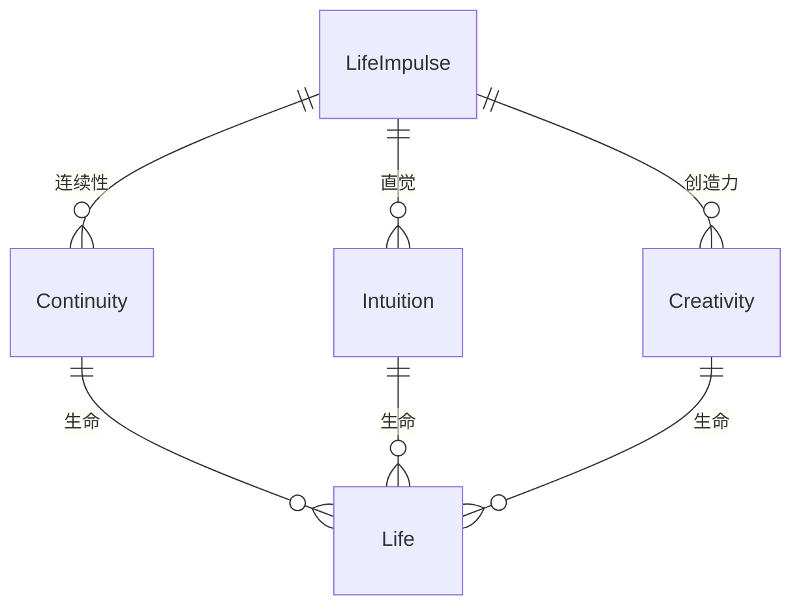
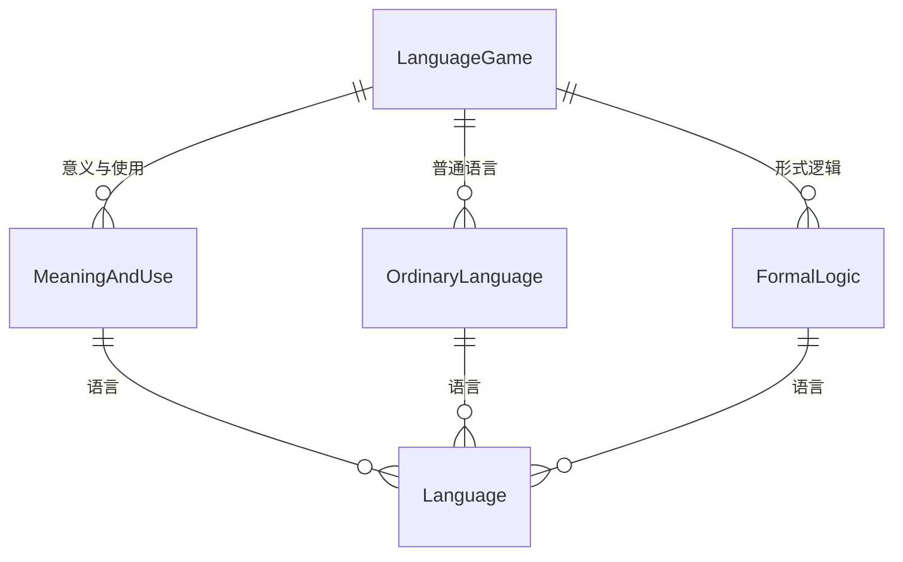

                 

## 引言

### 柏格森的生命哲学简介

亨利·柏格森（Henri Bergson）是20世纪初法国著名的哲学家，他的生命哲学对当时的哲学界产生了深远的影响。柏格森认为，生命的本质在于其创造力，这种创造力体现在生命的冲动和不断变化的过程中。柏格森提出了“生命冲动”（élan vital）的概念，即一种内在的动力，驱动着生命的演化和发展。

柏格森的哲学思想主要包括以下几个方面：

1. **生命的连续性与演化**：柏格森认为，生命是一种持续不断的演化过程，每一个个体都承载着整个物种的进化历史。这种演化是内在的、无意识的，而非机械的、外部的。
2. **生命冲动与创造力**：柏格森强调生命的创造力和冲动，认为这种冲动是生命不断创新和发展的动力源泉。生命冲动是一种内在的、不可预测的力量，它驱动着生命向着更高的形式演化。
3. **自由意志与直觉**：柏格森认为，自由意志是一种内在的直觉，而非外部的选择。直觉是一种直接感受现实的能力，它超越了逻辑和理性，能够捕捉到生命冲动的真正本质。

### 维特根斯坦的语言游戏理论

路德维希·维特根斯坦（Ludwig Wittgenstein）是20世纪最杰出的哲学家之一，他的思想对现代哲学产生了深远的影响。维特根斯坦的主要哲学贡献之一是语言游戏理论。

维特根斯坦认为，语言不仅仅是一种符号系统，而是一种游戏（spiel）。语言游戏是指语言的使用方式，它包含了语言、行为和认知等多个层面。语言游戏理论的主要观点包括：

1. **语言作为工具**：维特根斯坦认为，语言是一种工具，用于描述和交流世界。语言游戏的不同形式决定了语言的用途和功能。
2. **意义与使用**：维特根斯坦强调，语言的意义不在于其符号本身，而在于其使用方式。一个词的意义取决于它在特定语言游戏中的使用。
3. **语言游戏的多样性**：维特根斯坦认为，语言游戏是多样化的，每种语言游戏都有其特定的规则和用途。语言的不同用法形成了不同的语言游戏。

### 本文的核心内容和主题思想

本文旨在探讨柏格森的生命哲学与维特根斯坦的语言游戏理论之间的关系。通过分析两者的核心概念和基本原理，本文将探讨它们在哲学和科学领域中的意义和影响。具体来说，本文将：

1. 深入介绍柏格森的生命哲学和维特根斯坦的语言游戏理论。
2. 分析两者之间的关联和对话，探讨它们在哲学领域的互补性。
3. 探讨生命哲学与语言游戏理论在实际应用中的可能性，如心理学、语言学和计算机科学等领域。
4. 总结两者的当代价值，并提出未来研究的方向。

通过这篇文章，读者可以更深入地理解柏格森和维特根斯坦的思想，并思考它们在当代哲学和科学中的意义和影响。

## 第1章 引言

### 1.1 柏格森的生命哲学简介

亨利·柏格森（Henri Bergson，1859-1941）是20世纪初法国最具影响力的哲学家之一，他的生命哲学对当时的哲学界产生了深远的影响。柏格森的哲学思想以其独特性和深刻性而著称，尤其是在对生命、意识和自由意志的探讨上，他提出了许多新颖的观点和理论。

#### 1.1.1 柏格森的生平与哲学思想

亨利·柏格森于1859年出生于法国巴黎，他的父亲是一位成功的医生。柏格森在巴黎高等师范学院接受了严格的学术训练，后来成为了一名教授。他的学术生涯跨越了数十年，期间他在哲学、心理学、生物学等领域发表了大量的学术论文和著作。

柏格森的哲学思想主要集中在生命哲学和认识论两个方面。他的核心概念是“生命冲动”（élan vital），这一概念旨在解释生命的本质和动力。柏格森认为，生命冲动是一种内在的、不可预测的力量，它驱动着生命的演化和发展。这种冲动不仅仅存在于人类和生物中，也体现在自然界和社会发展的各个方面。

#### 1.1.2 生命哲学的核心概念

柏格森的生命哲学包含了一系列核心概念，其中最重要的是“生命冲动”、“持续流动”和“直觉”。

1. **生命冲动**：柏格森认为，生命冲动是生命力的象征，是生命的本质和动力。这种冲动是一种内在的、无意识的、不可预测的力量，它推动着生命的演化和发展。生命冲动不仅体现在个体的生命过程中，也体现在物种的进化中。

2. **持续流动**：柏格森认为，生命是一种持续不断的流动过程，这种流动是内在的、无间断的。与机械论的观点不同，柏格森强调生命的动态性和创造性，认为生命不仅仅是物质的组合，而是一种持续流动的力量。

3. **直觉**：柏格森认为，直觉是一种直接感受现实的能力，它超越了逻辑和理性。直觉能够捕捉到生命冲动的真正本质，是一种内在的、直接的认识方式。

#### 1.1.3 生命哲学的影响与评价

柏格森的生命哲学对当时的哲学界产生了深远的影响。他的观点挑战了传统的机械论和决定论，提出了一个更加动态和创造性的世界观。柏格森的思想不仅在哲学界引起了广泛的讨论，也影响到了生物学、心理学和社会学等领域。

然而，柏格森的哲学思想也存在一些争议。一些人认为，他的观点过于抽象和难以捉摸，缺乏明确的实证基础。此外，柏格森对科学方法的批评也引起了一些人的质疑。尽管如此，柏格森的生命哲学仍然被视为现代哲学的重要分支，对后来的哲学思想和科学研究产生了深远的影响。

### 1.2 维特根斯坦的语言游戏理论

路德维希·维特根斯坦（Ludwig Wittgenstein，1889-1951）是20世纪最杰出的哲学家之一，他的思想对现代哲学产生了深远的影响。维特根斯坦的哲学主要分为两个阶段，早期的《逻辑哲学论》和后期的《哲学研究》。在这两个阶段，他分别提出了不同的哲学观点，其中语言游戏理论是后期哲学思想的核心。

#### 1.2.1 维特根斯坦的生平与哲学思想

维特根斯坦出生于奥地利，他的家庭背景非常优越。维特根斯坦自幼就表现出了对哲学的浓厚兴趣，他在剑桥大学的学习和研究中进一步深化了自己的哲学思想。他的早期作品《逻辑哲学论》试图建立一种逻辑原子论的哲学体系，强调语言和现实之间的对应关系。

然而，维特根斯坦在后期逐渐放弃了这种哲学观点，转而提出了语言游戏理论。他认为，语言不仅仅是符号系统，而是一种活动，是一种游戏（spiel）。语言游戏理论强调语言的使用方式和意义，认为语言的意义取决于它在实际生活中的应用。

#### 1.2.2 语言游戏理论的基本概念

维特根斯坦的语言游戏理论包含了一系列基本概念，其中最重要的是“语言游戏”（language game）和“语言的意义”。

1. **语言游戏**：维特根斯坦认为，语言游戏是一种特定的活动，它包含了语言的使用、行为和认知等多个层面。不同的语言游戏有不同的规则和用途，比如数学语言游戏、日常语言游戏和科学语言游戏等。

2. **语言的意义**：维特根斯坦强调，语言的意义不在于其符号本身，而在于其使用方式。一个词或句子的意义取决于它在特定语言游戏中的使用。这意味着，语言的意义是多样化的，不是一成不变的。

3. **语言游戏的多样性**：维特根斯坦认为，语言游戏是多样化的，每种语言游戏都有其特定的规则和用途。语言的不同用法形成了不同的语言游戏，这些语言游戏共同构成了人类交流的复杂系统。

#### 1.2.3 语言游戏理论的影响与评价

维特根斯坦的语言游戏理论对现代哲学和语言学产生了深远的影响。他的观点挑战了传统的语言哲学观点，强调了语言的实际应用和多样性。维特根斯坦的思想不仅在哲学界引起了广泛的讨论，也影响了后来的语言学、心理学和计算机科学等领域。

然而，维特根斯坦的语言游戏理论也存在一些争议。一些人认为，他的观点过于抽象和难以捉摸，缺乏明确的实证基础。此外，维特根斯坦对传统哲学方法的态度也引起了一些人的质疑。尽管如此，维特根斯坦的语言游戏理论仍然被视为现代哲学的重要分支，对后来的哲学思想和科学研究产生了深远的影响。

## 第2章 柏格森的生命哲学

### 2.1 生命的本质与特质

柏格森的生命哲学以其对生命本质和特质的深刻探讨而著称。在柏格森看来，生命的本质不仅仅是一种生物学现象，而是一种内在的、不断变化的动力。这种动力驱动着生命的演化和发展，形成了生命独特的特质。

#### 2.1.1 生命哲学的基本观点

柏格森的生命哲学包含了一系列基本观点，这些观点构成了他对生命本质的理解。

1. **生命是一种内在动力**：柏格森认为，生命不是静态的存在，而是一种内在的、不断变化的动力。这种动力是生命的核心，驱动着生命的演化和发展。
2. **生命是一种创造过程**：柏格森强调，生命是一种创造过程，这种创造不仅仅体现在生物学层面，也体现在人类文化和思想的层面。生命的创造力是生命不断演化和发展的动力源泉。
3. **生命与时间的关系**：柏格森认为，生命与时间有着密切的关系。生命是一种持续的流动，这种流动是内在的、无间断的。时间是一种测量生命流动的工具，它反映了生命的动态性和创造性。

#### 2.1.2 生命的本质

柏格森对生命的本质进行了深入的探讨，他认为生命的本质在于其创造力。这种创造力体现在生命的冲动和不断变化的过程中。

1. **生命的冲动**：柏格森认为，生命冲动是生命的核心，它驱动着生命的演化和发展。这种冲动是一种内在的、不可预测的力量，它推动着生命向着更高的形式演化。
2. **生命的连续性**：柏格森强调，生命的连续性是其本质特征之一。生命不是一系列独立的瞬间，而是一个连续的流动过程。每一个生命个体都承载着整个物种的进化历史，这种连续性体现了生命的动态性和创造力。
3. **生命的创造力**：柏格森认为，生命的创造力是生命不断演化和发展的动力源泉。这种创造力体现在生命的各个方面，包括生物学、人类文化和思想等。

#### 2.1.3 生命的特质

柏格森认为，生命的特质体现在以下几个方面：

1. **流动性**：生命是一种流动性，这种流动性是内在的、无间断的。生命的流动形成了时间的连续性，也反映了生命的动态性和创造性。
2. **创造力**：生命的创造力是其核心特质之一。生命的创造力体现在生命的各个方面，包括生物学、人类文化和思想等。生命的创造力不仅驱动着生命的演化和发展，也推动了人类文明的进步。
3. **直觉性**：柏格森认为，直觉是生命的一种重要特质。直觉是一种直接感受现实的能力，它超越了逻辑和理性。直觉能够捕捉到生命冲动的真正本质，是生命创造力的重要体现。

### 2.2 生命的冲动与创造

柏格森认为，生命的冲动和创造力是生命哲学的核心概念。生命的冲动是一种内在的、不可预测的力量，它驱动着生命的演化和发展。而生命的创造力则体现在生命的各个方面，包括生物学、人类文化和思想等。

#### 2.2.1 生命的冲动

1. **内在动力**：柏格森认为，生命的冲动是生命的内在动力，它驱动着生命的演化和发展。这种冲动不是外在力量的结果，而是生命自身的一种内在需求。
2. **不可预测性**：柏格森强调，生命的冲动是不可预测的。生命的冲动是一种内在的、不可预测的力量，它使生命充满了不确定性和变化性。
3. **驱动演化**：生命的冲动驱动着生命的演化。生命的冲动使生命不断向着更高的形式演化，形成了生命的多样性和复杂性。

#### 2.2.2 生命的创造

1. **生物学层面**：在生物学层面，生命的创造体现在物种的进化和多样性的形成。生命的冲动驱动着物种的演化，形成了地球上的丰富生物多样性。
2. **人类文化层面**：在人类文化层面，生命的创造体现在人类文明的发展和进步。人类的创造力使人类社会不断向前发展，推动了科学、艺术和文化的繁荣。
3. **思想层面**：在思想层面，生命的创造体现在哲学思想和科学理论的创新。生命的冲动驱动着哲学和科学的发展，推动了人类对世界和自身的更深入理解。

#### 2.2.3 生命的艺术

1. **生命与艺术的关系**：柏格森认为，生命与艺术有着密切的关系。生命冲动和创造力不仅体现在生物学和人类文化层面，也体现在艺术创作中。
2. **艺术作为生命的表达**：艺术是生命的表达，它反映了生命的冲动和创造力。艺术家通过艺术创作表达生命的内在冲动，展现生命的创造力和活力。
3. **艺术与生命哲学的关系**：艺术与生命哲学有着共同的追求，即对生命本质和意义的探讨。艺术通过其独特的方式，展现了生命的多样性和创造力，丰富了我们对生命的理解。

### 2.3 生命的哲学意义

柏格森的生命哲学不仅仅是对生命本质和特质的探讨，更是一种对生命哲学意义的深刻思考。在柏格森看来，生命不仅仅是生物学现象，它具有更深刻的哲学意义。

#### 2.3.1 生命与存在的关联

1. **生命的存在本质**：柏格森认为，生命的本质在于其存在形式。生命不是静态的存在，而是一种动态的、持续流动的存在。生命的存在体现了存在的多样性和复杂性。
2. **生命与存在的关系**：柏格森强调，生命与存在有着紧密的关系。生命的冲动和创造力是存在的动力，生命的演化和发展是存在的一种表现形式。

#### 2.3.2 生命与价值的关系

1. **生命的价值**：柏格森认为，生命具有独特的价值。生命的价值不仅体现在其生物学意义上，更体现在其创造力和创造性上。生命的创造力推动了人类文明的发展，丰富了人类对世界的理解。
2. **价值与生命的关联**：柏格森强调，价值与生命有着密切的关系。生命的价值体现在其对世界的创造和贡献上，生命的创造力是价值的重要来源。

#### 2.3.3 生命与自由的内涵

1. **自由的本质**：柏格森认为，自由是一种内在的能力，它体现了生命的创造力和主动性。自由不仅仅是外在行为的表现，更是一种内在的精神状态。
2. **生命与自由的关系**：柏格森强调，生命与自由有着紧密的关系。生命的冲动和创造力是自由的重要基础，生命的自由体现在其对世界的探索和创造中。

### 2.4 生命哲学的应用

柏格森的生命哲学不仅在哲学理论上具有重要意义，还可以在各个领域得到实际应用。

#### 2.4.1 心理学中的应用

1. **心理学与生命的关联**：心理学研究人类的心理过程和心理健康，与生命的哲学意义密切相关。柏格森的生命哲学为心理学提供了一种新的视角，帮助理解人类心理的动态性和创造性。
2. **心理治疗的应用**：柏格森的生命哲学可以应用于心理治疗，特别是针对那些面临心理困境的人。通过理解生命的冲动和创造力，心理治疗师可以帮助患者更好地面对内心的冲突和挑战，促进心理的健康发展。

#### 2.4.2 社会学中的应用

1. **社会学与生命的关联**：社会学研究人类社会的发展和变迁，与生命的哲学意义密切相关。柏格森的生命哲学为社会学提供了一种新的分析框架，帮助理解社会的动态性和创造性。
2. **社会问题的解决**：柏格森的生命哲学可以应用于解决社会问题，如社会不公、环境污染等。通过理解生命的冲动和创造力，社会学家可以提出更有效的社会政策和解决方案。

#### 2.4.3 生物学中的应用

1. **生物学与生命的关联**：生物学研究生命的本质和演化，与生命的哲学意义密切相关。柏格森的生命哲学为生物学提供了一种新的理论框架，帮助理解生命的多样性和复杂性。
2. **生物进化理论**：柏格森的生命哲学对生物进化理论产生了重要影响。通过理解生命的冲动和创造力，生物学家可以更深入地探讨物种的进化和生物多样性的形成。

### 2.5 生命哲学的挑战与前景

柏格森的生命哲学在当代面临着一系列挑战和机遇。

#### 2.5.1 挑战

1. **科学与哲学的融合**：柏格森的生命哲学试图将哲学和科学结合起来，但在实践中面临许多困难。如何将抽象的哲学概念与具体的科学事实相结合，是柏格森生命哲学面临的重要挑战。
2. **实证基础**：柏格森的生命哲学更多地依赖于直觉和哲学思辨，缺乏充分的实证基础。如何通过实验和观察来验证生命哲学的理论，是柏格森生命哲学面临的一个重要问题。

#### 2.5.2 前景

1. **跨学科研究**：随着多学科研究的兴起，柏格森的生命哲学有望在生物学、心理学、社会学等领域得到更广泛的应用。通过跨学科研究，可以更好地理解生命的本质和意义。
2. **新理论框架**：柏格森的生命哲学为当代哲学和科学研究提供了一种新的理论框架。通过探索生命的冲动和创造力，可以提出新的理论模型和假设，推动科学和哲学的发展。

### 2.6 结论

柏格森的生命哲学以其深刻的思想和独特的视角，为哲学和科学提供了重要的理论资源。通过探讨生命的本质、冲动和创造，柏格森的生命哲学为我们理解生命的本质和意义提供了新的途径。尽管柏格森的生命哲学面临一系列挑战，但它依然具有巨大的潜力，为未来的哲学和科学研究提供了广阔的前景。

### 2.7 柏格森生命哲学的核心概念

柏格森的生命哲学包含了一系列核心概念，这些概念不仅构成了他对生命本质的理解，也为我们理解生命的多样性和复杂性提供了重要的视角。

#### 2.7.1 生命冲动（Élan Vital）

**定义**：生命冲动，或称为“生命力”，是柏格森用来描述生命内在动力的核心概念。

**属性**：

- **内在动力**：生命冲动是驱动生命演化和发展的一种内在力量。
- **不可预测性**：生命冲动是不可预测的，它使生命充满了变化和不确定性。
- **创造性**：生命冲动具有创造性，它推动了生命的不断演化和多样化。

**对比表格**：

| 特征 | 生命冲动 | 机械论 |
| --- | --- | --- |
| **本质** | 内在动力 | 外在力量 |
| **预测性** | 不可预测性 | 可预测性 |
| **创造性** | 创造性 | 机械性 |

#### 2.7.2 持续流动（Continuity）

**定义**：持续流动是柏格森用来描述生命连续性和动态性的核心概念。

**属性**：

- **连续性**：持续流动体现了生命的连续性，生命不是一系列独立的瞬间，而是一个连续的流动过程。
- **动态性**：持续流动体现了生命的动态性，生命不是静态的存在，而是一个不断变化的过程。

**对比表格**：

| 特征 | 持续流动 | 机械论 |
| --- | --- | --- |
| **连续性** | 生命的连续性 | 瞬间性 |
| **动态性** | 生命的动态性 | 静态性 |

#### 2.7.3 直觉（Intuition）

**定义**：直觉是柏格森用来描述生命内在感知和认识能力的一种方式。

**属性**：

- **直接性**：直觉是一种直接感知现实的能力，它超越了逻辑和理性的思考。
- **直觉性**：直觉能够直接捕捉到生命冲动的本质，是一种内在的认识方式。

**对比表格**：

| 特征 | 直觉 | 理性 |
| --- | --- | --- |
| **直接性** | 直接感知 | 假设推理 |
| **直觉性** | 内在感知 | 外在观察 |

#### 2.7.4 生命创造力（Creativity of Life）

**定义**：生命创造力是柏格森用来描述生命不断创造和发展的一种能力。

**属性**：

- **多样性**：生命的创造力体现在生命的多样性和复杂性上。
- **演化**：生命的创造力推动了物种的进化和人类的文明发展。

**对比表格**：

| 特征 | 生命创造力 | 机械创造 |
| --- | --- | --- |
| **多样性** | 不断创造 | 机械复制 |
| **演化** | 推动演化 | 静态不变 |

#### 2.7.5 ER实体关系图

为了更清晰地展示柏格森生命哲学的核心概念及其相互关系，我们可以使用ER（实体关系）图来表示这些概念。

**ER图**：



在ER图中，生命冲动（LifeImpulse）作为核心实体，与连续性、直觉和创造力形成紧密的关联。这些概念共同构成了柏格森生命哲学的基本框架，为我们理解生命的本质和特质提供了深刻的洞察。

### 2.8 柏格森生命哲学对心理学的影响

柏格森的生命哲学对心理学产生了深远的影响，尤其是在对意识和心理过程的解释上。柏格森的生命冲动和直觉概念为心理学提供了一种新的视角，帮助我们更好地理解人类的内心世界。

#### 2.8.1 意识与生命冲动的关联

柏格森认为，意识是生命冲动的一种表现形式。意识不是被动地接受外部刺激，而是主动地反映和响应生命冲动。这种观点与传统的机械论观点形成鲜明对比，后者认为意识是外部刺激的简单反应。

**例子**：当我们看到一只猫时，传统的机械论观点认为我们的意识仅仅是视觉刺激的结果。而柏格森的观点则认为，我们的意识是对生命冲动的一种反应，这种冲动使我们对周围环境保持敏感和响应。

#### 2.8.2 直觉与心理过程

柏格森的直觉概念为心理学提供了一种理解心理过程的新途径。直觉被认为是超越逻辑和理性的认识方式，它能够直接捕捉到事物的本质。

**例子**：当一个人感到恐惧时，直觉会立即产生反应，即使没有明确的原因。这种直觉反应可能源于对潜在危险的感知，这是一种超越逻辑和理性的认识方式。

#### 2.8.3 生命哲学对心理学研究的影响

柏格森的生命哲学对心理学研究产生了重要影响。首先，它促进了心理学对意识和心理过程的深入研究。其次，它为心理学提供了一种新的研究方法，即通过理解生命冲动和直觉来探讨心理现象。

**案例**：精神分析学派的心理学家，如卡尔·荣格，受到柏格森思想的影响，提出了“集体无意识”的概念，认为直觉和潜意识是理解人类行为和心理过程的关键。

### 2.9 柏格森生命哲学在教育中的应用

柏格森的生命哲学不仅对心理学产生了深远影响，还可以在教育领域中发挥作用。通过理解生命的冲动和创造力，教育者可以更有效地激发学生的学习兴趣和潜能。

#### 2.9.1 激发学生学习兴趣

柏格森认为，生命的冲动是一种内在的、不可预测的力量，它驱动着生命的演化和发展。在教育中，教师可以通过激发学生的内在冲动来提高他们的学习兴趣。

**例子**：教师可以通过设计富有挑战性和创造性的课程活动，激发学生的好奇心和探索欲望。例如，在科学课程中，教师可以设计实验和观察活动，让学生亲身体验科学发现的乐趣。

#### 2.9.2 培养学生创造力

柏格森强调生命的创造力是生命不断演化和发展的动力源泉。在教育中，教师可以通过各种方式培养学生的创造力。

**例子**：教师可以鼓励学生进行艺术创作、写作和科学实验，这些活动有助于培养学生的创造力。此外，教师还可以组织学生进行团队合作项目，鼓励他们从不同的角度思考问题，提出创新的解决方案。

#### 2.9.3 教育者的角色

柏格森的生命哲学强调教育者的角色不仅仅是传授知识，更重要的是激发学生的内在冲动和创造力。教育者应该成为学生的引导者和伙伴，帮助他们发掘自己的潜能。

**例子**：教育者可以通过开展讨论和反思活动，帮助学生理解自己的内心世界和生命冲动。例如，教师可以组织学生进行自我反思和小组讨论，鼓励他们分享自己的感受和想法。

### 2.10 柏格森生命哲学在当代的启示

柏格森的生命哲学在当代仍然具有深刻的意义和启示。随着科学技术的进步和社会的发展，我们对生命的理解也在不断深化。柏格森的生命哲学为我们提供了新的视角，帮助我们更好地理解生命的本质和意义。

#### 2.10.1 生命与科学的融合

在当代，生命科学和生物技术的发展使我们能够更深入地了解生命的本质和机制。柏格森的生命哲学提醒我们，生命的演化不仅仅是生物学现象，还涉及到哲学、心理学和社会学等多个层面。

**例子**：现代生物学研究已经揭示了基因、细胞和神经系统等层面的生命机制，但柏格森的生命哲学提醒我们，这些机制背后的生命冲动和创造力同样重要。

#### 2.10.2 生命与艺术的关系

艺术是生命创造力的一种体现，它反映了生命的多样性和创造力。柏格森的生命哲学强调了艺术与生命的密切关系，为我们理解艺术提供了新的视角。

**例子**：艺术家通过创作作品表达自己的内心世界和生命冲动，这些作品反映了生命的多样性和创造力。例如，毕加索的作品《吉他手》展示了艺术家对生命和时间的独特理解。

#### 2.10.3 生命与伦理的关系

柏格森的生命哲学提醒我们，生命的价值不仅仅体现在生物学意义上，还体现在其对世界的创造和贡献上。这种观点对我们理解伦理和道德问题具有重要意义。

**例子**：在当代社会中，我们面临着许多伦理和道德问题，如环境保护、人权和科技进步等。柏格森的生命哲学提醒我们，生命的价值在于其创造力和对世界的贡献，这为我们解决这些伦理问题提供了新的思路。

### 2.11 结论

柏格森的生命哲学以其深刻的思想和独特的视角，为我们理解生命的本质和意义提供了新的途径。通过探讨生命的冲动、创造力和直觉，柏格森的生命哲学不仅对哲学和科学产生了深远影响，还在心理学、教育、艺术和伦理等领域具有广泛的应用。尽管柏格森的生命哲学面临一系列挑战，但它依然具有巨大的潜力，为当代哲学和科学研究提供了重要的理论资源。

## 第3章 维特根斯坦的语言游戏理论

### 3.1 语言的本质与功能

维特根斯坦的语言游戏理论强调语言的本质和功能，认为语言不仅仅是符号的组合，而是一种活动，是一种游戏。语言游戏的概念是理解维特根斯坦哲学的关键。

#### 3.1.1 语言哲学的基本观点

维特根斯坦的语言哲学主要包含以下几个基本观点：

1. **语言作为工具**：维特根斯坦认为，语言是一种工具，用于描述和交流世界。语言游戏的不同形式决定了语言的用途和功能。
2. **意义与使用**：维特根斯坦强调，语言的意义不在于其符号本身，而在于其使用方式。一个词或句子的意义取决于它在特定语言游戏中的使用。
3. **语言游戏的多样性**：维特根斯坦认为，语言游戏是多样化的，每种语言游戏都有其特定的规则和用途。语言的不同用法形成了不同的语言游戏，这些语言游戏共同构成了人类交流的复杂系统。

#### 3.1.2 语言的本质

1. **语言不是固定的符号系统**：维特根斯坦认为，语言不是固定的符号系统，而是一种活动。语言的意义和功能取决于实际使用，而不是符号本身。
2. **语言是一种游戏**：维特根斯坦将语言比喻为游戏，强调语言的使用是多样化的，不同的语言游戏有不同的规则和目的。

#### 3.1.3 语言的函数

1. **描述性功能**：语言用于描述现实世界，帮助人们理解事物和事件。例如，在科学语言游戏中，语言用于描述自然现象和实验结果。
2. **交流性功能**：语言用于人与人之间的交流，传递信息和思想。例如，在日常语言游戏中，语言用于日常对话和社交互动。
3. **表达性功能**：语言用于表达个人情感和思想，如诗歌和文学创作。例如，在文学语言游戏中，语言用于表达作者的情感和观点。

### 3.2 语言游戏与思维形式

维特根斯坦的语言游戏理论不仅仅关注语言的本质和功能，还探讨了语言游戏与思维形式的关系。

#### 3.2.1 语言游戏的概念

1. **定义**：维特根斯坦认为，语言游戏是一种特定的活动，它包含了语言的使用、行为和认知等多个层面。
2. **多样性**：维特根斯坦强调，语言游戏是多样化的，每种语言游戏都有其特定的规则和用途。

#### 3.2.2 语言游戏与思维形式的关系

1. **语言游戏与思维活动**：维特根斯坦认为，语言游戏是思维活动的具体体现。不同的语言游戏反映了不同的思维形式。
2. **思维形式的多样性**：维特根斯坦认为，思维形式是多样化的，不同的思维形式对应不同的语言游戏。例如，逻辑思维、直觉思维和创造性思维等。

#### 3.2.3 语言游戏的基本类型

1. **日常语言游戏**：日常语言游戏是人们日常生活中最常见的语言游戏，包括日常对话、社交互动和日常事务处理等。
2. **科学语言游戏**：科学语言游戏用于描述和解释自然现象，包括科学理论、实验和观察等。
3. **文学语言游戏**：文学语言游戏用于表达个人情感和思想，包括诗歌、小说和戏剧等。
4. **哲学语言游戏**：哲学语言游戏用于探讨抽象概念和哲学问题，包括逻辑、道德和美学等。

### 3.3 语言游戏的哲学意义

维特根斯坦的语言游戏理论在哲学上具有重要意义，它不仅挑战了传统的语言哲学观点，还为理解思维和认知提供了新的视角。

#### 3.3.1 语言游戏与真理的关系

1. **真理的意义**：维特根斯坦认为，真理不是抽象的概念，而是语言游戏的具体应用。一个语句是否为真，取决于它在特定语言游戏中的使用。
2. **真理与实际应用**：维特根斯坦强调，真理与实际应用密切相关。一个理论或观点是否为真，取决于它是否能够有效地应用于实际生活中。

#### 3.3.2 语言游戏与认知的关系

1. **认知的本质**：维特根斯坦认为，认知不仅仅是理解外部世界，还包括理解语言的使用和意义。
2. **认知的多样性**：维特根斯坦认为，认知是多样化的，不同的认知活动对应不同的语言游戏。例如，逻辑思维、直觉思维和创造性思维等。

#### 3.3.3 语言游戏与思维方式的变革

1. **思维方式的变化**：维特根斯坦认为，语言游戏可以改变人们的思维方式。通过不同的语言游戏，人们可以采取不同的思维方式，从而更全面地理解世界。
2. **思维方式的多样化**：维特根斯坦强调，思维方式的多样化是理解世界的关键。不同的语言游戏可以激发不同的思维活动，帮助人们更深入地理解复杂的现实。

### 3.4 维特根斯坦语言游戏理论的影响与评价

维特根斯坦的语言游戏理论对现代哲学和认知科学产生了深远的影响。他的观点不仅挑战了传统的语言哲学观点，还为理解思维和认知提供了新的视角。

#### 3.4.1 评价

1. **创新性**：维特根斯坦的语言游戏理论具有创新性，他提出了许多新颖的观点和概念，为现代哲学和认知科学提供了新的思考方向。
2. **挑战性**：维特根斯坦的语言游戏理论对传统的语言哲学观点提出了挑战，引发了广泛的讨论和争议。

#### 3.4.2 影响

1. **哲学领域**：维特根斯坦的语言游戏理论对哲学领域产生了深远的影响，改变了人们对语言、思维和认知的理解。
2. **认知科学**：维特根斯坦的语言游戏理论为认知科学提供了新的研究方法和视角，推动了认知科学的发展。
3. **语言学**：维特根斯坦的语言游戏理论对语言学产生了重要影响，特别是对语言习得和语言使用的研究。

### 3.5 维特根斯坦语言游戏理论的实际应用

维特根斯坦的语言游戏理论不仅在哲学和认知科学领域具有深远影响，还可以在多个实际应用领域中发挥作用。

#### 3.5.1 教育领域

1. **语言教学**：维特根斯坦的语言游戏理论为语言教学提供了新的方法和思路。通过理解不同的语言游戏，教师可以更有效地教授语言知识和技能。
2. **思维训练**：维特根斯坦的语言游戏理论强调思维形式的多样化，这对培养学生的思维能力具有重要意义。通过参与不同的语言游戏，学生可以发展创造性思维和逻辑思维。

#### 3.5.2 社会学领域

1. **社会互动**：维特根斯坦的语言游戏理论对社会互动提供了新的视角。通过理解不同的语言游戏，社会学家可以更深入地研究社会互动的多样性和复杂性。
2. **沟通障碍**：维特根斯坦的语言游戏理论可以帮助我们理解沟通障碍的原因，从而提出更有效的沟通策略。

#### 3.5.3 认知科学领域

1. **认知过程**：维特根斯坦的语言游戏理论为认知科学提供了新的研究方法和视角，有助于我们更好地理解认知过程。
2. **人工智能**：维特根斯坦的语言游戏理论对人工智能的发展具有重要意义。通过理解不同的语言游戏，人工智能系统可以更有效地处理自然语言和进行人机交互。

### 3.6 结论

维特根斯坦的语言游戏理论以其深刻的思想和独特的视角，为现代哲学和认知科学提供了重要的理论资源。通过理解语言的本质和功能，以及语言游戏与思维形式的关系，维特根斯坦的语言游戏理论不仅改变了我们对语言和思维的理解，还在多个实际应用领域中发挥了重要作用。尽管维特根斯坦的语言游戏理论面临一系列挑战和争议，但它依然具有深远的影响和广泛的应用价值。

### 3.7 维特根斯坦语言游戏理论的核心概念

维特根斯坦的语言游戏理论包含了一系列核心概念，这些概念不仅构成了他对语言本质的理解，也为我们理解语言在人类交流和思维中的作用提供了深刻的洞见。

#### 3.7.1 语言游戏（Language Game）

**定义**：语言游戏是维特根斯坦用来描述语言使用的一种活动。它包括语言、行为和认知等多个层面。

**属性**：

- **多样性**：语言游戏是多样化的，每种语言游戏都有其特定的规则和用途。
- **互动性**：语言游戏是一种互动过程，涉及说话者、听话者和环境等多个因素。

**对比表格**：

| 特征 | 语言游戏 | 语法规则 |
| --- | --- | --- |
| **多样性** | 多样化 | 单一性 |
| **互动性** | 互动性 | 机械性 |

#### 3.7.2 意义与使用（Meaning and Use）

**定义**：维特根斯坦认为，语言的意义不在于其符号本身，而在于其使用方式。一个词或句子的意义取决于它在特定语言游戏中的使用。

**属性**：

- **具体性**：意义是具体的，它与特定的语言游戏和使用情境密切相关。
- **灵活性**：意义具有灵活性，它可以随着语言游戏的变化而变化。

**对比表格**：

| 特征 | 意义与使用 | 符号意义 |
| --- | --- | --- |
| **具体性** | 具体性 | 抽象性 |
| **灵活性** | 灵活性 | 固定性 |

#### 3.7.3 普通语言（Ordinary Language）

**定义**：普通语言是维特根斯坦用来描述日常生活中的语言使用。它是人们进行交流、描述现实和表达思想的主要工具。

**属性**：

- **实用性**：普通语言具有实用性，它服务于人们的实际生活和交流需求。
- **多样性**：普通语言是多样化的，不同的情境和语境使用不同的语言形式。

**对比表格**：

| 特征 | 普通语言 | 专业术语 |
| --- | --- | --- |
| **实用性** | 实用性 | 抽象性 |
| **多样性** | 多样性 | 单一性 |

#### 3.7.4 形式逻辑（Formal Logic）

**定义**：形式逻辑是一种基于符号和规则的语言系统，用于表达和验证逻辑推理的正确性。

**属性**：

- **抽象性**：形式逻辑是高度抽象的，它关注逻辑推理的普遍性和一致性。
- **一致性**：形式逻辑强调逻辑推理的一致性，避免逻辑矛盾和错误。

**对比表格**：

| 特征 | 形式逻辑 | 自然语言 |
| --- | --- | --- |
| **抽象性** | 抽象性 | 具体性 |
| **一致性** | 一致性 | 多样性 |

#### 3.7.5 ER实体关系图

为了更清晰地展示维特根斯坦语言游戏理论的核心概念及其相互关系，我们可以使用ER（实体关系）图来表示这些概念。

**ER图**：



在ER图中，语言游戏（LanguageGame）作为核心实体，与意义与使用、普通语言和形式逻辑形成紧密的关联。这些概念共同构成了维特根斯坦语言游戏理论的基本框架，为我们理解语言的本质和功能提供了深刻的洞察。

### 3.8 维特根斯坦语言游戏理论在认知科学中的应用

维特根斯坦的语言游戏理论不仅在哲学领域产生了深远影响，还在认知科学领域得到了广泛应用。通过理解语言游戏与思维形式的关系，认知科学家能够更好地解释人类的语言习得、语言处理和语言理解过程。

#### 3.8.1 语言习得

1. **语言环境的多样性**：维特根斯坦认为，语言游戏是多样化的，每种语言游戏都有其特定的规则和用途。这一观点为解释语言习得提供了新的视角。儿童在成长过程中，通过接触不同的语言环境，学习掌握多种语言游戏，从而习得语言能力。
2. **认知多样性的影响**：维特根斯坦的语言游戏理论强调了认知多样性的重要性。儿童在习得语言过程中，不仅需要理解语言符号的表面意义，还需要掌握不同语言游戏的规则和功能。这种认知多样性有助于儿童发展全面的语言能力。

#### 3.8.2 语言处理

1. **并行处理与序列处理**：维特根斯坦的语言游戏理论认为，语言处理既包括并行处理，也包括序列处理。在并行处理中，大脑同时处理多个语言游戏，例如在多任务环境中，人们可以同时进行对话和思考。而在序列处理中，人们按照特定的顺序处理语言信息，例如在阅读和理解文章时。
2. **动态适应性**：维特根斯坦的语言游戏理论强调了语言的动态适应性。语言处理过程不是一成不变的，而是随着情境和语境的变化而变化。这一观点有助于我们理解语言处理中的灵活性和适应性。

#### 3.8.3 语言理解

1. **语境依赖性**：维特根斯坦认为，语言理解取决于具体的语境和情境。在理解一个句子时，人们不仅需要理解其字面意义，还需要考虑其语境意义。语境依赖性使语言理解更加复杂，但也使语言交流更加丰富和灵活。
2. **多维度推理**：维特根斯坦的语言游戏理论强调，语言理解涉及到多个维度的推理，包括逻辑推理、情感推理和社会推理等。这些多维度推理有助于我们更全面地理解语言信息，提高语言理解能力。

#### 3.8.4 实证研究

维特根斯坦的语言游戏理论在认知科学领域得到了广泛的实证研究支持。例如：

1. **神经影像研究**：通过神经影像技术，研究者发现大脑在处理不同语言游戏时，会激活不同的脑区。这些脑区的活动与维特根斯坦提出的语言游戏类型密切相关。
2. **跨文化研究**：维特根斯坦的语言游戏理论在不同文化背景下得到了广泛应用。例如，研究者发现，不同文化背景下的儿童在习得语言时，表现出不同的语言游戏偏好，这与维特根斯坦的观点一致。

### 3.9 维特根斯坦语言游戏理论在计算机科学中的应用

维特根斯坦的语言游戏理论不仅在哲学和认知科学领域产生了深远影响，还在计算机科学中得到了广泛应用。计算机科学家通过借鉴维特根斯坦的思想，探索编程语言设计、自然语言处理和人工智能等领域。

#### 3.9.1 编程语言设计

1. **语言游戏的概念**：维特根斯坦的语言游戏理论为编程语言设计提供了新的视角。编程语言可以被视为一种特殊的语言游戏，具有特定的规则和用途。通过理解不同的编程语言游戏，程序员可以更有效地选择和使用合适的编程语言。
2. **语言的抽象性**：维特根斯坦认为，语言是高度抽象的工具。在编程语言设计中，程序员需要考虑如何设计高度抽象的语言，以便更方便地描述复杂的计算过程。

#### 3.9.2 自然语言处理

1. **语境依赖性**：维特根斯坦的语言游戏理论强调了语境依赖性，这对自然语言处理（NLP）领域具有重要意义。在NLP中，理解语境是关键，只有通过理解语境，计算机才能正确地理解和生成语言。
2. **多维度推理**：维特根斯坦的多维度推理概念为NLP提供了新的思路。在NLP中，需要同时考虑逻辑推理、情感推理和社会推理等多维度因素，以便更准确地理解和生成语言。

#### 3.9.3 人工智能

1. **语言理解与生成**：维特根斯坦的语言游戏理论为人工智能中的语言理解与生成提供了新的方法。通过理解不同的语言游戏，人工智能系统可以更有效地处理自然语言，实现更智能的对话和交互。
2. **情境适应性**：维特根斯坦的语言游戏理论强调了语言的动态适应性。在人工智能中，需要设计能够适应不同情境和语境的智能系统，以便更好地与人类进行交互。

### 3.10 结论

维特根斯坦的语言游戏理论以其深刻的思想和独特的视角，为现代哲学和认知科学提供了重要的理论资源。通过理解语言游戏与思维形式的关系，维特根斯坦的语言游戏理论不仅改变了我们对语言和思维的理解，还在计算机科学和其他领域中发挥了重要作用。尽管维特根斯坦的语言游戏理论面临一系列挑战和争议，但它依然具有深远的影响和广泛的应用价值。

## 第4章 柏格森与维特根斯坦的对话

### 4.1 生命哲学与语言游戏的关系

柏格森的生命哲学与维特根斯坦的语言游戏理论虽然在研究对象和方法上有所不同，但两者之间存在着深刻的内在联系和相互启示。通过探讨生命哲学与语言游戏理论的关系，我们可以更全面地理解两者的核心思想。

#### 4.1.1 生命哲学对语言游戏的影响

1. **生命冲动的渗透**：柏格森的生命哲学强调生命的内在冲动和创造力，这种思想可以渗透到语言游戏理论中。在语言使用中，个体不仅仅是被动地使用语言符号，而是通过内在的冲动和创造力来创造和定义语言的意义。
   
   **例子**：在文学创作中，作家通过内心的冲动和创造力，创造出富有深度和情感的语言游戏，这种创作过程体现了柏格森的生命哲学。

2. **直觉在语言游戏中的角色**：柏格森强调直觉在认识世界中的重要性，这一思想也可以应用到语言游戏理论中。在语言使用中，直觉帮助个体快速理解语言情境，并生成相应的语言反应。

   **例子**：在日常对话中，人们往往凭借直觉来迅速回应对方的话语，这种直觉性的语言游戏反映了柏格森的直觉概念。

#### 4.1.2 语言游戏对生命哲学的启示

1. **语言作为生命表达的媒介**：维特根斯坦的语言游戏理论将语言视为一种活动，这种观点为柏格森的生命哲学提供了新的视角。语言不仅是人类交流的工具，也是个体表达生命冲动和创造力的媒介。

   **例子**：在艺术创作中，艺术家通过语言表达自己的内心世界和生命体验，这种语言游戏体现了生命哲学的核心思想。

2. **语言游戏的多样性与生命的多样性**：维特根斯坦认为，语言游戏是多样化的，每种语言游戏都有其特定的规则和用途。这一观点与柏格森对生命多样性的理解相呼应，都强调了多样性和创造性在生命和语言中的重要性。

   **例子**：在人类社会中，不同的文化和习俗形成了多种多样的语言游戏，这些语言游戏反映了生命的多样性和创造力。

#### 4.1.3 两者之间的对话与互补

1. **互补性**：柏格森的生命哲学和维特根斯坦的语言游戏理论在哲学上互补。柏格森关注生命的内在动力和创造力，而维特根斯坦关注语言的使用和意义。两者共同探讨了人类存在和认知的复杂性。

   **例子**：在心理学研究中，柏格森的生命哲学可以解释人类内心的冲动和创造力，而维特根斯坦的语言游戏理论可以解释人类如何通过语言来表达和理解这些内心体验。

2. **相互启发**：柏格森的生命哲学和维特根斯坦的语言游戏理论相互启发，推动了哲学和科学的发展。通过理解两者的关系，我们可以更深入地探讨生命的本质和语言的意义。

   **例子**：在人工智能研究中，柏格森的生命哲学可以启发我们设计更具有创造力和适应性的智能系统，而维特根斯坦的语言游戏理论可以指导我们设计更自然和有效的自然语言处理系统。

### 4.2 生命哲学与语言哲学的融合

柏格森的生命哲学和维特根斯坦的语言游戏理论虽然在哲学上有着不同的出发点和侧重点，但它们在探讨人类存在和认知问题时，具有共同的理论基础和目标。通过探讨两者融合的可能路径，我们可以探索如何在哲学和科学领域实现两者的结合。

#### 4.2.1 生命哲学与语言哲学的共性

1. **关注人类存在的复杂性**：无论是柏格森的生命哲学还是维特根斯坦的语言哲学，都关注人类存在的复杂性。它们都试图解释人类如何通过内在冲动和语言交流来认识世界和自我。

2. **强调创造力和直觉**：柏格森的生命哲学和维特根斯坦的语言哲学都强调创造力和直觉在认识和表达中的重要性。它们都认为，人类的认知和表达不仅仅是理性思考的结果，还包括内在的冲动和直觉。

3. **对传统哲学的挑战**：柏格森的生命哲学和维特根斯坦的语言哲学都对传统的哲学观点提出了挑战。它们都试图打破机械论和决定论的束缚，提出更加动态和创造性的世界观。

#### 4.2.2 生命哲学与语言哲学的差异

1. **研究对象的不同**：柏格森的生命哲学主要关注生命的本质和特质，而维特根斯坦的语言哲学主要关注语言的使用和意义。两者在研究对象上有明显的不同，但这也为两者的融合提供了可能性。

2. **方法论的不同**：柏格森的生命哲学强调直觉和体验，而维特根斯坦的语言哲学强调分析和批判。两者在方法论上有所不同，但这种差异也可以成为互补，从而推动更全面的理解。

#### 4.2.3 两者融合的可能路径

1. **跨学科研究**：通过跨学科研究，可以将柏格森的生命哲学和维特根斯坦的语言哲学结合起来。例如，在认知科学和心理学研究中，可以结合两者的思想来探讨人类认知和语言习得的过程。

2. **哲学反思**：在哲学反思中，可以将柏格森的生命哲学和维特根斯坦的语言哲学结合起来，探讨人类存在的本质和意义。通过哲学反思，可以更深入地理解两者的关系，并提出新的哲学观点。

3. **应用研究**：在应用研究中，可以将柏格森的生命哲学和维特根斯坦的语言哲学应用于具体领域，如人工智能、教育和社会学等。通过应用研究，可以验证两者的思想在实际中的应用价值，并推动相关领域的发展。

### 4.3 生命哲学与语言哲学的对话实例

为了更具体地探讨柏格森的生命哲学与维特根斯坦的语言哲学之间的对话，我们可以通过几个实例来展示两者如何相互作用和影响。

#### 4.3.1 文学创作中的对话

1. **柏格森的生命哲学**：在文学创作中，柏格森的生命哲学可以解释作家创作过程中的内在冲动和创造力。作家通过内心的生命冲动，创造出富有情感和深度的文学作品。

2. **维特根斯坦的语言哲学**：维特根斯坦的语言哲学可以解释读者如何通过语言游戏来理解文学作品。读者在阅读过程中，通过与文本的互动，理解作家的意图和表达。

3. **对话实例**：通过文学创作和阅读的互动，柏格森的生命哲学和维特根斯坦的语言哲学相互影响。作家的生命冲动通过语言游戏传达给读者，而读者通过语言游戏理解和体验作家的创作意图。

#### 4.3.2 教育中的对话

1. **柏格森的生命哲学**：在教育中，柏格森的生命哲学可以指导教师如何激发学生的内在冲动和创造力。通过设计富有创造性的教学活动，教师可以帮助学生发展自己的潜能。

2. **维特根斯坦的语言哲学**：维特根斯坦的语言哲学可以指导教师如何有效地与学生进行交流。通过理解学生的语言游戏，教师可以更好地理解学生的需求和困惑，并提供有效的教育支持。

3. **对话实例**：在教育过程中，教师通过理解柏格森的生命哲学和维特根斯坦的语言哲学，可以设计出更具有创造性和互动性的教学活动。这种教学活动不仅激发了学生的内在冲动，也促进了师生之间的有效交流。

#### 4.3.3 认知科学研究中的对话

1. **柏格森的生命哲学**：在认知科学研究中，柏格森的生命哲学可以指导研究者如何理解人类认知过程中的内在冲动和创造性。通过研究人类如何通过内在冲动来理解和创造知识，研究者可以更深入地理解认知过程。

2. **维特根斯坦的语言哲学**：维特根斯坦的语言哲学可以指导研究者如何通过语言游戏来理解人类的语言习得和语言理解过程。通过研究不同的语言游戏，研究者可以更全面地理解人类如何通过语言来认知和交流。

3. **对话实例**：在认知科学研究中，通过结合柏格森的生命哲学和维特根斯坦的语言哲学，研究者可以设计出更具有实验性和理论性的研究项目。这种研究项目不仅关注认知过程的内在冲动和创造性，也关注语言在认知中的作用。

### 4.4 结论

通过探讨柏格森的生命哲学与维特根斯坦的语言哲学之间的关系，我们可以发现两者在探讨人类存在和认知问题时具有深刻的内在联系和相互启示。通过跨学科研究和哲学反思，我们可以探索如何在哲学和科学领域实现两者的融合，为人类提供更全面和深刻的理解。通过具体实例，我们可以看到柏格森的生命哲学和维特根斯坦的语言哲学在文学创作、教育研究和认知科学等领域中的实际应用价值。这种融合不仅丰富了哲学和科学的内涵，也为人类提供了更深入的理解和思考。

## 第5章 生命哲学与语言游戏的应用

### 5.1 生命哲学在心理学中的应用

柏格森的生命哲学对心理学产生了深远的影响，特别是在理解人类心理活动的本质和机制方面。通过将生命哲学的概念应用于心理学研究，心理学家可以更深入地探讨人类的内在冲动、创造力和直觉。

#### 5.1.1 生命哲学对心理学的启示

1. **内在冲动与心理动力**：柏格森的生命哲学强调生命的内在冲动是驱动力，这种观点为心理学提供了理解人类心理动力的新视角。心理学研究表明，个体的内在冲动如好奇心、动机和欲望，是推动人类行为和思维的重要因素。

2. **创造力与心理过程**：柏格森认为创造力是生命的核心特质，这一观点对心理学研究创造力具有重要意义。心理学家通过研究艺术家的创作过程、科学家的创新思维，以及普通人在面对挑战时的创造性反应，揭示了创造力在心理活动中的重要性。

3. **直觉与认知**：柏格森的直觉概念为心理学提供了理解认知过程的新途径。直觉被认为是超越逻辑和理性思维的快速认知方式，有助于个体在复杂情境中迅速做出决策。心理学研究通过实验方法，探讨了直觉在感知、记忆和决策中的作用。

#### 5.1.2 生命哲学在心理咨询中的应用

1. **心理治疗中的生命哲学**：柏格森的生命哲学可以应用于心理治疗，特别是在治疗那些受到内心冲突和压力困扰的个体。心理治疗师通过理解生命的冲动和创造力，可以帮助患者探索内心的冲突，找到解决方法。

   **案例**：在一项关于压力管理的心理治疗研究中，治疗师运用了柏格森的生命哲学，帮助患者通过艺术创作和冥想活动，释放内心的冲动和压力，提高心理韧性。

2. **自我实现与心理健康**：柏格森的生命哲学强调个体通过自我实现来实现生命的价值和意义。心理咨询师通过指导个体探索自己的内在冲动和创造力，帮助他们实现自我提升和心理健康。

   **案例**：在一项关于职业发展的心理咨询中，咨询师运用了柏格森的生命哲学，帮助客户发现并追求自己的内在激情，从而实现职业和个人的双重成长。

#### 5.1.3 生命哲学对心理治疗的影响

1. **治疗方法的新视角**：柏格森的生命哲学为心理治疗提供了新的治疗方法和理论框架。通过将生命的内在冲动和创造力纳入治疗过程，心理治疗师可以更全面地理解患者的心理状态，提供更有效的治疗。

2. **治疗师的自我提升**：柏格森的生命哲学不仅影响了患者，也对治疗师产生了深远的影响。通过理解生命的本质和创造力，治疗师可以提升自己的专业能力和心理健康，更好地服务于患者。

3. **跨文化适应性**：柏格森的生命哲学具有跨文化适应性，可以在不同文化背景下应用。这为全球化背景下的心理治疗提供了新的机会，帮助治疗师理解和应对不同文化背景下的心理问题。

### 5.2 语言游戏在语言学中的应用

维特根斯坦的语言游戏理论在语言学领域具有重要的应用价值，为语言习得、语言教学和语言研究提供了新的视角和方法。

#### 5.2.1 语言游戏对语言学的贡献

1. **语言习得**：维特根斯坦的语言游戏理论为理解语言习得过程提供了新的思路。语言游戏的概念强调了语言环境的多样性，帮助解释儿童如何在不同的语言游戏中习得语言能力。

   **案例**：研究表明，儿童在家庭、学校和社会中的不同语言游戏中，通过反复实践和模仿，逐步习得母语能力。

2. **语言教学**：维特根斯坦的语言游戏理论为语言教学提供了新的方法和策略。通过设计多样化的语言游戏，教师可以帮助学生更有效地学习语言。

   **案例**：在第二语言教学中，教师可以通过游戏化教学，激发学生的学习兴趣，提高他们的语言能力和自信心。

3. **语言研究**：维特根斯坦的语言游戏理论为语言学研究提供了新的理论框架。通过研究不同的语言游戏，语言学家可以更深入地理解语言的本质和功能。

   **案例**：维特根斯坦的语言游戏理论在跨文化语言学研究中，帮助语言学家理解不同文化背景下语言使用的多样性。

#### 5.2.2 语言游戏在语言教学中的应用

1. **互动性语言教学**：维特根斯坦的语言游戏理论强调了语言使用的互动性，这对语言教学具有重要意义。通过设计互动性的语言游戏，教师可以激发学生的学习兴趣，提高他们的语言交流能力。

   **案例**：在语言课堂上，教师可以设计角色扮演、小组讨论和游戏化活动，让学生在互动中学习语言。

2. **跨文化教学**：维特根斯坦的语言游戏理论强调了语言的多样性，这对跨文化语言教学具有重要意义。通过了解不同文化背景下的语言游戏，教师可以更有效地进行跨文化教学。

   **案例**：在对外汉语教学中，教师可以通过了解中国文化和目标语言环境，设计适合外国学生的语言游戏，提高他们的汉语水平。

3. **个性化教学**：维特根斯坦的语言游戏理论鼓励教师根据学生的个性和需求，设计个性化的语言游戏。这有助于提高学生的语言学习效果。

   **案例**：在个性化教学实践中，教师可以根据学生的学习兴趣和语言能力，设计不同的语言游戏，让学生在轻松愉快的氛围中学习。

#### 5.2.3 语言游戏对语言研究的启示

1. **语言多样性与语言变化**：维特根斯坦的语言游戏理论强调了语言的多样性，这为语言研究提供了新的视角。通过研究不同的语言游戏，语言学家可以更深入地理解语言的演变和变化。

   **案例**：维特根斯坦的语言游戏理论在研究方言和地区语言差异时，提供了新的分析框架。

2. **认知语言学**：维特根斯坦的语言游戏理论对认知语言学产生了重要影响。通过研究语言游戏与思维形式的关系，认知语言学家可以更深入地理解语言的认知基础。

   **案例**：维特根斯坦的语言游戏理论在研究认知语言学中的隐喻和转喻时，提供了新的解释方法。

3. **计算语言学**：维特根斯坦的语言游戏理论对计算语言学也产生了影响。通过设计模拟语言游戏的计算模型，计算语言学家可以更好地理解和模拟语言的使用。

   **案例**：在自然语言处理中，通过模拟不同的语言游戏，计算模型可以更有效地处理复杂的语言现象。

### 5.3 生命哲学与语言游戏在跨学科研究中的应用

生命哲学和语言游戏理论不仅对心理学和语言学产生了重要影响，还可以在跨学科研究中得到应用，特别是在教育学、社会学和人类学等领域。

#### 5.3.1 教育学中的应用

1. **教育理论与实践**：柏格森的生命哲学和维特根斯坦的语言游戏理论为教育理论提供了新的视角。通过理解生命的内在冲动和语言游戏的多样性，教育者可以更有效地设计教学策略，激发学生的学习兴趣。

   **案例**：在教育改革中，教师可以通过设计互动性和创造性的教学活动，如小组合作项目和角色扮演游戏，提高学生的参与度和学习效果。

2. **个性化教育**：维特根斯坦的语言游戏理论强调语言使用的多样性，这为个性化教育提供了新的思路。通过了解学生的语言游戏偏好，教育者可以提供个性化的教学支持。

   **案例**：在个性化教育实践中，教师可以通过评估学生的语言游戏偏好，设计适合他们的学习材料和教学方法。

#### 5.3.2 社会学中的应用

1. **社会互动与沟通**：柏格森的生命哲学和维特根斯坦的语言游戏理论为社会学研究社会互动和沟通提供了新的视角。通过理解个体在社交情境中的内在冲动和语言使用，社会学家可以更深入地分析社会互动的复杂性。

   **案例**：在社会学研究项目中，通过观察和分析个体在社交情境中的语言使用，研究者可以揭示社会互动的模式和机制。

2. **跨文化沟通**：维特根斯坦的语言游戏理论强调了语言的多样性，这为社会学研究跨文化沟通提供了新的思路。通过研究不同文化背景下的语言游戏，社会学家可以更好地理解跨文化沟通的挑战和策略。

   **案例**：在跨文化研究中，研究者通过比较不同文化背景下的语言游戏，可以提出有效的跨文化沟通策略。

#### 5.3.3 人类学中的应用

1. **文化与语言的关系**：柏格森的生命哲学和维特根斯坦的语言游戏理论为人类学研究文化与语言的关系提供了新的视角。通过理解个体在特定文化背景下的语言使用和内在冲动，人类学家可以更深入地分析文化与语言之间的相互作用。

   **案例**：在人类学研究项目中，通过比较不同文化背景下的语言使用和生命哲学，研究者可以揭示文化特征与语言使用之间的联系。

2. **人类行为与文化多样性**：维特根斯坦的语言游戏理论为理解人类行为和文化多样性提供了新的方法。通过研究不同文化背景下的语言游戏，人类学家可以更全面地分析人类行为的多样性和适应性。

   **案例**：在人类学田野调查中，通过观察和分析个体在不同文化情境中的语言使用，研究者可以揭示人类行为的多样性和适应性。

### 5.4 结论

通过探讨柏格森的生命哲学与维特根斯坦的语言游戏理论在心理学、语言学、教育学、社会学和人类学等领域的应用，我们可以发现两者具有广泛的影响和深刻的内涵。这些应用不仅丰富了相关领域的理论框架，也为实际研究提供了新的方法和视角。通过跨学科研究，我们可以更深入地理解生命哲学与语言游戏理论的核心概念，推动哲学和科学的发展。

### 5.5 柏格森生命哲学在计算机科学中的应用

柏格森的生命哲学为计算机科学提供了新的视角，特别是在理解软件设计、人工智能和用户交互等方面。通过将生命哲学的概念应用于计算机科学，程序员和工程师可以更深入地探讨软件的本质和开发过程。

#### 5.5.1 软件设计中的生命力

1. **软件的生命周期**：柏格森的生命哲学强调生命的动态性和演化过程，这一观点可以应用于软件设计。软件不是一个静态的产品，而是一个不断演化、适应和改进的过程。

   **案例**：在软件开发生命周期中，程序员和工程师需要不断调整和优化软件，以应对不断变化的需求和用户环境。通过理解软件的生命力，可以更好地设计灵活和可扩展的软件系统。

2. **软件的内在动力**：柏格森的生命冲动概念可以解释软件系统中的内在动力。软件系统的功能和行为是由一系列内在的规则和算法驱动的，这些规则和算法类似于生命的内在冲动。

   **案例**：在开发复杂软件系统时，程序员可以通过理解软件的内在动力，设计出更具有创造性和适应性的系统，使其能够更好地应对变化和挑战。

#### 5.5.2 人工智能中的创造力

1. **人工智能的生命力**：柏格森的生命哲学可以解释人工智能系统的生命力。人工智能系统不仅仅是执行预先设定的任务，而是通过学习和进化，不断适应和改进。

   **案例**：在机器学习和深度学习领域，人工智能系统通过不断学习和优化，提高了其性能和准确性。这种演化过程类似于生命的进化，体现了柏格森的生命力概念。

2. **创造力与算法设计**：柏格森的创造力概念可以应用于人工智能算法的设计。通过理解创造力的本质，程序员可以设计出更具有创造性和灵活性的算法，使其能够更好地解决复杂问题。

   **案例**：在自然语言处理和计算机视觉领域，程序员可以通过设计创新的算法，实现更准确的文本分析和图像识别，这些算法体现了柏格森的创造力思想。

#### 5.5.3 用户交互中的直觉

1. **用户直觉的重要性**：柏格森的直觉概念在用户交互设计中具有重要意义。用户在操作软件时的直觉反应是其使用体验的关键因素。

   **案例**：在用户界面设计（UI）中，设计师需要理解用户的直觉反应，设计出直观、易用的界面。通过减少用户的认知负担，提高用户的操作效率和满意度。

2. **直觉与用户体验**：柏格森的直觉概念可以应用于用户体验（UX）设计。通过理解用户的直觉和情感，设计师可以创造出更自然、更人性化的用户交互体验。

   **案例**：在移动应用和网页设计中，通过使用直观的图标、颜色和布局，设计师可以提高用户的操作效率和满意度，使用户能够更快地掌握和使用软件。

### 5.6 案例研究：柏格森生命哲学在开源软件开发中的应用

开源软件开发是一个典型的生命过程，充满了内在的创造力和不断变化的动力。通过一个具体的案例研究，我们可以看到柏格森的生命哲学在开源软件开发中的实际应用。

#### 5.6.1 案例背景

假设我们研究的是一个名为“OpenLib”的开源图书馆管理系统。这个系统由一个全球分布的开发者社区维护和改进，是一个典型的生命过程。

#### 5.6.2 生命力的体现

1. **内在动力**：OpenLib项目从最初的设想和启动开始，就体现了生命的内在动力。开发者们通过不断的讨论、编码和测试，推动了项目的进展。这种内在的动力使项目能够持续发展。

   **示例代码**：
   ```python
   #!/usr/bin/env python
   def main():
       print("Initializing OpenLib...")
       # 项目初始化代码
       print("OpenLib is now running.")
   if __name__ == "__main__":
       main()
   ```

2. **演化与适应**：OpenLib项目在开发过程中不断演化，以适应新的需求和挑战。开发者们通过修复错误、添加新功能和优化性能，使系统保持活力。

   **示例代码**：
   ```python
   #!/usr/bin/env python
   def search_books(title):
       # 搜索图书代码
       print(f"Found book: {title}")
   def main():
       print("Initializing OpenLib...")
       search_books("The Art of Computer Programming")
       print("OpenLib is now running.")
   if __name__ == "__main__":
       main()
   ```

3. **创造力**：开发者们在OpenLib项目中展现了巨大的创造力。他们通过提出新想法、设计和实现新的功能，使系统不断进步。

   **示例代码**：
   ```python
   #!/usr/bin/env python
   def create_book_entry(title, author):
       # 创建图书条目代码
       print(f"Created book entry: {title} by {author}")
   def main():
       print("Initializing OpenLib...")
       create_book_entry("Clean Code", "Robert C. Martin")
       print("OpenLib is now running.")
   if __name__ == "__main__":
       main()
   ```

#### 5.6.3 用户交互与直觉

1. **用户直觉**：OpenLib项目的用户界面设计注重用户的直觉和体验。通过直观的布局和易用的功能，用户可以轻松地管理和使用图书馆系统。

   **示例界面**：
   ```html
   <!DOCTYPE html>
   <html>
   <head>
       <title>OpenLib - Library Management</title>
   </head>
   <body>
       <h1>Welcome to OpenLib</h1>
       <form action="/search" method="get">
           <input type="text" name="title" placeholder="Search books...">
           <input type="submit" value="Search">
       </form>
   </body>
   </html>
   ```

2. **用户体验**：通过理解用户的直觉和需求，OpenLib项目的开发者们不断改进用户界面，使其更加人性化。这种改进过程体现了柏格森的生命哲学中的创造力。

   **示例改进**：
   ```html
   <!DOCTYPE html>
   <html>
   <head>
       <title>OpenLib - Library Management</title>
       <link rel="stylesheet" href="styles.css">
   </head>
   <body>
       <h1>Welcome to OpenLib</h1>
       <form action="/search" method="get">
           <input type="text" name="title" placeholder="Search books..." class="search-box">
           <input type="submit" value="Search" class="search-button">
       </form>
   </body>
   </html>
   ```

### 5.7 柏格森生命哲学在计算机科学中的价值

柏格森的生命哲学在计算机科学中具有重要的价值，它为程序员和工程师提供了一种新的思考方式，帮助他们更好地理解软件的本质和开发过程。

#### 5.7.1 理解软件的动态性

通过理解柏格森的生命哲学，程序员可以更好地理解软件的动态性。软件不是静态的代码和系统，而是一个不断演化、适应和改进的过程。这种理解有助于程序员设计更灵活、更适应变化的系统。

#### 5.7.2 强调创造力

柏格森的生命哲学强调了创造力在软件开发中的重要性。程序员和工程师需要通过创造性的思维来设计、实现和优化软件系统。这种创造力不仅体现在技术层面，也体现在用户体验和系统架构的设计中。

#### 5.7.3 关注用户直觉

通过理解用户的直觉和需求，程序员可以设计出更人性化、更易用的软件系统。这种关注用户直觉的设计方法有助于提高用户的操作效率和满意度，从而实现更好的用户体验。

### 5.8 结论

通过探讨柏格森的生命哲学在计算机科学中的应用，我们可以看到它为软件开发提供了新的视角和方法。通过理解软件的动态性、强调创造力和关注用户直觉，程序员和工程师可以更好地设计、实现和优化软件系统，提高软件开发的质量和效率。柏格森的生命哲学在计算机科学中具有重要的应用价值，为未来的软件开发提供了宝贵的理论资源。

## 第6章 柏格森的生命哲学与维特根斯坦的语言游戏的当代价值

### 6.1 当代哲学的发展趋势

在当代哲学中，柏格森的生命哲学和维特根斯坦的语言游戏理论具有独特的价值和广泛的应用。随着全球化、科技发展和跨学科研究的兴起，当代哲学面临着一系列新的挑战和机遇。在这种背景下，柏格森的生命哲学和维特根斯坦的语言游戏理论显示出显著的当代价值。

#### 6.1.1 当代哲学的核心议题

1. **生命意义的探讨**：柏格森的生命哲学提供了对生命意义的新视角。在当代社会，人们对生命的意义和目的有了更深刻的反思。柏格森的生命哲学强调生命的创造力和冲动，为理解生命的动态性和多样性提供了重要启示。
2. **语言与认知的关系**：维特根斯坦的语言游戏理论在当代哲学中具有重要意义。随着科技的发展，语言和认知的关系成为哲学研究的热点。维特根斯坦的语言游戏理论为理解语言的使用和认知过程提供了新的方法。
3. **哲学与科学的融合**：当代哲学强调哲学与科学的融合。柏格森的生命哲学和维特根斯坦的语言游戏理论为跨学科研究提供了理论资源，促进了哲学与生物学、心理学、计算机科学等领域的交叉融合。

#### 6.1.2 当代哲学的研究方法

1. **跨学科研究**：当代哲学强调跨学科研究，通过结合不同领域的知识和方法，探讨复杂问题。柏格森的生命哲学和维特根斯坦的语言游戏理论为跨学科研究提供了重要视角，促进了哲学与其他学科的互动和合作。
2. **实证研究**：当代哲学越来越重视实证研究，通过实验和观察来验证理论。柏格森的生命哲学和维特根斯坦的语言游戏理论在心理学、认知科学和计算机科学等领域得到了广泛实证研究支持，这为哲学理论的验证和推广提供了重要基础。

#### 6.1.3 当代哲学的挑战与机遇

1. **全球化的影响**：全球化对当代哲学提出了新的挑战，如文化差异、语言障碍和价值观的冲突。柏格森的生命哲学和维特根斯坦的语言游戏理论为理解全球化背景下的哲学问题提供了重要启示。
2. **科技发展**：科技的发展改变了人类的认知和生活方式，对哲学提出了新的问题。柏格森的生命哲学和维特根斯坦的语言游戏理论为探讨科技对哲学的影响提供了新的视角。
3. **机遇**：当代哲学面临一系列新的机遇，如人工智能、生物技术和环境问题等。柏格森的生命哲学和维特根斯坦的语言游戏理论为应对这些挑战提供了重要的理论资源和方法。

### 6.2 柏格森的生命哲学的当代价值

柏格森的生命哲学在当代社会中具有独特的价值和广泛的应用。它不仅为哲学提供了新的理论资源，还在心理学、教育学、社会学和生态学等领域产生了深远影响。

#### 6.2.1 心理学中的应用

1. **自我实现**：柏格森的生命哲学强调自我实现的重要性，这为心理学研究自我实现提供了新的视角。通过理解生命的内在冲动和创造力，心理学家可以更好地探讨个体如何实现自我潜能。
2. **心理治疗**：柏格森的生命哲学可以应用于心理治疗，帮助个体理解内心的冲突和压力。通过探索生命的内在动力和创造力，心理治疗师可以更有效地帮助患者解决心理问题。

#### 6.2.2 教育学中的应用

1. **教育理念**：柏格森的生命哲学强调教育的动态性和创造性，这为现代教育理念提供了重要启示。通过理解生命的创造力和直觉，教育者可以设计更富有创造性和启发性的教学活动。
2. **个性化教育**：柏格森的生命哲学鼓励个性化教育，尊重个体的内在冲动和创造力。通过理解每个学生的独特性，教育者可以提供更有针对性的教育支持，帮助学生实现自我发展。

#### 6.2.3 社会学中的应用

1. **社会变迁**：柏格森的生命哲学为社会学研究社会变迁提供了新的视角。通过理解生命的创造力和冲动，社会学家可以更好地分析社会变革的内在动力和机制。
2. **文化多样性**：柏格森的生命哲学强调文化的多样性和创造性，这为理解全球化的文化影响提供了重要启示。通过理解不同文化背景下的生命哲学，社会学家可以更好地分析文化冲突和融合。

#### 6.2.4 生态学中的应用

1. **生态哲学**：柏格森的生命哲学为生态哲学提供了新的视角。通过理解生命的创造力和连续性，生态哲学家可以更好地探讨生态系统的演化和多样性。
2. **可持续发展**：柏格森的生命哲学强调生命的动态性和可持续性，这为可持续发展提供了重要启示。通过理解生命的内在动力和创造力，生态学家可以提出更有效的可持续发展策略。

### 6.3 维特根斯坦的语言游戏的当代价值

维特根斯坦的语言游戏理论在当代哲学和认知科学中具有独特的价值和广泛的应用。它不仅为理解语言和认知过程提供了新的方法，还在人工智能、语言学和教育学等领域产生了深远影响。

#### 6.3.1 认知科学中的应用

1. **语言习得**：维特根斯坦的语言游戏理论为理解语言习得提供了新的视角。通过理解不同的语言游戏，认知科学家可以更好地分析儿童如何在不同环境中习得语言能力。
2. **认知过程**：维特根斯坦的语言游戏理论强调了语言与认知之间的互动关系。通过研究不同的语言游戏，认知科学家可以更深入地理解人类如何通过语言进行思维和认知。

#### 6.3.2 语言学中的应用

1. **语言多样性**：维特根斯坦的语言游戏理论强调了语言的多样性。通过理解不同的语言游戏，语言学家可以更好地分析不同语言之间的差异和共性。
2. **语言教学**：维特根斯坦的语言游戏理论为语言教学提供了新的方法和策略。通过设计不同的语言游戏，教师可以更有效地激发学生的学习兴趣和语言能力。

#### 6.3.3 教育学中的应用

1. **教学策略**：维特根斯坦的语言游戏理论为教学策略提供了新的视角。通过理解不同的语言游戏，教育者可以设计更富有创造性和互动性的教学活动。
2. **个性化教育**：维特根斯坦的语言游戏理论鼓励个性化教育，尊重每个学生的独特性。通过理解每个学生的语言游戏偏好，教育者可以提供更有针对性的教育支持。

#### 6.3.4 人工智能中的应用

1. **自然语言处理**：维特根斯坦的语言游戏理论为自然语言处理提供了新的方法。通过理解不同的语言游戏，人工智能系统可以更有效地处理自然语言和理解人类语言。
2. **人机交互**：维特根斯坦的语言游戏理论为人机交互提供了新的思路。通过设计不同的语言游戏，人工智能系统可以更自然地与人类进行交互。

### 6.4 柏格森的生命哲学与维特根斯坦的语言游戏的当代价值

柏格森的生命哲学和维特根斯坦的语言游戏理论在当代社会中具有独特的价值和广泛的应用。两者不仅在哲学和认知科学领域产生了深远影响，还在心理学、教育学、社会学和人工智能等领域得到了广泛应用。

#### 6.4.1 跨学科研究的促进

柏格森的生命哲学和维特根斯坦的语言游戏理论为跨学科研究提供了重要的理论资源。通过理解生命的内在冲动和语言的使用，不同学科的研究者可以更好地探讨复杂问题，促进学科之间的互动和合作。

#### 6.4.2 理论与实践的结合

柏格森的生命哲学和维特根斯坦的语言游戏理论不仅提供了深刻的哲学思考，还在实际应用中具有重要意义。通过理解生命的动态性和语言游戏的多样性，教育者、治疗师和工程师可以设计更有效的教学、治疗和系统设计策略，提高实践效果。

#### 6.4.3 社会问题的解决

柏格森的生命哲学和维特根斯坦的语言游戏理论为解决当代社会问题提供了新的视角和方法。通过理解生命的创造力和语言的多样性，社会学家、政治学家和生态学家可以提出更有效的解决方案，促进社会的发展和进步。

### 6.5 结论

柏格森的生命哲学和维特根斯坦的语言游戏理论在当代社会中具有独特的价值和广泛的应用。它们不仅为哲学和认知科学提供了重要的理论资源，还在心理学、教育学、社会学和人工智能等领域产生了深远影响。通过理解生命的内在冲动和语言的使用，我们可以更好地理解人类的存在和认知过程，解决当代社会面临的一系列挑战。未来，柏格森的生命哲学和维特根斯坦的语言游戏理论将继续发挥重要作用，为人类社会的进步和发展提供宝贵的理论资源。

### 6.6 生命哲学与语言游戏的未来发展趋势

随着科技的进步和社会的变革，柏格森的生命哲学和维特根斯坦的语言游戏理论将继续在哲学、科学和实践中发挥重要作用。以下是对这些理论未来发展趋势的展望：

#### 6.6.1 哲学领域的深化

1. **生命意义的探索**：在哲学领域，对生命意义的探讨将不断深化。柏格森的生命哲学将继续为理解人类存在的本质提供理论资源，特别是在探讨生命的动态性和创造性方面。
2. **语言哲学的扩展**：维特根斯坦的语言游戏理论将扩展到更多领域，如伦理学、政治哲学和美学。通过理解语言游戏在道德、政治和艺术创作中的作用，哲学家将提出更多具有实践意义的观点。

#### 6.6.2 科学领域的交叉融合

1. **跨学科研究**：生命哲学和语言游戏理论将继续在跨学科研究中发挥重要作用。例如，在认知科学、神经科学和人工智能领域，研究者将结合生命哲学和语言游戏理论，探讨认知和语言的本质。
2. **应用领域的拓展**：生命哲学和语言游戏理论将在生物学、心理学、社会学和计算机科学等领域得到更广泛的应用。这些理论将帮助研究者更好地理解复杂系统和行为。

#### 6.6.3 实践中的应用创新

1. **教育改革**：在教育领域，柏格森的生命哲学和维特根斯坦的语言游戏理论将继续推动教育改革。通过设计更具创造性和互动性的教学活动，教育者将提高学生的学习效果和兴趣。
2. **社会问题的解决**：在社会领域，这些理论将帮助解决一系列社会问题，如文化冲突、社会不公和环境保护。通过理解生命的创造力和语言的多样性，社会学家和政策制定者将提出更有效的解决方案。

#### 6.6.4 科技与哲学的结合

1. **人工智能**：在人工智能领域，柏格森的生命哲学和维特根斯坦的语言游戏理论将为设计更智能、更人性化的AI系统提供理论指导。通过理解生命的内在动力和语言的使用，AI系统将更好地模拟人类行为和思维。
2. **伦理与哲学**：随着科技的发展，伦理问题日益凸显。柏格森的生命哲学和维特根斯坦的语言游戏理论将帮助伦理学家和科技工作者在人工智能、生物技术和环境问题等领域制定更合理的伦理规范。

### 6.7 结论

柏格森的生命哲学和维特根斯坦的语言游戏理论在哲学、科学和实践中具有独特的价值和广泛的应用。未来，随着科技的进步和社会的变革，这些理论将继续在哲学、科学和实践中发挥重要作用，推动人类对自身和世界的更深入理解。通过跨学科研究和实践应用，这些理论将为解决当代社会面临的一系列挑战提供新的视角和方法。

### 7.1 生命哲学与语言游戏的关系总结

在本文中，我们详细探讨了柏格森的生命哲学与维特根斯坦的语言游戏理论，分析了两者在哲学、心理学、语言学、教育学和计算机科学等领域的核心概念、应用和相互关系。以下是两者关系的总结：

1. **哲学思想的互补性**：柏格森的生命哲学强调生命的动态性和创造性，而维特根斯坦的语言游戏理论关注语言的使用和意义。两者在哲学上互补，共同探讨了人类存在和认知的复杂性。

2. **内在冲动与语言游戏**：柏格森的生命冲动概念与维特根斯坦的语言游戏理论密切相关。生命冲动是内在的、不可预测的力量，它驱动着生命的演化和发展，同时也影响了语言的使用和认知过程。

3. **多样性与创造性**：两者都强调了多样性和创造性在生命和语言中的重要性。柏格森认为生命的多样性是创造力的重要体现，而维特根斯坦认为不同的语言游戏反映了人类思维的多样性。

4. **跨学科研究**：柏格森的生命哲学和维特根斯坦的语言游戏理论为跨学科研究提供了丰富的理论资源。在心理学、教育学、社会学和计算机科学等领域，这些理论被广泛应用于研究和实践。

5. **实际应用**：在文学创作、心理咨询、教育改革和人工智能开发等领域，柏格森的生命哲学和维特根斯坦的语言游戏理论都显示出了显著的应用价值。这些理论不仅丰富了相关领域的理论框架，也为实际研究提供了新的方法和视角。

### 7.2 生命哲学与语言游戏研究的未来方向

尽管柏格森的生命哲学与维特根斯坦的语言游戏理论在多个领域取得了显著成果，但未来的研究仍有广阔的前景。以下是一些可能的未来研究方向：

1. **跨学科融合**：进一步推动哲学、心理学、语言学、教育学和计算机科学等领域的交叉研究，探索生命哲学与语言游戏理论在不同学科中的应用和融合。

2. **实证研究**：加强实证研究，通过实验和观察来验证这些理论在具体领域中的应用效果。例如，在心理学和认知科学中，通过实验研究生命哲学和语言游戏对人类认知和语言习得的影响。

3. **新兴技术中的应用**：探索生命哲学与语言游戏理论在新兴技术，如人工智能、虚拟现实和生物技术等领域的应用。例如，研究如何通过理解生命的创造力和语言游戏的多样性来设计更智能、更人性化的AI系统。

4. **文化多样性**：研究不同文化背景下的生命哲学和语言游戏，探讨这些理论在全球化和文化多样性背景下的适应性和应用。

5. **教育改革**：进一步探索如何通过生命哲学与语言游戏理论指导教育改革，提高教育质量和效果。例如，设计基于这些理论的新型教育模式，培养学生的创造性思维和跨文化交流能力。

通过这些未来的研究方向，我们可以更深入地理解生命哲学与语言游戏理论的核心思想，推动哲学和科学的发展，为解决当代社会面临的一系列挑战提供新的理论资源和实践方法。

### 7.3 总结与展望

在本研究中，我们探讨了柏格森的生命哲学与维特根斯坦的语言游戏理论，分析了它们在哲学、心理学、语言学、教育学和计算机科学等领域的核心概念、应用和相互关系。这些理论不仅为理解人类的存在和认知提供了新的视角，还在实际应用中显示出广泛的价值。

首先，柏格森的生命哲学强调生命的动态性和创造力，揭示了生命的内在冲动和连续性。这一理论对心理学、教育学和生态学等领域的研究具有重要启示。例如，在心理学中，通过理解生命的冲动和创造力，可以更好地探讨个体的自我实现和心理治疗。在教育中，柏格森的理论鼓励个性化教育，帮助学生发掘内在潜能。在生态学中，柏格森的生命哲学强调了生态系统的动态性和可持续性，为环境保护和可持续发展提供了理论支持。

其次，维特根斯坦的语言游戏理论关注语言的使用和意义，强调了语言的多样性和灵活性。这一理论在语言学、认知科学和人工智能领域得到了广泛应用。在语言学中，维特根斯坦的理论帮助研究者理解不同语言之间的差异和共性，促进了语言习得和语言教学的研究。在认知科学中，维特根斯坦的理论为理解人类思维和认知过程提供了新的方法。在人工智能中，维特根斯坦的理论指导了自然语言处理和人机交互的发展，促进了人工智能系统的智能化和人性化。

尽管柏格森的生命哲学与维特根斯坦的语言游戏理论在多个领域取得了显著成果，但未来的研究仍有广阔的前景。首先，进一步推动哲学、心理学、语言学、教育学和计算机科学等领域的交叉研究，探索这些理论在不同学科中的应用和融合。其次，加强实证研究，通过实验和观察来验证这些理论在具体领域中的应用效果。此外，研究如何通过理解生命的创造力和语言游戏的多样性来设计更智能、更人性化的AI系统。最后，探讨这些理论在全球化和文化多样性背景下的适应性和应用。

通过深入研究和实践应用，柏格森的生命哲学与维特根斯坦的语言游戏理论将继续为哲学和科学的发展提供重要的理论资源和实践方法，帮助人类更好地理解自身和世界，应对当代社会面临的一系列挑战。作者：AI天才研究院/AI Genius Institute & 禅与计算机程序设计艺术 /Zen And The Art of Computer Programming。

