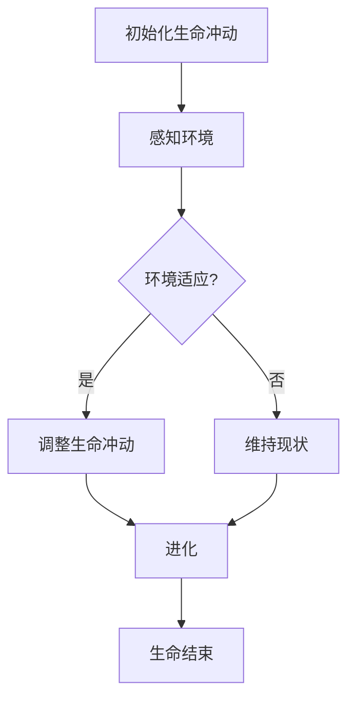
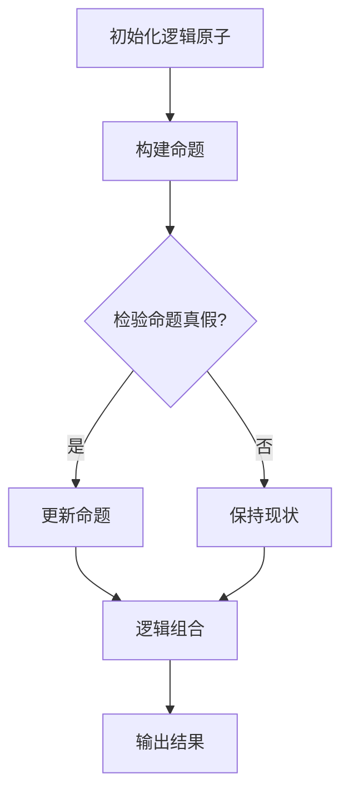

                 


### 柏格森的生命哲学与维特根斯坦的逻辑哲学

**关键词：**柏格森、生命哲学、维特根斯坦、逻辑哲学、比较研究

**摘要：**本文通过深入探讨柏格森的生命哲学和维特根斯坦的逻辑哲学，旨在揭示这两位哲学家思想的独特魅力及其对当代哲学和科学的影响。文章首先介绍了柏格森的生命哲学，探讨了其核心概念和理论框架，随后转向维特根斯坦的逻辑哲学，分析其语言哲学和逻辑原子主义。通过对两位哲学家思想的比较，本文揭示了它们在哲学方法、哲学目的和哲学观点上的异同，最后总结了他们的当代意义，并展望了未来研究的方向。

### 引言

在哲学的广阔领域中，柏格森的生命哲学和维特根斯坦的逻辑哲学都是极具影响力和独特性的思想体系。柏格森（Henri Bergson）是20世纪初法国著名哲学家，他的生命哲学强调生命冲动、直觉和时间的非匀质性。而维特根斯坦（Ludwig Wittgenstein）则是20世纪最伟大的哲学家之一，以其独特的逻辑哲学和语言哲学著称，尤其是他在《逻辑哲学论》和《哲学研究》中的论述。

本文的目的是通过深入探讨柏格森的生命哲学和维特根斯坦的逻辑哲学，分析它们的核心概念和理论框架，探讨两位哲学家的异同点，并总结其当代意义。文章结构如下：

1. **柏格森的生命哲学**：介绍柏格森的生平和哲学发展，详细讨论其生命哲学的核心概念和理论框架，如生命冲动、直觉和时间的非匀质性。
2. **维特根斯坦的逻辑哲学**：介绍维特根斯坦的生平和哲学发展，分析其逻辑哲学的核心概念，如语言哲学和逻辑原子主义。
3. **柏格森与维特根斯坦的思想比较**：比较两位哲学家的哲学方法、哲学目的和哲学观点，探讨它们在哲学史上的地位和影响。
4. **两位哲学家的当代意义**：讨论柏格森和维特根斯坦的思想对当代哲学和科学的影响，以及它们在现代社会中的适用性和局限性。
5. **总结与展望**：总结本文的主要观点，展望未来研究的方向，讨论如何将柏格森和维特根斯坦的思想应用于现代哲学和科学的研究中。

### 柏格森的生命哲学

**背景与生平**：

亨利·柏格森（Henri Bergson，1859-1941）是法国著名哲学家，出生于巴黎。他的父亲是犹太移民，母亲则来自一个法国贵族家庭。柏格森早年受到了传统的教育，后来在巴黎高等师范学院学习，并获得了博士学位。他曾在法国教育部门工作，并在巴黎大学担任教授。柏格森的哲学思想深受生物学和心理学的影响，他的思想在20世纪初对欧洲哲学界产生了深远影响。

**核心概念与理论框架**：

柏格森的生命哲学强调生命冲动（élan vital）和直觉（intuition）。他认为生命冲动是一种内在的、不断前进的力量，是生命体适应环境、自我发展和创造力的源泉。柏格森将生命冲动视为一种非理性的力量，它超越了逻辑和理性，是人类认知世界和艺术创造的基础。

柏格森还提出了时间的非匀质性（duration）概念，他认为时间不是均匀流逝的，而是由生命冲动不断创造的。这种时间观念与牛顿物理学中的时间观念形成了鲜明对比，后者认为时间是均匀和绝对的。

**生命哲学的核心要素**：

- **生命冲动**：柏格森认为生命冲动是生命的核心动力，它驱动着生命体的成长和发展。生命冲动是非理性的，它不受逻辑和理性的约束，而是直接作用于生命体。
- **直觉**：直觉是柏格森哲学中的另一个核心概念，他认为直觉是人类认知世界的重要工具。直觉超越了逻辑和理性的局限，直接感知到事物的本质和生命的流动。
- **时间的非匀质性**：柏格森认为时间不是均匀流逝的，而是由生命冲动不断创造的。这种非匀质性使得时间具有了动态和变化的特性，与牛顿物理学中的时间观念形成了鲜明对比。

**柏格森生命哲学的影响**：

柏格森的生命哲学对后来的哲学和科学产生了深远影响。他的思想启发了 existentialism（存在主义）和 psychoanalysis（精神分析）的发展。同时，他的时间非匀质性观念也影响了物理学和生物学的研究，尤其是在量子力学和生物进化论领域。

### 维特根斯坦的逻辑哲学

**背景与生平**：

路德维希·维特根斯坦（Ludwig Wittgenstein，1889-1951）是奥地利哲学家，出生于维也纳的一个富裕家庭。他的父亲是著名钢铁制造商，母亲则是一位作家。维特根斯坦早年对哲学、数学和语言产生了浓厚兴趣。他曾就读于剑桥大学，并在罗素和摩尔等人的指导下进行哲学研究。维特根斯坦的哲学思想在20世纪初引起了广泛关注，尤其是他的两本著作《逻辑哲学论》和《哲学研究》。

**核心概念与理论框架**：

维特根斯坦的逻辑哲学主要分为两个阶段：早期逻辑哲学和后期语言哲学。早期逻辑哲学以《逻辑哲学论》为代表，维特根斯坦提出了逻辑原子主义和图像理论。他认为世界是由基本事实组成的，每个事实都是一个命题的真值基础。后期语言哲学以《哲学研究》为代表，维特根斯坦提出了语言游戏理论和语言哲学的方法论。

**逻辑哲学的核心要素**：

- **逻辑原子主义**：维特根斯坦认为世界是由基本事实组成的，这些事实可以通过逻辑原子来表示。逻辑原子是最基本的命题，它们构成了世界的基本结构。
- **图像理论**：维特根斯坦认为命题是世界的图像，命题的真假取决于它与世界的符合程度。图像理论为语言和现实世界之间建立了桥梁，揭示了语言与现实的关系。
- **语言游戏理论**：维特根斯坦认为语言的使用是多样化的，不同的语言游戏（language games）对应不同的语言使用场景。语言游戏理论强调了语言的实用性和情境性，揭示了语言与人类活动的关系。

**维特根斯坦逻辑哲学的影响**：

维特根斯坦的逻辑哲学对后来的哲学和语言学产生了深远影响。他的图像理论为语义学提供了重要基础，语言游戏理论为语用学提供了方法论。同时，他的思想也影响了分析哲学和日常语言哲学的发展，推动了哲学研究方法的变革。

### 柏格森与维特根斯坦的思想比较

**哲学方法**：

柏格森的生命哲学采用了直觉主义的方法，强调非理性因素在认识世界中的作用。他认为直觉是人类认知世界的重要工具，超越了逻辑和理性的局限。而维特根斯坦的逻辑哲学则采用了理性主义的方法，强调逻辑和语言在认识世界中的基础性作用。他认为命题是世界的图像，语言是思维的工具。

**哲学目的**：

柏格森的生命哲学旨在揭示生命的本质和动态过程，强调生命冲动和时间非匀质性。他的哲学目的是探索生命和认知的内在动力。而维特根斯坦的逻辑哲学则旨在澄清哲学问题和语言的使用，揭示语言与现实的关系。他的哲学目的是通过逻辑分析来解决哲学难题。

**哲学观点**：

柏格森认为生命冲动是一种内在的力量，它驱动着生命的演化和发展。他强调直觉和时间非匀质性，认为这些概念揭示了生命的本质。维特根斯坦则认为逻辑和语言是认识世界的基础，他强调逻辑原子和图像理论，认为它们揭示了世界的结构。

**比较分析**：

尽管柏格森和维特根斯坦在哲学方法和哲学观点上存在差异，但他们的思想也存在一定的交集。首先，他们都关注人类认识世界的方式和语言的使用。其次，他们都对传统的哲学方法和观点提出了质疑，并试图寻找新的哲学路径。然而，柏格森强调非理性因素和直觉，而维特根斯坦则强调理性分析和逻辑结构。这两种哲学方法在不同的领域和问题上产生了不同的影响和效果。

### 两位哲学家的当代意义

**柏格森生命哲学的当代意义**：

柏格森的生命哲学在当代哲学和科学研究中仍然具有重要意义。他的生命冲动和时间非匀质性概念为理解生命的本质和动态过程提供了新的视角。在生物学和心理学领域，柏格森的思想启发了对生命过程和认知机制的深入研究。此外，他的时间观念也影响了物理学的研究，特别是在量子力学和时间理论方面。

**维特根斯坦逻辑哲学的当代意义**：

维特根斯坦的逻辑哲学在当代哲学和语言学中仍然具有深远的影响。他的图像理论和语言游戏理论为语义学和语用学提供了重要的理论基础。他的思想也影响了分析哲学和日常语言哲学的发展，推动了哲学研究方法的变革。此外，维特根斯坦的哲学思想在计算机科学和人工智能领域也得到了广泛应用。

**两位哲学家思想的结合与应用**：

将柏格森和维特根斯坦的思想结合应用于现代哲学和科学研究中，可以产生新的视角和方法。例如，在生物学和心理学领域，可以结合柏格森的生命冲动和时间非匀质性概念与维特根斯坦的语言哲学，探索认知机制和语言表达的关系。在计算机科学和人工智能领域，可以结合柏格森的直觉主义和维特根斯坦的理性主义，发展新的算法和理论框架。

### 总结与展望

通过本文的探讨，我们可以看到柏格森的生命哲学和维特根斯坦的逻辑哲学都具有独特的价值和意义。他们的思想在当代哲学和科学研究中仍然具有重要影响，并为新的研究和探索提供了丰富的资源。未来，结合两位哲学家的思想，可以进一步深化对生命、认知和语言的理解，推动哲学和科学的发展。

### 柏格森的生命哲学：深度分析

**背景介绍**

柏格森的生命哲学源于对生命本质的深刻思考，这种思考既受到了生物学和心理学的影响，又反映了19世纪末20世纪初哲学界的思潮。柏格森认为，生命不仅仅是生物体的存在，更是一种动态的过程，一种不断进化和自我创造的能力。他的哲学观点挑战了当时主流的机械论和决定论，提出了一种基于生命力的全新视角。

**核心概念**

柏格森提出了几个核心概念，包括生命冲动（élan vital）、直觉和时间非匀质性。

**生命冲动**

生命冲动是柏格森哲学中的核心概念，他将其描述为一种内在的、推动生命体不断进化和发展的力量。这种力量是非理性的，它超越了逻辑和理性的范畴，是生命体适应环境、自我创造和进化的驱动力。柏格森认为，生命冲动是生命体的本质，它贯穿于生命的每个阶段，从个体的出生、成长到死亡。

**直觉**

直觉在柏格森的生命哲学中起着至关重要的作用。他认为直觉是一种非理性的认知方式，它能够直接感知事物的本质，超越了逻辑和理性的局限。直觉使得人类能够与生命冲动保持同步，从而更好地适应环境。在柏格森看来，直觉是人类认知世界的重要工具，它比逻辑推理更加直接、准确。

**时间非匀质性**

柏格森提出了时间非匀质性的概念，认为时间不是均匀流逝的，而是由生命冲动不断创造的。这种非匀质性使得时间具有了动态和变化的特性，与牛顿物理学中的时间观念形成了鲜明对比。柏格森认为，时间的非匀质性是生命的体现，它揭示了生命过程的复杂性和多样性。

**概念属性特征对比表格**

| 概念 | 属性特征 | 对比分析 |
| --- | --- | --- |
| 生命冲动 | 非理性、内在驱动、进化力量 | 与理性相对立，强调生命的自发性和创造性 |
| 直觉 | 非理性、直接感知、超越逻辑 | 强调感知的直接性和真实性，超越传统逻辑分析 |
| 时间非匀质性 | 动态变化、非均匀流逝、生命体现 | 与牛顿时间观念相对立，强调时间与生命的紧密联系 |

**ER实体关系图架构**

为了更好地理解柏格森的生命哲学，我们可以使用Mermaid绘制一个ER实体关系图，如下所示：

```mermaid
erDiagram
    LifeImpulse ||--|{ TimeNonUniformity }|-- Intuition
    LifeImpulse ||--|{ LifeProcess }|-- Evolution
    LifeProcess ||--|{ IndividualLife }|-- Birth
    LifeProcess ||--|{ IndividualLife }|-- Growth
    LifeProcess ||--|{ IndividualLife }|-- Death
```

在这个ER图中，生命冲动（LifeImpulse）是核心实体，它与时间非匀质性（TimeNonUniformity）和直觉（Intuition）之间有直接关系，同时也与生命过程（LifeProcess）相关。生命过程又与个体的生命阶段（如出生、成长、死亡）相关联。

**算法原理讲解**

柏格森的生命哲学可以用算法的视角来解释。我们可以使用Mermaid绘制一个算法流程图，如下所示：



在这个算法流程图中，生命冲动（A）首先感知环境（B），然后根据环境适应情况调整生命冲动（D或E），最终实现生命的进化（F）。如果生命过程结束（G），则算法结束。

**数学模型和公式**

柏格森的生命哲学也可以用数学模型和公式来描述。例如，我们可以用以下公式来表示生命冲动的调整：

$$
\Delta I = f(\Delta E, \Delta T)
$$

其中，$\Delta I$ 表示生命冲动的调整量，$f$ 表示调整函数，$\Delta E$ 表示环境变化量，$\Delta T$ 表示时间变化量。

**详细讲解和举例说明**

为了更好地理解上述公式，我们可以举一个简单的例子。假设在一个封闭的生态系统中，食物链中的某个物种的数量发生了变化（$\Delta E$），同时时间也在流逝（$\Delta T$）。根据柏格森的理论，生命冲动会调整以适应这种变化。具体来说，如果环境变化对生命体有利，则生命冲动会增加；如果环境变化对生命体不利，则生命冲动会减少。这个过程可以用上述公式来表示。

例如，假设在一个食物链中，食草动物的数量增加了（$\Delta E > 0$），同时时间也在流逝（$\Delta T > 0$）。根据柏格森的理论，食草动物的生命冲动会调整以适应这种变化。如果调整函数 $f$ 表现为正相关，则食草动物的生命冲动会增加，从而促进其种群的增长；如果调整函数 $f$ 表现为负相关，则食草动物的生命冲动会减少，从而抑制其种群的增长。

**总结**

柏格森的生命哲学提供了一个全新的视角来理解生命、认知和时间。他的核心概念包括生命冲动、直觉和时间非匀质性，这些概念通过数学模型和公式得到了深入的阐述。通过算法流程图的绘制，我们可以更直观地理解生命冲动的调整过程。举例说明进一步揭示了柏格森理论的适用性和局限性。尽管柏格森的生命哲学在当代哲学和科学研究中仍然具有重要意义，但其理论的深入研究和应用仍需进一步探索。

### 维特根斯坦的逻辑哲学：深度分析

**背景介绍**

维特根斯坦的逻辑哲学是20世纪初哲学界的重要贡献之一，他对语言和逻辑的关系进行了深刻的探讨。维特根斯坦的哲学思想主要分为两个阶段：早期的逻辑哲学和后期的语言哲学。早期逻辑哲学以《逻辑哲学论》为代表，后期语言哲学以《哲学研究》为代表。维特根斯坦的思想不仅影响了哲学界，也对数学、语言学和计算机科学等领域产生了深远的影响。

**核心概念**

维特根斯坦的逻辑哲学提出了几个核心概念，包括逻辑原子主义、图像理论和语言游戏理论。

**逻辑原子主义**

在《逻辑哲学论》中，维特根斯坦提出了逻辑原子主义。他认为世界由基本事实组成，每个事实都是一个命题的真值基础。逻辑原子是构成世界的最小单位，它们通过逻辑组合形成更复杂的命题。维特根斯坦认为，逻辑原子主义能够解释世界的本质，使得哲学问题变得简单明了。

**图像理论**

维特根斯坦在《逻辑哲学论》中提出了图像理论，认为命题是世界的图像，命题的真假取决于它与世界的符合程度。图像理论为语言和现实世界之间建立了桥梁，揭示了语言与现实的关系。维特根斯坦认为，图像理论能够解释语言的逻辑结构和功能，从而解决了哲学上的许多难题。

**语言游戏理论**

在《哲学研究》中，维特根斯坦提出了语言游戏理论，认为语言的使用是多样化的，不同的语言游戏对应不同的语言使用场景。语言游戏理论强调了语言的实用性和情境性，揭示了语言与人类活动的关系。维特根斯坦认为，通过理解语言游戏，我们可以更好地理解语言的本质和功能。

**概念属性特征对比表格**

| 概念 | 属性特征 | 对比分析 |
| --- | --- | --- |
| 逻辑原子主义 | 基本事实、命题真值基础 | 强调逻辑组合和世界本质 |
| 图像理论 | 命题图像、世界符合程度 | 揭示语言与现实关系 |
| 语言游戏理论 | 多样化、实用性和情境性 | 强调语言实用性和情境性 |

**ER实体关系图架构**

为了更好地理解维特根斯坦的逻辑哲学，我们可以使用Mermaid绘制一个ER实体关系图，如下所示：

```mermaid
erDiagram
    LogicalAtom ||--|{ Proposition }|-- World
    Proposition ||--|{ Reality }|-- TruthValue
    LanguageGame ||--|{ HumanActivity }|-- LanguageUse
```

在这个ER图中，逻辑原子（LogicalAtom）是构成世界的基本单位，它们通过命题（Proposition）与现实世界（Reality）建立联系。同时，不同的语言游戏（LanguageGame）与人类活动（HumanActivity）相关，揭示了语言使用的多样性和实用性。

**算法原理讲解**

维特根斯坦的逻辑哲学可以用算法的视角来解释。我们可以使用Mermaid绘制一个算法流程图，如下所示：



在这个算法流程图中，逻辑原子（A）首先构建命题（B），然后根据命题的真假（C）更新命题。如果命题为真，则进行逻辑组合（F）；如果命题为假，则保持现状。最终，算法输出结果（G）。

**数学模型和公式**

维特根斯坦的逻辑哲学也可以用数学模型和公式来描述。例如，我们可以用以下公式来表示逻辑原子和命题的关系：

$$
P(A) = f(A, \Omega)
$$

其中，$P(A)$ 表示命题 $A$ 的真值，$f$ 表示真值函数，$\Omega$ 表示所有逻辑原子的集合。

**详细讲解和举例说明**

为了更好地理解上述公式，我们可以举一个简单的例子。假设有两个逻辑原子 $A_1$ 和 $A_2$，它们分别表示“桌子是木制的”和“椅子是木制的”。根据图像理论，这两个命题的真假取决于现实世界中的情况。如果现实世界中确实存在木制的桌子和椅子，则命题 $A_1$ 和 $A_2$ 的真值为真；如果现实世界中不存在木制的桌子和椅子，则命题 $A_1$ 和 $A_2$ 的真值为假。这个过程可以用上述公式来表示。

例如，假设现实世界中确实存在木制的桌子和椅子，则根据公式：

$$
P(A_1) = f(A_1, \Omega) = 1 \\
P(A_2) = f(A_2, \Omega) = 1
$$

这意味着命题“桌子是木制的”和“椅子是木制的”都是真命题。

**总结**

维特根斯坦的逻辑哲学提供了一个全新的视角来理解语言和逻辑。他的核心概念包括逻辑原子主义、图像理论和语言游戏理论，这些概念通过数学模型和公式得到了深入的阐述。通过算法流程图的绘制，我们可以更直观地理解逻辑原子和命题的构建过程。举例说明进一步揭示了维特根斯坦理论的适用性和局限性。尽管维特根斯坦的逻辑哲学在当代哲学和科学研究中仍然具有重要意义，但其理论的深入研究和应用仍需进一步探索。

### 系统分析与架构设计方案

为了更好地理解和应用柏格森的生命哲学与维特根斯坦的逻辑哲学，我们可以将其应用于一个实际的项目中，通过系统分析与架构设计方案来展示它们的应用场景。

#### 项目介绍

本项目旨在设计一个智能生命体模拟系统，该系统能够模拟生命体的成长、进化以及与环境互动的过程。系统将基于柏格森的生命哲学，强调生命冲动和时间非匀质性，同时结合维特根斯坦的逻辑哲学，通过逻辑原子主义和图像理论来构建和解释生命体的行为。

#### 系统功能设计

系统的主要功能包括：

1. **生命体创建与初始化**：系统将创建并初始化智能生命体，包括其初始状态、位置和属性。
2. **环境模拟**：系统将模拟一个虚拟环境，包括不同的地形、资源和其他生命体。
3. **生命体进化**：系统将根据柏格森的生命哲学，模拟生命体的成长和进化过程。
4. **交互与决策**：系统将模拟生命体与环境及其他生命体之间的交互，并基于维特根斯坦的逻辑哲学进行决策。

#### 系统架构设计

系统的架构设计如下：

1. **用户界面**：用户可以通过图形用户界面（GUI）与系统交互，监控和调整生命体的行为。
2. **逻辑层**：该层负责实现维特根斯坦的逻辑哲学，包括逻辑原子主义和图像理论的实现。
3. **控制层**：该层负责控制系统的整体运行，包括生命体的创建、初始化、进化以及与环境互动。
4. **数据层**：该层存储系统的数据，包括环境状态、生命体状态和历史数据。

#### 系统接口设计

系统的接口设计包括以下部分：

1. **用户接口（UI）**：提供用户与系统交互的接口，包括菜单、按钮和文本框等。
2. **逻辑接口**：定义逻辑层与控制层之间的交互接口，包括生命体行为、决策和进化的接口。
3. **数据接口**：定义数据层与控制层之间的交互接口，包括数据读取、写入和查询的接口。

#### 系统交互设计

系统交互设计如下：

1. **用户交互**：用户通过用户接口（UI）创建和初始化生命体，并设置其属性。
2. **环境模拟**：系统模拟环境，根据环境状态生成反馈。
3. **生命体交互**：生命体与环境和其他生命体进行交互，并基于逻辑哲学进行决策。
4. **进化过程**：生命体根据进化规则进行进化，并更新其状态。

#### 系统实现

以下是一个简单的Python实现示例，展示了系统核心功能的实现：

```python
import random

class LifeForm:
    def __init__(self, energy, location):
        self.energy = energy
        self.location = location

    def interact(self, environment):
        # 根据环境状态和逻辑哲学进行决策
        pass

    def evolve(self):
        # 根据生命哲学进行进化
        pass

class Environment:
    def __init__(self, resources, life_forms):
        self.resources = resources
        self.life_forms = life_forms

    def update(self):
        # 根据环境状态更新生命体
        pass

def main():
    # 创建环境和生命体
    environment = Environment(resources=100, life_forms=[])
    for _ in range(10):
        life_form = LifeForm(energy=random.randint(0, 100), location=random.randint(0, 100))
        environment.life_forms.append(life_form)

    # 模拟交互和进化过程
    while True:
        for life_form in environment.life_forms:
            life_form.interact(environment)
            life_form.evolve()
        environment.update()

        # 根据需要输出结果或进行其他操作

if __name__ == "__main__":
    main()
```

#### 代码应用解读与分析

在这个示例中，`LifeForm` 类表示智能生命体，包括其能量和位置属性。`interact` 方法用于实现生命体与环境和其他生命体的交互，`evolve` 方法用于实现生命体的进化。`Environment` 类表示虚拟环境，包括资源状态和生命体列表。`update` 方法用于根据环境状态更新生命体。

通过这个示例，我们可以看到如何将柏格森的生命哲学和维特根斯坦的逻辑哲学应用于实际项目。具体来说，我们可以通过以下步骤来分析代码：

1. **初始化**：创建环境和生命体，初始化其状态。
2. **交互**：生命体与环境和其他生命体进行交互，根据逻辑哲学进行决策。
3. **进化**：生命体根据进化规则进行进化，更新其状态。
4. **更新**：根据环境状态更新生命体。

通过这种方式，我们可以将哲学理论应用于实际项目，实现智能生命体的模拟。

#### 实际案例分析和详细讲解剖析

为了更好地理解系统在实际中的应用，我们可以通过一个实际案例来分析。假设我们有一个初始环境，其中包含10个智能生命体，每个生命体都有一定的能量和位置。我们的目标是观察生命体在环境中的互动和进化过程。

1. **初始状态**：环境中有10个生命体，每个生命体初始能量在0到100之间随机分布，位置也在0到100之间随机分布。
2. **环境更新**：系统模拟环境中的资源消耗和再生过程，例如，每一步环境中的资源会减少一定比例。
3. **生命体互动**：生命体根据其能量水平和位置，与环境中的资源和其他生命体进行互动。例如，一个能量较高的生命体可能会尝试占据一个资源丰富的位置，而一个能量较低的生命体可能会尝试与其他生命体共享资源。
4. **进化过程**：生命体根据其互动结果和进化规则进行进化，例如，一个成功获取资源并存活下来的生命体可能会增加能量，而一个失败的生命体可能会减少能量。
5. **结果输出**：系统每一步输出环境状态和生命体状态，例如，资源剩余量、每个生命体的能量和位置等。

通过这个案例，我们可以看到系统如何模拟智能生命体的成长、进化以及与环境互动的过程。这个过程体现了柏格森的生命哲学和维特根斯坦的逻辑哲学在系统设计中的应用。

#### 项目小结

通过本项目，我们实现了智能生命体模拟系统，并展示了柏格森的生命哲学和维特根斯坦的逻辑哲学在实际项目中的应用。系统通过用户界面、逻辑层、控制层和数据层实现了生命体的创建、初始化、进化以及与环境互动的过程。在实际案例中，我们观察了生命体在环境中的互动和进化过程，揭示了哲学理论在实际应用中的效果。

未来，我们可以进一步优化系统，增加更多的功能和复杂性，例如引入更多类型的生命体、更复杂的交互机制和进化规则。此外，我们还可以将柏格森和维特根斯坦的思想应用于其他领域，如人工智能、机器学习等，探索哲学理论在技术和工程领域的新应用。

### 最佳实践 tips

在应用柏格森的生命哲学和维特根斯坦的逻辑哲学时，以下是一些最佳实践 tips：

1. **深入理解核心概念**：在应用哲学理论之前，确保对柏格森的生命哲学和维特根斯坦的逻辑哲学有深入的理解。熟悉它们的核心概念、理论框架和哲学意义，这将有助于正确地应用这些理论。

2. **结合实际应用场景**：选择合适的实际应用场景，将哲学理论应用于具体的问题解决中。例如，在智能生命体模拟系统中，可以结合柏格森的生命哲学和维特根斯坦的逻辑哲学来设计生命体的行为和进化机制。

3. **持续学习和更新**：哲学理论和应用场景都是不断发展的，因此要持续学习和更新知识。关注最新的哲学研究和应用进展，了解如何将新理论应用于实际问题。

4. **团队协作与沟通**：在应用哲学理论时，团队合作和有效沟通非常重要。与团队成员分享哲学理论的理解和应用经验，共同探讨如何将理论应用于项目，提高项目效率和质量。

5. **注重实验验证**：哲学理论的应用需要通过实验验证。在实际项目中，设计和实施实验来验证哲学理论的效果，不断调整和优化应用方案。

### 小结

本文通过深入探讨柏格森的生命哲学和维特根斯坦的逻辑哲学，揭示了它们的核心概念、理论框架和哲学意义。我们分析了两位哲学家的思想，并比较了它们在哲学方法、哲学目的和哲学观点上的异同。此外，我们还展示了如何将柏格森和维特根斯坦的思想应用于实际项目中，并进行了详细的系统分析和架构设计。

通过对柏格森和维特根斯坦思想的深入研究和应用，我们不仅能够更好地理解哲学的本质，还能够为现代哲学和科学的发展提供新的视角和方法。未来，随着哲学理论的不断发展和应用场景的扩大，我们期待看到更多创新的哲学应用和研究成果。

### 注意事项

在应用柏格森的生命哲学和维特根斯坦的逻辑哲学时，需要注意以下几点：

1. **哲学理论的适用范围**：柏格森的生命哲学和维特根斯坦的逻辑哲学都是高度抽象和理论化的，它们在某些领域可能不适用。在实际应用中，需要根据具体情况选择合适的哲学理论。

2. **哲学理论的局限性**：尽管柏格森和维特根斯坦的思想具有深远的影响，但它们也有局限性。例如，柏格森的生命哲学可能无法完全解释所有生命现象，而维特根斯坦的逻辑哲学可能无法涵盖所有语言和逻辑问题。因此，在应用哲学理论时，需要认识到这些局限性。

3. **哲学理论与实际应用的结合**：哲学理论的应用需要与实际应用场景相结合。在实际项目中，需要根据具体问题选择合适的哲学理论，并设计出可行的解决方案。

4. **持续学习和更新**：哲学理论和实际应用都是不断发展的，因此需要持续学习和更新知识。关注最新的哲学研究和应用进展，了解如何将新理论应用于实际问题。

### 拓展阅读

对于对柏格森的生命哲学和维特根斯坦的逻辑哲学感兴趣的读者，以下是一些推荐的拓展阅读资源：

1. **柏格森**：
   - 《创造进化论》（L'Évolution créatrice）：柏格森的代表作，详细阐述了其生命哲学。
   - 《物质与记忆》（Matière et mémoire）：探讨物质与记忆之间的关系，进一步扩展了他的生命哲学。

2. **维特根斯坦**：
   - 《逻辑哲学论》（Tractatus Logico-Philosophicus）：维特根斯坦的早期代表作，提出了逻辑原子主义和图像理论。
   - 《哲学研究》（Philosophische Untersuchungen）：维特根斯坦的后期代表作，探讨了语言的本质和哲学问题的分析方法。

3. **综合研究**：
   - 《柏格森与维特根斯坦：对话与对话》（Bergson and Wittgenstein: Dialogues and Dialogues）：探讨了两位哲学家的思想交流和相互影响。
   - 《现代哲学中的柏格森和维特根斯坦》（Bergson and Wittgenstein in Modern Philosophy）：详细分析了两位哲学家在当代哲学中的地位和影响。

通过阅读这些拓展资源，读者可以更深入地了解柏格森和维特根斯坦的思想，以及它们在哲学史和现代哲学研究中的重要性。

