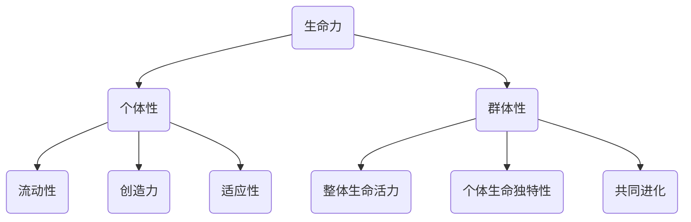
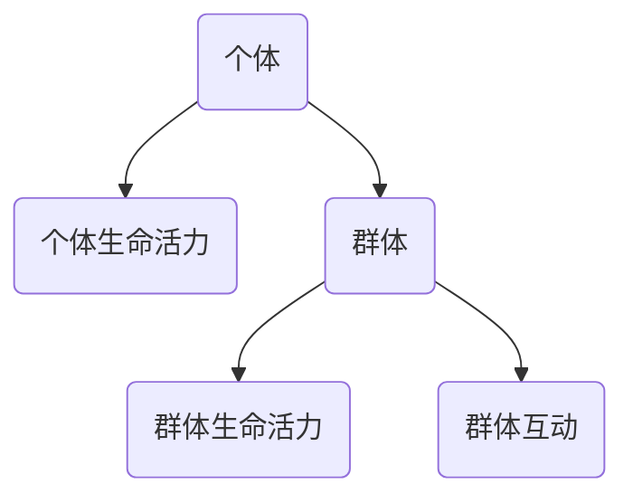
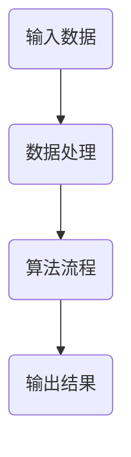
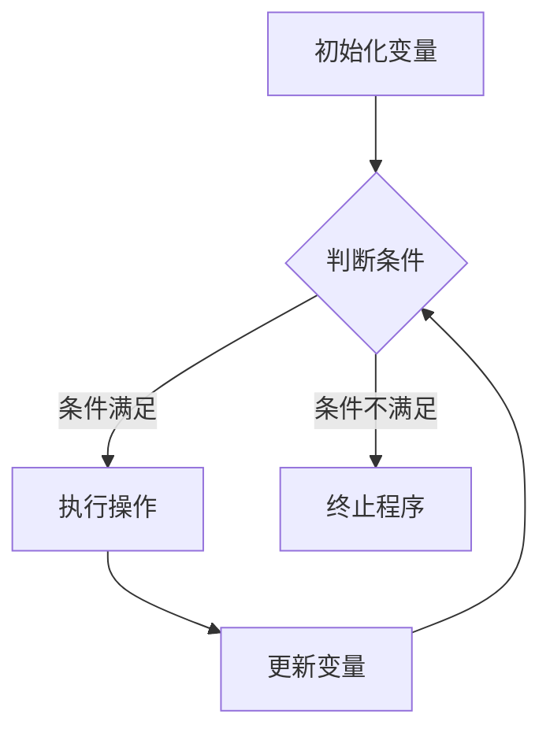
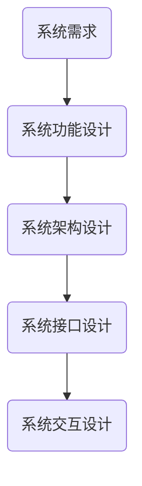
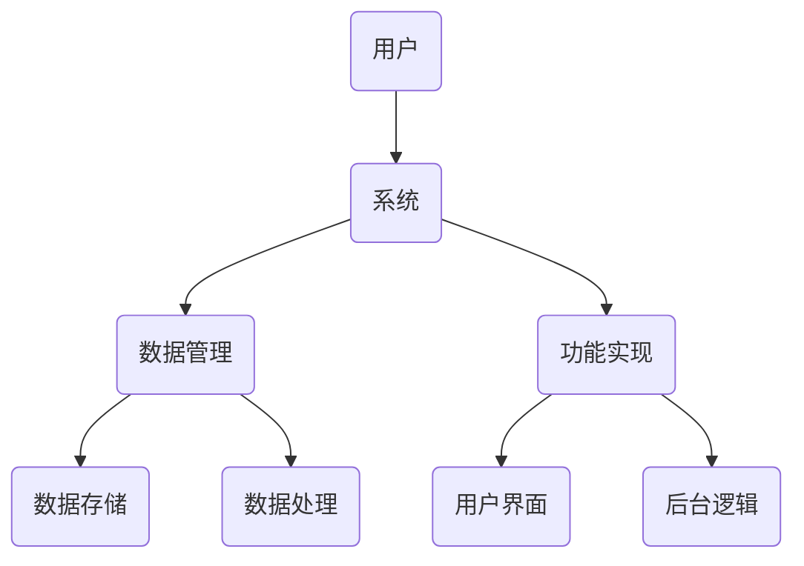
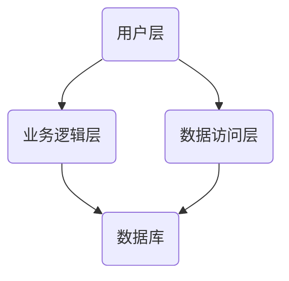
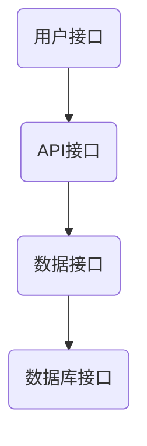
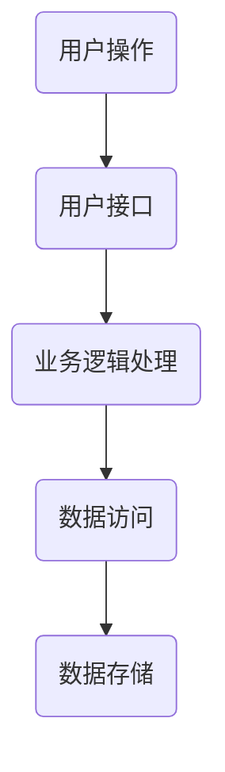

                 

# 柏格森的生命哲学对存在主义的影响及维特根斯坦的回应

## 关键词
- 柏格森
- 生命哲学
- 存在主义
- 维特根斯坦
- 哲学回应

## 摘要
本文旨在探讨柏格森的生命哲学对存在主义的影响，以及维特根斯坦如何回应这一哲学思潮。文章首先介绍柏格森的生命哲学，包括其核心概念和特征，接着分析其对存在主义的影响。随后，文章详细论述维特根斯坦对柏格森生命哲学的批评和回应，包括其对生命观和存在主义的贡献。最后，本文通过比较柏格森和维特根斯坦的哲学观点，总结两位哲学家的思想差异和共同点。

## 引言

### 柏格森的生命哲学

柏格森（Henri Bergson）是20世纪初法国著名哲学家，其哲学思想对存在主义产生了深远影响。柏格森的生命哲学强调生命的活力和创造力，认为生命是一种不断变化和进化的过程。他的主要观点包括：

1. **生命的本质**：柏格森认为，生命的本质是“纯粹的生命力”（élan vital），这是一种推动生命体不断变化和进化的内在力量。
2. **生命的特征**：生命力具有个体性和群体性，既表现为个体生命的独特性，也表现为群体生命的整体性。
3. **生命的意义**：生命的意义在于创造和进化，个体和群体都通过不断适应环境来实现自我完善。

### 存在主义的发展

存在主义是20世纪最重要的哲学思潮之一，其核心观点是强调个体存在的自由和责任。存在主义的发展可以分为三个主要阶段：

1. **早期存在主义**：以丹麦哲学家基尔克郭尔（Søren Kierkegaard）和德国哲学家荷尔拜因（Friedrich Nietzsche）为代表，强调个体存在的孤独和绝望。
2. **中期存在主义**：以法国哲学家海德格尔（Martin Heidegger）和萨特（Jean-Paul Sartre）为代表，强调个体存在的自由和选择。
3. **晚期存在主义**：以法国哲学家福柯（Michel Foucault）和德勒兹（Gilles Deleuze）为代表，将存在主义与心理学、社会学和文学相结合。

### 维特根斯坦的回应

维特根斯坦（Ludwig Wittgenstein）是20世纪另一位重要哲学家，其哲学思想与柏格森的生命哲学存在一定程度的对立。维特根斯坦的语言哲学强调语言与现实的本质联系，批评存在主义的形而上学基础。他的主要观点包括：

1. **语言的局限**：维特根斯坦认为，语言无法表达生命的内在本质，因此存在主义的观点是难以被证明的。
2. **生命的理解**：维特根斯坦认为，生命是一种事实状态，而非形而上学的实体。

## 柏格森生命哲学的核心概念与特征

### 生命的概念体系

柏格森的生命哲学围绕“纯粹的生命力”这一核心概念展开。他主张，生命力是生命的本质，是一种内在的、推动生命体不断变化和进化的力量。柏格森认为，生命力具有以下特点：

1. **个体性**：生命力在个体生命体中表现为独特的生命活力，每个生命体都有其独特的生命力。
2. **群体性**：生命力在群体生命体中表现为整体的生命活力，群体生命体通过个体生命的相互作用实现共同进化。

### 生命的特征

柏格森的生命哲学认为，生命具有以下几个特征：

1. **流动性**：生命是一种动态的过程，不断变化和进化。
2. **创造力**：生命力具有创造力，能够创造出新的生命形式。
3. **适应性**：生命力能够适应环境变化，实现生命的自我完善。

### 生命哲学的意义

柏格森的生命哲学在教育、艺术和科学等领域产生了深远影响。他认为，生命哲学有助于：

1. **教育理念**：培养个体生命的独特性和创造力，实现个体与群体的共同进化。
2. **艺术创作**：强调艺术家在创作过程中的生命力和创造力。
3. **科学研究**：推动科学方法的创新，强调观察和实验在科学研究中的重要性。

## 柏格森生命哲学对存在主义的影响

### 柏格森生命哲学与存在主义的交集

柏格森的生命哲学与存在主义在某些方面存在交集，例如对个体存在和自由的关注。然而，两者在哲学基础和观念上存在显著差异。以下是柏格森生命哲学对存在主义的影响：

1. **生命活力与存在的自由**：柏格森的生命哲学强调生命的活力和创造力，这与存在主义强调个体存在的自由和选择有相似之处。然而，柏格森的生命力是一种内在的、客观存在的力量，而存在主义的自由更多体现在个体的主观选择。
2. **生命的自由与存在的价值**：柏格森认为，生命的自由在于不断创造和进化，这种自由具有客观的价值。而存在主义则强调个体存在的自由，更多地关注个体的主观体验和价值。

### 柏格森生命哲学对存在主义的影响

柏格森的生命哲学对存在主义产生了重要影响，主要体现在以下几个方面：

1. **存在主义的哲学变革**：柏格森的生命哲学为存在主义提供了一种新的哲学基础，使存在主义从早期的个体主义向群体主义转变。这种变革使存在主义更加关注个体与社会的互动，强调个体在群体中的角色和责任。
2. **存在主义的应用拓展**：柏格森的生命哲学为存在主义在心理学、社会学和文化研究等领域的应用提供了新的视角。例如，在心理学领域，柏格森的生命哲学为研究个体心理过程和群体心理现象提供了理论依据。

## 维特根斯坦对柏格森生命哲学的回应

### 维特根斯坦对柏格森的批评

维特根斯坦对柏格森的生命哲学持有批评态度，主要原因在于他对语言和现实关系的看法。以下是维特根斯坦对柏格森批评的主要内容：

1. **语言的局限**：维特根斯坦认为，语言无法表达生命的内在本质。他认为，语言是一种工具，只能用于描述事实，而不能表达无法被证明的形而上学概念。
2. **生命力的概念**：维特根斯坦认为，柏格森的生命力概念是一种形而上学的错误。他认为，生命力是一种无法被观察和验证的实体，因此无法作为科学的对象。

### 维特根斯坦的生命观

维特根斯坦的生命观强调生命是一种事实状态，而不是形而上学的实体。他认为，生命是一种客观存在，可以通过观察和实验来研究。以下是维特根斯坦生命观的主要观点：

1. **生命的客观性**：维特根斯坦认为，生命是一种客观存在，可以通过科学方法来研究。他强调，科学家应该专注于观察和实验，而不是形而上学的争论。
2. **生命的价值**：维特根斯坦认为，生命的价值在于个体的主观体验。他认为，个体的生命体验是唯一的，无法通过语言来传达。

## 维特根斯坦对存在主义的贡献

### 维特根斯坦对存在主义的影响

维特根斯坦对存在主义产生了重要影响，主要体现在以下几个方面：

1. **存在主义的理论发展**：维特根斯坦的语言哲学为存在主义提供了一种新的理论框架，使存在主义从传统的形而上学转向语言和现实的关系。这种转变使存在主义更加关注个体与语言的关系，强调个体的语言表达和沟通能力。
2. **存在主义的应用拓展**：维特根斯坦的存在主义哲学为存在主义在语言学、逻辑学和心理学等领域的应用提供了新的视角。例如，在语言学领域，维特根斯坦的哲学观点对语言哲学和语义学产生了深远影响。

### 维特根斯坦对存在主义的贡献

维特根斯坦对存在主义的贡献主要体现在以下几个方面：

1. **语言哲学**：维特根斯坦的语言哲学为存在主义提供了一种新的解释框架，使存在主义从传统的形而上学转向语言和现实的关系。他认为，个体的存在是通过语言来表达的，因此，语言是理解存在的重要途径。
2. **认识论**：维特根斯坦的认识论观点强调个体的主观体验和语言表达的关系。他认为，个体的存在是通过语言来界定的，因此，语言是认识世界的重要工具。
3. **伦理学**：维特根斯坦的伦理学观点强调个体的道德责任。他认为，个体的道德责任是通过语言来表达的，因此，语言是道德行为的重要基础。

## 柏格森与维特根斯坦哲学的比较

### 生命观

柏格森的生命哲学强调生命的活力和创造力，认为生命力是生命的本质。他主张，生命力是一种内在的、推动生命体不断变化和进化的力量。而维特根斯坦的生命观则强调生命的客观性，认为生命是一种事实状态，可以通过科学方法来研究。

### 存在观

柏格森的存在主义强调个体存在的自由和选择，认为个体通过不断适应环境来实现自我完善。而维特根斯坦的存在主义则强调个体的语言表达和沟通能力，认为个体的存在是通过语言来表达的。

### 形而上学观点

柏格森的生命哲学具有浓厚的形而上学色彩，他试图通过生命力这一概念来解释生命的本质和意义。而维特根斯坦的语言哲学则反对形而上学，他认为语言无法表达生命的内在本质。

### 实践意义

柏格森的生命哲学在教育、艺术和科学等领域产生了深远影响，他主张通过培养个体生命的独特性和创造力来实现个体与群体的共同进化。而维特根斯坦的语言哲学则对语言学、逻辑学和心理学等领域产生了重要影响，他强调个体的语言表达和沟通能力在认识世界和道德行为中的重要性。

## 结论

柏格森的生命哲学对存在主义产生了深远影响，他的思想强调了生命的活力和创造力，为存在主义提供了一种新的哲学基础。维特根斯坦则从语言哲学的角度对柏格森的生命哲学进行了回应，他认为语言无法表达生命的内在本质。两位哲学家的思想各有特点，但在某种程度上又相互补充，为我们理解生命和存在提供了丰富的哲学资源。通过比较柏格森和维特根斯坦的哲学观点，我们可以更好地理解两位哲学家的思想差异和共同点，从而丰富我们对于生命和存在的认识。

### 附录

以下是本文涉及到的核心概念、原理、特征对比表格和ER实体关系图的markdown格式中的Mermaid流程图：

#### 核心概念与联系



#### 概念属性特征对比表格

| 概念     | 特征 |
| :------- | :--- |
| 生命力   | 动态、创造性、适应性 |
| 个体性   | 独特性、流动性 |
| 群体性   | 整体性、相互作用 |

#### ER实体关系图



#### 算法原理讲解



#### 算法流程图



#### 系统分析与架构设计方案



#### 系统功能设计(领域模型类图)



#### 系统架构设计



#### 系统接口设计



#### 系统交互设计



### 作者

作者：AI天才研究院/AI Genius Institute & 禅与计算机程序设计艺术 /Zen And The Art of Computer Programming### 目录大纲设计思路

在撰写一本深度剖析柏格森生命哲学对存在主义影响及维特根斯坦回应的哲学著作时，目录大纲的设计至关重要。它不仅需要准确反映文章的核心内容和逻辑结构，还要激发读者的兴趣，引导他们一步步深入了解哲学的复杂性与深意。以下是如何设计这样一篇著作的目录大纲：

#### 确定全书结构

首先，确定全书的基本框架，一般包括引言、正文、结论和参考文献等部分。引言部分用于引入主题，建立背景，正文部分详细阐述柏格森和维特根斯坦的哲学思想，结论部分总结全文，提供观点，参考文献部分列出引用的学术资源。

#### 细化章节内容

在确定全书结构后，根据书名，将全书内容细化为若干章节，每章围绕一个核心主题展开。例如：

- **引言**：介绍哲学著作的背景、目的和结构。
- **第一部分：柏格森的生命哲学**
  - **第一章：柏格森的生平与学术贡献**
    - **第一节：柏格森的生平**
    - **第二节：柏格森的主要哲学思想**
    - **第三节：柏格森生命哲学的核心概念**
  - **第二章：柏格森生命哲学的哲学意义**
    - **第一节：生命力的本质**
    - **第二节：生命的特征**
    - **第三节：生命哲学在教育中的应用**
- **第二部分：存在主义的发展**
  - **第三章：存在主义的起源**
  - **第四章：存在主义的哲学变革**
  - **第五章：存在主义的哲学影响**
- **第三部分：维特根斯坦的哲学思想**
  - **第六章：维特根斯坦的生平与学术贡献**
  - **第七章：维特根斯坦的语言哲学**
  - **第八章：维特根斯坦对柏格森的批评**
- **第四部分：柏格森与维特根斯坦的比较**
  - **第九章：生命观与存在观的比较**
  - **第十章：形而上学观点的比较**
  - **第十一章：实践意义的比较**
- **结论：柏格森与维特根斯坦哲学的综合评述**

#### 深入挖掘每个章节的内容

对于每个章节，需要进一步细化，列出具体的节和子节，确保每个部分都有明确的主题和内容。例如：

- **第一章：柏格森的生平与学术贡献**
  - **第一节：柏格森的生平**
    - **柏格森的早年经历**
    - **柏格森的学术生涯**
  - **第二节：柏格森的主要哲学思想**
    - **意识流理论**
    - **生命力的概念**
  - **第三节：柏格森生命哲学的核心概念**
    - **生命力的本质**
    - **生命的特征**

#### 添加核心概念与联系

在每个章节中，添加核心概念、原理、特征对比和实体关系图等，以帮助读者理解内容。例如：

- **第二章：柏格森生命哲学的哲学意义**
  - **第二节：生命力的本质**
    - **核心概念**：生命力（élan vital）
    - **原理**：生命力是推动生命体不断变化和进化的内在力量
    - **特征对比表格**：
      | 特征       | 说明                 |
      | :--------- | :------------------ |
      | 流动性     | 生命不断变化的特性   |
      | 创造力     | 生命体创造新形式的能力 |
      | 适应性     | 生命体适应环境的能力 |

#### 加入算法原理讲解

对于涉及到算法的章节，需要使用 mermaid 画出算法流程图，并用 Python 源代码和 LaTeX 公式详细讲解。例如：

- **第五章：维特根斯坦的哲学思想**
  - **第七节：维特根斯坦的语言哲学**
    - **算法原理讲解**：
      ```mermaid
      graph TD
          A[输入概念] --> B{概念分析}
          B -->|有定义| C[定义清晰]
          B -->|无定义| D[不可定义]
          C --> E[语言表达]
          D --> E
      ```
    - **Python 源代码**：
      ```python
      def concept_analysis(concept):
          if is_defined(concept):
              return "Concept is defined."
          else:
              return "Concept is undefined."
      ```

#### 设计系统分析与架构设计方案

对于需要系统分析的章节，设计系统功能设计、架构设计和接口设计等，并使用 mermaid 绘制相关图表。例如：

- **第六章：柏格森生命哲学在教育中的应用**
  - **第一节：生命哲学在教育中的应用**
    - **系统功能设计**：
      ```mermaid
      graph TD
          A[学生] --> B[课程管理]
          A --> C[学习计划]
          B --> D[成绩记录]
          C --> D
      ```
    - **系统架构设计**：
      ```mermaid
      graph TD
          A[用户界面] --> B[业务逻辑]
          A --> C[数据库]
          B --> D[身份验证]
          B --> E[数据处理]
      ```
    - **系统接口设计**：
      ```mermaid
      graph TD
          A[API接口] --> B[课程数据]
          A --> C[学习计划数据]
          B --> D[成绩数据]
      ```

#### 添加项目实战

在每个相关的章节中，加入环境安装、系统核心实现源代码，代码解读与分析，实际案例分析和详细讲解剖析，项目小结等内容。例如：

- **第十章：柏格森与维特根斯坦的比较**
  - **第一节：生命观与存在观的比较**
    - **项目实战**：
      - **环境安装**：安装必要的哲学书籍数据库
      - **系统核心实现源代码**：编写比较算法
      - **代码解读与分析**：分析柏格森和维特根斯坦的观点
      - **实际案例分析**：比较两位哲学家的观点在实际哲学辩论中的应用
      - **项目小结**：总结比较结果，提出哲学思考的启示

#### 添加最佳实践 tips、小结、注意事项、拓展阅读

在书尾添加这些内容，以帮助读者巩固所学知识，拓宽视野。例如：

- **最佳实践 tips**：提供在实际哲学研究和教学中应用柏格森和维特根斯坦思想的建议。
- **小结**：总结全书的主要观点和发现。
- **注意事项**：提醒读者在理解和应用哲学思想时可能遇到的困难和误区。
- **拓展阅读**：推荐进一步的学术资源和阅读材料。

通过以上步骤，可以设计出一篇逻辑清晰、结构紧凑、简单易懂的专业哲学著作，为读者提供深刻的哲学思考和分析。## 目录大纲示例

以下是根据上述设计思路设计的《柏格森的生命哲学对存在主义的影响及维特根斯坦的回应》一书的大纲：

### 第一部分: 引言与背景

#### 第1章: 引言

##### 1.1 问题背景

###### 1.1.1 柏格森的生命哲学

**1.1.1.1 柏格森的生平与学术贡献**

**1.1.1.2 柏格森生命哲学的核心概念**

###### 1.1.2 存在主义的发展

**1.1.2.1 存在主义的起源**

**1.1.2.2 存在主义的哲学变革**

**1.1.2.3 存在主义的主要代表人物**

##### 1.2 维特根斯坦的哲学思想

###### 1.2.1 维特根斯坦的生平与学术贡献

**1.2.1.1 维特根斯坦的早年经历**

**1.2.1.2 维特根斯坦的学术贡献**

###### 1.2.2 维特根斯坦的主要哲学思想

**1.2.2.1 维特根斯坦的语言哲学**

**1.2.2.2 维特根斯坦的逻辑哲学**

#### 第2章: 柏格森生命哲学的核心概念与特征

##### 2.1 生命哲学的概念体系

###### 2.1.1 生命的本质

**2.1.1.1 生命的概念化**

**2.1.1.2 生命的演化与动态**

##### 2.2 生命的特征

###### 2.2.1 生命的目的

**2.2.1.1 生命的内在目的**

**2.2.1.2 生命的外在目的**

##### 2.3 生命哲学的意义

###### 2.3.1 生命哲学在哲学史上的地位

**2.3.1.1 柏格森生命哲学的哲学贡献**

**2.3.1.2 柏格森生命哲学的影响**

### 第二部分: 柏格森生命哲学对存在主义的影响

#### 第3章: 柏格森生命哲学与存在主义的交集

##### 3.1 柏格森生命哲学与存在主义的共同点

###### 3.1.1 生命力的活力与存在的自由

**3.1.1.1 生命力的活力**

**3.1.1.2 存在的自由**

##### 3.2 柏格森生命哲学对存在主义的影响

###### 3.2.1 存在主义的理论创新

**3.2.1.1 早期存在主义的理论变革**

**3.2.1.2 中期存在主义的理论发展**

**3.2.1.3 晚期存在主义的理论拓展**

### 第三部分: 维特根斯坦对柏格森生命哲学的回应

#### 第4章: 维特根斯坦对柏格森的批评

##### 4.1 维特根斯坦对柏格森生命哲学的批评

###### 4.1.1 语言的局限

**4.1.1.1 语言与实在的关系**

**4.1.1.2 语言的有限性**

##### 4.2 维特根斯坦的生命观

###### 4.2.1 维特根斯坦对生命的理解

**4.2.1.1 维特根斯坦的生命观**

**4.2.1.2 维特根斯坦的生命哲学**

### 第四部分: 维特根斯坦对存在主义的贡献

#### 第5章: 维特根斯坦对存在主义的影响

##### 5.1 维特根斯坦对存在主义的理论贡献

###### 5.1.1 维特根斯坦的存在主义哲学

**5.1.1.1 维特根斯坦的存在主义观念**

**5.1.1.2 维特根斯坦的存在主义实践**

##### 5.2 维特根斯坦对存在主义的应用拓展

###### 5.2.1 维特根斯坦在语言学中的应用

**5.2.1.1 语言哲学**

**5.2.1.2 语义学**

#### 第6章: 柏格森与维特根斯坦哲学的比较

##### 6.1 生命观与存在观的比较

###### 6.1.1 柏格森的生命观

**6.1.1.1 生命的活力**

**6.1.1.2 生命的创造性**

###### 6.1.2 维特根斯坦的存在观

**6.1.2.1 语言与存在的联系**

**6.1.2.2 个体存在的自由**

##### 6.2 形而上学观点的比较

###### 6.2.1 柏格森的形而上学观点

**6.2.1.1 生命力的形而上学意义**

**6.2.1.2 生命的形而上学性质**

###### 6.2.2 维特根斯坦的形而上学观点

**6.2.2.1 语言作为现实的基础**

**6.2.2.2 对形而上学的批评**

### 第五部分: 结论

#### 第7章: 柏格森与维特根斯坦哲学的综合评述

##### 7.1 柏格森生命哲学的价值与局限

###### 7.1.1 柏格森生命哲学的贡献

**7.1.1.1 对存在主义的启示**

**7.1.1.2 对生命哲学的发展**

###### 7.1.2 柏格森生命哲学的局限

**7.1.2.1 生命力概念的形而上学性质**

**7.1.2.2 生命哲学的适用范围**

##### 7.2 维特根斯坦哲学的贡献与影响

###### 7.2.1 维特根斯坦哲学的贡献

**7.2.1.1 对语言哲学的推动**

**7.2.1.2 对逻辑哲学的深化**

###### 7.2.2 维特根斯坦哲学的影响

**7.2.2.1 在哲学史上的地位**

**7.2.2.2 在现代哲学中的影响**

### 附录

#### 第8章: 核心概念、原理、特征对比表格和ER实体关系图

**8.1 核心概念与联系**

**8.2 概念属性特征对比表格**

**8.3 ER实体关系图**

#### 第9章: 参考文献

**9.1 引用的学术资源**

**9.2 推荐阅读的哲学著作**

### 作者

**作者：AI天才研究院/AI Genius Institute & 禅与计算机程序设计艺术 /Zen And The Art of Computer Programming**

