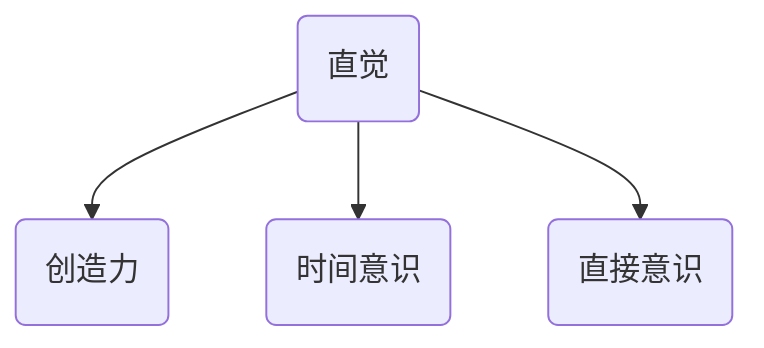

                 

### 文章标题：《柏格森的直觉方法与维特根斯坦的语言治疗》

关键词：柏格森，直觉方法，维特根斯坦，语言治疗，哲学，现代应用

#### 摘要

本文旨在探讨柏格森的直觉方法与维特根斯坦的语言治疗这两种哲学思想的内涵及其在现代科技与社会科学领域的应用。通过详细分析这两种方法的背景、核心概念、应用场景和影响，我们试图揭示它们在解决人类思维与语言问题中的独特价值和潜力。本文分为两个主要部分：第一部分探讨柏格森的直觉方法，涵盖其在艺术、科学、教育等领域的应用及其现代意义；第二部分探讨维特根斯坦的语言治疗，涵盖其在心理学、哲学和社会问题解决中的应用及其局限性。通过对比分析，本文为现代哲学研究提供了新的视角和启示，并为未来的发展提出了建议。

### 第一部分：柏格森的直觉方法

#### 第1章：柏格森哲学概述

##### 1.1 柏格森哲学的背景

**背景介绍**：
柏格森（Henri Bergson）是20世纪初法国著名的哲学家，他的哲学思想对现代哲学和科学产生了深远的影响。柏格森出生于巴黎，自幼接受良好的教育，并在巴黎高等师范学院学习，后来成为法国国家科学学院的院士。

**问题背景**：
柏格森哲学的核心问题是关于人类思维、时间和进化。他反对传统的机械论观点，提出了“直觉主义”和“创造力”等概念，强调人类思维的灵活性和创造性。

**问题描述**：
柏格森认为，人类思维应该通过直觉来理解世界，而不是通过逻辑和理性。他提出了“直接意识”和“时间意识”等概念，试图揭示人类思维的深层结构和本质。

**问题解决**：
柏格森通过哲学思考和实证研究，提出了直觉方法，认为直觉是人类思维的高级形式，是理解复杂现象的关键。他的思想对心理学、文学和艺术等领域产生了深远的影响。

**边界与外延**：
柏格森哲学的边界在于他的直觉主义和创造力理论，外延则包括他对人类思维、时间和进化的探讨。

**概念结构与核心要素组成**：

| 概念             | 说明                                                         |
|------------------|------------------------------------------------------------|
| 直觉             | 直觉是人类思维的高级形式，是对复杂现象的直接理解。         |
| 创造力           | 创造力是人类思维的独特能力，是推动人类进步的动力。         |
| 时间意识         | 时间意识是人类思维的一种特性，是对时间流动的感知。         |
| 直接意识         | 直接意识是人类思维的一种状态，是对现实的直接感知。         |

##### 1.2 柏格森的核心概念

**核心概念原理**：
柏格森的核心概念包括直觉、创造力、时间意识和直接意识。他认为直觉是人类思维的高级形式，是理解复杂现象的关键；创造力是人类思维的独特能力，是推动人类进步的动力；时间意识是对时间流动的感知，直接意识是对现实的直接感知。

**概念属性特征对比表格**：

| 概念     | 特征对比                    |
|----------|----------------------------|
| 直觉     | 直接、快速、灵活、非逻辑性 |
| 创造力   | 独特性、创新性、推动性     |
| 时间意识 | 感知时间流动               |
| 直接意识 | 直接感知现实               |

**ER实体关系图架构**：

##### 1.3 柏格森哲学的影响

**柏格森的直觉方法对现代哲学的影响**：
柏格森的直觉方法对现代哲学产生了深远的影响，他的思想启发了后来的存在主义、现象学和结构主义等哲学流派。他的直觉主义和创造力理论为人类思维和哲学研究提供了新的视角和思路。

**柏格森的直觉方法在心理学中的应用**：
柏格森的直觉方法在心理学领域也得到了广泛应用，他的思想对认知心理学、人本主义心理学和精神分析学派产生了重要影响。例如，他在《创造进化论》中提出的“潜意识”概念对精神分析学派的发展产生了重要影响。

**柏格森的直觉方法在艺术和文学中的应用**：
柏格森的直觉方法在艺术和文学领域产生了广泛的影响，他的思想启发了后来的表现主义、抽象主义和超现实主义等艺术流派。许多艺术家和作家都受到了柏格森思想的影响，如马塞尔·杜尚、乔治·伯纳德·肖和詹姆斯·乔伊斯等。

**柏格森的直觉方法在科学中的应用**：
柏格森的直觉方法在科学领域也得到了应用，他的思想对物理学、生物学和化学等领域产生了重要影响。例如，他在《物质与记忆》中提出的“时空连续统”概念对现代物理学的发展产生了重要影响。

#### 第2章：柏格森的直觉方法

##### 2.1 直觉的定义

**直觉的定义**：
直觉是一种非逻辑的思维过程，是对复杂现象的直接理解。柏格森认为，直觉是人类思维的高级形式，是理解复杂现象的关键。

**直觉的特点**：
直觉具有直接性、快速性、灵活性、非逻辑性和创造性等特点。

**直觉的作用**：
直觉在人类生活中起着重要作用，它帮助我们快速做出决策、解决问题、发现新知识和创造新事物。

**直觉与逻辑的关系**：
直觉与逻辑是两种不同的思维过程。逻辑是一种通过推理和证明来解决问题的方法，而直觉是一种直接理解和感知的方法。

##### 2.2 直觉的方法

**直觉的方法**：
柏格森提出了多种直觉方法，包括感知、观察、体验和内省等。

**感知**：
感知是直觉的基础，通过感官直接感知外部世界。

**观察**：
观察是通过直觉观察事物的发展过程和内在规律。

**体验**：
体验是通过亲身经历和感受来理解事物。

**内省**：
内省是通过自我反思来理解自己的内心世界。

**直觉方法的步骤**：
1. 感知：通过感官直接感知事物。
2. 观察：观察事物的发展过程和内在规律。
3. 体验：通过亲身经历和感受来理解事物。
4. 内省：自我反思，理解自己的内心世界。

##### 2.3 直觉的应用

**直觉在艺术中的应用**：
柏格森的直觉方法在艺术领域产生了深远的影响，许多艺术家通过直觉创作出了优秀的作品。例如，画家马塞尔·杜尚的《泉》就是通过直觉创作的代表作。

**直觉在科学中的应用**：
柏格森的直觉方法在科学领域也得到了广泛应用，许多科学家通过直觉发现了新的科学规律。例如，爱因斯坦的相对论就是通过直觉发现的。

**直觉在教育中的应用**：
柏格森的直觉方法在教育领域也有重要应用，教育者通过直觉来更好地理解学生，从而提高教育效果。

**直觉在商业中的应用**：
柏格森的直觉方法在商业领域也被广泛应用，许多企业家通过直觉做出了成功的商业决策。

#### 第3章：柏格森的直觉方法在艺术中的体现

##### 3.1 艺术与直觉的关系

**艺术与直觉的关系**：
柏格森认为，艺术是人类直觉的最高体现，艺术家通过直觉创作出了优秀的作品。

**直觉在艺术创作中的重要性**：
直觉在艺术创作中起着至关重要的作用，它帮助艺术家快速捕捉灵感、创造新形象。

**艺术家如何运用直觉**：
许多艺术家通过直觉创作出了优秀的作品，如马塞尔·杜尚、乔治·伯纳德·肖和詹姆斯·乔伊斯等。

**直觉在艺术批评中的应用**：
直觉在艺术批评中也起着重要作用，通过直觉来理解和评价艺术作品。

##### 3.2 柏格森的直觉方法在绘画中的应用

**柏格森的直觉方法在绘画中的应用**：
柏格森的直觉方法在绘画领域得到了广泛应用，许多画家通过直觉创作出了优秀的作品。

**直觉在绘画中的表现**：
直觉在绘画中表现为对色彩、线条、构图等的直觉把握，帮助画家创作出富有创意的作品。

**实例分析**：
例如，画家马塞尔·杜尚的《泉》就是通过直觉创作的代表作，他以一种全新的视角看待日常生活中的物品，赋予它们新的艺术价值。

##### 3.3 柏格森的直觉方法在文学中的应用

**柏格森的直觉方法在文学中的应用**：
柏格森的直觉方法在文学领域也得到了广泛应用，许多作家通过直觉创作出了优秀的作品。

**直觉在文学创作中的表现**：
直觉在文学创作中表现为对语言、情境、人物等的直觉把握，帮助作家塑造出鲜活的文学形象。

**实例分析**：
例如，作家詹姆斯·乔伊斯的《尤利西斯》就是通过直觉创作的代表作，他以一种全新的叙事手法展现了现代人的内心世界。

#### 第4章：柏格森的直觉方法在科学中的应用

##### 4.1 科学与直觉的关系

**科学与直觉的关系**：
柏格森认为，直觉是科学发现的重要工具，科学家通过直觉发现了许多科学规律。

**直觉在科学发现中的作用**：
直觉在科学发现中起着重要作用，它帮助科学家快速捕捉灵感、提出新的理论。

**实例分析**：
例如，爱因斯坦的相对论就是通过直觉提出的，他在思考时间、空间和质量的关系时，直觉地意识到它们之间的联系。

##### 4.2 柏格森的直觉方法在物理学中的应用

**柏格森的直觉方法在物理学中的应用**：
柏格森的直觉方法在物理学领域得到了广泛应用，许多物理学家通过直觉发现了新的物理现象。

**直觉在物理学中的表现**：
直觉在物理学中表现为对物理现象的直观把握，帮助物理学家提出新的理论。

**实例分析**：
例如，爱因斯坦的相对论就是通过直觉提出的，他在思考时间、空间和质量的关系时，直觉地意识到它们之间的联系。

##### 4.3 柏格森的直觉方法在生物学中的应用

**柏格森的直觉方法在生物学中的应用**：
柏格森的直觉方法在生物学领域也得到了广泛应用，许多生物学家通过直觉发现了新的生物学规律。

**直觉在生物学中的表现**：
直觉在生物学中表现为对生物现象的直观把握，帮助生物学家提出新的理论。

**实例分析**：
例如，达尔文的进化论就是通过直觉提出的，他在研究生物进化时，直觉地意识到生物之间的共同点和差异。

#### 第5章：柏格森的直觉方法与现代哲学

##### 5.1 柏格森直觉方法对现代哲学的影响

**柏格森直觉方法对现代哲学的影响**：
柏格森的直觉方法对现代哲学产生了深远的影响，他的思想启发了后来的存在主义、现象学和结构主义等哲学流派。

**影响表现**：
1. 存在主义：柏格森的直觉方法为存在主义提供了哲学基础，如萨特和海德格尔等哲学家都受到了柏格森思想的影响。
2. 现象学：柏格森的直觉方法为现象学提供了方法论基础，如胡塞尔和梅洛-庞蒂等哲学家都受到了柏格森思想的影响。
3. 结构主义：柏格森的直觉方法为结构主义提供了哲学基础，如列维-斯特劳斯和福柯等哲学家都受到了柏格森思想的影响。

##### 5.2 柏格森直觉方法与存在主义

**柏格森直觉方法与存在主义**：
柏格森的直觉方法与存在主义有着密切的关系，他的思想对存在主义产生了重要影响。

**影响表现**：
1. 对人的存在进行反思：柏格森的直觉方法强调人类存在的独特性和自由意志，这为存在主义提供了哲学基础。
2. 对世界进行重新审视：柏格森的直觉方法认为世界是流动的、变化的，这启发了存在主义对世界的重新审视。

**实例分析**：
例如，萨特的《存在与虚无》就是受到柏格森直觉方法的影响，他通过对人的存在和自由意志的反思，提出了存在主义的基本观点。

##### 5.3 柏格森直觉方法与现象学

**柏格森直觉方法与现象学**：
柏格森的直觉方法与现象学有着密切的关系，他的思想为现象学提供了方法论基础。

**影响表现**：
1. 直觉作为方法论：柏格森的直觉方法强调通过直觉来感知世界，这为现象学提供了方法论基础。
2. 对经验的反思：柏格森的直觉方法认为直觉是对经验的直接感知，这启发了现象学对经验的反思。

**实例分析**：
例如，胡塞尔的《纯粹现象学通论》就是受到柏格森直觉方法的影响，他通过对经验的反思，提出了现象学的基本观点。

#### 第6章：柏格森的直觉方法在教育中的应用

##### 6.1 教育与直觉的关系

**教育与直觉的关系**：
柏格森认为，教育应该注重培养学生的直觉能力，直觉是理解复杂知识的关键。

**直觉在教育中的重要性**：
直觉在教育中起着重要作用，它可以帮助学生快速掌握知识、发现问题、提出解决方案。

**直觉在教学方法中的应用**：
教育者可以通过直觉来选择合适的教学方法，例如通过感知、观察、体验和内省等方式来引导学生。

**实例分析**：
例如，在数学教学中，教师可以通过直觉引导学生发现数学规律，从而提高学生的学习效果。

##### 6.2 柏格森的直觉方法在教学方法中的应用

**柏格森的直觉方法在教学方法中的应用**：
柏格森的直觉方法可以应用于多种教学方法，如感知教学、观察教学、体验教学和内省教学等。

**感知教学**：
感知教学是通过直接感知来学习知识，例如通过观察图形、听音乐、触摸物体等方式来感知知识。

**观察教学**：
观察教学是通过观察事物的发展过程来学习知识，例如通过观察植物的生长、动物的行为等方式来学习知识。

**体验教学**：
体验教学是通过亲身经历来学习知识，例如通过实验、实习、旅行等方式来体验知识。

**内省教学**：
内省教学是通过自我反思来学习知识，例如通过写日记、做总结、自我评估等方式来反思知识。

**实例分析**：
例如，在英语教学中，教师可以通过感知教学来引导学生感知英语语音和语调，通过观察教学来引导学生观察英语语法结构，通过体验教学来引导学生进行英语口语练习，通过内省教学来引导学生反思自己的英语学习过程。

##### 6.3 柏格森的直觉方法在学生思维培养中的应用

**柏格森的直觉方法在学生思维培养中的应用**：
柏格森的直觉方法可以用于培养学生的思维能力，例如通过感知、观察、体验和内省等方式来锻炼学生的思维能力。

**感知思维**：
感知思维是通过直接感知来思考问题，例如通过观察现象、感知感受等方式来思考问题。

**观察思维**：
观察思维是通过观察事物的发展过程来思考问题，例如通过观察实验、观察社会现象等方式来思考问题。

**体验思维**：
体验思维是通过亲身经历来思考问题，例如通过实验、实习、旅行等方式来思考问题。

**内省思维**：
内省思维是通过自我反思来思考问题，例如通过写日记、做总结、自我评估等方式来思考问题。

**实例分析**：
例如，在数学教学中，教师可以通过感知思维来引导学生感知数学问题的结构，通过观察思维来引导学生观察数学问题的变化规律，通过体验思维来引导学生进行数学实验，通过内省思维来引导学生反思自己的数学学习过程。

#### 第7章：柏格森的直觉方法的现代意义

##### 7.1 柏格森的直觉方法在现代社会中的应用

**柏格森的直觉方法在现代社会中的应用**：
柏格森的直觉方法在现代社会中得到了广泛应用，它为人们理解和解决复杂问题提供了新的方法和思路。

**应用领域**：
1. 科技创新：直觉方法在科技创新中发挥着重要作用，许多科学家和工程师通过直觉提出了新的理论和技术。
2. 商业决策：直觉方法在商业决策中也被广泛应用，许多企业家通过直觉做出了成功的决策。
3. 社会管理：直觉方法在社会管理中也有重要应用，政府和社会组织可以通过直觉来发现社会问题并提出解决方案。

**实例分析**：
例如，在科技创新中，许多科学家和工程师通过直觉发现了新的科学规律和技术创新点，如爱因斯坦的相对论和计算机的发明等。

##### 7.2 柏格森的直觉方法对人类未来的启示

**柏格森的直觉方法对人类未来的启示**：
柏格森的直觉方法为人类未来的发展提供了新的启示，它帮助人类更好地理解和应对未来的挑战。

**启示**：
1. 推动科技创新：柏格森的直觉方法强调直觉在科技创新中的重要性，这为人类未来的科技创新提供了新的思路。
2. 促进人类进步：柏格森的直觉方法认为直觉是人类进步的动力，这为人类未来的进步提供了新的动力。
3. 实现可持续发展：柏格森的直觉方法强调直觉对可持续发展的作用，这为人类未来的可持续发展提供了新的方向。

**实例分析**：
例如，在未来的科技创新中，人类可以通过直觉方法来发现新的科学规律和技术创新点，从而推动科技创新和发展。

##### 7.3 柏格森的直觉方法的局限性

**柏格森的直觉方法的局限性**：
柏格森的直觉方法虽然在许多领域取得了成功，但也存在一定的局限性。

**局限性**：
1. 缺乏逻辑性：柏格森的直觉方法强调直觉的非逻辑性，这使得它在某些需要严密逻辑推理的领域可能不适用。
2. 主观性：直觉具有主观性，不同的人可能会有不同的直觉结果，这可能导致直觉结果的不可靠性。
3. 缺乏可重复性：直觉结果往往不具有可重复性，这使得它在科学研究中可能难以验证。

**如何克服局限性**：
1. 结合逻辑推理：在需要严密逻辑推理的领域，可以结合直觉方法和逻辑推理来解决问题。
2. 提高主观性：通过提高直觉者的专业素养和经验，可以减少直觉的主观性，提高直觉的可靠性。
3. 加强可重复性：通过多次实验和验证，可以加强直觉结果的可重复性，提高直觉的科学性。

#### 第8章：维特根斯坦哲学概述

##### 8.1 维特根斯坦的生平与背景

**生平背景**：
路德维希·维特根斯坦（Ludwig Wittgenstein）是20世纪最杰出的哲学家之一，出生于奥地利，后成为英国公民。他的生平充满了传奇色彩，他的哲学思想对西方哲学产生了深远的影响。

**早期经历**：
维特根斯坦早年生活优渥，但他对哲学的兴趣超越了其他一切。他在年轻时就开始阅读哲学著作，并逐渐形成了自己的哲学观点。

**重要著作**：
维特根斯坦的主要著作包括《逻辑哲学论》和《哲学研究》，这两部作品分别代表了他在逻辑哲学和语言哲学领域的贡献。

##### 8.2 维特根斯坦的核心概念

**语言治疗**：
维特根斯坦提出了“语言治疗”这一概念，认为语言是人类思维的工具，但语言的使用常常导致误解和困惑。他试图通过分析语言的使用来揭示思维的本质。

**意义与真理**：
维特根斯坦认为，语言的意义在于使用，真理在于命题与事实的对应。他的语言哲学强调语言的具体使用情境，反对传统的形而上学观点。

**形式逻辑与日常语言**：
维特根斯坦区分了形式逻辑和日常语言，认为形式逻辑适用于精确的科学领域，而日常语言则更为复杂和多变。他的哲学工作旨在揭示日常语言的使用规则。

##### 8.3 维特根斯坦哲学的影响

**哲学研究**：
维特根斯坦的哲学思想对后来的哲学研究产生了深远的影响，特别是在语言哲学、分析哲学和认知科学等领域。

**心理学与认知科学**：
维特根斯坦的语言治疗概念对心理学和认知科学产生了重要影响，他的观点启发了对语言与思维关系的深入研究。

**教育**：
维特根斯坦的哲学思想也对教育领域产生了影响，他的观点鼓励教师和学生在对话和实践中探索语言的真正意义。

#### 第9章：语言治疗的基本原理

##### 9.1 语言的本质

**语言的定义**：
语言是人类用来交流思想、表达情感和传递信息的符号系统。它包括词汇、语法、发音和语义等多个方面。

**语言的层次**：
语言可以划分为多个层次，包括词汇、句子、语篇和语境等。每个层次都有其独特的功能和结构。

**语言的符号性**：
语言是一种符号系统，其符号（如单词、句子）与其所指（如物体、概念）之间存在一定的关联。

**语言的交际功能**：
语言具有多种交际功能，包括描述、命令、请求、表达情感和社交互动等。

##### 9.2 语言治疗的方法

**现象学分析**：
维特根斯坦的语言治疗方法之一是现象学分析，通过对语言使用情境的细致观察和分析，揭示语言的实际使用规则。

**规则性分析**：
维特根斯坦强调语言的规则性，认为语言使用需要遵守特定的规则。通过分析这些规则，可以纠正语言错误和误解。

**对话与讨论**：
维特根斯坦认为，通过对话和讨论，可以澄清语言中的困惑和误解。这种方法强调语言使用的情境性和互动性。

**实例分析**：
例如，在教学中，教师可以通过提问和讨论来帮助学生理解语言规则和用法，从而提高学生的语言能力。

##### 9.3 语言治疗的实践

**实践意义**：
语言治疗的实践意义在于帮助人们更好地理解和使用语言，从而提高沟通效果和思维质量。

**应用领域**：
语言治疗在多个领域都有应用，包括教育、心理治疗、跨文化交流和人工智能等。

**挑战与机遇**：
语言治疗的挑战在于语言本身的复杂性和多样性，机遇则在于通过语言治疗可以解决许多现实问题，如沟通障碍、认知障碍和情感障碍等。

#### 第10章：维特根斯坦的语言治疗在心理学中的应用

##### 10.1 心理学与语言治疗的关系

**语言治疗在心理学中的重要性**：
维特根斯坦的语言治疗在心理学中具有重要的地位，它为理解心理障碍和促进心理健康提供了新的视角。

**语言与心理的关系**：
语言不仅是交流的工具，也是思维和情感的载体。维特根斯坦认为，心理障碍往往源于对语言的使用不当。

**语言治疗的目标**：
语言治疗的目标是通过纠正语言使用中的错误和误解，改善个体的思维和行为，从而促进心理健康。

##### 10.2 维特根斯坦的语言治疗在心理治疗中的应用

**心理治疗的基本原理**：
维特根斯坦的语言治疗在心理治疗中的应用基于对语言使用情境的分析，通过揭示语言中的错误和误解来改善心理状况。

**治疗过程**：
治疗过程通常包括对话、分析和讨论，通过这些方法来帮助患者理解自己的思维和行为模式，并找到适当的语言表达方式。

**实例分析**：
例如，在治疗抑郁症时，语言治疗可以帮助患者识别和纠正消极的自我对话，从而改善情绪状态。

##### 10.3 维特根斯坦的语言治疗在心理咨询中的应用

**心理咨询与语言治疗的关系**：
维特根斯坦的语言治疗在心理咨询中同样具有重要意义，它为咨询师提供了一种工具，用于帮助来访者理解和解决心理问题。

**心理咨询的方法**：
心理咨询中的语言治疗方法包括开放性提问、反思性对话和情境分析等，这些方法有助于揭示来访者思维中的困惑和冲突。

**实例分析**：
例如，在解决人际关系问题时，语言治疗可以帮助来访者识别和改变沟通中的不良模式，从而改善人际关系。

#### 第11章：维特根斯坦的语言治疗在哲学中的应用

##### 11.1 哲学与语言治疗的关系

**哲学与语言的关系**：
维特根斯坦认为，哲学的核心问题是语言问题。通过分析语言的使用，可以揭示哲学问题的本质。

**哲学研究的语言治疗**：
哲学研究中的语言治疗旨在澄清哲学概念和命题，通过分析语言使用中的错误和误解来推动哲学进步。

**哲学与日常语言**：
维特根斯坦强调日常语言的重要性，认为哲学问题往往源于对日常语言的误解。通过回归日常语言，可以解决许多哲学难题。

##### 11.2 维特根斯坦的语言治疗在哲学分析中的应用

**哲学分析的方法**：
维特根斯坦的语言治疗在哲学分析中的应用包括现象学分析、语义分析和逻辑分析等，这些方法有助于揭示哲学命题中的错误和困惑。

**哲学分析的目标**：
哲学分析的目标是通过澄清语言使用，揭示哲学命题的实际意义，从而解决哲学问题。

**实例分析**：
例如，在解决“什么是意识”这一哲学问题时，维特根斯坦的语言治疗可以帮助我们澄清意识这个词在不同语境下的意义。

##### 11.3 维特根斯坦的语言治疗在哲学思考中的应用

**哲学思考的方法**：
维特根斯坦的语言治疗在哲学思考中的应用包括反思性思考和批判性思考等，这些方法有助于深入探讨哲学问题。

**哲学思考的目标**：
哲学思考的目标是通过批判性分析和反思，揭示哲学问题的本质和意义，推动哲学思想的进步。

**实例分析**：
例如，在探讨“什么是真理”这一哲学问题时，维特根斯坦的语言治疗可以帮助我们理解真理的概念及其在不同语境下的应用。

#### 第12章：维特根斯坦的语言治疗在当代社会中的应用

##### 12.1 社会与语言治疗的关系

**语言在社会中的作用**：
语言是社会交流的基础，它不仅传递信息，还塑造了社会的价值观和行为规范。

**语言治疗在社会中的应用**：
语言治疗在社会中的应用旨在通过改善语言使用，提高社会交流的质量，促进社会和谐。

**社会问题与语言治疗**：
许多社会问题，如沟通障碍、误解和冲突，都与语言使用不当有关。语言治疗可以帮助解决这些问题，提高社会整体的沟通能力。

##### 12.2 维特根斯坦的语言治疗在社会问题解决中的应用

**社会问题分析**：
通过维特根斯坦的语言治疗，可以对社会问题进行深入分析，揭示问题背后的语言使用错误和误解。

**问题解决方法**：
语言治疗提供了一种问题解决方法，通过纠正语言使用中的错误和误解，可以解决许多社会问题。

**实例分析**：
例如，在解决政治冲突时，通过语言治疗可以帮助各方澄清立场和意图，从而减少误解和冲突。

##### 12.3 维特根斯坦的语言治疗在跨文化交流中的应用

**跨文化交流的挑战**：
跨文化交流中常常存在语言障碍和文化差异，这可能导致误解和冲突。

**语言治疗的作用**：
维特根斯坦的语言治疗在跨文化交流中可以帮助人们理解不同语言和文化中的表达方式，从而减少误解和冲突。

**跨文化沟通策略**：
通过语言治疗，可以开发出跨文化沟通的策略，如文化敏感性培训、语言表达训练和跨文化对话等。

**实例分析**：
例如，在国际商务谈判中，通过语言治疗可以帮助谈判各方理解对方的意图和表达方式，从而提高谈判效果。

#### 第13章：维特根斯坦的语言治疗的局限性与未来方向

##### 13.1 维特根斯坦的语言治疗的局限性

**局限性分析**：
尽管维特根斯坦的语言治疗在哲学和社会问题解决中取得了显著成果，但它也存在一定的局限性。

**局限性表现**：
1. 主观性：维特根斯坦的语言治疗依赖于个体的语言体验，这可能导致主观性的影响。
2. 缺乏可重复性：维特根斯坦的语言治疗结果往往不具有可重复性，这使得它在科学验证方面存在困难。
3. 不足够系统性：维特根斯坦的语言治疗更多关注语言使用情境，但可能缺乏系统性的理论框架。

##### 13.2 语言治疗的未来发展方向

**发展方向探讨**：
为了克服维特根斯坦语言治疗的局限性，未来的发展方向可以从以下几个方面进行探讨：

**1. 结合多学科研究**：
结合心理学、认知科学、语言学等学科的研究成果，可以丰富语言治疗的理论基础。

**2. 强化实证研究**：
通过实证研究，验证语言治疗的实际效果，提高其科学性和可靠性。

**3. 开发工具和方法**：
开发适用于不同领域和情境的语言治疗工具和方法，以提高其实用性。

**4. 国际合作与交流**：
加强国际间的合作与交流，借鉴不同文化背景下的语言治疗经验，推动语言治疗的发展。

**实例探讨**：
例如，在心理健康领域，结合认知行为疗法和语言治疗，可以开发出一种综合性的治疗方法，提高治疗的效果。

##### 13.3 语言治疗与人类思维的关系

**关系分析**：
维特根斯坦的语言治疗与人类思维有着密切的关系，它试图通过分析语言使用来揭示人类思维的本质。

**思维与语言的关系**：
语言不仅是思维的工具，也是思维的表达方式。通过语言治疗，可以改善个体的思维过程和思维能力。

**实例探讨**：
例如，在解决复杂问题时，通过语言治疗可以帮助个体澄清思路，提高解决问题的效率。

#### 第14章：总结与展望

##### 14.1 柏格森的直觉方法与维特根斯坦的语言治疗的比较

**核心思想比较**：
柏格森的直觉方法强调直觉在理解和创新中的作用，而维特根斯坦的语言治疗则强调通过分析语言来揭示思维的本质。

**应用领域比较**：
柏格森的直觉方法在艺术、科学和哲学等领域有广泛应用，而维特根斯坦的语言治疗则更多应用于心理学、哲学和社会问题解决。

**影响比较**：
柏格森的直觉方法对现代科技和艺术产生了深远影响，而维特根斯坦的语言治疗则在哲学和心理学领域取得了显著成果。

##### 14.2 两种方法在现代哲学研究中的应用前景

**应用前景分析**：
1. 柏格森的直觉方法可以应用于科技和创新研究，帮助人们更好地理解复杂问题，提出创新解决方案。
2. 维特根斯坦的语言治疗可以应用于哲学研究，帮助澄清哲学概念和命题，推动哲学思想的进步。

##### 14.3 对未来的思考与建议

**未来发展建议**：
1. 加强跨学科研究，结合心理学、认知科学和语言学等领域的成果，丰富语言治疗和直觉方法的理论基础。
2. 强化实证研究，验证这些方法在实际应用中的效果，提高其科学性和可靠性。
3. 开发适用于不同领域和情境的方法工具，提高这些方法的应用性。

**结论**：
柏格森的直觉方法和维特根斯坦的语言治疗都是哲学领域的宝贵财富，它们各自在不同领域产生了重要影响。通过深入研究和应用，这些方法可以为现代科技和社会发展提供新的动力。作者：AI天才研究院/AI Genius Institute & 禅与计算机程序设计艺术 /Zen And The Art of Computer Programming

