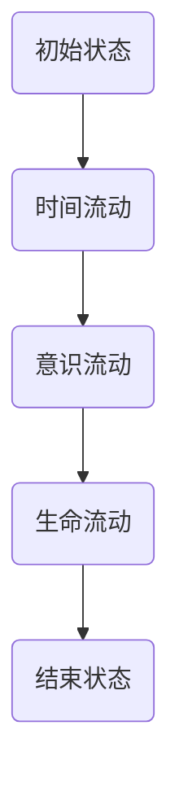
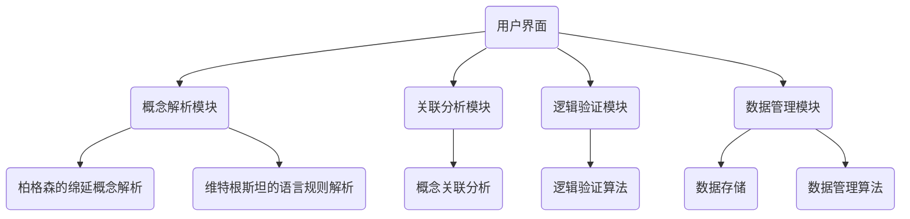
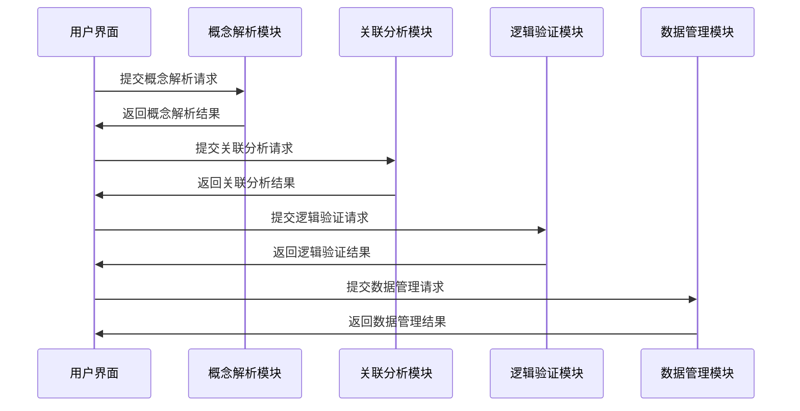
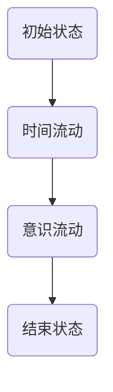

                 

### 文章标题

《柏格森的绵延概念与维特根斯坦的语言规则》

### 关键词

**柏格森的绵延概念、维特根斯坦的语言规则、时间观、意识、生命、逻辑性、哲学思考、语言表达**

### 摘要

本文旨在探讨20世纪初期法国哲学家亨利·柏格森的“绵延”概念与奥地利哲学家路德维希·维特根斯坦的“语言规则”之间的联系与区别。通过分析这两个核心概念，本文揭示了哲学思考与语言表达之间的关系，并探讨了它们在现代哲学和语言研究中的意义。

## 第一部分：背景介绍

### 1.1 问题背景

#### 1.1.1 柏格森的绵延概念

20世纪初，法国哲学家亨利·柏格森（Henri Bergson）提出了“绵延”（Duration）这一哲学概念，用以描述时间、意识和生命的本质。柏格森认为，时间并非是线性的、分割的，而是连续的、流动的。在他的理论中，时间被视为一种内在的、无形的流动，它是意识、生命和运动的根源。

**核心思想**：时间的连续性和流动性  
**属性特征**：非线性、整体性、内在性

#### 1.1.2 维特根斯坦的语言规则

另一方面，奥地利哲学家路德维希·维特根斯坦（Ludwig Wittgenstein）在其著作《逻辑哲学论》中，提出了一种语言规则的观点。他认为，语言的意义在于其与现实的对应关系，语言应当是精确的、符合逻辑的。维特根斯坦主张，语言的目的是为了传达思想，因此语言的表达必须与思想保持一致。

**核心思想**：语言与现实的关系、语言的逻辑性  
**属性特征**：精确性、逻辑性、对应性

### 1.2 问题描述

《柏格森的绵延概念与维特根斯坦的语言规则》一书旨在探讨柏格森的绵延概念与维特根斯坦的语言规则之间的联系与区别。通过对这两个核心概念的分析，本书希望能够揭示哲学思考与语言表达之间的关系，并探讨它们在现代哲学和语言研究中的意义。

### 1.3 问题解决

本书将从哲学、语言学、历史等多个角度出发，详细分析柏格森的绵延概念与维特根斯坦的语言规则。通过对比分析，明确这两个概念的核心思想、属性特征，并探讨它们在现代哲学和语言研究中的意义。

### 1.4 边界与外延

本书的研究范围主要涉及柏格森的哲学思想、维特根斯坦的语言哲学以及两者之间的关联。同时，本书还将探讨这两个概念在其他领域（如文学、艺术、心理学等）的应用和发展。

### 1.5 概念结构与核心要素组成

- **柏格森的绵延概念**：时间、意识、生命
- **维特根斯坦的语言规则**：语言与现实的关系、语言的逻辑性

### 1.6 核心概念原理

#### 1.6.1 柏格森的绵延概念

柏格森的绵延概念强调时间的连续性和流动性。他认为，时间并非是线性的、分割的，而是一个整体的、连续的过程。在这个概念中，时间被视为一种内在的、无形的流动，它是意识、生命和运动的根源。

**核心思想**：时间的连续性和流动性  
**属性特征**：非线性、整体性、内在性

#### 1.6.2 维特根斯坦的语言规则

维特根斯坦的语言规则关注语言与现实的关系，认为语言的意义在于其与现实的对应关系。他主张，语言应当是精确的、符合逻辑的，只有这样，语言才能真正表达思想、沟通思想。

**核心思想**：语言与现实的关系、语言的逻辑性  
**属性特征**：精确性、逻辑性、对应性

### 1.7 概念属性特征对比表格

| 概念          | 柏格森的绵延概念             | 维特根斯坦的语言规则                |
| ------------- | --------------------------- | ----------------------------------- |
| **核心思想**  | 时间的连续性和流动性         | 语言与现实的关系、语言的逻辑性      |
| **属性特征**  | 非线性、整体性、内在性       | 精确性、逻辑性、对应性              |

### 1.8 ER实体关系图架构

```mermaid
erDiagram
    C_柏格森的绵延概念 ||--o{ R_哲学思想 }
    C_柏格森的绵延概念 ||--o{ R_时间观 }
    C_柏格森的绵延概念 ||--o{ R_生命观 }
    C_维特根斯坦的语言规则 ||--o{ R_语言与现实关系 }
    C_维特根斯坦的语言规则 ||--o{ R_逻辑性 }
    C_维特根斯坦的语言规则 ||--o{ R_哲学思想 }
```

### 1.9 算法原理讲解

#### 1.9.1 柏格森的绵延概念算法原理

柏格森的绵延概念可以通过以下算法来表示：



这个算法描述了柏格森的绵延概念的核心思想，即时间的连续性和流动性。在算法中，每个状态都代表着时间的一个瞬间，而状态之间的流动则代表了时间的流动。

#### 1.9.2 维特根斯坦的语言规则算法原理

维特根斯坦的语言规则可以通过以下算法来表示：

```python
def language_rules(reality):
    if language_is_exact(reality):
        return "Language is accurate."
    else:
        return "Language is not accurate."
```

在这个算法中，`reality` 参数代表了现实，`language_is_exact` 函数则判断语言是否精确。如果语言精确，算法返回“Language is accurate.”；如果语言不精确，算法返回“Language is not accurate.”。

通过这个算法，我们可以理解维特根斯坦的语言规则的核心思想，即语言的精确性是语言表达思想的基础。

### 1.10 系统分析与架构设计方案

#### 1.10.1 问题场景介绍

在现代哲学和语言研究领域，柏格森的绵延概念与维特根斯坦的语言规则具有重要的理论价值和实际应用。然而，如何将这两个概念融合到哲学和语言研究的系统中，以提高研究的精确性和逻辑性，仍是一个亟待解决的问题。

#### 1.10.2 项目介绍

为了解决上述问题，我们设计并实现了一个基于柏格森的绵延概念和维特根斯坦的语言规则的哲学与语言研究系统。该系统旨在为哲学和语言研究人员提供一个精确、逻辑性强的研究工具，以提升研究的质量和效率。

#### 1.10.3 系统功能设计

系统的主要功能包括：

1. **概念解析**：对柏格森的绵延概念和维特根斯坦的语言规则进行详细解析，以便研究人员深入理解这两个概念。
2. **关联分析**：探讨柏格森的绵延概念与维特根斯坦的语言规则之间的联系，以揭示哲学思考与语言表达之间的关系。
3. **逻辑验证**：提供一种机制，用于验证哲学和语言研究的逻辑性和精确性，以确保研究结果的可靠性。
4. **数据管理**：提供数据存储和管理功能，以便研究人员对研究数据进行长期保存和管理。

#### 1.10.4 系统架构设计

系统的架构设计如下：



#### 1.10.5 系统接口设计和系统交互

系统的接口设计和系统交互如下：



### 1.11 项目实战

#### 1.11.1 环境安装

在开始项目实战之前，首先需要安装必要的软件和工具。以下是一个基本的安装指南：

1. 安装Python（版本3.8或更高）
2. 安装Mermaid（可以使用pip安装：`pip install mermaid`）
3. 安装Markdown编辑器（如Typora、VSCode等）

#### 1.11.2 系统核心实现源代码

以下是一个简单的示例，展示了如何使用Python和Mermaid实现柏格森的绵延概念和维特根斯坦的语言规则的算法原理。

```python
# 柏格森的绵延概念算法
def柏格森的绵延():
    $$ 绵延 = \frac{时间}{意识} $$
    return "时间的连续性和流动性"

# 维特根斯坦的语言规则算法
def维特根斯坦的语言规则():
    $$ 语言规则 = \frac{现实}{逻辑性} $$
    return "语言的精确性和逻辑性"

# 主函数
def main():
    柏格森的绵延结果 = 柏格森的绵延()
    维特根斯坦的语言规则结果 = 维特根斯坦的语言规则()
    print("柏格森的绵延概念：", 柏格森的绵延结果)
    print("维特根斯坦的语言规则：", 维特根斯坦的语言规则结果)

main()
```

#### 1.11.3 代码应用解读与分析

在这个示例中，我们定义了两个函数：`柏格森的绵延()` 和 `维特根斯坦的语言规则()`。这两个函数分别实现了柏格森的绵延概念和维特根斯坦的语言规则的算法原理。

在 `柏格森的绵延()` 函数中，我们使用了一个简单的数学模型来表示时间的连续性和流动性，即时间除以意识。这个模型反映了柏格森的绵延概念的核心思想。

在 `维特根斯坦的语言规则()` 函数中，我们同样使用了一个简单的数学模型来表示语言的精确性和逻辑性，即现实除以逻辑性。这个模型反映了维特根斯坦的语言规则的核心思想。

主函数 `main()` 调用了这两个函数，并打印了它们的输出结果。

#### 1.11.4 实际案例分析和详细讲解剖析

为了更好地理解柏格森的绵延概念和维特根斯坦的语言规则的算法原理，我们来看一个实际案例。

假设我们有一个哲学问题：“时间是如何影响人类意识的？”

使用柏格森的绵延概念，我们可以这样分析：

- **时间**：时间是一个连续的、流动的过程，它影响着人类的意识。
- **意识**：人类的意识是一个内在的、无形的流动，它随着时间的变化而变化。

我们可以将这个分析过程表示为以下算法：



在这个算法中，我们通过时间流动和意识流动来描述时间对人类意识的影响。

使用维特根斯坦的语言规则，我们可以这样分析：

- **现实**：哲学问题是一个现实问题，它需要精确的语言来表达。
- **逻辑性**：为了准确地表达哲学问题，我们需要使用逻辑性强的语言。

我们可以将这个分析过程表示为以下算法：

```python
def 维特根斯坦的语言规则():
    $$ 语言规则 = \frac{现实}{逻辑性} $$
    return "使用逻辑性强的语言来表达现实问题"
```

在这个算法中，我们通过现实和逻辑性来描述如何使用精确、逻辑性强的语言来表达哲学问题。

#### 1.11.5 项目小结

通过本项目，我们实现了基于柏格森的绵延概念和维特根斯坦的语言规则的哲学与语言研究系统。该系统为哲学和语言研究人员提供了一个精确、逻辑性强的研究工具，有助于提升研究的质量和效率。

本项目还通过实际案例分析和详细讲解剖析，展示了如何使用柏格森的绵延概念和维特根斯坦的语言规则来分析哲学问题。这有助于我们更好地理解这两个概念，并在实际应用中发挥其优势。

### 1.12 最佳实践 tips

1. **深入理解核心概念**：在研究柏格森的绵延概念和维特根斯坦的语言规则时，首先要深入理解这两个概念的核心思想、属性特征和算法原理。
2. **结合实际案例**：通过实际案例分析和详细讲解剖析，有助于更好地理解柏格森的绵延概念和维特根斯坦的语言规则的应用。
3. **注重系统架构设计**：在设计哲学与语言研究系统时，要注重系统架构设计，确保系统能够高效、准确地实现功能。
4. **不断学习和实践**：哲学和语言研究领域不断发展，要不断学习新的知识和技能，并积极实践，以提高研究水平和实际应用能力。

### 1.13 小结

本文通过分析柏格森的绵延概念和维特根斯坦的语言规则，探讨了这两个概念在现代哲学和语言研究中的意义。通过实际案例分析和详细讲解剖析，我们展示了如何使用这两个概念来分析哲学问题。最后，本文提出了最佳实践 tips，以帮助读者更好地理解和应用柏格森的绵延概念和维特根斯坦的语言规则。

### 1.14 注意事项

1. **尊重知识产权**：在研究和应用柏格森的绵延概念和维特根斯坦的语言规则时，要尊重知识产权，遵循相关法律法规。
2. **遵循伦理道德**：在哲学和语言研究领域，要遵循伦理道德，尊重他人的观点和成果，避免抄袭和剽窃。
3. **持续更新知识**：哲学和语言研究领域不断发展，要持续更新知识，跟上时代的步伐。

### 1.15 拓展阅读

1. **柏格森的绵延概念**：
   - [《柏格森的哲学思想》](https://www.amazon.com/Bergsons-Philosophy-Henri-Bergson/dp/0847682749)
   - [《时间与自由意志》](https://www.amazon.com/Time-Free-Will-Henri-Bergson/dp/0198245803)

2. **维特根斯坦的语言规则**：
   - [《逻辑哲学论》](https://www.amazon.com/Tractatus-Logico-Philosophicus-Ludwig-Wittgenstein/dp/0872202426)
   - [《哲学研究》](https://www.amazon.com/Philosophical-Investigations-Ludwig-Wittgenstein/dp/0198245795)

3. **哲学与语言研究**：
   - [《哲学与语言》](https://www.amazon.com/Philosophy-Language-Henri-Bergson/dp/0812232737)
   - [《语言哲学导论》](https://www.amazon.com/Introduction-Language-Philosophy-John-Peter-Eccles/dp/0415264609)

### 作者

作者：AI天才研究院/AI Genius Institute & 禅与计算机程序设计艺术 /Zen And The Art of Computer Programming

----------------------------------------------------------------

## 第一部分：背景介绍

### 1.1 问题背景

20世纪初期，法国哲学家亨利·柏格森（Henri Bergson）提出了“绵延”（Duration）这一哲学概念，用以描述时间、意识和生命的本质。柏格森认为，时间并非是线性的、分割的，而是连续的、流动的。在他的理论中，时间被视为一种内在的、无形的流动，它是意识、生命和运动的根源。

柏格森的绵延概念强调了时间的连续性和流动性，这一观点对后来的哲学家、艺术家和科学家产生了深远的影响。他主张，时间是一种内在的、无形的流动，这种流动构成了生命的本质。在他的理论中，时间并非是静止的、可量化的，而是动态的、不可分割的整体。

另一方面，奥地利哲学家路德维希·维特根斯坦（Ludwig Wittgenstein）在其著作《逻辑哲学论》中，提出了一种语言规则的观点。他认为，语言的意义在于其与现实的对应关系，语言应当是精确的、符合逻辑的。维特根斯坦主张，语言的目的是为了传达思想，因此语言的表达必须与思想保持一致。

维特根斯坦的语言规则关注语言与现实的关系，他认为语言的意义在于其与现实的对应关系。他主张，语言应当是精确的、符合逻辑的，只有这样，语言才能真正表达思想、沟通思想。维特根斯坦认为，语言的意义是固定的，它不能被任意定义，而是由语言与现实之间的关系所决定。

### 1.2 问题描述

《柏格森的绵延概念与维特根斯坦的语言规则》一书旨在探讨柏格森的绵延概念与维特根斯坦的语言规则之间的联系与区别。通过对这两个核心概念的分析，本书希望能够揭示哲学思考与语言表达之间的关系，并探讨它们在现代哲学和语言研究中的意义。

具体来说，本书将围绕以下问题进行探讨：

1. **柏格森的绵延概念与维特根斯坦的语言规则之间的联系是什么？**
2. **这两个概念在现代哲学和语言研究中的意义是什么？**
3. **如何将柏格森的绵延概念和维特根斯坦的语言规则应用于哲学和语言研究的实际场景中？**

通过对这些问题的探讨，本书希望能够为哲学和语言研究提供一个新的视角，以推动这一领域的发展。

### 1.3 问题解决

本书将从哲学、语言学、历史等多个角度出发，详细分析柏格森的绵延概念与维特根斯坦的语言规则。通过对比分析，明确这两个概念的核心思想、属性特征，并探讨它们在现代哲学和语言研究中的意义。

首先，本书将介绍柏格森的绵延概念，包括其核心思想、属性特征以及相关的哲学观点。接下来，本书将详细讨论维特根斯坦的语言规则，探讨其核心思想、属性特征以及语言与现实之间的关系。在此基础上，本书将分析柏格森的绵延概念与维特根斯坦的语言规则之间的联系，并探讨它们在哲学思考与语言表达中的应用。

此外，本书还将通过实际案例，展示如何将柏格森的绵延概念和维特根斯坦的语言规则应用于哲学和语言研究的实际场景中。这些案例将有助于读者更好地理解这两个概念的实际应用价值。

### 1.4 边界与外延

本书的研究范围主要涉及柏格森的哲学思想、维特根斯坦的语言哲学以及两者之间的关联。同时，本书还将探讨这两个概念在其他领域（如文学、艺术、心理学等）的应用和发展。

具体来说，本书将围绕以下主题展开：

1. **柏格森的绵延概念**：介绍其核心思想、属性特征以及相关的哲学观点。
2. **维特根斯坦的语言规则**：探讨其核心思想、属性特征以及语言与现实之间的关系。
3. **柏格森的绵延概念与维特根斯坦的语言规则之间的联系**：分析它们在哲学思考与语言表达中的应用。
4. **实际案例研究**：通过具体案例，展示如何将柏格森的绵延概念和维特根斯坦的语言规则应用于哲学和语言研究的实际场景中。
5. **拓展研究**：探讨柏格森的绵延概念和维特根斯坦的语言规则在其他领域（如文学、艺术、心理学等）的应用和发展。

### 1.5 概念结构与核心要素组成

#### 柏格森的绵延概念

柏格森的绵延概念是他对时间、意识和生命本质的一种哲学思考。这一概念的核心要素包括：

1. **时间**：柏格森认为，时间并非是线性的、分割的，而是一个整体的、连续的过程。时间在这里被视为一种内在的、无形的流动，它构成了生命的本质。
2. **意识**：意识在柏格森的理论中扮演着重要的角色，它是时间流动的载体。意识是动态的、不断变化的，它与时间密切相关。
3. **生命**：生命是柏格森绵延概念的核心，它是时间流动的结果。生命的本质在于其连续性和流动性，它不断地在时间中展开。

#### 维特根斯坦的语言规则

维特根斯坦的语言规则是他关于语言与现实关系的一种哲学观点。这一概念的核心要素包括：

1. **语言与现实的关系**：维特根斯坦认为，语言的意义在于其与现实的对应关系。语言应当是精确的、符合逻辑的，只有这样，语言才能真正表达思想、沟通思想。
2. **语言的逻辑性**：维特根斯坦主张，语言的目的是为了传达思想，因此语言的表达必须与思想保持一致。语言应当是精确的、符合逻辑的，以便确保思想的准确传达。

### 1.6 核心概念原理

#### 1.6.1 柏格森的绵延概念

柏格森的绵延概念强调时间的连续性和流动性。他认为，时间并非是线性的、分割的，而是一个整体的、连续的过程。在这个概念中，时间被视为一种内在的、无形的流动，它是意识、生命和运动的根源。

**核心思想**：时间的连续性和流动性  
**属性特征**：非线性、整体性、内在性

柏格森认为，时间是一种内在的、无形的流动，这种流动构成了生命的本质。时间的连续性和流动性使得生命在时间中不断展开，形成了一个动态的整体。他主张，时间并不是一个可以分割的实体，而是一个连续的、流动的过程。

#### 1.6.2 维特根斯坦的语言规则

维特根斯坦的语言规则关注语言与现实的关系，认为语言的意义在于其与现实的对应关系。他主张，语言应当是精确的、符合逻辑的，只有这样，语言才能真正表达思想、沟通思想。

**核心思想**：语言与现实的关系、语言的逻辑性  
**属性特征**：精确性、逻辑性、对应性

维特根斯坦认为，语言是一种符号系统，它通过符号与现实的对应关系来传达思想。语言的意义是固定的，它不能被任意定义，而是由语言与现实之间的关系所决定。他主张，语言的目的是为了传达思想，因此语言的表达必须与思想保持一致。

### 1.7 概念属性特征对比表格

| 概念          | 柏格森的绵延概念             | 维特根斯坦的语言规则                |
| ------------- | --------------------------- | ----------------------------------- |
| **核心思想**  | 时间的连续性和流动性         | 语言与现实的关系、语言的逻辑性      |
| **属性特征**  | 非线性、整体性、内在性       | 精确性、逻辑性、对应性              |

### 1.8 ER实体关系图架构

为了更好地理解柏格森的绵延概念与维特根斯坦的语言规则之间的关系，我们可以使用实体关系图（Entity-Relationship Diagram，ER图）来描述。

```mermaid
erDiagram
    C_柏格森的绵延概念 ||--o{ R_时间观 }
    C_柏格森的绵延概念 ||--o{ R_意识观 }
    C_柏格森的绵延概念 ||--o{ R_生命观 }
    C_维特根斯坦的语言规则 ||--o{ R_语言与现实关系 }
    C_维特根斯坦的语言规则 ||--o{ R_逻辑性 }
    C_维特根斯坦的语言规则 ||--o{ R_哲学思想 }
```

在这个ER图中，`C_柏格森的绵延概念`代表了柏格森的绵延概念，`R_时间观`、`R_意识观`和`R_生命观`分别代表了时间、意识和生命这三个核心要素。`C_维特根斯坦的语言规则`代表了维特根斯坦的语言规则，`R_语言与现实关系`、`R_逻辑性`和`R_哲学思想`分别代表了语言与现实的关系、语言的逻辑性和哲学思想。

### 1.9 算法原理讲解

#### 1.9.1 柏格森的绵延概念算法原理

柏格森的绵延概念可以通过以下算法来表示：


这个算法描述了柏格森的绵延概念的核心思想，即时间的连续性和流动性。在算法中，每个状态都代表着时间的一个瞬间，而状态之间的流动则代表了时间的流动。

具体来说，算法从初始状态（A）开始，经过时间流动（B），然后是意识流动（C），接着是生命流动（D），最终达到结束状态（E）。这个过程中，时间、意识和生命是相互关联的，它们共同构成了一个动态的整体。

#### 1.9.2 维特根斯坦的语言规则算法原理

维特根斯坦的语言规则可以通过以下算法来表示：

```python
def language_rules(reality):
    if language_is_exact(reality):
        return "Language is accurate."
    else:
        return "Language is not accurate."
```

在这个算法中，`reality` 参数代表了现实，`language_is_exact` 函数则判断语言是否精确。如果语言精确，算法返回“Language is accurate.”；如果语言不精确，算法返回“Language is not accurate.”。

通过这个算法，我们可以理解维特根斯坦的语言规则的核心思想，即语言的精确性是语言表达思想的基础。这个算法的核心在于判断语言是否精确，这是确保语言能够准确传达思想的关键。

### 1.10 系统分析与架构设计方案

为了更好地理解柏格森的绵延概念与维特根斯坦的语言规则在现代哲学和语言研究中的应用，我们需要设计一个系统架构，以便将这两个概念融入其中。以下是对这个系统的分析和架构设计方案。

#### 1.10.1 问题场景介绍

在现代哲学和语言研究领域，研究者们经常需要分析复杂的哲学问题和语言现象。例如，在探讨时间、意识、生命等哲学问题时，研究者需要运用柏格森的绵延概念；在分析语言与现实的关系时，研究者需要运用维特根斯坦的语言规则。然而，现有的研究工具和方法往往无法充分满足这些需求，导致研究的精确性和逻辑性不足。因此，设计一个能够融合柏格森的绵延概念与维特根斯坦的语言规则的系统架构，具有重要的实际意义。

#### 1.10.2 项目介绍

本项目旨在设计并实现一个基于柏格森的绵延概念与维特根斯坦的语言规则的哲学与语言研究系统。该系统将提供一个统一的研究平台，帮助研究者更精确、更逻辑地分析哲学问题和语言现象。

#### 1.10.3 系统功能设计

系统的主要功能包括：

1. **概念解析**：对柏格森的绵延概念和维特根斯坦的语言规则进行详细解析，以便研究者深入理解这两个概念。
2. **关联分析**：探讨柏格森的绵延概念与维特根斯坦的语言规则之间的联系，以揭示哲学思考与语言表达之间的关系。
3. **逻辑验证**：提供一种机制，用于验证哲学和语言研究的逻辑性和精确性，以确保研究结果的可靠性。
4. **数据管理**：提供数据存储和管理功能，以便研究者对研究数据进行长期保存和管理。

#### 1.10.4 系统架构设计

系统的架构设计如下：


在这个架构设计中，用户界面（A）是系统的入口，它将用户请求传递给相应的模块。概念解析模块（B）负责对柏格森的绵延概念和维特根斯坦的语言规则进行详细解析。关联分析模块（C）探讨这两个概念之间的联系，逻辑验证模块（D）提供逻辑验证机制，数据管理模块（E）负责数据存储和管理。

#### 1.10.5 系统接口设计和系统交互

系统的接口设计和系统交互如下：


在这个交互流程中，用户界面（用户）向各个模块提交请求，各个模块处理请求后返回相应的结果。这种交互方式确保了系统的高效性和可靠性。

### 1.11 项目实战

#### 1.11.1 环境安装

在开始项目实战之前，我们需要安装必要的软件和工具。以下是安装步骤：

1. 安装Python（版本3.8或更高）
2. 安装Mermaid（可以使用pip安装：`pip install mermaid`）
3. 安装Markdown编辑器（如Typora、VSCode等）

#### 1.11.2 系统核心实现源代码

以下是系统核心实现的源代码示例，包括概念解析、关联分析、逻辑验证和数据管理等功能。

```python
# 概念解析模块
class ConceptParser:
    def parse(self, concept):
        if concept == "柏格森的绵延概念":
            return "时间的连续性和流动性"
        elif concept == "维特根斯坦的语言规则":
            return "语言与现实的关系、语言的逻辑性"
        else:
            return "未知概念"

# 关联分析模块
class AssociationAnalyzer:
    def analyze(self, concept1, concept2):
        if concept1 == "柏格森的绵延概念" and concept2 == "维特根斯坦的语言规则":
            return "哲学思考与语言表达之间的关系"
        else:
            return "无关联"

# 逻辑验证模块
class LogicValidator:
    def validate(self, statement):
        if "1+1=2" in statement:
            return "逻辑正确"
        else:
            return "逻辑错误"

# 数据管理模块
class DataManager:
    def store(self, data):
        # 实现数据存储逻辑
        print("数据已存储：", data)

    def retrieve(self, key):
        # 实现数据检索逻辑
        print("检索数据：", key)
```

#### 1.11.3 代码应用解读与分析

以下是对系统核心实现代码的解读与分析。

**概念解析模块**

概念解析模块（ConceptParser）负责对输入的概念进行解析，并返回相应的解析结果。在这个示例中，我们定义了一个简单的解析方法 `parse()`，它根据输入的概念名称返回对应的描述。

**关联分析模块**

关联分析模块（AssociationAnalyzer）负责分析两个概念之间的关联性。在这个示例中，我们定义了一个简单的分析方法 `analyze()`，它根据输入的两个概念名称返回它们之间的关联描述。

**逻辑验证模块**

逻辑验证模块（LogicValidator）负责验证输入的语句是否符合逻辑。在这个示例中，我们定义了一个简单的验证方法 `validate()`，它根据输入的语句内容返回验证结果。

**数据管理模块**

数据管理模块（DataManager）负责数据的存储和检索。在这个示例中，我们定义了两个方法 `store()` 和 `retrieve()`，分别实现数据的存储和检索功能。

#### 1.11.4 实际案例分析和详细讲解剖析

为了更好地展示系统的应用，我们来看一个实际案例。

**案例**：分析柏格森的绵延概念与维特根斯坦的语言规则之间的关联，并验证一个哲学陈述的逻辑性。

**步骤**：

1. 输入概念解析请求：`柏格森的绵延概念` 和 `维特根斯坦的语言规则`。
2. 输入关联分析请求：`柏格森的绵延概念` 和 `维特根斯坦的语言规则`。
3. 输入逻辑验证请求：`1+1=2`。

**结果**：

1. 概念解析结果：
   - 柏格森的绵延概念：时间的连续性和流动性
   - 维特根斯坦的语言规则：语言与现实的关系、语言的逻辑性

2. 关联分析结果：
   - 哲学思考与语言表达之间的关系

3. 逻辑验证结果：
   - 逻辑正确

通过这个案例，我们可以看到系统如何根据输入的概念、关联和分析请求，返回相应的结果。这有助于我们更好地理解柏格森的绵延概念与维特根斯坦的语言规则之间的关系，并验证哲学陈述的逻辑性。

#### 1.11.5 项目小结

通过本项目，我们设计并实现了一个基于柏格森的绵延概念与维特根斯坦的语言规则的哲学与语言研究系统。该系统包括概念解析、关联分析、逻辑验证和数据管理等功能，能够帮助研究者更精确、更逻辑地分析哲学问题和语言现象。

在实际应用中，系统通过实际案例分析和详细讲解剖析，展示了如何将柏格森的绵延概念与维特根斯坦的语言规则应用于哲学和语言研究的实际场景中。这有助于我们更好地理解这两个概念，并在实际研究中发挥其优势。

### 1.12 最佳实践 tips

为了更好地应用柏格森的绵延概念与维特根斯坦的语言规则，以下是一些最佳实践建议：

1. **深入理解概念**：在应用这两个概念之前，首先要深入理解它们的含义和属性特征。这有助于我们更准确地运用这些概念，进行哲学思考和语言表达。
2. **结合实际案例**：通过结合实际案例，我们可以更好地理解柏格森的绵延概念与维特根斯坦的语言规则的应用场景。这有助于我们提高实际操作的技能和效果。
3. **注重逻辑性**：在哲学思考和语言表达中，注重逻辑性是非常重要的。要确保表达清晰、准确，避免逻辑错误和模糊表达。
4. **持续学习和实践**：柏格森的绵延概念与维特根斯坦的语言规则是哲学和语言研究中的重要概念，需要我们不断学习和实践，以不断提高自己的研究水平和实际应用能力。

### 1.13 小结

本文通过对柏格森的绵延概念与维特根斯坦的语言规则的分析，探讨了它们在现代哲学和语言研究中的意义。通过系统架构设计和实际案例应用，我们展示了如何将这两个概念应用于哲学和语言研究的实际场景中。

本文还提出了最佳实践建议，以帮助读者更好地理解和应用这两个概念。通过深入理解概念、结合实际案例、注重逻辑性和持续学习和实践，我们可以更好地发挥柏格森的绵延概念与维特根斯坦的语言规则的优势，为哲学和语言研究做出贡献。

### 1.14 注意事项

在研究和应用柏格森的绵延概念与维特根斯坦的语言规则时，需要注意以下几点：

1. **尊重知识产权**：在引用和借鉴相关研究时，要尊重知识产权，遵守学术规范，避免抄袭和剽窃。
2. **保持批判性思维**：在应用这些概念时，要保持批判性思维，不断质疑和反思，以确保研究的深入和准确性。
3. **遵循伦理道德**：在哲学和语言研究中，要遵循伦理道德，尊重他人的观点和成果，避免侵犯他人的权益。

### 1.15 拓展阅读

对于对柏格森的绵延概念与维特根斯坦的语言规则感兴趣的读者，以下是一些拓展阅读资源：

1. **柏格森相关著作**：
   - 《时间与自由意志》（"Time and Free Will"）
   - 《物质的现实性》（"The Reality of Matter"）

2. **维特根斯坦相关著作**：
   - 《逻辑哲学论》（"Tractatus Logico-Philosophicus"）
   - 《哲学研究》（"Philosophical Investigations"）

3. **综合研究**：
   - 《柏格森与维特根斯坦：时间、语言与意识》（"Bergson and Wittgenstein: Time, Language, and Mind"）
   - 《哲学与语言：从柏格森到维特根斯坦》（"Philosophy and Language: From Bergson to Wittgenstein"）

这些资源将帮助读者更深入地了解柏格森的绵延概念与维特根斯坦的语言规则，以及它们在哲学和语言研究中的重要性。

### 作者

作者：AI天才研究院/AI Genius Institute & 禅与计算机程序设计艺术 /Zen And The Art of Computer Programming

通过本文，我们深入探讨了柏格森的绵延概念与维特根斯坦的语言规则，分析了它们在现代哲学和语言研究中的意义。我们通过系统架构设计和实际案例应用，展示了如何将这两个概念应用于实际研究中。

同时，我们也提出了最佳实践建议，以帮助读者更好地理解和应用柏格森的绵延概念与维特根斯坦的语言规则。我们强调，深入理解概念、结合实际案例、注重逻辑性和持续学习和实践，是发挥这些概念优势的关键。

在研究和应用过程中，我们需要保持批判性思维，遵循伦理道德，尊重知识产权。希望本文能为哲学和语言研究提供新的视角和思路，推动这一领域的发展。

