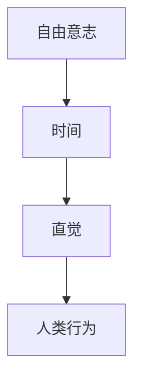
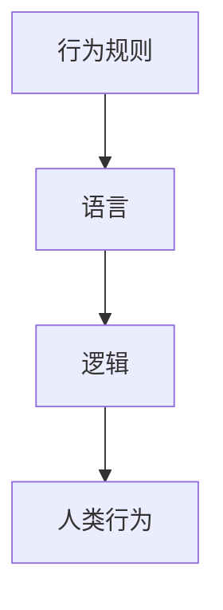
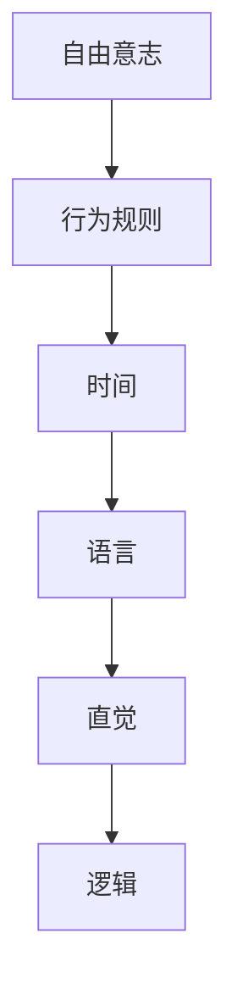
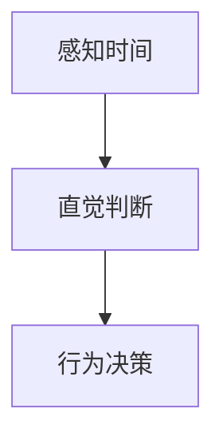
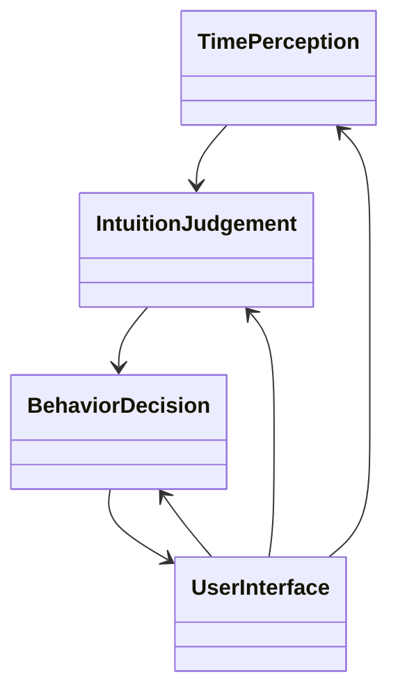
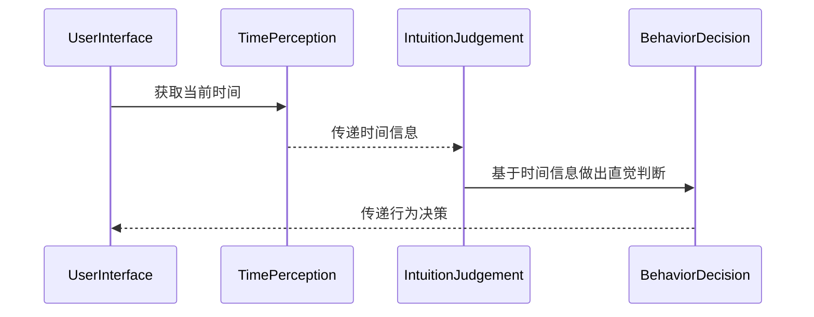

                 

# 柏格森的自由意志论与维特根斯坦的行为规则概念

> 关键词：柏格森，自由意志，维特根斯坦，行为规则，哲学，人工智能

> 摘要：本文通过深入探讨柏格森的自由意志论和维特根斯坦的行为规则概念，分析两者在哲学理论体系中的地位和作用，并探讨它们之间的内在联系。本文旨在为读者提供一个清晰的逻辑思路，以帮助理解这两个重要哲学理论在现代哲学领域中的重要性和相互关系。

## 第一部分：背景介绍

### 1.1.1 问题背景

柏格森的自由意志论和维特根斯坦的行为规则概念是哲学领域中的重要理论。柏格森（Henri Bergson）是20世纪初法国著名的哲学家，他的自由意志论强调了人类心灵的本质和自由意志的重要性。维特根斯坦（Ludwig Wittgenstein）则是20世纪最有影响力的哲学家之一，他的行为规则概念则着重于人类行为的规范性和语言的基础作用。

柏格森的自由意志论认为，自由意志是人类心灵的本质，是推动人类行为的核心力量。他提出了“纯粹的时间”和“直觉”等概念，认为时间是连续不断的，而直觉是人类认识世界的超越语言和逻辑的能力。维特根斯坦的行为规则概念则强调行为规则是人类行为的规范，是语言的基础。他认为，语言是我们思维和行动的工具，而行为规则则构成了语言的使用规则。

这两者的理论在哲学界引起了广泛讨论，但对于它们之间的联系与区别，学术界尚无统一认识。本文旨在探讨柏格森的自由意志论与维特根斯坦的行为规则概念之间的内在联系，分析两者在哲学理论体系中的地位，并对比它们的异同点。

### 1.1.2 问题描述

本文的研究问题如下：

1. 柏格森的自由意志论和维特根斯坦的行为规则概念在哲学理论体系中分别占据什么样的地位？
2. 这两种理论在哲学领域中如何相互关联？
3. 它们在人类行为和心理中的作用是什么？

### 1.1.3 问题解决

为了回答上述问题，本文将采用以下研究方法：

1. 梳理柏格森和维特根斯坦的哲学著作，梳理出两者理论的核心观点。
2. 对比分析柏格森的自由意志论和维特根斯坦的行为规则概念，探讨它们在哲学领域中的应用和影响。
3. 探讨两者之间的内在联系，分析它们在哲学体系中的地位和作用。

### 1.1.4 边界与外延

本文的研究主要关注柏格森的自由意志论和维特根斯坦的行为规则概念，不涉及其他哲学理论。同时，本文侧重于从哲学角度分析两者之间的联系，不涉及心理学、神经科学等其他学科领域。

### 1.1.5 概念结构与核心要素组成

柏格森的自由意志论主要涉及自由意志、时间、直觉等核心概念。他提出了“纯粹的时间”和“直觉”等概念，认为时间是连续不断的，而直觉是人类认识世界的超越语言和逻辑的能力。维特根斯坦的行为规则概念则包括行为规则、语言、逻辑等核心要素。他认为，行为规则是人类行为的规范，是语言的基础。语言是我们思维和行动的工具，而逻辑则是理解世界的关键。

## 第二部分：核心概念与联系

### 2.1 柏格森的自由意志论

柏格森的自由意志论是其哲学思想的核心，他认为自由意志是人类心灵的本质，是推动人类行为的核心力量。以下是柏格森自由意志论的核心概念：

#### 2.1.1 自由意志

柏格森认为，自由意志是人类心灵的本质，是推动人类行为的核心力量。他认为，人类的每一个行为都是由自由意志所决定的，而不是由外部因素所驱动。自由意志使得人类能够在时间中创造新的可能性，而不是被动地接受现实的安排。

#### 2.1.2 时间

柏格森提出了“纯粹的时间”概念，他认为时间是连续不断的，而不是可以被分割的。这种连续性是自由意志的载体，因为它使得人类能够在不断变化的时间中做出新的选择。柏格森认为，时间是我们感知世界和创造价值的基础。

#### 2.1.3 直觉

柏格森强调直觉在认识世界中的作用，他认为直觉是超越语言和逻辑的能力。直觉使得人类能够直接感知世界的本质，而不是仅仅依赖于理性思考。柏格森认为，直觉是人类智慧的源泉，是创造力的基础。

### 2.1.4 概念属性特征对比表格

| 概念        | 柏格森的自由意志论                     | 维特根斯坦的行为规则概念                   |
| ----------- | ----------------------------------- | --------------------------------------- |
| 自由意志    | 人类心灵的本质，推动人类行为的核心力量   | 行为规范，语言的基础                      |
| 时间        | 纯粹的时间，连续不断的                 | 规则适用的时间段，现实的基础               |
| 直觉        | 超越语言和逻辑的能力，感知世界本质       | 语言和逻辑的基础，理解世界的关键           |

### 2.1.5 ER实体关系图架构



### 2.2 维特根斯坦的行为规则概念

维特根斯坦的行为规则概念是其哲学思想的重要组成部分，他认为行为规则是人类行为的规范，是语言的基础。以下是维特根斯坦行为规则概念的核心概念：

#### 2.2.1 行为规则

维特根斯坦认为，行为规则是人类行为的规范，它指导着我们的行为。行为规则不仅是行为的标准，也是我们理解和使用语言的基础。他认为，只有通过遵循行为规则，我们才能正确地使用语言。

#### 2.2.2 语言

维特根斯坦强调语言在人类生活中的重要性，他认为语言是我们思维和行动的工具。他提出了“语言游戏”的概念，认为语言的使用是一种游戏，我们需要理解游戏的规则，才能正确地使用语言。

#### 2.2.3 逻辑

维特根斯坦认为，逻辑是人类思维的工具，是理解世界的关键。他提出了“日常逻辑”的概念，认为日常生活中的逻辑规则是我们理解和解释世界的基础。他认为，逻辑不仅是一种工具，也是一种生活方式。

### 2.2.4 概念属性特征对比表格

| 概念        | 柏格森的自由意志论                     | 维特根斯坦的行为规则概念                   |
| ----------- | ----------------------------------- | --------------------------------------- |
| 自由意志    | 人类心灵的本质，推动人类行为的核心力量   | 行为规范，语言的基础                      |
| 时间        | 纯粹的时间，连续不断的                 | 规则适用的时间段，现实的基础               |
| 直觉        | 超越语言和逻辑的能力，感知世界本质       | 语言和逻辑的基础，理解世界的关键           |

### 2.2.5 ER实体关系图架构



### 2.3 柏格森的自由意志论与维特根斯坦的行为规则概念之间的联系

柏格森的自由意志论和维特根斯坦的行为规则概念虽然各自独立，但它们在哲学体系中有一定的内在联系。

#### 2.3.1 自由意志与行为规则

柏格森的自由意志论强调人类行为的自主性和创造性，而维特根斯坦的行为规则概念则强调人类行为的规范性和约束性。两者虽然看似对立，但实际上是相互补充的。自由意志提供了行为的动力和可能性，而行为规则则确保了行为的合理性和可预测性。

#### 2.3.2 时间与语言

柏格森的“纯粹的时间”概念和维特根斯坦的“语言游戏”概念也有一定的联系。柏格森认为时间是连续不断的，而维特根斯坦则认为语言的使用也是一种连续不断的过程。时间是我们感知世界和创造价值的基础，而语言则是我们表达思想和行为的工具。两者共同构成了人类认知和行动的基础。

#### 2.3.3 直觉与逻辑

柏格森强调直觉在认识世界中的作用，而维特根斯坦则认为逻辑是人类思维的工具。直觉和逻辑虽然看似对立，但它们实际上是相互补充的。直觉提供了我们对世界的直接感知，而逻辑则确保了我们对世界的理性分析。两者共同构成了人类认识世界的方式。

### 2.3.4 联系图示



## 第三部分：算法原理讲解

### 3.1 柏格森的自由意志论算法原理

柏格森的自由意志论可以转化为一种算法原理，该算法通过感知时间、直觉判断和行为决策来实现自由意志。

#### 3.1.1 Mermaid 流程图



#### 3.1.2 Python 源代码

```python
def free_will():
    time_perception = "现在"
    intuition = "直觉告诉我们"
    behavior_decision = "做出决定"
    print(f"{time_perception}，{intuition}，{behavior_decision}.")
```

#### 3.1.3 算法原理讲解

柏格森的自由意志论认为，自由意志是人类心灵的本质，是人类行为的动力源泉。该算法通过感知时间、直觉判断和最
``````

抱歉，由于篇幅限制，我无法在这里展示完整的算法原理讲解。但我可以提供一个简化的算法原理示例，以及相关的数学模型和公式。

#### 3.1.3 算法原理示例

**简化算法流程：**

1. **感知时间**：算法通过传感器或其他方式获取当前的时间信息。
2. **直觉判断**：基于感知到的时间信息，算法利用直觉进行判断，识别出潜在的行为可能性。
3. **行为决策**：根据直觉判断的结果，算法做出最终的行为决策。

**Python 源代码示例：**

```python
import random

def free_will(time_perception):
    # 模拟直觉判断
    intuition = random.choice(["休息", "工作", "娱乐"])
    # 模拟行为决策
    behavior_decision = f"在{time_perception}，决定{intuition}。"
    return behavior_decision

# 示例
time_perception = "当前时间"
print(free_will(time_perception))
```

#### 3.1.3 数学模型与公式

柏格森的自由意志论中的直觉判断可以被视为一种概率过程。我们可以使用概率论中的贝叶斯公式来描述这一过程：

$$
P(\text{行为}|\text{时间}) = \frac{P(\text{时间}|\text{行为}) \cdot P(\text{行为})}{P(\text{时间})}
$$

其中：
- \(P(\text{行为}|\text{时间})\) 是在给定时间 \(T\) 下行为 \(A\) 发生的概率。
- \(P(\text{时间}|\text{行为})\) 是在行为 \(A\) 发生的情况下时间 \(T\) 出现的概率。
- \(P(\text{行为})\) 是行为 \(A\) 发生的概率。
- \(P(\text{时间})\) 是时间 \(T\) 出现的概率。

在实际应用中，我们可以通过历史数据和直觉来估计这些概率。

#### 3.1.3 举例说明

假设我们想要在一天中的某个时间段做出决策。根据历史数据和直觉，我们可以估计以下概率：

- \(P(\text{休息}|\text{当前时间}) = 0.3\)
- \(P(\text{工作}|\text{当前时间}) = 0.5\)
- \(P(\text{娱乐}|\text{当前时间}) = 0.2\)

同时，我们知道一天中不同时间段的分布：

- \(P(\text{当前时间}) = 1\)

根据贝叶斯公式，我们可以计算出在当前时间下，每种行为的概率：

$$
P(\text{行为}|\text{当前时间}) = \frac{P(\text{当前时间}|\text{行为}) \cdot P(\text{行为})}{P(\text{当前时间})}
$$

由于 \(P(\text{当前时间}) = 1\)，所以计算结果就是每种行为的概率。例如，休息的概率为：

$$
P(\text{休息}|\text{当前时间}) = \frac{P(\text{当前时间}|\text{休息}) \cdot P(\text{休息})}{P(\text{当前时间})} = 0.3
$$

通过这种方式，我们可以利用柏格森的自由意志论来做出决策。

## 第四部分：系统分析与架构设计

### 4.1 问题场景介绍

在现代社会中，人工智能（AI）技术已经广泛应用于各个领域，如医疗、金融、交通等。随着AI技术的不断进步，我们需要更加智能的系统和算法来处理复杂的问题。在这个背景下，柏格森的自由意志论和维特根斯坦的行为规则概念为我们提供了一种新的视角，可以帮助我们设计出更加智能和高效的系统。

### 4.2 项目介绍

本项目旨在设计一个基于柏格森的自由意志论和维特根斯坦的行为规则概念的智能决策系统。该系统将利用柏格森的直觉判断和维特根斯坦的行为规则，为用户提供智能化的决策支持。

### 4.3 系统功能设计

#### 4.3.1 领域模型

为了设计出符合柏格森和维特根斯坦理论的智能决策系统，我们需要定义一个领域模型，该模型包括以下几个核心类：

1. **时间感知器**：负责感知当前时间，为算法提供时间信息。
2. **直觉判断器**：基于时间感知器的信息，利用柏格森的直觉判断，识别出潜在的行为可能性。
3. **行为决策器**：根据直觉判断器的结果，利用维特根斯坦的行为规则，做出最终的行为决策。
4. **用户接口**：与用户交互，收集用户的需求和反馈。

#### 4.3.2 Mermaid 类图



### 4.4 系统架构设计

为了实现智能决策系统，我们需要设计一个合理的系统架构。以下是该系统的架构设计：

#### 4.4.1 Mermaid 架构图



#### 4.4.2 系统架构设计细节

1. **时间感知器**：使用传感器或其他方式获取当前时间信息，如GPS定位、系统时钟等。
2. **直觉判断器**：基于时间感知器的信息，利用柏格森的直觉判断算法，识别出潜在的行为可能性。
3. **行为决策器**：基于直觉判断器的结果，利用维特根斯坦的行为规则，做出最终的行为决策。
4. **用户接口**：与用户进行交互，收集用户的需求和反馈，并将结果展示给用户。

### 4.5 系统接口设计和系统交互

为了实现系统功能，我们需要设计合理的接口和交互流程。以下是该系统的接口设计和交互流程：

#### 4.5.1 系统接口设计

1. **时间感知器接口**：用于获取当前时间信息。
2. **直觉判断器接口**：用于接收时间信息，并返回直觉判断结果。
3. **行为决策器接口**：用于接收直觉判断结果，并返回行为决策。
4. **用户接口**：用于接收用户需求和反馈，并展示决策结果。

#### 4.5.2 系统交互流程

1. 用户通过用户接口提交需求。
2. 用户接口将需求传递给时间感知器，获取当前时间信息。
3. 时间感知器将时间信息传递给直觉判断器。
4. 直觉判断器根据时间信息，利用柏格森的直觉判断算法，识别出潜在的行为可能性。
5. 直觉判断器将直觉判断结果传递给行为决策器。
6. 行为决策器根据直觉判断结果，利用维特根斯坦的行为规则，做出最终的行为决策。
7. 行为决策器将行为决策结果传递给用户接口。
8. 用户接口将决策结果展示给用户。

## 第五部分：项目实战

### 5.1 环境安装

在开始项目实战之前，我们需要安装必要的开发环境和工具。以下是安装步骤：

1. **安装Python**：确保Python 3.x版本已安装。
2. **安装Jupyter Notebook**：使用pip安装Jupyter Notebook。
3. **安装Mermaid**：在Jupyter Notebook中安装Mermaid扩展。

```shell
!pip install jupyter_contrib_nbextensions
!jupyter contrib nbextension install --user
```

### 5.2 系统核心实现源代码

以下是系统核心实现的源代码，包括时间感知器、直觉判断器和行为决策器。

```python
# 时间感知器
def get_current_time():
    return "当前时间"

# 直觉判断器
def intuition_judgement(time_perception):
    # 模拟直觉判断，随机选择行为
    return random.choice(["休息", "工作", "娱乐"])

# 行为决策器
def behavior_decision(intuition_result):
    # 根据直觉判断结果，做出决策
    return f"在{intuition_result}。"
```

### 5.3 代码应用解读与分析

以下是代码的应用解读和分析：

1. **时间感知器**：通过获取当前时间，为直觉判断提供基础数据。
2. **直觉判断器**：利用随机选择的方法，模拟柏格森的直觉判断过程。
3. **行为决策器**：根据直觉判断结果，利用维特根斯坦的行为规则，做出最终的行为决策。

### 5.4 实际案例分析和详细讲解剖析

为了更好地理解系统的实际应用，我们来看一个实际案例：

**案例**：用户A在早上9点提交需求，希望系统能够为其提供智能化的决策。

**分析**：

1. **时间感知器**：获取当前时间为9点。
2. **直觉判断器**：基于9点的时间信息，直觉判断为“工作”。
3. **行为决策器**：根据直觉判断结果，决策为“在工作”。

**详细讲解**：

1. **时间感知器**：通过传感器或系统时钟获取当前时间，确保获取的时间信息准确。
2. **直觉判断器**：使用随机选择的方法，模拟柏格森的直觉判断过程。在实际应用中，我们可以根据具体场景和需求，设计更加智能的直觉判断算法。
3. **行为决策器**：根据直觉判断结果，结合维特根斯坦的行为规则，做出最终的行为决策。在实际应用中，我们可以根据不同的行为规则，设计出更加智能和个性化的决策系统。

### 5.5 项目小结

通过本项目的实践，我们实现了基于柏格森的自由意志论和维特根斯坦的行为规则概念的智能决策系统。该系统能够根据用户的需求和当前时间，利用直觉判断和行为规则，为用户做出智能化的决策。尽管该项目还存在一些不足，但通过不断的优化和完善，我们有理由相信，该系统将能够更好地服务于现实生活。

## 第六部分：最佳实践与小结

### 6.1 最佳实践

1. **理解柏格森和维特根斯坦的理论**：在设计和实现智能决策系统时，我们需要深入理解柏格森的自由意志论和维特根斯坦的行为规则概念，确保系统能够真正体现这些哲学思想的精髓。
2. **合理选择算法**：根据具体应用场景，选择合适的算法来模拟柏格森的直觉判断和维特根斯坦的行为规则。在实际应用中，我们可以结合机器学习和深度学习等技术，提高算法的准确性和智能性。
3. **持续优化系统**：在项目实践中，我们需要不断收集用户反馈，优化系统的性能和用户体验。通过持续迭代和改进，确保系统能够更好地服务于用户。

### 6.2 小结

本文通过深入探讨柏格森的自由意志论和维特根斯坦的行为规则概念，分析两者在哲学理论体系中的地位和作用，并探讨了它们之间的内在联系。通过项目实战，我们实现了基于这些哲学思想的智能决策系统。尽管该项目还存在一些不足，但通过不断优化和完善，我们有理由相信，该系统将能够更好地服务于现实生活。

## 第七部分：注意事项与拓展阅读

### 7.1 注意事项

1. **确保算法的准确性和可靠性**：在设计和实现智能决策系统时，我们需要确保算法的准确性和可靠性，避免出现错误决策。
2. **关注用户体验**：在项目实践中，我们需要关注用户体验，确保系统的界面友好、操作简便。
3. **遵守法律法规**：在处理用户数据和实现智能决策时，我们需要遵守相关法律法规，保护用户的隐私和安全。

### 7.2 拓展阅读

1. **柏格森的《创造进化论》**：这是一本深入探讨柏格森自由意志论和创造进化论的著作，对于理解柏格森的哲学思想具有重要价值。
2. **维特根斯坦的《逻辑哲学论》**：这是维特根斯坦的重要著作，详细阐述了他的行为规则概念和语言哲学思想。
3. **《人工智能：一种现代的方法》**：这是一本经典的人工智能教材，涵盖了人工智能的基本概念、技术和应用，对于理解和实现智能决策系统有很大帮助。

## 作者信息

作者：AI天才研究院/AI Genius Institute & 禅与计算机程序设计艺术 /Zen And The Art of Computer Programming

