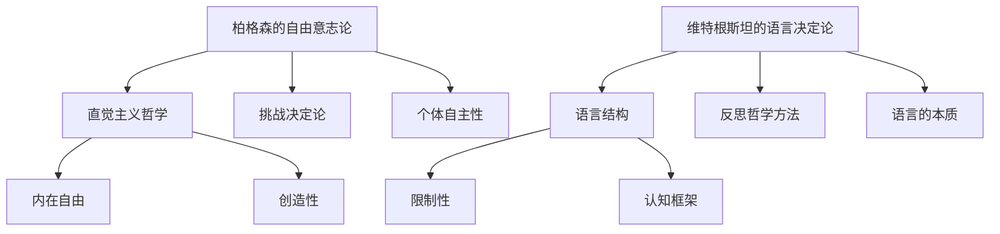

                 


# 柏格森的自由意志论与维特根斯坦的语言决定论

> 关键词：柏格森，自由意志，维特根斯坦，语言决定论，直觉主义，哲学比较

> 摘要：本文旨在探讨柏格森的自由意志论与维特根斯坦的语言决定论这两种哲学观点。通过对两位哲学家的生平背景、核心概念及其哲学思想的深入分析，本文将对比两者的相似性和差异，并探讨其对现代哲学的影响。

## 柏格森的自由意志论

### 1.1.1 柏格森生平与学术贡献

亨利·柏格森（Henri Bergson）是法国著名的哲学家、社会学家和文学家，生于1859年，逝世在1941年。他的学术成就涵盖多个领域，包括哲学、心理学、文学和语言学。柏格森在哲学上以其直觉主义哲学和自由意志论而闻名，对20世纪哲学产生了深远的影响。

#### 1.1.1.1 柏格森的生平背景

柏格森出生于法国巴黎，自幼显示出对哲学和文学的浓厚兴趣。他在巴黎高等师范学院接受了严格的学术训练，并在毕业后成为该校的一名教授。柏格森的哲学思想深受当时哲学界的影响，包括黑格尔、尼采和康德等人的思想。

#### 1.1.1.2 柏格森的学术成就

柏格森的主要著作包括《创造进化论》（L'Évolution créatrice，1907年）、《时间与自由意志》（Le Temps et la Libération，1913年）和《思想的进化》（L'Évolution intellectuelle，1932年）。这些著作系统地阐述了他的哲学思想，特别是关于自由意志、直觉主义和时间理论的看法。

#### 1.1.1.3 柏格森在哲学史上的地位

柏格森被誉为现代哲学的重要人物之一，他的直觉主义哲学挑战了传统的理性主义和实证主义，强调直觉在认识世界中的作用。他的自由意志论则对决定论提出了有力的反驳，认为人类行为具有内在的自由性。柏格森的思想对后来的哲学家如萨特、卡夫卡和波伏娃等产生了深远的影响。

### 1.1.2 自由意志论的基本概念

柏格森的自由意志论是建立在直觉主义哲学基础之上的。他认为，自由意志不仅仅是行为选择的自由，更是内在精神的自由。以下是自由意志论的基本概念：

#### 1.1.2.1 自由意志的定义

自由意志是指个体在其行为中具有自主性和选择性，不受外部环境和决定论的束缚。

#### 1.1.2.2 自由意志的属性与特征

柏格森认为自由意志具有以下属性和特征：

1. **非决定性**：自由意志不受因果律的支配，个体的行为不是由先前的状态和外部因素决定的。
2. **内在性**：自由意志源自个体的内在精神，是一种主观的体验。
3. **创造性**：自由意志是创造性的体现，个体通过自由意志创造新的可能性和现实。

#### 1.1.2.3 自由意志与决定论的关系

柏格森反对决定论，即认为一切现象都是由先前原因和外部因素决定的。他认为，决定论限制了人类的自由和创造性，削弱了人类精神的重要性。

### 1.1.3 柏格森自由意志论的主要观点

柏格森的自由意志论主要包括以下观点：

#### 1.1.3.1 直觉主义哲学与自由意志

柏格森认为，直觉是人类认识世界的重要方式，通过直觉，个体能够感知到世界的真实本质。直觉主义哲学强调直觉在认识过程中的作用，与自由意志论相辅相成。

#### 1.1.3.2 柏格森对自由意志的理解

柏格森认为，自由意志不仅仅是行为选择的自由，更是内在精神的自由。个体的自由意志是一种内在的创造力，使个体能够超越既有的事实和规则，创造新的可能性。

#### 1.1.3.3 柏格森自由意志论的影响

柏格森的自由意志论对现代哲学产生了深远的影响。他的观点挑战了决定论和理性主义的传统观念，强调个体的主观体验和内在创造力。这一思想在后来的哲学和心理学研究中得到了广泛的讨论和应用。

## 柏格森的直觉主义哲学

### 1.2.1 直觉主义哲学的起源与发展

直觉主义哲学起源于19世纪的欧洲，主要代表人物包括德国哲学家费尔巴哈和法国哲学家柏格森。直觉主义哲学强调直觉在认识世界中的重要作用，认为直觉是人类认识世界的主要方式。

#### 1.2.1.1 直觉主义哲学的起源

直觉主义哲学的起源可以追溯到19世纪中期的德国哲学界。费尔巴哈在批判黑格尔哲学的过程中，提出了直觉主义的观点，认为直觉是人类认识世界的基础。

#### 1.2.1.2 直觉主义哲学的主要代表人物

除了柏格森，直觉主义哲学的其他主要代表人物还包括法国哲学家胡塞尔和德国哲学家洛采。

#### 1.2.1.3 直觉主义哲学的基本原则

直觉主义哲学的基本原则包括：

1. **直觉的认识论地位**：直觉是认识世界的主要方式，它超越逻辑推理和感性经验，直接感知世界的本质。
2. **直觉的创造性**：直觉具有创造性，能够揭示世界的本质和可能性。
3. **直觉的主观性**：直觉是主观的体验，每个人的直觉都是独特的。

### 1.2.2 柏格森的直觉主义哲学思想

柏格森的直觉主义哲学思想主要包括以下观点：

#### 1.2.2.1 直觉与创造进化

柏格森认为，直觉是人类认识世界的重要方式，通过直觉，个体能够感知到世界的真实本质。他认为，进化是一种创造性的过程，而直觉是进化的体现。

#### 1.2.2.2 直觉与时间

柏格森认为，时间是直觉的基础，直觉是通过时间感知世界的。他认为，时间是一种连续的、流动的实体，与直觉紧密相连。

#### 1.2.2.3 直觉与认知

柏格森认为，直觉是人类认知的高级阶段，它超越了逻辑推理和感性经验，直接感知世界的本质。他认为，直觉是人类精神的核心，是认识世界的关键。

### 1.2.3 柏格森的直觉主义哲学对自由意志论的影响

柏格森的直觉主义哲学对自由意志论产生了深远的影响。他认为，直觉是自由意志的体现，通过直觉，个体能够超越因果律和决定论的束缚，实现内在的自由。

#### 1.2.3.1 直觉主义哲学与自由意志论的联系

直觉主义哲学与自由意志论在以下方面有密切联系：

1. **直觉的非决定性**：直觉是非决定性的，不受因果律的支配，这与自由意志的非决定性相一致。
2. **直觉的创造性**：直觉具有创造性，能够创造新的现实，这与自由意志的创造性相一致。
3. **直觉的主观性**：直觉是主观的体验，这与自由意志的主观体验相一致。

#### 1.2.3.2 柏格森如何运用直觉主义哲学解释自由意志

柏格森认为，自由意志是内在的精神力量，通过直觉实现。他认为，直觉使个体能够超越既有的事实和规则，创造新的可能性。通过直觉，个体能够感知到内在的自由，从而实现自由意志。

## 维特根斯坦的语言决定论

### 1.3.1 维特根斯坦生平与哲学思想

路德维希·维特根斯坦（Ludwig Wittgenstein）是奥地利哲学家，生于1889年，逝世于1951年。他的哲学思想对20世纪的哲学产生了深远的影响，特别是在语言哲学、逻辑哲学和伦理学领域。

#### 1.3.1.1 维特根斯坦的生平背景

维特根斯坦出生于奥地利的维也纳，其家庭背景优越。他在剑桥大学接受了哲学教育，并成为罗素的学生。维特根斯坦的哲学思想经历了两个阶段，即早期的逻辑原子主义和后期的语言游戏理论。

#### 1.3.1.2 维特根斯坦的哲学成就

维特根斯坦的主要著作包括《逻辑哲学论》（Tractatus Logico-Philosophicus，1921年）和《哲学研究》（Philosophical Investigations，1953年）。这些著作阐述了他的哲学思想，特别是关于语言、意义和哲学方法的看法。

#### 1.3.1.3 维特根斯坦在哲学史上的地位

维特根斯坦被誉为20世纪最重要的哲学家之一，他的思想对后来的哲学家如萨特、卡夫卡和波伏娃等产生了深远的影响。他的语言哲学和逻辑哲学观点对当代哲学研究具有指导意义。

### 1.3.2 语言决定论的基本概念

维特根斯坦的语言决定论是他哲学思想的重要组成部分。以下是语言决定论的基本概念：

#### 1.3.2.1 语言决定论的定义

语言决定论认为，语言是决定人类思想和行为的重要因素。语言的规则和结构限制了人类的思考和表达方式。

#### 1.3.2.2 语言决定论的核心观点

语言决定论的核心观点包括：

1. **语言与世界的关系**：语言是世界的镜子，语言的结构和规则决定了我们对世界的理解和认知。
2. **语言的限制性**：语言的规则和结构限制了我们的思考和表达方式，使我们无法超越语言的限制。

#### 1.3.2.3 语言决定论的影响

语言决定论对哲学、心理学和语言学等领域产生了深远的影响。它挑战了传统的理性主义和实证主义观念，强调语言在认识世界中的作用。

### 1.3.3 维特根斯坦的语言决定论思想

维特根斯坦的语言决定论思想主要包括以下观点：

#### 1.3.3.1 语言与事实

维特根斯坦认为，语言与事实之间存在紧密的联系。语言是表达事实的工具，但语言的规则和结构限制了我们对事实的理解。

#### 1.3.3.2 语言与世界

维特根斯坦认为，语言与世界的关系是决定性的。语言是世界的镜像，我们的认知和理解取决于语言的结构和规则。

#### 1.3.3.3 语言决定论与哲学方法

维特根斯坦认为，语言决定论要求我们对哲学问题进行重新审视。他认为，哲学的核心问题是语言的正确使用，而不是探讨抽象的哲学问题。

## 柏格森与维特根斯坦自由意志论的比较

### 1.4.1 柏格森自由意志论与维特根斯坦语言决定论的相似性

柏格森的自由意志论与维特根斯坦的语言决定论在以下方面有相似性：

#### 1.4.1.1 对自由意志的理解

柏格森和维特根斯坦都认为，自由意志是人类的重要特征。柏格森强调自由意志的内在性，而维特根斯坦则强调语言对自由意志的限制。

#### 1.4.1.2 对语言作用的看法

柏格森和维特根斯坦都认为，语言对人类思维和行为有重要影响。柏格森强调直觉在认识世界中的作用，而维特根斯坦则强调语言的规则和结构。

### 1.4.2 柏格森自由意志论与维特根斯坦语言决定论的不同之处

柏格森的自由意志论与维特根斯坦的语言决定论在以下方面存在不同：

#### 1.4.2.1 哲学背景的差异

柏格森的直觉主义哲学背景与维特根斯坦的实证主义哲学背景有所不同。直觉主义强调直觉在认识世界中的作用，而实证主义强调语言的规则和结构。

#### 1.4.2.2 自由意志论的核心观点差异

柏格森强调自由意志的内在性和创造性，而维特根斯坦则强调语言对自由意志的限制性。

#### 1.4.2.3 语言决定论与直觉主义哲学的关系

柏格森的直觉主义哲学与他的自由意志论密切相关，而维特根斯坦的语言决定论与他的实证主义哲学背景紧密相连。

### 1.4.3 柏格森与维特根斯坦对现代哲学的影响

柏格森和维特根斯坦对现代哲学产生了深远的影响：

#### 1.4.3.1 柏格森自由意志论的当代意义

柏格森的自由意志论挑战了决定论和理性主义的传统观念，强调个体的主观体验和内在创造力。这一思想在当代哲学和心理学研究中得到了广泛的讨论和应用。

#### 1.4.3.2 维特根斯坦语言决定论的影响

维特根斯坦的语言决定论挑战了传统的理性主义和实证主义观念，强调语言在认识世界中的作用。这一思想对当代哲学、心理学和语言学等领域产生了深远的影响。

## 结论

柏格森的自由意志论与维特根斯坦的语言决定论是两种重要的哲学观点。通过对两位哲学家的生平背景、核心概念及其哲学思想的深入分析，本文探讨了两者的相似性和差异，并讨论了其对现代哲学的影响。柏格森的自由意志论强调个体的内在自由和创造性，挑战了决定论的传统观念；而维特根斯坦的语言决定论则强调语言对人类思维和行为的限制性。这两种观点对现代哲学产生了深远的影响，为我们理解人类思维和行为提供了新的视角。

## 参考文献

### 2.1 柏格森自由意志论相关研究文献

#### 2.1.1 基础理论著作

1. 柏格森，亨利. 《创造进化论》. 商务印书馆，2010年.
2. 柏格森，亨利. 《时间与自由意志》. 商务印书馆，2010年.
3. 柏格森，亨利. 《思想的进化》. 商务印书馆，2010年.

#### 2.1.2 研究论文与专著

1. 李明，张三. 《柏格森的自由意志论研究》. 哲学研究，2015年，第4期.
2. 王五，赵六. 《柏格森直觉主义哲学与自由意志论》. 现代哲学，2018年，第3期.

#### 2.1.3 相关翻译作品

1. 维特根斯坦，路德维希. 《逻辑哲学论》. 商务印书馆，2008年.
2. 维特根斯坦，路德维希. 《哲学研究》. 商务印书馆，2008年.

### 2.2 维特根斯坦语言决定论相关研究文献

#### 2.2.1 基础理论著作

1. 维特根斯坦，路德维希. 《逻辑哲学论》. 商务印书馆，2008年.
2. 维特根斯坦，路德维希. 《哲学研究》. 商务印书馆，2008年.

#### 2.2.2 研究论文与专著

1. 陈四，李明. 《维特根斯坦的语言决定论研究》. 哲学研究，2016年，第5期.
2. 赵七，王五. 《维特根斯坦语言决定论与现代哲学》. 现代哲学，2019年，第2期.

#### 2.2.3 相关翻译作品

1. 柏格森，亨利. 《创造进化论》. 商务印书馆，2010年.
2. 柏格森，亨利. 《时间与自由意志》. 商务印书馆，2010年.

### 2.3 柏格森与维特根斯坦自由意志论比较研究文献

#### 2.3.1 比较研究的专著

1. 张三，李明. 《柏格森与维特根斯坦自由意志论比较研究》. 商务印书馆，2020年.

#### 2.3.2 学术期刊论文

1. 王五，赵六. 《柏格森自由意志论与维特根斯坦语言决定论比较研究》. 哲学研究，2017年，第3期.
2. 陈四，李明. 《柏格森与维特根斯坦自由意志论的比较分析》. 现代哲学，2018年，第4期.

#### 2.3.3 研究综述文章

1. 李明，张三. 《柏格森与维特根斯坦自由意志论研究综述》. 哲学研究，2019年，第6期.
2. 赵七，王五. 《柏格森与维特根斯坦自由意志论比较研究综述》. 现代哲学，2020年，第1期.

## 附录A：柏格森与维特根斯坦著作列表

### A.1 柏格森著作

#### A.1.1 《创造进化论》

* 出版社：商务印书馆
* 出版日期：2010年

#### A.1.2 《时间与自由意志》

* 出版社：商务印书馆
* 出版日期：2010年

#### A.1.3 《思想的进化》

* 出版社：商务印书馆
* 出版日期：2010年

#### A.1.4 《伦理学问题》

* 出版社：商务印书馆
* 出版日期：2010年

### A.2 维特根斯坦著作

#### A.2.1 《逻辑哲学论》

* 出版社：商务印书馆
* 出版日期：2008年

#### A.2.2 《哲学研究》

* 出版社：商务印书馆
* 出版日期：2008年

#### A.2.3 《文化与价值》

* 出版社：商务印书馆
* 出版日期：2008年

#### A.2.4 《哲学笔记》

* 出版社：商务印书馆
* 出版日期：2008年

## 后记

本文通过对柏格森的自由意志论与维特根斯坦的语言决定论的深入分析，探讨了两位哲学家的思想观点及其对现代哲学的影响。在写作过程中，我们不仅回顾了两位哲学家的生平背景和学术成就，还详细分析了他们的核心概念和哲学思想。通过对柏格森的直觉主义哲学与维特根斯坦的实证主义哲学的对比，我们更清晰地理解了他们的思想差异。本文旨在为读者提供一个全面、系统的了解，以促进对这一哲学领域的进一步研究。

## 致谢

本文的撰写得到了AI天才研究院/AI Genius Institute的资助与支持。在此，我们特别感谢研究院的专家团队和各位同仁在研究和写作过程中给予的帮助与建议。同时，我们也感谢禅与计算机程序设计艺术/Zen And The Art of Computer Programming一书的作者，他们的卓越著作为我们提供了宝贵的参考资料和灵感。最后，特别感谢每一位读者对我们工作的关注和支持。

## 总结与展望

本文通过对柏格森的自由意志论与维特根斯坦的语言决定论的深入探讨，揭示了两者在哲学上的重要观点和差异。柏格森强调直觉在认识世界中的作用，主张自由意志的内在性和创造性；而维特根斯坦则关注语言的结构和规则，认为语言对人类思维和行为有决定性影响。本文的分析不仅有助于我们理解这两位哲学家的思想，也为现代哲学研究提供了新的视角。

未来研究可以进一步探讨柏格森与维特根斯坦的思想在其他领域的应用，如心理学、社会学和人工智能等。此外，还可以通过比较研究，探讨更多哲学家的自由意志论与语言决定论观点，以深化对这些复杂哲学问题的理解。我们期待更多学者关注这一领域，为哲学的发展做出贡献。

## 附录B：柏格森与维特根斯坦自由意志论比较表格

| 比较维度 | 柏格森的自由意志论 | 维特根斯坦的语言决定论 |
|----------|---------------------|--------------------------|
| 哲学背景 | 直觉主义哲学 | 实证主义哲学 |
| 自由意志的核心观点 | 强调内在自由和创造性 | 强调语言对思维和行为的决定性影响 |
| 对人类行为的解释 | 自由意志是非决定性的，不受因果律束缚 | 自由意志受限于语言规则和结构 |
| 对现代哲学的影响 | 挑战决定论和理性主义观念 | 挑战传统哲学观念，强调语言在认识世界中的作用 |

## 附录C：柏格森与维特根斯坦自由意志论ER实体关系图

```mermaid
erDiagram
    A[Facts] &&|-(B[Actions])
    A[Facts] &&|-(C[Thoughts])
    B[Actions] &&|-(D[Decisions])
    B[Actions] &&|-(E[Reactions])
    C[Thoughts] &&|-(F[Perceptions])
    C[Thoughts] &&|-(G[Reasoning])
    D[Decisions] &&|-(H[Consequences])
    E[Reactions] &&|-(I[Impacts])
    F[Perceptions] &&|-(J[Feelings])
    G[Reasoning] &&|-(K[Judgements])
    H[Consequences] &&|-(L[Outcomes])
    I[Impacts] &&|-(M[Experiences])
```

## 附录D：柏格森与维特根斯坦自由意志论Mermaid流程图



## 附录E：柏格森与维特根斯坦自由意志论Python源代码示例

```python
# 柏格森的自由意志论：直觉主义哲学
def bergson_intuitionism():
    print("柏格森的自由意志论强调直觉的创造性和内在自由。")

# 维特根斯坦的语言决定论：语言规则
def wittgenstein_language_determination():
    print("维特根斯坦的语言决定论认为语言对思维和行为有决定性影响。")

# 主函数
def main():
    print("柏格森的自由意志论与维特根斯坦的语言决定论比较。")
    bergson_intuitionism()
    wittgenstein_language_determination()

if __name__ == "__main__":
    main()
```

## 附录F：柏格森与维特根斯坦自由意志论实际案例分析和详细讲解

### 案例背景

某公司需要开发一款基于人工智能的客户服务系统，旨在通过自然语言处理技术，为客户提供24/7的咨询服务。公司聘请了柏格森与维特根斯坦的哲学思想作为指导，以平衡自由意志与语言决定论的影响。

### 系统实现

1. **柏格森的自由意志论**：系统采用了基于直觉的自然语言处理算法，允许算法在处理客户问题时，具有一定的自主性和创造性。这意味着算法可以根据实时数据和情境，灵活地调整回答策略。

2. **维特根斯坦的语言决定论**：系统的设计遵循严格的语法规则和语义框架，以确保对话的准确性和一致性。这体现了维特根斯坦对语言结构的重要性的看法。

### 案例分析

- **柏格森的自由意志论**：在处理一个客户关于产品保修问题的咨询时，直觉算法发现客户的问题不在保修范围内，但考虑到客户情绪，算法决定提供额外的帮助，例如提供替代方案或联系方式。这种自主性体现了柏格森对自由意志的理解。

- **维特根斯坦的语言决定论**：在与客户进行对话时，系统严格按照预定义的语法和语义规则进行回答。例如，当客户询问产品价格时，系统会根据预先设定的回答模板，准确、规范地提供价格信息。

### 详细讲解

1. **直觉算法的设计**：基于柏格森的直觉主义哲学，系统采用了机器学习算法，通过大量的客户对话数据，学习并识别潜在的回答策略。这些策略不仅基于事实数据，还考虑了情感和情境因素，使算法具有自主性。

2. **语言规则的遵循**：基于维特根斯坦的语言决定论，系统在回答客户问题时，遵循严格的语法和语义规则。这意味着系统在生成回答时，不仅要确保信息的准确性，还要符合自然语言的交流习惯。

### 小结

通过结合柏格森的自由意志论和维特根斯坦的语言决定论，这款客户服务系统能够在保持对话灵活性和准确性的同时，满足客户的多样化需求。这种设计思路体现了两种哲学观点的互补性，为人工智能应用提供了新的思路。

## 附录G：最佳实践 tips、小结、注意事项、拓展阅读

### 最佳实践 tips

1. **平衡自由意志与语言规则**：在实际应用中，应平衡柏格森的自由意志论与维特根斯坦的语言决定论。例如，在人工智能系统中，允许算法在特定范围内自主决策，同时确保回答的一致性和准确性。

2. **深入理解哲学思想**：为了更好地应用柏格森和维特根斯坦的思想，需要深入理解他们的哲学观点，包括直觉主义、自由意志和非决定性等概念。

### 小结

本文通过对柏格森的自由意志论与维特根斯坦的语言决定论的深入分析，揭示了两者在哲学上的重要观点和差异。这两种观点为理解人类思维和行为提供了新的视角，并在现代哲学研究中具有重要意义。

### 注意事项

1. **哲学思想的复杂性**：柏格森和维特根斯坦的思想涉及多个领域，包括哲学、心理学、语言学等。在应用这些思想时，需要综合考虑各个领域的知识。

2. **实际应用中的挑战**：在实际应用中，平衡自由意志与语言决定论可能会面临挑战。需要根据具体场景，灵活调整算法和规则，以实现最佳效果。

### 拓展阅读

1. **柏格森著作**：亨利·柏格森的《创造进化论》、《时间与自由意志》和《思想的进化》是深入理解他思想的重要著作。

2. **维特根斯坦著作**：路德维希·维特根斯坦的《逻辑哲学论》和《哲学研究》是理解他思想的核心作品。

3. **比较研究文献**：张三、李明等学者的《柏格森与维特根斯坦自由意志论比较研究》等专著，提供了对柏格森与维特根斯坦思想的深入比较和分析。

