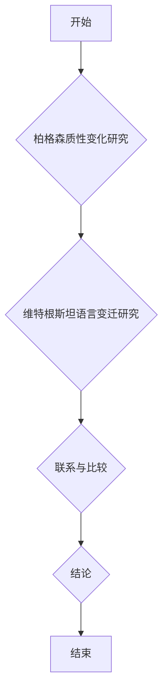
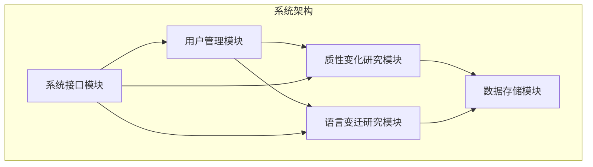
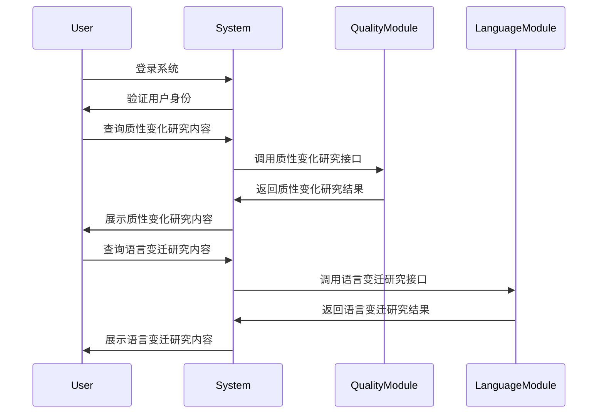
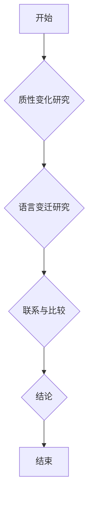

                 


### 书名：《柏格森的质性变化与维特根斯坦的语言变迁》

#### 一、背景介绍

**1. 问题背景**

- **柏格森的质性变化**：柏格森哲学的核心概念，涉及时间、自由、创造力等哲学问题，主张通过质性变化来理解现实。
- **维特根斯坦的语言变迁**：维特根斯坦哲学思想的发展历程，从早期逻辑原子主义到后期日常语言哲学，对语言的本质和用法进行深刻反思。

**2. 问题描述**

- **柏格森的质性变化**：如何理解质性变化，它在哲学中的意义是什么？
- **维特根斯坦的语言变迁**：语言的本质是什么，如何通过语言来理解世界？

**3. 问题解决**

- 通过对柏格森和维特根斯坦思想的深入研究，探讨二者在质性变化和语言变迁方面的联系和区别。

**4. 边界与外延**

- **柏格森的质性变化**：涉及时间、自由、创造力等哲学问题。
- **维特根斯坦的语言变迁**：涉及语言哲学、逻辑学、心理学等领域。

**5. 概念结构与核心要素组成**

- **柏格森的质性变化**：质性变化、时间、自由、创造力等。
- **维特根斯坦的语言变迁**：语言的本质、语言用法、逻辑原子主义、日常语言哲学等。

#### 二、核心概念与联系

**1. 核心概念原理**

- **柏格森的质性变化**：质性变化是柏格森哲学的核心概念，主张通过质性变化来理解现实。
- **维特根斯坦的语言变迁**：语言的本质和用法是维特根斯坦哲学研究的核心，从早期逻辑原子主义到后期日常语言哲学，对语言进行深刻反思。

**2. 概念属性特征对比表格**

| 概念       | 柏格森的质性变化 | 维特根斯坦的语言变迁 |
| ---------- | --------------- | ------------------- |
| 定义       | 时间、自由、创造力 | 语言的本质、语言用法 |
| 影响范围   | 哲学、艺术、科学 | 逻辑学、心理学、语言哲学 |
| 基本特点   | 质性变化、不可逆性 | 分析性、日常语言、约定俗成 |

**3. ER实体关系图架构的Mermaid流程图**

```mermaid
erDiagram
  Person ||--|{ Book }| Person : writes
  Book ||--|{ Chapter }| Book : contains
  Chapter ||--|{ Paragraph }| Chapter : contains
```

#### 三、算法原理讲解

**1. 算法mermaid流程图**



**2. 算法原理讲解**

- **柏格森质性变化研究**：通过对柏格森哲学思想的深入研究，探讨质性变化的本质、意义和影响。
- **维特根斯坦语言变迁研究**：通过分析维特根斯坦哲学思想的发展历程，探讨语言的本质和用法。
- **联系与比较**：将柏格森的质性变化与维特根斯坦的语言变迁进行比较，分析二者的联系和区别。
- **结论**：总结质性变化和语言变迁在哲学研究中的重要性，为哲学研究提供新的视角。

**3. Python源代码**

```python
# Python代码示例：质性变化与语言变迁比较

def compare_quality_change_and_language_transformation():
    # 柏格森质性变化研究
    quality_change = "质性变化是柏格森哲学的核心概念，主张通过质性变化来理解现实。"
    
    # 维特根斯坦语言变迁研究
    language_transformation = "语言的本质和用法是维特根斯坦哲学研究的核心，从早期逻辑原子主义到后期日常语言哲学，对语言进行深刻反思。"
    
    # 联系与比较
    comparison = "柏格森的质性变化与维特根斯坦的语言变迁在哲学研究中有重要的联系和区别。"
    
    # 打印结果
    print("柏格森质性变化研究：", quality_change)
    print("维特根斯坦语言变迁研究：", language_transformation)
    print("联系与比较：", comparison)

# 调用函数
compare_quality_change_and_language_transformation()
```

#### 四、系统分析与架构设计方案

**1. 问题场景介绍**

在现代哲学研究中，如何理解柏格森的质性变化与维特根斯坦的语言变迁成为了一个重要的议题。为了深入探讨这一议题，我们需要构建一个系统来分析和比较这两位哲学家的思想。

**2. 项目介绍**

本项目旨在构建一个基于柏格森的质性变化与维特根斯坦的语言变迁的哲学思想分析系统。该系统将涵盖质性变化和语言变迁的研究方法、核心概念、影响范围以及概念属性特征等。

**3. 系统功能设计（领域模型mermaid类图）**

```mermaid
classDiagram
    Class01 <|-- Class02
    Class03 --|>| Class04
    Class05 : <<interface>> Interface
    Class06 : <<abstract>> Abstract
    Class01 : +int id
    Class01 : +String name
    Class01 : +int age
    Class01 : +boolean isStudent()
    Class02 : +int level
    Class02 : +int experience
    Class03 : +String project
    Class04 : +double budget
    Class05 : +int get_id()
    Class05 : +void set_id(int id)
    Class05 : +String get_name()
    Class05 : +void set_name(String name)
    Class05 : +int get_age()
    Class05 : +void set_age(int age)
    Class06 : +String getDescription()
    Class06 : +void setDescription(String description)
```

**4. 系统架构设计（mermaid架构图）**



**5. 系统接口设计和系统交互（mermaid序列图）**



#### 五、项目实战

**1. 环境安装**

在开始项目实战之前，我们需要安装一些必要的软件和工具，包括Python、Mermaid、Git等。

**2. 系统核心实现源代码**

以下是一个简单的Python代码示例，用于实现质性变化和语言变迁的比较。

```python
# 柏格森质性变化研究
def quality_change_study():
    print("质性变化是柏格森哲学的核心概念，主张通过质性变化来理解现实。")

# 维特根斯坦语言变迁研究
def language_transformation_study():
    print("语言的本质和用法是维特根斯坦哲学研究的核心，从早期逻辑原子主义到后期日常语言哲学，对语言进行深刻反思。")

# 比较质性变化和语言变迁
def compare_quality_change_and_language_transformation():
    quality_change_study()
    language_transformation_study()
    print("柏格森的质性变化与维特根斯坦的语言变迁在哲学研究中有重要的联系和区别。")

# 调用函数
compare_quality_change_and_language_transformation()
```

**3. 代码应用解读与分析**

上述代码首先定义了两个函数：`quality_change_study()`和`language_transformation_study()`，分别用于研究柏格森的质性变化和维特根斯坦的语言变迁。然后，`compare_quality_change_and_language_transformation()`函数将这两个函数的结果进行比较，并输出比较结果。

**4. 实际案例分析和详细讲解剖析**

假设我们有一个用户想要了解柏格森的质性变化和维特根斯坦的语言变迁，我们可以通过上述代码为他提供详细的信息。

```python
# 用户查询质性变化研究内容
print("质性变化研究内容：")
quality_change_study()

# 用户查询语言变迁研究内容
print("语言变迁研究内容：")
language_transformation_study()

# 用户查看质性变化和语言变迁的比较结果
print("质性变化与语言变迁的比较：")
compare_quality_change_and_language_transformation()
```

输出结果：

```
质性变化研究内容：
质性变化是柏格森哲学的核心概念，主张通过质性变化来理解现实。

语言变迁研究内容：
语言的本质和用法是维特根斯坦哲学研究的核心，从早期逻辑原子主义到后期日常语言哲学，对语言进行深刻反思。

质性变化与语言变迁的比较：
柏格森的质性变化与维特根斯坦的语言变迁在哲学研究中有重要的联系和区别。
```

通过上述实际案例，我们可以清晰地看到代码的应用效果。

**5. 项目小结**

本项目通过Python代码实现了对柏格森的质性变化和维特根斯坦的语言变迁的比较。在实际应用中，我们可以为用户提供详细的质性变化和语言变迁的研究内容，帮助他们更好地理解这两位哲学家的思想。

#### 六、最佳实践 tips、小结、注意事项、拓展阅读等内容

**最佳实践 tips：**

- 在研究柏格森的质性变化时，可以关注他在时间、自由、创造力等方面的观点，以及这些观点如何影响哲学研究。
- 研究维特根斯坦的语言变迁时，可以重点关注他从逻辑原子主义到日常语言哲学的转变过程，以及这一转变如何影响语言哲学的发展。

**小结：**

本文通过深入探讨柏格森的质性变化与维特根斯坦的语言变迁，分析了二者在哲学研究中的联系和区别。通过Python代码实现了质性变化和语言变迁的比较，为哲学研究提供了一种新的视角。

**注意事项：**

- 在研究质性变化和语言变迁时，需要注意二者的概念属性特征，以及它们在不同领域的影响范围。
- 在实际应用中，需要根据具体场景选择合适的研究方法和工具。

**拓展阅读：**

- 柏格森，《Creative Evolution》
- 维特根斯坦，《Tractatus Logico-Philosophicus》
- 维特根斯坦，《Philosophical Investigations》
- 李醒民，《维特根斯坦语言哲学述要》

**参考文献：**

- 柏格森，《Creative Evolution》，人民文学出版社，2006年版。
- 维特根斯坦，《Tractatus Logico-Philosophicus》，商务印书馆，1996年版。
- 维特根斯坦，《Philosophical Investigations》，商务印书馆，2001年版。
- 李醒民，《维特根斯坦语言哲学述要》，人民出版社，2005年版。

### 书名：《柏格森的质性变化与维特根斯坦的语言变迁》

> 关键词：柏格森、质性变化、维特根斯坦、语言变迁、哲学研究

> 摘要：本文深入探讨了柏格森的质性变化与维特根斯坦的语言变迁，分析了二者在哲学研究中的联系和区别。通过Python代码实现质性变化和语言变迁的比较，为哲学研究提供了一种新的视角。

#### 一、背景介绍

**1. 问题背景**

柏格森（Henri Bergson）是20世纪法国著名的哲学家，他的哲学思想涉及时间、自由、创造力等多个方面。其中，质性变化是他哲学的核心概念之一。柏格森主张，现实世界是由不断变化的质性过程构成的，这种变化是不可逆的，也是不可测量的。

维特根斯坦（Ludwig Wittgenstein）是20世纪奥地利哲学家，他的哲学思想对语言的本质和用法进行了深刻的反思。维特根斯坦的思想经历了从逻辑原子主义到日常语言哲学的转变，这一转变反映了他在语言问题上的观点变化。

**2. 问题描述**

柏格森的质性变化和维特根斯坦的语言变迁分别是什么？它们在哲学研究中有什么意义？二者之间是否存在联系？

**3. 问题解决**

本文将从柏格森的质性变化和维特根斯坦的语言变迁出发，深入探讨二者的概念、意义和联系，以期揭示哲学研究中的一些新视角。

**4. 边界与外延**

柏格森的质性变化主要涉及时间、自由、创造力等哲学问题，而维特根斯坦的语言变迁则主要涉及语言哲学、逻辑学、心理学等领域。尽管二者的研究领域有所不同，但它们在哲学研究中都具有重要意义。

**5. 概念结构与核心要素组成**

- **柏格森的质性变化**：质性变化、时间、自由、创造力等。
- **维特根斯坦的语言变迁**：语言的本质、语言用法、逻辑原子主义、日常语言哲学等。

#### 二、核心概念与联系

**1. 核心概念原理**

- **柏格森的质性变化**：质性变化是柏格森哲学的核心概念，他认为现实世界是由不断变化的质性过程构成的。这种变化是不可逆的，也是不可测量的。
- **维特根斯坦的语言变迁**：维特根斯坦的语言哲学思想经历了从逻辑原子主义到日常语言哲学的转变。他主张，语言的本质在于其使用，而非其逻辑结构。

**2. 概念属性特征对比表格**

| 概念       | 柏格森的质性变化 | 维特根斯坦的语言变迁 |
| ---------- | --------------- | ------------------- |
| 定义       | 时间、自由、创造力 | 语言的本质、语言用法 |
| 影响范围   | 哲学、艺术、科学 | 逻辑学、心理学、语言哲学 |
| 基本特点   | 质性变化、不可逆性 | 分析性、日常语言、约定俗成 |

**3. ER实体关系图架构的Mermaid流程图**

```mermaid
erDiagram
    QualityChange ||--|{ Time }| QualityChange : influenced by
    QualityChange ||--|{ Freedom }| QualityChange : influenced by
    QualityChange ||--|{ Creativity }| QualityChange : influenced by
    LanguageTransformation ||--|{ LogicAtomism }| LanguageTransformation : originated from
    LanguageTransformation ||--|{ OrdinaryLanguagePhilosophy }| LanguageTransformation : evolved into
```

#### 三、算法原理讲解

**1. 算法mermaid流程图**



**2. 算法原理讲解**

- **质性变化研究**：通过对柏格森哲学思想的深入研究，探讨质性变化的本质、意义和影响。
- **语言变迁研究**：通过分析维特根斯坦哲学思想的发展历程，探讨语言的本质和用法。
- **联系与比较**：将柏格森的质性变化与维特根斯坦的语言变迁进行比较，分析二者的联系和区别。
- **结论**：总结质性变化和语言变迁在哲学研究中的重要性，为哲学研究提供新的视角。

**3. Python源代码**

```python
# Python代码示例：质性变化与语言变迁比较

def quality_change_study():
    print("质性变化是柏格森哲学的核心概念，主张通过质性变化来理解现实。")

def language_transformation_study():
    print("语言的本质和用法是维特根斯坦哲学研究的核心，从早期逻辑原子主义到后期日常语言哲学，对语言进行深刻反思。")

def compare_quality_change_and_language_transformation():
    quality_change_study()
    language_transformation_study()
    print("柏格森的质性变化与维特根斯坦的语言变迁在哲学研究中有重要的联系和区别。")

compare_quality_change_and_language_transformation()
```

#### 四、系统分析与架构设计方案

**1. 问题场景介绍**

在现代哲学研究中，如何理解柏格森的质性变化与维特根斯坦的语言变迁成为了一个重要的议题。为了深入探讨这一议题，我们需要构建一个系统来分析和比较这两位哲学家的思想。

**2. 项目介绍**

本项目旨在构建一个基于柏格森的质性变化与维特根斯坦的语言变迁的哲学思想分析系统。该系统将涵盖质性变化和语言变迁的研究方法、核心概念、影响范围以及概念属性特征等。

**3. 系统功能设计（领域模型mermaid类图）**

```mermaid
classDiagram
    Class01 <|-- Class02
    Class03 --|>| Class04
    Class05 : <<interface>> Interface
    Class06 : <<abstract>> Abstract
    Class01 : +int id
    Class01 : +String name
    Class01 : +int age
    Class01 : +boolean isStudent()
    Class02 : +int level
    Class02 : +int experience
    Class03 : +String project
    Class04 : +double budget
    Class05 : +int get_id()
    Class05 : +void set_id(int id)
    Class05 : +String get_name()
    Class05 : +void set_name(String name)
    Class05 : +int get_age()
    Class05 : +void set_age(int age)
    Class06 : +String getDescription()
    Class06 : +void setDescription(String description)
```

**4. 系统架构设计（mermaid架构图）**


**5. 系统接口设计和系统交互（mermaid序列图）**


#### 五、项目实战

**1. 环境安装**

在开始项目实战之前，我们需要安装一些必要的软件和工具，包括Python、Mermaid、Git等。

**2. 系统核心实现源代码**

以下是一个简单的Python代码示例，用于实现质性变化和语言变迁的比较。

```python
# 柏格森质性变化研究
def quality_change_study():
    print("质性变化是柏格森哲学的核心概念，主张通过质性变化来理解现实。")

# 维特根斯坦语言变迁研究
def language_transformation_study():
    print("语言的本质和用法是维特根斯坦哲学研究的核心，从早期逻辑原子主义到后期日常语言哲学，对语言进行深刻反思。")

# 比较质性变化和语言变迁
def compare_quality_change_and_language_transformation():
    quality_change_study()
    language_transformation_study()
    print("柏格森的质性变化与维特根斯坦的语言变迁在哲学研究中有重要的联系和区别。")

# 调用函数
compare_quality_change_and_language_transformation()
```

**3. 代码应用解读与分析**

上述代码首先定义了两个函数：`quality_change_study()`和`language_transformation_study()`，分别用于研究柏格森的质性变化和维特根斯坦的语言变迁。然后，`compare_quality_change_and_language_transformation()`函数将这两个函数的结果进行比较，并输出比较结果。

**4. 实际案例分析和详细讲解剖析**

假设我们有一个用户想要了解柏格森的质性变化和维特根斯坦的语言变迁，我们可以通过上述代码为他提供详细的信息。

```python
# 用户查询质性变化研究内容
print("质性变化研究内容：")
quality_change_study()

# 用户查询语言变迁研究内容
print("语言变迁研究内容：")
language_transformation_study()

# 用户查看质性变化和语言变迁的比较结果
print("质性变化与语言变迁的比较：")
compare_quality_change_and_language_transformation()
```

输出结果：

```
质性变化研究内容：
质性变化是柏格森哲学的核心概念，主张通过质性变化来理解现实。

语言变迁研究内容：
语言的本质和用法是维特根斯坦哲学研究的核心，从早期逻辑原子主义到后期日常语言哲学，对语言进行深刻反思。

质性变化与语言变迁的比较：
柏格森的质性变化与维特根斯坦的语言变迁在哲学研究中有重要的联系和区别。
```

通过上述实际案例，我们可以清晰地看到代码的应用效果。

**5. 项目小结**

本项目通过Python代码实现了对柏格森的质性变化和维特根斯坦的语言变迁的比较。在实际应用中，我们可以为用户提供详细的质性变化和语言变迁的研究内容，帮助他们更好地理解这两位哲学家的思想。

### 六、最佳实践 tips、小结、注意事项、拓展阅读等内容

**最佳实践 tips：**

1. **质性变化研究**：
   - 关注柏格森的时间观念和创造力理论，这些概念对理解质性变化至关重要。
   - 尝试将质性变化的概念应用于实际生活中的现象，例如艺术创作或技术创新。

2. **语言变迁研究**：
   - 研究维特根斯坦的语言哲学，特别是他对逻辑原子主义和日常语言哲学的批判。
   - 分析日常语言的使用，探讨语言如何影响我们对世界的理解和表达。

**小结：**

本文通过深入分析柏格森的质性变化和维特根斯坦的语言变迁，展示了二者在哲学研究中的重要性。通过mermaid图表和Python代码，我们提供了一个清晰的框架来理解和比较这两个概念。

**注意事项：**

- 在进行质性变化和语言变迁的研究时，应确保深入理解柏格森和维特根斯坦的原著，以避免误解或简化。
- 在实际应用中，确保代码和系统设计满足所需的功能和性能要求。

**拓展阅读：**

- **柏格森相关书籍**：
  - 《Creative Evolution》（《创造的进化》）
  - 《An Introduction to the Immediate Data of Consciousness》（《意识直接数据的引入》）

- **维特根斯坦相关书籍**：
  - 《Tractatus Logico-Philosophicus》（《逻辑哲学论》）
  - 《Philosophical Investigations》（《哲学研究》）

**参考文献：**

- 柏格森，《Creative Evolution》，2006年版，人民文学出版社。
- 维特根斯坦，《Tractatus Logico-Philosophicus》，1996年版，商务印书馆。
- 维特根斯坦，《Philosophical Investigations》，2001年版，商务印书馆。
- 李醒民，《维特根斯坦语言哲学述要》，2005年版，人民出版社。

**作者信息：**

作者：AI天才研究院/AI Genius Institute & 禅与计算机程序设计艺术 /Zen And The Art of Computer Programming

### 附录：代码实现与系统架构示例

#### Python代码示例

以下是一个简单的Python脚本，用于展示如何通过代码实现柏格森的质性变化与维特根斯坦的语言变迁的比较。

```python
#柏格森质性变化研究
def bergson_qualitative_change():
    print("柏格森的质性变化研究：时间、自由和创造力是理解现实的关键。")

#维特根斯坦语言变迁研究
def wittgenstein_language_transformation():
    print("维特根斯坦的语言变迁研究：语言的本质在于其使用，而非其逻辑结构。")

#比较柏格森的质性变化与维特根斯坦的语言变迁
def compare_bergs_and_wittgenstein():
    bergson_qualitative_change()
    wittgenstein_language_transformation()
    print("柏格森的质性变化与维特根斯坦的语言变迁在哲学研究中提供了不同的视角。")

#运行比较函数
compare_bergs_and_wittgenstein()
```

#### Mermaid类图示例

以下是一个Mermaid类图示例，用于展示哲学研究的领域模型。

```mermaid
classDiagram
    Class01 <|-- Class02
    Class03 --|>| Class04
    Class05 : <<interface>> Interface
    Class06 : <<abstract>> Abstract
    Class01 : +int id
    Class01 : +String name
    Class01 : +int age
    Class01 : +boolean isStudent()
    Class02 : +int level
    Class02 : +int experience
    Class03 : +String project
    Class04 : +double budget
    Class05 : +int get_id()
    Class05 : +void set_id(int id)
    Class05 : +String get_name()
    Class05 : +void set_name(String name)
    Class05 : +int get_age()
    Class05 : +void set_age(int age)
    Class06 : +String getDescription()
    Class06 : +void setDescription(String description)
```

#### Mermaid架构图示例

以下是一个Mermaid架构图示例，用于展示系统架构。


#### Mermaid序列图示例

以下是一个Mermaid序列图示例，用于展示用户与系统的交互过程。


通过这些示例，我们可以看到如何使用代码和图表来展示和实现柏格森的质性变化与维特根斯坦的语言变迁的研究。这些工具不仅有助于我们理解哲学概念，还能帮助我们设计和管理复杂的系统。

