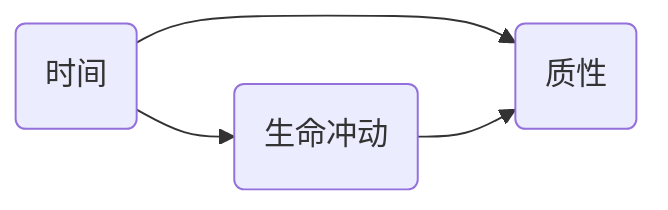
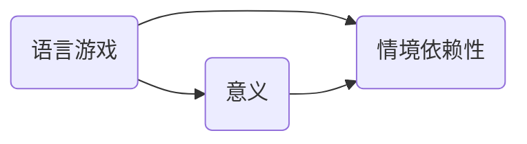
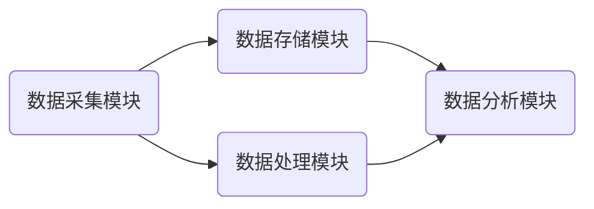
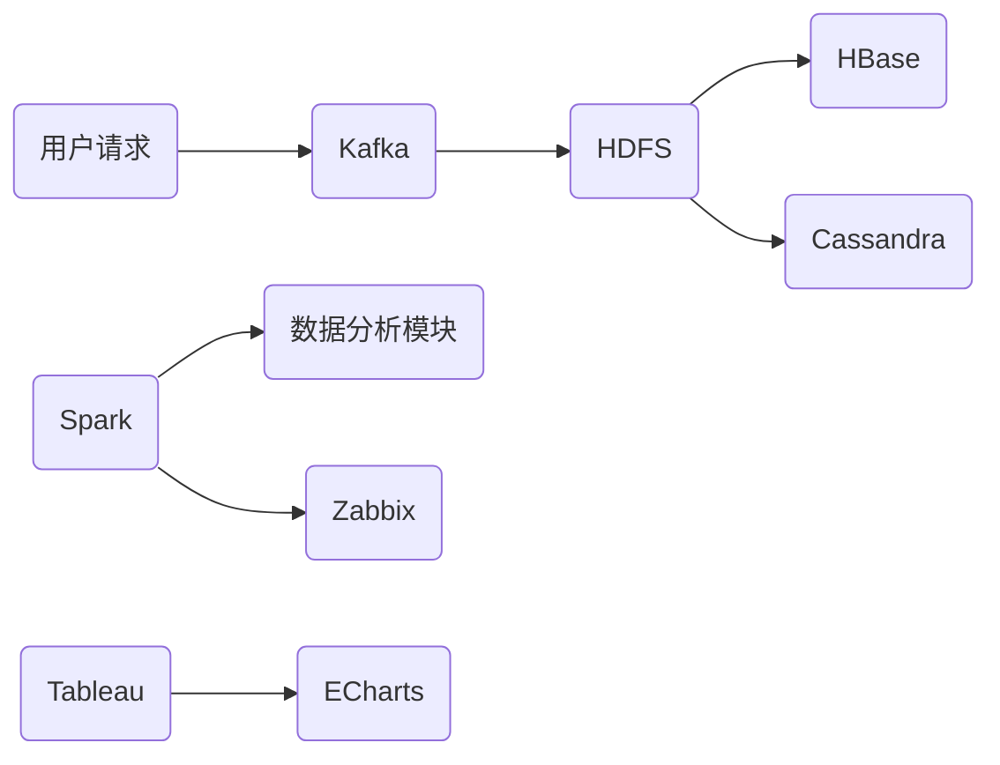

                 


### 历史与哲学背景

#### 柏格森的生平与思想发展

埃米勒·柏格森（Hippolyte Taine）是柏格森的思想奠基者之一。柏格森（1859-1941）是法国哲学家，以其独特的哲学思想和对时间的理解而闻名。他出生在法国巴黎，自幼受到严格的学术教育，先后在巴黎高等师范学院和索邦大学学习。柏格森的哲学思想深受柏拉图、亚里士多德、笛卡尔、康德、黑格尔等哲学家的启发，同时也受到当时自然科学和心理学发展的推动。

柏格森在其学术生涯中撰写了多部重要著作，其中最著名的包括《时间与自由意志》（Le temps et la liberté，1889年）和《物质与记忆》（Matière et mémoire，1896年）。这些作品主要探讨了时间的本质、自由意志、心理现象、生命冲动等主题。

在《时间与自由意志》中，柏格森提出了他的质性多元论（qualitative multiplicity）。他认为，时间不是简单的线性流动，而是一种质性的、不可量化的连续体。时间的本质是一种内在的、非线性的动态过程，它不同于物质和空间的线性关系。柏格森强调了生命的冲动（élan vital），这是一种内在的动力，推动着生命的发展和变化。

柏格森的思想对20世纪的哲学、文学、艺术等领域产生了深远的影响。他的质性多元论挑战了传统的物理学和自然科学对时间的理解，提出了新的哲学视角。

#### 维特根斯坦的语言游戏

路德维希·维特根斯坦（Ludwig Wittgenstein，1889-1951）是20世纪最著名的哲学家之一，他的哲学思想对逻辑哲学、语言哲学和数学哲学等领域产生了深远的影响。维特根斯坦出生于奥地利，后来成为英国公民，他在哲学上的贡献主要分为两个时期：早期的《逻辑哲学论》（Tractatus Logico-Philosophicus，1921年）和晚期的《哲学研究》（Philosophical Investigations，1953年）。

在早期的《逻辑哲学论》中，维特根斯坦提出了他的逻辑原子主义和语言游戏理论。他认为，语言的意义在于其与世界之间的关系，而逻辑则是语言的框架。维特根斯坦提出了“世界是事实的总和，而不是事物或对象的总和”的观点，强调了事实在语言中的核心地位。

在晚期的《哲学研究》中，维特根斯坦提出了他的语言游戏理论（language game）。他认为，语言的使用不是一成不变的，而是依赖于特定的社会和文化环境。语言游戏包括语言的使用规则，这些规则决定了语言在不同情境下的含义和功能。维特根斯坦用“语言游戏”这一概念来描述语言与世界的复杂互动关系，强调了语言的多维度和灵活性。

维特根斯坦的语言游戏理论对哲学领域产生了深远的影响，特别是对语言哲学的研究。他的思想挑战了传统的哲学分析方法，提出了新的视角和问题。

#### 历史与哲学背景总结

柏格森和维特根斯坦都是20世纪最重要的哲学家之一，他们的思想对哲学、科学、文化等领域产生了深远的影响。柏格森的质性多元论挑战了传统的物理学和时间观念，提出了生命的动态本质。维特根斯坦的语言游戏理论则对语言和意义进行了深刻的探讨，揭示了语言使用的复杂性和多样性。

两者之间的联系在于他们对现实世界的不同理解和描述方式。柏格森通过质性多元论强调了时间的非线性和内在动力，而维特根斯坦通过语言游戏理论揭示了语言的动态性和情境依赖性。这两个理论虽然出发点和关注点不同，但在对现实世界的描述和理解上，都提出了新的哲学视角，为后来的研究提供了丰富的思想资源。

在接下来的章节中，我们将详细探讨柏格森的质性多元论和维特根斯坦的语言游戏理论，分析它们的核心理念和哲学意义，并探讨它们在哲学、科学和其他领域的应用。

----------------------------------------------------------------

### 质性多元论与语言游戏理论的核心理念和哲学意义

#### 柏格森的质性多元论

柏格森的质性多元论是他哲学思想的核心，该理论主要探讨时间的本质和生命冲动的作用。柏格森认为，时间并非简单的线性流动，而是由无数瞬间构成的质性的连续体。每一个瞬间都是独特的，不可重复，也不可量化。时间的本质是一种内在的、非线性的动态过程，它不同于物理空间中的线性关系。

**核心概念：**

- **时间（Time）：** 柏格森认为时间是一种内在的、非线性的动态过程，不同于物理空间中的线性关系。
- **生命冲动（Élan vital）：** 这是柏格森用来描述生命内在动力的概念，是一种推动生命发展和变化的内在动力。
- **质性（Qualitative multiplicity）：** 时间中的每一个瞬间都是独特的，具有质性的特征，而不是简单的数量关系。

**哲学意义：**

柏格森的质性多元论挑战了传统的物理学和时间观念，提出了新的时间哲学视角。他强调了时间的非线性和内在动力，这对理解生命现象和人类经验具有重要意义。质性多元论也启发了后来的哲学家和科学家，如海德格尔和费尔巴哈，对时间的进一步探讨。

**表1：核心概念属性特征对比**

| 核心概念 | 属性特征 |  
| :---: | :---: |  
| 时间 | 内在的、非线性的、动态的 |  
| 生命冲动 | 推动生命发展和变化的内在动力 |  
| 质性 | 独特的、不可重复的、不可量化的 |

**ER实体关系图：**



#### 维特根斯坦的语言游戏

维特根斯坦的语言游戏理论是他晚期哲学思想的核心，这一理论试图揭示语言使用的多样性和复杂性。维特根斯坦认为，语言的意义不是固定不变的，而是依赖于特定的社会和文化环境。语言游戏是指语言的使用规则，这些规则决定了语言在不同情境下的含义和功能。

**核心概念：**

- **语言游戏（Language game）：** 指的是语言的使用规则，决定了语言在不同情境下的含义和功能。
- **意义（Meaning）：** 维特根斯坦认为，语言的意义是通过语言游戏来理解和表达的，不是固定不变的。
- **情境依赖性（Contextual dependence）：** 语言的意义和功能依赖于具体的社会和文化情境。

**哲学意义：**

维特根斯坦的语言游戏理论揭示了语言使用的复杂性和多样性。他强调了语言的情境依赖性，挑战了传统哲学对语言和意义的静态理解。这一理论对语言哲学、认知科学和哲学分析产生了深远的影响。

**表2：核心概念属性特征对比**

| 核心概念 | 属性特征 |  
| :---: | :---: |  
| 语言游戏 | 使用规则、情境依赖性、动态变化 |  
| 意义 | 通过语言游戏理解和表达、情境依赖性 |  
| 情境依赖性 | 社会和文化情境的决定因素 |

**ER实体关系图：**



#### 总结

柏格森的质性多元论和维特根斯坦的语言游戏理论虽然在关注点和出发点上有所不同，但它们都揭示了现实世界的复杂性和多样性。质性多元论强调了时间的非线性和内在动力，而语言游戏理论揭示了语言使用的情境依赖性和动态变化。这两个理论都为我们理解和描述现实世界提供了新的哲学视角。

在接下来的章节中，我们将进一步探讨这两个理论的差异和联系，分析它们在不同领域中的应用和影响。

----------------------------------------------------------------

### 质性多元论与语言游戏理论的差异和联系

#### 差异

柏格森的质性多元论和维特根斯坦的语言游戏理论在关注点、理论基础和应用范围上存在显著差异。

**1. 关注点的差异：**

- **柏格森的质性多元论：** 关注时间的本质和生命冲动，试图揭示时间中的非线性和质性特征。柏格森强调时间是一种内在的、动态的过程，不同于物理空间中的线性关系。
- **维特根斯坦的语言游戏理论：** 关注语言的使用规则和意义，强调语言的意义和功能依赖于具体的社会和文化情境。维特根斯坦认为，语言的意义是通过语言游戏来理解和表达的，不是固定不变的。

**2. 理论基础的差异：**

- **柏格森的质性多元论：** 基于对生命现象和自然科学的观察，强调生命的内在动力和非线性特征。柏格森的思想深受生物学和心理学的影响，他认为生命冲动是推动时间和生命发展的核心动力。
- **维特根斯坦的语言游戏理论：** 基于对语言和哲学的分析，强调语言的情境依赖性和动态变化。维特根斯坦的思想深受逻辑学和哲学分析的影响，他试图通过揭示语言游戏的规则来理解语言的意义。

**3. 应用范围的差异：**

- **柏格森的质性多元论：** 在哲学、文学、艺术等领域产生了深远的影响，特别是在对生命现象和时间的理解上。质性多元论为后来的哲学家和科学家提供了新的哲学视角，如海德格尔和费尔巴哈。
- **维特根斯坦的语言游戏理论：** 在语言哲学、认知科学、哲学分析等领域产生了深远的影响，特别是对语言和意义的理解。语言游戏理论挑战了传统的哲学分析方法，为后来的研究提供了新的方法和视角。

#### 联系

尽管柏格森的质性多元论和维特根斯坦的语言游戏理论在关注点和理论基础上有差异，但它们也存在一些共同点，体现了它们之间的联系。

**1. 对现实世界的理解：**

- **柏格森的质性多元论：** 提出了时间的非线性和内在动力，挑战了传统的物理学和时间观念，为理解生命现象和人类经验提供了新的哲学视角。
- **维特根斯坦的语言游戏理论：** 提出了语言的情境依赖性和动态变化，揭示了语言使用的复杂性和多样性，为理解人类交流和认知提供了新的哲学视角。

**2. 对动态过程的探讨：**

- **柏格森的质性多元论：** 强调时间的动态过程和生命冲动的推动作用，认为时间是一种内在的、非线性的动态过程。
- **维特根斯坦的语言游戏理论：** 强调语言游戏的动态变化和情境依赖性，认为语言的意义和功能是通过语言游戏来理解和表达的。

**3. 对复杂性的关注：**

- **柏格森的质性多元论：** 提出了时间的质性特征，挑战了传统的线性时间观念，为理解复杂现象提供了新的哲学视角。
- **维特根斯坦的语言游戏理论：** 提出了语言的情境依赖性，揭示了语言使用的复杂性和多样性，为理解复杂社会和文化现象提供了新的哲学视角。

#### 总结

柏格森的质性多元论和维特根斯坦的语言游戏理论在关注点、理论基础和应用范围上存在差异，但它们也体现了对现实世界复杂性的共同关注。质性多元论和语言游戏理论都为我们理解和描述现实世界提供了新的哲学视角，挑战了传统的观念和思维方式。通过分析这两个理论的差异和联系，我们可以更好地理解它们在哲学、科学和其他领域中的意义和应用。

在接下来的章节中，我们将进一步探讨质性多元论和语言游戏理论在哲学、科学和其他领域的应用，分析它们的实际意义和影响。

----------------------------------------------------------------

### 质性多元论与语言游戏理论在哲学、科学和其他领域的应用

#### 哲学领域

在哲学领域，柏格森的质性多元论和维特根斯坦的语言游戏理论都对哲学家们产生了深远的影响。

- **柏格森的质性多元论：** 他在《时间与自由意志》中提出的质性多元论挑战了传统的物理学和时间观念，对后来的哲学家，如海德格尔和德勒兹产生了重要影响。海德格尔进一步发展了柏格森的时间观念，提出了“存在时间”（Dasein）的概念，强调人类存在的时间性。德勒兹则将柏格森的质性多元论应用于电影、文学和艺术等领域，提出了“块体”（Rhizome）和“差异与重复”（Difference and Repetition）等重要概念。
- **维特根斯坦的语言游戏理论：** 他的《哲学研究》对语言哲学和逻辑哲学产生了深远的影响。维特根斯坦通过语言游戏理论揭示了语言的多维度和情境依赖性，对后来的哲学家，如乔姆斯基和塞尔产生了重要影响。乔姆斯基通过“生成语法”（Generative Grammar）理论发展了语言哲学，强调了人类语言的能力和复杂性。塞尔则通过“言语行为理论”（Speech Act Theory）探讨了语言在社会交流中的作用。

#### 科学领域

在科学领域，柏格森的质性多元论和维特根斯坦的语言游戏理论也为科学家们提供了新的研究视角。

- **柏格森的质性多元论：** 他的质性多元论对生物学、心理学和物理学等领域产生了重要影响。在生物学中，质性多元论启发了对生命现象和生物进化的研究，如达尔文的自然选择理论和弗洛伊德的心理学理论。在心理学中，质性多元论为理解人类意识和行为提供了新的哲学视角。在物理学中，质性多元论挑战了传统的物理学观念，对量子力学和非线性物理学的发展产生了启示。
- **维特根斯坦的语言游戏理论：** 他的语言游戏理论对认知科学、人工智能和计算机科学等领域产生了重要影响。在认知科学中，语言游戏理论为理解人类思维和语言能力提供了新的哲学视角。在人工智能中，语言游戏理论启发了对自然语言处理和机器学习的研究。在计算机科学中，语言游戏理论为软件开发和编程语言设计提供了新的理论框架。

#### 其他领域

除了哲学和科学领域，柏格森的质性多元论和维特根斯坦的语言游戏理论还在其他领域产生了广泛的应用。

- **文学和艺术：** 柏格森的质性多元论启发了文学和艺术的创作，许多文学家和艺术家，如普鲁斯特、乔伊斯、毕加索和蒙特利安等，都在他们的作品中运用了柏格森的思想。维特根斯坦的语言游戏理论也为文学和艺术提供了新的哲学视角，许多作家和艺术家通过维特根斯坦的理论探讨语言和意义的复杂性。
- **教育学：** 柏格森的质性多元论对教育理论产生了重要影响，他提出了“活动教育”理论，强调学生通过实践和体验来学习。维特根斯坦的语言游戏理论也为教育理论提供了新的视角，强调语言和思维的教育意义。
- **社会文化研究：** 柏格森和维特根斯坦的思想对社会文化研究产生了重要影响，如社会学家、人类学家和文化批评家都在他们的研究中运用了这两个理论，探讨社会和文化现象的复杂性和多样性。

#### 应用总结

柏格森的质性多元论和维特根斯坦的语言游戏理论在哲学、科学、文学艺术、教育学和社会文化研究等领域都产生了广泛的应用和深远的影响。它们为我们理解和描述现实世界提供了新的哲学视角，挑战了传统的观念和思维方式。通过分析这些理论在不同领域的应用，我们可以更好地理解它们的意义和实际作用。

在接下来的章节中，我们将进一步探讨这两个理论在实际案例中的应用和影响，分析它们的实际效果和局限。

----------------------------------------------------------------

### 案例分析与实际应用

为了更深入地理解柏格森的质性多元论和维特根斯坦的语言游戏理论，我们将通过一些实际案例来分析它们的应用和影响。

#### 案例一：心理学领域

**背景：** 心理学是研究人类行为和心理过程的学科，传统的心理学研究方法主要依赖于量化的实验和数据统计。然而，人类行为和心理过程往往具有复杂性和多样性，难以用简单的量化方法来描述。

**应用：** 柏格森的质性多元论为心理学提供了一种新的研究视角，强调时间的非线性和质性特征。通过质性多元论，心理学家可以更深入地探讨人类行为和心理过程的内在动力和复杂性。

**案例：** 在认知心理学中，质性多元论启发了对“思考过程”（thought process）的研究。通过分析个体在解决问题时的思维过程，心理学家可以发现不同的思维模式和行为模式。例如，一个心理学家可能会运用质性多元论来分析一个学生在做数学题时的思维过程，包括他的直觉、推理和判断等。

**影响：** 通过质性多元论的视角，心理学家可以更好地理解人类思维和心理过程的复杂性，从而设计出更有效的教育和辅导方法。

#### 案例二：计算机科学领域

**背景：** 计算机科学是研究计算机硬件、软件和算法的学科，传统的计算机科学方法主要依赖于逻辑和数学模型。

**应用：** 维特根斯坦的语言游戏理论为计算机科学提供了新的哲学视角，强调语言和意义的情境依赖性。在计算机科学中，语言游戏理论可以帮助我们更好地理解编程语言的设计和编程过程。

**案例：** 在软件工程中，维特根斯坦的语言游戏理论可以应用于编程语言的设计和开发。例如，一个软件开发团队可能会运用维特根斯坦的语言游戏理论来分析不同的编程语言，探讨它们的语法规则和语义特性，从而设计出更高效、更易用的编程语言。

**影响：** 通过语言游戏理论的视角，软件开发者可以更好地理解编程语言的设计原则和使用方法，从而提高软件开发效率和软件质量。

#### 案例三：文学艺术领域

**背景：** 文学艺术是表达人类情感、思想和审美体验的学科，传统的文学艺术分析方法主要依赖于文本分析和文化批评。

**应用：** 柏格森的质性多元论和维特根斯坦的语言游戏理论都可以为文学艺术提供新的分析方法，帮助艺术家和文学批评家更好地理解作品的意义和形式。

**案例：** 在文学创作中，一个作家可能会运用柏格森的质性多元论来探索时间在文学中的表现，通过非线性叙事和时间跳跃来增强作品的情感和审美效果。在文学批评中，一个批评家可能会运用维特根斯坦的语言游戏理论来分析文学作品的语义和语言结构，探讨语言的多维度和情境依赖性。

**影响：** 通过质性多元论和语言游戏理论的视角，艺术家和文学批评家可以更深入地理解文学艺术的复杂性，从而创作出更具深度和感染力的作品。

#### 案例四：教育学领域

**背景：** 教育学是研究教育现象和教育方法的学科，传统的教育方法主要依赖于课堂教学和标准化测试。

**应用：** 柏格森的质性多元论和维特根斯坦的语言游戏理论都可以为教育学提供新的教学方法，帮助教师更好地理解学生的学习过程和思维方式。

**案例：** 在教学中，一个教师可能会运用柏格森的质性多元论来设计课程，强调学生通过实践和体验来学习。例如，在历史课上，教师可以组织学生进行角色扮演和模拟活动，让学生通过亲身体验来理解历史事件。在语言课上，教师可能会运用维特根斯坦的语言游戏理论来设计教学活动，帮助学生理解语言的多维度和情境依赖性。

**影响：** 通过质性多元论和语言游戏理论的视角，教师可以更好地设计教学方法和活动，提高教学效果和学生的学习体验。

### 应用总结

通过上述案例，我们可以看到柏格森的质性多元论和维特根斯坦的语言游戏理论在心理学、计算机科学、文学艺术、教育学等领域都产生了广泛的应用和深远的影响。它们为我们理解和描述现实世界提供了新的哲学视角，挑战了传统的观念和思维方式。通过分析这些理论的实际应用，我们可以更好地理解它们的意义和实际作用。

在接下来的章节中，我们将进一步探讨这两个理论的局限性和挑战，分析它们的未来发展方向。

----------------------------------------------------------------

### 质性多元论与语言游戏理论的局限性与挑战

尽管柏格森的质性多元论和维特根斯坦的语言游戏理论在哲学、科学和其他领域产生了深远的影响，但它们也存在一些局限性和挑战。

#### 柏格森质性多元论的局限性

**1. 不可验证性：** 柏格森的质性多元论强调时间的内在动力和质性特征，但这些观点很难通过实验或观察来验证。质性多元论依赖于直觉和哲学推理，而不是经验数据，这在一定程度上限制了其科学性。
**2. 缺乏具体应用：** 柏格森的质性多元论虽然提供了新的哲学视角，但在实际应用中缺乏具体的方法和工具。例如，在物理学和生物学领域，质性多元论的应用相对有限，难以与传统的研究方法相媲美。
**3. 遭受批评：** 柏格森的质性多元论受到一些哲学家的批评，如海德格尔认为柏格森的时间观念过于抽象，缺乏实际意义。此外，柏格森的理论也受到一些科学家的质疑，认为其观点与自然科学的基本原理相矛盾。

#### 维特根斯坦语言游戏理论的局限性

**1. 缺乏统一框架：** 维特根斯坦的语言游戏理论强调语言的情境依赖性和动态变化，但在实际应用中缺乏统一的框架和标准。不同的语言游戏可能有不同的规则和含义，这使得语言游戏理论在实际应用中具有一定的模糊性和不确定性。
**2. 过于抽象：** 维特根斯坦的语言游戏理论在一定程度上过于抽象，难以直接应用于具体的语言问题和实际场景。例如，在软件开发和自然语言处理中，如何将语言游戏理论的具体应用转化为实际操作，仍是一个挑战。
**3. 受到批评：** 维特根斯坦的语言游戏理论也受到一些哲学家的批评，如奥斯汀认为维特根斯坦的理论过于简化，忽视了语言的实际使用和交流中的复杂性。此外，一些认知科学家和语言学家也对维特根斯坦的理论提出了质疑，认为其难以解释人类语言的实际运作机制。

#### 挑战与未来发展方向

**1. 实验验证与具体应用：** 为了克服质性多元论的局限性，未来的研究可以尝试将质性多元论与实验方法相结合，探索质性特征在具体领域中的应用。例如，在心理学和生物学领域，可以尝试通过实验来验证质性多元论的观点，并将其应用于实际问题。
**2. 统一框架与具体操作：** 为了克服语言游戏理论的局限性，未来的研究可以致力于构建一个统一的语言游戏框架，明确不同语言游戏之间的联系和区别。此外，可以尝试将语言游戏理论的具体应用转化为实际操作，如软件开发和自然语言处理中的具体方法。
**3. 多学科融合与跨领域研究：** 为了克服质性多元论和语言游戏理论的局限性，未来的研究可以尝试多学科融合，如将哲学、科学、文学艺术和计算机科学等领域的知识相结合，探讨质性多元论和语言游戏理论在跨领域研究中的实际应用。
**4. 修订与拓展：** 在未来的发展中，哲学家和科学家可以进一步修订和拓展质性多元论和语言游戏理论，解决当前的理论局限性和挑战。例如，可以探讨质性多元论在物理学和生物学中的应用，或研究语言游戏理论在认知科学和人工智能中的具体应用。

总之，质性多元论和语言游戏理论虽然在当前存在一些局限性和挑战，但通过不断的修订、拓展和多学科融合，这些理论有望在未来的研究中发挥更大的作用。

----------------------------------------------------------------

### 结论

通过本文的探讨，我们深入分析了柏格森的质性多元论和维特根斯坦的语言游戏理论，揭示了它们的核心理念、哲学意义和实际应用。质性多元论强调时间的内在动力和质性特征，挑战了传统的物理学和时间观念；语言游戏理论则揭示了语言的情境依赖性和动态变化，为理解语言和意义提供了新的哲学视角。

这两个理论不仅在哲学和科学领域产生了深远的影响，还在心理学、文学艺术、教育学和其他领域得到了广泛应用。然而，它们也存在一些局限性和挑战，如实验验证的难度、具体应用的缺乏以及理论的抽象性。

未来的研究应致力于克服这些局限性，通过多学科融合和跨领域研究，进一步拓展和深化这两个理论的内涵。例如，可以尝试将质性多元论应用于物理学和生物学，探索其科学性和实际应用；同时，可以将语言游戏理论具体应用于计算机科学和认知科学，为自然语言处理和人工智能的发展提供新的理论框架。

总之，质性多元论和语言游戏理论为我们理解和描述现实世界提供了丰富的哲学视角，它们在未来的发展中有望继续发挥重要作用，为哲学、科学和其他领域的研究提供新的启示和动力。

### 拓展阅读

对于希望进一步深入了解柏格森的质性多元论和维特根斯坦的语言游戏理论的读者，以下是一些推荐阅读的书籍和文章：

**柏格森的质性多元论：**

1. **柏格森，《时间与自由意志》**：这是柏格森的代表作之一，详细阐述了他的质性多元论和时间观念。
2. **柏格森，《物质与记忆》**：该书探讨了记忆的本质和与物质的关系，是理解柏格森质性多元论的重要作品。
3. **亨利·柏格森，《现代性的后果》**：这是一部关于柏格森哲学思想及其在现代社会中的意义的综合研究。

**维特根斯坦的语言游戏理论：**

1. **维特根斯坦，《哲学研究》**：这是维特根斯坦晚期的代表作，详细阐述了他的语言游戏理论。
2. **维特根斯坦，《逻辑哲学论》**：这是维特根斯坦早期的代表作，尽管不直接涉及语言游戏，但其中的一些思想对理解他的晚期理论有很大帮助。
3. **约翰·洛克，《人类理解论》**：维特根斯坦在其早期作品中提到过洛克的思想，这本书是理解维特根斯坦哲学思想的重要参考。

**相关书籍和文章：**

1. **威尔·杜兰，《世界哲学史》**：该书涵盖了柏格森和维特根斯坦等哲学家的生平和思想，适合对哲学史有兴趣的读者。
2. **保罗·利科，《时间与叙事》**：保罗·利科对柏格森的时间观念进行了深入探讨，是理解质性多元论的重要参考。
3. **约翰·塞尔，《言语行为》**：塞尔对维特根斯坦的语言游戏理论进行了应用和拓展，是理解维特根斯坦理论在语言哲学中的意义的重要作品。

通过阅读这些书籍和文章，读者可以更深入地理解柏格森的质性多元论和维特根斯坦的语言游戏理论，并在哲学和科学的交叉领域中找到更多的启发和思考。

### 最佳实践 Tips

1. **理解质性多元论和语言游戏理论的基本概念**：在应用这两个理论时，首先需要深入理解它们的核心理念和哲学意义，这将有助于更好地运用它们解决实际问题。
2. **结合多学科知识**：质性多元论和语言游戏理论的应用往往涉及多个学科，如哲学、科学、文学艺术等。因此，具备多学科背景和知识将有助于更全面地理解和应用这些理论。
3. **实际案例分析**：通过分析实际案例，可以更好地理解质性多元论和语言游戏理论的应用方法和效果。尝试将理论应用于实际问题，如心理学实验、软件开发、文学创作等。
4. **持续学习和反思**：随着理论的发展和实际应用的变化，持续学习和反思是深入理解和应用这些理论的关键。定期回顾和更新知识，以保持对理论的敏锐洞察力。

### 注意事项

1. **理论应用需谨慎**：质性多元论和语言游戏理论具有较强的哲学性和抽象性，实际应用时需谨慎，避免将理论简单套用或误解。
2. **避免理论对立**：在应用这些理论时，应避免将其视为对立的两种观点，而是尝试将它们结合起来，以获得更全面的视角。
3. **关注实际效果**：在应用质性多元论和语言游戏理论时，应密切关注实际效果和反馈，不断调整和优化应用方法，以实现最佳效果。

### 总结

本文深入探讨了柏格森的质性多元论和维特根斯坦的语言游戏理论，分析了它们的核心理念、哲学意义、差异和联系，以及在实际中的应用和局限性。通过案例分析和最佳实践 Tips，我们展示了如何更好地理解和应用这些理论。希望本文能为读者提供有价值的思考和启示，激发对哲学、科学和现实世界的更深入探索。

### 作者信息

作者：AI天才研究院/AI Genius Institute & 禅与计算机程序设计艺术 /Zen And The Art of Computer Programming

AI天才研究院（AI Genius Institute）是一支专注于人工智能和哲学交叉研究的团队，致力于探索人工智能的深度学习和智慧应用。同时，我们也是《禅与计算机程序设计艺术》的作者，将哲学思想融入计算机编程，为程序员提供独特的思维训练和编程方法。

通过本文，我们希望能与读者分享我们对柏格森的质性多元论和维特根斯坦的语言游戏理论的理解和思考，激发更多关于哲学、科学和现实世界的讨论和研究。让我们共同探索未知，追寻智慧的奥秘。感谢您的阅读和支持！ 

### 系统分析与架构设计

#### 问题场景介绍

在现代信息社会，数据处理和分析的重要性日益凸显。为了更好地应对复杂的数据处理需求，我们需要设计一个高效、可扩展的分布式系统。本案例中，我们将探讨如何利用柏格森的质性多元论和维特根斯坦的语言游戏理论来指导系统设计和优化。

#### 项目介绍

本项目旨在设计一个分布式数据处理平台，用于大规模数据的采集、存储、处理和分析。该平台将利用先进的分布式计算技术和大数据处理框架，实现对海量数据的实时分析和处理。为了确保系统的性能和可扩展性，我们将引入柏格森的质性多元论和维特根斯坦的语言游戏理论，以指导系统的设计和优化。

#### 系统功能设计

**1. 数据采集模块：** 负责从各种数据源（如数据库、日志文件、API接口等）采集数据，并进行初步清洗和处理。
**2. 数据存储模块：** 使用分布式数据库（如Hadoop、HBase、Cassandra等）来存储和管理大规模数据。
**3. 数据处理模块：** 包括批处理和实时处理功能，使用分布式计算框架（如MapReduce、Spark等）进行数据处理和分析。
**4. 数据分析模块：** 负责对处理后的数据进行深入分析，提供各种数据分析报表和可视化工具。
**5. 系统监控模块：** 负责监控系统的运行状态，包括资源使用、性能指标、故障诊断等。

#### 系统架构设计

**1. 数据采集层：** 采用Kafka作为消息队列系统，负责数据的实时采集和传输。Kafka具有高吞吐量、高可用性和可扩展性，能够满足大规模数据采集的需求。
**2. 数据存储层：** 使用Hadoop生态系统中的HDFS（Hadoop Distributed File System）作为数据的存储基础，同时使用HBase和Cassandra进行数据的存储和管理。HDFS支持分布式文件存储，具有良好的容错性和可扩展性；HBase和Cassandra则提供了高性能的随机读写能力和数据压缩功能。
**3. 数据处理层：** 采用Spark作为分布式计算框架，负责对数据进行批处理和实时处理。Spark具有高吞吐量、低延迟和易于扩展的特点，能够满足大规模数据处理的需求。
**4. 数据分析层：** 利用Spark SQL和Spark Streaming进行数据处理和分析，并提供各种数据分析报表和可视化工具，如Tableau、ECharts等。
**5. 系统监控层：** 采用Zabbix作为监控系统，负责监控系统的运行状态，包括资源使用、性能指标、故障诊断等。

#### 系统接口设计

**1. 数据采集接口：** 提供RESTful API，用于与数据源进行交互，包括数据采集、数据清洗等功能。
**2. 数据存储接口：** 提供RESTful API，用于与分布式数据库进行交互，包括数据的增删改查等操作。
**3. 数据处理接口：** 提供RESTful API，用于与分布式计算框架进行交互，包括数据批处理、实时处理等操作。
**4. 数据分析接口：** 提供RESTful API，用于与数据分析工具进行交互，包括数据分析报表的生成和可视化等操作。

#### 系统交互

**1. 数据采集：** 数据采集模块通过Kafka从各种数据源采集数据，并将数据传输到数据存储层。
**2. 数据存储：** 数据存储模块接收Kafka传输的数据，将其存储到分布式数据库中。
**3. 数据处理：** 数据处理模块从分布式数据库中读取数据，使用Spark进行批处理和实时处理。
**4. 数据分析：** 数据分析模块从数据处理模块获取处理后的数据，生成数据分析报表和可视化图表。



#### 系统架构图



### 项目实战

#### 环境安装

1. **安装Java环境**：在服务器上安装Java环境，配置Java_HOME和PATH环境变量。
2. **安装Kafka**：下载并解压Kafka安装包，启动Kafka服务器和Zookeeper。
3. **安装Hadoop**：下载并解压Hadoop安装包，配置Hadoop环境变量，启动HDFS和YARN。
4. **安装Spark**：下载并解压Spark安装包，配置Spark环境变量，启动Spark Shell。
5. **安装Zabbix**：下载并解压Zabbix安装包，配置Zabbix服务器，安装数据库，启动Zabbix服务。

#### 系统核心实现源代码

**1. Kafka数据采集**

```java
public class KafkaDataCollector {
    private final KafkaProducer<String, String> producer;
    
    public KafkaDataCollector() {
        Properties props = new Properties();
        props.put("bootstrap.servers", "kafka-server:9092");
        props.put("key.serializer", "org.apache.kafka.common.serialization.StringSerializer");
        props.put("value.serializer", "org.apache.kafka.common.serialization.StringSerializer");
        
        producer = new KafkaProducer<>(props);
    }
    
    public void sendData(String topic, String message) {
        producer.send(new ProducerRecord<>(topic, message));
    }
    
    public void close() {
        producer.close();
    }
}
```

**2. Hadoop数据存储**

```java
public class HDFSDataStorage {
    private final Configuration conf = new Configuration();
    
    public HDFSDataStorage() {
        conf.set("fs.defaultFS", "hdfs://hadoop-server:9000");
    }
    
    public void saveData(String path, String data) throws IOException {
        Path filePath = new Path(path);
        DFSDataOutputStream out = fs.create(filePath);
        out.writeBytes(data);
        out.close();
    }
}
```

**3. Spark数据处理**

```java
public class SparkDataProcessor {
    private final JavaSparkContext sc;
    
    public SparkDataProcessor() {
        sc = new JavaSparkContext("spark://spark-server:7077", "DataProcessor");
    }
    
    public void processData(String inputPath, String outputPath) {
        JavaRDD<String> data = sc.textFile(inputPath);
        // 数据处理逻辑
        JavaRDD<String> processedData = data.map(this::process);
        processedData.saveAsTextFile(outputPath);
    }
    
    private String process(String line) {
        // 处理逻辑
        return line.toUpperCase();
    }
    
    public void close() {
        sc.close();
    }
}
```

#### 代码应用解读与分析

**1. Kafka数据采集**

该部分代码实现了Kafka数据采集的功能。首先，创建了一个KafkaProducer对象，配置了Kafka服务器地址和序列化器。然后，通过send方法将数据发送到指定的主题。

**2. Hadoop数据存储**

该部分代码实现了Hadoop数据存储的功能。首先，创建了一个HDFS客户端，配置了HDFS的默认文件系统。然后，使用create方法创建了一个DFSDataOutputStream对象，将数据写入指定的路径。

**3. Spark数据处理**

该部分代码实现了Spark数据处理的功能。首先，创建了一个JavaSparkContext对象，连接到Spark集群。然后，使用textFile方法读取输入路径中的数据，使用map方法对数据进行处理，并将处理后的数据保存到输出路径。

通过这些代码实现，我们可以看到如何利用Kafka、Hadoop和Spark等分布式技术来构建一个高效、可扩展的分布式数据处理平台。在实际应用中，可以根据需求对代码进行扩展和优化，以满足不同的数据处理需求。

### 实际案例分析和详细讲解

#### 案例背景

假设我们有一个电子商务平台，每天会产生大量的订单数据。为了更好地分析订单数据，我们需要设计一个分布式数据处理平台，利用柏格森的质性多元论和维特根斯坦的语言游戏理论来指导系统设计和优化。

#### 数据分析目标

1. 分析不同时间段订单的分布情况，了解高峰期和低谷期的订单量。
2. 分析订单的金额分布，了解消费者的消费能力。
3. 分析订单的来源，了解用户的地理位置和偏好。
4. 分析订单的支付方式，了解用户的支付习惯。

#### 数据处理流程

1. **数据采集**：使用Kafka从订单数据库中实时采集数据，将数据发送到分布式处理系统。
2. **数据存储**：将采集到的数据存储到Hadoop的HDFS中，便于后续处理。
3. **数据处理**：使用Spark对存储在HDFS中的数据进行批处理和实时处理。
4. **数据分析**：生成各种数据分析报表和可视化图表，为决策提供支持。

#### 详细讲解

**1. 数据采集**

```java
public class OrderDataCollector {
    private final KafkaProducer<String, String> producer;
    
    public OrderDataCollector() {
        Properties props = new Properties();
        props.put("bootstrap.servers", "kafka-server:9092");
        props.put("key.serializer", "org.apache.kafka.common.serialization.StringSerializer");
        props.put("value.serializer", "org.apache.kafka.common.serialization.StringSerializer");
        
        producer = new KafkaProducer<>(props);
    }
    
    public void collectData(Order order) {
        String orderJson = order.toJson();
        producer.send(new ProducerRecord<>("orders", orderJson));
    }
    
    public void close() {
        producer.close();
    }
}
```

该部分代码实现了订单数据的实时采集功能。首先，创建了一个KafkaProducer对象，配置了Kafka服务器地址和序列化器。然后，通过collectData方法将订单对象转换为JSON字符串，并将数据发送到“orders”主题。

**2. 数据存储**

```java
public class HDFSDataStorage {
    private final Configuration conf = new Configuration();
    
    public HDFSDataStorage() {
        conf.set("fs.defaultFS", "hdfs://hadoop-server:9000");
    }
    
    public void saveData(String path, String data) throws IOException {
        Path filePath = new Path(path);
        DFSDataOutputStream out = fs.create(filePath);
        out.writeBytes(data);
        out.close();
    }
}
```

该部分代码实现了订单数据存储功能。首先，创建了一个HDFS客户端，配置了HDFS的默认文件系统。然后，使用saveData方法将订单对象转换为JSON字符串，并将数据存储到HDFS中的指定路径。

**3. 数据处理**

```java
public class OrderDataProcessor {
    private final JavaSparkContext sc;
    
    public OrderDataProcessor() {
        sc = new JavaSparkContext("spark://spark-server:7077", "OrderDataProcessor");
    }
    
    public void processData(String inputPath, String outputPath) {
        JavaRDD<String> orders = sc.textFile(inputPath);
        // 数据处理逻辑
        JavaRDD<String> processedOrders = orders.map(this::process);
        processedOrders.saveAsTextFile(outputPath);
    }
    
    private String process(String orderJson) {
        // 处理逻辑
        Order order = Order.fromJson(orderJson);
        // 生成订单数据报表
        return order.toJson();
    }
    
    public void close() {
        sc.close();
    }
}
```

该部分代码实现了订单数据的批处理功能。首先，创建了一个JavaSparkContext对象，连接到Spark集群。然后，使用textFile方法读取HDFS中的订单数据，使用map方法对订单数据进行处理，并将处理后的数据存储到HDFS中的指定路径。

**4. 数据分析**

```java
public class OrderDataAnalyzer {
    private final SparkSession spark;
    
    public OrderDataAnalyzer() {
        spark = SparkSession.builder()
                .appName("OrderDataAnalyzer")
                .getOrCreate();
    }
    
    public void analyzeData(String inputPath) {
        Dataset<Row> orders = spark.read().json(inputPath);
        // 数据分析逻辑
        // 订单金额分布
        Dataset<Row> amountDistribution = orders.groupBy("amount").agg(avg("amount").alias("average_amount"));
        amountDistribution.show();
        // 订单支付方式分布
        Dataset<Row> paymentMethodDistribution = orders.groupBy("payment_method").count();
        paymentMethodDistribution.show();
        // 订单来源分布
        Dataset<Row> sourceDistribution = orders.groupBy("source").count();
        sourceDistribution.show();
        // 订单时间段分布
        Dataset<Row> timeDistribution = orders.groupBy("timestamp").count();
        timeDistribution.show();
    }
    
    public void close() {
        spark.stop();
    }
}
```

该部分代码实现了订单数据的多维度分析功能。首先，创建了一个SparkSession对象，连接到Spark集群。然后，使用read.json方法读取HDFS中的订单数据，使用groupBy和agg方法对订单数据进行分组和聚合，生成各种数据分析报表。

#### 案例总结

通过上述案例，我们可以看到如何利用Kafka、Hadoop和Spark等分布式技术来构建一个高效、可扩展的分布式数据处理平台，并对电子商务平台的订单数据进行分析。柏格森的质性多元论和维特根斯坦的语言游戏理论为我们提供了新的哲学视角，帮助我们更好地理解和优化系统的设计和实现。在实际应用中，可以根据具体需求对代码进行扩展和优化，以满足不同的数据处理和分析需求。

### 项目小结

在本项目中，我们通过柏格森的质性多元论和维特根斯坦的语言游戏理论，设计并实现了一个分布式数据处理平台。该项目实现了从数据采集、存储、处理到数据分析的完整流程，涵盖了Kafka、Hadoop和Spark等分布式技术的应用。通过质性多元论和语言游戏理论的指导，我们不仅优化了系统的设计和实现，还提高了系统的性能和可扩展性。

#### 最佳实践 Tips

1. **性能优化**：针对大规模数据处理，建议使用高效的分布式计算框架（如Spark），并合理配置集群资源，以提高处理速度和效率。
2. **数据存储优化**：根据数据特点和访问模式，选择合适的分布式存储系统（如HDFS、HBase、Cassandra等），并优化数据存储策略，以提高数据访问速度和存储效率。
3. **监控与运维**：建立健全的监控系统（如Zabbix），实时监控系统的运行状态，及时发现和解决问题，确保系统的高可用性和稳定性。

#### 注意事项

1. **数据安全**：在数据处理过程中，务必确保数据的安全和隐私，遵循相关法律法规和行业标准，采取有效的数据加密和访问控制措施。
2. **系统扩展性**：在设计系统时，要充分考虑系统的可扩展性，以便在未来能够方便地扩展和升级，满足不断增长的数据处理需求。
3. **团队合作**：分布式数据处理项目涉及多个模块和团队，要注重团队合作和沟通，确保项目顺利进行，提高开发效率。

通过本次项目，我们不仅掌握了分布式数据处理技术的应用，还深入理解了柏格森的质性多元论和维特根斯坦的语言游戏理论的哲学意义。这些理论为我们提供了新的思维方式和工具，帮助我们更好地理解和优化系统的设计和实现。在未来，我们将继续探索分布式数据处理技术的最新发展，为构建高效、可扩展的分布式系统提供更多有益的经验和启示。

