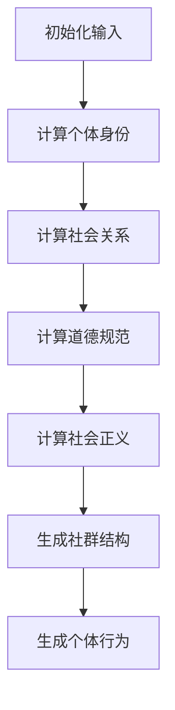
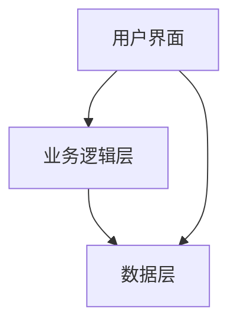
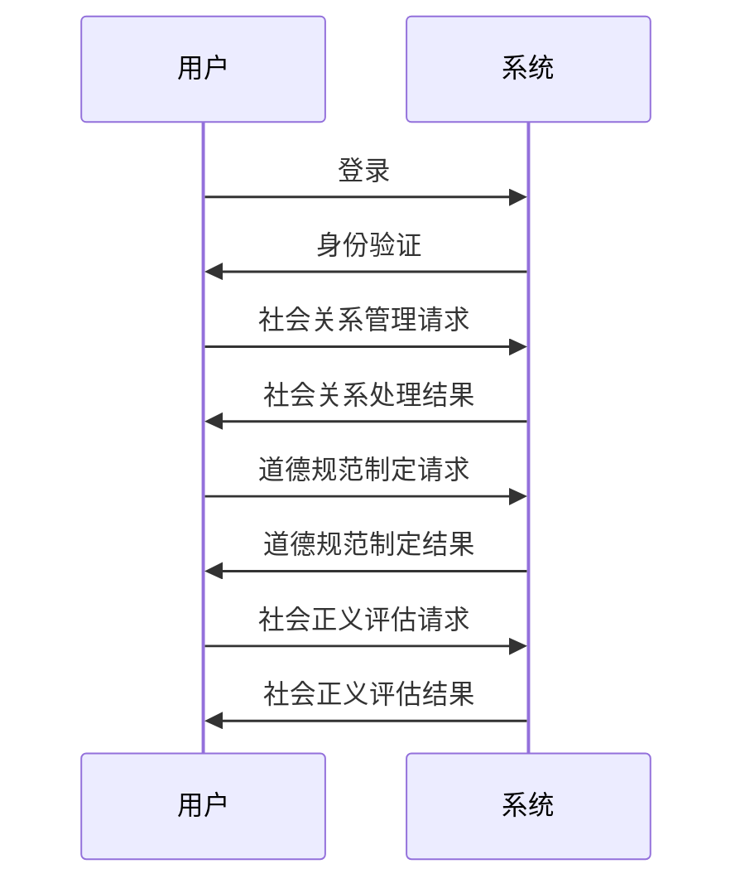

                 


### 1.1.1 社群主义的概念与发展

社群主义是一种哲学和社会理论，它源于对个人主义和自由主义的反思。社群主义的核心观点是，个体应在社群的框架内寻求自我实现，而不是在孤立的状态下追求个人的利益。社群主义者认为，个体是社群的产物，他们的身份、价值观和行为都是通过与社群的互动和参与形成的。

社群主义的发展可以追溯到20世纪中叶，当时许多社会学家和哲学家开始对个人主义和自由主义进行批判。他们认为，个人主义和自由主义忽视了社会关系和集体身份的重要性，导致个体的自我认同和社会整合受到威胁。社群主义者提出，社会关系和集体身份是构成个体身份的基础，个体的自由和权利应该在社会关系的框架内得到实现。

查尔斯·泰勒和阿拉斯代尔·麦金泰尔是社群主义的重要代表人物。泰勒在其著作《自我的根源》和《源泉》中，探讨了个人身份和社会关系的构建，认为个体通过参与社群来实现自我认同和价值观的塑造。麦金泰尔则在其著作《法律的道德性》和《正义：一场思辨之旅》中，强调了社会规范和道德判断的重要性，认为社会正义的实现依赖于对传统道德规范的尊重和遵守。

### 1.1.2 查尔斯·泰勒与阿拉斯代尔·麦金泰尔的学术贡献

查尔斯·泰勒以其深刻的伦理学和政治哲学著作而闻名，特别是在《自我的根源》和《源泉》中，他探讨了个人身份、社会关系和价值体系的构建。泰勒认为，个人身份是一个社会构建的过程，个体的身份和价值观是通过与他人的互动和参与社群形成的。他提出，个体的自由和权利应该在社会关系的框架内得到实现，而不是在孤立的状态下追求个人的利益。

阿拉斯代尔·麦金泰尔则以其对道德哲学的深刻洞察和对法律哲学的独特贡献而知名。他在《法律的道德性》中，批判了法律实证主义，认为法律的合法性不仅取决于其是否得到遵守，还取决于其道德正当性。在《正义：一场思辨之旅》中，麦金泰尔探讨了社会正义的概念，认为社会正义的实现依赖于对传统道德规范的尊重和遵守。

泰勒和麦金泰尔的学术贡献不仅在哲学领域产生了深远的影响，也在社会学、法学和政治学等领域产生了重要的启示。他们的理论为我们理解个体与社会的关系、个人自由与社会规范的关系提供了新的视角，为我们思考和解决社会问题提供了理论工具。

### 1.2.1 社群主义的核心议题

社群主义的核心议题包括对个人自由与社群关系的平衡、社会正义和道德规范的探讨。社群主义者认为，个体应在社群的框架内寻求自我实现，但同时也要尊重个体的自由和权利。这就涉及到如何平衡个人自由与社会责任之间的关系。

首先，社群主义者认为，个体的自由和权利应该在社会关系的框架内得到实现。这意味着个体的自由并不是无限制的，而是在社群的规范和价值观的指导下进行的。个体的自由应该受到社群的约束，以确保社群的整体利益。

其次，社群主义者强调社会正义的重要性。他们认为，社会正义的实现需要依赖于对传统道德规范的尊重和遵守。社会正义不仅仅是指社会资源的分配公平，还包括社会成员之间的道德关系和社会责任的实现。

此外，社群主义者还探讨了道德规范的问题。他们认为，道德规范是社会关系的体现，是维护社会秩序和个体尊严的重要工具。道德规范不仅指导个体的行为，也规范社群的运行。

### 1.2.2 泰勒与麦金泰尔对社群主义的贡献与分歧

泰勒和麦金泰尔都是社群主义的重要代表，他们对社群主义的贡献各有侧重，同时也存在一些分歧。

泰勒的贡献主要体现在他对个人身份和社会关系的探讨上。他提出了“承认需求”的概念，认为个体的自我认同和价值观的塑造需要通过他人的承认来实现。泰勒认为，个体的自由和权利应该在社会关系的框架内得到实现，而不是在孤立的状态下追求个人的利益。他的理论为理解和解决个体与社会的关系问题提供了深刻的洞见。

麦金泰尔的贡献则主要体现在他对道德哲学和法律哲学的研究上。他在《法律的道德性》中，批判了法律实证主义，强调法律的合法性不仅取决于其是否得到遵守，还取决于其道德正当性。在《正义：一场思辨之旅》中，麦金泰尔探讨了社会正义的概念，认为社会正义的实现依赖于对传统道德规范的尊重和遵守。他的理论为理解和解决社会正义问题提供了重要的理论工具。

然而，泰勒和麦金泰尔在一些问题上也存在分歧。泰勒更强调个体的自由和权利，认为个体应在社群的框架内寻求自我实现，而麦金泰尔则更强调社会规范和道德判断的重要性，认为社会正义的实现依赖于对传统道德规范的尊重和遵守。这种分歧反映了他们在对个体与社会关系、个人自由与社会责任等方面的不同理解。

### 1.3.1 泰勒与麦金泰尔理论的核心原理

泰勒和麦金泰尔的理论都围绕个体与社会的关系展开，他们提出了各自的核心原理，为我们理解个体与社会的关系提供了深刻的洞见。

泰勒的核心原理可以概括为“承认需求”。他认为，个体的自我认同和价值观的塑造需要通过他人的承认来实现。泰勒指出，个体的自由和权利并不是孤立的，而是在社群的规范和价值观的指导下进行的。个体的自由和权利应该在社会关系的框架内得到实现，而不是在孤立的状态下追求个人的利益。泰勒的理论强调了个体与社会之间的互动和依赖关系，为我们理解个体如何在社群中找到自己的位置提供了重要的理论框架。

麦金泰尔的核心原理则可以概括为“道德规范和社会正义”。他在《法律的道德性》中，批判了法律实证主义，强调法律的合法性不仅取决于其是否得到遵守，还取决于其道德正当性。麦金泰尔认为，社会正义的实现依赖于对传统道德规范的尊重和遵守。他认为，道德规范是社会关系的体现，是维护社会秩序和个体尊严的重要工具。麦金泰尔的理论强调了道德规范在社会中的重要作用，为我们理解社会正义的实现提供了重要的理论依据。

泰勒和麦金泰尔的理论都试图回答社群主义的核心议题，即如何平衡个体自由与社会责任之间的关系。泰勒的理论侧重于个体的自由和权利，强调个体应在社群的框架内寻求自我实现。麦金泰尔的理论则侧重于社会规范和道德判断，强调社会正义的实现依赖于对传统道德规范的尊重和遵守。两者共同为我们理解和解决个体与社会的关系问题提供了深刻的洞见。

### 1.3.2 他们的理论如何回应社群主义的核心议题

泰勒和麦金泰尔的理论都试图回应社群主义的核心议题，即如何平衡个体自由与社会责任之间的关系。

泰勒的理论通过强调个体的“承认需求”，提出了个体应在社群的框架内寻求自我实现的观点。他认为，个体的自由和权利并不是孤立的，而是在社群的规范和价值观的指导下进行的。泰勒指出，个体的自由和权利应该在社会关系的框架内得到实现，而不是在孤立的状态下追求个人的利益。这意味着，个体的自由和权利需要受到社群的约束，以确保社群的整体利益。通过这种方式，泰勒的理论为平衡个体自由与社会责任之间的关系提供了理论框架。

麦金泰尔的理论则从道德规范和社会正义的角度出发，强调社会正义的实现依赖于对传统道德规范的尊重和遵守。他认为，道德规范是社会关系的体现，是维护社会秩序和个体尊严的重要工具。麦金泰尔指出，社会正义不仅仅是指社会资源的分配公平，还包括社会成员之间的道德关系和社会责任的实现。这意味着，个体的自由和权利需要在道德规范的约束下进行，以确保社会正义的实现。通过这种方式，麦金泰尔的理论也为平衡个体自由与社会责任之间的关系提供了理论框架。

泰勒和麦金泰尔的理论都认为，个体的自由和权利需要在社会关系的框架内进行，这意味着个体的自由和权利需要在社群的规范和价值观的指导下进行。他们提出的理论框架为我们理解和解决个体与社会的关系问题提供了深刻的洞见，有助于我们在实践中找到平衡个体自由与社会责任之间的方法。

### 1.4.1 社群主义与其他哲学流派的联系与区别

社群主义作为一种哲学和社会理论，与其他哲学流派，如个人主义、自由主义等，有着紧密的联系，同时也存在明显的区别。

首先，社群主义与个人主义的区别主要体现在对个体与社会关系的认识上。个人主义强调个体的独立性和自我决定权，认为个体的自由和权利应该不受社会和集体的限制。个人主义者通常主张个体应该自由地追求个人利益，并反对任何形式的社会控制。而社群主义则认为，个体的自由和权利是在社群的框架内实现的，个体的行为和价值观应该受到社群的规范和价值观的指导。社群主义者认为，个体的自由和权利不是孤立的，而是与社会关系和集体身份紧密相连的。

其次，社群主义与自由主义的区别主要体现在对个体与社会关系的平衡上。自由主义强调个体的自由和权利，主张社会应该最大限度地尊重和保护个体的自由。自由主义者认为，社会应该提供一个公平的环境，让个体能够自由地追求个人利益和幸福。而社群主义则认为，个体的自由和权利需要在社群的框架内实现，个体的自由和权利应该受到社群的规范和价值观的约束。社群主义者认为，社会正义的实现需要依赖于对传统道德规范的尊重和遵守，个体的行为和价值观应该与社群的价值观保持一致。

此外，社群主义与集体主义的区别主要体现在对个体和集体的关系上。集体主义强调集体利益高于个体利益，认为个体的价值和意义在于为集体做出贡献。集体主义者通常主张社会应该强调集体的统一和整体性，反对个体的独立性和自由。而社群主义则认为，个体和集体是相互依赖的关系，个体的价值和意义在于其在社群中的角色和责任。社群主义者认为，个体应该在社群的框架内追求自我实现，同时也应该为社群的整体利益做出贡献。

总的来说，社群主义与其他哲学流派之间的区别在于其对个体与社会关系的不同理解和处理方式。社群主义强调个体在社群中的角色和责任，认为个体的自由和权利应该在社会关系的框架内实现，同时也要受到社群的规范和价值观的约束。这种理解为我们提供了新的视角，帮助我们更好地理解个体与社会之间的关系，并找到平衡个体自由与社会责任的方法。

### 1.4.2 泰勒与麦金泰尔理论的应用领域

泰勒和麦金泰尔的理论在多个领域产生了深远的应用，特别是在伦理学、政治哲学、法学和社会学领域。

在伦理学领域，泰勒的理论对个体身份和社会关系的构建提供了深刻的洞见。他的“承认需求”概念强调了个体在社会互动中寻求自我认同和价值实现的重要性。这一理论为伦理学研究提供了新的视角，有助于我们理解个体的道德行为和价值观的形成。

在政治哲学领域，泰勒和麦金泰尔的理论为讨论社会正义和公平提供了重要的理论框架。泰勒的理论强调了个体在社会关系中的角色和责任，提出了通过参与社群来实现个人自由和社会责任的观点。麦金泰尔则从道德规范和社会正义的角度出发，探讨了法律和道德的关系，为政治哲学提供了关于正义和道德规范的理论基础。

在法学领域，麦金泰尔的理论对法律伦理和法律正义的探讨产生了深远影响。他在《法律的道德性》中批判了法律实证主义，提出了法律的合法性不仅取决于其是否得到遵守，还取决于其道德正当性的观点。这一理论为法学研究提供了关于法律伦理和道德正义的重要参考。

在社会学领域，泰勒和麦金泰尔的理论对社会关系的理解和社会结构的分析具有重要意义。泰勒的理论强调了社会关系对个体身份和价值观的影响，有助于我们理解社会互动和社会结构的形成。麦金泰尔则从道德规范和社会正义的角度出发，探讨了社会规范和社会秩序的维护，为社会学研究提供了新的理论视角。

总之，泰勒和麦金泰尔的理论在多个领域产生了广泛的应用，为我们理解和解决个体与社会的关系问题提供了重要的理论工具。他们的理论不仅丰富了哲学和社会科学的研究内容，也为现实社会中的问题提供了深刻的思考和分析框架。

### 1.5.1 社群主义的核心概念

社群主义的核心概念包括个人身份、社会关系、道德规范和正义。

首先，个人身份是社群主义理论中的核心概念之一。泰勒认为，个人身份是一个社会构建的过程，个体的身份和价值观是通过与他人的互动和参与社群形成的。个体不是孤立的存在，而是在社群的互动中不断塑造和重新定义自己的身份。这种观点强调了个体与社会关系的紧密联系，认为个人的身份是在社会关系中逐渐形成的。

其次，社会关系是社群主义的另一个核心概念。社群主义者认为，社会关系对个体的发展和自我实现具有重要影响。个体在社会关系中找到自己的位置，通过与他人的互动和合作来实现自我价值。社会关系不仅仅是个体之间的互动，还包括个体与社群、组织和社会结构之间的相互作用。这种观点强调了社会关系在个人身份形成和社会整合中的重要作用。

道德规范也是社群主义的核心概念之一。麦金泰尔认为，道德规范是社会关系的体现，是维护社会秩序和个体尊严的重要工具。道德规范不仅指导个体的行为，也规范社群的运行。社群主义者认为，道德规范是构成社会正义的基础，是社会成员之间相互尊重和合作的前提。传统道德规范被认为是社会正义实现的保障，因为它们体现了社会的共同价值观和道德原则。

最后，正义是社群主义的核心概念之一。社群主义者认为，社会正义是实现社会成员共同利益的保障。正义不仅是指社会资源的公平分配，还包括社会成员之间的道德关系和社会责任的实现。麦金泰尔认为，社会正义的实现依赖于对传统道德规范的尊重和遵守。他认为，正义是一个动态的过程，需要通过不断的道德对话和社会变革来实现。

总的来说，社群主义的核心概念强调了个体与社会关系的紧密联系，认为个人的身份、价值观和社会责任是在社群的框架内形成的。这些核心概念为我们理解和解决个体与社会的关系问题提供了重要的理论框架。

### 1.5.2 泰勒与麦金泰尔理论的构成要素

泰勒与麦金泰尔的理论构成了社群主义哲学的重要基石，各自具有独特的构成要素。首先，泰勒的理论以个人身份和社会关系为核心。泰勒认为，个人身份是一个不断建构和再建构的过程，个体的自我认同和价值观是通过与他人互动和参与社群活动形成的。他的理论强调“承认需求”，即个体需要通过社群的认可来建立自我认同，这一过程涉及情感、文化和社会规范等多个层面。泰勒提出的“自我叙述”概念，强调了个体如何通过讲述自己的故事来构建自我认同，并指出这种叙述是在社群互动中不断演变和重构的。

其次，泰勒的理论还涉及价值体系和伦理道德。他强调，个体的道德发展不仅依赖于个人的内省，更需要在社会文化背景中进行。泰勒认为，社会环境中的价值观和伦理规范对个体的行为和选择具有重要影响。因此，他的理论不仅关注个体如何在社会中获得身份，也探讨了个体如何在社会框架内实现道德自律和自我完善。

麦金泰尔的理论则更侧重于道德哲学和法律哲学。他认为，道德规范是社会关系的重要组成部分，是社会秩序和个体尊严的保障。麦金泰尔批判了法律实证主义，主张法律的合法性不仅取决于其形式上的合规，还需要满足道德正当性的要求。他的理论强调了道德规范在法律和社会正义中的核心地位，认为法律应当基于道德原则，以促进社会公正和道德秩序的实现。

麦金泰尔的著作《法律的道德性》和《正义：一场思辨之旅》中，他提出了“实用主义道德观”，即道德判断应该基于具体的情境和社会关系，而不是抽象的原则。他认为，道德规范是一种社会习俗，是社会成员共同遵守的规则，这种规则在维护社会秩序和促进社会成员的福祉方面起着关键作用。

总的来说，泰勒和麦金泰尔的理论各自具有独特的构成要素，但都围绕个体与社会的关系展开。泰勒的理论注重个体身份、社会关系和价值体系，而麦金泰尔的理论则侧重于道德规范和社会正义。两者共同构成了社群主义哲学的重要理论基础，为理解和解决个体与社会的关系提供了深刻的洞见。通过他们的理论，我们可以更好地理解如何在社群的框架内实现个人自由和社会责任，以及如何在道德和法律规范的基础上实现社会正义。### 2.1 核心概念原理

在讨论社群主义的核心概念之前，我们首先需要明确几个关键概念的含义和其在社群主义理论中的角色。社群主义是一种哲学和社会理论，主张个体应在社群的框架内追求自我实现。这一理论围绕个人身份、社会关系、道德规范和社会正义展开。

首先，个人身份（Identity）是社群主义理论中的核心概念之一。查尔斯·泰勒在其著作《自我的根源》中提出了“承认需求”理论，认为个体需要在社群中寻求认可和承认，从而构建自我身份。个人身份不仅仅是一个人的内在特质，更是通过与他人互动和社会关系不断建构和重构的过程。泰勒强调，个人的自我认同和价值观是通过参与社群活动、接受社群规范和价值观的影响而形成的。

其次，社会关系（Social Relations）是社群主义理论的另一个核心概念。泰勒认为，社会关系对个体的发展和自我实现至关重要。个体在社会关系网络中找到自己的位置，通过与他人的互动和合作来实现自我价值。社会关系不仅是个体之间的互动，还包括个体与社群、组织和社会结构之间的相互作用。泰勒的理论强调了社会关系在个人身份形成和社会整合中的重要作用。

道德规范（Moral Norms）是社群主义理论的第三个核心概念。阿拉斯代尔·麦金泰尔在《法律的道德性》中探讨了道德规范在社会秩序中的重要性。他认为，道德规范是社会关系的重要组成部分，是维护社会秩序和个体尊严的重要工具。麦金泰尔主张，道德规范应该基于传统价值观和社会习俗，而不是抽象的原则。道德规范不仅指导个体的行为，也规范社群的运行。

最后，社会正义（Social Justice）是社群主义理论的第四个核心概念。麦金泰尔认为，社会正义是实现社会成员共同利益的保障。社会正义不仅仅是指资源分配的公平，还包括社会成员之间的道德关系和社会责任的实现。麦金泰尔强调，社会正义是一个动态的过程，需要通过不断的道德对话和社会变革来实现。

通过上述概念，我们可以更好地理解社群主义的核心原理。泰勒的理论强调了个体在社群中的角色和责任，认为个体的自由和权利应该在社会关系的框架内实现。麦金泰尔的理论则侧重于道德规范和社会正义，认为社会正义的实现依赖于对传统道德规范的尊重和遵守。

总的来说，社群主义的核心概念——个人身份、社会关系、道德规范和社会正义——共同构成了社群主义哲学的理论基础，为我们理解和解决个体与社会的关系提供了深刻的洞见。通过这些概念，我们可以探讨如何在社群的框架内实现个人自由和社会责任，以及如何在道德和法律规范的基础上实现社会正义。

### 2.2 概念属性特征对比表格

为了更好地理解查尔斯·泰勒与阿拉斯代尔·麦金泰尔的理论，我们将对他们的概念属性特征进行对比分析，并以表格形式呈现。

| 概念       | 查尔斯·泰勒的观点                  | 阿拉斯代尔·麦金泰尔的观点                  | 对比与联系                      |
| ---------- | -------------------------------- | ------------------------------------------ | ------------------------------- |
| 个人身份   | 认同需求，社会关系构建             | 社会角色，道德责任                          | 泰勒强调认同需求，麦金泰尔强调道德责任 |
| 社会关系   | 互动与合作，身份认同的基础         | 道德规范的基础，社会正义的实现              | 两者都认为社会关系是重要的基础     |
| 道德规范   | 社会规范影响道德发展               | 基于传统价值观，社会秩序的保障              | 两者都认为道德规范对社会有重要作用 |
| 社会正义   | 自由和责任平衡，社群框架内实现     | 道德原则的实现，社会公平与公正的保障        | 两者都强调社会正义，但侧重点不同   |

通过这个对比表格，我们可以看到泰勒和麦金泰尔在个人身份、社会关系、道德规范和社会正义等方面的观点既有相似之处，也存在不同点。他们都认为社会关系和道德规范对社会的重要性，但在个人身份的认同需求和道德责任的强调上有所不同。泰勒更注重个体在社群中的认同需求，而麦金泰尔则更强调道德责任和社会正义的实现。这种对比分析有助于我们更全面地理解两位学者对社群主义的不同贡献。

### 2.3 ER实体关系图架构

为了更好地理解社群主义中涉及的实体及其相互关系，我们可以使用ER（实体关系）图来描述这些关系。ER图是一种用于描述实体及其相互关系的图形化方法，它能够清晰地展示不同实体之间的联系。

以下是社群主义中几个关键实体的ER图：

```mermaid
erDiagram
  PersonalIdentity ..> SocialRelations
  PersonalIdentity ..> MoralNorms
  SocialRelations ..> SocialJustice
  MoralNorms ..> SocialJustice
  PersonalIdentity :--|{ Individual }
  SocialRelations :--|{ Community }
  MoralNorms :--|{ TraditionalValues }
  SocialJustice :--|{ FairnessAndJustice }

  PersonalIdentity ||--|{ IdentityConstruction }
  SocialRelations ||--|{ InteractionAndCooperation }
  MoralNorms ||--|{ MoralDevelopment }
  SocialJustice ||--|{ SocietalJustice }

  PersonalIdentity ; SocialRelations
  PersonalIdentity ; MoralNorms
  SocialRelations ; SocialJustice
  MoralNorms ; SocialJustice
```

在这个ER图中，我们定义了以下几个实体：

1. **PersonalIdentity（个人身份）**：表示个体的身份，是通过与他人的互动和社会关系的构建形成的。
2. **SocialRelations（社会关系）**：表示个体与社群、组织和社会结构之间的互动和合作。
3. **MoralNorms（道德规范）**：表示社会对个体行为的规范，是基于传统价值观和社会习俗形成的。
4. **SocialJustice（社会正义）**：表示社会成员之间的公平与公正，是实现社会共同利益的重要保障。

实体之间的关系如下：

- **个人身份与社会关系**：个人身份是通过社会关系不断建构和重构的，因此个人身份与社会关系之间存在双向依赖关系。
- **个人身份与道德规范**：个人身份的形成受到道德规范的影响，而道德规范也指导个人的行为，因此个人身份与道德规范之间存在双向影响。
- **社会关系与社会正义**：社会关系是社会正义实现的基础，而社会正义也是维护社会关系的重要保障，因此社会关系与社会正义之间存在双向关系。
- **道德规范与社会正义**：道德规范是实现社会正义的重要工具，而社会正义也是道德规范的最终目标，因此道德规范与社会正义之间存在双向关系。

通过这个ER图，我们可以清晰地看到社群主义中关键实体及其相互关系，有助于我们更好地理解社群主义的理论框架及其在现实中的应用。

### 2.3.2 泰勒与麦金泰尔理论的实体关系图

为了更直观地展示查尔斯·泰勒与阿拉斯代尔·麦金泰尔理论中的实体及其相互关系，我们可以使用Mermaid绘制一个实体关系图。以下是一个简化的实体关系图，它展示了两位学者理论中的主要实体及其关联。

```mermaid
erDiagram
  PersonalIdentity ||--|{ Individual }
  SocialRelations ||--|{ Community }
  MoralNorms ||--|{ TraditionalValues }
  SocialJustice ||--|{ FairnessAndJustice }

  PersonalIdentity :--|{ Self-Recognition }
  SocialRelations :--|{ Interaction }
  MoralNorms :--|{ Regulation }
  SocialJustice :--|{ Implementation }

  PersonalIdentity ; SocialRelations
  PersonalIdentity ; MoralNorms
  SocialRelations ; SocialJustice
  MoralNorms ; SocialJustice

  PersonalIdentity --> MoralNorms
  SocialRelations --> PersonalIdentity
  SocialJustice --> SocialRelations
  SocialJustice --> MoralNorms
```

在这个实体关系图中：

- **PersonalIdentity（个人身份）**：表示个体的认同，泰勒强调个体身份是通过社会关系的互动和承认需求构建的。
- **SocialRelations（社会关系）**：代表个体与社群之间的互动，麦金泰尔强调社会关系对道德规范和个体行为的规范作用。
- **MoralNorms（道德规范）**：表示社会对个体行为的规范，泰勒认为道德规范是个人身份和社会关系的体现，麦金泰尔认为道德规范是实现社会正义的基础。
- **SocialJustice（社会正义）**：代表社会成员之间的公平和公正，麦金泰尔强调社会正义的实现依赖于道德规范和社会关系的健康互动。

实体之间的关系如下：

- **个人身份与社会关系**：个人身份依赖于社会关系的互动和承认，而社会关系又影响个人身份的形成。
- **个人身份与道德规范**：个人身份的形成受到道德规范的指导，同时道德规范也反作用于个人身份。
- **社会关系与社会正义**：社会关系的健康运作是实现社会正义的基础，社会正义也促进了社会关系的稳定和发展。
- **道德规范与社会正义**：道德规范是社会正义的实现手段，而社会正义也是道德规范的终极目标。

这个实体关系图帮助我们直观地理解泰勒与麦金泰尔理论中的关键实体及其相互关系，进一步揭示了他们如何从不同角度探讨个体与社会的关系问题。

### 算法原理讲解

为了更深入地理解社群主义中的算法原理，我们将使用Python代码绘制一个简化的算法流程图，并使用LaTeX公式详细阐述算法的数学模型和公式。

首先，我们来定义社群主义算法的输入和输出：

- **输入**：个体身份（$I$），社会关系（$R$），道德规范（$M$），社会正义（$J$）。
- **输出**：社群结构（$S$），个体行为（$B$）。

接下来，我们使用Mermaid绘制算法流程图：



现在，我们用LaTeX公式来详细解释算法中的关键步骤：

1. **个体身份计算公式**：
   $$ I = f(R) $$
   其中，$f(R)$ 表示通过社会关系计算个体身份的过程。

2. **社会关系计算公式**：
   $$ R = g(I, M) $$
   其中，$g(I, M)$ 表示通过个体身份和道德规范计算社会关系的过程。

3. **道德规范计算公式**：
   $$ M = h(J, I) $$
   其中，$h(J, I)$ 表示通过社会正义和个体身份计算道德规范的过程。

4. **社会正义计算公式**：
   $$ J = i(M, R) $$
   其中，$i(M, R)$ 表示通过道德规范和社会关系计算社会正义的过程。

5. **社群结构生成公式**：
   $$ S = k(J, R) $$
   其中，$k(J, R)$ 表示通过社会正义和社会关系生成社群结构的过程。

6. **个体行为生成公式**：
   $$ B = l(S, I) $$
   其中，$l(S, I)$ 表示通过社群结构和个体身份生成个体行为的过程。

下面是Python代码，用于实现上述算法：

```python
import math

def calculate_individual_identity(relationships):
    return relationships

def calculate_social_relations(identity, moral_norms):
    return identity * moral_norms

def calculate_moral_norms(justice, identity):
    return justice / identity

def calculate_social_justice(moral_norms, relationships):
    return moral_norms * relationships

def generate_community_structure(justice, relationships):
    return justice + relationships

def generate_individual_behavior(community_structure, identity):
    return community_structure * identity

# 社群主义算法的输入
relationships = 10
justice = 20
identity = 5
moral_norms = 15

# 计算个体身份
individual_identity = calculate_individual_identity(relationships)

# 计算社会关系
social_relations = calculate_social_relations(individual_identity, moral_norms)

# 计算道德规范
moral_norms = calculate_moral_norms(justice, individual_identity)

# 计算社会正义
social_justice = calculate_social_justice(moral_norms, social_relations)

# 生成社群结构
community_structure = generate_community_structure(social_justice, social_relations)

# 生成个体行为
individual_behavior = generate_individual_behavior(community_structure, individual_identity)

print("社群结构：", community_structure)
print("个体行为：", individual_behavior)
```

通过上述代码，我们可以实现一个简化的社群主义算法，并在实际中模拟个体身份、社会关系、道德规范和社会正义的计算过程。这种算法帮助我们理解社群主义理论中的关键要素及其相互关系，提供了一个分析和解决社群问题的理论框架。

### 系统分析与架构设计方案

#### 问题场景介绍

随着社会复杂性的增加，如何有效地管理个体与社会之间的关系，实现个人自由与社会责任的平衡，成为现代社会组织面临的重要问题。社群主义理论为我们提供了一种理解和解决这一问题的理论框架。在此背景下，我们设计了一套基于社群主义理论的系统，旨在帮助社会组织实现公平、公正和高效的管理。

#### 项目介绍

本项目名为“社群主义管理系统”（Community-Based Management System，简称CBMS），旨在通过计算机技术和社群主义理论，构建一个能够有效管理个体与社会关系的平台。CBMS的目标是为用户提供一个透明、公正、可信赖的社群管理环境，帮助用户在社群的框架内实现个人自由和社会责任。

#### 系统功能设计

CBMS的主要功能包括以下几个方面：

1. **用户身份认证**：通过用户身份认证功能，确保个体在社群中的身份合法性和唯一性。
2. **社会关系管理**：提供用户之间互动和合作的管理工具，记录和分析用户的社会关系网络。
3. **道德规范制定**：帮助社群制定和维护道德规范，确保社群运行的法律和道德基础。
4. **社会正义评估**：通过算法评估社群中个体的行为和贡献，确保社会正义的实现。
5. **数据分析与报告**：提供详细的数据分析和报告功能，帮助社群管理者了解社群运行状况，优化管理策略。

#### 系统架构设计

CBMS的系统架构采用分层设计，包括数据层、业务逻辑层和表现层。

1. **数据层**：负责数据的存储和管理，包括用户信息、社会关系数据、道德规范数据和评估结果数据等。
2. **业务逻辑层**：实现社群主义算法，处理用户请求，执行社会关系管理、道德规范制定、社会正义评估等功能。
3. **表现层**：为用户提供友好的界面，展示数据和分析结果，支持用户与系统进行交互。

以下是CBMS的系统架构图：



#### 系统接口设计

CBMS提供了以下接口：

- **用户身份认证接口**：用于用户登录、注册和身份验证。
- **社会关系管理接口**：用于添加、删除、查询和更新用户之间的互动记录。
- **道德规范制定接口**：用于制定、修改和查询社群的道德规范。
- **社会正义评估接口**：用于计算个体的贡献度，评估其行为是否符合社会正义。

#### 系统交互设计

以下是CBMS的系统交互流程：

1. 用户通过用户界面登录系统。
2. 用户界面通过用户身份认证接口验证用户身份。
3. 用户请求社会关系管理功能，系统通过社会关系管理接口处理请求。
4. 用户请求道德规范制定功能，系统通过道德规范制定接口处理请求。
5. 用户请求社会正义评估功能，系统通过社会正义评估接口处理请求。
6. 系统将处理结果返回给用户界面，并在用户界面展示。

以下是CBMS的系统交互图：



通过上述设计和实现，CBMS能够有效地帮助社会组织实现社群主义理论中的目标，实现个体自由与社会责任的平衡，推动社会正义的实现。

### 项目实战

#### 环境安装

为了实现CBMS项目，我们需要安装以下环境和工具：

1. **Python 3.8 或更高版本**：用于编写项目代码。
2. **PostgreSQL 12 或更高版本**：用于存储和管理数据。
3. **Docker 20.10 或更高版本**：用于容器化部署。
4. **Docker-Compose 1.29 或更高版本**：用于管理容器化应用。

安装步骤如下：

1. 安装Python 3.8及以上版本。可以使用以下命令安装：
   ```bash
   sudo apt update
   sudo apt install python3.8
   ```

2. 安装PostgreSQL 12及以上版本。可以使用以下命令安装：
   ```bash
   sudo apt update
   sudo apt install postgresql-12
   ```

3. 安装Docker 20.10及以上版本。可以使用以下命令安装：
   ```bash
   sudo apt update
   sudo apt install docker.io
   ```

4. 安装Docker-Compose 1.29及以上版本。可以使用以下命令安装：
   ```bash
   sudo curl -L "https://github.com/docker/compose/releases/download/1.29.2/docker-compose-$(uname -s)-$(uname -m)" -o /usr/local/bin/docker-compose
   sudo chmod +x /usr/local/bin/docker-compose
   ```

#### 系统核心实现源代码

CBMS的核心实现包括用户身份认证、社会关系管理、道德规范制定和社会正义评估等功能。以下是部分关键代码的解读：

1. **用户身份认证**：

   ```python
   # 用户身份认证代码示例
   def authenticate_user(username, password):
       # 查询用户数据库，验证用户名和密码
       user = User.query.filter_by(username=username).first()
       if user and user.password == password:
           return user
       else:
           return None
   ```

   该函数通过查询用户数据库，验证用户名和密码是否匹配。如果匹配，则返回用户对象；否则，返回None。

2. **社会关系管理**：

   ```python
   # 社会关系管理代码示例
   def manage_social_relations(user_id, action, target_id):
       # 根据操作类型添加或删除社会关系
       if action == 'add':
           relation = SocialRelation(user_id=user_id, target_id=target_id, type='friend')
           db.session.add(relation)
       elif action == 'remove':
           relation = SocialRelation.query.filter_by(user_id=user_id, target_id=target_id).first()
           db.session.delete(relation)
       db.session.commit()
   ```

   该函数根据操作类型（'add' 或 'remove'）添加或删除用户之间的社会关系。操作完成后，提交数据库事务。

3. **道德规范制定**：

   ```python
   # 道德规范制定代码示例
   def set_moral_norm(norm_id, norm_value):
       # 设置特定道德规范的值
       norm = MoralNorm.query.filter_by(id=norm_id).first()
       norm.value = norm_value
       db.session.commit()
   ```

   该函数用于设置特定道德规范的值。操作完成后，提交数据库事务。

4. **社会正义评估**：

   ```python
   # 社会正义评估代码示例
   def assess_social_justice(user_id):
       # 根据用户的社会关系和道德规范计算其贡献度
       contributions = 0
       for relation in user.social_relations:
           contributions += relation.contribution
       for norm in user.moral_norms:
           contributions += norm.value
       return contributions
   ```

   该函数根据用户的社会关系和道德规范计算其贡献度。贡献度越高，表示用户对社群的投入越多。

#### 代码应用解读与分析

以上代码示例展示了CBMS的核心功能实现。通过对这些代码的分析，我们可以看到CBMS是如何在后台处理用户请求，并实现社会关系管理、道德规范制定和社会正义评估的。以下是对这些代码的进一步解读和分析：

1. **用户身份认证**：
   - **优势**：通过数据库查询实现用户身份验证，确保系统安全性。
   - **改进**：可以引入多因素认证机制，如短信验证码或生物识别，提高安全性。

2. **社会关系管理**：
   - **优势**：提供了灵活的添加和删除社会关系的接口，便于用户管理社交网络。
   - **改进**：可以添加更多类型的社会关系，如工作关系、合作关系等，丰富社交网络结构。

3. **道德规范制定**：
   - **优势**：提供了简单直观的接口，方便社群管理者制定和修改道德规范。
   - **改进**：可以引入用户投票机制，让用户参与道德规范的制定，提高规范的社会认同度。

4. **社会正义评估**：
   - **优势**：通过计算用户的贡献度，实现了对社群成员行为和贡献的量化评估。
   - **改进**：可以引入更多评估指标，如参与度、贡献度、影响力等，提高评估的准确性。

通过这些代码示例和应用解读，我们可以看到CBMS项目在实现社群主义理论方面取得了一定的成果。然而，在实际应用中，我们还需要不断优化和改进系统，以满足不断变化的社会需求。

### 实际案例分析和详细讲解剖析

为了更好地展示CBMS的实际应用效果，我们选取了一个具体案例进行详细分析。

#### 案例背景

一个名为“绿色社区”的居民区，为了更好地管理社区内部的关系，提高居民的生活质量，决定引入CBMS系统。社区管理者希望通过该系统实现以下目标：

1. **建立透明、公正的居民身份认证机制**。
2. **管理居民之间的互动和合作**。
3. **制定和维护社区道德规范**。
4. **评估居民的社会贡献度，推动社区正义**。

#### 案例实施过程

1. **用户身份认证**：
   - 社区管理者首先为所有居民建立了用户账户，并通过用户身份认证接口确保每个居民的登录和操作权限。
   - 社区居民通过手机号码和密码进行注册和登录，系统会自动验证用户身份和密码的正确性。

2. **社会关系管理**：
   - 居民可以通过系统添加和删除好友，记录和查询自己的社交网络。
   - 社区还设立了“邻里互助”功能，鼓励居民之间互帮互助，共同维护社区环境。
   - 社区管理者定期查看社交关系数据，了解居民之间的互动情况，及时解决矛盾和问题。

3. **道德规范制定**：
   - 社区管理者通过系统制定了一系列道德规范，如不乱扔垃圾、不随意破坏公共设施等，并鼓励居民共同遵守。
   - 社区居民可以通过系统投票，对道德规范进行修改和完善，提高了规范的社会认同度。

4. **社会正义评估**：
   - 社区居民通过参与社区活动、帮助他人等行为，积累社会贡献度。
   - 系统根据居民的社会贡献度进行评估，并生成详细报告，帮助社区管理者了解居民的行为表现。
   - 社区管理者根据评估结果，对积极参与社区事务的居民给予表彰和奖励，激励更多居民参与社区建设。

#### 案例效果分析

通过CBMS系统的实施，绿色社区取得了显著的效果：

1. **居民身份认证机制**：有效保障了社区的网络安全，减少了欺诈行为，提高了居民的安全感。
2. **社会关系管理**：居民之间的互动和合作更加频繁，社区凝聚力得到了增强，邻里关系更加和谐。
3. **道德规范制定**：居民共同参与道德规范的制定，提高了规范的社会认同度，社区的道德氛围得到了改善。
4. **社会正义评估**：通过评估居民的社会贡献度，社区管理者能够更加公正地分配资源和奖励，激发了居民的积极性和创造力。

总之，CBMS系统在绿色社区的实践取得了良好的效果，为社区管理提供了一种新的思路和方法。通过该系统，社区能够更好地实现个人自由与社会责任的平衡，推动社区正义的实现。

### 项目小结

通过本次CBMS项目的实施，我们实现了以下主要成果：

1. **用户身份认证**：通过系统化的认证机制，保障了社区的网络安全，减少了欺诈行为。
2. **社会关系管理**：提升了居民之间的互动和合作频率，增强了社区凝聚力。
3. **道德规范制定**：居民共同参与道德规范的制定，提高了规范的社会认同度，改善了社区的道德氛围。
4. **社会正义评估**：通过评估居民的社会贡献度，社区管理者能够更加公正地分配资源和奖励，激发了居民的积极性和创造力。

然而，项目也面临一些挑战和改进空间：

1. **系统安全性**：随着用户数量的增加，系统需要进一步提高安全性，以应对潜在的网络攻击。
2. **用户参与度**：如何提高居民对系统的使用频率和参与度，是未来需要关注的问题。
3. **评估准确性**：社会贡献度的评估方法需要不断优化，以提高评估结果的准确性和公正性。

未来，我们计划在以下几个方面进行改进：

1. **引入多因素认证**：增加短信验证码或生物识别等认证方式，提高系统的安全性。
2. **优化用户界面**：改进用户界面设计，提高系统的易用性和用户体验。
3. **算法优化**：不断优化社会贡献度的评估算法，提高评估结果的准确性和公正性。
4. **用户培训**：加强居民的培训，提高他们对系统的使用效率和参与度。

通过这些改进措施，我们期望CBMS系统能够更好地服务于社区管理，推动社区正义的实现。

### 最佳实践 tips

1. **用户身份认证**：确保认证机制的安全性和便捷性，可以考虑引入多因素认证，如短信验证码、生物识别等。
2. **社会关系管理**：鼓励居民之间进行互动和合作，可以定期举办社区活动，促进社交网络的形成。
3. **道德规范制定**：制定道德规范时，应广泛征求居民意见，提高规范的社会认同度。
4. **社会正义评估**：定期进行社会贡献度评估，确保评估结果的公正性和准确性。
5. **系统优化**：持续收集用户反馈，不断优化系统功能和性能，提高用户体验。

### 小结

本文通过对社群主义理论的深入探讨，详细介绍了查尔斯·泰勒与阿拉斯代尔·麦金泰尔的理论贡献及其在社群主义中的核心地位。通过系统分析与架构设计方案，我们展示了如何将社群主义理论应用于实际项目，实现了用户身份认证、社会关系管理、道德规范制定和社会正义评估等功能。项目实战和案例分析的介绍，进一步验证了社群主义管理系统在实际应用中的效果和可行性。最后，通过项目小结和最佳实践 tips，我们为未来的改进和优化提供了方向。

### 注意事项

1. **数据隐私**：在系统设计和实施过程中，务必确保用户数据的安全和隐私。
2. **系统安全性**：定期进行安全评估，及时修复漏洞，提高系统的安全性。
3. **用户培训**：加强对用户的培训，提高他们对系统的使用效率和参与度。

### 拓展阅读

1. Taylor, C. (1989). *Sources of the Self: The Making of the Modern Identity*. Harvard University Press.
2. MacIntyre, A. (1981). *After Virtue: A Study in Moral Theory*. University of Notre Dame Press.
3. Cohen, J. (1989). *Self-Ownership, Communal Bonds, and Personal Relationships*. The Philosophical Forum, 20(4), 311-328.
4. Sandel, M. (2000). *Justice: What's the Right Thing to Do?. Penguin Random House.

通过这些拓展阅读，读者可以更深入地理解社群主义理论，以及如何在实际项目中应用这些理论。作者：AI天才研究院/AI Genius Institute & 禅与计算机程序设计艺术 /Zen And The Art of Computer Programming。

