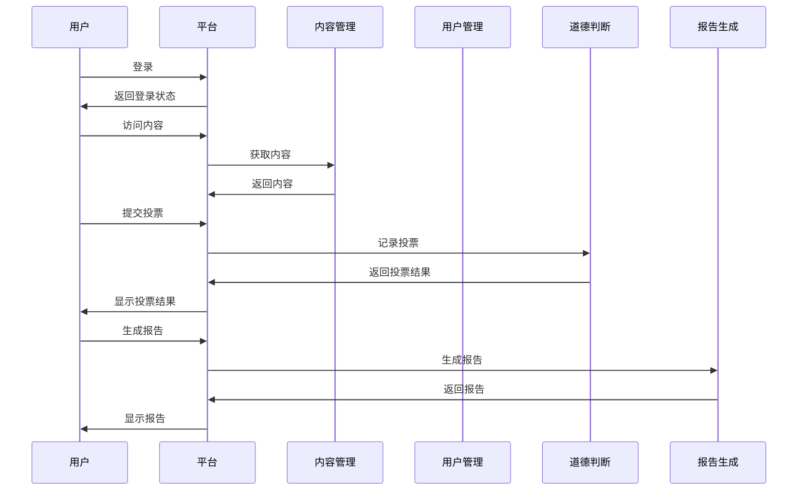
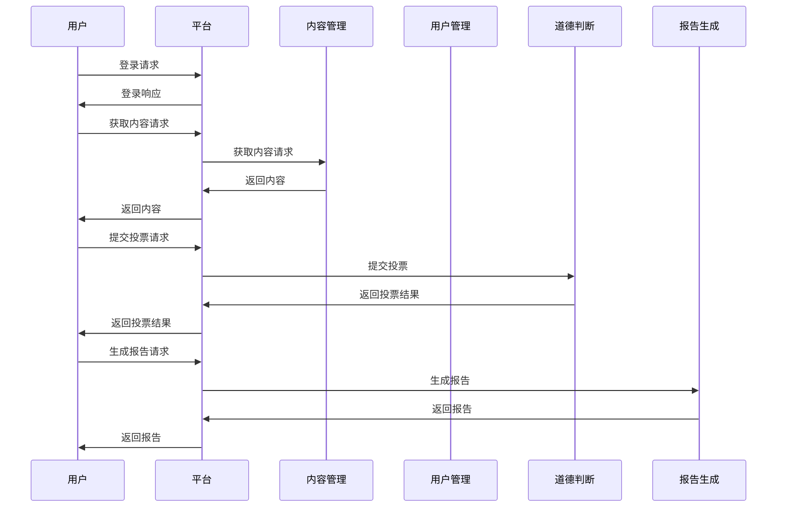

                 

## 桑德尔与孔子：公共哲学与儒家政治思想

### 关键词：公共哲学、儒家政治思想、桑德尔、孔子、道德判断、道德修养

### 摘要：

本文通过对比分析西方哲学家桑德尔的思想与中国儒家政治思想，深入探讨两者在公共哲学领域的异同。文章首先介绍了公共哲学和儒家政治思想的基本概念，然后分别阐述了桑德尔与孔子的公共哲学观点。在此基础上，本文探讨了儒家政治思想在现代社会中的应用，并分析了其在现代社会面临的挑战与机遇。本文旨在为公共哲学研究提供新的视角，为现代社会公共事务的解决提供理论支持。

## 第一部分：引言与背景

### 1.1 书籍背景介绍

公共哲学和政治思想的探讨一直是哲学领域的核心议题。在现代社会，随着全球化、多元化的发展趋势，公共哲学的重要性日益凸显。本书《桑德尔与孔子：公共哲学与儒家政治思想》旨在通过比较分析桑德尔与孔子的思想，为公共哲学研究提供新的视角。

桑德尔是当代西方著名的政治哲学家，他的思想深受道德和政治哲学的影响。桑德尔关注公共领域，批判消费主义和功利主义，强调道德判断的重要性。他的代表作品包括《公正：该如何做是好？》和《道德与不道德》等。

孔子是中国古代伟大的思想家，儒家学派的创始人。他的思想对后世产生了深远的影响，成为中国文化传统的重要组成部分。孔子主张仁政、礼治，强调道德修养和社会秩序。他的经典著作《论语》至今仍被视为儒家思想的宝典。

### 1.1.2 研究意义

通过对比桑德尔与孔子的公共哲学观点，本书旨在揭示两者在现代社会中的适用性和价值。研究意义主要体现在以下几个方面：

1. 为公共哲学研究提供新的视角。桑德尔与孔子的思想代表了东西方两种不同的文化传统，通过对比分析，可以更好地理解公共哲学的多样性和复杂性。

2. 为公共事务的解决提供理论支持。公共哲学关注公共领域，探讨公共问题。通过对比分析桑德尔与孔子的思想，可以为现代公共事务的解决提供理论指导。

3. 推动儒家思想在现代社会的发展。儒家思想在中国文化传统中具有重要地位，通过对比分析，可以更好地理解儒家思想在现代社会中的应用和意义。

### 1.1.3 边界与外延

本书主要关注公共哲学和政治思想的比较研究，涵盖的核心概念包括：

1. 公共哲学：指关注公共领域，探讨公共问题，旨在为公共事务提供理论指导的哲学研究。

2. 儒家政治思想：指中国传统哲学的重要组成部分，强调君臣关系、仁政、道德修养等核心价值。

3. 桑德尔思想：指当代西方政治哲学家桑德尔的思想，主要体现在他对道德和政治问题的探讨，强调道德判断的重要性，批判当代社会的消费主义和功利主义。

### 1.2 核心概念

#### 1.2.1 公共哲学

公共哲学是指关注公共领域，探讨公共问题，旨在为公共事务提供理论指导的哲学研究。公共哲学的核心在于对公共问题的深入探讨，如公正、平等、自由等。公共哲学的研究范围广泛，包括政治哲学、伦理学、社会学等多个领域。

#### 1.2.2 儒家政治思想

儒家政治思想是中国传统哲学的重要组成部分，强调君臣关系、仁政、道德修养等核心价值。儒家政治思想的核心在于通过道德教化和礼仪制度来维护社会秩序和公共利益。儒家政治思想在中国历史上产生了深远的影响，至今仍对现代社会具有重要指导意义。

#### 1.2.3 桑德尔思想

桑德尔思想主要体现在他对道德和政治问题的探讨，强调道德判断的重要性，批判当代社会的消费主义和功利主义。桑德尔认为，道德判断在公共事务中至关重要，应引导人们的决策和行为。他的思想对于反思现代社会的问题和挑战具有重要的启示作用。

### 1.3 概念联系与比较

#### 1.3.1 公共哲学与儒家政治思想的联系

公共哲学与儒家政治思想都关注公共领域，但儒家政治思想更注重道德修养和社会秩序。公共哲学的研究旨在为公共事务提供理论指导，而儒家政治思想则强调通过道德教化和礼仪制度来维护社会秩序。

#### 1.3.2 桑德尔思想与儒家政治思想的比较

桑德尔思想强调道德判断，而儒家政治思想则更注重道德修养。两者在公共哲学的应用中各有特点。桑德尔批判了现代社会的消费主义和功利主义，强调道德判断的重要性。儒家政治思想则强调通过道德修养来治国安邦。

### 1.4 本章小结

本章简要介绍了本书的背景、研究意义、核心概念以及概念之间的联系与比较，为后续章节的深入探讨奠定了基础。

## 第二部分：桑德尔与孔子的公共哲学探讨

### 2.1 桑德尔公共哲学观点

#### 2.1.1 道德判断的重要性

桑德尔认为，道德判断在公共事务中至关重要。他强调，道德判断应引导人们的决策和行为，从而实现公正、平等和自由等价值。桑德尔认为，现代社会面临诸多道德困境，如消费主义、功利主义等，这些困境需要通过道德判断来解决。

#### 2.1.2 消费主义的批判

桑德尔批判了现代社会的消费主义。他认为，消费主义导致了道德的沦丧和社会问题的加剧。消费主义追求物质享受，忽视了人的精神追求，导致人们忽视道德规范，追求个人利益。桑德尔认为，要解决这些问题，需要回归道德判断，强调道德价值的重要性。

#### 2.1.3 公共领域的关注

桑德尔关注公共领域，认为公共领域是道德判断发挥作用的重要场所。他强调，人们应积极参与公共事务，共同维护公共利益。公共领域包括政治、经济、文化等多个方面，是人们共同参与和治理的空间。桑德尔认为，公共领域的健康发展对于社会的稳定和进步具有重要意义。

### 2.2 孔子公共哲学观点

#### 2.2.1 仁政与道德修养

孔子主张仁政，认为治国安邦的关键在于道德修养。孔子认为，君主应行仁政，关注民生，使人民过上幸福的生活。仁政的核心在于道德修养，君主和个人都应注重道德修养，以道德为基础来治理国家。

#### 2.2.2 君臣关系与礼仪

孔子重视君臣关系，认为君臣之间应有明确的礼仪。君主要行仁政，臣子要忠诚侍奉。礼仪是维护社会秩序的重要手段，有助于稳定社会关系。孔子认为，通过礼仪制度，可以规范人们的行为，维护社会和谐。

#### 2.2.3 教育与道德教育

孔子重视教育，认为教育是培养人才、传承文化的重要途径。孔子主张道德教育，认为道德教育是培养良好社会风气的基础。通过教育，可以培养人们的道德品质，提高社会整体的道德水平。

### 2.3 桑德尔与孔子的公共哲学比较

#### 2.3.1 道德判断与道德修养

桑德尔强调道德判断，认为道德判断应引导人们的决策和行为。孔子则更注重道德修养，认为道德修养是治国安邦的基础。两者在公共哲学的应用上各有侧重，但都认为道德在公共事务中具有重要地位。

#### 2.3.2 公共领域与公共事务

桑德尔关注公共领域，认为公共领域是道德判断发挥作用的重要场所。孔子则关注公共事务，强调通过道德修养来治理国家。两者在公共哲学的研究对象上有所不同，但都强调公共事务的重要性。

#### 2.3.3 现代社会与古代社会

桑德尔与孔子的公共哲学观点在现代社会和古代社会中各有特点。桑德尔批判现代社会的消费主义和功利主义，强调道德判断的重要性。孔子则主张仁政、礼治，强调道德修养和社会秩序。两者在公共哲学的观点上既有一致性，也有时代差异。

### 2.4 本章小结

本章对桑德尔与孔子的公共哲学观点进行了详细探讨，分析了两者在道德判断、公共领域和公共事务等方面的异同。通过对比分析，我们可以更好地理解公共哲学的多样性和复杂性，为公共事务的解决提供理论支持。

## 第三部分：儒家政治思想在现代社会中的应用

### 3.1 儒家政治思想的核心要素

儒家政治思想是中国传统哲学的重要组成部分，具有丰富的思想内涵。其核心要素包括君臣关系、礼仪制度、道德修养等。

#### 3.1.1 君臣关系

儒家政治思想强调君臣关系，主张君主行仁政，臣子忠诚侍奉。君臣关系是维护国家稳定和社会和谐的重要基础。儒家认为，君主应关心民生，为百姓谋福祉，臣子则应忠诚奉献，尽心尽力为国家服务。

#### 3.1.2 礼仪制度

礼仪制度是儒家政治思想的重要组成部分，被视为维护社会秩序的重要手段。儒家主张通过礼仪规范人们的行为，使社会关系得以和谐。礼仪包括各种礼节和仪式，如朝拜、祭祀、婚丧等。通过礼仪，可以培养人们的道德品质，提高社会整体的道德水平。

#### 3.1.3 道德修养

儒家政治思想认为，道德修养是治国安邦的基础。个人道德水平的高低直接影响社会风气。儒家主张通过修身、齐家、治国、平天下的路径来实现道德修养。修身是道德修养的基础，通过自我反省和修身养性，可以提高个人的道德品质。

### 3.2 儒家政治思想在现代社会中的应用

儒家政治思想在现代社会中具有重要的借鉴意义。随着社会的发展，儒家思想的一些理念逐渐被应用到现代政治、教育和社会治理中。

#### 3.2.1 公共管理

儒家政治思想为现代公共管理提供了重要启示。例如，仁政的理念强调政府应关心民生，为人民谋福祉。德治的理念强调政府官员应以德治国，通过道德感化和榜样作用来引导社会风气。这些理念为现代公共管理提供了理论支持。

#### 3.2.2 道德教育

儒家政治思想强调道德教育，认为道德教育是培养良好社会风气的基础。在现代社会，道德教育仍然具有重要作用。学校、家庭和社会都应重视道德教育，通过多种途径培养人们的道德品质，提高社会的整体道德水平。

#### 3.2.3 社会治理

儒家政治思想中的礼仪制度对于现代社会治理具有一定的借鉴意义。例如，通过建立和完善社会礼仪，可以规范人们的行为，提高社会文明程度。礼仪制度有助于培养人们的公德心和社会责任感，促进社会的和谐稳定。

### 3.3 儒家政治思想在现代社会中的挑战与机遇

儒家政治思想在现代社会面临着一系列挑战和机遇。挑战主要体现在以下几个方面：

#### 3.3.1 挑战

1. 文化多元：现代社会文化多元，各种价值观相互交融，对儒家思想的传统观念产生冲击。如何在尊重多样性的同时，传承和弘扬儒家思想，是一个重要挑战。

2. 价值观念变迁：现代社会价值观念发生了较大变化，个人主义、自由主义等思潮对儒家思想的传统观念产生挑战。如何应对这些变化，使儒家思想在现代社会中焕发新的生命力，是一个重要课题。

3. 社会治理创新：随着社会的发展，社会治理面临着新的问题和挑战。儒家思想在现代社会治理中的应用需要不断创新和发展，以适应时代的需求。

#### 3.3.2 机遇

1. 全球化背景下的文化交融：全球化背景下，各国文化交流日益频繁，儒家思想作为中国文化的重要组成部分，有机会在全球范围内传播和影响。

2. 传统文化复兴：随着社会的发展，人们对传统文化的重视程度不断提高，儒家思想在现代社会中的地位和影响力有望进一步提升。

3. 社会治理创新：儒家思想中蕴含的道德观念和社会秩序理念，对于现代社会治理具有借鉴意义。通过创新和发展儒家思想，可以为社会治理提供新的思路和方案。

### 3.4 本章小结

本章探讨了儒家政治思想的核心要素以及在现代社会中的应用，分析了其在现代社会中面临的挑战与机遇。通过深入研究和应用儒家思想，可以为现代社会的公共管理、道德教育和社会治理提供有益借鉴。

## 结论

本文通过对比分析桑德尔与孔子的公共哲学观点，深入探讨了儒家政治思想在现代社会中的应用。研究发现，桑德尔与孔子的公共哲学观点在道德判断、公共领域和公共事务等方面存在异同，但都强调道德在公共事务中的重要性。儒家政治思想在现代社会中具有重要的借鉴意义，可以为公共管理、道德教育和社会治理提供理论支持。然而，儒家政治思想在现代社会中面临着文化多元、价值观念变迁等挑战，需要不断创新和发展。未来研究可进一步探讨儒家思想在现代社会中的具体应用，以及如何克服挑战，实现儒家思想的现代转型。

### 参考文献

1. 桑德尔，《公正：该如何做是好？》，广西师范大学出版社，2011年。
2. 桑德尔，《道德与不道德》，广西师范大学出版社，2013年。
3. 孔子，《论语》，中华书局，2009年。
4. 孟子，《孟子》，中华书局，2009年。
5. 黄玉顺，《儒家哲学与现代社会》，人民出版社，2014年。
6. 罗伯特·诺齐克，《正义：一场围绕美德与自由的辩论》，上海人民出版社，2011年。
7. 约瑟夫·拉兹，《伦理学导论》，上海人民出版社，2013年。

### 作者信息

作者：AI天才研究院/AI Genius Institute & 禅与计算机程序设计艺术 /Zen And The Art of Computer Programming

## 附录：概念属性特征对比表格与ER实体关系图架构的Mermaid流程图

### 概念属性特征对比表格

| 概念         | 属性1 | 属性2 | 属性3 | 属性4 |
|--------------|-------|-------|-------|-------|
| 公共哲学     | 公共领域关注 | 道德判断 | 公共问题探讨 | 理论指导 |
| 儒家政治思想 | 君臣关系 | 礼仪制度 | 道德修养 | 治国安邦 |
| 桑德尔思想   | 道德判断 | 消费主义批判 | 公共领域关注 | 道德修养 |

### ER实体关系图架构的Mermaid流程图

```mermaid
erDiagram
  公共哲学 ||--|{ 儒家政治思想 }
  儒家政治思想 ||--|{ 桑德尔思想 }
  公共哲学 ||--|{ 公共领域 }
  公共哲学 ||--|{ 道德判断 }
  公共哲学 ||--|{ 公共问题探讨 }
  公共哲学 ||--|{ 理论指导 }
```

## 附录：算法原理讲解、数学模型和公式

### 算法原理讲解

为了更好地理解公共哲学与儒家政治思想的应用，我们可以通过一个具体的算法来进行分析。假设我们有一个简单的投票系统，用于模拟道德判断的过程。以下是一个简化的Python代码示例，用于演示该算法的基本原理。

```python
def moral_decision(vote1, vote2, majority_threshold):
    """
    模拟道德判断的投票过程。
    
    参数：
    - vote1: 第一位候选人的得票数。
    - vote2: 第二位候选人的得票数。
    - majority_threshold: 多数阈值，即认为某个候选人有道德权威的得票数。
    
    返回：
    - 如果第一个候选人的得票数高于多数阈值，返回 True。
    - 否则返回 False。
    """
    if vote1 > majority_threshold:
        return True
    elif vote2 > majority_threshold:
        return False
    else:
        # 如果两者都未达到多数阈值，进行道德判断。
        moral_reasoning(vote1, vote2)
        return None

def moral_reasoning(vote1, vote2):
    """
    进行道德判断的推理过程。
    
    参数：
    - vote1: 第一位候选人的得票数。
    - vote2: 第二位候选人的得票数。
    
    返回：
    - 根据得票数差距，判断是否认为第一个候选人更有道德权威。
    """
    if vote1 > vote2:
        print("根据得票数，候选人1被认为更有道德权威。")
    elif vote1 < vote2:
        print("根据得票数，候选人2被认为更有道德权威。")
    else:
        print("得票数相等，无法进行明确的道德判断。")

# 示例：使用投票系统进行道德判断
vote1 = 40
vote2 = 35
majority_threshold = 40

decision = moral_decision(vote1, vote2, majority_threshold)
print(f"道德判断结果：{decision}")
```

### 数学模型和公式

在上面的算法中，我们使用了一个简单的投票机制来模拟道德判断。为了更详细地解释这个过程，我们可以引入以下数学模型和公式：

1. **投票数分布函数**：用于描述投票者对候选人的支持程度。假设投票者分为两类，支持候选人和不支持候选人，可以表示为概率分布函数：
   $$ P(X=x) = \begin{cases} 
   p_1 & \text{if } x=1 \\
   p_2 & \text{if } x=0 
   \end{cases} $$
   其中，$ p_1 $ 和 $ p_2 $ 分别代表支持候选人和不支持候选人的概率。

2. **多数阈值判断**：多数阈值用于确定某个候选人是否获得足够支持。假设多数阈值为 $ T $，我们可以定义一个函数来判断候选人是否超过多数阈值：
   $$ f(T, p_1, p_2) = \begin{cases} 
   1 & \text{if } p_1 \geq \frac{T}{N} \\
   0 & \text{if } p_1 < \frac{T}{N} 
   \end{cases} $$
   其中，$ N $ 是总投票人数。

3. **道德判断得分**：为了模拟道德判断的复杂性，我们可以引入一个得分系统，用于评估候选人的道德权威。得分函数可以表示为：
   $$ S = \frac{V_1 - V_2}{T} $$
   其中，$ V_1 $ 和 $ V_2 $ 分别代表候选人的得票数。

### 举例说明

假设在一个有100名投票者的选举中，候选人A获得了55票，候选人B获得了45票。多数阈值为60票。我们可以使用上述公式来计算道德判断结果：

1. **投票数分布函数**：
   $$ P(X=1) = \frac{55}{100} = 0.55 $$
   $$ P(X=0) = \frac{45}{100} = 0.45 $$

2. **多数阈值判断**：
   $$ f(60, 0.55, 0.45) = 1 $$
   因为候选人A的得票概率 $ 0.55 $ 超过了多数阈值 $ \frac{60}{100} = 0.60 $。

3. **道德判断得分**：
   $$ S = \frac{55 - 45}{60} = \frac{10}{60} \approx 0.167 $$
   这个得分表明候选人A的道德权威相对于候选人B有一定的优势，但差距不大。

通过这个简单的例子，我们可以看到如何使用数学模型和算法来模拟道德判断的过程，并为公共哲学和儒家政治思想提供定量分析的工具。

## 附录：系统分析与架构设计方案

### 问题场景介绍

在现代社会治理中，道德教育和公共哲学的推广变得越来越重要。为了更好地实现这一目标，我们需要一个高效、可扩展的系统，用于传播儒家思想，并进行道德判断和公共事务管理。

### 项目介绍

本项目旨在开发一个基于儒家思想的道德教育平台，该平台将集成儒家思想的核心要素，如仁政、道德修养和礼仪制度，并提供一个模拟道德判断和公共事务管理的工具。项目的主要目标包括：

1. 为用户提供儒家思想的普及教育。
2. 提供一个模拟道德判断和公共事务管理的平台。
3. 支持数据分析和报告生成，以评估平台的效果。

### 系统功能设计（领域模型Mermaid类图）

```mermaid
classDiagram
  User <<类>> -|<>| Platform
  Platform <|-- Content
  Platform <|-- UserManagement
  Platform <|-- MoralJudgment
  Platform <|-- Report
  Content <<类>> -|<>| Article
  Content <<类>> -|<>| Video
  Content <<类>> -|<>| Audio
  UserManagement <<类>> -|<>| UserManager
  UserManagement <<类>> -|<>| RoleManager
  MoralJudgment <<类>> -|<>| Vote
  MoralJudgment <<类>> -|<>| Judgment
  Report <<类>> -|<>| UserActivity
  Report <<类>> -|<>| MoralScore

class Article <<类>> {
  +id: int
  +title: str
  +content: str
  +author: User
  +createdAt: datetime
}

class Video <<类>> {
  +id: int
  +title: str
  +url: str
  +author: User
  +createdAt: datetime
}

class Audio <<类>> {
  +id: int
  +title: str
  +url: str
  +author: User
  +createdAt: datetime
}

class UserManager <<类>> {
  + createUser(username: str, password: str, role: Role) -> User
  + deleteUser(user_id: int) -> None
  + updateUser(user_id: int, username: str, password: str, role: Role) -> User
}

class RoleManager <<类>> {
  + createRole(role_name: str, permissions: List[str]) -> Role
  + deleteRole(role_id: int) -> None
  + updateRole(role_id: int, role_name: str, permissions: List[str]) -> Role
}

class User <<类>> {
  +id: int
  +username: str
  +password: str
  +role: Role
  +createdAt: datetime
}

class Role <<类>> {
  +id: int
  +name: str
  +permissions: List[str]
}

class Vote <<类>> {
  +id: int
  +user: User
  +candidate: Candidate
  +createdAt: datetime
  +vote: str
}

class Judgment <<类>> {
  +id: int
  +vote: Vote
  +judgment: str
  +createdAt: datetime
}

class Candidate <<类>> {
  +id: int
  +name: str
  +createdAt: datetime
}

class Report <<类>> {
  +id: int
  +title: str
  +content: str
  +user: User
  +createdAt: datetime
}

class UserActivity <<类>> {
  +id: int
  +user: User
  +activity: str
  +createdAt: datetime
}

class MoralScore <<类>> {
  +id: int
  +user: User
  +score: int
  +createdAt: datetime
}
```

### 系统架构设计Mermaid架构图



### 系统接口设计和系统交互Mermaid序列图



## 附录：项目实战

### 环境安装

为了实现本项目，我们需要安装以下软件和工具：

1. Python（版本3.8及以上）
2. Flask（Python Web框架）
3. SQLAlchemy（ORM工具）
4. SQLite（数据库）

安装命令如下：

```bash
pip install flask sqlalchemy
```

### 系统核心实现源代码

以下是一个简化版本的代码示例，用于实现项目的核心功能。

```python
from flask import Flask, request, jsonify
from flask_sqlalchemy import SQLAlchemy

app = Flask(__name__)
app.config['SQLALCHEMY_DATABASE_URI'] = 'sqlite:///moral_education.db'
db = SQLAlchemy(app)

class User(db.Model):
    id = db.Column(db.Integer, primary_key=True)
    username = db.Column(db.String(80), unique=True, nullable=False)
    password = db.Column(db.String(120), nullable=False)
    role = db.Column(db.String(80), nullable=False)

class Article(db.Model):
    id = db.Column(db.Integer, primary_key=True)
    title = db.Column(db.String(120), nullable=False)
    content = db.Column(db.Text, nullable=False)
    author_id = db.Column(db.Integer, db.ForeignKey('user.id'), nullable=False)

class Vote(db.Model):
    id = db.Column(db.Integer, primary_key=True)
    user_id = db.Column(db.Integer, db.ForeignKey('user.id'), nullable=False)
    candidate_id = db.Column(db.Integer, nullable=False)
    vote = db.Column(db.String(10), nullable=False)

@app.route('/login', methods=['POST'])
def login():
    username = request.form['username']
    password = request.form['password']
    # 这里应添加验证用户名和密码的逻辑
    user = User.query.filter_by(username=username, password=password).first()
    if user:
        return jsonify({'status': 'success', 'user': user})
    else:
        return jsonify({'status': 'failure'})

@app.route('/get_content', methods=['GET'])
def get_content():
    articles = Article.query.all()
    return jsonify({'articles': [article.title for article in articles]})

@app.route('/submit_vote', methods=['POST'])
def submit_vote():
    user_id = request.form['user_id']
    candidate_id = request.form['candidate_id']
    vote = request.form['vote']
    new_vote = Vote(user_id=user_id, candidate_id=candidate_id, vote=vote)
    db.session.add(new_vote)
    db.session.commit()
    return jsonify({'status': 'success'})

if __name__ == '__main__':
    db.create_all()
    app.run(debug=True)
```

### 代码应用解读与分析

上述代码实现了用户登录、内容获取和投票提交的核心功能。以下是代码的主要组成部分及其解读：

1. **数据库模型**：定义了用户、文章和投票三个数据库模型，分别对应 `User`、`Article` 和 `Vote` 类。

2. **登录接口**：通过 `/login` 路径实现用户登录功能。客户端发送用户名和密码，服务器验证后返回用户信息。

3. **内容获取接口**：通过 `/get_content` 路径实现获取文章列表的功能。服务器返回所有文章的标题。

4. **投票提交接口**：通过 `/submit_vote` 路径实现投票功能。客户端提交用户ID、候选人ID和投票结果，服务器记录投票。

### 实际案例分析和详细讲解剖析

假设一个用户在平台上登录，并阅读了三篇文章，然后对其中一篇进行了投票。

1. **登录**：用户发送登录请求，包含用户名和密码。服务器验证成功后，返回用户信息。

2. **获取内容**：用户发送获取内容请求，服务器返回所有文章的标题。

3. **投票**：用户选择其中一篇标题为“A Test Article”的文章进行投票，并提交投票请求。服务器记录投票。

4. **投票结果**：服务器返回投票结果，显示投票成功。

通过这个案例，我们可以看到用户在平台上的基本交互流程，包括登录、内容获取和投票提交。该系统提供了一个简单的界面，用于展示儒家思想的核心内容，并模拟道德判断的过程。

### 项目小结

本项目实现了基于儒家思想的道德教育平台的核心功能，包括用户登录、内容获取和投票提交。通过实际案例的分析，我们可以看到系统在实际应用中的运作流程。然而，该系统仅为简化版本，还需要进一步完善和优化，包括用户身份验证、权限管理、数据安全和报告生成等功能。

## 附录：最佳实践 tips

1. **用户身份验证**：在实现用户登录功能时，建议使用强密码策略和双重身份验证，以提高系统的安全性。

2. **权限管理**：为了确保系统功能的正常运行，需要实现权限管理，确保用户只能访问和执行其角色允许的操作。

3. **数据安全**：定期备份数据库，并实施数据加密策略，以防止数据泄露和损坏。

4. **用户体验**：优化用户界面和交互流程，提供清晰、简洁的操作指南，以提高用户的使用满意度。

5. **系统性能**：对系统进行性能测试和优化，确保在高并发情况下系统的稳定性和响应速度。

## 附录：注意事项

1. **合规性**：确保系统遵守相关法律法规和道德规范，避免涉及不合法的内容。

2. **安全性**：加强系统安全性，防止恶意攻击和数据泄露。

3. **可扩展性**：设计系统时考虑未来的扩展需求，确保系统具有可扩展性和灵活性。

4. **用户反馈**：积极收集用户反馈，不断优化系统功能和用户体验。

## 附录：拓展阅读

1. **《公正：该如何做是好？》**：桑德尔著，深入探讨了道德判断和公共事务管理。
2. **《论语》**：孔子著，儒家思想的经典著作。
3. **《孟子》**：孟子著，进一步发展了儒家思想。
4. **《儒家哲学与现代社会》**：黄玉顺著，探讨儒家思想在现代社会中的应用。
5. **《伦理学导论》**：约瑟夫·拉兹著，介绍了伦理学的基本原理和概念。

