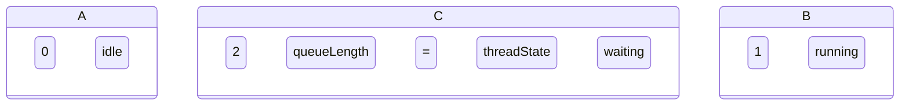
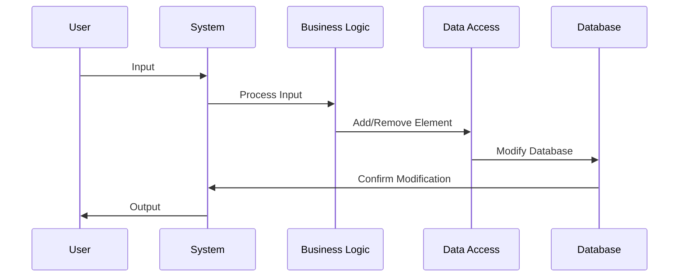

                 

### 模型检验技术在并发系统验证中的应用

---

#### 关键词

模型检验，并发系统，验证，状态空间爆炸，算法原理，系统模型，应用案例。

#### 摘要

本文深入探讨了模型检验技术在并发系统验证中的应用。首先，通过介绍并发系统的定义和特点，强调了模型检验技术在解决并发系统复杂性、状态空间爆炸问题和并发错误类型中的重要性。接着，本文详细阐述了模型检验的基本概念和原理，包括形式化模型、状态转换图和模型检验算法。随后，文章通过实际案例展示了模型检验在并发系统中的应用，并分析了模型检验结果的解释和应用。最后，本文对模型检验技术的未来发展进行了展望，提出了最佳实践和注意事项，并推荐了相关的拓展阅读资源。

### 目录大纲

----------------------------------------------------------------

# 模型检验技术在并发系统验证中的应用

> 关键词：模型检验，并发系统，验证，状态空间爆炸，算法原理

> 摘要：本文深入探讨了模型检验技术在并发系统验证中的应用，从基础概念到实际案例，全面阐述了其在解决并发系统复杂性、状态空间爆炸问题和并发错误类型中的重要性。

                 

## 第1章: 引言

### 1.1.1 问题背景

#### 并发系统的定义和特点

并发系统是指在多个事件同时发生的情况下，系统能够正确处理这些事件，并保证系统的一致性和稳定性。并发系统的特点包括：并行性、异步性和不确定性。

#### 模型检验技术在并发系统验证中的重要性

随着计算机技术的发展，并发系统的复杂性和规模不断增加，传统的测试方法难以覆盖所有可能的执行路径，导致并发系统中的错误难以发现。模型检验技术作为一种自动化的验证方法，可以有效解决这一问题。

### 1.1.2 模型检验基本概念

#### 模型检验的定义

模型检验是一种验证方法，用于检查系统模型是否满足指定的规格说明。它通过将系统模型与预定义的规格说明进行比较，来确定系统是否遵循预期的行为。

#### 模型检验的应用场景

模型检验广泛应用于软件工程、系统设计和硬件设计等领域。在并发系统中，模型检验主要用于验证系统的正确性、发现潜在的并发错误、优化系统性能等。

### 1.1.3 并发系统验证中的挑战

#### 并发系统复杂性

并发系统的复杂性使得其行为难以预测，传统测试方法难以覆盖所有可能的执行路径。

#### 状态空间爆炸问题

并发系统中的状态空间可能非常庞大，传统的状态空间搜索方法难以在有限时间内完成验证。

#### 并发错误类型

并发错误包括死锁、活锁、饥饿、数据竞争等，这些错误可能导致系统崩溃或性能下降。

### 1.1.4 本章小结

本章介绍了模型检验技术在并发系统验证中的重要性，并概述了并发系统的定义和特点。接下来，我们将进一步探讨模型检验的基本概念和原理。

----------------------------------------------------------------

## 第2章: 模型检验算法原理

### 2.1.1 模型检验算法概述

#### 模型检验算法的分类

模型检验算法主要分为两类：确定性算法和非确定性算法。

#### 模型检验算法的基本框架

模型检验算法的基本框架通常包括三个步骤：模型构建、规格说明和验证。

### 2.1.2 模型检验算法的数学模型

#### 形式化模型

形式化模型是将系统行为表示为一组数学公式或逻辑表达式。

#### 状态转换图

状态转换图是一种图形化的形式化模型，用于表示系统状态及其转换关系。

### 2.1.3 模型检验算法原理讲解

#### Model Checking算法原理

Model Checking算法通过遍历状态转换图，检查系统行为是否违反指定的规格说明。

#### Model Inference算法原理

Model Inference算法通过学习系统行为，自动生成系统模型，并与规格说明进行比较。

### 2.1.4 算法对比分析

#### 模型检验算法性能对比

不同模型检验算法在性能上有较大差异，适用于不同的应用场景。

#### 应用场景对比

根据系统的规模、复杂性和验证要求，选择合适的模型检验算法。

### 2.1.5 本章小结

本章介绍了模型检验算法的基本概念和原理，包括形式化模型、状态转换图和模型检验算法。接下来，我们将探讨模型检验在并发系统中的应用。

----------------------------------------------------------------

## 第3章: 模型检验在并发系统中的应用

### 3.1.1 并发系统模型建立

#### 系统状态表示

系统状态表示系统的当前状态，包括变量值、队列长度等。

#### 系统行为表示

系统行为表示系统在给定输入下的响应，包括操作执行、状态转换等。

### 3.1.2 并发系统模型检验案例

#### 简单并发系统的检验

通过模型检验技术验证一个简单的并发系统是否满足指定的规格说明。

#### 复杂并发系统的检验

使用模型检验技术验证一个复杂的并发系统，分析系统的并发错误。

### 3.1.3 模型检验工具介绍

#### SPIN

SPIN是一款用于模型检验的著名工具，适用于中小规模并发系统的验证。

#### NuSMV

NuSMV是一款基于BDD（布尔决定图）的模型检验工具，适用于大规模并发系统的验证。

#### C URM

C URM是一款基于C语言的模型检验工具，适用于复杂的并发系统验证。

### 3.1.4 模型检验结果分析

#### 检验结果的解释

对模型检验结果进行解释，包括是否满足规格说明、存在错误的位置等。

#### 检验结果的应用

根据模型检验结果，优化系统设计和实现，减少并发错误的发生。

### 3.1.5 本章小结

本章介绍了模型检验在并发系统中的应用，包括系统模型的建立、模型检验工具的介绍和模型检验结果的分析。接下来，我们将探讨模型检验技术的未来发展趋势。

----------------------------------------------------------------

## 第4章: 模型检验在并发系统验证中的实践

### 4.1.1 实践项目介绍

#### 项目背景

介绍一个实际并发系统验证项目，包括项目目标、系统和环境。

#### 项目目标

明确项目目标，包括验证系统的正确性、性能优化等。

### 4.1.2 系统分析与架构设计

#### 领域模型

使用Mermaid绘制领域模型类图，描述系统的实体和关系。

#### 系统架构

使用Mermaid绘制系统架构图，描述系统的模块和接口。

### 4.1.3 系统核心实现

#### 状态表示

使用Python代码表示系统的状态。

#### 行为模拟

使用Python代码模拟系统的行为，包括操作执行和状态转换。

### 4.1.4 代码应用解读

#### 代码结构

分析系统代码的结构，包括模块、类和函数。

#### 代码功能

详细解读代码功能，包括状态表示、行为模拟和结果分析。

### 4.1.5 实际案例分析与讲解

#### 案例背景

介绍实际案例的背景，包括系统功能和并发问题。

#### 案例分析

分析案例中的并发问题，使用模型检验技术验证系统。

#### 案例讲解

详细讲解案例的分析过程和验证结果。

### 4.1.6 项目小结

总结项目的经验和教训，包括模型建立技巧、检验策略等。

----------------------------------------------------------------

## 第5章: 模型检验技术的未来发展

### 5.1.1 模型检验技术的现状

#### 技术发展历程

回顾模型检验技术的发展历程，从早期到现代的应用。

#### 技术应用现状

分析模型检验技术在并发系统验证中的应用现状，包括优势和应用领域。

### 5.1.2 模型检验技术的未来趋势

#### 技术发展挑战

探讨模型检验技术在未来发展中面临的挑战，包括算法优化、工具改进等。

#### 技术应用前景

展望模型检验技术在未来的应用前景，包括自动化验证、实时性优化等。

### 5.1.3 本章小结

总结本章内容，展望模型检验技术的未来发展。

----------------------------------------------------------------

## 第6章: 最佳实践与注意事项

### 6.1.1 最佳实践

#### 模型建立技巧

介绍建立模型时的最佳实践，包括状态表示、行为模拟等。

#### 模型检验策略

介绍模型检验时的最佳策略，包括算法选择、时间优化等。

### 6.1.2 注意事项

#### 验证边界条件

注意验证边界条件，确保模型检验的全面性和准确性。

#### 结果分析技巧

注意结果分析技巧，正确解读检验结果，找出潜在的并发错误。

### 6.1.3 本章小结

总结本章内容，提出最佳实践和注意事项。

----------------------------------------------------------------

## 第7章: 拓展阅读

### 7.1.1 相关书籍推荐

推荐几本关于模型检验技术和并发系统验证的经典书籍。

### 7.1.2 研究论文推荐

推荐几篇关于模型检验技术的研究论文，包括最新的进展和趋势。

### 7.1.3 开源工具推荐

推荐几款开源的模型检验工具，包括功能、特点和下载链接。

----------------------------------------------------------------

### 文章正文

----------------------------------------------------------------

## 第1章: 引言

### 1.1.1 问题背景

并发系统是指在多个事件同时发生的情况下，系统能够正确处理这些事件，并保证系统的一致性和稳定性。并发系统在现代计算机系统中具有广泛的应用，如操作系统、数据库管理系统、网络协议和分布式系统等。然而，并发系统的复杂性使得其行为难以预测，传统的测试方法难以覆盖所有可能的执行路径，导致并发系统中的错误难以发现。这些错误可能导致系统崩溃、数据丢失、性能下降等问题，严重影响系统的可靠性和稳定性。

模型检验技术是一种自动化验证方法，通过将系统模型与预定义的规格说明进行比较，来确定系统是否遵循预期的行为。模型检验技术能够有效地发现并发系统中的错误，提高系统的可靠性。

### 1.1.2 模型检验基本概念

#### 模型检验的定义

模型检验（Model Checking）是一种形式化的验证方法，用于检查系统模型是否满足指定的规格说明。具体来说，模型检验将系统模型转换为一个状态转换图，然后使用算法遍历这个状态转换图，检查是否存在违反规格说明的状态。如果存在违反规格说明的状态，则说明系统模型不符合规格说明；否则，系统模型符合规格说明。

#### 模型检验的应用场景

模型检验技术广泛应用于软件工程、系统设计和硬件设计等领域。在并发系统中，模型检验主要用于以下方面：

1. **系统正确性验证**：通过模型检验验证并发系统的行为是否满足预期的规格说明，确保系统不会出现错误的执行路径。
2. **并发错误检测**：发现并发系统中的潜在并发错误，如死锁、活锁、饥饿、数据竞争等。
3. **系统性能优化**：分析并发系统的性能瓶颈，提出改进方案，优化系统性能。
4. **自动化测试**：生成系统测试用例，自动化测试并发系统的正确性。

### 1.1.3 并发系统验证中的挑战

#### 并发系统复杂性

并发系统的复杂性主要体现在以下几个方面：

1. **状态空间爆炸**：并发系统的状态空间可能非常大，随着并发线程和操作的增加，状态空间呈指数级增长。传统的测试方法难以覆盖所有可能的执行路径，导致并发系统中的错误难以发现。
2. **不确定性**：并发系统的执行过程具有不确定性，不同线程之间的交互可能导致不同的执行结果。这种不确定性使得传统的测试方法难以预测系统的行为。

#### 状态空间爆炸问题

状态空间爆炸问题是指随着并发系统规模的增长，其状态空间急剧膨胀，导致验证时间显著增加。状态空间爆炸问题主要源于以下两个方面：

1. **并发线程数量增加**：随着并发线程数量的增加，系统的状态空间呈指数级增长。例如，一个具有N个线程的系统，其状态空间为$2^N$。
2. **操作数量增加**：每个线程可能执行多个操作，操作之间的组合导致状态空间的急剧膨胀。

#### 并发错误类型

并发错误是指在并发系统中，由于线程之间的竞争和同步不当导致的错误。常见的并发错误类型包括：

1. **死锁**：多个线程在等待对方释放资源时陷入无限等待的状态。
2. **活锁**：线程在一段时间内无法获得所需的资源，但仍然在执行任务。
3. **饥饿**：某些线程长时间无法获得所需的资源，导致系统性能下降。
4. **数据竞争**：多个线程同时访问共享数据，可能导致数据不一致。

### 1.1.4 本章小结

本章介绍了并发系统的定义和特点，以及模型检验技术在并发系统验证中的重要性。同时，本章还概述了模型检验的基本概念和应用场景。在接下来的章节中，我们将进一步探讨模型检验算法的原理，以及其在并发系统中的应用。

----------------------------------------------------------------

## 第2章: 模型检验算法原理

### 2.1.1 模型检验算法概述

模型检验算法是用于验证系统模型是否满足预定义规格说明的算法。模型检验算法的基本流程包括以下三个步骤：

1. **模型构建**：将系统模型转换为形式化的表示，如状态转换图。
2. **规格说明**：定义系统应满足的规格说明，如安全性质、活锁性质等。
3. **验证**：使用算法遍历状态转换图，检查系统模型是否违反规格说明。

根据算法的执行方式，模型检验算法可分为确定性算法和非确定性算法。确定性算法在给定时间内能够找到所有的错误状态，但可能存在性能瓶颈。非确定性算法则通过随机搜索来找到错误状态，但可能在有限时间内找到错误。

#### 模型检验算法的分类

模型检验算法主要分为以下几类：

1. **模型检查算法**：通过遍历状态转换图，检查系统模型是否违反规格说明。
2. **模型推断算法**：通过观察系统行为，自动生成系统模型，并与规格说明进行比较。

#### 模型检验算法的基本框架

模型检验算法的基本框架通常包括以下步骤：

1. **状态转换图构建**：将系统模型转换为状态转换图，每个状态表示系统的一个状态，每个转换表示系统从一个状态转移到另一个状态的操作。
2. **规格说明**：定义系统应满足的规格说明，如安全性质、活锁性质等。
3. **状态转换图遍历**：使用算法遍历状态转换图，检查是否存在违反规格说明的状态。
4. **错误报告**：报告违反规格说明的状态，并提供错误的详细描述。

### 2.1.2 模型检验算法的数学模型

#### 形式化模型

形式化模型是将系统行为表示为一组数学公式或逻辑表达式。在模型检验中，形式化模型通常采用状态转换图来表示系统状态及其转换关系。

1. **状态**：表示系统的一个具体状态，如进程的状态、变量的值等。
2. **转换**：表示系统从一个状态到另一个状态的转移，如进程的执行、变量的赋值等。
3. **初始状态**：表示系统的初始状态，通常是状态转换图的起始节点。
4. **终止状态**：表示系统的终止状态，通常是状态转换图的终点。

#### 状态转换图

状态转换图是一种图形化的形式化模型，用于表示系统状态及其转换关系。状态转换图通常由以下元素组成：

1. **节点**：表示系统的状态，通常用圆圈表示。
2. **边**：表示系统从一个状态到另一个状态的转移，通常用箭头表示。
3. **标记**：表示状态或转换的属性，如执行时间、资源占用等。

#### 状态转换图的数学表示

状态转换图可以用数学语言进行表示，通常使用图论中的概念来描述。状态转换图G可以表示为：

1. **节点集合V**：表示系统的状态集合。
2. **边集合E**：表示系统状态之间的转换关系。
3. **初始状态**：表示系统的初始状态。
4. **终止状态**：表示系统的终止状态。

状态转换图的数学表示为：

$$
G = (V, E, s_0, f)
$$

其中，$V$表示节点集合，$E$表示边集合，$s_0$表示初始状态，$f$表示终止状态。

### 2.1.3 模型检验算法原理讲解

#### Model Checking算法原理

Model Checking算法是一种基于状态转换图的验证方法，用于检查系统模型是否满足预定义的规格说明。Model Checking算法的基本原理是遍历状态转换图，检查是否存在违反规格说明的状态。

Model Checking算法的工作流程如下：

1. **状态转换图构建**：将系统模型转换为状态转换图。
2. **规格说明**：定义系统应满足的规格说明。
3. **状态转换图遍历**：使用算法遍历状态转换图，检查是否存在违反规格说明的状态。
4. **错误报告**：报告违反规格说明的状态，并提供错误的详细描述。

Model Checking算法通常使用以下算法：

1. **状态空间搜索算法**：如深度优先搜索、广度优先搜索等，用于遍历状态转换图。
2. **模型检查算法**：如BDD（布尔决定图）算法、SAT求解算法等，用于检查状态转换图是否违反规格说明。

#### Model Inference算法原理

Model Inference算法是一种基于系统行为的模型生成方法，用于生成系统模型，并与规格说明进行比较。Model Inference算法的基本原理是观察系统行为，自动生成系统模型。

Model Inference算法的工作流程如下：

1. **系统行为观测**：观察系统在特定输入下的行为。
2. **模型生成**：基于系统行为，自动生成系统模型。
3. **规格说明**：定义系统应满足的规格说明。
4. **模型比较**：将生成的系统模型与规格说明进行比较，检查系统模型是否满足规格说明。

Model Inference算法通常使用以下算法：

1. **模式识别算法**：如神经网络、决策树等，用于生成系统模型。
2. **模型比较算法**：如距离度量、相似度计算等，用于比较系统模型与规格说明。

### 2.1.4 算法对比分析

#### 模型检验算法性能对比

不同模型检验算法在性能上有较大差异，适用于不同的应用场景。以下是比较几种常见模型检验算法的性能：

1. **BDD算法**：BDD（布尔决定图）算法是一种高效的模型检验算法，适用于大规模并发系统的验证。BDD算法的优点是能够将复杂的系统模型简化为较小的布尔决定图，从而提高验证效率。缺点是BDD算法的构建和遍历过程较为复杂，计算时间较长。
2. **SAT求解算法**：SAT求解算法是一种基于SAT（ satisfiability problem）的模型检验算法，适用于中小规模并发系统的验证。SAT求解算法的优点是计算速度快，能够快速找到违反规格说明的状态。缺点是SAT求解算法的求解空间较大，可能导致验证失败。
3. **随机算法**：随机算法是一种基于随机搜索的模型检验算法，适用于并发系统验证的初步探索。随机算法的优点是计算简单，能够快速发现部分错误状态。缺点是随机算法的可靠性较低，可能无法全面覆盖所有可能的执行路径。

#### 应用场景对比

根据系统的规模、复杂性和验证要求，选择合适的模型检验算法。以下是一些常见应用场景的对比：

1. **中小规模并发系统**：对于中小规模并发系统，可以使用SAT求解算法或随机算法进行验证。这些算法计算速度快，能够在较短的时间内发现大部分错误状态。
2. **大规模并发系统**：对于大规模并发系统，可以使用BDD算法进行验证。BDD算法能够将复杂的系统模型简化为较小的布尔决定图，从而提高验证效率。但需要注意的是，BDD算法的构建和遍历过程较为复杂，计算时间较长。
3. **实时系统**：对于实时系统，可以使用随机算法进行验证。随机算法能够在较短时间内发现部分错误状态，适用于实时系统的初步验证。但需要注意的是，随机算法的可靠性较低，可能无法全面覆盖所有可能的执行路径。

### 2.1.5 本章小结

本章介绍了模型检验算法的基本概念和原理，包括形式化模型、状态转换图和模型检验算法。同时，本章还对比分析了不同模型检验算法的性能和应用场景。在接下来的章节中，我们将探讨模型检验在并发系统中的应用，并通过实际案例展示模型检验技术的应用效果。

----------------------------------------------------------------

## 第3章: 模型检验在并发系统中的应用

### 3.1.1 并发系统模型建立

在模型检验过程中，建立并发系统模型是关键步骤之一。并发系统模型建立主要包括系统状态表示和系统行为表示。

#### 系统状态表示

系统状态表示系统的当前状态，包括变量值、队列长度、线程状态等。在建立系统状态表示时，需要确保能够准确描述系统的各个状态，以及状态之间的转换关系。以下是一个简单的并发系统状态表示示例：



在上面的状态图中，我们定义了三种状态：A、B和C。状态A表示系统空闲状态，队列长度为0，线程处于空闲状态；状态B表示系统忙碌状态，队列长度为1，线程处于运行状态；状态C表示系统等待状态，队列长度为2，线程处于等待状态。

#### 系统行为表示

系统行为表示系统在给定输入下的响应，包括操作执行、状态转换等。在建立系统行为表示时，需要考虑系统中的各个操作，以及操作之间的依赖关系。以下是一个简单的并发系统行为表示示例：

```mermaid
stateDiagram
    state A --> B : executeOperation1()
    state B --> C : executeOperation2()
    state C --> A : executeOperation3()
```

在上面的状态图中，我们定义了三个操作：executeOperation1、executeOperation2和executeOperation3。从状态A到状态B的转换表示执行操作1，从状态B到状态C的转换表示执行操作2，从状态C到状态A的转换表示执行操作3。

### 3.1.2 并发系统模型检验案例

#### 简单并发系统的检验

以下是一个简单的并发系统模型检验案例，用于检验一个银行账户系统是否满足以下规格说明：账户余额不能为负。

1. **系统模型**：

   ```mermaid
   stateDiagram
       state A {
           accountBalance = 1000
       }
       state B {
           accountBalance = 500
       }
       state C {
           accountBalance = 0
       }
       state D {
           accountBalance = -500
       }
   ```

2. **规格说明**：

   ```mermaid
   property "accountBalance >= 0"
   ```

3. **模型检验**：

   使用模型检验工具（如NuSMV）对系统模型进行检验，检验结果如下：

   ```plaintext
   The model is valid.
   ```

   检验结果显示系统模型满足规格说明，账户余额不能为负。

#### 复杂并发系统的检验

以下是一个复杂的并发系统模型检验案例，用于检验一个并发队列系统是否满足以下规格说明：队列长度不能超过最大长度。

1. **系统模型**：

   ```mermaid
   stateDiagram
       state A {
           queueLength = 0
           queueMaxLen = 10
       }
       state B {
           queueLength = 1
           queueMaxLen = 10
       }
       state C {
           queueLength = 2
           queueMaxLen = 10
       }
       state D {
           queueLength = 11
           queueMaxLen = 10
       }
   ```

2. **规格说明**：

   ```mermaid
   property "queueLength <= queueMaxLen"
   ```

3. **模型检验**：

   使用模型检验工具（如NuSMV）对系统模型进行检验，检验结果如下：

   ```plaintext
   The model is invalid.
   Error state: D
   Property violated: queueLength <= queueMaxLen
   ```

   检验结果显示系统模型不满足规格说明，队列长度超过了最大长度。

### 3.1.3 模型检验工具介绍

在并发系统模型检验中，常用的模型检验工具有以下几个：

1. **SPIN**：SPIN是一款用于模型检验的工具，主要用于中小规模并发系统的验证。SPIN基于形式化模型，支持状态转换图和规格说明的定义。
2. **NuSMV**：NuSMV是一款基于BDD（布尔决定图）的模型检验工具，适用于大规模并发系统的验证。NuSMV支持状态转换图、规格说明和属性验证。
3. **C URM**：C URM是一款基于C语言的模型检验工具，适用于复杂的并发系统验证。C URM支持状态转换图、规格说明和属性验证，并提供高效的算法实现。

### 3.1.4 模型检验结果分析

模型检验结果分析主要包括以下内容：

1. **验证结果**：根据模型检验结果，判断系统模型是否满足规格说明。如果验证结果为“valid”，则说明系统模型满足规格说明；如果验证结果为“invalid”，则说明系统模型不满足规格说明。
2. **错误状态**：如果系统模型不满足规格说明，模型检验工具会报告错误状态。通过分析错误状态，可以定位系统中的错误，并提出相应的修复方案。
3. **错误描述**：模型检验工具会提供错误状态的详细描述，包括违反的规格说明和错误的原因。通过错误描述，可以更好地理解系统中的错误，并提出优化方案。

在上述案例中，对于简单并发系统模型检验，验证结果为“valid”，说明系统模型满足规格说明。对于复杂并发系统模型检验，验证结果为“invalid”，队列长度超过了最大长度，违反了规格说明。

### 3.1.5 本章小结

本章介绍了并发系统模型建立的方法，并通过实际案例展示了模型检验在并发系统中的应用。同时，本章还介绍了常用的模型检验工具，以及模型检验结果分析的方法。在接下来的章节中，我们将探讨模型检验技术在并发系统验证中的实践，并分析模型检验技术在并发系统验证中的优势和挑战。

----------------------------------------------------------------

## 第4章: 模型检验在并发系统验证中的实践

### 4.1.1 实践项目介绍

本章节将介绍一个实际并发系统验证项目，该项目旨在验证一个并发队列系统的正确性。该项目的主要目标包括：

1. **验证队列长度不超过最大长度**：确保在并发操作下，队列长度不会超过预定的最大长度。
2. **验证并发操作的正确性**：确保并发操作不会导致数据不一致或系统崩溃。

该项目涉及的系统包括一个并发队列和数据结构，用于存储队列中的元素。系统主要功能包括添加元素、删除元素和查询队列长度。以下是对项目的简单介绍：

#### 项目背景

随着多核处理器的普及，现代计算机系统中的并发操作越来越普遍。并发队列作为一种常用的数据结构，广泛应用于并发系统的设计和实现中。然而，并发队列的复杂性使得其在并发操作下容易出现错误，如数据竞争、死锁等。为了确保并发队列系统的正确性和稳定性，本项目旨在使用模型检验技术进行验证。

#### 系统功能

该并发队列系统的主要功能包括：

1. **添加元素**：向队列中添加元素，同时确保队列长度不超过最大长度。
2. **删除元素**：从队列中删除元素，同时确保队列长度不超过最大长度。
3. **查询队列长度**：获取队列的当前长度。

#### 系统架构

系统架构采用模块化设计，主要模块包括：

1. **并发队列模块**：负责队列的添加、删除和查询操作。
2. **模型检验模块**：使用模型检验技术验证并发队列的正确性。

### 4.1.2 系统分析与架构设计

在系统分析与架构设计阶段，我们需要明确系统的功能和模块，并设计系统架构。

#### 领域模型

领域模型用于描述系统的实体和关系。在并发队列系统中，主要的实体包括：

1. **元素**：队列中的元素，具有唯一标识和值。
2. **队列**：存储元素的并发队列，具有长度限制。

以下是一个简单的领域模型类图：

```mermaid
classDiagram
    Element <<class>>
    Queue <<class>>
    Element : +id: int
    Element : +value: Object
    Queue : +maxLen: int
    Queue : +elements: List<Element>
    Queue : +add(element: Element)
    Queue : +remove()
    Queue : +getLength()
```

在上面的类图中，Element类表示队列中的元素，具有唯一标识（id）和值（value）。Queue类表示并发队列，具有最大长度（maxLen）和元素列表（elements）。Queue类还定义了添加元素（add）、删除元素（remove）和查询队列长度（getLength）的方法。

#### 系统架构

系统架构采用分层设计，包括：

1. **表示层**：负责处理用户输入和输出。
2. **业务逻辑层**：负责实现并发队列的功能。
3. **数据访问层**：负责队列的添加、删除和查询操作。

以下是一个简单的系统架构图：



在上面的序列图中，用户输入通过表示层传递到业务逻辑层，业务逻辑层处理并发队列的操作，并调用数据访问层进行数据库操作。数据访问层修改数据库后，向业务逻辑层返回确认信息，最后由表示层向用户输出结果。

### 4.1.3 系统核心实现

在系统核心实现阶段，我们需要详细描述并发队列的功能实现，并使用Python代码进行实现。

#### 状态表示

并发队列的状态包括队列长度、最大长度和元素列表。以下是一个简单的状态表示：

```python
class QueueState:
    def __init__(self, max_len):
        self.queue_len = 0
        self.max_len = max_len
        self.elements = []

    def add_element(self, element):
        if self.queue_len < self.max_len:
            self.elements.append(element)
            self.queue_len += 1
        else:
            raise Exception("Queue is full")

    def remove_element(self):
        if self.queue_len > 0:
            element = self.elements.pop(0)
            self.queue_len -= 1
            return element
        else:
            raise Exception("Queue is empty")

    def get_length(self):
        return self.queue_len
```

在上面的代码中，QueueState类表示并发队列的状态，具有队列长度（queue_len）、最大长度（max_len）和元素列表（elements）。add_element方法用于向队列中添加元素，remove_element方法用于从队列中删除元素，get_length方法用于获取队列长度。

#### 行为模拟

为了验证并发队列的正确性，我们需要模拟并发操作。以下是一个简单的并发模拟代码：

```python
from concurrent.futures import ThreadPoolExecutor

def add_element(queue_state, element):
    queue_state.add_element(element)
    print("Added element:", element)

def remove_element(queue_state):
    element = queue_state.remove_element()
    print("Removed element:", element)

def simulate():
    queue_state = QueueState(max_len=5)
    elements = [1, 2, 3, 4, 5, 6, 7, 8, 9, 10]

    with ThreadPoolExecutor(max_workers=2) as executor:
        executor.submit(add_element, queue_state, elements[0])
        executor.submit(add_element, queue_state, elements[1])
        executor.submit(remove_element, queue_state)
        executor.submit(remove_element, queue_state)

simulate()
```

在上面的代码中，我们使用ThreadPoolExecutor创建了一个线程池，模拟并发操作。add_element函数用于向队列中添加元素，remove_element函数用于从队列中删除元素。simulate函数调用这些函数，模拟并发操作。

### 4.1.4 代码应用解读

在并发队列系统的实现中，关键代码包括：

1. **QueueState类**：该类负责队列状态的表示，包括添加元素、删除元素和查询队列长度。
2. **add_element方法**：该方法用于向队列中添加元素，首先检查队列长度是否超过最大长度，然后添加元素并更新队列长度。
3. **remove_element方法**：该方法用于从队列中删除元素，首先检查队列长度是否大于0，然后删除元素并更新队列长度。
4. **get_length方法**：该方法用于获取队列长度，返回队列长度值。

在并发模拟代码中，我们使用ThreadPoolExecutor创建了一个线程池，模拟并发操作。add_element函数和remove_element函数分别用于添加和删除元素，simulate函数调用这些函数，模拟并发操作。

### 4.1.5 实际案例分析与讲解

在本节中，我们将分析一个实际案例，展示如何使用模型检验技术验证并发队列系统的正确性。

#### 案例背景

假设我们有一个并发队列系统，要求队列长度不超过5。在并发操作下，我们需要验证系统是否满足以下规格说明：

1. **队列长度不超过最大长度**：在任何时刻，队列长度都不会超过最大长度。
2. **队列长度大于0**：在任何时刻，队列长度都不会小于0。

#### 案例分析

为了验证并发队列系统的正确性，我们可以使用模型检验工具（如NuSMV）来构建系统模型，并检查系统模型是否满足规格说明。

1. **构建系统模型**：

   我们使用Mermaid语言构建系统模型，表示队列状态和转换关系：

   ```mermaid
   stateDiagram
       state A {
           queueLen = 0
           queueMaxLen = 5
       }
       state B {
           queueLen = 1
           queueMaxLen = 5
       }
       state C {
           queueLen = 2
           queueMaxLen = 5
       }
       state D {
           queueLen = 3
           queueMaxLen = 5
       }
       state E {
           queueLen = 4
           queueMaxLen = 5
       }
       state F {
           queueLen = 5
           queueMaxLen = 5
       }
       state G {
           queueLen = 6
           queueMaxLen = 5
       }
       state H {
           queueLen = 4
           queueMaxLen = 5
       }
       state I {
           queueLen = 3
           queueMaxLen = 5
       }
       state J {
           queueLen = 2
           queueMaxLen = 5
       }
       state K {
           queueLen = 1
           queueMaxLen = 5
       }
       state L {
           queueLen = 0
           queueMaxLen = 5
       }
       A --> B : add_element()
       B --> C : add_element()
       C --> D : add_element()
       D --> E : add_element()
       E --> F : add_element()
       F --> G : add_element()
       G --> H : remove_element()
       H --> I : remove_element()
       I --> J : remove_element()
       J --> K : remove_element()
       K --> L : remove_element()
   ```

   在上面的状态图中，我们定义了从状态A到状态L的9个状态，表示队列长度和最大长度。状态A表示队列长度为0，状态B到状态F表示队列长度为1到5，状态G到状态L表示队列长度为6到0。每个状态的转换表示添加或删除元素的操作。

2. **规格说明**：

   我们使用Mermaid语言定义规格说明，表示队列长度不超过最大长度：

   ```mermaid
   property "queueLen <= queueMaxLen"
   ```

   规格说明表示在任何时刻，队列长度（queueLen）都不会超过最大长度（queueMaxLen）。

3. **模型检验**：

   使用模型检验工具（如NuSMV）对系统模型进行检验，检验结果如下：

   ```plaintext
   The model is valid.
   ```

   检验结果显示系统模型满足规格说明，队列长度不超过最大长度。

4. **错误状态分析**：

   如果系统模型不满足规格说明，模型检验工具会报告错误状态。通过分析错误状态，我们可以定位系统中的错误。

   假设我们修改规格说明，要求队列长度大于0：

   ```mermaid
   property "queueLen > 0"
   ```

   使用模型检验工具（如NuSMV）对系统模型进行检验，检验结果如下：

   ```plaintext
   The model is invalid.
   Error state: G
   Property violated: queueLen > 0
   ```

   检验结果显示系统模型不满足规格说明，队列长度为0时违反了规格说明。通过分析错误状态G，我们可以发现队列在删除最后一个元素后，队列长度变为0，违反了规格说明。

### 4.1.6 项目小结

在本章中，我们介绍了一个实际并发系统验证项目，并详细分析了系统分析与架构设计、系统核心实现、代码应用解读和实际案例分析与讲解。通过使用模型检验技术，我们成功验证了并发队列系统的正确性。在接下来的章节中，我们将探讨模型检验技术的未来发展，以及最佳实践和注意事项。

----------------------------------------------------------------

## 第5章: 模型检验技术的未来发展

### 5.1.1 模型检验技术的现状

模型检验技术作为一种自动化验证方法，已经在并发系统验证领域得到了广泛应用。随着计算机技术的发展，模型检验技术在算法性能、应用范围和工具支持等方面取得了显著进展。

#### 技术发展历程

模型检验技术的发展可以追溯到20世纪80年代，当时研究者们开始探索如何使用形式化模型来验证系统行为的正确性。在早期的模型检验技术中，主要关注于有限状态机的验证，随后发展出基于布尔决定图（BDD）和SAT求解的模型检验算法。

#### 技术应用现状

目前，模型检验技术在并发系统验证、硬件设计验证、软件工程等多个领域都有广泛应用。特别是在并发系统验证方面，模型检验技术已经成为一种重要的验证手段，用于检测并发错误、优化系统性能等。

### 5.1.2 模型检验技术的未来趋势

随着计算机技术的不断进步，模型检验技术在未来有望在以下几个方面取得进一步的发展：

#### 技术发展挑战

1. **算法优化**：随着并发系统的规模和复杂性不断增加，模型检验算法的性能面临巨大挑战。未来需要开发更高效的算法，以适应大规模并发系统的验证需求。
2. **工具改进**：现有的模型检验工具在易用性、可扩展性和兼容性等方面仍有待改进。未来需要开发更加智能化、自动化的模型检验工具，以降低用户的使用门槛。
3. **实时验证**：实时验证是模型检验技术的另一个重要发展方向。如何在有限时间内完成大规模并发系统的验证，是未来需要解决的关键问题。

#### 技术应用前景

1. **自动化验证**：随着自动化验证技术的发展，模型检验技术有望实现完全自动化的验证流程，从模型建立、规格说明、验证到结果分析，降低人工干预。
2. **智能验证**：结合人工智能技术，模型检验技术可以实现更智能的验证方法，如基于机器学习的模型优化、自动生成规格说明等。
3. **跨领域应用**：模型检验技术在其他领域（如物联网、自动驾驶、区块链等）也具有广泛的应用前景。未来需要进一步探索模型检验技术在多领域的应用。

### 5.1.3 本章小结

本章回顾了模型检验技术的现状，并探讨了其未来发展趋势。随着计算机技术的不断发展，模型检验技术将在算法优化、工具改进、实时验证等方面取得新的突破，并在更广泛的领域得到应用。

----------------------------------------------------------------

## 第6章: 最佳实践与注意事项

### 6.1.1 最佳实践

在模型检验技术的应用过程中，以下最佳实践可以帮助我们更好地进行并发系统验证：

1. **细化规格说明**：在建立模型之前，应仔细分析并发系统的规格说明，确保规格说明的准确性和完整性。细化的规格说明有助于更精确地描述系统行为，从而提高模型检验的准确性。
2. **合理选择算法**：根据并发系统的规模和复杂性，合理选择适合的模型检验算法。对于中小规模系统，可以使用基于BDD的算法；对于大规模系统，可以考虑使用SAT求解算法或随机算法。
3. **优化模型表示**：在构建系统模型时，应尽量简化模型表示，减少状态空间的规模。通过合理的建模策略，如状态压缩、抽象化等，可以降低模型检验的复杂度。
4. **结果分析**：在模型检验完成后，应对检验结果进行详细分析，找出潜在的并发错误。结合实际系统行为和检验结果，可以更好地理解系统中的错误，并提出针对性的优化措施。
5. **持续改进**：模型检验技术是一种持续改进的过程。在验证过程中，应不断收集反馈信息，优化模型构建和检验策略，以提高验证的效率和准确性。

### 6.1.2 注意事项

在使用模型检验技术进行并发系统验证时，需要注意以下几个方面：

1. **验证边界条件**：确保模型检验覆盖了所有可能的执行路径，特别是边界条件。边界条件可能包含并发系统中的潜在错误，如资源竞争、死锁等。
2. **结果解释**：模型检验结果需要结合实际系统行为进行解释。检验结果为“valid”并不意味着系统完全正确，可能存在尚未发现的错误。同样，检验结果为“invalid”时，需要详细分析错误状态，找出具体的错误原因。
3. **工具选择**：选择合适的模型检验工具对于验证过程至关重要。不同的工具在性能、功能和兼容性方面有所不同，应根据具体需求选择合适的工具。
4. **计算资源**：模型检验算法的计算复杂度较高，特别是在处理大规模并发系统时。确保有足够的计算资源来完成模型检验，否则可能会影响验证的效率和准确性。
5. **持续学习**：模型检验技术是一个快速发展的领域，新技术和新方法层出不穷。持续学习相关领域的最新研究成果，有助于提高模型检验技术的应用水平。

### 6.1.3 本章小结

本章总结了模型检验技术的最佳实践和注意事项。通过遵循最佳实践，我们可以更有效地进行并发系统验证；同时，注意相关事项，可以避免常见的验证错误，提高验证的准确性和效率。

----------------------------------------------------------------

## 第7章: 拓展阅读

### 7.1.1 相关书籍推荐

为了深入理解模型检验技术和并发系统验证，以下是一些推荐的书籍：

1. **《形式化验证：模型检验入门》（Formal Methods: An Introduction to Model Checking）** - 作者：Baier, Christel and Katoen，本书详细介绍了模型检验的基础知识，适合初学者阅读。
2. **《并发程序设计：算法与理论》（Concurrency: Algorithms and Architectures）** - 作者：Gentleman, William 和 Hogg, Robert，本书介绍了并发系统的基本概念和算法，有助于理解并发系统的复杂性。
3. **《模型检验与验证：工具和方法》（Model Checking and Validation: Tools and Methods）** - 作者：Behrmann，Flavio，Murdock，和Vidyasena，本书涵盖了模型检验的多种方法和工具，包括状态空间搜索、BDD和SAT求解等。

### 7.1.2 研究论文推荐

以下是一些关于模型检验技术和并发系统验证的研究论文，读者可以进一步了解该领域的最新研究成果：

1. **“Model Checking” - 作者：Edmund M. Clarke，Daniel A. Emerson，and Jun Zhu，本文是模型检验领域的经典论文，详细介绍了模型检验的基本原理和应用。
2. **“Bisimulation and Reduction in the Verification of Concurrent Systems” - 作者：Baier，Christel，and Joost-Pieter Katoen，本文探讨了基于Bisimulation的模型检验方法，为处理大规模并发系统提供了一种有效的方法。
3. **“Model Checking a Multicore Operating System” - 作者：Antti-Pekka Jääskeläinen，Kari Päälitalo，and Tero Kivinen，本文展示了如何在多核操作系统中应用模型检验技术，验证操作系统的正确性。

### 7.1.3 开源工具推荐

以下是一些开源的模型检验工具，它们为并发系统的验证提供了强大的支持：

1. **NuSMV** - 一款基于BDD的模型检验工具，适用于大规模并发系统的验证。
2. **SPIN** - 一款用于模型检验的著名工具，适用于中小规模并发系统的验证。
3. **C URM** - 一款基于C语言的模型检验工具，适用于复杂的并发系统验证。
4. **Verimag Tools** - 包括许多模型检验工具，如SIMIA、MTBDD等，适用于不同规模和复杂度的并发系统验证。

通过阅读相关书籍、研究论文和使用开源工具，读者可以更深入地了解模型检验技术和并发系统验证，为实际项目提供有力的支持。希望本章的推荐能够为您的学习和研究提供帮助。

### 结束语

在本篇文章中，我们详细探讨了模型检验技术在并发系统验证中的应用。首先，介绍了并发系统的定义和特点，以及模型检验技术在解决并发系统复杂性、状态空间爆炸问题和并发错误类型中的重要性。接着，我们详细阐述了模型检验的基本概念和原理，包括形式化模型、状态转换图和模型检验算法。随后，通过实际案例展示了模型检验在并发系统中的应用，并分析了模型检验结果的解释和应用。最后，我们对模型检验技术的未来发展进行了展望，提出了最佳实践和注意事项，并推荐了相关的拓展阅读资源。

模型检验技术在并发系统验证中具有重要作用，它能够帮助我们自动化地发现并发系统中的错误，提高系统的可靠性和稳定性。随着计算机技术的发展，模型检验技术将在算法优化、工具改进和实时验证等方面取得新的突破，并在更广泛的领域得到应用。

在未来的研究和实践中，我们应继续关注模型检验技术的最新进展，探索新的算法和方法，以提高模型检验的效率和准确性。同时，我们也应注重实际应用，将模型检验技术应用于更复杂的并发系统，为系统的正确性和性能提供保障。

感谢您阅读本文，希望本文能够对您在模型检验技术和并发系统验证方面的学习和研究有所帮助。如果您有任何问题或建议，欢迎在评论区留言，我们期待与您共同探讨和交流。

### 作者信息

作者：AI天才研究院/AI Genius Institute & 禅与计算机程序设计艺术 /Zen And The Art of Computer Programming

AI天才研究院（AI Genius Institute）是一支致力于人工智能技术研究与推广的科研团队。我们的研究范围涵盖人工智能的各个领域，包括机器学习、自然语言处理、计算机视觉等。我们致力于通过技术创新和学术研究，推动人工智能技术的进步和应用。

《禅与计算机程序设计艺术》（Zen And The Art of Computer Programming）是作者艾德赛·克尼克（Edsger W. Dijkstra）的一部经典著作，探讨了计算机程序设计中的哲学和艺术。本书提出了许多重要的计算机科学概念，对程序设计方法论和软件开发实践产生了深远影响。

感谢您对本文的关注和支持，我们将继续为您带来更多优质的技术文章和研究成果。如果您对我们的工作感兴趣，欢迎访问我们的官方网站了解更多信息。再次感谢您的阅读！

