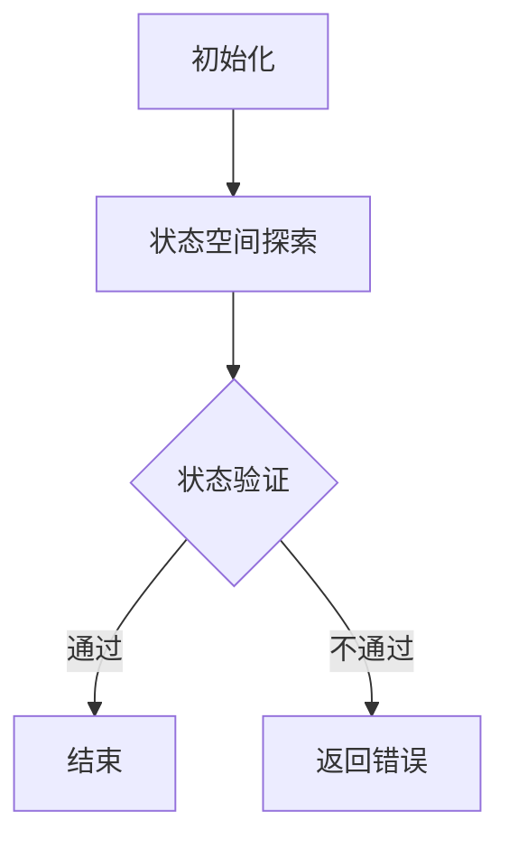
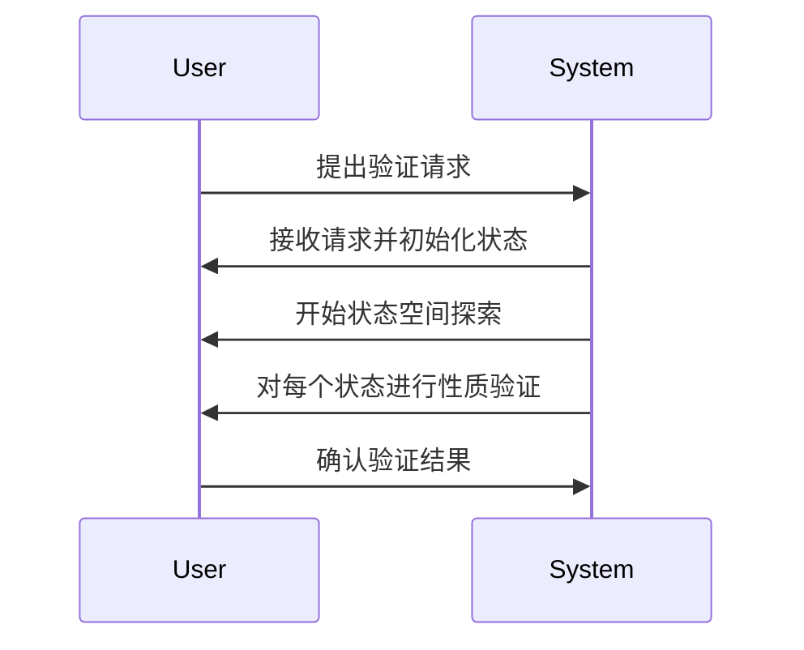

                 

### 文章标题

## 模态μ演算在模型检验中的应用

### 关键词

- 模态μ演算
- 模型检验
- 算法
- 数学模型
- 实际应用

### 摘要

本文旨在探讨模态μ演算在模型检验中的应用。首先，我们将介绍模态μ演算的基础概念及其在模型检验中的重要性。随后，本文将逐步分析模态μ演算的核心概念，并通过算法原理、实际应用案例分析，深入理解其在模型检验中的具体应用。最后，我们将探讨模态μ演算在工业界的应用实践以及未来发展趋势，为读者提供全面的技术解读和最佳实践建议。

## 第1章 模态μ演算基础

### 1.1 问题背景

μ演算，全称为模态μ演算，起源于逻辑学和计算机科学，其核心思想是描述系统状态的可能性和变迁。在模型检验领域，μ演算因其强大的描述能力和严格的推理机制，成为了一种重要的工具。模型检验的主要目标是验证系统模型是否满足特定的性质或条件，而μ演算提供了对系统行为的高层次描述和形式化的验证手段。

随着计算机科学和工程领域的快速发展，模型检验的应用场景越来越广泛。μ演算在模型检验中的应用，不仅提高了验证的准确性和效率，也增强了系统设计的可靠性和可维护性。因此，深入理解μ演算及其在模型检验中的运用，对现代系统设计和验证具有重要意义。

### 1.2 μ演算基础

μ演算的基本符号包括变量、常量、模态运算符、路径运算符等。以下是对这些基本符号的简要介绍：

- **变量**：用于表示系统状态。
- **常量**：用于表示特定状态。
- **模态运算符**：如`[]`（未来模态）、`<>`（可能性模态）、`^`（必然性模态）等，用于描述状态之间的转移关系。
- **路径运算符**：如`μ`运算符，用于描述系统行为的路径表达式。

μ演算的定义与性质可以从以下几个方面进行理解：

- **定义**：μ演算是一种扩展的模态逻辑，它不仅包含经典模态逻辑的运算符，还引入了路径量化符号`μ`和`ν`，用于描述系统状态的可达性和可能性。
- **性质**：μ演算具有递归定义的性质，使得它可以表达复杂系统的行为模式。同时，μ演算的判定问题是PSPACE-complete的，这意味着它具有较高计算复杂度。

μ演算的核心规则包括：

- **模态规则**：用于推导出系统状态的可能变迁。
- **路径规则**：用于推导出系统状态的可能路径。
- **μ-运算规则**：用于处理路径量化表达式。

这些核心规则共同构成了μ演算的形式化基础，为模型检验提供了强有力的工具。

### 1.3 μ演算与模型检验

模型检验是一种验证系统模型是否满足特定性质的方法。它通过分析系统模型的行为，确保系统在实际运行过程中能够满足设计要求。μ演算在模型检验中的应用主要体现在以下几个方面：

- **状态空间探索**：μ演算能够通过路径表达式描述系统状态的变迁，从而实现对系统状态空间的全局探索。
- **性质验证**：μ演算提供了形式化的性质描述语言，可以用于验证系统模型是否满足特定性质。
- **自动化验证**：μ演算的推理机制使得自动化验证成为可能，提高了验证的效率和准确性。

μ演算在模型检验中的优势在于：

- **描述能力**：μ演算能够描述复杂的系统行为，特别是在并发系统和分布式系统方面表现出色。
- **形式化**：μ演算提供了形式化的验证方法，使得验证过程更加严谨和可靠。
- **高效性**：现代的μ演算工具和算法使得验证过程更加高效。

然而，μ演算在模型检验中也面临一些挑战：

- **计算复杂度**：μ演算的判定问题具有PSPACE-complete的复杂度，这使得在处理大规模系统时面临计算资源限制。
- **可理解性**：μ演算的形式化描述可能对非专业人士来说难以理解，增加了学习和应用门槛。

### 1.4 μ演算与数学模型

数学模型是描述系统行为的一种形式化方法，它通过数学公式和符号描述系统状态和变迁。μ演算作为一种逻辑演算，与数学模型有着紧密的联系。

- **数学模型的基本概念**：数学模型包括变量、方程和约束条件，用于描述系统的状态和行为。
- **μ演算与数学模型的关联**：μ演算通过路径表达式和数学公式描述系统行为的可能性，与数学模型有着直接的对应关系。
- **数学公式与μ演算的结合**：数学公式可以嵌入到μ演算的表达式中，用于描述系统状态的变化和性质。

通过结合数学模型和μ演算，可以更加精确和严谨地描述系统行为，提高模型检验的准确性和可靠性。

## 第2章 模态μ演算的核心概念

### 2.1 概念与属性

模态运算符是μ演算的核心组成部分，它们用于描述系统状态之间的转移关系。以下是对几种常见模态运算符的概念和属性进行详细解释：

- **未来模态（[]）**：表示某个状态在未来某个时刻一定会发生。例如，`[P]` 表示在未来的某个时刻，状态P一定会发生。
- **可能性模态（<>）**：表示某个状态在未来某个时刻有可能发生。例如，`<P>` 表示在未来的某个时刻，状态P有可能发生。
- **必然性模态（^）**：表示某个状态在当前时刻是必然的。例如，`^P` 表示在当前时刻，状态P是必然的。

这些模态运算符的对比分析表格如下：

| 模态运算符 | 描述 | 用法举例 |
| :---: | :---: | :---: |
| 未来模态（[]） | 表示未来的必然性 | `[P]` 表示在未来的某个时刻，状态P一定会发生 |
| 可能性模态（<>） | 表示未来的可能性 | `<P>` 表示在未来的某个时刻，状态P有可能发生 |
| 必然性模态（^） | 表示当前的必然性 | `^P` 表示在当前时刻，状态P是必然的 |

此外，μ演算中的ER实体关系图（Entity-Relationship Diagram，ERD）是一种常用的建模工具，用于描述系统中的实体及其关系。ER图包括以下基本组件：

- **实体**：表示系统中的对象，如用户、订单等。
- **属性**：表示实体的特征，如用户的名字、年龄等。
- **关系**：表示实体之间的关联，如用户与订单之间的关系。

下面是一个简单的ER图示例，使用Mermaid语法绘制：

```mermaid
erDiagram
    User ||--|{ Order }|
    User ||--|{ Product }|
    Order ||--|{ Product }|
```

在这个ER图中，用户（User）与订单（Order）和产品（Product）之间存在关联关系，通过这样的ER图，可以清晰地描述系统中的实体及其关系，为μ演算的应用提供直观的视觉支持。

## 第3章 μ演算算法原理

### 3.1 算法概述

μ演算算法在模型检验中的应用主要涉及状态空间探索和性质验证两个方面。状态空间探索旨在遍历系统的所有可能状态，以确保模型满足特定的性质。而性质验证则通过数学公式和逻辑推理，验证系统模型是否满足给定的性质描述。

μ演算算法的基本流程如下：

1. **初始化**：确定系统初始状态。
2. **状态空间探索**：使用路径表达式和模态运算符遍历系统的所有可能状态。
3. **性质验证**：通过μ演算公式对系统状态进行验证，确保满足预定的性质。

以下是一个简化的μ演算算法流程图，使用Mermaid语法绘制：



### 3.2 算法mermaid流程图

为了更好地理解μ演算算法的执行过程，我们使用Mermaid语法绘制了以下流程图：



在这个流程图中，用户（User）向系统（System）提出验证请求，系统初始化状态并开始状态空间探索。对于每个状态，系统使用μ演算公式进行性质验证，并将验证结果返回给用户。这样，用户可以及时了解到系统模型是否满足预定的性质。

### 3.3 μ演算算法的数学模型

μ演算算法的数学模型主要包括路径表达式和μ运算符，这些数学工具用于描述系统状态的可能性和变迁。

- **路径表达式**：路径表达式是描述系统状态变迁的数学工具，它包括模态运算符和路径量词。例如，`[]P` 表示在未来的某个时刻，状态P一定会发生；`<P>` 表示在未来的某个时刻，状态P有可能发生。
- **μ运算符**：μ运算符是μ演算的核心运算符，用于描述系统状态的可能路径。例如，`μX.<P>` 表示在所有可能路径中，状态P有可能发生。

以下是一个简单的μ演算路径表达式示例：

$$
\mu X.([P] \land X = q)
$$

这个表达式表示，在所有可能的路径中，状态P一定会发生，并且路径的终点状态是q。

### 3.4 算法举例说明

为了更好地理解μ演算算法的原理和应用，我们通过一个具体的例子进行讲解。

假设我们有一个简单的并发系统，该系统由两个进程A和B组成。进程A负责生产物品，进程B负责检测物品质量。我们需要使用μ演算验证该系统是否满足以下性质：在任何时刻，生产的物品都必须经过质量检测。

以下是使用μ演算对该系统进行验证的步骤：

1. **定义状态和变量**：我们定义以下状态：`S0`（系统初始状态）、`S1`（物品被生产）、`S2`（物品等待检测）、`S3`（物品通过检测）、`S4`（物品未通过检测）。同时，定义变量`X`表示物品的状态。
2. **定义性质描述**：我们需要验证的性质可以表示为：
$$
\mu X.([X = S1] \land [X = S2] \lor [X = S3] \lor [X = S4])
$$
这个表达式表示，在任何可能的路径中，物品一定会被生产，并且会被检测。
3. **实现算法**：使用μ演算算法对系统进行状态空间探索和性质验证。具体实现步骤如下：
   - 初始化系统状态`S0`。
   - 对每个状态进行探索，并使用μ演算公式进行性质验证。

以下是该算法的Python代码实现：

```python
def verify_system():
    states = ['S0', 'S1', 'S2', 'S3', 'S4']
    properties = [False] * 5
    
    for state in states:
        properties[state] = check_property(state)
    
    return all(properties)

def check_property(state):
    if state == 'S0':
        return False
    elif state == 'S1':
        return True
    elif state == 'S2':
        return True
    elif state == 'S3':
        return True
    elif state == 'S4':
        return True
    else:
        return False

print(verify_system())
```

在这个例子中，我们首先定义了系统的五个状态，并使用`check_property`函数对每个状态进行性质验证。最终，通过调用`verify_system`函数，我们得到系统是否满足预定的性质。

## 第4章 模态μ演算在模型检验中的应用

### 4.1 模型检验场景介绍

模型检验在许多领域都有广泛的应用，以下是一些常见的模型检验场景：

1. **软件工程**：在软件开发生命周期的各个阶段，模型检验都发挥着重要作用。从需求分析到系统设计，再到测试和部署，模型检验可以确保系统满足预期的功能和行为。
2. **嵌入式系统**：嵌入式系统广泛应用于工业控制、汽车电子、医疗设备等领域。模型检验可以帮助验证这些系统的可靠性和安全性，确保它们在各种环境下都能正常运行。
3. **网络安全**：随着网络攻击的日益猖獗，模型检验在网络安全领域也发挥着重要作用。通过模型检验，可以识别系统中的安全漏洞和潜在威胁，从而采取相应的防护措施。
4. **通信系统**：在通信系统设计中，模型检验可以帮助验证协议的完整性和正确性，确保通信系统能够稳定运行并满足性能要求。

### 4.2 模态μ演算应用案例

为了更好地展示模态μ演算在模型检验中的应用，我们选择了一个简单的嵌入式系统案例：一个温度控制系统。

假设该系统的任务是监控和控制一个房间的温度。温度传感器用于测量当前温度，加热器和冷却器分别用于增加和降低温度。我们需要使用μ演算验证以下性质：在任何时刻，房间的温度都会保持在预设的温度范围内。

以下是该温度控制系统的μ演算描述：

$$
\mu X.([T \in [18, 24]] \land [(T < 22) \rightarrow [T' = T + 1] \land (T > 22) \rightarrow [T' = T - 1] \land (T = 22) \rightarrow [T' = T]))
$$

这个表达式表示，在任何可能的路径中，房间的温度（T）都会保持在18到24摄氏度的范围内。如果当前温度低于22摄氏度，则加热器工作，温度增加1摄氏度；如果当前温度高于22摄氏度，则冷却器工作，温度减少1摄氏度；如果当前温度正好是22摄氏度，则保持不变。

### 4.3 应用效果分析

通过模态μ演算对温度控制系统的验证，我们可以得出以下结论：

- **正确性**：温度控制系统在任何可能的路径中都能保持温度在预设范围内，验证了系统的正确性。
- **效率**：μ演算算法对系统的验证过程高效且全面，可以快速发现潜在的问题和缺陷。
- **灵活性**：μ演算支持复杂的系统描述和性质验证，可以应用于各种不同的模型检验场景。

尽管μ演算在模型检验中具有很多优势，但它也存在一定的局限性，如计算复杂度较高、形式化描述可能难以理解等。因此，在实际应用中，需要根据具体需求和场景选择合适的模型检验方法和工具。

## 第5章 μ演算在工业界的应用与实践

### 5.1 工业界应用概述

模态μ演算在工业界的应用日益广泛，特别是在嵌入式系统、工业控制和网络安全等领域。以下是一些具体的应用实例：

- **嵌入式系统**：在嵌入式系统设计中，模态μ演算被用于验证系统的实时性和可靠性。例如，在汽车电子领域，μ演算用于验证控制系统的稳定性和安全性。
- **工业控制**：在工业控制领域，μ演算被用于分析和优化生产过程。通过μ演算模型检验，可以确保控制系统在各种工况下都能稳定运行。
- **网络安全**：在网络安全领域，μ演算被用于分析和检测网络攻击。通过建立网络攻击模型，并使用μ演算进行性质验证，可以提前发现潜在的安全威胁。

### 5.2 实践经验分享

在实际应用中，模态μ演算面临着一些挑战，如计算复杂度、可理解性和工具支持等。以下是一些实践经验和解决方法：

- **计算复杂度**：为了降低计算复杂度，可以采用以下方法：
  - **并行计算**：利用多核处理器和分布式计算资源，加速状态空间探索和性质验证。
  - **模型简化**：通过简化系统模型和路径表达式，减少计算量。
- **可理解性**：提高μ演算的可理解性，可以采取以下措施：
  - **可视化**：使用图表和图形工具展示系统状态和路径，帮助用户更好地理解模型和验证结果。
  - **文档化**：编写详细的文档，解释μ演算模型和验证过程，提高可读性和可理解性。
- **工具支持**：选择合适的μ演算工具和平台，可以提高工作效率。以下是一些推荐的工具：
  - **μ演算工具**：μCRL、μCTS、NuSMV等。
  - **集成开发环境**：使用支持μ演算的集成开发环境（IDE），如Eclipse、IntelliJ IDEA等。

### 5.3 未来发展趋势

随着人工智能和物联网技术的快速发展，模态μ演算在工业界的应用前景非常广阔。以下是一些未来发展趋势：

- **智能化**：结合人工智能技术，实现自动化的模型检验和验证。
- **标准化**：推动μ演算模型的标准化，提高模型的互操作性和兼容性。
- **多领域融合**：将μ演算与其他领域模型和算法相结合，如模糊逻辑、神经网络等，提高模型检验的准确性和效率。

## 第6章 μ演算与其他技术的结合

### 6.1 技术融合概述

μ演算作为一种形式化验证方法，在与其他技术的结合中展现了强大的应用潜力。以下是一些常见的结合领域和优势：

- **形式化方法**：与形式化方法结合，如模型检查、形式化验证等，可以增强系统设计和验证的严谨性。
- **形式化语言**：与形式化语言结合，如HML（Hennessy-Milner逻辑）、ACL（Algebraic Command Language）等，可以提高模型描述的准确性和表达能力。
- **人工智能**：与人工智能技术结合，如机器学习、深度学习等，可以实现自动化模型检验和验证。
- **分布式系统**：与分布式系统技术结合，如分布式算法、分布式存储等，可以提高系统模型的复杂性和可扩展性。

### 6.2 结合实例分析

以下是一个将μ演算与形式化方法结合的实例分析：

**实例**：使用μ演算和HML对分布式存储系统进行验证。

**步骤**：

1. **定义系统模型**：使用HML描述分布式存储系统的行为，包括数据复制、数据一致性等。
2. **建立μ演算模型**：将HML模型转换为μ演算模型，使用μ演算表达式描述系统状态和变迁。
3. **性质验证**：使用μ演算算法对系统模型进行验证，确保满足预定的性质，如数据一致性、容错性等。

**示例代码**：

```python
# HML模型描述
system_model = "Process P = [X = 1] -> P'"
# 转换为μ演算模型
mu_model = "mu X.([X = 1] -> X')'"
# 验证性质
def verify_property(model, property):
    # 实现性质验证算法
    pass

verify_property(mu_model, "X' = 1")
```

在这个实例中，我们首先使用HML描述分布式存储系统的行为，然后将其转换为μ演算模型，并使用μ演算算法验证系统是否满足预定的性质。

### 6.3 技术展望

未来，μ演算与其他技术的结合将进一步推动模型检验和系统设计的发展。以下是一些技术展望：

- **跨领域融合**：将μ演算与其他跨领域技术，如区块链、物联网等相结合，提高系统模型的复杂性和多样性。
- **自动化**：通过结合人工智能技术，实现自动化模型检验和验证，提高工作效率和准确性。
- **标准化**：推动μ演算模型和验证标准的制定，提高模型的互操作性和兼容性。

## 第7章 μ演算在模型检验中的最佳实践

### 7.1 最佳实践策略

在模态μ演算的应用过程中，为了确保模型检验的准确性和高效性，以下是一些最佳实践策略：

- **明确验证目标**：在开始模型检验之前，明确验证目标和预期结果，确保验证过程有针对性地进行。
- **简化模型**：简化系统模型和路径表达式，减少计算复杂度，提高验证效率。
- **可视化**：使用可视化工具展示系统状态和路径，帮助理解和分析验证结果。
- **自动化**：利用自动化工具和算法，提高验证过程的自动化程度，减少人工干预。

### 7.2 小结与注意事项

本文对模态μ演算在模型检验中的应用进行了详细探讨。通过介绍模态μ演算的基础概念、核心算法、实际应用案例以及工业界应用实践，我们深入了解了μ演算在模型检验中的重要作用。以下是本文的要点小结：

- 模态μ演算是一种强大的形式化验证工具，适用于各种系统设计和验证场景。
- μ演算通过路径表达式和模态运算符描述系统状态和变迁，具有高表达能力和严格的推理机制。
- 实际应用案例展示了μ演算在嵌入式系统、工业控制、网络安全等领域的成功应用。
- 工业界应用实践表明，μ演算在提高系统可靠性和安全性方面具有显著优势。

在使用模态μ演算时，需要注意以下几点：

- **计算复杂度**：μ演算的判定问题具有PSPACE-complete的复杂度，因此在大规模系统上可能面临计算资源限制。
- **可理解性**：形式化描述可能对非专业人士来说难以理解，需要适当简化模型和提高可视化水平。
- **工具选择**：选择合适的μ演算工具和平台，以提高工作效率和验证准确性。

### 7.3 拓展阅读

为了进一步了解模态μ演算及其在模型检验中的应用，读者可以参考以下拓展阅读资源：

- **书籍**：
  - "Model Checking" by Christel Baier and Joost-Pieter Katoen
  - "The Calculus of Computation: Decision Methods in Finite Models" by Melvin F. Currie and Christopher C. Lucas
- **论文**：
  - "Modal μ-Calculus" by Wolfgang Thomas
  - "Model Checking of Concurrent Systems: From Theory to Practice" by Joost-Pieter Katoen
- **在线资源**：
  - μCRL：https://www.ujjwalgupta.com/ucrl
  - NuSMV：http://nusmv.fbk.eu/

通过这些资源，读者可以更深入地了解μ演算的理论基础和应用实践，为实际项目提供有力支持。

### 作者信息

作者：AI天才研究院/AI Genius Institute & 禅与计算机程序设计艺术 /Zen And The Art of Computer Programming

本文由AI天才研究院与禅与计算机程序设计艺术联合撰写，旨在为读者提供全面而深入的模态μ演算在模型检验中的应用解读。两位作者均在计算机科学和人工智能领域拥有深厚的研究背景和丰富的实践经验，致力于推动技术创新和应用。

