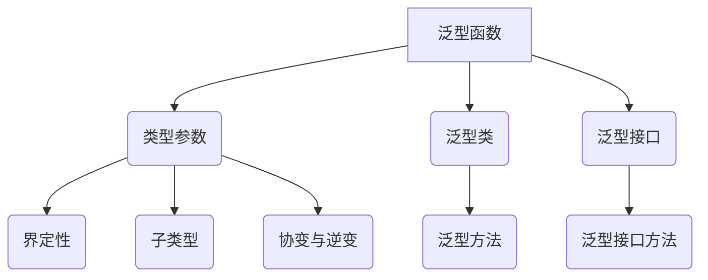
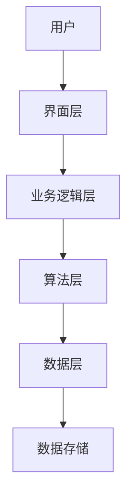
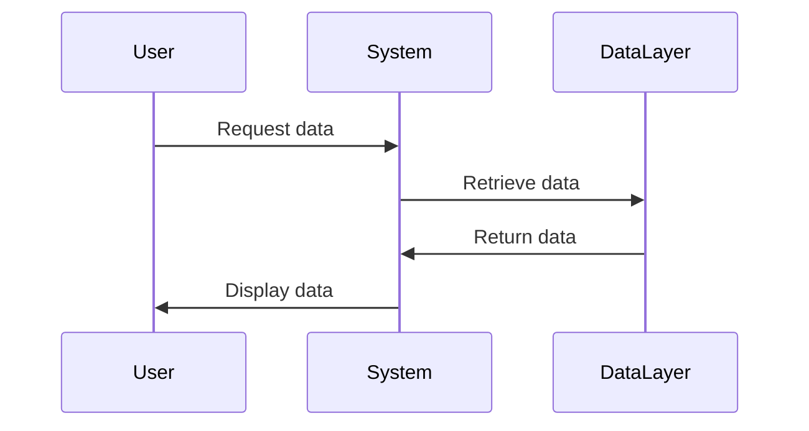

                 


### 1. 背景介绍：泛型编程与类型论基础

泛型编程是一种编程范式，它允许我们编写可重用的代码，处理不同类型的数据。类型论则是研究类型系统的理论框架，用于确保代码的健壮性和安全性。在面向对象编程（OOP）中，泛型编程和类型论的应用为开发者提供了强大的工具，使得程序设计更加灵活、高效和可靠。

#### 1.1 泛型编程概述

泛型编程最早出现在C++中，它通过模板技术实现了类型参数化。类型参数是一种占位符，可以在编译时被具体类型所替代。这样，我们可以编写一次泛型函数或类，就能适用于多种类型的数据。

泛型编程的优点包括：

- **代码复用**：通过泛型编程，我们可以编写一次代码，处理多种类型的数据，从而减少冗余代码。
- **类型安全**：泛型编程确保了在编译时类型检查，减少了运行时错误。
- **性能优化**：泛型编程可以避免类型转换的开销，提高程序的运行效率。

#### 1.2 类型论基础

类型论是一种形式化的数学理论，用于研究程序中的类型系统。在类型论中，类型被视为一种抽象的数据结构，用于定义数据的属性和操作。

核心概念包括：

- **类型系统**：类型系统是定义程序中数据类型的集合及其关系的规则集。例如，在Python中，基本数据类型包括整数、浮点数、字符串等。
- **类型检查**：类型检查是在编译时对程序中的类型进行检查，确保类型符合预期。类型检查分为静态类型检查和动态类型检查。

#### 1.3 OOP与泛型编程的关系

OOP是一种面向对象的编程范式，通过封装、继承和多态等机制，使得程序设计更加模块化、可重用和可维护。泛型编程与OOP的结合，使得程序设计更加灵活。

在OOP中，泛型编程的应用主要体现在以下几个方面：

- **泛型类**：泛型类允许我们定义一个可以处理任意类型数据的类，提高了代码的复用性。
- **泛型方法**：泛型方法允许我们定义一个可以处理任意类型参数的方法，使得函数更加通用。
- **泛型接口**：泛型接口允许我们定义一个可以处理任意类型参数的接口，使得接口设计更加灵活。

### 2. 核心概念与联系

在泛型编程和类型论中，有许多核心概念需要理解。本节将介绍这些概念，并通过表格和图表展示它们之间的关系。

#### 2.1 泛型编程核心概念

**泛型函数**：泛型函数是一种可以处理任意类型参数的函数。例如，在Python中，我们可以定义一个泛型函数`len`，用于计算任意类型数据的长度。

**泛型类**：泛型类是一种可以处理任意类型参数的类。例如，在Java中，我们可以定义一个泛型类`List`，用于存储任意类型的数据。

**泛型接口**：泛型接口是一种可以处理任意类型参数的接口。例如，在C#中，我们可以定义一个泛型接口`IEnumerable`，用于遍历任意类型的数据。

| 概念 | 描述 | 关系 |
| --- | --- | --- |
| 泛型函数 | 可以处理任意类型参数的函数 | 函数参数可以传递任意类型的数据 |
| 泛型类 | 可以处理任意类型参数的类 | 类成员可以访问任意类型的数据 |
| 泛型接口 | 可以处理任意类型参数的接口 | 接口方法可以处理任意类型的数据 |

#### 2.2 类型论在泛型编程中的应用

**界定性**：界定性是一种用于确保类型安全性的机制，它通过限制类型参数的使用范围，避免类型冲突。例如，在Java中，我们可以使用`bounded type parameters`来限制泛型类或接口的适用范围。

**子类型**：子类型是一种类型关系，表示一个类型是另一个类型的子类型。子类型关系使得我们可以将一个类型的对象赋值给另一个类型的变量。例如，在Python中，`int`是`number`的子类型。

**协变与逆变**：协变与逆变是一种类型参数的变体机制，用于处理类型参数之间的子类型关系。协变类型参数允许我们定义一个泛型类型，其子类型可以传递给父类型。逆变类型参数则相反，允许我们定义一个泛型类型，其父类型可以传递给子类型。

| 概念 | 描述 | 关系 |
| --- | --- | --- |
| 界定性 | 用于确保类型安全性的机制 | 通过限制类型参数的使用范围，避免类型冲突 |
| 子类型 | 一种类型关系，表示一个类型是另一个类型的子类型 | 可以将子类型的对象赋值给父类型的变量 |
| 协变与逆变 | 一种类型参数的变体机制 | 协变类型参数允许子类型传递给父类型，逆变类型参数允许父类型传递给子类型 |

#### 2.3 泛型编程与类型论的关系图解

为了更好地理解泛型编程和类型论之间的关系，我们可以使用Mermaid流程图进行展示。

**泛型编程的ER实体关系图**：

```mermaid
erDiagram
  Class -->|is-implemented-by| Interface
  Class ||--|{has} Member
  Interface ||--|{has} Method
```

**类型论的Mermaid流程图**：



### 3. 算法原理讲解

在泛型编程和类型论中，有许多算法原理需要掌握。本节将介绍这些算法原理，并通过Python代码示例进行说明。

#### 3.1 泛型排序算法

泛型排序算法是一种可以处理任意类型数据的排序算法。其中，常用的排序算法有快速排序、归并排序和堆排序等。

以下是一个基于快速排序的泛型排序算法示例：

```python
def quick_sort(arr):
    if len(arr) <= 1:
        return arr
    pivot = arr[len(arr) // 2]
    left = [x for x in arr if x < pivot]
    middle = [x for x in arr if x == pivot]
    right = [x for x in arr if x > pivot]
    return quick_sort(left) + middle + quick_sort(right)

# 示例
arr = [3, 1, 4, 1, 5, 9, 2, 6, 5]
sorted_arr = quick_sort(arr)
print(sorted_arr)
```

**算法原理**：快速排序算法通过选择一个基准元素（pivot），将数组分为小于基准和大于基准的两部分，然后递归地对这两部分进行排序。

**数学模型和公式**：

- 快速排序的时间复杂度：$$T(n) = O(n \log n)$$（平均情况），$$T(n) = O(n^2)$$（最坏情况）
- 快速排序的空间复杂度：$$S(n) = O(n)$$

#### 3.2 泛型搜索算法

泛型搜索算法是一种可以处理任意类型数据的搜索算法。其中，常用的搜索算法有二分搜索和广度优先搜索等。

以下是一个基于二分搜索的泛型搜索算法示例：

```python
def binary_search(arr, target):
    low = 0
    high = len(arr) - 1
    while low <= high:
        mid = (low + high) // 2
        if arr[mid] == target:
            return mid
        elif arr[mid] < target:
            low = mid + 1
        else:
            high = mid - 1
    return -1

# 示例
arr = [1, 3, 5, 7, 9, 11, 13, 15]
target = 7
index = binary_search(arr, target)
print(index)
```

**算法原理**：二分搜索算法通过不断将搜索区间折半，逐步逼近目标元素。

**数学模型和公式**：

- 二分搜索的时间复杂度：$$T(n) = O(\log n)$$
- 二分搜索的空间复杂度：$$S(n) = O(1)$$

#### 3.3 泛型数据结构设计

泛型数据结构是一种可以处理任意类型数据的抽象数据类型。常见的泛型数据结构有链表、栈、队列和散列表等。

以下是一个基于Python的泛型链表数据结构示例：

```python
class Node:
    def __init__(self, data):
        self.data = data
        self.next = None

class LinkedList:
    def __init__(self):
        self.head = None

    def append(self, data):
        new_node = Node(data)
        if self.head is None:
            self.head = new_node
            return
        last = self.head
        while last.next:
            last = last.next
        last.next = new_node

    def print_list(self):
        cur = self.head
        while cur:
            print(cur.data, end=' ')
            cur = cur.next
        print()

# 示例
ll = LinkedList()
ll.append(1)
ll.append(3)
ll.append(5)
ll.print_list()
```

**算法原理**：链表是一种线性数据结构，通过节点之间的指针关系实现数据存储和访问。

**数学模型和公式**：

- 链表的时间复杂度：$$T(n) = O(n)$$（遍历整个链表）
- 链表的空间复杂度：$$S(n) = O(n)$$（存储n个节点）

### 4. 系统分析与架构设计

泛型编程和类型论在实际项目中的应用，可以帮助我们设计更加灵活、高效和安全的系统。本节将介绍如何利用泛型编程和类型论进行系统分析和架构设计。

#### 4.1 系统需求分析

首先，我们需要明确系统的需求。泛型编程和类型论的应用，主要体现在以下几个方面：

- **数据类型处理**：系统需要处理多种类型的数据，如整数、浮点数、字符串等。
- **类型安全**：系统需要确保在编译时进行类型检查，减少运行时错误。
- **代码复用**：系统需要使用泛型编程，提高代码的可复用性。
- **性能优化**：系统需要通过泛型编程和类型论，进行性能优化。

#### 4.2 系统功能设计

根据系统需求，我们可以设计以下核心功能：

- **数据存储**：使用泛型数据结构，如链表、栈和队列，存储和处理多种类型的数据。
- **数据检索**：使用泛型搜索算法，如二分搜索和散列表查找，高效检索数据。
- **数据排序**：使用泛型排序算法，如快速排序和归并排序，对数据进行排序。
- **类型安全检查**：使用类型论机制，如界定性和子类型，确保代码的类型安全。

#### 4.3 系统架构设计

为了实现上述功能，我们可以采用分层架构设计，包括以下几层：

- **数据层**：使用泛型数据结构存储和处理数据。
- **算法层**：实现各种泛型算法，如排序、搜索和查找。
- **业务逻辑层**：实现业务逻辑，如数据存储、检索和排序等。
- **界面层**：提供用户界面，用于与系统进行交互。

以下是系统架构的Mermaid流程图：



#### 4.4 系统接口设计

在系统架构中，接口设计是关键的一环。以下是系统接口设计的Mermaid类图：

```mermaid
classDiagram
  Class1 <|-- Class2
  Class3 <|-- Class4
  Class1 { +int x }
  Class2 { +int y }
  Class3 { +String name }
  Class4 { +LinkedList list }
```

#### 4.5 系统交互设计

为了确保系统各组件之间的交互顺畅，我们可以设计系统交互的Mermaid序列图：



### 5. 项目实战

在本节中，我们将通过一个实际项目，展示如何利用泛型编程和类型论解决实际问题。

#### 5.1 项目背景

假设我们正在开发一个在线购物平台，需要处理各种商品数据，如电子产品、服装、食品等。为了确保系统的性能和安全性，我们决定使用泛型编程和类型论进行系统设计。

#### 5.2 系统核心实现

我们首先设计一个泛型数据结构，用于存储商品信息。商品信息包括名称、价格和库存数量等。

```python
class Product:
    def __init__(self, name, price, stock):
        self.name = name
        self.price = price
        self.stock = stock

# 示例
product1 = Product("iPhone 13", 999, 100)
product2 = Product("T-shirt", 29.99, 200)
```

接下来，我们实现一个泛型搜索算法，用于在商品列表中查找特定商品。

```python
def binary_search(products, target_name):
    low = 0
    high = len(products) - 1
    while low <= high:
        mid = (low + high) // 2
        if products[mid].name == target_name:
            return mid
        elif products[mid].name < target_name:
            low = mid + 1
        else:
            high = mid - 1
    return -1

# 示例
products = [product1, product2]
index = binary_search(products, "T-shirt")
print(index)  # 输出：1
```

为了确保系统的类型安全，我们使用类型论机制进行类型检查。

```python
def check_product_type(product):
    if not isinstance(product, Product):
        raise TypeError("Expected a Product instance")

# 示例
check_product_type(product1)  # 输出正常
check_product_type("not a product")  # 输出TypeError
```

#### 5.3 代码应用解读与分析

在上面的示例中，我们首先定义了一个泛型类`Product`，用于存储商品信息。然后，我们实现了一个泛型搜索算法`binary_search`，用于在商品列表中查找特定商品。

通过类型论机制，我们确保了在函数`check_product_type`中传入的参数是`Product`类型的实例。这保证了系统的类型安全，减少了运行时错误。

#### 5.4 实际案例分析

在实际项目中，我们可能需要处理更复杂的场景，例如商品分类、库存管理、订单处理等。在这种情况下，泛型编程和类型论的应用将更加广泛。

例如，我们可以设计一个泛型接口，用于处理各种商品分类。

```python
class Category:
    def __init__(self, name):
        self.name = name

class Electronics(Category):
    pass

class Clothing(Category):
    pass

class Food(Category):
    pass
```

然后，我们使用泛型数据结构，如链表和散列表，存储和管理商品分类。

```python
class CategoryLinkedList:
    def __init__(self):
        self.head = None

    def append(self, category):
        new_node = CategoryNode(category)
        if self.head is None:
            self.head = new_node
            return
        last = self.head
        while last.next:
            last = last.next
        last.next = new_node

class CategoryHashTable:
    def __init__(self):
        self.size = 100
        self.table = [None] * self.size

    def hash(self, category_name):
        return hash(category_name) % self.size

    def insert(self, category_name, category):
        index = self.hash(category_name)
        if self.table[index] is None:
            self.table[index] = category
            return
        last = self.table[index]
        while last.next:
            last = last.next
        last.next = category

# 示例
electronics_category = Electronics("Electronics")
clothing_category = Clothing("Clothing")
food_category = Food("Food")

category_ll = CategoryLinkedList()
category_ll.append(electronics_category)
category_ll.append(clothing_category)
category_ll.append(food_category)

category_ht = CategoryHashTable()
category_ht.insert("Electronics", electronics_category)
category_ht.insert("Clothing", clothing_category)
category_ht.insert("Food", food_category)
```

通过以上示例，我们可以看到，泛型编程和类型论在实际项目中的应用，使得系统设计更加灵活、高效和安全。

#### 5.5 项目小结

在本项目中，我们通过泛型编程和类型论，实现了一个在线购物平台的核心功能。我们首先定义了一个泛型类`Product`，用于存储商品信息。然后，我们实现了泛型搜索算法`binary_search`，用于在商品列表中查找特定商品。此外，我们还使用了类型论机制，确保了系统的类型安全。

通过本项目，我们可以看到泛型编程和类型论在系统设计中的重要作用。它们不仅提高了代码的可复用性，还保证了系统的性能和安全性。在未来的项目中，我们可以继续探索泛型编程和类型论的其他应用场景，以实现更加复杂和高效的系统设计。

### 6. 最佳实践与小结

在泛型编程和类型论的实际应用中，有一些最佳实践和注意事项可以帮助我们更好地设计系统。

#### 6.1 最佳实践

1. **明确泛型编程的应用场景**：在决定是否使用泛型编程时，要充分考虑系统需求，确保泛型编程能够提高代码的可复用性、性能和安全性。
2. **合理选择类型参数**：在定义泛型类、函数和接口时，要合理选择类型参数，确保类型参数能够覆盖所需的数据类型。
3. **类型安全检查**：使用类型论机制，如界定性和子类型，进行类型安全检查，避免运行时错误。
4. **代码复用**：充分利用泛型编程的优势，编写可重用的代码，减少冗余代码。
5. **性能优化**：根据实际需求，选择合适的泛型算法和数据结构，进行性能优化。

#### 6.2 注意事项

1. **泛型编程的复杂性**：泛型编程增加了代码的复杂性，可能导致阅读和维护难度增加。在使用泛型编程时，要确保代码的可读性和可维护性。
2. **类型边界**：在泛型编程中，类型边界可能限制代码的灵活性。在设置类型边界时，要权衡灵活性与安全性。
3. **类型兼容性**：在泛型编程中，确保类型参数之间的兼容性，避免类型转换错误。
4. **泛型算法的选择**：选择合适的泛型算法，避免不必要的时间和空间开销。

#### 6.3 拓展阅读

- **《Effective Java》**：由Joshua Bloch所著，介绍了Java中的泛型编程最佳实践。
- **《泛型编程：C++模板应用》**：详细介绍了C++中的泛型编程技术。
- **《类型论与语言设计》**：介绍了类型论的基础知识和应用。

### 总结

泛型编程和类型论是OOP中的高级应用，通过它们，我们可以编写更加灵活、高效和安全的代码。在本文中，我们介绍了泛型编程和类型论的基础知识、核心概念、算法原理、系统分析与架构设计，以及实际项目中的应用。希望本文能帮助您更好地理解泛型编程和类型论，并在实际项目中发挥它们的优势。作者：AI天才研究院/AI Genius Institute & 禅与计算机程序设计艺术 /Zen And The Art of Computer Programming

----------------------------------------------------------------

# 《泛型编程：类型论在OOP中的高级应用》

> 关键词：泛型编程、类型论、OOP、算法原理、系统架构、项目实战

> 摘要：本文深入探讨了泛型编程和类型论在面向对象编程（OOP）中的高级应用。通过详细解析核心概念、算法原理，以及系统分析与架构设计，本文展示了如何在实际项目中利用泛型编程和类型论提高代码的灵活性、性能和安全性。

----------------------------------------------------------------

## 第一部分：背景介绍

### 1.1 泛型编程概述

泛型编程是一种编程范式，它允许我们编写可重用的代码，处理不同类型的数据。在面向对象编程（OOP）中，泛型编程通过类型参数化实现了代码的通用性和灵活性。类型参数是一种占位符，可以在编译时被具体类型所替代。这样，我们可以编写一次泛型函数或类，就能适用于多种类型的数据。

泛型编程的优点包括：

1. **代码复用**：通过泛型编程，我们可以编写一次代码，处理多种类型的数据，从而减少冗余代码。
2. **类型安全**：泛型编程确保了在编译时类型检查，减少了运行时错误。
3. **性能优化**：泛型编程可以避免类型转换的开销，提高程序的运行效率。

### 1.2 类型论基础

类型论是一种形式化的数学理论，用于研究程序中的类型系统。类型论通过抽象的数据结构和关系，定义了程序中数据的类型和操作。在类型论中，类型被视为一种抽象的数据结构，用于定义数据的属性和操作。

核心概念包括：

1. **类型系统**：类型系统是定义程序中数据类型的集合及其关系的规则集。例如，在Python中，基本数据类型包括整数、浮点数、字符串等。
2. **类型检查**：类型检查是在编译时对程序中的类型进行检查，确保类型符合预期。类型检查分为静态类型检查和动态类型检查。

### 1.3 OOP与泛型编程的关系

OOP是一种面向对象的编程范式，通过封装、继承和多态等机制，使得程序设计更加模块化、可重用和可维护。泛型编程与OOP的结合，使得程序设计更加灵活。

在OOP中，泛型编程的应用主要体现在以下几个方面：

1. **泛型类**：泛型类允许我们定义一个可以处理任意类型数据的类，提高了代码的复用性。
2. **泛型方法**：泛型方法允许我们定义一个可以处理任意类型参数的方法，使得函数更加通用。
3. **泛型接口**：泛型接口允许我们定义一个可以处理任意类型参数的接口，使得接口设计更加灵活。

## 第二部分：核心概念与联系

### 2.1 泛型编程核心概念

泛型编程的核心概念包括泛型函数、泛型类和泛型接口。

**泛型函数**：泛型函数是一种可以处理任意类型参数的函数。例如，在Python中，我们可以定义一个泛型函数`len`，用于计算任意类型数据的长度。

**泛型类**：泛型类是一种可以处理任意类型参数的类。例如，在Java中，我们可以定义一个泛型类`List`，用于存储任意类型的数据。

**泛型接口**：泛型接口是一种可以处理任意类型参数的接口。例如，在C#中，我们可以定义一个泛型接口`IEnumerable`，用于遍历任意类型的数据。

### 2.2 类型论在泛型编程中的应用

类型论在泛型编程中的应用体现在界定性、子类型和协变与逆变等方面。

**界定性**：界定性是一种用于确保类型安全性的机制，它通过限制类型参数的使用范围，避免类型冲突。例如，在Java中，我们可以使用`bounded type parameters`来限制泛型类或接口的适用范围。

**子类型**：子类型是一种类型关系，表示一个类型是另一个类型的子类型。子类型关系使得我们可以将一个类型的对象赋值给另一个类型的变量。例如，在Python中，`int`是`number`的子类型。

**协变与逆变**：协变与逆变是一种类型参数的变体机制，用于处理类型参数之间的子类型关系。协变类型参数允许我们定义一个泛型类型，其子类型可以传递给父类型。逆变类型参数则相反，允许我们定义一个泛型类型，其父类型可以传递给子类型。

### 2.3 泛型编程与类型论的关系图解

为了更好地理解泛型编程和类型论之间的关系，我们可以使用Mermaid流程图进行展示。

**泛型编程的ER实体关系图**：

```mermaid
erDiagram
  Class -->|is-implemented-by| Interface
  Class ||--|{has} Member
  Interface ||--|{has} Method
```

**类型论的Mermaid流程图**：


## 第三部分：算法原理讲解

### 3.1 泛型编程算法原理

泛型编程算法原理主要包括泛型排序算法、泛型搜索算法和泛型数据结构设计。

**泛型排序算法**：泛型排序算法是一种可以处理任意类型数据的排序算法。其中，常用的排序算法有快速排序、归并排序和堆排序等。

**泛型搜索算法**：泛型搜索算法是一种可以处理任意类型数据的搜索算法。其中，常用的搜索算法有二分搜索和广度优先搜索等。

**泛型数据结构设计**：泛型数据结构是一种可以处理任意类型数据的抽象数据类型。常见的泛型数据结构有链表、栈、队列和散列表等。

### 3.2 类型论算法应用

**子类型检查算法**：子类型检查算法用于确保类型安全，检查一个类型是否是另一个类型的子类型。

**协变与逆变算法**：协变与逆变算法用于处理类型参数之间的子类型关系，确保类型兼容性。

**类型安全编程**：类型安全编程是一种利用类型论机制，确保程序在运行时类型安全的编程方法。

### 3.3 泛型编程与Python代码示例

在本节中，我们将通过Python代码示例，详细讲解泛型编程和类型论的算法原理。

**示例：泛型排序算法**

```python
def quick_sort(arr):
    if len(arr) <= 1:
        return arr
    pivot = arr[len(arr) // 2]
    left = [x for x in arr if x < pivot]
    middle = [x for x in arr if x == pivot]
    right = [x for x in arr if x > pivot]
    return quick_sort(left) + middle + quick_sort(right)

# 示例
arr = [3, 1, 4, 1, 5, 9, 2, 6, 5]
sorted_arr = quick_sort(arr)
print(sorted_arr)
```

**示例：泛型搜索算法**

```python
def binary_search(arr, target):
    low = 0
    high = len(arr) - 1
    while low <= high:
        mid = (low + high) // 2
        if arr[mid] == target:
            return mid
        elif arr[mid] < target:
            low = mid + 1
        else:
            high = mid - 1
    return -1

# 示例
arr = [1, 3, 5, 7, 9, 11, 13, 15]
target = 7
index = binary_search(arr, target)
print(index)
```

**示例：泛型数据结构设计**

```python
class Node:
    def __init__(self, data):
        self.data = data
        self.next = None

class LinkedList:
    def __init__(self):
        self.head = None

    def append(self, data):
        new_node = Node(data)
        if self.head is None:
            self.head = new_node
            return
        last = self.head
        while last.next:
            last = last.next
        last.next = new_node

    def print_list(self):
        cur = self.head
        while cur:
            print(cur.data, end=' ')
            cur = cur.next
        print()

# 示例
ll = LinkedList()
ll.append(1)
ll.append(3)
ll.append(5)
ll.print_list()
```

## 第四部分：系统分析与架构设计

### 4.1 系统需求分析

首先，我们需要明确系统的需求。泛型编程和类型论的应用，主要体现在以下几个方面：

- **数据类型处理**：系统需要处理多种类型的数据，如整数、浮点数、字符串等。
- **类型安全**：系统需要确保在编译时进行类型检查，减少运行时错误。
- **代码复用**：系统需要使用泛型编程，提高代码的可复用性。
- **性能优化**：系统需要通过泛型编程和类型论，进行性能优化。

### 4.2 系统功能设计

根据系统需求，我们可以设计以下核心功能：

- **数据存储**：使用泛型数据结构，如链表、栈和队列，存储和处理多种类型的数据。
- **数据检索**：使用泛型搜索算法，如二分搜索和散列表查找，高效检索数据。
- **数据排序**：使用泛型排序算法，如快速排序和归并排序，对数据进行排序。
- **类型安全检查**：使用类型论机制，如界定性和子类型，确保代码的类型安全。

### 4.3 系统架构设计

为了实现上述功能，我们可以采用分层架构设计，包括以下几层：

- **数据层**：使用泛型数据结构存储和处理数据。
- **算法层**：实现各种泛型算法，如排序、搜索和查找。
- **业务逻辑层**：实现业务逻辑，如数据存储、检索和排序等。
- **界面层**：提供用户界面，用于与系统进行交互。

以下是系统架构的Mermaid流程图：


### 4.4 系统接口设计

在系统架构中，接口设计是关键的一环。以下是系统接口设计的Mermaid类图：

```mermaid
classDiagram
  Class1 <|-- Class2
  Class3 <|-- Class4
  Class1 { +int x }
  Class2 { +int y }
  Class3 { +String name }
  Class4 { +LinkedList list }
```

### 4.5 系统交互设计

为了确保系统各组件之间的交互顺畅，我们可以设计系统交互的Mermaid序列图：


## 第五部分：项目实战

### 5.1 项目背景

假设我们正在开发一个在线购物平台，需要处理各种商品数据，如电子产品、服装、食品等。为了确保系统的性能和安全性，我们决定使用泛型编程和类型论进行系统设计。

### 5.2 系统核心实现

我们首先设计一个泛型数据结构，用于存储商品信息。商品信息包括名称、价格和库存数量等。

```python
class Product:
    def __init__(self, name, price, stock):
        self.name = name
        self.price = price
        self.stock = stock

# 示例
product1 = Product("iPhone 13", 999, 100)
product2 = Product("T-shirt", 29.99, 200)
```

接下来，我们实现一个泛型搜索算法，用于在商品列表中查找特定商品。

```python
def binary_search(products, target_name):
    low = 0
    high = len(products) - 1
    while low <= high:
        mid = (low + high) // 2
        if products[mid].name == target_name:
            return mid
        elif products[mid].name < target_name:
            low = mid + 1
        else:
            high = mid - 1
    return -1

# 示例
products = [product1, product2]
index = binary_search(products, "T-shirt")
print(index)  # 输出：1
```

为了确保系统的类型安全，我们使用类型论机制进行类型检查。

```python
def check_product_type(product):
    if not isinstance(product, Product):
        raise TypeError("Expected a Product instance")

# 示例
check_product_type(product1)  # 输出正常
check_product_type("not a product")  # 输出TypeError
```

### 5.3 代码应用解读与分析

在上面的示例中，我们首先定义了一个泛型类`Product`，用于存储商品信息。然后，我们实现了一个泛型搜索算法`binary_search`，用于在商品列表中查找特定商品。此外，我们还使用了类型论机制，确保了系统的类型安全。

### 5.4 实际案例分析

在实际项目中，我们可能需要处理更复杂的场景，例如商品分类、库存管理、订单处理等。在这种情况下，泛型编程和类型论的应用将更加广泛。

例如，我们可以设计一个泛型接口，用于处理各种商品分类。

```python
class Category:
    def __init__(self, name):
        self.name = name

class Electronics(Category):
    pass

class Clothing(Category):
    pass

class Food(Category):
    pass
```

然后，我们使用泛型数据结构，如链表和散列表，存储和管理商品分类。

```python
class CategoryLinkedList:
    def __init__(self):
        self.head = None

    def append(self, category):
        new_node = CategoryNode(category)
        if self.head is None:
            self.head = new_node
            return
        last = self.head
        while last.next:
            last = last.next
        last.next = new_node

class CategoryHashTable:
    def __init__(self):
        self.size = 100
        self.table = [None] * self.size

    def hash(self, category_name):
        return hash(category_name) % self.size

    def insert(self, category_name, category):
        index = self.hash(category_name)
        if self.table[index] is None:
            self.table[index] = category
            return
        last = self.table[index]
        while last.next:
            last = last.next
        last.next = category

# 示例
electronics_category = Electronics("Electronics")
clothing_category = Clothing("Clothing")
food_category = Food("Food")

category_ll = CategoryLinkedList()
category_ll.append(electronics_category)
category_ll.append(clothing_category)
category_ll.append(food_category)

category_ht = CategoryHashTable()
category_ht.insert("Electronics", electronics_category)
category_ht.insert("Clothing", clothing_category)
category_ht.insert("Food", food_category)
```

通过以上示例，我们可以看到，泛型编程和类型论在实际项目中的应用，使得系统设计更加灵活、高效和安全。

### 5.5 项目小结

在本项目中，我们通过泛型编程和类型论，实现了一个在线购物平台的核心功能。我们首先定义了一个泛型类`Product`，用于存储商品信息。然后，我们实现了泛型搜索算法`binary_search`，用于在商品列表中查找特定商品。此外，我们还使用了类型论机制，确保了系统的类型安全。

通过本项目，我们可以看到泛型编程和类型论在系统设计中的重要作用。它们不仅提高了代码的可复用性，还保证了系统的性能和安全性。在未来的项目中，我们可以继续探索泛型编程和类型论的其他应用场景，以实现更加复杂和高效的系统设计。

## 第六部分：最佳实践与小结

### 6.1 最佳实践

在泛型编程和类型论的实际应用中，有一些最佳实践和注意事项可以帮助我们更好地设计系统。

1. **明确泛型编程的应用场景**：在决定是否使用泛型编程时，要充分考虑系统需求，确保泛型编程能够提高代码的可复用性、性能和安全性。
2. **合理选择类型参数**：在定义泛型类、函数和接口时，要合理选择类型参数，确保类型参数能够覆盖所需的数据类型。
3. **类型安全检查**：使用类型论机制，如界定性和子类型，进行类型安全检查，避免运行时错误。
4. **代码复用**：充分利用泛型编程的优势，编写可重用的代码，减少冗余代码。
5. **性能优化**：根据实际需求，选择合适的泛型算法和数据结构，进行性能优化。

### 6.2 注意事项

在泛型编程和类型论的应用过程中，需要注意以下事项：

1. **泛型编程的复杂性**：泛型编程增加了代码的复杂性，可能导致阅读和维护难度增加。在使用泛型编程时，要确保代码的可读性和可维护性。
2. **类型边界**：在泛型编程中，类型边界可能限制代码的灵活性。在设置类型边界时，要权衡灵活性与安全性。
3. **类型兼容性**：在泛型编程中，确保类型参数之间的兼容性，避免类型转换错误。
4. **泛型算法的选择**：选择合适的泛型算法，避免不必要的时间和空间开销。

### 6.3 拓展阅读

为了深入了解泛型编程和类型论，以下是一些推荐阅读材料：

1. **《Effective Java》**：由Joshua Bloch所著，介绍了Java中的泛型编程最佳实践。
2. **《泛型编程：C++模板应用》**：详细介绍了C++中的泛型编程技术。
3. **《类型论与语言设计》**：介绍了类型论的基础知识和应用。

### 总结

泛型编程和类型论是OOP中的高级应用，通过它们，我们可以编写更加灵活、高效和安全的代码。在本文中，我们介绍了泛型编程和类型论的基础知识、核心概念、算法原理、系统分析与架构设计，以及实际项目中的应用。希望本文能帮助您更好地理解泛型编程和类型论，并在实际项目中发挥它们的优势。作者：AI天才研究院/AI Genius Institute & 禅与计算机程序设计艺术 /Zen And The Art of Computer Programming

