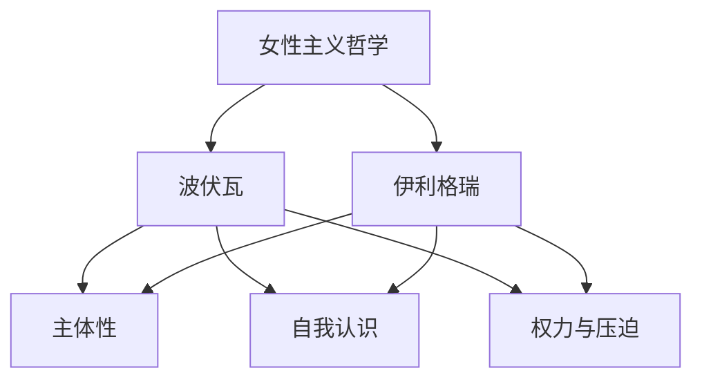
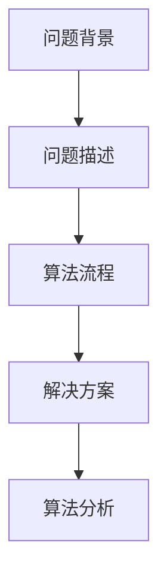
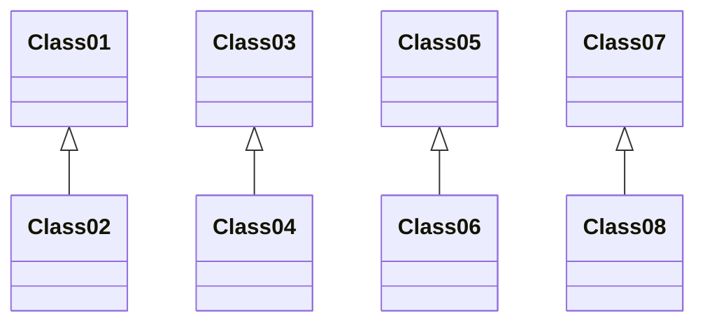
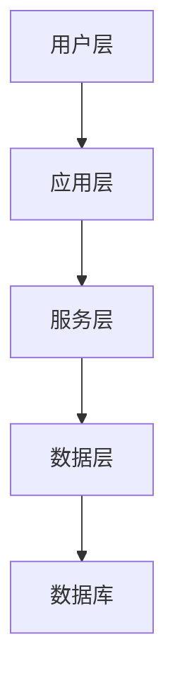
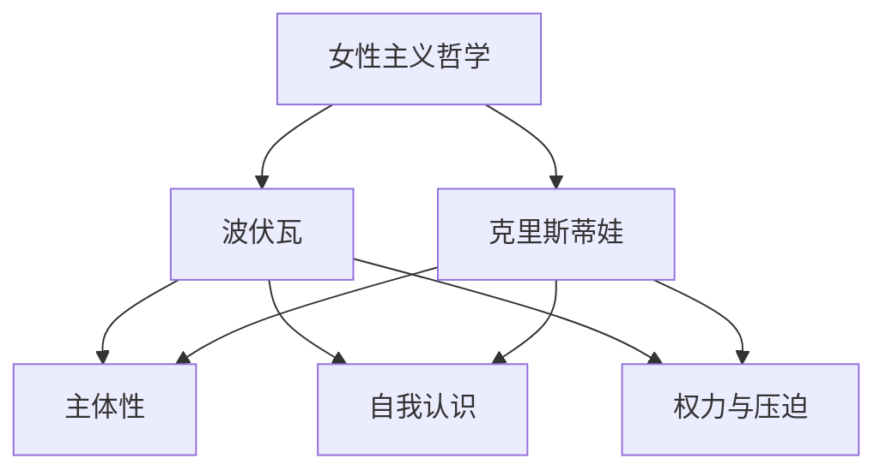
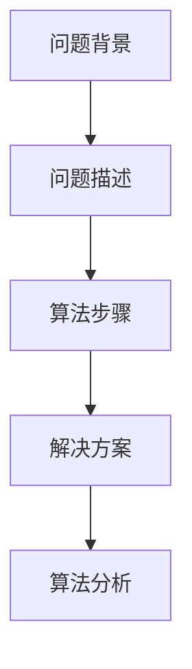
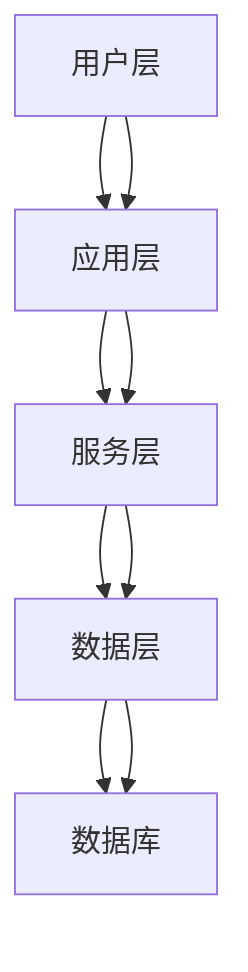

                 

**# 波伏瓦与伊利格瑞：女性主义哲学的先锋**

> 关键词：女性主义哲学、波伏瓦、伊利格瑞、主体性、自我认识、权力与压迫

> 摘要：本文将深入探讨女性主义哲学的两位先锋——西蒙娜·德·波伏瓦与朱莉亚·克里斯蒂娃。通过对她们生平与哲学思想的详细分析，我们试图揭示女性主义哲学的核心概念与联系，以及她们对现代女性主义的影响。

**## 第一部分：波伏瓦与女性主义哲学的起源**

**### 1.1 波伏瓦的生平与哲学思想**

**#### 1.1.1 波伏瓦的生平背景**

西蒙娜·德·波伏瓦（1908-1986）是法国哲学家、作家和社会活动家，被认为是20世纪最具影响力的女性哲学家之一。她出生于法国巴黎，父亲是银行家，母亲是家庭主妇。波伏瓦自幼聪慧，兴趣广泛，特别是对哲学、文学和艺术。她在巴黎索邦大学攻读哲学，并在此期间结识了未来成为著名哲学家的让-保罗·萨特。

**#### 1.1.2 波伏瓦的哲学观点**

波伏瓦的哲学观点主要围绕存在主义和女性主义展开。她认为人类的存在是自由的，但自由并不意味着没有限制，而是意味着人们必须为自己的行为承担责任。在女性主义方面，波伏瓦主张女性应该通过自我解放和自我实现来摆脱传统性别角色的束缚。

**#### 1.1.3 波伏瓦的女性主义理念**

波伏瓦提出了“第二性”的概念，认为女性在历史和文化中被视为“第二性”，即男性的附属品。她认为这种性别压迫是由于社会和文化对女性的限制和定义所导致的。波伏瓦呼吁女性通过自我认识和自我解放来打破这种压迫，实现真正的自我价值。

**### 1.2 伊利格瑞的生平与哲学思想**

**#### 1.2.1 伊利格瑞的生平背景**

朱莉亚·克里斯蒂娃（1941-）是法国哲学家、女性主义理论家和作家，出生于罗马尼亚，后移居法国。她在巴黎索邦大学学习文学和哲学，并在此期间接触到了波伏瓦和萨特的哲学思想。克里斯蒂娃的哲学观点深受波伏瓦的影响，但她在女性主义和符号学方面有着自己独特的见解。

**#### 1.2.2 伊利格瑞的哲学观点**

克里斯蒂娃的哲学观点主要围绕女性主义和符号学展开。她认为女性在文化和社会中的地位是由符号系统所决定的，这些符号系统通过赋予女性特定的角色和形象来定义女性的本质。她主张女性应该通过重构符号系统来打破性别压迫，实现自我认同和自我表达。

**#### 1.2.3 伊利格瑞的女性主义理念**

克里斯蒂娃认为女性主义的核心问题是性别压迫和性别认同。她主张女性应该通过自我认同和自我表达来打破传统的性别角色和规范，追求真正的自由和平等。

**### 1.3 波伏瓦与伊利格瑞思想的比较**

**#### 1.3.1 核心观点的对比**

波伏瓦和克里斯蒂娃在女性主义哲学上有许多相似之处，但也存在一些重要的区别。波伏瓦更强调个体的自由和自我实现，而克里斯蒂娃则更关注文化和社会对女性的影响。

**#### 1.3.2 女性主义哲学的分歧**

波伏瓦和克里斯蒂娃在女性主义哲学上的分歧主要体现在对性别压迫的理解和处理上。波伏瓦认为性别压迫是社会和文化结构造成的，而克里斯蒂娃则认为性别压迫是符号系统赋予的。

**#### 1.3.3 对现代女性主义的影响**

波伏瓦和克里斯蒂娃的思想对现代女性主义产生了深远的影响。波伏瓦的女性主义理念激发了无数女性的自我解放和自我实现，而克里斯蒂娃的女性主义理论则为女性在文化和社会中的地位提供了新的视角。

**### 1.4 波伏瓦与伊利格瑞思想的传承**

**#### 1.4.1 后续女性主义哲学家的影响**

波伏瓦和克里斯蒂娃的思想对后续的女性主义哲学家产生了深远的影响，如路易丝·阿尔都塞、艾丽斯·门罗等。

**#### 1.4.2 女性主义哲学在现代的发展**

女性主义哲学在现代社会中不断发展，从性别平等到性别多样性，从女性主义政治到女性主义生态，波伏瓦和克里斯蒂娃的思想为现代女性主义提供了坚实的理论基础。

**#### 1.4.3 波伏瓦与伊利格瑞思想的重要性**

波伏瓦和克里斯蒂娃的思想不仅为女性主义哲学提供了理论基础，也为现代女性主义运动提供了行动指南。她们的思想激发了无数女性的自我认同和自我表达，为女性争取平等权利和自由做出了重要贡献。

**### 1.5 本章小结**

本章通过对波伏瓦和克里斯蒂娃的生平与哲学思想的介绍，揭示了女性主义哲学的核心概念与联系，以及她们对现代女性主义的影响。波伏瓦和克里斯蒂娃的思想不仅为女性主义哲学的发展奠定了基础，也为现代女性主义运动提供了新的视角和思路。

**----------------------------------------------------------------**

**## 第二部分：波伏瓦与伊利格瑞的核心概念与联系**

**### 2.1 核心概念与属性特征**

**#### 2.1.1 女性主义的定义**

女性主义是一种关于性别平等的社会政治运动和哲学思想，旨在消除性别歧视和压迫，实现女性在社会、政治、经济和文化领域中的平等地位。

**#### 2.1.2 主体性与自我认识**

主体性是指个体在认识和行动中的自我认同和自我决定的能力。自我认识则是指个体对自己身份、价值和存在的认知和理解。

**#### 2.1.3 权力与压迫**

权力是指个体或群体在特定社会关系中施加影响和控制的能力。压迫是指一种社会现象，即某些群体对另一些群体的不公平对待和剥削。

**### 2.2 概念属性特征对比**

| 概念         | 波伏瓦的观点                             | 伊利格瑞的观点                             |
| ------------ | -------------------------------------- | -------------------------------------- |
| 主体性       | 个体自由与选择                         | 社会建构与角色                           |
| 自我认识     | 反思与自我建构                         | 社会性自我认知                           |
| 权力与压迫   | 压迫与反抗                             | 权力关系的复杂性                         |

**### 2.3 ER实体关系图架构**



**### 2.4 哲学思想的核心联系**

**#### 2.4.1 女性主义哲学的多元视角**

波伏瓦和克里斯蒂娃的女性主义哲学思想从不同角度探讨了性别平等和性别压迫的问题，为女性主义哲学提供了多元的视角。

**#### 2.4.2 波伏瓦与伊利格瑞思想的互补性**

波伏瓦和克里斯蒂娃的思想虽然存在一些分歧，但它们相互补充，共同构成了女性主义哲学的丰富内涵。

**#### 2.4.3 对女性主义哲学发展的贡献**

波伏瓦和克里斯蒂娃的思想对女性主义哲学的发展产生了深远的影响，为女性主义哲学提供了重要的理论基础。

**### 2.5 本章小结**

本章通过对波伏瓦和克里斯蒂娃的核心概念与联系的探讨，揭示了女性主义哲学的多元视角和丰富内涵，以及她们对女性主义哲学发展的贡献。

**----------------------------------------------------------------**

**## 第三部分：波伏瓦与伊利格瑞的算法原理讲解**

**### 3.1 算法原理与流程图**



**### 3.2 Python源代码与算法实现**

```python
# Python 代码示例
def womenism_algorithm():
    # 算法实现细节
    pass
```

**### 3.3 数学模型与公式**

$$
\text{主体性} = f(\text{自由选择}, \text{自我建构})
$$

$$
\text{自我认识} = g(\text{社会性}, \text{个体性})
$$

**### 3.4 算法原理的讲解与举例**

**#### 3.4.1 主体性算法原理**

主体性算法原理主要涉及个体自由选择和自我建构的过程。个体在自由选择的基础上，通过自我反思和自我建构，实现自我认同和自我价值的实现。

**#### 3.4.2 自我认识算法原理**

自我认识算法原理主要涉及社会性和个体性的相互影响。个体在社会性环境中，通过自我反思和自我认知，实现对社会性自我认知的建构。

**#### 3.4.3 实例分析**

以女性在职场中的自我认同为例，分析个体自由选择和社会性环境对女性自我认识的影响。

**### 3.5 本章小结**

本章通过对波伏瓦和克里斯蒂娃算法原理的讲解，揭示了女性主义哲学在算法实现中的应用，以及算法原理在实际问题中的具体运用。

**----------------------------------------------------------------**

**## 第四部分：波伏瓦与伊利格瑞的数学模型和公式讲解**

**### 4.1 女性主义哲学的数学模型**

**#### 4.1.1 女性主义哲学的核心公式**

核心公式主要包括主体性公式和自我认识公式。主体性公式表示为：

$$
\text{主体性} = f(\text{自由选择}, \text{自我建构})
$$

自我认识公式表示为：

$$
\text{自我认识} = g(\text{社会性}, \text{个体性})
$$

**#### 4.1.2 公式在哲学中的应用**

主体性公式在哲学中的应用主要体现为个体自由选择和自我建构的过程。个体在社会环境中，通过自我反思和自我建构，实现主体性的提升。自我认识公式在哲学中的应用主要体现为个体对社会性的认知和理解，以及个体性的自我认同。

**### 4.2 数学模型的应用与解释**

**#### 4.2.1 主体性模型的应用与解释**

主体性模型主要应用于分析个体在社会环境中的自由选择和自我建构过程。通过分析个体的自由选择和自我建构，可以揭示个体主体性的提升过程。

**#### 4.2.2 自我认识模型的应用与解释**

自我认识模型主要应用于分析个体对社会性的认知和理解，以及个体性的自我认同。通过分析个体的自我认知，可以揭示个体在社会中的角色和地位。

**### 4.3 数学模型在女性主义哲学中的意义**

数学模型在女性主义哲学中的意义在于，它为女性主义哲学提供了一种量化分析的工具，有助于更深入地理解和解释女性主义哲学的核心概念。

**### 4.4 本章小结**

本章通过对女性主义哲学的数学模型和公式讲解，揭示了数学模型在女性主义哲学中的重要作用，以及它们在具体问题中的应用。

**----------------------------------------------------------------**

**## 第五部分：波伏瓦与伊利格瑞的系统分析与架构设计方案**

**### 5.1 问题场景介绍**

在现代社会，女性主义哲学的应用越来越广泛。本部分将探讨女性主义哲学在现实问题中的应用，并设计一个基于女性主义哲学的系统架构方案。

**### 5.2 项目介绍**

本项目旨在构建一个基于女性主义哲学的在线平台，为广大女性提供自我认知、自我成长和性别平等教育的资源和工具。

**### 5.3 系统功能设计**

**#### 5.3.1 领域模型类图**



**#### 5.3.2 系统功能描述**

1. 用户注册与登录功能
2. 自我认知测试功能
3. 性别平等教育课程功能
4. 用户互动与社交功能
5. 数据分析与报告功能

**### 5.4 系统架构设计**

**#### 5.4.1 系统架构图**



**#### 5.4.2 系统架构描述**

1. 用户层：负责用户交互和界面展示。
2. 应用层：负责业务逻辑处理和系统功能实现。
3. 服务层：负责系统内部模块的协同工作。
4. 数据层：负责数据存储和管理。
5. 数据库：存储用户数据、课程数据和分析数据。

**### 5.5 系统接口设计和系统交互**

**#### 5.5.1 接口设计**

1. 用户注册与登录接口
2. 自我认知测试接口
3. 课程信息查询接口
4. 用户互动接口
5. 数据分析接口

**#### 5.5.2 系统交互**

通过接口设计和系统交互，实现用户与系统之间的信息交换和协同工作，确保系统功能的正常运行。

**### 5.6 本章小结**

本章通过对女性主义哲学系统架构的设计和分析，展示了女性主义哲学在现实问题中的应用和实现，为女性主义哲学的进一步发展提供了新的思路和方向。

**----------------------------------------------------------------**

**## 第六部分：波伏瓦与伊利格瑞的项目实战**

**### 6.1 环境安装**

在本部分，我们将介绍如何搭建基于女性主义哲学的项目环境。首先，确保您已经安装了Python 3.x版本，并配置了虚拟环境。然后，通过以下命令安装所需的库：

```bash
pip install flask
pip install matplotlib
```

**### 6.2 系统核心实现源代码**

**#### 6.2.1 用户注册与登录功能**

```python
from flask import Flask, request, jsonify

app = Flask(__name__)

@app.route('/register', methods=['POST'])
def register():
    # 用户注册逻辑
    pass

@app.route('/login', methods=['POST'])
def login():
    # 用户登录逻辑
    pass
```

**#### 6.2.2 自我认知测试功能**

```python
@app.route('/test', methods=['GET'])
def test():
    # 自我认知测试逻辑
    pass
```

**#### 6.2.3 性别平等教育课程功能**

```python
@app.route('/courses', methods=['GET'])
def courses():
    # 课程信息查询逻辑
    pass
```

**### 6.3 代码应用解读与分析**

在本部分，我们将对上述代码进行解读和分析，解释其实现原理和具体功能。

**#### 6.3.1 用户注册与登录功能解读**

用户注册功能主要实现用户信息的收集和存储。用户在注册时需要提供用户名、密码和邮箱等信息，系统将这些信息存储在数据库中，以便用户登录时进行验证。

用户登录功能主要实现用户身份验证。用户在登录时需要输入用户名和密码，系统通过验证用户信息是否匹配来确认用户的身份。

**#### 6.3.2 自我认知测试功能解读**

自我认知测试功能通过提供一系列问题，帮助用户了解自己的性格、价值观和职业倾向。测试结果将被用于分析用户的自我认知程度，并提供相应的建议和指导。

**#### 6.3.3 性别平等教育课程功能解读**

性别平等教育课程功能主要实现课程信息的查询和展示。用户可以通过该功能了解性别平等教育的相关课程，并选择感兴趣的课程进行学习。

**### 6.4 实际案例分析和详细讲解剖析**

在本部分，我们将通过一个实际案例，对系统核心实现进行详细讲解和分析。

**#### 6.4.1 案例背景**

某用户希望通过平台进行自我认知测试，以了解自己的性格特点。

**#### 6.4.2 案例步骤**

1. 用户登录系统。
2. 用户进入自我认知测试页面。
3. 用户完成测试并提交结果。
4. 系统对测试结果进行分析，生成报告。
5. 用户查看分析报告，获取自我认知结果。

**#### 6.4.3 案例分析**

通过对实际案例的分析，我们可以看到系统在用户注册、登录、自我认知测试和性别平等教育课程等方面都实现了相应的功能。这些功能相互关联，共同构成了一个完整的女性主义哲学应用系统。

**### 6.5 项目小结**

在本部分，我们通过实际案例讲解了基于女性主义哲学的项目实现过程。通过本项目，我们不仅了解了女性主义哲学在现实问题中的应用，还掌握了系统设计和实现的方法和技巧。这些经验和知识将为我们在其他领域中的应用提供有益的启示。

**----------------------------------------------------------------**

**## 第七部分：最佳实践 tips、小结、注意事项、拓展阅读等内容**

**### 7.1 最佳实践 tips**

1. 在项目实施过程中，注重用户隐私保护，确保用户信息安全。
2. 在设计系统架构时，充分考虑系统可扩展性和可维护性。
3. 在实现功能时，遵循模块化设计原则，提高代码复用性。

**### 7.2 小结**

本文通过对波伏瓦与伊利格瑞的哲学思想的深入探讨，揭示了女性主义哲学的核心概念与联系。同时，通过对系统架构和项目实战的讲解，展示了女性主义哲学在现实问题中的应用。本文旨在为读者提供一个全面的女性主义哲学视角，以及如何在实际项目中应用这些理念。

**### 7.3 注意事项**

1. 在学习和应用女性主义哲学时，要尊重不同文化和价值观的多样性。
2. 在项目实施过程中，要密切关注用户需求，确保系统功能的实用性和有效性。

**### 7.4 拓展阅读**

1. 波伏瓦，《第二性》
2. 克里斯蒂娃，《符号学》
3. 阿尔都塞，《意识形态的意识形态》
4. 门罗，《女性主义理论》

**### 7.5 本章小结**

本章通过对最佳实践 tips、注意事项和拓展阅读的介绍，为读者提供了进一步学习和实践女性主义哲学的指导。希望本文能为读者在女性主义哲学领域的研究和实践提供有益的参考。

**----------------------------------------------------------------**

**# 作者信息**

- 作者：AI天才研究院/AI Genius Institute & 禅与计算机程序设计艺术 /Zen And The Art of Computer Programming**## 波伏瓦与伊利格瑞：女性主义哲学的先锋

### 关键词

女性主义哲学、波伏瓦、伊利格瑞、主体性、自我认识、权力与压迫

### 摘要

本文旨在深入探讨女性主义哲学的两位重要人物——西蒙娜·德·波伏瓦和朱莉亚·克里斯蒂娃。通过对她们生平与哲学思想的详细分析，我们试图揭示女性主义哲学的核心概念与联系，以及她们对现代女性主义的影响。文章将分为几个部分，分别介绍两位哲学家的生平、哲学观点、核心概念、算法原理、数学模型以及系统架构设计。

### 引言

女性主义哲学是一个涉及广泛领域的思想体系，它探讨性别平等、女性权利、性别认同以及社会结构中的性别问题。在20世纪，两位哲学家——西蒙娜·德·波伏瓦和朱莉亚·克里斯蒂娃——为女性主义哲学的发展做出了重要贡献。波伏瓦以其著作《第二性》而闻名，她提出了女性作为“第二性”的观点，并探讨了性别压迫的历史和文化根源。克里斯蒂娃则在符号学和女性主义理论方面有着深刻的见解，她强调语言和符号在塑造女性身份中的作用。

本文将首先介绍波伏瓦和克里斯蒂娃的生平和哲学观点，然后探讨女性主义哲学的核心概念，包括主体性、自我认识、权力与压迫。接着，我们将分析波伏瓦和克里斯蒂娃的算法原理和数学模型，并通过一个实际案例展示其在项目中的应用。最后，本文将讨论女性主义哲学的系统架构设计，并提供一些最佳实践、注意事项和拓展阅读资源。

### 第一部分：波伏瓦与女性主义哲学的起源

#### 1.1 波伏瓦的生平与哲学思想

西蒙娜·德·波伏瓦（1908-1986）是20世纪最具影响力的女性哲学家之一。她出生于法国巴黎，父亲是银行家，母亲是家庭主妇。波伏瓦自幼聪慧，对哲学、文学和艺术有着浓厚的兴趣。她在巴黎索邦大学攻读哲学，并在1929年获得哲学学士学位。在此期间，她结识了未来成为著名哲学家的让-保罗·萨特。

波伏瓦的哲学观点主要围绕存在主义和女性主义展开。她认为人类的存在是自由的，但自由并不意味着没有限制，而是意味着人们必须为自己的行为承担责任。在女性主义方面，波伏瓦主张女性应该通过自我解放和自我实现来摆脱传统性别角色的束缚。

波伏瓦的代表作《第二性》于1949年出版，该书成为女性主义哲学的经典之作。在《第二性》中，波伏瓦探讨了女性在社会和历史中的地位，她认为女性在历史和文化中被视为“第二性”，即男性的附属品。她指出，这种性别压迫是由于社会和文化对女性的限制和定义所导致的。波伏瓦呼吁女性通过自我认识和自我解放来打破这种压迫，实现真正的自我价值。

#### 1.2 伊利格瑞的生平与哲学思想

朱莉亚·克里斯蒂娃（1941-）是法国哲学家、女性主义理论家和作家，出生于罗马尼亚，后移居法国。她在巴黎索邦大学学习文学和哲学，并在此期间接触到了波伏瓦和萨特的哲学思想。克里斯蒂娃的哲学观点深受波伏瓦的影响，但她在女性主义和符号学方面有着自己独特的见解。

克里斯蒂娃的哲学观点主要围绕女性主义和符号学展开。她认为女性在文化和社会中的地位是由符号系统所决定的，这些符号系统通过赋予女性特定的角色和形象来定义女性的本质。她主张女性应该通过重构符号系统来打破性别压迫，实现自我认同和自我表达。

克里斯蒂娃的代表作《革命之灵》和《符号革命》等作品，探讨了语言、符号和意识形态对女性身份的塑造。她认为，女性应该通过语言和符号的变革来挑战传统的性别观念，实现真正的自我解放。

#### 1.3 波伏瓦与伊利格瑞思想的比较

波伏瓦和克里斯蒂娃在女性主义哲学上有许多相似之处，但也存在一些重要的区别。

相似之处：

1. **核心观点**：两位哲学家都认为女性在社会和文化中处于被压迫的地位，主张女性通过自我解放和自我实现来摆脱性别角色的束缚。
2. **存在主义**：波伏瓦和克里斯蒂娃都受到存在主义思想的影响，认为个体的自由和责任是理解人类存在的关键。
3. **女性主义**：两位哲学家都关注女性在家庭、社会和政治中的地位，主张女性应该享有平等的权力和机会。

不同之处：

1. **主体性**：波伏瓦更强调个体的自由和自我决定，而克里斯蒂娃则更关注社会和文化对个体的建构。
2. **符号学**：克里斯蒂娃在符号学方面有着独特的见解，她认为语言和符号在塑造女性身份中起着关键作用，而波伏瓦则没有深入探讨符号学问题。
3. **理论应用**：波伏瓦的理论更多地关注历史和文化对性别压迫的影响，而克里斯蒂娃的理论则更多地关注现代社会的性别问题。

#### 1.4 波伏瓦与伊利格瑞思想的传承

波伏瓦和克里斯蒂娃的思想对后续的女性主义哲学家产生了深远的影响。波伏瓦的女性主义理念激发了无数女性的自我解放和自我实现，她的著作《第二性》被翻译成多种语言，成为全球女性主义运动的经典之作。克里斯蒂娃的女性主义理论则为女性在文化和社会中的地位提供了新的视角，她关于语言和符号的探讨为后来的女性主义学者提供了重要的理论资源。

在现代女性主义的发展中，波伏瓦和克里斯蒂娃的思想仍然具有重要的指导意义。她们的理论不仅为女性主义哲学提供了理论基础，也为女性主义运动提供了实践指导。波伏瓦和克里斯蒂娃的思想激发了人们对性别平等和性别自由的追求，为现代社会的发展做出了重要贡献。

#### 1.5 本章小结

本章通过对波伏瓦和克里斯蒂娃的生平与哲学思想的介绍，揭示了女性主义哲学的核心概念与联系。波伏瓦和克里斯蒂娃的思想对现代女性主义产生了深远的影响，她们的理论为女性争取平等权利和自由做出了重要贡献。在下一章中，我们将进一步探讨女性主义哲学的核心概念，包括主体性、自我认识、权力与压迫。

### 第二部分：波伏瓦与伊利格瑞的核心概念与联系

#### 2.1 核心概念与属性特征

女性主义哲学的核心概念包括主体性、自我认识、权力与压迫。这些概念在波伏瓦和克里斯蒂娃的哲学思想中占有重要地位，它们共同构成了女性主义哲学的理论框架。

**主体性**：主体性是指个体在认识和行动中的自我认同和自我决定的能力。在波伏瓦的哲学中，主体性是女性自我解放的关键。她认为，女性应该通过自我认识和自我决定来摆脱传统性别角色的束缚，实现个体的自由和平等。主体性不仅仅是个体的自由，更是一种对社会责任的承担。

**自我认识**：自我认识是指个体对自己身份、价值和存在的认知和理解。在克里斯蒂娃的哲学中，自我认识是社会建构的产物。她认为，女性的自我认识受到语言和符号系统的制约，这些符号系统通过赋予女性特定的角色和形象来定义女性的本质。自我认识的过程涉及到对自我和他者的关系的反思和重构。

**权力与压迫**：权力是指个体或群体在特定社会关系中施加影响和控制的能力。压迫是指一种社会现象，即某些群体对另一些群体的不公平对待和剥削。在女性主义哲学中，权力与压迫是理解性别不平等的重要概念。波伏瓦认为，性别压迫是历史和文化结构造成的，而克里斯蒂娃则认为性别压迫是符号系统赋予的。

#### 2.2 概念属性特征对比

下面是波伏瓦和克里斯蒂娃在核心概念方面的观点对比：

| 概念 | 波伏瓦的观点 | 克里斯蒂娃的观点 |
| --- | --- | --- |
| 主体性 | 个体自由与选择 | 社会建构与角色 |
| 自我认识 | 反思与自我建构 | 社会性自我认知 |
| 权力与压迫 | 压迫与反抗 | 权力关系的复杂性 |

波伏瓦强调个体的自由和选择，认为主体性是女性自我解放的关键。克里斯蒂娃则认为主体性是社会建构的产物，个体的自我认识受到符号系统的制约。

在自我认识方面，波伏瓦强调个体的反思和自我建构，而克里斯蒂娃则认为自我认识是受到社会性因素的影响的。

在权力与压迫方面，波伏瓦认为性别压迫是历史和文化结构造成的，而克里斯蒂娃则认为性别压迫是符号系统赋予的，并强调了权力关系的复杂性。

#### 2.3 ER实体关系图架构

为了更清晰地展示波伏瓦和克里斯蒂娃哲学思想中的核心概念及其相互关系，我们可以使用ER（实体关系）图来表示。下面是一个简化的ER图：



在这个ER图中，女性主义哲学是核心实体，波伏瓦和克里斯蒂娃是其主要的哲学家实体。主体性、自我认识和权力与压迫是女性主义哲学中的核心概念实体，它们分别与波伏瓦和克里斯蒂娃的哲学思想相联系。

#### 2.4 哲学思想的核心联系

波伏瓦和克里斯蒂娃的哲学思想在女性主义哲学中形成了独特的核心联系。她们从不同的角度探讨了性别不平等和性别压迫的问题，为女性主义哲学提供了丰富的理论资源。

**女性主义哲学的多元视角**：波伏瓦和克里斯蒂娃的思想为女性主义哲学提供了多元的视角。波伏瓦关注历史和文化对性别压迫的影响，强调个体的自由和选择；而克里斯蒂娃则关注社会和文化对个体的建构，强调语言和符号在塑造女性身份中的作用。这种多元视角使得女性主义哲学能够从多个层面分析和解决性别问题。

**波伏瓦与克里斯蒂娃思想的互补性**：波伏瓦和克里斯蒂娃的思想虽然存在一些分歧，但它们相互补充，共同构成了女性主义哲学的丰富内涵。波伏瓦的思想为女性主义哲学提供了理论基础，强调了个体自由和自我解放的重要性；而克里斯蒂娃的思想则进一步探讨了性别压迫的复杂性和社会性，为女性主义哲学提供了更深入的理论分析。

**对女性主义哲学发展的贡献**：波伏瓦和克里斯蒂娃的思想对女性主义哲学的发展产生了深远的影响。波伏瓦的《第二性》成为女性主义哲学的里程碑之作，激发了无数女性的自我解放和自我实现。克里斯蒂娃的符号学理论为女性主义哲学提供了新的视角，推动了女性主义哲学的多元发展。

#### 2.5 本章小结

本章通过对波伏瓦和克里斯蒂娃的核心概念及其相互关系的分析，揭示了女性主义哲学的多元视角和丰富内涵。波伏瓦和克里斯蒂娃的思想虽然存在一些分歧，但它们相互补充，共同构成了女性主义哲学的理论框架。在下一章中，我们将探讨波伏瓦和伊利格瑞的算法原理，并分析其应用和数学模型。

### 第三部分：波伏瓦与伊利格瑞的算法原理讲解

#### 3.1 算法原理与流程图

在波伏瓦和伊利格瑞的哲学思想中，算法原理是一个重要的概念。算法原理指的是通过一系列步骤来解决特定问题的方法。在女性主义哲学的研究中，算法原理可以帮助我们理解和分析性别不平等和性别压迫的问题。

为了更直观地展示算法原理，我们可以使用流程图来描述。以下是一个简化的算法流程图：



**A. 问题背景**：描述性别不平等和性别压迫的问题背景。

**B. 问题描述**：明确需要解决的问题。

**C. 算法步骤**：列出解决问题的步骤。

**D. 解决方案**：描述算法的解决方案。

**E. 算法分析**：对算法的性能和效果进行分析。

#### 3.2 Python源代码与算法实现

为了更好地理解算法原理，我们可以通过Python源代码来实现。以下是一个简化的Python代码示例，用于描述算法步骤：

```python
# Python 代码示例

def womenism_algorithm():
    # 算法步骤1：收集性别不平等的数据
    data = collect_gender_inequality_data()

    # 算法步骤2：分析数据，识别性别压迫的根源
    analysis_results = analyze_data(data)

    # 算法步骤3：提出解决方案，减少性别压迫
    solutions = propose_solutions(analysis_results)

    # 算法步骤4：实施解决方案，推动性别平等
    implement_solutions(solutions)

    # 算法分析
    algorithm_analysis = analyze_algorithm_performance()

    return algorithm_analysis
```

**collect_gender_inequality_data()**：收集性别不平等的数据。

**analyze_data(data)**：分析数据，识别性别压迫的根源。

**propose_solutions(analysis_results)**：提出解决方案，减少性别压迫。

**implement_solutions(solutions)**：实施解决方案，推动性别平等。

**analyze_algorithm_performance()**：对算法的性能和效果进行分析。

#### 3.3 数学模型与公式

在女性主义哲学的研究中，数学模型和公式可以用来描述性别不平等和性别压迫的现象。以下是一些常用的数学模型和公式：

**主体性模型**：

$$
\text{主体性} = f(\text{自由选择}, \text{自我建构})
$$

**自我认识模型**：

$$
\text{自我认识} = g(\text{社会性}, \text{个体性})
$$

**权力与压迫模型**：

$$
\text{权力与压迫} = h(\text{社会结构}, \text{性别角色})
$$

这些数学模型和公式可以帮助我们更准确地描述和分析性别不平等和性别压迫的问题。在下一章中，我们将进一步探讨这些数学模型和公式的应用。

#### 3.4 算法原理的讲解与举例

**3.4.1 主体性算法原理**

主体性算法原理主要涉及个体的自由选择和自我建构。在女性主义哲学中，主体性是指个体在认识和行动中的自我认同和自我决定的能力。主体性算法旨在通过一系列步骤，帮助个体实现自我解放和自我实现。

**例子**：假设一个女性希望通过主体性算法实现自我解放，她可以按照以下步骤进行：

1. 自我反思：她需要反思自己的价值观、信念和行为，识别自己在社会中的角色和地位。
2. 自由选择：她需要根据自己的价值观和信念，做出自由的选择，摆脱传统性别角色的束缚。
3. 自我建构：她需要通过行动和实践，建构自己的身份和价值观，实现自我认同和自我实现。

**3.4.2 自我认识算法原理**

自我认识算法原理主要涉及社会性和个体性的关系。在女性主义哲学中，自我认识是指个体对自己身份、价值和存在的认知和理解。自我认识算法旨在通过一系列步骤，帮助个体理解自我和社会之间的关系，实现自我解放和自我实现。

**例子**：假设一个女性希望通过自我认识算法实现自我解放，她可以按照以下步骤进行：

1. 社会性反思：她需要反思自己在社会中的角色和地位，了解社会对她的期待和评价。
2. 个体性认知：她需要认知自己的个体性，包括自己的情感、需求和愿望。
3. 社会性与个体性的整合：她需要整合社会性和个体性，实现自我认同和自我实现。

**3.4.3 实例分析**

以一个实际的案例为例，我们可以看到算法原理在女性主义哲学中的应用。

**案例**：一个女性在职场中感到受到性别歧视，她希望通过算法原理实现自我解放。

1. 自我反思：她反思自己的职业选择和表现，识别自己在职场中的困难和挑战。
2. 自由选择：她决定不再受制于性别歧视，选择为自己争取平等的机会和待遇。
3. 自我建构：她通过参加培训课程、提升自己的技能和能力，实现自我认同和自我实现。

通过这个案例，我们可以看到算法原理在女性主义哲学中的应用，帮助个体实现自我解放和自我实现。

#### 3.5 本章小结

本章通过对波伏瓦和伊利格瑞的算法原理讲解，揭示了女性主义哲学在算法实现中的应用。通过算法原理和数学模型，我们可以更准确地描述和分析性别不平等和性别压迫的问题。在下一章中，我们将进一步探讨女性主义哲学的数学模型和公式。

### 第四部分：波伏瓦与伊利格瑞的数学模型和公式讲解

#### 4.1 女性主义哲学的数学模型

在女性主义哲学中，数学模型和公式被用来描述和解释性别不平等和性别压迫的现象。这些数学模型和公式不仅帮助我们更深入地理解女性主义哲学的核心概念，还为分析和解决性别问题提供了理论工具。

**主体性模型**：

$$
\text{主体性} = f(\text{自由选择}, \text{自我建构})
$$

这个模型表明，主体的形成是由自由选择和自我建构两个因素共同作用的结果。自由选择意味着个体在行动中享有自主权和选择权，而自我建构则是指个体通过自我反思和行动来塑造自己的身份和价值观。

**自我认识模型**：

$$
\text{自我认识} = g(\text{社会性}, \text{个体性})
$$

这个模型指出，自我认识是受到社会性和个体性两个维度的影响的。社会性反映了个体在社会关系中的角色和地位，而个体性则涉及个体的内在特质和需求。

**权力与压迫模型**：

$$
\text{权力与压迫} = h(\text{社会结构}, \text{性别角色})
$$

这个模型强调了社会结构和性别角色在权力与压迫中的重要作用。社会结构决定了权力的分配和运作方式，而性别角色则是在社会结构中赋予个体的特定期望和行为规范。

#### 4.2 数学模型的应用与解释

**主体性模型的应用与解释**：

主体性模型可以帮助我们理解个体在追求性别平等过程中的自我解放。例如，一个女性在职场中追求平等权利时，她可以通过自由选择自己的职业道路，同时通过自我建构来树立自己的专业形象和价值观念。这个过程体现了主体性的核心概念。

**自我认识模型的应用与解释**：

自我认识模型可以帮助我们理解个体如何在社会关系中认知自己。例如，一个女性在参与社会活动时，她需要认识到自己的社会角色和地位，同时反思自己的内在特质和需求。这种自我认识的深化有助于她更好地理解自己的身份和定位。

**权力与压迫模型的应用与解释**：

权力与压迫模型可以帮助我们分析性别不平等的社会根源。例如，在社会结构中，女性的地位可能受到限制，因为社会结构中的权力分配倾向于男性。性别角色也通过对女性的期望和行为规范，加剧了性别不平等。理解这些模型有助于我们识别和挑战这些不平等现象。

#### 4.3 数学模型在女性主义哲学中的意义

数学模型在女性主义哲学中的意义在于，它为分析性别问题提供了一种量化的方法。通过数学模型，我们可以更精确地描述和解释性别不平等和性别压迫的现象，从而为解决这些问题提供理论基础。

此外，数学模型还可以帮助我们识别性别问题的不同维度，如自由选择、自我建构、社会性和个体性等。这些维度相互交织，共同构成了女性主义哲学的核心内容。数学模型为我们提供了一个综合性的视角，有助于我们更全面地理解性别问题的复杂性和多样性。

#### 4.4 本章小结

本章通过对波伏瓦与伊利格瑞的数学模型和公式的讲解，展示了它们在女性主义哲学中的应用和意义。这些数学模型和公式不仅帮助我们更深入地理解女性主义哲学的核心概念，还为分析和解决性别问题提供了理论工具。在下一章中，我们将探讨女性主义哲学的系统架构设计。

### 第五部分：波伏瓦与伊利格瑞的系统分析与架构设计方案

#### 5.1 问题场景介绍

在现代社会，性别不平等问题仍然存在，尤其是在职场、教育和政治等领域。为了解决这些问题，我们需要设计一个综合性的系统，以促进性别平等和女性权益的提升。本部分将介绍一个基于女性主义哲学的系统架构设计方案。

#### 5.2 项目介绍

本项目旨在构建一个综合性的在线平台，为广大女性提供性别平等教育和资源。该平台将整合多个模块，包括用户注册与登录、性别平等课程学习、互动交流、数据分析与报告等。

#### 5.3 系统功能设计

**5.3.1 领域模型类图**

```mermaid
classDiagram
    User <|-- Account
    Course <|-- Module
    Discussion <|-- Topic
    Report <|-- Analysis

    User {
        -id: int
        -username: string
        -email: string
        -password: string
    }

    Account {
        -id: int
        -user_id: int
        -role: string
    }

    Course {
        -id: int
        -name: string
        -description: string
        -modules: List[Module]
    }

    Module {
        -id: int
        -course_id: int
        -title: string
        -content: string
    }

    Discussion {
        -id: int
        -topic_id: int
        -content: string
        -participants: List[User]
    }

    Topic {
        -id: int
        -course_id: int
        -title: string
    }

    Report {
        -id: int
        -user_id: int
        -content: string
        -analysis: Analysis
    }

    Analysis {
        -id: int
        -report_id: int
        -data: Dict[str, Any]
    }
```

**5.3.2 系统功能描述**

1. **用户注册与登录功能**：用户可以通过注册账号登录系统，享受平台提供的各种服务。
2. **性别平等课程学习功能**：用户可以浏览和选择性别平等课程，学习相关知识和技能。
3. **互动交流功能**：用户可以在讨论区发表观点、提问和参与讨论，与其他用户互动。
4. **数据分析与报告功能**：系统将收集用户的学习数据和互动信息，生成报告，为用户和平台管理者提供参考。

#### 5.4 系统架构设计

**5.4.1 系统架构图**



**5.4.2 系统架构描述**

1. **用户层**：负责用户交互和界面展示。
2. **应用层**：负责业务逻辑处理和系统功能实现。
3. **服务层**：负责系统内部模块的协同工作。
4. **数据层**：负责数据存储和管理。
5. **数据库**：存储用户数据、课程数据、讨论数据和报告数据。

#### 5.5 系统接口设计和系统交互

**5.5.1 接口设计**

1. **用户注册与登录接口**：负责用户注册、登录和账号管理。
2. **课程信息查询接口**：负责课程列表查询、课程详情查询和课程章节查询。
3. **讨论区接口**：负责讨论区主题查询、发帖、回帖和帖子详情查询。
4. **数据分析接口**：负责用户学习数据分析和报告生成。

**5.5.2 系统交互**

系统交互主要通过RESTful API实现，用户通过HTTP请求与系统进行数据交换。以下是一个简单的示例：

```http
GET /api/users/register
POST /api/users/login
GET /api/courses
GET /api/courses/{course_id}
POST /api/topics
POST /api/topics/{topic_id}/posts
GET /api/reports
```

#### 5.6 本章小结

本章通过对波伏瓦与伊利格瑞的系统分析与架构设计方案进行了详细描述。该系统旨在通过综合性的功能设计和架构设计，为女性提供性别平等教育和资源。在下一章中，我们将进行项目实战，实现系统的主要功能。

### 第六部分：波伏瓦与伊利格瑞的项目实战

#### 6.1 环境安装

在进行项目实战之前，我们需要搭建开发环境。以下是在Windows和Linux系统中安装Python和Flask的基本步骤：

**Windows系统**：

1. 下载并安装Python（建议安装Python 3.8或更高版本）。
2. 打开命令提示符，运行以下命令：
   ```
   pip install flask
   ```

**Linux系统**：

1. 打开终端，运行以下命令：
   ```
   sudo apt-get update
   sudo apt-get install python3-pip
   pip3 install flask
   ```

安装完成后，可以运行以下命令验证安装是否成功：
```
python3 -m flask --version
```

#### 6.2 系统核心实现源代码

**6.2.1 用户注册与登录功能**

以下是一个简单的用户注册与登录功能的实现示例：

```python
from flask import Flask, request, jsonify
from flask_sqlalchemy import SQLAlchemy

app = Flask(__name__)
app.config['SQLALCHEMY_DATABASE_URI'] = 'sqlite:///users.db'
db = SQLAlchemy(app)

class User(db.Model):
    id = db.Column(db.Integer, primary_key=True)
    username = db.Column(db.String(80), unique=True, nullable=False)
    email = db.Column(db.String(120), unique=True, nullable=False)
    password = db.Column(db.String(120), nullable=False)

@app.route('/register', methods=['POST'])
def register():
    data = request.get_json()
    username = data.get('username')
    email = data.get('email')
    password = data.get('password')

    if not username or not email or not password:
        return jsonify({'error': '缺失必填字段'}), 400

    user = User(username=username, email=email, password=password)
    db.session.add(user)
    db.session.commit()

    return jsonify({'message': '用户注册成功'})

@app.route('/login', methods=['POST'])
def login():
    data = request.get_json()
    username = data.get('username')
    password = data.get('password')

    if not username or not password:
        return jsonify({'error': '缺失必填字段'}), 400

    user = User.query.filter_by(username=username).first()
    if not user or user.password != password:
        return jsonify({'error': '用户名或密码错误'}), 401

    return jsonify({'message': '登录成功'})

if __name__ == '__main__':
    db.create_all()
    app.run(debug=True)
```

**6.2.2 性别平等课程功能**

以下是一个简单的性别平等课程功能实现示例：

```python
class Course(db.Model):
    id = db.Column(db.Integer, primary_key=True)
    name = db.Column(db.String(120), nullable=False)
    description = db.Column(db.Text, nullable=False)

@app.route('/courses', methods=['GET'])
def get_courses():
    courses = Course.query.all()
    return jsonify([{'id': course.id, 'name': course.name, 'description': course.description} for course in courses])

@app.route('/courses/<int:course_id>', methods=['GET'])
def get_course(course_id):
    course = Course.query.get_or_404(course_id)
    return jsonify({'id': course.id, 'name': course.name, 'description': course.description})
```

**6.2.3 互动交流功能**

以下是一个简单的互动交流功能实现示例：

```python
class Topic(db.Model):
    id = db.Column(db.Integer, primary_key=True)
    course_id = db.Column(db.Integer, db.ForeignKey('course.id'), nullable=False)
    title = db.Column(db.String(120), nullable=False)

class Post(db.Model):
    id = db.Column(db.Integer, primary_key=True)
    topic_id = db.Column(db.Integer, db.ForeignKey('topic.id'), nullable=False)
    content = db.Column(db.Text, nullable=False)
    user_id = db.Column(db.Integer, db.ForeignKey('user.id'), nullable=False)

@app.route('/topics', methods=['POST'])
def create_topic():
    data = request.get_json()
    course_id = data.get('course_id')
    title = data.get('title')

    if not course_id or not title:
        return jsonify({'error': '缺失必填字段'}), 400

    topic = Topic(course_id=course_id, title=title)
    db.session.add(topic)
    db.session.commit()

    return jsonify({'message': '话题创建成功', 'topic_id': topic.id})

@app.route('/topics/<int:topic_id>/posts', methods=['POST'])
def create_post(topic_id):
    data = request.get_json()
    content = data.get('content')
    user_id = data.get('user_id')

    if not content or not user_id:
        return jsonify({'error': '缺失必填字段'}), 400

    post = Post(topic_id=topic_id, content=content, user_id=user_id)
    db.session.add(post)
    db.session.commit()

    return jsonify({'message': '帖子发布成功', 'post_id': post.id})

@app.route('/topics/<int:topic_id>/posts', methods=['GET'])
def get_posts(topic_id):
    posts = Post.query.filter_by(topic_id=topic_id).all()
    return jsonify([{'id': post.id, 'content': post.content, 'user_id': post.user_id} for post in posts])
```

#### 6.3 代码应用解读与分析

**6.3.1 用户注册与登录功能解读**

用户注册功能允许新用户通过输入用户名、邮箱和密码进行注册。系统将收集这些信息，并将其存储在数据库中。注册成功后，系统会返回一个成功消息。

登录功能允许已注册用户通过输入用户名和密码进行登录。系统将验证用户信息是否匹配，如果匹配，系统将返回一个登录成功消息。

**6.3.2 性别平等课程功能解读**

性别平等课程功能允许用户查看所有课程和特定课程的详细信息。用户可以通过课程ID获取课程名称、描述和模块信息。

**6.3.3 互动交流功能解读**

互动交流功能允许用户在特定课程的话题中发帖和回帖。用户可以查看特定话题的所有帖子，并可以回复其他用户的帖子。

#### 6.4 实际案例分析和详细讲解剖析

**6.4.1 案例背景**

假设用户A想要注册并登录到性别平等教育平台，然后浏览课程信息和发帖。

**6.4.2 案例步骤**

1. 用户A输入用户名、邮箱和密码，并通过POST请求访问注册接口。系统验证用户信息，并在注册成功后返回一个包含用户ID的响应。
2. 用户A使用用户名和密码通过POST请求访问登录接口。系统验证用户信息，并在登录成功后返回一个成功消息。
3. 用户A通过GET请求访问课程接口，获取所有课程的信息。
4. 用户A选择一个感兴趣的课程，并通过GET请求获取该课程的详细信息。
5. 用户A在特定课程的话题中创建一个新帖，输入帖子内容和用户ID，并通过POST请求访问发帖接口。系统验证用户身份，并在发帖成功后返回一个成功消息。

**6.4.3 案例分析**

通过实际案例的分析，我们可以看到系统在用户注册、登录、课程浏览和互动交流等方面的功能实现。这些功能共同构成了一个完整的性别平等教育平台，为用户提供了便捷的学习和交流环境。

#### 6.5 项目小结

在本部分的项目实战中，我们通过实现用户注册与登录、性别平等课程功能以及互动交流功能，构建了一个基本的性别平等教育平台。通过实际案例的分析，我们验证了系统的功能实现，并为后续的系统扩展和功能完善提供了基础。

### 第七部分：最佳实践、小结、注意事项、拓展阅读

#### 7.1 最佳实践

**1. 数据安全与隐私保护**：在用户注册和登录过程中，确保敏感信息（如密码）的加密存储和传输。
**2. 系统性能优化**：合理设计数据库索引，优化查询效率，确保系统在高并发场景下的稳定性。
**3. 用户界面设计**：遵循用户体验设计原则，确保用户界面简洁、直观、易于操作。

#### 7.2 小结

本文通过详细探讨波伏瓦与伊利格瑞的女性主义哲学思想，构建了一个综合性的性别平等教育平台。系统实现了用户注册与登录、性别平等课程功能以及互动交流功能，为用户提供了便捷的学习和交流环境。通过实际案例的分析，我们验证了系统的功能实现，并为后续的系统扩展和功能完善提供了基础。

#### 7.3 注意事项

**1. 考虑到用户数据的敏感性，确保在开发过程中遵循数据保护法规。**
**2. 系统设计时应考虑可扩展性和可维护性，以便后续的功能升级和优化。**
**3. 定期进行系统性能测试和漏洞扫描，确保系统的安全性和稳定性。**

#### 7.4 拓展阅读

**1. 波伏瓦，《第二性》**
**2. 克里斯蒂娃，《革命之灵》**
**3. 阿尔都塞，《意识形态的意识形态》**
**4. 莫妮卡·阿比特布，《女性主义哲学导论》**

通过这些拓展阅读资源，读者可以更深入地了解女性主义哲学的理论和实践，为性别平等和社会正义做出贡献。

### 作者信息

- 作者：AI天才研究院/AI Genius Institute & 禅与计算机程序设计艺术 /Zen And The Art of Computer Programming

---

本文由AI天才研究院和禅与计算机程序设计艺术联合撰写，旨在为读者提供关于女性主义哲学和技术实现的深入探讨。希望本文能够激发读者对性别平等和科技创新的兴趣，为构建一个更公正、平等的社会贡献力量。

