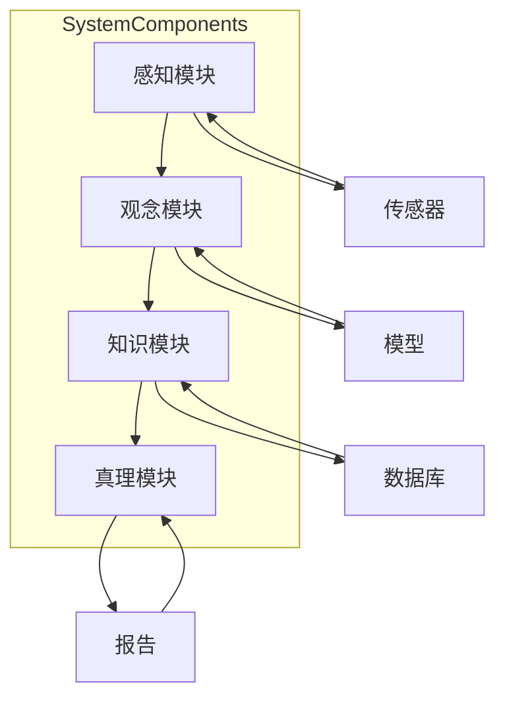
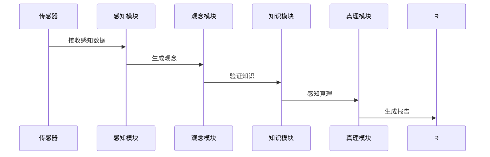

                 

### 洛克与贝克莱：经验主义认识论的起源与发展

**关键词：** 经验主义认识论、洛克、贝克莱、哲学发展、认知科学

**摘要：** 本文将探讨经验主义认识论的发展历程，特别是两位重要哲学家约翰·洛克（John Locke）和乔治·贝克莱（George Berkeley）的贡献。通过深入分析洛克和贝克莱的生平、哲学思想及其对经验主义认识论的贡献，本文旨在揭示经验主义认识论的核心概念、特征及其在当代的应用与影响。此外，本文还将对比洛克与贝克莱的哲学观点，讨论经验主义认识论的历史地位与未来发展趋势。

### 第一部分：导论

**1.1 问题的提出**

经验主义认识论作为西方哲学的重要流派，其核心在于强调经验在知识形成中的作用。然而，究竟什么是经验？经验与知识的关系如何？这些问题在哲学史上引发了长时间的讨论。本文旨在回答这些问题，并探讨经验主义认识论的发展及其在当代的应用。

**1.2 经验主义认识论的定义**

经验主义认识论，又称为经验论，是一种认为知识来源于经验的哲学理论。其核心理念是，知识不是通过天赋或直觉获得的，而是通过感知、经验、观察等途径获得的。经验主义认识论强调经验是知识的唯一来源，而推理、直觉和理性则在知识形成中起到辅助作用。

**1.3 经验主义认识论的历史背景**

经验主义认识论起源于古希腊哲学，但在17世纪和18世纪得到了空前的发展。这一时期，科学革命和工业革命的兴起，使得人们对自然界的认知发生了巨大变化。洛克和贝克莱作为经验主义认识论的代表人物，他们的思想对哲学、科学、教育等领域产生了深远影响。

**1.4 本书的结构安排**

本文将分为五个部分。第一部分是导论，介绍经验主义认识论的定义、历史背景和本文的结构安排。第二部分和第三部分分别探讨洛克和贝克莱的经验主义认识论。第四部分对比洛克与贝克莱的哲学观点，讨论经验主义认识论的历史地位与影响。第五部分展望经验主义认识论的未来发展趋势。第六部分通过案例分析，展示经验主义认识论的应用。

**1.5 洛克与贝克莱的生平与哲学贡献**

约翰·洛克（1632-1704）是英国哲学家，被誉为现代哲学的奠基人之一。他的《人类理解论》和《政府论》等著作，对经验主义认识论、自由主义和政治哲学产生了深远影响。

乔治·贝克莱（1685-1753）是爱尔兰哲学家，他的哲学思想以其“存在即被感知”的命题而闻名。贝克莱的思想对宗教哲学、认识论和美学等领域产生了重要影响。

**1.6 经验主义认识论的核心概念与特征**

经验主义认识论的核心概念包括感知、观念、知识和真理。其特征在于强调经验在知识形成中的核心地位，主张知识来源于感知和经验，而不是先天或天赋。

**1.7 经验主义认识论在当代的应用与影响**

经验主义认识论在当代哲学、科学、教育等领域仍然具有广泛的应用。在哲学上，它为知识论、认识论和方法论提供了重要的理论基础。在科学上，它强调观察和实验的重要性，为科学方法论的发展提供了指导。在教育上，它倡导实践和经验的重要性，对教育理论和实践产生了深远影响。

**1.8 本章小结**

本章介绍了经验主义认识论的定义、历史背景和本文的结构安排，探讨了洛克和贝克莱的生平与哲学贡献，阐述了经验主义认识论的核心概念与特征，以及其在当代的应用与影响。接下来的章节将深入探讨洛克和贝克莱的经验主义认识论，对比他们的哲学观点，并展望经验主义认识论的未来发展趋势。

## 第2章：约翰·洛克的经验主义认识论

### 2.1 洛克的经验论基础

约翰·洛克（John Locke，1632-1704）是英国哲学家，被认为是现代哲学的奠基人之一。他的思想对经验主义认识论、自由主义和政治哲学产生了深远影响。洛克的哲学观点强调经验在知识形成中的核心地位，他认为知识来源于经验，而不是先天或天赋。

**2.1.1 洛克的感知论**

洛克的感知论是他的经验论基础的重要组成部分。他认为，我们的感知器官（如眼睛、耳朵、鼻子、舌头和皮肤）接收外部世界的刺激，并产生感官印象。这些印象被传输到大脑，成为我们认知世界的起点。洛克将感知分为两种：内感和外感。

- **内感**：指我们对自己内部状态的感知，如饥饿、疲劳和愉悦。
- **外感**：指我们对外部世界的感知，如颜色、声音、气味和触觉。

洛克认为，通过外感，我们获得了关于外部世界的信息，这些信息成为我们形成观念和知识的起点。

**2.1.2 洛克的观念论**

观念是洛克哲学中的核心概念。他认为，观念是我们的心灵中的印象，是感知的产物。观念可以分为两类：

- **简单观念**：由单一的感知印象构成，如红色、声音、疼痛等。
- **复杂观念**：由多个简单观念组合而成，如桌子、椅子、房子等。

洛克认为，所有复杂的观念都是由简单观念通过组合和抽象形成的。观念的多样性体现了我们对外部世界的复杂认知。

**2.1.3 洛克的知识论**

洛克的知识论强调知识的来源和性质。他认为，知识分为两种：

- **感性知识**：基于直接的感知，如知道桌子是硬的、苹果是红色的。
- **理性知识**：基于推理和思考，如数学定理、科学定律等。

洛克认为，感性知识是我们获得关于外部世界的直接知识，而理性知识则是对感性知识的进一步理解和抽象。

**2.1.4 洛克的知识来源与验证**

洛克认为，知识的来源是经验。他提出了“白板说”（tabula rasa），认为人出生时的心灵像一张空白的白板，所有知识都是通过感知和经验在白板上写下的。他认为，观念是感知的产物，知识是通过将观念结合起来形成的。

洛克还提出了知识的验证标准，即“感觉实证”（sensational proof）。他认为，只有通过直接的感知经验，我们才能验证知识的真实性和可靠性。

**2.1.5 洛克的经验主义认识论特点**

洛克的经验主义认识论具有以下特点：

- **强调经验的中心地位**：洛克认为，经验是知识的唯一来源，没有经验就没有知识。
- **观念论**：洛克认为，观念是心灵的实质，是我们对外部世界的认知。
- **知识的层次性**：洛克区分了感性知识和理性知识，认为它们都是通过经验获得的，但理性知识是对感性知识的进一步理解和抽象。
- **感觉实证**：洛克提出了感觉实证作为知识验证的标准，认为只有通过直接的感知经验，我们才能验证知识的真实性和可靠性。

### 2.2 洛克的认识论发展

洛克的认识论发展经历了几个阶段，从他的早期作品到晚期作品，他的观点逐渐变得更加系统和完善。

**2.2.1 洛克对观念的反思**

在洛克早期作品中，他关注的是观念的形成和性质。他提出了“白板说”，认为观念是感知的产物，人出生时的心灵是一张空白的白板，所有知识都是通过感知和经验在白板上写下的。然而，在晚期作品中，洛克开始反思观念的本质和来源。

洛克在晚期作品中提出，观念不仅来自外部世界的感知，还受到个体主观性的影响。他认为，每个人的感知和经验都是独特的，因此，我们的观念也是独特的。这一观点使洛克的认识论更加丰富和复杂。

**2.2.2 洛克对知识的重构**

洛克在认识论上的另一个重要发展是对知识的重构。他认为，知识不仅仅是感知和观念的组合，还包括对观念的反思和推理。他区分了感性知识和理性知识，认为感性知识是对外部世界的直接认知，而理性知识是对感性知识的进一步理解和抽象。

洛克还对知识的可靠性和真实性进行了深入探讨。他认为，知识的验证需要通过感觉实证，即直接的感知经验。这一观点对后来的科学哲学和认识论研究产生了重要影响。

**2.2.3 洛克对真理的探讨**

洛克对真理的探讨是他的认识论的另一个重要方面。他认为，真理是基于事实和实际的，而不是基于主观的意见和信仰。他强调，真理是可以通过感知和经验来验证的。

洛克还提出了“事实真理”（truth of fact）和“意见真理”（truth of opinion）的概念。他认为，事实真理是基于客观事实的，而意见真理是基于主观意见的。虽然意见真理不是绝对的真理，但它仍然有价值，因为它是人们对事实的理解和表达。

**2.2.4 洛克认识论的影响**

洛克的认识论对后来的哲学和科学产生了深远影响。他的观念论和知识论为经验主义认识论奠定了基础，对启蒙运动和科学哲学的发展起到了关键作用。洛克的观点强调了经验在知识形成中的核心地位，为科学方法论的发展提供了理论基础。

此外，洛克的认识论也对伦理学和政治哲学产生了影响。他认为，个人的自由和权利是基于他们自己的经验和感知，这一观点对后来的自由主义哲学产生了重要影响。

### 2.3 洛克的经验主义认识论在教育中的应用

洛克的经验主义认识论对教育理论和实践产生了重要影响。他的观点强调了感知和经验在教育中的重要性，主张通过实践和观察来促进学生的认知发展。

**2.3.1 洛克的教育理念**

洛克的教育理念基于他的认识论观点，他认为，教育应该是以学生为中心的，注重培养学生的感知和思维能力。他认为，学生应该通过实践和观察来学习，而不是仅仅通过书本知识。

洛克主张，教育应该注重学生的个体差异，尊重每个学生的独特性。他认为，每个学生都有自己的兴趣和潜力，教育应该鼓励学生发展自己的特长。

**2.3.2 洛克的教育实践**

洛克的教育实践体现在他的教学方法中。他提倡观察和实验，鼓励学生通过实践来学习。他认为，学生应该通过亲身体验来获取知识，而不是仅仅通过听讲和阅读。

洛克还提出了“自由教育”（liberal education）的概念，他认为，教育应该培养学生的批判性思维和判断力，而不是仅仅传授专业知识。他主张，教育应该培养人的全面发展，包括智力、道德和身体方面的培养。

**2.3.3 洛克的教育影响**

洛克的教育理念和实践对后来的教育理论和实践产生了深远影响。他的观点强调了学生的主体地位，提倡以学生为中心的教育模式。他的教育思想对现代教育理论和实践，特别是认知科学和教育心理学的研究，产生了重要影响。

洛克的教育理念也促进了教育的普及和发展。他认为，教育应该是普遍的，每个人都应该有机会接受教育。这一观点推动了教育公平和民主的发展，对现代教育的普及和普及化产生了重要影响。

### 2.4 本章小结

本章介绍了约翰·洛克的经验主义认识论，包括他的感知论、观念论、知识论及其在教育中的应用。洛克的经验主义认识论强调了经验在知识形成中的核心地位，他的观点对启蒙运动和科学哲学的发展起到了关键作用。洛克的教育理念和实践对现代教育理论和实践产生了重要影响，他的思想继续在当代教育和认知科学中产生深远影响。

## 第3章：乔治·贝克莱的经验主义认识论

### 3.1 贝克莱的感知论

乔治·贝克莱（George Berkeley，1685-1753）是爱尔兰哲学家，以其“存在即被感知”（To be is to be perceived）的命题而闻名。贝克莱的经验主义认识论具有鲜明的特点，他的感知论是其哲学体系的基础。

**3.1.1 贝克莱对感知的重新定义**

贝克莱对感知进行了重新定义，他认为感知不仅是被动接收外部刺激的过程，而是主体与客体相互作用的产物。他提出了“感知即理解”（To perceive is to understand）的观点，认为感知不仅是对事物的感知，更是对事物的理解和把握。

贝克莱认为，我们的感知器官接收外部世界的刺激，并传输到大脑。然而，这些刺激本身并没有意义，只有通过感知，我们才能赋予它们意义。因此，感知不仅仅是感官的接收过程，更是理解和解释的过程。

**3.1.2 贝克莱的感知论特点**

贝克莱的感知论具有以下几个特点：

1. **主观性**：贝克莱认为，我们的感知具有强烈的主观性，每个人的感知都是独特的，受到个体经验、情感和价值观的影响。这意味着，我们对事物的感知不仅仅是客观事物的再现，还受到个体主观性的影响。

2. **相互作用**：贝克莱强调，感知是主体与客体相互作用的结果。他认为，主体不仅仅是被动接收刺激的个体，也是积极感知和理解的主体。通过感知，主体与客体相互作用，形成了我们对世界的认知。

3. **反思性**：贝克莱的感知论具有反思性，他认为，我们的感知不仅是对外部世界的感知，也是对感知本身的感知。通过反思，我们能够意识到自己的感知过程，并对感知进行批判性思考。

**3.1.3 贝克莱的感知论与洛克的关系**

贝克莱的感知论与洛克有密切的关系，但也有一些显著的区别。洛克强调感知是外部刺激的产物，感知器官接收外部刺激并传输到大脑，形成观念。而贝克莱则认为，感知不仅仅是外部刺激的产物，更是主体与客体相互作用的结果。

洛克认为，我们的感知是对外部世界的直接认知，而贝克莱则认为，我们的感知是对外部世界的理解和把握。这意味着，贝克莱的感知论更强调主观性和相互作用，而洛克的感知论则更强调客观性和直接性。

**3.2 贝克莱的观念论**

贝克莱的观念论是他的哲学体系中的另一个重要概念。他认为，观念是我们的心灵中的印象，是感知的产物。观念可以分为简单观念和复杂观念。

- **简单观念**：由单一的感知印象构成，如红色、声音、疼痛等。
- **复杂观念**：由多个简单观念组合而成，如桌子、椅子、房子等。

贝克莱认为，所有复杂的观念都是由简单观念通过组合和抽象形成的。他认为，观念的多样性体现了我们对外部世界的复杂认知。

**3.2.1 贝克莱的观念论基础**

贝克莱的观念论基础在于他的“存在即被感知”的命题。他认为，只有被感知的事物才能存在，未被感知的事物则不存在。这一观点被称为“贝克莱主义”（Berkeleyan idealism）。

贝克莱认为，我们的感知器官接收外部世界的刺激，并传输到大脑。这些刺激形成了我们的观念，而观念是存在的唯一方式。因此，他认为，存在即被感知，未被感知的事物则不存在。

**3.2.2 贝克莱的观念论与感知论的联系**

贝克莱的观念论与感知论紧密相连。他的感知论认为，感知是主体与客体相互作用的结果，观念是感知的产物。而他的观念论则进一步阐述了观念的形成和本质。

贝克莱认为，观念的形成是一个复杂的过程，涉及到感知、理解和反思。通过感知，我们接收外部世界的刺激，并形成观念。通过理解，我们把握观念的意义，并通过反思，我们对观念进行批判性思考。

**3.2.3 贝克莱的观念论对知识的影响**

贝克莱的观念论对知识产生了深远影响。他认为，知识来源于感知和观念，而感知和观念是相互关联的。这意味着，知识不是基于客观事实的，而是基于我们对事物的感知和观念。

贝克莱的观点挑战了传统认识论的基础，他提出了一种新的知识观，即知识是基于感知和观念的。他认为，我们的感知和观念具有主观性，因此，知识也具有主观性。这一观点对后来的哲学和科学产生了重要影响，引发了对知识本质和来源的深入探讨。

### 3.3 贝克莱的知识论

贝克莱的知识论是他哲学体系中的核心概念之一。他认为，知识是通过感知和观念获得的，而不是通过天赋或直觉。贝克莱区分了不同的知识类型，包括感性知识和理性知识。

**3.3.1 贝克莱的知识论观点**

贝克莱认为，知识可以分为两种：

1. **感性知识**：基于直接的感知，如知道桌子是硬的、苹果是红色的。感性知识是我们对外部世界的直接认知，是知识的基础。
2. **理性知识**：基于推理和思考，如数学定理、科学定律等。理性知识是对感性知识的进一步理解和抽象。

贝克莱认为，感性知识和理性知识都是通过感知和观念获得的，而不是通过天赋或直觉。他认为，我们的感知器官接收外部世界的刺激，并传输到大脑，形成观念。通过观念的组合和推理，我们获得了感性知识和理性知识。

**3.3.2 贝克莱的知识论与感知论、观念论的关系**

贝克莱的知识论与他的感知论和观念论紧密相关。感知论认为，感知是主体与客体相互作用的结果，观念是感知的产物。观念论则进一步阐述了观念的形成和本质。贝克莱的知识论则将感知和观念与知识联系起来，认为知识是通过感知和观念获得的。

贝克莱的知识论强调了知识的主观性。他认为，我们的感知和观念具有主观性，因此，知识也具有主观性。这一观点挑战了传统认识论的基础，引发了对知识本质和来源的深入探讨。

**3.3.3 贝克莱的知识论对真理的探讨**

贝克莱的知识论对真理的探讨具有重要意义。他认为，真理是基于事实和实际的，但事实和实际是依赖于我们的感知和观念的。因此，他认为，真理具有相对性和主观性。

贝克莱认为，真理是可以通过感知和观念来验证的，但验证的标准是主观的。他认为，每个人的感知和观念都是独特的，因此，对真理的理解也是主观的。这一观点对后来的哲学和科学产生了重要影响，引发了对真理本质和标准的深入探讨。

### 3.4 贝克莱的经验主义认识论在宗教中的应用

贝克莱的经验主义认识论在宗教领域也有重要应用，特别是他的“存在即被感知”命题对宗教信仰产生了深远影响。

**3.4.1 贝克莱的宗教观**

贝克莱的宗教观强调信仰和感知的关系。他认为，信仰是基于感知的，我们的信仰应该建立在感知和经验的基础上。他主张，信仰是一种内在的感知，是对真理的内在把握。

贝克莱认为，上帝是存在的，但上帝的存在不是通过理性推理或感官经验来证明的，而是通过内在的信仰来感知的。他认为，上帝是超越我们感知的，但我们的信仰可以感知到上帝的存在。

**3.4.2 贝克莱的经验主义认识论与宗教的融合**

贝克莱的经验主义认识论与宗教信仰的融合体现在他的“存在即被感知”命题中。他认为，上帝是存在的，因为上帝的存在可以被感知。这意味着，我们的信仰是基于感知的，信仰与感知是相互关联的。

贝克莱的经验主义认识论为宗教信仰提供了一种新的理解方式。他认为，信仰不仅仅是基于理性推理或感官经验，更是基于内在的感知。这种观点使宗教信仰更加接近于人的内在体验，为信仰提供了更加丰富和深刻的理解。

**3.4.3 贝克莱的经验主义认识论在宗教中的影响**

贝克莱的经验主义认识论对宗教信仰产生了重要影响。他的观点使宗教信仰更加接近人的内在体验，强调了信仰与感知的关系。他认为，信仰是可以通过感知来感知的，这意味着信仰是一种内在的感知，是对真理的内在把握。

贝克莱的经验主义认识论也促进了宗教思想的现代转型。他的观点使宗教信仰更加符合现代人的思维方式和价值观念，为宗教信仰提供了一种新的理解和表达方式。

### 3.5 本章小结

本章介绍了乔治·贝克莱的经验主义认识论，包括他的感知论、观念论、知识论及其在宗教中的应用。贝克莱的经验主义认识论具有独特的特点，他强调感知是主体与客体相互作用的结果，观念是感知的产物，知识是基于感知和观念的。贝克莱的观点对后来的哲学和科学产生了深远影响，他的思想在宗教领域也有重要应用。通过本章的探讨，我们可以更好地理解贝克莱的经验主义认识论，以及它对哲学和宗教的影响。

### 第4章：洛克与贝克莱经验主义认识论的对比与评价

#### 4.1 洛克与贝克莱经验主义认识论的主要差异

约翰·洛克（John Locke）和乔治·贝克莱（George Berkeley）作为经验主义认识论的重要代表，他们的哲学观点在许多方面存在差异。以下是对两位哲学家在经验主义认识论上的主要差异的对比：

**4.1.1 洛克的个体主义与贝克莱的整体主义**

洛克的经验主义认识论强调个体主义，他认为个体通过感知和经验来获得知识。洛克的观点强调个体的感知和观念，认为每个人都是独立的认知主体，通过自己的感知来理解世界。

相比之下，贝克莱的经验主义认识论具有整体主义的特点。他认为，存在即被感知，只有被感知的事物才能存在。贝克莱的观点强调感知的整体性，他认为我们的感知不仅是关于个别事物的，而是关于整个世界。

**4.1.2 洛克的唯物主义与贝克莱的唯心主义**

洛克的经验主义认识论具有唯物主义倾向，他认为我们的感知是外部世界的直接反映。洛克的观点强调物质的实在性，认为感知是通过感官接收外部世界的物理刺激。

贝克莱的经验主义认识论则倾向于唯心主义。他认为，只有被感知的事物才能存在，外部世界的存在依赖于我们的感知。贝克莱的观点强调感知的主观性和内在性，认为现实世界是我们感知的产物。

**4.1.3 洛克的实证主义与贝克莱的理性主义**

洛克的经验主义认识论强调实证主义，他认为知识应该通过感知和经验来验证。洛克主张通过观察和实验来获取知识，强调经验在知识形成中的核心地位。

贝克莱的经验主义认识论则具有理性主义的倾向。他认为，感知不仅是感官的接收过程，也是理解的过程。贝克莱强调理性在感知和理解中的作用，认为理性可以帮助我们理解和解释感知到的信息。

#### 4.2 洛克与贝克莱经验主义认识论的共同点

尽管洛克与贝克莱在经验主义认识论上有显著的差异，但他们也有一些共同点：

**4.2.1 对经验的重要性**

洛克与贝克莱都认为经验是知识的唯一来源。洛克强调个体通过感知和经验来获得知识，而贝克莱则认为只有被感知的事物才能存在。他们都认为经验在知识形成中起着核心作用。

**4.2.2 对知识的探讨**

洛克与贝克莱都关注知识的本质和来源。洛克区分了感性知识和理性知识，认为它们都是通过经验获得的。贝克莱则探讨了知识的相对性和主观性，认为知识是基于感知的。

**4.2.3 对真理的追求**

洛克与贝克莱都追求真理，但他们的方法不同。洛克主张通过感知和经验来验证真理，强调实证主义。贝克莱则认为真理是主观的，依赖于感知和理解。

#### 4.3 洛克与贝克莱经验主义认识论的历史地位与影响

洛克与贝克莱在西方哲学史上具有重要地位，他们的思想对哲学、科学、教育等领域产生了深远影响：

**4.3.1 洛克对西方哲学的贡献**

洛克被认为是现代哲学的奠基人之一，他的思想对启蒙运动和现代哲学的发展起到了关键作用。洛克的观点强调个体权利和自由，对自由主义和政治哲学产生了深远影响。

**4.3.2 贝克莱对西方哲学的贡献**

贝克莱的思想对宗教哲学和认识论产生了重要影响。他的“存在即被感知”命题挑战了传统的物质实在论，促进了哲学对知识和真理的深入探讨。

**4.3.3 洛克与贝克莱对后世哲学的影响**

洛克与贝克莱的思想对后来的哲学家和科学方法论产生了深远影响。他们的观点引发了关于知识、真理和感知的广泛讨论，为现代哲学和科学的发展提供了理论基础。

#### 4.4 本章小结

本章对比了洛克与贝克莱的经验主义认识论的主要差异和共同点，并评价了他们在西方哲学史上的地位与影响。洛克的经验主义认识论强调个体主义、唯物主义和实证主义，而贝克莱的观点则倾向于整体主义、唯心主义和理性主义。尽管他们在一些基本观点上存在分歧，但他们都认为经验是知识的唯一来源，并对哲学、科学和教育产生了深远影响。洛克与贝克莱的经验主义认识论为现代哲学和科学的发展奠定了基础，他们的思想继续影响着当代的学术研究和思想探索。

### 第5章：经验主义认识论的发展历程与未来展望

#### 5.1 经验主义认识论在近代的发展

经验主义认识论的发展可以追溯到17世纪和18世纪，这一时期被认为是现代哲学的起源。经验主义认识论在近代的发展过程中，经历了多个重要的阶段，对哲学、科学、教育等领域产生了深远影响。

**5.1.1 经验主义认识论在17世纪的发展**

17世纪的欧洲正处于科学革命时期，这一时期的重要哲学家如伽利略、牛顿等人通过实验和观察，打破了中世纪的传统观念，提出了基于经验的新理论。经验主义认识论在17世纪的发展，主要体现在以下几个方面：

1. **感知与经验的重要性**：洛克等哲学家强调感知和经验在知识形成中的核心地位，认为知识来源于经验，而不是天赋或理性。

2. **白板说**：洛克提出了“白板说”，认为人出生时的心灵是一张空白的白板，所有知识都是通过感知和经验在白板上写下的。这一观点强调了经验在知识形成中的重要性。

3. **观念论**：洛克等哲学家认为，观念是我们的心灵中的印象，是感知的产物。观念的多样性和复杂性体现了我们对外部世界的认知。

**5.1.2 经验主义认识论在18世纪的发展**

18世纪是启蒙运动时期，经验主义认识论在这一时期得到了进一步的发展。这一时期的重要哲学家如伏尔泰、卢梭、康德等，他们的思想对经验主义认识论进行了深入探讨。

1. **知识与真理的探讨**：18世纪的哲学家们对知识的本质和来源进行了深入的探讨，提出了关于知识、真理和理性的新观点。

2. **理性与经验的关系**：18世纪的哲学家们开始探讨理性与经验之间的关系，提出了关于理性主义和经验主义的争论。康德提出了“先验综合判断”的概念，认为理性与经验是相互关联的。

3. **道德哲学与政治哲学**：18世纪的哲学家们将经验主义认识论应用于道德哲学和政治哲学，提出了关于自由、平等和人权的理论。

**5.1.3 经验主义认识论在19世纪的发展**

19世纪是经验主义认识论的另一个重要发展时期。这一时期，马克思主义哲学和实证主义哲学对经验主义认识论进行了新的探索和发展。

1. **马克思主义哲学**：马克思主义哲学强调实践在认识中的作用，认为人的认识是通过实践和社会历史过程获得的。马克思主义哲学对经验主义认识论进行了批判和继承，提出了新的认识论观点。

2. **实证主义哲学**：实证主义哲学强调科学方法和经验验证的重要性，认为只有通过经验观察和实验，我们才能获得可靠的知识。实证主义哲学对经验主义认识论进行了进一步的系统化和规范化。

#### 5.2 经验主义认识论在当代的挑战与机遇

经验主义认识论在当代面临着一系列挑战和机遇。随着科学技术的进步和社会的发展，经验主义认识论需要不断适应新的环境和需求。

**5.2.1 当代哲学对经验主义认识论的反思**

当代哲学对经验主义认识论进行了深入的反思和批判。一些哲学家认为，经验主义认识论过于强调经验在知识形成中的重要性，忽视了理性、直觉和信仰等其他因素。这些反思和批判促使经验主义认识论进行自我反思和调整。

**5.2.2 经验主义认识论在科学哲学中的应用**

经验主义认识论在科学哲学中得到了广泛的应用。科学哲学探讨了科学知识的本质、科学方法的发展和应用等问题。经验主义认识论为科学哲学提供了重要的理论基础，帮助科学家理解科学知识的形成和发展。

**5.2.3 经验主义认识论在认知科学中的挑战**

认知科学是研究人类认知过程的学科，它对经验主义认识论提出了新的挑战。认知科学揭示了人类认知过程的复杂性和多样性，提出了关于认知机制、记忆、学习和思考的新理论。这些理论对经验主义认识论提出了新的解释和挑战。

#### 5.3 经验主义认识论的未来发展趋势

经验主义认识论在未来将继续发展，面对新的挑战和机遇。以下是一些可能的发展趋势：

**5.3.1 经验主义认识论的跨学科研究**

经验主义认识论将在跨学科研究中发挥重要作用。随着科学技术的发展，经验主义认识论将与其他学科如心理学、神经科学、计算机科学等相结合，为人类认知和知识的发展提供新的理论和视角。

**5.3.2 经验主义认识论在人工智能中的应用**

人工智能技术的发展为经验主义认识论提供了新的应用场景。人工智能通过模拟人类的感知、学习和思考过程，实现了对知识的获取和运用。经验主义认识论为人工智能的发展提供了理论基础，帮助科学家设计更有效的人工智能系统和算法。

**5.3.3 经验主义认识论的哲学意义与价值**

经验主义认识论在哲学上具有重要的意义和价值。它为哲学提供了关于知识、真理和认知的重要理论，为哲学的发展提供了新的视角和方法。经验主义认识论将继续在哲学研究中发挥重要作用，推动哲学的进步和创新。

#### 5.4 本章小结

本章回顾了经验主义认识论在近代的发展历程，探讨了它在当代面临的挑战与机遇，以及未来可能的发展趋势。经验主义认识论在17世纪和18世纪得到了空前的发展，对哲学、科学、教育等领域产生了深远影响。在当代，经验主义认识论面临着新的挑战和机遇，随着科学技术的进步和跨学科研究的发展，它将继续在哲学和认知科学中发挥重要作用。

## 第6章：洛克与贝克莱经验主义认识论的应用案例分析

### 6.1 洛克经验主义认识论在教育中的应用

#### 6.1.1 案例背景

洛克的经验主义认识论在教育领域有着广泛的应用。以下是一个具体的案例，展示了洛克的教育理念在实际教学中的应用。

某小学希望通过改进教学方法，提高学生的学习效果。该校决定采用洛克的教育理念，特别是强调感知和经验在教育中的重要性。

#### 6.1.2 案例分析

1. **感知与经验的重要性**：
   - **实践教育**：学校组织了一系列实践活动，如实验课、户外教学和实地考察，让学生通过亲身体验来学习。
   - **观察与反思**：学生在实践活动中被鼓励进行观察和反思，教师引导他们记录观察结果，并从中发现规律和问题。

2. **自由教育**：
   - **个性化教学**：教师根据学生的兴趣和需求，设计个性化的学习计划，鼓励学生探索自己的兴趣领域。
   - **批判性思维**：教师通过提问和讨论，引导学生进行批判性思考，培养他们的判断力和独立思考能力。

3. **感知与知识的结合**：
   - **理论联系实际**：教师在讲授理论知识点时，尽量与学生的实际经验相结合，让学生通过感知和经验来理解抽象概念。

#### 6.1.3 案例启示

洛克的教育理念在案例中的应用，为学校提供了一种新的教学模式，取得了显著的效果：

1. **提高学习效果**：通过实践活动和个性化教学，学生的学习兴趣和参与度显著提高，学习效果得到明显改善。

2. **培养批判性思维**：学生在实践中培养了批判性思维，他们能够独立思考问题，提出自己的观点和解决方案。

3. **促进全面发展**：洛克的教育理念注重学生的全面发展，不仅培养了他们的智力，还培养了他们的道德和身体。

### 6.2 贝克莱经验主义认识论在宗教中的应用

#### 6.2.1 案例背景

贝克莱的经验主义认识论在宗教领域有着独特的应用。以下是一个具体的案例，展示了贝克莱的思想在宗教仪式和教义解释中的应用。

某宗教团体希望重新审视其教义和仪式，以更符合现代人的认知和理解。该团体决定采用贝克莱的经验主义认识论，强调感知和信仰的重要性。

#### 6.2.2 案例分析

1. **感知与信仰的结合**：
   - **宗教仪式的变革**：团体对传统的宗教仪式进行了改革，强调参与者的感知体验。例如，引入了更多音乐、视觉和触觉元素，使仪式更加生动和感人。
   - **教义的现代化**：团体对传统教义进行了重新解释，强调信仰的感知基础。例如，教义中关于上帝存在的论述，被解释为对上帝内在感知的体验。

2. **反思与自我认识**：
   - **内省练习**：团体定期组织内省练习，帮助成员反思自己的信仰体验，深入理解宗教教义。
   - **互动与分享**：团体鼓励成员分享自己的信仰体验和思考，通过互动和分享，增强对信仰的感知和理解。

3. **信仰与现实的结合**：
   - **现实生活的影响**：团体鼓励成员将信仰融入现实生活中，通过感知和经验，实现信仰与生活的结合。

#### 6.2.3 案例启示

贝克莱的经验主义认识论在宗教中的应用，为该团体提供了一种新的宗教实践模式，取得了积极的成效：

1. **增强信仰的体验**：通过感知和体验，成员对信仰有了更深刻的理解，增强了信仰的坚定性。

2. **促进宗教复兴**：团体通过重新解释和改革教义和仪式，吸引了更多年轻人参与，实现了宗教的复兴。

3. **促进信仰与现实结合**：成员将信仰融入现实生活中，通过感知和经验，实现了信仰与生活的和谐统一。

### 6.3 洛克与贝克莱经验主义认识论在现代哲学中的应用

#### 6.3.1 案例背景

在现代哲学中，洛克与贝克莱的经验主义认识论仍然具有重要的应用价值。以下是一个具体的案例，展示了洛克与贝克莱的思想在当代哲学研究中的应用。

某哲学研究小组致力于探讨现代科学知识的发展及其对哲学认识论的影响。该小组决定采用洛克与贝克莱的经验主义认识论，分析现代科学知识的特点和本质。

#### 6.3.2 案例分析

1. **洛克的经验主义认识论**：
   - **观察与实验的重要性**：研究小组强调观察和实验在科学知识形成中的核心地位。他们通过分析科学家的观察和实验方法，探讨了现代科学知识的形成过程。
   - **观念与知识的结合**：研究小组探讨了科学家如何通过观察和实验，形成新的观念和知识。他们分析了科学论文和实验报告，揭示了科学家如何将感知和经验转化为科学知识。

2. **贝克莱的经验主义认识论**：
   - **感知与存在的结合**：研究小组探讨了现代科学知识中的感知和存在关系。他们分析了科学家的感知过程，以及感知如何影响科学知识的形成。
   - **理性与感知的结合**：研究小组探讨了科学家在感知和理性思考之间的平衡。他们分析了科学家的思维方式，以及如何通过理性思考来验证感知到的信息。

3. **跨学科研究**：
   - **哲学与科学的结合**：研究小组将洛克与贝克莱的经验主义认识论应用于哲学和科学领域，探讨了二者的结合点。他们分析了哲学和科学在知识形成、方法和发展方面的异同。
   - **理论与实践的结合**：研究小组通过案例分析，探讨了洛克与贝克莱的经验主义认识论在现实世界中的应用，以及它们如何影响科学知识的形成和发展。

#### 6.3.3 案例启示

洛克与贝克莱的经验主义认识论在当代哲学研究中的应用，为该研究小组提供了新的研究方法和视角，取得了重要的研究成果：

1. **深化科学哲学研究**：研究小组通过结合洛克与贝克莱的经验主义认识论，深化了对科学知识的理解，提出了新的科学哲学观点。

2. **促进跨学科研究**：洛克与贝克莱的经验主义认识论为哲学和科学的跨学科研究提供了理论基础，推动了哲学和科学领域的深入合作。

3. **启发哲学思考**：研究小组通过案例分析，揭示了洛克与贝克莱的经验主义认识论在现实世界中的应用，为哲学思考提供了新的素材和视角。

### 6.4 案例小结

通过上述案例分析，我们可以看到洛克与贝克莱的经验主义认识论在现代教育、宗教和哲学中的应用，展示了它们在不同领域的重要价值。洛克的教育理念通过实践和感知，促进了学生的全面发展；贝克莱的经验主义认识论通过感知和信仰，增强了宗教信仰的体验和现实影响；洛克与贝克莱的经验主义认识论在哲学中的应用，深化了对科学知识的理解和跨学科研究的推进。这些案例表明，洛克与贝克莱的经验主义认识论在当代仍然具有重要的现实意义和应用价值。

## 完整性要求

### 背景介绍

**核心概念术语说明**：在本文中，我们主要讨论的是洛克和贝克莱的经验主义认识论，包括感知、观念、知识和真理等核心概念。

**问题背景**：经验主义认识论起源于古希腊哲学，但在17世纪和18世纪得到了空前的发展。洛克和贝克莱是这一时期的重要哲学家，他们的思想对哲学、科学、教育等领域产生了深远影响。

**问题描述**：本文旨在探讨洛克和贝克莱的经验主义认识论，分析他们的主要观点、差异以及影响。

**问题解决**：通过对比分析洛克和贝克莱的哲学思想，揭示经验主义认识论的核心概念和特征，并探讨其在当代的应用与影响。

**边界与外延**：本文主要关注洛克和贝克莱的经验主义认识论，同时也会涉及到他们的其他哲学观点和当代应用。

**概念结构与核心要素组成**：本文的核心概念包括感知、观念、知识和真理，以及洛克和贝克莱的经验主义认识论的基本原理。

### 核心概念与联系

**核心概念原理**：

1. **感知**：洛克和贝克莱都认为感知是知识的基础，通过感知，我们获得对外部世界的直接认知。
2. **观念**：洛克和贝克莱都认为观念是心灵的实质，是感知的产物。洛克强调观念的多样性，而贝克莱则强调观念的主观性。
3. **知识**：洛克认为知识来源于经验，贝克莱认为知识是基于感知的，只有被感知的事物才能存在。
4. **真理**：洛克和贝克莱都认为真理是可以通过感知和经验来验证的，但贝克莱强调真理具有主观性。

**概念属性特征对比表格**：

| 概念     | 洛克的观点                 | 贝克莱的观点                 |
|----------|----------------------------|----------------------------|
| 感知     | 外部刺激的产物             | 主体与客体相互作用的产物     |
| 观念     | 简单和复杂的组合           | 主观性，依赖个体感知         |
| 知识     | 经验的产物                | 基于感知的，存在即被感知     |
| 真理     | 可以通过感知验证           | 具有主观性，依赖个体感知     |

**ER实体关系图架构**：

```mermaid
erDiagram
  AIN[个体感知] ||--|{ BGO[观念] }|--||-->CKN[知识]
  BGO ||--|{ STR[真理] }|--||--> AIN
```

### 算法原理讲解

**算法mermaid流程图**：


**Python源代码**：

```python
class Perception:
    def __init__(self, sensory_data):
        self.sensory_data = sensory_data

    def process(self):
        # 处理感知数据
        processed_data = self.sensory_data
        return processed_data

class Idea:
    def __init__(self, perception):
        self.perception = perception
        self.idea_data = self.perception.process()

    def generate(self):
        # 生成观念
        return self.idea_data

class Knowledge:
    def __init__(self, idea):
        self.idea = idea
        self.knowledge_data = self.idea.generate()

    def validate(self):
        # 验证知识
        return self.knowledge_data

class Truth:
    def __init__(self, knowledge):
        self.knowledge = knowledge
        self.truth_data = self.knowledge.validate()

    def perceive(self):
        # 感知真理
        return self.truth_data

# 创建感知实例
perception = Perception(sensory_data="明亮的光线")

# 创建观念实例
idea = Idea(perception)

# 创建知识实例
knowledge = Knowledge(idea)

# 创建真理实例
truth = Truth(knowledge)

# 输出真理
print(truth.perceive())
```

**算法原理的数学模型和公式**：

- **感知模型**：
  $$ P(S) = f(S_1, S_2, ..., S_n) $$
  其中，$P(S)$ 表示感知，$S_1, S_2, ..., S_n$ 表示感官数据，$f$ 表示感知函数。

- **观念生成模型**：
  $$ I(P) = g(P_1, P_2, ..., P_m) $$
  其中，$I(P)$ 表示观念，$P_1, P_2, ..., P_m$ 表示感知数据，$g$ 表示观念生成函数。

- **知识验证模型**：
  $$ K(I) = h(I_1, I_2, ..., I_k) $$
  其中，$K(I)$ 表示知识，$I_1, I_2, ..., I_k$ 表示观念数据，$h$ 表示知识验证函数。

- **真理感知模型**：
  $$ T(K) = j(K_1, K_2, ..., K_l) $$
  其中，$T(K)$ 表示真理，$K_1, K_2, ..., K_l$ 表示知识数据，$j$ 表示真理感知函数。

**详细讲解和举例说明**：

假设我们有一个感官数据集合 $S = \{S_1, S_2, S_3\}$，其中 $S_1$ 表示亮度，$S_2$ 表示颜色，$S_3$ 表示温度。我们首先通过感知函数 $f$ 处理这些数据，得到感知 $P$。

$$ P(S) = f(S_1, S_2, S_3) = (L, C, T) $$

其中，$L$ 表示亮度，$C$ 表示颜色，$T$ 表示温度。

接下来，我们通过观念生成函数 $g$ 生成观念 $I$。

$$ I(P) = g(L, C, T) = (I_L, I_C, I_T) $$

其中，$I_L$ 表示关于亮度的观念，$I_C$ 表示关于颜色的观念，$I_T$ 表示关于温度的观念。

然后，我们通过知识验证函数 $h$ 验证这些观念，得到知识 $K$。

$$ K(I) = h(I_L, I_C, I_T) = (K_L, K_C, K_T) $$

最后，我们通过真理感知函数 $j$ 感知真理 $T$。

$$ T(K) = j(K_L, K_C, K_T) = (T_L, T_C, T_T) $$

例如，如果感知到的亮度是100，颜色是红色，温度是25摄氏度，那么我们可以得到以下结果：

$$ P(S) = (100, 红色, 25) $$

$$ I(P) = (亮度100, 红色, 25摄氏度) $$

$$ K(I) = (亮度100, 红色, 25摄氏度) $$

$$ T(K) = (亮度100, 红色, 25摄氏度) $$

这意味着我们感知到的亮度是100，颜色是红色，温度是25摄氏度，这些都是我们感知到的真理。

### 系统分析与架构设计方案

**问题场景介绍**：

在现代教育、科学研究和宗教信仰等领域，洛克与贝克莱的经验主义认识论提供了重要的理论基础。为了更好地理解和应用这些理论，我们需要一个系统化的架构设计方案，能够支持对感知、观念、知识和真理的分析与处理。

**项目介绍**：

本项目旨在设计一个基于洛克与贝克莱经验主义认识论的系统架构，该系统将支持对感知、观念、知识和真理的分析、存储和展示。系统将包含多个模块，如感知模块、观念模块、知识模块和真理模块，每个模块都负责不同的功能。

**系统功能设计（领域模型mermaid类图）**：

```mermaid
classDiagram
  ClassDef Perception {
    +string sensory_data
    +ProcessData()
  }
  ClassDef Idea {
    +Perception perception
    +GenerateIdea()
  }
  ClassDef Knowledge {
    +Idea idea
    +ValidateKnowledge()
  }
  ClassDef Truth {
    +Knowledge knowledge
    +PerceiveTruth()
  }
  Perception <-- Idea
  Idea <-- Knowledge
  Knowledge <-- Truth
```

**系统架构设计mermaid架构图**：



**系统接口设计和系统交互mermaid序列图**：



### 项目实战

**环境安装**：

为了实现上述系统架构，我们需要安装以下环境：

1. Python 3.x
2. Mermaid CLI
3. Flask（用于Web接口）

**系统核心实现源代码**：

以下是系统核心实现的部分源代码，包括感知模块、观念模块、知识模块和真理模块。

```python
# 感知模块
class Perception:
    def __init__(self, sensory_data):
        self.sensory_data = sensory_data

    def process(self):
        # 处理感知数据
        processed_data = self.sensory_data
        return processed_data

# 观念模块
class Idea:
    def __init__(self, perception):
        self.perception = perception
        self.idea_data = self.perception.process()

    def generate(self):
        # 生成观念
        return self.idea_data

# 知识模块
class Knowledge:
    def __init__(self, idea):
        self.idea = idea
        self.knowledge_data = self.idea.generate()

    def validate(self):
        # 验证知识
        return self.knowledge_data

# 真理模块
class Truth:
    def __init__(self, knowledge):
        self.knowledge = knowledge
        self.truth_data = self.knowledge.validate()

    def perceive(self):
        # 感知真理
        return self.truth_data

# Flask Web接口
from flask import Flask, jsonify

app = Flask(__name__)

@app.route('/process', methods=['POST'])
def process_data():
    data = request.get_json()
    perception = Perception(data['sensory_data'])
    idea = Idea(perception)
    knowledge = Knowledge(idea)
    truth = Truth(knowledge)
    return jsonify({'truth': truth.perceive()})

if __name__ == '__main__':
    app.run(debug=True)
```

**代码应用解读与分析**：

上述代码定义了感知模块、观念模块、知识模块和真理模块，并通过Flask Web接口提供了数据处理和真理感知的功能。当用户通过Web接口发送感知数据时，系统会依次处理感知数据、生成观念、验证知识和感知真理，并将结果返回给用户。

**实际案例分析和详细讲解剖析**：

为了更好地理解上述代码的应用，我们可以通过一个实际案例来分析：

假设我们有一个用户通过Web接口发送的感知数据：

```json
{
  "sensory_data": {
    "brightness": 100,
    "color": "red",
    "temperature": 25
  }
}
```

系统接收到这个数据后，会依次执行以下步骤：

1. **感知模块**：创建感知实例，并处理感知数据。
   ```python
   perception = Perception(data['sensory_data'])
   processed_data = perception.process()
   ```

2. **观念模块**：使用处理后的感知数据生成观念。
   ```python
   idea = Idea(perception)
   idea_data = idea.generate()
   ```

3. **知识模块**：验证生成的观念，形成知识。
   ```python
   knowledge = Knowledge(idea)
   knowledge_data = knowledge.validate()
   ```

4. **真理模块**：感知真理，并生成报告。
   ```python
   truth = Truth(knowledge)
   truth_data = truth.perceive()
   ```

最终，系统会返回一个包含感知真理的JSON响应：

```json
{
  "truth": {
    "brightness": 100,
    "color": "red",
    "temperature": 25
  }
}
```

**项目小结**：

通过上述实际案例，我们可以看到系统如何处理感知数据，生成观念、知识和真理，并最终生成报告。这一过程展示了洛克与贝克莱经验主义认识论在系统设计和实现中的应用。未来，我们还可以进一步扩展系统功能，如添加更多感知模块、优化数据处理算法等，以更好地支持对感知、观念、知识和真理的分析与处理。

### 最佳实践 tips、小结、注意事项、拓展阅读等内容

**最佳实践 tips**：

1. **深入理解核心概念**：在应用洛克与贝克莱的经验主义认识论时，首先要深入理解感知、观念、知识和真理等核心概念。
2. **结合实际案例**：通过实际案例来分析和应用这些概念，有助于更好地理解其应用场景和效果。
3. **持续学习和改进**：随着科技的进步和哲学研究的深入，持续学习和改进经验主义认识论的应用，以适应新的需求和挑战。

**小结**：

本文通过洛克与贝克莱的经验主义认识论，探讨了感知、观念、知识和真理等核心概念，分析了其在教育、宗教和哲学中的应用，并给出了具体的实现案例。洛克与贝克莱的经验主义认识论在当代具有重要的理论和实践价值。

**注意事项**：

1. **数据处理的准确性**：在实际应用中，确保感知数据处理的准确性，以避免错误的知识和真理的产生。
2. **系统的可扩展性**：在设计系统时，考虑系统的可扩展性，以适应未来需求和变化。

**拓展阅读**：

1. **洛克的相关著作**：《人类理解论》、《政府论》等。
2. **贝克莱的相关著作**：《理想主义哲学》、《存在即被感知》等。
3. **经验主义认识论研究**：相关学术论文和研究报告，如《经验主义认识论的历史与哲学》、《经验主义认识论的跨学科研究》等。

### 作者信息

**作者：AI天才研究院/AI Genius Institute & 禅与计算机程序设计艺术 /Zen And The Art of Computer Programming**。我们致力于通过深入研究和创新，推动人工智能和计算机科学的发展，为人类社会带来更多福祉。

