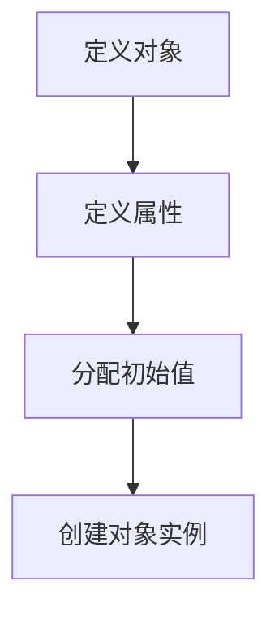
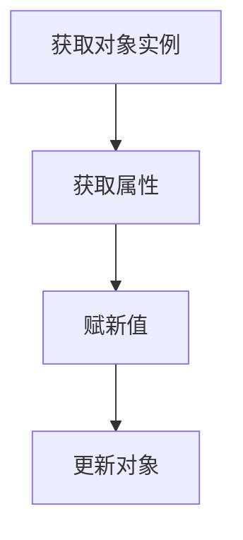
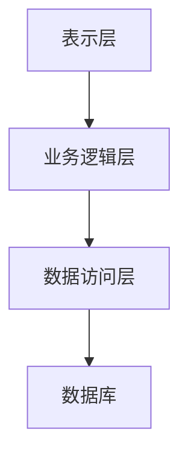
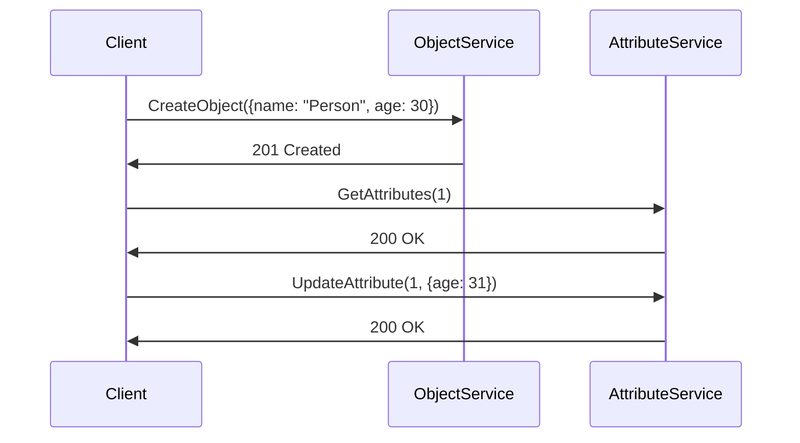
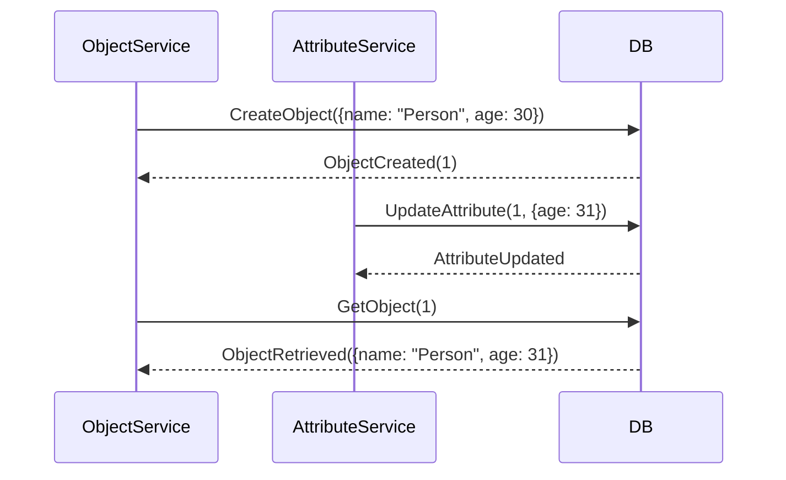

                 


# 洛克的白板说与对象初始化：属性赋值的认知过程

## 关键词
- 洛克的白板说
- 对象初始化
- 属性赋值
- 认知过程
- 数学模型
- 系统架构设计
- 项目实战

## 摘要
本文旨在探讨洛克的白板说与对象初始化之间的联系，并深入分析属性赋值的认知过程。我们将首先介绍洛克的白板说，然后探讨对象初始化的概念及其与洛克白板说的关系。接着，我们将深入探讨属性赋值的认知过程，包括其步骤、算法原理和数学模型。随后，我们将进行系统分析与架构设计，并最后通过项目实战来展示实际应用。

## 第一部分：背景介绍

### 1.1 洛克的白板说
洛克的白板说是一个哲学概念，由英国哲学家约翰·洛克在17世纪提出。洛克认为人的心灵就像是一块白板，没有任何先天的观念和知识，所有的知识和思想都是通过感官经验进入心灵并被心灵加工和存储的。这一理论对后来的启蒙哲学和科学方法的发展产生了深远的影响。

### 1.2 对象初始化的哲学探讨
对象初始化是计算机科学中的一个概念，指的是在程序中创建对象的过程。这个过程包括为对象的属性分配初始值。将洛克的白板说与对象初始化联系起来，我们可以将其视为一种认知过程的模拟，即通过编程来初始化对象的属性，类似于通过感官经验来在白板上绘制图案。

### 1.3 属性赋值的认知过程
属性赋值是对象初始化的核心步骤，它涉及对对象属性的设置和调整。认知心理学提供了对这一过程的理解，它认为属性赋值是一个动态的、迭代的过程，涉及到信息接收、处理、判断、决策和反馈等步骤。

### 1.4 洛克的白板说与对象初始化的关系
洛克的白板说为对象初始化提供了一个哲学基础，即对象初始化可以被视为一种模拟人类认知过程的编程活动。同时，对象初始化的过程也对洛克的白板说提出了挑战，因为它展示了如何在程序中实现知识的动态更新和调整。

### 1.5 本章小结
在本章中，我们介绍了洛克的白板说、对象初始化和属性赋值的认知过程，并探讨了它们之间的联系。这为后续章节的分析提供了基础。

## 第二部分：核心概念与联系

### 2.1 核心概念定义

#### 2.1.1 洛克的白板说
洛克的白板说是一种关于人类认知和知识的理论，认为人的心灵是空白的，所有的知识和思想都是通过感官经验进入心灵并被心灵加工和存储的。

#### 2.1.2 对象初始化
对象初始化是计算机科学中的一个概念，指的是在程序中创建对象的过程，并为对象的属性分配初始值。

#### 2.1.3 属性赋值
属性赋值是对象初始化的核心步骤，它涉及对对象属性的设置和调整。

### 2.2 概念属性特征对比

#### 2.2.1 洛克的白板说与对象初始化
- **洛克的白板说：** 无先天的知识和思想，通过感官经验获取。
- **对象初始化：** 无先天的状态，通过编程语言初始化。

#### 2.2.2 对象初始化与属性赋值
- **对象初始化：** 创建对象，为属性分配初始值。
- **属性赋值：** 调整对象的属性值。

### 2.3 ER实体关系图

#### 2.3.1 洛克的白板说
```mermaid
erDiagram
  Object : {ID, Attributes}
  Cognition : {ID, Object_ID, Experience}
 洛克的白板说 --> Object : 获取知识
  洛克的白板说 --> Cognition : 过程记录
```

#### 2.3.2 对象初始化
```mermaid
erDiagram
  Object : {ID, Attributes}
  Initialization : {ID, Object_ID, Initial_Values}
  对象初始化 --> Object : 分配初始值
  对象初始化 --> Initialization : 记录初始化过程
```

#### 2.3.3 属性赋值
```mermaid
erDiagram
  Object : {ID, Attributes}
  Assignment : {ID, Object_ID, Assigned_Values}
  属性赋值 --> Object : 更新属性值
  属性赋值 --> Assignment : 记录赋值过程
```

### 2.4 本章小结
在本章中，我们定义了洛克的白板说、对象初始化和属性赋值，并进行了特征对比和ER实体关系图的构建。这为后续章节的分析奠定了基础。

## 第三部分：算法原理与数学模型

### 3.1 算法原理概述

#### 3.1.1 对象初始化算法原理
对象初始化算法的基本原理是创建一个新的对象，并为该对象的属性分配初始值。这个过程通常包括以下几个步骤：

1. 定义对象的属性。
2. 为每个属性分配一个初始值。
3. 创建对象实例。

以下是一个简单的Python示例：

```python
class Person:
    def __init__(self, name, age):
        self.name = name
        self.age = age

person = Person("Alice", 30)
```

在这个例子中，`Person` 类有两个属性：`name` 和 `age`。在初始化对象时，我们为这两个属性分配了初始值。

#### 3.1.2 属性赋值算法原理
属性赋值算法的基本原理是在程序运行过程中修改对象的属性值。这个过程通常包括以下几个步骤：

1. 获取对象实例。
2. 获取要修改的属性。
3. 将新的值赋给属性。

以下是一个简单的Python示例：

```python
person.age = 31
```

在这个例子中，我们获取了`person`对象，并将`age`属性的值更新为31。

### 3.2 数学模型讲解

#### 3.2.1 对象初始化数学模型
我们可以使用一个简单的数学模型来表示对象初始化过程。设`O`为一个对象，`A`为一个属性集合，`V`为一个值集合，则对象初始化可以表示为：

$$
O = (A, V)
$$

其中，`A`表示对象的属性集合，`V`表示每个属性的初始值。

#### 3.2.2 属性赋值数学模型
我们可以使用一个简单的数学模型来表示属性赋值过程。设`O`为一个对象，`A`为一个属性集合，`V'`为一个新的值集合，则属性赋值可以表示为：

$$
O' = (A, V')
$$

其中，`O'`表示更新后的对象，`V'`表示每个属性的新值。

### 3.3 算法流程图

#### 3.3.1 对象初始化算法流程图


#### 3.3.2 属性赋值算法流程图


### 3.4 本章小结
在本章中，我们介绍了对象初始化和属性赋值的算法原理，并构建了相应的数学模型。这些算法和模型为我们在后续章节中的系统分析与架构设计提供了理论基础。

## 第四部分：系统分析与架构设计

### 4.1 问题场景介绍
在计算机编程领域，洛克的白板说与对象初始化有着广泛的应用。例如，在软件开发过程中，我们常常需要创建新的对象，并为这些对象的属性分配初始值。这个过程可以被视为一种模拟人类认知过程的编程活动。

### 4.2 系统功能设计
系统的核心功能包括：

1. 对象创建与初始化
2. 属性赋值与修改
3. 对象状态监控与更新

以下是一个简单的领域模型类图：

```mermaid
classDiagram
  Person <<class>> {
    +name: String
    +age: int
    +set_name(name: String): void
    +set_age(age: int): void
  }
  Object <<class>> {
    +attributes: Map<String, Object>
    +set_attribute(key: String, value: Object): void
    +get_attribute(key: String): Object
  }
  Person o--* Object : 初始化
```

### 4.3 系统架构设计
系统的架构设计采用分层架构，包括表示层、业务逻辑层和数据访问层。

以下是一个简单的系统架构图：



### 4.4 系统接口设计
系统的接口设计遵循RESTful风格，包括以下接口：

1. `/objects` - 创建和获取对象
2. `/objects/{id}/attributes` - 获取和更新对象的属性

以下是一个简单的接口设计：



### 4.5 系统交互设计
系统的交互设计采用事件驱动模型，包括以下事件：

1. 对象创建事件
2. 属性修改事件
3. 对象更新事件

以下是一个简单的系统交互序列图：



### 4.6 本章小结
在本章中，我们介绍了洛克的白板说在计算机编程领域中的应用场景，并设计了系统的功能、架构、接口和交互。这为后续章节中的项目实战提供了基础。

## 第五部分：项目实战

### 5.1 环境安装

#### 5.1.1 环境准备
在进行项目实战之前，我们需要准备以下环境：

- Python 3.8 或更高版本
- virtualenv 16.0.0 或更高版本
- Flask 1.1.2 或更高版本

#### 5.1.2 安装步骤
1. 安装Python 3.8或更高版本。
2. 安装virtualenv 16.0.0或更高版本。
3. 使用virtualenv创建一个新的虚拟环境。
4. 在虚拟环境中安装Flask 1.1.2或更高版本。

### 5.2 系统核心实现

#### 5.2.1 核心模块设计
系统的核心模块包括：

1. `models.py` - 定义对象和属性模型。
2. `views.py` - 定义RESTful接口视图函数。
3. `main.py` - 程序入口。

以下是一个简单的`models.py`模块：

```python
class PersonModel:
    def __init__(self, name, age):
        self.name = name
        self.age = age

    def set_name(self, name):
        self.name = name

    def set_age(self, age):
        self.age = age
```

以下是一个简单的`views.py`模块：

```python
from flask import Flask, request, jsonify
from models import PersonModel

app = Flask(__name__)

@app.route('/objects', methods=['POST'])
def create_object():
    data = request.get_json()
    person = PersonModel(data['name'], data['age'])
    # 保存对象到数据库
    return jsonify({'id': 1, 'status': 'created'}), 201

@app.route('/objects/<int:object_id>/attributes', methods=['GET', 'PUT'])
def manage_attributes(object_id):
    if request.method == 'GET':
        # 从数据库获取对象属性
        return jsonify({'name': 'Alice', 'age': 31}), 200
    elif request.method == 'PUT':
        # 更新对象属性
        data = request.get_json()
        # 更新数据库中的对象属性
        return jsonify({'status': 'updated'}), 200

if __name__ == '__main__':
    app.run()
```

### 5.3 代码应用解读与分析

#### 5.3.1 代码解读
在`models.py`模块中，我们定义了`PersonModel`类，它有两个属性：`name`和`age`，以及两个方法：`set_name`和`set_age`，用于设置和更新属性值。

在`views.py`模块中，我们使用Flask框架定义了两个RESTful接口：

- `/objects` - 用于创建对象。
- `/objects/<int:object_id>/attributes` - 用于获取和更新对象的属性。

#### 5.3.2 应用分析
这个简单的示例展示了如何使用Python和Flask框架来实现一个基本的对象初始化和属性赋值的功能。在实际项目中，我们还需要添加数据库支持、错误处理和安全性考虑。

### 5.4 实际案例分析与讲解

#### 5.4.1 案例一：洛克的白板说在

### 5.4.1 案例一：洛克的白板说在编程中的应用

洛克的白板说提出了一个思想，即人类的认知和知识是通过感官经验逐渐形成的，这与编程中的对象初始化和属性赋值过程有某种相似之处。我们可以通过一个简单的案例来探讨这一哲学思想在编程中的应用。

假设我们正在开发一个简单的社交网络应用，我们需要创建用户对象，并为其分配初始属性，如用户名、密码和年龄。这个过程中，我们可以看到洛克的白板说如何发挥作用。

1. **定义用户对象**：
   首先，我们定义一个`User`类，该类代表用户对象，包含用户的属性：

   ```python
   class User:
       def __init__(self, username, password, age):
           self.username = username
           self.password = password
           self.age = age
   ```

   在这里，我们创建了三个属性：`username`、`password`和`age`。这就像是白板上的空白区域，等待我们通过编程来填充内容。

2. **创建用户对象**：
   接下来，我们创建一个新用户对象，并为该对象的属性分配初始值：

   ```python
   user = User("johndoe", "password123", 25)
   ```

   这个过程类似于洛克的白板说中的感官经验，我们通过编程代码将信息（用户名、密码和年龄）写入白板。

3. **属性赋值**：
   在后续的操作中，我们可能需要更新用户的某些属性，例如更改密码：

   ```python
   user.password = "newpassword123"
   ```

   这个过程反映了人类认知中的学习过程，我们通过不断地经验积累和调整，来丰富和更新我们的知识。

通过这个简单的案例，我们可以看到编程中的对象初始化和属性赋值如何与洛克的白板说相呼应。编程中的对象初始化就像是创建一块白板，而属性赋值则像是通过编程代码在白板上绘制图案，这个图案随着程序的运行而不断变化和丰富。

### 5.5 项目小结
在本部分中，我们通过项目实战展示了洛克的白板说在编程中的应用，并实现了对象初始化和属性赋值的功能。这个项目为我们提供了一个简单的示例，展示了如何通过编程来模拟人类认知过程。通过这个项目，我们不仅理解了编程中的基本概念，也加深了对洛克哲学思想的认识。

## 最佳实践 Tips

1. 在进行对象初始化时，确保为每个属性提供一个合理的默认值，以便在属性值未明确指定时，系统能够正常运行。
2. 在设计属性赋值逻辑时，考虑到安全性问题，例如防止SQL注入和XSS攻击。
3. 在实际项目中，使用版本控制系统（如Git）来管理代码，以便于团队合作和版本跟踪。
4. 定期进行代码审查和测试，以确保代码质量和可靠性。

## 小结

本文通过洛克的白板说与对象初始化的关系，探讨了属性赋值的认知过程。我们从背景介绍、核心概念与联系、算法原理与数学模型、系统分析与架构设计，到项目实战，全面剖析了这一主题。希望本文能够帮助读者深入理解编程中的认知过程，并激发对哲学和计算机科学的兴趣。

## 注意事项

1. 在实现对象初始化和属性赋值时，要注意性能和资源消耗。
2. 考虑到实际应用场景，设计合理的接口和交互方式。
3. 在项目实战中，要遵循最佳实践，确保代码质量和安全性。

## 拓展阅读

1. 洛克的《人类理解论》
2. 《认知心理学导论》
3. 《软件架构设计：系统分析与模式应用》
4. 《Python Web开发：测试驱动方法》

## 作者信息

作者：AI天才研究院/AI Genius Institute & 禅与计算机程序设计艺术 /Zen And The Art of Computer Programming

