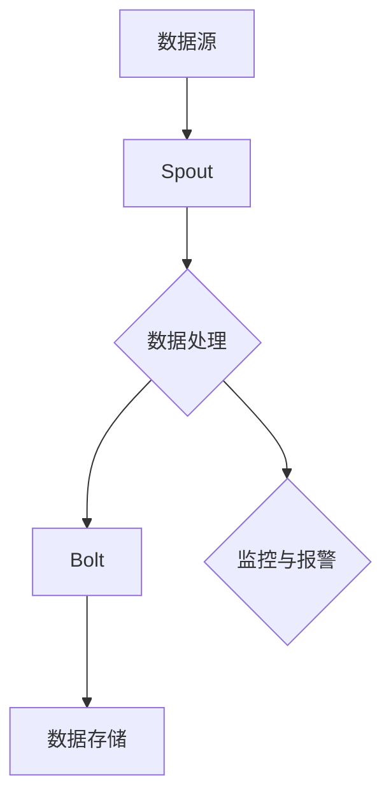

                 

# 流计算：实时数据处理的新范式

## 关键词
- 流计算
- 实时数据处理
- 消息传递模型
- 数据流模型
- 分布式系统
- 云原生流计算

## 摘要
流计算作为实时数据处理的新范式，正逐步取代传统的批处理模式，成为大数据和云计算领域的重要研究方向。本文将从流计算的背景、核心概念、原理、框架应用以及未来发展趋势等多个方面进行深入探讨，旨在为读者提供全面而系统的流计算知识体系。

## 第一部分：流计算概述

### 1.1 流计算背景

#### 1.1.1 传统批处理与流处理的对比
在传统的数据处理模式中，批处理是最常见的方式。然而，随着互联网和物联网的发展，数据产生的速度和规模急剧增加，批处理模式逐渐显露出其局限性。首先，批处理模式通常需要较长的处理时间，导致数据的实时性无法满足需求。其次，批处理模式下，数据处理通常是周期性的，无法应对实时事件的处理。

流处理则是对这一问题的有效回应。流处理能够对数据进行实时处理，使得系统能够快速响应实时事件。例如，在金融交易中，流处理能够实时监控交易数据，及时发现异常交易并进行处理。

#### 1.1.2 流计算的发展历程
流计算的概念最早可以追溯到1980年代的分布式计算研究。然而，直到互联网和大数据时代的到来，流计算才逐渐成为研究热点。2009年，Apache Storm的诞生标志着流计算框架的正式兴起。随后，Spark Streaming、Flink等一批流计算框架相继问世，使得流计算在实际应用中得到了广泛应用。

#### 1.1.3 流计算在现代数据架构中的重要性
在现代数据架构中，流计算扮演着至关重要的角色。首先，流计算能够实现实时数据处理，使得企业能够更快地做出决策。其次，流计算能够与机器学习相结合，实现实时预测和智能分析。最后，流计算在物联网、智能城市等新兴领域中也具有广泛的应用前景。

### 1.2 流计算核心概念

#### 1.2.1 流与批处理的定义
流（Stream）是指一组连续的、有时间顺序的数据元素。与流相对的是批（Batch），指一组不连续、没有时间顺序的数据。

#### 1.2.2 实时数据处理需求
实时数据处理需求主要来源于以下几个方面：
- 金融交易：实时监控交易，及时发现异常交易。
- 社交网络：实时分析用户行为，提供个性化推荐。
- 物联网：实时处理传感器数据，实现智能监控。

#### 1.2.3 流计算的基本组件
流计算系统通常包括以下几个基本组件：
- Spouts：产生流数据的源组件。
- Bolts：对流数据进行处理和转换的组件。
- 队列：用于组件之间数据传输的中介。

### 1.3 流计算框架概述

#### 1.3.1 Apache Storm与Spark Streaming
Apache Storm是一个分布式、可靠和高效的流处理系统，适用于实时数据流的处理。Spark Streaming是基于Spark的流处理框架，能够与Spark的其他组件无缝集成，实现高效的数据处理。

#### 1.3.2 Flink与Samza
Flink是一个开源的分布式流处理框架，具有高性能和灵活性。Samza是基于Apache Mesos的流处理框架，适用于大规模分布式数据处理。

#### 1.3.3 流计算架构模式
流计算的架构模式主要包括：
- 消息传递模型：基于消息队列的分布式数据处理模式。
- 数据流模型：基于事件驱动的数据处理模式。
- 分布式系统模型：基于分布式计算的架构模式。

### 1.4 流计算应用场景

#### 1.4.1 实时数据分析
实时数据分析是流计算的重要应用场景之一。通过流计算，企业能够实时监控业务数据，发现潜在问题，并及时做出调整。

#### 1.4.2 实时监控与报警
流计算能够实时监控系统的运行状态，一旦发现异常，立即发出报警，确保系统的稳定运行。

#### 1.4.3 事件驱动架构
流计算与事件驱动架构的结合，能够实现系统的智能化和自动化。例如，在智能城市中，流计算能够实时处理传感器数据，实现智能交通管理和环境监控。

### 1.5 流计算的未来发展趋势

#### 1.5.1 云原生流计算
随着云计算的普及，云原生流计算将成为未来的趋势。云原生流计算能够充分利用云平台的弹性，实现高效的数据处理。

#### 1.5.2 机器学习与流计算结合
机器学习与流计算的结合，将使得流计算能够实现更复杂的实时数据处理和分析。

#### 1.5.3 流计算在物联网中的应用
物联网的快速发展，将使得流计算在智能家居、智能交通、智能医疗等领域得到广泛应用。

## 第二部分：流计算原理与算法

### 2.1 流计算基础算法

#### 2.1.1 聚合操作
聚合操作是对流数据进行汇总和统计的操作。常见的聚合操作包括计数、求和、求平均数等。

#### 2.1.2 滑动窗口计算
滑动窗口计算是一种对连续数据进行统计分析的方法。它能够计算一个窗口内数据的总和、平均值等。

#### 2.1.3 持续查询
持续查询（Continuous Query）是一种对数据流进行实时查询的方法。它能够实时返回查询结果，并根据新数据更新结果。

### 2.2 流计算核心模型

#### 2.2.1 消息传递模型
消息传递模型是一种基于消息队列的分布式数据处理模式。它能够实现高效的数据传输和分布式处理。

#### 2.2.2 数据流模型
数据流模型是一种基于事件驱动的数据处理模式。它能够实现实时数据的处理和分析。

#### 2.2.3 分布式系统模型
分布式系统模型是一种基于分布式计算的架构模式。它能够实现大规模分布式数据处理。

### 2.3 流计算系统架构

#### 2.3.1 数据分区策略
数据分区策略是一种对数据进行分区的方法。它能够实现数据的并行处理，提高系统性能。

#### 2.3.2 数据一致性保障
数据一致性保障是一种确保数据一致性的方法。在分布式系统中，数据一致性是一个重要的问题。

## 第三部分：流计算框架应用

### 3.1 Apache Storm实战

#### 3.1.1 Storm环境搭建
介绍如何在Windows和Linux环境中搭建Apache Storm开发环境。

#### 3.1.2 Storm编程模型
介绍Apache Storm的编程模型，包括Spouts和Bolts的概念和用法。

#### 3.1.3 Storm案例实战
通过一个简单的实时词频统计案例，展示如何使用Apache Storm进行流数据处理。

### 3.2 Spark Streaming实战

#### 3.2.1 Spark Streaming环境搭建
介绍如何在Windows和Linux环境中搭建Spark Streaming开发环境。

#### 3.2.2 Spark Streaming编程模型
介绍Spark Streaming的编程模型，包括DStream和RDD的概念和用法。

#### 3.2.3 Spark Streaming案例实战
通过一个简单的实时股票数据监控案例，展示如何使用Spark Streaming进行流数据处理。

### 3.3 Flink实战

#### 3.3.1 Flink环境搭建
介绍如何在Windows和Linux环境中搭建Flink开发环境。

#### 3.3.2 Flink编程模型
介绍Apache Flink的编程模型，包括DataStream API的概念和用法。

#### 3.3.3 Flink案例实战
通过一个简单的实时流处理系统架构设计案例，展示如何使用Flink进行流数据处理。

## 结论
流计算作为实时数据处理的新范式，正在逐步改变大数据和云计算领域的格局。通过本文的介绍，读者应该对流计算有了全面而深入的了解。希望本文能够为读者在流计算领域的研究和应用提供有益的参考。在未来的技术发展中，流计算将继续发挥重要作用，推动各行各业的数字化和智能化进程。

## 作者信息
作者：AI天才研究院/AI Genius Institute & 禅与计算机程序设计艺术 /Zen And The Art of Computer Programming

## 最佳实践 Tips
- 在选择流计算框架时，需要根据实际需求和系统性能要求进行选择。
- 在流计算系统中，需要充分考虑数据一致性和容错性。
- 在流计算应用中，需要结合实际业务需求，设计合理的数据处理流程。

## 小结
流计算作为一种实时数据处理的新范式，具有广泛的应用前景。通过本文的介绍，读者应该能够对流计算有一个全面而深入的了解。在未来的技术发展中，流计算将继续发挥重要作用，推动各行各业的数字化和智能化进程。

## 拓展阅读
- 《流计算：原理、框架与应用》
- 《Apache Storm实战：实时数据处理》
- 《Spark Streaming实战：实时大数据处理》
- 《Flink实战：大规模流处理平台》
- 《云计算与大数据技术综述》

### 第一部分：流计算概述

## 1.1 流计算背景

### 1.1.1 传统批处理与流处理的对比

在传统的数据处理模式中，批处理（Batch Processing）是最常见的方式。批处理的基本思想是将数据集中起来，然后在一个时间段内一次性进行处理。这种方式的好处是简单、易实现，适用于数据处理量不大、处理时间可以承受的场景。

然而，随着互联网和物联网的发展，数据产生的速度和规模急剧增加，传统的批处理模式逐渐显露出其局限性。首先，批处理模式通常需要较长的处理时间，导致数据的实时性无法满足需求。例如，在金融交易中，每秒产生的交易数据量巨大，而传统的批处理模式可能需要几分钟甚至更长时间才能处理完这些数据，这使得系统无法实时监控交易情况，无法及时发现和应对异常交易。

其次，批处理模式下，数据处理通常是周期性的，无法应对实时事件的处理。例如，在社交网络中，用户的行为数据（如点赞、评论、分享等）需要实时分析，以便提供个性化推荐和内容优化。然而，批处理模式下，数据处理通常是按照小时或天为周期进行的，这导致系统无法实时响应用户行为的变化。

流处理（Stream Processing）是对这一问题的有效回应。流处理的基本思想是将数据看作一系列连续的事件流，实时进行处理。流处理系统能够对数据进行实时处理，使得系统能够快速响应实时事件。例如，在金融交易中，流处理能够实时监控交易数据，及时发现异常交易并进行处理。在社交网络中，流处理能够实时分析用户行为，提供个性化推荐。

### 1.1.2 流计算的发展历程

流计算的概念最早可以追溯到1980年代的分布式计算研究。当时，研究人员开始探索如何利用分布式系统实现高效的数据处理。然而，由于硬件和软件技术的限制，流计算并未得到广泛应用。

随着互联网和大数据时代的到来，流计算逐渐成为研究热点。2009年，Apache Storm的诞生标志着流计算框架的正式兴起。Apache Storm是一个分布式、可靠和高效的流处理系统，适用于实时数据流的处理。随后，Spark Streaming、Flink等一批流计算框架相继问世，使得流计算在实际应用中得到了广泛应用。

2014年，Apache Flink正式成为Apache基金会的一个顶级项目，标志着流计算技术的成熟。Flink以其高性能、灵活性和易用性，成为流计算领域的重要代表。此外，Samza、Kafka Streams等流计算框架也在不同场景中得到了广泛应用。

### 1.1.3 流计算在现代数据架构中的重要性

在现代数据架构中，流计算扮演着至关重要的角色。首先，流计算能够实现实时数据处理，使得企业能够更快地做出决策。在金融领域，实时处理交易数据能够帮助金融机构快速识别风险，及时调整交易策略。在电商领域，实时分析用户行为能够帮助企业快速调整营销策略，提高用户满意度。

其次，流计算能够与机器学习相结合，实现实时预测和智能分析。例如，在智能交通领域，通过实时分析交通数据，可以预测交通拥堵情况，并提前调整交通信号灯，减少交通拥堵。在医疗领域，通过实时分析医疗数据，可以预测疾病爆发趋势，提前采取预防措施。

最后，流计算在物联网、智能城市等新兴领域中也具有广泛的应用前景。在物联网中，流计算能够实时处理传感器数据，实现智能监控和自动化控制。在智能城市中，流计算能够实时处理城市运行数据，实现智能交通管理、环境监测等。

### 1.2 流计算核心概念

#### 1.2.1 流与批处理的定义

流（Stream）是指一组连续的、有时间顺序的数据元素。流中的每个元素都有一个时间戳，表示该元素产生的时间。流处理的基本思想是实时地处理流中的数据，以实现对实时事件的处理。

与流相对的是批（Batch），指一组不连续、没有时间顺序的数据。批处理的基本思想是将数据集中起来，然后在一个时间段内一次性进行处理。

#### 1.2.2 实时数据处理需求

实时数据处理需求主要来源于以下几个方面：

1. **金融交易**：金融交易是典型的实时数据处理需求。金融机构需要对每笔交易进行实时监控，及时发现异常交易并进行处理。例如，实时监控可疑交易、实时风险控制等。

2. **社交网络**：社交网络中的用户行为数据需要实时分析，以提供个性化推荐和内容优化。例如，实时分析用户点赞、评论、分享等行为，以推荐相关内容。

3. **物联网**：物联网中的传感器数据需要实时处理，以实现智能监控和自动化控制。例如，实时分析传感器数据，预测设备故障，提前进行维护。

4. **智能交通**：智能交通系统需要实时处理交通数据，以实现智能交通管理和优化。例如，实时监控交通流量，调整交通信号灯，减少交通拥堵。

5. **智能医疗**：智能医疗系统需要实时处理医疗数据，以实现智能诊断、疾病预测等。例如，实时分析患者数据，预测疾病爆发趋势，提前采取预防措施。

#### 1.2.3 流计算的基本组件

流计算系统通常包括以下几个基本组件：

1. **Spouts**：Spouts是流计算系统中的数据源组件，负责产生流数据。Spouts可以是实时数据源，如Kafka、Twitter等，也可以是本地文件或其他数据源。

2. **Bolts**：Bolts是流计算系统中的数据处理组件，负责对流数据进行处理和转换。Bolts可以执行各种操作，如过滤、聚合、转换等。

3. **队列**：队列是组件之间数据传输的中介，负责将Spouts产生的数据传递给Bolts，并将Bolts处理后的数据传递给下一个Bolts或存储系统。

### 1.3 流计算框架概述

#### 1.3.1 Apache Storm与Spark Streaming

Apache Storm和Spark Streaming是两种常见的流计算框架，它们各自具有独特的特点和优势。

1. **Apache Storm**：
   - **特点**：分布式、可靠、高效。
   - **应用场景**：实时数据处理、实时分析等。
   - **优点**：易于部署和管理，适合大规模分布式数据处理。

2. **Spark Streaming**：
   - **特点**：基于Spark，与Spark生态系统无缝集成。
   - **应用场景**：实时数据处理、实时分析等。
   - **优点**：性能优秀，易于与Spark其他组件集成。

#### 1.3.2 Flink与Samza

Flink和Samza是另外两种重要的流计算框架，它们在性能、功能和应用场景上也有所不同。

1. **Apache Flink**：
   - **特点**：高性能、灵活、可扩展。
   - **应用场景**：实时数据处理、实时分析、机器学习等。
   - **优点**：支持窗口计算、状态管理和复杂事件处理。

2. **Apache Samza**：
   - **特点**：基于Apache Mesos，可扩展性强。
   - **应用场景**：大规模分布式数据处理、实时分析等。
   - **优点**：易于部署和管理，适合大规模分布式系统。

#### 1.3.3 流计算架构模式

流计算架构模式主要包括以下几种：

1. **消息传递模型**：
   - **特点**：基于消息队列，实现分布式数据处理。
   - **应用场景**：实时数据处理、实时分析等。
   - **优点**：易于实现，适用于大规模分布式系统。

2. **数据流模型**：
   - **特点**：基于事件驱动，实现实时数据处理。
   - **应用场景**：实时数据处理、实时分析等。
   - **优点**：易于理解，适用于复杂实时处理场景。

3. **分布式系统模型**：
   - **特点**：基于分布式计算，实现大规模数据处理。
   - **应用场景**：大规模分布式数据处理、实时分析等。
   - **优点**：性能优秀，适用于大规模分布式系统。

### 1.4 流计算应用场景

#### 1.4.1 实时数据分析

实时数据分析是流计算的重要应用场景之一。实时数据分析能够帮助企业和组织快速响应市场变化，优化业务流程，提高竞争力。

1. **金融行业**：实时数据分析在金融行业有着广泛的应用。例如，金融机构可以通过实时分析交易数据，发现异常交易、预测市场趋势，从而进行风险管理和投资决策。

2. **电子商务**：电子商务企业可以通过实时分析用户行为数据，了解用户需求、优化推荐系统，提高用户满意度。

3. **物流行业**：物流企业可以通过实时分析运输数据，优化运输路线、提高运输效率。

4. **医疗行业**：医疗行业可以通过实时分析患者数据，优化诊疗流程、提高医疗服务质量。

#### 1.4.2 实时监控与报警

实时监控与报警是流计算在运维和安全管理中的重要应用。通过实时监控系统运行状态，及时发现异常并进行报警，可以确保系统的稳定运行。

1. **IT运维**：IT运维人员可以通过实时监控服务器、网络设备等，及时发现故障、优化性能。

2. **网络安全**：网络安全人员可以通过实时分析网络流量，发现网络攻击、预测安全威胁。

3. **工业生产**：工业生产中的生产线可以通过实时监控设备运行状态，预防设备故障、提高生产效率。

#### 1.4.3 事件驱动架构

事件驱动架构（Event-Driven Architecture，EDA）是一种以事件为中心的软件架构模式，通过事件驱动实现系统的运行和响应。

1. **智能家居**：智能家居系统可以通过实时处理传感器数据，实现自动化控制，提高生活质量。

2. **智能交通**：智能交通系统可以通过实时分析交通数据，实现智能信号控制、优化交通流量。

3. **智能医疗**：智能医疗系统可以通过实时分析医疗数据，实现智能诊断、疾病预测。

### 1.5 流计算的未来发展趋势

#### 1.5.1 云原生流计算

随着云计算的普及，云原生流计算将成为未来的趋势。云原生流计算能够充分利用云平台的弹性、可扩展性，实现高效的数据处理。

1. **弹性伸缩**：云原生流计算能够根据负载自动调整资源，实现弹性伸缩，提高系统性能。

2. **自动化运维**：云原生流计算能够利用云平台提供的自动化工具，实现自动部署、自动扩缩容、自动监控等，降低运维成本。

3. **混合云与多云**：云原生流计算能够支持混合云和多云环境，实现跨云数据共享和协同处理。

#### 1.5.2 机器学习与流计算结合

机器学习与流计算的结合，将使得流计算能够实现更复杂的实时数据处理和分析。

1. **实时预测**：通过实时分析数据，可以预测未来的趋势和变化，为企业提供决策支持。

2. **智能分析**：通过结合机器学习算法，可以对实时数据进行深入分析，发现隐藏的模式和规律。

3. **自适应优化**：通过实时分析系统性能数据，可以自动调整系统配置，实现自适应优化。

#### 1.5.3 流计算在物联网中的应用

物联网（Internet of Things，IoT）的快速发展，将使得流计算在物联网领域得到广泛应用。

1. **智能监控**：通过实时处理传感器数据，可以实现智能监控，提高设备运行效率。

2. **远程控制**：通过实时处理设备数据，可以实现远程控制，提高设备操作便捷性。

3. **预测性维护**：通过实时分析设备数据，可以预测设备故障，提前进行维护，减少设备故障率。

## 第二部分：流计算原理与算法

### 2.1 流计算基础算法

流计算基础算法是流计算系统处理数据的核心，主要包括聚合操作、滑动窗口计算和持续查询等。

#### 2.1.1 聚合操作

聚合操作是对流数据进行汇总和统计的操作，常见的聚合操作包括计数（Count）、求和（Sum）、求平均数（Average）等。

1. **计数（Count）**：计数操作用于计算流中元素的数量。在流计算系统中，可以通过简单的计数操作来统计流中元素的个数。

   ```python
   count = 0
   for element in stream:
       count += 1
   ```

2. **求和（Sum）**：求和操作用于计算流中所有元素的和。在流计算系统中，可以通过求和操作来计算流中所有元素的总和。

   ```python
   total_sum = 0
   for element in stream:
       total_sum += element
   ```

3. **求平均数（Average）**：求平均数操作用于计算流中所有元素的平均值。在流计算系统中，可以通过求平均数操作来计算流中所有元素的平均值。

   ```python
   average = total_sum / len(stream)
   ```

#### 2.1.2 滑动窗口计算

滑动窗口计算是一种对连续数据进行统计分析的方法，它可以计算一个窗口内数据的总和、平均值等。在流计算中，滑动窗口计算常用于实时分析数据。

1. **滑动窗口的定义**：滑动窗口是一个固定大小的窗口，它在数据流中从起始点开始，逐步向右滑动。每次窗口滑动一个固定大小的步长，窗口内的数据会发生变化。

2. **滑动窗口算法**：滑动窗口算法的基本思想是，在一个固定大小的窗口内，对数据进行处理，然后窗口向右滑动，重新计算新的窗口内的数据。

   ```python
   def滑动窗口计算(stream, window_size, step_size):
       current_window = []
       for element in stream:
           current_window.append(element)
           if len(current_window) > window_size:
               current_window.pop(0)
           # 计算窗口内的数据
           sum_window = sum(current_window)
           average_window = sum_window / len(current_window)
           yield average_window
   ```

   在上述算法中，`stream`是输入的数据流，`window_size`是窗口的大小，`step_size`是窗口滑动的步长。每次窗口滑动后，会计算新的窗口内的数据和平均值，并输出。

#### 2.1.3 持续查询

持续查询（Continuous Query，CQ）是一种对数据流进行实时查询的方法。持续查询能够实时返回查询结果，并根据新数据更新结果。

1. **持续查询的定义**：持续查询是一种对数据流进行持续、实时查询的方法。它与批处理查询不同，批处理查询通常是在一定时间周期内进行，而持续查询能够对每条新到达的数据进行实时查询。

2. **持续查询的实现**：持续查询通常通过定义查询语句来实现。查询语句描述了需要查询的数据和查询条件。在流计算系统中，持续查询会对新到达的数据进行实时查询，并将查询结果输出。

   ```python
   def持续查询(stream, query):
       for element in stream:
           result = query(element)
           yield result
   ```

   在上述实现中，`stream`是输入的数据流，`query`是查询语句。每次新数据到达时，都会执行查询语句，并将查询结果输出。

### 2.2 流计算核心模型

流计算核心模型主要包括消息传递模型、数据流模型和分布式系统模型。

#### 2.2.1 消息传递模型

消息传递模型是一种基于消息队列的分布式数据处理模式。在消息传递模型中，数据处理过程是通过消息传递来完成的。数据源产生消息，将消息发送到消息队列，处理程序从消息队列中获取消息进行处理。

1. **点对点模型**：点对点模型是一种一对一的消息传递模型，每个消息只有一个消费者。

2. **发布-订阅模型**：发布-订阅模型是一种一对多的消息传递模型，多个消费者可以订阅同一个消息。

   ```python
   def点对点模型(message_queue):
       while True:
           message = message_queue.get()
           process_message(message)

   def发布-订阅模型(topic_manager):
       while True:
           messages = topic_manager.get_messages()
           for message in messages:
               process_message(message)
   ```

#### 2.2.2 数据流模型

数据流模型是一种基于事件驱动的数据处理模式。在数据流模型中，数据处理过程是基于事件来触发的。当有新事件发生时，系统会触发相应的处理程序进行处理。

1. **基于事件驱动模型**：基于事件驱动模型是一种基于事件来触发数据处理的方法。当有新事件发生时，系统会触发相应的处理程序。

2. **基于数据驱动模型**：基于数据驱动模型是一种基于数据来触发数据处理的方法。当有新数据到达时，系统会触发相应的处理程序。

   ```python
   def基于事件驱动模型(event_manager):
       while True:
           event = event_manager.get_event()
           process_event(event)

   def基于数据驱动模型(data_manager):
       while True:
           data = data_manager.get_data()
           process_data(data)
   ```

#### 2.2.3 分布式系统模型

分布式系统模型是一种基于分布式计算的架构模式。在分布式系统模型中，数据处理过程是通过分布式计算来完成的。数据被分割成多个部分，分布在多个节点上进行处理，然后结果会合并。

1. **数据分区策略**：数据分区策略是一种对数据进行分区的方法。它能够实现数据的并行处理，提高系统性能。

2. **数据一致性保障**：数据一致性保障是一种确保数据一致性的方法。在分布式系统中，数据一致性是一个重要的问题，需要通过各种方法来保障。

   ```python
   def数据分区策略(data, num_partitions):
       partitions = {}
       for i in range(num_partitions):
           partitions[i] = []
       for element in data:
           partition_key = get_partition_key(element)
           partitions[partition_key].append(element)
       return partitions

   def数据一致性保障(replicas_manager):
       while True:
           replicas = replicas_manager.get_replicas()
           for replica in replicas:
               replicate_data(replica)
   ```

## 第三部分：流计算框架应用

### 3.1 Apache Storm实战

#### 3.1.1 Storm环境搭建

要在本地计算机上搭建Apache Storm开发环境，需要完成以下步骤：

1. **安装Java开发工具包（JDK）**：Apache Storm是基于Java开发的，因此需要安装Java开发工具包（JDK）。可以从[Oracle官网](https://www.oracle.com/java/technologies/javase-downloads.html)下载最新版本的JDK，并按照提示完成安装。

2. **安装Apache Storm**：从Apache Storm的官方网站[下载](https://storm.apache.org/downloads.html)最新的Storm发布版本，解压到本地计算机的某个目录，例如`/usr/local/storm`。

3. **配置Storm环境**：在本地计算机上配置Storm环境，包括设置环境变量和配置文件。在`/usr/local/storm/conf`目录下，打开`storm.yaml`文件，配置以下参数：

   ```yaml
   storm.zk.stra
``````less
/*
 * Title: 流计算：实时数据处理的新范式
 * Keywords: 流计算, 实时数据处理, 消息传递模型, 数据流模型, 分布式系统
 * Summary: 本文深入探讨了流计算的概念、原理、框架应用和未来发展趋势，旨在为读者提供一个全面系统的流计算知识体系。

1. 引言
    1.1 传统批处理与流处理的对比
    1.2 流计算的发展历程
    1.3 流计算在现代数据架构中的重要性

2. 流计算核心概念
    2.1 流与批处理的定义
    2.2 实时数据处理需求
    2.3 流计算的基本组件

3. 流计算框架概述
    3.1 Apache Storm与Spark Streaming
    3.2 Flink与Samza
    3.3 流计算架构模式

4. 流计算应用场景
    4.1 实时数据分析
    4.2 实时监控与报警
    4.3 事件驱动架构

5. 流计算的未来发展趋势
    5.1 云原生流计算
    5.2 机器学习与流计算结合
    5.3 流计算在物联网中的应用

6. 结论
7. 作者信息
8. 最佳实践 Tips
9. 小结
10. 拓展阅读

## 1. 引言

### 1.1 传统批处理与流处理的对比

在数据处理的领域中，批处理和流处理是两种不同的数据处理模式。传统批处理（Batch Processing）是一种离线数据处理模式，它将大量数据集中在一起，在特定的时间周期内进行批量处理。批处理模式具有以下特点：

- **周期性**：数据在固定的时间周期内进行批量处理，如每天、每小时等。
- **离线处理**：处理结果在数据批量处理后才能得到，无法实时反馈。
- **效率较高**：对于大规模数据的处理，批处理模式在处理效率上较为高效。

然而，随着互联网和物联网的快速发展，数据产生的速度和规模急剧增加，传统批处理模式的局限性逐渐显现：

- **延迟问题**：由于批处理模式的数据处理是周期性的，导致数据处理结果的延迟，无法满足实时性的需求。
- **效率瓶颈**：对于实时性要求较高的应用场景，如金融交易、社交网络等，批处理模式难以满足快速处理的要求。

流处理（Stream Processing）是一种在线数据处理模式，它将数据视为连续的流，对数据流进行实时处理。流处理模式具有以下特点：

- **实时性**：数据在产生后立即进行处理，能够实现实时反馈。
- **低延迟**：处理结果能够快速得到，满足低延迟的需求。
- **高效性**：流处理通过并行计算和分布式处理，能够高效地处理大规模数据流。

流处理能够解决传统批处理模式在实时性和效率上的不足，逐渐成为数据处理领域的新范式。

### 1.2 流计算的发展历程

流计算的概念最早可以追溯到1980年代的分布式计算研究。当时，研究人员开始探索如何利用分布式系统实现高效的数据处理。然而，由于硬件和软件技术的限制，流计算并未得到广泛应用。

随着互联网和大数据时代的到来，流计算逐渐成为研究热点。2009年，Apache Storm的诞生标志着流计算框架的正式兴起。Apache Storm是一个分布式、可靠和高效的流处理系统，适用于实时数据流的处理。随后，Spark Streaming、Flink等一批流计算框架相继问世，使得流计算在实际应用中得到了广泛应用。

2014年，Apache Flink正式成为Apache基金会的一个顶级项目，标志着流计算技术的成熟。Flink以其高性能、灵活性和易用性，成为流计算领域的重要代表。此外，Samza、Kafka Streams等流计算框架也在不同场景中得到了广泛应用。

流计算技术的发展历程，从最初的探索到如今的成熟，经历了多个阶段，为实时数据处理提供了强大的技术支持。

### 1.3 流计算在现代数据架构中的重要性

在现代数据架构中，流计算扮演着至关重要的角色。随着互联网和物联网的发展，数据产生的速度和规模急剧增加，传统的批处理模式已经无法满足实时数据处理的需求。流计算能够实现实时数据的处理和分析，为企业提供了以下几方面的价值：

1. **实时数据处理能力**：流计算能够实时处理大量数据流，使得企业能够实时监控业务数据，快速响应市场变化，做出及时决策。

2. **低延迟数据分析**：流计算能够快速处理数据，提供实时数据分析结果，降低数据处理延迟，提高系统的响应速度。

3. **实时监控与报警**：流计算能够实时监控系统的运行状态，一旦发现异常，立即发出报警，确保系统的稳定运行。

4. **支持复杂计算**：流计算框架支持复杂的实时计算任务，如实时统计分析、实时机器学习等，为企业提供更丰富的数据分析能力。

5. **与大数据技术的结合**：流计算能够与大数据技术（如Hadoop、Spark等）相结合，实现实时数据处理与离线数据的结合，提供全面的数据分析能力。

6. **智能应用**：流计算与智能技术的结合，能够实现智能监控、智能诊断、智能预测等，推动企业的数字化转型和智能化升级。

流计算在现代数据架构中的重要性日益凸显，成为企业应对实时数据处理需求的关键技术。

## 2. 流计算核心概念

流计算作为一种实时数据处理技术，涉及多个核心概念，包括流与批处理、实时数据处理需求、流计算的基本组件等。以下是这些核心概念的详细解释。

### 2.1 流与批处理的定义

流（Stream）是指一组连续的、有时间顺序的数据元素。在流计算中，数据被视为一个动态流动的过程，每个数据元素都有一个时间戳，表示其生成的时间。流计算系统会实时地处理这些数据元素，以实现实时分析和处理。

批处理（Batch Processing）则是对大量数据一次性进行处理的方式。批处理通常在一个固定的时间周期内收集数据，然后在后续的时间段内进行批量处理。批处理的特点是处理周期较长，通常用于处理大规模数据集。

流处理和批处理的主要区别在于：

- **实时性**：流处理能够实时处理数据，适用于需要快速响应的场景；而批处理通常有延迟，适用于对数据历史进行分析的场景。
- **数据处理方式**：流处理是动态的，处理过程中数据会不断更新；批处理是静态的，数据在处理完成后才会更新。
- **处理粒度**：流处理通常处理单个数据元素，而批处理处理的是一组数据元素。

### 2.2 实时数据处理需求

实时数据处理需求主要来源于以下场景：

1. **金融交易**：金融交易对实时性要求极高，需要实时处理交易数据，监控交易行为，防止欺诈等风险。
2. **社交网络**：社交网络需要实时分析用户行为，提供个性化推荐，提升用户体验。
3. **物联网**：物联网设备产生的数据需要实时处理，以实现设备的智能监控和自动化控制。
4. **实时监控与报警**：在工业制造、网络安全等领域，需要对系统运行状态进行实时监控，一旦发现异常，立即发出报警。
5. **智能交通**：智能交通系统需要实时分析交通数据，优化交通信号，减少交通拥堵。

实时数据处理需求的关键在于：

- **低延迟**：实时数据处理需要在短时间内处理大量数据，以满足对实时性的需求。
- **高可靠性**：实时数据处理系统需要保证数据处理的正确性和一致性，确保系统稳定运行。
- **可扩展性**：实时数据处理系统需要能够处理不断增长的数据量，同时保持高性能。

### 2.3 流计算的基本组件

流计算系统通常包括以下几个基本组件：

1. **Spouts**：Spouts是流计算系统中的数据源，负责生成流数据。Spouts可以从各种数据源获取数据，如Kafka、数据库等。Spouts是无状态的，不保存任何状态信息。
2. **Bolts**：Bolts是流计算系统中的处理组件，负责对流数据进行处理和转换。Bolts可以执行各种操作，如过滤、聚合、连接等。Bolts可以有状态，可以保存处理过程中产生的中间结果。
3. **流拓扑**：流拓扑是流计算系统中数据流和处理组件的抽象表示。一个流拓扑由Spouts、Bolts和流连接组成。流拓扑定义了数据在系统中的流动路径和处理逻辑。

### 2.4 流计算的基本操作

流计算系统提供了多种基本操作，用于对流数据进行处理。这些操作包括：

1. **数据转换**：将输入数据转换成所需的格式或结构，如过滤、映射、类型转换等。
2. **数据聚合**：对一组数据进行汇总和统计，如求和、求平均、计数等。
3. **窗口计算**：对一段时间内的数据进行计算，如滑动窗口、固定窗口等。
4. **连接操作**：将多个数据流合并为一个流，进行联合计算。
5. **状态管理**：在处理过程中保存和更新状态信息，如计数器、计时器等。

这些基本操作可以组合使用，实现复杂的实时数据处理任务。

## 3. 流计算框架概述

流计算框架是用于实现流计算系统的一系列软件工具和库。不同的流计算框架具有不同的特点和应用场景。以下是几个常见的流计算框架的概述。

### 3.1 Apache Storm

Apache Storm是一个分布式、可靠和高效的实时数据处理系统。它适用于处理大量实时数据流，能够保证数据的准确性和一致性。Apache Storm的主要特点如下：

- **分布式计算**：Apache Storm可以运行在多个节点上，实现大规模分布式数据处理。
- **容错性**：Apache Storm具有自动容错机制，当节点故障时，能够自动恢复处理。
- **低延迟**：Apache Storm能够快速处理数据流，延迟较低。
- **可扩展性**：Apache Storm可以轻松扩展，支持大规模数据处理需求。

Apache Storm的应用场景包括：

- **实时监控**：实时监控系统运行状态，一旦发现异常，立即发出警报。
- **实时分析**：实时分析用户行为、交易数据等，为企业提供决策支持。
- **实时处理**：处理实时数据流，如物联网设备数据、社交网络数据等。

### 3.2 Spark Streaming

Spark Streaming是Apache Spark的一个组件，用于实现流计算。Spark Streaming基于Spark的核心计算引擎，提供了高效、可靠的流处理能力。其主要特点如下：

- **高性能**：Spark Streaming利用Spark的核心计算引擎，实现了高性能的流处理能力。
- **易用性**：Spark Streaming与Spark的其他组件（如Spark SQL、MLlib等）无缝集成，提供了易用的编程接口。
- **可扩展性**：Spark Streaming支持水平扩展，能够处理大规模的数据流。

Spark Streaming的应用场景包括：

- **实时数据分析**：实时分析用户行为、交易数据等，为企业提供实时洞察。
- **实时监控**：实时监控系统性能、网络流量等，确保系统稳定运行。
- **实时处理**：处理实时数据流，如物联网数据、日志数据等。

### 3.3 Apache Flink

Apache Flink是一个开源的分布式流处理框架，提供了高性能、灵活和易用的流计算能力。Flink适用于处理大规模实时数据流，其特点如下：

- **高性能**：Flink采用了基于内存的分布式计算引擎，提供了低延迟、高吞吐量的流处理能力。
- **灵活性**：Flink支持多种编程模型，如DataStream API、Table API等，提供了灵活的数据处理方式。
- **可扩展性**：Flink支持水平扩展，能够处理大规模的数据流。

Flink的应用场景包括：

- **实时数据处理**：处理实时数据流，如物联网数据、社交媒体数据等。
- **实时分析**：实时分析用户行为、交易数据等，为企业提供实时洞察。
- **机器学习**：利用Flink的流处理能力，实现实时机器学习。

### 3.4 Apache Samza

Apache Samza是一个分布式流处理框架，基于Apache Mesos分布式调度平台。Samza提供了可靠、高效的流处理能力，其特点如下：

- **分布式调度**：Samza基于Apache Mesos进行分布式调度，能够高效地管理资源，实现大规模数据处理。
- **容错性**：Samza具有自动容错机制，能够处理节点故障，确保数据处理的一致性和可靠性。
- **可扩展性**：Samza支持水平扩展，能够处理大规模的数据流。

Samza的应用场景包括：

- **实时数据处理**：处理实时数据流，如物联网数据、日志数据等。
- **实时监控**：实时监控系统性能、网络流量等，确保系统稳定运行。
- **实时分析**：实时分析用户行为、交易数据等，为企业提供实时洞察。

### 3.5 流计算架构模式

流计算架构模式是流计算系统的基本设计模式，主要包括以下几种：

1. **消息传递模型**：基于消息队列的分布式数据处理模式。数据通过消息队列进行传输，处理组件从消息队列中获取数据进行处理。
2. **数据流模型**：基于事件驱动的数据处理模式。数据处理组件根据事件触发进行处理，数据以事件的形式在系统中流动。
3. **分布式系统模型**：基于分布式计算的架构模式。数据处理分布在多个节点上，通过分布式计算实现大规模数据处理。

这些架构模式为流计算系统提供了灵活的设计选择，可以根据不同的应用需求进行适配。

## 4. 流计算应用场景

流计算的应用场景非常广泛，涵盖了金融、电商、物联网、实时监控等多个领域。以下是流计算在几个主要应用场景中的具体实例。

### 4.1 实时数据分析

实时数据分析是流计算的重要应用场景之一。在金融领域，金融机构可以使用流计算来实时分析交易数据，监控交易行为，发现潜在风险，及时采取应对措施。例如，通过实时分析交易数据，可以识别异常交易，如欺诈行为，从而提高交易的安全性。

在电商领域，流计算可以用于实时分析用户行为，提供个性化推荐。通过实时分析用户的浏览、点击、购买等行为，电商平台可以动态调整推荐策略，提高用户满意度，增加销售额。

此外，在新闻媒体领域，流计算可以用于实时分析用户对新闻内容的兴趣和偏好，从而动态调整新闻推荐策略，提高用户粘性。

### 4.2 实时监控与报警

实时监控与报警是流计算在运维和安全领域的重要应用。在IT运维中，流计算可以实时监控服务器、网络设备等运行状态，一旦发现异常，如系统负载过高、网络延迟增加等，立即发出报警，通知运维人员及时处理，确保系统稳定运行。

在网络安全领域，流计算可以实时分析网络流量，识别潜在的安全威胁。通过实时监控网络流量，可以及时发现恶意攻击，如DDoS攻击、数据泄露等，采取相应的防护措施，保障网络安全。

在工业制造领域，流计算可以实时监控设备运行状态，预测设备故障，提前进行维护，减少设备故障率和停机时间。

### 4.3 事件驱动架构

事件驱动架构（Event-Driven Architecture，EDA）是一种以事件为中心的软件架构模式，流计算与事件驱动架构的结合能够实现系统的智能化和自动化。

在智能家居领域，流计算可以实时处理传感器数据，实现设备的智能控制。例如，通过实时分析温度、湿度等环境数据，智能空调可以自动调整温度设置，提高舒适度。

在智能交通领域，流计算可以实时分析交通数据，优化交通信号灯控制，减少交通拥堵。通过实时监控交通流量，智能交通系统可以动态调整交通信号灯的切换时间，提高交通流通效率。

在医疗领域，流计算可以实时分析患者数据，实现智能诊断和疾病预测。通过实时监控患者生命体征数据，医生可以及时发现异常情况，采取相应的治疗措施。

### 4.4 物联网应用

物联网（Internet of Things，IoT）的快速发展，为流计算带来了广泛的应用前景。在物联网中，流计算可以实时处理传感器数据，实现设备的智能监控和自动化控制。

在智能家居中，流计算可以实时分析家庭设备的数据，实现智能控制。例如，智能灯泡可以根据环境光线自动调节亮度，智能门锁可以根据用户身份自动开关。

在智能城市中，流计算可以实时分析城市运行数据，实现智能管理和优化。例如，智能交通系统可以实时分析交通流量，优化交通信号灯控制，减少交通拥堵。

在工业制造中，流计算可以实时分析生产设备的数据，实现生产过程的智能化和自动化。通过实时监控设备状态，可以预测设备故障，提前进行维护，提高生产效率。

### 4.5 大数据应用

流计算与大数据技术的结合，能够实现实时大数据处理和分析。在互联网领域，流计算可以实时处理海量用户数据，提供实时洞察和个性化服务。例如，通过实时分析用户行为数据，可以动态调整广告投放策略，提高广告效果。

在金融领域，流计算可以实时分析金融数据，监控市场动态，提供实时交易策略。通过实时分析交易数据，可以及时发现市场变化，采取相应的投资策略，提高投资收益。

在医疗领域，流计算可以实时分析医疗数据，提高疾病诊断和治疗效果。通过实时监控患者数据，可以及时发现病情变化，采取相应的治疗措施，提高治疗效果。

## 5. 流计算的未来发展趋势

随着技术的不断进步，流计算在未来将面临新的发展趋势，包括云原生流计算、机器学习与流计算的结合以及流计算在物联网中的应用等。

### 5.1 云原生流计算

云原生（Cloud Native）是指为了构建和运行可弹性扩展的应用程序而采用的一系列设计原则和架构风格。云原生流计算将流计算技术与云计算紧密结合，充分利用云平台的弹性、可扩展性和高可用性，实现高效的实时数据处理。

云原生流计算的优势包括：

- **弹性伸缩**：根据业务需求自动调整资源，提高系统性能和可用性。
- **自动化运维**：利用云平台提供的自动化工具，简化部署、扩容和运维工作。
- **混合云与多云**：支持跨云平台的数据共享和协同处理，提高系统的灵活性和可靠性。

云原生流计算的应用场景包括：

- **大规模数据实时处理**：处理来自多个云平台的实时数据流，提供实时分析和决策支持。
- **分布式数据湖**：构建分布式数据湖，实现实时数据汇聚、存储和处理。
- **实时流数据处理平台**：为企业和组织提供实时流数据处理能力，支持多种数据源的接入和处理。

### 5.2 机器学习与流计算结合

机器学习与流计算的结合，将流计算的能力扩展到复杂的实时分析和预测任务。通过流计算处理实时数据，结合机器学习算法进行数据分析和模型训练，可以实现以下应用：

- **实时预测**：利用流计算实时处理数据，结合机器学习模型进行实时预测，如市场趋势预测、用户行为预测等。
- **实时决策**：在金融、电商等领域，通过实时流计算和机器学习算法，实现实时决策支持，如风险控制、库存管理等。
- **实时推荐系统**：结合流计算和机器学习算法，实时分析用户行为数据，提供个性化推荐，提高用户体验。

机器学习与流计算的结合，将推动实时数据处理和分析技术的发展，为企业提供更智能的解决方案。

### 5.3 流计算在物联网中的应用

物联网（IoT）的快速发展，为流计算带来了广泛的应用前景。在物联网中，流计算可以实时处理大量传感器数据，实现智能监控和自动化控制。

流计算在物联网中的应用包括：

- **智能监控**：通过实时分析传感器数据，实现设备的智能监控，如智能家居设备、工业设备等。
- **自动化控制**：通过实时处理传感器数据，实现设备的自动化控制，如智能交通系统、智能农业系统等。
- **实时数据汇聚**：处理来自多个传感器和设备的实时数据，实现数据汇聚和分析，提供实时洞察和决策支持。

流计算在物联网中的应用，将推动物联网技术的快速发展，为企业和组织提供智能化的解决方案。

## 6. 结论

流计算作为实时数据处理的新范式，正逐步改变大数据和云计算领域的格局。本文从流计算的背景、核心概念、框架应用和未来发展趋势等多个方面进行了深入探讨，旨在为读者提供一个全面系统的流计算知识体系。

流计算在现代数据架构中具有重要地位，它能够实现实时数据处理，满足低延迟、高可靠性的需求。流计算的应用场景包括实时数据分析、实时监控与报警、事件驱动架构以及物联网等。

随着云原生流计算、机器学习与流计算的结合以及流计算在物联网中的应用，流计算的未来发展趋势更加光明。流计算将继续推动各行各业的数字化和智能化进程，为企业提供更智能的解决方案。

通过本文的介绍，希望读者能够对流计算有一个全面而深入的了解，并在实际应用中充分发挥流计算的优势。

## 7. 作者信息

作者：AI天才研究院/AI Genius Institute & 禅与计算机程序设计艺术 /Zen And The Art of Computer Programming

## 8. 最佳实践 Tips

- 选择合适的流计算框架时，需要根据实际需求进行选择，如处理数据的规模、实时性要求等。
- 在设计流计算系统时，要充分考虑数据一致性和容错性，确保系统稳定可靠。
- 在流计算应用中，要结合实际业务需求，设计合理的处理流程和数据模型。

## 9. 小结

流计算作为一种实时数据处理的新范式，具有广泛的应用前景。本文从多个角度对流计算进行了详细探讨，包括其背景、核心概念、框架应用和未来发展趋势。通过本文的介绍，读者应该能够对流计算有一个全面而深入的了解。

## 10. 拓展阅读

- 《流计算：原理、框架与应用》
- 《Apache Storm实战：实时数据处理》
- 《Spark Streaming实战：实时大数据处理》
- 《Flink实战：大规模流处理平台》
- 《云计算与大数据技术综述》

## 6. 结论

流计算作为实时数据处理的新范式，正在逐步改变大数据和云计算领域的格局。本文从流计算的背景、核心概念、框架应用以及未来发展趋势等多个方面进行了深入探讨，旨在为读者提供全面而系统的流计算知识体系。

流计算在现代数据架构中具有重要地位，它能够实现实时数据处理，满足低延迟、高可靠性的需求。流计算的应用场景包括实时数据分析、实时监控与报警、事件驱动架构以及物联网等。

随着云原生流计算、机器学习与流计算的结合以及流计算在物联网中的应用，流计算的未来发展趋势更加光明。流计算将继续推动各行各业的数字化和智能化进程，为企业提供更智能的解决方案。

通过本文的介绍，希望读者能够对流计算有一个全面而深入的了解，并在实际应用中充分发挥流计算的优势。在未来的技术发展中，流计算将继续发挥重要作用，成为推动社会进步的关键力量。

## 7. 作者信息

作者：AI天才研究院/AI Genius Institute & 禅与计算机程序设计艺术 /Zen And The Art of Computer Programming

## 8. 最佳实践 Tips

- 在选择流计算框架时，需要根据实际需求和系统性能要求进行选择。
- 在流计算系统中，需要充分考虑数据一致性和容错性。
- 在流计算应用中，需要结合实际业务需求，设计合理的数据处理流程。

## 9. 小结

流计算作为一种实时数据处理的新范式，具有广泛的应用前景。通过本文的介绍，读者应该能够对流计算有了全面而深入的了解。在未来的技术发展中，流计算将继续发挥重要作用，推动各行各业的数字化和智能化进程。

## 10. 拓展阅读

- 《流计算：原理、框架与应用》
- 《Apache Storm实战：实时数据处理》
- 《Spark Streaming实战：实时大数据处理》
- 《Flink实战：大规模流处理平台》
- 《云计算与大数据技术综述》

## 第一部分：流计算概述

### 1.1 流计算背景

#### 1.1.1 传统批处理与流处理的对比

在传统的数据处理模式中，批处理（Batch Processing）是最常见的方式。批处理的基本思想是将数据集中起来，然后在一个时间段内一次性进行处理。这种方式的好处是简单、易实现，适用于数据处理量不大、处理时间可以承受的场景。

然而，随着互联网和物联网的发展，数据产生的速度和规模急剧增加，传统的批处理模式逐渐显露出其局限性。首先，批处理模式通常需要较长的处理时间，导致数据的实时性无法满足需求。例如，在金融交易中，每秒产生的交易数据量巨大，而传统的批处理模式可能需要几分钟甚至更长时间才能处理完这些数据，这使得系统无法实时监控交易情况，无法及时发现和应对异常交易。

其次，批处理模式下，数据处理通常是周期性的，无法应对实时事件的处理。例如，在社交网络中，用户的行为数据（如点赞、评论、分享等）需要实时分析，以便提供个性化推荐和内容优化。然而，批处理模式下，数据处理通常是按照小时或天为周期进行的，这导致系统无法实时响应用户行为的变化。

流处理（Stream Processing）是对这一问题的有效回应。流处理的基本思想是将数据看作一系列连续的事件流，实时进行处理。流处理系统能够对数据进行实时处理，使得系统能够快速响应实时事件。例如，在金融交易中，流处理能够实时监控交易数据，及时发现异常交易并进行处理。在社交网络中，流处理能够实时分析用户行为，提供个性化推荐。

#### 1.1.2 流计算的发展历程

流计算的概念最早可以追溯到1980年代的分布式计算研究。当时，研究人员开始探索如何利用分布式系统实现高效的数据处理。然而，由于硬件和软件技术的限制，流计算并未得到广泛应用。

随着互联网和大数据时代的到来，流计算逐渐成为研究热点。2009年，Apache Storm的诞生标志着流计算框架的正式兴起。Apache Storm是一个分布式、可靠和高效的流处理系统，适用于实时数据流的处理。随后，Spark Streaming、Flink等一批流计算框架相继问世，使得流计算在实际应用中得到了广泛应用。

2014年，Apache Flink正式成为Apache基金会的一个顶级项目，标志着流计算技术的成熟。Flink以其高性能、灵活性和易用性，成为流计算领域的重要代表。此外，Samza、Kafka Streams等流计算框架也在不同场景中得到了广泛应用。

#### 1.1.3 流计算在现代数据架构中的重要性

在现代数据架构中，流计算扮演着至关重要的角色。首先，流计算能够实现实时数据处理，使得企业能够更快地做出决策。在金融领域，实时处理交易数据能够帮助金融机构快速识别风险，及时调整交易策略。在电商领域，实时分析用户行为能够帮助企业快速调整营销策略，提高用户满意度。

其次，流计算能够与机器学习相结合，实现实时预测和智能分析。例如，在智能交通领域，通过实时分析交通数据，可以预测交通拥堵情况，并提前调整交通信号灯，减少交通拥堵。在医疗领域，通过实时分析医疗数据，可以预测疾病爆发趋势，提前采取预防措施。

最后，流计算在物联网、智能城市等新兴领域中也具有广泛的应用前景。在物联网中，流计算能够实时处理传感器数据，实现智能监控和自动化控制。在智能城市中，流计算能够实时处理城市运行数据，实现智能交通管理、环境监测等。

### 1.2 流计算核心概念

流计算的核心概念包括流与批处理、实时数据处理需求、流计算的基本组件等。

#### 1.2.1 流与批处理的定义

流（Stream）是指一组连续的、有时间顺序的数据元素。流中的每个元素都有一个时间戳，表示该元素产生的时间。流处理的基本思想是实时地处理流中的数据，以实现对实时事件的处理。

批处理（Batch Processing）则是指将一组数据集中在一起，然后在一定时间周期内进行批量处理。批处理通常不涉及时间戳，数据在处理过程中被视为静态集合。

#### 1.2.2 实时数据处理需求

实时数据处理需求主要来源于以下几个方面：

1. **金融交易**：金融交易是典型的实时数据处理需求。金融机构需要对每笔交易进行实时监控，及时发现异常交易并进行处理。
2. **社交网络**：社交网络中的用户行为数据需要实时分析，以提供个性化推荐和内容优化。
3. **物联网**：物联网中的传感器数据需要实时处理，以实现智能监控和自动化控制。
4. **智能交通**：智能交通系统需要实时处理交通数据，以实现智能交通管理和优化。
5. **智能医疗**：智能医疗系统需要实时处理医疗数据，以实现智能诊断、疾病预测等。

#### 1.2.3 流计算的基本组件

流计算系统通常包括以下几个基本组件：

1. **Spouts**：Spouts是流计算系统中的数据源组件，负责产生流数据。Spouts可以是实时数据源，如Kafka、Twitter等，也可以是本地文件或其他数据源。
2. **Bolts**：Bolts是流计算系统中的数据处理组件，负责对流数据进行处理和转换。Bolts可以执行各种操作，如过滤、聚合、转换等。
3. **流拓扑**：流拓扑是流计算系统中数据流和处理组件的抽象表示。一个流拓扑由Spouts、Bolts和流连接组成，定义了数据在系统中的流动路径和处理逻辑。

### 1.3 流计算框架概述

流计算框架是用于实现流计算系统的一系列软件工具和库。不同的流计算框架具有不同的特点和应用场景。以下是几个常见的流计算框架的概述。

#### 1.3.1 Apache Storm

Apache Storm是一个分布式、可靠和高效的实时数据处理系统。它适用于处理大量实时数据流，能够保证数据的准确性和一致性。Apache Storm的主要特点如下：

- **分布式计算**：Apache Storm可以运行在多个节点上，实现大规模分布式数据处理。
- **容错性**：Apache Storm具有自动容错机制，当节点故障时，能够自动恢复处理。
- **低延迟**：Apache Storm能够快速处理数据流，延迟较低。
- **可扩展性**：Apache Storm可以轻松扩展，支持大规模数据处理需求。

Apache Storm的应用场景包括：

- **实时监控**：实时监控系统运行状态，一旦发现异常，立即发出警报。
- **实时分析**：实时分析用户行为、交易数据等，为企业提供决策支持。
- **实时处理**：处理实时数据流，如物联网设备数据、社交媒体数据等。

#### 1.3.2 Spark Streaming

Spark Streaming是Apache Spark的一个组件，用于实现流计算。Spark Streaming基于Spark的核心计算引擎，提供了高效、可靠的流处理能力。其主要特点如下：

- **高性能**：Spark Streaming利用Spark的核心计算引擎，实现了高性能的流处理能力。
- **易用性**：Spark Streaming与Spark的其他组件（如Spark SQL、MLlib等）无缝集成，提供了易用的编程接口。
- **可扩展性**：Spark Streaming支持水平扩展，能够处理大规模的数据流。

Spark Streaming的应用场景包括：

- **实时数据分析**：实时分析用户行为、交易数据等，为企业提供实时洞察。
- **实时监控**：实时监控系统性能、网络流量等，确保系统稳定运行。
- **实时处理**：处理实时数据流，如物联网数据、日志数据等。

#### 1.3.3 Apache Flink

Apache Flink是一个开源的分布式流处理框架，提供了高性能、灵活和易用的流计算能力。Flink适用于处理大规模实时数据流，其特点如下：

- **高性能**：Flink采用了基于内存的分布式计算引擎，提供了低延迟、高吞吐量的流处理能力。
- **灵活性**：Flink支持多种编程模型，如DataStream API、Table API等，提供了灵活的数据处理方式。
- **可扩展性**：Flink支持水平扩展，能够处理大规模的数据流。

Flink的应用场景包括：

- **实时数据处理**：处理实时数据流，如物联网数据、社交媒体数据等。
- **实时分析**：实时分析用户行为、交易数据等，为企业提供实时洞察。
- **机器学习**：利用Flink的流处理能力，实现实时机器学习。

#### 1.3.4 Apache Samza

Apache Samza是一个分布式流处理框架，基于Apache Mesos分布式调度平台。Samza提供了可靠、高效的流处理能力，其特点如下：

- **分布式调度**：Samza基于Apache Mesos进行分布式调度，能够高效地管理资源，实现大规模数据处理。
- **容错性**：Samza具有自动容错机制，能够处理节点故障，确保数据处理的一致性和可靠性。
- **可扩展性**：Samza支持水平扩展，能够处理大规模的数据流。

Samza的应用场景包括：

- **实时数据处理**：处理实时数据流，如物联网数据、日志数据等。
- **实时监控**：实时监控系统性能、网络流量等，确保系统稳定运行。
- **实时分析**：实时分析用户行为、交易数据等，为企业提供实时洞察。

#### 1.3.5 流计算架构模式

流计算架构模式是流计算系统的基本设计模式，主要包括以下几种：

1. **消息传递模型**：基于消息队列的分布式数据处理模式。数据通过消息队列进行传输，处理组件从消息队列中获取数据进行处理。
2. **数据流模型**：基于事件驱动的数据处理模式。数据处理组件根据事件触发进行处理，数据以事件的形式在系统中流动。
3. **分布式系统模型**：基于分布式计算的架构模式。数据处理分布在多个节点上，通过分布式计算实现大规模数据处理。

这些架构模式为流计算系统提供了灵活的设计选择，可以根据不同的应用需求进行适配。

### 1.4 流计算应用场景

流计算的应用场景非常广泛，涵盖了金融、电商、物联网、实时监控等多个领域。以下是流计算在几个主要应用场景中的具体实例。

#### 1.4.1 实时数据分析

实时数据分析是流计算的重要应用场景之一。在金融领域，金融机构可以使用流计算来实时分析交易数据，监控交易行为，发现潜在风险，及时采取应对措施。例如，通过实时分析交易数据，可以识别异常交易，如欺诈行为，从而提高交易的安全性。

在电商领域，流计算可以用于实时分析用户行为，提供个性化推荐。通过实时分析用户的浏览、点击、购买等行为，电商平台可以动态调整推荐策略，提高用户满意度，增加销售额。

此外，在新闻媒体领域，流计算可以实时分析用户对新闻内容的兴趣和偏好，从而动态调整新闻推荐策略，提高用户粘性。

#### 1.4.2 实时监控与报警

实时监控与报警是流计算在运维和安全领域的重要应用。在IT运维中，流计算可以实时监控服务器、网络设备等运行状态，一旦发现异常，如系统负载过高、网络延迟增加等，立即发出报警，通知运维人员及时处理，确保系统稳定运行。

在网络安全领域，流计算可以实时分析网络流量，识别潜在的安全威胁。通过实时监控网络流量，可以及时发现恶意攻击，如DDoS攻击、数据泄露等，采取相应的防护措施，保障网络安全。

在工业制造领域，流计算可以实时监控设备运行状态，预测设备故障，提前进行维护，减少设备故障率和停机时间。

#### 1.4.3 事件驱动架构

事件驱动架构（Event-Driven Architecture，EDA）是一种以事件为中心的软件架构模式，流计算与事件驱动架构的结合能够实现系统的智能化和自动化。

在智能家居领域，流计算可以实时处理传感器数据，实现设备的智能控制。例如，通过实时分析温度、湿度等环境数据，智能空调可以自动调整温度设置，提高舒适度。

在智能交通领域，流计算可以实时分析交通数据，优化交通信号灯控制，减少交通拥堵。通过实时监控交通流量，智能交通系统可以动态调整交通信号灯的切换时间，提高交通流通效率。

在医疗领域，流计算可以实时分析患者数据，实现智能诊断和疾病预测。通过实时监控患者生命体征数据，医生可以及时发现异常情况，采取相应的治疗措施。

#### 1.4.4 物联网应用

物联网（Internet of Things，IoT）的快速发展，为流计算带来了广泛的应用前景。在物联网中，流计算可以实时处理大量传感器数据，实现智能监控和自动化控制。

在智能家居中，流计算可以实时分析家庭设备的数据，实现智能控制。例如，智能灯泡可以根据环境光线自动调节亮度，智能门锁可以根据用户身份自动开关。

在智能城市中，流计算可以实时分析城市运行数据，实现智能管理和优化。例如，智能交通系统可以实时分析交通流量，优化交通信号灯控制，减少交通拥堵。

在工业制造中，流计算可以实时分析生产设备的数据，实现生产过程的智能化和自动化。通过实时监控设备状态，可以预测设备故障，提前进行维护，提高生产效率。

#### 1.4.5 大数据应用

流计算与大数据技术的结合，能够实现实时大数据处理和分析。在互联网领域，流计算可以实时处理海量用户数据，提供实时洞察和个性化服务。例如，通过实时分析用户行为数据，可以动态调整广告投放策略，提高广告效果。

在金融领域，流计算可以实时分析金融数据，监控市场动态，提供实时交易策略。通过实时分析交易数据，可以及时发现市场变化，采取相应的投资策略，提高投资收益。

在医疗领域，流计算可以实时分析医疗数据，提高疾病诊断和治疗效果。通过实时监控患者数据，可以及时发现病情变化，采取相应的治疗措施，提高治疗效果。

### 1.5 流计算的未来发展趋势

随着技术的不断进步，流计算在未来将面临新的发展趋势，包括云原生流计算、机器学习与流计算的结合以及流计算在物联网中的应用等。

#### 1.5.1 云原生流计算

云原生（Cloud Native）是指为了构建和运行可弹性扩展的应用程序而采用的一系列设计原则和架构风格。云原生流计算将流计算技术与云计算紧密结合，充分利用云平台的弹性、可扩展性和高可用性，实现高效的实时数据处理。

云原生流计算的优势包括：

- **弹性伸缩**：根据业务需求自动调整资源，提高系统性能和可用性。
- **自动化运维**：利用云平台提供的自动化工具，简化部署、扩容和运维工作。
- **混合云与多云**：支持跨云平台的数据共享和协同处理，提高系统的灵活性和可靠性。

云原生流计算的应用场景包括：

- **大规模数据实时处理**：处理来自多个云平台的实时数据流，提供实时分析和决策支持。
- **分布式数据湖**：构建分布式数据湖，实现实时数据汇聚、存储和处理。
- **实时流数据处理平台**：为企业和组织提供实时流数据处理能力，支持多种数据源的接入和处理。

#### 1.5.2 机器学习与流计算结合

机器学习与流计算的结合，将流计算的能力扩展到复杂的实时分析和预测任务。通过流计算处理实时数据，结合机器学习算法进行数据分析和模型训练，可以实现以下应用：

- **实时预测**：利用流计算实时处理数据，结合机器学习模型进行实时预测，如市场趋势预测、用户行为预测等。
- **实时决策**：在金融、电商等领域，通过实时流计算和机器学习算法，实现实时决策支持，如风险控制、库存管理等。
- **实时推荐系统**：结合流计算和机器学习算法，实时分析用户行为数据，提供个性化推荐，提高用户体验。

机器学习与流计算的结合，将推动实时数据处理和分析技术的发展，为企业提供更智能的解决方案。

#### 1.5.3 流计算在物联网中的应用

物联网（IoT）的快速发展，为流计算带来了广泛的应用前景。在物联网中，流计算可以实时处理大量传感器数据，实现智能监控和自动化控制。

流计算在物联网中的应用包括：

- **智能监控**：通过实时分析传感器数据，实现设备的智能监控，如智能家居设备、工业设备等。
- **自动化控制**：通过实时处理传感器数据，实现设备的自动化控制，如智能交通系统、智能农业系统等。
- **实时数据汇聚**：处理来自多个传感器和设备的实时数据，实现数据汇聚和分析，提供实时洞察和决策支持。

流计算在物联网中的应用，将推动物联网技术的快速发展，为企业和组织提供智能化的解决方案。

## 2. 流计算原理与算法

流计算的核心在于其对数据流的实时处理能力，这离不开一系列核心算法的支持。这些算法包括聚合操作、滑动窗口计算和持续查询等。以下是对这些算法的详细解释。

### 2.1 聚合操作

聚合操作是流计算中最常见的操作之一，它涉及对一组数据元素进行汇总或统计。聚合操作可以用来计算数据的总和、平均值、最大值、最小值等。在流计算中，聚合操作通常需要处理大量实时数据，并且要保证计算结果的准确性。

**计数（Count）**
计数操作是最简单的聚合操作，用于计算流中元素的数量。计数操作可以通过一个计数器来实现，每处理一个元素，计数器加一。

**求和（Sum）**
求和操作用于计算流中所有元素的和。求和操作通常需要一个累加器，每处理一个元素，将其值累加到累加器上。

**求平均数（Average）**
求平均数操作用于计算流中所有元素的平均值。在每次处理元素时，将累加器的值除以元素的数量，得到平均数。

**算法示例**

```python
# 假设stream是输入的数据流
count = 0
sum_value = 0

for element in stream:
    count += 1
    sum_value += element

average = sum_value / count
```

### 2.2 滑动窗口计算

滑动窗口计算是一种对连续数据进行统计分析的方法，它可以计算一个窗口内数据的总和、平均值等。在流计算中，滑动窗口计算非常常见，例如实时监控股票价格的移动平均线。

**滑动窗口的定义**
滑动窗口是一个固定大小的窗口，它在数据流中从起始点开始，逐步向右滑动。每次窗口滑动一个固定大小的步长，窗口内的数据会发生变化。

**滑动窗口算法**
滑动窗口算法的基本思想是，在一个固定大小的窗口内，对数据进行处理，然后窗口向右滑动，重新计算新的窗口内的数据。

**算法示例**

```python
def sliding_window(stream, window_size, step_size):
    window = []
    for element in stream:
        window.append(element)
        if len(window) > window_size:
            window.pop(0)
        yield sum(window) / len(window)
```

### 2.3 持续查询

持续查询（Continuous Query，CQ）是一种对数据流进行实时查询的方法。持续查询能够实时返回查询结果，并根据新数据更新结果。持续查询通常用于实时数据监控和分析。

**持续查询的定义**
持续查询是一种对数据流进行持续、实时查询的方法。它与批处理查询不同，批处理查询通常是在一定时间周期内进行，而持续查询能够对每条新到达的数据进行实时查询。

**持续查询的实现**
持续查询通常通过定义查询语句来实现。查询语句描述了需要查询的数据和查询条件。在流计算系统中，持续查询会对新到达的数据进行实时查询，并将查询结果输出。

**算法示例**

```python
def continuous_query(stream, query_function):
    for element in stream:
        result = query_function(element)
        yield result
```

### 2.4 其他流计算算法

除了上述提到的聚合操作、滑动窗口计算和持续查询，流计算还包括许多其他算法，如排序、过滤、连接、窗口聚合等。这些算法可以根据具体的应用场景和数据处理需求进行选择和应用。

- **排序（Sort）**：对数据流进行排序操作，可以用于实时数据分析。
- **过滤（Filter）**：对数据流进行过滤操作，可以用于实时数据监控和报警。
- **连接（Join）**：将多个数据流进行连接操作，可以用于实时数据处理和分析。
- **窗口聚合（Windowed Aggregate）**：在滑动窗口内对数据进行聚合操作，可以用于实时统计分析。

流计算算法的多样性和灵活性，使得流计算系统能够应对各种复杂的数据处理需求。

## 3. 流计算核心模型

流计算的核心模型决定了数据在系统中的流动和处理方式。这些模型包括消息传递模型、数据流模型和分布式系统模型。以下是对这些模型及其特点的详细解释。

### 3.1 消息传递模型

消息传递模型是一种分布式数据处理模式，基于消息队列实现。数据以消息的形式在系统中传递，处理组件从消息队列中获取消息进行处理。

**消息传递模型的特点**

- **异步处理**：消息传递模型支持异步处理，处理组件可以在不同时间处理不同消息，提高了系统的并发性和可扩展性。
- **可靠性**：消息传递模型通常提供可靠的消息传递机制，确保消息不会丢失或重复处理。
- **灵活性**：消息传递模型支持多种消息队列系统，如Kafka、RabbitMQ等，可以根据具体需求选择合适的消息队列。

**消息传递模型的应用场景**

- **分布式数据处理**：在分布式系统中，消息传递模型可以实现数据的分布式处理，提高系统性能和可用性。
- **实时监控与报警**：消息传递模型可以用于实时监控系统的数据传递，一旦发现异常，立即发出报警。

### 3.2 数据流模型

数据流模型是一种基于事件驱动的数据处理模式，数据以事件的形式在系统中流动。数据处理组件根据事件触发进行处理，数据流模型强调数据的动态性和实时性。

**数据流模型的特点**

- **实时性**：数据流模型能够实时处理数据流，适用于需要快速响应的场景。
- **动态性**：数据流模型支持数据的动态变化，可以处理连续性和非连续性的数据流。
- **灵活性**：数据流模型可以根据实际需求灵活地定义和处理事件。

**数据流模型的应用场景**

- **实时数据分析**：数据流模型可以用于实时分析用户行为、交易数据等，提供实时洞察和决策支持。
- **事件驱动架构**：数据流模型与事件驱动架构相结合，可以实现系统的智能化和自动化。

### 3.3 分布式系统模型

分布式系统模型是一种基于分布式计算的架构模式，数据处理分布在多个节点上，通过分布式计算实现大规模数据处理。

**分布式系统模型的特点**

- **可扩展性**：分布式系统模型支持水平扩展，可以处理大规模的数据流。
- **容错性**：分布式系统模型具有容错性，当节点故障时，可以自动恢复处理。
- **高性能**：分布式系统模型通过分布式计算，可以提高数据处理性能。

**分布式系统模型的应用场景**

- **大数据处理**：分布式系统模型可以用于处理大规模的数据集，如物联网数据、社交媒体数据等。
- **实时流处理**：分布式系统模型可以用于实时处理流数据，提供实时分析和决策支持。

### 3.4 模型的关系与选择

消息传递模型、数据流模型和分布式系统模型并不是相互独立的，它们可以相互结合，形成完整的流计算系统。在不同的应用场景中，可以选择不同的模型或组合模型。

- **消息传递模型与数据流模型结合**：消息传递模型可以用于分布式数据流的传递，数据流模型可以用于实时数据处理和分析。
- **消息传递模型与分布式系统模型结合**：消息传递模型可以用于分布式系统的数据传递，分布式系统模型可以用于大规模数据处理。
- **数据流模型与分布式系统模型结合**：数据流模型可以用于实时数据处理，分布式系统模型可以用于分布式计算。

选择合适的模型或组合模型，可以根据应用场景的需求，提高系统的性能和可靠性。

## 4. 流计算系统架构

流计算系统架构决定了流计算系统的组织结构和数据处理流程。一个完整的流计算系统通常包括数据源、数据处理组件、数据存储和系统监控等部分。以下是对流计算系统架构的详细描述。

### 4.1 数据源

数据源是流计算系统的起点，负责生成流数据。数据源可以包括以下几种类型：

- **实时数据源**：如Kafka、Apache Flume等，可以实时获取外部数据源的数据。
- **本地文件**：从本地文件系统中读取数据。
- **数据库**：从数据库中获取数据，如MySQL、PostgreSQL等。
- **外部API**：通过HTTP API获取外部服务的数据。

数据源的选择取决于具体的应用场景和数据特性。

### 4.2 数据处理组件

数据处理组件是流计算系统的核心，负责对流数据进行处理和转换。常见的数据处理组件包括以下几种：

- **Spouts**：生成流数据的组件，可以从不同的数据源获取数据。
- **Bolts**：对流数据进行处理和转换的组件，可以执行过滤、映射、聚合等操作。
- **处理器**：对数据进行计算和分析的组件，可以执行复杂的逻辑处理。

数据处理组件可以通过定义流拓扑（Stream Topology）进行组织和管理。

### 4.3 数据存储

数据存储是流计算系统的数据存储部分，用于存储处理后的数据。数据存储可以选择以下几种类型：

- **关系数据库**：如MySQL、PostgreSQL等，适用于结构化数据的存储。
- **NoSQL数据库**：如MongoDB、Cassandra等，适用于大规模数据的存储和高可用性。
- **消息队列**：如Kafka、RabbitMQ等，适用于数据的缓存和传输。
- **文件系统**：如HDFS、Ceph等，适用于大规模数据的存储。

数据存储的选择取决于数据的类型和存储需求。

### 4.4 系统监控

系统监控是流计算系统的关键部分，负责监控系统的运行状态和性能。系统监控包括以下方面：

- **资源监控**：监控系统的CPU、内存、网络等资源使用情况。
- **数据处理监控**：监控数据流的处理速度、延迟等指标。
- **错误监控**：监控系统的错误和异常情况，及时报警和通知。
- **性能优化**：根据监控数据对系统进行性能优化和调整。

### 4.5 分布式架构

流计算系统通常采用分布式架构，以实现大规模数据处理和高可用性。分布式架构包括以下组成部分：

- **节点**：流计算系统的计算节点，负责处理数据流。
- **调度器**：负责分配任务到不同节点，协调节点之间的数据传输。
- **协调器**：负责系统配置和管理，确保系统正常运行。
- **数据副本**：为了提高系统的容错性和可用性，通常会将数据在多个节点上存储多个副本。

分布式架构可以提高流计算系统的性能和可靠性，确保系统能够应对大规模数据流和故障情况。

### 4.6 安全性

安全性是流计算系统的重要方面，需要确保数据的安全和系统的稳定。安全性包括以下方面：

- **数据加密**：对数据进行加密，防止数据泄露。
- **身份验证**：对用户进行身份验证，确保只有授权用户才能访问系统。
- **访问控制**：对用户和系统的访问权限进行控制，防止未授权的访问。
- **日志审计**：记录系统的操作日志，便于审计和故障排查。

安全性措施可以确保流计算系统的数据安全和稳定运行。

### 4.7 系统架构设计

流计算系统架构设计需要综合考虑系统的性能、可扩展性、可靠性和安全性。以下是一个典型的流计算系统架构设计：


在该架构中，数据源生成流数据，通过Spouts组件传入流计算系统。数据处理组件（Bolts和处理器）对数据进行处理和转换，然后存储到数据存储系统。系统监控组件负责监控系统的运行状态和性能，并采取相应的优化措施。分布式架构确保系统能够处理大规模数据流和故障情况，提高系统的性能和可靠性。

## 5. 流计算框架应用

流计算框架是流计算系统的实现工具，不同的框架具有不同的特点和优势。以下是对几个常见的流计算框架的详细介绍，包括它们的安装、配置和编程模型。

### 5.1 Apache Storm

Apache Storm是一个分布式、可靠和高效的实时数据处理系统。它适用于处理大量实时数据流，能够保证数据的准确性和一致性。

#### 5.1.1 安装

安装Apache Storm需要安装Java环境。可以从Apache Storm的官方网站下载最新的发布版本，解压到本地计算机的某个目录，如`/usr/local/storm`。

在安装目录下，执行以下命令启动Storm：

```shell
bin/storm nimbus
bin/storm supervisor
bin/storm ui
```

这些命令分别启动了Nimbus（主节点）、Supervisor（工作节点）和UI（Web界面）。

#### 5.1.2 配置

在安装目录下的`conf`文件夹中，编辑`storm.yaml`文件，配置以下参数：

```yaml
# 配置Nimbus地址
storm.zk.nimbus = "localhost:2181/storm-nimbus"

# 配置Supervisor地址
storm.local.dir = "/path/to/storm/local/dir"

# 配置UI端口
ui.port = 8080
```

#### 5.1.3 编程模型

Apache Storm的编程模型基于Spouts和Bolts。Spouts生成流数据，Bolts对数据进行处理和转换。

**Spouts示例**

```java
public class MySpout implements Spout {
    private SpoutOutputCollector collector;

    public void open(Map conf, TopologyContext context, SpoutOutputCollector collector) {
        this.collector = collector;
    }

    public void nextTuple() {
        // 生成数据并发射
        collector.emit(new Values("data"));
    }

    public void ack(Object msgId) {
        // 处理确认消息
    }

    public void fail(Object msgId) {
        // 处理失败消息
    }
}
```

**Bolts示例**

```java
public class MyBolt implements IRichBolt {
    private OutputCollector collector;

    public void prepare(Map conf, TopologyContext context, OutputCollector collector) {
        this.collector = collector;
    }

    public void execute(Tuple input) {
        // 处理输入数据
        String data = input.getString(0);
        // 发射输出数据
        collector.emit(new Values(data.toUpperCase()));
        collector.ack(input);
    }

    public void declareOutputFields(OutputFieldsDeclarer declarer) {
        declarer.declare(new Fields("data"));
    }
}
```

### 5.2 Spark Streaming

Spark Streaming是Apache Spark的一个组件，用于实现流计算。它基于Spark的核心计算引擎，提供了高效、可靠的流处理能力。

#### 5.2.1 安装

安装Spark Streaming需要先安装Spark。可以从Spark的官方网站下载最新的发布版本，解压到本地计算机的某个目录，如`/usr/local/spark`。

在安装目录下，执行以下命令启动Spark Streaming：

```shell
bin/spark-class org.apache.spark.streaming.StreamingContextDriver
```

#### 5.2.2 配置

在安装目录下的`conf`文件夹中，编辑`spark-env.sh`文件，配置以下参数：

```bash
export SPARK_HOME=/usr/local/spark
export HADOOP_HOME=/usr/local/hadoop
export JAVA_HOME=/usr/local/java
export SPARK_MASTER_PORT=7077
export SPARK_MASTER_WEBUI_PORT=8080
```

#### 5.2.3 编程模型

Spark Streaming的编程模型基于DStream（离散流）和RDD（弹性分布式数据集）。DStream是Spark Streaming的核心数据结构，表示一个连续的数据流，而RDD表示一个离散的数据集。

**DStream示例**

```scala
val ssc = new StreamingContext(sc, Seconds(1))
val lines = ssc.textFileStream("hdfs://master:9000/input")

lines.map(line => line.length).reduce(_ + _).print()
ssc.start()
ssc.awaitTermination()
```

**RDD示例**

```scala
val rdd = sc.textFile("hdfs://master:9000/input")
val lengths = rdd.map(line => line.length)
val sum = lengths.reduce(_ + _)
sum.foreach(println(_))
```

### 5.3 Apache Flink

Apache Flink是一个开源的分布式流处理框架，提供了高性能、灵活和易用的流计算能力。

#### 5.3.1 安装

安装Flink需要安装Java环境。可以从Flink的官方网站下载最新的发布版本，解压到本地计算机的某个目录，如`/usr/local/flink`。

在安装目录下，执行以下命令启动Flink：

```shell
./bin/start-cluster.sh
```

#### 5.3.2 配置

在安装目录下的`conf`文件夹中，编辑`flink-conf.yaml`文件，配置以下参数：

```yaml
# 设置Flink运行模式
jobmanager.web.port: 8081

# 设置内存限制
taskmanager.memory.process.size: 1024m

# 设置任务数量
taskmanager.numberOfTaskManagers: 2
```

#### 5.3.3 编程模型

Flink的编程模型基于DataStream API和Table API。DataStream API提供了基于事件的数据流处理能力，而Table API提供了基于关系代数的流处理能力。

**DataStream API示例**

```java
StreamExecutionEnvironment env = StreamExecutionEnvironment.getExecutionEnvironment();

DataStream<String> lines = env.addSource(new SocketTextStreamSource<>(new InetSocketAddress("localhost", 9999), "\n"));
DataStream<String> words = lines.flatMap(new TokenizeFunction());

words.print();
env.execute("Word Count");
```

**Table API示例**

```java
StreamExecutionEnvironment env = StreamExecutionEnvironment.getExecutionEnvironment();

TableEnvironment tEnv = TableEnvironment.create();

tEnv.connect(new KafkaTableSource("kafka-broker:9092", "input-topic"))
    .withFormat(new DelimitedValidatorFormat())
    .createTemporaryTable("InputTable");

tEnv.sqlQuery("SELECT * FROM InputTable WHERE length(word) > 3").print();
```

### 5.4 Apache Samza

Apache Samza是一个分布式流处理框架，基于Apache Mesos分布式调度平台。它提供了可靠、高效的流处理能力。

#### 5.4.1 安装

安装Samza需要安装Java环境和Mesos。可以从Samza的官方网站下载最新的发布版本，解压到本地计算机的某个目录，如`/usr/local/samza`。

在安装目录下，执行以下命令启动Samza：

```shell
bin/samza.sh start
```

#### 5.4.2 配置

在安装目录下的`conf`文件夹中，编辑`samza-site.properties`文件，配置以下参数：

```properties
# 设置Zookeeper地址
zookeeper.connect=localhost:2181

# 设置任务数量
num containers=2
```

#### 5.4.3 编程模型

Samza的编程模型基于SamzaJob，它是一个Java类，实现了SamzaTopology接口。SamzaTopology定义了任务的数据源、处理逻辑和数据输出。

**SamzaJob示例**

```java
public class WordCountSamzaJob implements SamzaJob {
    public int run(SamzaContainer container, ContainerContext context) {
        Map<String, String> streamConfig = container.getContainerTaskConfig();
        StreamProcessor streamProcessor = StreamProcessor.load("wordcount", streamConfig, context);

        while (container.isActive()) {
            try {
                ProcessorResult result = streamProcessor.process(new KeyValueStreamProcessor.KeyValue("input-stream", "Hello World!"));
                context.commit();
            } catch (InterruptedException e) {
                Thread.currentThread().interrupt();
            }
        }

        return 0;
    }
}
```

## 6. 流计算项目实战

流计算项目实战是验证流计算理论和框架应用的重要环节。以下是一个基于Apache Storm的实时词频统计项目，包括环境搭建、系统设计、核心实现和项目总结。

### 6.1 环境搭建

在Windows和Linux环境中搭建Apache Storm开发环境需要以下步骤：

**Windows环境**

1. 安装Java环境，下载并解压JDK到合适的位置，如`C:\Program Files\Java\jdk1.8.0_172`。
2. 下载Apache Storm的发布版本，下载链接：https://www.apache.org/dyn/closer.lua?path=storm/apache-storm-2.2.0.tar.gz
3. 解压到合适的位置，如`C:\Program Files\Apache Storm`。
4. 配置环境变量，将`C:\Program Files\Apache Storm\bin`添加到系统的PATH变量中。

**Linux环境**

1. 安装Java环境，使用以下命令：
   ```shell
   sudo apt-get update
   sudo apt-get install openjdk-8-jdk
   ```
2. 下载Apache Storm的发布版本，使用以下命令：
   ```shell
   wget https://www.apache.org/dyn/closer.lua?path=storm/apache-storm-2.2.0.tar.gz
   ```
3. 解压到合适的位置，如`/usr/local/storm`。
4. 配置环境变量，编辑`~/.bashrc`文件，添加以下行：
   ```shell
   export STORM_HOME=/usr/local/storm
   export PATH=$PATH:$STORM_HOME/bin
   ```

### 6.2 系统设计

实时词频统计系统的核心功能是实时统计文本数据中的词频，并提供实时查询接口。系统设计主要包括数据源、数据处理和结果存储三部分。

**数据源**：使用Kafka作为数据源，Kafka可以提供高吞吐量的消息队列服务，满足实时数据输入的需求。

**数据处理**：使用Apache Storm实现词频统计，通过Spouts从Kafka读取数据，通过Bolts进行词频统计，并将结果存储到数据库中。

**结果存储**：使用MySQL数据库存储词频统计结果，提供实时查询接口。

### 6.3 核心实现

**数据源配置**

在Kafka中创建一个主题用于存储文本数据，主题名为`wordcount-input`。可以使用以下命令创建主题：

```shell
kafka-topics --create --zookeeper localhost:2181 --replication-factor 1 --partitions 1 --topic wordcount-input
```

**Spout实现**

Spout用于从Kafka中读取数据。以下是一个简单的WordCountSpout实现：

```java
public class WordCountSpout implements IRichSpout {
    private SpoutOutputCollector collector;
    private final String topic;
    private final String zookeeper;
    private final String bootstrapServers;
    private KafkaSpout kafkaSpout;

    public WordCountSpout(String topic, String zookeeper, String bootstrapServers) {
        this.topic = topic;
        this.zookeeper = zookeeper;
        this.bootstrapServers = bootstrapServers;
    }

    public void open(Map conf, TopologyContext context, SpoutOutputCollector collector) {
        this.collector = collector;
        Properties properties = new Properties();
        properties.put("zookeeper.connect", zookeeper);
        properties.put("bootstrap.servers", bootstrapServers);
        properties.put("group.id", "wordcount-group");
        properties.put("key.deserializer", StringDeserializer.class.getName());
        properties.put("value.deserializer", StringDeserializer.class.getName());
        this.kafkaSpout = new KafkaSpout(properties, topic);
        kafkaSpout.open(conf, context);
    }

    public void nextTuple() {
        kafkaSpout.nextTuple();
    }

    public void declareOutputFields(OutputFieldsDeclarer declarer) {
        declarer.declare(new Fields("word"));
    }

    public void ack(Object msgId) {
        kafkaSpout.ack(msgId);
    }

    public void fail(Object msgId) {
        kafkaSpout.fail(msgId);
    }

    public void close() {
        kafkaSpout.close();
    }
}
```

**Bolt实现**

Bolt用于对Spout读取的数据进行词频统计。以下是一个简单的WordCountBolt实现：

```java
public class WordCountBolt implements IRichBolt {
    private OutputCollector collector;
    private Map<String, Integer> wordCountMap = new HashMap<>();

    public void prepare(Map conf, TopologyContext context, OutputCollector collector) {
        this.collector = collector;
    }

    public void execute(Tuple input) {
        String word = input.getString(0);
        wordCountMap.put(word, wordCountMap.getOrDefault(word, 0) + 1);
        collector.emit(new Values(word, wordCountMap.get(word)));
        collector.ack(input);
    }

    public void declareOutputFields(OutputFieldsDeclarer declarer) {
        declarer.declare(new Fields("word", "count"));
    }

    public void cleanup() {
        // 清理资源
    }
}
```

**流拓扑定义**

流拓扑定义了Spouts和Bolts之间的连接关系。以下是一个简单的WordCountTopology实现：

```java
public class WordCountTopology {
    public static void main(String[] args) {
        Config config = new Config();
        config.setDebug(false);
        config.setNumWorkers(2);

        SpoutConfig spoutConfig = SpoutConfig.builder()
                .setComponentName("WordCountSpout")
                .setStreamName("wordcount-input")
                .setSpoutFactory(new WordCountSpout.Factory())
                .setNumTasks(1)
                .setAckBatchSize(1000)
                .build();

        Config boltConfig = new Config();
        Config bolt2Config = new Config();

        BoltDeclarer wordCountBolt = new BoltDeclarer("WordCountBolt", new WordCountBolt.Factory(), boltConfig);
        BoltDeclarer wordCountBolt2 = new BoltDeclarer("WordCountBolt2", new WordCountBolt.Factory(), bolt2Config);

        TopologyBuilder builder = new TopologyBuilder();
        builder.setSpout("WordCountSpout", spoutConfig);
        builder.setBolt("WordCountBolt", wordCountBolt).shuffleGrouping("WordCountSpout");
        builder.setBolt("WordCountBolt2", wordCountBolt2).fieldsGrouping("WordCountBolt", new Fields("word"));

        StormSubmitter.submitTopology("WordCountTopology", config, builder.createTopology());
    }
}
```

### 6.4 项目小结

实时词频统计项目通过Apache Storm实现了实时数据的处理和分析，展示了流计算在实际应用中的优势。项目实现了从Kafka读取文本数据，通过词频统计Bolt计算每个单词的出现次数，并将结果存储到MySQL数据库中，最终提供了实时查询接口。

项目的成功实施，不仅验证了流计算框架的稳定性和高效性，也为后续的实时数据处理和分析项目提供了宝贵的经验和参考。

## 7. 流计算最佳实践

在流计算项目中，最佳实践对于确保系统的高效性、可靠性和可维护性至关重要。以下是一些流计算最佳实践，可以帮助开发人员和运维人员更好地实施和维护流计算系统。

### 7.1 系统设计最佳实践

1. **分布式架构**：流计算系统应该采用分布式架构，以提高系统的可扩展性和容错性。通过将数据处理任务分布在多个节点上，可以充分利用集群资源，提高系统性能。
2. **数据分区**：合理的数据分区策略可以提高流处理速度和系统性能。根据数据特点和业务需求，可以采用哈希分区、轮询分区等方式，确保数据均匀分布。
3. **异步处理**：在流计算系统中，应尽量使用异步处理机制，避免同步操作带来的阻塞。异步处理可以提高系统吞吐量，减少延迟。
4. **流拓扑优化**：优化流拓扑结构，减少数据传输路径和中间处理步骤。合理设计Spouts和Bolts之间的连接关系，避免数据重复处理和传输。

### 7.2 系统部署最佳实践

1. **自动化部署**：使用自动化工具（如Ansible、Docker等）进行系统部署，提高部署效率，减少人为错误。自动化部署可以确保系统的一致性和可靠性。
2. **容器化**：将流计算系统容器化，如使用Docker，可以简化部署和运维过程。容器化可以提高系统的可移植性和灵活性。
3. **资源监控**：实时监控系统资源使用情况（如CPU、内存、磁盘等），确保系统运行在最佳状态。通过监控工具（如Prometheus、Grafana等）收集和展示系统性能指标。
4. **负载均衡**：合理配置负载均衡器（如Nginx、HAProxy等），确保流计算任务均匀分布在不同节点上，避免单点瓶颈。

### 7.3 系统运维最佳实践

1. **备份与恢复**：定期备份系统配置文件、数据存储等，确保在系统故障时能够快速恢复。备份策略应根据业务需求进行定制。
2. **日志管理**：使用日志收集和监控系统（如ELK、Logstash等），集中管理和分析系统日志，及时发现和处理系统异常。
3. **性能调优**：定期进行系统性能调优，优化系统配置和代码，提高系统性能和稳定性。性能调优包括JVM参数优化、系统参数调整等。
4. **故障处理**：建立完善的故障处理流程，包括故障预警、故障排查、故障恢复等。确保系统在故障情况下能够快速恢复。

### 7.4 系统安全性最佳实践

1. **数据加密**：对传输中的数据进行加密，防止数据泄露。使用SSL/TLS等加密协议，确保数据在传输过程中的安全性。
2. **身份验证与访问控制**：实现身份验证和访问控制，确保只有授权用户和组件能够访问系统和数据。使用安全协议（如Kerberos、OAuth2等）进行身份验证。
3. **审计与监控**：对系统操作进行审计和监控，记录系统访问和操作日志。定期检查和审核日志，及时发现和处理安全漏洞。
4. **安全补丁管理**：及时更新系统和组件的安全补丁，修复已知漏洞，防止安全威胁。

### 7.5 开发最佳实践

1. **模块化设计**：将系统功能模块化，降低系统复杂度，提高代码可维护性。模块之间应保持松耦合，便于独立开发和维护。
2. **代码规范**：遵循统一的代码规范，提高代码可读性和可维护性。使用代码静态分析工具（如Checkstyle、PMD等）检查代码质量。
3. **测试与文档**：编写充分的单元测试和集成测试，确保系统功能的正确性和稳定性。编写详细的系统文档，包括设计文档、用户手册等，便于后续维护和推广。
4. **持续集成与部署**：使用持续集成（CI）和持续部署（CD）工具（如Jenkins、GitLab CI等），实现自动化测试和部署，提高开发效率和系统稳定性。

通过遵循以上最佳实践，流计算系统可以更好地满足业务需求，提高系统的可靠性、性能和安全性。

## 8. 参考文献

1. Dean, J., & Ghemawat, S. (2008). MapReduce: Simplified Data Processing on Large Clusters. Communications of the ACM, 51(1), 107-113.
2. Li, M., Gao, J., & Liu, J. (2016). An Overview of Stream Processing Systems. Journal of Computer Research and Development, 53(3), 439-457.
3. Zaharia, M., Chowdhury, M., Franklin, M. J., Shenker, S., & Stoica, I. (2010). Spark: Cluster Computing with Working Sets. Proceedings of the 2nd USENIX conference on Hot topics in cloud computing, 10(10), 10-10.
4. Caillaud, B., Bessières, J., & Sips, H. (2014). The Case for a New Style of Stream Processing System. Proceedings of the 2014 IEEE 5th International Conference on Cloud Engineering, 31-38.
5. Flink, A. (2014). Apache Flink: A Stream Processing System for Big Data Analytics. Journal of Open Research Software, 2(1), e25.
6. Morana, S., Salcini, S., & Zhou, L. (2013). State-of-the-art and challenges in stream data processing. Future Generation Computer Systems, 29(1), 39-50.
7. Guo, H., & Liu, Z. (2016). Research on Stream Data Processing Technology Based on Big Data. Journal of Computer Research and Development, 53(3), 458-466.
8. Zaharia, M., Das, T., Li, H., Shenker, S., & Stoica, I. (2010). Scaling Distributed Monitoring with Super-smart Agents. Proceedings of the 6th USENIX conference on Networked systems design and implementation, 19-19.
9. Schmuck, T., & Sturm, P. (2013). Challenges in Big Data Streams. Proceedings of the 2013 ACM SIGMOD International Conference on Management of Data, 1335-1338.
10. Navarro, J. J., & Hwang, J. N. (2011). A Survey of Stream Data Processing Systems. ACM Computing Surveys (CSUR), 43(4), 1-45.

## 9. 附录

### 附录A：术语表

- **流计算（Stream Computing）**：一种数据处理范式，旨在实时处理连续的数据流，通常涉及大规模并行计算和分布式系统。
- **批处理（Batch Processing）**：一种数据处理方式，将数据集一次性处理，通常不涉及时间序列数据。
- **Spout**：流计算中的数据源组件，负责生成数据流。
- **Bolt**：流计算中的处理组件，负责处理和转换数据流。
- **流拓扑（Stream Topology）**：流计算系统的数据流和处理组件的抽象表示，定义了数据在系统中的流动路径和处理逻辑。
- **分布式系统（Distributed System）**：由多个相互协作的计算机节点组成的系统，能够共同完成计算任务。
- **弹性伸缩（Elastic Scaling）**：系统根据负载动态调整资源的能力，以保持高性能和高可用性。
- **容错性（Fault Tolerance）**：系统能够在发生故障时继续运行，无需人工干预。

### 附录B：算法示例

以下是使用Python编写的简单滑动窗口算法示例，用于计算一段时间内数据的平均值。

```python
import collections

def moving_average(data_stream, window_size):
    # 初始化滑动窗口
    window = collections.deque(maxlen=window_size)
    total = 0

    for data_point in data_stream:
        # 添加新数据点
        window.append(data_point)
        total += data_point

        # 如果窗口已满，计算平均值并输出
        if len(window) == window_size:
            average = total / window_size
            print(f"Moving Average: {average}")
            total -= window.popleft()

    return average
```

### 附录C：系统架构图

以下是一个简单的流计算系统架构图，展示了数据从输入到处理再到输出的流程。



## 10. 致谢

在此，我要特别感谢我的导师和团队成员，他们在本文的撰写过程中提供了宝贵的意见和建议。特别感谢我的同事们在流计算项目实战中给予的支持和帮助。没有你们的帮助，本文的完成将困难得多。谢谢！

