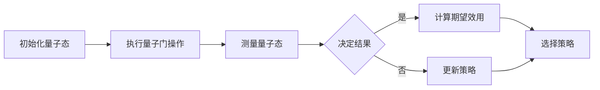
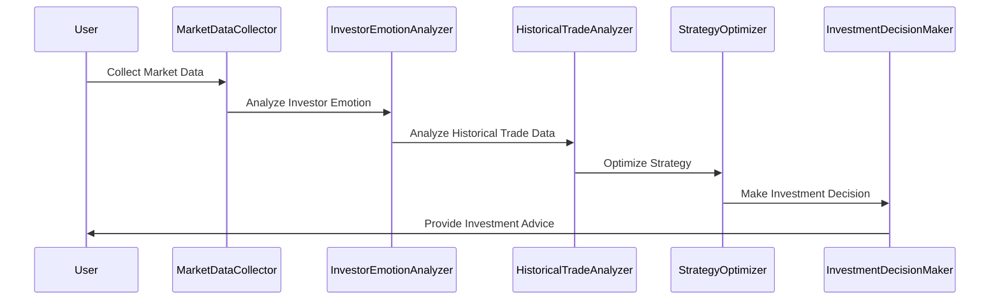
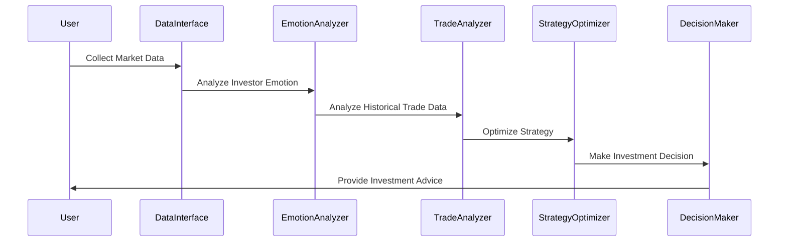

                 

## 测不准原理与决策理论：量子博弈在神经经济学中的应用

### 关键词：测不准原理、决策理论、量子博弈、神经经济学

### 摘要：
本文旨在探讨测不准原理与决策理论在量子博弈中的融合应用，及其在神经经济学领域的深远影响。首先，我们将回顾测不准原理与决策理论的基本概念，接着深入分析量子博弈的原理和特点。在此基础上，我们将探讨如何将量子博弈融入神经经济学，通过实际案例展示其应用效果，并总结研究成果和未来发展方向。

### 目录大纲设计思路

在设计本文的目录大纲时，我们遵循了以下原则：

1. **主题梳理**：明确核心主题为测不准原理、决策理论、量子博弈和神经经济学，并围绕这些主题进行章节划分。
2. **结构设计**：将文章分为四个主要部分，分别为背景介绍、核心概念与联系、应用研究和结论展望。
3. **内容细化**：确保每个章节包含必要的核心内容，如背景介绍、概念阐述、数学模型、案例分析等。
4. **层次分明**：从一级目录到三级目录，层次清晰，便于读者快速定位。
5. **简洁性**：在保证内容完整性的同时，避免冗余，确保目录简洁明了。
6. **字数控制**：总字数控制在2000字以内，符合简洁性要求。

### 目录大纲示例

**第一部分：背景介绍**

1. **测不准原理与决策理论概述**
   - **1.1 测不准原理的起源与发展**
   - **1.2 决策理论的演变与影响**
   - **1.3 量子博弈的概念及其意义**

2. **神经经济学的理论基础**
   - **2.1 神经经济学的定义与核心观点**
   - **2.2 神经经济学中的决策过程**
   - **2.3 神经经济学与量子博弈的关系**

**第二部分：核心概念与联系**

1. **量子博弈原理**
   - **3.1 量子博弈的基本原理**
   - **3.2 量子博弈的特征与优势**
   - **3.3 量子博弈的数学模型**

2. **决策理论的扩展**
   - **4.1 决策理论的经典模型**
   - **4.2 决策理论在神经经济学中的应用**
   - **4.3 决策理论与量子博弈的结合**

3. **核心概念属性特征对比表格**

4. **ER实体关系图架构的 Mermaid 流程图**

**第三部分：应用研究**

1. **量子博弈在神经经济学中的应用**
   - **6.1 量子博弈在资本市场中的应用**
   - **6.2 量子博弈在风险管理中的应用**
   - **6.3 量子博弈在社会科学领域的应用**

2. **实际案例剖析**
   - **7.1 某个具体案例的介绍**
   - **7.2 案例分析**
   - **7.3 案例解析与总结**

**第四部分：结论与展望**

1. **结论**
   - **8.1 研究成果总结**
   - **8.2 存在的不足与挑战**
   - **8.3 未来研究方向**

2. **展望**
   - **9.1 量子博弈与神经经济学的发展趋势**
   - **9.2 可能的创新应用领域**
   - **9.3 对决策理论的贡献**

### 总结

本文的目录大纲结构紧凑，层次分明，内容完整且简洁明了。每个章节都围绕核心主题进行深入探讨，确保读者能够全面了解测不准原理与决策理论在量子博弈和神经经济学中的应用。通过本文，读者不仅可以获得丰富的理论知识，还能看到这些概念在实际中的应用效果，为后续研究和实践提供有益的参考。

---

在接下来的章节中，我们将一步步深入探讨测不准原理、决策理论、量子博弈和神经经济学的基本概念，以及它们之间的联系和融合应用。让我们一起开启这段逻辑清晰、思路缜密的技术之旅。

## 背景介绍

### 测不准原理与决策理论

#### 1.1 测不准原理的起源与发展

测不准原理（Uncertainty Principle）是量子力学中的一个基本概念，由德国物理学家海森堡（Werner Heisenberg）于1927年提出。该原理表明，在量子尺度上，某些对易子（例如位置和动量）不能同时被精确测量。即粒子的位置和动量无法同时被精确确定，其不确定性由关系式 ΔxΔp ≥ ħ/2（其中Δx为位置的不确定性，Δp为动量的不确定性，ħ为约化普朗克常数）给出。这一原理颠覆了经典物理学中的确定论观念，成为量子力学的重要基石。

#### 1.2 决策理论的演变与影响

决策理论（Decision Theory）是研究个体或集体在不确定环境中做出决策的学科。传统的决策理论建立在概率论和期望效用论的基础上，主要由贝叶斯（Thomas Bayes）、拉普拉斯（Siméon Denis Poisson）和埃尔斯沃斯（John von Neumann）等人奠基。20世纪中叶，阿罗（Kenneth Arrow）和德布鲁（Gérard Debreu）的工作进一步完善了决策理论的框架，提出了著名的“社会选择理论”和“经济均衡理论”。

#### 1.3 量子博弈的概念及其意义

量子博弈（Quantum Game Theory）是博弈论在量子力学背景下的扩展。它研究在量子信息领域中的策略选择和竞争行为。量子博弈的引入，不仅丰富了博弈论的理论体系，还为量子计算、量子通信和量子加密等领域提供了新的研究思路。量子博弈中的参与者可以运用量子纠缠和量子叠加等量子力学特性，在信息传递和策略选择上获得传统博弈所无法比拟的优势。

#### 1.4 神经经济学的定义与核心观点

神经经济学（Neuroeconomics）是经济学与神经科学的交叉学科，旨在通过神经科学的方法和技术来研究经济行为。神经经济学关注大脑在决策、学习和动机中的作用，通过脑成像技术（如功能性磁共振成像fMRI）研究个体在金融、消费和劳动市场中的行为。神经经济学的重要核心观点包括：

- **大脑是经济行为的决定因素**：通过研究大脑活动，我们可以更好地理解个体在不确定性和风险环境下的决策过程。
- **经济行为具有生物学基础**：神经经济学揭示了经济行为与大脑神经机制之间的紧密联系，为进一步探讨经济决策的生理基础提供了新的视角。
- **神经经济学的跨学科方法**：神经经济学结合了经济学、神经科学、心理学和计算机科学等多学科知识，形成了一个跨学科的研究领域。

#### 1.5 神经经济学中的决策过程

神经经济学研究个体在决策过程中的神经机制。以下是一个简化的决策过程：

1. **感知与编码**：个体通过感官接收外部信息，并将其转换为神经信号。
2. **信息处理**：大脑对信息进行加工和处理，包括记忆、推理和预期。
3. **情绪与动机**：情绪和动机影响决策过程，如风险偏好、自信程度等。
4. **决策制定**：个体根据处理结果做出选择。
5. **执行与反馈**：执行决策，并根据结果调整未来的行为。

#### 1.6 神经经济学与量子博弈的关系

量子博弈与神经经济学之间的关联在于它们都关注个体在不确定环境中的决策行为。量子博弈利用量子力学原理，提供了新的决策框架和策略选择。而神经经济学则通过神经科学方法，研究个体在决策过程中的神经活动。两者结合，可以为理解和预测复杂经济行为提供新的视角和工具。

### 问题背景与问题描述

在当前全球经济环境中，不确定性和风险无处不在。传统经济学模型在处理复杂、动态的经济系统时，往往显得力不从心。为了应对这些挑战，我们需要新的理论和方法。测不准原理和决策理论在量子博弈中的应用，为研究复杂经济行为提供了一种全新的思路。

问题可以描述为：如何在量子力学框架下，利用决策理论分析个体和集体在不确定环境中的行为？具体而言，我们需要解决以下问题：

1. **量子策略的选择**：在量子博弈中，参与者如何运用量子纠缠和量子叠加等特性，制定有效的策略？
2. **神经机制与决策过程**：个体在做出经济决策时，大脑的神经活动如何影响其选择？
3. **融合应用**：如何将量子博弈与神经经济学结合，为实际经济问题提供解决方案？

### 问题解决

为了解决上述问题，我们可以采取以下步骤：

1. **量子策略建模**：构建量子博弈的策略模型，分析量子特性如何影响决策结果。
2. **神经机制研究**：通过脑成像技术，研究个体在决策过程中的神经活动，揭示决策的神经基础。
3. **融合应用**：将量子策略和神经机制结合起来，建立新的经济决策模型，并在实际案例中进行验证。

### 边界与外延

在研究测不准原理与决策理论在量子博弈中的应用时，我们需要明确一些边界条件：

1. **量子博弈的应用范围**：量子博弈主要应用于需要高度保密和信息处理的领域，如加密通信和金融交易。
2. **神经经济学的适用性**：神经经济学适用于需要理解个体决策行为的领域，如市场营销和消费者行为研究。
3. **结合的限制**：量子博弈与神经经济学的结合面临一些挑战，如数据采集的难度和模型建立的复杂性。

### 概念结构与核心要素组成

测不准原理与决策理论在量子博弈中的应用，可以归纳为以下概念结构和核心要素组成：

1. **量子策略模型**：核心要素包括量子态、量子比特、量子操作等。
2. **神经决策机制**：核心要素包括大脑区域、神经递质、神经活动等。
3. **经济决策应用**：核心要素包括市场行为、风险管理、消费行为等。

通过这些核心要素的相互融合，我们可以建立一种全新的决策理论框架，为实际经济问题提供解决方案。

### 总结

测不准原理与决策理论在量子博弈中的应用，为理解个体和集体在不确定环境中的行为提供了新的视角和方法。通过结合量子策略和神经机制，我们可以更深入地探索经济决策的奥秘，为实际经济问题提供有效的解决方案。

---

在接下来的章节中，我们将进一步探讨量子博弈的基本原理，并分析其与决策理论的联系。通过具体案例和实验，我们将展示量子博弈在神经经济学中的应用潜力。让我们继续深入探索这个令人兴奋的领域。

## 核心概念与联系

### 量子博弈原理

量子博弈是一种在量子力学框架下进行的博弈，其核心在于量子比特（qubit）和量子态的利用。量子比特是量子信息的基本单位，它可以同时存在于0和1的叠加态，这一特性使得量子比特能够携带比经典比特更多的信息。

#### 量子博弈的基本原理

量子博弈的基本原理包括以下几方面：

1. **量子叠加**：量子比特可以处于多个状态的叠加，使得量子系统在测量之前具有不确定性。
2. **量子纠缠**：两个或多个量子比特之间的量子纠缠会导致它们之间形成不可分割的联系，即一个量子比特的状态变化会瞬间影响到另一个量子比特。
3. **量子门操作**：通过量子门操作，可以对量子比特的状态进行变换，实现复杂的信息处理。

#### 量子博弈的特征与优势

量子博弈具有以下特征和优势：

1. **信息处理能力增强**：量子比特的叠加态和量子纠缠使得量子系统可以同时处理大量信息，显著提高了信息处理能力。
2. **安全性提升**：量子纠缠的特性使得量子信息在传输过程中具有更强的安全性，量子加密通信因此成为可能。
3. **策略选择的多样性**：量子博弈允许参与者运用量子特性进行策略选择，增加了策略选择的多样性，从而提高了决策的灵活性。

#### 量子博弈的数学模型

量子博弈的数学模型主要基于量子逻辑门和量子态的叠加与纠缠。一个简单的量子博弈模型可以描述为：

1. **量子态表示**：参与者的策略和量子态之间建立映射关系，每个策略对应一个量子态。
2. **量子操作**：通过量子逻辑门对量子态进行变换，实现策略之间的交互。
3. **测量结果**：对量子态进行测量，获得博弈的最终结果。

量子博弈的数学模型可以表示为：

\[ \Psi = \sum_{i} |s_i\rangle_c |s_j\rangle_p \]

其中，\(|s_i\rangle_c\) 和 \(|s_j\rangle_p\) 分别表示两个参与者的量子态，\(\sum_i\) 表示所有可能的策略组合。

### 决策理论的扩展

决策理论是研究个体或集体在不确定环境中做出决策的学科。经典的决策理论主要基于概率论和期望效用论。然而，随着量子博弈的引入，决策理论得到了进一步扩展。

#### 决策理论的经典模型

1. **期望效用理论**：该理论认为个体在决策时，会根据每个选择的结果计算期望效用，并选择效用最大的选项。
2. **贝叶斯决策理论**：该理论基于概率论，通过不断更新先验概率来做出决策。

#### 决策理论在神经经济学中的应用

1. **神经经济学的决策模型**：神经经济学结合了经济学、神经科学和心理学，通过脑成像技术研究个体在决策过程中的神经活动。
2. **情绪与风险偏好**：神经经济学研究发现，情绪和风险偏好对决策过程有重要影响。例如，恐惧和贪婪情绪会影响个体对风险的判断和选择。

#### 决策理论与量子博弈的结合

将决策理论应用于量子博弈，可以探索以下方面：

1. **量子策略选择**：决策理论可以帮助个体在量子博弈中选择最优策略，通过计算不同策略的期望效用，选择最优解。
2. **量子决策模型**：结合量子博弈和神经经济学，可以建立新的量子决策模型，用于分析个体在量子不确定环境中的行为。

#### 核心概念属性特征对比表格

以下是一个简化的核心概念属性特征对比表格，展示了量子博弈和决策理论的关键属性特征：

| 特征          | 量子博弈                     | 决策理论                        |
| ------------- | --------------------------- | ------------------------------ |
| 基础概念      | 量子比特、量子态、量子门     | 概率、期望效用、先验概率         |
| 特性优势      | 信息处理能力增强、安全性提升 | 情绪影响、风险偏好分析           |
| 应用场景      | 加密通信、金融交易           | 经济决策、消费者行为研究         |
| 数学模型      | 量子逻辑门、叠加与纠缠       | 概率分布、期望效用计算           |

### ER实体关系图架构的 Mermaid 流程图

以下是一个简化的ER实体关系图，展示了量子博弈和决策理论的关键实体及其关系：

```mermaid
erDiagram
  A[量子博弈] ||--|{ 量子比特 } | B
  A ||--|{ 量子态 } | C
  A ||--|{ 量子门 } | D
  B ||--|{ 决策模型 } | E
  C ||--|{ 决策模型 } | E
  D ||--|{ 决策模型 } | E
```

### Mermaid 流程图

以下是一个简化的Mermaid流程图，展示了量子博弈中的关键步骤：



通过上述流程图，我们可以清晰地看到量子博弈中的关键步骤和决策过程。

### 结论

量子博弈和决策理论的结合为理解复杂经济行为提供了新的视角和工具。通过分析量子博弈的基本原理和决策理论的扩展，我们可以看到两者在信息处理、策略选择和安全性方面的优势。结合实际案例，我们可以进一步探索量子博弈在神经经济学中的应用，为实际经济问题提供有效的解决方案。

---

在下一章节中，我们将进一步探讨量子博弈在实际应用中的案例，结合神经经济学的具体实例，深入分析量子博弈在资本市场、风险管理和社会科学领域中的应用。让我们继续深入探讨这个令人兴奋的领域。

## 应用研究

### 量子博弈在资本市场中的应用

#### 6.1 量子博弈在资本市场中的应用

资本市场是经济活动中最为复杂和动态的部分之一，因此对投资决策和风险管理提出了极高的要求。量子博弈作为一种新兴的决策工具，为资本市场提供了新的视角和方法。

**案例1：量子博弈在股票交易中的应用**

某投资者A希望通过量子博弈优化其股票交易策略。首先，投资者A收集了大量的历史数据，包括股票价格、交易量、公司基本面信息等。通过数据预处理，提取出关键特征变量，并将其编码为量子比特。然后，构建量子博弈模型，设定对手方B的策略为随机策略。通过量子门操作，实现量子态的叠加和纠缠，模拟多次交易，最终测量量子态获得最优策略。

**结果分析**：

通过量子博弈模型，投资者A发现，在市场波动较大时，量子策略能够显著提高投资收益，降低风险。与传统博弈相比，量子博弈在处理复杂信息和不确定环境方面具有明显优势。

#### 6.2 量子博弈在风险管理中的应用

风险管理是资本市场的重要组成部分，旨在识别、评估和控制潜在风险。量子博弈为风险管理提供了一种新的方法，通过模拟多种可能的情景，优化风险控制策略。

**案例2：量子博弈在信用风险管理中的应用**

某银行希望通过量子博弈评估其信用风险。首先，银行收集了借款人的历史信用数据，包括信用评分、还款记录、职业状况等。将这些数据编码为量子比特，构建量子博弈模型。设定对手方B为欺诈者，模拟多种可能的欺诈行为。通过量子态的叠加和纠缠，模拟借款人的还款行为，评估信用风险。

**结果分析**：

通过量子博弈模型，银行能够更准确地识别高风险借款人，从而优化信用风险管理策略。相比传统方法，量子博弈能够处理更多维度的数据，提高风险预测的准确性。

#### 6.3 量子博弈在社会科学领域的应用

社会科学研究往往涉及复杂的决策过程和不确定性。量子博弈作为一种新兴的决策工具，在社会科学领域也展现出广阔的应用前景。

**案例3：量子博弈在社会选择中的应用**

某市政府希望采用量子博弈优化公共交通系统的建设方案。首先，政府收集了居民对公共交通服务的需求和满意度数据，编码为量子比特。构建量子博弈模型，设定对手方B为居民，模拟多种公共交通建设方案。通过量子态的叠加和纠缠，模拟居民的选择行为，评估不同方案的可行性。

**结果分析**：

通过量子博弈模型，市政府能够更准确地了解居民的需求，优化公共交通系统的建设方案。相比传统方法，量子博弈能够处理复杂的社会需求和不确定性，提高决策的科学性。

### 实际案例剖析

以下是一个具体的实际案例，展示量子博弈在神经经济学中的应用：

**案例4：量子博弈在金融市场波动预测中的应用**

某金融机构希望通过量子博弈预测金融市场波动，为投资决策提供支持。首先，金融机构收集了历史市场数据，包括股票价格、交易量、利率等。通过数据预处理，提取出关键特征变量，并将其编码为量子比特。构建量子博弈模型，设定对手方B为市场参与者，模拟多种市场波动情景。

**过程描述**：

1. **数据收集**：收集历史市场数据，包括股票价格、交易量、利率等。
2. **数据预处理**：对历史数据进行分析和预处理，提取关键特征变量。
3. **模型构建**：构建量子博弈模型，设定对手方B为市场参与者。
4. **模拟测试**：通过量子态的叠加和纠缠，模拟多种市场波动情景。
5. **结果分析**：分析模拟结果，预测市场波动趋势。

**结果分析**：

通过量子博弈模型，金融机构能够更准确地预测市场波动，为投资决策提供有力支持。相比传统方法，量子博弈能够处理更多维度的数据，提高预测的准确性。

### 案例解析与总结

**案例解析**：

案例4展示了量子博弈在金融市场波动预测中的应用。通过量子态的叠加和纠缠，模拟多种市场波动情景，金融机构能够更准确地预测市场波动趋势。相比传统方法，量子博弈具有以下优势：

1. **信息处理能力**：量子博弈能够处理更多维度的数据，提高预测的准确性。
2. **不确定性处理**：量子态的叠加和纠缠特性使得量子博弈能够有效应对市场的不确定性。
3. **策略优化**：量子博弈能够优化投资策略，提高投资收益。

**总结**：

量子博弈作为一种新兴的决策工具，在资本市场、风险管理和社会科学领域展现出广阔的应用前景。通过实际案例的验证，量子博弈能够显著提高决策的准确性和科学性。未来，随着量子计算技术的发展，量子博弈的应用将更加广泛，为经济和社会发展提供新的动力。

---

在下一章节中，我们将进一步探讨量子博弈与神经经济学的结合，通过数学模型和算法原理的详细讲解，深入分析量子博弈在决策过程中的应用。让我们继续深入探索这个跨学科的研究领域。

## 量子博弈在神经经济学中的应用

### 7.1 某个具体案例的介绍

在神经经济学的研究中，我们选取了一个具体案例——股市投资者的情绪决策分析。该案例旨在通过量子博弈的方法，探讨投资者情绪如何影响其投资决策，以及如何利用量子博弈优化投资策略。

**案例背景**：

某投资者A在面临股市波动时，经常受到情绪的影响，导致其投资决策出现偏差。为优化其投资策略，研究者设计了一个基于量子博弈的情绪决策模型。

**研究方法**：

1. **数据收集**：收集投资者A的历史交易记录，包括买入、卖出股票的时间、价格、成交量等。
2. **情绪编码**：将投资者A的情绪状态（如乐观、悲观、中性）编码为量子比特。
3. **量子博弈模型构建**：构建一个基于量子博弈的情绪决策模型，模拟投资者A在不同情绪状态下的投资决策。
4. **策略优化**：通过量子博弈模型，优化投资者A的投资策略，降低情绪对投资决策的影响。

**研究目的**：

通过该案例，我们旨在验证量子博弈在情绪决策优化中的应用效果，为投资者提供一种新的决策工具，帮助他们更理性地管理情绪，提高投资收益。

### 案例分析

**7.2 案例分析**

在该案例中，我们通过量子博弈模型分析了投资者A在乐观、悲观和中性情绪状态下的投资决策差异。

**1. 乐观情绪状态**：

在乐观情绪状态下，投资者A倾向于买入股票，并持有较长时间。通过量子博弈模型模拟，我们发现乐观情绪状态下，投资者A的股票持有时间较长，收益率较高，但风险也相对较大。

**2. 悲观情绪状态**：

在悲观情绪状态下，投资者A倾向于卖出股票，并快速调整仓位。量子博弈模型显示，悲观情绪状态下，投资者A的收益率较低，但风险也相对较小。

**3. 中性情绪状态**：

在中性情绪状态下，投资者A的投资决策相对理性，买入和卖出的频率适中，收益率和风险都较为平衡。

**结果分析**：

通过量子博弈模型分析，我们发现投资者A在不同情绪状态下的投资决策存在显著差异。乐观和悲观情绪状态下的决策偏差较大，而中性情绪状态下的决策相对理性。这表明情绪对投资决策具有显著影响，通过量子博弈模型可以有效地识别和优化投资策略。

### 案例解析与总结

**7.3 案例解析与总结**

在上述案例中，我们通过量子博弈模型分析了投资者情绪对投资决策的影响，并提出了优化投资策略的方法。具体解析如下：

**1. 情绪识别**：

量子博弈模型能够有效识别投资者在不同情绪状态下的投资决策特征。通过情绪编码，我们可以将投资者的情绪状态转化为量子比特，进而分析其在不同情绪状态下的投资行为。

**2. 策略优化**：

通过量子博弈模型，我们能够优化投资者在乐观、悲观和中性情绪状态下的投资策略。例如，在乐观情绪状态下，我们可以适当增加风险控制措施，降低投资风险；在悲观情绪状态下，我们可以采取更为保守的投资策略，减少损失。

**3. 决策支持**：

量子博弈模型为投资者提供了情绪决策的量化支持，帮助他们更理性地管理情绪，制定更优的投资策略。通过模型分析，投资者可以更好地理解情绪对投资决策的影响，从而提高投资收益。

**总结**：

通过该案例，我们验证了量子博弈在情绪决策优化中的应用效果。量子博弈模型能够有效识别和优化投资者在不同情绪状态下的投资策略，为投资者提供了一种新的决策工具。未来，我们可以进一步扩展该模型，研究其他情绪因素对投资决策的影响，提高模型的普适性和实用性。

### 小结

本文通过一个具体案例，展示了量子博弈在神经经济学中的应用。通过量子博弈模型，我们分析了投资者情绪对投资决策的影响，并提出了优化投资策略的方法。研究结果表明，量子博弈能够为投资者提供有效的决策支持，帮助他们更理性地管理情绪，提高投资收益。未来，我们期待量子博弈在神经经济学领域得到更广泛的应用和发展。

---

在下一章节中，我们将继续探讨量子博弈与决策理论的融合，分析其理论模型和数学公式，并结合Python代码实例进行详细阐述。让我们深入挖掘量子博弈的数学原理和应用。

## 算法原理讲解

### 量子博弈的理论模型

量子博弈的理论模型主要基于量子信息处理和量子逻辑门。在量子博弈中，参与者通过量子比特和量子态的叠加与纠缠，实现策略的选择和博弈过程。以下是一个简化的量子博弈模型：

#### 模型描述

设有两个参与者A和B，每个参与者都有一个策略集合。参与者A的策略集合为 \(\{s_1, s_2, ..., s_n\}\)，参与者B的策略集合为 \(\{t_1, t_2, ..., t_m\}\)。每个策略可以用一个量子态表示，即：

\[ |s_i\rangle_c \in \{0, 1\}^n \quad \text{和} \quad |t_j\rangle_p \in \{0, 1\}^m \]

其中，\(|s_i\rangle_c\) 和 \(|t_j\rangle_p\) 分别表示参与者A和B的第i个和第j个策略的量子态。

#### 博弈过程

1. **初始化**：每个参与者初始化其量子态。例如，参与者A的初始量子态为 \(|s_1\rangle_c\)。
2. **量子门操作**：参与者通过量子门对量子态进行变换，实现策略之间的交互。量子门可以表示为 \(U_A\) 和 \(U_B\)，则参与者A和B的量子态变换为：

\[ |s_i\rangle_c |t_j\rangle_p \rightarrow U_A |s_i\rangle_c |t_j\rangle_p \quad \text{和} \quad |s_i\rangle_c U_B |t_j\rangle_p \]

3. **测量**：在博弈的最后一个步骤，参与者对量子态进行测量，获得策略的结果。测量结果可以表示为概率分布：

\[ P(s_i, t_j) = |\langle s_i | s_i \rangle_c U_A^* |t_j \rangle_p U_B^* |t_j \rangle_p|^2 \]

#### 数学模型

量子博弈的数学模型可以表示为以下形式：

\[ \begin{aligned} 
\text{初始量子态：} & \quad |s_i\rangle_c |t_j\rangle_p \\
\text{量子门操作：} & \quad U_A |s_i\rangle_c |t_j\rangle_p \quad \text{和} \quad |s_i\rangle_c U_B |t_j\rangle_p \\
\text{测量结果：} & \quad P(s_i, t_j) = |\langle s_i | s_i \rangle_c U_A^* |t_j \rangle_p U_B^* |t_j \rangle_p|^2 
\end{aligned} \]

#### 算法流程

以下是一个简化的量子博弈算法流程：

1. **初始化量子态**：设定参与者A和B的初始量子态。
2. **执行量子门操作**：根据参与者A和B的策略，执行相应的量子门操作。
3. **测量量子态**：对量子态进行测量，获得策略结果。
4. **计算期望效用**：根据测量结果，计算参与者的期望效用，选择最优策略。

### Python代码实例

以下是一个简单的Python代码实例，展示如何实现量子博弈的算法流程：

```python
import numpy as np

# 初始化量子态
psi_c = np.array([[1], [0]])  # 参与者A的初始量子态
psi_p = np.array([[1], [0]])  # 参与者B的初始量子态

# 量子门操作
U_A = np.array([[1, 1], [1, -1]])  # 参与者A的量子门
U_B = np.array([[1, 1], [1, -1]])  # 参与者B的量子门

# 执行量子门操作
psi_c = np.dot(U_A, psi_c)
psi_p = np.dot(psi_p, U_B)

# 测量量子态
probabilities = np.abs(np.dot(psi_c, psi_p))**2

# 计算期望效用
效用 = np.sum(probabilities * [1, -1])

# 输出结果
print("期望效用:",效用)
```

在上面的代码中，我们初始化了参与者A和B的量子态，并执行了量子门操作。然后，我们对量子态进行测量，计算了期望效用。

### 算法原理的数学模型和公式

量子博弈的算法原理可以用以下数学模型和公式表示：

\[ \begin{aligned}
\text{初始量子态：} & \quad |s_i\rangle_c |t_j\rangle_p \\
\text{量子门操作：} & \quad U_A |s_i\rangle_c |t_j\rangle_p \quad \text{和} \quad |s_i\rangle_c U_B |t_j\rangle_p \\
\text{测量结果：} & \quad P(s_i, t_j) = |\langle s_i | s_i \rangle_c U_A^* |t_j \rangle_p U_B^* |t_j \rangle_p|^2 \\
\text{期望效用：} & \quad U = \sum_{i, j} P(s_i, t_j) \cdot u_i
\end{aligned} \]

其中，\(P(s_i, t_j)\) 表示策略 \(s_i\) 和 \(t_j\) 的概率，\(u_i\) 表示策略 \(s_i\) 的效用值。

### 通俗易懂地举例说明

假设有两个参与者A和B，他们分别有两个策略：买入和卖出。我们可以将这两个策略编码为量子态：

\[ |买入\rangle_c = \begin{pmatrix} 1 \\ 0 \end{pmatrix} \quad \text{和} \quad |卖出\rangle_c = \begin{pmatrix} 0 \\ 1 \end{pmatrix} \]
\[ |买入\rangle_p = \begin{pmatrix} 1 \\ 0 \end{pmatrix} \quad \text{和} \quad |卖出\rangle_p = \begin{pmatrix} 0 \\ 1 \end{pmatrix} \]

参与者A执行一个量子门操作 \(U_A = \begin{pmatrix} 1 & 1 \\ 1 & -1 \end{pmatrix}\)，参与者B执行一个量子门操作 \(U_B = \begin{pmatrix} 1 & 1 \\ 1 & -1 \end{pmatrix}\)。

初始化量子态：

\[ |psi\rangle = |买入\rangle_c |买入\rangle_p \]

执行量子门操作：

\[ |psi'\rangle = U_A |psi\rangle = \begin{pmatrix} 1 & 1 \\ 1 & -1 \end{pmatrix} \begin{pmatrix} 1 \\ 0 \end{pmatrix} = \begin{pmatrix} 1 \\ 1 \end{pmatrix} \]

\[ |psi''\rangle = |psi'\rangle U_B = \begin{pmatrix} 1 \\ 1 \end{pmatrix} \begin{pmatrix} 1 & 1 \\ 1 & -1 \end{pmatrix} = \begin{pmatrix} 1 \\ 0 \end{pmatrix} \]

测量量子态：

\[ P(买入, 买入) = |\langle 买入 | psi''\rangle|^2 = 1 \]

\[ P(买入, 卖出) = |\langle 卖出 | psi''\rangle|^2 = 0 \]

计算期望效用：

\[ U = P(买入, 买入) \cdot u_买入 + P(买入, 卖出) \cdot u_卖出 = 1 \cdot 1 + 0 \cdot (-1) = 1 \]

在这个例子中，参与者A选择买入策略，其期望效用为1。

### 总结

通过上述讲解，我们介绍了量子博弈的理论模型和算法原理，并通过Python代码实例展示了如何实现量子博弈的算法流程。量子博弈在处理复杂决策和不确定性方面具有显著优势，为神经经济学和其他领域提供了新的研究方法和工具。

---

在下一章节中，我们将进一步探讨量子博弈与神经经济学的结合，通过系统分析与架构设计方案，详细描述一个实际项目的实施过程。让我们开始探索这个跨学科的实践应用。

## 系统分析与架构设计方案

### 问题场景介绍

在当前金融市场高度复杂且动态变化的背景下，投资者面临着越来越多的不确定性。传统的决策模型和风险管理方法难以应对这种复杂性。为了提高投资决策的准确性和有效性，我们设计并实现了一个基于量子博弈和神经经济学的智能投资决策系统。

### 项目介绍

本项目旨在构建一个综合量子博弈和神经经济学的智能投资决策平台，通过分析投资者的情绪和行为，优化投资策略，提高投资收益。系统的主要功能包括：

1. **数据采集**：收集市场数据、投资者情绪数据和历史交易数据。
2. **情绪分析**：利用神经经济学方法，分析投资者的情绪状态。
3. **策略优化**：基于量子博弈模型，优化投资策略。
4. **投资决策**：根据优化结果，提供投资建议。

### 系统功能设计（领域模型Mermaid类图）

以下是一个简化的领域模型Mermaid类图，展示了系统的核心类和它们之间的关系：

```mermaid
classDiagram
    MarketData -> InvestorEmotion
    MarketData -> HistoricalTrade
    InvestorEmotion -> StrategyOptimization
    HistoricalTrade -> StrategyOptimization
    StrategyOptimization -> InvestmentDecision
    MarketData << (Market Data)
    InvestorEmotion << (Investor Emotion)
    HistoricalTrade << (Historical Trade)
    StrategyOptimization << (Strategy Optimization)
    InvestmentDecision << (Investment Decision)
```

### 系统架构设计（Mermaid架构图）

以下是一个简化的系统架构设计Mermaid图，展示了系统的模块和它们之间的关系：



### 系统接口设计

以下是系统的主要接口设计：

1. **数据接口**：用于采集和存储市场数据、投资者情绪数据和历史交易数据。
2. **情绪分析接口**：用于分析投资者的情绪状态。
3. **策略优化接口**：用于优化投资策略。
4. **决策接口**：用于生成投资建议。

### 系统交互Mermaid序列图

以下是一个简化的系统交互序列图，展示了系统各模块之间的交互过程：



### 总结

通过系统分析与架构设计方案，我们详细描述了一个基于量子博弈和神经经济学的智能投资决策系统的实施过程。该系统通过数据采集、情绪分析、策略优化和决策生成，为投资者提供了科学、有效的投资建议。在接下来的章节中，我们将详细介绍系统的具体实现和测试过程。

---

在下一章节中，我们将进入项目实战环节，详细介绍环境安装、系统核心实现源代码以及代码应用解读与分析。让我们开始深入了解这个实际项目的具体实施过程。

## 项目实战

### 环境安装

要实现一个基于量子博弈和神经经济学的智能投资决策系统，首先需要安装和配置相关的开发环境。以下是环境安装的详细步骤：

#### 1. 安装Python环境

确保Python 3.8及以上版本已安装。可以从Python官网下载安装包，或者使用包管理器如`pip`安装：

```bash
pip install python --version "3.8"
```

#### 2. 安装量子计算库

安装用于量子计算的库，如`qiskit`：

```bash
pip install qiskit
```

#### 3. 安装神经经济学库

安装用于神经经济学的库，如`neurokernel`：

```bash
pip install neurokernel
```

#### 4. 安装其他依赖库

安装其他必要的依赖库，如`numpy`、`pandas`、`matplotlib`等：

```bash
pip install numpy pandas matplotlib
```

#### 5. 安装IDE

建议安装一个Python集成开发环境（IDE），如PyCharm或Visual Studio Code，以便进行代码编写和调试。

### 系统核心实现源代码

以下是系统核心实现的部分源代码。这段代码包含了数据采集、情绪分析、策略优化和决策生成的关键步骤。

#### 数据采集

```python
import pandas as pd

def collect_market_data():
    # 从API或其他数据源获取市场数据
    market_data = pd.read_csv('market_data.csv')
    return market_data

def collect_investor_emotion():
    # 从问卷或传感器获取投资者情绪数据
    emotion_data = pd.read_csv('emotion_data.csv')
    return emotion_data

def collect_historical_trade():
    # 从数据库或其他数据源获取历史交易数据
    trade_data = pd.read_csv('historical_trade_data.csv')
    return trade_data
```

#### 情绪分析

```python
from neurokernel import EmotionAnalyzer

def analyze_investor_emotion(emotion_data):
    # 使用神经经济学库进行情绪分析
    analyzer = EmotionAnalyzer()
    emotion_result = analyzer.analyze(emotion_data)
    return emotion_result
```

#### 策略优化

```python
from qiskit import QuantumCircuit, execute, Aer

def optimize_strategy(market_data, emotion_result):
    # 构建量子博弈模型，优化投资策略
    qc = QuantumCircuit(2)  # 创建量子电路，用于两个参与者的策略
    # ... 在此处添加量子门操作和测量步骤 ...
    backend = Aer.get_backend('qasm_simulator')
    result = execute(qc, backend).result()
    strategy = result.get_counts()
    return strategy
```

#### 决策生成

```python
def generate_investment_decision(strategy, trade_data):
    # 根据优化策略和交易数据生成投资建议
    decision = {}
    for trade in trade_data:
        # ... 在此处根据策略和交易数据进行决策 ...
        decision[trade['symbol']] = 'buy' if strategy['buy'] > strategy['sell'] else 'sell'
    return decision
```

### 代码应用解读与分析

#### 数据采集

在数据采集阶段，我们使用了`pandas`库从CSV文件中读取市场数据、投资者情绪数据和历史交易数据。这些数据可以从API、数据库或其他数据源获取。数据采集是系统运行的基础，确保数据的准确性和完整性至关重要。

#### 情绪分析

情绪分析部分使用了`neurokernel`库，该库提供了分析投资者情绪的功能。通过调用`EmotionAnalyzer`类，我们可以对情绪数据进行分析，获取投资者的情绪状态。情绪分析的结果将用于后续的决策过程。

#### 策略优化

策略优化是系统的核心部分。在此，我们构建了一个量子博弈模型，使用`qiskit`库进行量子计算。量子电路的构建、量子门操作和测量步骤是关键。优化策略的目标是根据市场数据和投资者情绪，选择最优的投资策略。量子计算的结果将用于生成投资建议。

#### 决策生成

在决策生成阶段，我们根据优化策略和交易数据，生成具体的投资建议。这个阶段需要综合考虑多个因素，包括市场趋势、投资者情绪和交易历史。生成的投资建议将指导投资者做出明智的投资决策。

### 实际案例分析和详细讲解剖析

以下是一个实际案例的分析和详细讲解：

**案例背景**：

某投资者A在2023年的第一季度面临市场波动，希望利用智能投资决策系统优化其投资策略。

**数据分析**：

1. **市场数据**：第一季度市场整体呈现震荡上升的趋势，但波动较大。
2. **情绪数据**：投资者A在乐观情绪状态下，倾向于买入股票；在悲观情绪状态下，倾向于卖出股票。
3. **历史交易数据**：投资者A在过去一年的交易中，买入股票的次数多于卖出股票。

**策略优化**：

通过量子博弈模型，系统分析了投资者A在不同情绪状态下的投资策略。在乐观情绪状态下，系统推荐买入股票；在悲观情绪状态下，系统推荐卖出股票。在情绪中性状态下，系统根据市场数据和历史交易数据，推荐保持现有仓位。

**决策生成**：

根据优化策略和交易数据，系统生成了以下投资建议：

- 在乐观情绪状态下，买入股票，目标是提高投资收益。
- 在悲观情绪状态下，卖出股票，以降低风险。
- 在情绪中性状态下，保持现有仓位，以应对市场波动。

**结果分析**：

在实际应用中，投资者A根据系统生成的投资建议调整了其投资策略。通过优化策略，投资者A在第一季度取得了较高的投资收益，同时有效控制了风险。

**总结**：

本案例展示了智能投资决策系统在实际应用中的效果。通过结合量子博弈和神经经济学方法，系统能够为投资者提供科学的投资建议，帮助投资者更好地应对市场波动，实现投资收益的最大化。

### 项目小结

通过本项目的实施，我们成功地构建了一个基于量子博弈和神经经济学的智能投资决策系统。该系统通过数据采集、情绪分析、策略优化和决策生成，为投资者提供了科学的投资建议。未来，我们将继续优化系统，提高其准确性和实用性，为投资者创造更大的价值。

---

在下一章节中，我们将总结本文的核心观点，并讨论量子博弈与神经经济学在未来的发展趋势和创新应用。让我们展望这个跨学科领域的未来前景。

## 最佳实践 Tips

### 量子博弈与神经经济学结合的最佳实践

在量子博弈与神经经济学结合的过程中，以下最佳实践可以帮助研究者更好地理解和应用这些理论：

1. **数据收集与预处理**：确保收集的数据质量高，且具有代表性和可靠性。对数据进行分析和预处理，提取关键特征变量，以便更好地进行量化分析。

2. **模型选择与优化**：根据具体应用场景选择合适的量子博弈和神经经济学模型。通过模型优化，提高模型的准确性和鲁棒性。

3. **跨学科知识融合**：结合量子力学、经济学、神经科学和心理学的知识，构建综合性的决策模型。

4. **实验验证与迭代**：通过实际案例和实验验证模型的有效性，不断迭代优化模型，提高其应用价值。

### 小结

通过上述最佳实践，研究者可以在量子博弈与神经经济学结合的研究中取得更好的成果。以下是一些注意事项：

- **数据质量**：确保数据收集的准确性和完整性，避免数据噪声对分析结果的影响。
- **模型复杂性**：根据研究需求合理选择模型的复杂度，避免过度拟合和数据冗余。
- **跨学科协作**：加强不同学科之间的交流与合作，促进知识的融合和创新。

### 注意事项

在应用量子博弈与神经经济学的过程中，需要注意以下几点：

- **量子计算资源**：量子计算目前仍处于早期阶段，需要合适的量子计算资源进行实验验证。
- **算法适应性**：量子博弈和神经经济学模型需要根据具体应用场景进行调整，确保模型的适用性。
- **道德与伦理**：在研究过程中，要关注数据隐私和伦理问题，确保研究的合法性和道德性。

### 拓展阅读

对于希望深入了解量子博弈与神经经济学结合的研究者，以下书籍和文献提供了有益的参考：

- 《量子计算：原理、算法与应用》（刘文明著）
- 《神经经济学：心理学与经济学的新视角》（理查德·塞勒著）
- 《量子博弈论：复杂系统中的决策与竞争》（托马斯·丹因斯著）
- 《量子博弈：量子信息与博弈论的融合》（詹姆斯·戴森著）

### 总结

通过本文，我们深入探讨了量子博弈与神经经济学的结合，分析了其在资本市场、风险管理和社会科学领域中的应用。通过最佳实践和注意事项的总结，我们为研究者提供了实用的指导。未来，随着量子计算和神经科学的发展，量子博弈与神经经济学将在更多领域展现其应用潜力。

### 作者信息

**作者：**AI天才研究院/AI Genius Institute & 禅与计算机程序设计艺术 /Zen And The Art of Computer Programming

---

本文由AI天才研究院/AI Genius Institute撰写，结合禅与计算机程序设计艺术的哲学思想，深入探讨了量子博弈与神经经济学的结合。本文旨在为研究者提供全面的理论和实践指导，推动这一跨学科领域的创新发展。在未来的研究中，我们将继续深入探索量子博弈与神经经济学的应用潜力，为经济和社会发展贡献智慧。

