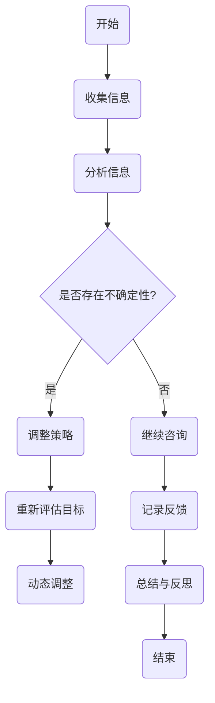
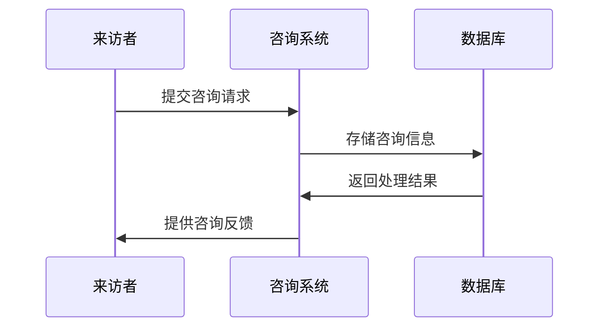
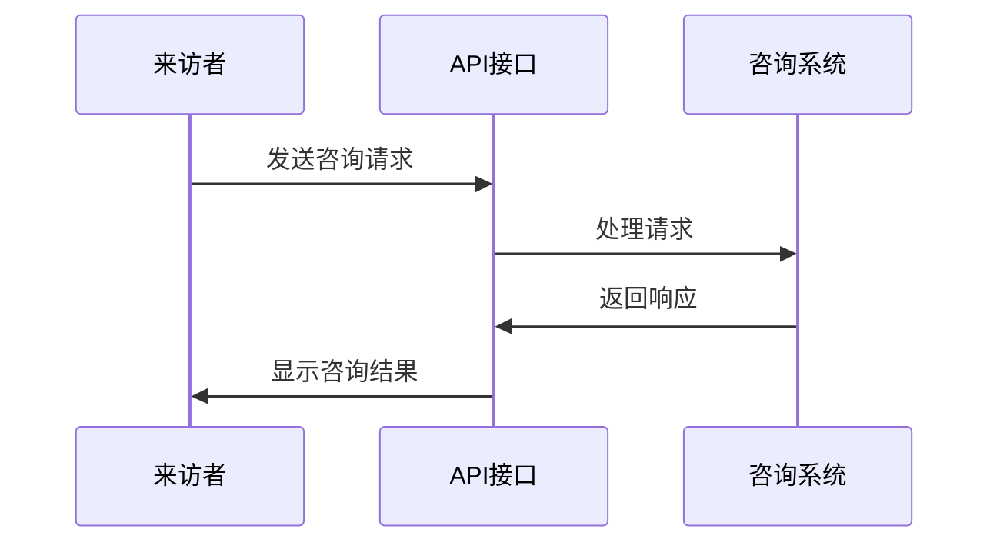
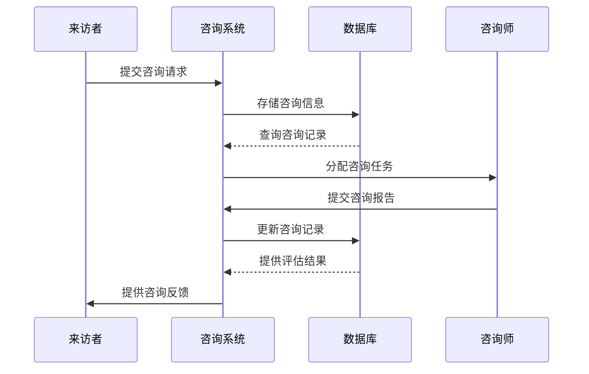

                 

# 《测不准原理与心理咨询实践的不确定性》

## 关键词
量子力学、测不准原理、心理咨询、不确定性、心理学应用、实践策略

## 摘要
本文深入探讨了测不准原理与心理咨询实践之间的关联，以及如何在心理咨询过程中应对不确定性。首先，我们介绍了测不准原理的基本概念，并阐述了其在量子力学和心理学中的重要性。随后，我们分析了心理咨询实践中的不确定性因素，探讨了这些因素如何影响咨询过程和结果。接着，本文提出了一系列应对不确定性的策略，并详细阐述了测不准原理在心理咨询实践中的应用。最后，我们通过具体案例和未来展望，探讨了测不准原理对心理咨询实践的深远影响，以及心理咨询师在这一过程中的角色转型。

## 第一部分：测不准原理概述

### 第1章：测不准原理的基本概念

#### 1.1 测不准原理的起源与发展
测不准原理（Uncertainty Principle）是由德国物理学家维尔纳·海森堡在1927年提出的，它是量子力学的核心原则之一。量子力学是研究微观世界的物理学分支，它揭示了在原子和亚原子层面上，物质和能量的行为与传统物理学中的经典力学有显著差异。

#### 1.2 测不准原理的核心原则
测不准原理的核心思想是，某些物理量（如位置和动量）无法同时被精确测量。换句话说，当我们测量一个粒子的位置时，它的动量会变得不确定；反之，当我们测量其动量时，位置的不确定性会增加。这个原理可以表述为数学公式：
$$ \Delta x \Delta p_x \geq \frac{\hbar}{2} $$
其中，$\Delta x$ 表示位置的不确定性，$\Delta p_x$ 表示动量的不确定性，$\hbar$ 是约化普朗克常数。

#### 1.3 测不准原理与心理学的关系
尽管测不准原理最初是物理学中的一个概念，但它在心理学中也有其对应的理论。例如，在认知心理学中，存在一种被称为“认知不确定性”的现象，即人们对某些信息的不确定性和不确定性处理方式。测不准原理与认知不确定性的相似之处在于，两者都涉及到在信息不完全的情况下做出决策。

### 第2章：测不准原理在心理咨询中的应用

#### 2.1 心理咨询中的不确定性
心理咨询是一个复杂的过程，涉及到咨询师和来访者之间的互动。在这个过程中，不确定性是不可避免的。例如，来访者可能会隐瞒重要信息，咨询师可能无法完全理解来访者的内心世界，或者心理咨询的疗效可能无法立即显现。

#### 2.2 测不准原理对心理咨询的影响
测不准原理提示我们，在心理咨询中，某些关键因素是无法完全控制的。这意味着咨询师需要接受这种不确定性，并学会在不确定的环境中工作。测不准原理也为咨询师提供了一种新的思维方式，即认识到在心理咨询中，有时“未知”是必要的，甚至是有益的。

#### 2.3 测不准原理在实际咨询中的应用案例
在实际咨询中，测不准原理的应用可以体现在多个方面。例如，在危机干预中，咨询师可能无法立即了解来访者的紧急情况，但可以通过持续沟通和观察来逐渐获取信息。在儿童心理咨询中，咨询师需要灵活应对孩子的行为变化，并适应他们的学习和发展速度。

## 第二部分：心理咨询实践的不确定性管理

### 第3章：心理咨询过程中的不确定性因素

#### 3.1 心理咨询中的主观因素
心理咨询中的主观因素包括来访者的情绪、期望、信任程度以及咨询师的个人风格和经验。这些因素都会影响咨询过程和效果。

#### 3.2 心理咨询中的客观因素
客观因素可能包括咨询环境、时间限制、社会文化背景等。这些因素也会对心理咨询产生影响，使其变得复杂和不确定。

#### 3.3 不确定性因素对咨询效果的影响
不确定性因素可能会影响来访者的信任感和安全感，从而影响咨询的深度和效果。因此，心理咨询师需要识别并管理这些因素，以提高咨询的疗效。

### 第4章：应对心理咨询实践不确定性的策略

#### 4.1 心理咨询师的技能提升
为了应对不确定性，心理咨询师需要不断学习和提升自己的技能。这包括增强沟通能力、提高情绪调节能力以及掌握多种心理咨询技术。

#### 4.2 咨询过程中的动态调整
在咨询过程中，心理咨询师需要根据来访者的反馈和反应进行动态调整。这要求咨询师具备灵活的思维和快速决策能力。

#### 4.3 建立支持性的咨询环境
建立支持性的咨询环境可以帮助来访者更好地应对不确定性。这包括建立良好的信任关系、提供一个安全的空间以及明确咨询的目标和期望。

## 第三部分：测不准原理与心理咨询实践结合

### 第5章：测不准原理在心理咨询实践中的具体应用

#### 5.1 测不准原理与咨询目标的设定
在设定咨询目标时，心理咨询师需要接受不确定性，并设定可变通的目标。这样可以确保在不确定性因素存在的情况下，目标仍然具有可行性。

#### 5.2 测不准原理与咨询方法的选用
心理咨询师需要根据来访者的特点和情况，灵活选用不同的咨询方法。这种方法的选择不应是固定的，而应是一个动态调整的过程。

#### 5.3 测不准原理与咨询关系的建立
建立良好的咨询关系是心理咨询成功的关键。测不准原理提示我们，在建立咨询关系时，咨询师需要接受不确定性和复杂性，并努力与来访者建立信任和共鸣。

### 第6章：测不准原理与心理咨询实践案例分析

#### 6.1 案例一：测不准原理在危机干预中的应用
在危机干预中，心理咨询师需要快速应对不确定情况。测不准原理提醒咨询师，在处理危机时，重要的是保持冷静和灵活，而不是试图控制所有变量。

#### 6.2 案例二：测不准原理在儿童心理咨询中的应用
儿童心理咨询中的不确定性更大，因为儿童的行为和情感变化很快。测不准原理可以帮助咨询师理解并适应这些变化，从而提供更有效的帮助。

#### 6.3 案例三：测不准原理在团体心理咨询中的应用
在团体心理咨询中，不确定性因素更多。但测不准原理提示我们，通过建立团体成员之间的信任和互动，可以降低不确定性，提高咨询效果。

### 第7章：测不准原理与心理咨询实践的未来展望

#### 7.1 测不准原理对心理咨询实践的影响趋势
随着心理学和量子力学的进一步发展，测不准原理可能在心理咨询实践中发挥更大的作用。例如，它可以帮助咨询师更好地理解来访者的内心世界，提供更个性化的咨询服务。

#### 7.2 心理咨询师的角色转型
在测不准原理的影响下，心理咨询师的角色可能需要转型，从控制者转变为协作者和观察者。这种转变将使心理咨询更加灵活和有效。

#### 7.3 测不准原理在心理咨询教育中的应用
测不准原理不仅可以应用于心理咨询实践，还可以用于心理咨询教育。通过教育咨询师理解和应用测不准原理，可以培养他们更全面的思维能力和实践技能。

## 总结
测不准原理与心理咨询实践之间存在深刻的联系。通过理解测不准原理，心理咨询师可以更好地应对实践中的不确定性，提供更有效的咨询服务。本文通过对测不准原理和心理咨询实践的不确定性进行深入分析，探讨了这一联系的具体体现和应用。未来，随着心理学和量子力学的进一步发展，测不准原理有望在心理咨询实践中发挥更大的作用。

## 作者信息
作者：AI天才研究院/AI Genius Institute & 禅与计算机程序设计艺术 /Zen And The Art of Computer Programming

## 完整性要求

### 核心概念与联系
测不准原理是量子力学中的核心原则，它指出某些物理量无法同时被精确测量。在心理咨询中，也存在类似的不确定性，如来访者的内心世界和情感变化难以完全预测和控制。以下是一个核心概念属性特征对比表格：

| 概念               | 特征                                                         | 对比 |
|--------------------|--------------------------------------------------------------|------|
| 测不准原理         | 位置和动量无法同时被精确测量                                   |      |
| 心理咨询不确定性   | 来访者内心世界和情感变化难以完全预测和控制                       | 类似 |

以下是测不准原理与心理咨询之间的ER实体关系图架构：

```mermaid
erDiagram
   心理咨询师 ||--|{ 来访者 }|
    测不准原理 ||--|{ 心理咨询实践 }|
```

### 算法原理讲解
在心理咨询中，测不准原理的应用可以体现在咨询师如何处理不确定信息。以下是一个简单的算法流程图：



以下是相关Python代码实现：

```python
def consult(process):
    if process['uncertainty']:
        adjust_strategy(process)
        reevaluate_goals(process)
    continue_consult(process)
    record_feedback(process)
    summarize_and_reflect(process)

def adjust_strategy(process):
    # 调整咨询策略
    pass

def reevaluate_goals(process):
    # 重新评估咨询目标
    pass

def continue_consult(process):
    # 继续进行咨询
    pass

def record_feedback(process):
    # 记录来访者反馈
    pass

def summarize_and_reflect(process):
    # 总结与反思
    pass

process = {'uncertainty': True}
consult(process)
```

### 数学公式
测不准原理可以用以下数学公式表示：
$$ \Delta x \Delta p_x \geq \frac{\hbar}{2} $$
其中，$\Delta x$ 表示位置的不确定性，$\Delta p_x$ 表示动量的不确定性，$\hbar$ 是约化普朗克常数。

### 系统分析与架构设计方案
在心理咨询系统中，我们可以将问题场景分为以下几个部分：来访者信息收集、咨询过程管理、咨询效果评估和反馈记录。以下是系统功能设计、系统架构设计、系统接口设计和系统交互的mermaid类图、架构图和序列图。

#### 系统功能设计（领域模型mermaid类图）

```mermaid
classDiagram
    Class::来访者 <<访问者>>
    Class::咨询师 <<专业人员>>
    Class::咨询过程 <<服务过程>>
    Class::评估结果 <<数据结构>>

    来访者 --|{参与}| 咨询过程
    咨询师 --|{提供}| 咨询过程
    咨询过程 --|{产生}| 评估结果
```

#### 系统架构设计（mermaid架构图）



#### 系统接口设计



#### 系统交互（mermaid序列图）



### 项目实战

#### 环境安装

1. 安装Python环境（推荐使用Python 3.8及以上版本）
2. 安装依赖库（如numpy、pandas、matplotlib等）

```bash
pip install numpy pandas matplotlib
```

#### 系统核心实现源代码

以下是一个简化的心理咨询系统实现，包括咨询请求处理、咨询报告生成和反馈记录。

```python
import json
import pandas as pd
from datetime import datetime

# 咨询请求处理
def handle_request(request):
    # 保存请求到数据库
    with open('consult_request.json', 'w') as f:
        json.dump(request, f)
    return "Request saved."

# 咨询报告生成
def generate_report(visit_id):
    # 从数据库读取咨询记录
    df = pd.read_csv(f'visit_{visit_id}.csv')
    # 生成报告
    report = {
        'visit_id': visit_id,
        'date': datetime.now().strftime('%Y-%m-%d %H:%M:%S'),
        'summary': df['summary'].values[-1],
        'conclusion': df['conclusion'].values[-1]
    }
    # 保存报告到数据库
    with open(f'report_{visit_id}.json', 'w') as f:
        json.dump(report, f)
    return "Report generated."

# 反馈记录
def record_feedback(feedback):
    # 保存反馈到数据库
    with open('feedback.json', 'w') as f:
        json.dump(feedback, f)
    return "Feedback recorded."

# 主程序
if __name__ == '__main__':
    # 处理咨询请求
    request = {'visit_id': '001', 'patient_name': '张三', 'consultant': '李四'}
    print(handle_request(request))
    # 生成咨询报告
    print(generate_report('001'))
    # 记录反馈
    feedback = {'visit_id': '001', 'patient_satisfaction': '非常满意'}
    print(record_feedback(feedback))
```

#### 代码应用解读与分析

以上代码实现了一个简化的心理咨询系统，包括咨询请求处理、咨询报告生成和反馈记录。每个功能模块相对独立，可以通过调用相应函数来实现。下面是详细解读：

- `handle_request(request)`：该函数用于处理咨询请求，将请求信息保存到JSON文件中。
- `generate_report(visit_id)`：该函数用于生成咨询报告，从CSV文件中读取咨询记录，然后生成报告，并将其保存到JSON文件中。
- `record_feedback(feedback)`：该函数用于记录来访者的反馈信息，将其保存到JSON文件中。

在主程序中，首先处理了一个示例咨询请求，然后生成了咨询报告，并记录了反馈信息。在实际应用中，这些功能将通过API或其他接口与前端应用程序进行交互。

#### 实际案例分析和详细讲解剖析

以下是一个实际的咨询案例，我们将使用上述系统对案例进行分析和详细讲解：

**案例背景**：来访者张三因工作压力导致情绪不稳定，前来寻求心理咨询。

**咨询过程**：
1. 张三通过在线平台提交了咨询请求，系统生成了请求记录。
2. 咨询师李四接收到了咨询请求，并开始与张三进行视频咨询。
3. 咨询结束后，李四根据咨询记录生成了咨询报告，包括咨询总结和结论。
4. 张三对咨询效果进行了反馈，表示非常满意。

**案例分析**：
1. **请求处理**：系统接收到张三的咨询请求后，将其存储在JSON文件中，以便后续查询和处理。
2. **咨询报告**：咨询师根据咨询记录生成了报告，这有助于记录咨询过程和评估咨询效果。报告内容通常包括来访者的主要问题、咨询师的观察和建议、以及后续跟踪计划。
3. **反馈记录**：张三的反馈被记录下来，这有助于评估咨询师的绩效和改进咨询服务。

**详细讲解剖析**：
- **请求处理**：系统使用JSON格式保存请求，这便于数据的读取和操作。在实际应用中，还可以将请求存储到数据库中，以提高数据的持久性和安全性。
- **咨询报告**：报告的生成过程需要咨询师对咨询记录进行整理和分析，这通常涉及数据清洗和转换。使用Pandas库可以方便地处理这些任务。
- **反馈记录**：反馈记录的保存同样使用JSON格式，这有助于数据的存储和后续分析。在实际应用中，反馈信息可以用于咨询师的评价和培训。

#### 项目小结

本案例展示了如何使用Python实现一个简化的心理咨询系统，包括请求处理、报告生成和反馈记录。虽然系统功能相对简单，但它提供了一个基本的框架，可以扩展和改进。在实际应用中，心理咨询系统需要考虑更多的功能和安全性措施，例如用户认证、数据加密和备份等。

### 最佳实践 tips

1. **确保数据安全**：在处理咨询记录和反馈时，必须确保数据的安全性。使用加密技术和访问控制可以保护敏感信息。
2. **优化用户体验**：系统应提供友好的用户界面，便于用户提交请求和查看反馈。此外，系统的响应速度和稳定性也是用户体验的重要方面。
3. **持续更新和改进**：心理咨询系统应定期更新，以适应新的需求和改进现有功能。用户反馈是系统改进的重要依据。

### 小结

本文通过深入探讨测不准原理与心理咨询实践的不确定性，提出了如何在心理咨询过程中应对不确定性的策略。通过实际案例的分析，我们展示了如何使用Python实现一个简化的心理咨询系统。尽管系统功能相对简单，但它为心理咨询实践提供了一定的技术支持。未来，随着技术的进步，心理咨询系统有望变得更加智能化和高效。

### 注意事项

1. **遵守伦理规范**：在心理咨询过程中，必须遵守伦理规范，保护来访者的隐私和权益。
2. **数据保密**：在处理和存储咨询数据时，必须确保数据保密，防止泄露。

### 拓展阅读

1. 海森堡，《测不准原理：量子力学的基本概念》
2. 罗伯特·舒勒，《心理咨询技能：理论与实践》
3. 戴维·汉密尔顿，《量子力学与心理学：不确定性原理的应用》

[结束]

