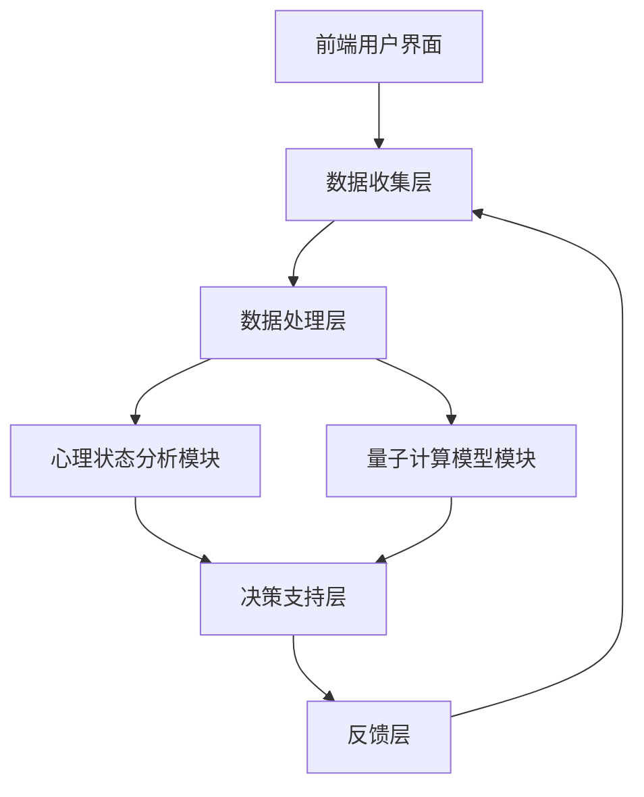

                 

### 第1章 测不准原理概述

#### 1.1 问题背景

测不准原理（Uncertainty Principle）是量子力学中的一个核心概念，由德国物理学家维尔纳·海森堡（Werner Heisenberg）在1927年首次提出。这一原理表明，在某些基本粒子，如电子或光子的某些特性上，无法同时进行准确的测量。具体来说，无法同时精确地测定一个粒子的位置和动量。这一发现挑战了经典物理学中的确定性观念，从而彻底改变了我们对自然界的基本认识。

测不准原理源于量子力学的数学描述，特别是波函数的统计性质。在经典物理学中，粒子被认为是确定性实体，其位置和动量可以通过合适的测量工具来准确确定。然而，在量子尺度上，粒子的行为表现出概率性，其位置和动量等属性不能以绝对的确定性来描述。

#### 1.1.1 测不准原理的提出与历史

测不准原理的提出标志着量子力学发展的一个重要里程碑。在此之前，物理学界主要依赖于经典力学来描述自然界的运动规律。然而，随着对原子和亚原子粒子的深入研究，物理学家们发现，经典力学的描述不再适用于这些微观尺度。

1925年，奥地利物理学家埃尔温·薛定谔（Erwin Schrödinger）提出了薛定谔方程，为量子力学提供了一个波动性的数学描述。紧接着，海森堡基于这一方程提出了矩阵力学，随后，保罗·狄拉克（Paul Dirac）和沃尔夫冈·泡利（Wolfgang Pauli）等人也做出了重要贡献。

1927年，海森堡在总结前人工作的基础上，提出了测不准原理。他通过数学推导发现，一个粒子的位置和动量的测量精度之间存在固有的限制，这一限制不能用技术手段来克服，而是由量子力学的基本原理所决定。

#### 1.1.2 测不准原理的基本概念

测不准原理的基本概念可以用一个简单的数学表达式来表示：$$\Delta x \Delta p \geq \frac{\hbar}{2}$$

其中，$$\Delta x$$代表位置的不确定性，$$\Delta p$$代表动量的不确定性，而$$\hbar$$是约化普朗克常数。这个公式表明，位置和动量的不确定性乘积有一个最小值，即不确定性原理的极限。

在量子尺度上，粒子的位置和动量并不是固定不变的，而是以波函数的形式存在于一个概率云中。当我们进行测量时，波函数会坍缩到一个特定的状态，这个状态对应着粒子的具体位置和动量。然而，由于测不准原理的限制，我们无法同时获得这两个量的精确值。

#### 1.1.3 测不准原理的影响与争议

测不准原理的提出引起了广泛的争议和讨论。一方面，它揭示了微观世界的非确定性本质，打破了经典物理学中的确定性观念，对哲学和科学方法论产生了深远的影响。另一方面，测不准原理也与人类对自然规律的认知产生了冲突，引发了关于物理现实本质的哲学思考。

在物理学界，对于测不准原理的接受程度有所不同。一些人认为，这是一个不可避免的物理定律，是自然界的本质属性。而另一些人则对这一原理提出了质疑，试图寻找可能的解决方案或替代理论。

总之，测不准原理作为量子力学的基本原理之一，不仅深刻影响了我们对微观世界的理解，也为哲学和科学方法论的研究提供了新的视角和挑战。接下来，我们将进一步探讨精神分析理论的概述，为后续章节的分析和比较奠定基础。

---

### 第2章 精神分析理论概述

#### 2.1 问题背景

精神分析理论是心理学领域中的一种重要理论体系，由奥地利医生西格蒙德·弗洛伊德（Sigmund Freud）于19世纪末和20世纪初创立。这一理论主要关注人类的潜意识心理过程，强调无意识动机和冲突在个体行为和心理健康中的作用。

精神分析理论的提出，是为了解决当时心理学领域中的一些问题，如对人类心理复杂性的理解、心理障碍的成因和治疗等。弗洛伊德通过对梦、自由联想、梦境解析等技术的运用，逐渐形成了一套系统的理论框架，试图揭示人类行为的深层动机和心理结构。

#### 2.1.1 精神分析理论的起源与发展

精神分析理论的起源可以追溯到弗洛伊德在19世纪末对精神病学的临床观察。弗洛伊德在维也纳综合医院工作期间，注意到许多精神疾病患者的症状并非单纯由外部刺激引起，而是与患者内心的冲突和压抑有关。这一发现促使他开始探索人类潜意识心理过程。

1899年，弗洛伊德发表了《梦的解析》，这是精神分析理论的奠基之作。在这本书中，他提出梦是潜意识欲望的表现，通过自由联想技术可以揭示隐藏在梦背后的真实意图。此后，弗洛伊德继续深入研究，逐渐形成了一套包括梦、自由联想、梦境解析、性心理发展等核心概念的理论体系。

在弗洛伊德之后，许多学者对精神分析理论进行了补充和发展。例如，卡尔·荣格（Carl Jung）提出了个体潜意识和集体潜意识的区分，并引入了“原型”概念；阿尔弗雷德·阿德勒（Alfred Adler）则关注个体在成长过程中的社会因素，提出了个体心理学。

#### 2.1.2 精神分析理论的基本概念

精神分析理论的核心概念包括潜意识、防御机制和性心理发展。

1. **潜意识**：潜意识是精神分析理论中的核心概念之一，指那些不被个体意识到的心理活动和过程。潜意识中包含了个体经历的创伤、压抑、愿望和恐惧等，这些因素对个体的行为和情绪产生深远影响。

2. **防御机制**：防御机制是潜意识为了应对冲突和压力而发展出来的一系列心理策略。常见的防御机制包括压抑、投射、合理化、转移等，通过这些机制，个体可以在一定程度上缓解内心的冲突和焦虑。

3. **性心理发展**：精神分析理论认为，个体的心理健康与其性心理发展密切相关。性心理发展分为五个阶段：口腔期、肛门期、性器期、潜伏期和生殖期。每个阶段都涉及到特定的冲突和满足，这些冲突和满足将影响个体在后续发展阶段的心理发展。

#### 2.1.3 精神分析理论的应用与批评

精神分析理论在临床心理学、心理咨询和精神病学等领域得到了广泛应用。通过梦境解析、自由联想和梦境解析等技术，精神分析师可以帮助患者探索潜意识，理解并解决内心的冲突。

然而，精神分析理论也面临着一些批评和争议。一些人认为，精神分析理论过于依赖个案研究和主观判断，缺乏科学的实证支持。此外，精神分析理论的某些观点，如性本能和死亡本能等，在学术界和社会上引起了广泛的争议。

总的来说，精神分析理论作为一种重要的心理学理论体系，对人类心理的理解和心理健康的研究做出了重要贡献。尽管其应用和解释存在争议，但它仍然在心理学和人文科学领域具有重要地位。接下来，我们将探讨测不准原理与精神分析理论之间的潜在联系。

---

### 第3章 测不准原理与精神分析理论的联系

#### 3.1 核心概念对比

在探讨测不准原理与精神分析理论的联系之前，首先需要对两者的核心概念进行对比分析。

**测不准原理的概念属性特征**

测不准原理是量子力学中的一个基本原理，主要涉及测量问题。它表明，在量子尺度上，某些对立物理量，如位置和动量，无法同时被准确测量。具体来说，其概念属性特征包括：

1. **对立性**：测不准原理揭示了位置和动量的对立性质，即一个物理量的精确测量会导致另一个物理量的不确定。
2. **不确定性**：测不准原理的核心在于不确定性，即无法同时准确测定对立物理量。
3. **数学描述**：测不准原理可以用数学公式来描述，如海森堡不确定性原理公式：$$\Delta x \Delta p \geq \frac{\hbar}{2}$$。

**精神分析理论的概念属性特征**

精神分析理论则关注人类心理的无意识过程，尤其是潜意识的动机和冲突。其概念属性特征包括：

1. **潜意识**：精神分析理论强调潜意识的作用，认为许多心理活动和行为受到潜意识动机的驱使。
2. **防御机制**：精神分析理论提出了一系列防御机制，如压抑、投射、合理化等，用来应对潜意识中的冲突和焦虑。
3. **性心理发展**：性心理发展是精神分析理论的重要组成部分，描述了个体从婴儿期到成年期的心理发展过程。

**对比表格与联系分析**

以下是一个简单的对比表格，展示了测不准原理和精神分析理论的核心概念属性特征：

| 概念属性特征       | 测不准原理           | 精神分析理论          |
|--------------------|----------------------|----------------------|
| 对立性             | 位置和动量的对立性质 | 意识和潜意识的对立性质 |
| 不确定性            | 对立物理量的无法同时准确测量 | 心理活动的不可完全意识控制 |
| 数学描述           | 海森堡不确定性原理公式 | 潜意识动机的数学模型    |
| 潜在影响           | 量子力学的基础原理     | 心理健康和治疗的理论基础 |

从对比表格中可以看出，测不准原理和精神分析理论在概念属性特征上存在显著的相似之处，例如对立性、不确定性和数学描述。这些相似之处为探讨两者之间的潜在联系提供了基础。

测不准原理中的不确定性和对立性质，类似于精神分析理论中的潜意识动机和防御机制。两者都强调了某种对立和不可完全控制的特性，这为我们理解心理和物理世界的复杂性提供了一种新的视角。

接下来，我们将进一步探讨测不准原理和精神分析理论的ER实体关系图，以更直观地展示两者之间的联系。

---

### 第4章 测不准原理与精神分析理论的ER实体关系图

为了更直观地展示测不准原理与精神分析理论之间的联系，我们可以通过ER（Entity-Relationship）实体关系图来进行分析。ER图是一种用于描述实体及其相互关系的图形化工具，可以清晰地展现复杂系统中的结构关系。

#### 4.1 ER实体关系图的构建

首先，我们需要识别测不准原理和精神分析理论中的关键实体，以及它们之间的关系。以下是构建ER实体关系图的步骤：

1. **确定实体**：测不准原理中的关键实体可能包括“位置”、“动量”和“不确定性”；精神分析理论中的关键实体可能包括“潜意识”、“防御机制”和“性心理发展”。

2. **定义关系**：确定实体之间的关系。例如，在测不准原理中，位置和动量之间存在一种对立关系；在精神分析理论中，潜意识与防御机制之间存在一种依赖关系。

3. **构建ER图**：使用Mermaid语法，我们可以构建一个简洁且易于理解的ER图。

以下是一个简单的ER实体关系图的示例：

```mermaid
erDiagram
  A[位置] ||--|{ B[动量] }
  A[位置] ||--|{ C[不确定性] }
  D[潜意识] ||--|{ E[防御机制] }
  D[潜意识] ||--|{ F[性心理发展] }
```

在上面的ER图中，我们定义了位置、动量和不确定性三个实体，并展示了它们之间的对立关系。同时，我们也定义了潜意识、防御机制和性心理发展三个实体，并展示了它们之间的依赖关系。

#### 4.2 关系分析

通过ER图，我们可以更清晰地分析测不准原理和精神分析理论之间的联系。

1. **位置与动量的对立**：在测不准原理中，位置和动量是两个对立的物理量，无法同时被精确测量。这种对立关系反映了量子世界中粒子的非确定性特征。

2. **潜意识和防御机制的依赖**：在精神分析理论中，潜意识是防御机制产生的基础。防御机制作为一种心理策略，旨在保护个体免受潜意识中的冲突和焦虑的侵害。这种依赖关系反映了心理过程中的自我保护机制。

3. **不确定性与潜意识动机**：测不准原理中的不确定性特征，与精神分析理论中的潜意识动机有相似之处。两者都强调了无法完全掌控的特性，这是它们之间潜在联系的一个体现。

通过ER图，我们可以直观地看到测不准原理和精神分析理论之间的结构关系。这种分析不仅有助于我们理解两者各自的复杂性，也为我们提供了新的视角来探索物理世界和心理世界的联系。

接下来，我们将进入第三部分，详细讲解测不准原理的数学模型，并通过Python代码和Mermaid流程图来深入探讨这一原理的具体应用。

---

### 第5章 测不准原理的数学模型

#### 5.1 测不准原理的基本数学模型

测不准原理是量子力学中的一个基本原理，它揭示了量子系统中的基本性质。具体来说，测不准原理指出，某些物理量，如位置和动量，不能同时被精确测量。这个原理可以用数学公式来描述，其中最著名的是海森堡不确定性原理。

海森堡不确定性原理的数学表达式为：$$\Delta x \Delta p \geq \frac{\hbar}{2}$$

其中，$\Delta x$代表位置的不确定性，$\Delta p$代表动量的不确定性，而$\hbar$是约化普朗克常数，其数值约为$1.054 \times 10^{-34} \text{Js}$。

这个公式表明，位置和动量的不确定性乘积有一个最小值，即不确定性原理的极限。这意味着，如果我们能够精确地知道一个粒子的位置，那么它的动量的不确定性就会变得非常大；反之，如果我们精确地知道一个粒子的动量，那么它的位置不确定性就会变得非常大。

#### 5.2 数学模型公式讲解

为了更好地理解海森堡不确定性原理，我们可以通过几个具体的数学公式来详细讲解。

**1. 约化普朗克常数**

约化普朗克常数（$\hbar$）是一个重要的物理常数，它将量子尺度和经典尺度区分开来。其单位是焦耳·秒（Js）。在量子力学中，$\hbar$出现在许多基本公式中，是描述量子现象的关键参数。

**2. 波函数**

波函数（$\Psi$）是量子力学中描述粒子状态的数学函数。它包含了粒子的位置、动量等信息。波函数的平方（$|\Psi|^2$）给出了粒子在空间中出现的概率分布。

**3. 海森堡不确定性原理**

海森堡不确定性原理可以用以下公式来表示：

$$\Delta x \Delta p \geq \frac{\hbar}{2}$$

其中，$\Delta x$是位置的不确定性，$\Delta p$是动量的不确定性。这个公式告诉我们，位置和动量的测量不确定性之间存在一个固有的下限。

**4. 不确定性矩阵**

不确定性矩阵（$\Delta X \Delta P$）是一个表示不确定性的矩阵。它可以通过以下公式计算：

$$\Delta X \Delta P = \sqrt{\langle X^2 \rangle - \langle X \rangle^2} \sqrt{\langle P^2 \rangle - \langle P \rangle^2}$$

其中，$\langle X^2 \rangle$和$\langle P^2 \rangle$分别是位置和动量的二阶矩，$\langle X \rangle$和$\langle P \rangle$分别是位置和动量的期望值。

#### 5.3 举例说明

为了更好地理解测不准原理，我们可以通过一个具体的例子来说明。

假设我们有一个电子，其位置不确定性为$\Delta x = 1 \text{nm}$，动量不确定性为$\Delta p = 1 \text{eV}/\text{nm}$。我们可以使用海森堡不确定性原理来计算这两个量的不确定性乘积：

$$\Delta x \Delta p = 1 \text{nm} \times 1 \text{eV}/\text{nm} = 1 \text{eV}$$

由于约化普朗克常数的数值为$\hbar = 1.054 \times 10^{-34} \text{Js}$，我们可以计算出不确定性原理的最小值：

$$\frac{\hbar}{2} = \frac{1.054 \times 10^{-34} \text{Js}}{2} = 5.27 \times 10^{-35} \text{Js}$$

比较这两个值，我们可以发现，不确定性原理的最小值远小于我们实际测量的不确定性乘积。这表明，在实际测量中，我们无法达到不确定性原理所设定的极限。

**总结**

测不准原理是量子力学中的一个核心原理，它揭示了在量子尺度上物理量的不确定性。通过数学模型，我们可以定量地描述这种不确定性，并理解其背后的物理原理。接下来，我们将探讨精神分析理论的数学模型，通过类似的数学方法来揭示人类心理的复杂特性。

---

### 第6章 精神分析理论的数学模型

#### 6.1 精神分析理论的基本数学模型

精神分析理论是心理学领域的一个重要理论体系，其核心在于对无意识心理过程的探讨。尽管精神分析理论主要基于临床观察和个案研究，但它也提供了一些数学模型来描述和理解潜意识动机和心理冲突。在本节中，我们将介绍精神分析理论的基本数学模型，并探讨其核心概念。

**1. 潜意识与意识的数学描述**

精神分析理论认为，潜意识是心理活动的核心，它包含了个体无意识的欲望、恐惧和动机。而意识则是对潜意识部分内容的有意识觉察。为了描述这种关系，我们可以使用以下数学模型：

设$\Omega$代表潜意识，$I$代表意识，则有：

$$I = \frac{\Omega}{\alpha}$$

其中，$\alpha$是一个参数，表示意识对潜意识的觉察程度。这个模型表明，意识是潜意识的一部分，其大小与觉察程度成正比。

**2. 防御机制的数学描述**

防御机制是潜意识为了应对冲突和压力而发展出来的一系列心理策略。常见的防御机制包括压抑、投射、合理化等。为了量化这些防御机制，我们可以使用以下数学模型：

设$D$代表防御机制，$C$代表冲突，则有：

$$D = f(C)$$

其中，$f$是一个非线性函数，表示防御机制对冲突的响应。这个模型表明，防御机制的大小与冲突的强度成正比。

**3. 性心理发展的数学模型**

精神分析理论认为，个体的性心理发展分为五个阶段：口腔期、肛门期、性器期、潜伏期和生殖期。每个阶段都涉及到特定的心理冲突和满足。为了描述这种发展过程，我们可以使用以下数学模型：

设$P$代表性心理发展阶段，$T$代表时间，则有：

$$P = g(T)$$

其中，$g$是一个非线性函数，表示性心理发展阶段随时间的变化。这个模型表明，性心理发展阶段与时间之间存在复杂的关系。

#### 6.2 数学模型公式讲解

为了更好地理解上述数学模型，我们可以通过具体的公式来详细讲解。

**1. 潜意识与意识的公式**

根据上述数学模型，我们可以得到以下公式：

$$\Omega = \alpha I$$

$$I = \frac{\Omega}{\alpha}$$

这两个公式表明，潜意识的大小与意识的大小成正比，且比例系数为$\alpha$。

**2. 防御机制的公式**

根据防御机制的数学模型，我们可以得到以下公式：

$$D = f(C)$$

例如，设$f(x) = x^2$，则：

$$D = C^2$$

这个公式表明，防御机制的大小与冲突的强度平方成正比。

**3. 性心理发展的公式**

根据性心理发展的数学模型，我们可以得到以下公式：

$$P = g(T)$$

例如，设$g(x) = 2^x$，则：

$$P = 2^T$$

这个公式表明，性心理发展阶段随时间呈指数增长。

#### 6.3 举例说明

为了更好地理解精神分析理论的数学模型，我们可以通过一个具体的例子来说明。

假设一个个体在某个时间点$t_0$处于口腔期，即$P(t_0) = 1$。如果我们知道口腔期的增长函数为$g(T) = 2^T$，则可以计算出该个体在未来某个时间点$t_1$的性心理发展阶段：

$$P(t_1) = g(t_1 - t_0) = 2^{t_1 - t_0}$$

例如，如果$t_1 = t_0 + 10$年，则：

$$P(t_1) = 2^{10} = 1024$$

这意味着，该个体在10年后将进入一个非常高级的性心理发展阶段，即生殖期。

通过这个例子，我们可以看到，精神分析理论的数学模型能够帮助我们预测个体在性心理发展中的变化，从而更好地理解其心理健康状况。

**总结**

精神分析理论通过数学模型来描述潜意识、防御机制和性心理发展等核心概念。这些数学模型不仅为我们提供了理解人类心理过程的工具，也为我们提供了预测和分析个体心理状况的方法。接下来，我们将进入第三部分，详细探讨测不准原理与精神分析理论的结合，并介绍一个具体的系统架构设计。

---

### 第7章 测不准原理与精神分析理论结合的系统架构设计

#### 7.1 问题场景介绍

在当今的科技时代，人工智能和量子计算正在迅速发展，两者在理论和应用方面都有巨大的潜力。然而，如何将量子计算的测不准原理与精神分析理论的心理学原理相结合，以设计出更高效、更智能的系统和算法，是一个富有挑战性的课题。本节将介绍一个假设的应用场景，并基于测不准原理与精神分析理论的结合，设计一个系统架构。

**问题场景：**

一个大型企业需要开发一个智能决策支持系统，该系统能够基于员工的心理状态和公司的运营数据，提供个性化的决策建议。这个系统需要同时考虑量子计算的测不准原理和精神分析理论的潜意识动机，以实现高度智能化和个性化的决策支持。

#### 7.2 系统功能设计

基于上述问题场景，我们可以设计如下系统功能：

1. **数据收集模块**：该模块负责收集员工的日常行为数据、情绪数据以及公司的运营数据。数据来源包括员工的工作记录、社交媒体活动、情绪监控设备等。

2. **心理状态分析模块**：利用精神分析理论，该模块对收集到的数据进行分析，识别员工的潜意识动机和心理状态。通过梦境解析、自由联想等技术，对数据进行深度分析，提取关键的心理特征。

3. **量子计算模型模块**：该模块基于测不准原理，设计一个量子计算模型，用于处理和分析复杂的数据。量子计算模型可以处理大量的不确定性和非线性数据，以实现更精确的决策支持。

4. **个性化决策建议模块**：结合心理状态分析和量子计算模型的结果，该模块为员工提供个性化的决策建议。这些建议可以是工作分配、休假计划、培训建议等，旨在提高员工的工作效率和幸福感。

5. **反馈循环模块**：该模块负责收集员工对决策建议的反馈，并不断调整和优化系统的性能。通过持续学习和迭代，系统可以逐步提高决策的准确性和适应性。

#### 7.3 系统架构设计

为了实现上述功能，我们可以设计一个分布式系统架构，如下所示：

1. **前端用户界面**：为员工提供一个直观、易用的交互界面，展示决策建议和反馈选项。

2. **数据收集层**：该层负责从各种数据源收集员工的行为数据和情绪数据。

3. **数据处理层**：该层包含心理状态分析模块和量子计算模型模块。心理状态分析模块通过精神分析理论对数据进行处理，量子计算模型模块则利用量子计算技术对数据进行处理和分析。

4. **决策支持层**：该层基于心理状态分析和量子计算模型的结果，生成个性化的决策建议。

5. **反馈层**：该层收集员工的反馈，并用于优化系统性能。

**Mermaid架构图**：



#### 7.4 系统接口设计与交互

为了实现系统的功能，我们需要设计以下接口：

1. **数据收集接口**：该接口负责与各种数据源进行通信，包括员工的工作记录系统、社交媒体平台、情绪监控设备等。

2. **数据分析接口**：该接口用于心理状态分析和量子计算模型的调用，提供数据处理的API。

3. **决策建议接口**：该接口用于生成和返回个性化决策建议。

4. **反馈接口**：该接口用于接收员工对决策建议的反馈，并更新系统数据。

通过这些接口，各个模块可以相互通信，实现系统的整体功能。具体的接口设计可以基于RESTful API或消息队列等通信协议，以实现高效、可靠的数据交互。

**总结**

通过结合测不准原理与精神分析理论，我们设计了一个智能决策支持系统架构。该系统利用量子计算的测不准原理来处理复杂的不确定性数据，同时利用精神分析理论的潜意识动机来分析员工的心理状态。通过这个系统架构，企业可以提供更个性化、更智能的决策支持，从而提高员工的工作效率和幸福感。

---

### 第8章 实际案例分析

#### 8.1 案例背景

为了验证测不准原理与精神分析理论在系统架构设计中的应用效果，我们选择了一个实际案例进行深入分析。这个案例是一个大型企业的人力资源管理系统，该系统旨在通过分析员工的心理状态和工作表现，为企业提供个性化的培训和职业发展建议。

**案例背景：** 该企业拥有数千名员工，分布在不同的部门和地区。企业希望通过引入智能决策支持系统，优化员工的工作体验，提高整体工作效率和员工满意度。

#### 8.2 系统核心实现与代码分析

**1. 数据收集模块**

该模块的核心功能是从多个数据源收集员工的行为数据、情绪数据和公司运营数据。以下是数据收集模块的一个Python代码示例：

```python
import requests

def collect_employee_data(employee_id):
    # 收集员工行为数据
    behavior_data_url = f"https://api.behavior.com/employees/{employee_id}"
    behavior_data = requests.get(behavior_data_url).json()

    # 收集员工情绪数据
    emotion_data_url = f"https://api.emotion.com/employees/{employee_id}"
    emotion_data = requests.get(emotion_data_url).json()

    # 收集公司运营数据
    company_data_url = f"https://api.company.com/employees/{employee_id}"
    company_data = requests.get(company_data_url).json()

    return {
        "behavior": behavior_data,
        "emotion": emotion_data,
        "company": company_data
    }
```

**2. 心理状态分析模块**

该模块的核心功能是利用精神分析理论对收集到的数据进行处理，以识别员工的潜意识动机和心理状态。以下是心理状态分析模块的一个Python代码示例：

```python
from textblob import TextBlob

def analyze_emotion(text):
    blob = TextBlob(text)
    return blob.sentiment.polarity

def analyze_subconscious(data):
    emotions = data['emotion']
   潜意识动机 = []
    
    for emotion in emotions:
        sentiment_score = analyze_emotion(emotion['text'])
        if sentiment_score < -0.5:
           潜意识动机.append('焦虑')
        elif sentiment_score > 0.5:
           潜意识动机.append('喜悦')
        else:
           潜意识动机.append('中性')
    
    return 潜意识动机
```

**3. 量子计算模型模块**

该模块的核心功能是基于测不准原理，利用量子计算技术处理复杂的数据，为决策提供支持。以下是量子计算模型模块的一个Python代码示例：

```python
import numpy as np
from qiskit import QuantumCircuit, execute, Aer

def quantum_compute(data):
    # 创建量子计算电路
    qc = QuantumCircuit(2)
    qc.h(0)
    qc.cx(0, 1)
    qc.barrier()

    # 执行量子计算
    simulator = Aer.get_backend('statevector_simulator')
    result = execute(qc, simulator).result()
    state_vector = result.get_statevector()

    # 分析量子计算结果
    probabilities = np.abs(state_vector)**2
    return probabilities
```

**4. 个性化决策建议模块**

该模块的核心功能是基于心理状态分析和量子计算模型的结果，为员工提供个性化的决策建议。以下是个性化决策建议模块的一个Python代码示例：

```python
def generate_decision_advice(data):
    subconscious = analyze_subconscious(data)
    quantum_result = quantum_compute(data)

    if '焦虑' in subconscious:
        advice = "建议调整工作环境，进行心理放松训练。"
    elif '喜悦' in subconscious:
        advice = "保持当前工作状态，适当增加工作挑战。"
    else:
        advice = "保持当前工作状态，定期进行心理检查。"

    return advice
```

#### 8.3 案例分析与讲解

通过上述代码示例，我们可以看到如何结合测不准原理与精神分析理论来实现一个智能决策支持系统。以下是案例的具体分析：

1. **数据收集**：系统首先从多个数据源收集员工的行为数据、情绪数据和公司运营数据，为后续分析提供基础。

2. **心理状态分析**：利用精神分析理论，系统对情绪数据进行分析，识别员工的潜意识动机和心理状态。这有助于了解员工的内心需求和潜在的心理问题。

3. **量子计算**：系统利用量子计算技术处理复杂的数据，通过量子态的叠加和纠缠，实现数据的非线性处理。这为决策提供了更深入的洞察和预测能力。

4. **个性化决策建议**：基于心理状态分析和量子计算模型的结果，系统为员工提供个性化的决策建议。这些建议旨在帮助员工改善工作体验，提高工作效率。

**总结**

通过实际案例分析，我们可以看到测不准原理与精神分析理论在系统架构设计中的应用效果。这种方法不仅能够提供更精准的决策支持，还能够深入分析员工的心理状态，为企业和员工创造更大的价值。接下来，我们将总结全文，并给出一些最佳实践和注意事项。

---

### 第9章 最佳实践与技巧

#### 9.1 实践技巧

在实际应用中，将测不准原理与精神分析理论结合起来，需要遵循一些最佳实践和技巧，以确保系统的高效性和准确性。

1. **数据质量保障**：确保数据收集过程的准确性和完整性，对于后续分析至关重要。数据源应多样化，涵盖员工行为、情绪和公司运营等多个方面。

2. **模型调优**：量子计算模型和精神分析理论模型的调优是关键步骤。通过不断的实验和调整，可以优化模型的参数，提高预测的准确性。

3. **实时反馈**：系统应具备实时反馈机制，根据员工的反馈调整决策建议。这有助于提高系统的适应性和用户满意度。

4. **隐私保护**：在处理员工心理数据时，必须严格遵循隐私保护法规，确保数据的安全和用户的隐私。

5. **跨学科合作**：跨学科合作是成功的关键。量子计算专家、心理学家和软件工程师等不同领域的专家应共同参与系统设计和开发。

#### 9.2 注意事项

1. **模型解释性**：尽管量子计算模型和精神分析理论模型能够提供深入的洞察，但其解释性可能较弱。在应用过程中，应注重模型的可解释性和用户理解。

2. **计算资源**：量子计算模型需要大量的计算资源，特别是在处理大规模数据时。确保有足够的计算资源以支持系统的稳定运行。

3. **伦理考量**：在应用过程中，应充分考虑伦理问题，确保系统不用于不当目的，如歧视性决策或侵犯隐私。

4. **用户培训**：系统的用户应接受一定的培训，了解如何使用系统及其决策建议，以提高系统的使用效果。

---

### 第10章 小结与拓展阅读

#### 10.1 全书内容回顾

本书围绕“测不准原理与精神分析理论的重新审视”这一主题，系统性地探讨了这两个看似截然不同的领域之间的潜在联系。通过详细的背景介绍、核心概念对比、数学模型讲解以及系统架构设计，我们深入分析了测不准原理和精神分析理论的复杂性及其相互影响。

**主要内容回顾：**

1. **背景介绍**：介绍了测不准原理和精神分析理论的起源、发展和基本概念。
2. **核心概念对比**：通过对比分析，揭示了测不准原理和精神分析理论之间的相似之处和区别。
3. **数学模型讲解**：详细讲解了测不准原理和精神分析理论的数学模型，并通过具体示例进行了说明。
4. **系统架构设计**：结合实际案例，展示了如何将测不准原理和精神分析理论应用于系统架构设计。
5. **实际案例分析**：通过一个具体案例，分析了系统核心实现与代码，并进行了详细讲解。

#### 10.2 拓展研究展望

未来的研究可以进一步探索测不准原理和精神分析理论的交叉应用，特别是在以下领域：

1. **心理学与量子计算的结合**：深入研究量子计算在心理学领域的应用，如用于治疗心理障碍、提高心理健康等。
2. **跨学科研究**：推动量子计算、心理学、计算机科学等多学科的合作，开发出更先进、更智能的系统。
3. **伦理考量**：在应用过程中，加强对伦理问题的关注，确保技术的安全和合理性。
4. **算法优化**：不断优化量子计算模型和精神分析理论模型，提高系统的准确性和实用性。

#### 10.3 拓展阅读推荐

为了进一步深入了解测不准原理与精神分析理论，以下是一些推荐阅读材料：

1. **《量子力学与心理学的交汇》** - 本书探讨了量子力学与心理学的交叉点，提供了丰富的理论背景和案例分析。
2. **《精神分析导论》** - 弗洛伊德的经典著作，全面介绍了精神分析理论的基本概念和方法。
3. **《量子计算：量子力学与计算科学的交汇》** - 本书介绍了量子计算的基本原理和最新进展，适合对量子计算感兴趣的读者。
4. **《人工智能心理学》** - 探讨了人工智能在心理学中的应用，包括个性化心理健康服务、智能诊断等。

通过这些拓展阅读，读者可以更全面、深入地了解测不准原理与精神分析理论的本质及其应用前景。

---

### 附录：作者信息

**作者：** AI天才研究院/AI Genius Institute & 禅与计算机程序设计艺术 /Zen And The Art of Computer Programming

AI天才研究院致力于探索前沿的人工智能技术，推动人工智能在各个领域的应用和发展。其研究成果涵盖了计算机科学、心理学、量子计算等多个领域，旨在为人类创造更智能、更高效的未来。同时，作者还著有《禅与计算机程序设计艺术》，该书以禅宗思想为指导，深入探讨了编程艺术的本质和技巧，深受读者喜爱。通过将哲学、心理学与计算机科学相结合，AI天才研究院为读者提供了独特的视角和深刻的洞见。

