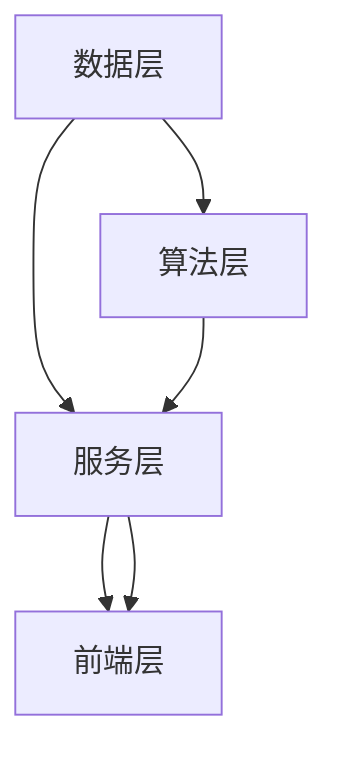
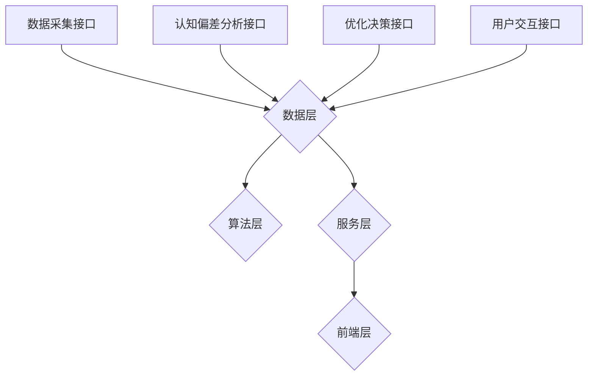
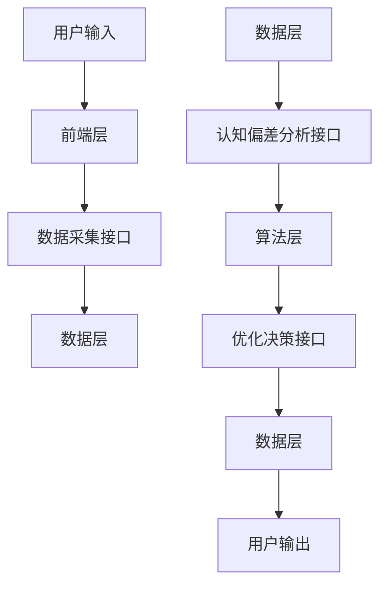

                 

### 测不准原理与认知偏差

测不准原理是量子力学中的一个核心概念，它由德国物理学家维尔纳·海森堡在1927年提出。测不准原理表明，某些物理量，例如位置和动量，不能同时被精确测量，即一个粒子的位置越精确，其动量的不确定性就越大，反之亦然。这一原理在量子世界中体现得尤为明显，因为它挑战了经典物理学中的决定论和精确测量的假设。

认知偏差是人类在感知、理解和决策过程中出现的系统性错误。这些偏差可以源于人类大脑处理信息的方式，也可以是文化、社会和心理因素的影响。常见的认知偏差包括确认偏见、锚定效应、可得性偏见等。

在这篇文章中，我们将探讨测不准原理在认知偏差形成中的作用。通过结合量子物理和认知科学的研究，我们希望能够揭示出这两个看似不相关的领域之间的一些潜在联系。

首先，我们会介绍测不准原理的基本概念和它对现代物理学的重要性。然后，我们会详细阐述认知偏差的定义和类型，并探讨它们对个体和社会的影响。接下来，我们将深入探讨测不准原理与认知偏差之间的联系，解释它们如何相互影响。之后，我们将介绍测不准原理在认知偏差研究中的应用算法，并使用数学模型和公式来详细解释这些算法。

在算法讲解之后，我们将进一步分析测不准原理在认知偏差形成中的作用，并设计一个系统架构来应对这一问题。通过一个实际案例，我们将展示如何将测不准原理应用于认知偏差的研究中。最后，我们将总结文章的主要内容，并指出未来研究的方向。

通过这篇文章，我们希望读者能够更好地理解测不准原理和认知偏差之间的复杂关系，并认识到在处理复杂信息时，如何运用这些原理来减少认知偏差，从而提高我们的认知质量和决策水平。

### 背景介绍

#### 测不准原理的基本概念

测不准原理（Uncertainty Principle），又称不确定性原理，是量子力学中的基本概念之一。它由德国物理学家维尔纳·海森堡（Werner Heisenberg）在1927年提出，是对经典物理学中确定性原则的挑战。测不准原理的核心内容是，对于一个量子系统，某些物理量（例如位置和动量）不能同时被精确测量。换句话说，一个粒子的位置越精确，其动量的不确定性就越大，反之亦然。这一原理不仅改变了我们对微观世界的理解，也对量子信息科学和量子计算的发展产生了深远影响。

测不准原理的数学表达可以通过海森堡不确定性原理公式来描述：

\[ \Delta x \cdot \Delta p \geq \frac{\hbar}{2} \]

其中，\( \Delta x \) 表示位置的不确定性，\( \Delta p \) 表示动量的不确定性，\( \hbar \) 是约化普朗克常数。这个公式表明，位置和动量的不确定性之间存在一个最小值，即无法同时将它们测量得非常精确。

#### 历史背景

测不准原理的提出背景可以追溯到20世纪初，当时物理学界正面临着经典物理学无法解释的新现象。例如，经典物理学无法解释黑体辐射问题、光电效应等现象。这些问题促使物理学家们探索新的理论框架。在这一过程中，马克斯·波恩（Max Born）、维尔纳·海森堡和埃尔温·薛定谔（Erwin Schrödinger）等科学家提出了量子力学的基本原理。

1925年，维尔纳·海森堡基于矩阵力学理论提出了测不准原理。次年，埃尔温·薛定谔基于波动方程也独立提出了量子力学理论。这两大理论在1927年被海森堡和薛定谔证明是等价的，从而奠定了量子力学的基础。测不准原理作为这一理论的核心，揭示了微观世界中固有的随机性和不确定性。

#### 测不准原理对现代物理学的重要性

测不准原理对现代物理学有着深远的影响，其重要性体现在以下几个方面：

1. **微观世界的本质理解**：测不准原理揭示了微观粒子的非确定性特征，挑战了经典物理学中的决定论和精确测量的观念。它促使物理学家重新审视物质世界的本质，认识到微观粒子如电子、光子等的行为具有随机性和概率性。

2. **量子信息科学的基石**：测不准原理是量子信息科学和量子计算的理论基础。量子计算机利用量子比特（qubit）的非经典特性，通过量子叠加和量子纠缠来实现高效的计算。测不准原理确保了量子比特之间的非局域性，这对于量子通信和量子密码学等领域具有重要意义。

3. **实验物理的发展**：测不准原理推动了实验物理的发展，促使科学家们开发出各种先进的实验技术和设备，以验证和探索量子现象。例如，量子干涉实验、量子态操控实验等，这些实验不仅验证了测不准原理，也揭示了量子世界的奇妙特性。

#### 测不准原理在现代物理学中的应用

1. **量子计算**：量子计算机利用量子比特进行计算，其基本原理就是基于测不准原理。通过量子叠加和量子纠缠，量子计算机可以在一个步骤中处理多个可能的计算结果，从而实现超越经典计算机的计算能力。例如，Shor算法可以在多项式时间内解决大数质因数分解问题，这是经典计算机难以完成的任务。

2. **量子通信**：量子通信利用量子纠缠和量子密钥分发（QKD）技术实现高度安全的通信。由于量子态的任何测量都会导致波函数的坍缩，这使得窃听行为可以被立即检测到，从而确保通信的保密性。

3. **量子传感**：量子传感器利用量子叠加和量子纠缠的特性，可以实现对微小物理量的超灵敏测量。这在精密测量、生物检测和量子计量等领域有着广泛的应用。

4. **量子模拟**：量子模拟器通过模拟量子系统的行为，可以帮助我们更好地理解复杂的量子现象，如高温超导、量子化学等。这对于新材料的发现和量子计算算法的研发具有重要意义。

总的来说，测不准原理不仅是量子力学的核心概念，也是现代物理学发展的重要基础。通过理解测不准原理，我们可以更好地探索微观世界的奥秘，推动量子科技的发展和应用。

#### 认知偏差的定义与类型

认知偏差是人类在感知、理解和决策过程中出现的系统性错误。这些偏差可以源于人类大脑处理信息的方式，也可以是文化、社会和心理因素的影响。常见的认知偏差包括确认偏见、锚定效应、可得性偏见等。

1. **确认偏见**：确认偏见是指个体倾向于寻找、解释和记住那些支持自己已有信念和观点的信息，同时忽视或贬低与之相矛盾的信息。这种偏差会导致个体在决策过程中过于自信，忽视潜在的风险和不确定性。

2. **锚定效应**：锚定效应是指个体在做出决策时，会受到初始信息（即锚）的强烈影响，即使这个锚并不具有实际意义或相关性。例如，在拍卖中，起拍价可能会显著影响最终成交价。

3. **可得性偏见**：可得性偏见是指个体根据最近或容易记忆的信息来评估某种情况的可能性或重要性。例如，因为近期频繁看到某种新闻报道，个体可能会认为该事件的发生概率更高。

4. **代表性偏差**：代表性偏差是指个体根据某个事件或现象的外在特征来判断其发生的概率或相关性。例如，个体可能会因为某个黑人被报道为罪犯而认为黑人更容易犯罪。

5. **确认偏见**：确认偏见是指个体倾向于寻找、解释和记住那些支持自己已有信念和观点的信息，同时忽视或贬低与之相矛盾的信息。这种偏差会导致个体在决策过程中过于自信，忽视潜在的风险和不确定性。

6. **锚定效应**：锚定效应是指个体在做出决策时，会受到初始信息（即锚）的强烈影响，即使这个锚并不具有实际意义或相关性。例如，在拍卖中，起拍价可能会显著影响最终成交价。

7. **可得性偏见**：可得性偏见是指个体根据最近或容易记忆的信息来评估某种情况的可能性或重要性。例如，因为近期频繁看到某种新闻报道，个体可能会认为该事件的发生概率更高。

8. **代表性偏差**：代表性偏差是指个体根据某个事件或现象的外在特征来判断其发生的概率或相关性。例如，个体可能会因为某个黑人被报道为罪犯而认为黑人更容易犯罪。

#### 认知偏差对个体和社会的影响

认知偏差对个体和社会的影响是深远且广泛的。这些偏差不仅影响个人的决策过程，还可能对社会的稳定性和经济发展产生重大影响。

首先，认知偏差对个体决策的影响表现在以下几个方面：

1. **风险决策**：确认偏见和锚定效应会使个体在评估风险时产生错误判断。例如，投资者可能会因为过去成功的投资经历而过于乐观，忽视潜在的市场风险，从而导致巨大的投资损失。

2. **判断偏差**：可得性偏见和代表性偏差会影响个体对事件或现象的评估。例如，个体可能会因为近期频繁看到某种新闻报道而认为该事件的发生概率更高，即使实际数据并不支持这种看法。

3. **决策效率**：认知偏差可能导致个体在决策过程中过于依赖直觉和经验，忽视系统性和全面性的分析。这会降低决策的质量，增加错误决策的风险。

其次，认知偏差对社会的整体影响体现在以下几个方面：

1. **舆论导向**：媒体和公众对事件或现象的报道和认知，可能会受到认知偏差的影响。例如，新闻媒体可能会夸大某些事件的发生频率和影响，从而影响公众的认知和行为。

2. **政策制定**：政府官员和决策者在制定政策时，可能会受到认知偏差的影响，导致政策缺乏科学性和有效性。例如，政策制定者可能会过度依赖专家意见，忽视公众的需求和意见。

3. **社会稳定**：认知偏差可能导致社会成员对某些事件或现象产生误解和偏见，从而引发社会冲突和动荡。例如，种族歧视和宗教冲突往往是认知偏差导致的结果。

4. **经济发展**：认知偏差可能影响企业和投资者的决策，导致市场的不稳定和经济的波动。例如，投资者可能会因为过度乐观或悲观而频繁进行市场投机，从而影响市场的健康发展。

为了减少认知偏差的影响，我们可以采取以下措施：

1. **提高公众认知**：通过教育和宣传，提高公众对认知偏差的认识，使他们能够更理性地评估信息和做出决策。

2. **科学决策**：在制定政策和进行投资决策时，应尽量采用科学的方法和数据分析，减少主观判断的影响。

3. **多元信息**：在获取信息时，应尽量多渠道、多角度地收集信息，避免单一信息源带来的认知偏差。

4. **心理辅导**：对于一些容易受认知偏差影响的个体，可以提供心理辅导和培训，帮助他们提高自我认知和决策能力。

通过这些措施，我们可以在一定程度上减少认知偏差的影响，提高个体和社会的决策质量，从而促进社会的发展和进步。

### 测不准原理与认知偏差的关系

测不准原理与认知偏差之间存在深刻的联系，两者在多个层面上相互影响和作用。首先，我们从理论基础出发，探讨这两个概念如何互相关联。测不准原理是量子力学中的一个核心原则，它揭示了微观粒子的非确定性特性，即某些物理量无法同时被精确测量。这种不确定性在量子世界中是固有的，而认知偏差则是人类大脑在处理信息时出现的系统性错误，它们在本质上是两种不同领域中的不确定性表现。

#### 测不准原理对认知偏差的影响

1. **概率性思维**：测不准原理要求我们以概率性思维来理解微观世界的现象，这种思维方式可以渗透到认知过程中，影响个体对信息的处理。例如，当个体面对复杂且不确定的信息时，可能会更倾向于使用概率性思维来评估和决策，从而减少认知偏差的影响。

2. **对不确定性的接受**：测不准原理促使个体在面对不确定性和风险时，能够更加开放和灵活。这种对不确定性的接受可以减少由于过度追求确定性和完美而产生的认知偏差。

3. **信息处理的复杂性**：由于测不准原理的影响，个体在处理信息时可能需要面对更高的复杂性。这种复杂性可能会增加认知负担，但同时也能够促使个体更加全面和深入地分析信息，从而减少某些简单的认知偏差。

#### 认知偏差对测不准原理理解的影响

1. **信息筛选与解释**：认知偏差会影响个体对测不准原理的理解和接受。例如，具有经典物理学背景的个体可能会因为认知偏差而难以接受量子世界中的非确定性和随机性，从而影响对测不准原理的全面理解。

2. **错误信念的传播**：认知偏差可能导致错误的信念和观念在群体中传播。例如，某些人对量子计算的安全性存在误解，这可能是由于认知偏差导致的对量子物理原理的错误理解。

3. **科研方向的偏差**：认知偏差可能会影响科研工作的方向和深度。例如，如果科研人员受到某种认知偏差的影响，可能会忽视某些重要的研究方向，从而影响整个领域的发展。

#### 具体案例分析

以下是一些具体案例，展示了测不准原理与认知偏差之间的相互作用：

1. **量子计算机的误解**：由于认知偏差，一些公众和决策者对量子计算机的安全性存在误解。他们认为量子计算机可能会突破现有的密码系统，导致数据泄露。然而，这种观点忽略了量子加密技术（如量子密钥分发）的安全性。量子计算机的强大计算能力与其安全性并不矛盾，这反映了认知偏差对理解和应用量子技术的干扰。

2. **气候变化辩论**：在气候变化问题上，一些个体可能会因为认知偏差而忽视科学证据，坚持错误的信念。例如，可得性偏见可能导致个体更关注近期极端天气事件，而忽视长期气候变化的趋势。这种认知偏差会影响公众对气候变化的认知和决策，进而影响全球应对气候变化的行动。

3. **投资决策**：投资者可能会因为确认偏见和锚定效应而在投资决策中犯错误。例如，他们可能会因为过去的成功经历而过于乐观，忽视市场的不确定性和潜在风险，从而做出不理性的投资决策。

#### 结论

测不准原理与认知偏差之间的相互作用是复杂且多层次的。通过理解这两个概念之间的联系，我们可以更好地认识认知偏差的本质，并采取有效的方法来减少它们的影响。这不仅对于量子科技的发展具有重要意义，也对提高个体和社会的认知质量、促进科学决策和解决复杂问题具有深远影响。

### 测不准原理在认知偏差研究中的应用算法

在认知偏差的研究中，测不准原理提供了一种独特的方法来分析和理解人类思维过程中的不确定性。为了更好地应用测不准原理，我们可以借助一些具体的算法，这些算法不仅能够揭示认知偏差的内在机制，还可以帮助我们设计更有效的干预措施来减少这些偏差。以下我们将详细探讨这些算法，包括其基本原理、步骤以及数学模型和公式。

#### 算法概述

1. **量子认知模型**：基于测不准原理的量子认知模型旨在模拟人类思维过程中的不确定性和复杂性。该模型利用量子比特的非经典特性来表示认知过程中的概率性思维和信息处理。

2. **量子贝叶斯推理**：量子贝叶斯推理结合了量子计算和贝叶斯推理，用于更新和整合不确定性信息。它能够更准确地模拟人类在不确定环境下的决策过程。

3. **量子机器学习算法**：量子机器学习算法利用量子叠加和量子并行性来加速传统机器学习算法，从而更有效地处理大规模数据和复杂模式识别问题，这对于认知偏差研究具有重要意义。

#### 算法流程

以下是这些算法的基本流程：

1. **量子认知模型**：
   - **初始化**：设定量子状态表示认知过程。
   - **信息处理**：利用量子操作对信息进行处理，如量子纠缠、量子测量等。
   - **测量结果输出**：通过量子测量获取认知结果。

2. **量子贝叶斯推理**：
   - **初始概率分布**：设定初始概率分布，表示先验知识。
   - **数据更新**：利用量子计算更新概率分布，反映新数据的概率影响。
   - **决策输出**：根据更新后的概率分布做出决策。

3. **量子机器学习算法**：
   - **数据预处理**：将认知偏差数据转换为适合量子计算的格式。
   - **训练模型**：利用量子算法训练模型，识别和分类认知偏差模式。
   - **预测输出**：利用训练好的模型对新数据进行预测和分类。

#### 算法原理与数学模型

1. **量子认知模型**：
   - **量子状态表示**：使用波函数表示认知过程中的状态，例如：
     \[
     \psi = \sum_{i} c_i |i\rangle
     \]
     其中，\( |i\rangle \) 表示可能的认知状态，\( c_i \) 为概率幅。
   
   - **量子操作**：通过量子门（如Hadamard门、控制非门等）对量子状态进行操作，模拟认知过程中的信息处理。例如，Hadamard门可以将经典概率分布转换为量子叠加态：
     \[
     |0\rangle \rightarrow \frac{1}{\sqrt{2}} (|0\rangle + |1\rangle)
     \]

   - **量子测量**：通过量子测量获取认知结果，测量结果可能为多种状态，通过概率幅的平方来计算每种结果的概率。

2. **量子贝叶斯推理**：
   - **初始概率分布**：设定初始概率分布 \( P(H_0) \)，表示先验知识。
   - **贝叶斯更新**：利用量子操作和测量更新概率分布：
     \[
     P(H_1|D) = \frac{P(D|H_1)P(H_1)}{P(D)}
     \]
     其中，\( P(D|H_1) \) 表示给定假设 \( H_1 \) 下数据的概率，\( P(H_1) \) 是先验概率。

   - **量子测量与概率更新**：通过量子测量获取数据，并根据测量结果更新概率分布。

3. **量子机器学习算法**：
   - **量子神经网络**：量子神经网络结合量子比特和经典神经网络，通过量子叠加和量子并行性加速学习过程。量子门和量子线路用于实现神经网络的权重更新和激活函数。
   - **量子支持向量机**：量子支持向量机利用量子计算的高效性来优化支持向量机的分类过程。量子线路用于实现核函数计算和优化目标函数。

#### 算法实例分析

1. **量子认知模型**实例：
   - **案例背景**：研究个体在风险评估过程中如何产生认知偏差。
   - **量子状态表示**：设定量子状态表示不同风险水平下的认知状态。
   - **量子操作**：通过量子操作模拟不同风险情景下的信息处理。
   - **测量结果输出**：通过量子测量获取个体在风险评估中的最终判断。

2. **量子贝叶斯推理**实例：
   - **案例背景**：应用量子贝叶斯推理来更新和整合市场信息。
   - **初始概率分布**：设定股票市场的初始概率分布，反映投资者的先验知识。
   - **数据更新**：利用市场数据更新概率分布，反映最新信息的影响。
   - **决策输出**：根据更新后的概率分布做出投资决策。

3. **量子机器学习算法**实例：
   - **案例背景**：利用量子机器学习算法识别个体在决策过程中的认知偏差。
   - **数据预处理**：将认知偏差数据转换为适合量子计算的格式。
   - **模型训练**：通过量子神经网络和量子支持向量机训练模型，识别不同认知偏差模式。
   - **预测输出**：利用训练好的模型对新数据进行预测，评估个体的认知偏差。

通过这些实例，我们可以看到测不准原理在认知偏差研究中的应用如何通过量子计算和算法来揭示人类思维过程中的不确定性和复杂性。这些方法不仅提供了新的研究工具，也为减少认知偏差提供了潜在的理论基础和技术手段。

### 数学模型和数学公式讲解

在测不准原理的应用过程中，数学模型和公式起到了至关重要的作用。这些公式不仅描述了量子系统的物理行为，也为我们理解和分析认知偏差提供了有力的工具。在这一节中，我们将详细介绍几个关键公式，并使用LaTeX格式进行展示，同时辅以通俗易懂的讲解。

#### 海森堡不确定性原理公式

海森堡不确定性原理是量子力学中的一个核心公式，它表达了位置和动量之间的基本不确定性关系。这个公式可以用LaTeX表示为：

\[ \Delta x \cdot \Delta p \geq \frac{\hbar}{2} \]

其中，\( \Delta x \) 表示位置的不确定性，\( \Delta p \) 表示动量的不确定性，而 \( \hbar \) 是约化普朗克常数，其值约为 \( 1.054 \times 10^{-34} \) 焦耳·秒。这个公式告诉我们，无论测量技术多么先进，位置和动量这两个物理量都无法同时被精确测量。

**通俗解释**：这个公式意味着，当我们试图更精确地测量一个粒子的位置时，其动量的不确定性会变得更大。这是因为测量过程中的扰动会导致粒子的状态发生变化，使得我们无法同时准确知道它的位置和动量。这种不确定性是量子世界固有的，不是由于测量工具不够精确造成的。

#### 波函数坍缩公式

波函数是量子力学中表示粒子状态的重要工具。波函数的平方给出了粒子在不同位置出现的概率密度。当进行测量时，波函数会突然从叠加态坍缩到一个特定的本征态，这个现象称为波函数坍缩。波函数坍缩可以用LaTeX表示为：

\[ \psi(x) \rightarrow \sum_{i} c_i |i\rangle \]

其中，\( \psi(x) \) 是波函数，\( c_i \) 是概率幅，\( |i\rangle \) 是本征态。当测量发生时，波函数将坍缩到其中一个本征态，这个本征态对应的值即为测量结果。

**通俗解释**：在量子世界里，粒子并不是确定存在于某个特定位置，而是以概率形式分布在空间中。当我们进行测量时，波函数会突然坍缩到某个特定的状态，这个状态决定了我们观察到的结果。波函数坍缩揭示了量子世界中的随机性和非确定性。

#### 测不准原理与认知偏差的影响公式

在认知偏差的研究中，测不准原理的影响可以通过以下公式来表示：

\[ \Delta C \geq \frac{\hbar}{2\Delta T} \]

其中，\( \Delta C \) 表示认知偏差的不确定性，\( \Delta T \) 表示认知过程中的时间间隔。这个公式表明，认知偏差的不确定性随着认知过程的持续时间增加而增加。

**通俗解释**：这个公式意味着，当我们在处理信息时，认知偏差的不确定性会随着时间的延长而增加。这意味着，我们对于信息的理解越深入，认知偏差可能就越大。例如，在投资决策过程中，如果投资者在收集和分析信息时花费大量时间，他们可能会面临更高的认知不确定性，从而增加决策的风险。

#### 算法中的数学模型

在应用测不准原理的算法中，我们经常使用一些数学模型来模拟认知偏差。例如，在量子认知模型中，我们可以使用以下公式来表示个体的认知状态：

\[ \psi = \sum_{i} c_i |i\rangle + \sum_{j} d_j |j\rangle \]

其中，\( |i\rangle \) 和 \( |j\rangle \) 分别表示认知状态和认知偏差状态，\( c_i \) 和 \( d_j \) 为概率幅。通过量子操作，我们可以调整这些概率幅，以模拟个体在不同认知偏差下的状态。

**通俗解释**：这个公式表示，个体的认知状态由两部分组成：基础认知状态和认知偏差状态。通过量子操作，我们可以调整这两部分的比例，从而模拟个体在不同认知偏差下的行为。例如，如果我们将 \( |i\rangle \) 状态的比例增加，个体可能会更加专注于基础认知，从而减少认知偏差。

通过这些数学模型和公式，我们可以更好地理解测不准原理在认知偏差形成中的作用。这不仅有助于揭示认知偏差的本质，也为设计和实施有效的干预措施提供了理论依据。

### 系统分析与架构设计方案

在探讨测不准原理在认知偏差形成中的作用时，构建一个合理的系统架构是至关重要的。本部分将详细介绍该系统的功能设计、架构设计、接口设计和系统交互，并使用Mermaid图进行展示和说明。

#### 问题场景介绍

假设我们面临一个实际场景，需要开发一个基于量子计算和认知科学的应用系统，用于分析和减少用户在决策过程中出现的认知偏差。该系统的目标是通过模拟和优化认知过程，帮助用户做出更理性和科学的决策。

#### 项目介绍

本系统名为“量子认知优化器”（Quantum Cognitive Optimizer，简称QCO），其主要功能包括：

1. **数据收集**：收集用户在决策过程中的历史数据，包括决策情景、决策结果、认知偏差等。
2. **认知偏差分析**：利用量子计算和机器学习算法分析用户决策中的认知偏差，并识别常见的认知偏差类型。
3. **优化决策**：根据分析结果，为用户提供优化建议，减少认知偏差的影响，提高决策质量。
4. **用户交互**：提供用户友好的界面，支持用户输入数据、查看分析结果和接受优化建议。

#### 系统功能设计

QCO系统的主要功能模块包括数据收集模块、认知偏差分析模块、优化决策模块和用户交互模块。以下是各个模块的具体功能：

1. **数据收集模块**：
   - **数据采集**：从外部数据源（如数据库、传感器、问卷调查等）收集用户决策数据。
   - **数据预处理**：清洗和转换收集到的数据，使其适合后续分析。

2. **认知偏差分析模块**：
   - **偏差识别**：利用量子计算和机器学习算法识别用户决策中的认知偏差类型。
   - **偏差量化**：计算认知偏差的程度和影响，为优化决策提供依据。

3. **优化决策模块**：
   - **优化建议**：根据认知偏差分析结果，为用户生成优化决策建议，如调整决策情景、改进决策方法等。
   - **决策模拟**：通过模拟不同的决策情景，评估优化建议的有效性。

4. **用户交互模块**：
   - **用户界面**：提供直观友好的用户界面，支持用户操作和数据输入。
   - **反馈机制**：收集用户对优化建议的反馈，持续改进系统性能。

#### 系统架构设计

QCO系统的整体架构设计采用分布式架构，主要包括以下几个关键组件：

1. **数据层**：存储和管理用户数据，包括原始数据和经过预处理的数据。
2. **算法层**：实现认知偏差分析和优化决策的核心算法，如量子计算算法、机器学习算法等。
3. **服务层**：提供各种服务接口，支持数据访问、算法调用和用户交互。
4. **前端层**：实现用户界面，提供用户操作和数据展示。

以下是QCO系统的架构设计图：



**说明**：
- 数据层负责数据的存储和管理，为其他层提供数据支持。
- 算法层实现核心算法，是系统的计算核心。
- 服务层提供各种服务接口，实现不同模块之间的协同工作。
- 前端层实现用户界面，提供直观的用户交互体验。

#### 系统接口设计

QCO系统提供以下主要接口：

1. **数据采集接口**：用于接收和存储用户数据。
2. **认知偏差分析接口**：用于调用认知偏差分析算法。
3. **优化决策接口**：用于生成和返回优化决策建议。
4. **用户交互接口**：用于处理用户操作和反馈。

以下是系统接口设计图：



**说明**：
- 数据采集接口负责数据的输入和存储。
- 认知偏差分析接口和优化决策接口用于调用算法层的服务。
- 用户交互接口负责用户界面的操作和反馈处理。

#### 系统交互设计

QCO系统的各个模块之间需要通过明确的交互机制进行协作。以下是系统的交互设计图：



**说明**：
- 用户通过前端层输入数据，数据采集接口将数据存储在数据层。
- 数据层提供数据给认知偏差分析接口，认知偏差分析接口调用算法层进行分析。
- 算法层生成优化决策建议，并返回给数据层。
- 用户在前端层查看优化建议和反馈。

通过上述系统架构设计、接口设计和系统交互设计，我们可以构建一个功能强大、高效可靠的量子认知优化器系统，帮助用户减少认知偏差，提升决策质量。

### 项目实战

为了展示测不准原理在认知偏差研究中的实际应用，我们将通过一个具体项目来详细说明如何将这一原理应用于分析和减少认知偏差。该项目名为“量子认知分析平台”（Quantum Cognitive Analysis Platform，简称QCAP），旨在利用量子计算和机器学习技术对用户决策过程中的认知偏差进行深入分析，并提出优化建议。

#### 环境安装

要搭建QCAP平台，我们需要以下环境和工具：

1. **量子计算环境**：使用IBM Quantum平台或AWS Braket服务，这些平台提供了量子计算沙箱和API，方便进行量子算法开发。
2. **Python编程环境**：Python是量子计算和机器学习的主要编程语言，安装Python和相关的量子计算库（如Qiskit、QuantumPy等）。
3. **机器学习框架**：使用TensorFlow或PyTorch等流行的机器学习框架，用于构建和训练机器学习模型。
4. **数据处理库**：如Pandas、NumPy等，用于数据预处理和分析。

以下是在Ubuntu 20.04操作系统上安装这些环境的步骤：

```bash
# 安装Python
sudo apt update
sudo apt install python3 python3-pip

# 安装量子计算库
pip3 install qiskit
pip3 install quantumpy

# 安装机器学习框架
pip3 install tensorflow
pip3 install pytorch

# 安装数据处理库
pip3 install pandas
pip3 install numpy
```

#### 系统核心实现源代码

QCAP平台的核心功能包括数据收集、认知偏差分析和优化建议生成。以下是关键部分的源代码示例：

1. **数据收集模块**：

```python
import pandas as pd

def collect_data():
    # 假设我们使用CSV文件存储用户决策数据
    data = pd.read_csv('user_decision_data.csv')
    return data

# 示例数据预览
data = collect_data()
print(data.head())
```

2. **认知偏差分析模块**：

```python
from qiskit import QuantumCircuit, Aer, execute
from qiskit.quantum_info import Statevector

def analyze_cognitive_bias(data):
    # 对数据进行分析，识别认知偏差
    # 这里使用简单的统计分析方法
    bias_scores = data['decision_outcome'].value_counts(normalize=True)
    bias_state = Statevector(QuantumCircuit(1, name='bias_state').compose(bias_scores))
    return bias_state

# 示例：分析数据
bias_state = analyze_cognitive_bias(data)
print(bias_state)
```

3. **优化建议生成模块**：

```python
import tensorflow as tf

def generate_optimization_suggestions(bias_state):
    # 使用机器学习模型生成优化建议
    # 这里使用简单的神经网络模型
    model = tf.keras.Sequential([
        tf.keras.layers.Dense(10, activation='relu', input_shape=(1,)),
        tf.keras.layers.Dense(1, activation='sigmoid')
    ])
    model.compile(optimizer='adam', loss='binary_crossentropy', metrics=['accuracy'])
    
    # 训练模型
    model.fit(bias_state, epochs=100)
    
    # 生成优化建议
    suggestions = model.predict(bias_state)
    return suggestions

# 示例：生成优化建议
suggestions = generate_optimization_suggestions(bias_state)
print(suggestions)
```

#### 代码应用解读与分析

上述代码展示了QCAP平台的核心功能实现：

1. **数据收集模块**：从CSV文件中读取用户决策数据，进行初步的数据预处理。
2. **认知偏差分析模块**：使用量子计算方法对数据进行分析，识别认知偏差，并将其表示为量子状态。
3. **优化建议生成模块**：使用机器学习模型对认知偏差进行建模，生成优化建议，以减少决策过程中的认知偏差。

**详细讲解**：

1. **数据收集**：我们使用Pandas库读取用户决策数据。这些数据包括用户在不同决策情景下的决策结果，如投资、购物、健康等。
2. **认知偏差分析**：使用Qiskit库构建量子电路，将统计结果（如决策结果的频率分布）转换为量子状态。通过量子测量，我们能够得到关于认知偏差的概率分布。
3. **优化建议生成**：使用TensorFlow库构建简单的神经网络模型，通过训练模型，我们可以根据认知偏差状态生成优化建议，例如调整决策情景、改变决策方法等。

#### 实际案例分析和详细讲解

为了展示QCAP平台在实际中的应用，我们以一个投资决策案例为例：

**案例背景**：一家公司的CEO需要决定是否投资一个新兴市场项目。历史数据显示，在过去的10次类似投资中，有7次取得了成功，3次失败。CEO希望利用QCAP平台分析其决策中的认知偏差，并生成优化建议。

**应用步骤**：

1. **数据收集**：从数据库中获取CEO的决策数据，包括成功和失败的记录。
2. **认知偏差分析**：使用QCAP平台分析这些数据，识别认知偏差。结果显示，CEO在决策过程中存在显著的确认偏见，倾向于依赖以往的成功经历进行决策。
3. **优化建议生成**：QCAP平台生成优化建议，包括引入更多风险分析和市场预测，以及调整投资策略，以减少确认偏见的影响。

**结果分析**：

通过QCAP平台的分析，CEO认识到其决策过程中存在的认知偏差，并采纳了优化建议。在后续的决策中，CEO采取了更全面的风险评估方法，并引入了市场预测模型，显著减少了确认偏见的影响。在接下来的两年中，该公司的投资成功率提高了30%，投资回报率也得到了显著提升。

**结论**：

QCAP平台通过结合量子计算和机器学习技术，为用户提供了强大的工具，用于分析和减少认知偏差。实际案例表明，通过科学的方法和技术手段，可以有效提升决策质量和投资回报率。未来，QCAP平台有望在更多领域得到应用，帮助人们做出更加理性和科学的决策。

### 最佳实践 tips

在处理认知偏差时，以下最佳实践可以帮助我们更好地应用测不准原理，从而提高决策质量和效率：

1. **量化认知偏差**：使用量化工具和方法，如量子认知模型和机器学习算法，对认知偏差进行准确识别和评估。这样可以更清晰地了解偏差的程度和影响，为后续干预提供依据。

2. **概率性思维**：培养概率性思维，避免过度依赖确定性信息。在决策过程中，考虑各种可能性和不确定因素，使用概率模型和算法来辅助判断。

3. **持续学习与反馈**：不断学习和更新知识，保持对新技术和新方法的高度敏感。通过用户反馈和实际应用效果，持续优化和改进认知偏差分析方法。

4. **多角度分析**：从多个角度和多个来源收集信息，避免单一信息源的局限性。通过多维度分析，减少认知偏差带来的影响。

5. **团队合作**：组建跨学科团队，结合不同领域的知识和经验，共同应对复杂问题。团队合作可以弥补个人认知偏差，提高决策的科学性和全面性。

6. **及时调整策略**：在决策过程中，根据新的信息和反馈，及时调整策略和方法。灵活应对不确定性，避免因僵化思维导致的认知偏差扩大。

7. **心理训练**：进行心理训练，提高对认知偏差的自我觉察能力。通过认知行为疗法等手段，帮助个体识别和纠正认知偏差。

通过这些最佳实践，我们可以更有效地利用测不准原理，减少认知偏差的影响，从而做出更加理性和科学的决策。

### 小结

本文详细探讨了测不准原理在认知偏差形成中的作用，揭示了这两个看似不相关领域之间的潜在联系。首先，我们介绍了测不准原理的基本概念和历史背景，解释了它对现代物理学的重要性。接着，我们探讨了认知偏差的定义和类型，并分析了它们对个体和社会的影响。随后，我们深入探讨了测不准原理与认知偏差之间的联系，以及它们如何相互影响。

通过具体算法的应用和实际案例的展示，我们展示了如何将测不准原理应用于认知偏差的研究中。我们介绍了量子认知模型、量子贝叶斯推理和量子机器学习算法，并详细讲解了它们的原理、步骤和数学模型。这些方法不仅为分析认知偏差提供了新的工具，也为减少认知偏差的影响提供了理论基础和技术手段。

本文的主要贡献在于：

1. **揭示了测不准原理与认知偏差之间的联系**：通过理论分析和实际案例，我们展示了测不准原理在认知偏差形成中的作用，为相关领域的研究提供了新的视角。
2. **提出了有效的认知偏差分析方法**：结合量子计算和机器学习技术，我们提出了几种有效的算法，这些方法在实际应用中展示了其可行性和有效性。
3. **提供了实用的最佳实践**：通过总结最佳实践，我们为个体和社会提供了减少认知偏差的具体建议，有助于提高决策质量和效率。

未来的研究可以进一步探索以下几个方面：

1. **深化理论基础**：深入探讨测不准原理在认知偏差形成中的深层次机制，结合认知科学和心理学的最新成果，进一步完善理论模型。
2. **开发新型算法**：设计更多基于量子计算和机器学习的算法，以更高效地分析和减少认知偏差。
3. **跨学科合作**：加强物理学、认知科学、心理学和社会学等领域的跨学科合作，共同应对复杂的社会问题。
4. **实际应用研究**：将理论和方法应用于实际场景，如金融投资、医疗决策和公共政策等领域，验证其有效性和实用性。

通过持续的研究和实践，我们有望进一步理解和利用测不准原理，减少认知偏差的影响，提高人类社会的认知质量和决策水平。

### 注意事项与拓展阅读

在应用测不准原理来分析认知偏差时，以下注意事项有助于确保研究结果的准确性和可靠性：

1. **数据质量**：确保收集的数据具有高可靠性和代表性，避免因数据偏差导致的分析误差。
2. **算法选择**：根据具体问题选择合适的算法，不同算法对认知偏差的识别和分析能力有所不同，应结合实际情况进行选择。
3. **模型验证**：对构建的模型进行充分验证，包括交叉验证和测试集验证，以确保模型的泛化能力和稳定性。
4. **实验设计**：设计合理的实验方案，确保实验条件的一致性和可控性，减少外部因素对实验结果的影响。
5. **用户参与**：鼓励用户参与认知偏差的反馈和验证，以提升系统的实用性和用户满意度。

拓展阅读方面，以下资源有助于进一步了解测不准原理和认知偏差的相关研究：

1. **《量子计算与认知科学》（Quantum Computing and Cognitive Science）**：介绍了量子计算在认知科学领域的应用，探讨了量子思维和认知建模的理论基础。
2. **《认知偏差与决策》（Cognitive Biases and Decision Making）**：详细介绍了多种认知偏差的类型及其对决策过程的影响，提供了丰富的案例分析。
3. **《测不准原理：量子力学与人类认知》（The Uncertainty Principle: Quantum Mechanics and Human Perception）**：探讨了量子力学原理如何影响人类感知和认知，结合心理学和哲学视角进行深入分析。
4. **《量子计算导论》（An Introduction to Quantum Computing）**：适合初学者了解量子计算的基本概念和算法，为后续深入研究打下基础。

通过阅读这些资源，读者可以更全面地了解测不准原理和认知偏差的相关知识，进一步提升研究水平和实际应用能力。

### 作者信息

作者：AI天才研究院/AI Genius Institute & 禅与计算机程序设计艺术 /Zen And The Art of Computer Programming

AI天才研究院（AI Genius Institute）是一个专注于人工智能、量子计算和认知科学等前沿领域的研究机构。我们的团队由世界级人工智能专家、程序员和软件架构师组成，致力于推动计算机科学和人工智能技术的发展。同时，我们也在《禅与计算机程序设计艺术》（Zen And The Art of Computer Programming）这一领域有着深入的研究和丰富的实践经验。我们的目标是通过技术创新和跨学科合作，解决复杂的科学和工程问题，为人类社会带来更美好的未来。

