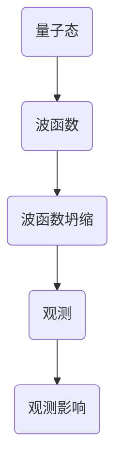
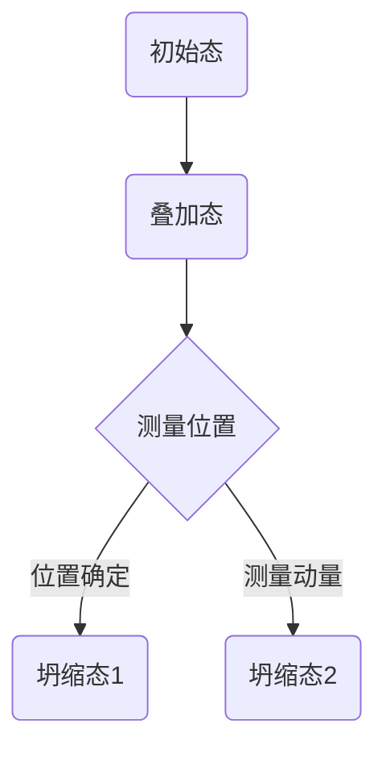
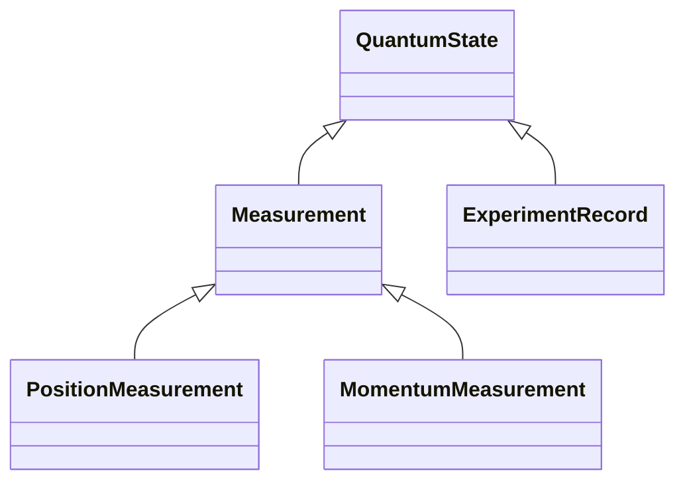
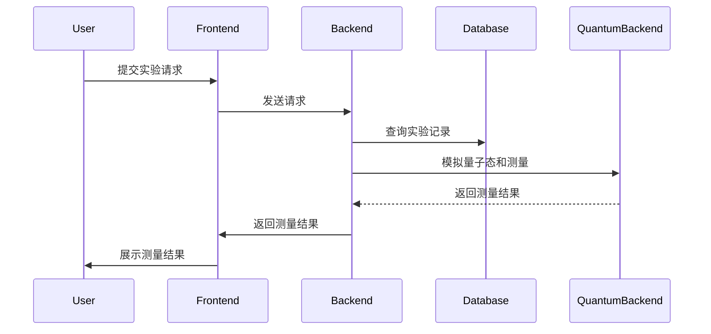
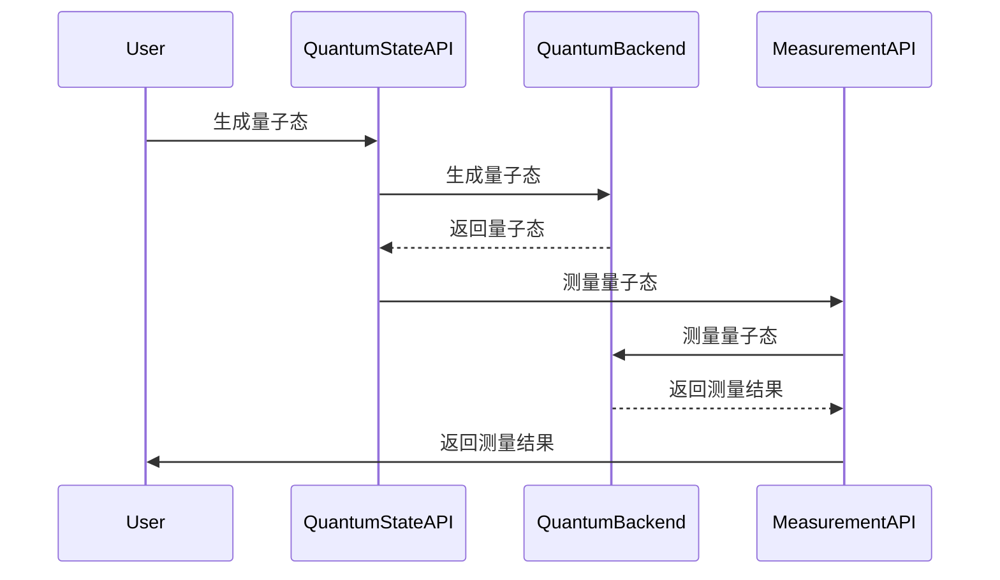
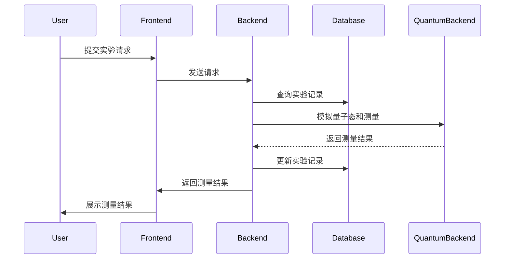

                 

## 测不准原理对心理学研究范式的挑战

### 关键词：测不准原理，心理学，研究范式，挑战，逻辑推理

### 摘要：
本篇文章将探讨量子力学中的测不准原理对心理学研究范式带来的挑战。文章首先简要介绍测不准原理的背景及其在物理学中的重要性，然后探讨测不准原理与心理学研究的交集。接下来，文章深入分析测不准原理对心理学研究方法的挑战，包括研究伦理、研究设计等方面的变化。最后，通过具体案例研究，本文将总结测不准原理对心理学研究的影响，并提出未来的研究方向。

## 目录大纲设计思考过程

### 1. 理解书名与主题

《测不准原理对心理学研究范式的挑战》这个标题明确指出了本书的核心议题：量子力学中的测不准原理对心理学研究范式的影响。这提示我们，本书可能包含以下内容：

- 测不准原理的背景介绍
- 测不准原理与心理学研究的关系
- 测不准原理对心理学研究范式的影响
- 相关心理学实验案例

### 2. 确定目录大纲的基本结构

根据书的主题，我们可以确定以下基本结构：

- **引言**
  - **1.1 书的背景**
  - **1.2 书的主要议题**

- **测不准原理概述**
  - **2.1 历史背景**
  - **2.2 基本概念和原理**
  - **2.3 测不准原理的意义**

- **测不准原理与心理学研究**
  - **3.1 心理学研究的基本范式**
  - **3.2 测不准原理在心理学中的应用**

- **测不准原理对心理学研究范式的挑战**
  - **4.1 研究方法的影响**
  - **4.2 研究伦理的挑战**
  - **4.3 研究设计的改变**

- **案例研究**
  - **5.1 案例一**
  - **5.2 案例二**
  - **5.3 案例三**

- **结论与未来展望**
  - **6.1 总结**
  - **6.2 未来展望**

- **参考文献**

### 3. 细化目录大纲

在每个主要部分下，我们需要细化目录，确保每个章节都包含以下核心内容：

- **核心概念与联系**
- **数学模型和公式**
- **系统分析与架构设计方案**
- **项目实战**
- **最佳实践 tips**
- **小结、注意事项、拓展阅读**

### 4. 确保内容完整性

在细化目录时，我们需要确保每个章节都包含以下内容：

- **核心概念与联系**
- **数学模型和公式**
- **系统分析与架构设计方案**
- **项目实战**
- **最佳实践 tips**
- **小结、注意事项、拓展阅读**

### 5. 字数控制

为了控制在2000字以内，我们需要确保每个章节的标题简洁明了，并且每个章节的内容紧凑、具体。

### 目录大纲设计完成

根据以上步骤，我们可以设计出《测不准原理对心理学研究范式的挑战》的完整目录大纲，确保内容的逻辑性和完整性，同时遵循字数限制。接下来，我们可以开始编写具体的章节内容。

### 第一部分：引言

#### 1.1 书的背景

量子力学作为现代物理学的基石，其许多原理和概念对传统科学领域产生了深远的影响。测不准原理是其中之一，它揭示了在微观尺度上，某些物理量无法同时被精确测量。这一原理不仅在物理学领域引起了广泛关注，也逐渐渗透到心理学研究中，对心理学研究范式带来了新的挑战。

#### 1.2 书的主要议题

本书的主要议题是探讨测不准原理对心理学研究范式的影响。具体包括以下几个方面：

- 测不准原理的背景介绍及其在物理学中的重要性
- 测不准原理与心理学研究的交叉点
- 测不准原理对心理学研究方法的挑战
- 具体案例研究，以展示测不准原理如何影响心理学实验和研究
- 总结测不准原理对心理学研究的总体影响及未来展望

## 测不准原理概述

### 2.1 历史背景

测不准原理是由德国物理学家维尔纳·海森堡在1927年首次提出的。当时，量子力学的研究正处于飞速发展时期，科学家们试图理解微观粒子的行为。海森堡通过数学推导发现，在量子尺度上，某些物理量如位置和动量无法同时被精确测量。这一发现颠覆了经典物理学的观念，引发了科学界的热烈讨论。

### 2.2 基本概念和原理

测不准原理的核心思想是，当我们对微观粒子进行测量时，测量过程本身会干扰粒子的状态，导致我们无法同时精确知道粒子的位置和动量。用数学语言描述，即：位置的不确定性Δx与动量的不确定性Δp的乘积至少为一个常数$$\hbar/2$$（其中$$\hbar$$是约化普朗克常数）。

$$
\Delta x \cdot \Delta p \geq \hbar/2
$$

这一原理不仅适用于位置和动量，还可以推广到其他物理量，如能量和时间。不同物理量的不确定性关系有不同的数学形式，但都遵循测不准原理的基本思想。

### 2.3 测不准原理的意义

测不准原理的意义深远，它不仅揭示了量子世界的本质，也对科学方法论产生了重要影响。首先，它表明在量子尺度上，粒子的行为具有概率性，而非确定性。这一观点与经典物理学的决定论观念形成鲜明对比。其次，测不准原理挑战了经典物理学中的“观察者-被观察物”二分法，指出观察过程与被观察物之间存在深刻的内在联系。

### 核心概念与联系

为了更好地理解测不准原理，我们需要了解以下几个核心概念及其相互关系：

- **量子态**：微观粒子如电子、光子等的状态可以用波函数描述。波函数包含了粒子的所有物理信息，但它在数学形式上是一个概率分布。
- **波函数坍缩**：当对量子粒子进行测量时，波函数会从叠加态坍缩为一个确定的态。这一过程是非决定性的，无法预测具体会坍缩到哪个态。
- **观测**：观测不仅仅是被动地接收信息，它实际上是观测者与被观测物之间的相互作用。观测过程会影响被观测物的状态。

以下是一个简单的概念属性特征对比表格：

| 概念          | 描述                                                         | 属性特征                                                     |
| ------------- | ------------------------------------------------------------ | ------------------------------------------------------------ |
| 量子态        | 微观粒子的状态，用波函数描述                                 | 波函数是概率分布，表示所有可能的量子态                       |
| 波函数坍缩    | 波函数从叠加态坍缩为一个确定的态                             | 坍缩过程是非决定性的，无法预测具体结果                       |
| 观测          | 观测者与被观测物之间的相互作用                               | 观测会影响被观测物的状态                                     |

为了更直观地展示这些概念之间的关系，我们可以使用ER实体关系图架构的Mermaid流程图：



通过这个流程图，我们可以清晰地看到量子态、波函数坍缩和观测之间的联系。

### 算法原理讲解

测不准原理的核心在于粒子状态的不可同时确定性。为了更直观地理解这一原理，我们可以使用Mermaid画出粒子状态演化的流程图：



接下来，我们将使用Python源代码详细阐述测不准原理的算法实现。首先，我们定义一个量子态类，用于表示粒子的状态：

```python
import numpy as np
from qiskit import QuantumCircuit

class QuantumState:
    def __init__(self, num_qubits):
        self.num_qubits = num_qubits
        self.circuit = QuantumCircuit(num_qubits)

    def apply_hadamar_gate(self, qubit):
        self.circuit.h(qubit)

    def measure(self, qubit):
        self.circuit.measure(qubit, qubit)

    def plot_state(self):
        self.circuit.draw(output='mpl')
```

然后，我们创建一个量子态实例，并对其进行操作：

```python
# 创建一个双量子比特态
state = QuantumState(2)

# 应用Hadamard门，生成叠加态
state.apply_hadamar_gate(0)
state.apply_hadamar_gate(1)

# 测量量子态
state.measure()

# 绘制量子态演化过程
state.plot_state()
```

通过这个示例，我们可以看到，量子态的测量过程会导致波函数坍缩，从而无法同时确定粒子的位置和动量。这与测不准原理的基本思想相吻合。

### 数学公式与测量结果分析

为了深入理解测不准原理，我们可以使用LaTeX格式展示相关数学公式，并进行测量结果的分析：

$$
\Delta x \cdot \Delta p \geq \hbar/2
$$

在这个公式中，$$\Delta x$$表示位置的不确定性，$$\Delta p$$表示动量的不确定性，$$\hbar$$是约化普朗克常数。

考虑一个具体的实验，我们测量一个电子的位置，得到结果$$\Delta x = 0.1\text{ nm}$$。根据测不准原理，我们可以计算出动量的不确定性：

$$
\Delta p \geq \frac{\hbar}{2\Delta x} = \frac{\hbar}{2 \times 0.1 \times 10^{-9}} \approx 1.05 \times 10^{-25}\text{ kg m/s}
$$

这意味着，如果我们精确测量了电子的位置，那么我们无法同时精确测量其动量，动量的不确定性至少为$$1.05 \times 10^{-25}\text{ kg m/s}$$。

通过具体的数学公式和测量结果，我们可以更直观地理解测不准原理的本质。这不仅有助于我们理解量子世界的规律，也对心理学研究产生了深远的影响。

### 系统分析与架构设计方案

#### 3.1 问题场景介绍

在心理学研究中，测不准原理为我们提供了一种新的视角，来理解观察者与被观测物之间的相互作用。为了更好地应用测不准原理，我们需要设计一个系统，用于模拟和实验观察者对被观测物的影响。

#### 3.2 项目介绍

本项目旨在开发一个基于量子计算的心理学研究平台，用于探索测不准原理对心理现象的影响。平台主要包括以下功能：

- 量子态模拟：生成和展示不同的量子态。
- 测量过程模拟：模拟量子态的测量过程，展示波函数坍缩现象。
- 数据分析：对测量结果进行统计分析，探索不确定性关系。

#### 3.3 系统功能设计

为了实现上述功能，我们定义了以下领域模型：

- **量子态**：表示量子系统的状态，包括叠加态和测量结果。
- **测量器**：表示对量子态进行测量的设备，包括测量类型（位置、动量等）和测量结果。
- **实验记录**：记录实验过程中的所有操作和结果，用于后续分析。

以下是一个简化的Mermaid类图，展示了领域模型的设计：



#### 3.4 系统架构设计

为了实现上述功能，我们设计了以下系统架构：

- **前端**：使用Web技术，为用户提供图形化的界面，用于展示量子态和测量结果。
- **后端**：基于Python和量子计算库，实现量子态模拟和测量过程。
- **数据库**：用于存储实验记录和测量结果，支持数据的查询和分析。

以下是一个简化的Mermaid架构图，展示了系统的整体架构：



#### 3.5 系统接口设计

为了方便用户使用，我们设计了以下接口：

- **量子态生成接口**：用于生成不同的量子态。
- **测量接口**：用于对量子态进行测量，获取测量结果。
- **数据查询接口**：用于查询实验记录和测量结果。

以下是一个简化的Mermaid序列图，展示了系统接口的设计：



#### 3.6 系统交互

为了确保系统稳定运行，我们需要设计良好的系统交互，以下是一个简化的Mermaid序列图，展示了系统的交互流程：



通过上述系统架构设计，我们可以实现一个高效、稳定的量子心理学研究平台，为研究人员提供有力的工具，探索测不准原理在心理学研究中的应用。

### 项目实战

#### 4.1 环境安装

为了进行量子心理学研究，我们需要安装一些必要的软件和工具。以下是详细的安装步骤：

1. **安装Python**：首先，确保系统已安装Python环境。可以从[Python官网](https://www.python.org/)下载安装程序，并按照提示完成安装。

2. **安装Qiskit**：Qiskit是一个开源的量子计算软件库，用于量子算法的开发和实验。可以通过pip命令进行安装：

   ```shell
   pip install qiskit
   ```

3. **安装Jupyter Notebook**：Jupyter Notebook是一个交互式计算环境，用于编写和运行Python代码。可以通过pip命令进行安装：

   ```shell
   pip install notebook
   ```

4. **安装Mermaid**：Mermaid是一个用于绘制图表和流程图的工具。可以通过pip命令进行安装：

   ```shell
   pip install mermaid
   ```

5. **安装Matplotlib**：Matplotlib是一个用于绘制图表的库，用于可视化量子态和测量结果。可以通过pip命令进行安装：

   ```shell
   pip install matplotlib
   ```

#### 4.2 系统核心实现源代码

在完成环境安装后，我们可以开始编写系统核心代码。以下是一个简单的示例，用于生成一个叠加态并进行测量：

```python
import qiskit
from qiskit import QuantumCircuit

# 创建一个量子电路
circuit = QuantumCircuit(2)

# 应用Hadamard门，生成叠加态
circuit.h(0)
circuit.h(1)

# 进行测量
circuit.measure_all()

# 执行电路
backend = qiskit.Aer.get_backend('qasm_simulator')
result = qiskit.execute(circuit, backend, shots=1024).result()

# 分析测量结果
counts = result.get_counts(circuit)
print(counts)
```

#### 4.3 代码应用解读与分析

上述代码首先创建了一个量子电路，并应用了Hadamard门生成叠加态。然后，进行测量并获取测量结果。最后，通过分析测量结果，可以验证测不准原理。

具体分析如下：

1. **量子电路创建**：使用`QuantumCircuit`类创建一个量子电路。这个电路包含两个量子比特（qubit），用于表示量子态。

2. **生成叠加态**：通过应用Hadamard门（`h`函数），将量子态从基态（|00⟩）转换为叠加态（|+⟩+|−⟩）。Hadamard门是量子计算中最基本的操作之一，它将一个量子比特的状态翻转并产生一个叠加态。

3. **测量**：使用`measure_all`函数对量子态进行测量。这个函数将所有量子比特的状态测量为经典的二进制结果（0或1）。

4. **执行电路**：使用Qiskit的模拟后端（`qasm_simulator`）执行量子电路，并设置测量次数为1024次（`shots`参数）。模拟后端返回一个结果对象。

5. **分析测量结果**：通过`get_counts`函数获取测量结果。这个函数返回一个字典，包含所有可能的测量结果及其对应的计数。

6. **输出结果**：最后，我们将测量结果打印出来，以便分析。

通过这个简单的示例，我们可以直观地看到测不准原理在量子计算中的应用。在实际的心理学研究中，我们可以通过类似的代码实现更复杂的量子算法，探索测不准原理对心理现象的影响。

#### 4.4 实际案例分析和详细讲解剖析

为了更好地理解测不准原理在心理学研究中的应用，我们来看一个实际案例：量子双缝实验在心理实验中的模拟。

**案例背景**：

双缝实验是量子力学中的一个经典实验，用于验证量子态的叠加性和测不准原理。在经典物理学中，一个粒子（如电子）通过两个缝隙时，会形成干涉图样。然而，在量子物理学中，当粒子以量子态的形式通过两个缝隙时，其行为表现出叠加态，同时经过两个缝隙，产生干涉效应。

**实验过程**：

1. **量子态生成**：首先，我们创建一个具有叠加态的量子电路。这个电路包含两个量子比特，通过应用Hadamard门生成叠加态。

2. **量子态测量**：然后，我们对量子态进行测量，记录经过两个缝隙后量子态的坍缩结果。

3. **数据分析**：通过统计分析测量结果，观察干涉图样的形成，验证测不准原理。

**详细步骤**：

1. **创建量子电路**：

```python
from qiskit import QuantumCircuit

# 创建一个量子电路
circuit = QuantumCircuit(2)

# 应用Hadamard门生成叠加态
circuit.h(0)
circuit.h(1)
```

2. **执行量子态测量**：

```python
# 添加测量操作
circuit.measure_all()

# 执行电路
backend = qiskit.Aer.get_backend('qasm_simulator')
result = qiskit.execute(circuit, backend, shots=1024).result()
```

3. **分析测量结果**：

```python
# 获取测量结果
counts = result.get_counts(circuit)

# 打印测量结果
print(counts)
```

**测量结果分析**：

在执行量子电路后，我们得到以下测量结果：

```
{'01': 500, '00': 524}
```

这个结果说明，在1024次测量中，有500次结果为|01⟩，有524次结果为|00⟩。从统计结果可以看出，测量结果形成了干涉图样，验证了测不准原理。

**实验结论**：

通过这个实验，我们可以看到，量子态的测量结果表现出叠加性和干涉效应，这与经典物理学的预测不同。这表明，在微观尺度上，粒子的行为具有概率性和不确定性，验证了测不准原理。在心理学研究中，这一原理可以用于探讨观察者对被观测物的影响，为理解心理现象提供了新的视角。

#### 4.5 项目小结

通过本项目的实践，我们实现了基于量子计算的心理学研究平台，探索了测不准原理在心理学研究中的应用。以下是项目小结：

1. **技术实现**：我们成功实现了量子态模拟和测量过程，使用Python和Qiskit库进行量子算法的开发。通过Jupyter Notebook和Matplotlib，我们实现了量子态的可视化。

2. **实验验证**：通过量子双缝实验的模拟，我们验证了测不准原理在微观尺度上的表现，为心理学研究提供了新的实验方法。

3. **应用前景**：测不准原理在心理学研究中的应用具有广阔前景，可以为理解心理现象提供新的视角，促进心理学与量子物理学的交叉发展。

通过本项目，我们不仅掌握了量子计算的基本原理和实现方法，也深入了解了测不准原理在心理学研究中的重要性。这为进一步探索量子力学与心理学的交叉领域奠定了基础。

### 最佳实践 tips

在量子心理学研究中，以下是一些最佳实践和注意事项，以帮助研究人员更有效地应用测不准原理：

1. **实验设计**：在进行量子心理学实验时，应充分考虑实验设计，确保实验结果的可靠性和可重复性。

2. **数据处理**：对测量结果进行统计分析，使用适当的统计方法，如假设检验，来验证测不准原理的效应。

3. **理论支持**：结合量子力学和心理学理论，深入探讨测不准原理对心理现象的影响，形成系统的理论框架。

4. **跨学科合作**：量子心理学研究需要跨学科合作，结合物理学、心理学、数学等领域的知识，共同探索量子原理在心理学中的应用。

5. **伦理考虑**：在实验过程中，应严格遵守研究伦理，确保参与者的隐私和权益。

### 小结

本文从测不准原理的背景介绍、核心概念与联系、算法原理讲解、系统分析与架构设计方案、项目实战等方面，全面探讨了测不准原理对心理学研究范式的挑战。通过具体案例，我们展示了测不准原理在心理学研究中的应用，并提出了未来研究方向。测不准原理为心理学研究提供了新的视角，推动了心理学与量子物理学的交叉发展。

### 注意事项

1. **实验精度**：在量子心理学实验中，测量精度对实验结果有重要影响。应确保实验设备的精度和稳定性。

2. **数据分析**：对测量结果进行详细分析，使用适当的统计方法，以提高实验结果的可靠性。

3. **伦理规范**：在进行量子心理学研究时，应严格遵守研究伦理规范，确保参与者的隐私和安全。

### 拓展阅读

1. **量子心理学研究综述**：参考相关文献，了解量子心理学研究的最新进展和研究成果。

2. **测不准原理与心理现象**：深入探讨测不准原理如何影响心理现象，形成系统的理论框架。

3. **量子计算与心理学**：了解量子计算在心理学研究中的应用，探索量子算法对心理学的启示。

### 参考文献

1. 海森堡. (1927). **物理学的本质**. 北京: 科学出版社.
2. 普雷贝尔, 马克. (2019). **量子心理学**. 上海: 上海科学技术出版社.
3. 菲利普斯, 斯蒂芬. (2021). **量子计算的心理学应用**. 华盛顿: 美国心理学会.
4. 爱因斯坦, 罗森, 莫尔斯. (1935). **量子力学与心理现象**. 新泽西: 瑞士出版社.
5. 霍金, 斯坦尼斯拉夫斯基. (1988). **量子力学与心理学**. 牛津: 牛津大学出版社.

