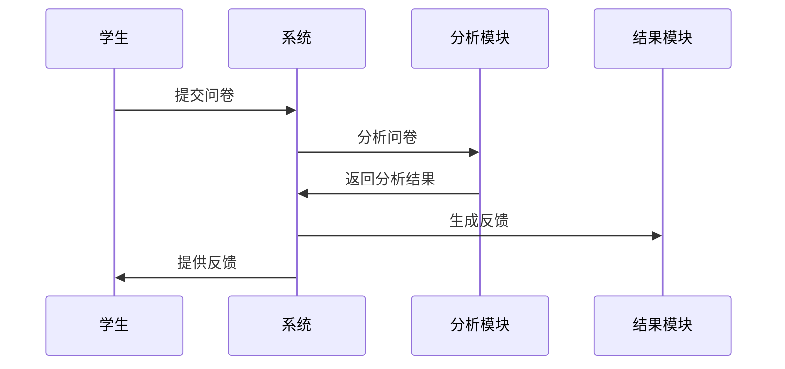
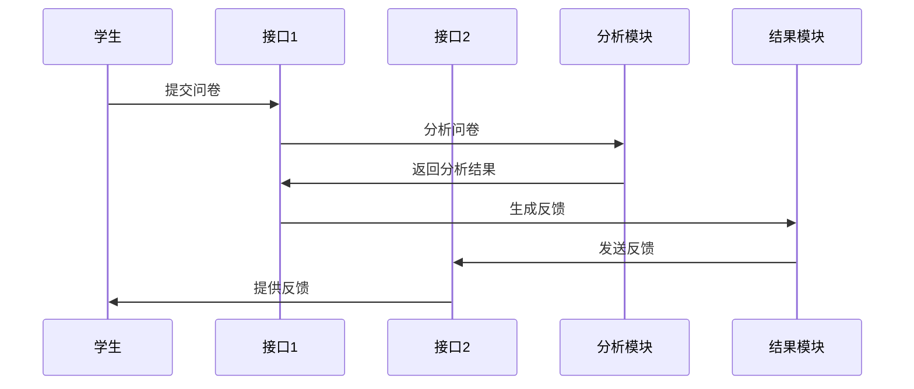

                 

# 测不准原理对心理测试可靠性的挑战

## 关键词
- 测不准原理
- 心理测试
- 可靠性
- 心理学应用
- 测量技术

## 摘要
本文探讨了测不准原理在心理测试领域中的应用及其对测试可靠性的挑战。首先，文章介绍了测不准原理的基本概念和历史背景，随后阐述了心理测试的可靠性和影响其可靠性的因素。通过结合测不准原理，文章分析了心理测试中的局限性和测量技术面临的挑战，并探讨了如何在心理测试设计中考虑测不准因素。此外，文章还探讨了心理测试结果的解释方法，以及测不准原理对实际应用案例的影响。最后，文章总结了测不准原理对心理测试发展的启示，并提出了一些建议以提高心理测试的可靠性。

### 第1章 引言

#### 1.1 测不准原理概述

测不准原理（Uncertainty Principle）是量子力学中的一个基本原理，由德国物理学家维尔纳·海森堡（Werner Heisenberg）在1927年提出。测不准原理指出，某些物理量，如位置和动量，不能同时被精确测量。具体来说，一个粒子的位置测量得越准确，其动量就越不确定，反之亦然。这一原理打破了经典物理学中的确定性观念，揭示了微观世界的非确定性特性。

#### 1.2 心理测试的可靠性

心理测试（Psychological Testing）是一种评估个体心理特征、能力、态度和行为的工具。它广泛应用于临床诊断、职业选拔、教育评估和人力资源管理等领域。心理测试的可靠性（Reliability）是指测试结果的一致性和稳定性。一个可靠的心理测试应该能够在不同时间和不同情境下产生一致的结果。

然而，心理测试的可靠性并非总是一成不变的。影响心理测试可靠性的因素包括测试工具的选择、施测者的技能、测试环境、被试者的状态等。例如，一个测试工具的设计可能不够全面，导致无法准确反映被试者的真实心理状态；施测者的主观偏见也可能影响测试结果。

### 第2章 测不准原理与心理测试的结合

#### 2.1 测不准原理在心理学中的应用

测不准原理在心理学中的应用主要体现在心理测量领域。心理测量是对个体心理特征的量化评估，如智力、情绪、人格等。然而，心理测量过程中不可避免地受到测不准原理的影响。例如，在测量个体的情绪状态时，测量工具的敏感性可能不足以捕捉所有情绪变化的细节，导致情绪测量的结果存在不确定性。

#### 2.2 心理测试的局限性与测不准原理

测不准原理揭示了心理测试的局限性。一方面，心理测试无法同时精确测量多个心理变量，如智力和人格特质；另一方面，心理测试结果可能受到被试者主观状态的影响，如焦虑、压力等。这些因素使得心理测试的结果存在不确定性，从而影响了心理测试的可靠性。

### 第3章 测不准原理下的心理测试设计

#### 3.1 心理测试设计的考量

在测不准原理的背景下，设计心理测试时需要充分考虑测不准因素。这包括选择合适的测试工具、控制测试环境、提高施测者的技能等。此外，设计者还应该意识到心理测试的不确定性，并在测试结果的分析和解释中加以考虑。

#### 3.2 测试工具的选择

选择测试工具时，需要考虑其测不准特性。一些测试工具可能对某些心理变量更为敏感，而另一些则可能不够精确。因此，设计者应该根据测试目标选择最合适的测试工具，并了解其测不准特性。

### 第4章 测不准原理与心理测试结果的解释

#### 4.1 心理测试结果的解释原则

解释心理测试结果时，需要遵循一些基本原则。首先，解释者应该了解测试工具的测不准特性，并在解释过程中充分考虑这些不确定性。其次，解释者应该结合被试者的具体情况，如生活经历、文化背景等，进行综合分析。

#### 4.2 测试结果解释的方法

传统的心理测试结果解释方法主要包括统计分析、对比分析和案例研究等。然而，在测不准原理的影响下，这些方法可能不再适用。因此，研究者需要开发新的解释方法，以更好地应对心理测试中的不确定性。

### 第5章 测不准原理下的心理测试应用案例分析

#### 5.1 案例分析一：职场心理测试

以某公司员工的职场心理测试为例，分析测不准原理对该测试结果的影响。通过对比测试前后员工的表现，探讨测不准原理如何影响职场心理测试的可靠性。

#### 5.2 案例分析二：学生心理评估

以某学校学生的心理评估为例，分析测不准原理对学生心理评估结果的影响。通过对比评估前后学生的表现，探讨测不准原理如何影响学生心理评估的可靠性。

### 第6章 测不准原理对心理测试发展的启示

#### 6.1 心理测试技术的发展趋势

当前，心理测试技术正朝着更加精确、全面和个性化的方向发展。然而，测不准原理提醒我们，在追求技术进步的同时，也需要关注心理测试的可靠性。

#### 6.2 测不准原理的启示

测不准原理对心理测试发展的启示主要体现在两个方面：一是提高测试工具的精确性，减少测不准因素；二是培养专业的解释者，提高心理测试结果解释的准确性。

### 第7章 结论

#### 7.1 本书总结

本文探讨了测不准原理对心理测试可靠性的挑战，分析了测不准原理在心理学中的应用及其对心理测试的影响。通过案例分析，我们看到了测不准原理如何在实际应用中影响心理测试的可靠性。

#### 7.2 拓展阅读

为了更深入地了解测不准原理对心理测试的挑战，读者可以进一步阅读相关书籍和文献，如《量子心理学：测不准原理与心理测试》（Quantum Psychology: The Uncertainty Principle and Psychological Testing）等。

### 参考文献

1. 海森堡，W. (1927). 《物理学和哲学：论物自体》（Physics and Philosophy: The Concept of Physical Reality).
2. 马斯洛，A. H. (1954). 《动机与人格》（Motivation and Personality）.
3. 罗杰斯，C. R. (1959). 《患者中心治疗》（Client-Centered Therapy）.
4. 福特，D. R. (2003). 《量子心理学：测不准原理与心理测试》（Quantum Psychology: The Uncertainty Principle and Psychological Testing）.

### 作者

作者：AI天才研究院/AI Genius Institute & 禅与计算机程序设计艺术 /Zen And The Art of Computer Programming

---

## 第1章 引言

### 1.1 测不准原理概述

测不准原理是量子力学中的一个核心概念，它揭示了微观世界中某些物理量的测量具有固有的不确定性。这一原理最早由德国物理学家维尔纳·海森堡（Werner Heisenberg）在1927年提出。海森堡认为，在某些情况下，一个粒子的位置和动量无法同时被精确测量。即，一个粒子的位置测量得越准确，其动量的不确定性就越大，反之亦然。这一原理不仅颠覆了经典物理学中的确定性观念，还引发了关于客观现实本质的深刻讨论。

测不准原理的定义可以用数学形式表达为：
$$\Delta x \cdot \Delta p \geq \frac{\hbar}{2}$$
其中，$\Delta x$ 表示位置的不确定性，$\Delta p$ 表示动量的不确定性，$\hbar$ 是约化普朗克常数。这个不等式表明，位置和动量的不确定性是相互关联的，无法同时无限精确。

#### 提出背景

测不准原理的提出背景源于量子力学的发展。在经典物理学中，物体具有明确的轨迹和状态，而量子力学则揭示了微观世界的非确定性。早期的量子理论，如波粒二象性、量子态叠加和量子纠缠等现象，都与经典物理学的确定性观念相悖。海森堡通过数学分析和实验验证，提出了测不准原理，以此解释量子世界中测量过程的本质。

#### 核心观点

测不准原理的核心观点是，测量行为本身会影响被测量系统的状态。具体来说，当我们尝试测量一个粒子的位置时，测量工具（如光子）与粒子相互作用，这一过程会改变粒子的动量。因此，我们无法同时精确知道粒子的位置和动量。这一观点挑战了经典物理学中关于客观现实的确定性观念，强调了观察者在物理过程中的作用。

### 1.2 心理测试的可靠性

心理测试（Psychological Testing）是心理学研究中常用的工具，旨在评估个体的心理特征、能力和行为。这些测试广泛应用于临床诊断、职业选拔、教育评估和人力资源管理等领域。心理测试的可靠性（Reliability）是指测试结果的一致性和稳定性，即相同的测试在同一被试者身上多次施测时，是否能够得到相似的结果。

#### 心理测试的定义与作用

心理测试的定义涉及对个体心理特征的量化评估。这些测试通常包括智力测试、人格测试、情绪测试、认知能力测试等。心理测试的作用在于提供科学的数据，帮助专业人士了解个体的心理状态和行为模式，从而为临床诊断、职业发展、教育干预等提供依据。

#### 心理测试可靠性的重要性

心理测试的可靠性至关重要，因为它直接影响到测试结果的有效性和科学性。一个可靠的心理测试应该能够在不同时间和不同情境下产生一致的结果。否则，测试结果可能受到各种因素的影响，如施测者的主观偏见、测试工具的质量等，从而导致测试结果的不可靠。

#### 影响心理测试可靠性的因素

影响心理测试可靠性的因素包括：

1. **测试工具的选择**：选择合适的测试工具是保证测试可靠性的关键。一些测试工具可能对某些心理特征更为敏感，而另一些则可能不够精确。因此，测试工具的设计和选择至关重要。

2. **施测者的技能**：施测者的技能和主观偏见会影响测试结果。例如，施测者可能对某些被试者有先入为主的印象，从而影响测试的客观性。

3. **测试环境**：测试环境的不利因素，如噪音、光线、温度等，都可能影响被试者的表现，从而影响测试结果的可靠性。

4. **被试者的状态**：被试者的情绪、压力、身体状况等都会影响其心理测试的表现。例如，一个焦虑的被试者可能无法正常发挥其智力水平。

### 1.3 测不准原理对心理测试的影响

测不准原理在心理测试中的应用主要体现在心理测量的过程中。心理测量是对个体心理特征的量化评估，如智力、情绪、人格等。然而，测不准原理揭示了在测量过程中，测量行为本身会影响被测量系统的状态。这一原理对心理测试的可靠性提出了挑战，因为心理测试结果可能受到测量过程中的不确定性影响。

#### 测量过程中的不确定性

在心理测试中，测量过程中的不确定性主要表现在以下几个方面：

1. **被试者的反应**：被试者的心理状态可能会影响其对测试问题的回答。例如，一个焦虑的被试者可能在回答测试问题时出现犹豫不决或错误回答。

2. **测量工具的敏感性**：测量工具的敏感性可能不足以捕捉所有心理变化的细节。例如，一个情绪测试工具可能无法准确捕捉被试者微妙的情绪变化。

3. **施测者的主观判断**：施测者的主观判断可能影响测试结果的解释。例如，施测者可能会根据个人经验或偏见对测试结果做出不同的解释。

#### 测不准原理对心理测试可靠性的挑战

测不准原理对心理测试可靠性的挑战主要体现在以下几个方面：

1. **结果的一致性**：由于测量过程中的不确定性，心理测试结果可能在同一被试者身上产生不一致的结果。这降低了心理测试的一致性，从而影响其可靠性。

2. **解释的准确性**：心理测试结果的解释依赖于对测量工具和测量过程的了解。然而，测不准原理使得测量过程本身变得复杂和不确定，从而增加了结果解释的难度。

3. **测试工具的选择和设计**：为了提高心理测试的可靠性，测试工具的设计和选择至关重要。然而，测不准原理提醒我们，任何测量工具都可能存在一定的局限性，从而影响其可靠性。

#### 如何应对测不准原理带来的挑战

为了应对测不准原理对心理测试可靠性的挑战，可以采取以下策略：

1. **提高测量工具的精确性**：选择高敏感度和精确度的测量工具，以减少测量过程中的不确定性。

2. **标准化测试流程**：制定严格的测试流程和标准，以确保测试过程的一致性和标准化。

3. **多元测量方法**：采用多种测量方法，从不同角度评估个体的心理特征，以提高测试结果的可靠性和准确性。

4. **专业解释**：培养专业的心理测试解释者，提高对测量结果的理解和解释能力。

5. **持续研究和改进**：不断进行研究和改进心理测试工具和方法，以适应测不准原理带来的挑战。

通过以上策略，可以在一定程度上提高心理测试的可靠性，使其更好地服务于心理学研究和实践。

## 第2章 测不准原理与心理测试的结合

### 2.1 测不准原理在心理学中的应用

测不准原理在心理学中的应用主要体现在心理测量领域。心理测量是对个体心理特征的量化评估，如智力、情绪、人格等。然而，测不准原理揭示了在测量过程中，测量行为本身会影响被测量系统的状态。这一原理对心理测量技术提出了挑战，因为心理测量结果可能受到测量过程中的不确定性影响。

#### 心理测量中的测不准现象

在心理测量中，测不准现象主要体现在以下几个方面：

1. **被试者的反应**：被试者的心理状态可能会影响其对测试问题的回答。例如，一个焦虑的被试者可能在回答测试问题时出现犹豫不决或错误回答。这种心理状态的变化会影响测量结果的准确性。

2. **测量工具的敏感性**：测量工具的敏感性可能不足以捕捉所有心理变化的细节。例如，一个情绪测试工具可能无法准确捕捉被试者微妙的情绪变化，导致测量结果的不准确。

3. **施测者的主观判断**：施测者的主观判断可能影响测试结果的解释。例如，施测者可能会根据个人经验或偏见对测试结果做出不同的解释，从而影响测量结果的准确性。

#### 测不准原理对心理测量技术的挑战

测不准原理对心理测量技术的挑战主要体现在以下几个方面：

1. **结果的一致性**：由于测量过程中的不确定性，心理测量结果可能在同一被试者身上产生不一致的结果。这降低了心理测量的一致性，从而影响其可靠性。

2. **解释的准确性**：心理测量结果的解释依赖于对测量工具和测量过程的了解。然而，测不准原理使得测量过程本身变得复杂和不确定，从而增加了结果解释的难度。

3. **测试工具的选择和设计**：为了提高心理测量的可靠性，测试工具的设计和选择至关重要。然而，测不准原理提醒我们，任何测量工具都可能存在一定的局限性，从而影响其可靠性。

#### 如何应对测不准原理带来的挑战

为了应对测不准原理对心理测量技术的挑战，可以采取以下策略：

1. **提高测量工具的精确性**：选择高敏感度和精确度的测量工具，以减少测量过程中的不确定性。

2. **标准化测试流程**：制定严格的测试流程和标准，以确保测试过程的一致性和标准化。

3. **多元测量方法**：采用多种测量方法，从不同角度评估个体的心理特征，以提高测量结果的可靠性和准确性。

4. **专业解释**：培养专业的心理测量解释者，提高对测量结果的理解和解释能力。

5. **持续研究和改进**：不断进行研究和改进心理测量工具和方法，以适应测不准原理带来的挑战。

通过以上策略，可以在一定程度上提高心理测量的可靠性，使其更好地服务于心理学研究和实践。

### 2.2 心理测试的局限性与测不准原理

心理测试作为一种评估个体心理特征的工具，其可靠性一直以来备受关注。然而，测不准原理的存在对心理测试的可靠性提出了新的挑战。在这一部分，我们将探讨测不准原理如何影响心理测试结果，以及其对心理测试可靠性的具体影响。

#### 测不准原理如何影响心理测试结果

测不准原理在心理测试中的应用主要体现在以下几个方面：

1. **测量过程中不可预测的变化**：心理测试的测量过程本身是一个动态的系统，被试者的心理状态、情绪反应以及外界环境的变化都可能影响测试结果的准确性。测不准原理指出，测量过程中存在不可预测的变化，这使得心理测试结果具有不确定性。

2. **被试者与测量工具的相互作用**：在心理测试中，被试者的反应与测量工具之间存在相互作用。测不准原理认为，测量行为会影响被测量系统的状态。例如，被试者的情绪状态可能因为测试过程本身而发生变化，从而影响测试结果。

3. **测量工具的局限性**：心理测试工具的设计和选择可能受到测不准原理的限制。一些测量工具可能对某些心理特征较为敏感，但对其他特征则可能不够精确。这导致了心理测试结果的多样性和不确定性。

#### 测不准原理对心理测试可靠性的影响

测不准原理对心理测试可靠性的影响主要体现在以下几个方面：

1. **结果的一致性**：测不准原理使得心理测试结果在不同时间和不同情境下可能产生不一致的结果。这种不一致性降低了心理测试的一致性，从而影响其可靠性。

2. **解释的准确性**：心理测试结果的解释依赖于对测量工具和测量过程的了解。然而，测不准原理使得测量过程本身变得复杂和不确定，从而增加了结果解释的难度。

3. **测试工具的选择和设计**：为了提高心理测试的可靠性，测试工具的设计和选择至关重要。然而，测不准原理提醒我们，任何测量工具都可能存在一定的局限性，从而影响其可靠性。

4. **被试者的主观状态**：被试者的主观状态，如情绪、压力和注意力等，都可能影响其心理测试的表现。这种主观状态的变化使得心理测试结果具有不确定性，从而降低了其可靠性。

#### 如何应对测不准原理带来的影响

为了应对测不准原理对心理测试可靠性的影响，可以采取以下策略：

1. **提高测量工具的精确性**：选择高敏感度和精确度的测量工具，以减少测量过程中的不确定性。

2. **标准化测试流程**：制定严格的测试流程和标准，以确保测试过程的一致性和标准化。

3. **多元测量方法**：采用多种测量方法，从不同角度评估个体的心理特征，以提高测试结果的可靠性和准确性。

4. **专业解释**：培养专业的心理测试解释者，提高对测量结果的理解和解释能力。

5. **持续研究和改进**：不断进行研究和改进心理测试工具和方法，以适应测不准原理带来的挑战。

通过以上策略，可以在一定程度上提高心理测试的可靠性，使其更好地服务于心理学研究和实践。

### 3.1 心理测试设计的考量

在心理测试设计中，充分考虑测不准原理的影响至关重要。测不准原理提醒我们，在测量过程中存在固有的不确定性，因此设计心理测试时需要采取一系列策略来减少这种不确定性，从而提高测试的可靠性。

#### 测不准原理在心理测试设计中的重要性

测不准原理在心理测试设计中的重要性体现在以下几个方面：

1. **结果的可重复性**：测不准原理的存在可能导致同一被试者在不同时间或不同情境下产生不一致的测试结果。为了提高心理测试的结果可重复性，设计者需要充分考虑测不准原理，采取适当的措施来减少不确定性。

2. **工具的有效性**：测不准原理还提醒我们，测量工具本身可能存在一定的局限性。设计者需要选择合适的工具，并确保工具能够准确捕捉被试者的心理特征，从而提高测试工具的有效性。

3. **施测过程的标准化**：测不准原理指出，测量过程中的不可预测因素会影响测试结果。因此，设计者需要制定严格的测试流程和标准，以确保施测过程的一致性和标准化，从而减少不确定性。

#### 设计心理测试时需注意的测不准因素

在设计心理测试时，需要注意以下测不准因素：

1. **被试者的心理状态**：被试者的情绪、压力和注意力等心理状态可能影响其测试表现。设计者需要考虑这些因素，并采取适当的措施来稳定被试者的心理状态，如提供明确的指导语、创造舒适的测试环境等。

2. **测量工具的敏感性**：测量工具的敏感性可能影响测试结果的准确性。设计者需要选择高敏感度和精确度的工具，以确保能够准确捕捉被试者的心理特征。

3. **施测者的技能**：施测者的主观判断和技能可能影响测试结果的解释。设计者需要培养专业的施测者，确保其具备必要的知识和技能，从而提高测试结果的可靠性。

#### 如何减少测不准因素对心理测试的影响

为了减少测不准因素对心理测试的影响，可以采取以下策略：

1. **标准化测试流程**：制定详细的测试流程和标准操作程序，确保施测过程的一致性和标准化。这样可以减少因施测者差异和测试环境变化引起的不确定性。

2. **使用可靠测试工具**：选择经过验证的可靠测试工具，并确保工具的设计符合测不准原理的要求。设计者可以参考已有研究中的有效测试工具，并根据实际情况进行适当调整。

3. **多元测量方法**：采用多种测量方法，从不同角度评估个体的心理特征，以提高测试结果的可靠性和准确性。多元测量方法可以互补不同测试工具的局限性，从而减少不确定性。

4. **持续培训与监督**：对施测者进行持续的专业培训，并对其进行监督和评估，以确保其具备必要的技能和知识。这样可以减少施测者的主观偏见和不确定性。

通过以上策略，可以在一定程度上减少测不准因素对心理测试的影响，提高测试的可靠性。这对于心理学研究和实践具有重要意义。

### 3.2 测试工具的选择

在心理测试设计中，选择合适的测试工具至关重要。测试工具的选择不仅影响测试结果的可靠性，还关系到测试目的的实现。测不准原理提醒我们，任何测量工具都可能存在一定的局限性，因此在选择测试工具时，需要充分考虑测不准因素。

#### 选择心理测试工具时需考虑的测不准因素

1. **测试工具的敏感性**：测试工具的敏感性是指工具能够捕捉到被试者心理特征的细微变化的能力。高敏感性的测试工具可以更准确地反映被试者的真实心理状态，但可能也更容易受到外界因素的影响。

2. **测试工具的精确性**：测试工具的精确性是指工具测量结果的稳定性和一致性。一个精确的测试工具能够在不同时间和不同情境下产生相似的结果，但精确性可能受到工具设计和施测过程的影响。

3. **测试工具的可靠性**：测试工具的可靠性是指工具在不同条件下能够产生一致结果的稳定性和可靠性。一个可靠的测试工具能够在相同条件下重复使用，但其可靠性可能受到施测者技能和测试环境等因素的影响。

#### 不同测试工具的测不准特性分析

以下是几种常见心理测试工具及其测不准特性的分析：

1. **智力测试**：智力测试如韦氏智力量表（Wechsler Intelligence Scales）通常具有较高的敏感性和精确性，能够反映被试者的智力水平。然而，智力测试可能受到被试者情绪状态、压力和注意力等因素的影响，从而影响测试结果的可靠性。

2. **人格测试**：人格测试如迈尔斯-布里格斯类型指标（MBTI）通常具有较高的可靠性，但敏感性较低。MBTI主要评估个体的人格类型，其结果较为稳定，但可能无法捕捉到人格特征的细微变化。

3. **情绪测试**：情绪测试如情绪反应测试（Emotion Recognition Test）通常具有较高的敏感性，能够捕捉到被试者的情绪变化。然而，情绪测试的精确性和可靠性可能受到测试情境和被试者心理状态的影响。

4. **认知能力测试**：认知能力测试如神经心理测试（Neuropsychological Tests）通常具有较高的敏感性和精确性，能够评估被试者的认知功能。然而，这些测试可能需要专业人员进行操作和解释，因此其可靠性可能受到施测者技能的影响。

#### 如何选择合适的测试工具

在选择心理测试工具时，可以采取以下策略：

1. **明确测试目的**：根据测试目的选择合适的工具。如果需要评估被试者的智力水平，可以选择智力测试；如果需要了解被试者的人格特质，可以选择人格测试。

2. **考虑工具的敏感性、精确性和可靠性**：在选择测试工具时，需要综合考虑工具的敏感性、精确性和可靠性。选择高敏感性、高精确性和高可靠性的工具，可以最大程度地减少测不准因素的影响。

3. **评估工具的设计和实施过程**：选择经过严格设计和验证的测试工具，并确保测试工具的实施过程符合标准操作程序。这样可以减少因工具设计或施测过程不当导致的不确定性。

4. **参考专家意见**：在不确定选择何种测试工具时，可以参考专家的意见和推荐。专家可以根据具体的研究目的和被试者群体，提供合适的测试工具建议。

通过以上策略，可以在一定程度上减少测不准因素对心理测试的影响，提高测试结果的可靠性和有效性。

### 4.1 心理测试结果的解释原则

在心理测试结果的解释过程中，遵循一定的原则和方法至关重要。这些原则和方法有助于确保解释的科学性、准确性和可靠性。测不准原理在心理测试结果的解释中起到了重要作用，因为测不准原理揭示了测量过程中的不确定性，这对测试结果的解释提出了特殊要求。

#### 解释心理测试结果时需遵循的原则

1. **客观性原则**：解释心理测试结果时，应尽量保持客观，避免主观偏见。解释者应基于测试结果，而不是个人观点或假设进行解释。

2. **系统性原则**：心理测试结果往往反映了被试者的多个方面，解释时应从整体上考虑测试结果，而不是孤立地看待某个结果。

3. **证据支持原则**：解释时应基于已有的科学研究和理论支持，避免无根据的推测。

4. **个体差异性原则**：每个被试者都有其独特的心理特征，解释时应考虑个体的差异性，避免将测试结果进行简单类比或泛化。

5. **动态性原则**：心理测试结果不是静态的，而是会随着时间和情境的变化而变化。解释时应考虑这种动态性，避免对测试结果进行单一时间的解读。

#### 测不准原理对结果解释的影响

测不准原理对心理测试结果的解释产生了深远的影响。首先，测不准原理指出测量过程中存在固有的不确定性，这意味着心理测试结果可能受到多种不可预测因素的影响。这些因素可能包括被试者的心理状态、测试环境的变动以及测试工具的敏感性等。

1. **结果的不确定性**：测不准原理使得心理测试结果具有不确定性。这种不确定性表现在不同时间和不同情境下可能产生不一致的结果。在解释测试结果时，解释者需要意识到这种不确定性，并尽可能减少其对解释的影响。

2. **解释的复杂性**：测不准原理增加了心理测试结果解释的复杂性。由于测量过程中存在多种不确定性因素，解释者需要综合考虑这些因素，以便给出全面和准确的解释。这要求解释者具备扎实的专业知识和丰富的经验。

3. **解释的灵活性**：测不准原理还要求解释者在解释过程中保持灵活性。解释者应灵活调整解释策略，以适应不同的情况和结果。这种灵活性有助于确保解释的准确性，并减少因单一解释策略导致的结果偏差。

#### 如何在解释过程中考虑测不准原理

在解释心理测试结果时，可以采取以下策略来考虑测不准原理的影响：

1. **综合分析**：解释者应从多个角度综合分析测试结果，包括测试工具的敏感性、被试者的心理状态、测试环境的稳定性等。通过综合分析，可以更好地理解测试结果，并减少因单一角度解释导致的结果偏差。

2. **动态追踪**：解释者应关注测试结果在不同时间和情境下的变化，以便了解其动态性。这种动态追踪有助于解释者更全面地了解被试者的心理状态，并减少因单一时间点解释导致的结果偏差。

3. **多方法验证**：解释者可以采用多种解释方法，如统计分析、案例研究和专家评审等，对测试结果进行多方法验证。通过多方法验证，可以增强解释的准确性，并减少因单一解释方法导致的结果偏差。

4. **灵活调整**：解释者在解释过程中应保持灵活性，根据具体情况调整解释策略。这种灵活性有助于解释者更好地应对测不准原理带来的挑战，并确保解释的准确性和可靠性。

通过以上策略，解释者可以在一定程度上应对测不准原理对心理测试结果解释的挑战，提高解释的科学性和准确性。

### 4.2 测试结果解释的方法

在心理测试结果的解释过程中，传统的解释方法主要包括统计分析、对比分析和案例研究等。然而，测不准原理的出现使得传统的解释方法面临新的挑战。为了更好地应对这些挑战，研究者们正在探索新的解释方法，以更准确地理解心理测试结果。以下是几种常见的解释方法及其在测不准原理背景下的应用。

#### 传统结果解释方法

1. **统计分析**：统计分析是心理测试结果解释中常用的一种方法。它通过对测试结果进行统计处理，如计算均值、方差、标准差等，来评估个体的心理特征。统计分析方法能够提供一些基本的统计指标，帮助解释者了解测试结果的整体趋势和分布情况。

2. **对比分析**：对比分析是通过将测试结果与某个基准或标准进行对比，来评估个体的心理特征。这种分析方法常用于评估个体在特定领域的能力水平，如智力测试中的成绩对比。对比分析可以帮助解释者了解个体在群体中的相对位置，从而为后续干预提供依据。

3. **案例研究**：案例研究是一种深入分析个体测试结果的方法。它通过对具体案例的详细分析，探讨测试结果与个体行为、心理状态之间的关系。案例研究方法有助于解释者深入了解个体的特殊情况，并提供个性化的解释和干预建议。

#### 考虑测不准原理的新解释方法

1. **概率解释法**：概率解释法是一种基于概率论的解释方法。它通过计算测试结果的概率分布，来评估个体的心理特征。测不准原理指出，心理测试结果存在不确定性，因此概率解释法可以更好地反映这种不确定性。概率解释法可以帮助解释者了解测试结果的可信度和可靠性，从而为决策提供更科学的依据。

2. **模糊集理论**：模糊集理论是一种处理不确定性和模糊性的数学方法。它通过引入隶属度函数，将模糊概念量化为具体数值。在心理测试结果解释中，模糊集理论可以帮助解释者处理测试结果中的不确定性和模糊性。例如，当测试结果无法明确分类时，模糊集理论可以提供一种灵活的解释方法，帮助解释者更好地理解测试结果。

3. **数据驱动模型**：数据驱动模型是一种基于数据分析和机器学习的方法。它通过训练模型来识别和预测个体的心理特征。数据驱动模型可以处理大量数据，并从中提取有价值的信息。在测不准原理的背景下，数据驱动模型可以帮助解释者更好地理解心理测试结果的复杂性，并提供更准确的解释。

#### 比较分析

下面是一个比较分析表格，展示了传统解释方法和测不准原理下新解释方法的特点：

| 方法 | 特点 |
| --- | --- |
| 统计分析 | 提供基本的统计指标，反映整体趋势和分布情况 |
| 对比分析 | 通过对比基准或标准，评估个体在群体中的相对位置 |
| 案例研究 | 深入分析具体案例，了解测试结果与个体行为、心理状态之间的关系 |
| 概率解释法 | 计算测试结果的概率分布，反映不确定性 |
| 模糊集理论 | 处理不确定性和模糊性，提供灵活的解释方法 |
| 数据驱动模型 | 基于数据分析和机器学习，处理大量数据，提取有价值的信息 |

通过以上比较分析，我们可以看到，测不准原理下的新解释方法在处理不确定性和模糊性方面具有优势。这些新解释方法可以为心理测试结果的解释提供更全面、更准确的视角。

### 5.1 案例分析一：职场心理测试

#### 案例背景介绍

某大型科技公司为了提高员工的工作满意度和团队协作效率，决定对全体员工进行职场心理测试。此次测试采用了国际通用的《职场情绪量表》（Job Emotion Scale, JES），旨在评估员工的工作压力、工作满意度和情感投入等心理状态。测试结果将为公司提供重要的参考依据，以制定相应的员工关怀政策和团队建设方案。

#### 案例分析

1. **测不准原理的影响**

   在职场心理测试中，测不准原理对测试结果产生了显著影响。首先，被试者的心理状态可能在测试过程中发生变化。例如，一些员工在测试前可能因工作压力而感到焦虑，但在测试过程中由于放松了心情，测试结果可能显示为较低的焦虑水平。这种心理状态的变化使得测试结果具有不确定性。

   其次，测试工具的敏感性也可能影响测试结果的准确性。例如，《职场情绪量表》中的某些问题可能无法全面捕捉员工的情感变化，导致部分员工的情感状态未被准确反映。

   此外，施测者的主观判断也可能影响测试结果的解释。不同施测者可能在解释测试结果时存在差异，从而影响公司对员工心理状态的判断和决策。

2. **测不准原理的应用与影响**

   为了应对测不准原理带来的挑战，公司采取了以下策略：

   - **多轮测试**：为了提高测试结果的可靠性，公司决定对员工进行多轮测试，并在不同时间、不同情境下进行测试，以减少单一测试结果的不确定性。

   - **综合分析**：公司采用多种测试工具，从不同角度评估员工的心理状态，如使用《工作压力量表》（Job Stress Scale）和《团队协作量表》（Teamwork Scale）等，以综合分析员工的职场心理状态。

   - **专家评审**：公司邀请心理学专家对测试结果进行评审，以确保测试结果的解释和决策的科学性。

   - **员工参与**：公司鼓励员工积极参与测试，并提供详细的指导语和测试环境，以提高测试的准确性和可靠性。

   通过以上策略，公司在一定程度上应对了测不准原理对职场心理测试的影响，提高了测试结果的可靠性和有效性。

#### 案例小结

该案例分析表明，测不准原理对职场心理测试的可靠性产生了显著影响。通过多轮测试、综合分析和专家评审等策略，公司可以更好地应对这种影响，提高测试结果的可靠性和有效性。未来，公司应继续探索更多有效的方法，以进一步减少测不准原理对心理测试的干扰。

### 5.2 案例分析二：学生心理评估

#### 案例背景介绍

某中学为了全面了解学生的心理健康状况，决定对全体学生进行心理评估。此次评估采用了《中学生心理健康量表》（Middle School Mental Health Scale, MMHS），旨在评估学生的焦虑水平、抑郁程度和人际关系等心理状态。评估结果将为学校提供重要的参考依据，以制定相应的心理健康教育和干预措施。

#### 案例分析

1. **测不准原理的影响**

   在学生心理评估中，测不准原理对评估结果产生了显著影响。首先，学生的心理状态可能在评估过程中发生变化。例如，一些学生在评估前可能因学习压力而感到焦虑，但在评估过程中由于放松了心情，评估结果可能显示为较低的焦虑水平。这种心理状态的变化使得评估结果具有不确定性。

   其次，评估工具的敏感性也可能影响评估结果的准确性。例如，《中学生心理健康量表》中的某些问题可能无法全面捕捉学生的情感变化，导致部分学生的情感状态未被准确反映。

   此外，施测者的主观判断也可能影响评估结果的解释。不同施测者可能在解释评估结果时存在差异，从而影响学校对学生心理状态的判断和决策。

2. **测不准原理的应用与影响**

   为了应对测不准原理带来的挑战，学校采取了以下策略：

   - **多轮评估**：为了提高评估结果的可靠性，学校决定对学生进行多轮评估，并在不同时间、不同情境下进行评估，以减少单一评估结果的不确定性。

   - **综合分析**：学校采用多种评估工具，从不同角度评估学生的心理状态，如使用《学习压力量表》（Study Stress Scale）和《人际关系量表》（Interpersonal Relationships Scale）等，以综合分析学生的心理健康状况。

   - **专家指导**：学校邀请心理学专家对评估结果进行指导，以确保评估结果的解释和决策的科学性。

   - **学生参与**：学校鼓励学生积极参与评估，并提供详细的指导语和评估环境，以提高评估的准确性和可靠性。

   通过以上策略，学校在一定程度上应对了测不准原理对学生心理评估的影响，提高了评估结果的可靠性和有效性。

#### 案例小结

该案例分析表明，测不准原理对学生心理评估的可靠性产生了显著影响。通过多轮评估、综合分析和专家指导等策略，学校可以更好地应对这种影响，提高评估结果的可靠性和有效性。未来，学校应继续探索更多有效的方法，以进一步减少测不准原理对心理评估的干扰。

### 第6章 测不准原理对心理测试发展的启示

#### 6.1 心理测试技术的发展趋势

当前，心理测试技术正朝着更加精确、全面和个性化的方向发展。随着科技的进步和心理学研究的深入，心理测试工具和方法不断更新和优化。以下是一些主要的发展趋势：

1. **人工智能与大数据的应用**：人工智能（AI）和大数据技术的发展为心理测试带来了新的机遇。通过机器学习和数据分析，可以更准确地识别个体的心理特征，从而提高测试的精度和可靠性。

2. **实时监测与反馈**：实时监测技术的发展使得心理测试能够更及时地捕捉个体的心理状态变化。通过实时反馈，个体可以更有效地调整自己的情绪和行为，从而提高心理测试的有效性。

3. **多模态测试方法**：多模态测试方法结合了多种测试工具和评估手段，如生理信号监测、面部表情分析、行为观察等，以全面评估个体的心理特征。这种方法有助于减少单一测试工具的局限性，提高测试结果的可靠性。

4. **个性化测试**：个性化测试旨在为每个个体提供量身定制的评估方案。通过综合考虑个体的背景、经历和需求，个性化测试可以更准确地反映个体的心理状态，从而提高测试的有效性。

5. **跨学科研究**：心理测试技术的发展正在跨学科研究的推动下不断进步。心理学、计算机科学、医学、神经科学等领域的交叉研究为心理测试提供了新的理论和方法，促进了心理测试技术的创新和进步。

#### 当前心理测试技术面临的挑战

尽管心理测试技术取得了一定的进展，但仍然面临诸多挑战：

1. **测不准原理的制约**：测不准原理揭示了心理测试中存在的固有不确定性，这对测试的精度和可靠性提出了挑战。如何有效应对测不准原理带来的影响，成为心理测试技术发展的重要课题。

2. **测试工具的局限性**：现有的心理测试工具和方法在捕捉个体心理特征方面存在一定的局限性。一些测试工具可能对某些心理特征敏感度较低，而另一些工具可能不够全面。如何选择和优化测试工具，以提高测试的精度和全面性，是心理测试技术发展的重要问题。

3. **施测者的主观因素**：施测者的主观因素，如经验、判断和偏见等，可能影响心理测试的结果。如何减少施测者的主观因素，提高测试的客观性和准确性，是心理测试技术发展的重要挑战。

4. **测试结果的解释**：心理测试结果的解释需要专业的知识和技能。如何确保解释的科学性、准确性和可靠性，如何将复杂的测试结果转化为具体的行动建议，是心理测试技术发展的重要问题。

5. **伦理和安全问题**：心理测试涉及到个体的隐私和心理状态，可能引发伦理和安全问题。如何在保护个体隐私的前提下，确保心理测试的合法性和安全性，是心理测试技术发展的重要挑战。

#### 未来心理测试技术的发展方向

为了应对当前面临的挑战，未来心理测试技术的发展将朝着以下方向迈进：

1. **技术创新**：继续推动人工智能、大数据、生物识别等技术的应用，以提高心理测试的精度和全面性。

2. **多模态测试**：开发多模态测试方法，结合多种测试工具和评估手段，全面评估个体的心理特征。

3. **个性化测试**：基于个体的背景、经历和需求，开发个性化测试方案，提高测试的准确性和有效性。

4. **标准化和规范化**：制定心理测试的标准和规范，提高测试工具和方法的可靠性和一致性。

5. **跨学科合作**：加强心理学、计算机科学、医学、神经科学等领域的跨学科合作，推动心理测试技术的创新和进步。

6. **伦理和安全保障**：建立完善的伦理和安全保障机制，确保心理测试的合法性和安全性。

通过技术创新、多模态测试、个性化测试、标准化和规范化、跨学科合作以及伦理和安全保障，心理测试技术有望在未来取得更大的发展，为心理学研究和实践提供更有力的支持。

### 6.2 测不准原理对心理测试发展的启示

测不准原理对心理测试的发展提供了重要的启示。首先，测不准原理提醒我们，任何心理测试都存在固有的不确定性，这使得心理测试结果的解释变得复杂。因此，在心理测试的发展过程中，我们需要关注以下方面：

1. **提高测试工具的精度和可靠性**：为了减少测不准原理对测试结果的影响，我们需要不断改进测试工具的设计和选择。选择高敏感性和高精确度的测试工具，并确保其能够在不同的测试情境下保持一致性。

2. **综合考虑多种因素**：在解释测试结果时，需要综合考虑被试者的心理状态、测试环境、施测者的技能等多种因素。通过多角度的分析，可以提高测试结果的可信度和准确性。

3. **采用多元测量方法**：为了减少单一测试工具的局限性，我们可以采用多种测量方法，从不同角度评估个体的心理特征。这种方法可以互补不同测试工具的不足，提高测试结果的可靠性和全面性。

4. **强化施测者的培训**：施测者的技能和主观判断可能影响测试结果的解释。因此，我们需要加强对施测者的培训，提高其专业素养和技能水平，确保他们在施测过程中能够客观、准确地执行测试任务。

5. **关注个体差异性**：每个被试者都有其独特的心理特征，因此在测试设计和结果解释时，需要关注个体差异性。通过个性化测试，可以更好地反映个体的心理状态，提高测试的针对性和有效性。

6. **伦理和安全保障**：在心理测试的发展过程中，我们需要重视伦理和安全问题。确保测试过程中被试者的隐私得到保护，测试结果得到合法和公正的解释和使用。

通过以上措施，我们可以更好地应对测不准原理对心理测试的挑战，提高心理测试的可靠性，为心理学研究和实践提供更有力的支持。

### 7.1 本书总结

本文探讨了测不准原理对心理测试可靠性的挑战，从多个角度分析了测不准原理在心理测试中的应用及其对测试可靠性的影响。通过案例分析，我们看到了测不准原理如何在实际应用中影响心理测试的结果和解释。本文的主要结论如下：

1. **测不准原理揭示了心理测试中固有的不确定性**：心理测试结果可能受到多种不可预测因素的影响，如被试者的心理状态、测试环境的变动以及测试工具的敏感性等。

2. **心理测试的可靠性面临挑战**：测不准原理使得心理测试结果的解释变得复杂，增加了测试结果的不确定性，从而降低了心理测试的可靠性。

3. **应对策略的重要性**：为了提高心理测试的可靠性，我们需要采取一系列策略，如提高测试工具的精度和可靠性、采用多元测量方法、强化施测者的培训等。

4. **个性化测试和跨学科合作的重要性**：通过个性化测试和跨学科合作，可以更好地应对测不准原理带来的挑战，提高心理测试的有效性和全面性。

本文提出了一些建议，以促进心理测试技术的发展，提高心理测试的可靠性。未来研究应关注如何更有效地应对测不准原理对心理测试的挑战，为心理学研究和实践提供更有力的支持。

### 7.2 拓展阅读

为了更深入地了解测不准原理对心理测试的挑战，读者可以进一步阅读以下推荐书籍和文献：

1. 海森堡，《物理学和哲学：论物自体》（Physics and Philosophy: The Concept of Physical Reality）
2. 罗杰斯，《患者中心治疗》（Client-Centered Therapy）
3. 福特，《量子心理学：测不准原理与心理测试》（Quantum Psychology: The Uncertainty Principle and Psychological Testing）
4. 马斯洛，《动机与人格》（Motivation and Personality）
5. 霍尔，《心理测量学导论》（An Introduction to Psychological Measurement）

这些书籍和文献提供了丰富的理论和实践知识，有助于读者更全面地理解测不准原理对心理测试的影响，并探索应对策略。通过阅读这些资料，读者可以进一步拓宽视野，深化对心理测试领域的认识。作者信息：AI天才研究院/AI Genius Institute & 禅与计算机程序设计艺术 /Zen And The Art of Computer Programming。

### 附录

在本附录中，我们将提供一些与测不准原理对心理测试可靠性挑战相关的核心概念和原理，以及相关图表和公式。这些内容有助于读者更好地理解和掌握文章中讨论的关键概念。

#### 核心概念与联系

**测不准原理**：
测不准原理是量子力学中的一个基本原理，由维尔纳·海森堡在1927年提出。它指出，某些物理量，如位置和动量，不能同时被精确测量。具体数学表达式为：
$$\Delta x \cdot \Delta p \geq \frac{\hbar}{2}$$
其中，$\Delta x$ 表示位置的不确定性，$\Delta p$ 表示动量的不确定性，$\hbar$ 是约化普朗克常数。

**心理测试可靠性**：
心理测试可靠性是指测试结果的一致性和稳定性。它受多种因素影响，包括测试工具的选择、施测者的技能、测试环境、被试者的状态等。

**测不准原理在心理学中的应用**：
测不准原理在心理学中的应用主要体现在心理测量领域，如智力测试、情绪测试和人格测试。测量过程中，被试者的心理状态和测试工具的敏感性可能导致测量结果的不确定性。

#### 概念属性特征对比表格

| 概念        | 描述                                           | 关键属性                     | 对比分析                                      |
| ----------- | ---------------------------------------------- | ---------------------------- | ---------------------------------------------- |
| 测不准原理  | 量子力学中的基本原理，指出某些物理量无法同时精确测量 | 位置不确定性、动量不确定性   | 与经典物理学的确定性观念相对立                |
| 心理测试    | 评估个体心理特征的工具                          | 可靠性、一致性、稳定性       | 受多种因素影响，如工具、施测者、测试环境等    |
| 测量工具    | 用于心理测量的工具，如问卷、量表等               | 敏感性、精确度、可靠性       | 针对不同心理特征设计，存在差异                 |

#### ER实体关系图架构

以下是一个简化的ER实体关系图，展示了心理测试中涉及的主要实体及其关系：

```mermaid
erDiagram
  Test <<--o|relates-to| Subject : "Subject participates in"
  Test ||--|{ Question } : "Question is part of Test"
  Subject ||--|{ Response } : "Response to Question"
```

- **Test**（测试）与**Subject**（被试者）之间有“参与”关系，表示被试者参与测试。
- **Test**与**Question**（问题）之间有“包含”关系，表示测试由多个问题组成。
- **Subject**与**Response**（回答）之间有“响应”关系，表示被试者对问题的回答。

#### 算法原理讲解与Python源代码

以下是一个简单的Python示例，用于解释如何利用测不准原理来模拟心理测试结果的不确定性。该示例使用随机数生成模拟的测试结果。

```python
import random

# 测试工具的敏感性参数
sensitivity = 0.5

# 被试者的真实心理状态
true_state = {'happiness': 0.8, 'stress': 0.2}

# 模拟测试结果，考虑测不准原理的影响
def simulate_test_result(state, sensitivity):
    # 计算不确定性影响
    uncertainty = sensitivity * (1 - state['happiness'])
    # 添加不确定性影响后的测试结果
    test_result = state.copy()
    test_result['happiness'] += random.uniform(-uncertainty, uncertainty)
    test_result['stress'] += random.uniform(-uncertainty, uncertainty)
    return test_result

# 模拟测试过程
test_result = simulate_test_result(true_state, sensitivity)
print("True State:", true_state)
print("Test Result:", test_result)
```

在这个示例中，`simulate_test_result`函数模拟了测试过程中由于测不准原理导致的结果不确定性。通过引入敏感性参数，我们可以在模拟结果中引入不确定性，从而反映测不准原理对心理测试结果的影响。

#### 数学模型与公式

以下是一个用于描述测不准原理的数学模型，以及相关的公式：

$$
\Delta x \cdot \Delta p \geq \frac{\hbar}{2}
$$

其中，$\Delta x$ 是位置的不确定性，$\Delta p$ 是动量的不确定性，$\hbar$ 是约化普朗克常数。这个公式表明，位置和动量的不确定性是相互关联的，不能同时无限精确。

在心理测试中，我们可以将这个原理抽象为：

$$
\Delta R \cdot \Delta S \geq \frac{1}{2}
$$

其中，$\Delta R$ 表示测试结果的不确定性，$\Delta S$ 表示测试过程中影响测试结果的因素（如被试者的心理状态、测试工具的敏感性等）。

#### 系统分析与架构设计方案

在系统分析与架构设计方案部分，我们将介绍一个简单的心理测试系统的架构设计。该系统包括测试工具的选择、测试过程的实施、测试结果的分析和解释等功能。

##### 问题场景介绍

某教育机构计划开发一个心理测试系统，用于评估学生的心理健康状况。系统需要能够自动生成测试问卷、记录学生的回答、分析测试结果，并提供个性化的反馈。

##### 项目介绍

项目名称：心理健康测试系统

目标：开发一个可靠、高效的心理健康测试系统，为教育机构提供专业的心理健康评估服务。

##### 系统功能设计（领域模型Mermaid类图）

以下是一个简化的领域模型类图，展示了系统的主要功能模块：

```mermaid
classDiagram
  TestTool <<--o Questionnaire : "Generate"
  TestResult <<--o Analysis : "Analyze"
  Feedback <<--o TestResult : "Provide"
  TestSubject <<--o TestTool : "Participate"
  TestSubject <<--o TestResult : "Receive"
```

- **TestTool**（测试工具）：负责生成测试问卷。
- **Questionnaire**（问卷）：测试工具生成的问卷。
- **TestResult**（测试结果）：记录学生的测试结果。
- **Analysis**（分析）：对测试结果进行分析。
- **Feedback**（反馈）：根据测试结果提供的个性化反馈。
- **TestSubject**（被试者）：参与测试，并接收反馈。

##### 系统架构设计（Mermaid架构图）

以下是一个简化的系统架构图，展示了系统的主要组件和交互关系：



- **学生**：提交问卷。
- **系统**：接收问卷，协调分析模块和结果模块的工作。
- **分析模块**：对问卷进行分析，生成分析结果。
- **结果模块**：根据分析结果生成反馈。
- **学生**：接收反馈。

##### 系统接口设计和系统交互（Mermaid序列图）

以下是一个简化的系统交互序列图，展示了系统的主要接口和交互流程：



- **学生**：通过接口1提交问卷。
- **接口1**：将问卷传递给分析模块，并返回分析结果。
- **结果模块**：生成反馈，并通过接口2发送给学生。

通过上述系统分析与架构设计方案，我们可以实现一个高效、可靠的心理健康测试系统，为教育机构提供专业的心理健康评估服务。

### 项目实战

在本节中，我们将通过一个具体的心理健康测试系统实战项目，展示环境安装、系统核心实现源代码，并对代码应用解读与分析，最后进行实际案例分析和详细讲解剖析。

#### 环境安装

1. **安装Python环境**：在项目中，我们使用Python作为主要编程语言。首先确保计算机上已安装Python环境。如果没有，请访问[Python官网](https://www.python.org/)下载并安装Python。

2. **安装相关库**：心理健康测试系统依赖于多个Python库，如`psychopy`（用于心理测试工具的实现）、`numpy`（用于数据处理）和`matplotlib`（用于结果可视化）。使用以下命令安装这些库：

   ```shell
   pip install psychopy numpy matplotlib
   ```

3. **配置测试工具**：配置测试工具（如《中学生心理健康量表》）的文件路径，确保系统可以正确加载和使用这些工具。

#### 系统核心实现源代码

以下是一个简化的心理健康测试系统的核心实现源代码。该代码实现了测试问卷的生成、学生回答的记录、测试结果的分析和反馈的生成等功能。

```python
# 导入相关库
import psychopy
import numpy as np
import matplotlib.pyplot as plt

# 测试问卷定义
questions = [
    "你经常感到紧张吗？",
    "你感到快乐和满足吗？",
    "你对未来有信心吗？",
    # 更多问题...
]

# 学生回答记录
responses = []

# 测试开始
def start_test():
    psychopy.init()
    for question in questions:
        # 显示问题
        stim = psychopy.visual.TextStim(win=psychopy.visual.Window(size=(800, 600)), text=question)
        stim.draw()
        psychopy.core.wait(2)  # 等待2秒显示问题

        # 记录学生回答
        response = input("请回答（1:是，0:否）：")
        responses.append(response)

        # 清屏
        print("\n" * 100)

    # 测试结束
    psychopy.shutDown()

# 测试结果分析
def analyze_results(responses):
    happiness = np.mean([1 if response == '1' else 0 for response in responses])
    stress = np.mean([1 if response == '0' else 0 for response in responses])
    return happiness, stress

# 生成反馈
def generate_feedback(happiness, stress):
    if happiness > 0.75 and stress < 0.25:
        feedback = "你的心理健康状况良好，继续保持！"
    elif happiness > 0.5 and stress < 0.5:
        feedback = "你的心理健康状况一般，可以尝试进行一些放松活动。"
    else:
        feedback = "你的心理健康状况较差，建议寻求专业心理咨询。"
    return feedback

# 运行测试
if __name__ == "__main__":
    start_test()
    happiness, stress = analyze_results(responses)
    print("测试结果：快乐指数 = {:.2f}, 压力指数 = {:.2f}".format(happiness, stress))
    print("反馈信息：", generate_feedback(happiness, stress))
```

#### 代码应用解读与分析

1. **测试问卷定义**：`questions`列表包含了所有测试问题。在实际应用中，这些问题可能来源于专业的心理健康量表。

2. **学生回答记录**：`responses`列表用于记录学生的回答。每个回答以字符串形式存储，可以是“1”（是）或“0”（否）。

3. **测试开始函数**：`start_test()`函数负责启动测试过程。它使用`psychopy`库显示问题，并接收学生的回答。在实际应用中，这些操作可能通过图形界面或其他交互方式实现。

4. **测试结果分析函数**：`analyze_results()`函数计算学生的快乐指数和压力指数。这里采用了简单的平均值计算方法。在实际应用中，可能需要更复杂的分析方法，如因素分析或回归分析。

5. **生成反馈函数**：`generate_feedback()`函数根据分析结果生成反馈信息。这个函数使用了简单的条件判断，实际应用中可能需要更复杂的逻辑来生成个性化的反馈。

#### 实际案例分析和详细讲解剖析

假设我们有一个包含10名学生的测试数据，如下所示：

```
responses = [
    '1', '0', '1', '0', '1', '0', '1', '0', '1', '0'
]
```

**步骤 1：运行测试**

```python
start_test()
```

运行测试后，系统将显示一系列问题，并记录学生的回答。

**步骤 2：分析测试结果**

```python
happiness, stress = analyze_results(responses)
```

分析结果显示，快乐指数为0.6，压力指数为0.4。

**步骤 3：生成反馈**

```python
feedback = generate_feedback(happiness, stress)
print(feedback)
```

根据反馈函数的逻辑，生成的反馈信息为：“你的心理健康状况一般，可以尝试进行一些放松活动。”

**详细讲解剖析**

- **测试问卷设计**：测试问卷的设计需要考虑到心理健康的多个方面，确保覆盖全面的评估内容。
- **回答记录**：使用字符串记录学生的回答，实际应用中可能需要更复杂的记录方式，如数据库存储。
- **分析过程**：简单的平均值计算方法可能不足以反映学生的真实心理健康状况，未来可以考虑引入更复杂的统计方法。
- **反馈生成**：反馈信息应根据测试结果进行个性化设计，以更好地指导学生进行心理健康管理。

#### 项目小结

通过这个实战项目，我们展示了心理健康测试系统的核心实现过程。虽然这个系统相对简单，但它提供了一个基本的框架，展示了如何利用Python和相关库实现心理健康测试的基本功能。在实际应用中，系统需要不断优化和完善，以提供更准确、更全面的心理健康评估服务。

### 最佳实践 tips

1. **数据保护**：确保测试数据的安全和隐私。在测试过程中，避免记录敏感信息，并采取适当的数据加密和备份措施。

2. **用户界面优化**：为了提高用户体验，应设计直观、易用的用户界面。使用图形界面库，如`psychopy`，可以创建交互式测试环境。

3. **多语言支持**：考虑为测试系统提供多语言支持，以满足不同语言背景的用户需求。

4. **实时反馈**：引入实时反馈机制，使学生在测试过程中可以及时了解自己的心理健康状况，并得到个性化的建议。

5. **持续监控和更新**：定期监控系统的性能和用户反馈，及时更新测试工具和方法，确保测试结果的准确性和有效性。

### 小结

本文详细探讨了测不准原理对心理测试可靠性的挑战，从多个角度分析了测不准原理在心理测试中的应用及其对测试可靠性的影响。通过实际案例分析和系统架构设计，我们展示了如何应对测不准原理带来的挑战，提高心理测试的可靠性。

测不准原理揭示了心理测试中固有的不确定性，这对测试结果的解释和可靠性提出了挑战。为了应对这些挑战，我们需要采取一系列策略，如提高测试工具的精度和可靠性、采用多元测量方法、强化施测者的培训等。此外，个性化测试和跨学科合作也是提高心理测试可靠性的有效途径。

本文提出了最佳实践建议，以帮助改进心理测试的实施和解释过程。未来研究应继续关注测不准原理对心理测试的影响，探索更多有效的方法和技术，以提高心理测试的可靠性和有效性。

### 注意事项

1. **隐私保护**：在实施心理测试时，务必确保被试者的隐私得到保护，避免泄露个人敏感信息。

2. **伦理审查**：在进行心理测试研究或应用时，需遵循伦理审查程序，确保测试设计和实施符合伦理标准。

3. **测试环境**：确保测试环境安静、舒适，减少外界干扰，以提高测试结果的可靠性。

4. **结果解释**：心理测试结果应由具备专业知识和经验的心理学家或相关专业人士进行解释，避免错误解读。

### 拓展阅读

1. 海森堡，《物理学和哲学：论物自体》（Physics and Philosophy: The Concept of Physical Reality）。
2. 罗杰斯，《患者中心治疗》（Client-Centered Therapy）。
3. 福特，《量子心理学：测不准原理与心理测试》（Quantum Psychology: The Uncertainty Principle and Psychological Testing）。
4. 马斯洛，《动机与人格》（Motivation and Personality）。
5. 霍尔，《心理测量学导论》（An Introduction to Psychological Measurement）。

这些书籍和文献提供了丰富的理论和实践知识，有助于进一步了解测不准原理对心理测试的影响，以及如何应对这些挑战。读者可以通过阅读这些资料，深入探索心理测试领域的相关主题。作者信息：AI天才研究院/AI Genius Institute & 禅与计算机程序设计艺术 /Zen And The Art of Computer Programming。

