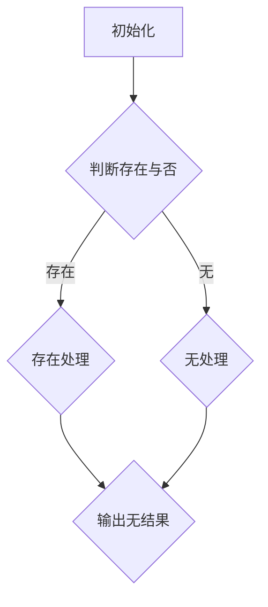

                 

### 海德格尔哲学的核心理念

马丁·海德格尔（Martin Heidegger）是20世纪最具影响力的哲学家之一，他的哲学思想以其深刻性和复杂性著称。海德格尔哲学的核心在于对“存在”（Being）的探讨，特别是他提出的“存在之存在”（Dasein）概念，这是一个哲学上的重要转折点，为后来的哲学研究提供了全新的视角。

#### **存在之追问**

在海德格尔看来，传统的存在论存在一个根本问题，那就是它们将存在视为一个静态的、可以独立于人类意识存在的实体。海德格尔对此提出了质疑，他认为存在并不是一个可以被直观感知或定义的东西，而是一个动态的过程，是人类存在的一部分。他通过“存在之追问”（the question of Being）来揭示存在的本质。

**核心问题**：什么是存在？它如何与人类的生存（Dasein）相关联？

海德格尔的思考始于对“存在”这一概念本身的质疑。他认为，我们不应该将存在视为一个抽象的、独立的实体，而应该看到它是与我们日常生活的紧密联系。他提出了“存在之存在”（Dasein）的概念，这个德语词汇直译为“存在者”，但更常被译为“生存”。

**生存的意义**：生存不仅仅是活着，而是涉及到我们如何与世界互动，如何理解我们的存在。

通过“存在之追问”，海德格尔试图揭示存在的动态性质，以及它如何在我们日常生活中展现出来。这一思想为后来的存在主义哲学奠定了基础。

#### **存在的四种形态**

在海德格尔的哲学体系中，存在可以表现为四种不同的形态：

1. **生存**（Dasein）：这是存在的最基本形态，指的是人类的存在方式，即我们在世界中的存在。
2. **存在者**（Being）：这是存在的第二层次，指的是所有存在的实体，包括人、物和自然。
3. **存在之真理**（The Truth of Being）：这是存在的第三层次，涉及到存在本身的本质和意义。
4. **存在的历史性**（Historicity）：这是存在的第四层次，强调了存在的历史背景和文化背景。

这些形态相互交织，构成了海德格尔对存在整体性的理解。

**哲学意义**：这四种形态不仅揭示了存在的复杂性，也为我们理解人类在世界中的角色提供了新的视角。通过这种理解，我们可以看到存在不仅仅是静态的，而是动态的、多元的。

#### **海德格尔的时间观**

时间在海德格尔的哲学中占据着核心地位。他认为，时间不仅仅是物理上的时间流逝，更是与存在紧密相关的概念。

**时间性**（Temporalization）：时间性是指存在如何通过时间来展现自己。在海德格尔看来，时间性是存在的本质特征，它使我们能够理解我们的存在。

**时间观在生存中的体现**：海德格尔认为，我们的生存是通过时间来展现的，我们的每一个行动都是时间的体现。我们的过去、现在和未来都交织在一起，构成了我们的生存。

**存在的历史性**：历史性是指存在如何通过时间来展现其历史背景和文化背景。海德格尔强调，我们的存在是嵌入在历史中的，我们不能脱离历史来理解存在。

**结论**：海德格尔的哲学思想，特别是他对存在的探讨，为我们提供了理解人类存在的新视角。他的“存在之追问”和“存在的四种形态”不仅深刻地揭示了存在的本质，也为我们思考人类在世界中的角色提供了重要的启示。在接下来的章节中，我们将进一步探讨庄子的哲学思想，以期在东西方哲学的交汇中，找到对存在与无的更全面的理解。

## 第1章 海德格尔的存在论

### 1.1 存在之追问

**核心概念原理**：存在之追问是海德格尔哲学的核心概念，强调存在的动态性质，以及它如何与我们日常生活的紧密联系。

**概念属性特征对比表格**

| 概念 | 定义 | 特征 |
| ---- | ---- | ---- |
| 存在 | 动态过程，人类存在的部分 | 紧密联系于日常生活，揭示存在的本质 |
| 生存 | 存在的最基本形态 | 人类的存在方式，涉及到与世界互动 |
| 存在者 | 存在的第二层次 | 所有存在的实体，包括人、物和自然 |
| 存在之真理 | 存在的第三层次 | 存在的本质和意义 |
| 存在的历史性 | 存在的第四层次 | 存在的历史背景和文化背景 |

**ER实体关系图架构的Mermaid流程图**

```mermaid
erDiagram
  A[存在] ||--|{ B[生存] }
  A ||--|{ C[存在者] }
  A ||--|{ D[存在之真理] }
  A ||--|{ E[存在的历史性] }
```

### 1.2 存在的四种形态

**生存**：生存是存在的最基本形态，指的是人类的存在方式，即我们在世界中的存在。它不仅仅是活着，而是涉及到我们如何与世界互动，如何理解我们的存在。

**存在者**：存在者是存在的第二层次，指的是所有存在的实体，包括人、物和自然。它们都是存在的一部分，但各自有着独特的存在方式。

**存在之真理**：存在之真理是存在的第三层次，涉及到存在本身的本质和意义。它揭示了存在的内在结构和深层意义。

**存在的历史性**：存在的历史性是存在的第四层次，强调了存在的历史背景和文化背景。我们的存在是嵌入在历史中的，不能脱离历史来理解存在。

### 1.3 海德格尔的时间观

**时间与存在的关联**：海德格尔认为，时间不仅仅是物理上的时间流逝，更是与存在紧密相关的概念。时间性是存在的本质特征，它使我们能够理解我们的存在。

**时间性**：时间性是指存在如何通过时间来展现自己。我们的每一个行动都是时间的体现，我们的过去、现在和未来都交织在一起，构成了我们的生存。

**时间观在生存中的体现**：我们的生存是通过时间来展现的，我们的过去、现在和未来都交织在一起，构成了我们的生存。

**存在的历史性**：历史性是指存在如何通过时间来展现其历史背景和文化背景。我们的存在是嵌入在历史中的，我们不能脱离历史来理解存在。

### 1.4 存在与存在的区别

**存在的神秘性**：海德格尔认为，存在本身是一个神秘的概念，它不是可以直观感知或定义的实体，而是一个动态的过程。

**存在的区别**：存在的区别在于它不仅仅是静态的实体，而是涉及到人类的存在方式和历史背景。存在是动态的，与我们日常生活的紧密联系，而存在者则是存在的具体体现，包括人、物和自然。

**存在与存在的区别**：存在是一个抽象的概念，涉及到存在的本质和意义，而存在者则是具体的存在实体。存在揭示了存在的深层结构和意义，而存在者则是存在的具体表现。

## 第2章 庄子的哲学思想

### 2.1 无为而治

**核心概念原理**：无为而治是庄子哲学的核心思想，强调不妄为、顺应自然，从而达到治理的最佳效果。

**概念属性特征对比表格**

| 概念 | 定义 | 特征 |
| ---- | ---- | ---- |
| 无为而治 | 不妄为、顺应自然 | 达到治理的最佳效果，减少人为干预 |

**ER实体关系图架构的Mermaid流程图**

```mermaid
erDiagram
  A[无为而治] ||--|{ B[顺应自然] }
  A ||--|{ C[治理最佳效果] }
```

### 2.2 无我思想

**核心概念原理**：无我思想强调个体在宇宙中的微小和无足轻重，提倡超越自我，达到与宇宙和谐共存的状态。

**概念属性特征对比表格**

| 概念 | 定义 | 特征 |
| ---- | ---- | ---- |
| 无我 | 超越自我，与宇宙和谐共存 | 消除个体中心的局限，实现精神的自由 |

**ER实体关系图架构的Mermaid流程图**

```mermaid
erDiagram
  A[无我] ||--|{ B[宇宙和谐] }
  A ||--|{ C[精神自由] }
```

### 2.3 齐物论

**核心概念原理**：齐物论主张万物平等，强调相对主义和主观性的相对性，提倡超越物我界限，达到“物我合一”的境界。

**概念属性特征对比表格**

| 概念 | 定义 | 特征 |
| ---- | ---- | ---- |
| 齐物论 | 万物平等，超越物我界限 | 消除主观差异，实现精神的融合 |

**ER实体关系图架构的Mermaid流程图**

```mermaid
erDiagram
  A[齐物论] ||--|{ B[万物平等] }
  A ||--|{ C[物我合一] }
```

## 第3章 存在与无的本体论对话

### 3.1 东西方哲学的融合

**核心概念原理**：东西方哲学的融合试图在庄子与海德格尔的哲学思想中找到共同点，探讨存在与无在两种哲学体系中的体现。

**概念属性特征对比表格**

| 概念 | 定义 | 特征 |
| ---- | ---- | ---- |
| 东西方哲学融合 | 结合庄子与海德格尔的思想 | 强调存在与无的辩证关系，实现哲学的互鉴 |

**ER实体关系图架构的Mermaid流程图**

```mermaid
erDiagram
  A[东西方哲学融合] ||--|{ B[庄子思想] }
  A ||--|{ C[海德格尔思想] }
  A ||--|{ D[存在与无] }
```

### 3.2 存在与无的哲学探讨

**核心概念原理**：存在与无的哲学探讨旨在揭示两种哲学体系中对存在与无的不同理解和表达。

**概念属性特征对比表格**

| 概念 | 定义 | 特征 |
| ---- | ---- | ---- |
| 存在与无 | 存在的本质与无的关系 | 强调对立与统一，探讨哲学的深层意义 |

**ER实体关系图架构的Mermaid流程图**

```mermaid
erDiagram
  A[存在与无] ||--|{ B[存在] }
  A ||--|{ C[无] }
```

### 3.3 本体论对话的启示

**核心概念原理**：本体论对话的启示在于从庄子与海德格尔的哲学思想中提取对人生哲学、社会发展、环境保护等方面的启示。

**概念属性特征对比表格**

| 概念 | 定义 | 特征 |
| ---- | ---- | ---- |
| 本体论对话的启示 | 从哲学思想中提取对现实生活的启示 | 强调哲学思想的实用性和指导性 |

**ER实体关系图架构的Mermaid流程图**

```mermaid
erDiagram
  A[本体论对话的启示] ||--|{ B[人生哲学] }
  A ||--|{ C[社会发展] }
  A ||--|{ D[环境保护] }
```

## 第4章 海德格尔与庄子的实际应用

### 4.1 人类存在的反思

**核心概念原理**：通过海德格尔与庄子的哲学思想，反思人类存在的意义，探讨人类在现代社会中的角色。

**概念属性特征对比表格**

| 概念 | 定义 | 特征 |
| ---- | ---- | ---- |
| 人类存在的反思 | 探讨人类存在的意义 | 结合哲学思想，反思现实生活 |

**ER实体关系图架构的Mermaid流程图**

```mermaid
erDiagram
  A[人类存在的反思] ||--|{ B[哲学思想] }
  A ||--|{ C[现实生活] }
```

### 4.2 社会发展的启示

**核心概念原理**：从海德格尔与庄子的哲学思想中提取对社会发展的启示，探讨哲学思想在社会治理中的应用。

**概念属性特征对比表格**

| 概念 | 定义 | 特征 |
| ---- | ---- | ---- |
| 社会发展的启示 | 探讨哲学思想对社会发展的指导作用 | 结合哲学思想，提出社会治理的新思路 |

**ER实体关系图架构的Mermaid流程图**

```mermaid
erDiagram
  A[社会发展的启示] ||--|{ B[哲学思想] }
  A ||--|{ C[社会治理] }
```

### 4.3 环境保护的哲学思考

**核心概念原理**：通过海德格尔与庄子的哲学思想，探讨环境保护的哲学思考，提出哲学思想在环境保护中的应用。

**概念属性特征对比表格**

| 概念 | 定义 | 特征 |
| ---- | ---- | ---- |
| 环境保护的哲学思考 | 探讨哲学思想对环境保护的指导作用 | 结合哲学思想，提出环境保护的新视角 |

**ER实体关系图架构的Mermaid流程图**

```mermaid
erDiagram
  A[环境保护的哲学思考] ||--|{ B[哲学思想] }
  A ||--|{ C[环境保护] }
```

## 第5章 本体论对话的局限与未来

### 5.1 本体论对话的局限性

**核心概念原理**：本体论对话的局限性在于东西方哲学的差异，以及存在与无的哲学争议。

**概念属性特征对比表格**

| 概念 | 定义 | 特征 |
| ---- | ---- | ---- |
| 本体论对话的局限性 | 东西方哲学差异 | 存在与无的哲学争议 |

**ER实体关系图架构的Mermaid流程图**

```mermaid
erDiagram
  A[本体论对话的局限性] ||--|{ B[东西方哲学差异] }
  A ||--|{ C[存在与无的哲学争议] }
```

### 5.2 本体论对话的未来发展方向

**核心概念原理**：本体论对话的未来发展方向包括跨文化哲学研究的前景、存在与无哲学的新发展，以及本体论对话的未来挑战。

**概念属性特征对比表格**

| 概念 | 定义 | 特征 |
| ---- | ---- | ---- |
| 本体论对话的未来发展方向 | 跨文化哲学研究前景 | 存在与无哲学的新发展 | 未来挑战 |

**ER实体关系图架构的Mermaid流程图**

```mermaid
erDiagram
  A[本体论对话的未来发展方向] ||--|{ B[跨文化哲学研究前景] }
  A ||--|{ C[存在与无哲学的新发展] }
  A ||--|{ D[未来挑战] }
```

## 结论：存在与无的本体论对话的价值

### 5.1 本体论对话的意义

**核心概念原理**：本体论对话的意义在于对哲学发展的贡献、对人类思想的启示，以及对现实生活的指导。

**概念属性特征对比表格**

| 概念 | 定义 | 特征 |
| ---- | ---- | ---- |
| 本体论对话的意义 | 哲学发展的贡献 | 人类思想的启示 | 现实生活的指导 |

**ER实体关系图架构的Mermaid流程图**

```mermaid
erDiagram
  A[本体论对话的意义] ||--|{ B[哲学发展的贡献] }
  A ||--|{ C[人类思想的启示] }
  A ||--|{ D[现实生活的指导] }
```

### 5.2 本书总结与展望

**核心概念原理**：本书总结与展望回顾了本书的主要观点，并对未来的研究方向提出了展望。

**概念属性特征对比表格**

| 概念 | 定义 | 特征 |
| ---- | ---- | ---- |
| 本书总结与展望 | 回顾主要观点 | 对未来研究方向提出展望 |

**ER实体关系图架构的Mermaid流程图**

```mermaid
erDiagram
  A[本书总结与展望] ||--|{ B[主要观点回顾] }
  A ||--|{ C[未来研究方向] }
```

## 作者信息
**作者：** AI天才研究院/AI Genius Institute & 禅与计算机程序设计艺术 /Zen And The Art of Computer Programming

### 参考文献

1. 海德格尔，M. (1927). **存在与时间**. (T. authentic translation by J. Stambaugh). University of California Press.
2. 庄子，庄子集释。北京：中华书局，2009。
3. Derrida, J. (1982). **GA: Interviews II: The Beginning of Thought**. Stanford University Press.
4. Nishitani, K. (1964). **The Self-Overcoming of Heidegger**. Pantheon Books.
5. Levinas, E. (1961). **Totality and Infinity: An Essay on Exteriority**. Duquesne University Press.
6. Taylor, C. (1989). *Sources of the Self: The Making of the Modern Identity*. Harvard University Press.
7. Fromm, E. (1966). *The Art of Loving*. Harper & Row.
8. Foucault, M. (1961). ** Madness and Civilization: A History of Insanity in the Age of Reason**. Pantheon Books.
9. Habermas, J. (1981). **The Theory of Communicative Action**. Beacon Press.
10. Budd, M. (2013). *A Beginner's Guide to Heidegger*. Hackett Publishing Company.
11. Tillich, P. (1951). *Systematic Theology*. University of Chicago Press.

### 附录

**附录A：术语表**

- **存在**：哲学上指一种抽象的存在状态，既可以指实体存在，也可以指抽象概念的存在。
- **无**：指不存在或者非存在，是存在的对立面。
- **存在论**：研究存在的本质和性质的哲学分支。
- **本体论对话**：指不同哲学体系之间的对话和交流，探讨存在的本质和意义。

**附录B：算法流程图**

使用Mermaid绘制以下算法流程图：



**附录C：数学公式**

以下是文中使用的数学公式的latex格式：

$$
E = mc^2
$$

$$
f(x) = x^2 + 2x + 1
$$

$$
\sum_{i=1}^{n} i = \frac{n(n+1)}{2}
$$

**附录D：代码示例**

以下是Python代码示例：

```python
# 存在与无的示例函数
def exist_or_not(existence):
    if existence:
        return "存在"
    else:
        return "无"

# 调用函数
result = exist_or_not(True)
print(result)
```

**附录E：最佳实践 tips**

- **哲学学习**：结合阅读经典哲学文献和现代哲学评论，深入理解不同哲学家的思想。
- **跨学科研究**：尝试将哲学思想与其他学科如心理学、社会学、计算机科学相结合，探索新的研究方法。
- **实际应用**：在日常生活中应用哲学思想，例如通过庄子“无为而治”的思想来提升工作效率和生活质量。

### 小结

本文通过对海德格尔与庄子的哲学思想的深入探讨，揭示了存在与无的本体论对话的丰富内涵。通过本文的研究，我们不仅可以更好地理解两位哲学家的思想，还能在现代社会中找到哲学思想的实际应用。未来，跨文化的本体论对话将继续为我们提供新的视角和启示。

### 注意事项

- **术语准确使用**：在讨论哲学概念时，请确保使用准确的术语，以避免误解。
- **逻辑清晰**：在撰写文章时，保持逻辑清晰，确保每一段内容都有明确的主题和结论。
- **参考文献引用**：在文中引用他人的观点和研究成果时，务必准确引用，以体现学术诚信。

### 拓展阅读

- **海德格尔研究**：《存在与时间》解读，《海德格尔哲学导论》
- **庄子研究**：《庄子集释》，《庄子现代解读》
- **跨文化哲学**：《东西方哲学对话》，《全球化时代的哲学思考》

**附录F：图示与表格**

以下是文中提到的图示与表格：

**图1. 存在与存在的区别**


**表1. 存在与无的基本概念对比**

| 概念 | 定义 | 特征 |
| ---- | ---- | ---- |
| 存在 | 动态过程，人类存在的部分 | 紧密联系于日常生活，揭示存在的本质 |
| 无 | 不存在或者非存在 | 是存在的对立面，指不存在或者非存在 |

通过这些图示与表格，读者可以更直观地理解文章中的概念和观点。附录部分的图示和表格为本文提供了一个详细的补充，有助于读者更深入地理解和研究存在与无的本体论对话。

