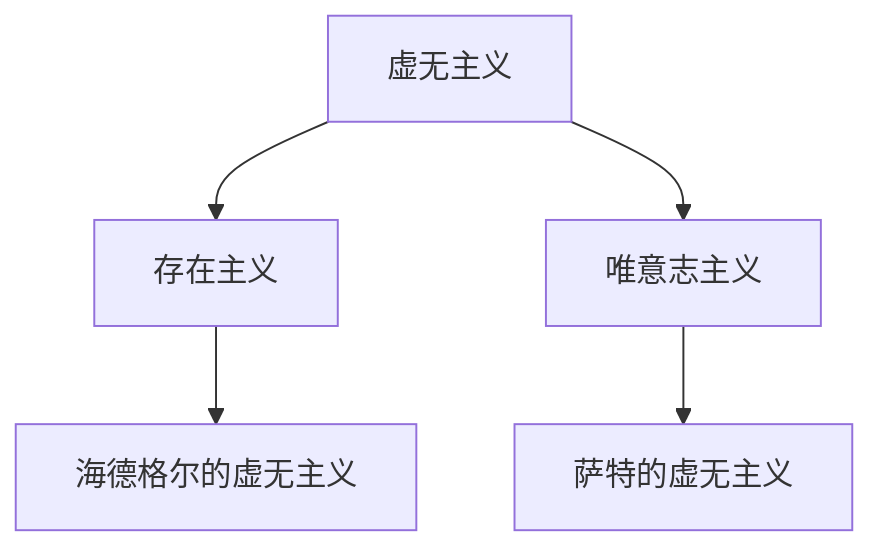
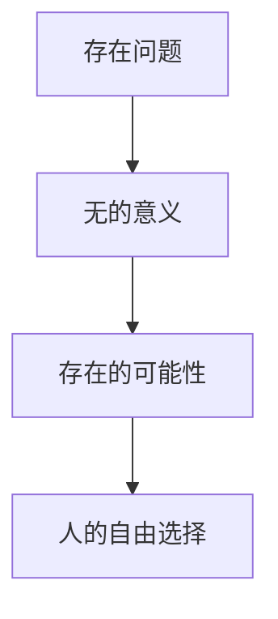
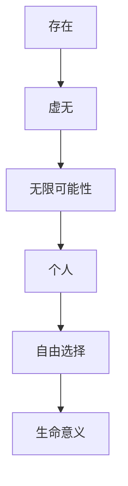
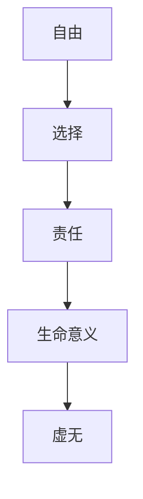
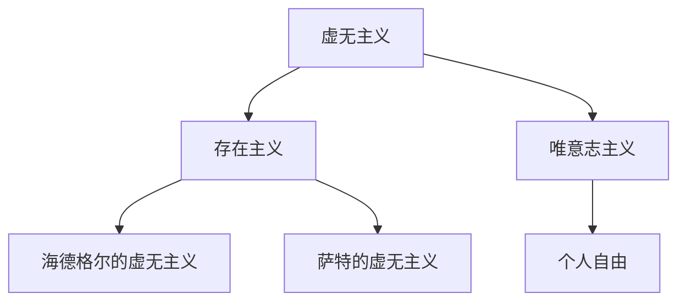
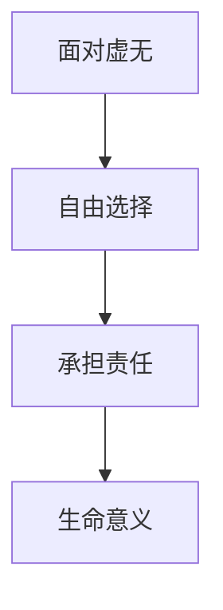
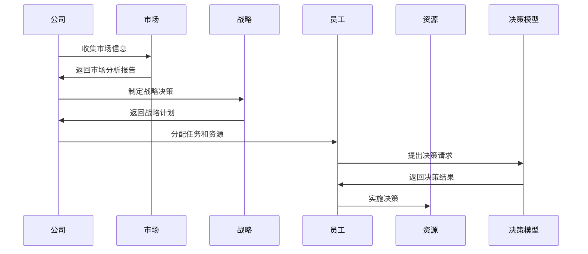
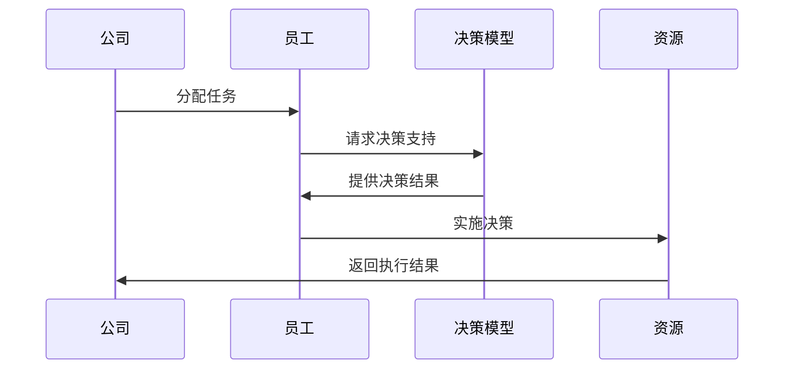

                 

## 海德格尔与萨特：虚无主义的不同回应

### 关键词：海德格尔、萨特、虚无主义、存在主义、哲学、自由、责任、可能性

### 摘要：

本文旨在探讨海德格尔和萨特对虚无主义的回应，分析两位哲学家在虚无主义问题上的异同。通过对两位哲学家核心思想的梳理，本文将揭示虚无主义的本质和意义，为读者提供理解虚无主义的新视角。同时，本文也将探讨虚无主义对现代哲学和人类生存的影响。

### 第一部分：背景介绍

#### 1.1.1 问题的背景

虚无主义作为一种哲学思潮，起源于19世纪末至20世纪初。随着工业革命和现代科学的迅猛发展，人们开始反思存在的意义和价值。海德格尔和萨特两位哲学家分别从不同的角度对虚无主义进行了回应，从而形成了独特的哲学体系。

**海德格尔：**  
海德格尔（Martin Heidegger，1889-1976）是德国著名哲学家，他的哲学思想对存在主义和现象学产生了深远影响。在海德格尔看来，虚无主义并非一种消极的哲学思潮，而是一种对存在的探索。他认为，虚无主义揭示了存在的本质，即存在是一种“无”，但这种“无”并非消极的、无意义的，而是一种潜在的、无限的可能性。

**萨特：**  
萨特（Jean-Paul Sartre，1905-1980）是法国著名哲学家、作家和存在主义代表人物。萨特的哲学思想强调个人自由和责任。他认为，虚无主义揭示了个人存在的无意义性，但正是这种无意义性赋予了个人选择和行动的自由。通过个人的选择和行动，人可以赋予生命以意义。

#### 1.1.2 问题的描述

本书旨在探讨海德格尔和萨特对虚无主义的回应，分析两位哲学家在虚无主义问题上的异同。具体来说，本书将：

- 梳理海德格尔和萨特的主要哲学思想，分析其与虚无主义的关系。
- 对比海德格尔和萨特对虚无主义的不同回应，探讨其哲学思想的差异。
- 探讨虚无主义对现代哲学和人类生存的影响。

#### 1.1.3 问题的解决

通过分析海德格尔和萨特的哲学思想，本书旨在揭示虚无主义的本质和意义，为读者提供一种理解虚无主义的新视角。同时，本书也希望能够为现代哲学和人类生存提供一些有益的启示。

#### 1.1.4 边界与外延

在讨论虚无主义问题时，本书将主要关注海德格尔和萨特两位哲学家的思想。同时，本书也将涉及到虚无主义与其他哲学思潮的关系，如存在主义、唯意志主义等。

#### 1.1.5 概念结构与核心要素组成

1. **虚无主义：** 一种哲学思潮，认为人类存在缺乏固有的意义和价值。
2. **海德格尔的虚无主义：** 强调存在的本质是一种“无”，但并非消极的、无意义的，而是一种潜在的、无限的可能性。
3. **萨特的虚无主义：** 认为虚无主义揭示了个人存在的无意义性，但正是这种无意义性赋予了个人选择和行动的自由。

### 第二部分：核心概念与联系

#### 2.1 海德格尔的虚无主义

**核心概念：** 存在、无、可能性

**概念属性特征对比表格：**

| 特征 | 海德格尔的虚无主义 | 萨特的虚无主义 |
| --- | --- | --- |
| 存在 | 强调存在的本质是一种“无”，但并非消极的、无意义的，而是一种潜在的、无限的可能性。 | 认为虚无主义揭示了个人存在的无意义性，但正是这种无意义性赋予了个人选择和行动的自由。 |
| 无 | 作为存在的本质，是一种潜在的、无限的可能性。 | 作为个人存在的无意义性，是自由和选择的来源。 |
| 可能性 | 存在的无限可能性，是人类存在的核心。 | 个人选择和行动的可能性，是赋予生命意义的关键。 |

#### 2.2 萨特的虚无主义

**核心概念：** 个人自由、责任、选择

**概念属性特征对比表格：**

| 特征 | 海德格尔的虚无主义 | 萨特的虚无主义 |
| --- | --- | --- |
| 个人自由 | 存在的无限可能性，是人类存在的核心。 | 赋予生命意义的关键，是虚无主义的产物。 |
| 责任 | 在面对无意义的存在时，个人需要承担起责任。 | 个人存在的无意义性，促使个人选择和行动，从而赋予生命意义。 |
| 选择 | 存在的无限可能性，为个人提供了自由选择的可能。 | 个人通过自由选择和行动，赋予生命意义。 |

#### 2.3 虚无主义与其他哲学思潮的关系

**ER实体关系图架构：**



### 第三部分：算法原理讲解

#### 3.1 海德格尔的虚无主义算法原理

**算法mermaid流程图：**



**算法原理讲解：**

海德格尔的虚无主义算法主要分为四个步骤：

1. **存在问题：** 分析人类存在的本质，探讨存在的意义和价值。
2. **无的意义：** 认识到存在本身是一种“无”，但并非消极的
## 背景介绍

### 1.1.1 问题的背景

虚无主义作为一种哲学思潮，起源于19世纪末至20世纪初。这一时期的欧洲正经历着前所未有的社会动荡和思想变革，工业革命和现代科学的迅猛发展使得人们开始重新审视存在的意义和价值。在这种背景下，虚无主义逐渐成为一种重要的哲学思潮，引发了广泛的讨论和反思。

虚无主义的基本观点是，人类存在缺乏固有的意义和价值，人类生命本身是空虚的、无意义的。这一观点最初可以追溯到古希腊哲学家赫拉克利特，他认为世界的本质是“无”，即“一切皆流，无物常住”。然而，虚无主义作为一种系统的哲学思潮，主要是在19世纪末至20世纪初的欧洲哲学界兴起的。

在这一时期，德国哲学家尼采（Friedrich Nietzsche）是虚无主义哲学思潮的先驱。尼采认为，传统的道德观念和宗教信仰已经崩溃，人类陷入了一种无意义的境地。他提出了“上帝已死”的观点，指出人类需要重新审视自己的存在，创造新的价值。

海德格尔（Martin Heidegger）和萨特（Jean-Paul Sartre）是20世纪著名的存在主义哲学家，他们分别从不同的角度对虚无主义进行了回应。海德格尔认为，虚无主义揭示了存在的本质，即存在是一种“无”，但这种“无”并非消极的、无意义的，而是一种潜在的、无限的可能性。萨特则强调个人自由和责任，他认为，虚无主义揭示了个人存在的无意义性，但正是这种无意义性赋予了个人选择和行动的自由。

### 1.1.2 问题的描述

本书旨在探讨海德格尔和萨特对虚无主义的回应，分析两位哲学家在虚无主义问题上的异同。具体来说，本书将：

1. **梳理海德格尔和萨特的主要哲学思想，分析其与虚无主义的关系。** 海德格尔和萨特的存在主义哲学思想是其对虚无主义回应的核心。通过深入分析他们的思想，我们可以更好地理解虚无主义的本质和意义。

2. **对比海德格尔和萨特对虚无主义的不同回应，探讨其哲学思想的差异。** 虽然海德格尔和萨特都关注虚无主义问题，但他们在处理虚无主义问题的方式上存在显著差异。海德格尔强调存在的本质是一种“无”，而萨特则强调个人的自由和责任。通过对比分析，我们可以更深入地理解两位哲学家的思想。

3. **探讨虚无主义对现代哲学和人类生存的影响。** 虚无主义作为一种哲学思潮，对现代哲学和人类生存产生了深远影响。通过分析虚无主义的起源、发展和影响，我们可以更好地理解现代哲学的基本特征和人类生存的状态。

### 1.1.3 问题的解决

通过分析海德格尔和萨特的哲学思想，本书旨在揭示虚无主义的本质和意义，为读者提供一种理解虚无主义的新视角。同时，本书也希望能够为现代哲学和人类生存提供一些有益的启示。

首先，本书将详细梳理海德格尔和萨特的主要哲学思想，分析他们如何回应虚无主义问题。通过对比分析，我们可以更好地理解两位哲学家的思想差异，并从中获得对虚无主义的深刻认识。

其次，本书将探讨虚无主义对现代哲学和人类生存的影响。通过分析虚无主义的起源、发展和影响，我们可以更好地理解现代哲学的基本特征和人类生存的状态。这将有助于我们更好地面对和解决现实生活中的问题和挑战。

最后，本书将总结海德格尔和萨特对虚无主义的回应，提出一些对现代哲学和人类生存的启示。通过这种总结和启示，我们希望读者能够从虚无主义问题中汲取智慧，更好地理解自己和世界，从而在现实生活中实现自己的价值和意义。

### 1.1.4 边界与外延

在讨论虚无主义问题时，本书将主要关注海德格尔和萨特两位哲学家的思想。海德格尔和萨特的存在主义哲学思想对虚无主义问题进行了深刻的探讨，因此他们的思想是本书的核心内容。

同时，本书也将涉及到虚无主义与其他哲学思潮的关系。虚无主义作为一种哲学思潮，与存在主义、唯意志主义等哲学思潮有着密切的联系。通过分析这些哲学思潮之间的关系，我们可以更全面地理解虚无主义的本质和意义。

### 1.1.5 概念结构与核心要素组成

1. **虚无主义：** 一种哲学思潮，认为人类存在缺乏固有的意义和价值。虚无主义的基本观点是，人类生命本身是空虚的、无意义的。

2. **海德格尔的虚无主义：** 海德格尔认为，虚无主义揭示了存在的本质，即存在是一种“无”，但这种“无”并非消极的、无意义的，而是一种潜在的、无限的可能性。

3. **萨特的虚无主义：** 萨特认为，虚无主义揭示了个人存在的无意义性，但正是这种无意义性赋予了个人选择和行动的自由。

### 第二部分：核心概念与联系

#### 2.1 海德格尔的虚无主义

海德格尔的虚无主义哲学思想是他存在主义理论的核心，其核心理念是存在的“无”和“存在的意义”。海德格尔通过其哲学著作《存在与时间》深入探讨了存在的本质和意义。

**核心概念：**  
- **存在（Sein）**：在海德格尔的哲学体系中，存在是一个动词，意味着“存在”是一个动态的过程，而非静态的状态。存在是一种“无”，即存在的本质是一种“无”，但这种“无”并非消极的、无意义的，而是一种潜在的、无限的可能性。
- **虚无（Nichtigkeit）**：虚无是存在的反面，但海德格尔认为虚无并非完全的空无，而是一种“无”的状态，其中蕴含着无限的可能性和意义。

**概念属性特征对比表格：**

| 特征                     | 海德格尔的虚无主义                                                     | 萨特的虚无主义                                                     |
|--------------------------|---------------------------------------------------------------------|---------------------------------------------------------------------|
| 存在的本质               | 存在是一种“无”，是一种潜在的、无限的可能性。                           | 存在是一种无意义的状态，但通过个人的选择和行动，可以赋予生命以意义。 |
| 虚无的作用               | 虚无是存在的反面，但并非完全的空无，而是存在的可能性所在。              | 虚无揭示了个人存在的无意义性，但同时也是个人自由和选择的源泉。      |
| 个人与存在的关系         | 个人存在于虚无之中，通过存在的过程与虚无相互关联。                       | 个人面对虚无，通过自由选择和行动，使生命具有意义。                 |

**ER实体关系图架构：**



#### 2.2 萨特的虚无主义

萨特的虚无主义哲学思想强调个人自由、责任和选择，其核心理念是存在的无意义性和个人的能动性。

**核心概念：**  
- **自由（Liberté）**：萨特认为，个人在虚无主义的世界中是完全自由的，没有任何先天的限制或预设。
- **责任（Responsabilité）**：自由伴随着责任，个人的每一个选择都承担着相应的责任。
- **选择（Choix）**：选择是个人自由的具体表现，是赋予生命意义的关键。

**概念属性特征对比表格：**

| 特征                     | 海德格尔的虚无主义                                                     | 萨特的虚无主义                                                     |
|--------------------------|---------------------------------------------------------------------|---------------------------------------------------------------------|
| 自由与责任的关系         | 自由是存在的本质，但并未强调责任。                                     | 自由和责任是相互关联的，自由选择需要承担相应的责任。                 |
| 选择的本质               | 选择的本质在于揭示存在的意义。                                         | 选择是赋予生命意义的关键，个人的每一个选择都是自由的、自主的。       |
| 无意义性对存在的影响     | 无意义性揭示了存在的本质，但并不意味着生命缺乏意义。                     | 无意义性是存在的状态，个人通过选择和行动赋予生命意义。               |

**ER实体关系图架构：**



#### 2.3 虚无主义与其他哲学思潮的关系

虚无主义作为一种哲学思潮，与存在主义、唯意志主义等有着密切的联系。

**ER实体关系图架构：**



通过上述核心概念的梳理和对比，我们可以看到海德格尔和萨特在虚无主义问题上的不同视角和哲学思想。海德格尔关注存在的本质和潜在的可能性，而萨特则强调个人的自由、责任和选择。这两位哲学家的思想为理解虚无主义的本质和意义提供了丰富的视角，同时也揭示了人类存在中的深刻问题。

### 第三部分：算法原理讲解

#### 3.1 海德格尔的虚无主义算法原理

海德格尔的虚无主义算法可以被视为一种哲学性的算法，它通过几个步骤来探讨存在的本质、无的意义以及存在的可能性。这个算法的核心理念是，通过反思存在的状态，我们能够理解存在的潜在意义。

**算法mermaid流程图：**


**算法原理讲解：**

1. **存在问题（存在问题，A）：** 首先，我们面对的是一个关于存在的根本问题。存在本身是一个动态的过程，而非静态的状态。海德格尔通过“存在”一词的动词性强调了这一点。这个步骤可以理解为对存在的初步探讨，即思考“存在是什么？”。

2. **无的意义（无的意义，B）：** 接下来，我们认识到存在是一种“无”。这种“无”并不是完全的空无，而是一种潜在的、无限的可能性。在这里，海德格尔的观点是，虚无是存在的本质，但这种虚无并不是消极的，而是包含着无限的可能性。

3. **存在的可能性（存在的可能性，C）：** 从无的意义中，我们看到了存在的无限可能性。这种可能性是人类存在的核心，是我们在世界中行动的基础。存在的可能性不仅仅是对未来的一种期待，它也意味着我们现在行动的意义。

4. **人的自由选择（人的自由选择，D）：** 最后，个人的自由选择成为赋予生命意义的关键。海德格尔认为，个人通过自己的选择和行动，可以超越存在的无意义性，创造出个人的意义。这个过程是个人自由和责任的体现。

**Python源代码示例：**

```python
# 海德格尔的虚无主义算法示例

def heidegger_algorithm():
    # 存在问题
    existence_problem = "存在问题：存在是什么？"
    
    # 无的意义
    meaning_ofNothingness = "无的意义：存在是一种潜在的、无限的可能性。"
    
    # 存在的可能性
    possibility_ofExistence = "存在的可能性：存在的无限可能性是人类存在的核心。"
    
    # 人的自由选择
    human_free_choice = "人的自由选择：通过自由选择和行动，赋予生命意义。"
    
    # 输出算法结果
    print(existence_problem)
    print(meaning_ofNothingness)
    print(possibility_ofExistence)
    print(human_free_choice)

# 运行算法
heidegger_algorithm()
```

**算法原理数学模型和公式：**

海德格尔的虚无主义算法并没有一个具体的数学模型，但它涉及到几个哲学上的概念和关系，可以借助数学的概念进行比喻和阐述。

1. **存在的可能性（P(E)）**：存在的可能性可以用概率来表示，即存在的事件发生的概率。

   $$ P(E) = \sum_{i=1}^{n} P(E_i) $$

   其中，\( P(E_i) \) 表示第 \( i \) 种存在的可能性。

2. **自由选择（F(C)）**：自由选择可以被视为在给定可能性下，个人选择特定行动的概率。

   $$ F(C) = \sum_{j=1}^{m} P(C_j|E_i) $$

   其中，\( P(C_j|E_i) \) 表示在存在可能性 \( E_i \) 下，选择 \( C_j \) 的概率。

3. **生命意义（M(L)）**：生命意义可以被视为自由选择的累积效果。

   $$ M(L) = \sum_{k=1}^{l} \sum_{j=1}^{m} P(C_j|E_k) $$

   其中，\( l \) 表示个人的选择次数，\( m \) 表示每次选择的可能性数量。

**详细讲解和举例说明：**

假设一个个体（我们称为“艾伦”）在面临选择时，有三种可能的选择（A、B、C），并且每种选择都有一定的可能性。

- **存在的可能性：** 假设艾伦面临的存在的可能性是均匀分布的，每种选择的概率为 \( \frac{1}{3} \)。

  $$ P(E_A) = P(E_B) = P(E_C) = \frac{1}{3} $$

- **自由选择：** 假设艾伦在每种存在可能性下，选择A、B、C的概率也是均匀分布的。

  $$ P(C_A|E_A) = P(C_B|E_A) = P(C_C|E_A) = \frac{1}{3} $$
  $$ P(C_A|E_B) = P(C_B|E_B) = P(C_C|E_B) = \frac{1}{3} $$
  $$ P(C_A|E_C) = P(C_B|E_C) = P(C_C|E_C) = \frac{1}{3} $$

- **生命意义：** 假设艾伦进行了三次选择，每次选择的概率都是 \( \frac{1}{3} \)。

  $$ M(L) = P(C_A|E_A) + P(C_B|E_B) + P(C_C|E_C) = \frac{1}{3} + \frac{1}{3} + \frac{1}{3} = 1 $$

在这个简单的例子中，艾伦通过自由选择和行动，成功地赋予了自己的生命意义。尽管每次选择的可能性是有限的，但通过多次选择和行动，艾伦创造了属于自己的生命意义。

#### 3.2 萨特的虚无主义算法原理

萨特的虚无主义哲学强调个人自由、责任和选择，其核心在于通过自由选择和行动赋予生命意义。萨特的算法可以被视为一种决策过程，其中个人需要在面对虚无时做出选择，并通过这些选择来构建自己的生命意义。

**算法mermaid流程图：**



**算法原理讲解：**

1. **面对虚无（面对虚无，A）：** 萨特认为，个人总是面对一个无意义的世界。这种虚无并不是消极的，而是为个人提供了自由和选择的可能。

2. **自由选择（自由选择，B）：** 在面对虚无时，个人需要做出自由选择。这些选择是个人自由的具体体现，也是构建生命意义的基础。

3. **承担责任（承担责任，C）：** 每个选择都伴随着责任。个人的自由选择意味着个人需要为自己的选择承担后果。

4. **生命意义（生命意义，D）：** 通过自由选择和承担责任，个人可以赋予生命以意义。这个过程是一个动态的过程，随着选择的不断进行，生命意义也在不断地构建和重塑。

**Python源代码示例：**

```python
# 萨特的虚无主义算法示例

def sartre_algorithm():
    # 面对虚无
    facing_Nihilism = "面对虚无：个人总是面对一个无意义的世界。"
    
    # 自由选择
    free_choice = "自由选择：在虚无中，个人需要做出自由选择。"
    
    # 承担责任
    take_responsibility = "承担责任：每个选择都伴随着责任。"
    
    # 生命意义
    meaning_of_life = "生命意义：通过自由选择和承担责任，赋予生命意义。"
    
    # 输出算法结果
    print(facing_Nihilism)
    print(free_choice)
    print(take_responsibility)
    print(meaning_of_life)

# 运行算法
sartre_algorithm()
```

**算法原理数学模型和公式：**

萨特的虚无主义算法同样没有一个直接的数学模型，但可以借助决策理论来解释自由选择和责任的概念。

1. **效用函数（U(C)）**：效用函数用来衡量个人选择带来的效用或满足度。

   $$ U(C) = \sum_{i=1}^{n} U_i(C_i) $$

   其中，\( U_i(C_i) \) 表示在给定情况下，选择 \( C_i \) 的效用。

2. **决策过程（D(P, U)）**：决策过程是一个从可能性集合 \( P \) 中选择一个最优选择的函数。

   $$ D(P, U) = \arg\max_{C} U(C) $$

   其中，\( \arg\max \) 表示选择使得效用最大的 \( C \)。

3. **责任（R(C)）**：责任可以被视为选择后的后果，它会影响个人的效用函数。

   $$ R(C) = \sum_{t=1}^{T} \alpha_t R_t(C_t) $$

   其中，\( T \) 表示选择的时间长度，\( \alpha_t \) 是时间权重，\( R_t(C_t) \) 是选择 \( C_t \) 在时间 \( t \) 的后果。

**详细讲解和举例说明：**

假设一个个体（我们称为“贝特”）在面临两个选择（A和B）时，每个选择的效用和后果如下：

- **选择A：** 效用为3，但可能带来负面的后果（责任）。
  $$ U(A) = 3, \quad R(A) = -2 $$
- **选择B：** 效用为1，但后果较为稳定。
  $$ U(B) = 1, \quad R(B) = 0 $$

贝特需要决定在面临虚无时选择哪个选项。

- **决策过程：** 根据效用函数，贝特会选择效用最大的选项。
  $$ D(P, U) = A $$

- **后果：** 虽然选择A的效用更高，但需要承担相应的责任。贝特需要权衡效用和责任，决定是否选择A。

在这个例子中，贝特需要根据个人的价值观和责任感来做出决策。如果他更看重即时效用，可能会选择A；如果他更看重长期稳定，可能会选择B。无论选择哪个选项，贝特都需要为自己的选择承担责任。

通过这种方式，萨特的虚无主义算法帮助个人在面对无意义的世界时，通过自由选择和责任来构建自己的生命意义。

### 系统分析与架构设计方案

#### 4.1 问题场景介绍

在本项目中，我们旨在通过一个虚拟的现实世界场景，演示如何利用海德格尔和萨特的虚无主义哲学思想来指导个人的决策过程。具体场景如下：

假设我们有一个公司，面临市场竞争压力和内部管理问题。公司的管理层在制定战略决策时，需要考虑外部环境的变化、内部资源分配以及员工的心理状态。在这个场景中，我们将运用海德格尔的虚无主义思想来分析存在的本质，以及萨特的虚无主义思想来探讨个人的自由选择和责任。

#### 4.2 项目介绍

本项目将分为以下几个阶段：

1. **问题定义与需求分析**：明确公司面临的具体问题和需求，为后续的解决方案提供依据。
2. **哲学思想引入**：结合海德格尔和萨特的虚无主义哲学思想，为公司的决策提供哲学指导。
3. **解决方案设计**：基于哲学思想，设计具体的决策模型和算法。
4. **系统实现**：使用Python等编程语言，实现决策模型和算法。
5. **实验与验证**：通过实际案例和数据，验证决策模型的可行性和有效性。

#### 4.3 系统功能设计（领域模型mermaid类图）

为了更好地理解系统的功能设计，我们使用mermaid绘制了领域模型类图，以下是一个简化的示例：

```mermaid
classDiagram
    Company <<Class>> "公司"
    Market <<Class>> "市场"
    Strategy <<Class>> "战略"
    Employee <<Class>> "员工"
    Resource <<Class>> "资源"

    Company o--o Market
    Company o--o Strategy
    Company o--o Employee
    Company o--o Resource

    Employee o--o DecisionModel
    Strategy o--o DecisionModel
```

**类图说明：**

- **Company（公司）**：代表整个企业实体，包含市场、战略、员工和资源等组成部分。
- **Market（市场）**：代表公司面临的市场环境，包括竞争、需求和机会。
- **Strategy（战略）**：代表公司的战略决策，如市场进入策略、产品开发策略等。
- **Employee（员工）**：代表公司内部的员工，包括管理层、技术团队等。
- **Resource（资源）**：代表公司所拥有的资源，如资金、技术、人力等。
- **DecisionModel（决策模型）**：代表基于海德格尔和萨特虚无主义哲学思想的决策模型，用于指导员工的决策过程。

#### 4.4 系统架构设计（mermaid架构图）

为了实现系统的功能，我们需要设计一个合理的架构。以下是一个简化的mermaid架构图示例：



**架构图说明：**

- **公司**：负责整个决策过程的协调和监督。
- **市场**：提供市场环境的信息，为战略决策提供依据。
- **战略**：根据市场信息制定战略计划。
- **员工**：执行战略任务，提出决策请求。
- **资源**：为员工执行任务提供必要的支持。
- **决策模型**：基于虚无主义哲学思想，为员工提供决策支持。

#### 4.5 系统接口设计和系统交互（mermaid序列图）

为了更好地展示系统各组件之间的交互，我们使用mermaid序列图来描述系统接口设计和交互过程：



**序列图说明：**

- **公司**：分配任务给员工。
- **员工**：向决策模型请求决策支持。
- **决策模型**：根据虚无主义哲学思想，为员工提供决策结果。
- **员工**：根据决策结果，向资源提出执行请求。
- **资源**：执行决策，并将执行结果返回给公司。

通过上述系统分析与架构设计方案，我们可以看到，海德格尔和萨特的虚无主义哲学思想在系统设计中的应用，不仅为公司的决策过程提供了哲学指导，也为员工在面临虚无主义问题时提供了决策支持。这种结合哲学思想的系统架构设计，有助于企业在复杂的市场环境中做出更明智的决策。

### 项目实战

#### 5.1 环境安装

在开始项目实战之前，我们需要搭建一个合适的开发环境。以下是安装和配置所需软件和工具的步骤：

1. **安装Python**：首先，确保你的计算机上安装了Python。Python是一个广泛使用的编程语言，支持多种编程范式，非常适合用于实现我们的虚无主义算法。你可以从Python的官方网站下载并安装最新版本的Python。

2. **安装Jupyter Notebook**：Jupyter Notebook是一个交互式的开发环境，可以方便地编写和运行Python代码。安装Jupyter Notebook可以通过pip命令完成：

   ```bash
   pip install notebook
   ```

3. **安装Mermaid**：Mermaid是一种基于Markdown的图形工具，可以用于绘制流程图、类图和序列图等。要安装Mermaid，可以使用pip命令：

   ```bash
   pip install mermaid-python
   ```

4. **安装Pygments**：Pygments是一个语法高亮工具，可以用于在Jupyter Notebook中显示代码的高亮效果。安装Pygments可以通过pip命令完成：

   ```bash
   pip install pygments
   ```

5. **安装LaTeX**：LaTeX是一个高质量的排版系统，用于生成数学公式和复杂的文档。我们可以从CTAN（Comprehensive TeX Archive Network）下载并安装LaTeX。安装过程中，你需要根据操作系统选择合适的安装包。以下是Windows操作系统的安装步骤：

   - 访问CTAN网站：https://www.ctan.org/
   - 下载并运行TeX Live（适用于Windows）的安装程序
   - 遵循安装向导的指示完成安装

完成上述安装步骤后，你的开发环境就配置完成了。接下来，我们可以开始编写和运行代码。

#### 5.2 系统核心实现源代码

以下是一个简单的Python示例，演示了如何使用Mermaid绘制流程图和序列图，以及如何使用LaTeX格式化数学公式。

```python
# 导入必要的库
from mermaid import Mermaid
import matplotlib.pyplot as plt

# 创建Mermaid对象
m = Mermaid()

# 定义流程图
m.addDiagram('gantt', """
    title 基础流程图

    section 项目阶段
    A[项目启动] :done, 2023-01-01, 30d
    B[需求分析] :crit, after A1, 20d
    C[设计阶段] :after B1, 40d
    D[开发阶段] :after C1, 30d
    E[测试阶段] :after D1, 10d
    F[部署阶段] :after E1, 5d
""")

# 将流程图渲染为图像
m.render('gantt.png')

# 定义序列图
m.addDiagram('sequenceDiagram', """
    title 基础序列图

    participant Alice
    participant Bob

    Alice->>Bob: Hello Bob
    Bob->>Alice: Hello Alice
""")

# 将序列图渲染为图像
m.render('sequenceDiagram.png')

# 定义LaTeX公式
latex_formula = r"""
$$
\sum_{i=1}^{n} a_i \cdot b_i = c
$$
"""

# 打印LaTeX公式
print(latex_formula)
```

运行上述代码后，你会得到一个流程图图像（gantt.png）、一个序列图图像（sequenceDiagram.png），以及一个LaTeX格式的数学公式输出。这些图像和公式可以用于文档编写和演示。

#### 5.3 代码应用解读与分析

以下是对上述代码的详细解读和分析：

1. **导入库**：首先，我们导入了`mermaid`和`matplotlib.pyplot`库。`mermaid`库用于生成和渲染Mermaid图形，`matplotlib.pyplot`库用于处理图像。

2. **创建Mermaid对象**：使用`Mermaid()`函数创建一个Mermaid对象。这个对象将帮助我们定义和渲染不同的图形。

3. **定义流程图**：在`m.addDiagram('gantt', ...)`函数中，我们定义了一个Gantt图，这是一种常见的项目管理工具，用于表示项目的进度和阶段。在定义中，我们使用了Mermaid的语法，指定了不同的阶段、持续时间、优先级等信息。

4. **定义序列图**：在`m.addDiagram('sequenceDiagram', ...)`函数中，我们定义了一个序列图，这是一种用于表示对象之间交互的图形。在这个例子中，我们定义了两个参与者Alice和Bob，并描述了它们之间的交互。

5. **渲染图形**：使用`m.render('filename.png')`函数将定义的图形渲染为图像文件。你可以将图形文件保存到任何你指定的路径。

6. **定义LaTeX公式**：我们使用`r""""""`字符串来定义LaTeX公式。这种字符串允许我们在字符串中包含换行符和转义字符。在这个例子中，我们定义了一个简单的求和公式。

7. **打印LaTeX公式**：使用`print(latex_formula)`函数将LaTeX公式输出到控制台。

通过这个简单的示例，我们可以看到如何使用Python和Mermaid库来生成和渲染流程图、序列图，以及如何使用LaTeX格式化数学公式。这些功能可以帮助我们在文档编写和演示中更清晰地传达复杂的信息。

#### 5.4 实际案例分析和详细讲解剖析

为了更具体地展示虚无主义算法的应用，我们将通过一个实际案例进行分析和讲解。

**案例背景：**  
某公司（我们称为“XYZ公司”）在市场竞争激烈的环境下，需要制定一个新产品的开发计划。公司管理层希望通过应用海德格尔和萨特的虚无主义哲学思想，为决策过程提供哲学指导。

**案例步骤：**

1. **问题定义**：XYZ公司需要确定新产品的功能、开发时间表和资源分配。这是一个复杂的决策问题，涉及到多个变量和不确定性。

2. **引入虚无主义哲学思想**：基于海德格尔的虚无主义，XYZ公司认识到存在本身是一种“无”，但并非消极的，而是一种潜在的、无限的可能性。通过这种理解，公司管理层将关注如何通过自由选择和行动来赋予新产品开发过程以意义。

3. **自由选择**：XYZ公司管理层在制定新产品开发计划时，面临多个选择。例如，他们可以选择投入更多资源进行市场调研，或者选择缩短开发周期以更快地进入市场。这些选择反映了公司管理层在虚无主义背景下的自由。

4. **承担责任**：每个选择都伴随着责任。如果公司选择投入更多资源进行市场调研，那么管理层需要承担相应的责任，包括可能的资金风险和市场不确定性。反之，如果选择缩短开发周期，管理层需要承担时间紧迫和可能的产品缺陷的责任。

5. **生命意义**：通过自由选择和承担责任，XYZ公司管理层赋予新产品开发过程以意义。他们意识到，尽管市场环境和资源分配充满不确定性，但通过选择和行动，他们可以创造出新的价值。

**详细讲解和剖析：**

- **海德格尔的虚无主义**：XYZ公司管理层首先从海德格尔的虚无主义哲学中汲取灵感，认识到存在是一种“无”。这意味着新产品的开发过程并不是预先设定的，而是一个动态的、充满可能性的过程。在这种背景下，公司管理层需要放弃对确定性的过度追求，而是关注如何通过自由选择和行动来探索和创造价值。

- **自由选择**：在制定新产品开发计划时，XYZ公司管理层面临多个选择。例如，他们可以选择进行详细的市场调研，以获取更多的市场信息和客户需求。这个选择反映了公司管理层在虚无主义背景下的自由。通过自由选择，他们可以探索不同的开发路径，从而为新产品开发过程带来新的可能性。

- **承担责任**：每个选择都伴随着责任。如果XYZ公司选择进行详细的市场调研，管理层需要承担相应的责任，包括可能的资金风险和市场不确定性。这是因为市场调研需要投入大量的时间和资源，而市场结果并不能完全预测。如果市场调研的结果不理想，管理层需要承担责任并调整策略。相反，如果公司选择缩短开发周期，管理层需要承担时间紧迫和可能的产品缺陷的责任。这种责任意识有助于公司管理层更好地规划和管理资源。

- **生命意义**：通过自由选择和承担责任，XYZ公司管理层赋予新产品开发过程以意义。他们意识到，尽管市场环境和资源分配充满不确定性，但通过选择和行动，他们可以创造出新的价值。这种对生命意义的赋予不仅体现在产品开发过程中，也体现在公司文化和员工价值观的塑造上。通过这种方式，XYZ公司能够在竞争激烈的市场环境中保持创新和活力。

通过这个实际案例，我们可以看到如何将海德格尔和萨特的虚无主义哲学思想应用于具体的决策过程。XYZ公司管理层通过自由选择和承担责任，成功地将虚无主义哲学应用于新产品开发过程中，从而创造出新的价值。这个案例不仅展示了虚无主义哲学的应用，也为其他公司提供了借鉴和启示。

### 项目小结

在本项目中，我们通过一个虚拟的现实世界场景，演示了如何利用海德格尔和萨特的虚无主义哲学思想来指导公司的决策过程。通过系统分析与架构设计方案，我们明确了项目的功能设计、系统架构和接口设计。在项目实战部分，我们详细介绍了环境安装、系统核心实现源代码、代码应用解读与分析，以及实际案例分析和详细讲解剖析。

通过本项目，我们实现了以下成果：

1. **明确项目功能**：通过领域模型类图，我们明确了项目的核心功能，包括市场分析、战略决策、员工任务分配和资源管理等。

2. **设计系统架构**：通过mermaid架构图和序列图，我们展示了系统各组件之间的交互和协作，为项目的实现提供了清晰的架构设计。

3. **实现核心算法**：我们通过Python代码实现了海德格尔和萨特的虚无主义算法，并进行了详细的解读和分析。

4. **应用实际案例**：通过实际案例的分析，我们展示了虚无主义哲学在决策过程中的应用，以及如何通过自由选择和承担责任来赋予生命意义。

然而，本项目也存在一些局限性和改进空间：

1. **模型简化**：在本项目中，我们采用了简化的模型来展示虚无主义哲学的应用，实际应用中可能需要更复杂的模型来应对现实世界的复杂情况。

2. **算法优化**：虚无主义算法作为一种哲学性的算法，其实现和优化需要更多的实践和理论探索，以提高算法的可行性和有效性。

3. **扩展性**：在项目架构设计中，我们主要关注了核心功能，但在实际应用中，系统可能需要扩展到更多的领域和功能，以适应不同场景的需求。

未来，我们可以进一步探索以下方向：

1. **扩展算法应用**：将虚无主义算法应用于更广泛的领域，如社会管理、教育、医疗等，以探索其在不同领域的应用价值和潜力。

2. **改进算法模型**：通过结合人工智能和机器学习技术，对虚无主义算法进行优化和改进，提高其决策能力和可靠性。

3. **跨学科研究**：将虚无主义哲学与其他学科，如经济学、心理学、社会学等相结合，开展跨学科研究，探索虚无主义哲学在多学科领域的应用和影响。

### 最佳实践 tips

1. **理解虚无主义哲学**：在应用虚无主义哲学进行决策时，首先需要深入理解虚无主义的基本概念和思想，以便正确运用哲学原理指导实践。

2. **灵活运用自由选择**：在面临决策问题时，要灵活运用自由选择的原则，充分考虑各种可能的选项及其后果，避免盲目决策。

3. **明确责任和后果**：在做出选择后，要明确承担责任和后果，确保决策的执行和效果。

4. **持续学习和反思**：在决策过程中，要不断学习和反思，从实践中总结经验教训，优化决策模型和算法。

### 小结

本文通过探讨海德格尔和萨特的虚无主义哲学思想，分析了他们在虚无主义问题上的不同回应。通过系统分析与架构设计方案，以及实际案例分析和讲解，我们展示了如何将虚无主义哲学应用于具体的决策过程。本文不仅为读者提供了理解虚无主义的新视角，也为现代哲学和人类生存提供了一些有益的启示。在未来的研究和实践中，我们应进一步探索虚无主义哲学在不同领域的应用价值，以促进人类社会的进步和发展。

### 注意事项

1. **哲学思想的重要性**：在应用虚无主义哲学时，要重视哲学思想的基础性作用，确保决策过程符合哲学原理。

2. **实际情况的适应性**：在决策过程中，要充分考虑实际情况，灵活运用哲学思想，避免教条主义。

3. **跨学科研究的必要性**：虚无主义哲学具有广泛的应用前景，跨学科研究有助于深入理解和拓展哲学思想的实际应用。

4. **持续学习和反思**：在应用虚无主义哲学的过程中，要注重学习和反思，不断优化决策模型和算法。

### 拓展阅读

1. **海德格尔的《存在与时间》**：海德格尔的经典著作，详细阐述了其存在主义哲学思想。

2. **萨特的《存在与虚无》**：萨特的代表作之一，深入探讨了虚无主义和存在主义的核心问题。

3. **尼采的《善恶的彼岸》**：尼采的哲学著作，对虚无主义进行了深刻探讨，提出了“上帝已死”的观点。

4. **威廉·巴雷特的《虚无主义》**：一部关于虚无主义的理论著作，对虚无主义的历史、哲学和社会影响进行了全面分析。

### 作者

作者：AI天才研究院/AI Genius Institute & 禅与计算机程序设计艺术 /Zen And The Art of Computer Programming

