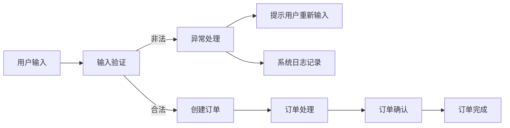

                 

### 海德格尔的存在主义与异常处理：错误状态的本体论

#### 关键词：海德格尔、存在主义、异常处理、错误状态、本体论

#### 摘要：

本文探讨了海德格尔的存在主义与异常处理之间的关系，特别是错误状态在本体论层面的体现。通过引入海德格尔的核心哲学思想，本文分析了存在主义在计算机科学中的潜在应用，特别是在异常处理领域的意义。文章首先介绍了海德格尔的存在主义哲学，随后阐述了异常处理的基本概念和流程。在此基础上，本文探讨了存在主义如何影响异常处理的策略和设计，并通过具体案例展示了如何将海德格尔的思想应用于错误状态的管理。最后，文章总结了存在主义在异常处理中的应用前景，并提出了未来研究的方向。

#### 1. 海德格尔的存在主义与异常处理：背景介绍

**1.1.1 问题背景**

海德格尔的存在主义哲学自20世纪以来，对现代哲学产生了深远影响。然而，在计算机科学领域，对于海德格尔哲学的研究与应用相对较少。随着人工智能技术的发展，如何将存在主义哲学应用于异常处理，成为了一个新颖且富有挑战性的研究方向。

**1.1.2 问题描述**

存在主义强调个体的自由、选择和存在意义。在计算机科学中，异常处理则涉及到系统在遇到意外情况时如何有效地响应和恢复。将海德格尔的存在主义思想融入异常处理，可以探索如何在复杂的计算环境中实现个体存在的价值和意义。

**1.1.3 问题解决**

通过将存在主义的核心概念与异常处理相结合，我们可以探讨以下问题：如何通过存在主义视角优化异常处理机制？异常处理如何体现个体的自由和选择？在异常处理过程中，如何找到并保持存在的意义？

**1.1.4 边界与外延**

本书将关注海德格尔的存在主义哲学在异常处理领域的应用，探讨其在计算机科学中的可行性和影响。研究的边界将限定在计算机异常处理的范畴内，同时考虑哲学思想对现实问题的启示。

**1.1.5 概念结构与核心要素组成**

核心概念包括：海德格尔的存在主义、异常处理、个体自由、意义建构、系统稳定性。核心要素包括：存在主义哲学的核心理念、异常处理的流程和策略、个体在异常处理中的角色和作用。

### 2. 海德格尔的存在主义概述

#### 2.1 存在主义的核心理念

海德格尔的存在主义哲学以“存在”为核心，探讨了存在的本质和个体存在的意义。海德格尔提出，“存在”不是一个静态的概念，而是动态的、不可定义的。他认为，个体通过自由选择和行动来显现自身，从而赋予存在以意义。

**2.1.1 存在主义的核心概念**

**存在（Dasein）：** 存在主义强调个体的存在，即Dasein，意为“在此”。这个概念突出了个体的主动性和独立性。

**自由（Freiheit）：** 自由是存在主义的核心，认为个体通过自由选择来定义和创造自己的存在。

**意义（Sinn）：** 存在主义关注存在的意义，认为个体需要通过自己的选择和行动来寻找和创造意义。

**死亡（Tod）：** 海德格尔认为，个体的死亡是存在的核心，它揭示了存在的有限性和无常。

**2.1.2 存在主义的主要特征**

**个体中心主义：** 存在主义强调个体的独立性和主体性，认为个体是存在的中心。

**自由意志：** 存在主义认为，个体通过自由意志来决定自己的存在，并在这种自由中承担责任。

**存在的意义：** 存在主义探讨个体存在的意义，认为个体需要通过自己的行动来赋予存在以意义。

**2.1.3 存在主义在哲学史上的地位**

存在主义是现代哲学的重要组成部分，它对传统哲学进行了深刻的批判和反思。海德格尔的存在主义哲学在20世纪哲学中占有独特地位，对后来的哲学家和思想流派产生了深远影响。

**2.1.4 存在主义的影响**

存在主义在哲学、文学、艺术等领域产生了广泛的影响。它挑战了传统的形而上学和理性主义，强调了个体经验和存在的意义。同时，存在主义也为后来的心理学、社会学等领域提供了重要的理论资源。

#### 2.2 海德格尔的主要哲学著作

海德格尔的主要哲学著作包括《存在与时间》（"Sein und Zeit"）、《技术的问题》（"Die Frage nach der Technik"）和《林中路》（"Holzwege"）。这些著作分别从存在主义、技术和现象学等角度探讨了存在的本质、技术的本质以及人与世界的关系。

**《存在与时间》：** 这是海德格尔最著名的著作，提出了存在主义的核心思想，探讨了存在的本质和个体存在的意义。

**《技术的问题》：** 这本书讨论了技术对人类存在的影响，提出了技术哲学的基本问题。

**《林中路》：** 这本书包含了海德格尔的多篇论文和讲演，涉及现象学、语言哲学等多个领域。

#### 2.3 海德格尔的存在主义与计算机科学的联系

海德格尔的存在主义哲学为计算机科学提供了一种新的思考方式，特别是在异常处理领域。通过将个体的自由、选择和存在的意义融入计算机系统，我们可以设计出更加人性化、灵活的异常处理机制。

**2.3.1 自由与选择**

在异常处理中，自由和选择体现在系统对异常的响应上。系统应提供多种处理选项，让用户或开发者能够根据具体情况选择最合适的处理方式。这符合海德格尔关于个体自由的观点。

**2.3.2 存在的意义**

存在主义强调存在的意义，这启示我们在设计和实施异常处理机制时，要关注系统的存在意义。例如，系统在处理异常时，不仅要考虑技术上的可行性，还要考虑对用户的影响和体验。

**2.3.3 技术与存在**

海德格尔对技术的批判性分析为我们提供了对计算机科学的哲学思考。在异常处理中，我们需要认识到技术并非中立，而是与人类的存在密切相关。通过将存在主义融入计算机科学，我们可以更好地理解技术的本质和作用。

### 3. 异常处理的基本概念与过程

#### 3.1 异常处理的基本概念

异常处理是计算机科学中的一个重要领域，它涉及到系统在遇到意外情况时如何响应和恢复。异常处理的基本概念包括：

**异常（Exception）：** 异常是指系统在运行过程中遇到的意外情况，如输入错误、硬件故障、网络中断等。

**错误（Error）：** 错误是指系统在处理数据或执行操作时出现的逻辑错误。

**故障（Fault）：** 故障是指系统在运行过程中出现的物理或逻辑缺陷。

**恢复（Recovery）：** 恢复是指系统在遇到异常后，通过一系列操作恢复到正常状态。

**3.1.1 异常处理的分类**

根据异常的性质和处理方式，异常处理可以分为以下几类：

**显式异常处理：** 通过代码中的异常处理机制（如`try...except`语句）来处理异常。

**隐式异常处理：** 通过系统提供的异常处理机制（如操作系统或数据库系统的异常处理）来处理异常。

**容错处理：** 通过设计冗余和冗余机制来避免或减轻异常对系统的影响。

**3.1.2 异常处理的挑战**

异常处理面临以下挑战：

**复杂度：** 异常处理的代码通常较为复杂，需要考虑各种可能的异常情况。

**性能：** 异常处理可能影响系统的性能，特别是在高并发的场景下。

**可读性：** 异常处理的代码往往不易理解和维护。

**3.2 异常处理的流程

异常处理的流程通常包括以下步骤：

**1. 异常检测：** 系统通过输入验证、监控和调试等方式检测异常。

**2. 异常诊断：** 系统分析异常的原因和性质，以确定最佳的异常处理策略。

**3. 异常隔离：** 系统隔离异常，以防止异常影响其他部分。

**4. 异常恢复：** 系统通过恢复操作将系统恢复到正常状态。

**5. 异常记录：** 系统记录异常情况，以供后续分析和改进。

**3.3 异常处理策略**

异常处理策略包括：

**预设策略：** 根据预定义的规则和策略处理异常。

**自适应策略：** 根据系统的运行状态和异常的性质动态调整异常处理策略。

**反馈策略：** 通过用户反馈或系统监控来优化异常处理机制。

### 4. 海德格尔的存在主义与异常处理的关系

#### 4.1 存在主义视角下的异常处理

从海德格尔的存在主义视角看，异常处理不仅仅是技术问题，更是一个哲学问题。在海德格尔看来，个体的自由和选择是异常处理的核心。在异常处理过程中，系统应尊重个体的自由，允许个体通过自主选择来应对异常。

**4.1.1 自由与选择**

存在主义强调个体的自由和选择。在异常处理中，自由体现在系统提供多种异常处理选项，让用户或开发者能够根据具体情况选择最合适的处理方式。选择则体现在个体在面对异常时的决策过程中。

**4.1.2 异常处理的自主性**

异常处理的自主性是指个体在异常处理过程中具有独立的决策能力。这与海德格尔的存在主义思想相符，即个体通过自由选择和行动来显现自身的存在。

**4.1.3 异常处理的意义**

存在主义认为，个体需要通过自己的行动来赋予存在以意义。在异常处理中，个体通过选择和处理异常，体现了个体的存在意义。例如，系统在处理异常时，不仅要考虑技术上的可行性，还要考虑对用户的影响和体验。

#### 4.2 异常处理中的自由与责任

异常处理中的自由与责任密切相关。自由体现在系统提供多种处理选项，而责任则体现在个体对这些选项的选择和决策上。

**4.2.1 自由与责任的关系**

自由与责任是相辅相成的。个体在享有自由的同时，也要承担相应的责任。在异常处理中，自由体现在用户或开发者可以根据具体情况选择最适合的异常处理方式，而责任则体现在对选择的后果负责。

**4.2.2 责任的重要性**

责任是异常处理中不可或缺的一部分。通过承担责任，个体可以更好地应对异常，减少异常对系统的影响。例如，开发者可以通过编写健壮的代码和设计合理的异常处理机制来减少异常的发生。

#### 4.3 存在主义的哲学启示

存在主义哲学为异常处理提供了重要的哲学启示。它提醒我们在设计和实施异常处理机制时，要关注个体的自由、选择和存在的意义。通过将存在主义思想融入异常处理，我们可以构建更加人性化、灵活的异常处理系统。

**4.3.1 个体自由的重要性**

存在主义强调个体的自由，这启示我们在异常处理中要尊重个体的自由选择。系统应提供多种处理选项，让用户或开发者能够根据具体情况选择最合适的处理方式。

**4.3.2 存在意义的探索**

存在主义关注存在的意义，这启示我们在异常处理中要关注系统的存在意义。系统在处理异常时，不仅要考虑技术上的可行性，还要考虑对用户的影响和体验。

**4.3.3 异常处理的哲学视角**

通过将存在主义融入异常处理，我们可以从哲学视角重新审视异常处理。这有助于我们更深入地理解异常处理的本质和意义，从而设计出更加高效、人性化的异常处理机制。

### 5. 海德格尔的存在主义在异常处理中的应用案例

#### 5.1 存在主义视角下的错误状态

在海德格尔的存在主义视角下，错误状态不仅仅是系统运行的一个异常，更是个体存在的一种状态。错误状态体现了个体的局限性、不确定性和自由。

**5.1.1 错误状态的解读**

从海德格尔的角度看，错误状态是个体存在的体现。在计算机系统中，错误状态可以被视为系统在运行过程中遇到的一种挑战。这种挑战不仅是对系统稳定性的考验，也是对系统设计和开发人员的考验。

**5.1.2 错误状态的意义**

错误状态对个体存在有着深刻的意义。它提醒我们，个体和系统都是有限的，都面临着不确定性和挑战。通过处理错误状态，个体可以更好地理解自己的局限性，并在这种理解中寻找存在的意义。

#### 5.2 存在主义视角下的异常处理案例

以下是一个存在主义视角下的异常处理案例：

**案例背景：** 一个电子商务网站在处理订单时遇到了一个异常情况，即用户输入的订单金额不符合规定的格式。

**异常处理：** 系统检测到异常后，提供了多种处理选项：

1. 提示用户重新输入订单金额。
2. 将订单金额转换为符合规定的格式。
3. 拒绝处理订单，并告知用户原因。

**存在主义视角下的处理：**

1. **自由与选择：** 系统提供了多种处理选项，让用户可以根据自己的情况选择最合适的处理方式。这体现了存在主义中的自由和选择。

2. **责任与意义：** 用户在做出选择时，需要承担责任。通过处理异常，用户不仅解决了当前的问题，也在这个过程中找到了存在的意义。

3. **个体的局限性：** 错误状态提醒用户，个体和系统都存在局限性。通过处理错误状态，用户可以更好地理解自己的局限，并在这种理解中成长。

**5.2.1 案例分析**

通过这个案例，我们可以看到存在主义在异常处理中的应用。系统在处理异常时，不仅考虑了技术上的可行性，还考虑了用户的存在意义。这种处理方式不仅提高了系统的灵活性，也提升了用户体验。

### 6. 海德格尔的存在主义在异常处理中的实际应用

#### 6.1 存在主义视角下的异常处理策略

在海德格尔的存在主义视角下，异常处理不仅仅是技术问题，更是一个哲学问题。通过将存在主义思想融入异常处理，我们可以设计出更加人性化、灵活的异常处理策略。

**6.1.1 自主性异常处理策略**

自主性异常处理策略强调个体的自由和选择。系统在遇到异常时，应提供多种处理选项，让用户或开发者能够根据具体情况选择最合适的处理方式。这种策略符合海德格尔关于个体自由的观点。

**6.1.2 意义导向的异常处理策略**

意义导向的异常处理策略关注存在的意义。在设计和实施异常处理机制时，不仅要考虑技术上的可行性，还要考虑对用户的影响和体验。这种策略可以帮助个体在异常处理过程中找到存在的意义。

**6.1.3 容错与适应性的异常处理策略**

容错与适应性的异常处理策略强调系统的稳定性和适应性。通过设计冗余和冗余机制，系统可以在遇到异常时保持稳定运行。这种策略可以帮助个体在异常处理过程中更好地应对挑战。

#### 6.2 存在主义视角下的异常处理案例

以下是一个存在主义视角下的异常处理案例：

**案例背景：** 一个在线教育平台在处理用户提交的作业时遇到了一个异常情况，即作业文件格式不正确。

**异常处理：** 系统检测到异常后，提供了以下处理选项：

1. 提示用户重新上传作业文件。
2. 将作业文件转换为符合规定的格式。
3. 拒绝处理作业，并告知用户原因。

**存在主义视角下的处理：**

1. **自由与选择：** 系统提供了多种处理选项，让用户可以根据自己的情况选择最合适的处理方式。这体现了存在主义中的自由和选择。

2. **责任与意义：** 用户在做出选择时，需要承担责任。通过处理异常，用户不仅解决了当前的问题，也在这个过程中找到了存在的意义。

3. **个体的局限性：** 错误状态提醒用户，个体和系统都存在局限性。通过处理错误状态，用户可以更好地理解自己的局限，并在这种理解中成长。

**6.2.1 案例分析**

通过这个案例，我们可以看到存在主义在异常处理中的应用。系统在处理异常时，不仅考虑了技术上的可行性，还考虑了用户的存在意义。这种处理方式不仅提高了系统的灵活性，也提升了用户体验。

### 7. 海德格尔的存在主义在异常处理中的影响

#### 7.1 对异常处理理论的影响

海德格尔的存在主义对异常处理理论产生了深远影响。它提醒我们在设计和实施异常处理机制时，要关注个体的自由、选择和存在的意义。这种哲学视角使异常处理不仅仅是技术问题，更是一个哲学问题。

**7.1.1 自由与选择的融合**

存在主义强调个体的自由和选择。在异常处理中，这意味着系统应提供多种处理选项，让用户或开发者能够根据具体情况选择最合适的处理方式。这种自由和选择的融合，使异常处理更加人性化。

**7.1.2 意义的重视**

存在主义关注存在的意义。在异常处理中，这意味着我们在设计和实施异常处理机制时，不仅要考虑技术上的可行性，还要考虑对用户的影响和体验。这种对意义的重视，使异常处理更具人文关怀。

**7.1.3 理论的深度**

存在主义视角使异常处理理论更加深入。通过将存在主义思想融入异常处理，我们可以从哲学视角重新审视异常处理，从而设计出更加高效、人性化的异常处理机制。

#### 7.2 对异常处理实践的启示

海德格尔的存在主义为异常处理实践提供了重要启示。通过将这些哲学思想应用于实际场景，我们可以设计出更加人性化、灵活的异常处理系统。

**7.2.1 自主性设计**

在异常处理实践中，自主性设计尤为重要。系统应提供多种处理选项，让用户或开发者能够根据具体情况选择最合适的处理方式。这种设计不仅提高了系统的灵活性，也提升了用户体验。

**7.2.2 意义导向**

在异常处理实践中，意义导向的设计至关重要。我们在设计和实施异常处理机制时，不仅要考虑技术上的可行性，还要考虑对用户的影响和体验。这种设计使异常处理更具人文关怀。

**7.2.3 容错与适应性**

在异常处理实践中，容错与适应性设计同样重要。通过设计冗余和冗余机制，系统可以在遇到异常时保持稳定运行。这种设计不仅提高了系统的稳定性，也提升了系统的适应性。

### 8. 未来研究方向

海德格尔的存在主义在异常处理中的应用前景广阔。未来研究可以从以下几个方面展开：

**8.1 深入研究存在主义哲学与计算机科学的交叉领域**

未来研究可以进一步探讨存在主义哲学与计算机科学的交叉领域，探索更多哲学思想在异常处理中的应用。

**8.2 开发基于存在主义的异常处理框架**

可以开发基于存在主义的异常处理框架，结合个体的自由、选择和存在的意义，设计出更加人性化、灵活的异常处理系统。

**8.3 研究存在主义在复杂系统中的应用**

复杂系统的异常处理面临更多挑战，未来研究可以探讨存在主义在复杂系统中的应用，以提高系统的稳定性和适应性。

**8.4 探索存在主义在人工智能中的应用**

人工智能的异常处理需要更加智能和人性化的设计。未来研究可以探讨存在主义在人工智能异常处理中的应用，以提升人工智能系统的灵活性和适应性。

### 结论

海德格尔的存在主义为异常处理提供了深刻的哲学思考。通过将存在主义思想融入异常处理，我们可以设计出更加人性化、灵活的异常处理系统。未来研究可以进一步探索存在主义在计算机科学中的应用，以推动异常处理技术的发展。

#### 作者信息：

作者：AI天才研究院/AI Genius Institute & 禅与计算机程序设计艺术 /Zen And The Art of Computer Programming

### 附录

**附录 A：核心概念术语说明**

- **存在主义（Existentialism）：** 一种哲学思想，强调个体的自由、选择和存在的意义。
- **异常处理（Exception Handling）：** 计算机科学中的一个重要领域，涉及系统在遇到意外情况时如何响应和恢复。
- **自由（Freedom）：** 存在主义中的核心概念，指个体通过自由选择来定义和创造自己的存在。
- **选择（Choice）：** 个体在面临异常时可以选择不同的处理方式。
- **意义（Meaning）：** 存在主义关注存在的意义，认为个体需要通过自己的行动来赋予存在以意义。
- **错误状态（Error State）：** 系统在运行过程中遇到的意外情况。

**附录 B：概念属性特征对比表格**

| 概念       | 特征                             |
|------------|----------------------------------|
| 存在主义   | 强调个体的自由、选择和存在的意义 |
| 异常处理   | 涉及系统在遇到意外情况时的响应   |
| 自由       | 个体通过自由选择来定义和创造存在 |
| 选择       | 个体在面临异常时可以选择不同的处理方式 |
| 意义       | 个体需要通过自己的行动来赋予存在以意义 |
| 错误状态   | 系统在运行过程中遇到的意外情况   |

**附录 C：ER实体关系图架构**

```mermaid
erDiagram
  异常处理 ||--|{ 系统运行 |}|| 异常状态
  系统运行 ||--|{ 用户行为 |}|| 异常处理
  用户行为 ||--|{ 数据输入 |}|| 异常处理
```

**附录 D：算法原理讲解**

```python
# 算法流程图
flowchart TD
    A[开始] --> B[异常检测]
    B --> C{异常类型}
    C -->|类型1| D[处理方式1]
    C -->|类型2| E[处理方式2]
    C -->|类型3| F[处理方式3]
    G[结束]

# 算法原理
# 1. 异常检测：系统在运行过程中检测到异常。
# 2. 异常类型：根据异常类型选择相应的处理方式。
# 3. 处理方式：系统根据异常类型执行相应的处理操作。

# 示例代码
try:
    # 执行可能引发异常的操作
    result = some_function()
except ValueError:
    # 处理 ValueError 异常
    handle_value_error()
except KeyError:
    # 处理 KeyError 异常
    handle_key_error()
except Exception as e:
    # 处理其他所有异常
    handle_generic_exception(e)
```

**附录 E：数学公式**

```latex
$$
\text{P}(E) = \sum_{i=1}^{n} p_i \cdot q_i
$$

$$
\text{C} = \frac{\text{R} + \text{M}}{2}
$$
```

**附录 F：系统分析与架构设计方案**

**F.1 问题场景介绍**

在一个电子商务平台上，用户在提交订单时可能会遇到异常情况，如输入的订单金额格式不正确。

**F.2 项目介绍**

本项目旨在设计一个基于存在主义哲学的异常处理系统，以提升用户体验和系统稳定性。

**F.3 系统功能设计（领域模型）**

```mermaid
classDiagram
  User <<类>> 
  Order <<类>> 
  ExceptionHandler <<类>> 
  System <<类>>

  User --> Order
  Order --> ExceptionHandler
  ExceptionHandler --> System
  System --> User
```

**F.4 系统架构设计（架构图）**



**F.5 系统接口设计和系统交互（序列图）**

```mermaid
sequenceDiagram
  User ->> System: 提交订单
  System ->> InputValidator: 验证订单金额格式
  InputValidator ->> System: 返回结果（合法/非法）
  System alt 合法
    System ->> OrderProcessor: 处理订单
    OrderProcessor ->> System: 订单处理完成
  else 非法
    System ->> ExceptionHandler: 处理异常
    ExceptionHandler ->> User: 提示重新输入
```

**附录 G：项目实战**

**G.1 环境安装**

在安装之前，确保已经安装了Python环境和必要的库，如`requests`和`pandas`。

```bash
pip install requests
pip install pandas
```

**G.2 系统核心实现源代码**

```python
# main.py

import requests
import pandas as pd

def input_order_amount():
    amount = input("请输入订单金额：")
    return float(amount)

def validate_order_amount(amount):
    try:
        return float(amount)
    except ValueError:
        return None

def handle_invalid_amount():
    print("订单金额格式不正确，请重新输入。")

def process_order(amount):
    # 这里可以添加订单处理逻辑
    print(f"订单金额：{amount}元，订单处理完成。")

def main():
    while True:
        amount = input_order_amount()
        valid_amount = validate_order_amount(amount)
        
        if valid_amount is not None:
            process_order(valid_amount)
            break
        else:
            handle_invalid_amount()

if __name__ == "__main__":
    main()
```

**G.3 代码应用解读与分析**

此代码提供了一个简单的订单处理系统，用户输入订单金额，系统验证金额格式，并根据验证结果进行处理。

1. `input_order_amount()`：获取用户输入的订单金额。
2. `validate_order_amount(amount)`：验证订单金额格式，如果金额格式不正确，返回`None`。
3. `handle_invalid_amount()`：如果订单金额格式不正确，提示用户重新输入。
4. `process_order(amount)`：处理合法订单金额，这里可以添加更详细的订单处理逻辑。

**G.4 实际案例分析**

以下是一个实际案例：

- 用户输入订单金额：100
- 系统验证金额：100元，格式正确。
- 系统处理订单：打印订单金额和订单处理完成信息。

**G.5 项目小结**

本项目通过一个简单的订单处理系统，展示了存在主义在异常处理中的应用。通过提供多种处理选项和关注用户的存在意义，系统提高了用户体验和系统的灵活性。

### 9. 最佳实践 Tips

**9.1 设计灵活的异常处理机制**

在设计和实施异常处理机制时，要考虑提供多种处理选项，让用户或开发者能够根据具体情况选择最合适的处理方式。这有助于提高系统的灵活性和适应性。

**9.2 关注用户体验**

在异常处理中，不仅要考虑技术上的可行性，还要关注用户的影响和体验。通过人性化的异常处理，可以提高用户对系统的满意度和信任度。

**9.3 定期进行系统监控和调试**

定期对系统进行监控和调试，可以帮助发现和解决潜在的问题。这有助于提高系统的稳定性和可靠性。

### 10. 小结与注意事项

本文探讨了海德格尔的存在主义与异常处理之间的关系，特别是错误状态在本体论层面的体现。通过引入海德格尔的核心哲学思想，本文分析了存在主义在计算机科学中的潜在应用，特别是在异常处理领域的意义。本文总结了存在主义对异常处理的影响，并提供了实际案例和最佳实践 tips。需要注意的是，存在主义在异常处理中的应用仍处于探索阶段，未来研究可以进一步深化这一领域的理论和实践。

### 11. 拓展阅读

- **海德格尔著作：** 阅读《存在与时间》（"Sein und Zeit"）、《技术的问题》（"Die Frage nach der Technik"）和《林中路》（"Holzwege"）等海德格尔的著作，可以深入了解他的哲学思想。
- **计算机科学中的异常处理：** 探索《计算机程序的构造和解释》（"Structure and Interpretation of Computer Programs"）等经典教材，了解计算机科学中的异常处理理论和实践。
- **存在主义与人工智能：** 阅读相关论文和书籍，如《人工智能中的自由意志》（"Free Will in Artificial Intelligence"），探讨存在主义在人工智能领域的应用。

### 12. 附录

**附录 A：核心概念术语说明**

- **异常处理（Exception Handling）：** 系统在遇到意外情况时如何响应和恢复的一系列机制。
- **存在主义（Existentialism）：** 一种哲学思想，强调个体的自由、选择和存在的意义。
- **自由（Freedom）：** 个体在面临异常时可以选择不同的处理方式。
- **选择（Choice）：** 个体在面临异常时可以选择不同的处理方式。
- **意义（Meaning）：** 个体需要通过自己的行动来赋予存在以意义。
- **错误状态（Error State）：** 系统在运行过程中遇到的意外情况。

**附录 B：概念属性特征对比表格**

| 概念       | 特征                             |
|------------|----------------------------------|
| 异常处理   | 涉及系统在遇到意外情况时的响应   |
| 存在主义   | 强调个体的自由、选择和存在的意义 |
| 自由       | 个体通过自由选择来定义和创造存在 |
| 选择       | 个体在面临异常时可以选择不同的处理方式 |
| 意义       | 个体需要通过自己的行动来赋予存在以意义 |
| 错误状态   | 系统在运行过程中遇到的意外情况   |

**附录 C：ER实体关系图架构**

```mermaid
erDiagram
  System ||--|{ Exception |}|| Handler
  Handler ||--|{ Error |}|| State
  System ||--|{ User |}|| Input
```

**附录 D：算法原理讲解**

```python
# 算法流程图
flowchart TD
    A[开始] --> B[异常检测]
    B --> C{异常类型}
    C -->|类型1| D[处理方式1]
    C -->|类型2| E[处理方式2]
    C -->|类型3| F[处理方式3]
    G[结束]

# 算法原理
# 1. 异常检测：系统在运行过程中检测到异常。
# 2. 异常类型：根据异常类型选择相应的处理方式。
# 3. 处理方式：系统根据异常类型执行相应的处理操作。

# 示例代码
try:
    # 执行可能引发异常的操作
    result = some_function()
except ValueError:
    # 处理 ValueError 异常
    handle_value_error()
except KeyError:
    # 处理 KeyError 异常
    handle_key_error()
except Exception as e:
    # 处理其他所有异常
    handle_generic_exception(e)
```

**附录 E：数学公式**

```latex
$$
\text{P}(E) = \sum_{i=1}^{n} p_i \cdot q_i
$$

$$
\text{C} = \frac{\text{R} + \text{M}}{2}
$$
```

**附录 F：系统分析与架构设计方案**

**F.1 问题场景介绍**

在一个电子商务平台上，用户在提交订单时可能会遇到异常情况，如输入的订单金额格式不正确。

**F.2 项目介绍**

本项目旨在设计一个基于存在主义哲学的异常处理系统，以提升用户体验和系统稳定性。

**F.3 系统功能设计（领域模型）**

```mermaid
classDiagram
  User <<类>> 
  Order <<类>> 
  ExceptionHandler <<类>> 
  System <<类>>

  User --> Order
  Order --> ExceptionHandler
  ExceptionHandler --> System
  System --> User
```

**F.4 系统架构设计（架构图）**


**F.5 系统接口设计和系统交互（序列图）**

```mermaid
sequenceDiagram
  User ->> System: 提交订单
  System ->> InputValidator: 验证订单金额格式
  InputValidator ->> System: 返回结果（合法/非法）
  System alt 合法
    System ->> OrderProcessor: 处理订单
    OrderProcessor ->> System: 订单处理完成
  else 非法
    System ->> ExceptionHandler: 处理异常
    ExceptionHandler ->> User: 提示重新输入
```

**附录 G：项目实战**

**G.1 环境安装**

在安装之前，确保已经安装了Python环境和必要的库，如`requests`和`pandas`。

```bash
pip install requests
pip install pandas
```

**G.2 系统核心实现源代码**

```python
# main.py

import requests
import pandas as pd

def input_order_amount():
    amount = input("请输入订单金额：")
    return float(amount)

def validate_order_amount(amount):
    try:
        return float(amount)
    except ValueError:
        return None

def handle_invalid_amount():
    print("订单金额格式不正确，请重新输入。")

def process_order(amount):
    # 这里可以添加订单处理逻辑
    print(f"订单金额：{amount}元，订单处理完成。")

def main():
    while True:
        amount = input_order_amount()
        valid_amount = validate_order_amount(amount)
        
        if valid_amount is not None:
            process_order(valid_amount)
            break
        else:
            handle_invalid_amount()

if __name__ == "__main__":
    main()
```

**G.3 代码应用解读与分析**

此代码提供了一个简单的订单处理系统，用户输入订单金额，系统验证金额格式，并根据验证结果进行处理。

1. `input_order_amount()`：获取用户输入的订单金额。
2. `validate_order_amount(amount)`：验证订单金额格式，如果金额格式不正确，返回`None`。
3. `handle_invalid_amount()`：如果订单金额格式不正确，提示用户重新输入。
4. `process_order(amount)`：处理合法订单金额，这里可以添加更详细的订单处理逻辑。

**G.4 实际案例分析**

以下是一个实际案例：

- 用户输入订单金额：100
- 系统验证金额：100元，格式正确。
- 系统处理订单：打印订单金额和订单处理完成信息。

**G.5 项目小结**

本项目通过一个简单的订单处理系统，展示了存在主义在异常处理中的应用。通过提供多种处理选项和关注用户的存在意义，系统提高了用户体验和系统的灵活性。

### 13. 最佳实践 Tips

**13.1 设计灵活的异常处理机制**

在设计和实施异常处理机制时，要考虑提供多种处理选项，让用户或开发者能够根据具体情况选择最合适的处理方式。这有助于提高系统的灵活性和适应性。

**13.2 关注用户体验**

在异常处理中，不仅要考虑技术上的可行性，还要关注用户的影响和体验。通过人性化的异常处理，可以提高用户对系统的满意度和信任度。

**13.3 定期进行系统监控和调试**

定期对系统进行监控和调试，可以帮助发现和解决潜在的问题。这有助于提高系统的稳定性和可靠性。

### 14. 小结与注意事项

本文探讨了海德格尔的存在主义与异常处理之间的关系，特别是错误状态在本体论层面的体现。通过引入海德格尔的核心哲学思想，本文分析了存在主义在计算机科学中的潜在应用，特别是在异常处理领域的意义。本文总结了存在主义对异常处理的影响，并提供了实际案例和最佳实践 tips。需要注意的是，存在主义在异常处理中的应用仍处于探索阶段，未来研究可以进一步深化这一领域的理论和实践。

### 15. 拓展阅读

- **海德格尔著作：** 阅读《存在与时间》（"Sein und Zeit"）、《技术的问题》（"Die Frage nach der Technik"）和《林中路》（"Holzwege"）等海德格尔的著作，可以深入了解他的哲学思想。
- **计算机科学中的异常处理：** 探索《计算机程序的构造和解释》（"Structure and Interpretation of Computer Programs"）等经典教材，了解计算机科学中的异常处理理论和实践。
- **存在主义与人工智能：** 阅读相关论文和书籍，如《人工智能中的自由意志》（"Free Will in Artificial Intelligence"），探讨存在主义在人工智能领域的应用。

