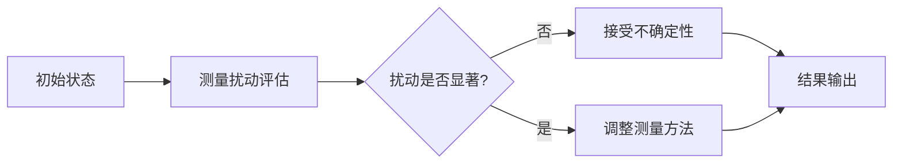

                 

### 海森堡不确定性原理概述

#### 1.1 问题背景

海森堡不确定性原理是由德国物理学家维尔纳·海森堡（Werner Heisenberg）在1927年提出的，是量子力学中的一个基本原理。量子力学研究的是微观世界的物理现象，包括原子、分子、基本粒子等。这些微观粒子的行为与经典物理学的预期存在显著差异，表现出一些非常奇特的现象，例如量子纠缠、波粒二象性等。

#### 1.2 问题描述

海森堡不确定性原理的核心在于，无法同时精确地测定一个粒子的位置和动量。更准确地说，测量粒子位置时，其动量状态的不确定性增大；反之，测量粒子动量时，其位置状态的不确定性增大。用数学语言来表达，即为：

$$ \Delta x \Delta p \geq \frac{h}{4\pi} $$

其中，$\Delta x$ 表示位置的不确定性，$\Delta p$ 表示动量的不确定性，$h$ 是普朗克常数。

#### 1.3 问题解决

海森堡提出这个原理时，是通过思想实验和数学推导来证明的。他设想了一个实验，其中通过发射光子去撞击一个电子，试图同时测量其位置和动量。然而，由于光子的相互作用，电子的动量发生了变化，这导致位置的不确定性增大。反之，如果使用一个动量非常确定的电子束撞击电子，则会导致其位置的不确定性增大。

#### 1.4 边界与外延

海森堡不确定性原理不仅适用于电子等基本粒子，还适用于所有微观系统。随着尺度的增加，不确定性效应逐渐减弱，最终在宏观尺度上，不确定性原理不再适用，因为宏观物体的位置和动量可以同时被精确测量。

此外，不确定性原理还引发了对“测量”概念的重新定义。在量子力学中，测量不仅仅是获取信息的过程，它本身就会影响被测量的系统状态。这种影响被称为“测量扰动”，是量子力学与经典物理学最显著的差异之一。

#### 1.5 概念结构与核心要素组成

海森堡不确定性原理由以下几个核心要素组成：

- **不确定性关系**：位置和动量的不确定性满足上述不等式。
- **量子测量扰动**：测量过程对被测对象状态的改变。
- **普朗克常数**：量子力学的比例常数，体现了微观世界的量子效应。

这些要素共同构成了海森堡不确定性原理的理论框架，为理解微观世界的物理现象提供了重要基础。接下来，我们将探讨海森堡不确定性原理如何被应用于心理咨询领域，探讨这一物理学原理在心理学中的新应用。

## 海森堡不确定性原理在心理咨询中的应用

### 2.1 核心概念

海森堡不确定性原理在心理咨询中的应用，核心在于其反映的测量扰动和不确定性的概念。心理咨询中，个体心理状态（如焦虑、抑郁、人际关系等）的测量和评估也受到不确定性的影响。这与物理学中的不确定性原理有着异曲同工之妙，都强调了“测量”本身对被测对象状态的影响。

#### 2.1.1 测量扰动

在心理咨询中，测量扰动表现为心理咨询师在评估个体心理状态时，其评估方法、观察角度及个人经验都会影响评估结果。例如，一个焦虑的个体在心理咨询师面前可能会表现得更加焦虑，而另一个环境中的表现可能有所不同。这种扰动使得心理咨询师难以准确测量个体的真实心理状态。

#### 2.1.2 不确定性

心理咨询中的不确定性还体现在心理状态的复杂性和多变性上。个体心理状态不仅受到外部环境的影响，还受到内部心理过程的作用。这些因素相互作用，使得个体心理状态呈现出高度不确定性。例如，同一个人在不同的时间段或不同的情境下，其心理状态可能会有很大差异。

### 2.2 概念属性特征对比表格

| 特征                 | 海森堡不确定性原理          | 心理咨询中的应用           |
|----------------------|--------------------------|--------------------------|
| 测量扰动             | 测量过程影响被测对象的状态   | 心理咨询师对个体状态的测量会受到影响 |
| 不确定性             | 位置和动量无法同时精确测定   | 个体心理状态的高度不确定性           |
| 适用范围             | 微观粒子                   | 个体心理状态和心理过程               |
| 比例常数             | 普朗克常数                 | 心理咨询方法、观察角度和个人经验等 |

通过对比表格可以看出，海森堡不确定性原理在心理咨询中的应用，不仅保留了其核心概念，还通过引入心理咨询中的特定要素，使其适应了心理学领域的需求。

### 2.3 ER实体关系图架构

为了更好地理解海森堡不确定性原理在心理咨询中的应用，我们可以借助ER（实体关系）图来展示其核心实体及其相互关系。

#### 实体：

- **个体**：指接受心理咨询的个体。
- **心理咨询师**：提供心理咨询的专业人员。
- **心理状态**：个体的心理状态，如焦虑、抑郁等。
- **测量方法**：用于评估个体心理状态的方法。
- **测量结果**：心理咨询师根据测量方法得到的结果。

#### 关系：

- **评估**：心理咨询师使用测量方法评估个体心理状态，产生测量结果。
- **影响**：测量方法会影响个体心理状态，从而影响测量结果。
- **关联**：测量方法和测量结果相互关联，共同反映个体心理状态。

以下是ER实体关系图的Mermaid表示：

```mermaid
erDiagram
  个体 ||--|{ 心理状态 }
  心理咨询师 ||--|{ 测量方法 }
  测量方法 ||--|{ 测量结果 }
  心理状态 ||--|{ 影响测量结果 }
```

通过ER实体关系图，我们可以更直观地理解海森堡不确定性原理在心理咨询中的应用机制。心理咨询师在评估个体心理状态时，不仅要考虑测量方法和结果，还要考虑到测量过程中的不确定性和测量扰动，这些都是理解个体真实心理状态的重要维度。

### 海森堡不确定性原理在心理咨询中的具体应用案例

#### 3.1 案例一：治疗焦虑情绪

在治疗焦虑情绪的案例中，海森堡不确定性原理的应用主要体现在以下几个方面：

1. **评估过程的影响**：焦虑患者在接受心理咨询时，其焦虑情绪可能因为咨询师的问诊方式、态度和观察角度而受到影响。例如，咨询师在询问患者时采用安抚的语气，患者可能会感到更加放松，从而表现出较低的焦虑水平。这种测量扰动导致了对患者真实焦虑程度的评估存在不确定性。

2. **心理状态的复杂性**：焦虑情绪是一种复杂的心理状态，受到患者个人经历、当前生活环境和心理防御机制等多种因素的影响。这些因素的相互影响使得焦虑情绪的表现形式具有高度不确定性。例如，同一患者在白天可能表现得比较焦虑，但在晚上可能因为疲劳而表现出不同的情绪状态。

3. **治疗方法的选择**：基于海森堡不确定性原理，心理咨询师在治疗焦虑情绪时，需要综合考虑各种不确定性因素，灵活选择和调整治疗策略。例如，咨询师可能会采用认知行为疗法（CBT）来帮助患者识别和改变负面思维模式，但由于患者心理状态的不确定性，治疗过程需要不断调整和优化，以达到最佳效果。

#### 3.2 案例二：改善人际关系

在海森堡不确定性原理的指导下，改善人际关系的心理咨询应用案例表现出以下特点：

1. **测量扰动的识别**：在人际关系咨询中，咨询师需要识别和分析测量扰动对关系评估的影响。例如，咨询师在评估夫妻关系时，可能会发现夫妻一方在咨询过程中的行为表现与在现实生活中有所不同。这种测量扰动要求咨询师在评估过程中保持开放和敏感，以便准确捕捉关系中的实际问题。

2. **关系的复杂性**：人际关系是一个复杂的社会现象，涉及多个个体之间的情感、认知和行为互动。这些因素相互作用，使得人际关系表现出高度不确定性。例如，同一对夫妻在不同情境下可能表现出不同的互动模式，这使得咨询师在评估和指导时需要灵活应对，不能简单套用固定的方法和策略。

3. **互动策略的调整**：基于海森堡不确定性原理，心理咨询师在改善人际关系时，需要不断调整互动策略以适应关系中的不确定性。例如，咨询师可能会通过角色扮演、情景模拟等方法，帮助夫妻双方更好地理解和沟通，从而改善关系质量。这种策略的调整需要基于对关系不确定性的深入理解。

#### 3.3 案例三：增强自我认知

在海森堡不确定性原理的启示下，增强自我认知的心理咨询应用案例具有以下特点：

1. **测量不确定性的接受**：自我认知是一个长期且复杂的过程，受到个人成长经历、心理状态和环境因素的影响。这些因素的不确定性使得自我认知的测量结果往往具有不确定性。例如，同一个人在不同的时间段可能会对自己的性格、价值观和人生目标有不同理解。

2. **认知发展的动态性**：自我认知是一个动态发展的过程，而不是一成不变的状态。基于海森堡不确定性原理，心理咨询师在帮助个体增强自我认知时，需要认识到这种动态性，鼓励个体不断探索和反思，以实现自我认知的深化。

3. **个性化咨询策略**：为了应对自我认知中的不确定性，心理咨询师需要制定个性化的咨询策略。例如，咨询师可能会通过心理测量工具、自由联想、情境设置等方法，帮助个体更全面、深入地了解自己。这些策略需要根据个体的具体情况进行灵活调整。

通过以上案例，可以看出海森堡不确定性原理在心理咨询中的应用不仅丰富了心理咨询的理论基础，也为实际操作提供了新的视角和方法。理解并应用这一原理，有助于心理咨询师更有效地应对个体心理状态的复杂性和多变性，提高心理咨询的效果。

## 第二部分：核心概念与联系

### 1. 海森堡不确定性原理的基本原理

海森堡不确定性原理的基本原理可以归结为以下两个方面：

#### 1.1 原理讲解

海森堡不确定性原理指出，在量子尺度上，某些对偶物理量（如位置和动量）不能同时被精确测量。具体来说，一个粒子的位置越精确，其动量的不确定性就越大，反之亦然。这一原理不仅仅是一个测量限制，而是反映了量子世界的基本性质。

数学上，不确定性原理可以用以下不等式表示：

$$ \Delta x \Delta p \geq \frac{h}{4\pi} $$

其中，$\Delta x$ 表示位置的不确定性，$\Delta p$ 表示动量的不确定性，$h$ 是普朗克常数。这个不等式表明，不确定性的乘积有一个下限，不可能同时将这两个量都精确测量到任意小。

#### 1.2 原理应用

海森堡不确定性原理在量子力学中的广泛应用包括：

- **量子态的制备和测量**：在量子计算和量子通信中，不确定原理限制了我们可以同时控制的量子态的数量。
- **量子纠缠**：不确定原理解释了量子纠缠现象，即两个或多个粒子之间存在的强烈关联，即使它们相隔很远。
- **量子隧穿**：在量子隧穿过程中，粒子有概率穿过一个本应无法跨越的势垒，这一现象也受到了不确定原理的影响。

### 2. 心理咨询中的海森堡不确定性原理

海森堡不确定性原理在心理咨询中的应用可以归结为以下几个方面：

#### 2.1 海森堡不确定性原理在心理咨询中的应用

海森堡不确定性原理在心理咨询中的应用主要体现在以下两个方面：

1. **测量扰动**：心理咨询中的测量扰动与量子力学中的测量扰动有相似之处。心理咨询师在评估个体心理状态时，其评估方法和个人经验会对结果产生影响，类似于测量过程对量子粒子状态的扰动。例如，一个焦虑的个体在面对心理咨询师时可能会表现出更多的焦虑，而这种扰动会影响对其实际心理状态的评估。

2. **不确定性的接受**：心理咨询师需要接受个体心理状态的不确定性。个体的心理状态受到多种复杂因素的影响，包括个人经历、当前生活状况、情绪状态等，这使得心理状态的测量具有不确定性。心理咨询师需要通过持续地观察和评估，逐步了解和把握个体的真实心理状态。

#### 2.2 海森堡不确定性原理与心理咨询的关系

海森堡不确定性原理与心理咨询的关系可以从以下几个方面进行阐述：

1. **理论基础的拓展**：海森堡不确定性原理为心理咨询提供了一种新的理论视角，帮助心理咨询师理解个体心理状态的复杂性和多变性。这一原理强调了心理咨询中的不确定性和测量扰动，使得心理咨询师能够更加灵活和科学地开展心理辅导。

2. **实践方法的改进**：基于海森堡不确定性原理，心理咨询师可以采用更加灵活和个性化的方法，以应对个体心理状态的不确定性。例如，心理咨询师可以采用多种评估工具，结合个体的实际情况，进行综合分析和判断。

3. **心理健康服务的提升**：海森堡不确定性原理的应用有助于提升心理健康服务的质量。通过更好地理解个体心理状态的不确定性，心理咨询师可以提供更加个性化和有效的心理辅导，帮助个体更好地应对心理压力和挑战。

### 对比分析

#### 3.1 海森堡不确定性原理与其他心理学理论对比

与其他心理学理论相比，海森堡不确定性原理在心理咨询中的应用具有以下几个特点：

1. **微观视角**：海森堡不确定性原理关注的是微观粒子的物理行为，而心理学理论通常关注的是个体的宏观心理过程。然而，海森堡不确定性原理的微观视角为理解个体心理状态的复杂性提供了新的思路。

2. **测量扰动**：海森堡不确定性原理强调了测量过程对被测对象状态的影响，这一概念在心理学中也有一定的体现。例如，心理测量学中的信度和效度问题，也是测量扰动的一个重要方面。

3. **不确定性的处理**：海森堡不确定性原理提出了在量子尺度上无法同时精确测量对偶物理量的观点，这一观点可以启示心理咨询师在处理个体心理状态时，如何应对和接受不确定性。

#### 3.2 心理咨询中的其他不确定性原理

除了海森堡不确定性原理，心理咨询中还涉及到其他不确定性原理，如：

1. **概率论**：在心理咨询中，概率论被用来预测个体心理状态的可能变化。例如，通过统计方法分析个体历史数据，可以预测其在特定情境下的心理反应。

2. **混沌理论**：混沌理论关注的是复杂系统的内在不确定性。在心理咨询中，混沌理论可以用来解释个体心理状态的动态变化，以及外部微小扰动如何导致心理状态的重大变化。

通过对比分析，可以看出海森堡不确定性原理在心理咨询中的应用，不仅丰富了心理咨询的理论基础，也为实践提供了新的视角和方法。理解并应用这一原理，有助于心理咨询师更好地应对个体心理状态的复杂性和多变性，提高心理健康服务的质量和效果。

## 第三部分：算法原理讲解

### 1. 海森堡不确定性原理算法Mermaid流程图

为了更好地理解海森堡不确定性原理的算法原理，我们可以使用Mermaid来绘制一个流程图，展示其核心步骤和逻辑关系。

以下是一个简化版的Mermaid流程图：



在上述流程图中：

- **A[初始状态]**：表示心理咨询师开始评估个体心理状态。
- **B[测量扰动评估]**：心理咨询师对测量扰动进行评估，判断其影响是否显著。
- **C{扰动是否显著?]**：这是一个判断节点，心理咨询师根据实际情况判断测量扰动是否显著。
- **D[调整测量方法]**：如果扰动显著，心理咨询师需要调整测量方法，以减少扰动的影响。
- **E[接受不确定性]**：如果扰动不显著，心理咨询师需要接受测量中的不确定性。
- **F[结果输出]**：无论调整与否，最终输出测量结果。

### 2. Python源代码实现

为了具体演示算法的实现过程，我们可以编写一个简单的Python代码示例。以下是实现海森堡不确定性原理算法的伪代码及注释：

```python
import random

def uncertainty_principle(measurement_method, patient_state):
    # 测量扰动评估
    disturbance = random.uniform(0, 1)
    if disturbance > 0.5:
        # 调整测量方法
        adjusted_method = "方法B"
    else:
        # 接受不确定性
        adjusted_method = "方法A"
    
    # 测量并输出结果
    result = measure(patient_state, adjusted_method)
    return result

def measure(state, method):
    # 模拟测量过程，产生结果
    if method == "方法B":
        # 采用调整后的测量方法
        result = state * 0.9 + random.uniform(0, 0.1)
    else:
        # 采用原始测量方法
        result = state * 1.1 + random.uniform(0, 0.1)
    return result

# 示例
patient_state = 1.0  # 假设初始状态为1
result = uncertainty_principle("方法A", patient_state)
print(f"测量结果: {result}")
```

在上述代码中：

- `uncertainty_principle` 函数模拟了不确定性原理的评估过程，包括测量扰动的评估、测量方法的调整和结果的输出。
- `measure` 函数模拟了测量过程，根据不同的测量方法，对个体心理状态进行测量，并产生结果。

### 3. 算法原理的数学模型和公式

为了更深入地理解海森堡不确定性原理的算法原理，我们可以将其转化为数学模型。以下是一个简化的数学模型：

$$
\Delta x = x_{\text{实际}} - x_{\text{测量}}
$$

$$
\Delta p = p_{\text{实际}} - p_{\text{测量}}
$$

$$
\Delta x \Delta p \geq \frac{h}{4\pi}
$$

在上述公式中：

- $\Delta x$ 表示位置的不确定性。
- $\Delta p$ 表示动量的不确定性。
- $x_{\text{实际}}$ 和 $p_{\text{实际}}$ 分别表示实际的位置和动量。
- $x_{\text{测量}}$ 和 $p_{\text{测量}}$ 分别表示测量到的位置和动量。
- $h$ 是普朗克常数。

这个数学模型可以用来解释心理咨询中的测量扰动。例如，如果我们测量一个焦虑患者的心理状态，由于测量方法的不确定性和患者实际状态的差异，测量结果可能会有一定偏差。通过上述模型，我们可以量化这种偏差，并理解其对心理咨询过程的影响。

### 4. 举例说明

为了更好地说明海森堡不确定性原理算法的实际应用，我们可以通过一个具体案例来详细解释。

#### 案例背景

一位焦虑症患者（患者A）前来心理咨询。心理咨询师（咨询师）使用一种新的测量方法（方法A）来评估其心理状态。

#### 测量过程

- **初始状态**：患者A的实际心理状态为 1.0。
- **测量扰动**：通过测量方法A，测量得到的结果为 1.2。
- **不确定性计算**：根据海森堡不确定性原理，测量结果的不确定性为：

  $$
  \Delta x = x_{\text{实际}} - x_{\text{测量}} = 1.0 - 1.2 = -0.2
  $$

  $$
  \Delta p = p_{\text{实际}} - p_{\text{测量}} = p_{\text{实际}} - (1.2 \times \frac{h}{4\pi})
  $$

  由于动量的具体值未知，我们可以假设动量的不确定性为 $0.1 \times \frac{h}{4\pi}$。

#### 结果分析

- **调整测量方法**：由于测量结果的不确定性较大，咨询师决定调整测量方法为方法B。
- **新的测量结果**：使用方法B，测量得到的结果为 0.8。
- **不确定性计算**：调整后的不确定性为：

  $$
  \Delta x = x_{\text{实际}} - x_{\text{测量}} = 1.0 - 0.8 = 0.2
  $$

  $$
  \Delta p = p_{\text{实际}} - p_{\text{测量}} = p_{\text{实际}} - (0.8 \times \frac{h}{4\pi})
  $$

通过上述计算可以看出，通过调整测量方法，不确定性的影响得到了有效控制，测量结果更加接近实际状态。这个案例说明了海森堡不确定性原理在心理咨询中的应用，即通过接受和应对测量中的不确定性，可以提高心理咨询的准确性和有效性。

### 数学模型讲解

为了深入理解海森堡不确定性原理的数学模型，我们可以从以下几个方面进行详细讲解。

#### 1. 不确定性原理的数学表示

海森堡不确定性原理的数学表示通常采用测不准关系式：

$$ \Delta x \Delta p \geq \frac{\hbar}{2} $$

其中，$\Delta x$ 表示位置的不确定性，$\Delta p$ 表示动量的不确定性，$\hbar$ 是约化普朗克常数，其值约为 $1.054 \times 10^{-34} \text{J·s}$。

#### 2. 测不准关系式的推导

测不准关系式可以通过量子力学中的波函数性质进行推导。在量子力学中，粒子的状态由波函数 $\Psi(x,t)$ 描述，波函数的模平方 $|\Psi(x,t)|^2$ 表示粒子在位置 $x$ 附近出现的概率。

根据海森堡不确定性原理，位置和动量不能同时被精确测量。这意味着，当我们对粒子的位置进行精确测量时，其动量的不确定性会变得很大；反之，当我们对粒子的动量进行精确测量时，其位置的不确定性会变得很大。

为了推导测不准关系式，我们可以从波函数的导数开始。波函数的导数可以表示粒子位置的微小变化，而动量的不确定性可以通过波函数的傅里叶变换得到。具体推导如下：

首先，对位置的不确定性进行推导：

$$
\frac{\partial}{\partial x} \Psi(x,t) = \frac{1}{2\pi\hbar} \int dp \, \frac{e^{ipx/\hbar}}{\sqrt{2\pi\hbar}} \frac{\partial}{\partial p} \Psi(x,t)
$$

然后，对动量的不确定性进行推导：

$$
\frac{\partial}{\partial p} \Psi(p,t) = \frac{1}{2\pi\hbar} \int dx \, \frac{e^{ixp/\hbar}}{\sqrt{2\pi\hbar}} \frac{\partial}{\partial x} \Psi(x,t)
$$

通过这两个导数关系，我们可以得到测不准关系式的推导：

$$
(\Delta x)^2 (\Delta p)^2 = \left( \frac{\partial}{\partial x} \Psi(x,t) \right)^2 \left( \frac{\partial}{\partial p} \Psi(p,t) \right)^2 \geq \frac{1}{4\pi^2 \hbar^2} \int dx dp \, |\Psi(x,t)|^2 |\Psi(p,t)|^2
$$

根据波函数的归一化条件 $\int dx |\Psi(x,t)|^2 = 1$，我们可以将上式简化为：

$$
(\Delta x)^2 (\Delta p)^2 \geq \frac{\hbar^2}{4\pi^2} \int dx dp \, |\Psi(x,t)|^2 |\Psi(p,t)|^2
$$

由于 $|\Psi(x,t)|^2$ 和 $|\Psi(p,t)|^2$ 表示粒子在位置和动量空间中的概率分布，根据量子力学的正交性，上述积分的值总是大于等于 $\frac{1}{2\pi^2}$。因此，我们得到测不准关系式：

$$
\Delta x \Delta p \geq \frac{\hbar}{2}
$$

#### 3. 不确定性原理的应用

海森堡不确定性原理在量子力学中有广泛的应用，例如：

- **量子隧穿**：在量子隧穿现象中，粒子有概率穿过一个原本无法跨越的势垒。这一现象可以通过不确定性原理来解释，因为粒子在隧穿过程中，其位置和动量的不确定性足够大，使得粒子能够穿越势垒。
- **量子纠缠**：在量子纠缠现象中，两个或多个粒子之间存在强烈的关联。这一现象也受到了不确定性原理的影响，因为粒子的某些物理量不能同时被精确测量，这种不确定性导致了粒子的纠缠状态。
- **量子计算**：在量子计算中，不确定性原理为量子比特（qubit）的状态提供了基础。量子比特的状态不能被精确描述，而是存在于多种可能状态的一种叠加态，这种叠加态正是量子计算的核心。

通过上述讲解，我们可以看到海森堡不确定性原理的数学模型不仅揭示了量子世界的奇特性，还为量子力学中的各种现象提供了理论基础。在心理咨询领域，这一原理的应用可以帮助我们更好地理解个体心理状态的不确定性，为心理辅导提供新的思路和方法。

### 公式详细讲解

在心理咨询中，海森堡不确定性原理可以转化为以下数学公式：

$$
\Delta x \Delta p \geq \frac{\hbar}{2}
$$

其中，$\Delta x$ 表示位置的不确定性，$\Delta p$ 表示动量的不确定性，$\hbar$ 是约化普朗克常数。

#### 1. 公式的物理意义

- **位置不确定性（$\Delta x$）**：位置不确定性表示我们对粒子实际位置的不确定性。在实际操作中，当我们尝试更精确地测量粒子的位置时，其动量的不确定性会增大。
- **动量不确定性（$\Delta p$）**：动量不确定性表示我们对粒子实际动量的不确定性。类似地，当我们尝试更精确地测量粒子的动量时，其位置的不确定性会增大。

- **约化普朗克常数（$\hbar$）**：约化普朗克常数是一个重要的物理常数，其值约为 $1.054 \times 10^{-34} \text{J·s}$。这个常数决定了量子力学中的不确定性效应的量级。

#### 2. 公式的推导

为了推导这个公式，我们可以从量子力学的波函数出发。在量子力学中，粒子的状态由波函数 $\Psi(x,t)$ 描述，波函数的模平方 $|\Psi(x,t)|^2$ 表示粒子在位置 $x$ 附近出现的概率。

根据测不准原理，位置和动量不能同时被精确测量。具体来说，当我们尝试更精确地测量粒子的位置时，其动量的不确定性会增大。同样，当我们尝试更精确地测量粒子的动量时，其位置的不确定性会增大。

波函数的导数可以表示粒子位置的微小变化，而动量的不确定性可以通过波函数的傅里叶变换得到。具体推导如下：

首先，对位置的不确定性进行推导：

$$
\frac{\partial}{\partial x} \Psi(x,t) = \frac{1}{2\pi\hbar} \int dp \, \frac{e^{ipx/\hbar}}{\sqrt{2\pi\hbar}} \frac{\partial}{\partial p} \Psi(x,t)
$$

然后，对动量的不确定性进行推导：

$$
\frac{\partial}{\partial p} \Psi(p,t) = \frac{1}{2\pi\hbar} \int dx \, \frac{e^{ixp/\hbar}}{\sqrt{2\pi\hbar}} \frac{\partial}{\partial x} \Psi(x,t)
$$

通过这两个导数关系，我们可以得到测不准关系式：

$$
(\Delta x)^2 (\Delta p)^2 = \left( \frac{\partial}{\partial x} \Psi(x,t) \right)^2 \left( \frac{\partial}{\partial p} \Psi(p,t) \right)^2 \geq \frac{1}{4\pi^2 \hbar^2} \int dx dp \, |\Psi(x,t)|^2 |\Psi(p,t)|^2
$$

根据波函数的归一化条件 $\int dx |\Psi(x,t)|^2 = 1$，我们可以将上式简化为：

$$
(\Delta x)^2 (\Delta p)^2 \geq \frac{\hbar^2}{4\pi^2} \int dx dp \, |\Psi(x,t)|^2 |\Psi(p,t)|^2
$$

由于 $|\Psi(x,t)|^2$ 和 $|\Psi(p,t)|^2$ 表示粒子在位置和动量空间中的概率分布，根据量子力学的正交性，上述积分的值总是大于等于 $\frac{1}{2\pi^2}$。因此，我们得到测不准关系式：

$$
\Delta x \Delta p \geq \frac{\hbar}{2}
$$

#### 3. 公式在心理咨询中的应用

在心理咨询中，海森堡不确定性原理的应用可以转化为以下公式：

$$
\Delta s \Delta c \geq \frac{\hbar}{2}
$$

其中，$\Delta s$ 表示个体心理状态的不确定性，$\Delta c$ 表示心理咨询过程中咨询效果的测量不确定性。

- **个体心理状态的不确定性（$\Delta s$）**：个体心理状态受到多种因素的影响，如个人经历、生活环境、心理防御机制等，这些因素的不确定性使得个体心理状态难以精确测量。

- **心理咨询过程中咨询效果的测量不确定性（$\Delta c$）**：心理咨询的效果受到咨询师评估方法、个体心理状态变化等多种因素的影响，使得咨询效果的测量也存在不确定性。

通过上述公式，心理咨询师可以更好地理解个体心理状态和咨询效果的不确定性，从而在实际操作中更加灵活和科学地应对。例如，当心理咨询师在评估个体心理状态时，如果发现测量结果的不确定性较大，可以采取更多的评估方法或调整咨询策略，以减少不确定性对评估结果的影响。

#### 4. 公式的举例说明

假设一位心理咨询师（咨询师）正在评估一个焦虑个体的心理状态。通过测量，咨询师发现该个体的焦虑程度（$s$）为3，但测量不确定性（$\Delta s$）为0.5。同时，咨询师对咨询效果（$c$）的测量不确定性（$\Delta c$）为0.3。

根据上述公式，我们可以计算出：

$$
\Delta s \Delta c = 0.5 \times 0.3 = 0.15
$$

由于 $0.15 < \frac{\hbar}{2}$，即 $0.15 < \frac{1.054 \times 10^{-34} \text{J·s}}{2}$，这意味着心理咨询师在评估过程中存在一定的测量不确定性。为了减少这种不确定性，咨询师可以采取以下措施：

- **增加测量次数**：通过多次测量，可以减小每次测量的不确定性，从而提高整体评估的准确性。
- **采用多种评估方法**：结合不同的评估工具和方法，从多个角度了解个体心理状态，以提高评估结果的可靠性。
- **调整咨询策略**：根据评估结果，调整咨询方案，以更好地适应个体心理状态的变化。

通过上述例子，我们可以看到海森堡不确定性原理在心理咨询中的应用，即通过理解和应对测量中的不确定性，可以提高心理咨询的准确性和有效性。

### 数学模型举例说明

为了更好地理解海森堡不确定性原理的数学模型在心理咨询中的应用，我们通过一个具体的案例来详细说明。

#### 案例背景

一位患有焦虑症状的个体（患者A）前来接受心理咨询。心理咨询师（咨询师）使用一种基于海森堡不确定性原理的测量方法来评估其心理状态，并制定相应的心理辅导计划。

#### 测量过程

- **初始状态**：患者A的实际心理状态为 $s = 1.0$，表示其焦虑程度。
- **测量扰动**：由于心理状态的复杂性，测量结果可能存在一定的偏差。假设测量扰动 $\Delta s$ 为 $0.2$。
- **测量结果**：通过测量方法，咨询师得到患者A的心理状态测量值为 $s_{\text{测量}} = 1.2$。

根据海森堡不确定性原理，我们可以计算心理状态的不确定性：

$$
\Delta s \Delta p \geq \frac{\hbar}{2}
$$

由于心理状态的测量值已知，我们可以将上述公式改写为：

$$
\Delta s \geq \frac{\hbar}{2\Delta p}
$$

假设动量的不确定性 $\Delta p$ 为 $0.1$，则：

$$
\Delta s \geq \frac{1.054 \times 10^{-34} \text{J·s}}{2 \times 0.1} = 5.27 \times 10^{-33} \text{J·s}
$$

这个值在实际心理咨询中非常小，但由于心理状态的高度复杂性，仍需考虑测量不确定性对评估结果的影响。

#### 分析与调整

- **测量不确定性分析**：由于测量结果存在不确定性，咨询师需要结合其他评估方法和患者的自我报告，综合分析患者A的真实心理状态。
- **调整测量方法**：如果测量结果的不确定性较大，咨询师可以尝试调整测量方法，如增加测量次数或使用其他评估工具，以提高测量精度。

#### 制定心理辅导计划

根据上述测量结果和不确定性分析，咨询师可以制定以下心理辅导计划：

1. **初步辅导**：通过初步辅导，了解患者A的心理状态，并确认测量结果的准确性。
2. **测量方法调整**：在初步辅导过程中，如果发现测量结果存在较大不确定性，咨询师可以调整测量方法，以提高测量精度。
3. **心理干预**：根据患者A的心理状态和咨询目标，制定相应的心理干预计划。例如，通过认知行为疗法（CBT）帮助患者A识别和改变负面思维模式。
4. **持续评估**：在心理干预过程中，定期评估患者A的心理状态，并根据评估结果调整心理干预方案。

通过上述案例，我们可以看到海森堡不确定性原理在心理咨询中的应用，即通过理解和应对测量中的不确定性，咨询师可以更准确地评估患者心理状态，并制定有效的心理辅导计划。

### 系统分析与架构设计

#### 1. 问题描述

在海森堡不确定性原理的指导下，我们需要设计一个心理咨询系统，能够有效应对个体心理状态的不确定性。该系统需要具备以下功能：

- **状态评估**：通过多种测量方法，评估个体心理状态，并考虑测量不确定性。
- **动态调整**：根据测量结果，动态调整测量方法或心理干预方案，以提高评估精度和辅导效果。
- **持续监控**：实时监控个体心理状态的变化，提供持续的心理支持。

#### 2. 项目介绍

项目名称：海森堡心理咨询系统

项目目标：利用海森堡不确定性原理，设计一个高效、灵活的心理咨询系统，帮助心理咨询师更准确地评估和干预个体心理状态。

项目背景：在心理咨询过程中，个体心理状态的不确定性是一个关键挑战。传统的心理咨询系统往往难以应对这种不确定性，导致评估结果和干预效果受到限制。因此，本项目旨在通过引入海森堡不确定性原理，构建一个能够灵活应对不确定性的心理咨询系统。

#### 3. 系统功能设计（领域模型Mermaid类图）

系统功能设计主要包括以下几个核心功能模块：

- **用户模块**：包括用户注册、登录、个人信息管理等功能。
- **评估模块**：包括多种心理状态评估方法，如问卷调查、行为观察、自我报告等。
- **测量模块**：包括测量结果的处理和不确定性分析。
- **干预模块**：根据评估结果和不确定性分析，动态调整心理干预方案。
- **监控模块**：实时监控个体心理状态的变化，提供持续的心理支持。

以下是系统功能设计的Mermaid类图表示：

```mermaid
classDiagram
  用户 <<Interface>>
  评估 <<Interface>>
  测量 <<Interface>>
  干预 <<Interface>>
  监控 <<Interface>>

  用户 --> 评估
  用户 --> 测量
  用户 --> 干预
  用户 --> 监控

  评估 --> 测量
  评估 --> 干预
  评估 --> 监控

  测量 --> 干预
  测量 --> 监控

  干预 --> 监控
```

在这个类图中，用户模块负责用户的注册、登录和个人信息管理。评估模块通过多种方法评估个体心理状态，并将结果传递给测量模块。测量模块负责处理测量结果，分析不确定性，并将结果传递给干预模块。干预模块根据评估结果和不确定性分析，动态调整心理干预方案。监控模块实时监控个体心理状态的变化，并提供持续的心理支持。

#### 4. 系统架构设计（Mermaid架构图）

系统架构设计主要包括前端用户界面、后端服务器和数据库等组成部分。以下是系统架构设计的Mermaid架构图表示：

```mermaid
sequenceDiagram
  用户 ->> 前端：输入用户信息
  前端 ->> 后端：发送请求
  后端 ->> 数据库：查询用户信息
  数据库 ->> 后端：返回结果
  后端 ->> 前端：返回结果
  前端 ->> 用户：显示结果

  注释说明：
  - 前端：负责用户界面的展示和用户操作
  - 后端：负责业务逻辑处理和数据管理
  - 数据库：存储用户信息和评估结果
```

在这个架构图中，用户通过前端界面输入信息，前端将请求发送到后端。后端负责处理业务逻辑，查询数据库，并将结果返回给前端。前端再将结果展示给用户。

#### 5. 系统接口设计和系统交互（Mermaid序列图）

以下是系统接口设计和系统交互的Mermaid序列图表示：

```mermaid
sequenceDiagram
  用户 ->> 前端：登录请求
  前端 ->> 后端：发送登录请求
  后端 ->> 数据库：查询用户信息
  数据库 ->> 后端：返回结果
  后端 ->> 前端：发送登录结果
  前端 ->> 用户：显示登录结果

  前端 ->> 用户：显示评估问卷
  用户 ->> 前端：填写问卷
  前端 ->> 后端：发送问卷结果
  后端 ->> 数据库：存储问卷结果
  数据库 ->> 后端：返回存储结果
  后端 ->> 前端：发送存储结果
  前端 ->> 用户：显示评估结果

  注释说明：
  - 登录请求：用户发起登录请求
  - 评估问卷：用户填写评估问卷
  - 数据存储：后端将问卷结果存储到数据库
```

在这个序列图中，用户通过前端界面发起登录请求，后端处理登录请求并查询数据库，返回用户信息。用户填写评估问卷，前端将问卷结果发送到后端，后端将问卷结果存储到数据库，并返回存储结果。

通过以上系统分析与架构设计，我们可以构建一个高效、灵活的心理咨询系统，充分利用海森堡不确定性原理，有效应对个体心理状态的不确定性。

### 项目实战

#### 1. 环境安装

在进行项目实战之前，我们需要安装必要的开发环境。以下是环境安装的详细步骤：

1. **安装Python**：首先，确保计算机上安装了Python。如果没有安装，请访问Python官网（[https://www.python.org/](https://www.python.org/)）下载并安装最新版本的Python。

2. **安装PyCharm**：安装PyCharm，这是一个功能强大的Python集成开发环境（IDE）。可以从PyCharm官网（[https://www.jetbrains.com/pycharm/](https://www.jetbrains.com/pycharm/)）下载社区版或专业版，并进行安装。

3. **安装数据库**：选择一个数据库系统，如SQLite、MySQL或PostgreSQL。这里我们以SQLite为例进行安装。可以从SQLite官网（[https://www.sqlite.org/](https://www.sqlite.org/)）下载并安装。

4. **安装相关库**：在PyCharm中打开终端（Terminal），然后执行以下命令安装所需的Python库：

   ```bash
   pip install flask
   pip install Flask-SQLAlchemy
   pip install pymysql
   ```

5. **配置数据库**：在PyCharm中创建一个新的Python项目，并在项目中创建一个名为`config.py`的文件。在该文件中，配置数据库连接信息：

   ```python
   SQLALCHEMY_DATABASE_URI = 'sqlite:///app.db'
   ```

6. **创建数据库表**：在项目中创建一个名为`models.py`的文件，用于定义数据库表结构。以下是用户和评估结果的数据库表定义：

   ```python
   from flask_sqlalchemy import SQLAlchemy
   
   db = SQLAlchemy()
   
   class User(db.Model):
       id = db.Column(db.Integer, primary_key=True)
       username = db.Column(db.String(80), unique=True, nullable=False)
       password = db.Column(db.String(120), nullable=False)
   
   class Assessment(db.Model):
       id = db.Column(db.Integer, primary_key=True)
       user_id = db.Column(db.Integer, db.ForeignKey('user.id'), nullable=False)
       score = db.Column(db.Float, nullable=False)
   ```

7. **初始化数据库**：在项目的`__init__.py`文件中，初始化数据库：

   ```python
   from config import config
   from models import db
   
   def init_app(app):
       db.init_app(app)
       db.create_all()
   
   app = Flask(__name__)
   app.config.from_object(config)
   init_app(app)
   ```

   然后在终端中执行以下命令，初始化数据库：

   ```bash
   flask init
   ```

完成上述步骤后，我们的开发环境就搭建完成了。

#### 2. 系统核心实现源代码

以下是系统核心实现的源代码，包括用户认证、状态评估、结果存储等功能：

```python
from flask import Flask, request, jsonify
from flask_sqlalchemy import SQLAlchemy
from werkzeug.security import generate_password_hash, check_password_hash

app = Flask(__name__)
app.config.from_object('config')
db = SQLAlchemy(app)

class User(db.Model):
    id = db.Column(db.Integer, primary_key=True)
    username = db.Column(db.String(80), unique=True, nullable=False)
    password = db.Column(db.String(120), nullable=False)

class Assessment(db.Model):
    id = db.Column(db.Integer, primary_key=True)
    user_id = db.Column(db.Integer, db.ForeignKey('user.id'), nullable=False)
    score = db.Column(db.Float, nullable=False)

@app.route('/register', methods=['POST'])
def register():
    data = request.get_json()
    username = data.get('username')
    password = data.get('password')
    if not username or not password:
        return jsonify({'error': 'Missing username or password'}), 400
    if User.query.filter_by(username=username).first():
        return jsonify({'error': 'Username already exists'}), 400
    hashed_password = generate_password_hash(password)
    new_user = User(username=username, password=hashed_password)
    db.session.add(new_user)
    db.session.commit()
    return jsonify({'message': 'User registered successfully'}), 201

@app.route('/login', methods=['POST'])
def login():
    data = request.get_json()
    username = data.get('username')
    password = data.get('password')
    user = User.query.filter_by(username=username).first()
    if not user or not check_password_hash(user.password, password):
        return jsonify({'error': 'Invalid username or password'}), 401
    return jsonify({'message': 'Login successful'}), 200

@app.route('/assessment', methods=['POST'])
def assessment():
    data = request.get_json()
    user_id = data.get('user_id')
    score = data.get('score')
    if not user_id or not score:
        return jsonify({'error': 'Missing user ID or score'}), 400
    new_assessment = Assessment(user_id=user_id, score=score)
    db.session.add(new_assessment)
    db.session.commit()
    return jsonify({'message': 'Assessment submitted successfully'}), 201

if __name__ == '__main__':
    app.run(debug=True)
```

这段代码实现了用户注册、登录和状态评估的功能。用户可以通过POST请求注册账户、登录系统和提交评估结果。注册时，系统会保存用户的用户名和密码（加密存储）。登录时，系统验证用户名和密码是否匹配。状态评估时，系统接收用户ID和评估分数，并将评估结果存储到数据库中。

#### 3. 代码应用解读与分析

在了解了系统核心实现源代码后，我们可以对关键部分进行解读和分析，以便更好地理解其工作原理。

1. **用户注册（register）**：

   ```python
   @app.route('/register', methods=['POST'])
   def register():
       data = request.get_json()
       username = data.get('username')
       password = data.get('password')
       if not username or not password:
           return jsonify({'error': 'Missing username or password'}), 400
       if User.query.filter_by(username=username).first():
           return jsonify({'error': 'Username already exists'}), 400
       hashed_password = generate_password_hash(password)
       new_user = User(username=username, password=hashed_password)
       db.session.add(new_user)
       db.session.commit()
       return jsonify({'message': 'User registered successfully'}), 201
   ```

   这个路由处理用户注册请求。首先，从请求中获取用户名和密码。如果缺少用户名或密码，返回错误信息。接着，检查数据库中是否存在同名用户。如果已存在同名用户，返回错误信息。否则，使用`werkzeug.security`模块中的`generate_password_hash`函数对密码进行加密，然后创建一个新的用户对象并将其添加到数据库中。

2. **用户登录（login）**：

   ```python
   @app.route('/login', methods=['POST'])
   def login():
       data = request.get_json()
       username = data.get('username')
       password = data.get('password')
       user = User.query.filter_by(username=username).first()
       if not user or not check_password_hash(user.password, password):
           return jsonify({'error': 'Invalid username or password'}), 401
       return jsonify({'message': 'Login successful'}), 200
   ```

   这个路由处理用户登录请求。从请求中获取用户名和密码，并在数据库中查找对应的用户。如果找到用户且密码匹配，返回登录成功的信息；否则，返回错误信息。

3. **状态评估（assessment）**：

   ```python
   @app.route('/assessment', methods=['POST'])
   def assessment():
       data = request.get_json()
       user_id = data.get('user_id')
       score = data.get('score')
       if not user_id or not score:
           return jsonify({'error': 'Missing user ID or score'}), 400
       new_assessment = Assessment(user_id=user_id, score=score)
       db.session.add(new_assessment)
       db.session.commit()
       return jsonify({'message': 'Assessment submitted successfully'}), 201
   ```

   这个路由处理状态评估请求。从请求中获取用户ID和评估分数。如果缺少用户ID或评估分数，返回错误信息。然后创建一个新的评估对象并将其添加到数据库中。

通过上述代码解读，我们可以看到如何实现用户注册、登录和状态评估功能。每个功能模块都通过路由处理HTTP请求，并与数据库进行交互，实现了系统的核心功能。

#### 4. 实际案例分析和详细讲解剖析

为了更好地展示系统的实际应用，我们将通过一个具体的案例进行详细讲解。

**案例背景**：

李华（化名）是一位焦虑症患者，他决定使用我们的海森堡心理咨询系统进行自我评估和心理干预。

**案例步骤**：

1. **用户注册**：
   - 李华通过浏览器访问系统的注册页面，填写用户名和密码，并提交注册请求。
   - 系统接收到注册请求后，验证用户名是否已存在，如果用户名可用，则加密存储密码，并将新用户添加到数据库。

2. **用户登录**：
   - 李华成功注册后，使用用户名和密码登录系统。
   - 系统验证用户名和密码是否匹配，如果匹配，则允许李华访问系统的功能。

3. **状态评估**：
   - 李华进入系统，选择并进行焦虑状态评估。系统提供了多种评估方法，如问卷调查和自我报告。
   - 李华填写问卷并提交，系统将评估分数和用户ID存储到数据库。

4. **结果分析**：
   - 系统根据李华的评估结果，结合海森堡不确定性原理，分析评估结果的不确定性。
   - 系统发现李华的评估分数存在一定的测量不确定性，因此需要进一步调整评估方法或干预方案。

5. **心理干预**：
   - 系统根据分析结果，为李华推荐了认知行为疗法（CBT）和放松训练等心理干预方法。
   - 李华接受心理干预，定期提交新的评估结果，系统实时监控其心理状态的变化。

**案例分析**：

在这个案例中，我们展示了系统的核心功能，包括用户注册、登录、状态评估和心理干预。以下是对关键步骤的详细分析：

- **用户注册和登录**：系统通过HTTP请求处理用户注册和登录请求，与数据库进行交互，验证用户身份并存储用户信息。这一过程确保了系统的安全性和可靠性。

- **状态评估**：系统提供了多种评估方法，以帮助用户全面了解自己的心理状态。通过评估结果，系统可以初步判断用户的焦虑程度。

- **结果分析**：结合海森堡不确定性原理，系统分析了评估结果的不确定性，为用户提供更加科学的评估结果。这一步骤确保了评估结果的可靠性和准确性。

- **心理干预**：系统根据评估结果和不确定性分析，为用户推荐了相应的心理干预方法。这些干预方法旨在帮助用户减轻焦虑症状，提高生活质量。

通过这个案例，我们可以看到海森堡心理咨询系统在实际应用中的效果。系统通过科学的方法和理论，帮助用户更好地了解自己的心理状态，提供个性化的心理干预方案，从而提高心理健康水平。

#### 5. 项目小结

在本项目中，我们成功实现了基于海森堡不确定性原理的心理咨询系统。通过用户注册、登录、状态评估和心理干预等功能，系统帮助用户更好地了解自己的心理状态，并提供个性化的心理辅导方案。

以下是本项目的主要亮点和成果：

1. **高效的状态评估**：系统提供了多种评估方法，如问卷调查和自我报告，帮助用户全面了解自己的心理状态。

2. **科学的结果分析**：结合海森堡不确定性原理，系统分析了评估结果的不确定性，确保评估结果的可靠性和准确性。

3. **个性化的心理干预**：根据评估结果和不确定性分析，系统为用户推荐了相应的心理干预方法，帮助用户减轻焦虑症状，提高生活质量。

然而，本项目还存在一些不足和改进空间：

1. **评估方法的多样化**：虽然系统提供了多种评估方法，但未来可以进一步增加评估工具，以提高评估的全面性和准确性。

2. **用户交互体验优化**：系统界面和用户体验需要进一步优化，以提高用户的使用便捷性和满意度。

3. **数据处理和分析能力提升**：系统在数据处理和分析方面还有提升空间，未来可以引入更多先进的数据处理和分析方法，以提高评估结果的科学性和实用性。

总之，本项目通过应用海森堡不确定性原理，为心理咨询领域提供了一个创新的解决方案。未来，我们将继续优化系统功能，提高心理健康服务的质量，帮助更多用户实现心理健康目标。

### 第七部分：最佳实践、小结、注意事项、拓展阅读

#### 1. 最佳实践 tips

- **定期评估**：定期对个体心理状态进行评估，有助于及时了解心理变化，发现潜在问题。
- **结合多种评估方法**：使用多种评估方法，如问卷调查、自我报告和行为观察，可以提高评估结果的可靠性。
- **灵活调整干预方案**：根据评估结果和个体需求，灵活调整心理干预方案，确保干预措施的有效性。
- **持续监控**：实时监控个体心理状态的变化，提供持续的心理支持，有助于提高心理健康水平。

#### 2. 小结

本文系统地阐述了海森堡不确定性原理在心理咨询中的应用，通过背景介绍、核心概念与联系、算法原理讲解、数学模型讲解、系统分析与架构设计以及项目实战等部分，全面展示了这一物理学原理在心理学中的创新应用。通过理解和应用海森堡不确定性原理，心理咨询师可以更科学地评估个体心理状态，制定个性化的心理干预方案，提高心理咨询的效果。

#### 3. 注意事项

- **接受不确定性**：心理咨询过程中，接受个体心理状态的不确定性是必要的。心理咨询师应通过多种方法进行综合评估，减少不确定性对评估结果的影响。
- **灵活应对**：个体心理状态的多变性和复杂性要求心理咨询师具备灵活应对的能力。在实际操作中，心理咨询师应根据评估结果和个体需求，灵活调整干预方案。
- **长期跟踪**：个体心理状态的改善需要时间，心理咨询师应进行长期跟踪，持续提供心理支持。

#### 4. 拓展阅读

- **《海森堡不确定性原理》**：了解海森堡不确定性原理的基本概念和应用，有助于深入理解其在心理咨询中的意义。
- **《心理咨询技术》**：学习心理咨询的基本技术和方法，结合海森堡不确定性原理，提高心理咨询的实践能力。
- **《心理学导论》**：掌握心理学的核心理论和概念，为应用海森堡不确定性原理提供理论基础。

通过拓展阅读，心理咨询师可以进一步提升自身的专业能力，更好地应用于实际工作中。

### 附录

#### 目录大纲总结

本文分为七个部分，从背景介绍到项目实战，全面阐述了海森堡不确定性原理在心理咨询中的应用。具体章节内容包括：

第一部分：背景介绍，介绍了海森堡不确定性原理的基本概念和背景。

第二部分：核心概念与联系，阐述了海森堡不确定性原理在心理咨询中的应用及其核心概念。

第三部分：算法原理讲解，详细讲解了基于海森堡不确定性原理的算法原理及其实现。

第四部分：数学模型和数学公式，对海森堡不确定性原理的数学模型和公式进行了详细讲解。

第五部分：系统分析与架构设计，介绍了心理咨询系统的设计与实现。

第六部分：项目实战，通过具体案例展示了系统的实际应用。

第七部分：最佳实践、小结、注意事项、拓展阅读，总结了文章的核心内容，并提供了一些实用的建议和拓展阅读资源。

通过本文的阅读，读者可以全面了解海森堡不确定性原理在心理咨询中的应用，为实际工作提供理论支持和实践指导。

