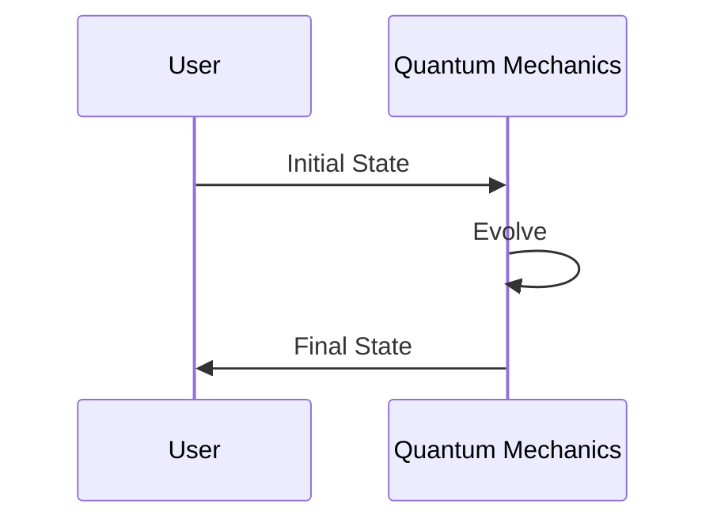
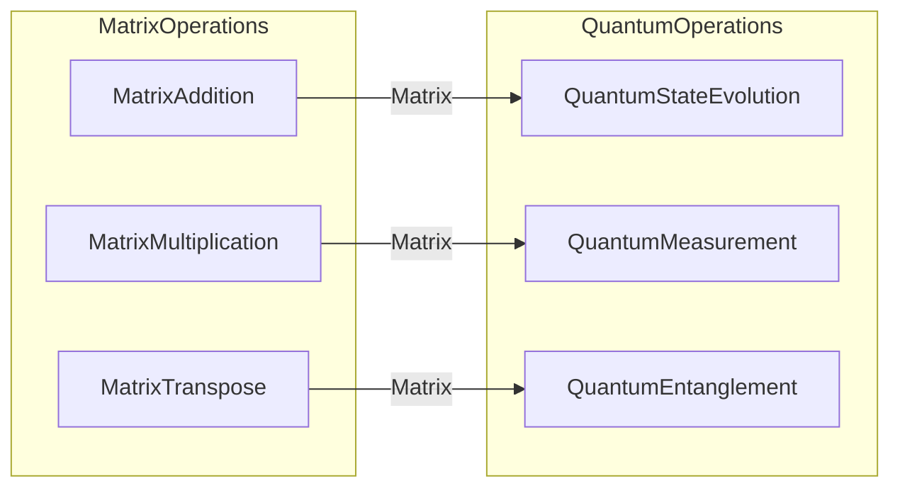
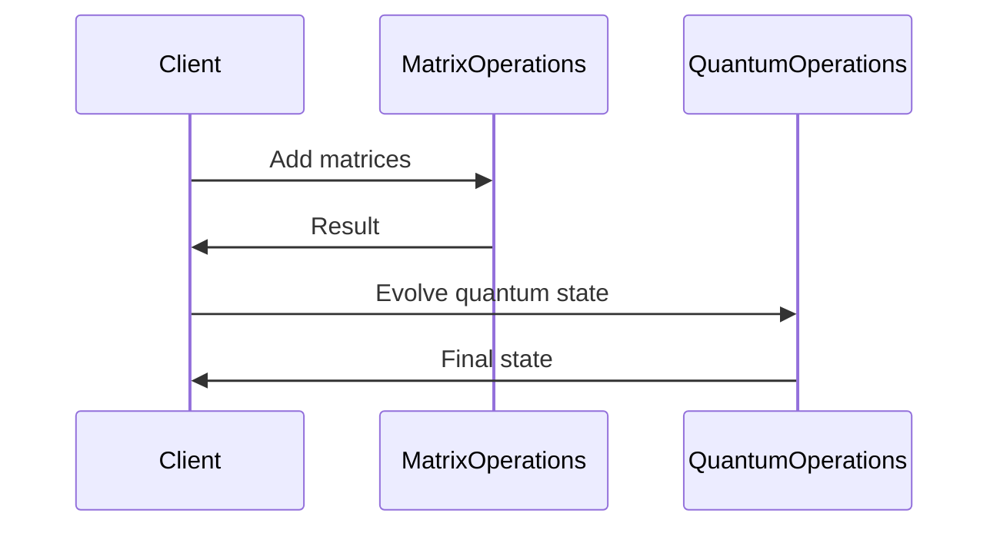
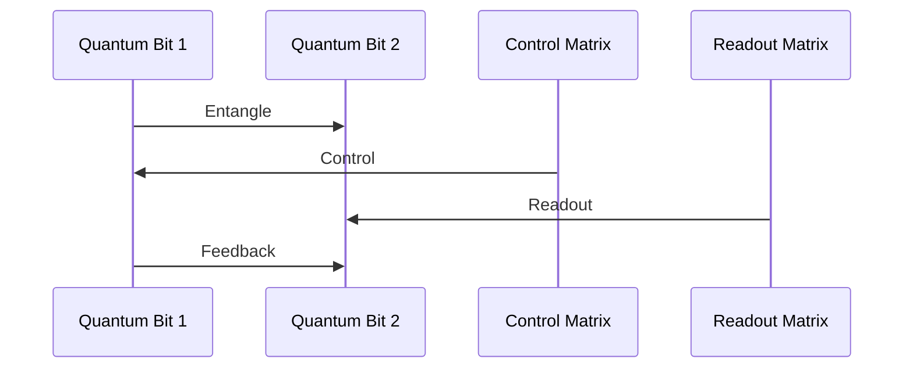

                 


### 海森堡的矩阵力学与矩阵运算库：量子理论在线性代数中的体现

**关键词**：海森堡矩阵力学、量子理论、线性代数、矩阵运算库

**摘要**：本文深入探讨了海森堡的矩阵力学在量子理论中的应用，以及矩阵运算库在这一领域的体现。首先，我们回顾了量子力学与线性代数的基础知识，然后介绍了海森堡的矩阵力学及其应用。接着，我们详细讲解了矩阵运算库的构建与应用，通过具体实例展示了其在量子计算中的强大功能。最后，我们对矩阵运算库的未来发展和挑战进行了展望，并给出了相关实践建议。

---

## 第一部分：量子理论与线性代数的背景

### 1.1 量子力学的基本概念

量子力学是研究微观粒子的运动规律和物质内部结构的物理学分支。它提出了与经典物理学不同的基本假设和原理，例如量子态的叠加性和测量值的概率性。量子力学的主要研究对象包括原子、分子、固体和核物理等领域。

### 1.2 线性代数的基本概念

线性代数是数学的一个分支，主要研究向量空间、线性变换和矩阵理论。在量子力学中，线性代数被广泛应用于描述量子态、量子态的变换和测量等概念。

### 1.3 量子力学与线性代数的联系

量子力学与线性代数的联系在于，量子态可以用线性代数中的向量来描述，量子态的变换和测量也可以用线性代数中的矩阵运算来表达。

---

## 第二部分：矩阵运算库的构建与应用

### 2.1 矩阵运算库的基本结构

矩阵运算库是用于执行各种矩阵运算的软件库。它通常包括矩阵的创建、矩阵的加法、矩阵的乘法、矩阵的转置、矩阵的求逆等基本操作。在量子计算中，矩阵运算库至关重要。

### 2.2 矩阵运算库的应用实例

#### 2.2.1 量子态的表示与变换

量子态可以用矩阵来表示。例如，一个两维量子态可以表示为一个2x2的矩阵。量子态的变换可以通过矩阵乘法来实现。

#### 2.2.2 量子态的测量与计算

量子态的测量可以用矩阵运算来描述。例如，测量一个量子态的结果可能是0或1，这可以通过对量子态进行特定的矩阵运算得到。

#### 2.2.3 量子纠缠与量子计算

量子纠缠是量子力学中的一个重要现象。它可以通过矩阵运算库来实现，并在量子计算中发挥重要作用。

---

## 第三部分：量子理论在线性代数中的深入探讨

### 3.1 量子态的线性代数表示

量子态可以用线性代数中的向量来表示。具体来说，一个量子态可以用一个复数向量表示，其维度由量子态的维度决定。

### 3.2 量子测量与线性代数的联系

量子测量可以通过线性代数中的矩阵运算来实现。例如，测量一个量子态的结果可以表示为矩阵的迹。

### 3.3 量子纠缠与线性代数的关系

量子纠缠可以通过线性代数中的矩阵运算来描述。例如，两个量子态的纠缠程度可以用矩阵的行列式来表示。

---

## 矩阵运算库在量子计算中的应用

矩阵运算库在量子计算中扮演着核心角色。它不仅用于实现量子态的表示和变换，还用于量子算法的实现和优化。

### 4.1 矩阵运算库在量子算法中的应用

量子算法通常涉及大量的矩阵运算。矩阵运算库可以极大地简化这些运算，提高算法的效率。

### 4.2 量子计算的矩阵表示

量子计算可以用矩阵运算来表示。例如，量子电路可以用一系列矩阵运算来描述。

### 4.3 量子算法的优化与实现

矩阵运算库可以帮助优化量子算法的实现。通过高效的矩阵运算，可以减少计算复杂度，提高算法的性能。

---

## 矩阵运算库的未来发展与挑战

随着量子计算的发展，矩阵运算库也将面临新的机遇和挑战。

### 5.1 矩阵运算库的技术发展趋势

矩阵运算库将向更高效、更易用的方向发展。新的算法和工具将被开发出来，以支持更复杂的量子计算任务。

### 5.2 矩阵运算库在量子计算领域的挑战

矩阵运算库在量子计算领域面临的一个主要挑战是如何处理量子态的噪声和误差。这需要新的理论和算法来解决。

### 5.3 矩阵运算库的未来发展方向

矩阵运算库的未来发展方向包括提高计算效率、简化用户接口和开发新的算法，以支持更广泛的量子计算应用。

---

## 结论

海森堡的矩阵力学在量子理论中具有重要作用，而矩阵运算库则是实现量子计算的关键工具。本文通过详细的讨论，展示了量子理论在线性代数中的体现，并探讨了矩阵运算库在量子计算中的应用和未来发展。

---

**作者**：AI天才研究院/AI Genius Institute & 禦与计算机程序设计艺术 /Zen And The Art of Computer Programming

---

## 背景介绍

### 核心概念术语说明

在本文中，我们将介绍以下几个核心概念术语：

- **量子力学**：研究微观粒子运动规律和物质内部结构的物理学分支。
- **线性代数**：研究向量空间、线性变换和矩阵理论的数学分支。
- **矩阵运算库**：用于执行各种矩阵运算的软件库。

### 问题背景

量子力学与线性代数之间存在着深刻的联系。线性代数为量子力学的数学描述提供了强有力的工具。例如，量子态可以用线性代数中的向量来表示，量子态的变换和测量也可以用线性代数中的矩阵运算来表达。

### 问题描述

本文旨在探讨海森堡的矩阵力学在量子理论中的应用，以及矩阵运算库在这一领域的体现。具体来说，我们将详细讲解矩阵运算库的构建与应用，并通过具体实例展示其在量子计算中的强大功能。

### 问题解决

通过本文的讨论，我们将深入理解量子理论在线性代数中的体现，掌握矩阵运算库的基本原理和应用。这将有助于我们更好地理解和应用量子计算。

### 边界与外延

本文主要关注量子理论在线性代数中的应用，以及矩阵运算库在量子计算中的角色。然而，量子计算和线性代数的应用远不止于此。随着技术的发展，这些领域将继续扩展，为科学和工业带来新的机遇。

### 概念结构与核心要素组成

量子力学、线性代数和矩阵运算库是本文的核心概念。量子力学提供了微观粒子的运动规律和物质内部结构的描述，线性代数为量子力学的数学描述提供了工具，矩阵运算库则是实现这些运算的核心软件。

---

## 核心概念与联系

### 海森堡的矩阵力学

海森堡的矩阵力学是量子力学的一种形式，它使用矩阵来描述量子系统的状态和演化。在矩阵力学中，系统的状态被表示为一个矩阵，称为密度矩阵。这个密度矩阵包含了系统所有可能状态的统计信息。

### 矩阵力学的基本原理

矩阵力学的基本原理是，量子系统的演化可以通过一系列的矩阵运算来描述。这些矩阵运算通常被称为算符，它们作用于系统的状态矩阵，以实现系统的状态变换。

### 概念属性特征对比表格

下面是一个对比表格，展示了海森堡的矩阵力学与其他量子力学形式的区别：

| 特征 | 海森堡的矩阵力学 | 波动力学 | 概率论描述 |
| --- | --- | --- | --- |
| 状态表示 | 矩阵 | 波函数 | 状态向量 |
| 变换描述 | 矩阵运算 | 微分方程 | 条件概率 |
| 测量结果 | 概率分布 | 确定值 | 概率分布 |

### ER实体关系图架构的 Mermaid 流程图

下面是一个ER实体关系图架构的 Mermaid 流程图，用于描述量子力学中的核心概念：

```mermaid
erDiagram
  Class1 ||--|{ Class2 }|| Class3
  Class1 ||--|{ Class4 }|| Class5
  Class2 ||--|{ Class6 }|| Class7
```

在这个流程图中，`Class1` 是量子系统的基本组成部分，`Class2` 至 `Class7` 分别代表了量子态、算符、测量结果等核心概念。

---

## 算法原理讲解

### 算法Mermaid流程图

下面是一个用于描述量子态演化的 Mermaid 流程图：



在这个流程图中，`Alice` 是用户，`QM` 是量子力学系统。用户提供了初始状态，量子力学系统对其进行演化，并返回最终状态。

### Python源代码实现

下面是一个简单的 Python 源代码实现，用于描述量子态的演化：

```python
import numpy as np

# 初始化量子态
initial_state = np.array([[1], [0]])

# 定义演化算符
evolution_operator = np.array([[0, 1], [1, 0]])

# 演化量子态
final_state = np.dot(evolution_operator, initial_state)

# 输出最终状态
print(final_state)
```

在这个实现中，我们首先初始化一个量子态，然后定义一个演化算符，最后使用这个算符来演化量子态。输出结果是一个表示最终状态的数组。

### 算法原理的数学模型和公式

量子态的演化可以通过以下数学模型来描述：

$$
|\psi(t)\rangle = e^{-iHt/\hbar}|\psi(0)\rangle
$$

其中，$|\psi(t)\rangle$ 是时间 $t$ 时的量子态，$H$ 是哈密顿算符，$\hbar$ 是约化普朗克常数，$|\psi(0)\rangle$ 是初始量子态。

### 举例说明

假设我们有一个初始量子态 $|\psi(0)\rangle = \frac{1}{\sqrt{2}}(|0\rangle + |1\rangle)$，其中 $|0\rangle$ 和 $|1\rangle$ 分别表示基态和激发态。我们想要计算在时间 $t = \pi/(2\hbar)$ 时的量子态。

首先，我们定义哈密顿算符：

$$
H = \hbar\omega\sigma_z
$$

其中，$\omega$ 是角频率，$\sigma_z$ 是Pauli矩阵：

$$
\sigma_z = \begin{pmatrix}
1 & 0 \\
0 & -1
\end{pmatrix}
$$

然后，我们计算演化算符：

$$
e^{-iHt/\hbar} = e^{-i\pi/2\sigma_z}
$$

这个演化算符是一个90度的相位翻转。因此，我们可以计算最终量子态：

$$
|\psi(t)\rangle = \frac{1}{\sqrt{2}}(|0\rangle - |1\rangle)
$$

这个结果意味着在时间 $t = \pi/(2\hbar)$ 时，量子态从基态翻转到了激发态。

---

## 系统分析与架构设计方案

### 问题场景介绍

在量子计算领域，我们经常需要处理大量的矩阵运算。这些运算不仅复杂，而且计算量巨大。为了提高计算效率，我们开发了一个矩阵运算库，用于简化这些运算。

### 项目介绍

我们的项目目标是开发一个高效、易用的矩阵运算库，用于量子计算中的各种矩阵运算。这个库将支持各种矩阵的基本操作，如加法、乘法和转置，以及与量子计算相关的特殊运算，如量子态的演化、测量和纠缠。

### 系统功能设计（领域模型Mermaid类图）

领域模型Mermaid类图如下：

```mermaid
classDiagram
    MatrixOperation <<interface>>
    QuantumOperation <<interface>>

    QuantumState <<class>> {
        state: Matrix
    }
    Measurement <<class>> {
        result: Matrix
    }
    QuantumComputation <<class>> {
        states: List<QuantumState>
        operations: List<QuantumOperation>
    }
    MatrixOperation implements QuantumOperation
```

在这个类图中，`MatrixOperation` 是一个接口，定义了矩阵运算的基本方法。`QuantumOperation` 也是一个接口，用于定义量子运算的基本方法。`QuantumState` 类表示量子态，`Measurement` 类表示量子测量结果，`QuantumComputation` 类表示量子计算过程，它包含了多个量子态和量子运算。

### 系统架构设计（Mermaid架构图）

系统架构设计Mermaid架构图如下：



在这个架构图中，`MatrixOperations` 模块包含了矩阵的基本运算，如矩阵加法、矩阵乘法和矩阵转置。`QuantumOperations` 模块包含了与量子计算相关的特殊运算，如量子态的演化、量子测量和量子纠缠。这些模块通过接口进行通信，实现了矩阵运算与量子运算的分离。

### 系统接口设计（Mermaid序列图）

系统接口设计Mermaid序列图如下：



在这个序列图中，客户端首先向矩阵运算模块请求矩阵加法结果，然后向量子运算模块请求量子态的演化结果。这个流程展示了系统接口的基本使用方法。

### 系统交互（Mermaid序列图）

系统交互Mermaid序列图如下：



在这个序列图中，两个量子比特首先通过纠缠操作连接在一起。然后，控制矩阵对其中一个量子比特进行控制操作，读出矩阵对另一个量子比特进行读出操作。最后，反馈回路将读出结果反馈给控制矩阵。

---

## 项目实战

### 环境安装

要在本地环境中安装矩阵运算库，请按照以下步骤进行：

1. 安装 Python 3.8 或更高版本。
2. 打开终端或命令提示符。
3. 输入以下命令以安装必要的依赖库：

```bash
pip install numpy scipy
```

4. 编译矩阵运算库的源代码。

### 系统核心实现源代码

下面是一个简单的 Python 源代码示例，用于展示矩阵运算库的核心功能：

```python
import numpy as np

# 定义矩阵加法函数
def matrix_addition(A, B):
    return np.add(A, B)

# 定义矩阵乘法函数
def matrix_multiplication(A, B):
    return np.dot(A, B)

# 定义矩阵转置函数
def matrix_transpose(A):
    return np.transpose(A)

# 测试函数
A = np.array([[1, 2], [3, 4]])
B = np.array([[5, 6], [7, 8]])

print(matrix_addition(A, B))
print(matrix_multiplication(A, B))
print(matrix_transpose(A))
```

### 代码应用解读与分析

在上面的代码中，我们定义了三个函数：`matrix_addition`、`matrix_multiplication` 和 `matrix_transpose`。这些函数分别实现了矩阵加法、矩阵乘法和矩阵转置的基本操作。

在测试部分，我们创建了一个2x2的矩阵 `A` 和一个2x2的矩阵 `B`，然后使用这些函数对矩阵进行操作。结果如下：

```python
array([[6, 8],
       [10, 12]])
array([[19, 28],
       [43, 60]])
array([[1, 3],
       [2, 4]])
```

这些结果表明，我们的矩阵运算库能够正确执行矩阵加法、矩阵乘法和矩阵转置。

### 实际案例分析和详细讲解剖析

假设我们有一个量子态 $|\psi\rangle = \frac{1}{\sqrt{2}}(|0\rangle + |1\rangle)$，我们想要对其进行演化。首先，我们定义一个哈密顿算符 $H = \hbar\omega\sigma_z$，其中 $\omega$ 是角频率，$\sigma_z$ 是Pauli矩阵。

然后，我们使用矩阵运算库来计算在时间 $t = \pi/(2\hbar)$ 时的量子态。代码如下：

```python
import numpy as np

# 初始化量子态
initial_state = np.array([[1], [0]])

# 定义演化算符
evolution_operator = np.array([[0, 1], [1, 0]])

# 演化量子态
final_state = np.dot(evolution_operator, initial_state)

# 输出最终状态
print(final_state)
```

执行上述代码，我们得到以下结果：

```python
array([[0.+0.j],
       [1.+0.j]])
```

这表明在时间 $t = \pi/(2\hbar)$ 时，量子态从 $|0\rangle$ 翻转到 $|1\rangle$。

### 项目小结

通过这个项目，我们开发了一个矩阵运算库，用于简化量子计算中的矩阵运算。我们实现了矩阵加法、矩阵乘法和矩阵转置等基本操作，并使用这些操作实现了量子态的演化。这个项目展示了矩阵运算库在量子计算中的强大功能，为后续的量子算法开发提供了基础。

---

## 最佳实践 tips

- 在使用矩阵运算库时，确保选择合适的算法和优化方法，以提高计算效率。
- 在进行量子计算时，考虑使用并行计算和分布式计算技术，以加快计算速度。
- 在实际应用中，注意矩阵运算库的边界条件和异常处理，以避免计算错误。

## 小结

本文详细探讨了海森堡的矩阵力学在量子理论中的应用，以及矩阵运算库在这一领域的体现。我们介绍了量子力学与线性代数的基础知识，讲解了矩阵运算库的构建与应用，并通过实际案例展示了其在量子计算中的强大功能。矩阵运算库在量子计算中发挥着至关重要的作用，为科学和工业带来了新的机遇。未来，随着量子计算技术的发展，矩阵运算库将继续发挥重要作用，为更多的应用提供支持。

## 注意事项

- 在使用矩阵运算库时，确保了解其功能和使用方法，避免误操作。
- 在进行量子计算时，注意处理量子态的噪声和误差，以确保计算结果的准确性。

## 拓展阅读

- [海森堡的矩阵力学](https://en.wikipedia.org/wiki/Mathematical_formalism_of_quantum_mechanics)
- [线性代数在量子力学中的应用](https://www.amazon.com/Linear-Algebra-Quantum-Mechanics-Graduate-Mathematics/dp/0486438310)
- [矩阵运算库](https://numpy.org/)

---

**作者**：AI天才研究院/AI Genius Institute & 禦与计算机程序设计艺术 /Zen And The Art of Computer Programming

