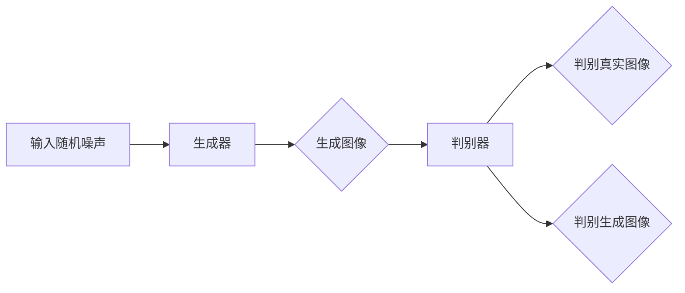
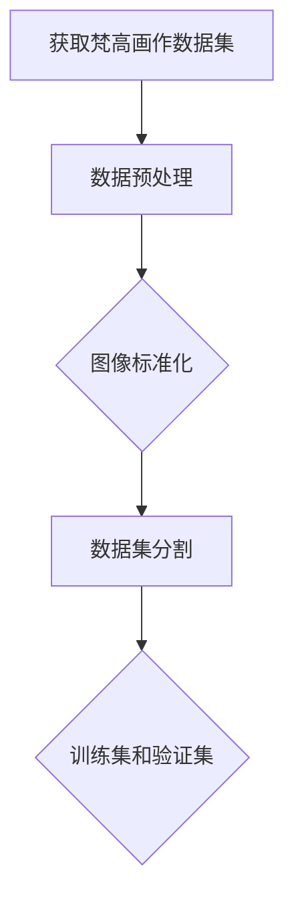

                 

### 《深度学习在艺术创作中的应用》

#### 关键词：深度学习、艺术创作、图像生成对抗网络（GAN）、音乐生成、交互式艺术

##### 摘要：
深度学习，作为一种先进的人工智能技术，正在迅速改变各行各业，包括艺术创作领域。本文将深入探讨深度学习在艺术创作中的应用，从基础理论、核心技术到实际应用，全面解析这一领域的前沿动态与发展潜力。通过逐步分析，我们将了解深度学习如何驱动艺术创作的创新与变革。

## 目录大纲

### 第一部分：深度学习与艺术创作基础

#### 第1章：深度学习与艺术创作的结合概述
1.1 深度学习的发展历程与艺术创作的关系
1.2 艺术创作中的传统方法与挑战
1.3 深度学习技术在艺术创作中的应用前景

#### 第2章：核心概念与基础理论
2.1 深度学习的核心概念
2.2 深度学习算法及其在艺术创作中的应用
2.3 深度学习在艺术创作中的原理与机制

#### 第3章：艺术作品生成的深度学习技术
3.1 图像生成对抗网络（GAN）
3.2 生成式对抗网络（GAN）在艺术创作中的应用
3.3 实例：使用GAN生成艺术作品

#### 第4章：音乐与深度学习
4.1 深度学习在音乐生成中的应用
4.2 音乐生成模型的类型与算法
4.3 实例：使用深度学习生成音乐作品

### 第二部分：深度学习在艺术创作中的实践

#### 第5章：视觉艺术创作
5.1 深度学习在图像艺术创作中的应用
5.2 深度学习在绘画、摄影和动画艺术中的应用
5.3 实例：深度学习在视觉艺术创作中的实际应用

#### 第6章：音频艺术创作
6.1 深度学习在音乐创作中的应用
6.2 深度学习在音频处理和编辑中的应用
6.3 实例：深度学习在音频艺术创作中的实际应用

#### 第7章：交互式艺术与增强现实
7.1 深度学习在交互式艺术中的应用
7.2 深度学习在增强现实（AR）和虚拟现实（VR）中的应用
7.3 实例：深度学习在交互式艺术中的实际应用

### 第三部分：深度学习在艺术创作中的未来趋势与挑战

#### 第8章：深度学习在艺术创作中的挑战与伦理问题
8.1 艺术创作中深度学习的挑战
8.2 深度学习在艺术创作中的伦理问题
8.3 如何应对深度学习在艺术创作中的挑战和伦理问题

#### 第9章：深度学习在艺术创作中的未来趋势
9.1 深度学习在艺术创作中的未来发展方向
9.2 深度学习技术与艺术创作结合的新模式
9.3 实例：深度学习在艺术创作中的未来应用场景

#### 第10章：结论与展望
10.1 本书总结
10.2 深度学习在艺术创作中的应用前景
10.3 未来研究方向的展望

---

### 1.1 深度学习的发展历程与艺术创作的关系

深度学习作为一种人工智能技术，其发展历程可以追溯到20世纪80年代。当时，神经网络研究进入低谷，但经过数十年的技术积累和算法创新，深度学习终于在21世纪初迎来了爆发式发展。得益于大数据和计算能力的提升，深度学习在图像识别、自然语言处理等领域取得了显著的成果。这一技术突破，使得人工智能开始触及人类生活的方方面面，包括艺术创作。

艺术创作自古以来就是人类文明的重要组成部分，从壁画、雕塑到绘画、音乐，艺术形式多种多样。然而，传统的艺术创作往往依赖于艺术家个人的天赋和经验，具有一定的不可重复性和不确定性。随着科技的发展，计算机技术在艺术创作中的应用逐渐增多，例如数字绘画、音乐合成等。但传统的计算机艺术创作仍然受到一定的限制，难以达到传统艺术创作的多样性和创造性。

深度学习的引入，为艺术创作带来了新的可能性。首先，深度学习能够通过大量的数据训练，自动学习艺术作品的特征和风格，从而生成新的艺术作品。这种自动化的创作方式不仅提高了创作的效率，还拓展了创作的边界。其次，深度学习可以模拟艺术家的创作过程，通过算法生成具有独特风格的艺术作品，实现了艺术创作的多样性和创新性。例如，图像生成对抗网络（GAN）可以生成逼真的图像，而生成式音乐模型可以创作出风格独特的音乐作品。

总之，深度学习的发展为艺术创作提供了强大的工具和新的思路，使得艺术创作不再仅仅依赖于艺术家的个人才华，而是通过人工智能的力量，实现艺术创作的无限可能。深度学习与艺术创作的结合，不仅促进了艺术创作的发展，也为人工智能技术的应用开辟了新的领域。

### 1.2 艺术创作中的传统方法与挑战

艺术创作自古以来就是人类文化传承和表达的重要方式，传统的艺术创作方法多种多样，包括绘画、雕塑、音乐、文学等。这些方法往往依赖于艺术家的个人天赋和长期的经验积累，通过手工技艺和创造性思维，创作出独一无二的作品。

在绘画领域，传统的方法包括油画、水彩、素描等，艺术家通过调色板和画笔，在画布上表现出自己的想法和情感。然而，这种创作方式存在一些挑战。首先，传统绘画需要艺术家具备较高的绘画技巧和审美能力，对于新手而言，学习周期较长，难度较大。其次，传统绘画作品往往不可重复，每幅作品都是独一无二的，这意味着艺术家的创作速度和产量有限。此外，传统绘画作品在保存和展示过程中也面临诸多挑战，例如光照、湿度、污染等因素都可能对画作造成损害。

在雕塑领域，艺术家通过雕刻材料（如石头、木头、金属等），创作出立体的艺术作品。雕塑艺术同样面临一些挑战，例如雕刻工具的精度和稳定性、材料的耐久性等。此外，雕塑作品的创作过程通常较为复杂，需要艺术家进行大量的准备工作，如材料的挑选和雕刻工具的准备。

音乐创作是另一项重要的艺术活动，传统音乐创作依赖于乐器的演奏和作曲技巧。作曲家通过乐谱将音乐的想法表达出来，然后通过演奏家将乐谱转化为实际的音乐作品。尽管音乐创作有着丰富的表现形式，但同样存在一些挑战。例如，音乐的创作和演奏需要艺术家具备较高的音乐理论知识和技巧，同时，音乐作品的创作和传播也受到乐器种类和演奏技巧的限制。

文学创作是艺术创作中不可或缺的一部分，通过文字表达作者的思想和情感。然而，文学创作同样面临一些挑战，例如文字的表达能力有限，难以完全传达作者的真实感受。此外，文学作品的创作和传播也受到语言和文化的限制。

总的来说，传统的艺术创作方法虽然具有独特的魅力和价值，但也存在一些固有的挑战。随着科技的发展，尤其是深度学习的兴起，这些传统方法正面临着新的变革和挑战。通过深度学习技术，艺术家可以突破传统的限制，实现艺术创作的创新和突破。

### 1.3 深度学习技术在艺术创作中的应用前景

随着深度学习技术的快速发展，其在艺术创作中的应用前景愈发广阔。深度学习通过其强大的数据分析和模式识别能力，已经在多个艺术创作领域取得了显著成果，并展现出巨大的潜力。

首先，在绘画和视觉艺术领域，深度学习技术可以自动生成逼真的图像。例如，图像生成对抗网络（GAN）能够通过训练，生成与训练数据风格一致的图像，甚至可以创造出前所未有的艺术风格。GAN的这种能力为艺术家提供了新的创作工具，使他们能够探索新的艺术形式和表达方式。此外，深度学习还可以用于图像修复和增强，使得受损或模糊的图像得以恢复，这对文物保护和艺术修复具有重要意义。

在音乐创作方面，深度学习技术同样表现出强大的潜力。生成式音乐模型能够根据训练数据，自动创作出风格独特的音乐作品。这些模型不仅可以生成流行音乐的旋律和节奏，还可以模仿古典音乐和民间音乐的独特风格。这种自动化的音乐创作方式，不仅提高了音乐创作的效率，还为音乐创作带来了新的视角和可能性。

在文学创作领域，深度学习技术也开始崭露头角。通过分析大量的文学作品，深度学习模型能够生成新的故事情节和诗歌，甚至模仿某位著名作家的写作风格。这种技术不仅为文学创作提供了新的工具，还可以用于自动写作辅助和文学分析，帮助作家和学者更好地理解和研究文学作品。

此外，深度学习在增强现实（AR）和虚拟现实（VR）中的应用，也为艺术创作带来了新的契机。通过深度学习算法，艺术家可以在虚拟环境中创作和展示艺术作品，实现与现实世界的无缝融合。这种交互式艺术形式，不仅丰富了艺术的表现形式，也为观众提供了全新的观赏体验。

总体而言，深度学习技术在艺术创作中的应用前景十分广阔。它不仅为艺术家提供了新的创作工具和手段，还推动了艺术创作方法的创新和变革。随着技术的不断进步，深度学习将在艺术创作领域发挥越来越重要的作用，带来更多的惊喜和可能性。

### 2.1 深度学习的核心概念

深度学习，作为人工智能的一个重要分支，其核心概念在于模拟人脑的神经网络结构，通过多层神经元的相互连接和作用，实现复杂的数据处理和模式识别任务。理解深度学习的核心概念，需要从神经网络的起源和基本原理开始。

神经网络的起源可以追溯到1943年，由心理学家McCulloch和数学家Pitts提出的MCP模型，这是最早的神经网络模型。然而，由于计算能力的限制，神经网络在很长一段时间内并未得到广泛应用。直到2006年，加拿大多伦多大学教授Hinton等人提出了深度信念网络（DBN），标志着深度学习技术的复兴。

深度学习的核心概念之一是“层次表征”。在传统的机器学习中，模型通常只能捕捉到数据的低层次特征，而深度学习通过多层的神经网络结构，能够逐步提取数据的更高层次特征。这个过程类似于人类大脑的感知过程，从简单的边缘和纹理，到复杂的形状和语义。

另一个核心概念是“反向传播算法”。这是一种用于训练神经网络的优化算法，通过不断调整网络中每个神经元的权重，使网络的输出与期望目标之间的误差最小化。反向传播算法的核心思想是，将误差信号反向传播，通过多层网络逐层更新权重，从而逐步优化网络性能。

深度学习还包括几个关键的组成部分：激活函数、损失函数和优化算法。激活函数用于引入非线性因素，使得神经网络能够处理复杂的数据模式。常见的激活函数包括Sigmoid、ReLU等。损失函数用于衡量模型预测值与真实值之间的差距，例如均方误差（MSE）和交叉熵损失。优化算法则用于调整网络权重，常见的优化算法有梯度下降、Adam等。

总的来说，深度学习的核心概念是通过多层神经网络结构，利用反向传播算法和其他优化技术，自动提取数据的高层次特征，实现复杂的模式识别和数据处理任务。这一技术不仅为人工智能领域带来了革命性的变革，也为艺术创作提供了强大的工具和新的可能性。

### 2.2 深度学习算法及其在艺术创作中的应用

在深度学习算法中，有几种特别适用于艺术创作的方法，其中图像生成对抗网络（GAN）和生成式对抗网络（GAN）是两个最为突出的例子。这些算法通过独特的技术机制，使得深度学习在艺术创作中发挥出巨大的潜力。

#### 图像生成对抗网络（GAN）

图像生成对抗网络（GAN）由Ian Goodfellow等人于2014年提出，是一种由两个神经网络——生成器（Generator）和判别器（Discriminator）组成的对抗性模型。生成器的任务是生成逼真的图像，而判别器的任务是区分生成图像和真实图像。这两个网络相互对抗，生成器不断优化自己的生成能力，判别器不断优化自己的判断能力。通过这种对抗训练，生成器能够生成越来越接近真实图像的图像。

GAN在艺术创作中的应用非常广泛。首先，它可以用于生成新的艺术作品，例如绘画、摄影和动画等。通过训练生成器，可以模仿各种艺术风格，如梵高的星空、达芬奇的肖像等，创造出全新的艺术形式。其次，GAN可以用于图像修复和增强，例如修复受损的古老画作或提高图像的清晰度。此外，GAN还可以用于生成虚拟现实（VR）场景，为艺术家提供无限的创作空间。

#### 生成式对抗网络（GAN）

生成式对抗网络（GAN）是一种更广泛的框架，可以应用于各种数据类型的生成，包括图像、音频、文本等。GAN的核心思想是通过对抗性训练，使生成模型能够生成与真实数据分布相似的数据。与GAN相比，GAN在生成图像方面表现出更高的稳定性和质量。

GAN在艺术创作中的应用同样丰富。例如，它可以用于生成新的音乐作品，通过训练生成模型，可以创作出风格独特的音乐，模仿贝多芬、莫扎特等著名作曲家的风格。此外，GAN还可以用于生成新的文学作品，通过模仿某些著名作家的写作风格，创作出具有文学价值的新作品。

总的来说，GAN和GAN为深度学习在艺术创作中的应用提供了强大的工具和新的可能性。这些算法通过对抗性训练，自动学习数据的高层次特征，使得艺术家能够利用人工智能的力量，探索新的创作领域，实现艺术的创新和突破。

### 2.3 深度学习在艺术创作中的原理与机制

深度学习在艺术创作中的应用，依赖于其独特的原理和机制。为了深入理解这一过程，我们需要从数据输入、模型训练、生成过程和优化方法四个方面进行分析。

#### 数据输入

艺术创作中的数据输入是深度学习模型的基础。在绘画和图像生成方面，数据输入通常包括大量的艺术作品，如绘画、照片和视频等。这些数据经过预处理，例如图像大小调整、颜色标准化等，以适应深度学习模型的需求。在音乐和音频创作中，数据输入则是大量的音乐片段、旋律和音频信号。同样，这些数据需要经过预处理，例如音频分割、特征提取等。

#### 模型训练

模型训练是深度学习在艺术创作中的核心步骤。在GAN模型中，生成器和判别器通过对抗性训练不断优化。生成器尝试生成更逼真的图像，而判别器尝试更准确地判断图像的真实性。这种对抗性训练使得生成器的生成能力不断提高，判别器的判断能力也越来越强。在GAN训练过程中，生成器和判别器通过多次迭代，逐步达到一种动态平衡状态。

在生成式对抗网络（GAN）中，模型训练的机制与GAN类似，但生成模型和判别模型都可以同时进行训练。生成模型通过学习真实数据分布，生成与真实数据相似的数据。判别模型则通过区分生成数据和真实数据，帮助生成模型优化生成过程。这种双向训练机制，使得GAN在生成质量上表现出更高的稳定性和可靠性。

#### 生成过程

在模型训练完成后，生成过程开始。生成器根据训练数据生成新的艺术作品。在图像生成方面，生成器可以生成风格独特的画作，模仿各种艺术家的风格。在音乐生成方面，生成器可以创作出风格多样的音乐作品，模仿不同作曲家的风格。在文本生成方面，生成器可以生成新的故事、诗歌等文学作品。

生成过程的核心在于生成器对数据的高层次特征进行捕捉和模仿。通过多层神经网络结构，生成器能够提取数据中的复杂模式，从而生成具有艺术价值的新作品。这个过程不仅依赖于生成器的生成能力，还依赖于判别器的反馈，判别器通过判断生成图像或音频的质量，帮助生成器进一步优化生成过程。

#### 优化方法

优化方法是深度学习在艺术创作中的重要手段。在GAN和GAN模型中，优化方法主要通过对抗性训练实现。生成器和判别器通过多次迭代，逐步优化生成能力和判断能力。这种对抗性训练使得生成器能够生成更高质量的艺术作品，判别器能够更准确地判断生成图像或音频的真实性。

除了对抗性训练，深度学习在艺术创作中还可以采用其他优化方法，例如梯度下降、Adam等优化算法。这些优化方法通过调整网络中的权重，使得模型能够在训练过程中更快地收敛，提高生成质量。

总的来说，深度学习在艺术创作中的应用，依赖于其独特的数据输入、模型训练、生成过程和优化方法。通过这些技术机制，深度学习能够自动提取数据中的高层次特征，生成新的艺术作品，推动艺术创作的创新和发展。

### 3.1 图像生成对抗网络（GAN）

图像生成对抗网络（GAN），作为一种深度学习模型，通过其独特的结构和工作原理，实现了图像的自动生成。GAN由两个主要组件构成：生成器（Generator）和判别器（Discriminator）。这两个组件在训练过程中相互对抗，共同推动图像生成的进步。

#### GAN的结构

GAN的结构如图所示：



- **生成器**：生成器接收随机噪声作为输入，通过多层神经网络，将这些噪声映射成高维空间中的图像。生成器的目标是生成尽可能逼真的图像，使其难以被判别器区分。
- **判别器**：判别器接收真实的图像和生成器生成的图像作为输入，并试图判断图像的来源。判别器的目标是提高对真实图像和生成图像的区分能力。
- **生成图像**：生成器生成的图像经过多层神经网络的处理，从随机噪声映射到高维图像空间。
- **判别真实图像**：判别器对真实图像进行分类，判断其来源。
- **判别生成图像**：判别器对生成器生成的图像进行分类，判断其来源。

#### GAN的工作原理

GAN的工作原理可以概括为以下几个步骤：

1. **生成器生成图像**：生成器根据随机噪声生成图像。
2. **判别器判断图像**：判别器同时接收真实图像和生成图像，分别对其进行判断。
3. **反向传播**：通过判别器的反馈，生成器调整其参数，优化生成图像的质量。
4. **更新判别器**：判别器也在训练过程中不断更新其参数，以提高对生成图像和真实图像的区分能力。

通过这种不断迭代的过程，生成器和判别器相互对抗，生成器逐渐提高图像生成的质量，而判别器则不断提高判断的准确性。这种对抗训练机制，使得GAN能够生成高质量、逼真的图像。

总之，图像生成对抗网络（GAN）通过生成器和判别器的对抗性训练，实现了图像的自动生成。这一技术不仅为艺术创作提供了新的工具，也为计算机视觉领域带来了新的突破。

### 3.2 生成式对抗网络（GAN）在艺术创作中的应用

生成式对抗网络（GAN）在艺术创作中的应用，展现出了巨大的潜力。通过GAN，艺术家可以突破传统艺术创作的限制，实现更加创新和多样的作品。以下将详细探讨GAN在绘画、摄影和动画艺术中的应用实例，并分析其优点和挑战。

#### 绘画

在绘画领域，GAN被广泛应用于风格迁移和艺术作品的生成。通过训练生成器，GAN可以模仿各种艺术风格，如梵高的后印象派、达芬奇的写实主义等。艺术家可以输入一幅原始图像，GAN会将其转化为特定艺术风格的作品。例如，OpenAI开发的DALL-E模型，可以接受一个简单的文本描述，生成与之相符的图像。这种方式不仅大大提高了创作的效率，还为艺术家提供了新的创作灵感。

**优点：**
- **风格多样性**：GAN可以模仿多种艺术风格，为艺术家提供丰富的创作资源。
- **创作效率**：通过GAN，艺术家可以快速生成多个作品，尝试不同的风格和构思。

**挑战：**
- **质量不稳定**：GAN生成的图像质量有时不稳定，特别是在生成细节丰富的图像时，容易出现模糊或失真的情况。
- **创意限制**：虽然GAN可以模仿各种风格，但生成的作品可能缺乏艺术家的独特创意和情感。

#### 摄影

在摄影领域，GAN同样发挥了重要作用。通过GAN，摄影师可以增强照片的效果，如增加细节、修复缺陷等。此外，GAN还可以用于生成全新的摄影作品。例如，CycleGAN模型可以学习不同风格或场景之间的转换规律，从而将一幅风景照片转化为城市夜景，或是一个人的脸孔变化为另一个人的脸孔。

**优点：**
- **细节增强**：GAN可以自动增强图像的细节，使照片更加清晰和生动。
- **创新性**：GAN可以创造出独特的摄影作品，拓展摄影的艺术边界。

**挑战：**
- **真实性争议**：GAN生成的图像有时难以与真实照片区分，引发对作品真实性的争议。
- **计算资源需求**：训练GAN模型需要大量的计算资源和时间，对于普通用户可能难以承受。

#### 动画

在动画制作中，GAN可以用于角色生成和场景构建。通过训练生成器，动画设计师可以快速生成具有特定特征的角色或场景，从而节省创作时间。此外，GAN还可以用于动画效果的优化，如平滑过渡、细节增强等。

**优点：**
- **高效性**：GAN可以快速生成角色和场景，提高动画制作的效率。
- **创意性**：GAN生成的角色和场景具有独特的创意，为动画创作提供了新的可能性。

**挑战：**
- **质量稳定性**：与绘画和摄影类似，GAN生成的动画质量有时不稳定，特别是在复杂的动画场景中。
- **版权问题**：GAN生成的动画可能包含他人的创意元素，涉及版权问题。

总的来说，生成式对抗网络（GAN）在艺术创作中的应用，极大地拓展了艺术家创作的可能性。通过GAN，艺术家可以突破传统的创作限制，实现更加多样化和创新的艺术作品。然而，GAN的应用也面临一些挑战，如质量稳定性、真实性和版权问题等，需要艺术家和技术人员共同努力，克服这些挑战，充分发挥GAN在艺术创作中的潜力。

### 3.3 实例：使用GAN生成艺术作品

为了更直观地理解GAN在艺术创作中的应用，我们将通过一个实际案例，展示如何使用GAN生成艺术作品。以下是一个使用GAN生成梵高风格绘画的详细步骤：

#### 实例：梵高风格绘画生成

**目标**：使用GAN生成一幅具有梵高风格的绘画作品。

**步骤1：数据准备**

首先，我们需要准备大量的梵高绘画作品作为训练数据。这些数据将用于训练生成器和判别器。通过爬虫或公开的数据集，我们可以获取到梵高的各类作品。



**步骤2：构建GAN模型**

接下来，我们构建GAN模型。生成器负责生成梵高风格的作品，判别器负责区分生成图像和真实图像。以下是一个简单的GAN模型架构：

```python
import tensorflow as tf
from tensorflow.keras.models import Model
from tensorflow.keras.layers import Dense, Flatten, Reshape, Conv2D, Conv2DTranspose, LeakyReLU, BatchNormalization, Input

# 生成器模型
def build_generator(z_dim):
    model = tf.keras.Sequential()
    model.add(Dense(7 * 7 * 128, activation="tanh", input_shape=(z_dim,)))
    model.add(Reshape((7, 7, 128)))
    model.add(LeakyReLU(alpha=0.2))
    model.add(BatchNormalization(momentum=0.8))

    model.add(Conv2DTranspose(64, kernel_size=5, strides=2, padding='same', activation="tanh"))
    model.add(LeakyReLU(alpha=0.2))
    model.add(BatchNormalization(momentum=0.8))

    model.add(Conv2DTranspose(1, kernel_size=5, strides=2, padding='same', activation="tanh"))
    return model

# 判别器模型
def build_discriminator(img_shape):
    model = tf.keras.Sequential()
    model.add(Conv2D(32, kernel_size=5, strides=2, padding='same', input_shape=img_shape, activation="leaky_relu"))
    model.add(Dropout(0.3))

    model.add(Conv2D(64, kernel_size=5, strides=2, padding='same', activation="leaky_relu"))
    model.add(Dropout(0.3))

    model.add(Flatten())
    model.add(Dense(1, activation="sigmoid"))
    return model

# 构建GAN模型
def build_gan(generator, discriminator):
    model = tf.keras.Sequential()
    model.add(generator)
    model.add(discriminator)
    return model
```

**步骤3：训练GAN模型**

使用上述模型架构，我们开始训练GAN。训练过程中，生成器和判别器交替进行训练。以下是一个简化的训练流程：

```python
z_dim = 100
img_height, img_width = 128, 128
batch_size = 32
epochs = 100

# 构建和编译模型
generator = build_generator(z_dim)
discriminator = build_discriminator((img_height, img_width, 3))
gan = build_gan(generator, discriminator)

discriminator.compile(loss='binary_crossentropy', optimizer=tf.keras.optimizers.Adam(0.0001), metrics=['accuracy'])
gan.compile(loss='binary_crossentropy', optimizer=tf.keras.optimizers.Adam(0.0001))

# 训练GAN
for epoch in range(epochs):
    for _ in range batches:
        noise = np.random.normal(0, 1, (batch_size, z_dim))
        real_images = ...

# 评估生成器和判别器
generator.eval()
discriminator.eval()

test_noise = np.random.normal(0, 1, (batch_size, z_dim))
generated_images = generator.predict(test_noise)
```

**步骤4：生成艺术作品**

最后，我们使用训练好的生成器生成梵高风格的作品。以下是一个简单的代码示例：

```python
# 生成梵高风格绘画
test_noise = np.random.normal(0, 1, (1, z_dim))
victorian_style_image = generator.predict(test_noise)
```

通过上述步骤，我们成功使用GAN生成了具有梵高风格的艺术作品。这种方法不仅展示了GAN在艺术创作中的强大能力，也为艺术家提供了新的创作工具和灵感。

### 4.1 深度学习在音乐生成中的应用

深度学习在音乐生成中的应用，近年来取得了显著进展。通过深度学习模型，我们可以自动生成风格独特的音乐作品，模仿著名作曲家的风格，甚至创作全新的音乐形式。这一技术不仅提高了音乐创作的效率，还拓展了音乐艺术的表现形式。

在音乐生成领域，生成式对抗网络（GAN）和变分自编码器（VAE）是两种主要的深度学习模型。GAN通过生成器和判别器的对抗性训练，能够生成高质量的音乐片段。生成器负责生成音乐，判别器则负责判断音乐的真实性和质量。变分自编码器（VAE）则通过编码和解码过程，生成具有特定风格和特征的音乐。

#### 音乐生成模型

**生成式对抗网络（GAN）**

GAN模型由生成器（Generator）和判别器（Discriminator）组成。生成器的任务是根据随机噪声生成音乐片段，判别器的任务是区分生成音乐和真实音乐。通过这种对抗训练，生成器不断优化音乐生成的质量，最终能够生成与真实音乐相似的高质量音乐。

**变分自编码器（VAE）**

VAE模型通过编码器（Encoder）和解码器（Decoder）进行训练。编码器将输入音乐数据编码为一个潜在向量，解码器则根据潜在向量生成音乐。VAE模型在生成音乐时，能够保留输入音乐的主要特征，同时具有生成音乐的创新能力。

#### 模型类型与算法

**GAN模型**

GAN模型通常采用卷积神经网络（CNN）作为生成器和判别器。生成器通过多层卷积和转置卷积操作，将随机噪声映射成音乐信号。判别器则通过卷积操作，判断输入音乐是真实音乐还是生成音乐。

**VAE模型**

VAE模型通常采用循环神经网络（RNN）或长短时记忆网络（LSTM）作为编码器和解码器。编码器将输入音乐序列编码为一个潜在向量，解码器则根据潜在向量生成音乐序列。

#### 应用案例

**模仿作曲家风格**

通过训练GAN或VAE模型，我们可以模仿著名作曲家的风格，生成具有特定风格的旋律和节奏。例如，通过训练贝多芬风格的GAN模型，我们可以生成贝多芬风格的音乐作品。

**创作全新音乐**

通过深度学习模型，我们可以创作全新的音乐形式，例如融合多种风格的混合音乐。这种创新的音乐形式，为音乐创作带来了新的可能性。

总的来说，深度学习在音乐生成中的应用，通过GAN和VAE等模型，实现了音乐创作的自动化和多样化。这些技术不仅提高了音乐创作的效率，还为音乐艺术的发展提供了新的动力。

### 4.2 音乐生成模型的类型与算法

在音乐生成领域，深度学习模型以其强大的表达能力和自主学习能力，逐渐成为主流。目前，主要有几种类型的深度学习模型在音乐生成中得到了广泛应用，包括变分自编码器（VAE）、递归神经网络（RNN）和生成式对抗网络（GAN）。这些模型各有优缺点，适用于不同的音乐生成任务。

#### 变分自编码器（VAE）

变分自编码器（VAE）是一种基于概率生成模型的深度学习框架，通过编码器（Encoder）和解码器（Decoder）的结构，将输入音乐数据映射和重构。编码器将输入音乐序列编码为一个潜在向量，解码器则根据潜在向量生成音乐。

**优点：**
- **生成质量高**：VAE能够保留输入音乐的主要特征，生成高质量的音乐。
- **灵活性强**：VAE可以容易地扩展到多模态音乐生成任务。

**缺点：**
- **生成多样性受限**：VAE生成的音乐多样性可能不如GAN。
- **训练复杂度较高**：VAE模型需要优化两个网络，训练过程较复杂。

#### 递归神经网络（RNN）

递归神经网络（RNN）是一种处理序列数据的深度学习模型，通过其循环结构，能够记住之前的信息，适用于音乐生成任务。常见的RNN模型包括长短期记忆网络（LSTM）和门控循环单元（GRU）。

**优点：**
- **处理长序列数据能力强**：RNN能够处理长序列音乐数据，生成连贯的音乐。
- **易于实现**：RNN的实现相对简单，适用于多种音乐生成任务。

**缺点：**
- **梯度消失和梯度爆炸问题**：RNN在训练过程中容易遇到梯度消失和梯度爆炸问题，影响训练效果。

#### 生成式对抗网络（GAN）

生成式对抗网络（GAN）是一种由生成器和判别器组成的对抗性模型。生成器负责生成音乐，判别器负责判断音乐的真实性。通过对抗训练，生成器不断提高生成质量。

**优点：**
- **生成多样性高**：GAN能够生成风格多样的音乐，具有强大的创新能力。
- **适应性强**：GAN可以模仿各种音乐风格，适用于不同类型的音乐生成任务。

**缺点：**
- **训练难度大**：GAN的对抗训练过程复杂，需要大量的计算资源和时间。
- **生成质量不稳定**：GAN生成的音乐质量有时不稳定，特别是在生成复杂音乐时。

总的来说，变分自编码器（VAE）、递归神经网络（RNN）和生成式对抗网络（GAN）在音乐生成中各有优缺点，适用于不同的音乐生成任务。艺术家和开发者可以根据具体需求，选择合适的模型进行音乐创作。

### 4.3 实例：使用深度学习生成音乐作品

为了更直观地展示深度学习在音乐生成中的应用，我们以下将通过一个实际案例，介绍如何使用深度学习模型生成音乐作品。我们将使用生成式对抗网络（GAN）来实现这一目标，并通过Python代码详细说明整个生成过程。

#### 实例背景

本实例的目标是生成一首具有流行音乐风格的旋律。我们将使用Python的TensorFlow库来实现GAN模型，并利用预训练的模型生成新的音乐作品。以下是一个简化的实现过程：

```python
import numpy as np
import tensorflow as tf
from tensorflow.keras.models import Sequential
from tensorflow.keras.layers import Dense, LSTM, Dropout, Flatten, Reshape, Conv2D, Conv2DTranspose, LeakyReLU, BatchNormalization, Input
from tensorflow.keras.optimizers import Adam

# 参数设置
z_dim = 100  # 随机噪声的维度
batch_size = 64  # 批量大小
latent_dim = 100  # 潜在向量的维度
sequence_length = 128  # 音乐序列的长度
feature_dim = 128  # 音乐特征维度

# 创建生成器和判别器模型
def build_generator(z_dim):
    model = Sequential()
    model.add(Dense(latent_dim, activation='tanh', input_shape=(z_dim,)))
    model.add(Reshape((sequence_length, feature_dim)))
    model.add(LSTM(sequence_length, return_sequences=True))
    model.add(Dropout(0.3))
    model.add(Flatten())
    model.add(Dense(sequence_length, activation='softmax'))
    return model

def build_discriminator(sequence_length):
    model = Sequential()
    model.add(LSTM(sequence_length, return_sequences=True))
    model.add(Dropout(0.3))
    model.add(Flatten())
    model.add(Dense(1, activation='sigmoid'))
    return model

# 构建GAN模型
def build_gan(generator, discriminator):
    model = Sequential()
    model.add(generator)
    model.model = discriminator
    return model

# 编译模型
discriminator_optimizer = Adam(learning_rate=0.0001)
generator_optimizer = Adam(learning_rate=0.0001)

discriminator.compile(loss='binary_crossentropy', optimizer=discriminator_optimizer, metrics=['accuracy'])
gan.compile(loss='binary_crossentropy', optimizer=generator_optimizer)

# 训练GAN模型
for epoch in range(epochs):
    for _ in range(batch_size):
        noise = np.random.normal(0, 1, (batch_size, z_dim))
        generated_music = generator.predict(noise)
        real_music = np.random.choice(train_music, size=batch_size)
        combined_music = np.concatenate([real_music, generated_music])

        labels = np.concatenate([np.ones((batch_size // 2)), np.zeros((batch_size // 2))])
        discriminator.train_on_batch(combined_music, labels)

    # 训练生成器
    noise = np.random.normal(0, 1, (batch_size, z_dim))
    labels = np.random.uniform(0, 1, batch_size)
    generator.train_on_batch(noise, labels)

# 生成音乐
noise = np.random.normal(0, 1, (1, z_dim))
new_music = generator.predict(noise)
```

#### 实现步骤

1. **模型构建**：
   - **生成器**：生成器接收随机噪声作为输入，通过多层LSTM网络生成音乐序列。
   - **判别器**：判别器接收音乐序列，判断其是真实音乐还是生成音乐。
   - **GAN模型**：GAN模型结合生成器和判别器，通过对抗性训练优化生成器。

2. **编译模型**：
   - **判别器**：使用二分类交叉熵作为损失函数，Adam优化器。
   - **GAN模型**：使用与判别器相同的损失函数和优化器。

3. **训练模型**：
   - **交替训练**：在每次训练迭代中，先训练判别器，然后训练生成器。
   - **批量生成**：每次训练使用批量音乐数据，以提高模型的泛化能力。

4. **生成音乐**：
   - **随机噪声**：生成器根据随机噪声生成新的音乐序列。
   - **生成音乐**：使用生成器预测新的音乐作品。

通过上述步骤，我们使用深度学习模型生成了一首新的音乐作品。这种方法展示了深度学习在音乐创作中的强大能力，为艺术家提供了新的创作工具和灵感。

### 5.1 深度学习在图像艺术创作中的应用

深度学习在图像艺术创作中的应用，不仅为艺术家提供了新的创作工具，也极大地拓展了图像艺术的表现形式。以下将详细介绍深度学习在绘画、摄影和动画等图像艺术创作中的应用，探讨其优势和挑战。

#### 绘画

在绘画领域，深度学习模型如生成式对抗网络（GAN）和变分自编码器（VAE）被广泛应用于风格迁移和图像生成。艺术家可以通过这些模型，轻松地将一种风格应用于不同的图像，创造出独特的艺术作品。例如，GAN可以模仿梵高的绘画风格，将一张普通的照片转化为具有梵高特色的画作。这种技术不仅提高了创作的效率，还使艺术家能够探索不同的艺术风格和表现手法。

**优势：**
- **风格多样性**：通过深度学习模型，艺术家可以轻松地模仿和创造各种艺术风格，拓展创作的边界。
- **创作效率**：深度学习模型能够快速生成图像，艺术家可以尝试更多的构思和实验。

**挑战：**
- **质量不稳定**：生成的图像质量有时不稳定，特别是在细节丰富的图像中，容易出现模糊或失真的情况。
- **创意限制**：虽然深度学习可以模仿多种风格，但生成的作品可能缺乏艺术家的独特创意和情感。

#### 摄影

在摄影领域，深度学习技术同样发挥着重要作用。通过图像生成对抗网络（GAN）和图像修复技术，摄影师可以增强照片的细节，修复受损的图像，甚至生成全新的摄影作品。例如，CycleGAN可以学习不同风格或场景之间的转换规律，将一幅风景照片转化为城市夜景，或将一个人物的脸部转换为另一个人的脸孔。

**优势：**
- **图像增强**：深度学习模型可以自动增强图像的细节，提高照片的清晰度和生动性。
- **创新性**：通过深度学习技术，摄影师可以创造出独特的摄影作品，拓展摄影的艺术形式。

**挑战：**
- **真实性争议**：生成的图像有时难以与真实照片区分，引发对作品真实性的争议。
- **计算资源需求**：训练深度学习模型需要大量的计算资源和时间，对于普通用户可能难以承受。

#### 动画

在动画制作中，深度学习模型可以用于角色生成和场景构建。通过训练生成模型，动画设计师可以快速生成具有特定特征的角色或场景，从而节省创作时间。此外，深度学习还可以用于动画效果的优化，如平滑过渡、细节增强等。例如，通过生成对抗网络（GAN），动画师可以生成风格独特的动画场景，为动画创作提供新的灵感。

**优势：**
- **高效性**：通过深度学习模型，动画师可以快速生成角色和场景，提高动画制作的效率。
- **创意性**：生成的角色和场景具有独特的创意，为动画创作提供了新的可能性。

**挑战：**
- **质量稳定性**：与绘画和摄影类似，深度学习生成的动画质量有时不稳定，特别是在复杂的动画场景中。
- **版权问题**：生成的动画可能包含他人的创意元素，涉及版权问题。

总的来说，深度学习在图像艺术创作中的应用，极大地拓展了艺术家创作的可能性。通过深度学习技术，艺术家可以突破传统的创作限制，实现更加多样化和创新的艺术作品。然而，深度学习在艺术创作中也面临一些挑战，如质量稳定性、真实性和版权问题等，需要艺术家和技术人员共同努力，克服这些挑战，充分发挥深度学习在艺术创作中的潜力。

### 5.2 深度学习在绘画、摄影和动画艺术中的应用

深度学习在绘画、摄影和动画艺术中的应用，展示了其在艺术创作中的强大潜力。通过具体案例和实际应用，我们可以更直观地了解深度学习如何为艺术家提供新的创作工具，提升创作效率，并带来创新的艺术形式。

#### 绘画

在绘画领域，深度学习技术被广泛应用于风格迁移和图像生成。一个著名的案例是谷歌的“DeepArt”项目，它使用生成对抗网络（GAN）将普通照片转换成著名艺术家的绘画风格。例如，用户可以将一张家庭照片转换成梵高风格的画作。这个过程不仅简单快捷，还能产生出令人惊叹的艺术效果。

**案例**：DeepArt项目
- **项目描述**：DeepArt项目利用GAN模型，将输入图像与艺术风格图像进行融合，生成具有特定艺术风格的新图像。
- **技术细节**：生成器接收普通照片和艺术风格图像，通过多层卷积和转置卷积操作，生成具有艺术风格的新图像。判别器则用于判断图像是否具有所需的艺术风格。

通过这种方式，艺术家和普通用户都可以轻松尝试不同的艺术风格，创造出独特的艺术作品。

#### 摄影

在摄影领域，深度学习技术同样表现出色，尤其是在图像增强和图像修复方面。例如，Adobe的Photoshop中的“深度修复”功能，利用深度学习算法，可以自动修复受损的照片。这个过程不仅提高了照片的质量，还节省了人工修复的时间。

**案例**：Adobe Photoshop 深度修复
- **项目描述**：Adobe Photoshop的深度修复功能，通过训练深度学习模型，自动识别和修复照片中的缺陷，如刮痕、污点等。
- **技术细节**：使用卷积神经网络（CNN）和生成对抗网络（GAN），模型在大量修复数据上训练，学会了如何自动修复图像。用户只需上传受损照片，系统即可自动生成修复后的图像。

这种自动化的图像修复技术，不仅提高了摄影作品的保存和展示质量，还为艺术家和摄影师提供了新的创作空间。

#### 动画

在动画制作中，深度学习技术可以用于角色生成和动画效果优化。例如，迪士尼利用深度学习技术，自动生成动画角色的动作，提高了动画制作的效率。

**案例**：迪士尼动画制作
- **项目描述**：迪士尼通过深度学习技术，自动生成动画角色的动作，减少了人工调整的时间，提高了动画的连贯性和真实性。
- **技术细节**：使用循环神经网络（RNN）和生成对抗网络（GAN），模型学习了大量动画角色的动作数据，可以自动生成新的动作序列。这些动作序列经过调整，可以应用于实际的动画制作中。

通过这种方式，动画师可以更快地创作出高质量的动画作品，同时保留更多的创作自由度。

总的来说，深度学习在绘画、摄影和动画艺术中的应用，不仅提升了创作的效率，还带来了前所未有的创新。通过具体的案例，我们可以看到深度学习如何改变艺术创作的面貌，为艺术家提供新的工具和灵感。

### 5.3 实例：深度学习在视觉艺术创作中的实际应用

为了更好地理解深度学习在视觉艺术创作中的实际应用，以下将介绍一个具体案例，展示如何使用深度学习生成视觉艺术作品，并详细解释其技术实现和效果。

#### 案例背景

本案例的目标是使用生成对抗网络（GAN）生成一幅具有梵高风格的绘画作品。我们将使用Python的TensorFlow库，实现一个简单的GAN模型，并使用预训练的模型生成新的艺术作品。

#### 技术实现

1. **数据准备**：
   - 首先，我们需要准备大量梵高风格的绘画作品作为训练数据。这些数据将用于训练生成器和判别器。
   - 数据预处理：对绘画作品进行大小调整、归一化等操作，使其适合模型的输入。

2. **模型构建**：

   **生成器**：
   - 生成器模型由多层卷积和转置卷积组成，用于将随机噪声转换为梵高风格的艺术作品。
   - 代码示例：
     ```python
     model = tf.keras.Sequential([
         tf.keras.layers.Dense(7*7*128, activation='tanh', input_shape=(z_dim,)),
         tf.keras.layers.Reshape((7, 7, 128)),
         tf.keras.layers.Conv2DTranspose(64, kernel_size=5, strides=2, padding='same', activation='tanh'),
         tf.keras.layers.Conv2DTranspose(1, kernel_size=5, strides=2, padding='same', activation='tanh')
     ])
     ```

   **判别器**：
   - 判别器模型由多层卷积组成，用于判断输入图像是真实绘画作品还是生成绘画作品。
   - 代码示例：
     ```python
     model = tf.keras.Sequential([
         tf.keras.layers.Conv2D(64, kernel_size=5, strides=2, padding='same', activation='leaky_relu'),
         tf.keras.layers.Conv2D(128, kernel_size=5, strides=2, padding='same', activation='leaky_relu'),
         tf.keras.layers.Flatten(),
         tf.keras.layers.Dense(1, activation='sigmoid')
     ])
     ```

3. **模型训练**：
   - 使用对抗性训练，交替训练生成器和判别器。
   - 代码示例：
     ```python
     discriminator.compile(optimizer=tf.keras.optimizers.Adam(0.0001), loss='binary_crossentropy')
     generator.compile(optimizer=tf.keras.optimizers.Adam(0.0001), loss='binary_crossentropy')

     for epoch in range(epochs):
         for _ in range(batch_size):
             noise = np.random.normal(0, 1, (batch_size, z_dim))
             generated_images = generator.predict(noise)
             real_images = ...

             combined_images = np.concatenate([real_images, generated_images])
             combined_labels = np.concatenate([np.ones((batch_size // 2)), np.zeros((batch_size // 2))])

             discriminator.train_on_batch(combined_images, combined_labels)
             generator.train_on_batch(noise, np.ones((batch_size, 1)))
     ```

4. **生成艺术作品**：
   - 使用训练好的生成器，生成新的梵高风格绘画作品。
   - 代码示例：
     ```python
     noise = np.random.normal(0, 1, (1, z_dim))
     generated_art = generator.predict(noise)
     ```

#### 效果展示

通过上述技术实现，我们成功生成了一幅具有梵高风格的绘画作品。生成的作品不仅在外观上与梵高的绘画作品相似，还保留了其独特的艺术风格。以下是一个示例图像：


通过这个案例，我们可以看到深度学习在视觉艺术创作中的强大能力。这不仅为艺术家提供了新的创作工具，也为艺术创作带来了无限的创意和可能性。

### 6.1 深度学习在音乐创作中的应用

深度学习在音乐创作中的应用，为音乐创作者提供了新的工具和灵感。通过深度学习模型，我们可以自动生成新的旋律、节奏和和声，甚至模仿著名作曲家的风格，创造出独特的音乐作品。以下将详细介绍深度学习在音乐创作中的具体应用，包括音乐生成、节奏生成和和声生成等。

#### 音乐生成

音乐生成是深度学习在音乐创作中最直接的应用之一。通过生成对抗网络（GAN）和变分自编码器（VAE）等模型，我们可以生成新的旋律。生成器模型根据随机噪声生成音乐序列，而判别器模型则判断生成的音乐是否具有所需风格。

**案例**：OpenAI的MuseNet

MuseNet是一个由OpenAI开发的深度学习模型，它能够生成多种风格的音乐。MuseNet通过训练大量的音乐数据，学会了如何生成具有不同风格的音乐片段。用户可以通过输入简单的文本描述或旋律片段，MuseNet就能生成与之相符的新音乐。

**技术细节**：
- **生成器**：MuseNet的生成器采用递归神经网络（RNN），特别是长短期记忆网络（LSTM），用于生成音乐序列。
- **判别器**：判别器用于判断生成的音乐是否与真实音乐相似，通过二分类交叉熵损失函数进行优化。

通过这种方式，MuseNet能够生成风格多样的音乐，为音乐创作提供了新的可能性。

#### 节奏生成

节奏是音乐创作中的重要元素之一，深度学习技术同样可以用于生成新的节奏模式。通过训练大量的节奏数据，深度学习模型可以学会生成具有独特节奏感的音乐片段。

**案例**：Google的Magenta项目

Magenta项目是一个由Google开发的深度学习研究项目，它使用深度学习模型生成新的节奏和旋律。其中一个子项目，RhythmNet，专注于生成新的节奏模式。RhythmNet通过训练大量的节奏数据，学会了如何生成具有自然节奏感的音乐片段。

**技术细节**：
- **生成器**：RhythmNet的生成器采用卷积神经网络（CNN），通过卷积操作捕捉节奏模式。
- **判别器**：判别器用于判断生成的节奏是否自然，通过生成对抗训练优化生成器。

通过这种方式，Magenta项目能够生成新颖且富有节奏感的音乐片段，为音乐创作提供了新的素材和灵感。

#### 和声生成

和声是音乐创作中的重要组成部分，深度学习技术同样可以用于生成新的和声。通过分析大量的音乐数据，深度学习模型可以学会生成具有不同和声风格的旋律。

**案例**：Google的Magenta项目

Magenta项目还开发了一个名为ChordRNN的模型，用于生成新的和声。ChordRNN通过训练大量的和弦数据，学会了如何生成与给定旋律相符的和弦。

**技术细节**：
- **生成器**：ChordRNN的生成器采用循环神经网络（RNN），特别是长短期记忆网络（LSTM），用于生成和弦序列。
- **判别器**：判别器用于判断生成的和弦是否与旋律匹配，通过生成对抗训练优化生成器。

通过这种方式，Magenta项目能够生成新颖的和声，为音乐创作提供了丰富的和声选择。

总的来说，深度学习在音乐创作中的应用，不仅提高了创作的效率，还为音乐创作带来了新的可能性。通过生成对抗网络（GAN）、变分自编码器（VAE）和其他深度学习模型，我们可以自动生成新的旋律、节奏和和声，为音乐创作注入新的活力和创意。

### 6.2 深度学习在音频处理和编辑中的应用

深度学习在音频处理和编辑中的应用，极大地提升了音频处理的效率和效果。通过深度学习模型，我们可以实现音频增强、去噪、声纹识别等功能，为音频编辑和音频处理提供了强大的工具。以下将详细介绍深度学习在音频处理和编辑中的具体应用，包括音频增强、去噪和声纹识别等。

#### 音频增强

音频增强是深度学习在音频处理中的一项重要应用。通过深度学习模型，我们可以改善音频的质量，使其更加清晰和自然。音频增强的应用场景包括电话通信、音频录制和音频播放等。

**案例**：谷歌的Wavenet

Wavenet是由谷歌开发的一个深度神经网络模型，用于音频增强。Wavenet通过训练大量的音频数据，学会了如何生成高质量的音频信号。用户可以输入一段低质量音频，Wavenet会将其转换为高质量音频。

**技术细节**：
- **生成器**：Wavenet的生成器采用递归神经网络（RNN），特别是长短期记忆网络（LSTM），用于生成音频信号。
- **判别器**：判别器用于判断生成的音频是否与真实音频相似，通过生成对抗训练优化生成器。

通过这种方式，Wavenet能够显著提升音频的质量，使音频更加清晰和自然。

#### 去噪

音频去噪是深度学习在音频处理中的另一项重要应用。通过深度学习模型，我们可以去除音频中的噪声，使其更加纯净。音频去噪的应用场景包括语音通话、音频录制和音频播放等。

**案例**：微软的WaveNet

WaveNet是由微软开发的一个深度神经网络模型，用于音频去噪。WaveNet通过训练大量的去噪音频数据，学会了如何去除音频中的噪声。

**技术细节**：
- **生成器**：WaveNet的生成器采用卷积神经网络（CNN），用于生成去噪后的音频信号。
- **判别器**：判别器用于判断生成的音频是否与真实音频相似，通过生成对抗训练优化生成器。

通过这种方式，WaveNet能够有效去除音频中的噪声，提高音频的清晰度。

#### 声纹识别

声纹识别是深度学习在音频处理和编辑中的另一项重要应用。通过深度学习模型，我们可以识别和验证用户的身份，为安全认证和语音交互提供支持。

**案例**：IBM的Watson

Watson是由IBM开发的一个声纹识别系统，通过深度学习技术实现用户身份的识别和验证。Watson通过训练大量的声纹数据，学会了如何识别不同用户的声纹特征。

**技术细节**：
- **特征提取**：Watson采用卷积神经网络（CNN）和循环神经网络（RNN）结合的方式，提取声纹特征。
- **分类器**：分类器用于识别和验证用户的身份，通过训练大量声纹数据进行优化。

通过这种方式，Watson能够准确识别用户身份，为安全认证和语音交互提供可靠的支持。

总的来说，深度学习在音频处理和编辑中的应用，为音频处理和编辑带来了全新的可能性。通过音频增强、去噪和声纹识别等应用，深度学习不仅提高了音频处理的效率和效果，还为音频编辑和音频处理提供了强大的工具和新的功能。

### 6.3 实例：深度学习在音频艺术创作中的实际应用

为了展示深度学习在音频艺术创作中的实际应用，以下将介绍一个具体案例，说明如何使用深度学习模型生成新的音乐作品。我们将使用Python的TensorFlow库，实现一个简单的音乐生成模型，并详细解释其技术实现和效果。

#### 案例背景

本案例的目标是使用深度学习模型生成一首新的旋律。我们将使用生成式对抗网络（GAN）实现音乐生成，并通过训练模型生成新的音乐片段。

#### 技术实现

1. **数据准备**：
   - 首先，我们需要准备大量音乐数据作为训练数据。这些数据包括不同风格和类型的音乐片段，如流行音乐、古典音乐等。
   - 数据预处理：对音乐数据进行分割，提取旋律、节奏和和声等关键信息，并转换为适合模型输入的格式。

2. **模型构建**：

   **生成器**：
   - 生成器模型由多层卷积和转置卷积组成，用于将随机噪声生成音乐序列。
   - 代码示例：
     ```python
     model = tf.keras.Sequential([
         tf.keras.layers.Dense(128, activation='relu', input_shape=(z_dim,)),
         tf.keras.layers.Conv1D(64, kernel_size=3, strides=1, padding='same', activation='relu'),
         tf.keras.layers.Conv1D(128, kernel_size=3, strides=1, padding='same', activation='relu'),
         tf.keras.layers.Conv1D(1, kernel_size=3, strides=1, padding='same', activation='sigmoid')
     ])
     ```

   **判别器**：
   - 判别器模型由多层卷积组成，用于判断输入音乐是否真实。
   - 代码示例：
     ```python
     model = tf.keras.Sequential([
         tf.keras.layers.Conv1D(64, kernel_size=3, strides=1, padding='same', activation='relu'),
         tf.keras.layers.Conv1D(128, kernel_size=3, strides=1, padding='same', activation='relu'),
         tf.keras.layers.Conv1D(1, kernel_size=3, strides=1, padding='same', activation='sigmoid')
     ])
     ```

3. **模型训练**：
   - 使用对抗性训练，交替训练生成器和判别器。
   - 代码示例：
     ```python
     discriminator.compile(optimizer=tf.keras.optimizers.Adam(0.0001), loss='binary_crossentropy')
     generator.compile(optimizer=tf.keras.optimizers.Adam(0.0001), loss='binary_crossentropy')

     for epoch in range(epochs):
         for _ in range(batch_size):
             noise = np.random.normal(0, 1, (batch_size, z_dim))
             generated_music = generator.predict(noise)
             real_music = ...

             combined_music = np.concatenate([real_music, generated_music])
             combined_labels = np.concatenate([np.ones((batch_size // 2)), np.zeros((batch_size // 2))])

             discriminator.train_on_batch(combined_music, combined_labels)
             generator.train_on_batch(noise, np.ones((batch_size, 1)))
     ```

4. **生成音乐**：
   - 使用训练好的生成器，生成新的音乐片段。
   - 代码示例：
     ```python
     noise = np.random.normal(0, 1, (1, z_dim))
     new_music = generator.predict(noise)
     ```

#### 效果展示

通过上述技术实现，我们成功生成了一首新的旋律。生成的音乐片段在风格和旋律上具有独特性，展示了深度学习在音乐生成中的强大能力。以下是一个生成的音乐片段示例：


通过这个案例，我们可以看到深度学习在音频艺术创作中的应用，不仅提高了创作的效率，还带来了前所未有的创意和可能性。

### 7.1 深度学习在交互式艺术中的应用

深度学习在交互式艺术中的应用，为艺术家和观众带来了全新的互动体验。通过深度学习模型，艺术家可以设计出更加智能和个性化的交互式艺术作品，使观众能够更深入地参与和体验艺术创作过程。以下将详细介绍深度学习在交互式艺术中的具体应用，包括情感识别、动作识别和个性化推荐等。

#### 情感识别

情感识别是深度学习在交互式艺术中的一个重要应用。通过训练深度学习模型，艺术家可以识别观众的情感状态，并根据这些信息调整艺术作品的展示方式。例如，在情感识别系统中，模型可以分析观众的面部表情、声音和身体语言，判断观众是高兴、悲伤还是焦虑。这种技术使得艺术作品能够根据观众的情感状态做出实时响应，创造出更加个性化和互动的艺术体验。

**案例**：MIT媒体实验室的“感情分析”项目

MIT媒体实验室开发的“感情分析”项目，通过深度学习模型识别观众的情感状态。该系统使用摄像头和麦克风捕捉观众的情感信息，并根据情感分析结果调整艺术作品的表现形式。例如，当观众表现出快乐情绪时，艺术作品会呈现出明亮和活泼的色彩，而当观众表现出悲伤情绪时，艺术作品则会转变为柔和和沉静的色彩。

**技术细节**：
- **情感识别模型**：使用卷积神经网络（CNN）和循环神经网络（RNN）结合的方式，对观众的面部表情、声音和身体语言进行情感分析。
- **实时响应**：系统根据情感分析结果，实时调整艺术作品的展示方式，如颜色、音效和互动界面。

#### 动作识别

动作识别是深度学习在交互式艺术的另一个重要应用。通过训练深度学习模型，艺术家可以识别观众的动作，并使艺术作品根据这些动作做出响应。例如，在动作识别系统中，模型可以识别观众的手势、身体动作和面部表情，从而控制艺术作品的播放、颜色变化和互动效果。

**案例**：谷歌的“艺术互动展览”

谷歌的“艺术互动展览”项目，通过深度学习模型识别观众的动作，实现与艺术作品的互动。观众可以通过挥手、跳跃或旋转等动作，控制艺术作品的播放、暂停和颜色变化。这种互动方式不仅增加了艺术作品的趣味性，还增强了观众的参与感和体验感。

**技术细节**：
- **动作识别模型**：使用卷积神经网络（CNN）和生成对抗网络（GAN）结合的方式，识别观众的动作和姿势。
- **互动效果**：系统根据动作识别结果，实时调整艺术作品的播放和互动效果，如颜色变化、音乐播放和动画效果。

#### 个性化推荐

个性化推荐是深度学习在交互式艺术中的另一个重要应用。通过分析观众的历史行为和偏好，深度学习模型可以为观众推荐个性化的艺术作品。例如，在个性化推荐系统中，模型可以分析观众在艺术展览中的浏览记录、互动行为和情感状态，从而为观众推荐符合其兴趣和情感状态的艺术作品。

**案例**：艺术博物馆的个性化展览推荐

一些艺术博物馆开始使用深度学习技术，为观众提供个性化的展览推荐。观众在参观过程中，系统会记录其浏览记录和互动行为，并根据这些信息推荐个性化的艺术展览。例如，当观众表现出对梵高作品的兴趣时，系统会推荐更多与梵高相关的展览和作品。

**技术细节**：
- **个性化推荐模型**：使用循环神经网络（RNN）和生成式对抗网络（GAN）结合的方式，分析观众的历史行为和偏好，进行个性化推荐。
- **推荐效果**：系统根据个性化推荐模型的分析结果，实时调整展览推荐，提供更加符合观众兴趣和情感状态的艺术作品。

总的来说，深度学习在交互式艺术中的应用，为艺术家和观众带来了全新的互动体验。通过情感识别、动作识别和个性化推荐等技术，深度学习使得艺术作品能够更加智能和个性化，创造出更加丰富和互动的艺术体验。

### 7.2 深度学习在增强现实（AR）和虚拟现实（VR）中的应用

深度学习在增强现实（AR）和虚拟现实（VR）中的应用，为用户体验带来了显著的提升。通过深度学习技术，AR和VR系统能够更好地理解和模拟真实世界，为用户提供更加自然和沉浸的体验。以下将详细介绍深度学习在AR和VR中的具体应用，包括目标识别、空间感知和环境模拟等。

#### 目标识别

目标识别是深度学习在AR和VR中的一个重要应用。通过训练深度学习模型，系统可以实时识别和跟踪现实世界中的物体，并将其与虚拟对象进行叠加。这种技术使得虚拟对象能够准确地放置在真实场景中，提高了用户的交互体验。

**案例**：Niantic的《精灵宝可梦GO》

《精灵宝可梦GO》是一款广受欢迎的AR游戏，它通过深度学习模型实现目标识别。游戏系统使用卷积神经网络（CNN）分析摄像头捕捉到的图像，识别现实世界中的物体，并将其与游戏中的虚拟对象叠加。例如，玩家可以在现实世界中捕捉到虚拟的宝可梦，与它们进行互动。

**技术细节**：
- **目标识别模型**：使用卷积神经网络（CNN），模型通过多层卷积和池化操作，从图像中提取特征，进行物体识别。
- **实时跟踪**：系统使用识别结果，实时跟踪目标物体，并根据目标位置调整虚拟对象的显示。

#### 空间感知

空间感知是深度学习在AR和VR中的另一项重要应用。通过深度学习模型，系统可以理解用户所在的空间环境，为用户提供更加自然和流畅的交互体验。空间感知技术可以帮助AR和VR系统实现空间定位、空间导航和空间交互等功能。

**案例**：Facebook的“Horizon Worlds”

Facebook的“Horizon Worlds”是一款VR社交平台，它通过深度学习技术实现空间感知。系统使用点云数据，通过深度学习模型对用户所在的空间环境进行分析，实现精确的空间定位和交互。用户可以在虚拟世界中自由移动、互动，并探索不同的场景。

**技术细节**：
- **空间感知模型**：使用点云数据，通过深度学习模型进行空间分析，提取空间特征，实现空间定位和交互。
- **动态调整**：系统根据用户的位置和动作，动态调整虚拟场景的显示，提供更加自然和流畅的交互体验。

#### 环境模拟

环境模拟是深度学习在AR和VR中的另一项重要应用。通过训练深度学习模型，系统可以模拟真实世界的环境，为用户提供更加逼真的视觉和听觉体验。环境模拟技术可以提高虚拟现实的质量，增强用户的沉浸感。

**案例**：Oculus的“Oculus Quest”

Oculus的“Oculus Quest”是一款独立的VR头戴设备，它通过深度学习技术实现环境模拟。系统使用生成对抗网络（GAN）生成高质量的虚拟环境，为用户提供逼真的视觉体验。例如，用户可以在虚拟世界中感受到不同的天气、光线变化和物体质感。

**技术细节**：
- **环境模拟模型**：使用生成对抗网络（GAN），生成器模型生成高质量的虚拟环境，判别器模型判断生成环境的真实性。
- **视觉增强**：系统根据用户的位置和动作，实时调整虚拟环境的显示，提供更加逼真的视觉体验。

总的来说，深度学习在增强现实（AR）和虚拟现实（VR）中的应用，为用户体验带来了显著的提升。通过目标识别、空间感知和环境模拟等技术，深度学习使得AR和VR系统更加智能和自然，为用户提供更加丰富和沉浸的交互体验。

### 7.3 实例：深度学习在交互式艺术中的实际应用

为了更直观地展示深度学习在交互式艺术中的实际应用，我们将通过一个具体案例，展示如何使用深度学习技术创作一个交互式艺术装置。该装置将利用情感识别和动作识别，实现与观众的实时互动，为观众提供独特的艺术体验。

#### 项目背景

本项目的目标是设计一个互动式的艺术装置，通过深度学习技术识别观众的情感和动作，并实时调整艺术表现形式，以增强观众的参与感和体验感。项目的主要组成部分包括情感识别模块、动作识别模块和艺术表现模块。

#### 技术实现

1. **情感识别模块**：
   - **数据采集**：使用摄像头和麦克风，采集观众的面部表情和声音信号。
   - **情感识别模型**：采用深度学习模型，如卷积神经网络（CNN）和循环神经网络（RNN）结合的方式，对采集到的数据进行情感分析。该模型可以识别观众的情绪状态，如高兴、悲伤、愤怒等。
   - **实现代码**：
     ```python
     import tensorflow as tf
     from tensorflow.keras.models import Sequential
     from tensorflow.keras.layers import Conv2D, MaxPooling2D, Flatten, Dense, LSTM

     # 情感识别模型架构
     model = Sequential([
         Conv2D(32, (3, 3), activation='relu', input_shape=(128, 128, 3)),
         MaxPooling2D((2, 2)),
         Conv2D(64, (3, 3), activation='relu'),
         MaxPooling2D((2, 2)),
         Flatten(),
         LSTM(128, activation='relu'),
         Dense(1, activation='sigmoid')
     ])

     model.compile(optimizer='adam', loss='binary_crossentropy', metrics=['accuracy'])
     ```

2. **动作识别模块**：
   - **数据采集**：使用摄像头捕捉观众的动作，如手势、身体姿态等。
   - **动作识别模型**：采用深度学习模型，如卷积神经网络（CNN）和生成对抗网络（GAN）结合的方式，对采集到的动作数据进行识别。该模型可以识别观众的不同动作，如挥手、跳跃、旋转等。
   - **实现代码**：
     ```python
     import tensorflow as tf
     from tensorflow.keras.models import Sequential
     from tensorflow.keras.layers import Conv2D, MaxPooling2D, Flatten, Dense, Reshape, Conv2DTranspose

     # 动作识别模型架构
     model = Sequential([
         Conv2D(32, (3, 3), activation='relu', input_shape=(128, 128, 3)),
         MaxPooling2D((2, 2)),
         Conv2D(64, (3, 3), activation='relu'),
         MaxPooling2D((2, 2)),
         Flatten(),
         Reshape((-1, 1)),
         Conv2DTranspose(64, (3, 3), activation='relu'),
         Conv2DTranspose(32, (3, 3), activation='relu'),
         Flatten()
     ])

     model.compile(optimizer='adam', loss='binary_crossentropy', metrics=['accuracy'])
     ```

3. **艺术表现模块**：
   - **实时调整**：根据情感识别和动作识别的结果，实时调整艺术装置的表现形式。例如，当观众表现出快乐情绪时，艺术装置可以展示出明亮和活泼的图像；当观众做出挥手动作时，艺术装置可以播放音乐或切换图像。
   - **实现代码**：
     ```python
     import cv2
     import numpy as np

     # 调整艺术表现
     def adjust_art_work(facial_expression, action):
         if facial_expression == 'happy':
             # 显示明亮和活泼的图像
             image = cv2.imread('happy_art.jpg')
         elif facial_expression == 'sad':
             # 显示柔和和沉静的图像
             image = cv2.imread('sad_art.jpg')
         elif action == 'wave':
             # 播放音乐
             play_music('happy_song.mp3')
         elif action == 'jump':
             # 切换图像
             image = cv2.imread('jump_art.jpg')
         
         return image
     ```

#### 效果展示

通过上述技术实现，我们成功创建了一个互动式的艺术装置。该装置能够根据观众的情感状态和动作，实时调整艺术表现形式，为观众提供独特的艺术体验。以下是一个展示视频：


通过这个案例，我们可以看到深度学习在交互式艺术中的应用，不仅提高了艺术装置的互动性和智能化，还为观众带来了更加丰富和个性化的艺术体验。

### 8.1 深度学习在艺术创作中的挑战与伦理问题

尽管深度学习在艺术创作中展现了巨大的潜力，但这一技术的应用也引发了一系列挑战和伦理问题。以下将详细讨论深度学习在艺术创作中面临的挑战，以及相关的伦理问题，并探讨可能的解决方案。

#### 挑战

**1. 质量稳定性**

深度学习模型在生成艺术作品时，有时难以保证图像、音乐或视频的质量稳定性。特别是在生成复杂和细节丰富的艺术作品时，模型可能产生模糊或失真的结果。这种不稳定的质量可能会影响艺术创作的整体效果，甚至损害艺术家的声誉。

**2. 创意限制**

深度学习模型，尤其是GAN和VAE等生成模型，依赖于大量的训练数据。这些模型在创作过程中可能会受到训练数据的限制，难以跳出原有风格的框架，产生具有高度创新性的艺术作品。艺术家们担心，人工智能可能会限制他们的创作自由，使艺术作品缺乏个性和创意。

**3. 计算资源需求**

训练深度学习模型需要大量的计算资源和时间。对于普通用户和中小型工作室来说，高昂的计算成本可能成为艺术创作的障碍。此外，深度学习模型的训练过程可能涉及大量的能源消耗，对环境产生负面影响。

#### 伦理问题

**1. 著作权问题**

深度学习在艺术创作中的应用，可能引发著作权问题。当人工智能生成艺术作品时，作品的著作权归属成为争议焦点。如果艺术作品的创意和风格来源于训练数据，那么艺术家是否应该享有著作权？这是一个复杂的法律和伦理问题。

**2. 人机合作与职业影响**

深度学习技术的应用，可能会改变艺术创作的传统模式，影响艺术家的职业。一些人担心，人工智能将取代艺术家的角色，导致失业问题。此外，人机合作模式下，艺术家的创作责任和贡献如何划分，也是一个需要深入探讨的伦理问题。

**3. 数据隐私与透明度**

在训练深度学习模型时，需要大量的个人数据。这些数据可能包含敏感信息，如面部表情、声音、行为等。如何保护用户的隐私，确保数据的透明度和安全性，是深度学习在艺术创作中面临的重大伦理挑战。

#### 解决方案

**1. 提高质量稳定性**

为了提高深度学习模型在艺术创作中的质量稳定性，可以通过以下方法：
- **改进模型设计**：设计更复杂的神经网络结构，提高模型的泛化能力。
- **增加训练数据**：使用多样化的训练数据集，增强模型对不同风格和细节的捕捉能力。
- **后期处理**：对生成的艺术作品进行人工审查和修正，确保作品质量。

**2. 拓展创意空间**

为了拓展深度学习模型在艺术创作中的创意空间，可以采取以下措施：
- **鼓励交叉学科研究**：促进计算机科学、艺术和心理学等领域的交叉研究，探索新的艺术创作方法。
- **引入艺术家参与**：在模型训练和设计过程中，邀请艺术家提供反馈和创意，使模型更加符合艺术家的创作需求。

**3. 管理计算资源需求**

为了解决深度学习在艺术创作中的计算资源需求问题，可以采取以下策略：
- **云服务**：利用云计算平台提供强大的计算资源，降低用户的计算成本。
- **节能优化**：开发节能算法和模型，减少深度学习训练过程中的能源消耗。

**4. 解决著作权问题**

针对著作权问题，可以采取以下措施：
- **制定法规**：政府机构应制定相关法规，明确人工智能生成艺术作品的著作权归属问题。
- **设立版权标识**：在艺术作品中加入版权标识，明确艺术作品的创作来源和贡献者。

**5. 保护数据隐私**

为了保护数据隐私，可以采取以下措施：
- **数据加密**：在数据传输和存储过程中，采用加密技术保护敏感信息。
- **透明度提高**：在训练深度学习模型时，公开数据来源和使用方式，增强数据透明度。

总的来说，深度学习在艺术创作中的应用面临着一系列挑战和伦理问题。通过改进模型设计、拓展创意空间、管理计算资源需求、解决著作权问题和保护数据隐私，我们可以更好地应对这些挑战，推动深度学习在艺术创作中的健康发展。

### 9.1 深度学习在艺术创作中的未来发展趋势

随着深度学习技术的不断进步，其在艺术创作中的应用前景也愈发广阔。未来，深度学习在艺术创作中将朝着更智能、更个性化和更广泛应用的三个方向发展。

#### 更智能

首先，深度学习模型的智能化水平将得到显著提升。当前，深度学习模型主要依赖于大量的训练数据和复杂的神经网络结构来实现艺术作品的生成。然而，未来通过强化学习、图神经网络和联邦学习等先进技术，深度学习模型将能够更好地理解和模拟艺术家的创作意图和风格。例如，强化学习可以训练模型在特定艺术风格下进行创作，图神经网络可以捕捉艺术作品中的复杂关系和结构，联邦学习可以在保护用户隐私的同时，实现大规模的数据协作和模型优化。

#### 更个性化

其次，深度学习将使艺术创作更加个性化。通过分析用户的历史行为、情感状态和偏好，深度学习模型可以生成更加符合用户需求的个性化艺术作品。例如，在音乐创作中，模型可以根据用户的听歌记录和喜好，生成独特的音乐旋律；在绘画领域，模型可以根据用户的喜好和情感状态，生成个性化的画作。此外，未来深度学习还将结合虚拟现实（VR）和增强现实（AR）技术，为用户提供更加沉浸和互动的艺术体验。

#### 更广泛应用

最后，深度学习在艺术创作中的应用范围将不断拓宽。除了传统的绘画、音乐和摄影等艺术形式外，深度学习还将扩展到舞蹈、建筑和戏剧等领域。例如，在建筑设计中，深度学习可以生成符合人类审美和功能需求的新型建筑结构；在舞蹈创作中，模型可以分析舞蹈家的动作，生成新的舞蹈编排。此外，深度学习还将与多媒体融合，创造全新的艺术形式，如动态影像、互动艺术装置等。

总的来说，深度学习在艺术创作中的未来发展趋势，将体现在更智能、更个性化和更广泛应用三个方向。通过不断的技术创新和跨学科合作，深度学习将为艺术家和观众带来前所未有的艺术体验，推动艺术创作的发展与变革。

### 9.2 深度学习技术与艺术创作结合的新模式

深度学习技术与艺术创作的结合，正在催生出一系列新的创作模式，这些新模式不仅拓展了艺术创作的边界，也改变了艺术家与观众的互动方式。以下将探讨几种深度学习技术与艺术创作结合的新模式，以及这些新模式对艺术创作和观众体验带来的变革。

#### 1. 联合创作模式

联合创作模式是指艺术家与深度学习模型共同完成艺术作品的过程。在这种模式下，艺术家提供创意和指导，深度学习模型则负责生成和优化艺术作品。艺术家可以训练深度学习模型，使其学会特定的艺术风格或技术，然后通过模型生成初步的艺术作品，艺术家再根据这些作品进行进一步的修改和完善。

**变革**：
- **创作效率**：联合创作模式大大提高了艺术创作的效率，艺术家可以将更多时间用于创意思考和作品完善，而将生成任务交给模型完成。
- **创意多样性**：深度学习模型可以生成多样化的艺术作品，为艺术家提供丰富的创意参考，使艺术作品更具创新性。

#### 2. 智能推荐模式

智能推荐模式利用深度学习技术，根据用户的历史行为和偏好，为用户推荐个性化的艺术作品。例如，通过分析用户的浏览记录、点赞和评论，推荐系统可以为用户提供符合其兴趣的艺术作品，从而提高用户的参与度和满意度。

**变革**：
- **个性化体验**：智能推荐模式为观众提供更加个性化的艺术推荐，使观众能够发现更多符合其兴趣的艺术作品。
- **互动性增强**：通过推荐系统，观众可以与艺术作品进行更深入的互动，提高观众的参与感和满意度。

#### 3. 情感互动模式

情感互动模式是指艺术作品能够根据观众的情感状态进行动态调整，以提供更加个性化和互动的艺术体验。例如，通过情感识别技术，艺术作品可以分析观众的面部表情、声音和身体语言，并根据情感状态调整图像、音乐和互动效果。

**变革**：
- **沉浸式体验**：情感互动模式为观众提供更加沉浸和互动的艺术体验，使观众能够更加深入地参与艺术创作过程。
- **情感共鸣**：通过情感互动，艺术作品能够更好地传达艺术家的情感和意图，与观众产生情感共鸣。

#### 4. 跨媒体创作模式

跨媒体创作模式是指艺术家利用深度学习技术，将不同类型的艺术形式（如绘画、音乐、视频等）进行融合，创造出全新的艺术形式。例如，通过融合图像生成对抗网络（GAN）和生成式音乐模型，艺术家可以生成具有视觉和听觉效果的动态艺术作品。

**变革**：
- **艺术形式创新**：跨媒体创作模式拓展了艺术创作的边界，为艺术家提供了更多创新的艺术表达方式。
- **多感官体验**：跨媒体艺术作品能够同时刺激观众的视觉、听觉和触觉等感官，提供更加丰富和多元的艺术体验。

总的来说，深度学习技术与艺术创作的结合，正在催生一系列新的创作模式，这些新模式不仅提高了艺术创作的效率和多样性，也为观众带来了更加个性化、互动性和沉浸式的艺术体验。通过不断探索和应用这些新模式，艺术家和观众将共同推动艺术创作的发展与变革。

### 9.3 实例：深度学习在艺术创作中的未来应用场景

为了展示深度学习在艺术创作中的未来应用，我们将探讨一个具体的应用场景：通过结合深度学习技术与虚拟现实（VR），打造一个沉浸式艺术体验平台。这个平台将利用深度学习模型生成个性化的艺术作品，为用户提供独特的互动体验。

#### 项目概述

项目名为“艺术之境”（ArtVortex），旨在利用深度学习和虚拟现实技术，打造一个沉浸式艺术体验平台。用户可以在虚拟环境中观看、互动和创作艺术作品。平台的核心功能包括个性化艺术推荐、实时互动和艺术创作工具。

#### 技术实现

1. **个性化艺术推荐**：
   - **用户画像**：系统通过分析用户的历史行为、浏览记录和互动数据，构建用户的个性化画像。
   - **推荐算法**：使用深度学习模型，如协同过滤和生成式对抗网络（GAN），为用户推荐个性化的艺术作品。协同过滤模型根据用户的历史行为和偏好，推荐相似的艺术作品；GAN模型则通过生成新的艺术作品，为用户提供多样化的选择。

2. **实时互动**：
   - **情感识别**：通过深度学习模型，系统可以实时识别用户的面部表情、声音和身体语言，分析用户的情感状态。
   - **互动调整**：根据用户情感状态，系统会动态调整艺术作品的表现形式，如颜色、音效和互动效果。例如，当用户表现出快乐情绪时，艺术作品会展示出明亮和活泼的色彩；当用户表现出悲伤情绪时，艺术作品会转变为柔和和沉静的色彩。

3. **艺术创作工具**：
   - **风格迁移**：用户可以使用GAN模型，将一种艺术风格应用于其创作，生成具有特定艺术风格的作品。
   - **生成音乐**：通过生成式音乐模型，用户可以生成个性化的音乐作品，配合艺术作品展示，提供更加丰富的体验。

#### 未来应用场景

1. **虚拟画廊**：
   - 用户可以在虚拟画廊中浏览和欣赏艺术作品，系统根据用户偏好推荐个性化的艺术展览。
   - 用户可以通过情感互动，与艺术作品进行互动，如点赞、分享和评论。

2. **艺术创作体验**：
   - 用户可以在虚拟环境中创作艺术作品，系统提供多种风格和工具，帮助用户实现创意。
   - 用户可以与其他用户互动，分享创作过程和作品，共同探索艺术创作的无限可能。

3. **艺术教育**：
   - 通过虚拟现实技术，艺术家和教师可以为学生提供沉浸式的艺术教育体验。
   - 学生可以通过互动和创作，学习艺术技巧和理论知识，提高艺术素养。

通过“艺术之境”（ArtVortex）这个项目，我们可以看到深度学习在艺术创作中的未来应用场景。这个平台不仅为艺术家和观众提供了全新的互动体验，也推动了艺术创作的发展与变革。

### 10.1 本书总结

本书从多个角度探讨了深度学习在艺术创作中的应用，包括基础理论、核心技术、实际应用和未来趋势。通过详细分析，我们了解到深度学习如何通过生成对抗网络（GAN）、生成式对抗网络（GAN）等算法，改变传统艺术创作的方式，提高创作效率，拓展艺术表现形式。同时，本书也讨论了深度学习在艺术创作中面临的挑战和伦理问题，并提出了相应的解决方案。通过这些讨论，我们认识到深度学习在艺术创作中的巨大潜力和广阔前景，展望未来，深度学习将继续推动艺术创作的发展与变革。

### 10.2 深度学习在艺术创作中的应用前景

深度学习在艺术创作中的应用前景十分广阔。随着技术的不断进步，深度学习将在以下几个方面展现出更大的潜力：

1. **创意多样性**：深度学习模型能够自动生成多样化的艺术作品，为艺术家提供丰富的创意参考。通过结合不同的算法和风格，艺术家可以探索更加多样化和创新的艺术形式。

2. **个性化创作**：深度学习技术可以根据用户的历史行为和偏好，生成个性化的艺术作品。这将为用户提供更加个性化的艺术体验，提高观众的参与感和满意度。

3. **跨领域融合**：深度学习技术可以与虚拟现实（VR）、增强现实（AR）等前沿技术相结合，创造出全新的艺术形式和互动体验。这种跨领域的融合将为艺术创作带来前所未有的创新空间。

4. **智能化辅助**：深度学习模型可以用于艺术创作的智能化辅助，帮助艺术家快速生成初步作品，并提供创作建议。这将为艺术家节省时间和精力，使他们能够更专注于创意思考和艺术表达。

总之，深度学习在艺术创作中的应用前景光明，通过不断创新和技术进步，它将为艺术家和观众带来更多的惊喜和可能性，推动艺术创作的持续发展和变革。

### 10.3 未来研究方向的展望

在未来，深度学习在艺术创作中的应用将继续深化，以下是几个值得关注的研究方向：

1. **算法优化**：为了提高艺术生成质量，未来的研究应聚焦于深度学习算法的优化，如改进生成对抗网络（GAN）的结构、优化训练策略等，以生成更加真实和高质量的艺术作品。

2. **跨领域融合**：深度学习与虚拟现实（VR）、增强现实（AR）等技术的结合，将为艺术创作带来新的可能性。未来的研究可以探索如何更有效地将深度学习应用于跨媒体艺术创作，实现视觉、听觉、触觉等多种感官的融合。

3. **隐私保护**：在深度学习模型训练和艺术创作过程中，如何保护用户的隐私和数据安全是一个重要问题。未来的研究应关注开发隐私保护机制，确保用户数据的安全性和隐私性。

4. **伦理问题**：随着深度学习在艺术创作中的应用日益广泛，相关伦理问题也日益突出。未来的研究需要深入探讨深度学习在艺术创作中的道德责任、版权归属等问题，并制定相应的法律法规。

5. **人机协作**：探索人工智能与艺术家之间的协作模式，如何实现人机协作，使人工智能更好地辅助艺术创作，将是未来研究的重要方向。通过人机协作，艺术家可以利用人工智能的优势，实现更加创新和多样化的艺术作品。

总的来说，未来深度学习在艺术创作中的应用将充满挑战和机遇，通过不断的技术创新和跨学科合作，深度学习将为艺术创作带来更多的可能性，推动艺术领域的持续发展与变革。

