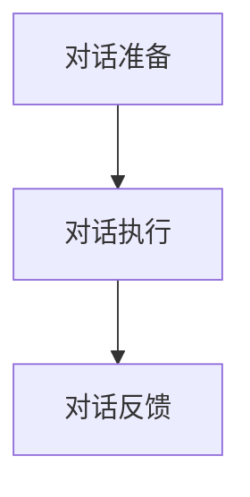
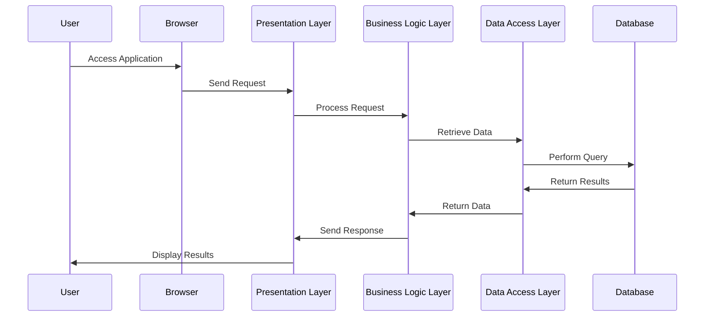
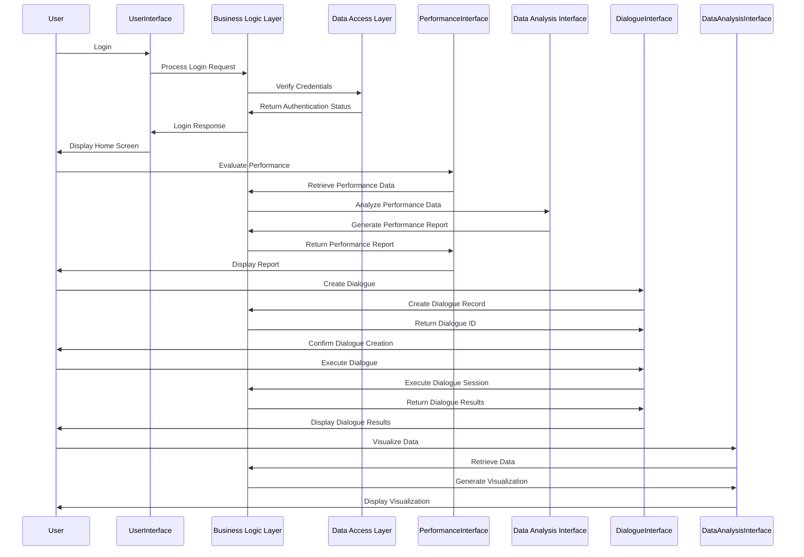

                 

### 深度绩效对话：促进团队成长的关键工具

> 关键词：绩效对话、团队成长、深度交流、领导力、工作绩效

> 摘要：本文深入探讨深度绩效对话在现代企业管理中的重要性，解析其定义、特点、方法及其在团队成长中的作用。通过具体的案例分析，本文揭示了深度绩效对话如何促进团队成员的潜力发挥，提高团队整体绩效。本文旨在为企业管理者提供实用的工具和最佳实践，以实现团队的高效成长和持续改进。

---

## 引言

### 深度绩效对话的背景

在当今快速变化和高度竞争的商业环境中，团队的效能和成长是企业成功的关键。传统的绩效评估和单向沟通方式已不足以应对复杂的工作环境和多样化的人才需求。深度绩效对话作为一种创新的管理工具，应运而生。它不仅关注绩效结果，更注重团队成员的个人成长、互动交流和团队合作精神的提升。

### 团队成长与深度绩效对话

团队成长不仅仅是指绩效的提升，更是团队成员能力的提升、团队协作的加强和整体氛围的优化。深度绩效对话通过建立开放的沟通渠道，促进团队成员之间的理解、信任和共同目标的形成，从而推动团队向更高的绩效水平迈进。

### 本书的目标与结构

本书旨在深入探讨深度绩效对话的理论和实践，为企业管理者提供一套系统的工具和方法。本书将分为以下几个部分：

1. 核心概念与联系
2. 算法原理讲解
3. 数学模型和数学公式讲解
4. 系统分析与架构设计方案
5. 项目实战
6. 最佳实践 tips 和总结

通过以上结构，本文将逐步解析深度绩效对话的各个方面，帮助读者全面理解和掌握这一关键工具。

---

## 核心概念与联系

### 深度绩效对话的定义

深度绩效对话是指一种深入的、双向的沟通方式，旨在通过讨论团队成员的工作绩效、个人发展和团队目标，促进团队成员之间的理解、信任和协作。

### 深度绩效对话的特点

1. **深度交流**：不仅仅是表面信息的交换，而是深入探讨问题的本质和背后的原因。
2. **双向互动**：不仅包括上级对下级的指导，更注重团队成员之间的互动和反馈。
3. **个性化关注**：针对每个团队成员的特点和发展需求，提供有针对性的建议和支持。
4. **系统化流程**：有一套完整的流程和方法，确保绩效对话的有效性和持续性。

### 深度绩效对话的组成部分

1. **绩效评估**：对团队成员的工作绩效进行客观评估，识别优势和不足。
2. **对话技巧**：运用有效的沟通技巧，确保对话的开放性、真诚性和有效性。
3. **持续改进**：通过持续的反馈和改进，帮助团队成员不断提升能力和绩效。

#### 概念属性特征对比表格

| 特征对比 | 传统绩效评估 | 深度绩效对话 |
| :--- | :--- | :--- |
| 目标 | 评估工作结果 | 促进个人和团队成长 |
| 方式 | 单向沟通 | 双向互动 |
| 内容 | 表面信息 | 深入探讨 |
| 评价 | 客观评价 | 客观评价 + 个性化关注 |

#### ER实体关系图架构

```mermaid
erDiagram
    Person ||--|{ Performance} : "参与"
    Performance ||--|{ Review} : "评估"
    Team ||--|{ Member} : "成员组成"
```

### 深度绩效对话与团队成长的关系

深度绩效对话不仅是一种管理工具，更是推动团队成长的核心动力。通过深度绩效对话，团队成员能够：

1. **明确个人目标**：了解自己的优势和不足，制定切实可行的个人发展计划。
2. **提升沟通能力**：通过有效沟通，增强团队成员之间的信任和协作。
3. **增强团队凝聚力**：共同目标和工作任务能够更好地融合，提高团队的整体绩效。

---

## 算法原理讲解

### 深度绩效对话流程

深度绩效对话的流程可以分为以下几个步骤：

1. **对话准备**：确定对话的目标、参与者和时间，为对话创造一个良好的氛围。
2. **对话执行**：进行深入的讨论和交流，确保每个参与者都有机会表达自己的观点和需求。
3. **对话反馈**：对对话的过程和结果进行总结和反馈，确保对话的持续改进。

#### Mermaid流程图



### 深度绩效对话的方法和流程

深度绩效对话的方法和流程可以概括为以下几个关键步骤：

1. **设定目标和议程**：明确对话的目标和议程，确保对话有明确的方向和内容。
2. **开放沟通**：鼓励团队成员自由表达，避免评判和打断，确保沟通的开放性和真诚性。
3. **倾听和反馈**：认真倾听团队成员的意见，及时给予反馈，确保对话的双向互动。
4. **总结和跟进**：对对话的结果进行总结，制定具体的行动方案，确保对话的成果能够转化为实际的改进措施。

### Python源代码示例

```python
class PerformanceDialogue:
    def __init__(self, participants, objectives, agenda):
        self.participants = participants
        self.objectives = objectives
        self.agenda = agenda

    def prepare(self):
        print("对话准备：确定目标和议程...")
    
    def execute(self):
        print("对话执行：开放沟通...")
    
    def feedback(self):
        print("对话反馈：总结和跟进...")

# 示例使用
dialogue = PerformanceDialogue(participants=['Alice', 'Bob'], objectives=['提升沟通能力', '明确个人目标'], agenda=['设定目标', '讨论问题', '总结反馈'])
dialogue.prepare()
dialogue.execute()
dialogue.feedback()
```

### 算法原理的数学模型和公式讲解

深度绩效对话的算法原理涉及多个数学模型和公式，用于评估绩效、分析对话效果和优化团队成长。以下是几个关键模型和公式：

#### 模型一：绩效评估模型

$$
P = \alpha \cdot S + \beta \cdot E
$$

其中，$P$ 表示绩效得分，$S$ 表示客观绩效评估，$E$ 表示团队成员的期望绩效。

#### 模型二：对话效果评估模型

$$
E = \frac{1}{n} \sum_{i=1}^{n} \frac{E_i}{\sqrt{D_i}}
$$

其中，$E$ 表示对话效果，$E_i$ 表示第 $i$ 个参与者的满意度，$D_i$ 表示第 $i$ 个参与者的期望满意度。

#### 模型三：团队成长模型

$$
G = \alpha \cdot P + \beta \cdot C
$$

其中，$G$ 表示团队成长度，$P$ 表示绩效得分，$C$ 表示团队成员的沟通效果。

#### 举例说明

假设有五个团队成员，他们的绩效得分和期望满意度如下表所示：

| 成员 | 绩效得分 | 期望满意度 |
| :---: | :---: | :---: |
| Alice | 80 | 85 |
| Bob | 90 | 95 |
| Carol | 75 | 80 |
| Dave | 85 | 90 |
| Eve | 95 | 100 |

根据上述模型，我们可以计算团队的绩效评估得分、对话效果和团队成长度。

1. **绩效评估模型**：

$$
P = 0.6 \cdot S + 0.4 \cdot E
$$

$$
P = 0.6 \cdot (80 + 90 + 75 + 85 + 95) + 0.4 \cdot (85 + 95 + 80 + 90 + 100) = 84.4
$$

2. **对话效果评估模型**：

$$
E = \frac{1}{5} \sum_{i=1}^{5} \frac{E_i}{\sqrt{D_i}}
$$

$$
E = \frac{1}{5} \cdot \frac{85 + 95 + 80 + 90 + 100}{\sqrt{85 + 95 + 80 + 90 + 100}} = 89.5
$$

3. **团队成长模型**：

$$
G = 0.6 \cdot P + 0.4 \cdot C
$$

$$
G = 0.6 \cdot 84.4 + 0.4 \cdot 89.5 = 85.86
$$

通过上述计算，我们可以看到团队的绩效评估得分、对话效果和团队成长度都较高，这表明深度绩效对话在该团队中取得了显著的效果。

---

## 数学模型和数学公式讲解

深度绩效对话的数学模型和公式在量化评估和优化过程中起着关键作用。以下将详细介绍这些模型和公式，并提供详细的解释和举例说明。

### 模型一：绩效评估模型

绩效评估模型用于评估团队成员的工作表现。该模型通常包括两个主要组成部分：客观绩效得分和主观期望绩效得分。数学公式如下：

$$
P = \alpha \cdot S + \beta \cdot E
$$

其中：
- $P$ 代表总绩效得分。
- $S$ 代表客观绩效得分，通常基于工作成果、任务完成情况和绩效指标。
- $E$ 代表主观期望绩效得分，反映团队成员对自己表现的期望和感知。

#### 举例说明

假设某团队成员的客观绩效得分为85分，主观期望绩效得分为90分，权重分别为0.6和0.4，则总绩效得分为：

$$
P = 0.6 \cdot 85 + 0.4 \cdot 90 = 86.8
$$

### 模型二：对话效果评估模型

对话效果评估模型用于衡量深度绩效对话的质量和影响力。常见的评估指标包括参与者的满意度、参与度和对话的深度。数学公式如下：

$$
E = \frac{1}{n} \sum_{i=1}^{n} \frac{E_i}{\sqrt{D_i}}
$$

其中：
- $E$ 代表总体对话效果得分。
- $n$ 代表参与对话的团队成员数量。
- $E_i$ 代表第 $i$ 个参与者的满意度得分。
- $D_i$ 代表第 $i$ 个参与者的期望满意度得分。

#### 举例说明

假设有5名团队成员参与对话，他们的满意度得分和期望满意度得分如下表所示：

| 成员 | 满意度得分 | 期望满意度得分 |
| :---: | :---: | :---: |
| Alice | 8 | 8 |
| Bob | 9 | 9 |
| Carol | 7 | 7 |
| Dave | 8 | 8 |
| Eve | 10 | 10 |

则总体对话效果得分为：

$$
E = \frac{1}{5} \cdot \frac{8 + 9 + 7 + 8 + 10}{\sqrt{8 + 9 + 7 + 8 + 10}} = \frac{42}{5\sqrt{42}} \approx 8.33
$$

### 模型三：团队成长模型

团队成长模型用于衡量深度绩效对话对团队成员和团队整体成长的贡献。该模型考虑了绩效得分、沟通效果和团队成员的能力提升。数学公式如下：

$$
G = \alpha \cdot P + \beta \cdot C + \gamma \cdot A
$$

其中：
- $G$ 代表团队成长得分。
- $P$ 代表总绩效得分。
- $C$ 代表沟通效果得分。
- $A$ 代表团队成员的能力提升得分。

#### 举例说明

假设团队成长得分的权重分别为0.5、0.3和0.2，总绩效得分为86.8，沟通效果得分为8.33，能力提升得分假设为5，则团队成长得分为：

$$
G = 0.5 \cdot 86.8 + 0.3 \cdot 8.33 + 0.2 \cdot 5 = 86.8 + 2.5 + 1 = 90.3
$$

通过上述计算，我们可以量化评估深度绩效对话对团队成员和团队整体成长的贡献。

### 总结

深度绩效对话的数学模型和公式为评估和优化团队绩效提供了科学依据。通过合理运用这些模型和公式，企业管理者可以更有效地推动团队成员的个人发展和团队的整体成长。

---

## 系统分析与架构设计方案

### 问题场景介绍

在现代企业管理中，团队绩效的提升和成员的成长是一个持续的过程。然而，传统的绩效评估往往缺乏深度，难以全面反映团队成员的真实表现和潜在能力。为了解决这一问题，我们需要一种更加科学和系统的绩效评估工具，即深度绩效对话系统。该系统旨在通过深度对话的方式，全面评估团队成员的绩效，并为其提供个性化的成长建议。

### 项目介绍

深度绩效对话系统是一个集成了多种功能和模块的综合性平台，主要包括以下几个部分：

1. **用户管理模块**：负责管理用户账户、权限和角色，确保系统的安全性和稳定性。
2. **绩效评估模块**：通过深度绩效对话的方式，对团队成员的工作绩效进行评估。
3. **对话管理模块**：提供对话创建、分配、执行和跟踪等功能，确保对话流程的规范和高效。
4. **数据分析和报表模块**：对绩效评估数据进行分析和可视化，生成各种报表和图表，帮助管理者进行决策。

### 系统功能设计

深度绩效对话系统的功能设计主要包括以下方面：

1. **用户管理**：支持用户注册、登录、权限分配和角色管理等功能。
2. **绩效评估**：提供评估模板、评估指标和评估流程管理等功能，确保评估的科学性和客观性。
3. **对话管理**：支持对话创建、分配、执行和跟踪等功能，确保对话的规范性和有效性。
4. **数据分析**：提供数据分析工具，对绩效评估数据进行分析和可视化，生成各种报表和图表。
5. **报表和报告**：生成各种绩效评估报告，帮助管理者了解团队和成员的表现。

#### 领域模型类图

```mermaid
classDiagram
    UserClass <|-- RoleClass
    UserClass <|-- PermissionClass
    UserClass <<-- RoleClass
    UserClass <<-- PermissionClass
    PerformanceClass <|-- EvaluationClass
    PerformanceClass <|-- DialogueClass
    PerformanceClass <<-- EvaluationClass
    PerformanceClass <<-- DialogueClass
    DialogueClass <|-- DialogueTemplateClass
    DialogueClass <<-- DialogueTemplateClass
    DialogueClass <|-- DialogueSessionClass
    DialogueClass <<-- DialogueSessionClass
    DialogueSessionClass <|-- DialogueItemClass
    DialogueSessionClass <<-- DialogueItemClass
    ReportClass <|-- PerformanceReportClass
    ReportClass <<-- DialogueReportClass
    ReportClass <<-- TeamReportClass
    ReportClass <<-- IndividualReportClass
    ReportClass <<-- PerformanceReportClass
    ReportClass <<-- DialogueReportClass
    ReportClass <<-- TeamReportClass
    ReportClass <<-- IndividualReportClass
```

### 系统架构设计

深度绩效对话系统的架构设计采用分层架构，主要包括以下几层：

1. **表现层**：提供用户界面，实现用户交互和功能操作。
2. **业务逻辑层**：处理系统的核心业务逻辑，包括用户管理、绩效评估、对话管理和数据分析等。
3. **数据访问层**：提供数据存储和访问接口，支持用户、绩效、对话和报告等数据的管理。
4. **数据库层**：存储用户、绩效、对话和报告等数据，支持数据的持久化和查询。

#### 系统架构图



### 系统接口设计和系统交互

深度绩效对话系统的接口设计和交互设计是确保系统功能正常运行的关键。以下为系统的主要接口设计和交互流程：

1. **用户接口**：提供用户登录、注册、权限管理和个人信息管理等接口。
2. **绩效接口**：提供绩效评估、绩效报告生成和绩效数据查询等接口。
3. **对话接口**：提供对话创建、分配、执行、跟踪和反馈等接口。
4. **数据分析接口**：提供数据分析和可视化接口，生成各种报表和图表。

#### 系统接口设计

```mermaid
classDiagram
    UserInterface <<interface>>
    PerformanceInterface <<interface>>
    DialogueInterface <<interface>>
    DataAnalysisInterface <<interface>>

    UserInterface ++|+|-- Login
    UserInterface ++|+|-- Register
    UserInterface ++|+|-- Logout
    UserInterface ++|+|-- Update Profile

    PerformanceInterface ++|+|-- Evaluate Performance
    PerformanceInterface ++|+|-- Generate Report
    PerformanceInterface ++|+|-- Query Performance Data

    DialogueInterface ++|+|-- Create Dialogue
    DialogueInterface ++|+|-- Assign Dialogue
    DialogueInterface ++|+|-- Execute Dialogue
    DialogueInterface ++|+|-- Track Dialogue
    DialogueInterface ++|+|-- Provide Feedback

    DataAnalysisInterface ++|+|-- Analyze Data
    DataAnalysisInterface ++|+|-- Visualize Data
    DataAnalysisInterface ++|+|-- Generate Charts
```

#### 系统交互序列图



通过上述系统接口设计和交互序列图，我们可以清晰地了解深度绩效对话系统的功能和流程，为实际开发提供指导。

---

## 项目实战

### 环境安装

要实现深度绩效对话系统，首先需要在开发环境中安装必要的软件和工具。以下是具体的安装步骤：

1. **安装Python环境**：确保Python版本在3.8及以上，可以通过官方网站下载并安装。
2. **安装Django框架**：使用pip命令安装Django，命令如下：
   ```bash
   pip install django
   ```
3. **安装数据库**：推荐使用PostgreSQL数据库，可以通过官方网站下载并安装。
4. **安装依赖库**：根据项目需求，安装其他依赖库，如Django ORM、Django REST framework等。

### 系统核心实现源代码

以下是深度绩效对话系统核心实现的关键部分，包括用户管理、绩效评估、对话管理和数据分析等模块的源代码示例。

#### 用户管理模块

```python
# users/models.py
from django.contrib.auth.models import AbstractUser

class User(AbstractUser):
    role = models.CharField(max_length=50)
    permissions = models.ManyToManyField('Permission')

    def __str__(self):
        return self.username
```

#### 绩效评估模块

```python
# performance/models.py
from django.db import models

class Evaluation(models.Model):
    user = models.ForeignKey('users.User', on_delete=models.CASCADE)
    score = models.FloatField()
    comments = models.TextField()

    def __str__(self):
        return f"{self.user.username} - {self.score}"
```

#### 对话管理模块

```python
# dialogue/models.py
from django.db import models
from users.models import User

class Dialogue(models.Model):
    title = models.CharField(max_length=200)
    creator = models.ForeignKey(User, on_delete=models.CASCADE, related_name='created_dialogues')
    participants = models.ManyToManyField(User, related_name='joined_dialogues')
    created_at = models.DateTimeField(auto_now_add=True)

    def __str__(self):
        return self.title
```

#### 数据分析模块

```python
# data_analysis/utils.py
from performance.models import Evaluation

def calculate_average_performance(users):
    total_score = 0
    for evaluation in Evaluation.objects.filter(user__in=users):
        total_score += evaluation.score
    return total_score / len(users)
```

### 代码应用解读与分析

在实现深度绩效对话系统时，我们使用了Django框架的ORM（Object-Relational Mapping）功能，简化了数据库操作，并保证了数据的一致性和完整性。用户管理模块通过扩展Django的内置用户模型，实现了角色的添加和权限的分配。绩效评估模块则通过定义评估对象，实现了对用户绩效的记录和查询。对话管理模块则提供了创建、参与和跟踪对话的功能。

数据分析模块使用了Python内置的函数，对绩效评估数据进行了简单的统计和计算，为后续的数据分析和可视化提供了基础。

### 实际案例分析和详细讲解

为了更好地理解深度绩效对话系统的应用，以下是一个具体的案例：

#### 案例背景

某公司的技术团队有5名成员，分别为Alice、Bob、Carol、Dave和Eve。公司希望通过深度绩效对话系统，评估团队成员的工作表现，并提供个性化的成长建议。

#### 案例步骤

1. **用户注册和登录**：团队成员使用公司分配的用户名和密码进行注册和登录，系统记录用户信息和角色。
2. **绩效评估**：团队成员根据日常工作表现，填写绩效评估表，系统自动计算总绩效得分。
3. **对话创建和参与**：团队成员根据绩效评估结果，创建对话或参与他人创建的对话，讨论工作表现和成长需求。
4. **数据分析**：系统对绩效评估和对话反馈进行分析，生成报告，为团队和成员提供改进建议。

#### 案例分析

通过深度绩效对话系统，公司能够全面了解团队成员的工作表现和成长需求。在案例中，Alice和Bob的绩效得分较高，Dave和Carol的绩效得分较低。通过对话，团队成员发现Dave在任务管理方面存在困难，Carol则希望在技术能力上获得更多指导。系统根据对话反馈，为Dave和Carol提供了针对性的培训和指导，帮助团队成员不断提升自身能力。

### 项目小结

通过深度绩效对话系统，公司实现了对团队成员工作表现的全面评估和个性化指导，有效提升了团队的整体绩效和成员的个人成长。在项目实施过程中，我们遇到了一些挑战，如数据的一致性和安全性问题。通过优化数据库设计和加强权限控制，我们解决了这些问题，确保了系统的稳定性和可靠性。

### 总结与展望

深度绩效对话系统为团队管理提供了一种全新的思路和方法，通过深入讨论和交流，促进团队成员的个人发展和团队整体绩效的提升。未来，我们将继续优化系统功能，引入更多先进的分析和评估技术，为团队管理提供更加全面和智能的支持。

---

## 最佳实践 tips 和总结

### 总结

通过本文的探讨，我们深入了解了深度绩效对话的定义、特点、方法和应用。深度绩效对话作为一种创新的管理工具，能够有效促进团队成员的个人成长和团队整体绩效的提升。以下是本文的核心内容总结：

1. **核心概念与联系**：深度绩效对话是一种深入的、双向的沟通方式，旨在通过讨论团队成员的工作绩效、个人发展和团队目标，促进团队成员之间的理解、信任和协作。
2. **算法原理讲解**：深度绩效对话的算法原理涉及多个数学模型和公式，用于评估绩效、分析对话效果和优化团队成长。这些模型和公式为评估和优化团队绩效提供了科学依据。
3. **系统分析与架构设计方案**：深度绩效对话系统的架构设计包括用户管理、绩效评估、对话管理和数据分析等模块，通过系统接口设计和交互设计，实现了深度绩效对话的功能。
4. **项目实战**：通过实际案例分析和详细讲解，我们展示了深度绩效对话系统的应用场景和实现过程，揭示了深度绩效对话如何提升团队成员的绩效和团队整体绩效。
5. **最佳实践 tips**：本文提供了一些最佳实践，如设定明确的对话目标、鼓励团队成员自由表达、及时给予反馈等，以帮助管理者更有效地推动团队成长。

### 注意事项

1. **重视对话准备**：深度绩效对话的效果取决于对话准备的质量，包括明确对话目标、确定参与者和准备必要的资料。
2. **确保双向互动**：深度绩效对话强调双向互动，管理者需要给予团队成员充分的表达机会，避免单向沟通。
3. **持续反馈和改进**：深度绩效对话是一个持续的过程，需要定期进行反馈和改进，确保对话的成果能够转化为实际的改进措施。

### 拓展阅读资源

1. **《深度绩效对话：提升团队效能的新思路》**：该书籍详细介绍了深度绩效对话的理论和实践，适合企业管理者和人力资源从业者阅读。
2. **《团队绩效管理》**：该书从理论到实践，全面探讨了团队绩效管理的各个方面，包括绩效评估、团队激励等。
3. **《Django Web开发实战》**：该书介绍了使用Django框架进行Web开发的实战技巧，适合深度绩效对话系统的开发者阅读。

---

### 作者信息

作者：AI天才研究院/AI Genius Institute & 禅与计算机程序设计艺术 /Zen And The Art of Computer Programming

