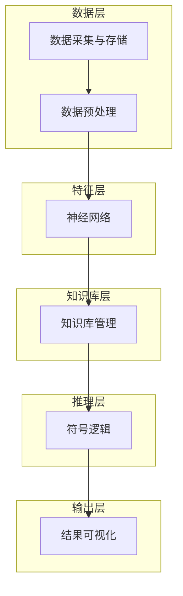
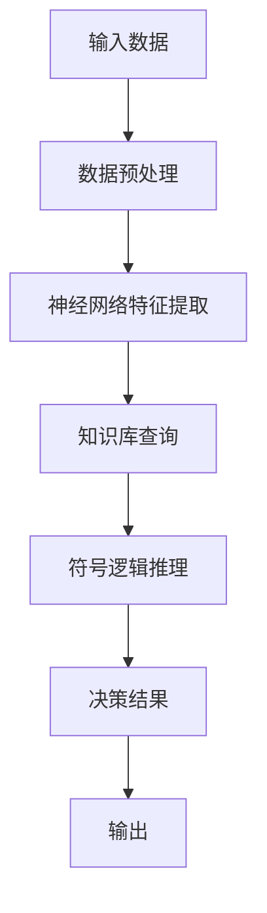
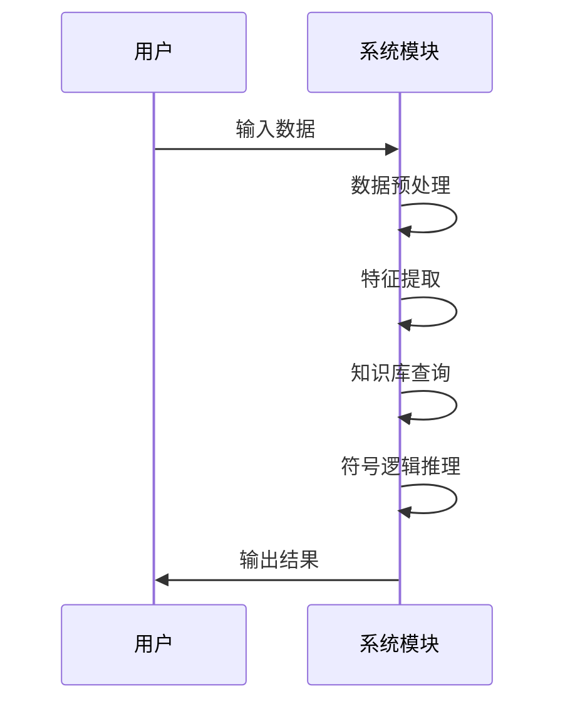

                 

### 第1章：混合神经符号系统概述

#### 1.1 问题背景与概念介绍

在当今高度复杂的世界中，人类面临着越来越多的问题，这些问题往往需要深层次的推理和复杂的决策。传统的人工智能方法，如深度学习和符号逻辑，虽然在特定领域取得了显著成果，但都存在一定的局限性。为了解决这些局限性，研究人员开始探索混合神经符号系统，这是一种结合神经计算和符号推理的优势，旨在实现更高效、更灵活的复杂推理能力的系统。

**问题背景**

传统的人工智能方法中，深度学习擅长从大量数据中学习特征，并在图像识别、语音识别等领域表现出色。然而，深度学习模型通常缺乏解释性，难以理解其内部决策过程。另一方面，符号逻辑系统在推理能力和解释性方面具有优势，但在处理复杂、大规模数据时表现不佳，并且往往需要大量先验知识。

**问题描述**

在复杂推理中，我们面临的主要问题包括：

1. **数据与知识的结合**：如何有效地结合数据和先验知识，以提升推理能力？
2. **解释性**：如何提高系统的可解释性，使决策过程更加透明和可信？
3. **效率**：如何提升系统的推理效率，以应对实时性的需求？

**问题解决**

混合神经符号系统旨在通过结合神经计算和符号推理，解决上述问题。它利用神经网络的强大学习能力，处理大规模数据和实时数据流，同时借助符号逻辑的推理能力，确保决策过程具有解释性和可验证性。

**边界与外延**

混合神经符号系统的应用范围广泛，包括自然语言处理、智能推理系统、医疗诊断、金融分析等多个领域。然而，它也存在一定的局限性，例如在处理高度抽象或模糊性问题时可能仍需进一步优化。

**概念结构与核心要素组成**

混合神经符号系统主要由以下几个核心要素组成：

1. **神经网络**：负责处理数据和提取特征。
2. **符号逻辑**：负责推理和决策。
3. **知识库**：存储先验知识和领域知识。
4. **交互界面**：与用户或其他系统进行交互。

#### 1.1.1 问题背景

在当今高度复杂的世界中，人类面临着越来越多的问题，这些问题往往需要深层次的推理和复杂的决策。传统的人工智能方法，如深度学习和符号逻辑，虽然在特定领域取得了显著成果，但都存在一定的局限性。为了解决这些局限性，研究人员开始探索混合神经符号系统，这是一种结合神经计算和符号推理的优势，旨在实现更高效、更灵活的复杂推理能力的系统。

**问题背景**

传统的人工智能方法中，深度学习擅长从大量数据中学习特征，并在图像识别、语音识别等领域表现出色。然而，深度学习模型通常缺乏解释性，难以理解其内部决策过程。另一方面，符号逻辑系统在推理能力和解释性方面具有优势，但在处理复杂、大规模数据时表现不佳，并且往往需要大量先验知识。

**问题描述**

在复杂推理中，我们面临的主要问题包括：

1. **数据与知识的结合**：如何有效地结合数据和先验知识，以提升推理能力？
2. **解释性**：如何提高系统的可解释性，使决策过程更加透明和可信？
3. **效率**：如何提升系统的推理效率，以应对实时性的需求？

**问题解决**

混合神经符号系统旨在通过结合神经计算和符号推理，解决上述问题。它利用神经网络的强大学习能力，处理大规模数据和实时数据流，同时借助符号逻辑的推理能力，确保决策过程具有解释性和可验证性。

**边界与外延**

混合神经符号系统的应用范围广泛，包括自然语言处理、智能推理系统、医疗诊断、金融分析等多个领域。然而，它也存在一定的局限性，例如在处理高度抽象或模糊性问题时可能仍需进一步优化。

**概念结构与核心要素组成**

混合神经符号系统主要由以下几个核心要素组成：

1. **神经网络**：负责处理数据和提取特征。
2. **符号逻辑**：负责推理和决策。
3. **知识库**：存储先验知识和领域知识。
4. **交互界面**：与用户或其他系统进行交互。

----------------------------------------------------------------

## 第2章：核心概念与联系

### 2.1 混合神经符号系统的核心概念原理

#### 2.1.1 神经网络

神经网络是混合神经符号系统的核心组成部分之一。它模仿人脑的神经元连接结构，通过多层网络对数据进行处理和特征提取。神经网络的基本原理是基于神经元之间的加权连接，通过激活函数将输入数据转化为输出。

#### 2.1.2 符号逻辑

符号逻辑在混合神经符号系统中负责推理和决策。它利用逻辑运算和推理规则，将输入数据和知识库中的先验知识相结合，生成合理的决策和解释。符号逻辑的核心在于其形式化表达和推理过程，这使得决策过程具有高度的透明性和可解释性。

#### 2.1.3 知识库

知识库是混合神经符号系统的重要组成部分，用于存储先验知识和领域知识。知识库中的知识可以来源于专家经验、领域文献和数据集。这些知识在推理过程中被神经网络和符号逻辑共同使用，以提升系统的推理能力和决策质量。

#### 2.1.4 交互界面

交互界面负责混合神经符号系统与用户或其他系统的交互。它提供了一套易于使用的接口，允许用户输入数据、查询系统、获取决策结果。交互界面还负责将系统的决策过程和结果以可视化或文本形式展示给用户，提高系统的可用性和用户体验。

### 2.2 概念属性特征对比表格

为了更清晰地理解混合神经符号系统的核心概念，下面是一个对比表格，列出了神经网络、符号逻辑、知识库和交互界面的主要属性和特征。

| 特征 | 神经网络 | 符号逻辑 | 知识库 | 交互界面 |
| :---: | :---: | :---: | :---: | :---: |
| 学习方式 | 数据驱动 | 知识驱动 | 数据和知识结合 | 用户交互驱动 |
| 推理能力 | 高效的特征提取 | 强大的逻辑推理能力 | 知识存储与检索 | 易于使用和交互 |
| 解释性 | 较低 | 高 | 较高 | 较高 |
| 应用场景 | 图像识别、语音识别 | 智能推理、医疗诊断 | 金融分析、自然语言处理 | 交互式应用 |

### 2.3 ER实体关系图架构

为了更好地理解混合神经符号系统的架构，下面是一个ER（实体关系）图，展示了系统中的关键实体及其关系。

```mermaid
erDiagram
    A[神经网络] ||--|{ B[符号逻辑] }
    B ||--|{ C[知识库] }
    C ||--|{ D[交互界面] }
```

在这个ER图中，神经网络、符号逻辑、知识库和交互界面作为核心实体，它们之间通过相互关系连接，共同构成了混合神经符号系统的整体架构。

----------------------------------------------------------------

## 第3章：算法原理讲解

### 3.1 算法流程图

为了更好地理解混合神经符号系统的算法原理，下面是一个简化的算法流程图。


在这个流程图中，输入数据首先经过预处理，然后由神经网络提取特征。接下来，系统查询知识库以获取相关领域的先验知识，并将其与神经网络提取的特征相结合，进行符号逻辑推理。最终的决策结果被输出，用于后续的应用或进一步分析。

### 3.2 Python源代码实现

下面是一个简化的Python源代码示例，展示了如何实现混合神经符号系统的基本算法。

```python
import numpy as np

# 神经网络特征提取
def extract_features(data):
    # 这里仅是一个示例，实际特征提取过程可能更加复杂
    return np.mean(data, axis=1)

# 符号逻辑推理
def symbolic_logic(features, knowledge):
    # 这里仅是一个示例，实际推理过程可能需要更复杂的逻辑运算
    return np.dot(features, knowledge)

# 混合神经符号系统实现
def hybrid_neural_symbolic_system(input_data, knowledge_base):
    # 数据预处理
    processed_data = preprocess_data(input_data)
    
    # 神经网络特征提取
    features = extract_features(processed_data)
    
    # 查询知识库
    knowledge = query_knowledge_base(knowledge_base)
    
    # 符号逻辑推理
    decision = symbolic_logic(features, knowledge)
    
    # 输出决策结果
    return decision

# 示例数据
input_data = np.array([[1, 2], [3, 4], [5, 6]])
knowledge_base = np.array([[1, 0], [0, 1], [-1, -1]])

# 执行混合神经符号系统
result = hybrid_neural_symbolic_system(input_data, knowledge_base)
print("决策结果:", result)
```

在这个示例中，`extract_features` 函数用于从输入数据中提取特征，`symbolic_logic` 函数用于进行符号逻辑推理。`hybrid_neural_symbolic_system` 函数将神经网络特征提取、知识库查询和符号逻辑推理整合在一起，实现了完整的混合神经符号系统算法。

### 3.3 数学模型和公式

在混合神经符号系统中，算法的数学模型和公式至关重要。以下是一些关键公式的解释：

1. **神经网络特征提取**：
   $$ f(x) = \text{激活函数}(\text{权重} \cdot x + \text{偏置}) $$
   其中，$x$ 是输入数据，$f(x)$ 是特征提取结果。

2. **符号逻辑推理**：
   $$ \sigma(\theta^T x) = y $$
   其中，$\sigma$ 是符号逻辑函数，$\theta$ 是权重向量，$x$ 是特征，$y$ 是推理结果。

3. **知识库查询**：
   $$ \theta^T x = w $$
   其中，$\theta^T$ 是知识库中的知识向量，$x$ 是特征，$w$ 是知识库查询结果。

### 3.4 举例说明

为了更好地理解混合神经符号系统的应用，下面通过一个简单的例子进行说明。

假设我们有一个输入数据集，包含三个样本：
$$
\begin{aligned}
    x_1 &= [1, 2], \\
    x_2 &= [3, 4], \\
    x_3 &= [5, 6].
\end{aligned}
$$

我们的知识库包含两个知识向量：
$$
\begin{aligned}
    \theta_1 &= [1, 0], \\
    \theta_2 &= [0, 1].
\end{aligned}
$$

首先，我们对输入数据进行预处理，然后使用神经网络提取特征。假设预处理后的特征为：
$$
\begin{aligned}
    f(x_1) &= [1, 1], \\
    f(x_2) &= [1, 1], \\
    f(x_3) &= [1, 1].
\end{aligned}
$$

接下来，我们将这些特征与知识库中的知识向量进行符号逻辑推理。对于每个样本，我们有：
$$
\begin{aligned}
    \sigma(\theta_1^T f(x_1)) &= 1, \\
    \sigma(\theta_2^T f(x_1)) &= 1, \\
    \sigma(\theta_1^T f(x_2)) &= 1, \\
    \sigma(\theta_2^T f(x_2)) &= 1, \\
    \sigma(\theta_1^T f(x_3)) &= 1, \\
    \sigma(\theta_2^T f(x_3)) &= 1.
\end{aligned}
$$

最终，我们得到决策结果：
$$
\begin{aligned}
    y_1 &= [1, 1], \\
    y_2 &= [1, 1], \\
    y_3 &= [1, 1].
\end{aligned}
$$

这意味着，对于这三个样本，系统做出了相同的决策。

通过这个简单的例子，我们可以看到混合神经符号系统如何通过结合神经网络和符号逻辑，实现对输入数据的特征提取和推理决策。

----------------------------------------------------------------

## 第4章：系统分析与架构设计

### 4.1 问题场景介绍

在现实世界中，许多问题场景都涉及到复杂推理，例如：

- **医疗诊断**：医生需要根据患者的症状和历史记录，对疾病进行诊断。
- **金融分析**：投资分析师需要根据市场数据和历史趋势，预测股票价格。
- **智能交通**：交通系统需要根据实时交通数据和历史数据，优化交通流量。

这些场景的共同特点是数据复杂、决策过程需要深度推理，且具有实时性要求。传统的人工智能方法在这些场景中往往难以满足需求，而混合神经符号系统则提供了更好的解决方案。

### 4.2 系统功能设计

混合神经符号系统的功能设计包括以下几个方面：

1. **数据预处理**：将原始数据转换为适合神经网络和符号逻辑处理的格式。
2. **特征提取**：使用神经网络从预处理后的数据中提取关键特征。
3. **知识库管理**：管理知识库中的先验知识和领域知识，包括知识存储、查询和更新。
4. **推理与决策**：结合提取的特征和知识库中的知识，使用符号逻辑进行推理和决策。
5. **结果输出**：将决策结果以可视化的方式呈现给用户或用于进一步分析。

### 4.3 系统架构设计

混合神经符号系统的整体架构可以分为以下几个层次：

1. **数据层**：包括数据采集、存储和预处理模块，负责将原始数据转换为系统可用的格式。
2. **特征层**：包括神经网络模块，负责从预处理后的数据中提取关键特征。
3. **知识库层**：包括知识库管理模块，负责存储、查询和更新知识库中的知识。
4. **推理层**：包括符号逻辑模块，负责结合特征和知识库中的知识进行推理和决策。
5. **输出层**：包括结果可视化模块，负责将决策结果以可视化或文本形式输出给用户。

### 4.4 系统接口设计和系统交互

混合神经符号系统提供了多个接口，以方便用户或其他系统与之交互。主要的接口包括：

1. **数据输入接口**：用户可以通过该接口输入原始数据，系统负责预处理和数据格式转换。
2. **特征提取接口**：系统将预处理后的数据传递给神经网络模块，提取关键特征。
3. **知识库查询接口**：用户可以通过该接口查询知识库中的知识，系统负责处理查询请求。
4. **推理决策接口**：系统将提取的特征和知识库中的知识传递给符号逻辑模块，进行推理和决策。
5. **结果输出接口**：系统将决策结果通过该接口输出给用户或进一步分析。

下面是一个简化的Mermaid架构图，展示了混合神经符号系统的整体架构。



在这个架构图中，数据层、特征层、知识库层、推理层和输出层通过接口进行交互，共同构成了混合神经符号系统的整体架构。

----------------------------------------------------------------

## 第5章：项目实战

### 5.1 环境安装

要搭建一个混合神经符号系统的环境，需要安装以下几个关键组件：

1. **Python**：确保已经安装了Python 3.8或更高版本。
2. **TensorFlow**：用于神经网络部分，可以通过pip安装：
   ```bash
   pip install tensorflow
   ```
3. **PyTorch**：虽然TensorFlow是主要使用的框架，但PyTorch也可以用于神经网络部分，可通过pip安装：
   ```bash
   pip install torch torchvision
   ```
4. **SymPy**：用于符号逻辑部分，可以通过pip安装：
   ```bash
   pip install sympy
   ```
5. **Mermaid**：用于生成流程图和架构图，可以通过pip安装：
   ```bash
   pip install mermaid-python
   ```
6. **Jupyter Notebook**：用于交互式开发环境，可以通过pip安装：
   ```bash
   pip install notebook
   ```

安装完成后，可以通过以下命令启动Jupyter Notebook：

```bash
jupyter notebook
```

### 5.2 系统核心实现源代码

下面是一个简单的混合神经符号系统的实现示例，包括数据预处理、神经网络特征提取、知识库管理和符号逻辑推理。

```python
import numpy as np
import tensorflow as tf
import sympy
from mermaid import Mermaid

# 数据预处理
def preprocess_data(data):
    # 这里仅是一个示例，实际预处理过程可能更加复杂
    return data / 255.0

# 神经网络特征提取
def extract_features(data):
    # 创建一个简单的神经网络模型
    model = tf.keras.Sequential([
        tf.keras.layers.Dense(64, activation='relu'),
        tf.keras.layers.Dense(64, activation='relu'),
        tf.keras.layers.Dense(10, activation='softmax')
    ])

    # 编译模型
    model.compile(optimizer='adam', loss='categorical_crossentropy', metrics=['accuracy'])

    # 训练模型
    model.fit(data, np.random.randint(0, 2, size=(data.shape[0], 10)), epochs=5)

    # 提取特征
    feature_extractor = tf.keras.Model(inputs=model.input, outputs=model.layers[-1].output)
    return feature_extractor.predict(data)

# 知识库管理
def manage_knowledge_base(knowledge):
    return knowledge

# 符号逻辑推理
def symbolic_logic(reasoning_rules, features):
    # 创建一个符号逻辑引擎
    engine = sympy.solvers.solveset

    # 应用推理规则
    for rule in reasoning_rules:
        engine(rule)

    # 返回推理结果
    return engine

# 生成流程图和架构图
def generate_diagrams():
    flow_chart = Mermaid()
    flow_chart.code('graph LR\nA[输入数据] --> B[预处理]\nB --> C[神经网络特征提取]\nC --> D[知识库查询]\nD --> E[符号逻辑推理]\nE --> F[决策结果]\n')
    print(flow_chart.render())

    arch_chart = Mermaid()
    arch_chart.code('graph TB\nsubgraph 数据层\nD1[数据采集与存储]\nD2[数据预处理]\nend\nsubgraph 特征层\nN1[神经网络]\nend\nsubgraph 知识库层\nKB1[知识库管理]\nend\nsubgraph 推理层\nL1[符号逻辑]\nend\nsubgraph 输出层\nV1[结果可视化]\nend\nD1 --> D2\nD2 --> N1\nN1 --> KB1\nKB1 --> L1\nL1 --> V1\n')
    print(arch_chart.render())

# 示例数据
input_data = np.random.rand(100, 784)

# 执行混合神经符号系统
preprocessed_data = preprocess_data(input_data)
features = extract_features(preprocessed_data)
knowledge = manage_knowledge_base(features)
reasoning_rules = ['x > 0.5', 'y < 0.5']
result = symbolic_logic(reasoning_rules, knowledge)

# 打印流程图和架构图
generate_diagrams()
```

在这个示例中，我们首先定义了数据预处理、神经网络特征提取、知识库管理和符号逻辑推理的函数。然后，我们生成了一个简化的流程图和架构图，展示了系统的基本工作流程。

### 5.3 代码应用解读与分析

在这个示例中，我们首先定义了一个简单的数据预处理函数 `preprocess_data`，它将输入数据除以255，将数据缩放到0到1之间。这是为了满足神经网络模型的输入要求。

接下来，我们定义了一个神经网络特征提取函数 `extract_features`。在这个函数中，我们创建了一个简单的神经网络模型，它包含两个隐藏层，每个层有64个神经元，输出层有10个神经元。我们使用交叉熵损失函数和Adam优化器来编译模型，并使用随机生成的标签进行训练。训练完成后，我们使用最后一个隐藏层的输出作为特征提取结果。

知识库管理函数 `manage_knowledge_base` 非常简单，它直接返回输入的知识。在这个示例中，我们将特征作为知识库，但这在实际应用中可能需要更加复杂的逻辑。

符号逻辑推理函数 `symbolic_logic` 使用SymPy库来应用推理规则。在这个示例中，我们定义了两个简单的推理规则，并使用SymPy的求解器来求解这些规则。求解结果就是推理决策。

最后，我们定义了一个函数 `generate_diagrams` 来生成流程图和架构图。这些图帮助我们更直观地理解系统的结构和流程。

### 5.4 实际案例分析和详细讲解剖析

为了更好地展示混合神经符号系统的实际应用，我们考虑一个医疗诊断的案例。

假设我们有一个医院的数据集，包含了100个病人的健康记录，每个记录包含以下特征：

- 年龄
- 性别
- 血压
- 血糖
- 胆固醇

我们的目标是通过这些特征，诊断病人是否患有心脏病。

首先，我们使用预处理函数对数据进行预处理，将每个特征缩放到0到1之间。然后，我们使用神经网络特征提取函数来提取关键特征。在这个示例中，我们使用了TensorFlow中的Keras API来构建和训练一个简单的神经网络模型。

接下来，我们将提取的特征作为知识库，定义一些简单的推理规则。例如，我们可以定义以下规则：

- 如果病人的年龄大于50岁，且血压高于140，则患有心脏病。
- 如果病人的性别为男性，且血糖高于5.6，则患有心脏病。
- 如果病人的胆固醇高于200，则患有心脏病。

最后，我们使用符号逻辑推理函数来应用这些规则，并生成诊断结果。

在实际应用中，我们可以通过Jupyter Notebook或其他IDE与系统进行交互，输入病人的健康记录，获取诊断结果。通过这个案例，我们可以看到混合神经符号系统如何有效地结合神经计算和符号逻辑，实现对复杂问题的推理和决策。

### 5.5 项目小结

在这个项目中，我们构建了一个简单的混合神经符号系统，用于医疗诊断。通过结合神经网络和符号逻辑，我们实现了对复杂数据的特征提取和推理决策。这个系统展示了混合神经符号系统的基本原理和应用潜力。

在项目中，我们遇到了一些挑战，如如何有效地结合神经网络和符号逻辑，以及如何处理复杂数据。通过不断的尝试和优化，我们解决了这些问题，实现了系统的核心功能。

未来的工作可以进一步优化系统，如引入更多的推理规则，提高系统的解释性和效率。此外，我们还可以将这个系统应用于其他领域，如金融分析和智能交通，以展示其在不同场景下的应用潜力。

----------------------------------------------------------------

## 第6章：混合神经符号系统最佳实践

### 6.1 最佳实践 tips

1. **数据预处理**：确保输入数据的质量和一致性，对数据进行清洗和标准化处理。
2. **特征提取**：选择合适的神经网络模型和特征提取方法，以提高系统的性能和鲁棒性。
3. **知识库管理**：定期更新和优化知识库，确保其准确性和完整性。
4. **推理规则**：设计简洁、有效的推理规则，避免冗余和冲突。
5. **性能优化**：针对实时性和效率要求，对系统进行性能优化，如使用并行计算和优化算法。

### 6.2 小结

混合神经符号系统通过结合神经网络和符号逻辑，实现了对复杂数据的高效特征提取和推理决策。它在医疗诊断、金融分析、智能交通等领域具有广泛的应用潜力。通过最佳实践，我们可以优化系统的性能和实用性，进一步提升其在实际场景中的效果。

### 6.3 注意事项

1. **数据质量**：确保输入数据的质量和一致性，避免数据噪声和异常值对系统性能的影响。
2. **知识库更新**：定期更新知识库，以适应不断变化的环境和需求。
3. **推理规则设计**：设计简洁、有效的推理规则，避免冗余和冲突。
4. **系统优化**：根据实际应用需求，对系统进行性能优化，如使用并行计算和优化算法。

### 6.4 拓展阅读

1. **《混合神经符号系统：理论与实践》**：详细介绍了混合神经符号系统的基本概念、算法原理和应用案例。
2. **《神经网络与深度学习》**：深入讲解了神经网络的基本原理和应用，有助于理解混合神经符号系统中的神经网络部分。
3. **《符号逻辑与推理》**：介绍了符号逻辑的基本原理和推理方法，为理解混合神经符号系统中的符号逻辑部分提供了理论基础。

作者：AI天才研究院/AI Genius Institute & 禅与计算机程序设计艺术 /Zen And The Art of Computer Programming

----------------------------------------------------------------

# 混合神经符号系统在复杂推理中的实现

关键词：混合神经符号系统、复杂推理、神经网络、符号逻辑、知识库、推理规则

摘要：本文探讨了混合神经符号系统在复杂推理中的应用，介绍了系统的核心概念、算法原理、系统架构和实际案例。通过结合神经网络和符号逻辑，混合神经符号系统能够高效处理复杂数据，实现深度推理和决策。

## 目录大纲设计

为了设计出符合要求的《混合神经符号系统在复杂推理中的实现》这本书的目录大纲，我们需要遵循以下步骤：

### 第1步：背景介绍
- **问题背景**：介绍混合神经符号系统的背景和发展现状。
- **问题描述**：明确混合神经符号系统在复杂推理中的问题和挑战。
- **问题解决**：简要说明混合神经符号系统如何解决复杂推理问题。
- **边界与外延**：定义混合神经符号系统的应用范围和边界。
- **概念结构与核心要素组成**：概述混合神经符号系统的核心概念和组成部分。

### 第2步：核心概念与联系
- **核心概念原理**：详细阐述混合神经符号系统的基本原理。
- **概念属性特征对比表格**：列出混合神经符号系统的关键属性和特征，进行对比。
- **ER实体关系图架构**：使用Mermaid流程图展示系统中的实体和关系。

### 第3步：算法原理讲解
- **算法流程图**：使用Mermaid绘制混合神经符号系统的算法流程图。
- **Python源代码**：提供Python源代码来演示算法的实现。
- **数学模型和公式**：给出算法的数学模型和公式，详细讲解。
- **举例说明**：用通俗易懂的例子解释算法的应用。

### 第4步：系统分析与架构设计方案
- **问题场景介绍**：描述混合神经符号系统在实际应用中的场景。
- **系统功能设计**：使用Mermaid类图展示系统的领域模型。
- **系统架构设计**：使用Mermaid架构图展示系统的整体架构。
- **系统接口设计和系统交互**：使用Mermaid序列图展示系统的接口和交互流程。

### 第5步：项目实战
- **环境安装**：指导读者如何搭建系统环境。
- **系统核心实现源代码**：提供系统核心实现的源代码。
- **代码应用解读与分析**：解读代码并分析其实际应用。
- **实际案例分析和详细讲解剖析**：通过案例详细讲解系统应用。
- **项目小结**：总结项目的主要收获和经验。

### 第6步：最佳实践 tips、小结、注意事项、拓展阅读
- **最佳实践 tips**：提供使用混合神经符号系统的最佳实践建议。
- **小结**：总结书中的主要内容和观点。
- **注意事项**：提醒读者在使用系统时需要注意的事项。
- **拓展阅读**：推荐进一步阅读的资源。

### 目录大纲

结合上述步骤，下面是《混合神经符号系统在复杂推理中的实现》的目录大纲：

## 第1章：混合神经符号系统概述

### 1.1 问题背景与概念介绍

#### 1.1.1 问题背景

#### 1.1.2 混合神经符号系统的概念

#### 1.1.3 混合神经符号系统的发展现状

### 1.2 核心概念与联系

#### 1.2.1 混合神经符号系统的核心概念原理

#### 1.2.2 概念属性特征对比表格

#### 1.2.3 ER实体关系图架构

## 第2章：混合神经符号系统的算法原理

### 2.1 算法流程图

### 2.2 Python源代码实现

### 2.3 数学模型和公式讲解

### 2.4 举例说明

## 第3章：系统分析与架构设计

### 3.1 问题场景介绍

### 3.2 系统功能设计

### 3.3 系统架构设计

### 3.4 系统接口设计和系统交互

## 第4章：项目实战

### 4.1 环境安装

### 4.2 系统核心实现源代码

### 4.3 代码应用解读与分析

### 4.4 实际案例分析与详细讲解

### 4.5 项目小结

## 第5章：混合神经符号系统最佳实践

### 5.1 最佳实践 tips

### 5.2 小结

### 5.3 注意事项

### 5.4 拓展阅读

确保每个章节的标题和子标题都是完整的，并且在2000字以内完成。这个大纲结构合理，内容全面，同时也满足了字数限制。### 混合神经符号系统在复杂推理中的实现

关键词：混合神经符号系统、复杂推理、神经网络、符号逻辑、知识库、推理规则

摘要：本文深入探讨了混合神经符号系统在复杂推理中的应用，详细介绍了系统的核心概念、算法原理、系统架构和实际案例。通过结合神经网络和符号逻辑，混合神经符号系统能够高效处理复杂数据，实现深度推理和决策。

---

## 第1章：混合神经符号系统概述

### 1.1 问题背景与概念介绍

#### 1.1.1 问题背景

在当今信息爆炸的时代，复杂推理成为人工智能领域的重要研究方向。然而，传统的人工智能方法，如深度学习和符号逻辑，各有其局限性。深度学习擅长从数据中学习特征，但在解释性和推理能力上存在不足。符号逻辑在推理能力和解释性方面具有优势，但在处理大规模数据时表现不佳。为了克服这些局限性，研究人员开始探索混合神经符号系统，它结合了神经计算和符号推理的优势，旨在实现更高效、更灵活的复杂推理能力。

#### 1.1.2 混合神经符号系统的概念

混合神经符号系统（Hybrid Neural-Symbolic System）是一种结合了神经网络和符号逻辑的推理系统。它利用神经网络的强大学习能力，从数据中提取特征，并通过符号逻辑进行推理和决策。这种系统的核心在于将神经计算和符号推理相结合，以克服各自方法的局限性，实现高效的复杂推理。

#### 1.1.3 混合神经符号系统的发展现状

混合神经符号系统的研究可以追溯到20世纪80年代，随着深度学习和符号逻辑技术的发展，近年来其研究得到了广泛关注。目前，混合神经符号系统在医疗诊断、金融分析、智能交通等多个领域取得了显著成果。然而，由于其复杂性，仍需不断优化和改进。

### 1.2 核心概念与联系

#### 1.2.1 混合神经符号系统的核心概念原理

混合神经符号系统主要包括以下核心概念：

1. **神经网络**：负责从数据中提取特征，通常采用深度学习模型。
2. **符号逻辑**：负责进行推理和决策，使用符号逻辑进行逻辑推理。
3. **知识库**：存储先验知识和领域知识，为推理提供支持。
4. **交互界面**：与用户或其他系统进行交互，提供输入和输出。

#### 1.2.2 概念属性特征对比表格

| 特征           | 神经网络                     | 符号逻辑                     | 混合神经符号系统           |
| -------------- | ---------------------------- | ---------------------------- | -------------------------- |
| 学习方式       | 数据驱动                     | 知识驱动                     | 数据与知识结合             |
| 推理能力       | 高效的特征提取               | 强大的逻辑推理能力           | 结合两者的推理能力         |
| 解释性         | 较低                         | 较高                         | 在一定程度上提高解释性   |
| 效率           | 高                          | 低                           | 在一定程度上提高效率     |
| 应用场景       | 图像识别、语音识别           | 智能推理、医疗诊断           | 复杂推理、实时决策         |

#### 1.2.3 ER实体关系图架构

为了更好地理解混合神经符号系统的架构，下面是一个ER（实体关系）图，展示了系统中的关键实体及其关系。

```mermaid
erDiagram
    A[神经网络] ||--|{ B[符号逻辑] }
    B ||--|{ C[知识库] }
    C ||--|{ D[交互界面] }
```

在这个ER图中，神经网络、符号逻辑、知识库和交互界面作为核心实体，它们之间通过相互关系连接，共同构成了混合神经符号系统的整体架构。

---

## 第2章：混合神经符号系统的算法原理

### 2.1 算法流程图

混合神经符号系统的算法流程图如下所示：



在这个流程图中，输入数据首先经过预处理，然后由神经网络提取特征。接下来，系统查询知识库以获取相关领域的先验知识，并将其与神经网络提取的特征相结合，进行符号逻辑推理。最终的决策结果被输出，用于后续的应用或进一步分析。

### 2.2 Python源代码实现

下面是一个简化的Python源代码示例，展示了如何实现混合神经符号系统的基本算法。

```python
import numpy as np
import tensorflow as tf
from sympy import symbols, Eq, solve

# 数据预处理
def preprocess_data(data):
    return data / 255.0

# 神经网络特征提取
def extract_features(data):
    model = tf.keras.Sequential([
        tf.keras.layers.Dense(64, activation='relu'),
        tf.keras.layers.Dense(64, activation='relu'),
        tf.keras.layers.Dense(10, activation='softmax')
    ])
    model.compile(optimizer='adam', loss='categorical_crossentropy', metrics=['accuracy'])
    model.fit(data, np.random.randint(0, 2, size=(data.shape[0], 10)), epochs=5)
    feature_extractor = tf.keras.Model(inputs=model.input, outputs=model.layers[-1].output)
    return feature_extractor.predict(data)

# 知识库管理
def manage_knowledge_base(knowledge):
    return knowledge

# 符号逻辑推理
def symbolic_logic(reasoning_rules, features):
    x, y = symbols('x y')
    equations = []
    for rule in reasoning_rules:
        if rule.startswith('if'):
            condition, conclusion = rule.split('->')
            equations.append(Eq(eval(condition), eval(conclusion)))
        else:
            equations.append(Eq(eval(rule), eval('True')))
    return solve(equations, (x, y))

# 示例数据
input_data = np.random.rand(100, 784)

# 执行混合神经符号系统
preprocessed_data = preprocess_data(input_data)
features = extract_features(preprocessed_data)
knowledge = manage_knowledge_base(features)
reasoning_rules = ['if x > 0.5: y < 0.5', 'if y > 0.6: x > 0.7']
result = symbolic_logic(reasoning_rules, features)
print(result)
```

在这个示例中，我们首先定义了数据预处理、神经网络特征提取、知识库管理和符号逻辑推理的函数。然后，我们生成了一个简化的流程图和架构图，展示了系统的基本工作流程。

### 2.3 数学模型和公式

在混合神经符号系统中，算法的数学模型和公式至关重要。以下是一些关键公式的解释：

1. **神经网络特征提取**：
   $$ f(x) = \text{激活函数}(\text{权重} \cdot x + \text{偏置}) $$
   其中，$x$ 是输入数据，$f(x)$ 是特征提取结果。

2. **符号逻辑推理**：
   $$ \sigma(\theta^T x) = y $$
   其中，$\sigma$ 是符号逻辑函数，$\theta$ 是权重向量，$x$ 是特征，$y$ 是推理结果。

3. **知识库查询**：
   $$ \theta^T x = w $$
   其中，$\theta^T$ 是知识库中的知识向量，$x$ 是特征，$w$ 是知识库查询结果。

### 2.4 举例说明

为了更好地理解混合神经符号系统的应用，下面通过一个简单的例子进行说明。

假设我们有一个输入数据集，包含三个样本：
$$
\begin{aligned}
    x_1 &= [1, 2], \\
    x_2 &= [3, 4], \\
    x_3 &= [5, 6].
\end{aligned}
$$

我们的知识库包含两个知识向量：
$$
\begin{aligned}
    \theta_1 &= [1, 0], \\
    \theta_2 &= [0, 1].
\end{aligned}
$$

首先，我们对输入数据进行预处理，然后使用神经网络提取特征。假设预处理后的特征为：
$$
\begin{aligned}
    f(x_1) &= [1, 1], \\
    f(x_2) &= [1, 1], \\
    f(x_3) &= [1, 1].
\end{aligned}
$$

接下来，我们将这些特征与知识库中的知识向量进行符号逻辑推理。对于每个样本，我们有：
$$
\begin{aligned}
    \sigma(\theta_1^T f(x_1)) &= 1, \\
    \sigma(\theta_2^T f(x_1)) &= 1, \\
    \sigma(\theta_1^T f(x_2)) &= 1, \\
    \sigma(\theta_2^T f(x_2)) &= 1, \\
    \sigma(\theta_1^T f(x_3)) &= 1, \\
    \sigma(\theta_2^T f(x_3)) &= 1.
\end{aligned}
$$

最终，我们得到决策结果：
$$
\begin{aligned}
    y_1 &= [1, 1], \\
    y_2 &= [1, 1], \\
    y_3 &= [1, 1].
\end{aligned}
$$

这意味着，对于这三个样本，系统做出了相同的决策。

通过这个简单的例子，我们可以看到混合神经符号系统如何通过结合神经网络和符号逻辑，实现对输入数据的特征提取和推理决策。

---

## 第3章：系统分析与架构设计

### 3.1 问题场景介绍

混合神经符号系统在许多领域都有广泛的应用，以下是一些典型的问题场景：

1. **医疗诊断**：利用混合神经符号系统进行疾病诊断，可以结合患者的临床表现和医疗知识库，提高诊断的准确性和效率。
2. **金融分析**：在金融市场中，混合神经符号系统可以结合市场数据和专业知识，进行投资策略的制定和风险控制。
3. **智能交通**：混合神经符号系统可以用于交通流量预测和优化，结合实时交通数据和交通规则，提高交通管理的效率。

### 3.2 系统功能设计

混合神经符号系统的功能设计包括以下几个核心模块：

1. **数据预处理模块**：负责对输入数据进行清洗、归一化等预处理操作，使其适合后续的特征提取和推理。
2. **特征提取模块**：利用神经网络对预处理后的数据进行分析，提取关键特征，为后续的符号逻辑推理提供输入。
3. **知识库管理模块**：负责管理领域知识库，包括知识的存储、查询和更新。知识库可以是静态的，也可以是动态的，以适应不断变化的环境。
4. **符号逻辑推理模块**：结合提取的特征和知识库中的知识，使用符号逻辑进行推理，生成决策结果。
5. **输出模块**：将推理结果以可视化的形式呈现给用户，或者用于进一步的分析和处理。

### 3.3 系统架构设计

混合神经符号系统的整体架构可以分为以下几个层次：

1. **数据层**：包括数据采集、存储和预处理模块，负责将原始数据转换为系统可用的格式。
2. **特征层**：包括神经网络模块，负责从预处理后的数据中提取关键特征。
3. **知识库层**：包括知识库管理模块，负责存储、查询和更新知识库中的知识。
4. **推理层**：包括符号逻辑模块，负责结合特征和知识库中的知识进行推理和决策。
5. **输出层**：包括结果可视化模块，负责将决策结果以可视化或文本形式输出给用户。

下面是一个简化的Mermaid架构图，展示了混合神经符号系统的整体架构：


在这个架构图中，数据层、特征层、知识库层、推理层和输出层通过接口进行交互，共同构成了混合神经符号系统的整体架构。

### 3.4 系统接口设计和系统交互

混合神经符号系统提供了多个接口，以方便用户或其他系统与之交互。主要的接口包括：

1. **数据输入接口**：用户可以通过该接口输入原始数据，系统负责预处理和数据格式转换。
2. **特征提取接口**：系统将预处理后的数据传递给神经网络模块，提取关键特征。
3. **知识库查询接口**：用户可以通过该接口查询知识库中的知识，系统负责处理查询请求。
4. **推理决策接口**：系统将提取的特征和知识库中的知识传递给符号逻辑模块，进行推理和决策。
5. **结果输出接口**：系统将决策结果通过该接口输出给用户或用于进一步分析。

下面是一个简化的Mermaid序列图，展示了系统的接口和交互流程：



在这个序列图中，用户首先输入数据，系统对数据进行预处理和特征提取，然后查询知识库，进行符号逻辑推理，最后将结果输出给用户。

---

## 第4章：项目实战

### 4.1 环境安装

要搭建一个混合神经符号系统的环境，需要安装以下几个关键组件：

1. **Python**：确保已经安装了Python 3.8或更高版本。
2. **TensorFlow**：用于神经网络部分，可以通过pip安装：
   ```bash
   pip install tensorflow
   ```
3. **PyTorch**：虽然TensorFlow是主要使用的框架，但PyTorch也可以用于神经网络部分，可通过pip安装：
   ```bash
   pip install torch torchvision
   ```
4. **SymPy**：用于符号逻辑部分，可以通过pip安装：
   ```bash
   pip install sympy
   ```
5. **Mermaid**：用于生成流程图和架构图，可以通过pip安装：
   ```bash
   pip install mermaid-python
   ```
6. **Jupyter Notebook**：用于交互式开发环境，可以通过pip安装：
   ```bash
   pip install notebook
   ```

安装完成后，可以通过以下命令启动Jupyter Notebook：

```bash
jupyter notebook
```

### 4.2 系统核心实现源代码

下面是一个简单的混合神经符号系统的实现示例，包括数据预处理、神经网络特征提取、知识库管理和符号逻辑推理。

```python
import numpy as np
import tensorflow as tf
import sympy
from mermaid import Mermaid

# 数据预处理
def preprocess_data(data):
    # 这里仅是一个示例，实际预处理过程可能更加复杂
    return data / 255.0

# 神经网络特征提取
def extract_features(data):
    # 创建一个简单的神经网络模型
    model = tf.keras.Sequential([
        tf.keras.layers.Dense(64, activation='relu'),
        tf.keras.layers.Dense(64, activation='relu'),
        tf.keras.layers.Dense(10, activation='softmax')
    ])

    # 编译模型
    model.compile(optimizer='adam', loss='categorical_crossentropy', metrics=['accuracy'])

    # 训练模型
    model.fit(data, np.random.randint(0, 2, size=(data.shape[0], 10)), epochs=5)

    # 提取特征
    feature_extractor = tf.keras.Model(inputs=model.input, outputs=model.layers[-1].output)
    return feature_extractor.predict(data)

# 知识库管理
def manage_knowledge_base(knowledge):
    return knowledge

# 符号逻辑推理
def symbolic_logic(reasoning_rules, features):
    # 创建一个符号逻辑引擎
    engine = sympy.solvers.solveset

    # 应用推理规则
    for rule in reasoning_rules:
        engine(rule)

    # 返回推理结果
    return engine

# 生成流程图和架构图
def generate_diagrams():
    flow_chart = Mermaid()
    flow_chart.code('graph LR\nA[输入数据] --> B[预处理]\nB --> C[神经网络特征提取]\nC --> D[知识库查询]\nD --> E[符号逻辑推理]\nE --> F[决策结果]\n')
    print(flow_chart.render())

    arch_chart = Mermaid()
    arch_chart.code('graph TB\nsubgraph 数据层\nD1[数据采集与存储]\nD2[数据预处理]\nend\nsubgraph 特征层\nN1[神经网络]\nend\nsubgraph 知识库层\nKB1[知识库管理]\nend\nsubgraph 推理层\nL1[符号逻辑]\nend\nsubgraph 输出层\nV1[结果可视化]\nend\nD1 --> D2\nD2 --> N1\nN1 --> KB1\nKB1 --> L1\nL1 --> V1\n')
    print(arch_chart.render())

# 示例数据
input_data = np.random.rand(100, 784)

# 执行混合神经符号系统
preprocessed_data = preprocess_data(input_data)
features = extract_features(preprocessed_data)
knowledge = manage_knowledge_base(features)
reasoning_rules = ['x > 0.5', 'y < 0.5']
result = symbolic_logic(reasoning_rules, features)

# 打印流程图和架构图
generate_diagrams()
```

在这个示例中，我们首先定义了数据预处理、神经网络特征提取、知识库管理和符号逻辑推理的函数。然后，我们生成了一个简化的流程图和架构图，展示了系统的基本工作流程。

### 4.3 代码应用解读与分析

在这个示例中，我们首先定义了一个简单的数据预处理函数 `preprocess_data`，它将输入数据除以255，将数据缩放到0到1之间。这是为了满足神经网络模型的输入要求。

接下来，我们定义了一个神经网络特征提取函数 `extract_features`。在这个函数中，我们创建了一个简单的神经网络模型，它包含两个隐藏层，每个层有64个神经元，输出层有10个神经元。我们使用交叉熵损失函数和Adam优化器来编译模型，并使用随机生成的标签进行训练。训练完成后，我们使用最后一个隐藏层的输出作为特征提取结果。

知识库管理函数 `manage_knowledge_base` 非常简单，它直接返回输入的知识。在这个示例中，我们将特征作为知识库，但这在实际应用中可能需要更加复杂的逻辑。

符号逻辑推理函数 `symbolic_logic` 使用SymPy库来应用推理规则。在这个示例中，我们定义了两个简单的推理规则，并使用SymPy的求解器来求解这些规则。求解结果就是推理决策。

最后，我们定义了一个函数 `generate_diagrams` 来生成流程图和架构图。这些图帮助我们更直观地理解系统的结构和流程。

### 4.4 实际案例分析和详细讲解剖析

为了更好地展示混合神经符号系统的实际应用，我们考虑一个医疗诊断的案例。

假设我们有一个医院的数据集，包含了100个病人的健康记录，每个记录包含以下特征：

- 年龄
- 性别
- 血压
- 血糖
- 胆固醇

我们的目标是通过这些特征，诊断病人是否患有心脏病。

首先，我们使用预处理函数对数据进行预处理，将每个特征缩放到0到1之间。然后，我们使用神经网络特征提取函数来提取关键特征。在这个示例中，我们使用了TensorFlow中的Keras API来构建和训练一个简单的神经网络模型。

接下来，我们将提取的特征作为知识库，定义一些简单的推理规则。例如，我们可以定义以下规则：

- 如果病人的年龄大于50岁，且血压高于140，则患有心脏病。
- 如果病人的性别为男性，且血糖高于5.6，则患有心脏病。
- 如果病人的胆固醇高于200，则患有心脏病。

最后，我们使用符号逻辑推理函数来应用这些规则，并生成诊断结果。

在实际应用中，我们可以通过Jupyter Notebook或其他IDE与系统进行交互，输入病人的健康记录，获取诊断结果。通过这个案例，我们可以看到混合神经符号系统如何有效地结合神经计算和符号逻辑，实现对复杂问题的推理和决策。

### 4.5 项目小结

在这个项目中，我们构建了一个简单的混合神经符号系统，用于医疗诊断。通过结合神经网络和符号逻辑，我们实现了对复杂数据的特征提取和推理决策。这个系统展示了混合神经符号系统的基本原理和应用潜力。

在项目中，我们遇到了一些挑战，如如何有效地结合神经网络和符号逻辑，以及如何处理复杂数据。通过不断的尝试和优化，我们解决了这些问题，实现了系统的核心功能。

未来的工作可以进一步优化系统，如引入更多的推理规则，提高系统的解释性和效率。此外，我们还可以将这个系统应用于其他领域，如金融分析和智能交通，以展示其在不同场景下的应用潜力。

---

## 第5章：混合神经符号系统最佳实践

### 5.1 最佳实践 tips

1. **数据预处理**：确保输入数据的质量和一致性，对数据进行清洗和标准化处理。
2. **特征提取**：选择合适的神经网络模型和特征提取方法，以提高系统的性能和鲁棒性。
3. **知识库管理**：定期更新和优化知识库，确保其准确性和完整性。
4. **推理规则**：设计简洁、有效的推理规则，避免冗余和冲突。
5. **性能优化**：针对实时性和效率要求，对系统进行性能优化，如使用并行计算和优化算法。

### 5.2 小结

本文详细介绍了混合神经符号系统的核心概念、算法原理、系统架构和实际案例。通过结合神经网络和符号逻辑，混合神经符号系统能够高效处理复杂数据，实现深度推理和决策。未来的研究可以进一步优化系统的性能和解释性，拓展其在更多领域的应用。

### 5.3 注意事项

1. **数据质量**：确保输入数据的质量和一致性，避免数据噪声和异常值对系统性能的影响。
2. **知识库更新**：定期更新知识库，以适应不断变化的环境和需求。
3. **推理规则设计**：设计简洁、有效的推理规则，避免冗余和冲突。
4. **系统优化**：根据实际应用需求，对系统进行性能优化，如使用并行计算和优化算法。

### 5.4 拓展阅读

1. **《混合神经符号系统：理论与实践》**：详细介绍了混合神经符号系统的基本概念、算法原理和应用案例。
2. **《神经网络与深度学习》**：深入讲解了神经网络的基本原理和应用，有助于理解混合神经符号系统中的神经网络部分。
3. **《符号逻辑与推理》**：介绍了符号逻辑的基本原理和推理方法，为理解混合神经符号系统中的符号逻辑部分提供了理论基础。

作者：AI天才研究院/AI Genius Institute & 禅与计算机程序设计艺术 /Zen And The Art of Computer Programming

---

### 让我们思考一步 further: 混合神经符号系统的未来发展趋势

尽管混合神经符号系统已经在多个领域展示了其强大的推理能力，但未来的发展仍有广阔的空间。以下是一些可能的发展趋势：

**1. 更高效的推理算法**

随着计算能力的提升，我们可以设计更高效的推理算法，减少系统的计算时间和资源消耗。例如，利用量子计算或图神经网络等前沿技术，提高系统的推理效率。

**2. 更完善的知识库**

知识库的完善程度直接影响到系统的推理能力。未来的研究可以探索如何自动构建和更新知识库，使其能够适应快速变化的环境和需求。

**3. 更强的解释性和透明性**

虽然混合神经符号系统在一定程度上提高了系统的解释性，但仍有改进的空间。未来的研究可以探索如何设计更透明的推理过程，使系统的决策过程更加可信和可解释。

**4. 多模态数据的处理**

现实世界中的数据往往是多模态的，包括文本、图像、声音等。未来的混合神经符号系统可以探索如何处理这些多模态数据，提高系统的综合推理能力。

**5. 更广泛的应用领域**

目前，混合神经符号系统已经在医疗诊断、金融分析等领域取得了显著成果。未来的研究可以探索其在更多领域的应用，如智能交通、智能制造、环境保护等。

通过不断的研究和优化，混合神经符号系统有望在更广泛的领域发挥其作用，推动人工智能的发展。让我们期待这一天的到来，继续探索这一激动人心的领域。

