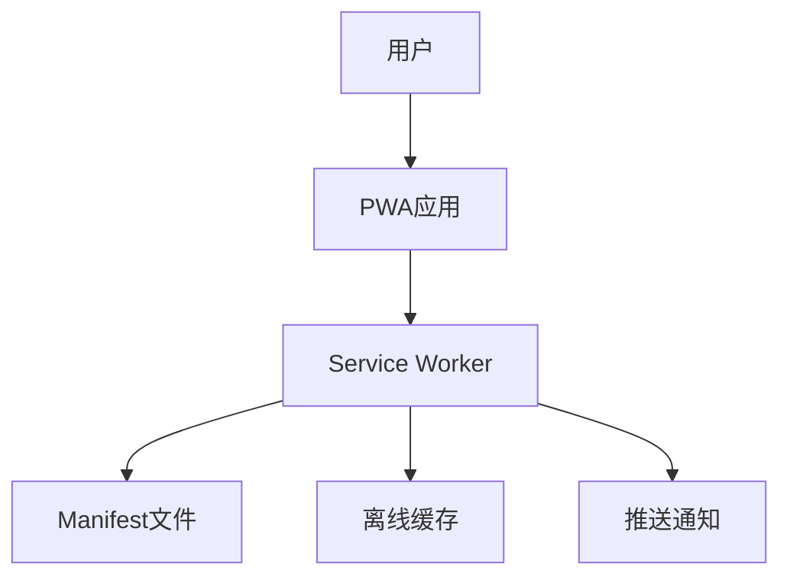
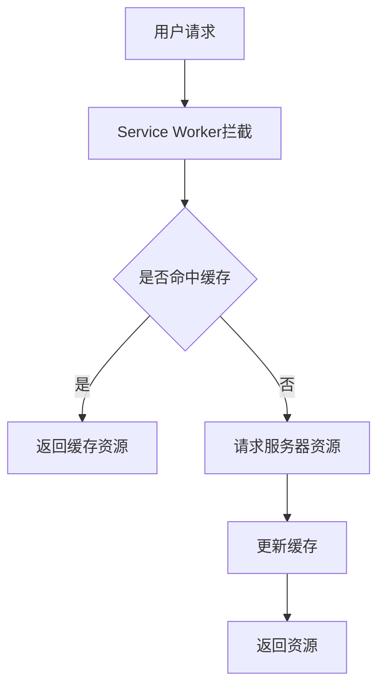
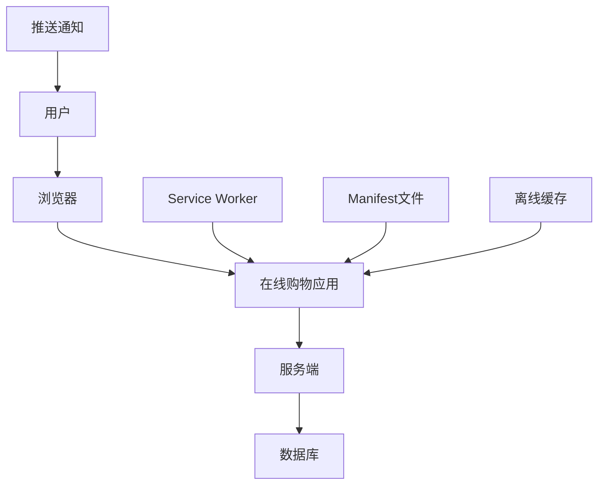
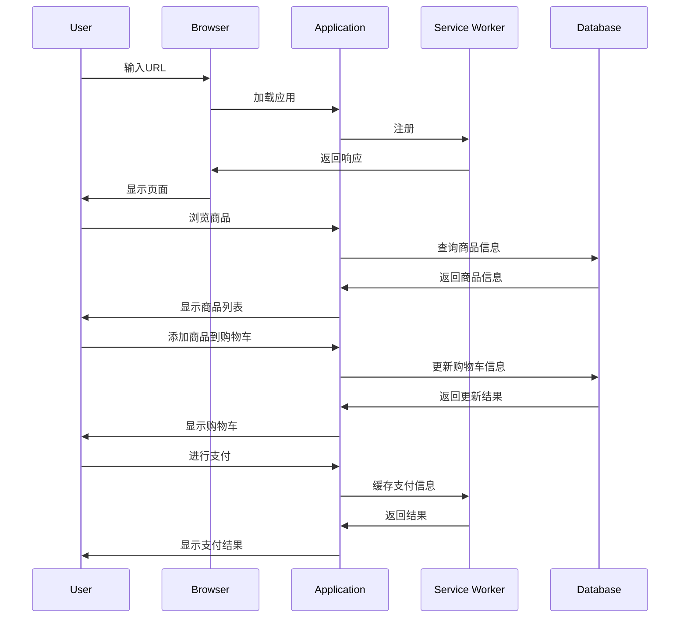

                 

# 渐进式Web应用(PWA):融合原生与Web的新模式

> 关键词：渐进式Web应用，PWA，Web应用，原生应用，Service Worker，Manifest文件，性能优化，用户体验

> 摘要：本文将深入探讨渐进式Web应用（PWA）的概念、特点及其与传统Web应用和原生应用的融合。通过逐步分析PWA的核心技术组成、算法原理、系统架构设计、项目实战和最佳实践，本文旨在为开发者提供关于PWA的全面理解和实用指导。

## 背景介绍

### 问题背景

随着移动互联网的快速发展，用户对Web应用的性能和用户体验要求越来越高。传统的Web应用由于受到技术限制，往往在性能和体验上难以与原生应用相比。这导致用户在访问Web应用时，可能因为加载时间长、响应慢等问题流失。

### 问题解决

为了解决上述问题，开发者们提出了渐进式Web应用（PWA）的概念。PWA旨在通过结合Web技术和原生应用的优点，提供一种既具有原生应用的性能，又具有Web应用的便捷性的新型应用模式。

### 边界与外延

PWA并不是一个全新的概念，它是基于现有的Web技术进行扩展和优化的。PWA的边界在于它依然基于HTML、CSS和JavaScript等Web技术，但其性能和用户体验可以接近原生应用。

### 概念结构与核心要素组成

PWA的核心概念包括Service Worker、Manifest文件、离线缓存和推送通知等。这些概念共同构成了PWA的技术架构，使其能够提供优秀的性能和用户体验。

## 核心概念与联系

### 渐进式Web应用（PWA）定义

渐进式Web应用（PWA，Progressive Web App）是一种利用现代Web技术构建的应用，它可以在任何设备上提供类似原生应用的体验，并且可以安装到用户的桌面或手机主屏幕上。

### PWA与传统Web应用的对比

| 特点         | PWA                     | 传统Web应用                  |
| ------------ | ---------------------- | --------------------------- |
| 性能         | 快速加载，离线可用     | 加载时间较长，离线受限       |
| 用户体验     | 类原生应用体验         | UI交互受限，响应速度慢       |
| 分发渠道     | 搜索引擎，应用商店     | 搜索引擎，应用商店，服务器   |
| 开发成本     | 低成本，快速迭代       | 较高，更新迭代缓慢           |
| 用户体验     | 类原生应用体验         | UI交互受限，响应速度慢       |

### PWA与原生应用的融合

PWA在保留Web应用便捷性的同时，通过Service Worker和Manifest文件等技术实现了原生应用的性能和用户体验。这使得PWA能够在用户体验上与原生应用媲美。

### PWA的核心技术组成

1. **Service Worker**：Service Worker是PWA的核心技术之一，它允许开发者创建在用户浏览器后台运行的脚本，用于处理网络请求、缓存数据和推送通知等任务。
2. **Manifest文件**：Manifest文件是PWA的配置文件，它包含了应用的名称、图标、启动画面等基本属性，用于定义应用在用户设备上的表现。
3. **离线缓存**：离线缓存是PWA的重要特性之一，它允许用户在无网络连接时访问应用，提高应用的可用性和用户体验。
4. **推送通知**：推送通知是PWA与用户互动的一种方式，它可以在用户不访问应用的情况下向用户发送消息，提高用户参与度。

### ER实体关系图架构的Mermaid流程图



## 算法原理讲解

### Service Worker的工作原理

Service Worker是一个运行在浏览器背后的独立线程，它负责处理网络请求、缓存资源和推送通知等任务。其工作原理可以分为以下几个步骤：

1. **注册Service Worker**：开发者需要在应用中注册Service Worker，将其代码部署到服务器上。
2. **监听事件**：Service Worker可以监听各种浏览器事件，如页面加载、网络请求等。
3. **拦截和处理请求**：Service Worker可以拦截和处理应用中的网络请求，根据请求的URL和缓存策略进行相应的处理，如从缓存中获取资源或向服务器请求资源。
4. **更新和升级**：Service Worker可以自动更新和升级，开发者只需将新的Service Worker脚本部署到服务器上，浏览器会在适当的时候自动更新。

### Manifest文件的配置与应用

Manifest文件是PWA的配置文件，它定义了应用的名称、图标、启动画面等基本属性。配置Manifest文件的方法如下：

1. **创建Manifest文件**：在应用的根目录下创建一个名为`manifest.json`的文件。
2. **填写配置信息**：在Manifest文件中填写应用的名称、短名称、图标、主题颜色等属性。
3. **引用Manifest文件**：在应用的HTML文件中引用Manifest文件，通过`<link rel="manifest" href="manifest.json">`标签将其添加到页面中。

### PWA的性能优化策略

PWA的性能优化策略主要包括以下几个方面：

1. **服务工人缓存**：通过Service Worker缓存资源，减少应用加载时间。
2. **资源压缩**：对应用中的资源进行压缩，减少文件大小，提高加载速度。
3. **懒加载**：对非必需的资源进行懒加载，减少初始加载时间。
4. **性能监控**：使用性能监控工具对应用进行性能监控和分析，找出性能瓶颈进行优化。

### 用户体验的渐进增强

PWA通过渐进式增强的方式，逐步提升用户体验。具体来说，PWA可以在以下方面进行渐进式增强：

1. **快速加载**：通过Service Worker缓存和资源压缩等技术，实现快速加载。
2. **离线访问**：通过离线缓存，实现无网络连接时仍然可以访问应用。
3. **推送通知**：通过推送通知，实现与用户的实时互动。
4. **桌面安装**：通过Manifest文件，实现将应用安装到桌面或手机主屏幕上。

### Mermaid算法流程图



### Python源代码示例与详细讲解

```python
# Service Worker示例代码
self.addEventListener('install', function(event) {
  event.waitUntil(
    caches.open('my-cache').then(function(cache) {
      return cache.addAll([
        '/',
        '/styles/main.css',
        '/script/main.js'
      ]);
    })
  );
});

self.addEventListener('fetch', function(event) {
  event.respondWith(
    caches.match(event.request).then(function(response) {
      return response || fetch(event.request);
    })
  );
});
```

**详细讲解：**

1. **注册Service Worker**：在代码中，我们首先使用`self.addEventListener('install', function(event) {...})`注册了Service Worker的安装事件。
2. **缓存资源**：在安装事件中，我们使用`caches.open('my-cache').then(function(cache) {...})`打开名为`my-cache`的缓存，并使用`cache.addAll`将所需的资源添加到缓存中。
3. **拦截和处理请求**：在fetch事件中，我们使用`event.respondWith`响应请求。首先检查缓存是否命中，如果命中则直接返回缓存资源，否则向服务器请求资源。

### 算法原理的数学模型和公式

PWA的性能优化可以通过以下数学模型进行描述：

\[ T = \frac{L + C}{2} \]

其中：
- \( T \) 是应用的加载时间。
- \( L \) 是资源加载时间。
- \( C \) 是缓存读取时间。

通过优化缓存策略和压缩资源，可以减少\( L \)和\( C \)，从而提高应用的加载时间\( T \)。

## 系统分析与架构设计方案

### 问题场景介绍

假设我们需要开发一个在线购物应用，用户可以在应用中浏览商品、添加购物车和进行支付。然而，由于网络环境不稳定，用户可能会遇到加载失败、数据丢失等问题。

### 项目介绍

我们选择使用渐进式Web应用（PWA）技术来构建这个在线购物应用，旨在提高应用的性能和用户体验。

### 系统功能设计（Mermaid类图）

```mermaid
classDiagram
ClassA[用户] <|-- ClassB[商品]
ClassB <|-- ClassC[购物车]
ClassC <|-- ClassD[支付]
ClassE[Service Worker] <|-- ClassF[缓存管理]
ClassG[Manifest文件] <|-- ClassH[离线缓存]
```

### 系统架构设计（Mermaid架构图）



### 系统接口设计和系统交互（Mermaid序列图）



## 项目实战

### 环境安装

在开始项目实战之前，我们需要确保环境安装正确。以下是环境安装步骤：

1. 安装Node.js：从[Node.js官网](https://nodejs.org/)下载并安装Node.js。
2. 安装npm：Node.js会自动安装npm，确保版本最新。
3. 安装PWA生成工具：在命令行中运行`npm install -g workbox`安装Workbox工具。

### 系统核心实现源代码

以下是系统核心实现的源代码：

**manifest.json**

```json
{
  "name": "在线购物应用",
  "short_name": "购物应用",
  "start_url": "./index.html",
  "display": "standalone",
  "theme_color": "#000000",
  "background_color": "#ffffff",
  "icons": [
    {
      "src": "icon-192x192.png",
      "sizes": "192x192",
      "type": "image/png"
    },
    {
      "src": "icon-512x512.png",
      "sizes": "512x512",
      "type": "image/png"
    }
  ]
}
```

**service-worker.js**

```javascript
importScripts('https://cdn.jsdelivr.net/npm/workbox-cdn@6.1.5/workbox-sw.js');

workbox.setConfig({ debug: false });

workbox.precaching.precacheAndRoute(self.__WB_MANIFEST);
```

**index.html**

```html
<!DOCTYPE html>
<html lang="zh">
<head>
  <meta charset="UTF-8">
  <meta name="viewport" content="width=device-width, initial-scale=1.0">
  <title>在线购物应用</title>
  <link rel="manifest" href="manifest.json">
</head>
<body>
  <h1>欢迎来到在线购物应用</h1>
  <!-- 应用内容 -->
  <script src="main.js"></script>
</body>
</html>
```

### 代码应用解读与分析

**manifest.json**：这个文件定义了应用的名称、图标和启动画面等基本属性。我们设置了`display`为`standalone`，使得应用在桌面或手机主屏幕上以独立应用的形式显示。

**service-worker.js**：这个文件使用了Workbox库，实现了Service Worker的功能。我们使用`workbox.precaching.precacheAndRoute`方法预缓存应用所需的资源。

**index.html**：这个文件是应用的入口页面。我们在头部引用了Manifest文件，使得应用支持PWA特性。

### 实际案例分析和详细讲解剖析

假设用户在无网络连接的情况下访问在线购物应用，以下是实际案例分析和详细讲解剖析：

1. 用户打开应用，由于之前已经使用Service Worker预缓存了资源，应用可以快速加载。
2. 用户浏览商品，由于商品信息已经缓存在本地，用户可以离线查看商品信息。
3. 用户将商品添加到购物车，数据会实时存储在本地数据库中。
4. 用户尝试进行支付，由于网络连接不稳定，支付过程可能会失败。
5. 用户在网络连接恢复后重新尝试支付，由于Service Worker缓存了支付信息，支付过程可以继续进行。

通过以上案例，我们可以看到PWA在提高应用性能和用户体验方面的优势。

### 项目小结

通过本次项目实战，我们成功构建了一个基于渐进式Web应用（PWA）的在线购物应用。该项目实现了快速加载、离线缓存和推送通知等特性，为用户提供了优秀的用户体验。

## 最佳实践 tips

1. **优化Service Worker缓存策略**：根据实际需求，合理配置Service Worker的缓存策略，避免缓存过多或过少。
2. **使用懒加载减少初始加载时间**：对非必需的资源进行懒加载，减少应用的初始加载时间。
3. **监控应用性能**：使用性能监控工具，如Chrome DevTools，定期监控应用性能，及时发现问题并进行优化。

## 小结

渐进式Web应用（PWA）通过结合Web技术和原生应用的优点，为开发者提供了构建高性能、用户体验优秀的Web应用的新模式。通过本文的讲解，我们深入了解了PWA的核心概念、技术原理和实际应用，相信读者对PWA有了更全面的理解。

## 注意事项

1. **Service Worker缓存策略**：Service Worker缓存策略需要根据实际需求进行配置，避免缓存过多或过少。
2. **性能优化**：定期使用性能监控工具对应用进行性能监控和分析，找出性能瓶颈并进行优化。
3. **安全性考虑**：确保Service Worker脚本的安全性，避免被恶意攻击。

## 拓展阅读

1. 《渐进式Web应用：设计与开发》
2. 《Workbox：渐进式Web应用的构建工具》
3. 《PWA性能优化实战》
4. Google Developers：渐进式Web应用（PWA）指南
5. MDN Web文档：Service Worker

## 作者信息

作者：AI天才研究院/AI Genius Institute & 禅与计算机程序设计艺术 /Zen And The Art of Computer Programming

