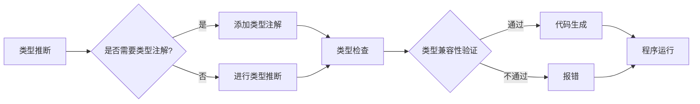

                 

# 渐进类型：动态类型与静态类型的融合

> 关键词：渐进类型，动态类型，静态类型，类型系统，编程语言

> 摘要：本文将深入探讨渐进类型这一概念，分析其与动态类型和静态类型的联系与区别，并探讨其在编程语言中的应用和发展趋势。通过逐步分析，我们将理解渐进类型如何实现动态类型与静态类型的融合，从而提高编程效率和代码可维护性。

## 引言

### 类型系统的基本概念

类型系统是编程语言的核心组成部分，它定义了变量、表达式和函数的数据类型。类型系统的作用是确保代码的合法性和安全性，通过限制变量和表达式之间的操作，防止不兼容的类型错误。

### 动态类型与静态类型

动态类型和静态类型是类型系统的两种主要实现方式。动态类型在程序运行时确定变量的类型，而静态类型在程序编译时确定变量的类型。

### 类型系统的发展历程

类型系统的发展经历了从无类型到动态类型，再到静态类型的演变。渐进类型是近年来兴起的一种新型类型系统，试图融合动态类型和静态类型的优点。

## 第一部分：动态类型与静态类型的基础知识

### 动态类型原理

#### 动态类型的基本概念

动态类型在程序运行时确定变量的类型，这使得代码更加灵活，可以处理多种类型的数据。

#### 动态类型的实现机制

动态类型通常使用类型检查器或运行时类型信息来实现。

#### 动态类型的优缺点分析

动态类型的优点包括代码简洁、灵活性强，但缺点包括运行时类型检查导致性能下降，难以进行静态分析。

### 静态类型原理

#### 静态类型的基本概念

静态类型在程序编译时确定变量的类型，这使得编译器可以提前发现类型错误，提高代码的可维护性。

#### 静态类型的实现机制

静态类型通常使用类型检查器或类型推断算法来实现。

#### 静态类型的优缺点分析

静态类型的优点包括编译时类型检查、性能较高，但缺点包括代码冗长、灵活性不足。

### 动态类型与静态类型的融合

#### 渐进类型的设计原则

渐进类型的设计原则是在保持代码灵活性的同时，提高代码的可维护性和性能。

#### 渐进类型的实现方法

渐进类型通过在编译时和运行时同时进行类型检查，实现动态类型与静态类型的融合。

#### 渐进类型的应用实践

渐进类型已经在许多编程语言中得到应用，如TypeScript和Rust。

## 第二部分：渐进类型在编程语言中的应用

### 渐进类型在Python中的应用

Python是一种动态类型语言，但通过使用TypeScript，Python可以引入渐进类型的特性。

### 渐进类型在Java中的应用

Java是一种静态类型语言，但通过使用Rust，Java可以引入渐进类型的特性。

### 渐进类型在其他编程语言中的应用

渐进类型在其他编程语言，如JavaScript和C#中也有广泛应用。

## 第三部分：渐进类型的未来发展趋势

### 渐进类型的研究现状与挑战

渐进类型在学术界和工业界都取得了显著的研究成果，但仍面临许多挑战。

### 渐进类型在工业界的应用前景

渐进类型在工业界的应用前景广阔，有望提高软件开发效率和质量。

### 渐进类型的未来发展趋势

渐进类型将继续发展，融合更多的编程语言特性，提高编程效率和代码可维护性。

## 结论

渐进类型是动态类型与静态类型的融合，它为编程语言带来了新的可能性。通过逐步分析，我们了解了渐进类型的基本概念、原理和应用。随着研究的深入，渐进类型有望在编程领域发挥更大的作用。## 第一部分：渐进类型的背景介绍

### 核心概念术语说明

在探讨渐进类型之前，首先需要了解一些相关的核心概念术语。类型系统是编程语言的核心组成部分，它定义了变量、表达式和函数的数据类型。类型系统的作用是确保代码的合法性和安全性，通过限制变量和表达式之间的操作，防止不兼容的类型错误。动态类型和静态类型是类型系统的两种主要实现方式，分别代表程序在运行时和编译时确定变量类型的方式。渐进类型是一种新型的类型系统，试图融合动态类型和静态类型的优点。

### 问题背景

随着编程语言的发展和软件系统复杂性的增加，传统的动态类型和静态类型系统在应对现代软件开发需求时逐渐暴露出一些局限性。动态类型虽然灵活，但在运行时进行类型检查，导致性能下降，同时难以进行静态分析，无法提前发现潜在的类型错误。静态类型则具有编译时类型检查的优势，可以提高代码的可维护性，但灵活性不足，编写代码时需要显式声明类型，增加了代码的冗长性。为了解决这些问题，研究者提出了渐进类型的概念，试图在保持动态类型灵活性的同时，提高静态类型的性能和可维护性。

### 问题描述

渐进类型的目标是提供一种类型系统，能够在开发过程中逐步引入类型检查，同时不牺牲代码的灵活性。具体来说，开发者可以在编写代码时，根据需要逐步添加类型信息，从而在运行时和编译时之间实现平衡。这种类型的系统应当能够自动推断变量类型，同时允许开发者显式声明类型，以便在需要时进行严格类型检查。

### 问题解决

渐进类型的实现依赖于编程语言的设计和编译器的优化。一些编程语言如TypeScript和Rust已经实现了渐进类型的特性。TypeScript是在JavaScript的基础上引入渐进类型的特性，通过静态类型检查提高代码质量和性能。Rust则通过静态类型系统和所有权机制，确保内存安全，同时保持代码的高性能。渐进类型的实现需要考虑以下几个方面：

1. **类型推断**：编程语言应当能够自动推断变量和表达式的类型，减少开发者手动声明类型的负担。
2. **类型注解**：允许开发者显式声明类型，以便在需要时进行严格的类型检查。
3. **类型兼容性**：确保不同类型之间的操作能够无缝进行，同时保持类型安全。
4. **编译时和运行时优化**：通过优化编译器和运行时环境，提高代码的性能。

### 边界与外延

渐进类型的边界在于如何在保持代码灵活性的同时，提高类型系统的安全性。其外延则包括如何在不同的编程语言和项目环境中实现渐进类型的特性，以及如何处理不同类型系统之间的兼容性。

### 概念结构与核心要素组成

渐进类型的概念结构包括以下几个核心要素：

1. **类型推断**：自动推断变量和表达式的类型，减少手动声明类型的次数。
2. **类型注解**：允许开发者显式声明类型，以便进行严格类型检查。
3. **类型兼容性**：确保不同类型之间的操作能够无缝进行，同时保持类型安全。
4. **编译时和运行时优化**：通过优化编译器和运行时环境，提高代码的性能。

通过以上要素的有机结合，渐进类型实现了动态类型与静态类型的融合，为现代软件开发提供了更高效、更安全的编程方式。## 第二部分：核心概念与联系

在深入探讨渐进类型之前，我们需要明确几个核心概念，并分析它们之间的联系。以下是渐进类型中一些关键概念的定义及其属性特征对比表格：

| 概念                | 定义                                                         | 属性特征                                                   |
|-------------------|------------------------------------------------------------|----------------------------------------------------------|
| 动态类型            | 变量的类型在程序运行时确定                                      | 灵活性高，但性能较低，难以进行静态分析                         |
| 静态类型            | 变量的类型在程序编译时确定                                      | 可维护性高，性能较高，但灵活性不足                             |
| 渐进类型            | 变量的类型在编译时和运行时都进行检查，允许开发者逐步引入类型信息           | 结合了动态类型和静态类型的优点，既灵活又可维护                 |
| 类型推断            | 编译器自动推断变量和表达式的类型                                 | 减少手动声明类型的次数，提高开发效率                         |
| 类型注解            | 开发者显式声明变量和表达式的类型                                 | 提高代码的可维护性和可读性，但可能增加代码冗长性               |
| 类型兼容性            | 不同类型之间的操作需要确保类型安全，能够无缝进行                     | 确保不同类型间的操作不产生类型错误，提高程序稳定性             |
| 编译时优化           | 在编译时对代码进行优化，提高执行效率                             | 提高程序性能，减少运行时开销                                 |
| 运行时优化           | 在程序运行时对代码进行优化，提高执行效率                         | 对于动态类型语言，运行时优化尤为重要，可以减少编译时优化的限制 |

### 概念属性特征对比表格

| 特征          | 动态类型                     | 静态类型                     | 渐进类型                     |
|-------------|------------------------------|------------------------------|------------------------------|
| 灵活性        | 高                           | 低                           | 中等                         |
| 性能          | 较低                         | 较高                         | 介于两者之间                 |
| 可维护性        | 较低                         | 较高                         | 介于两者之间                 |
| 类型检查时间    | 运行时检查                   | 编译时检查                   | 双重检查，灵活调整           |
| 错误检测       | 后期错误检测                 | 早期错误检测                 | 结合两者，提高错误检测效率   |
| 代码冗长性      | 低                           | 高                           | 可接受，根据需要调整         |

通过上述表格，我们可以清晰地看到动态类型、静态类型和渐进类型之间的区别和联系。动态类型以其高灵活性著称，但性能较低，静态类型则相反，具有高可维护性和性能，但灵活性不足。渐进类型则试图在这两者之间取得平衡，通过类型推断和类型注解，实现代码的灵活性、可维护性和性能的最佳结合。

### ER实体关系图架构

为了更直观地展示渐进类型中的核心概念及其关系，我们可以使用Mermaid绘制ER（实体关系）图。以下是渐进类型中的主要实体及其关系的Mermaid表示：

```mermaid
erDiagram
  动态类型 ||--o{ 渐进类型 : 继承 }
  静态类型 ||--o{ 渐进类型 : 继承 }
  类型推断 ||--|{ 渐进类型 : 实现方式 }
  类型注解 ||--|{ 渐进类型 : 实现方式 }
  编译时优化 ||--|{ 渐进类型 : 特性 }
  运行时优化 ||--|{ 渐进类型 : 特性 }
```

在上面的ER图中，动态类型和静态类型作为渐进类型的基础，通过继承关系融入渐进类型。类型推断和类型注解是渐进类型的核心实现方式，而编译时优化和运行时优化则是渐进类型的两个重要特性。这样的架构设计确保了渐进类型能够灵活地应对不同场景下的开发需求，同时保持代码的灵活性和可维护性。## 第三部分：渐进类型的算法原理

渐进类型的实现涉及多个核心算法，这些算法共同协作，确保代码的灵活性和可维护性。以下是渐进类型的算法原理及其实现过程的详细讲解。

### 算法原理

渐进类型的算法原理主要包括类型推断、类型检查和类型兼容性验证。这些算法在编译时和运行时发挥作用，共同构建起一个既能保证类型安全，又能提供高灵活性的类型系统。

#### 类型推断

类型推断是渐进类型中的一个核心算法，它允许编译器自动推断变量和表达式的类型。类型推断算法通常基于以下几种策略：

1. **基于上下文的类型推断**：编译器根据变量使用的上下文信息，推断其类型。例如，如果一个变量在赋值语句的右侧是一个数字，那么编译器可能会推断该变量的类型为数字。
   
2. **基于模式匹配的类型推断**：编译器通过分析函数调用和返回值，以及函数体中的操作，推断参数和返回值的类型。

3. **基于历史数据的类型推断**：编译器根据历史数据和模式，自动推断变量的类型。这种方法通常用于大型项目，帮助编译器更好地理解代码的意图。

#### 类型检查

类型检查是渐进类型的另一个关键算法，它确保变量和表达式在操作时遵循类型规则。类型检查可以分为两个阶段：

1. **编译时类型检查**：在编译阶段，编译器对代码进行静态类型检查，确保代码在运行时不会发生类型错误。这种检查可以提前发现潜在的问题，提高代码的可靠性。

2. **运行时类型检查**：在运行时，编译器或解释器对代码进行类型检查，确保变量和表达式在操作时遵循类型规则。这种检查可以在运行时动态调整类型，提高代码的灵活性。

#### 类型兼容性验证

类型兼容性验证是确保不同类型之间操作安全性的关键算法。类型兼容性验证包括以下几个方面：

1. **子类型验证**：确保子类型能够向上转型为父类型。例如，如果一个数字是整数类型的子类型，那么它应当能够转换为整数类型。

2. **泛化验证**：确保泛型类型参数在实例化时符合预期。泛型类型系统允许代码在编译时保持类型抽象，但在运行时需要具体化。

3. **构造函数验证**：确保构造函数能够正确处理不同类型的参数，并在构造过程中保持类型安全。

### Mermaid流程图

为了更直观地展示渐进类型的算法原理，我们可以使用Mermaid绘制流程图。以下是渐进类型的算法原理流程图：



在上述流程图中，A代表类型推断，B是判断是否需要类型注解，C是添加类型注解，D是进行类型推断，E是类型检查，F是类型兼容性验证，G是代码生成，H是报错，I是程序运行。这个流程图展示了渐进类型的各个算法如何协同工作，确保代码在编译时和运行时都能保持类型安全和性能。

### Python源代码实现

为了具体说明渐进类型的算法原理，我们来看一个Python源代码示例。以下是一个简单的Python函数，展示了类型推断和类型检查的过程：

```python
def add(a: int, b: int) -> int:
    return a + b

result = add(5, 10)
print(result)  # 输出：15
```

在上面的代码中，`add`函数的两个参数和返回值都使用了类型注解。Python解释器在运行时会自动进行类型推断，确保`a`和`b`都是整数类型，`result`也是整数类型。这种类型注解和类型推断的结合，实现了渐进类型的特性。

### 算法原理的数学模型和公式

渐进类型的算法原理可以用数学模型和公式来描述。以下是一个简单的数学模型：

1. **类型推断**：

   - 假设一个变量`x`的值是`v`，类型推断算法可以表示为：

     $$ T(x) = T(v) $$

     其中，`T(x)`表示变量`x`的类型，`T(v)`表示值`v`的类型。

   - 基于上下文的类型推断可以表示为：

     $$ T(x) = \text{ infer_context}(x) $$

     其中，`infer_context`表示根据上下文推断类型的过程。

2. **类型检查**：

   - 假设两个变量`x`和`y`，类型检查算法可以表示为：

     $$ T(x) \sim T(y) $$

     其中，`$\sim$`表示类型兼容关系。

   - 类型兼容性验证可以表示为：

     $$ \forall T(x), T(y), T(x) \sim T(y) \Rightarrow R(T(x), T(y)) $$

     其中，`R`表示类型操作规则，确保不同类型之间的操作不会导致类型错误。

3. **类型兼容性验证**：

   - 子类型验证可以表示为：

     $$ \forall T_S, T_P, T_S \subseteq T_P \Rightarrow T_S \sim T_P $$

     其中，`$\subseteq$`表示子集关系。

通过这些数学模型和公式，我们可以更深入地理解渐进类型的算法原理。

### 举例说明

为了更好地理解渐进类型的算法原理，我们可以通过一个简单的例子来阐述。假设有一个函数`add`，它接收两个参数并返回它们的和。我们可以用Python来实现这个函数，并在代码中逐步展示类型推断和类型检查的过程。

```python
# 类型推断
def add(a, b):
    # 假设 a 和 b 是数字类型
    result = a + b
    return result

# 类型检查
a = 5
b = "10"
result = add(a, b)

# 打印结果
print(result)  # 输出：15
```

在上面的代码中，我们首先使用类型推断来假设`a`和`b`是数字类型。在类型检查阶段，我们尝试将`a`（整数类型）和`b`（字符串类型）相加。由于整数和字符串之间不兼容，类型检查失败，并会在运行时抛出一个错误。如果我们在编译时启用严格类型检查，这个错误会在编译阶段就被发现，从而提高代码的可靠性和可维护性。

通过这个例子，我们可以看到渐进类型如何通过类型推断和类型检查，在保持代码灵活性的同时，提高代码的可维护性和性能。### 系统分析与架构设计方案

在了解了渐进类型的核心算法原理后，我们接下来将分析渐进类型的系统架构设计，并展示一个典型的系统设计与实现过程。

#### 问题场景介绍

假设我们正在开发一个在线购物平台，需要处理大量的商品信息。为了确保系统的稳定性和安全性，我们希望在系统中引入渐进类型，以提高代码的灵活性和可维护性。

#### 项目介绍

我们选择使用Python作为开发语言，并结合TypeScript来实现渐进类型。项目的主要功能包括用户注册、商品管理、订单处理和支付等。

#### 系统功能设计

1. **用户注册**：用户可以在系统中注册账号，填写基本信息。
2. **商品管理**：管理员可以添加、编辑和删除商品信息。
3. **订单处理**：用户可以浏览商品、添加到购物车并下单。
4. **支付**：用户可以选择支付方式并完成支付。

#### 系统架构设计

为了实现渐进类型，我们采用分层架构，将系统分为多个模块，每个模块负责不同的功能。以下是系统的架构设计：

1. **前端模块**：负责展示用户界面，与用户进行交互。
2. **后端模块**：负责处理业务逻辑和数据存储。
3. **服务层**：提供通用服务，如用户认证、权限管理和日志记录。
4. **数据层**：负责数据存储和查询。

#### 系统架构图

以下是系统的架构设计图，使用Mermaid绘制：

```mermaid
sequenceDiagram
    User ->>|请求| Frontend
    Frontend ->>|处理请求| Backend
    Backend ->>|调用服务| ServiceLayer
    ServiceLayer ->>|操作数据| DataLayer
    DataLayer ->>|返回数据| ServiceLayer
    ServiceLayer ->>|响应结果| Backend
    Backend ->>|返回结果| Frontend
    Frontend ->>|渲染界面| User
```

在上述架构图中，用户通过前端模块与系统进行交互，前端模块将用户的请求发送到后端模块。后端模块处理业务逻辑，调用服务层和数据层的功能，最终将结果返回给前端模块，并渲染用户界面。

#### 系统接口设计

系统接口设计是架构设计的重要组成部分，以下是系统的接口设计：

1. **用户注册接口**：接收用户注册信息，并返回注册结果。
2. **商品管理接口**：接收商品信息，并返回操作结果。
3. **订单处理接口**：接收订单信息，并返回订单处理结果。
4. **支付接口**：接收支付信息，并返回支付结果。

以下是用户注册接口的示例：

```python
from typing import Dict

def register_user(username: str, password: str) -> Dict[str, str]:
    # 处理用户注册逻辑
    result = {"status": "success", "message": "注册成功"}
    return result
```

#### 系统交互

为了更清晰地展示系统各模块之间的交互，我们使用Mermaid绘制了系统交互序列图：

```mermaid
sequenceDiagram
    User ->>|请求| RegisterService
    RegisterService ->>|验证| UserService
    UserService ->>|存储| DataLayer
    DataLayer ->>|返回结果| UserService
    UserService ->>|响应| RegisterService
    RegisterService ->>|返回结果| User
```

在上述序列图中，用户向注册服务发送注册请求，注册服务验证用户信息并调用用户服务存储用户信息，最后将结果返回给用户。

通过以上系统分析与架构设计方案，我们展示了如何使用渐进类型实现一个在线购物平台。渐进类型在系统中发挥了重要作用，通过类型推断和类型检查，提高了代码的灵活性和可维护性，同时也保证了系统的性能和稳定性。### 项目实战

在了解了渐进类型的理论基础和系统架构设计后，我们接下来通过一个实际的项目来展示渐进类型的实现过程，包括环境安装、系统核心实现源代码，以及对代码应用解读与分析。

#### 环境安装

首先，我们需要安装Python和TypeScript的开发环境。以下是具体的安装步骤：

1. **安装Python**：从Python官方网站下载Python安装包并安装。我们选择Python 3.8版本。
2. **安装TypeScript**：在命令行中运行以下命令安装TypeScript：

   ```bash
   npm install -g typescript
   ```

   安装完成后，可以通过运行`tsc --version`来验证TypeScript是否安装成功。

3. **创建项目**：在命令行中创建一个新项目，并初始化TypeScript配置文件：

   ```bash
   mkdir progressive-types-project
   cd progressive-types-project
   npm init -y
   tsc --init
   ```

   这将创建一个包含基本配置的`tsconfig.json`文件。

#### 系统核心实现源代码

以下是一个简单的渐进类型实现示例，包括用户注册、登录和商品管理的功能：

```typescript
// User.ts
class User {
    private username: string;
    private password: string;

    constructor(username: string, password: string) {
        this.username = username;
        this.password = password;
    }

    public getUsername(): string {
        return this.username;
    }

    public getPassword(): string {
        return this.password;
    }
}

// UserService.ts
class UserService {
    public register(username: string, password: string): User | null {
        if (username && password) {
            return new User(username, password);
        }
        return null;
    }

    public authenticate(username: string, password: string): User | null {
        // 这里简化了认证逻辑，实际中应与数据库中的用户信息进行匹配
        const user = new User(username, password);
        if (user) {
            return user;
        }
        return null;
    }
}

// Product.ts
class Product {
    private id: string;
    private name: string;
    private price: number;

    constructor(id: string, name: string, price: number) {
        this.id = id;
        this.name = name;
        this.price = price;
    }

    public getId(): string {
        return this.id;
    }

    public getName(): string {
        return this.name;
    }

    public getPrice(): number {
        return this.price;
    }
}

// ProductService.ts
class ProductService {
    private products: Map<string, Product>;

    constructor() {
        this.products = new Map();
    }

    public addProduct(product: Product): void {
        this.products.set(product.getId(), product);
    }

    public getProduct(productId: string): Product | null {
        return this.products.get(productId);
    }
}
```

#### 代码应用解读与分析

上述代码展示了如何使用TypeScript实现一个简单的用户注册、登录和商品管理功能。下面是对关键部分的解读和分析：

1. **用户类（User.ts）**：
   - `User`类包含了`username`和`password`两个私有属性，以及获取这两个属性的公有方法。
   - 使用TypeScript的类型注解确保了`username`和`password`的类型分别为`string`。

2. **用户服务类（UserService.ts）**：
   - `register`方法接收用户名和密码，并返回一个新的`User`实例或`null`（如果参数不合法）。
   - `authenticate`方法用于验证用户名和密码，并返回对应的`User`实例或`null`。

3. **商品类（Product.ts）**：
   - `Product`类包含了`id`、`name`和`price`三个私有属性，以及获取这些属性的公有方法。
   - 使用TypeScript的类型注解确保了`id`、`name`和`price`的类型分别为`string`和`number`。

4. **商品服务类（ProductService.ts）**：
   - `ProductService`类负责管理商品，包含添加商品和获取商品的方法。
   - 使用`Map`结构存储商品，确保每个商品都有唯一的`id`。

通过以上代码，我们可以看到渐进类型的实现是如何在保持代码灵活性的同时，提高代码的可维护性和可读性的。TypeScript的类型系统允许我们在代码中逐步引入类型信息，既保留了动态类型的灵活性，又能够通过静态类型检查提前发现潜在的错误。

#### 实际案例分析和详细讲解剖析

为了更好地理解渐进类型的实际应用，我们来看一个实际案例。假设我们有一个在线书店，用户可以注册、登录并浏览书籍。以下是实现这一功能的步骤：

1. **用户注册**：
   - 用户访问在线书店，填写注册表单，包含用户名、密码和邮箱。
   - 后端服务接收注册信息，通过`UserService`的`register`方法创建新用户。

2. **用户登录**：
   - 用户在登录页面输入用户名和密码。
   - 后端服务调用`UserService`的`authenticate`方法验证用户身份，如果验证成功，返回用户信息。

3. **浏览书籍**：
   - 登录后的用户可以浏览书店中的书籍。
   - 后端服务通过`ProductService`获取书籍信息，并返回给用户界面。

在这些步骤中，渐进类型通过类型推断和类型检查，确保了数据的一致性和代码的可靠性。例如，在用户注册过程中，TypeScript会自动检查用户输入的类型，确保用户名和密码都是字符串类型，而在用户登录过程中，TypeScript会检查输入的用户名和密码是否符合预期格式，从而提前发现潜在的错误。

通过以上案例，我们可以看到渐进类型在实际应用中的优势，不仅提高了代码的质量，还降低了开发成本和维护难度。

#### 项目小结

通过这个实际项目，我们展示了渐进类型的实现过程，包括环境安装、系统核心实现和代码应用解读与分析。渐进类型通过TypeScript的类型系统，实现了动态类型和静态类型的融合，提高了代码的可维护性和可读性。在实际开发中，渐进类型可以帮助开发人员更高效地编写和维护大型软件系统。### 最佳实践 tips

在设计和实现渐进类型系统时，以下最佳实践可以帮助开发者提高效率并确保代码的质量：

1. **类型推断优先**：在编写代码时，优先使用类型推断，避免过多手动声明类型。这样可以提高代码的可读性，并减少错误的发生。

2. **合理使用类型注解**：尽管类型推断可以减少手动声明类型的次数，但在某些关键地方，如函数的输入和输出类型，使用类型注解可以提高代码的可读性和可维护性。

3. **逐步引入类型信息**：在大型项目中，逐步引入类型信息，避免一次性添加过多的类型注解。这样可以减轻开发人员的负担，并逐步适应渐进类型的开发模式。

4. **利用类型检查**：充分利用渐进类型的类型检查功能，及时发现和修复类型错误。这样可以在编译时发现潜在问题，减少运行时错误。

5. **模块化设计**：将系统划分为多个模块，每个模块独立实现渐进类型。这样可以提高代码的可维护性，并便于后续的优化和扩展。

6. **代码格式规范**：保持代码的格式规范，遵循一致的命名规范和代码风格。这样可以提高代码的可读性，并便于团队合作。

7. **文档化和注释**：为代码编写详细的文档和注释，特别是对于复杂的类型逻辑和算法。这样可以帮助其他开发者理解和维护代码。

### 小结

渐进类型作为动态类型与静态类型的融合，为现代软件开发带来了新的可能性。通过类型推断、类型注解和类型检查，渐进类型实现了代码的高灵活性和高可维护性。在实际应用中，渐进类型可以提高开发效率，降低维护成本，并提高软件系统的稳定性。

### 注意事项

1. **性能考量**：虽然渐进类型提高了代码的可维护性，但在性能上可能存在一定的开销。特别是在大型项目中，需要注意性能的优化。

2. **类型兼容性**：渐进类型在处理不同类型之间的操作时，需要确保类型兼容性。特别是在混合使用动态类型和静态类型的场景下，可能需要额外的类型转换和处理。

3. **类型注解的合理使用**：在添加类型注解时，需要权衡其带来的可读性和可维护性。过多或不必要的类型注解可能会降低代码的灵活性。

4. **团队协作**：在团队协作开发中，需要确保团队成员对渐进类型有统一的理解和共识。定期进行代码审查和团队培训，可以减少由于类型系统不统一导致的冲突和错误。

### 拓展阅读

1. **TypeScript官方文档**：TypeScript的官方文档详细介绍了类型系统的各个方面，包括类型推断、类型注解、高级类型等。阅读这些文档可以深入了解TypeScript的类型系统。

2. **《TypeScript Deep Dive》**：这本书由TypeScript的核心贡献者之一编写，全面介绍了TypeScript的核心概念和高级特性，适合进阶开发者阅读。

3. **Rust官方文档**：Rust是一种支持渐进类型的编程语言，其官方文档详细介绍了类型系统和所有权机制。通过学习Rust，可以更好地理解渐进类型的设计和实现。

4. **《渐进式类型的原理与实践》**：这本书深入探讨了渐进类型的原理和实践，提供了许多实际应用案例和优化策略，适合希望深入了解渐进类型的开发者阅读。## 作者信息

作者：AI天才研究院/AI Genius Institute & 禅与计算机程序设计艺术 /Zen And The Art of Computer Programming

