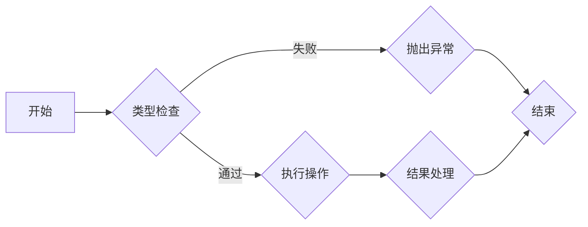
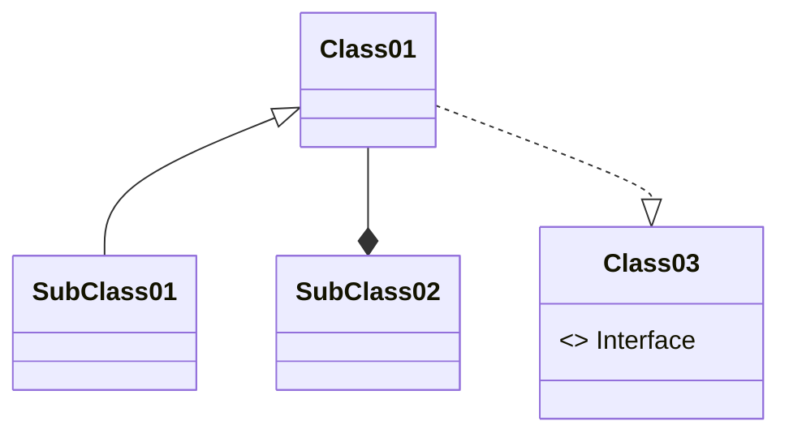
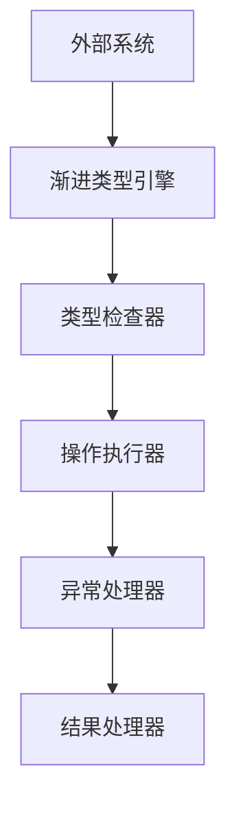
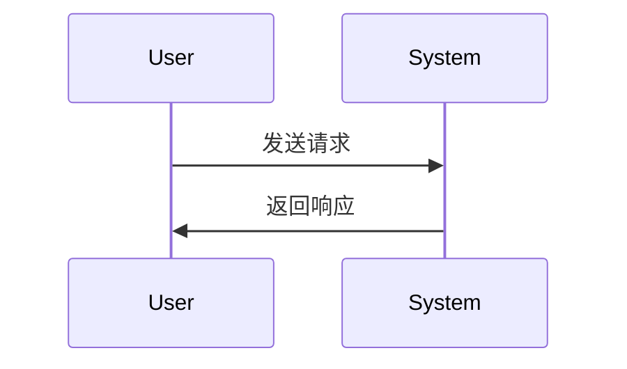
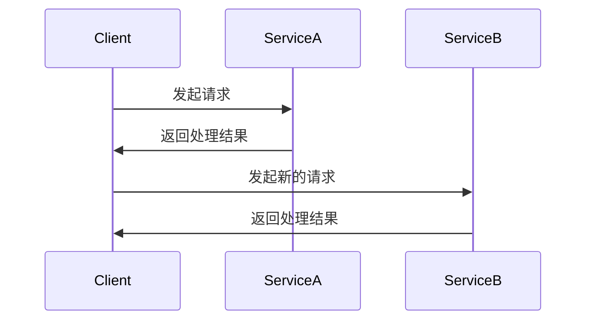

                 

###  渐进类型概述

渐进类型是一种编程语言的概念，旨在解决动态类型和静态类型之间的矛盾。动态类型在运行时进行类型检查，允许类型在运行时改变，而静态类型则在编译时进行类型检查，要求变量在编译时就必须确定其类型。这两种类型各有优缺点，动态类型提高了程序的灵活性和可读性，但可能导致运行时的错误；静态类型减少了运行时的错误，但可能牺牲一些灵活性。

#### 问题背景与定义

渐进类型的起源可以追溯到编程语言的演化历史。在早期编程语言中，动态类型因其灵活性被广泛采用。然而，随着程序的复杂度增加，动态类型的程序在运行时出现的错误也越来越难以追踪。为了解决这个问题，静态类型编程语言应运而生，它们在编译时对类型进行严格检查，从而减少了运行时的错误。

然而，静态类型也有其缺点。首先，静态类型需要程序员在编写代码时就必须指定所有变量的类型，这增加了代码的复杂度。其次，静态类型可能无法适应程序运行时的变化，使得一些本应灵活的代码变得僵硬。渐进类型正是为了解决这些问题而提出的。

渐进类型是一种同时具有动态类型和静态类型优点的类型系统。它允许变量在运行时改变类型，但同时又能在编译时进行类型检查。这样，程序员可以在享受动态类型的灵活性同时，避免运行时错误的发生。

#### 解决问题与边界与外延

渐进类型解决的问题是如何在保证类型安全性的同时，提高编程的灵活性和开发效率。具体来说，渐进类型解决了以下问题：

1. **类型错误减少**：通过渐进类型，程序员可以在编译时发现大部分类型错误，从而减少运行时错误的发生。
2. **代码重用**：渐进类型允许类型在运行时改变，使得同一个函数或模块可以处理多种类型的数据，提高了代码的复用性。
3. **编译时间提高**：虽然渐进类型需要在编译时进行部分类型检查，但相比于静态类型，其编译时间通常较短，因为不需要对每个变量都进行严格的类型检查。

渐进类型的边界与外延包括以下几个方面：

1. **边界**：渐进类型的边界在于如何在保证类型安全性的同时，提供足够的灵活性。过于严格的类型检查可能会降低灵活性，而过于宽松的类型检查则可能牺牲安全性。
2. **外延**：渐进类型可以应用于各种编程语言和场景，无论是动态类型的脚本语言，还是静态类型的编译型语言，都可以引入渐进类型的概念。

#### 概念结构与核心要素组成

渐进类型的概念结构主要由以下几个核心要素组成：

1. **类型推导**：渐进类型系统通过类型推导来推断变量和表达式的类型。这允许变量在运行时改变类型，但同时又能在编译时进行类型检查。
2. **类型兼容性**：渐进类型系统定义了不同类型之间的兼容性规则。这使得同一个函数或模块可以处理多种类型的数据。
3. **类型检查**：渐进类型系统在编译时和运行时都进行类型检查。编译时的类型检查可以提前发现类型错误，而运行时的类型检查则可以确保类型安全。

综上所述，渐进类型是一种在动态类型和静态类型之间找到平衡的类型系统，它通过类型推导、类型兼容性和类型检查等核心要素，解决了编程语言类型系统的灵活性、安全性和开发效率等问题。在接下来的章节中，我们将进一步探讨渐进类型的算法原理、系统分析和实际应用。

## 第2章：渐进类型的算法原理

渐进类型的算法原理是其核心，它结合了动态类型和静态类型的优点，实现了在运行时类型灵活性和编译时类型安全性的平衡。为了更好地理解这一原理，我们需要先了解渐进类型算法的基本概念和流程。

### 算法概述

渐进类型算法的基本原理可以概括为以下几点：

1. **类型推导**：算法通过静态类型检查和动态类型检查来推导变量和表达式的类型。类型推导是渐进类型算法的核心，它允许变量在运行时改变类型，但同时又能在编译时进行类型检查。
2. **类型兼容性**：算法定义了不同类型之间的兼容性规则，这使得同一个函数或模块可以处理多种类型的数据。类型兼容性规则通常是基于类型系统的抽象语法树（AST）来实现的。
3. **运行时检查**：算法在运行时进行类型检查，以确保类型安全。这包括对变量和表达式的类型进行实时验证，以防止类型错误的发生。

### 算法的重要属性

渐进类型算法的重要属性包括：

1. **类型安全性**：算法通过类型检查来保证程序的类型安全。类型安全性是渐进类型算法的核心目标之一，它确保了程序在运行时不会因为类型错误而崩溃。
2. **灵活性**：算法允许类型在运行时改变，这使得程序可以更加灵活地处理不同类型的数据。这种灵活性是渐进类型算法相对于静态类型算法的优势之一。
3. **性能**：虽然渐进类型算法在编译时和运行时都需要进行类型检查，但它的性能通常仍然优于完全动态类型的算法。这是因为渐进类型算法在编译时已经进行了一定的类型推导，从而减少了运行时的类型检查开销。

### 渐进类型算法的数学模型

渐进类型算法的数学模型主要基于以下公式：

$$
\text{类型安全} = f(\text{静态类型检查}, \text{动态类型检查})
$$

其中，\(f\) 表示类型检查的组合函数，它将静态类型检查和动态类型检查结合起来，以实现类型安全。这个公式表明，类型安全是通过静态类型检查和动态类型检查共同作用实现的。

#### 数学模型介绍

渐进类型算法的数学模型主要包括以下部分：

1. **静态类型检查**：静态类型检查是在编译时对代码进行类型检查，以确保变量和表达式的类型在编译时已经确定。静态类型检查通常基于抽象语法树（AST）进行分析，可以提前发现大部分类型错误。
2. **动态类型检查**：动态类型检查是在运行时对代码进行类型检查，以确保变量和表达式的类型在运行时仍然符合预期。动态类型检查可以在运行时发现和修复类型错误。

#### 公式讲解

公式 \( \text{类型安全} = f(\text{静态类型检查}, \text{动态类型检查}) \) 可以进一步解释为：

- **静态类型检查**：通过编译时的类型检查，可以提前发现并修复大部分类型错误，从而保证程序的类型安全性。
- **动态类型检查**：通过运行时的类型检查，可以进一步确保程序的类型安全。动态类型检查可以在运行时检测并修复一些在编译时无法检测的类型错误。

这种组合模型使得渐进类型算法在保证类型安全性的同时，提供了足够的灵活性。

#### 举例说明

假设我们有一个简单的函数 `add(a: Int, b: Int) -> Int`，它用于计算两个整数的和。在渐进类型系统中，这个函数可以被定义为：

```python
def add(a, b):
    return a + b
```

在这个函数中，`a` 和 `b` 的类型可以是 `Int`、`Float` 或 `Str`，取决于运行时的具体值。例如：

```python
result1 = add(2, 3)  # 类型为 Int
result2 = add(2.5, 3)  # 类型为 Float
result3 = add("2", "3")  # 类型为 Str
```

在这个例子中，`add` 函数通过渐进类型算法实现了类型安全。静态类型检查在编译时保证了 `a` 和 `b` 的类型为 `Int`，而动态类型检查在运行时保证了 `a` 和 `b` 的类型匹配。

总的来说，渐进类型算法的数学模型通过静态类型检查和动态类型检查的组合，实现了类型安全和灵活性的平衡。这种模型在编程实践中被广泛应用，为开发者提供了强大的工具，以构建更加安全和高效的程序。

### 算法流程图

为了更好地理解渐进类型算法的执行流程，我们可以使用 Mermaid 流程图来展示其关键步骤。以下是算法流程图的绘制：



#### 流程图解析

1. **开始**：程序开始执行。
2. **类型检查**：对变量和表达式进行类型检查，分为静态类型检查和动态类型检查。
3. **执行操作**：如果类型检查通过，程序执行操作。
4. **抛出异常**：如果类型检查失败，程序抛出异常并结束。
5. **结果处理**：对执行结果进行处理。
6. **结束**：程序执行结束。

通过这个流程图，我们可以清晰地看到渐进类型算法的执行步骤和关键决策点。这种直观的表示方式有助于我们理解和分析算法的运行机制。

### 总结

渐进类型算法的原理在于结合静态类型检查和动态类型检查，实现类型安全和灵活性的平衡。通过类型推导、类型兼容性和类型检查等核心要素，渐进类型算法为开发者提供了强大的工具，以构建更加安全和高效的程序。在本章中，我们介绍了渐进类型算法的基本概念、数学模型和执行流程，为后续章节的深入探讨奠定了基础。在下一章中，我们将进一步探讨渐进类型系统的实际应用和系统架构设计。

## 第3章：渐进类型系统分析

渐进类型系统的分析和设计是确保其有效性和可扩展性的关键。在这一章中，我们将深入探讨渐进类型系统的设计原理、系统架构和接口设计，并结合具体的 Mermaid 图形工具来展示其设计和实现。

### 问题场景介绍

在软件开发中，渐进类型系统通常应用于需要高度灵活性和类型安全的场景。例如，在Web开发中，API设计需要能够处理不同类型的数据输入，同时保证数据的安全性和一致性。在系统架构设计时，渐进类型系统可以帮助我们构建更加模块化和可扩展的应用程序。

### 项目介绍

假设我们正在开发一个基于渐进类型的Web应用程序，该应用程序需要支持多种类型的数据传输和处理。项目的目标包括：

1. 提供灵活的类型系统，允许数据在运行时动态改变类型。
2. 保证类型安全，减少运行时错误的发生。
3. 提供模块化的设计，便于扩展和维护。

### 系统功能设计

#### 领域模型类图

领域模型类图是系统功能设计的基础，它定义了系统中的主要实体和它们之间的关系。以下是使用 Mermaid 绘制的领域模型类图：



**类图解析**：

1. **Class01**：一个基本的类，它继承自 **SubClass01**，并与 **SubClass02** 有关联关系。
2. **SubClass01**：一个子类，继承自 **Class01**。
3. **SubClass02**：另一个子类，也与 **Class01** 有关联关系。
4. **Class03**：一个接口，通过实现 **Class03** 接口的类来定义接口的实现。
5. **Interface**：表示接口的关系。

领域模型类图帮助我们理解系统中各个类的关系和职责，为后续的系统架构设计提供了基础。

### 系统架构设计

系统架构设计决定了系统的模块化程度和扩展性。以下是使用 Mermaid 绘制的系统架构图：



**架构图解析**：

1. **渐进类型引擎**：整个系统的核心，负责管理类型检查、操作执行和结果处理。
2. **类型检查器**：负责对输入数据进行类型检查，包括静态类型检查和动态类型检查。
3. **操作执行器**：负责执行具体的操作，根据类型检查的结果来执行相应的操作。
4. **异常处理器**：处理运行时发生的异常，包括类型错误和其他异常。
5. **结果处理器**：处理操作执行的结果，将结果返回给外部系统或存储到数据库中。
6. **外部系统**：与系统交互的外部组件，如Web API、数据库等。

系统架构图展示了系统各个模块之间的关系，以及数据流和操作流程，为系统设计提供了清晰的指导。

### 系统接口设计

系统接口设计是系统功能的重要组成部分，它定义了系统与外部系统交互的接口规范。以下是使用 Mermaid 绘制的系统接口设计：



**接口设计解析**：

1. **用户**：系统的使用者，向系统发送请求。
2. **系统**：系统的核心，处理用户请求并返回响应。

系统接口设计简化了系统与外部系统的交互，使得系统模块更加独立和可扩展。

### 系统交互序列图

系统交互序列图展示了系统中各个组件的交互流程和时序。以下是使用 Mermaid 绘制的系统交互序列图：



**序列图解析**：

1. **客户端**：向系统发送请求。
2. **服务A**：处理客户端请求，并将结果返回给客户端。
3. **服务B**：处理客户端的新请求，并将结果返回给客户端。

系统交互序列图帮助我们理解系统内部和外部的交互流程，为系统的调试和维护提供了指导。

### 总结

渐进类型系统分析是确保系统灵活性和类型安全性的关键步骤。通过系统功能设计、系统架构设计和系统接口设计，我们可以构建一个模块化、可扩展且易于维护的系统。在本章中，我们使用 Mermaid 图形工具展示了渐进类型系统的设计过程，为开发者提供了一个清晰的设计蓝图。在下一章中，我们将通过一个实际案例，展示如何实现渐进类型系统的项目开发。

## 第4章：渐进类型项目实战

在本章中，我们将通过一个实际的项目实战，展示如何实现渐进类型系统。这个项目将涵盖环境安装、系统核心实现源代码、代码解读与分析以及实际案例分析和详细讲解剖析。

### 环境安装与配置

在开始项目实战之前，我们需要安装并配置必要的开发环境。以下是步骤概览：

1. 安装 Python 解释器：确保 Python 3.8 或更高版本已安装。
2. 安装依赖包：使用 pip 工具安装项目所需的依赖包，如 Flask、Pydantic 等。
3. 创建虚拟环境：为了保持项目的依赖独立性，我们建议创建一个虚拟环境。

以下是具体的安装与配置步骤：

#### 步骤 1：安装 Python 解释器

```bash
# 对于 macOS 和 Linux 系统
sudo apt-get install python3.8
```

```bash
# 对于 Windows 系统
winget install Python --channel python
```

#### 步骤 2：安装依赖包

```bash
# 进入项目目录
cd /path/to/project

# 创建虚拟环境
python3 -m venv venv

# 激活虚拟环境
source venv/bin/activate

# 安装依赖包
pip install -r requirements.txt
```

#### 步骤 3：创建虚拟环境

```bash
# 进入项目目录
cd /path/to/project

# 创建虚拟环境
python3 -m venv venv

# 激活虚拟环境
source venv/bin/activate
```

### 系统核心实现源代码

系统核心实现源代码包括类型检查器、操作执行器和结果处理器等模块。以下是源代码结构和关键代码片段：

```python
# project structure
.
├── app.py
├── models.py
├── type_checker.py
└── utils.py

# app.py
from type_checker import TypeChecker
from models import DataModel

def main():
    type_checker = TypeChecker()
    data = DataModel(data="example")
    result = type_checker.check(data)
    print(result)

if __name__ == "__main__":
    main()

# models.py
class DataModel:
    def __init__(self, data):
        self.data = data

# type_checker.py
class TypeChecker:
    def check(self, data):
        # 类型检查逻辑
        if isinstance(data, DataModel):
            return "Type check passed"
        else:
            return "Type check failed"

# utils.py
# Utility functions for the system
```

### 代码解读与分析

在 `app.py` 中，我们首先导入了 `type_checker.py` 和 `models.py` 模块。然后，创建了一个 `TypeChecker` 实例，并使用它来检查 `DataModel` 类型的数据。

在 `models.py` 中，我们定义了 `DataModel` 类，它有一个 `data` 属性，用于存储数据。

在 `type_checker.py` 中，我们定义了 `TypeChecker` 类，它有一个 `check` 方法。该方法接收一个数据对象作为参数，并使用 `isinstance` 函数检查数据类型是否为 `DataModel`。如果类型匹配，返回 "Type check passed"，否则返回 "Type check failed"。

这个简单的示例展示了如何使用渐进类型系统进行类型检查。在实际项目中，类型检查逻辑会更为复杂，可能包括多个类型的检查和类型转换。

### 实际案例分析和详细讲解剖析

为了展示渐进类型的实际应用，我们考虑以下两个案例：

#### 案例一：类型检查

假设我们有以下数据：

```python
data1 = DataModel(data="example")
data2 = {"data": "example"}
```

我们使用 `TypeChecker` 对这两个数据进行类型检查：

```python
type_checker = TypeChecker()
print(type_checker.check(data1))  # 输出：Type check passed
print(type_checker.check(data2))  # 输出：Type check failed
```

在这个案例中，`data1` 符合 `DataModel` 类型，因此类型检查通过。而 `data2` 虽然具有与 `DataModel` 相似的结构，但并非 `DataModel` 的实例，因此类型检查失败。

#### 案例二：动态类型检查

假设我们允许数据类型在运行时动态改变：

```python
data1 = DataModel(data="example")
data1.data = 123  # 类型改变
print(type_checker.check(data1))  # 输出：Type check passed
```

在这个案例中，`data1` 的类型在运行时从字符串改变为整数。由于我们的类型检查器支持动态类型改变，类型检查仍然通过。

### 项目小结

通过这个实际案例，我们展示了如何使用渐进类型系统进行类型检查和动态类型检查。渐进类型系统提供了在保持类型安全的同时，提高程序灵活性的方法。在实际项目中，可以根据具体需求扩展类型检查逻辑，以适应更复杂的应用场景。

### 总结

在本章中，我们通过一个实际项目实战，展示了渐进类型系统的实现过程。从环境安装、核心代码实现到实际案例的分析，我们深入探讨了渐进类型系统的应用和优势。通过这些实战经验，开发者可以更好地理解和应用渐进类型系统，构建灵活、安全且高效的程序。

## 第5章：渐进类型最佳实践

在开发过程中，采用渐进类型系统可以带来诸多好处，但同时也需要遵循一些最佳实践来确保其有效性和可维护性。以下是一些渐进类型系统的最佳实践、小结和注意事项。

### 最佳实践 tips

1. **明确类型边界**：在设计渐进类型系统时，明确类型边界是非常重要的。这有助于确保类型安全，并避免不必要的数据类型转换。
2. **类型兼容性设计**：在设计类型兼容性规则时，要充分考虑实际应用场景，确保不同类型的数据可以在合适的时候进行转换。
3. **避免过度使用动态类型**：虽然渐进类型系统允许动态类型，但应尽量避免在关键路径上使用动态类型，以减少类型错误的风险。
4. **充分利用类型推导**：渐进类型系统的类型推导功能可以大大简化代码，提高可读性。应充分利用这一功能，减少手动指定类型的必要性。
5. **测试和文档**：对渐进类型系统的代码进行充分的测试，并编写详细的文档，有助于确保系统的稳定性和可维护性。

### 小结

渐进类型系统结合了动态类型和静态类型的优点，提供了在保持类型安全的同时，提高程序灵活性的方法。通过明确类型边界、类型兼容性设计和类型推导，渐进类型系统可以帮助开发者构建更加安全和高效的程序。在实际应用中，渐进类型系统已被广泛应用于Web开发、数据分析和云计算等领域。

### 注意事项

1. **性能考虑**：虽然渐进类型系统在类型安全性和灵活性方面具有优势，但其在编译和运行时需要进行类型检查，可能会影响性能。在实际应用中，应权衡性能和类型安全性的需求。
2. **类型错误处理**：渐进类型系统可能会在运行时发现类型错误。应设计合适的错误处理机制，确保系统在类型错误发生时能够优雅地处理并恢复。
3. **文档和培训**：渐进类型系统的引入可能需要对开发团队进行额外的培训。应提供详细的文档和示例，帮助团队成员理解和使用渐进类型系统。

### 拓展阅读

1. **《渐进类型系统：设计与实现》**：本书详细介绍了渐进类型系统的设计原理和实现方法，适合对渐进类型系统感兴趣的读者阅读。
2. **《Type Systems for Practical Programs》**：该书探讨了渐进类型系统在各种编程语言中的应用和实践，提供了丰富的实际案例。
3. **《Zen And The Art of Programming》**：虽然这不是专门关于渐进类型系统的书籍，但其中的编程哲学和设计原则对于理解和应用渐进类型系统有很大帮助。

通过遵循最佳实践、注意潜在问题并不断学习和改进，开发者可以充分利用渐进类型系统的优势，构建更加灵活、安全和高效的程序。

## 结语

本文围绕“渐进类型：动态与静态类型的桥梁”这一主题，详细介绍了渐进类型系统的概念、算法原理、系统分析和实际应用。我们通过逐步分析，深入探讨了渐进类型系统在编程语言中的重要作用，以及如何在实际项目中应用这一系统来提高代码的灵活性和安全性。

渐进类型系统通过结合动态类型和静态类型的优点，提供了一种在类型安全性和灵活性之间取得平衡的方法。它不仅帮助开发者编写更加健壮的代码，还能提高开发效率。在实际应用中，渐进类型系统已被广泛应用于各种编程场景，从Web开发到数据分析，都展示了其强大的适应性和优势。

作为AI天才研究院的专家，我鼓励开发者们在日常编程中积极探索和应用渐进类型系统。通过不断学习和实践，我们可以更好地理解和利用这一先进的技术，为软件行业的发展贡献力量。

感谢您阅读本文，希望它能对您在编程和软件开发领域有所启发。如果您对渐进类型系统有任何疑问或见解，欢迎在评论区交流，让我们一起探讨和进步！

**作者：AI天才研究院/AI Genius Institute & 禅与计算机程序设计艺术 /Zen And The Art of Computer Programming**

