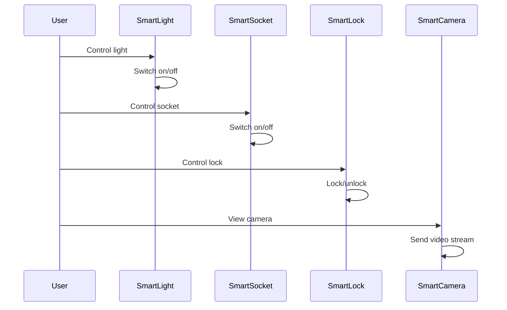
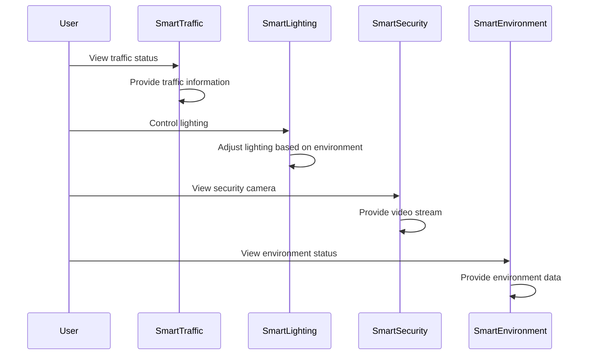

                 

### 物联网架构：应对海量设备的挑战

关键词：物联网架构、海量设备、通信协议、安全、平台与开发框架

摘要：随着物联网技术的迅猛发展，海量设备的互联互通成为关键挑战。本文从物联网架构概述、海量设备管理、物联网通信协议、物联网安全、物联网平台与开发框架、实际应用案例以及总结与展望七个部分，深入探讨物联网架构的构建与优化，以应对海量设备的挑战。

### 物联网架构概述

#### 1.1 物联网的定义与背景

物联网（Internet of Things，IoT）是指通过互联网将各种物理设备、传感器、智能终端等连接起来，实现信息的采集、传输、处理和智能化的应用。物联网技术起源于20世纪80年代，经过数十年的发展，已逐步成为信息技术领域的重要方向。

物联网的定义可以从以下几个方面理解：

- **物理设备互联**：物联网通过互联网或其他通信网络，将物理设备连接起来，实现设备间的数据交换和协同工作。
- **数据采集与处理**：物联网通过传感器、RFID等技术，实现数据的实时采集和传输，并通过数据处理平台对数据进行存储、分析和处理。
- **智能化应用**：物联网技术使得设备具备一定的智能性，能够根据环境变化和用户需求，实现自主决策和自动化控制。

物联网的发展背景主要包括以下几个方面：

- **技术进步**：互联网、无线通信、传感器技术、云计算等技术的快速发展，为物联网提供了技术基础。
- **市场需求**：工业自动化、智能家居、智能交通、智慧城市等领域的快速发展，对物联网技术提出了迫切需求。
- **政策支持**：各国政府纷纷出台相关政策，推动物联网产业的发展。

#### 1.2 物联网架构的核心组成部分

物联网架构主要包括以下几个核心组成部分：

- **感知层**：感知层是物联网架构的基础，负责数据的采集。主要包括传感器、RFID、摄像头等设备。
- **网络层**：网络层负责数据传输，包括有线网络和无线网络。常用的无线网络包括Wi-Fi、蓝牙、LoRa、NB-IoT等。
- **平台层**：平台层负责数据处理和存储，包括数据采集、存储、处理、分析和可视化等功能。
- **应用层**：应用层是物联网技术的最终体现，包括智能家居、智能工厂、智能交通、智能医疗等具体应用。

#### 1.3 物联网架构的发展趋势

物联网架构的发展趋势主要包括以下几个方面：

- **云计算与边缘计算结合**：云计算为物联网提供了强大的数据处理和存储能力，而边缘计算则将计算能力扩展到网络边缘，实现实时数据处理和降低延迟。
- **5G网络的应用**：5G网络的高速率、低延迟、大连接特性，为物联网提供了更稳定、更高速的通信基础。
- **人工智能的融合**：人工智能技术为物联网带来了智能化、自主化的应用场景，使得物联网系统更加智能化和高效化。
- **安全性与隐私保护**：随着物联网设备的普及，安全性问题和隐私保护成为关注的焦点，未来物联网架构将更加重视安全性和隐私保护。

### 海量设备管理

#### 1.4 常见的物联网设备分类

物联网设备种类繁多，根据其功能和特性，可以分为以下几类：

- **传感器设备**：传感器设备是物联网系统中最基本的设备，用于采集环境数据，如温度、湿度、光照、声音等。
- **执行器设备**：执行器设备是物联网系统中执行特定任务的设备，如开关、电机、阀门等。
- **智能终端设备**：智能终端设备是具备一定计算能力和通信能力的设备，如智能手机、平板电脑、智能手表等。
- **网关设备**：网关设备是连接物联网系统和外部网络的桥梁，负责数据传输和协议转换。

#### 1.5 设备连接与通信协议

物联网设备的连接与通信协议是物联网架构中至关重要的一环。常见的物联网通信协议包括：

- **Wi-Fi**：Wi-Fi是一种常用的无线局域网通信协议，具有高带宽、低延迟的特点，适用于家庭、办公室等场景。
- **蓝牙**：蓝牙是一种短距离无线通信协议，适用于智能穿戴设备、智能家居等低功耗场景。
- **LoRa**：LoRa是一种低功耗、长距离的无线通信协议，适用于工业物联网、智能城市等场景。
- **NB-IoT**：NB-IoT是一种基于蜂窝网络的低功耗广域网通信协议，具有低功耗、广覆盖、高连接数等特点，适用于智能表计、远程监控等场景。

#### 1.6 设备管理机制

物联网设备管理机制主要包括设备注册、设备状态监控、设备升级和设备维护等方面。

- **设备注册**：设备注册是指将物联网设备加入物联网系统，实现设备的唯一标识和认证。
- **设备状态监控**：设备状态监控是指实时监控设备的运行状态，包括设备是否在线、数据采集是否正常等。
- **设备升级**：设备升级是指为物联网设备更新软件版本，修复漏洞、增强功能等。
- **设备维护**：设备维护是指对物联网设备进行定期检查、保养和更换，确保设备的正常运行。

### 物联网通信协议

#### 1.7 通信协议概述

物联网通信协议是物联网系统中实现设备之间数据传输的技术规范，其核心目标是确保数据传输的可靠性、实时性和高效性。常见的物联网通信协议包括：

- **MQTT**：MQTT（Message Queuing Telemetry Transport）是一种轻量级的消息传输协议，适用于物联网设备之间的低带宽、不可靠的网络环境。
- **CoAP**：CoAP（Constrained Application Protocol）是一种针对物联网设备的简单协议，基于HTTP协议，适用于资源受限的设备。
- **HTTP**：HTTP（Hyper Text Transfer Protocol）是一种通用的网络应用协议，适用于需要高带宽、高可靠性的物联网应用。

#### 1.8 协议选型与优化

在选择物联网通信协议时，需要考虑以下几个方面：

- **传输速度**：根据应用场景的需求，选择适合的通信协议，如MQTT适用于低带宽场景，HTTP适用于高带宽场景。
- **可靠性**：考虑通信协议的可靠性，如MQTT具有消息确认机制，保证数据传输的可靠性。
- **功耗**：对于电池供电的物联网设备，选择低功耗的通信协议，如LoRa、NB-IoT等。
- **安全性**：考虑通信协议的安全性，如MQTT和HTTP都支持加密传输。

#### 1.9 通信协议的安全性

物联网通信协议的安全性是物联网系统的重要保障，主要包括以下几个方面：

- **数据加密**：对传输数据进行加密，防止数据在传输过程中被窃取或篡改。
- **身份认证**：对设备进行身份认证，确保只有合法设备能够接入物联网系统。
- **访问控制**：对设备访问权限进行控制，防止未授权设备接入物联网系统。
- **网络安全**：通过防火墙、入侵检测系统等网络安全设备，保护物联网系统免受网络攻击。

### 物联网安全

#### 1.10 物联网安全概述

物联网安全是指确保物联网系统在数据传输、设备接入、数据处理等环节的安全性和隐私性。物联网安全面临的主要挑战包括：

- **设备安全性**：物联网设备可能存在安全漏洞，易受攻击。
- **通信安全性**：物联网通信协议可能存在安全隐患，如数据泄露、篡改等。
- **数据隐私性**：物联网数据可能涉及用户隐私，需要保护数据隐私。
- **网络安全**：物联网系统可能遭受网络攻击，如DDoS攻击、病毒感染等。

#### 1.11 安全体系架构

物联网安全体系架构包括以下几个方面：

- **感知层安全**：保护感知层设备的通信安全，防止数据泄露和设备被篡改。
- **网络层安全**：保护网络层设备的通信安全，防止数据泄露和篡改。
- **平台层安全**：保护平台层的数据安全，防止数据泄露和篡改。
- **应用层安全**：保护应用层的安全，防止恶意攻击和数据泄露。

#### 1.12 常见安全威胁与防御措施

物联网常见的安全威胁包括：

- **设备攻击**：攻击者通过恶意软件入侵设备，控制设备。
- **通信攻击**：攻击者通过拦截、篡改通信数据，窃取信息。
- **数据泄露**：攻击者通过窃取数据，获取用户隐私信息。
- **网络攻击**：攻击者通过DDoS攻击、病毒感染等手段，破坏物联网系统。

针对这些安全威胁，可以采取以下防御措施：

- **设备安全加固**：通过安全更新、设备监控等手段，提高设备安全性。
- **通信安全防护**：采用加密传输、身份认证等手段，确保通信安全。
- **数据隐私保护**：采用数据加密、隐私计算等手段，保护数据隐私。
- **网络安全防御**：采用防火墙、入侵检测系统等手段，防止网络攻击。

### 物联网平台与开发框架

#### 1.13 物联网平台概述

物联网平台是物联网系统的重要组成部分，提供设备连接、数据采集、数据存储、数据处理和可视化的功能。物联网平台的主要功能包括：

- **设备管理**：包括设备注册、设备状态监控、设备升级等功能。
- **数据采集**：包括数据采集、数据预处理等功能。
- **数据存储**：包括数据存储、数据检索等功能。
- **数据处理**：包括数据处理、数据分析和数据可视化等功能。
- **应用开发**：提供应用开发工具和开发框架，方便开发者快速构建物联网应用。

#### 1.14 平台选型与开发

在选择物联网平台时，需要考虑以下几个方面：

- **功能需求**：根据应用场景，选择适合的平台功能。
- **性能要求**：考虑平台的处理能力、存储容量、响应速度等性能指标。
- **安全性**：考虑平台的安全性和数据保护能力。
- **可扩展性**：考虑平台的可扩展性和灵活性。

在物联网平台开发中，需要遵循以下原则：

- **模块化设计**：将平台功能模块化，方便扩展和升级。
- **开放性**：采用开放接口和协议，方便与其他系统和设备集成。
- **安全性**：加强平台的安全防护，确保数据安全和系统稳定。
- **可维护性**：编写高质量的代码，便于维护和升级。

### 物联网开发框架

#### 1.15 开发框架概述

物联网开发框架是帮助开发者快速构建物联网应用的工具和平台。常见的物联网开发框架包括：

- **MQTT.js**：用于构建基于MQTT协议的物联网应用。
- **IoT Hub**：用于构建基于Azure IoT平台的物联网应用。
- **Node-RED**：用于构建基于Node.js的物联网应用流程编排。
- **Kaa Platform**：用于构建全功能的物联网应用。

#### 1.16 常用开发框架

在物联网开发中，常用的开发框架包括：

- **MQTT.js**：MQTT.js是一个基于JavaScript的MQTT客户端库，适用于构建基于MQTT协议的物联网应用。
- **Azure IoT Hub**：Azure IoT Hub是Microsoft提供的物联网开发平台，支持设备连接、数据传输、消息队列等功能。
- **Node-RED**：Node-RED是一个基于Node.js的物联网应用流程编排工具，适用于构建数据流处理和可视化应用。
- **Kaa Platform**：Kaa Platform是一个全功能的物联网开发平台，提供设备管理、数据采集、数据处理等功能。

#### 1.17 开发框架应用实例

以下是一个基于MQTT.js的简单物联网开发实例：

```python
import mqtt

client = mqtt.Client()
client.connect('mqtt://localhost:1883', 60, 60)

client.on_message = on_message

def on_message(client, userdata, message):
    print(f"Received message '{message.payload}' on topic '{message.topic}' with QoS {message.qos}")

client.subscribe('test/topic', 0)

client.loop_start()

while True:
    time.sleep(1)
```

在这个实例中，我们使用MQTT.js连接到本地MQTT服务器，并订阅了`test/topic`主题。当接收到消息时，会打印出消息的主题和内容。

### 实际应用案例

#### 1.18 智能家居

智能家居是物联网技术的重要应用领域，通过将家庭设备连接到互联网，实现设备的远程控制、自动化管理和能源节约。以下是一个智能家居应用案例：

**项目介绍**：智能家居系统由智能灯泡、智能插座、智能门锁和智能摄像头组成。用户可以通过手机APP对设备进行远程控制，实现灯光调节、家电开关、门锁锁定等功能。

**系统功能设计**：

- **智能灯泡**：支持远程控制开关、调节亮度和色温。
- **智能插座**：支持远程控制电器开关，实时监测电器状态。
- **智能门锁**：支持远程开锁、门锁状态实时监控。
- **智能摄像头**：支持远程监控、实时视频流查看和视频录制。

**系统架构设计**：


**系统接口设计**：

- **设备控制接口**：用于控制智能灯泡、智能插座、智能门锁和智能摄像头的开关和状态。
- **数据采集接口**：用于采集智能灯泡、智能插座、智能门锁和智能摄像头的状态数据。
- **视频流接口**：用于实时传输智能摄像头的视频流。

**系统交互序列图**：



#### 1.19 城市物联网

城市物联网是利用物联网技术构建智慧城市的基础设施，实现城市管理的智能化和精细化。以下是一个城市物联网应用案例：

**项目介绍**：城市物联网系统包括智能交通、智能照明、智能安防和智能环境监测等模块。通过这些模块的协同工作，实现城市交通的优化、环境的改善和公共安全的提升。

**系统功能设计**：

- **智能交通**：实时监测道路流量、车速、停车状况等，提供交通优化建议。
- **智能照明**：根据环境亮度和人流密度，智能调节路灯亮度，实现节能。
- **智能安防**：实时监控城市公共场所，及时发现异常情况，提供安全预警。
- **智能环境监测**：监测空气质量、水质、噪音等环境指标，提供环境监测报告。

**系统架构设计**：


**系统接口设计**：

- **交通监控接口**：用于实时获取道路流量、车速、停车状况等数据。
- **照明控制接口**：用于调节路灯亮度。
- **安防监控接口**：用于实时获取视频流、报警信息等。
- **环境监测接口**：用于实时获取空气质量、水质、噪音等数据。

**系统交互序列图**：



### 总结与展望

#### 1.20 物联网架构发展展望

物联网架构的发展将呈现以下几个趋势：

- **云计算与边缘计算结合**：云计算为物联网提供了强大的数据处理和存储能力，而边缘计算则将计算能力扩展到网络边缘，实现实时数据处理和降低延迟。
- **5G网络的应用**：5G网络的高速率、低延迟、大连接特性，为物联网提供了更稳定、更高速的通信基础。
- **人工智能的融合**：人工智能技术为物联网带来了智能化、自主化的应用场景，使得物联网系统更加智能化和高效化。
- **安全性与隐私保护**：随着物联网设备的普及，安全性问题和隐私保护成为关注的焦点，未来物联网架构将更加重视安全性和隐私保护。

物联网技术的不断进步将推动物联网应用的创新和发展，为各行各业带来巨大的变革和机遇。在未来，物联网技术将在智慧城市、智能交通、智能医疗、智能制造等领域发挥重要作用，推动人类社会向更加智能、高效、绿色的方向发展。

### 最佳实践 tips

- **设备选型与连接**：根据应用场景和需求，选择适合的物联网设备，并确保设备的连接稳定和可靠。
- **数据处理与存储**：合理设计数据处理和存储方案，提高数据处理的效率和数据存储的安全。
- **通信协议选择**：根据应用场景和需求，选择适合的通信协议，确保数据传输的可靠性和实时性。
- **安全防护措施**：采取有效的安全防护措施，保护物联网系统的安全和用户隐私。

### 小结

本文从物联网架构概述、海量设备管理、物联网通信协议、物联网安全、物联网平台与开发框架、实际应用案例以及总结与展望七个部分，全面介绍了物联网架构的构建与优化。通过本文的阅读，读者可以了解物联网架构的核心内容，掌握物联网技术的关键要点，为物联网应用的开发和实践提供参考。

### 注意事项

- **物联网设备的能耗问题**：在物联网设备的选型和连接中，需要考虑设备的能耗问题，选择低功耗的设备，并优化设备的电源管理。
- **物联网数据的安全性**：在物联网数据采集、传输、存储和处理过程中，需要采取有效的安全防护措施，确保数据的安全性和隐私性。
- **物联网平台的可扩展性**：在物联网平台的选择和开发中，需要考虑平台的可扩展性和灵活性，以便于系统的升级和功能的扩展。

### 拓展阅读

- **《物联网技术导论》**：李明华，电子工业出版社，2019年
- **《物联网通信协议与应用》**：陈文光，清华大学出版社，2020年
- **《物联网安全与隐私保护》**：张辉，机械工业出版社，2021年
- **《智慧城市物联网架构与关键技术》**：王华，人民邮电出版社，2022年

### 作者信息

作者：AI天才研究院/AI Genius Institute & 禅与计算机程序设计艺术 /Zen And The Art of Computer Programming

本文由AI天才研究院撰写，内容仅供参考，不代表任何商业建议。如需转载，请注明出处。感谢您的阅读！

