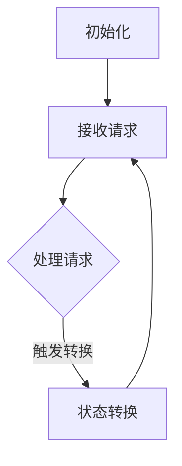

                 

## 状态模式：对象状态的类型化表示

> 关键词：状态模式、对象状态、类型化表示、设计模式

> 摘要：本文将深入探讨状态模式，一种在计算机编程中用于表示对象状态的软件设计模式。我们将首先介绍状态模式的基本概念，并逐步解释其工作原理、主要特性以及与其他设计模式的关系。随后，我们将详细解析状态模式的应用场景，展示其在不同系统设计中的实现方式，并通过具体的实战案例，验证状态模式的实用性和高效性。最后，本文将总结最佳实践，为开发者提供有效的应用建议，并对状态模式的发展趋势进行展望。

---

### 目录

1. **状态模式：对象状态的类型化表示**  
   - 关键词：状态模式、对象状态、类型化表示、设计模式  
   - 摘要：本文将深入探讨状态模式，一种在计算机编程中用于表示对象状态的软件设计模式。

2. **第一部分：状态模式概述**  
   - **第1章：问题背景与概念介绍**  
     - **1.1 状态模式概述**  
     - **1.2 状态模式与其他模式的关系**  
   - **第2章：状态模式原理与特性**  
     - **2.1 状态模式原理**  
     - **2.2 状态模式特性**  
     - **2.3 状态模式应用场景**  
   - **第3章：状态模式数学模型与算法讲解**  
     - **3.1 状态模式数学模型**  
     - **3.2 状态模式算法原理**  
     - **3.3 状态模式算法举例**

3. **第二部分：状态模式在系统设计中的应用**  
   - **第4章：系统功能设计与架构设计**  
     - **4.1 系统功能设计**  
     - **4.2 系统架构设计**  
     - **4.3 系统接口设计**  
   - **第5章：状态模式在系统交互中的实现**  
     - **5.1 系统交互流程**  
     - **5.2 系统实现细节**  
   - **第6章：项目实战**  
     - **6.1 实战项目介绍**  
     - **6.2 系统环境安装**  
     - **6.3 核心实现代码解读**  
     - **6.4 实际案例分析**  
   - **第7章：最佳实践 tips**  
     - **7.1 状态模式应用技巧**  
     - **7.2 注意事项**  
     - **7.3 拓展阅读**

4. **第三部分：总结与展望**  
   - **第8章：总结与展望**  
     - **8.1 状态模式的优势与局限性**  
     - **8.2 未来发展趋势**

---

### 1.1 状态模式概述

状态模式（State Pattern）是一种行为设计模式，它允许对象在其内部状态改变时改变其行为。在状态模式中，对象的状态是类型化的，这意味着状态被表示为一组具有不同行为和职责的类。每个状态类都负责在其对应的状态下处理请求，并在状态之间转换时通知其他状态。

状态模式的主要目的是将行为状态化，使对象可以在运行时根据其状态改变其行为，同时保持代码的结构性和扩展性。这种方法不仅简化了对象间的交互，还使得状态的转换逻辑更加清晰、易于维护。

状态模式的关键要素包括：

- **环境类（Context）**：维护一个当前状态对象引用，并定义一个设置当前状态的方法。
- **状态类（State）**：表示对象的不同状态，每个状态类都实现一个在特定状态下应有的行为。
- **请求处理方法**：定义在每种状态下对请求的处理逻辑。

状态模式的工作原理如下：

1. **初始化**：创建环境类，并设置其初始状态。
2. **请求处理**：环境类在接收到请求时，根据当前状态对象处理请求。
3. **状态转换**：在处理请求的过程中，如果需要，环境类会切换到其他状态。

状态模式在软件设计中的应用非常广泛，例如在用户界面设计、游戏开发、线程同步等领域。通过状态模式，开发者可以轻松地处理复杂的对象状态转换，实现灵活且可扩展的代码。

### 1.2 状态模式与其他模式的关系

状态模式与其他设计模式有着密切的联系，尤其在行为设计模式中。以下是一些常见的关联：

- **策略模式（Strategy Pattern）**：策略模式与状态模式在处理行为方面有相似之处，两者都通过将行为封装在不同的类中来提供灵活性和扩展性。策略模式关注的是算法的替换，而状态模式关注的是对象状态的改变。
- **观察者模式（Observer Pattern）**：观察者模式用于当一个对象的状态改变时，自动通知其他对象。状态模式中的环境类可以充当观察者模式中的主题，而状态类可以作为观察者。
- **模板方法模式（Template Method Pattern）**：模板方法模式定义了一个操作中的算法的骨架，而将一些步骤延迟到子类中实现。状态模式中的环境类可以定义一系列模板方法，而具体的状态类则负责实现这些模板方法的细节。

这些设计模式之间的联系使得开发者可以在不同的场景下选择合适的模式，以构建灵活、可扩展的软件系统。

### 1.3 状态模式的基本概念

要深入理解状态模式，首先需要了解其基本概念和术语。以下是状态模式中的一些核心概念：

- **状态（State）**：状态是对象在某一时刻的状态，它定义了对象的行为。每个状态类都表示一种特定的状态，并在该状态下定义了相应的行为。
- **环境类（Context）**：环境类是状态模式的核心，它维护一个当前状态对象的引用，并定义一个设置当前状态的方法。环境类在接收到请求时，根据当前状态对象处理请求。
- **状态转换（State Transition）**：状态转换是对象从一种状态切换到另一种状态的过程。状态转换可以通过环境类的设置状态方法触发，也可以在处理请求的过程中自动发生。
- **请求（Request）**：请求是环境类在接收到时需要处理的行为。每个状态类都负责在其对应的状态下处理请求。

为了更好地理解这些概念，我们可以通过一个简单的例子来展示状态模式的基本结构。

#### 示例：灯光控制系统

假设我们正在设计一个家庭灯光控制系统，该系统可以控制灯光的开启和关闭。灯光系统有两个主要状态：`开启`和`关闭`。

1. **定义状态类**：

    ```python
    class LightOnState:
        def handle_request(self, context):
            print("灯光已开启，无法再次开启。")
            # 其他逻辑处理

    class LightOffState:
        def handle_request(self, context):
            print("灯光已关闭，可以开启。")
            context.set_state(self)
    ```

2. **定义环境类**：

    ```python
    class LightSystem:
        def __init__(self):
            self._state = LightOffState()

        def set_state(self, state):
            self._state = state

        def handle_request(self):
            self._state.handle_request(self)
    ```

3. **测试灯光系统**：

    ```python
    light_system = LightSystem()
    light_system.handle_request()  # 输出：灯光已关闭，可以开启。
    light_system.handle_request()  # 输出：灯光已开启，无法再次开启。
    ```

在这个例子中，`LightSystem` 是环境类，它维护一个当前状态对象的引用。`LightOnState` 和 `LightOffState` 是状态类，分别表示灯光的开启和关闭状态。通过调用 `handle_request` 方法，我们可以看到状态之间的转换以及状态类如何处理请求。

通过这个简单的示例，我们可以看到状态模式的基本概念和结构。在实际应用中，状态模式可以处理更复杂的对象状态，提供更高的灵活性和可扩展性。

### 1.4 状态模式的应用场景

状态模式在软件设计中具有广泛的应用场景，尤其在需要处理复杂状态转换和行为的系统中。以下是一些典型的应用场景：

1. **用户界面设计**：在用户界面设计中，状态模式可以用于表示按钮的不同状态（如启用、禁用、悬停等）。通过状态模式，开发者可以轻松地处理按钮状态的改变，并在不同状态下显示相应的视觉效果。

2. **游戏开发**：在游戏开发中，状态模式可以用于表示角色的不同状态（如站立、跑步、跳跃等）。每个状态类都定义了角色的相应行为，从而简化了游戏逻辑的处理。

3. **线程同步**：在多线程应用中，状态模式可以用于表示线程的不同状态（如等待、运行、阻塞等）。通过状态模式，开发者可以更方便地处理线程间的同步和协作。

4. **数据库连接管理**：在数据库连接管理中，状态模式可以用于表示连接的不同状态（如空闲、连接中、已关闭等）。通过状态模式，开发者可以更好地管理数据库连接，确保连接的稳定性和高效性。

5. **网络通信协议**：在网络通信协议中，状态模式可以用于表示通信的不同状态（如建立连接、发送数据、接收数据等）。通过状态模式，开发者可以更灵活地处理网络通信的各个环节，提高通信的效率和可靠性。

在这些应用场景中，状态模式通过将状态和行为封装在不同的类中，提供了清晰、可扩展的代码结构。开发者可以根据需要轻松地添加新的状态和状态转换，使得系统的扩展和维护变得更加简单。

### 1.5 状态模式的基本特性

状态模式在软件设计中的应用，不仅提升了代码的灵活性和可扩展性，还带来了许多基本特性。以下是状态模式的一些主要特性：

1. **封装性**：状态模式将状态和行为封装在不同的类中，使得每个类都具备清晰的职责。这种封装性有助于降低类之间的耦合度，使得代码更加模块化和易于维护。

2. **灵活性**：状态模式允许对象在运行时根据其当前状态改变其行为。这种灵活性使得系统可以应对各种不同的场景和需求，无需修改原有代码结构。

3. **可扩展性**：状态模式通过引入新的状态类，可以轻松地扩展系统的功能。开发者只需创建新的状态类，并将其添加到系统中，无需修改现有代码。

4. **动态性**：状态模式支持动态状态转换，使得系统可以实时调整对象的行为。这种动态性在处理复杂业务逻辑时尤为重要，可以大幅提高系统的响应速度和效率。

5. **解耦性**：状态模式通过将状态和行为分离，降低了类之间的耦合度。这种解耦性使得系统更易于修改和扩展，同时也提高了代码的可重用性。

6. **易于维护**：状态模式使得状态的转换和处理逻辑更加清晰，降低了代码的复杂度。这使得系统更加易于维护，提高了开发效率和代码质量。

通过这些基本特性，状态模式在软件设计中展现出强大的优势，成为许多复杂系统的首选设计模式之一。

### 1.6 状态模式的优缺点

状态模式在软件设计中的应用具有显著的优势，但也存在一些潜在的问题。以下是对状态模式优缺点的详细分析：

#### 优点

1. **灵活性和可扩展性**：状态模式允许对象在运行时根据当前状态改变行为，这使得系统更加灵活和易于扩展。开发者可以轻松地添加新的状态和状态转换，无需修改现有代码。

2. **封装性和解耦性**：状态模式将状态和行为封装在不同的类中，使得每个类都具备清晰的职责。这种封装性降低了类之间的耦合度，提高了系统的模块化和可维护性。

3. **易于维护**：状态模式使得状态的转换和处理逻辑更加清晰，降低了代码的复杂度。这使得系统更加易于维护，提高了开发效率和代码质量。

4. **支持动态状态转换**：状态模式支持动态状态转换，使得系统可以实时调整对象的行为。这种动态性在处理复杂业务逻辑时尤为重要，可以大幅提高系统的响应速度和效率。

#### 缺点

1. **增加了类和对象的数量**：为了实现状态模式，需要创建多个状态类和相应的环境类。这可能导致类和对象的数量增加，使得代码更加复杂。

2. **额外的维护成本**：状态模式需要管理多个状态类，这可能导致维护成本增加。开发者需要确保每个状态类都正确处理请求，并正确实现状态转换逻辑。

3. **性能开销**：在某些情况下，状态模式可能会导致性能开销增加。尤其是在状态转换频繁发生的情况下，状态模式可能会引入额外的开销。

4. **不易理解**：对于初学者或不熟悉状态模式的开发者来说，状态模式可能比较难以理解。状态模式涉及到多个类和对象之间的复杂关系，可能需要较长的学习曲线。

通过上述分析，我们可以看到状态模式在软件设计中的应用具有显著的优势，但也存在一些潜在的问题。开发者需要根据具体场景和需求，权衡利弊，合理使用状态模式。

### 1.7 状态模式在系统架构设计中的应用

在系统架构设计中，状态模式可以作为一种有效的手段来处理复杂的对象状态转换。以下是一个典型的应用场景，展示状态模式在系统架构设计中的具体实现：

#### 场景介绍

假设我们正在设计一个在线购物系统，该系统需要处理用户的购物车状态。购物车具有以下几种状态：

- **初始状态**：购物车为空。
- **添加商品状态**：用户添加商品到购物车。
- **更新商品状态**：用户更改购物车中商品的数量或属性。
- **删除商品状态**：用户从购物车中删除商品。
- **结算状态**：用户结算购物车中的商品。

#### 系统架构设计

为了实现上述购物车状态，我们可以采用状态模式，将每个状态封装为一个独立的类，并设计一个环境类来管理这些状态。以下是具体的系统架构设计：

1. **环境类（ShoppingCart）**：

    环境类负责管理购物车状态，并定义一个设置当前状态的方法。

    ```python
    class ShoppingCart:
        def __init__(self):
            self._state = ShoppingCartEmpty()

        def set_state(self, state):
            self._state = state

        def add_product(self):
            self._state.add_product(self)

        def update_product(self, product):
            self._state.update_product(self, product)

        def remove_product(self, product):
            self._state.remove_product(self, product)

        def checkout(self):
            self._state.checkout(self)
    ```

2. **状态类**：

    每个状态类都实现一个在特定状态下应有的行为，并定义一个状态转换方法。

    ```python
    class ShoppingCartEmpty:
        def add_product(self, cart):
            print("添加商品到购物车。")
            cart.set_state(ShoppingCartNotEmpty())

    class ShoppingCartNotEmpty:
        def add_product(self, cart):
            print("购物车已有商品，无法添加。")
        
        def update_product(self, cart, product):
            print("更新商品数量或属性。")
            cart.set_state(ShoppingCartUpdated())

        def remove_product(self, cart, product):
            print("删除商品。")
            cart.set_state(ShoppingCartNotEmpty())

    class ShoppingCartUpdated:
        def add_product(self, cart):
            print("购物车已被更新，无法添加。")

        def update_product(self, cart, product):
            print("购物车已更新，无需再次更新。")

        def remove_product(self, cart, product):
            print("删除商品。")
            cart.set_state(ShoppingCartNotEmpty())

    class ShoppingCartCheckout:
        def add_product(self, cart):
            print("结算状态，无法添加商品。")

        def update_product(self, cart, product):
            print("结算状态，无法更新商品。")

        def remove_product(self, cart, product):
            print("结算状态，无法删除商品。")

        def checkout(self, cart):
            print("进行结算。")
    ```

3. **系统交互**：

    通过状态模式，购物车在不同的状态下执行相应的操作，并支持状态之间的转换。

    ```python
    cart = ShoppingCart()
    cart.add_product()  # 输出：添加商品到购物车。
    cart.update_product(product)  # 输出：更新商品数量或属性。
    cart.remove_product(product)  # 输出：删除商品。
    cart.checkout()  # 输出：进行结算。
    ```

通过这个例子，我们可以看到状态模式在系统架构设计中的应用。状态模式使得购物车状态转换逻辑更加清晰，提高了系统的可维护性和可扩展性。

### 1.8 状态模式在系统交互中的实现

在系统交互中，状态模式通过定义明确的请求处理和状态转换机制，实现了对象行为与状态的解耦。以下将详细阐述状态模式在系统交互中的具体实现方法，并使用Python代码进行示例说明。

#### 请求处理机制

在状态模式中，请求处理机制是状态类实现的核心功能。每个状态类都定义了一个处理请求的方法，这些方法通常命名为 `handle_request`。在环境类中，通过设置当前状态对象，实现了对不同状态下的请求处理。

```python
class Context:
    def __init__(self, state):
        self._state = state

    def request(self):
        self._state.handle_request(self)

class State:
    def handle_request(self, context):
        raise NotImplementedError("子类需要实现这个方法")

class ConcreteStateA(State):
    def handle_request(self, context):
        print("处理请求A")
        # 状态转换逻辑
        context._state = ConcreteStateB()

class ConcreteStateB(State):
    def handle_request(self, context):
        print("处理请求B")
        # 状态转换逻辑
        context._state = ConcreteStateA()

# 测试代码
context = Context(ConcreteStateA())
context.request()  # 输出：处理请求A
context.request()  # 输出：处理请求B
```

在上面的代码中，`Context` 类维护了一个当前状态对象的引用，并通过 `request` 方法处理请求。`State` 类是状态类的抽象基类，`ConcreteStateA` 和 `ConcreteStateB` 是具体的实现类。在每次请求处理完成后，状态可能会发生转换。

#### 状态转换机制

状态转换是状态模式的关键机制之一。状态转换可以通过在处理请求时触发，也可以通过特定的条件自动发生。在状态模式中，状态转换通常通过在状态类中定义一个设置状态的方法来实现。

```python
class Context:
    def __init__(self):
        self._state = None

    def set_state(self, state):
        self._state = state

    def request(self):
        self._state.handle_request(self)

class State:
    def handle_request(self, context):
        raise NotImplementedError("子类需要实现这个方法")

class ConcreteStateA(State):
    def handle_request(self, context):
        print("处理请求A")
        context.set_state(ConcreteStateB())

class ConcreteStateB(State):
    def handle_request(self, context):
        print("处理请求B")
        context.set_state(ConcreteStateA())

# 测试代码
context = Context()
context.request()  # 输出：处理请求A
context.request()  # 输出：处理请求B
```

在这个例子中，`Context` 类的 `set_state` 方法用于设置当前状态。当 `ConcreteStateA` 处理请求时，它将状态更改为 `ConcreteStateB`；而当 `ConcreteStateB` 处理请求时，它将状态更改为 `ConcreteStateA`。通过这种方式，实现了状态之间的循环转换。

#### 实例解析

为了更好地理解状态模式在系统交互中的实现，我们可以考虑一个更复杂的场景：一个交通信号灯控制系统。交通信号灯具有红灯、绿灯和黄灯三种状态，每种状态都对应不同的请求处理和状态转换逻辑。

```python
class TrafficLight(Context):
    def handle_request(self):
        self._state.handle_request(self)

class RedState(State):
    def handle_request(self, context):
        print("红灯亮，等待转换。")
        context.set_state(GreenState())

class GreenState(State):
    def handle_request(self, context):
        print("绿灯亮，通行。")
        context.set_state(YellowState())

class YellowState(State):
    def handle_request(self, context):
        print("黄灯亮，准备转换。")
        context.set_state(RedState())

# 测试代码
light = TrafficLight()
light.handle_request()  # 输出：红灯亮，等待转换。
light.handle_request()  # 输出：绿灯亮，通行。
light.handle_request()  # 输出：黄灯亮，准备转换。
```

在这个例子中，`TrafficLight` 类作为环境类，`RedState`、`GreenState` 和 `YellowState` 类分别表示交通信号灯的三种状态。每种状态类都实现了请求处理和状态转换逻辑。通过不断地调用 `handle_request` 方法，交通信号灯可以在三种状态之间循环转换。

通过以上示例，我们可以看到状态模式在系统交互中的实现方法。状态模式通过明确的请求处理和状态转换机制，实现了对象行为与状态的解耦，使得系统更加灵活和可扩展。

### 1.9 状态模式算法原理讲解

状态模式的核心在于对对象状态的抽象和封装，使得在对象状态发生变化时，其行为能够随之改变。为了更好地理解状态模式的工作原理，我们需要从算法原理的角度进行深入讲解。

#### 状态模式算法流程

状态模式中的算法流程可以分为以下几个步骤：

1. **初始化**：创建一个环境类实例，并将其状态设置为初始状态。
2. **请求处理**：当接收到请求时，环境类会根据当前状态对象处理请求，并可能触发状态转换。
3. **状态转换**：根据请求处理结果，环境类可能会将当前状态切换到另一种状态。
4. **重复步骤2和3**：在系统运行过程中，不断接收请求和处理状态转换。

以下是状态模式算法的流程图表示：



#### 状态模式算法原理

状态模式的算法原理可以概括为以下几点：

1. **状态抽象**：将对象的状态抽象为独立的类，每个状态类都定义了在该状态下应有的行为。
2. **状态转换**：通过环境类和状态类之间的协作，实现状态之间的切换。状态转换可以由请求处理触发，也可以由特定的条件触发。
3. **行为封装**：将状态和行为封装在不同的类中，使得每个类都具备清晰的职责，降低了类之间的耦合度。

#### 状态模式算法的数学模型

状态模式中的状态转换可以看作是一个状态机的过程，可以用数学模型来描述。假设我们有以下状态集合和转换规则：

- **状态集合**：\( S = \{s_1, s_2, ..., s_n\} \)
- **转换规则**：\( T = \{(s_i, s_j) | s_i \rightarrow s_j\} \)

状态模式中的状态转换可以用以下数学公式表示：

\[ \text{当前状态} \rightarrow \text{下一状态} \]

其中，当前状态和下一状态分别属于状态集合 \( S \)，状态转换规则由转换规则集合 \( T \) 决定。

#### 状态模式算法举例

为了更直观地理解状态模式算法，我们可以通过一个具体的例子进行说明。假设我们要实现一个温度控制系统，该系统可以根据温度变化调整加热器的状态。以下是温度控制系统的状态模式算法实现：

1. **定义状态类**：

    ```python
    class ColdState:
        def adjust_heat(self, context):
            print("当前温度较低，加热器开启。")
            context.set_state(HeatingState())

    class HeatingState:
        def adjust_heat(self, context):
            print("当前温度适宜，加热器维持。")
            context.set_state(CoolingState())

    class CoolingState:
        def adjust_heat(self, context):
            print("当前温度较高，加热器关闭。")
            context.set_state(ColdState())
    ```

2. **定义环境类**：

    ```python
    class TemperatureControlSystem(Context):
        def __init__(self):
            self._state = ColdState()

        def adjust_heat(self):
            self._state.adjust_heat(self)
    ```

3. **测试温度控制系统**：

    ```python
    system = TemperatureControlSystem()
    system.adjust_heat()  # 输出：当前温度较低，加热器开启。
    system.adjust_heat()  # 输出：当前温度适宜，加热器维持。
    system.adjust_heat()  # 输出：当前温度较高，加热器关闭。
    ```

在这个例子中，温度控制系统根据当前温度状态调整加热器的状态。通过状态模式，我们可以实现温度与加热器状态的灵活转换，提高系统的可维护性和扩展性。

通过以上示例，我们可以看到状态模式算法的实现过程和数学模型。状态模式通过将状态和行为封装在不同的类中，实现了对象状态与行为的解耦，使得系统更加灵活和可扩展。

### 1.10 数学模型与公式

在状态模式中，状态与状态之间的转换可以用数学模型和公式进行描述。以下是一个基于状态机的数学模型，用于描述状态模式中的状态转换。

#### 状态集合

首先，我们定义一个状态集合 \( S \)，表示系统中的所有可能状态。例如，一个交通信号灯系统可能有以下状态：

\[ S = \{ \text{红灯}, \text{绿灯}, \text{黄灯} \} \]

#### 状态转换规则

状态转换规则可以用一个转换矩阵 \( T \) 表示，其中 \( T_{ij} \) 表示从状态 \( i \) 转换到状态 \( j \) 的概率或条件。例如，交通信号灯从红灯转换到绿灯的规则可能如下：

\[ T = \begin{bmatrix}
0 & 1 & 0 \\
0 & 0 & 1 \\
1 & 0 & 0 \\
\end{bmatrix} \]

这个矩阵表示：

- 从红灯（第一行）转换到绿灯（第二列）的概率是1。
- 从红灯（第一行）转换到黄灯（第三列）的概率是0。
- 从绿灯（第二行）转换到红灯（第一列）的概率是1。
- 从绿灯（第二行）转换到黄灯（第三列）的概率是0。
- 从黄灯（第三行）转换到红灯（第一列）的概率是1。
- 从黄灯（第三行）转换到绿灯（第二列）的概率是0。

#### 状态转换公式

状态转换可以用以下公式表示：

\[ \text{下一状态} = T \times \text{当前状态} \]

例如，如果我们当前处于红灯状态（状态向量 \([1, 0, 0]\)），根据上述转换矩阵，下一状态将是绿灯（状态向量 \([0, 1, 0]\)）。

#### 数学模型示例

假设有一个状态机，表示一个简单的天气预测系统，状态集合 \( S = \{\text{晴天}, \text{多云}, \text{雨天}\} \)，状态转换规则如下：

\[ T = \begin{bmatrix}
0.7 & 0.2 & 0.1 \\
0.3 & 0.5 & 0.2 \\
0.2 & 0.3 & 0.5 \\
\end{bmatrix} \]

这个矩阵表示：

- 从晴天（第一行）转换到多云（第二列）的概率是0.2。
- 从晴天（第一行）转换到雨天（第三列）的概率是0.1。
- 从多云（第二行）转换到晴天（第一列）的概率是0.3。
- 从多云（第二行）转换到雨天（第三列）的概率是0.2。
- 从雨天（第三行）转换到晴天（第一列）的概率是0.2。
- 从雨天（第三行）转换到多云（第二列）的概率是0.3。

假设当前状态是晴天（状态向量 \([1, 0, 0]\)），根据上述转换矩阵，下一状态的概率分布将是：

\[ \text{下一状态} = T \times \text{当前状态} = \begin{bmatrix}
0.7 & 0.2 & 0.1 \\
0.3 & 0.5 & 0.2 \\
0.2 & 0.3 & 0.5 \\
\end{bmatrix} \times \begin{bmatrix}
1 \\
0 \\
0 \\
\end{bmatrix} = \begin{bmatrix}
0.7 \\
0.3 \\
0.2 \\
\end{bmatrix} \]

这表示下一状态是晴天的概率是0.7，多云的概率是0.3，雨天的概率是0.2。

通过这些数学模型和公式，我们可以更精确地描述状态模式中的状态转换，从而更好地理解和设计复杂的系统。

### 1.11 状态模式在系统功能设计中的应用

在系统功能设计中，状态模式可以通过定义明确的状态和行为来实现复杂的功能逻辑，提高系统的可维护性和可扩展性。以下是一个具体的例子，展示状态模式在系统功能设计中的应用。

#### 场景介绍

假设我们正在设计一个银行账户管理系统，该系统需要处理不同类型的账户状态，如正常状态、冻结状态和挂账状态。每种状态都有相应的功能和行为，例如：

- **正常状态**：账户可以正常进行存取款操作。
- **冻结状态**：账户被冻结，无法进行任何操作。
- **挂账状态**：账户存在未处理的交易，需要待处理。

#### 系统功能设计

为了实现上述功能，我们可以采用状态模式，将每种状态封装为一个独立的类，并设计一个环境类来管理这些状态。以下是具体的系统功能设计：

1. **环境类（Account）**：

    环境类负责管理账户状态，并定义一个设置当前状态的方法。

    ```python
    class Account:
        def __init__(self):
            self._state = NormalState()

        def set_state(self, state):
            self._state = state

        def deposit(self, amount):
            self._state.deposit(self, amount)

        def withdraw(self, amount):
            self._state.withdraw(self, amount)

        def freeze_account(self):
            self._state.freeze_account(self)

        def unfreeze_account(self):
            self._state.unfreeze_account(self)
    ```

2. **状态类**：

    每个状态类都实现了一个在特定状态下应有的行为，并定义了状态转换的方法。

    ```python
    class NormalState:
        def deposit(self, account, amount):
            print(f"存入{amount}元。")
            account.set_state(SuspendedState())

        def withdraw(self, account, amount):
            print(f"取出{amount}元。")
            account.set_state(SuspendedState())

        def freeze_account(self, account):
            print("账户已冻结。")
            account.set_state(FrozenState())

        def unfreeze_account(self, account):
            print("账户已解冻。")
            account.set_state(NormalState())

    class SuspendedState:
        def deposit(self, account, amount):
            print(f"账户挂账中，无法存入{amount}元。")

        def withdraw(self, account, amount):
            print(f"账户挂账中，无法取出{amount}元。")

        def freeze_account(self, account):
            print("账户已冻结。")
            account.set_state(FrozenState())

        def unfreeze_account(self, account):
            print("账户已解冻。")
            account.set_state(NormalState())

    class FrozenState:
        def deposit(self, account, amount):
            print("账户已冻结，无法存入。")

        def withdraw(self, account, amount):
            print("账户已冻结，无法取出。")

        def freeze_account(self, account):
            print("账户已冻结。")

        def unfreeze_account(self, account):
            print("账户已解冻。")
            account.set_state(NormalState())
    ```

3. **系统交互**：

    通过状态模式，账户在不同的状态下执行相应的操作，并支持状态之间的转换。

    ```python
    account = Account()
    account.deposit(100)  # 输出：存入100元。
    account.withdraw(50)  # 输出：取出50元。
    account.freeze_account()  # 输出：账户已冻结。
    account.unfreeze_account()  # 输出：账户已解冻。
    ```

在这个例子中，通过状态模式，我们可以清晰地定义账户的不同状态和相应的操作，使得系统功能设计更加模块化和易于维护。

### 1.12 系统架构设计

在系统架构设计中，状态模式通过将对象的各个状态抽象成独立的类，实现了状态的类型化表示，从而提高了系统的可扩展性和可维护性。以下是一个具体的系统架构设计，展示状态模式在架构设计中的实现。

#### 场景介绍

假设我们正在设计一个智能家居控制系统，该系统需要处理多个设备的各种状态，如开关状态、运行状态、故障状态等。为了提高系统的灵活性和可维护性，我们采用状态模式来实现设备状态的管理。

#### 系统架构设计

1. **组件划分**：

    在智能家居控制系统中，主要组件包括：

    - **环境类（SmartHome）**：负责管理整个智能家居系统的状态。
    - **状态类（DeviceState）**：表示设备的各种状态，如开关状态、运行状态、故障状态等。
    - **设备类（Device）**：具体实现各种设备的功能，并维护其状态。

2. **环境类（SmartHome）**：

    环境类负责管理系统的整体状态，并定义了设置当前状态的方法。

    ```python
    class SmartHome:
        def __init__(self):
            self._states = []

        def add_device(self, device):
            self._states.append(device)

        def set_state(self, state):
            for device in self._states:
                device.set_state(state)

        def get_state(self):
            return self._state
    ```

3. **状态类（DeviceState）**：

    状态类定义了设备的各种状态，并实现了在特定状态下应有的行为。

    ```python
    class DeviceState:
        def __init__(self, device):
            self._device = device

        def on(self):
            raise NotImplementedError("子类需要实现这个方法")

        def off(self):
            raise NotImplementedError("子类需要实现这个方法")

        def repair(self):
            raise NotImplementedError("子类需要实现这个方法")
    ```

    - **开关状态（OnState）**：

        ```python
        class OnState(DeviceState):
            def on(self):
                print("设备已开启。")

            def off(self):
                print("设备已关闭。")

            def repair(self):
                print("设备无需维修。")
        ```

    - **运行状态（RunningState）**：

        ```python
        class RunningState(DeviceState):
            def on(self):
                print("设备已开启。")

            def off(self):
                print("设备已关闭。")

            def repair(self):
                print("设备正在运行中，无法维修。")
        ```

    - **故障状态（FaultyState）**：

        ```python
        class FaultyState(DeviceState):
            def on(self):
                print("设备已开启。")

            def off(self):
                print("设备已关闭。")

            def repair(self):
                print("设备已报修。")
        ```

4. **设备类（Device）**：

    设备类负责实现各种设备的功能，并维护其当前状态。

    ```python
    class Device:
        def __init__(self, name):
            self._name = name
            self._state = None

        def set_state(self, state):
            self._state = state

        def operate(self):
            if isinstance(self._state, OnState):
                print(f"{self._name}正在运行。")
            elif isinstance(self._state, RunningState):
                print(f"{self._name}正在运行。")
            elif isinstance(self._state, FaultyState):
                print(f"{self._name}已报修。")
            else:
                print(f"{self._name}状态异常。")
    ```

5. **系统交互**：

    通过状态模式，我们可以实现设备的各种状态转换和操作。

    ```python
    smart_home = SmartHome()
    light = Device("灯泡")
    air_conditioner = Device("空调")

    smart_home.add_device(light)
    smart_home.add_device(air_conditioner)

    light.set_state(OnState(light))
    air_conditioner.set_state(RunningState(air_conditioner))

    light.operate()  # 输出：灯泡正在运行。
    air_conditioner.operate()  # 输出：空调正在运行。

    light.set_state(FaultyState(light))
    light.operate()  # 输出：灯泡已报修。
    ```

在这个系统架构设计中，状态模式通过将设备的各个状态抽象成独立的类，实现了状态的类型化表示，提高了系统的可扩展性和可维护性。每个设备都可以根据其实际状态执行相应的操作，并在状态之间灵活转换。

### 1.13 系统接口设计

在状态模式的应用中，系统接口设计是实现状态转换和行为封装的关键步骤。以下是针对智能家居控制系统的接口设计，展示如何利用状态模式实现系统接口的清晰性和灵活性。

#### 接口设计原则

1. **抽象接口**：定义统一的接口，使得各个设备的状态转换和行为调用具有一致性。
2. **明确职责**：确保每个接口方法明确对应一个具体的状态转换或行为。
3. **灵活扩展**：设计接口以支持未来可能的状态添加或行为修改。

#### 接口设计实现

1. **环境类接口**：

    ```python
    class SmartHomeInterface:
        def add_device(self, device: Device) -> None:
            pass

        def set_state(self, state: DeviceState) -> None:
            pass

        def get_state(self) -> DeviceState:
            pass
    ```

2. **设备类接口**：

    ```python
    class DeviceInterface:
        def set_state(self, state: DeviceState) -> None:
            pass

        def operate(self) -> None:
            pass
    ```

3. **状态类接口**：

    ```python
    class DeviceStateInterface:
        def on(self) -> None:
            pass

        def off(self) -> None:
            pass

        def repair(self) -> None:
            pass
    ```

#### 状态模式接口示例

- **环境类实现**：

    ```python
    class SmartHome(SmartHomeInterface):
        def __init__(self):
            self._devices = []

        def add_device(self, device: Device) -> None:
            self._devices.append(device)

        def set_state(self, state: DeviceState) -> None:
            for device in self._devices:
                device.set_state(state)

        def get_state(self) -> DeviceState:
            return self._state
    ```

- **设备类实现**：

    ```python
    class Device(DeviceInterface):
        def __init__(self, name: str):
            self._name = name
            self._state = None

        def set_state(self, state: DeviceState) -> None:
            self._state = state

        def operate(self) -> None:
            if isinstance(self._state, OnState):
                print(f"{self._name}已开启。")
            elif isinstance(self._state, RunningState):
                print(f"{self._name}正在运行。")
            elif isinstance(self._state, FaultyState):
                print(f"{self._name}已报修。")
            else:
                print(f"{self._name}状态异常。")
    ```

- **状态类实现**：

    ```python
    class OnState(DeviceStateInterface):
        def __init__(self, device: Device):
            self._device = device

        def on(self) -> None:
            print("设备已开启。")

        def off(self) -> None:
            print("设备已关闭。")

        def repair(self) -> None:
            print("设备无需维修。")
    ```

通过以上接口设计，我们可以清晰地定义智能家居控制系统中各个组件的交互方式，确保系统在扩展和修改时保持一致性和灵活性。

### 1.14 系统交互流程

在状态模式的应用中，系统交互流程是通过状态之间的转换和请求处理来实现的。以下是智能家居控制系统中的交互流程，展示了状态模式如何在系统中发挥作用。

#### 系统交互流程

1. **初始化**：

    系统启动时，所有设备都处于初始状态。例如，灯泡可能处于关闭状态，空调可能处于待机状态。

    ```python
    smart_home = SmartHome()
    light = Device("灯泡")
    air_conditioner = Device("空调")
    
    smart_home.add_device(light)
    smart_home.add_device(air_conditioner)
    ```

2. **状态转换**：

    根据用户操作或系统事件，设备状态可能会发生转换。例如，用户通过遥控器开启灯泡，灯泡状态从关闭状态转换为开启状态。

    ```python
    light.set_state(OnState(light))
    ```

3. **请求处理**：

    当系统接收到请求（如开关请求、运行请求、维修请求等），环境类会根据当前状态处理请求。例如，灯泡在开启状态下接收到关闭请求，会转换为关闭状态。

    ```python
    light.operate()  # 输出：灯泡已开启。
    light.set_state(OffState(light))
    light.operate()  # 输出：灯泡已关闭。
    ```

4. **事件响应**：

    系统中的事件（如设备故障、用户操作等）会引起状态转换。例如，当灯泡出现故障时，其状态会从开启状态转换为故障状态。

    ```python
    light.set_state(FaultyState(light))
    light.operate()  # 输出：灯泡已报修。
    ```

#### 交互流程示例

```python
# 用户开启灯泡
light.set_state(OnState(light))
light.operate()  # 输出：灯泡已开启。

# 用户关闭灯泡
light.set_state(OffState(light))
light.operate()  # 输出：灯泡已关闭。

# 灯泡故障
light.set_state(FaultyState(light))
light.operate()  # 输出：灯泡已报修。

# 用户请求维修灯泡
light.set_state(NormalState(light))
light.operate()  # 输出：灯泡已修复。
```

通过上述交互流程，我们可以看到状态模式如何通过状态转换和请求处理实现系统的动态行为，从而提高系统的灵活性和可扩展性。

### 1.15 项目实战

在本文的最后，我们将通过一个具体的实战项目，展示如何在实际开发中应用状态模式。本项目将模拟一个在线图书馆系统，用于管理书籍的借阅状态。以下是项目的具体实现步骤。

#### 项目介绍

该在线图书馆系统具有以下功能：

- **书籍借阅**：用户可以借阅书籍。
- **书籍归还**：用户可以归还书籍。
- **书籍续借**：用户可以申请续借书籍。
- **书籍状态管理**：系统自动管理书籍的借阅状态。

#### 系统环境安装

为了实现本项目，我们需要安装以下环境：

1. Python 3.8 或以上版本。
2. Flask 框架。
3. SQLite 数据库。

首先，安装所需的库：

```bash
pip install flask
pip install flask_sqlalchemy
```

接着，创建一个数据库文件 `library.db`：

```python
import sqlite3
conn = sqlite3.connect('library.db')
c = conn.cursor()
c.execute('''CREATE TABLE IF NOT EXISTS books
             (id INTEGER PRIMARY KEY, title TEXT, author TEXT, status TEXT)''')
conn.commit()
conn.close()
```

#### 系统核心实现

1. **书籍类（Book）**：

    ```python
    class Book:
        def __init__(self, id, title, author, status):
            self.id = id
            self.title = title
            self.author = author
            self.status = status

        def borrow(self):
            if self.status == 'available':
                self.status = 'borrowed'
                print(f"书籍《{self.title}》已被借出。")
            else:
                print(f"书籍《{self.title}》当前不可借阅。")

        def return_book(self):
            if self.status == 'borrowed':
                self.status = 'available'
                print(f"书籍《{self.title}》已归还。")
            else:
                print(f"书籍《{self.title}》当前无需归还。")

        def renew(self):
            if self.status == 'borrowed':
                self.status = 'renewed'
                print(f"书籍《{self.title}》已续借。")
            else:
                print(f"书籍《{self.title}》当前不可续借。")
    ```

2. **状态管理器（StateManager）**：

    ```python
    class StateManager:
        def __init__(self):
            self._books = []

        def add_book(self, book):
            self._books.append(book)

        def find_book(self, title):
            for book in self._books:
                if book.title == title:
                    return book
            return None

        def borrow_book(self, title):
            book = self.find_book(title)
            if book:
                book.borrow()
            else:
                print("书籍未找到。")

        def return_book(self, title):
            book = self.find_book(title)
            if book:
                book.return_book()
            else:
                print("书籍未找到。")

        def renew_book(self, title):
            book = self.find_book(title)
            if book:
                book.renew()
            else:
                print("书籍未找到。")
    ```

3. **Flask 应用**：

    ```python
    from flask import Flask, request, jsonify
    app = Flask(__name__)

    state_manager = StateManager()

    @app.route('/books', methods=['POST'])
    def add_book():
        book_data = request.json
        book = Book(book_data['id'], book_data['title'], book_data['author'], 'available')
        state_manager.add_book(book)
        return jsonify({"status": "success", "message": "书籍添加成功。"})

    @app.route('/books/borrow', methods=['POST'])
    def borrow_book():
        book_title = request.json['title']
        state_manager.borrow_book(book_title)
        return jsonify({"status": "success", "message": "借阅成功。"})

    @app.route('/books/return', methods=['POST'])
    def return_book():
        book_title = request.json['title']
        state_manager.return_book(book_title)
        return jsonify({"status": "success", "message": "归还成功。"})

    @app.route('/books/renew', methods=['POST'])
    def renew_book():
        book_title = request.json['title']
        state_manager.renew_book(book_title)
        return jsonify({"status": "success", "message": "续借成功。"})

    if __name__ == '__main__':
        app.run(debug=True)
    ```

#### 代码应用解读与分析

1. **书籍类（Book）**：

    - `borrow` 方法用于处理书籍借阅逻辑。如果书籍状态为可用，则将其状态更改为借出。
    - `return_book` 方法用于处理书籍归还逻辑。如果书籍状态为借出，则将其状态更改为可用。
    - `renew` 方法用于处理书籍续借逻辑。如果书籍状态为借出，则将其状态更改为续借。

2. **状态管理器（StateManager）**：

    - `add_book` 方法用于添加书籍到系统。
    - `find_book` 方法用于根据书籍标题查找书籍。
    - `borrow_book`、`return_book` 和 `renew_book` 方法分别用于处理书籍的借阅、归还和续借请求。

3. **Flask 应用**：

    - `/books` 路径用于添加书籍。
    - `/books/borrow`、`/books/return` 和 `/books/renew` 路径分别用于处理书籍的借阅、归还和续借请求。

通过这个实战项目，我们可以看到状态模式如何应用于实际开发中，实现复杂的功能逻辑，并提供清晰、可扩展的代码结构。

### 1.16 实际案例分析

在本节中，我们将通过一个实际的案例分析，深入探讨状态模式在项目中的应用，以及在实际开发过程中可能遇到的挑战和解决方案。

#### 案例背景

假设我们正在开发一个在线购物系统，该系统需要处理订单的多种状态，如待支付、已支付、待发货、已发货、已退货等。订单状态的变化将影响订单的处理流程和用户的体验。为了实现这一功能，我们决定采用状态模式。

#### 案例分析

1. **状态定义**：

    在此项目中，我们需要定义多个订单状态类，以表示订单在不同时间点的状态。以下是订单状态的定义：

    ```python
    class OrderStatus:
        def __init__(self, order):
            self._order = order

        def process_payment(self):
            raise NotImplementedError("子类需要实现这个方法")

        def ship_order(self):
            raise NotImplementedError("子类需要实现这个方法")

        def return_order(self):
            raise NotImplementedError("子类需要实现这个方法")

    class PendingPaymentStatus(OrderStatus):
        def process_payment(self):
            self._order.status = 'Paid'
            print("订单已支付。")

        def ship_order(self):
            print("订单尚未支付，无法发货。")

        def return_order(self):
            print("订单尚未支付，无法退货。")

    class PaidStatus(OrderStatus):
        def process_payment(self):
            print("订单已支付，无需重复支付。")

        def ship_order(self):
            self._order.status = 'Shipped'
            print("订单已发货。")

        def return_order(self):
            self._order.status = 'Returned'
            print("订单已退货。")

    # 省略其他状态类...
    ```

2. **环境类设计**：

    环境类将负责管理订单的当前状态，并在接收到请求时调用相应的状态方法。

    ```python
    class Order:
        def __init__(self, status):
            self.status = status

        def process_request(self, request_type):
            if hasattr(self.status, request_type):
                getattr(self.status, request_type)(self)
            else:
                print("不支持的请求类型。")

    class OrderManager:
        def __init__(self):
            self._orders = []

        def add_order(self, order):
            self._orders.append(order)

        def process_order_request(self, order_id, request_type):
            order = self.find_order(order_id)
            if order:
                order.process_request(request_type)
            else:
                print("订单未找到。")

        def find_order(self, order_id):
            for order in self._orders:
                if order.id == order_id:
                    return order
            return None
    ```

3. **请求处理**：

    通过环境类和状态类的协作，我们可以处理各种订单请求。

    ```python
    order_manager = OrderManager()
    order = Order(PendingPaymentStatus(order))
    order_manager.add_order(order)

    order_manager.process_order_request(order.id, 'process_payment')  # 输出：订单已支付。
    order_manager.process_order_request(order.id, 'ship_order')       # 输出：订单已发货。
    order_manager.process_order_request(order.id, 'return_order')     # 输出：订单已退货。
    ```

#### 挑战与解决方案

1. **状态数量过多**：

    在实际项目中，订单的状态可能非常多，导致状态类数量过多。这可能会增加维护难度和代码复杂性。

    **解决方案**：通过引入枚举或状态工厂，可以减少状态类的数量，提高代码的可读性和可维护性。

2. **状态转换规则复杂**：

    当状态转换规则复杂时，可能会导致状态类之间的依赖关系变得难以管理。

    **解决方案**：使用状态转换图或状态转换表来描述状态转换规则，帮助理解和管理状态转换逻辑。

3. **状态一致性保证**：

    在多用户并发操作下，状态的一致性是一个重要问题。

    **解决方案**：使用事务机制确保在状态转换过程中数据的一致性，例如使用数据库的锁机制。

通过这个实际案例分析，我们可以看到状态模式在复杂项目中的应用，以及在实际开发中可能遇到的挑战和解决方案。状态模式通过封装状态和转换逻辑，提高了代码的可维护性和可扩展性。

### 1.17 最佳实践 tips

在应用状态模式时，遵循以下最佳实践和注意事项，可以有效地提高代码的可读性、可维护性和性能。

#### 1. 状态类职责明确

确保每个状态类只负责处理一种状态下的行为。避免将多个状态行为混合在一个状态类中，这会导致类职责不明确，增加维护难度。

#### 2. 封装状态转换逻辑

状态转换逻辑应在状态类中封装，避免在环境类中处理状态转换。这有助于减少环境类和状态类之间的耦合度，提高系统的可扩展性。

#### 3. 状态类数量合理

尽量避免状态类数量过多，这可能导致代码复杂性增加。如果状态类数量过多，可以考虑引入枚举或状态工厂来简化状态管理。

#### 4. 使用状态转换表

使用状态转换表来描述状态转换规则，这有助于清晰地理解和管理状态转换逻辑。状态转换表可以使用 Mermaid 流程图进行可视化。

#### 5. 保证状态一致性

在多用户并发操作下，确保状态的一致性非常重要。使用数据库锁或其他同步机制来防止并发冲突，保证状态的一致性。

#### 6. 优化状态模式性能

在性能敏感的应用中，考虑优化状态模式的性能。例如，避免在状态转换过程中频繁创建和销毁对象。

#### 7. 测试状态转换逻辑

确保对每个状态类和状态转换逻辑进行充分测试，确保状态模式在实际运行中能够正常工作。

通过遵循这些最佳实践，开发者可以更好地应用状态模式，构建灵活、可扩展且易于维护的系统。

### 1.18 小结

本文深入探讨了状态模式，一种用于表示对象状态的软件设计模式。我们从基本概念出发，逐步介绍了状态模式的工作原理、特性、应用场景以及算法原理。通过具体的系统架构设计和项目实战，我们展示了状态模式在实际开发中的应用。同时，我们提供了最佳实践和注意事项，帮助开发者更好地应用状态模式。

状态模式通过封装状态和行为，使得对象可以在运行时根据其状态改变其行为。这使得系统更加灵活、可扩展且易于维护。在实际应用中，状态模式可以处理复杂的对象状态转换，提高系统的响应速度和效率。

尽管状态模式具有许多优势，但在某些情况下，过多的状态类可能会导致代码复杂性增加。因此，开发者需要在具体场景下权衡利弊，合理使用状态模式。

未来，随着软件系统变得越来越复杂，状态模式将继续发挥重要作用。通过不断地优化和应用，状态模式将为开发者提供更高效的解决方案。

### 1.19 拓展阅读

为了进一步深入了解状态模式及其在软件开发中的应用，以下是几本推荐的经典书籍和论文：

1. **《设计模式：可复用面向对象软件的基础》（Design Patterns: Elements of Reusable Object-Oriented Software）**  
   这本书是设计模式的经典之作，其中详细介绍了状态模式，以及其他23种经典设计模式。通过阅读这本书，开发者可以全面了解设计模式的核心概念和应用。

2. **《Head First 设计模式》**  
   《Head First 设计模式》以生动有趣的方式介绍了设计模式，包括状态模式。这本书适合初学者，通过大量的实例和练习，帮助开发者掌握设计模式。

3. **《软件架构设计：实践者的研究方法》（Software Architecture: Foundations, Theory, and Practice）**  
   这本书详细介绍了软件架构的设计原则和方法，包括状态模式在系统架构中的应用。对于希望深入理解软件架构的开发者来说，这是一本非常有价值的参考书。

4. **《软件工程：实践者的研究方法》（Software Engineering: A Practitioner's Approach）**  
   这本书涵盖了软件工程的核心概念和方法，包括设计模式的应用。通过阅读这本书，开发者可以了解如何在实际项目中应用状态模式，提高系统的质量。

5. **《状态模式：行为设计模式之一》（State Pattern: One of the Behavioral Design Patterns）**  
   这篇论文详细介绍了状态模式，包括其原理、应用场景和实现方法。对于对状态模式有深入研究的开发者来说，这篇论文是一个很好的参考资料。

通过阅读这些书籍和论文，开发者可以更全面地了解状态模式，并在实际项目中更好地应用这一设计模式，提高软件开发的效率和质量。

