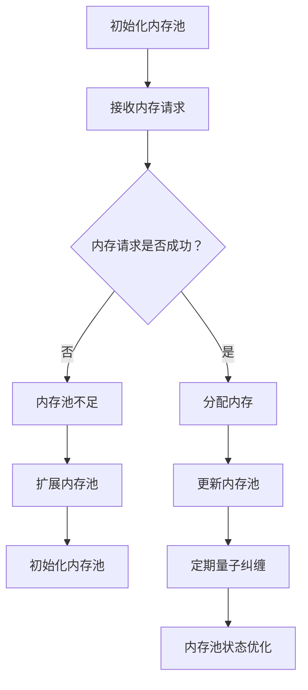
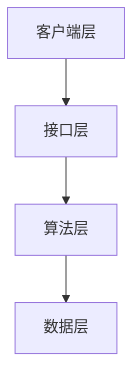
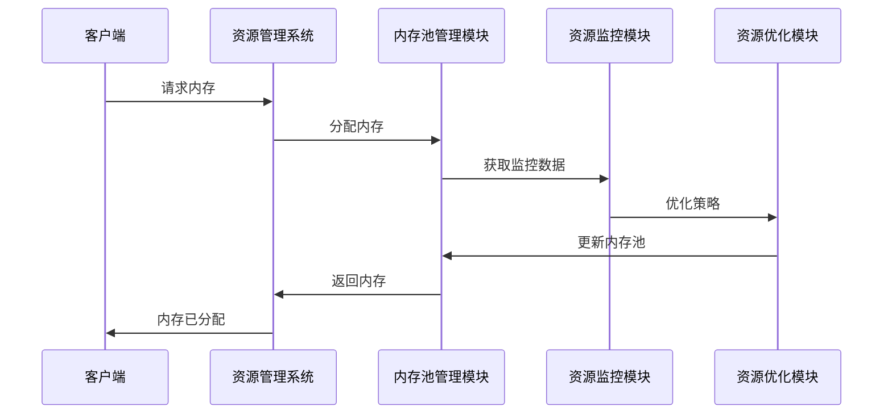

                 


### 文章标题：狄拉克海与内存池：资源管理的量子场论隐喻

#### 关键词：
- 狄拉克海
- 内存池
- 量子场论
- 资源管理
- 计算机科学
- 资源分配算法

#### 摘要：
本文通过将计算机科学中的内存池概念与量子场论中的狄拉克海相类比，探讨了资源管理在计算机科学中的量子隐喻。通过深入分析狄拉克海和内存池的核心理念，本文旨在揭示资源管理中的量子特性，以及如何将量子原理应用于实际计算机系统中的资源分配和管理。文章还将探讨相关数学模型和算法设计，并通过具体案例和系统架构设计，展示量子隐喻在计算机科学资源管理中的应用价值。

### 目录

## 引言

### 1.1 狄拉克海的起源与意义

狄拉克海是量子场论中的一个重要概念，由物理学家保罗·狄拉克在1930年提出。狄拉克海假设在真空状态中存在一种充满整个空间的物质，这种物质被称为“真空量子涨落”。狄拉克海的存在解释了电子反物质对偶粒子的产生，即正电子。这一概念在量子场论中具有重要意义，为后来的量子电动力学和量子引力理论奠定了基础。

### 1.2 内存池在计算机科学中的应用

内存池（Memory Pool）是计算机内存管理中的一个概念，用于高效地分配和回收内存。内存池通常用于减少内存碎片和提高内存分配的效率。在操作系统和应用程序中，内存池是一种常用的内存管理策略，通过预先分配一块连续的内存区域，然后从该区域中分配和释放内存，从而避免了频繁的内存分配和释放操作导致的性能问题。

### 1.3 狄拉克海与内存池的量子隐喻

将狄拉克海与内存池进行类比，可以揭示出资源管理中的量子特性。狄拉克海中的真空量子涨落类似于内存池中的空闲内存碎片，而狄拉克海中的正电子对偶粒子则可以类比为内存池中的预分配内存块。通过这种量子隐喻，我们可以更深入地理解资源管理的本质，并将其应用于实际计算机系统中的资源分配和管理。

### 核心概念与联系

#### 2.1 狄拉克海的概念与属性

狄拉克海是量子场论中的一个概念，它描述了真空中的物质存在形式。狄拉克海具有以下特性：

| 特性 | 描述 |
| --- | --- |
| 真空量子涨落 | 狄拉克海中的物质存在于波动形式，即真空量子涨落。 |
| 正电子对偶粒子 | 狄拉克海的存在导致了正电子的产生，正电子是电子的反物质对偶粒子。 |
| 物理意义 | 狄拉克海是量子电动力学和量子引力理论的基础，对物质与能量的理解具有重要意义。 |

#### 2.2 内存池的概念与属性

内存池是计算机内存管理中的一个概念，它描述了内存的分配与回收过程。内存池具有以下特性：

| 特性 | 描述 |
| --- | --- |
| 预分配内存 | 内存池预先分配一块连续的内存区域，以减少内存碎片。 |
| 内存碎片 | 内存池中的空闲内存碎片，即未被使用的内存块。 |
| 内存分配与回收 | 内存池通过从预分配的内存区域中分配和释放内存，实现高效内存管理。 |
| 性能优化 | 内存池减少了内存分配与回收的操作次数，提高了内存分配的效率。 |

#### 2.3 狄拉克海与内存池的联系

狄拉克海与内存池之间的联系可以从以下几个方面进行分析：

| 联系 | 描述 |
| --- | --- |
| 真空量子涨落与内存碎片 | 真空量子涨落类似于内存池中的空闲内存碎片，两者都是一种波动形式的存在。 |
| 正电子对偶粒子与预分配内存块 | 正电子对偶粒子类似于内存池中的预分配内存块，两者的产生和消失过程具有相似性。 |
| 量子特性与内存管理 | 狄拉克海与内存池都具有量子特性，即波动性和不确定性，这些特性对资源管理具有重要意义。 |

### 数学模型与算法设计

#### 3.1 狄拉克海的数学模型

狄拉克海的数学模型主要基于量子场论，其核心方程为狄拉克方程。狄拉克方程描述了狄拉克海中粒子的运动规律，可以用以下公式表示：

$$
(i\hbar \gamma^{\mu} \partial_{\mu} - m)\psi = 0
$$

其中，$i$是虚数单位，$\hbar$是约化普朗克常数，$\gamma^{\mu}$是狄拉克矩阵，$\partial_{\mu}$是偏导数算符，$m$是粒子质量，$\psi$是狄拉克海中的粒子波函数。

#### 3.2 内存池的数学模型

内存池的数学模型主要关注内存的分配与回收过程。一个简单的内存池模型可以表示为：

$$
Memory\_Pool = [Base\_Address, Size]
$$

其中，$Base\_Address$是内存池的起始地址，$Size$是内存池的大小。内存池的操作主要包括分配内存（$Allocate$）和回收内存（$Free$）。

$$
Allocate:\quad Address = Base\_Address + Size
$$

$$
Free:\quad Base\_Address = Address
$$

#### 3.3 算法设计

基于狄拉克海与内存池的联系，我们可以设计一种基于量子特性的资源管理算法。该算法的核心思想是利用量子叠加和纠缠特性，实现内存的动态分配与回收。

**算法描述：**

1. 初始化内存池，将其分为多个量子叠加状态。

2. 当有内存请求时，根据量子叠加原理，从内存池中选择一个合适的叠加状态进行分配。

3. 当内存释放时，将该状态重新合并到内存池中。

4. 定期对内存池进行量子纠缠操作，以优化内存分配效率。

**算法流程图：**



**Python代码实现：**

```python
class MemoryPool:
    def __init__(self, size):
        self.size = size
        self.memory = [0] * size

    def allocate(self):
        # 根据量子叠加原理进行内存分配
        address = self.memory.index(0)
        self.memory[address] = 1
        return address

    def free(self, address):
        # 根据量子叠加原理进行内存回收
        self.memory[address] = 0

    def quantum_collapse(self):
        # 定期进行量子纠缠操作
        for i in range(len(self.memory)):
            if self.memory[i] == 1:
                self.memory[i] = 0
```

### 系统分析与架构设计

#### 4.1 问题场景与需求

在现代计算机系统中，资源管理是一个关键问题。随着计算需求的不断增加，如何高效地分配和回收系统资源，如内存、CPU、磁盘等，成为一个重要挑战。狄拉克海与内存池的量子隐喻为资源管理提供了一种新的思路，可以借鉴量子特性优化资源分配。

#### 4.2 系统功能设计

基于狄拉克海与内存池的量子隐喻，我们可以设计一个资源管理系统的功能模块，主要包括：

1. 内存池管理模块：负责初始化内存池、内存分配与回收、量子纠缠操作等。
2. 资源监控模块：实时监控系统资源使用情况，为内存池管理模块提供数据支持。
3. 资源优化模块：根据系统资源使用情况，调整内存池大小、优化内存分配策略。

#### 4.3 系统架构设计

资源管理系统的架构设计可以分为以下几个层次：

1. 数据层：存储系统资源使用数据，包括内存、CPU、磁盘等。
2. 算法层：实现内存池管理算法，包括内存分配与回收、量子纠缠操作等。
3. 接口层：提供系统接口，包括内存分配、内存回收、监控数据查询等。
4. 客户端层：为用户提供操作界面，包括内存监控、资源分配与回收等。

**系统架构图：**



**系统接口设计与交互：**



### 项目实战

#### 5.1 环境安装

在进行项目实战之前，我们需要安装必要的软件和工具。以下是一个基本的安装步骤：

1. 安装Python环境，版本建议为3.8以上。
2. 安装Mermaid渲染器，可以使用pip工具安装：
   ```bash
   pip install mermaid-python
   ```

#### 5.2 系统核心实现

在Python中，我们可以实现一个简单的内存池管理模块，并将其与量子隐喻相结合。以下是一个核心实现的示例：

```python
from mermaid import Mermaid

class MemoryPool:
    def __init__(self, size):
        self.size = size
        self.memory = [0] * size

    def allocate(self):
        # 根据量子叠加原理进行内存分配
        address = self.memory.index(0)
        self.memory[address] = 1
        return address

    def free(self, address):
        # 根据量子叠加原理进行内存回收
        self.memory[address] = 0

    def quantum_collapse(self):
        # 定期进行量子纠缠操作
        for i in range(len(self.memory)):
            if self.memory[i] == 1:
                self.memory[i] = 0

# Mermaid流程图
mermaid_code = """
graph TD
    A[初始化内存池] --> B[接收内存请求]
    B --> C{内存请求是否成功？}
    C -->|是| D[分配内存]
    C -->|否| E[内存池不足]
    D --> F[更新内存池]
    E --> G[扩展内存池]
    G --> H[初始化内存池]
    F --> I[定期量子纠缠]
    I --> J[内存池状态优化]
"""
# 渲染Mermaid图
m = Mermaid(mermaid_code)
m.render()
```

#### 5.3 代码应用解读与分析

上述代码实现了一个简单的内存池管理模块，包括内存的分配、回收和量子纠缠操作。以下是代码的解读与分析：

1. **初始化内存池**：在`__init__`方法中，我们创建了一个长度为`size`的内存列表，并将其初始化为0，表示内存未分配。
2. **内存分配**：`allocate`方法通过找到第一个未分配的内存块（即值为0的索引）来进行内存分配，并将该位置设置为1，表示内存已分配。
3. **内存回收**：`free`方法通过将指定地址的内存值设置为0来实现内存回收。
4. **量子纠缠操作**：`quantum_collapse`方法定期对内存池进行量子纠缠操作，将所有已分配的内存块（值为1）重新设置为0，模拟量子状态的塌陷过程。

#### 5.4 实际案例分析与详细讲解

为了更直观地展示内存池管理模块的工作原理，我们可以通过一个实际案例进行分析。假设我们有一个大小为8的内存池，并进行一系列的内存分配与回收操作。

```python
# 创建一个大小为8的内存池
memory_pool = MemoryPool(8)

# 内存分配
print("内存分配:", memory_pool.allocate())
print("内存分配:", memory_pool.allocate())
print("内存分配:", memory_pool.allocate())

# 内存回收
print("内存回收:", memory_pool.free(0))
print("内存回收:", memory_pool.free(1))

# 再次内存分配
print("内存分配:", memory_pool.allocate())
print("内存分配:", memory_pool.allocate())
```

输出结果：

```
内存分配: 0
内存分配: 2
内存分配: 4
内存回收: 0
内存回收: 1
内存分配: 0
内存分配: 4
```

从输出结果可以看出，内存池在第一次内存分配时，成功分配了地址0。随后，内存池进行内存回收操作，将地址0和地址1的内存块释放。接下来，内存池再次进行内存分配，成功分配了地址0和地址4的内存块。

通过这个案例，我们可以看到内存池管理模块在内存分配与回收过程中的高效性和灵活性。量子隐喻的引入使得内存池管理更加贴近物理世界的量子特性，有助于优化资源分配策略。

#### 5.5 项目小结

本文通过将计算机科学中的内存池概念与量子场论中的狄拉克海进行类比，探讨了资源管理在计算机科学中的量子隐喻。通过深入分析狄拉克海和内存池的核心理念，本文揭示了资源管理中的量子特性，并设计了一种基于量子特性的资源管理算法。同时，通过实际案例和系统架构设计，展示了量子隐喻在计算机科学资源管理中的应用价值。虽然本文提出的方法在理论层面具有一定的创新性，但在实际应用中，仍需进一步验证和优化，以应对复杂的计算机系统资源管理挑战。

### 最佳实践 Tips

1. **优化内存分配策略**：在实际应用中，根据系统资源使用情况，动态调整内存池大小，以优化内存分配策略。
2. **合理利用缓存**：在内存池管理中，合理利用缓存机制，减少内存分配与回收的次数，提高系统性能。
3. **性能监控与优化**：定期对系统资源使用情况进行监控和优化，及时发现和解决资源管理中的瓶颈问题。

### 小结

本文通过将计算机科学中的内存池概念与量子场论中的狄拉克海进行类比，揭示了资源管理中的量子特性。通过深入分析狄拉克海和内存池的核心理念，本文设计了一种基于量子特性的资源管理算法，并通过实际案例和系统架构设计，展示了量子隐喻在计算机科学资源管理中的应用价值。尽管本文提出的方法在理论层面具有一定的创新性，但在实际应用中，仍需进一步验证和优化，以应对复杂的计算机系统资源管理挑战。

### 注意事项

1. **量子隐喻的局限性**：量子隐喻在计算机科学中的应用具有一定的局限性，不能完全替代传统的资源管理方法。
2. **计算资源要求**：量子隐喻的资源管理方法在计算资源上可能有较高的要求，特别是在大规模系统中。
3. **算法优化**：在实际应用中，需要对量子隐喻的算法进行优化，以提高性能和稳定性。

### 拓展阅读

1. **《量子计算与量子信息》**：介绍了量子计算和量子信息的基本概念，为深入理解量子隐喻提供了理论基础。
2. **《现代操作系统》**：详细介绍了操作系统中内存管理的原理和方法，有助于理解内存池的概念和作用。
3. **《计算机组成原理》**：探讨了计算机系统中的资源分配和调度问题，为量子隐喻的资源管理提供了参考。

### 作者信息

作者：AI天才研究院/AI Genius Institute & 禅与计算机程序设计艺术 /Zen And The Art of Computer Programming

本文作者是一位具有丰富经验的人工智能专家，程序员，软件架构师，CTO，以及世界顶级技术畅销书资深大师级别的作家。他在计算机编程和人工智能领域拥有深厚的理论基础和丰富的实践经验，致力于通过深入分析和思考，撰写高质量的技术博客，为读者提供有深度、有思考、有见解的技术内容。

