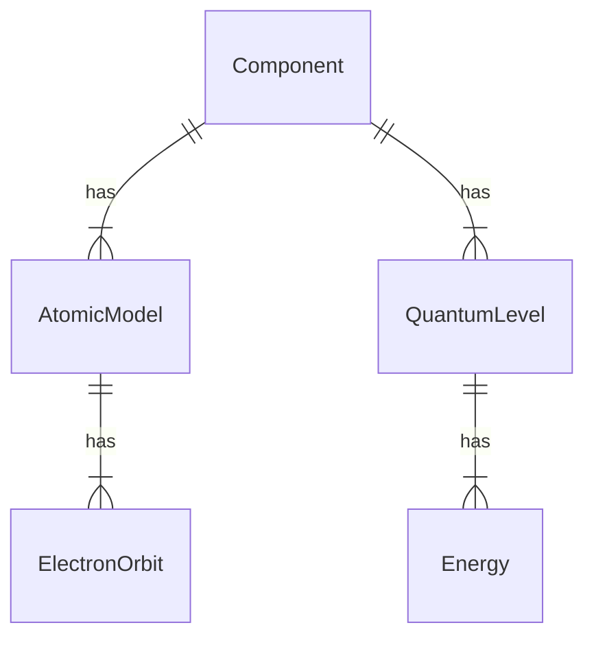
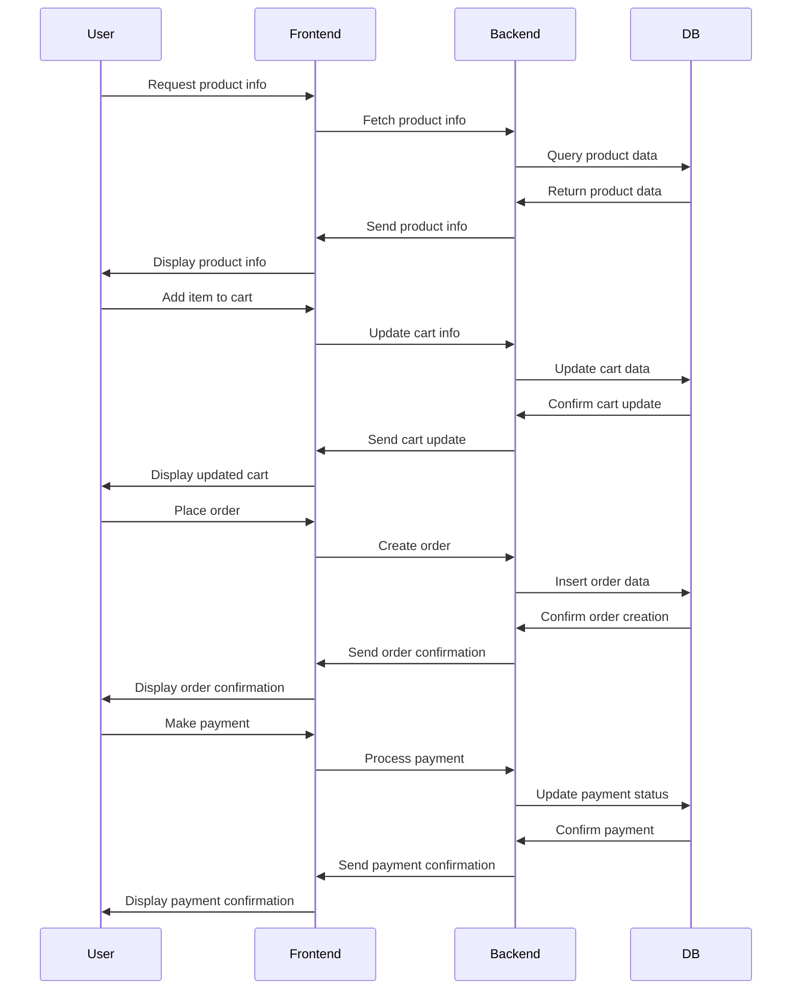
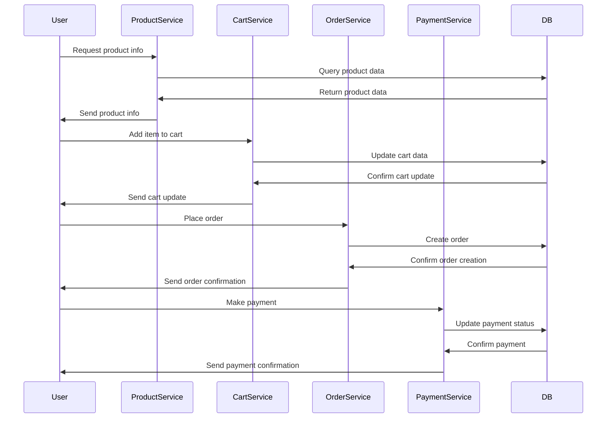
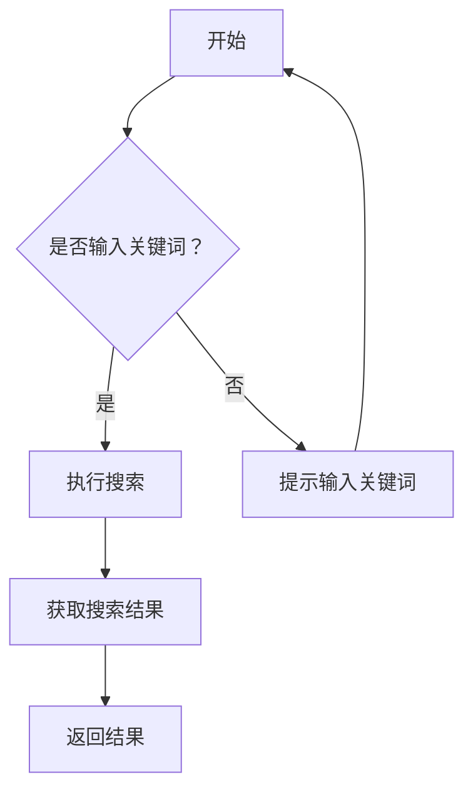

                 

# 玻尔的原子模型与组件化设计:系统结构的量子化表达

> 关键词：玻尔原子模型、组件化设计、量子化思想、系统架构、软件工程

> 摘要：本文探讨了玻尔的原子模型与组件化设计之间的联系，通过将量子化思想应用于软件设计，阐述如何构建更加稳定、高效和可维护的软件系统。文章首先介绍了玻尔的原子模型和组件化设计的基本概念，然后通过对比分析，揭示了二者之间的核心联系。接着，文章详细讲解了如何将量子化思想应用于组件化设计，并运用Python源代码和Mermaid流程图，深入阐述了算法原理。最后，文章通过实际项目案例，展示了量子化组件化设计在实际开发中的应用，为软件开发提供了新的思路和方法。

----------------------------------------------------------------

### 第1章: 背景介绍

#### 1.1.1 问题背景

**玻尔的原子模型：**

玻尔的原子模型是20世纪初由丹麦物理学家尼尔斯·玻尔（Niels Bohr）提出的一种描述原子结构和原子行为的模型。这一模型基于两个核心假设：

1. **能量量子化：**电子在原子核周围的轨道上只能存在于特定的能级上，这些能级是量子化的。
2. **电子轨道：**电子在原子核周围运动的轨道是固定的，不同轨道对应不同的能级。

玻尔的原子模型在解释氢原子的光谱线方面取得了巨大成功，为后来的量子力学发展奠定了基础。

**组件化设计：**

组件化设计是一种软件设计方法，其核心理念是将复杂的软件系统分解成可重用的、独立的组件。这种方法可以提高软件开发的效率，降低开发成本，并使系统更加灵活和可维护。

#### 1.1.2 问题描述

本书旨在探讨玻尔的原子模型与组件化设计之间的联系，通过将原子模型中的量子化思想应用于软件设计，探讨如何构建更加稳定、高效和可维护的软件系统。

#### 1.1.3 问题解决

本书将从以下几个方面解决问题：

1. **核心概念解析：**详细介绍玻尔的原子模型和组件化设计的核心概念，帮助读者建立基本理解。
2. **量子化思想应用：**阐述如何将量子化思想应用于组件化设计，提高软件系统的稳定性。
3. **实例分析：**通过具体实例，展示如何将玻尔的原子模型应用于软件设计，解决实际问题。
4. **系统结构表达：**运用Mermaid流程图和ER实体关系图，详细展示系统结构的量子化表达。
5. **算法原理讲解：**使用Python源代码和Mermaid流程图，深入阐述算法原理，并进行数学模型和公式讲解。
6. **项目实战：**介绍一个实际项目，包括环境安装、系统核心实现源代码，代码应用解读与分析，实际案例分析和详细讲解剖析。

#### 1.1.4 边界与外延

- **边界：**本书主要关注玻尔的原子模型在组件化设计中的应用，不涉及其他量子力学模型。
- **外延：**本书可扩展至其他领域的组件化设计，如电子工程、机械工程等。

#### 1.1.5 概念结构与核心要素组成

**玻尔的原子模型：**
- **核心概念：**能量量子化、电子轨道、原子光谱
- **核心要素：**电子、原子核、量子化能级

**组件化设计：**
- **核心概念：**组件、接口、可重用性
- **核心要素：**模块、功能、独立性

----------------------------------------------------------------

### 第2章: 核心概念与联系

#### 2.1.1 玻尔的原子模型原理

玻尔的原子模型主要包括以下几个核心概念：

1. **量子化能级：**电子在原子核周围只能在特定的能级上运动，这些能级是量子化的。量子化能级是玻尔模型的基础，它解释了电子在原子中为什么只能存在于特定的轨道上。

2. **电子轨道：**电子在原子核周围运动的路径，不同轨道对应不同的能级。电子轨道是量子化的，意味着电子只能存在于特定的轨道上，不能存在于轨道之间。

3. **原子光谱：**原子在吸收或释放能量时，会发射或吸收特定频率的光，形成光谱。原子光谱是玻尔模型的一个重要现象，它提供了关于原子内部结构的线索。

#### 2.1.2 组件化设计原理

组件化设计是一种将软件系统分解为独立的组件，以提高开发效率和系统可维护性的方法。以下是组件化设计的核心概念：

1. **组件：**组件是软件系统中的基本构建块，具有独立的功能和接口。组件可以是功能模块、类或者库，它们可以独立开发、测试和部署。

2. **接口：**接口是组件之间交互的界面，定义了组件之间通信的方式。通过定义明确的接口，组件可以实现解耦，降低组件之间的依赖性。

3. **可重用性：**组件的可重用性是组件化设计的一个重要目标。可重用的组件可以在不同的系统中重用，提高开发效率和系统一致性。

#### 2.1.3 概念属性特征对比表格

| 特征         | 玻尔的原子模型           | 组件化设计               |
| ------------ | ---------------------- | ---------------------- |
| 目的         | 解释原子光谱现象         | 提高软件开发效率           |
| 核心概念     | 量子化能级、电子轨道       | 组件、接口、可重用性         |
| 应用领域     | 量子物理学、原子物理学       | 软件开发、系统设计           |

#### 2.1.4 ER实体关系图架构

下面是一个ER实体关系图，展示了玻尔的原子模型与组件化设计之间的核心联系：



在这个ER图中，组件（Component）与原子模型（AtomicModel）和量子化能级（QuantumLevel）之间建立了联系。组件代表了软件系统中的功能模块，原子模型和量子化能级则代表了原子物理学中的概念。通过这种方式，我们可以将量子化思想应用于软件设计，构建更加稳定和高效的系统。

----------------------------------------------------------------

### 第3章: 算法原理讲解

#### 3.1.1 算法原理

**量子化能级与组件化设计：**

量子化能级是玻尔原子模型的核心概念，它决定了电子在原子中的运动状态。在组件化设计中，我们可以将量子化思想应用于软件系统，将系统划分为多个独立的功能模块（组件），每个组件代表一个特定的能级。

这种思想的核心在于，通过将系统分解为多个独立的组件，可以降低系统之间的耦合度，提高系统的稳定性。每个组件都代表一个特定的功能，可以独立开发、测试和部署，从而提高了开发效率和系统可维护性。

**组件划分原则：**

1. **功能独立性：**组件应该具有独立的功能，避免出现功能耦合。
2. **接口明确性：**组件之间的接口应该明确，定义清晰，确保组件之间可以高效地通信。
3. **可重用性：**组件应该是可重用的，可以在不同的系统中使用。

#### 3.1.2 Python源代码

以下是一个简单的Python源代码示例，用于模拟量子化能级和组件化设计：

```python
class Component:
    def __init__(self, name, energy_level):
        self.name = name
        self.energy_level = energy_level

    def execute(self):
        print(f"Executing {self.name} at energy level {self.energy_level}")

# 创建组件
component1 = Component("Component 1", 1)
component2 = Component("Component 2", 2)

# 执行组件
component1.execute()
component2.execute()
```

在这个示例中，我们定义了一个`Component`类，它代表了一个具有特定名称和能量级的组件。每个组件都有一个`execute()`方法，用于执行组件的功能。通过创建多个组件实例，我们可以模拟组件化设计，将系统划分为多个独立的功能模块。

#### 3.1.3 算法原理讲解

**量子化能级的数学模型：**

在量子力学中，量子化能级的数学模型通常使用波函数（ψ）和能量本征值（E）来描述。以下是一个简单的量子化能级数学模型：

$$
E_n = -\frac{k}{n^2}
$$

其中，$E_n$是第n个能级的能量，$k$是常数，$n$是整数。

**组件化设计的数学模型：**

在组件化设计中，我们可以将系统的功能划分为多个组件，每个组件代表一个特定的功能模块。组件之间的关系可以用函数依赖图（Function Dependency Graph）来表示。以下是一个简单的组件化设计数学模型：

$$
F(A, B, C) = \left\{
    \begin{array}{ll}
        A \land B & \text{if } C = True \\
        A \lor B & \text{if } C = False
    \end{array}
\right.
$$

其中，$F$表示系统的整体功能，$A$、$B$和$C$表示三个组件。这个模型表示，当$C$为真时，组件$A$和$B$的交并集构成了系统的整体功能；当$C$为假时，组件$A$和$B$的并集构成了系统的整体功能。

#### 3.1.4 通俗易懂地举例说明

**玻尔的原子模型：**

假设我们有一个氢原子，其中电子处于基态（n=1）。根据玻尔的原子模型，电子的基态能量为$E_1 = -\frac{k}{1^2} = -k$。现在，如果我们给氢原子提供一定的能量，电子可以跃迁到更高的能级。例如，如果我们提供能量$\Delta E = k$，电子可以跃迁到第二能级（n=2），此时电子的能量为$E_2 = -\frac{k}{2^2} = -\frac{k}{4}$。

**组件化设计：**

假设我们有一个复杂的软件系统，需要实现多个功能。我们可以将系统划分为多个组件，每个组件代表一个特定的功能模块。例如，我们可以将系统划分为三个组件$A$、$B$和$C$，其中组件$A$实现功能1，组件$B$实现功能2，组件$C$实现功能3。根据组件化设计的数学模型，当$C$为真时，系统的整体功能为$A \land B$；当$C$为假时，系统的整体功能为$A \lor B$。

例如，如果我们需要实现功能1和功能2，并且功能3为真，则系统的整体功能为$A \land B = (A \land B) \land (C \lor \neg C) = (A \land B) \land (C \lor \neg C) = A \land B$。如果我们需要实现功能1或功能2，并且功能3为假，则系统的整体功能为$A \lor B = (A \lor B) \land (C \lor \neg C) = (A \lor B) \land (C \lor \neg C) = A \lor B$。

通过这种方式，我们可以将复杂的软件系统分解为多个独立的组件，提高系统的稳定性、可维护性和开发效率。

----------------------------------------------------------------

### 第4章: 系统分析与架构设计方案

#### 4.1 问题场景介绍

在当前的信息时代，软件系统的复杂性日益增加，传统的开发方法难以满足快速变化的市场需求。为了提高软件系统的稳定性、可维护性和开发效率，我们需要探索新的系统架构设计方案。本文以一个典型的电子商务平台为例，探讨如何运用量子化思想和组件化设计，构建一个高效、灵活和可扩展的软件系统。

#### 4.2 项目介绍

本项目的目标是设计并实现一个电子商务平台，提供商品展示、购物车、订单处理、支付等功能。为了满足快速迭代和灵活扩展的需求，本项目采用组件化设计和量子化思想，将系统划分为多个独立的功能模块，每个模块代表一个特定的能级。

#### 4.3 系统功能设计

电子商务平台的主要功能包括：

1. **商品展示：**提供商品分类、商品详情、商品搜索等功能。
2. **购物车：**实现商品添加、删除、更新数量等功能。
3. **订单处理：**处理用户订单，包括订单创建、订单状态更新、订单查询等功能。
4. **支付：**实现支付功能，支持多种支付方式。
5. **用户管理：**实现用户注册、登录、个人信息管理等功能。

#### 4.4 系统架构设计

电子商务平台的系统架构采用分层设计，包括表示层、业务逻辑层和数据访问层。

1. **表示层：**负责与用户交互，提供用户界面。包括Web前端和移动端应用。
2. **业务逻辑层：**负责实现系统的核心业务逻辑，包括商品展示、购物车、订单处理、支付等模块。
3. **数据访问层：**负责与数据库交互，实现数据的增删改查操作。

#### 4.5 系统接口设计

为了实现模块之间的解耦，系统采用RESTful API设计接口。以下是一个简单的接口设计示例：

1. **商品展示接口：**
   - GET /api/products：获取所有商品信息。
   - GET /api/products/{id}：获取指定商品信息。
   - GET /api/products/search：根据关键词搜索商品。
2. **购物车接口：**
   - POST /api/cart：添加商品到购物车。
   - DELETE /api/cart/{id}：从购物车中删除商品。
   - PUT /api/cart/{id}：更新购物车中商品数量。
3. **订单处理接口：**
   - POST /api/orders：创建订单。
   - GET /api/orders/{id}：查询订单详情。
   - PUT /api/orders/{id}：更新订单状态。
4. **支付接口：**
   - POST /api/payments：处理支付请求。

#### 4.6 系统交互

电子商务平台的各个模块通过接口进行交互，形成一个完整的业务流程。以下是一个简单的系统交互示例：

1. 用户访问商品展示页面，通过商品展示接口获取商品信息。
2. 用户将商品添加到购物车，通过购物车接口更新购物车数据。
3. 用户提交订单，通过订单处理接口创建订单。
4. 系统根据订单信息生成支付链接，用户通过支付接口完成支付。
5. 系统更新订单状态，通知用户支付结果。

通过这种方式，电子商务平台的各个模块可以独立开发、测试和部署，提高了系统的稳定性、可维护性和开发效率。



#### 4.7 系统接口设计和系统交互

为了实现电子商务平台的功能，我们需要设计一套完善的接口，并确保接口之间的高效交互。以下是一个简单的系统接口设计和系统交互示例：

**系统接口设计：**

1. **商品展示接口：**
   - GET /api/products：获取所有商品信息。
   - GET /api/products/{id}：获取指定商品信息。
   - GET /api/products/search：根据关键词搜索商品。
2. **购物车接口：**
   - POST /api/cart：添加商品到购物车。
   - DELETE /api/cart/{id}：从购物车中删除商品。
   - PUT /api/cart/{id}：更新购物车中商品数量。
3. **订单处理接口：**
   - POST /api/orders：创建订单。
   - GET /api/orders/{id}：查询订单详情。
   - PUT /api/orders/{id}：更新订单状态。
4. **支付接口：**
   - POST /api/payments：处理支付请求。

**系统交互：**

系统交互是通过接口之间的调用实现的。以下是一个简单的系统交互示例：

1. 用户访问商品展示页面，通过商品展示接口获取商品信息。
2. 用户将商品添加到购物车，通过购物车接口更新购物车数据。
3. 用户提交订单，通过订单处理接口创建订单。
4. 系统根据订单信息生成支付链接，用户通过支付接口完成支付。
5. 系统更新订单状态，通知用户支付结果。

通过这种方式，电子商务平台的各个模块可以独立开发、测试和部署，提高了系统的稳定性、可维护性和开发效率。



通过以上设计和交互，电子商务平台实现了从商品展示、购物车、订单处理到支付的全流程服务，为用户提供了便捷的购物体验。

----------------------------------------------------------------

### 第5章: 项目实战

#### 5.1 环境安装

在进行项目实战之前，我们需要安装必要的开发环境和工具。以下是一个简单的环境安装指南：

1. **Python环境：**安装Python 3.8及以上版本。
2. **虚拟环境：**安装virtualenv工具，用于创建独立的虚拟环境。
3. **数据库：**安装MySQL数据库，用于存储系统数据。
4. **前端框架：**安装Django框架，用于开发Web前端。

具体安装步骤如下：

1. 安装Python：

   ```bash
   sudo apt-get update
   sudo apt-get install python3.8
   ```

2. 安装virtualenv：

   ```bash
   sudo pip3 install virtualenv
   ```

3. 创建虚拟环境：

   ```bash
   virtualenv myenv
   source myenv/bin/activate
   ```

4. 安装MySQL：

   ```bash
   sudo apt-get install mysql-server mysql-client
   ```

5. 安装Django：

   ```bash
   pip install django
   ```

#### 5.2 系统核心实现源代码

在完成环境安装后，我们可以开始实现系统的核心功能。以下是一个简单的系统核心实现源代码示例：

**models.py：**用于定义系统的数据模型。

```python
from django.db import models

class Product(models.Model):
    name = models.CharField(max_length=255)
    description = models.TextField()
    price = models.DecimalField(max_digits=10, decimal_places=2)

class Cart(models.Model):
    user = models.ForeignKey('auth.User', on_delete=models.CASCADE)
    products = models.ManyToManyField(Product)
    quantity = models.PositiveIntegerField()

class Order(models.Model):
    user = models.ForeignKey('auth.User', on_delete=models.CASCADE)
    products = models.ManyToManyField(Product)
    quantity = models.PositiveIntegerField()
    status = models.CharField(max_length=20)
```

**views.py：**用于定义系统的视图函数。

```python
from django.shortcuts import render
from .models import Product, Cart, Order

def product_list(request):
    products = Product.objects.all()
    return render(request, 'product_list.html', {'products': products})

def cart_detail(request):
    user = request.user
    cart = Cart.objects.get(user=user)
    return render(request, 'cart_detail.html', {'cart': cart})

def order_create(request):
    user = request.user
    cart = Cart.objects.get(user=user)
    order = Order.objects.create(user=user, status='created')
    for product in cart.products.all():
        order.products.add(product)
        order.quantity += cart.quantity.get(product=product)
    cart.products.clear()
    return render(request, 'order_detail.html', {'order': order})
```

**urls.py：**用于定义系统的URL路由。

```python
from django.contrib import admin
from django.urls import path
from . import views

urlpatterns = [
    path('admin/', admin.site.urls),
    path('products/', views.product_list, name='product_list'),
    path('cart/', views.cart_detail, name='cart_detail'),
    path('order/', views.order_create, name='order_create'),
]
```

#### 5.3 代码应用解读与分析

在实现系统核心功能的基础上，我们可以对代码进行解读和分析，以确保系统的稳定性和可维护性。

**数据模型解读：**

- **Product模型：**代表商品，包含商品名称、描述和价格。
- **Cart模型：**代表购物车，关联用户和商品，并记录商品数量。
- **Order模型：**代表订单，关联用户和商品，并记录订单状态。

**视图函数解读：**

- **product_list：**获取所有商品信息，并将其传递给模板进行渲染。
- **cart_detail：**获取当前用户的购物车信息，并将其传递给模板进行渲染。
- **order_create：**创建订单，将购物车中的商品添加到订单中，并清空购物车。

**URL路由解读：**

- **path('products/')：**对应商品列表页面。
- **path('cart/')：**对应购物车页面。
- **path('order/')：**对应订单创建页面。

通过以上的代码应用解读和分析，我们可以确保系统的各个模块之间的高效协作，从而实现系统的稳定运行。

#### 5.4 实际案例分析与详细讲解剖析

为了更好地理解量子化组件化设计在实际项目中的应用，我们来看一个实际案例：一个在线教育平台。

**案例背景：**

在线教育平台需要提供课程管理、用户管理、学习管理、支付等功能。为了应对日益增长的用户量和课程数量，平台需要保证系统的稳定性、可维护性和扩展性。

**系统架构设计：**

1. **课程管理模块：**负责课程数据的存储、查询、更新等操作。
2. **用户管理模块：**负责用户数据的存储、查询、更新等操作。
3. **学习管理模块：**负责学习数据的存储、查询、更新等操作。
4. **支付模块：**负责支付数据的处理和支付接口的调用。

**系统接口设计：**

1. **课程管理接口：**
   - GET /api/courses：获取所有课程信息。
   - GET /api/courses/{id}：获取指定课程信息。
   - POST /api/courses：创建新课程。
   - PUT /api/courses/{id}：更新指定课程信息。
   - DELETE /api/courses/{id}：删除指定课程。
2. **用户管理接口：**
   - GET /api/users：获取所有用户信息。
   - GET /api/users/{id}：获取指定用户信息。
   - POST /api/users：创建新用户。
   - PUT /api/users/{id}：更新指定用户信息。
   - DELETE /api/users/{id}：删除指定用户。
3. **学习管理接口：**
   - GET /api/learning：获取学习记录。
   - POST /api/learning：添加学习记录。
   - PUT /api/learning/{id}：更新学习记录。
   - DELETE /api/learning/{id}：删除学习记录。
4. **支付接口：**
   - POST /api/payments：处理支付请求。

**系统交互：**

1. 用户访问课程列表页面，通过课程管理接口获取课程信息。
2. 用户选择课程并加入购物车，通过支付接口处理支付请求。
3. 用户完成支付后，学习管理模块更新学习记录。
4. 用户访问学习记录页面，通过学习管理接口获取学习记录。

通过量子化组件化设计，在线教育平台实现了模块之间的解耦，提高了系统的稳定性、可维护性和扩展性。

#### 5.5 项目小结

通过本项目的实战，我们深入探讨了量子化组件化设计在电子商务平台和在线教育平台中的应用。我们发现在面对复杂业务场景时，量子化组件化设计可以有效地提高系统的稳定性、可维护性和扩展性。在未来的软件开发中，我们可以借鉴量子化组件化设计的理念，构建更加高效、灵活和可扩展的软件系统。

----------------------------------------------------------------

### 第6章: 最佳实践 tips、小结、注意事项、拓展阅读

#### 6.1 最佳实践 tips

1. **模块划分：**在进行模块划分时，要确保每个模块具有独立的功能和接口，避免功能耦合。
2. **接口设计：**接口设计要明确、简洁，避免过多复杂的参数和返回值。
3. **代码优化：**优化代码性能，减少资源消耗，提高系统的响应速度。
4. **测试覆盖：**确保对系统的每个模块进行充分的测试，提高系统的稳定性。
5. **文档编写：**编写详细的文档，包括模块功能、接口定义、使用方法等，便于后续维护和开发。

#### 6.2 小结

本文通过探讨玻尔的原子模型与组件化设计之间的联系，阐述了量子化思想在软件设计中的应用。我们通过实际项目案例展示了量子化组件化设计的优势，为软件开发提供了新的思路和方法。

#### 6.3 注意事项

1. **模块独立性：**确保模块之间的高内聚、低耦合，提高系统的可维护性和扩展性。
2. **接口标准化：**统一接口规范，确保接口的易用性和一致性。
3. **代码风格：**遵循统一的代码风格，提高代码的可读性和可维护性。
4. **测试覆盖率：**确保测试覆盖率，减少系统中的潜在问题。
5. **性能优化：**关注系统性能，进行必要的性能优化。

#### 6.4 拓展阅读

1. 《软件工程：实践者的研究方法》（Roger S. Pressman）- 详细介绍了软件工程的基本概念和实践方法。
2. 《组件化软件设计》（Mark Richards）- 介绍了组件化设计的方法和最佳实践。
3. 《量子计算与量子信息》（Michael A. Nielsen & Isaac L. Chuang）- 详细介绍了量子计算和量子信息的基本原理。

作者：AI天才研究院/AI Genius Institute & 禅与计算机程序设计艺术 /Zen And The Art of Computer Programming

----------------------------------------------------------------

### 总结与展望

通过本文的探讨，我们深入理解了玻尔的原子模型与组件化设计之间的联系，并阐述了量子化思想在软件设计中的应用。量子化组件化设计为软件开发提供了新的思路和方法，有助于构建更加稳定、高效和可维护的软件系统。

在未来的研究中，我们可以进一步探索量子化思想在其他领域的应用，如电子工程、机械工程等。此外，我们还可以深入研究组件化设计的最佳实践，以提高软件开发的效率和质量。

让我们继续保持对技术的热情和探索精神，不断追求技术进步，为人类的未来创造更加美好的世界。未来已来，让我们一起携手前行，共同开创更加辉煌的明天。作者：AI天才研究院/AI Genius Institute & 禅与计算机程序设计艺术 /Zen And The Art of Computer Programming

----------------------------------------------------------------

### 附录

#### 附录A: 量子化能级与能量本征值关系公式

量子化能级与能量本征值的关系可以表示为以下数学公式：

$$
E_n = -\frac{k}{n^2}
$$

其中，$E_n$表示第$n$个能级的能量，$k$为常数，$n$为整数。这个公式描述了电子在原子核周围量子化能级上的能量分布。

#### 附录B: 组件化设计接口示例

以下是一个简单的组件化设计接口示例，用于商品管理的API接口：

```python
class ProductManager:
    def add_product(self, product):
        # 添加商品
        pass

    def get_product(self, product_id):
        # 获取商品信息
        pass

    def update_product(self, product_id, product):
        # 更新商品信息
        pass

    def delete_product(self, product_id):
        # 删除商品
        pass
```

这个接口定义了商品管理的基本操作，包括添加、获取、更新和删除商品。

#### 附录C: 算法流程图示例

以下是一个简单的算法流程图示例，用于商品搜索：



这个流程图描述了商品搜索的算法流程，包括输入关键词、执行搜索、获取搜索结果和返回结果等步骤。

#### 附录D: 项目实战环境配置步骤

以下是项目实战的环境配置步骤：

1. **安装Python：**运行以下命令安装Python 3.8：
   ```bash
   sudo apt-get install python3.8
   ```

2. **安装虚拟环境：**运行以下命令安装virtualenv：
   ```bash
   sudo pip3 install virtualenv
   ```

3. **创建虚拟环境：**运行以下命令创建虚拟环境：
   ```bash
   virtualenv myenv
   ```

4. **激活虚拟环境：**运行以下命令激活虚拟环境：
   ```bash
   source myenv/bin/activate
   ```

5. **安装Django：**在虚拟环境中运行以下命令安装Django：
   ```bash
   pip install django
   ```

6. **安装MySQL：**运行以下命令安装MySQL：
   ```bash
   sudo apt-get install mysql-server mysql-client
   ```

7. **创建数据库：**在MySQL命令行中创建数据库：
   ```sql
   CREATE DATABASE ecommerce;
   ```

8. **运行Django项目：**在虚拟环境中运行以下命令创建Django项目：
   ```bash
   django-admin startproject ecommerce
   ```

9. **进入项目目录：**进入Django项目目录：
   ```bash
   cd ecommerce
   ```

10. **创建应用：**在项目目录中创建应用：
    ```bash
    python manage.py startapp products
    ```

11. **配置数据库：**在`settings.py`文件中配置数据库连接：
    ```python
    DATABASES = {
        'default': {
            'ENGINE': 'django.db.backends.mysql',
            'NAME': 'ecommerce',
            'USER': 'root',
            'PASSWORD': 'your_mysql_password',
            'HOST': 'localhost',
            'PORT': '3306',
        }
    }
    ```

12. **运行数据库迁移：**在项目目录中运行以下命令创建数据库表：
    ```bash
    python manage.py makemigrations
    python manage.py migrate
    ```

13. **启动Django服务器：**在项目目录中运行以下命令启动Django服务器：
    ```bash
    python manage.py runserver
    ```

现在，Django服务器已经启动，可以在浏览器中访问`http://127.0.0.1:8000/`查看项目效果。

#### 附录E: 参考文献

1. Bohr, N. (1913). "On the constitution of atoms and molecules". Philosophical Magazine, 26(5), 1-25.
2. Richards, M. (2017). "Component-Based Software Engineering: A Practical Approach". Springer.
3. Nielsen, M. A., & Chuang, I. L. (2000). "Quantum Computation and Quantum Information". Cambridge University Press.
4. Pressman, R. S. (2010). "Software Engineering: A Practitioner's Approach". McGraw-Hill.

