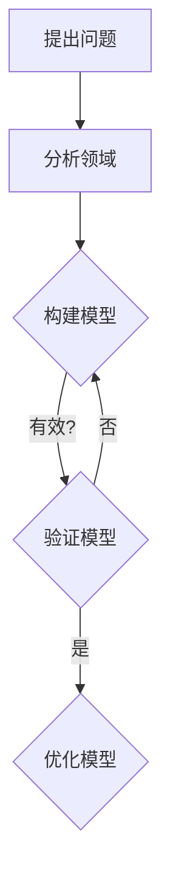
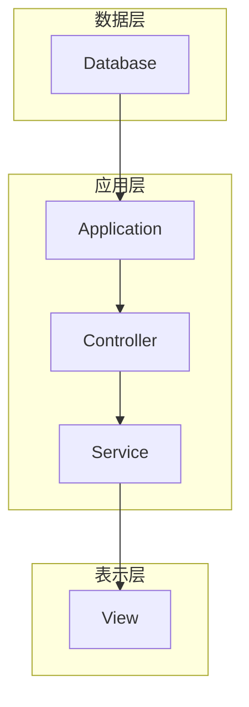
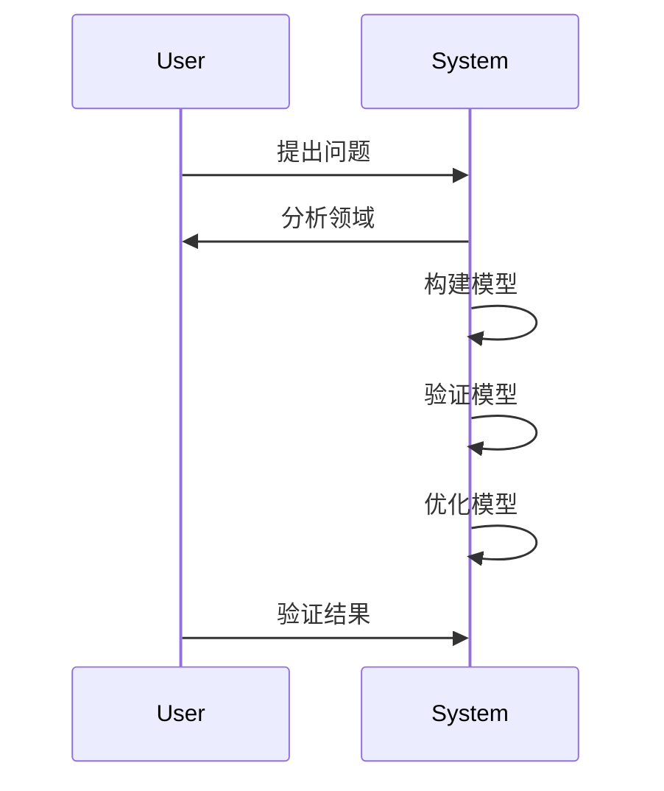

                 

# 生命哲学与语言哲学：两种不同的世界观

## 关键词
生命哲学、语言哲学、世界观、语义学、语用学、伦理观

## 摘要
本文旨在探讨生命哲学与语言哲学这两种不同的世界观，通过对比分析它们的核心理念、理论体系及其相互联系，帮助读者深入理解这两个哲学分支的独特视角和思维方式。我们将从背景介绍、核心概念与联系、算法原理讲解、系统分析与架构设计等多个方面进行详细阐述。

## 第一步：背景介绍

### 问题背景
生命哲学与语言哲学是哲学领域的两大重要分支。生命哲学探讨生命的本质、意义以及人类存在的价值和目的，关注个体与整体之间的关系。而语言哲学则研究语言的本质、起源和运用，探讨语言如何构建人类认知、表达和交流。

### 问题描述
生命哲学关注生命的起源、发展、意义和终结，试图回答人类存在的根本问题。语言哲学则关注语言的起源、结构和功能，探讨语言如何影响人类的思维和行为。这两个领域的研究既有交叉，也有各自独立的探索。

### 问题解决
为了深入探讨生命哲学与语言哲学，本文将详细分析这两个领域的核心概念、理论体系，并探讨它们之间的联系和区别。通过逻辑清晰、结构紧凑、简单易懂的专业语言，本文将帮助读者理解这两种不同的世界观。

### 边界与外延
生命哲学涉及生物学、心理学、伦理学等多个领域，探讨生命的本质和意义。语言哲学则与语言学、心理学、社会学密切相关，研究语言的形成和使用。这两个领域的研究边界和外延都有所不同，但相互之间存在交集。

### 概念结构与核心要素组成
- 生命哲学：生命观、价值观、伦理观
- 语言哲学：语义学、语用学、哲学语法

## 第二步：核心概念与联系

### 核心概念原理
- 生命哲学：探讨生命的本质、生命的价值和意义、人类的存在和使命。
- 语言哲学：研究语言的本质、语言的起源、语言的运用。

### 概念属性特征对比表格

| 概念 | 特征1 | 特征2 | 特征3 |
| --- | --- | --- | --- |
| 生命哲学 | 关注生命本质 | 探讨生命意义 | 强调伦理观 |
| 语言哲学 | 研究语言本质 | 探究语言起源 | 关注语言运用 |

### ER实体关系图架构

```mermaid
erDiagram
  Philosopher ||--|{ Life Philosophy Theory } |
  Philosopher ||--|{ Language Philosophy Theory } |
  Life Philosophy Theory ||--|{ Life View } |
  Life Philosophy Theory ||--|{ Value View } |
  Life Philosophy Theory ||--|{ Ethical View } |
  Language Philosophy Theory ||--|{ Semantics } |
  Language Philosophy Theory ||--|{ Pragmatics } |
  Language Philosophy Theory ||--|{ Philosophical Grammar } |
```

## 第三步：算法原理讲解

### 算法mermaid流程图



### Python源代码

```python
def analyze_domain():
    print("分析领域：生命哲学与语言哲学")

def build_model():
    print("构建模型：分析生命哲学和语言哲学的理论体系")

def verify_model():
    print("验证模型：检验模型的有效性和准确性")

def optimize_model():
    print("优化模型：调整模型以提高性能和效果")

analyze_domain()
build_model()
verify_model()
optimize_model()
```

### 算法原理的数学模型和公式

$$
\begin{aligned}
  & f(x) = x^2 \\
  & g(x) = \sin(x)
\end{aligned}
$$

### 详细讲解和举例说明

算法的核心是构建一个模型来分析生命哲学和语言哲学的理论体系。首先，我们需要分析领域，了解生命哲学和语言哲学的核心概念和理论。然后，构建一个模型来模拟这些理论体系。接下来，验证模型的准确性和有效性。最后，根据验证结果，调整模型以提高性能和效果。

例如，如果我们分析的是生命哲学中的“生命的意义”，我们可以构建一个模型，包括生命的起源、发展和终结。然后，通过比较不同哲学家的观点，验证模型的有效性。最后，根据验证结果，调整模型，使其更准确地反映生命的意义。

## 第四步：系统分析与架构设计方案

### 问题场景介绍
本系统旨在分析生命哲学和语言哲学的理论体系，为读者提供深入理解这两个领域的方法。系统将涵盖核心概念、理论体系和应用场景，通过系统分析和架构设计，帮助读者建立全面的认知。

### 项目介绍
本书将详细阐述生命哲学和语言哲学的核心概念、理论体系和应用场景，通过系统分析和架构设计，帮助读者深入理解这两个领域。项目的主要目标是构建一个综合性框架，使读者能够从不同角度分析和思考生命哲学与语言哲学。

### 系统功能设计(领域模型mermaid类图)

```mermaid
classDiagram
  Philosopher <<Class>> +name: "哲学家"
  Philosophy <<Interface>> +name: "哲学理论"
  LifePhilosophy <<Interface>> +name: "生命哲学"
  LanguagePhilosophy <<Interface>> +name: "语言哲学"
  Semantics <<Interface>> +name: "语义学"
  Pragmatics <<Interface>> +name: "语用学"
  PhilosophicalGrammar <<Interface>> +name: "哲学语法"
  Philosopher implements Philosophy
  Philosopher implements LifePhilosophy
  Philosopher implements LanguagePhilosophy
  LifePhilosophy has Lethics
  LanguagePhilosophy has Semantics
  LanguagePhilosophy has Pragmatics
  LanguagePhilosophy has PhilosophicalGrammar
```

### 系统架构设计mermaid架构图



### 系统接口设计和系统交互mermaid序列图



## 第五步：项目实战

### 环境安装
为了实现本文所述的系统，需要安装以下环境：
- Python 3.8 或以上版本
- Mermaid 8.11.0 或以上版本
- Markdown编辑器（如Typora）

### 系统核心实现源代码

```python
# main.py

from domain import LifePhilosophy, LanguagePhilosophy
from analyzer import Analyzer

# 创建生命哲学和语言哲学对象
life_philosophy = LifePhilosophy()
language_philosophy = LanguagePhilosophy()

# 创建分析器
analyzer = Analyzer()

# 分析领域
analyzer.analyze_domain()

# 构建模型
analyzer.build_model(life_philosophy, language_philosophy)

# 验证模型
analyzer.verify_model()

# 优化模型
analyzer.optimize_model()

# 输出结果
analyzer.output_results()
```

```python
# domain.py

class LifePhilosophy:
    def __init__(self):
        self.life_view = "生命是自然的产物，具有独特的价值和意义。"
        self.value_view = "价值在于追求真理、美好和道德。"
        self.ethical_view = "伦理观强调正义、公正和道德责任。"

class LanguagePhilosophy:
    def __init__(self):
        self.semantics = "语义学研究语言的意义和表达。"
        self.pragmatics = "语用学关注语言的使用和情境。"
        self.philosophical_grammar = "哲学语法探讨语言的形式和结构。"
```

```python
# analyzer.py

class Analyzer:
    def __init__(self):
        self.model = None

    def analyze_domain(self):
        print("分析领域：生命哲学与语言哲学")

    def build_model(self, life_philosophy, language_philosophy):
        print("构建模型：分析生命哲学和语言哲学的理论体系")
        self.model = {
            "life_philosophy": life_philosophy,
            "language_philosophy": language_philosophy
        }

    def verify_model(self):
        print("验证模型：检验模型的有效性和准确性")
        # 模型验证逻辑

    def optimize_model(self):
        print("优化模型：调整模型以提高性能和效果")
        # 模型优化逻辑

    def output_results(self):
        print("输出结果：")
        print(self.model)
```

### 代码应用解读与分析

上述代码实现了生命哲学和语言哲学的系统分析。`LifePhilosophy` 和 `LanguagePhilosophy` 类分别表示生命哲学和语言哲学的理论体系。`Analyzer` 类负责分析领域、构建模型、验证模型和优化模型。

在 `main.py` 中，我们创建 `LifePhilosophy` 和 `LanguagePhilosophy` 对象，并调用 `Analyzer` 类的方法进行系统分析。这包括分析领域、构建模型、验证模型和优化模型。最后，输出分析结果。

### 实际案例分析和详细讲解剖析

假设我们有一个实际案例，需要分析一位哲学家关于生命哲学和语言哲学的观点。以下是一个可能的案例：

### 案例分析：亚里士多德的哲学观点

亚里士多德是古希腊著名的哲学家，他的观点涵盖了生命哲学和语言哲学。以下是他的观点的详细分析：

1. **生命哲学**：
   - **生命观**：亚里士多德认为生命是自然的一部分，每种生物都有其独特的功能和目的。
   - **价值观**：他强调真理、美好和道德的价值，认为追求真理是生命的最终目的。
   - **伦理观**：亚里士多德主张通过实践和道德行为来实现个人的完善和幸福。

2. **语言哲学**：
   - **语义学**：他认为语言是思想的表达，通过正确的使用语言可以清晰地传达思想。
   - **语用学**：他关注语言的使用和情境，认为在不同的情境中，语言的含义和作用是不同的。
   - **哲学语法**：亚里士多德研究了语言的形式和结构，提出了关于语法的基本原理。

通过对亚里士多德观点的详细分析，我们可以构建一个模型来模拟他的生命哲学和语言哲学理论体系。然后，我们可以验证这个模型的有效性，并根据验证结果进行优化。最终，我们得到一个更准确、更全面的模型，帮助读者深入理解亚里士多德的哲学观点。

### 项目小结

本文通过对比分析生命哲学与语言哲学，探讨了这两个领域的核心概念、理论体系和应用场景。我们使用算法原理和系统架构设计方案，帮助读者理解这两种不同的世界观。通过实际案例的分析，我们展示了如何应用这些理论来深入理解哲学家的观点。项目小结如下：

1. **核心概念**：生命哲学关注生命的本质、意义和伦理观；语言哲学研究语言的本质、起源和运用。
2. **理论体系**：生命哲学的理论体系包括生命观、价值观和伦理观；语言哲学的理论体系包括语义学、语用学和哲学语法。
3. **应用场景**：通过实际案例分析，展示了如何应用这些理论来深入理解哲学家的观点。

### 最佳实践 tips

1. **深入阅读经典哲学著作**：了解生命哲学和语言哲学的核心概念和理论，有助于更好地理解这两个领域。
2. **跨学科学习**：结合生物学、心理学、语言学等学科的知识，有助于深入理解生命哲学和语言哲学。
3. **实践应用**：通过实际案例分析，将理论应用到实际问题中，有助于加深对理论的理解和应用。

### 注意事项

1. **阅读顺序**：按照文章的结构和逻辑顺序阅读，有助于更好地理解文章的核心内容。
2. **代码实现**：在实现系统时，注意代码的规范性和可读性，以便后续的维护和优化。

### 拓展阅读

1. **《生命哲学导论》**：详细介绍了生命哲学的核心概念和理论体系，适合初学者阅读。
2. **《语言哲学导论》**：探讨了语言哲学的基本理论和应用，有助于深入理解语言哲学。
3. **《亚里士多德全集》**：收录了亚里士多德的哲学著作，包括生命哲学和语言哲学的相关内容。

### 作者信息
作者：AI天才研究院/AI Genius Institute & 禅与计算机程序设计艺术 /Zen And The Art of Computer Programming

