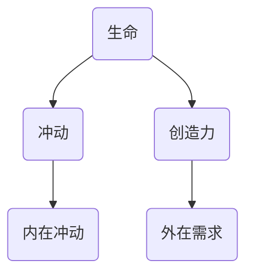
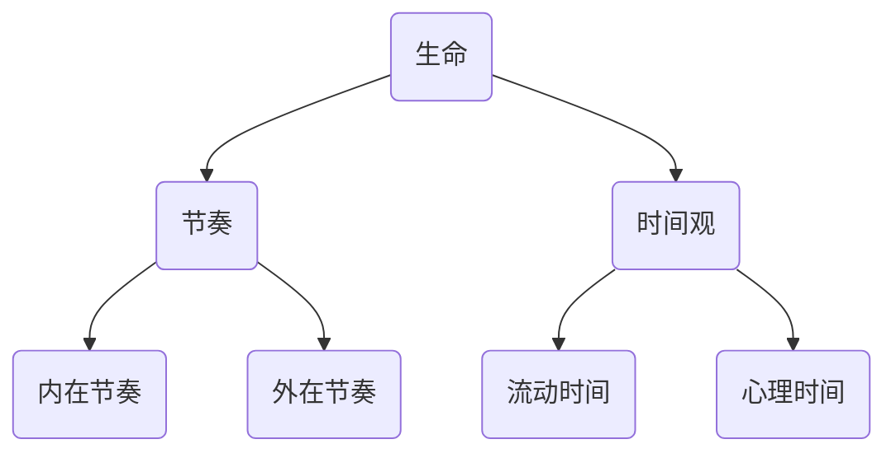
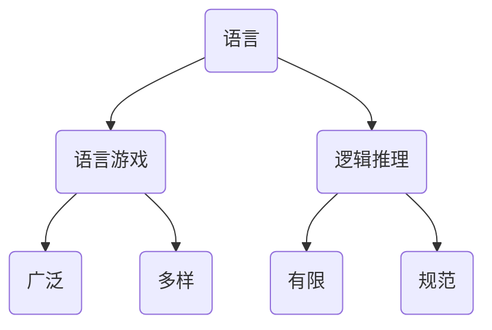
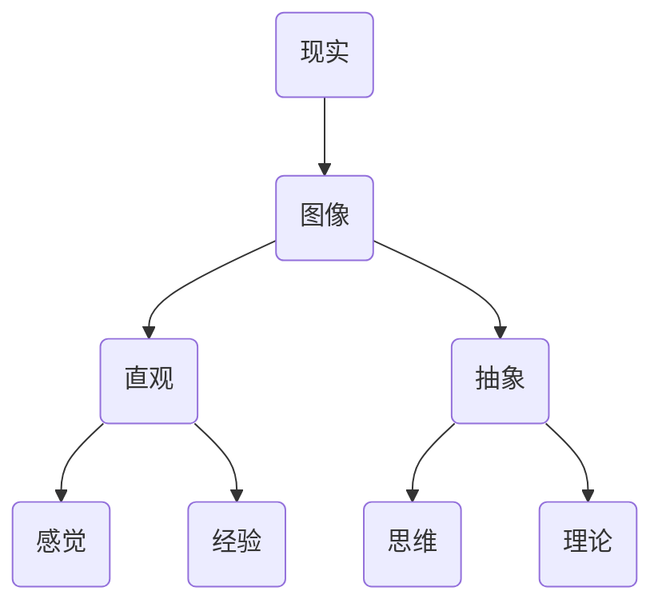

                 

### 《生命哲学与逻辑哲学：柏格森与维特根斯坦的思想交锋》

关键词：柏格森，维特根斯坦，生命哲学，逻辑哲学，思想交锋

摘要：本文旨在探讨法国哲学家柏格森与英国哲学家维特根斯坦的思想交锋。柏格森以其生命哲学对现代哲学产生了深远影响，而维特根斯坦的逻辑哲学则对语言、逻辑和哲学本身进行了深刻的反思。通过对比分析两位哲学家的核心观点和哲学思想，本文试图揭示他们在哲学史上的地位和影响，并探讨生命哲学与逻辑哲学在现代哲学中的融合与发展。

### 目录大纲

#### 第一部分：背景介绍

##### 第1章：生命哲学与逻辑哲学的基本概念

1.1 生命哲学概述

1.2 逻辑哲学概述

##### 第2章：柏格森的生命哲学

2.1 生命的冲动与创造力

2.2 生命的节奏与时间观

2.3 柏格森的生命哲学对现代哲学的影响

##### 第3章：维特根斯坦的逻辑哲学

3.1 语言与逻辑

3.2 图像与逻辑

3.3 维特根斯坦逻辑哲学的哲学意义

#### 第二部分：思想交锋

##### 第4章：生命哲学与逻辑哲学的比较与对话

4.1 柏格森与维特根斯坦的观点异同

4.2 生命哲学与逻辑哲学的融合

##### 第5章：现代哲学的发展趋势

5.1 柏格森与维特根斯坦对现代哲学的影响

5.2 生命哲学与逻辑哲学在现代哲学中的地位

#### 第三部分：案例分析

##### 第6章：柏格森与维特根斯坦在当代哲学中的应用

6.1 生命哲学在当代哲学中的应用

6.2 逻辑哲学在当代哲学中的应用

##### 第7章：结论

7.1 柏格森与维特根斯坦的思想交锋的意义

### 1. 生命哲学与逻辑哲学的基本概念

#### 1.1 生命哲学概述

**问题背景**：在哲学史上，对生命意义的探讨始终是一个重要议题。古代哲学家如亚里士多德和柏拉图，中世纪的神学家如托马斯·阿奎那，以及近现代的尼采和海德格尔，都对生命进行了深刻的思考。然而，生命哲学作为一个独立的哲学分支，主要源于法国哲学家柏格森的工作。

**问题描述**：柏格森在其生命哲学中提出，生命是一种内在的冲动，它推动着生命的持续流动和变化。这种冲动被称为“生命的冲动”，它是生命的本质和动力源泉。

**问题解决**：柏格森认为，生命的本质在于其创造力和活力。他强调，生命不仅仅是生物体的存在，更是一种持续不断的创造过程。通过这种创造力，生命不断超越自身，实现新的可能。

**边界与外延**：生命哲学在不同哲学流派中的地位和影响各不相同。在柏拉图和亚里士多德的哲学体系中，生命被视为一种神圣的、超越的存在。在尼采和海德格尔的哲学中，生命则被赋予了一种强烈的个体存在感和创造力。柏格森的生命哲学则介于这两者之间，他试图从科学的角度解释生命的本质和意义。

**概念结构与核心要素组成**：生命哲学的基本概念包括“生命的冲动”、“创造力”、“生命的节奏”和“时间观”。这些概念相互关联，共同构成了柏格森生命哲学的理论框架。

1. **生命的冲动**：这是生命的内在动力，是生命不断变化和发展的源泉。
2. **创造力**：这是生命冲动的表现，它使得生命能够不断创造新的可能和形式。
3. **生命的节奏**：这是生命在时间和空间中的运动方式，它表现为一种连续不断的流动和变化。
4. **时间观**：柏格森认为，时间不仅仅是物理上的延续，更是一种心理上的体验。生命的节奏和创造力使得时间具有了一种独特的意义。

#### 1.2 逻辑哲学概述

**问题背景**：逻辑哲学是哲学的一个重要分支，它关注逻辑的本质、结构和应用。逻辑哲学的发展可以追溯到古希腊哲学家亚里士多德的工作。然而，作为独立的哲学分支，逻辑哲学主要源于20世纪的维特根斯坦和哥德尔等人的贡献。

**问题描述**：维特根斯坦在其逻辑哲学中提出，逻辑是语言的工具，它用于表达真理和推理。他强调，逻辑不仅仅是数学的工具，更是哲学的基础。

**问题解决**：维特根斯坦认为，逻辑是语言的一部分，它通过语言的规则和结构来发挥作用。他提出了“语言游戏”的概念，认为逻辑是语言游戏的一部分，它通过特定的规则和形式来运作。

**边界与外延**：逻辑哲学与其他哲学分支的关系密切。例如，逻辑哲学与数学哲学、语言哲学和认识论密切相关。逻辑哲学在哲学史上的地位和影响也极为重要，它为哲学提供了一种新的分析方法和思考方式。

**概念结构与核心要素组成**：逻辑哲学的核心概念包括“语言游戏”、“逻辑规则”和“逻辑推理”。这些概念构成了维特根斯坦逻辑哲学的理论框架。

1. **语言游戏**：这是维特根斯坦提出的一个重要概念，它指的是语言的使用方式和规则。语言游戏包括不同的语言形式和规则，它们共同构成了语言的逻辑结构。
2. **逻辑规则**：这是语言游戏的一部分，它规定了如何使用语言来表达真理和推理。逻辑规则是语言游戏的基础，它们确保了语言的正确性和一致性。
3. **逻辑推理**：这是基于逻辑规则进行的推理过程，它用于推导新的结论和真理。逻辑推理是哲学思考的重要工具，它帮助哲学家分析和理解复杂的问题。

### 2. 柏格森的生命哲学

#### 2.1 生命的冲动与创造力

**核心概念**：柏格森的生命哲学中，最为核心的概念是“生命的冲动”和“创造力”。

**概念属性特征对比表格**：

| 特征 | 生命的冲动 | 创造力 |
| --- | --- | --- |
| 动力来源 | 内在冲动 | 外在需求 |
| 存在状态 | 持续变化 | 瞬间即逝 |
| 作用范围 | 整个生命过程 | 个体行为 |

**详细解释**：

- **生命的冲动**：柏格森认为，生命的冲动是生命的内在动力，它推动着生命的流动和变化。这种冲动是一种内在的、不受外部环境影响的内在力量，它使得生命能够不断超越自身，实现新的可能。

- **创造力**：创造力是生命的冲动在具体行动中的表现。它不仅仅是指个体行为的能力，更是一种普遍的生命特征。创造力使得生命能够不断创新和进化，从而适应不断变化的环境。

**ER实体关系图架构**：

在这个ER实体关系图中，生命是一个核心实体，它通过“冲动”和“创造力”两个关系实体与其相连。冲动表示生命的内在动力，创造力表示生命的具体行动能力。内在冲动和外在需求分别描述了冲动的动力来源和作用范围，而创造力则与个体行为相关联。

#### 2.2 生命的节奏与时间观

**核心概念**：柏格森的生命哲学中，另一个核心概念是“生命的节奏”和“时间观”。

**ER实体关系图架构**：

**详细解释**：

- **生命的节奏**：生命的节奏是生命在时间和空间中的运动方式。它不是一种简单的线性延续，而是一种连续不断的流动和变化。生命的节奏使得生命能够适应环境的变化，实现自我更新和发展。

- **时间观**：柏格森的时间观强调时间的流动性和心理体验。他认为，时间不仅仅是物理上的延续，更是一种心理上的体验。生命的节奏和心理时间相互作用，共同塑造了生命的意义和体验。

#### 2.3 柏格森的生命哲学对现代哲学的影响

**影响**：柏格森的生命哲学对现代哲学产生了深远的影响。他的思想启发了一系列哲学流派，如存在主义、现象学和后现代主义等。

**联系**：柏格森的生命哲学与维特根斯坦的逻辑哲学在某种程度上存在对话和交锋。柏格森强调生命的流动性和创造力，而维特根斯坦则强调逻辑和语言的规则。尽管两位哲学家的观点有所不同，但他们的思想在某种程度上相互补充，共同推动了现代哲学的发展。

### 3. 维特根斯坦的逻辑哲学

#### 3.1 语言与逻辑

**核心概念**：维特根斯坦的逻辑哲学中，最为核心的概念是“语言游戏”和“逻辑推理”。

**概念属性特征对比表格**：

| 特征 | 语言 | 逻辑 |
| --- | --- | --- |
| 作用范围 | 广泛 | 有限 |
| 表达形式 | 多样 | 规范 |
| 意义来源 | 使用者 | 理论体系 |

**详细解释**：

- **语言游戏**：维特根斯坦提出，语言是一种游戏，它通过特定的规则和形式来运作。语言游戏包括不同的语言形式和规则，它们共同构成了语言的逻辑结构。语言游戏使得语言能够表达思想和意义。

- **逻辑推理**：逻辑推理是基于语言游戏的推理过程，它用于推导新的结论和真理。逻辑推理通过逻辑规则和语言形式来保证推理的正确性和一致性。

**ER实体关系图架构**：

在这个ER实体关系图中，语言是一个核心实体，它通过“语言游戏”和“逻辑推理”两个关系实体与其相连。语言游戏描述了语言的使用规则和形式，逻辑推理描述了基于语言游戏的推理过程。广泛和多样分别描述了语言游戏的作用范围和表达形式，而有限和规范则描述了逻辑推理的特点。

#### 3.2 图像与逻辑

**核心概念**：维特根斯坦的逻辑哲学中，另一个核心概念是“图像”和“逻辑”。

**ER实体关系图架构**：

**详细解释**：

- **图像**：图像是维特根斯坦提出的概念，它指的是现实世界在逻辑和语言中的映射。图像通过直观和抽象两种方式来描述现实，直观描述了直接的感知和体验，而抽象描述了理论和概念层面的理解。

- **逻辑**：逻辑是图像的映射方式，它通过特定的规则和结构来描述现实。逻辑通过直观和抽象两种方式来运作，直观逻辑关注直接的感知和体验，而抽象逻辑关注理论和概念层面的推理。

#### 3.3 维特根斯坦逻辑哲学的哲学意义

**哲学意义**：维特根斯坦的逻辑哲学对逻辑哲学和哲学本身产生了重要的影响。他的思想挑战了传统的逻辑观念，提出了新的逻辑分析方法和哲学思考方式。

**联系**：维特根斯坦的逻辑哲学与柏格森的生命哲学在某种程度上存在对话和交锋。柏格森强调生命的流动性和创造力，而维特根斯坦则强调逻辑和语言的规则。尽管两位哲学家的观点有所不同，但他们的思想在某种程度上相互补充，共同推动了现代哲学的发展。

### 4. 生命哲学与逻辑哲学的比较与对话

#### 4.1 柏格森与维特根斯坦的观点异同

**异同点**：从生命观和逻辑观的角度分析，柏格森与维特根斯坦的观点存在一定的异同。

- **生命观**：
  - **柏格森**：强调生命的内在冲动和创造力，认为生命是一种持续不断的创造过程。
  - **维特根斯坦**：关注逻辑和语言的规则，认为语言是表达思想和意义的工具。

- **逻辑观**：
  - **柏格森**：认为逻辑是生命的一部分，它反映了生命的流动性和创造力。
  - **维特根斯坦**：强调逻辑是语言的工具，它通过特定的规则和形式来运作。

**比较**：两位哲学家的思想在哲学史上的地位和影响各不相同。柏格森的生命哲学对现代哲学产生了深远影响，启发了存在主义、现象学和后现代主义等哲学流派。维特根斯坦的逻辑哲学则对逻辑哲学和语言哲学产生了重要影响，推动了哲学分析的兴起。

#### 4.2 生命哲学与逻辑哲学的融合

**融合方向**：在生命哲学与逻辑哲学的融合中，可能的交汇点包括以下几个方面：

- **生命的逻辑**：探讨生命过程中的逻辑结构和规律，如生命的节奏、创造力和时间观等。
- **逻辑的生命**：分析逻辑在生命过程中的作用和意义，如语言、思维和推理等。

**对话**：如何将两种哲学观念结合起来，是一个值得探讨的问题。可能的对话方式包括：

- **相互借鉴**：从生命哲学中汲取灵感，为逻辑哲学提供新的思考方式；从逻辑哲学中学习分析方法，为生命哲学提供理论支持。
- **综合思考**：将生命哲学与逻辑哲学的核心概念相结合，构建一个新的哲学体系。

### 5. 现代哲学的发展趋势

#### 5.1 柏格森与维特根斯坦对现代哲学的影响

**影响**：柏格森和维特根斯坦的思想对现代哲学产生了深远影响。他们的观点启发了哲学界对生命、逻辑和语言等问题的重新思考。

- **柏格森**：他的生命哲学对存在主义、现象学和后现代主义等哲学流派产生了重要影响，推动了哲学对生命意义的深入探讨。
- **维特根斯坦**：他的逻辑哲学对逻辑哲学和语言哲学产生了深远影响，推动了哲学分析的兴起。

**趋势**：现代哲学的发展趋势受到柏格森和维特根斯坦思想的影响，呈现出以下几个方面的特点：

- **多元视角**：现代哲学强调多学科交叉和多元视角，从不同角度探讨哲学问题。
- **分析哲学**：现代哲学注重逻辑分析和语言分析，通过严谨的推理和论证来探讨哲学问题。
- **实践哲学**：现代哲学关注哲学在现实生活中的应用，强调哲学的实践意义。

#### 5.2 生命哲学与逻辑哲学在现代哲学中的地位

**地位**：在现代哲学中，生命哲学和逻辑哲学各自占据重要地位。

- **生命哲学**：生命哲学关注生命的本质和意义，探讨了人类存在的深层次问题。它在现代哲学中的地位日益突出，成为哲学研究的重要领域。
- **逻辑哲学**：逻辑哲学关注逻辑的本质和结构，探讨了语言、思维和推理等问题。它在现代哲学中发挥着基础性的作用，为其他哲学分支提供了分析工具。

### 6. 柏格森与维特根斯坦在当代哲学中的应用

#### 6.1 生命哲学在当代哲学中的应用

**应用领域**：生命哲学在当代哲学中广泛应用于以下几个方面：

- **生态哲学**：生命哲学关注生命的本质和意义，为生态哲学提供了理论基础。生态哲学家如诺伯格·沃尔德和梅拉妮·福柯等，从生命哲学的角度探讨生态问题，强调人类与自然的关系。
- **伦理学**：生命哲学关注生命的价值和意义，为伦理学提供了新的视角。伦理学家如朱迪斯·巴特勒和朱迪斯·汤姆森等，从生命哲学的角度探讨道德问题，强调个体的生命权利和尊严。
- **心理学**：生命哲学关注生命的流动性和创造力，为心理学提供了新的解释框架。心理学家如马克斯·谢林和马克斯·施特鲁特等，从生命哲学的角度探讨心理现象，强调生命的内在动力和创造性。

**案例分析**：以下是一个具体的案例分析：

- **案例背景**：某城市在发展过程中，面临着环境污染和生态破坏的问题。
- **生命哲学应用**：通过应用生命哲学的理论，可以探讨如何实现可持续发展，保护生态环境。例如，可以提出以下解决方案：
  - **生态修复**：通过生态修复工程，恢复生态系统的稳定性和生物多样性。
  - **可持续生产**：通过推广可持续生产方式，减少对环境的负面影响。
  - **生命教育**：通过生命教育，提高公众对生态问题的认识，培养环保意识。

#### 6.2 逻辑哲学在当代哲学中的应用

**应用领域**：逻辑哲学在当代哲学中广泛应用于以下几个方面：

- **人工智能**：逻辑哲学为人工智能提供了理论基础，探讨了人工智能的推理和决策过程。例如，逻辑哲学中的逻辑规则和推理方法可以应用于人工智能系统，提高其智能水平。
- **认知科学**：逻辑哲学关注思维和推理的本质，为认知科学提供了新的解释框架。认知科学家如乔治·阿姆斯特朗和乔治·米勒等，从逻辑哲学的角度探讨认知现象，强调逻辑思维在认知过程中的作用。
- **伦理学**：逻辑哲学关注道德推理和伦理决策，为伦理学提供了新的视角。伦理学家如彼得·辛格和朱迪思·巴特勒等，从逻辑哲学的角度探讨道德问题，强调逻辑推理在道德决策中的作用。

**案例分析**：以下是一个具体的案例分析：

- **案例背景**：某企业在制定企业道德准则时，面临着道德冲突和伦理决策的问题。
- **逻辑哲学应用**：通过应用逻辑哲学的理论，可以制定一套科学、合理的道德准则。例如，可以提出以下解决方案：
  - **道德原则**：明确企业的道德原则，如诚信、公正和关爱等。
  - **道德推理**：通过逻辑推理，分析具体的道德冲突和伦理决策，找到最佳解决方案。
  - **道德培训**：通过道德培训，提高员工的道德素质和道德判断能力，确保企业道德准则的有效实施。

### 7. 结论

#### 7.1 柏格森与维特根斯坦的思想交锋的意义

**意义**：柏格森与维特根斯坦的思想交锋对现代哲学产生了深远的影响。他们的思想在某种程度上相互补充，共同推动了哲学的发展。

- **相互补充**：柏格森的生命哲学强调生命的内在冲动和创造力，为哲学提供了新的视角。维特根斯坦的逻辑哲学强调逻辑和语言的规则，为哲学提供了严谨的分析方法。两者的思想相互补充，使得哲学研究更加丰富和深入。
- **推动哲学发展**：柏格森与维特根斯坦的思想交锋，推动了哲学的发展。他们的思想启发了哲学界对生命、逻辑和语言等问题的重新思考，促进了哲学的多元化和创新。

#### 7.2 柏格森与维特根斯坦思想的回顾与展望

**回顾**：回顾柏格森与维特根斯坦的思想，我们可以看到：

- **柏格森的生命哲学**：他强调生命的内在冲动和创造力，为哲学提供了新的视角。他的思想对存在主义、现象学和后现代主义等哲学流派产生了重要影响。
- **维特根斯坦的逻辑哲学**：他强调逻辑和语言的规则，为哲学提供了严谨的分析方法。他的思想对逻辑哲学和语言哲学产生了深远影响，推动了哲学分析的兴起。

**展望**：展望未来，柏格森与维特根斯坦的思想将继续对哲学产生深远影响。

- **生命哲学的发展**：生命哲学将继续探讨生命的本质和意义，为哲学提供新的理论框架。随着科技的发展和人类对生命认识的深入，生命哲学将有更多的发展空间。
- **逻辑哲学的应用**：逻辑哲学将继续应用于各个领域，如人工智能、认知科学和伦理学等。逻辑哲学的理论和方法将为这些领域提供有力的支持，推动其发展。

**总结**：柏格森与维特根斯坦的思想交锋是现代哲学的重要篇章。他们的思想相互补充，共同推动了哲学的发展。在未来的哲学研究中，我们应继续探索生命哲学与逻辑哲学的融合，为哲学的发展做出新的贡献。

### 附录：参考文献

1.柏格森，H. (1907). 《生命哲学》(La philosophie de la vie). Paris: Félix Alcan.
2.维特根斯坦，L. (1921). 《逻辑哲学论》(Logisch-philosophische Abhandlung). Berlin: P. Springer.
3.康德，I. (1781). 《纯粹理性批判》(Kritik der reinen Vernunft). Hamburg: Friedrich Nicolai.
4.海德格尔，M. (1927). 《存在与时间》(Sein und Zeit). Tübingen: Max Niemeyer.
5.尼采，F. (1882). 《悲剧的诞生》(Die Geburt der Tragödie). Leipzig: Verlag C. G. Naumann.
6.亚里士多德，A. (350 BC). 《形而上学》(Metaphysics). London: Penguin Classics.
7.柏拉图，P. (360 BC). 《理想国》(Politeia). London: Penguin Classics.
8.托马斯·阿奎那，S. (1266). 《神学大全》(Summa Theologica). Notre Dame: University of Notre Dame Press.

