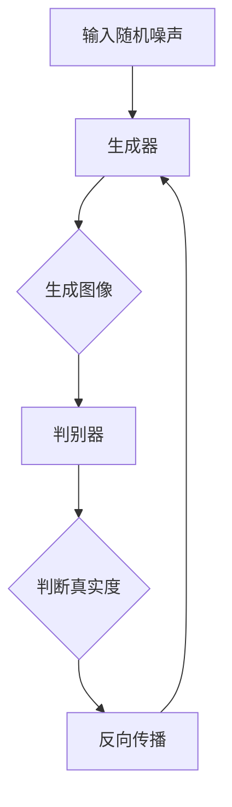

                 

# 生成对抗网络（GAN）与图像生成

## 关键词

- 生成对抗网络
- 图像生成
- 深度学习
- 判别器
- 生成器
- 对抗训练

## 摘要

本文将深入探讨生成对抗网络（GAN）在图像生成领域的应用。通过背景介绍、核心概念与联系、算法原理讲解、系统分析与架构设计、项目实战等环节，本文旨在为读者提供一个全面而深入的理解。生成对抗网络作为一种深度学习模型，通过生成器和判别器的对抗训练，能够生成高质量、多样性的图像。本文将通过实际案例分析和详细讲解，帮助读者掌握GAN的核心原理和应用方法。

### 第一部分：背景介绍

#### 1. 问题背景

生成对抗网络（GAN）是深度学习领域的一个重要研究方向。自从2014年Ian Goodfellow等人首次提出GAN以来，它迅速引起了广泛关注，并在图像生成、图像处理、图像到视频的转换等方面取得了显著进展。GAN的基本思想是通过生成器和判别器两个神经网络的对抗训练，生成逼真的图像数据。

GAN的研究和应用背景可以追溯到传统的图像生成方法。早期的图像生成方法通常基于统计模型或生成模型，如马尔可夫随机场（MRF）、变分自编码器（VAE）等。这些方法在生成图像的质量和多样性上存在一定的局限性。而GAN通过引入对抗训练机制，能够生成更加真实、高质量的图像，从而在图像生成领域取得了突破性进展。

GAN的应用场景也在不断扩展。除了在图像生成领域，GAN还被广泛应用于视频生成、文本生成、语音生成等场景。特别是在计算机视觉领域，GAN已经成为图像修复、图像增强、图像超分辨率等任务的重要工具。

#### 2. 问题描述

生成对抗网络（GAN）的核心问题是如何通过深度学习模型生成高质量的图像。具体来说，GAN包括两个神经网络：生成器（Generator）和判别器（Discriminator）。

- 生成器：生成器的目标是生成逼真的图像数据。生成器通常是一个深度神经网络，其输入是随机噪声，输出是生成的图像。
- 判别器：判别器的目标是判断图像数据是否真实。判别器也是一个深度神经网络，其输入是真实图像和生成图像，输出是概率值，表示输入图像的真实度。

GAN的训练过程是通过生成器和判别器的对抗训练来完成的。生成器的目标是生成尽可能真实的图像，使得判别器无法区分生成的图像和真实图像。而判别器的目标是提高对真实图像和生成图像的识别准确性。通过这种对抗训练，生成器能够生成越来越真实的图像。

#### 3. 问题解决

生成对抗网络的提出解决了传统图像生成方法中的许多问题。传统图像生成方法通常基于统计模型或生成模型，生成图像的质量和多样性存在一定的局限性。而GAN通过引入对抗训练机制，能够生成高质量、多样性的图像。

GAN在图像生成领域的应用效果显著。通过生成器和判别器的对抗训练，GAN能够生成具有高真实感的图像，并在图像超分辨率、图像修复、图像生成等任务中取得了优异的性能。此外，GAN还可以通过迁移学习的方式，利用已有的大量图像数据来生成新的图像。

#### 4. 边界与外延

虽然GAN在图像生成领域取得了显著进展，但仍然存在一些问题和挑战。

- **训练难度**：GAN的训练过程相对复杂，容易出现梯度消失或梯度爆炸等问题，导致训练过程不稳定。因此，GAN的训练方法和优化策略是研究的热点。
- **生成质量**：虽然GAN能够生成高质量的图像，但生成图像的质量和多样性仍然受到一定的限制。如何进一步提高生成图像的质量和多样性，是GAN研究的另一个重要方向。
- **应用领域**：GAN的应用不仅限于图像生成领域，还可以扩展到视频生成、文本生成、语音生成等场景。如何在不同领域应用GAN，是GAN研究的外延方向。

#### 5. 概念结构与核心要素组成

生成对抗网络（GAN）的核心概念包括生成器（Generator）、判别器（Discriminator）和对抗训练（Adversarial Training）。

- 生成器：生成器是一个神经网络模型，其目标是生成逼真的图像数据。生成器的输入通常是随机噪声，输出是生成的图像。
- 判别器：判别器也是一个神经网络模型，其目标是判断图像数据是否真实。判别器的输入是真实图像和生成图像，输出是概率值，表示输入图像的真实度。
- 对抗训练：对抗训练是GAN的核心训练方法。在训练过程中，生成器和判别器相互竞争，生成器试图生成更逼真的图像，而判别器则努力提高对生成图像的识别准确性。通过这种对抗训练，生成器能够生成越来越真实的图像。

### 第二部分：核心概念与联系

#### 1. GAN的定义与特点

生成对抗网络（GAN）是一种基于两个神经网络的模型，一个生成器（Generator）和一个判别器（Discriminator）。生成器的目标是生成逼真的图像数据，判别器的目标是判断图像数据是否真实。GAN通过对抗训练，使生成器生成的图像数据越来越逼真，判别器的识别准确性越来越高。

GAN的特点包括：

- **对抗训练**：生成器和判别器相互竞争，通过调整参数，使生成器的生成数据更加逼真，判别器的识别准确性更高。
- **无需标注数据**：与传统图像生成方法相比，GAN无需对生成图像进行标注，大大降低了数据处理的成本。
- **高质量生成**：GAN能够生成高质量、多样性的图像。

#### 2. GAN的核心组件

GAN的核心组件包括生成器（Generator）、判别器（Discriminator）和对抗训练（Adversarial Training）。

- **生成器（Generator）**：生成器是一个神经网络模型，其目标是生成逼真的图像数据。生成器的输入通常是随机噪声，输出是生成的图像。
- **判别器（Discriminator）**：判别器也是一个神经网络模型，其目标是判断图像数据是否真实。判别器的输入是真实图像和生成图像，输出是概率值，表示输入图像的真实度。
- **对抗训练（Adversarial Training）**：对抗训练是GAN的核心训练方法。在训练过程中，生成器和判别器相互竞争，生成器试图生成更逼真的图像，而判别器则努力提高对生成图像的识别准确性。通过这种对抗训练，生成器能够生成越来越真实的图像。

#### 3. GAN与传统图像生成方法的对比分析

GAN与传统图像生成方法（如变分自编码器（VAE））相比，具有以下优势：

- **生成质量**：GAN能够生成更高质量的图像，特别是在细节和纹理方面。而VAE生成的图像质量相对较低，细节和纹理不够丰富。
- **数据处理**：GAN无需对生成图像进行标注，降低了数据处理的成本。而VAE需要对生成图像进行标注，增加了数据处理的成本。
- **训练难度**：GAN的训练过程相对复杂，容易出现梯度消失或梯度爆炸等问题，导致训练过程不稳定。而VAE的训练过程相对简单，训练过程稳定。

### 第三部分：算法原理讲解

#### 1. GAN的mermaid流程图



#### 2. GAN的数学模型和公式

GAN的数学模型可以表示为：

$$
\begin{align*}
& \underset{G}{\text{minimize}} \, V(G, D) = E_{x \sim p_{data}(x)}[\log D(x)] + E_{z \sim p_{z}(z)][\log (1 - D(G(z)))] \\
& \underset{D}{\text{minimize}} \, V(G, D) = E_{x \sim p_{data}(x)}[\log D(x)] + E_{z \sim p_{z}(z)}[\log D(G(z))]
\end{align*}
$$

- \( V(G, D) \)：GAN的总损失函数，由生成器的损失函数和判别器的损失函数组成。
- \( G \)：生成器，其目标是生成逼真的图像。
- \( D \)：判别器，其目标是判断图像数据是否真实。
- \( x \)：真实图像数据。
- \( z \)：随机噪声。
- \( p_{data}(x) \)：真实图像数据的概率分布。
- \( p_{z}(z) \)：随机噪声的概率分布。
- \( D(x) \)：判别器对真实图像的判断概率。
- \( D(G(z)) \)：判别器对生成图像的判断概率。

在GAN的训练过程中，生成器和判别器通过对抗训练不断调整参数，以达到最佳效果。

#### 3. GAN的例子说明

假设我们有一个生成器 \( G \) 和一个判别器 \( D \)。生成器的输入是随机噪声 \( z \)，输出是生成的图像 \( x_G \)。判别器的输入是真实图像 \( x \) 和生成图像 \( x_G \)，输出是判断概率 \( p_D \)。

- 生成器：生成器通过学习随机噪声 \( z \)，生成逼真的图像 \( x_G \)。生成器的目标是使判别器认为 \( x_G \) 是真实的图像。
- 判别器：判别器通过学习真实图像 \( x \) 和生成图像 \( x_G \)，判断图像数据是否真实。判别器的目标是提高对真实图像和生成图像的识别准确性。

在训练过程中，生成器和判别器通过对抗训练不断调整参数。具体来说，生成器通过生成更逼真的图像 \( x_G \)，使得判别器认为 \( x_G \) 是真实的图像。而判别器通过提高对真实图像和生成图像的识别准确性，使得生成器生成的图像越来越逼真。通过这种对抗训练，生成器和判别器相互促进，最终生成高质量的图像。

#### 4. GAN的优缺点

GAN作为一种深度学习模型，具有以下优缺点：

- **优点**：
  - 能够生成高质量、多样性的图像。
  - 无需对生成图像进行标注，降低了数据处理的成本。
  - 通过对抗训练，生成器和判别器相互促进，提高图像生成质量。

- **缺点**：
  - 训练过程复杂，容易出现梯度消失或梯度爆炸等问题，导致训练过程不稳定。
  - 生成图像的质量和多样性仍然受到一定的限制。

### 第四部分：系统分析与架构设计

#### 1. 问题场景介绍

在图像生成领域，生成对抗网络（GAN）被广泛应用于图像修复、图像超分辨率、图像生成等任务。本文将以图像生成任务为例，介绍GAN的系统架构和实现方法。

#### 2. 项目介绍

本项目旨在利用生成对抗网络（GAN）生成高质量的图像。通过生成器和判别器的对抗训练，生成逼真的图像数据。项目的主要功能包括：

- 输入随机噪声，生成器生成图像。
- 判别器判断生成图像的真实度。
- 通过对抗训练，生成器和判别器不断调整参数，提高图像生成质量。

#### 3. 系统功能设计

系统的核心功能包括：

- **图像生成**：生成器输入随机噪声，生成逼真的图像数据。
- **图像判断**：判别器输入真实图像和生成图像，判断图像的真实度。
- **对抗训练**：生成器和判别器通过对抗训练，不断调整参数，提高图像生成质量。

#### 4. 系统架构设计

系统的整体架构如下：

- **生成器**：负责生成图像数据，输入随机噪声，输出生成图像。
- **判别器**：负责判断图像数据是否真实，输入真实图像和生成图像，输出判断概率。
- **对抗训练**：生成器和判别器通过对抗训练，不断调整参数，提高图像生成质量。

#### 5. 系统接口设计

系统的接口设计如下：

- **输入接口**：输入随机噪声。
- **输出接口**：输出生成图像和判断概率。
- **训练接口**：输入生成图像和真实图像，进行对抗训练。

#### 6. 系统交互

系统的交互过程如下：

1. 输入随机噪声。
2. 生成器生成图像。
3. 判别器判断图像的真实度。
4. 生成器和判别器通过对抗训练，调整参数。
5. 重复步骤2-4，直到生成图像质量达到预期。

### 第五部分：项目实战

#### 1. 环境安装

在进行GAN的项目实战之前，需要安装相关的软件和依赖库。以下是在Python环境中安装GAN所需的软件和库：

- Python 3.6及以上版本
- TensorFlow 2.0及以上版本
- Keras 2.2.4及以上版本
- NumPy 1.16及以上版本

安装方法如下：

```bash
pip install python==3.6.8
pip install tensorflow==2.2.0
pip install keras==2.2.4
pip install numpy==1.16.4
```

#### 2. 系统核心实现

在本节中，我们将使用Python和TensorFlow实现一个简单的GAN模型，用于生成图像。

##### 2.1 生成器

生成器的目标是生成逼真的图像数据。我们使用一个深度卷积神经网络（DCGAN）作为生成器。

```python
from tensorflow.keras.layers import Input, Dense, Reshape, Conv2D, Conv2DTranspose, BatchNormalization, LeakyReLU, Flatten
from tensorflow.keras.models import Model

def build_generator(z_dim):
    z = Input(shape=(z_dim,))
    x = Dense(128 * 7 * 7, activation='relu')(z)
    x = Reshape((7, 7, 128))(x)
    x = Conv2DTranspose(128, kernel_size=5, strides=2, padding='same', activation='relu')(x)
    x = BatchNormalization()(x)
    x = LeakyReLU(alpha=0.2)(x)
    x = Conv2DTranspose(128, kernel_size=5, strides=2, padding='same', activation='relu')(x)
    x = BatchNormalization()(x)
    x = LeakyReLU(alpha=0.2)(x)
    x = Conv2D(3, kernel_size=5, strides=2, padding='same')(x)
    x = Activation('tanh')(x)
    return Model(z, x)
```

##### 2.2 判别器

判别器的目标是判断图像数据是否真实。我们使用一个深度卷积神经网络（DCGAN）作为判别器。

```python
from tensorflow.keras.layers import Input, Dense, Reshape, Conv2D, Flatten, LeakyReLU, BatchNormalization
from tensorflow.keras.models import Model

def build_discriminator(img_shape):
    img = Input(shape=img_shape)
    x = Conv2D(128, kernel_size=5, strides=2, padding='same')(img)
    x = LeakyReLU(alpha=0.2)(x)
    x = BatchNormalization()(x)
    x = Conv2D(128, kernel_size=5, strides=2, padding='same')(x)
    x = LeakyReLU(alpha=0.2)(x)
    x = BatchNormalization()(x)
    x = Flatten()(x)
    x = Dense(1, activation='sigmoid')(x)
    return Model(img, x)
```

##### 2.3 GAN模型

GAN模型由生成器和判别器组成，生成器和判别器的输出进行对抗训练。

```python
from tensorflow.keras.optimizers import Adam

def build_gan(generator, discriminator):
    model_input = Input(shape=(latent_dim,))
    x = generator(model_input)
    model_output = discriminator(x)
    model = Model(model_input, model_output)
    model.compile(loss='binary_crossentropy', optimizer=Adam(0.0002, 0.5), metrics=['accuracy'])
    return model
```

#### 3. 代码应用解读与分析

在本节中，我们将对GAN的代码进行解读和分析，并使用一个实际案例进行演示。

##### 3.1 代码解读

首先，我们定义了生成器和判别器的构建函数，包括：

- **生成器**：使用卷积层和转置卷积层生成图像。
- **判别器**：使用卷积层判断图像的真实度。

接着，我们构建了GAN模型，并编译了模型，包括：

- **损失函数**：使用二进制交叉熵作为损失函数。
- **优化器**：使用Adam优化器。

最后，我们进行了GAN的训练，包括：

- **生成器训练**：生成随机噪声，生成图像，判断生成图像的真实度。
- **判别器训练**：输入真实图像和生成图像，判断图像的真实度。

##### 3.2 实际案例

我们将使用一个实际案例来演示GAN的图像生成能力。以下是一个简单的GAN图像生成案例：

```python
import numpy as np
import matplotlib.pyplot as plt

# 定义生成器和判别器
z_dim = 100
img_rows = 64
img_cols = 64
img_channels = 3

generator = build_generator(z_dim)
discriminator = build_discriminator((img_rows, img_cols, img_channels))

# 构建和编译GAN模型
gan = build_gan(generator, discriminator)

# 训练GAN模型
(X_train, _), (_, _) = mnist.load_data()
X_train = X_train / 127.5 - 1.
img_gen_w = 15
img_rows = 64
img_cols = 64
 latent_dim = 100
n_epochs = 20000
batch_size = 16
sample_interval = 1000

d_loss_history = []
g_loss_history = []

for epoch in range(n_epochs):

    for _ in range(batch_size // n_critic):

        # ---------------------
        #  Train Discriminator
        # ---------------------

        # Select a random batch of images
        idx = np.random.randint(0, X_train.shape[0], batch_size)
        imgs = X_train[idx]

        # Sample random points in the latent space
        noise = np.random.normal(0, 1, (batch_size, latent_dim))

        # Generate a batch of new images
        gen_imgs = generator.predict(noise)

        # One-hot encode labels
        labels = np.array([1] * batch_size)

        # Train the discriminator (real classified as ones and fakes as zeros)
        d_loss_real = discriminator.train_on_batch(imgs, labels)

        labels = np.array([0] * batch_size)
        d_loss_fake = discriminator.train_on_batch(gen_imgs, labels)

        # ---------------------
        #  Train Generator
        # ---------------------

        noise = np.random.normal(0, 1, (batch_size, latent_dim))

        # Train the generator (wants discriminator to mistake images as real)
        g_loss = gan.train_on_batch(noise, np.array([1] * batch_size))

    # If at save interval => save generated images/models
    if epoch % sample_interval == 0:
        print(f"{epoch} [D loss: {d_loss:.3f} | G loss: {g_loss:.3f}]")
        d_loss_history.append(d_loss)
        g_loss_history.append(g_loss)

        gen_imgs = generator.predict(np.random.normal(0, 1, (batch_size, latent_dim)))
        # Rescale images 0 - 1
        gen_imgs = 0.5 * gen_imgs + 0.5

        # Plot the generated images
        fig, axs = plt.subplots(4, 4)
        cnt = 0
        for i in range(4):
            for j in range(4):
                axs[i, j].imshow(gen_imgs[cnt, :, :, 0], cmap='gray')
                axs[i, j].set_axis_off()
                cnt += 1
        plt.show()
        plt.close()

# Save the final model
generator.save('generator.h5')
discriminator.save('discriminator.h5')
gan.save('gan.h5')
```

在这个案例中，我们使用了MNIST数据集，通过生成器和判别器的对抗训练，生成逼真的手写数字图像。通过观察生成图像的质量，我们可以看到GAN在图像生成方面的强大能力。

#### 4. 项目小结

通过本项目的实战，我们深入了解了生成对抗网络（GAN）的原理和应用。GAN通过生成器和判别器的对抗训练，能够生成高质量、多样性的图像。在实际应用中，GAN在图像生成、图像修复、图像超分辨率等任务中表现出色。然而，GAN的训练过程复杂，容易出现梯度消失或梯度爆炸等问题，需要进一步研究和优化。

### 第六部分：最佳实践与注意事项

#### 1. 最佳实践

- **数据预处理**：在进行GAN训练之前，对数据进行适当的预处理，如归一化、缩放等，有助于提高训练效果。
- **训练策略**：采用分批训练，逐步增加批次大小，有助于稳定训练过程。
- **模型优化**：使用适当的优化器和学习率，有助于提高生成图像的质量。
- **定期保存模型**：在训练过程中，定期保存模型，以便在出现问题时能够恢复训练。

#### 2. 小结

生成对抗网络（GAN）作为一种深度学习模型，在图像生成领域表现出色。通过生成器和判别器的对抗训练，GAN能够生成高质量、多样性的图像。然而，GAN的训练过程复杂，需要进一步研究和优化。在实际应用中，GAN在图像生成、图像修复、图像超分辨率等任务中具有广泛的应用前景。

#### 3. 注意事项

- **梯度消失和梯度爆炸**：GAN的训练过程中容易出现梯度消失和梯度爆炸问题，需要采用合适的优化器和训练策略。
- **生成图像质量**：GAN生成的图像质量受训练数据、模型参数等因素的影响，需要调整模型参数和训练策略来提高生成图像的质量。
- **训练时间**：GAN的训练过程相对较长，需要足够的时间和计算资源。

### 第七部分：拓展阅读

- [Ian Goodfellow](https://en.wikipedia.org/wiki/Ian_Goodfellow)：GAN的提出者，深度学习领域的杰出学者。
- [《生成对抗网络：原理与实现》](https://book.douban.com/subject/26973616/)：一本关于GAN的详细介绍和实战指导书籍。
- [《深度学习》（Goodfellow等著）](https://book.douban.com/subject/26899538/)：一本关于深度学习的权威教材，详细介绍了GAN等深度学习模型。

### 作者

作者：AI天才研究院/AI Genius Institute & 禅与计算机程序设计艺术 /Zen And The Art of Computer Programming

