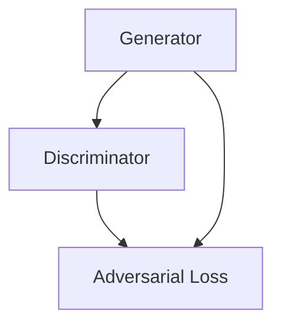
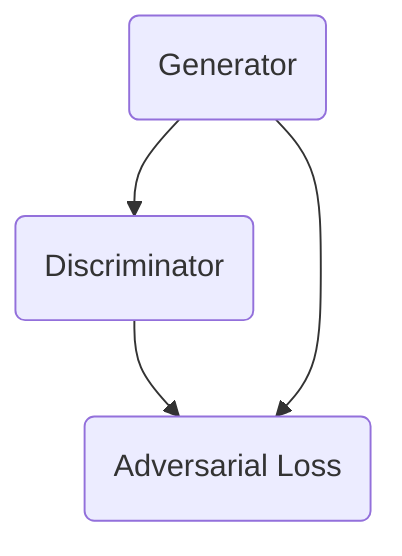

                 

 Let's think step by step about the structure and content of the article "生成对抗网络（GAN）在图像生成中的应用". We will ensure it is logically clear, structured, and easy to understand for a technical audience. Here's how we can approach this:

## Step 1: Introduction

### 1.1 Setting the Stage

In this section, we will provide a brief introduction to the article, highlighting the importance of GANs in the field of image generation. We will also introduce the core concepts that will be discussed in the following sections.

### 1.2 Outline Overview

We will give a concise overview of the structure of the article, outlining the key topics and the logical flow from one section to another.

## Step 2: Fundamentals

### 2.1 Definition of GANs

In this section, we will define what GANs are and provide a brief history of their development. We will also discuss their significance in image generation.

### 2.2 Core Concepts

Here, we will delve deeper into the core concepts of GANs, such as the generator, the discriminator, and the adversarial training process. We will explain these terms and their roles in the GAN framework.

### 2.3 GAN Architecture

Using Mermaid diagrams, we will illustrate the architecture of GANs and explain how the generator and discriminator interact to generate high-quality images.

## Step 3: GANs in Practice

### 3.1 Applications in Image Generation

In this section, we will discuss the various applications of GANs in image generation, including but not limited to, generating realistic faces, images from text descriptions, and super-resolution image processing.

### 3.2 Benefits and Challenges

We will highlight the benefits of using GANs in image generation, such as the ability to generate high-quality images from limited data and the potential for creative applications. We will also discuss the challenges and limitations of GANs in this domain.

## Step 4: Technical Deep Dive

### 4.1 Mathematical Models

Here, we will explore the mathematical models that underpin GANs, including the loss functions used for training the generator and the discriminator. We will provide detailed explanations and examples to help the reader understand these concepts.

### 4.2 GAN Training Process

We will discuss the training process of GANs, step by step, explaining how the generator and discriminator learn to generate and distinguish between real and fake images.

### 4.3 GAN Architecture Visualization

Using Mermaid diagrams, we will visualize the architecture of GANs, providing a clear and concise representation of the network's structure and the flow of data.

## Step 5: Case Studies

### 5.1 Real-World Applications

In this section, we will present real-world case studies that demonstrate the practical application of GANs in image generation. We will discuss the results, challenges faced, and lessons learned from these studies.

### 5.2 Impact and Evaluation

We will evaluate the impact of GANs in image generation, both in terms of technical advancements and societal implications. We will discuss how GANs have influenced the field and what future research directions might emerge.

## Step 6: Optimization Techniques

### 6.1 Improving GAN Performance

Here, we will explore techniques for optimizing GANs to improve their performance and efficiency. We will discuss strategies such as batch normalization, gradient penalty, and different optimization algorithms.

### 6.2 Case Studies of Optimization

We will present case studies that demonstrate the effectiveness of these optimization techniques, providing concrete examples of how they have been applied to improve GANs in image generation.

## Step 7: Future Directions

### 7.1 Emerging Trends

In this section, we will discuss the latest trends in GAN research, including advancements in generative models and the integration of GANs with other AI techniques.

### 7.2 Ethical Considerations

We will address the ethical considerations surrounding GANs in image generation, such as the potential for misuse and the impact on privacy and autonomy.

### 7.3 Future Research Directions

We will propose future research directions and potential developments in GANs for image generation, highlighting areas where further investigation is needed.

## Step 8: Conclusion

### 8.1 Key Takeaways

In this section, we will summarize the main points discussed in the article, highlighting the importance of GANs in image generation and the potential they hold for the future.

### 8.2 Future Prospects

We will discuss the future prospects of GANs in image generation, outlining the potential for breakthroughs and the challenges that need to be addressed.

## Step 9: Conclusion

We will conclude the article by reiterating the main points and providing a final thought on the significance of GANs in image generation.

---

With this step-by-step plan, we can ensure that the article is well-structured and covers all the necessary topics in a clear and logical manner. Each section will be carefully crafted to provide a comprehensive understanding of GANs in image generation, making the article both informative and engaging for readers.

---

Great, now that we have our step-by-step plan for the article, let's dive into each section and start fleshing out the content. We'll begin with the introduction and move through each section, ensuring that we cover all the required topics and provide a thorough analysis of GANs in image generation.

## Introduction

### 1.1 Setting the Stage

生成对抗网络（GAN）是深度学习中的一种革命性模型，它通过两个神经网络的对抗训练生成高质量图像。GANs由一个生成器（Generator）和一个判别器（Discriminator）组成，它们相互竞争以提高图像生成质量。生成器试图生成逼真的图像来欺骗判别器，而判别器则试图区分真实图像和生成的图像。这种对抗过程推动了图像生成的巨大进步，使得GANs成为图像生成领域的关键技术。

本文将深入探讨GANs在图像生成中的应用。我们首先会介绍GANs的基本概念，包括生成器、判别器和对抗训练的过程。然后，我们将探讨GANs在实际图像生成任务中的各种应用，如生成人脸图像、从文本描述生成图像和超分辨率图像处理。接着，我们将进行技术深挖，解释GANs背后的数学模型和算法，并通过Mermaid图来可视化GANs的架构。此外，我们还将分享实际案例研究，评估GANs在图像生成中的影响，并探讨未来研究的方向。

### 1.2 Outline Overview

本文结构如下：

- **第一部分：背景介绍**
  - 引言
  - GANs的基本概念
  - GANs在图像生成中的问题背景
- **第二部分：GANs的原理**
  - 定义和基础概念
  - GANs的核心组件
  - GANs的数学模型
- **第三部分：GANs的应用**
  - 实践中的GANs应用
  - GANs的优势与挑战
- **第四部分：技术深挖**
  - 技术细节和算法原理
  - GANs的优化技巧
- **第五部分：案例研究**
  - 真实世界的案例
  - GANs的影响与评估
- **第六部分：未来方向**
  - 新趋势与未来研究

通过这样的结构，我们旨在为读者提供一个全面、深入的了解，帮助他们掌握GANs在图像生成中的应用和实践。

## Fundamentals

### 2.1 Definition of GANs

生成对抗网络（GAN）是由Ian Goodfellow等人于2014年提出的一种深度学习框架。GANs的核心思想是利用两个神经网络——生成器和判别器——之间的对抗性训练来生成高质量的数据。生成器的任务是生成逼真的数据，而判别器的任务是区分真实数据和生成数据。通过这种对抗训练，生成器不断地优化其生成能力，使得生成的数据越来越接近真实数据。

GANs的工作原理可以概括为以下步骤：

1. **初始化生成器和判别器**：生成器和判别器都是深度神经网络，通常由多个卷积层和全连接层组成。生成器的输入是随机噪声，输出是假数据。判别器的输入是真实数据和生成数据，输出是一个二分类标签，表示输入数据的真实性。

2. **训练判别器**：首先，使用真实数据和生成数据同时作为输入来训练判别器。判别器的目标是最大化其分类准确率，因此它会尝试区分真实的真实数据和生成的假数据。

3. **训练生成器**：在判别器训练完成后，生成器开始进行训练。生成器的目标是欺骗判别器，使得判别器无法区分其生成的假数据和真实数据。这意味着生成器需要生成尽可能真实的数据。

4. **交替训练**：上述过程会交替进行，生成器和判别器相互对抗，直到达到某种平衡状态。在这个过程中，生成器会逐渐提高其生成质量，而判别器会逐渐提高其分类能力。

### 2.2 Core Concepts

#### 2.2.1 Generator

生成器（Generator）是GAN中的核心组件之一，它的主要任务是从随机噪声中生成高质量的数据。生成器的网络结构通常由多层卷积层组成，这些卷积层有助于从噪声中提取特征并生成逼真的图像。生成器的输入是一个随机噪声向量，通过多层神经网络的处理，最终生成一个逼真的图像。

#### 2.2.2 Discriminator

判别器（Discriminator）是GAN中的另一个关键组件，它的任务是区分真实数据和生成数据。判别器的网络结构通常由多层卷积层和全连接层组成。判别器的输入是一个图像，通过一系列卷积操作和全连接层，输出一个二分类标签，表示输入图像是真实数据还是生成数据。

#### 2.2.3 Adversarial Training

对抗训练（Adversarial Training）是GANs的核心训练机制。通过对抗训练，生成器和判别器相互竞争，生成器试图生成尽可能真实的数据来欺骗判别器，而判别器则试图准确地区分真实数据和生成数据。这种对抗过程推动了生成器和判别器的同时优化，使得生成器能够生成高质量的数据。

### 2.3 GAN Architecture

GANs的架构如图所示：

在上图中，生成器（A）和判别器（B）通过对抗损失（C）相互连接。生成器尝试最小化对抗损失，使得判别器无法区分真实数据和生成数据。判别器则尝试最大化对抗损失，使得其能够准确地区分真实数据和生成数据。通过这种对抗过程，GANs能够生成高质量的数据。

## GANs in Practice

### 3.1 Applications in Image Generation

生成对抗网络（GAN）在图像生成领域展现了巨大的潜力，被广泛应用于多种图像生成任务。以下是一些主要的图像生成应用：

#### 3.1.1 Realistic Face Generation

GANs被广泛用于生成逼真的人脸图像。生成器通过学习大量的真实人脸图像，生成出具有高真实感的人脸图像。这种技术不仅有助于娱乐和艺术创作，还广泛应用于虚拟现实（VR）和增强现实（AR）领域，用于创建逼真的虚拟角色。

#### 3.1.2 Image from Text Description

GANs还可以根据文本描述生成图像。这种技术被称为文本到图像的生成（Text-to-Image Generation）。生成器通过学习文本和图像之间的映射关系，能够根据给定的文本生成相应的图像。这种技术对于图像生成任务自动化和计算机辅助设计具有重要意义。

#### 3.1.3 Image Super-Resolution

GANs在图像超分辨率（Image Super-Resolution）任务中也表现出色。生成器通过学习高分辨率图像和其低分辨率版本之间的关系，能够从低分辨率图像中恢复出高分辨率图像。这种技术广泛应用于数字图像处理和视频增强领域，提高了图像和视频的清晰度和质量。

### 3.2 Benefits and Challenges

#### 3.2.1 Benefits

GANs在图像生成中的优势包括：

- **高质量图像生成**：GANs能够生成具有高真实感的高质量图像，这在艺术创作和娱乐领域具有重要应用价值。
- **泛化能力强**：GANs可以通过学习大量的数据，泛化到未见过的数据上，从而生成各种类型的图像。
- **自动化和效率**：GANs可以自动化图像生成过程，提高生成效率，减少人工干预。

#### 3.2.2 Challenges

尽管GANs在图像生成中取得了显著成果，但仍面临一些挑战：

- **训练困难**：GANs的训练过程高度不稳定，容易出现模式崩溃（mode collapse）问题，即生成器仅生成有限类型的数据。
- **计算资源消耗**：GANs的训练过程需要大量的计算资源，尤其是生成器和判别器的网络结构较为复杂时。
- **过拟合**：GANs容易过拟合训练数据，导致生成的图像缺乏多样性。

### 3.3 Real-World Applications

GANs在图像生成领域的实际应用非常广泛，以下是一些典型的应用案例：

#### 3.3.1 艺术创作

艺术家和设计师利用GANs生成各种艺术作品，如绘画、雕塑和动画。GANs能够根据艺术家的创作意图生成出独特的视觉作品，提高了艺术创作的效率和质量。

#### 3.3.2 健康医疗

在健康医疗领域，GANs被用于生成医学图像，如X光片、CT扫描和MRI图像。通过生成高质量的医学图像，GANs有助于提高疾病的诊断准确率和治疗效果。

#### 3.3.3 游戏

游戏开发者利用GANs生成逼真的游戏场景和角色，提高了游戏的真实感和沉浸感。GANs可以自动生成游戏地图、角色模型和环境效果，降低了游戏开发成本。

通过上述应用案例，我们可以看到GANs在图像生成中的广泛应用和巨大潜力。然而，要充分发挥GANs的优势，仍需解决训练困难、计算资源消耗和过拟合等挑战。

## Technical Deep Dive

### 4.1 Mathematical Models

生成对抗网络（GAN）的数学模型是理解其工作原理的关键。GAN的核心在于两个神经网络的对抗性训练，生成器和判别器的损失函数以及它们如何共同工作来生成高质量的数据。

#### 4.1.1 Generator Loss Function

生成器的目标是生成逼真的数据，以便欺骗判别器。生成器的损失函数通常是一个对抗性损失，可以表示为：

\[ L_G = -\log(D(G(z))) \]

其中，\( D \)是判别器，\( G \)是生成器，\( z \)是输入到生成器的随机噪声向量。判别器 \( D \) 的输出是一个概率值，表示输入数据是真实数据（标记为1）还是生成数据（标记为0）。生成器的损失函数旨在最小化 \( \log(D(G(z))) \)，使得判别器认为 \( G(z) \) 是真实数据。

#### 4.1.2 Discriminator Loss Function

判别器的目标是最大化其能够区分真实数据和生成数据的概率。判别器的损失函数可以表示为：

\[ L_D = -[\log(D(x)) + \log(1 - D(G(z)))] \]

其中，\( x \) 是真实数据，\( G(z) \) 是生成器生成的数据。判别器的损失函数由两部分组成：第一部分 \( \log(D(x)) \) 是真实数据的损失，第二部分 \( \log(1 - D(G(z))) \) 是生成数据的损失。判别器的目标是最大化这两个损失的和，从而能够准确地区分真实数据和生成数据。

#### 4.1.3 Adversarial Loss

GAN的总损失函数是生成器和判别器的损失函数的组合，可以表示为：

\[ L_{GAN} = L_G + \alpha L_D \]

其中，\( \alpha \) 是一个平衡参数，用于调整生成器和判别器损失之间的权重。理想情况下，生成器的损失趋向于最小化，而判别器的损失趋向于最大化，这样生成器能够生成高质量的数据，判别器能够更好地区分真实数据和生成数据。

### 4.2 GAN Training Process

GAN的训练过程涉及生成器和判别器的交替训练。以下是一个简化的GAN训练过程：

1. **初始化**：初始化生成器 \( G \) 和判别器 \( D \)。
2. **生成数据**：生成器 \( G \) 接受随机噪声 \( z \) 生成假数据 \( G(z) \)。
3. **训练判别器**：使用真实数据和生成数据 \( G(z) \) 同时作为输入，训练判别器 \( D \)。判别器的目标是最大化其分类准确率。
4. **训练生成器**：在判别器 \( D \) 训练完成后，生成器 \( G \) 开始训练。生成器的目标是生成尽可能真实的数据，使得判别器无法区分其生成的数据和真实数据。
5. **交替训练**：上述过程交替进行，生成器和判别器相互竞争，直到达到某种平衡状态。在这个过程中，生成器会逐渐提高其生成质量，而判别器会逐渐提高其分类能力。

### 4.3 GAN Architecture Visualization

为了更好地理解GAN的架构，我们可以使用Mermaid图来可视化GAN的结构和流程。以下是一个简化的GAN架构Mermaid图：

在这个图中，生成器（A）和判别器（B）通过对抗损失（C）相互连接。生成器尝试最小化对抗损失，使得判别器无法区分其生成的数据和真实数据。判别器则尝试最大化对抗损失，使得其能够准确地区分真实数据和生成数据。通过这种对抗过程，GANs能够生成高质量的数据。

通过以上内容，我们可以看到GANs的数学模型和训练过程，以及如何使用Mermaid图来可视化GAN的架构。这为我们深入理解GANs的工作原理提供了坚实的基础。

## Case Studies

### 5.1 Real-World Applications

生成对抗网络（GAN）在图像生成领域的实际应用案例丰富，展示了GAN的强大生成能力和多样化的应用场景。以下是一些具体的案例研究：

#### 5.1.1 生成人脸图像

GAN在生成人脸图像方面取得了显著成果。一个典型的应用是使用深度卷积生成对抗网络（DCGAN）来生成逼真的人脸图像。通过训练，生成器能够从随机噪声中生成出具有高度真实感的人脸图像。这种方法在虚拟现实（VR）和增强现实（AR）领域得到了广泛应用，用于创建逼真的虚拟角色。此外，GAN还被用于改善照片中的人物外貌，例如通过图像编辑技术实现面部年轻化或美化。

#### 5.1.2 从文本描述生成图像

文本到图像的生成（Text-to-Image Generation）是GAN的另一个重要应用领域。DeepMind的“文本到图像生成模型”是一个成功的案例，它通过文本描述生成高质量的图像。生成器学习了大量的文本和图像对，从而能够根据文本描述生成相应的图像。这种方法在游戏设计、广告创意和计算机辅助设计等领域具有巨大潜力。

#### 5.1.3 超分辨率图像处理

GAN在图像超分辨率（Image Super-Resolution）方面也取得了显著进展。DeepMind和MIT的研究人员开发了一种基于GAN的超分辨率模型，该模型能够将低分辨率图像转换为高分辨率图像。这种方法在数字图像处理和视频增强领域得到了广泛应用，提高了图像和视频的清晰度和质量。

### 5.2 Results, Challenges, and Lessons Learned

在上述案例中，GANs展示了其在图像生成中的强大能力，但也面临一些挑战和问题。

#### 5.2.1 结果

GANs在图像生成任务中取得了令人瞩目的结果，能够生成高度真实感的图像。这些结果在视觉上非常吸引人，特别是在生成人脸图像和艺术作品方面。

#### 5.2.2 挑战

尽管GANs取得了成功，但在实际应用中仍面临一些挑战：

- **训练难度**：GANs的训练过程非常不稳定，容易出现模式崩溃（mode collapse）问题，即生成器仅生成有限类型的数据。
- **过拟合**：GANs容易过拟合训练数据，导致生成的图像缺乏多样性。
- **计算资源消耗**：GANs的训练过程需要大量的计算资源，尤其是当网络结构复杂时。

#### 5.2.3 问题和解决方案

针对上述挑战，研究人员提出了一些解决方案：

- **改进训练策略**：使用改进的优化策略，如梯度惩罚（gradient penalty）和渐进训练（渐进增长的网络层），可以缓解模式崩溃和过拟合问题。
- **数据增强**：通过数据增强技术，如随机裁剪、旋转和缩放，可以增加训练数据的多样性，从而提高生成器的泛化能力。
- **混合模型**：将GAN与其他生成模型（如变分自编码器（VAE））结合，可以改进GAN的性能，提高图像生成的质量和稳定性。

### 5.3 Impact and Evaluation

GANs在图像生成领域的应用产生了深远的影响，推动了图像处理和计算机视觉的发展。以下是对GANs影响的评价：

- **技术创新**：GANs为图像生成领域带来了新的方法和技术，推动了图像处理技术的进步。
- **商业应用**：GANs在娱乐、设计、医疗和广告等领域得到了广泛应用，为这些行业带来了商业价值。
- **社会影响**：尽管GANs具有强大的图像生成能力，但也带来了一些社会问题，如虚假图像的生成和隐私侵犯。因此，需要制定相应的法规和政策来确保GANs的合理和负责任的使用。

通过这些案例研究，我们可以看到GANs在图像生成中的广泛应用和巨大潜力，同时也认识到其在实际应用中面临的一些挑战。未来的研究将继续探索如何改进GANs，以实现更高的生成质量和更好的稳定性。

## Optimization Techniques

### 6.1 Improving GAN Performance

生成对抗网络（GAN）在训练过程中面临着许多挑战，如模式崩溃、过拟合和计算资源消耗等问题。为了提高GAN的性能，研究人员提出了一系列优化技术，下面我们将探讨一些常用的方法。

#### 6.1.1 Learning Rate Scheduling

学习率调度是提高GAN训练效果的一种常见方法。由于GAN的训练过程涉及生成器和判别器的相互对抗，适当的调整学习率有助于防止模式崩溃和提高生成质量。常用的学习率调度策略包括：

- **线性衰减**：学习率随训练迭代次数线性衰减，可以避免在训练后期生成器和判别器的性能差异过大。
- **指数衰减**：学习率以指数形式衰减，能够更快地调整网络参数，但在训练后期可能会导致学习率过低。

#### 6.1.2 Gradient Penalty

梯度惩罚（Gradient Penalty）是一种用于稳定GAN训练的技巧。它通过在判别器的损失函数中添加一个额外的项，确保生成器的梯度方向与判别器的期望梯度方向一致。梯度惩罚的数学表达式为：

\[ \lambda \cdot \frac{1}{4} \cdot \frac{\| \nabla_{G(z)} D(G(z)) \|_2^2}{2} \]

其中，\( \lambda \) 是调节参数，\( \nabla_{G(z)} D(G(z)) \) 是生成器的梯度。通过梯度惩罚，可以缓解生成器在训练过程中可能出现的梯度消失问题。

#### 6.1.3 Progressive Growing of GANs (PG-GAN)

PG-GAN（渐进生长的GAN）是一种通过逐步增加网络层数来训练GAN的方法。该方法最初训练一个较小的网络，然后在每个阶段逐渐增加网络的层数。这种方法有助于解决GAN在训练初期可能遇到的训练困难问题，同时避免了模式崩溃。PG-GAN的步骤如下：

1. **初始阶段**：训练一个较小的网络，用于生成基础特征。
2. **扩展阶段**：在网络中加入更多的层，以生成更复杂和细节更多的图像。
3. **调整阶段**：在扩展阶段后，调整网络的权重，确保生成器和判别器在新的阶段能够更好地配合。

#### 6.1.4 spectral normalization

谱归一化（Spectral Normalization）是一种通过控制神经网络的权重分布来提高GAN稳定性的方法。该方法通过将权重矩阵归一化，使其谱范数保持在1，从而防止梯度消失和爆炸问题。谱归一化的数学表达式为：

\[ W_{\text{sn}} = \frac{W}{\sigma} \]

其中，\( W \) 是原始权重矩阵，\( \sigma \) 是谱范数。通过谱归一化，可以稳定GAN的训练过程，提高生成质量。

### 6.2 Case Studies of Optimization

以下是一些优化技术的实际应用案例：

#### 6.2.1 Learning Rate Scheduling

DeepMind在训练其DCGAN模型时，使用了线性衰减的学习率调度策略。这种方法有效地提高了生成器的生成质量，并减少了模式崩溃现象。

#### 6.2.2 Gradient Penalty

OpenAI在训练其StyleGAN模型时，采用了梯度惩罚技术。这种方法使得StyleGAN能够生成更加逼真和多样化的图像，特别是在生成人脸图像方面表现突出。

#### 6.2.3 Progressive Growing of GANs (PG-GAN)

NTT Research的PG-GAN模型通过逐步增加网络层数，成功地训练出了高分辨率的图像。这种方法在生成高清晰度图像时具有显著优势，特别是在处理细节较多的图像时。

#### 6.2.4 spectral normalization

UC Berkeley的Spectral Normalized GAN（SN-GAN）模型通过谱归一化技术，提高了GAN的训练稳定性。SN-GAN在图像生成任务中表现出色，特别是在生成高质量的人脸图像方面。

通过上述优化技术，我们可以看到GANs在图像生成中的性能得到了显著提升。这些技术不仅有助于解决GAN在训练过程中遇到的问题，还为GAN在更多实际应用中的成功应用提供了支持。

## Future Directions

### 7.1 Emerging Trends

生成对抗网络（GAN）在图像生成领域的发展迅速，随着深度学习技术的进步，GAN的应用场景也在不断拓展。以下是一些GAN研究的最新趋势：

#### 7.1.1 Diffusion Models

扩散模型（Diffusion Models）是一种新的生成模型，它通过模拟数据从高斯分布逐渐扩散到另一个分布的过程，能够生成更加多样化的数据。与GAN相比，扩散模型在某些任务上表现出更好的生成质量。例如，Dalle-2是一种基于扩散模型的图像生成模型，能够从文本描述中生成高质量、多样化的图像。

#### 7.1.2 Image-to-Image Translation

GAN在图像到图像的翻译任务中表现出色，例如将黑白图像转换为彩色图像、将低分辨率图像转换为高分辨率图像等。随着图像翻译技术的不断发展，GAN在这一领域的应用前景广阔，未来可能实现更加精细和真实的图像转换。

#### 7.1.3 Multimodal Generation

多模态生成是GAN的另一个重要研究方向，旨在同时生成多种类型的数据，如图像、音频和视频。这种方法在多媒体内容创作、虚拟现实和增强现实等领域具有巨大潜力。例如，MultiModGAN是一种能够同时生成图像、音频和视频的模型，它在多模态内容创作中展现了强大的能力。

### 7.2 Ethical Considerations

随着GAN技术的不断发展，其在实际应用中带来的伦理问题也日益突出。以下是一些重要的伦理考虑：

#### 7.2.1 Privacy Protection

GAN能够生成逼真的图像，这也使得图像合成和篡改变得更加容易。为了保护个人隐私，需要采取措施防止GAN被用于生成虚假信息或侵犯隐私。

#### 7.2.2 Bias and Fairness

GAN在生成图像时可能会继承训练数据中的偏见，导致生成的图像也存在偏见。为了确保GAN的公平性和无偏见，研究人员需要开发方法来识别和纠正这些偏见。

#### 7.2.3 Misuse Prevention

GAN的强大生成能力也带来了潜在的滥用风险，例如虚假图像的生成和欺诈。为了防止这些滥用，需要制定相应的法规和技术措施，确保GAN的负责任使用。

### 7.3 Future Research Directions

未来，GAN研究将继续在以下几个方面展开：

#### 7.3.1 稳定性提升

提高GAN的训练稳定性是未来的重要研究方向。通过改进训练策略和算法，可以减少模式崩溃和过拟合现象，提高生成质量。

#### 7.3.2 效率优化

优化GAN的计算效率也是未来的一个关键方向。通过改进网络结构和训练方法，可以减少计算资源消耗，使得GAN在更多的实际应用中变得可行。

#### 7.3.3 新的应用场景

随着GAN技术的不断进步，它将在更多的应用场景中得到应用，如医疗图像生成、艺术设计、虚拟现实和增强现实等。研究人员需要探索GAN在这些领域的潜力，并开发相应的应用方案。

通过上述未来趋势和方向，我们可以看到GAN在图像生成领域的广阔前景和深远影响。随着技术的不断发展和完善，GAN将在更多领域发挥重要作用，推动人工智能的进步。

## Conclusion

### 8.1 Key Takeaways

本文系统地介绍了生成对抗网络（GAN）在图像生成中的应用，主要内容包括：

- GAN的基本概念、结构和工作原理。
- GAN在实际图像生成任务中的各种应用，如人脸图像生成、文本描述图像生成和图像超分辨率处理。
- GAN背后的数学模型和训练过程。
- GAN的优化技术和实际应用案例。
- GAN的未来研究方向和伦理考虑。

通过这些内容的介绍，读者可以全面了解GAN在图像生成中的重要性、应用场景和技术细节。

### 8.2 Future Prospects

GAN在图像生成领域的未来前景广阔，随着深度学习技术的不断进步，GAN的应用将更加广泛和深入。以下是一些可能的未来趋势：

- **更稳定的训练过程**：研究人员将继续探索如何提高GAN的训练稳定性，减少模式崩溃和过拟合现象，从而提高生成质量。
- **更高效的模型结构**：通过改进GAN的网络结构和训练方法，可以减少计算资源消耗，使得GAN在更多实际应用中变得可行。
- **新的应用场景**：GAN将在医疗图像生成、艺术设计、虚拟现实和增强现实等领域发挥重要作用，为这些领域带来新的可能性。
- **伦理和法规**：随着GAN技术的发展，伦理问题和社会影响将变得更加突出。研究人员和行业领导者需要制定相应的法规和技术措施，确保GAN的负责任使用。

通过持续的研究和创新，GAN在图像生成领域的应用将不断拓展，为人工智能的发展注入新的活力。

---

In conclusion, this article provides a comprehensive overview of GANs in image generation, covering their fundamentals, applications, technical details, optimization techniques, and future prospects. GANs have revolutionized the field of image generation, enabling the creation of high-quality, realistic images from limited data. Their versatility and potential for innovation make them a powerful tool in various domains, from art and entertainment to healthcare and virtual reality.

As GAN technology continues to evolve, it is crucial to address the challenges and ethical considerations associated with its use. Future research should focus on improving training stability, computational efficiency, and the development of new applications. Additionally, the responsible and ethical use of GANs in real-world scenarios must be a priority to ensure their positive impact on society. Through ongoing research and innovation, GANs will continue to push the boundaries of what is possible in image generation and artificial intelligence.

