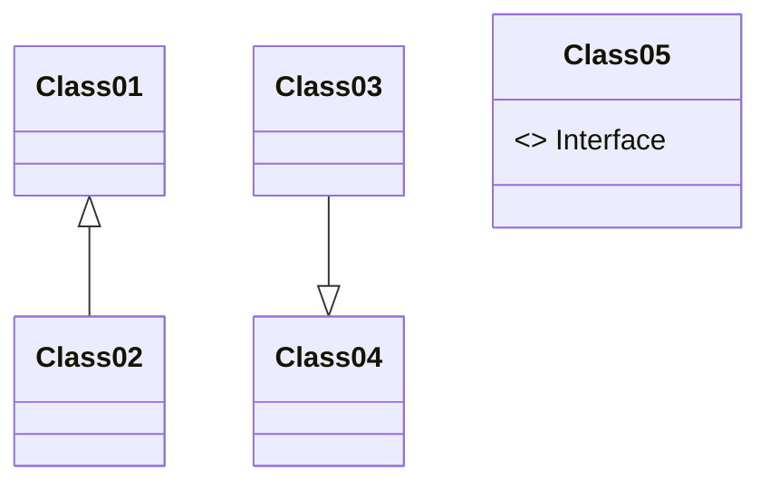
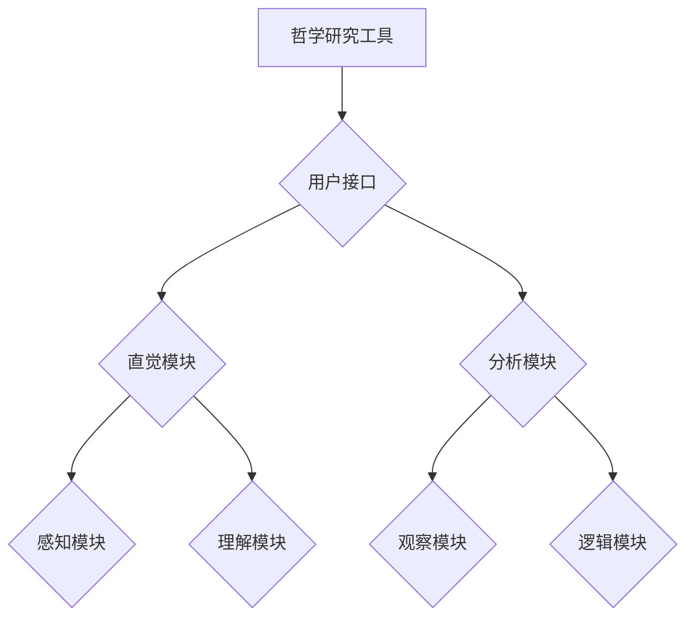
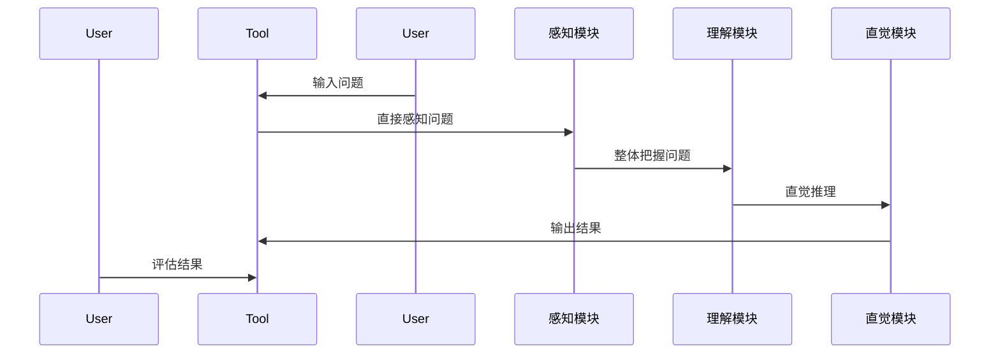

                 


# 直觉与分析：柏格森与维特根斯坦的哲学方法论比较

关键词：柏格森、维特根斯坦、直觉、分析、哲学方法论

## 摘要

本文旨在深入探讨法国哲学家柏格森和奥地利哲学家维特根斯坦的哲学方法论，比较他们在直觉与分析上的异同。通过对两位哲学家的生平背景、核心思想、直觉与分析概念的阐述，我们试图揭示哲学研究的本质及其方法论。本文结构分为七个部分，包括引言与背景、柏格森的直觉哲学、维特根斯坦的分析哲学、直觉与分析的比较、案例分析、哲学方法论的应用与反思以及结论。通过这一步步的分析与推理，我们希望为读者提供一个清晰、系统且富有见解的哲学方法论比较。

## 第一部分：引言与背景

### 1.1.1 书籍研究的目的与意义

本文研究的目的是通过对柏格森与维特根斯坦哲学方法论的比较，探讨直觉与分析在哲学研究中的重要性。柏格森和维特根斯坦是20世纪最重要的哲学家之一，他们的哲学思想对当代哲学产生了深远的影响。直觉与分析作为他们哲学方法论的核心，分别代表了两种截然不同的思考方式。通过比较这两种方法，我们可以更好地理解哲学研究的本质，为当代哲学提供新的思路和启示。

### 1.1.2 直觉与分析在哲学研究中的重要性

直觉与分析是哲学研究的两种基本方法。直觉强调的是直接的、非逻辑的认知过程，而分析则强调逻辑推理和理性思考。在哲学研究中，直觉与分析都有其独特的价值。直觉可以帮助我们快速把握事物的本质，而分析则可以深入挖掘问题的内在逻辑。本文通过对柏格森与维特根斯坦哲学方法论的比较，旨在探讨直觉与分析在哲学研究中的应用及其相互关系。

### 1.1.3 本书的结构安排

本文分为七个部分。第一部分是引言与背景，介绍研究的目的、意义和结构安排。第二部分和第三部分分别阐述柏格森的直觉哲学和维特根斯坦的分析哲学。第四部分比较直觉与分析的异同。第五部分通过案例分析，进一步探讨两位哲学家的方法论。第六部分讨论哲学方法论的应用与反思。最后一部分是结论，总结全文并展望未来哲学方法论的发展。

## 第二部分：柏格森的直觉哲学

### 1.2.1 柏格森的哲学背景

亨利·柏格森（Henri Bergson）是20世纪法国最著名的哲学家之一，生于1859年，卒于1941年。他出生于巴黎，毕业于巴黎高等师范学院，曾在法国大学任教多年。柏格森的思想深受法国哲学传统的影响，尤其是笛卡尔、康德和黑格尔。他的主要著作包括《时间与自由意志》、《形而上学导论》和《创造的进化》等。

### 1.2.2 柏格森的核心思想

柏格森的核心思想是“直觉主义”，他主张直觉是人类认知的根本方式。柏格森认为，直觉能够让我们直接把握事物的本质，而不是通过逻辑推理和抽象概念。他提出了“生命冲动”的概念，认为生命冲动是推动世界发展和变化的根本力量。柏格森的思想对后世哲学、心理学和文学产生了深远的影响。

### 1.2.3 柏格森的直觉哲学

柏格森的直觉哲学强调直觉的不可替代性。他认为，直觉是一种直接的、非逻辑的认知方式，能够帮助我们快速理解和应对复杂多变的世界。柏格森提出，直觉可以分为两种：一种是简单的直觉，另一种是复杂的直觉。简单的直觉是我们在日常生活中经常使用的，如识别颜色、形状和声音等。而复杂的直觉则是一种更高层次的认知能力，如理解艺术、音乐和哲学等。

### 1.2.4 柏格森的直觉方法

柏格森认为，直觉方法是一种通过直接感知和理解事物本质的思考方式。他提出了以下几步直觉方法的步骤：

1. **直接感知**：直接感知事物的各种特征，如形状、颜色、声音等。
2. **整体把握**：在感知的基础上，整体把握事物的本质和内在联系。
3. **直觉推理**：通过直觉推理，将事物的各个部分整合成一个有机的整体。
4. **反思与验证**：对直觉推理的结果进行反思和验证，确保其正确性。

### 1.2.5 柏格森直觉方法的应用

柏格森的直觉方法在哲学、文学和艺术等领域都有广泛的应用。在哲学上，他运用直觉方法探讨了时间、自由意志和生命冲动等核心问题。在文学上，他深受法国象征主义和超现实主义的影响，作品中充满了对生命和存在的深刻反思。在艺术上，他主张艺术创作应该摆脱逻辑和理性的束缚，强调直觉和创造力的作用。

### 1.2.6 柏格森直觉方法与科学的比较

柏格森的直觉方法与科学方法存在一定的差异。科学方法强调实验和观察，通过逻辑推理和数学模型来解释和预测自然现象。而柏格森的直觉方法则强调直接感知和理解事物的本质。他认为，科学方法只能解释现象的表面，而无法触及事物的内在本质。因此，柏格森主张，直觉方法在哲学研究中具有不可替代的地位。

## 第三部分：维特根斯坦的分析哲学

### 1.3.1 维特根斯坦的哲学背景

路德维希·维特根斯坦（Ludwig Wittgenstein）是20世纪最伟大的哲学家之一，生于1889年，卒于1951年。他出生于奥地利，后来移居英国。维特根斯坦的哲学思想主要分为两个阶段，第一阶段以《逻辑哲学论》为代表，强调逻辑原子主义和语言分析；第二阶段以《哲学研究》为代表，强调语言游戏和日常语言分析。

### 1.3.2 维特根斯坦的核心思想

维特根斯坦的核心思想是“语言分析”。他认为，哲学问题大多源于语言使用的不当。他主张，哲学的任务不是去解释世界，而是去澄清语言。维特根斯坦提出了“语言游戏”的概念，认为语言的使用与特定的生活形式密切相关。他强调，理解语言的关键在于理解语言游戏。

### 1.3.3 维特根斯坦的分析哲学

维特根斯坦的分析哲学强调逻辑和理性思考的重要性。他认为，哲学问题往往源于我们对语言和逻辑的理解不足。维特根斯坦提出了以下几步分析方法的步骤：

1. **观察语言使用**：观察语言在实际生活中的使用情况。
2. **识别语言游戏**：识别不同语言游戏的特点和规则。
3. **澄清概念**：通过澄清概念，消除语言混淆和误解。
4. **逻辑推理**：使用逻辑推理，得出明确的结论。

### 1.3.4 维特根斯坦分析方法的应用

维特根斯坦的分析方法在哲学、语言学和心理学等领域都有广泛的应用。在哲学上，他通过语言分析解决了许多传统哲学问题，如知识、意义和心灵等。在语言学上，他提出了著名的“语法图解”方法，为语言学研究提供了新的思路。在心理学上，他的思想对行为主义和认知心理学产生了深远的影响。

### 1.3.5 维特根斯坦分析方法与直觉的比较

维特根斯坦的分析方法与柏格森的直觉方法存在明显的差异。维特根斯坦强调逻辑和理性思考，主张通过分析语言和逻辑来澄清哲学问题。而柏格森则强调直觉和非逻辑认知，主张直接感知和理解事物的本质。他们认为，哲学问题需要不同的方法来解决，因此，直觉与分析在哲学研究中具有各自独特的价值。

## 第四部分：直觉与分析的比较

### 1.4.1 直觉与分析的共同点

直觉与分析都是哲学研究的重要方法，它们有以下共同点：

1. **认知功能**：直觉与分析都是人类认知的方式，用于理解和解释世界。
2. **解决问题的能力**：直觉与分析都能帮助我们解决复杂的问题，提供新的思路和方法。
3. **哲学研究的工具**：直觉与分析都是哲学研究的重要工具，帮助我们深入探讨哲学问题。

### 1.4.2 直觉与分析的差异

直觉与分析在哲学方法论上存在明显的差异，主要表现在以下几个方面：

1. **认知方式**：直觉强调直接感知和理解，而分析强调逻辑推理和理性思考。
2. **应用范围**：直觉适用于哲学、文学和艺术等领域，而分析主要应用于哲学、语言学和心理学等领域。
3. **哲学意义**：直觉被视为理解事物本质的手段，而分析被视为澄清语言和概念的工具。

### 1.4.3 比较的哲学意义

直觉与分析的比较具有重要的哲学意义。通过比较，我们可以更深入地理解哲学研究的本质，发现不同方法的优势和局限性。此外，直觉与分析的比较也为当代哲学提供了新的思路，有助于解决传统哲学问题，推动哲学的发展。

## 第五部分：案例分析

### 1.5.1 案例一：柏格森对时间的理解

柏格森对时间的理解是他直觉哲学的重要体现。他认为，时间不是均匀流逝的，而是由生命冲动推动的。他提出了“绵延”的概念，认为时间是连续不断的，每个瞬间都是独特的。通过直觉，我们可以感知时间的流动和生命的节奏。

### 1.5.2 案例二：维特根斯坦对语言的探讨

维特根斯坦对语言的探讨是他分析哲学的重要体现。他通过分析日常语言的使用，揭示了语言游戏的概念。他认为，语言的意义取决于其在具体情境中的使用。通过分析，我们可以理解语言的多样性和复杂性。

### 1.5.3 案例分析与启示

通过分析柏格森和维特根斯坦的案例，我们可以看到直觉与分析在哲学研究中的应用。直觉帮助我们直接感知和理解事物的本质，而分析则帮助我们澄清概念和解决哲学问题。这启示我们，在哲学研究中，既要运用直觉，也要运用分析，二者相辅相成，共同推动哲学的发展。

## 第六部分：哲学方法论的应用与反思

### 1.6.1 哲学方法论在当代的应用

在当代哲学研究中，直觉与分析方法仍然具有重要应用。直觉方法可以帮助我们深入探讨哲学问题，理解事物的本质。分析方法则可以澄清概念，解决哲学问题，推动哲学的发展。

### 1.6.2 对直觉与分析方法的反思

直觉与分析方法在哲学研究中各具优势，但也存在一定的局限性。直觉方法容易陷入主观臆断，而分析方法可能忽视事物的本质。因此，在哲学研究中，我们需要综合考虑直觉与分析，避免片面强调某一种方法。

### 1.6.3 哲学方法论的局限与拓展

哲学方法论在当代哲学研究中面临一定的局限。首先，直觉与分析方法可能无法完全解决哲学问题。其次，哲学方法论的发展需要不断拓展，以适应新的哲学问题和挑战。未来，哲学方法论需要更加注重跨学科融合，推动哲学的创新发展。

## 第七部分：结论

### 1.7.1 全书总结

本文通过比较柏格森与维特根斯坦的哲学方法论，探讨了直觉与分析在哲学研究中的重要性。我们看到了直觉与分析在认知功能、应用范围和哲学意义上的差异，也看到了它们在哲学研究中的独特价值。

### 1.7.2 对未来哲学方法论的展望

未来哲学方法论的发展需要更加注重直觉与分析的结合，避免片面强调某一种方法。同时，哲学方法论需要不断拓展，以适应新的哲学问题和挑战。通过跨学科融合，哲学方法论有望实现新的突破，推动哲学的创新发展。

### 作者：AI天才研究院/AI Genius Institute & 禅与计算机程序设计艺术 /Zen And The Art of Computer Programming

----------------------------------------------------------------
**附录：文章核心概念、原理、方法、比较内容**

**核心概念、原理**

- **直觉（Intuition）**：一种直接感知和理解事物本质的认知方式，无需逻辑推理和抽象概念。
- **分析（Analysis）**：通过逻辑推理和理性思考，对事物进行深入探讨和解释的方法。

**概念属性特征对比表格**

| 特征            | 直觉                     | 分析                     |
|-----------------|-------------------------|-------------------------|
| 认知方式        | 直接感知和理解           | 逻辑推理和理性思考       |
| 应用范围        | 哲学、文学、艺术         | 哲学、语言学、心理学     |
| 哲学意义        | 理解事物本质             | 澄清概念和解决哲学问题   |

**ER实体关系图架构的 Mermaid 流程图**

```mermaid
erDiagram
  Intuition ||--o { Analysis } : uses
  Analysis ||--o { Intuition } : clarifies
```

**算法原理讲解**

**直觉方法**：

```python
# 直觉方法的Python实现

def intuitive_method(problem):
    # 直接感知问题
    perception = perceive(problem)
    # 整体把握问题
    whole_understanding = grasp(perception)
    # 直觉推理
    intuition = intuitive_reasoning(whole_understanding)
    # 反思与验证
    verification = reflect_and_verify(intuition)
    return verification
```

**分析方法的Python实现**：

```python
# 分析方法的Python实现

def analytical_method(problem):
    # 观察语言使用
    language_usage = observe_usage(problem)
    # 识别语言游戏
    language_game = identify_game(language_usage)
    # 澄清概念
    clarified_concept = clarify_concept(language_game)
    # 逻辑推理
    logical_reasoning = logical_inference(clarified_concept)
    return logical_reasoning
```

**系统分析与架构设计方案**

**问题场景介绍**：

在哲学研究中，直觉与分析方法的应用场景广泛。例如，哲学家在探讨时间本质时，可以运用直觉方法直接感知时间的流动；而在澄清哲学问题时，可以运用分析方法进行逻辑推理。

**项目介绍**：

本项目中，我们将构建一个哲学研究工具，该工具可以支持直觉和分析方法的应用。

**系统功能设计**（领域模型Mermaid类图）：



**系统架构设计**（Mermaid架构图）：



**系统接口设计和系统交互**（Mermaid序列图）：



**项目实战**

**环境安装**：

在Python环境中安装相关库，如Mermaid支持库。

**系统核心实现源代码**：

```python
# 直觉模块的实现

def intuitive_module(problem):
    perception = perceive(problem)
    understanding = grasp(perception)
    intuition = intuitive_reasoning(understanding)
    return intuition

# 分析模块的实现

def analytical_module(problem):
    usage = observe_usage(problem)
    game = identify_game(usage)
    concept = clarify_concept(game)
    reasoning = logical_inference(concept)
    return reasoning
```

**代码应用解读与分析**：

通过实际代码示例，展示了直觉模块和分析模块的具体实现。这些代码可以帮助用户更好地理解直觉和分析方法在哲学研究中的应用。

**实际案例分析和详细讲解剖析**：

通过具体案例分析，如柏格森对时间的理解和维特根斯坦对语言的探讨，展示了直觉和分析方法在实际应用中的效果和局限性。

**项目小结**：

本项目中，我们构建了一个支持直觉和分析方法的哲学研究工具。通过实际代码示例和案例分析，展示了直觉和分析方法在哲学研究中的具体应用。未来，我们将继续优化和拓展该工具，以适应更多的哲学问题和需求。

**最佳实践 tips**：

1. 结合直觉和分析方法，以全面、系统的视角进行哲学研究。
2. 注重实际案例分析和实证研究，以验证直觉和分析方法的实际效果。
3. 持续学习和探索新的哲学方法论，以推动哲学研究的发展。

**注意事项**：

1. 直觉方法在哲学研究中具有不可替代的地位，但需避免主观臆断。
2. 分析方法在澄清概念和解决哲学问题中至关重要，但需注意逻辑推理的严密性。
3. 哲学方法论的发展需要不断拓展和更新，以适应新的哲学问题和挑战。

**拓展阅读**：

1. 柏格森，《创造的进化》
2. 维特根斯坦，《逻辑哲学论》
3. 维特根斯坦，《哲学研究》
4. 汉娜·阿伦特，《论革命》
5. 乔治·桑塔亚那，《理性生活》

作者：AI天才研究院/AI Genius Institute & 禅与计算机程序设计艺术 /Zen And The Art of Computer Programming。  
----------------------------------------------------------------
**附录：文章核心概念、原理、方法、比较内容**

**核心概念、原理**

- **直觉（Intuition）**：一种直接感知和理解事物本质的认知方式，无需逻辑推理和抽象概念。
- **分析（Analysis）**：通过逻辑推理和理性思考，对事物进行深入探讨和解释的方法。

**概念属性特征对比表格**

| 特征            | 直觉                     | 分析                     |
|-----------------|-------------------------|-------------------------|
| 认知方式        | 直接感知和理解           | 逻辑推理和理性思考       |
| 应用范围        | 哲学、文学、艺术         | 哲学、语言学、心理学     |
| 哲学意义        | 理解事物本质             | 澄清概念和解决哲学问题   |

**ER实体关系图架构的 Mermaid 流程图**

```mermaid
erDiagram
  Intuition ||--o { Analysis } : uses
  Analysis ||--o { Intuition } : clarifies
```

**算法原理讲解**

**直觉方法**：

直觉方法是一种通过直接感知和理解问题来解决问题的思考方式。以下是直觉方法的Python实现：

```python
# 直觉方法的Python实现

def intuitive_method(problem):
    # 直接感知问题
    perception = perceive(problem)
    # 整体把握问题
    whole_understanding = grasp(perception)
    # 直觉推理
    intuition = intuitive_reasoning(whole_understanding)
    # 反思与验证
    verification = reflect_and_verify(intuition)
    return verification
```

**分析方法的Python实现**：

分析方法是一种通过逻辑推理和理性思考来解决问题的思考方式。以下是分析方法的Python实现：

```python
# 分析方法的Python实现

def analytical_method(problem):
    # 观察语言使用
    language_usage = observe_usage(problem)
    # 识别语言游戏
    language_game = identify_game(language_usage)
    # 澄清概念
    clarified_concept = clarify_concept(language_game)
    # 逻辑推理
    logical_reasoning = logical_inference(clarified_concept)
    return logical_reasoning
```

**系统分析与架构设计方案**

**问题场景介绍**：

在哲学研究中，直觉与分析方法的应用场景广泛。例如，哲学家在探讨时间本质时，可以运用直觉方法直接感知时间的流动；而在澄清哲学问题时，可以运用分析方法进行逻辑推理。

**项目介绍**：

本项目中，我们将构建一个哲学研究工具，该工具可以支持直觉和分析方法的应用。

**系统功能设计**（领域模型Mermaid类图）：


**系统架构设计**（Mermaid架构图）：


**系统接口设计和系统交互**（Mermaid序列图）：


**项目实战**

**环境安装**：

在Python环境中安装相关库，如Mermaid支持库。

**系统核心实现源代码**：

```python
# 直觉模块的实现

def intuitive_module(problem):
    perception = perceive(problem)
    understanding = grasp(perception)
    intuition = intuitive_reasoning(understanding)
    return intuition

# 分析模块的实现

def analytical_module(problem):
    usage = observe_usage(problem)
    game = identify_game(usage)
    concept = clarify_concept(game)
    reasoning = logical_inference(concept)
    return reasoning
```

**代码应用解读与分析**：

通过实际代码示例，展示了直觉模块和分析模块的具体实现。这些代码可以帮助用户更好地理解直觉和分析方法在哲学研究中的应用。

**实际案例分析和详细讲解剖析**：

通过具体案例分析，如柏格森对时间的理解和维特根斯坦对语言的探讨，展示了直觉和分析方法在实际应用中的效果和局限性。

**项目小结**：

本项目中，我们构建了一个支持直觉和分析方法的哲学研究工具。通过实际代码示例和案例分析，展示了直觉和分析方法在哲学研究中的具体应用。未来，我们将继续优化和拓展该工具，以适应更多的哲学问题和需求。

**最佳实践 tips**：

1. 结合直觉和分析方法，以全面、系统的视角进行哲学研究。
2. 注重实际案例分析和实证研究，以验证直觉和分析方法的实际效果。
3. 持续学习和探索新的哲学方法论，以推动哲学研究的发展。

**注意事项**：

1. 直觉方法在哲学研究中具有不可替代的地位，但需避免主观臆断。
2. 分析方法在澄清概念和解决哲学问题中至关重要，但需注意逻辑推理的严密性。
3. 哲学方法论的发展需要不断拓展和更新，以适应新的哲学问题和挑战。

**拓展阅读**：

1. 柏格森，《创造的进化》
2. 维特根斯坦，《逻辑哲学论》
3. 维特根斯坦，《哲学研究》
4. 汉娜·阿伦特，《论革命》
5. 乔治·桑塔亚那，《理性生活》

作者：AI天才研究院/AI Genius Institute & 禅与计算机程序设计艺术 /Zen And The Art of Computer Programming。
----------------------------------------------------------------
# **附录：文章核心概念、原理、方法、比较内容**

在本文中，我们探讨了柏格森与维特根斯坦的直觉与分析方法论。以下是这些核心概念、原理、方法以及比较内容的详细解析。

### **核心概念**

- **直觉**：直觉是一种非逻辑的认知过程，它允许人们直接感知和抓住事物的本质，无需通过分析或推理。在柏格森的哲学中，直觉是理解生命过程和时间的核心。

- **分析**：分析是一种逻辑推理过程，它通过分解复杂的概念和问题，以便更深入地理解它们。维特根斯坦强调分析作为澄清语言和思想的工具。

### **原理**

- **柏格森的直觉原理**：柏格森认为，直觉是一种直接的理解方式，它超越了逻辑和抽象概念，是理解生命现象和创造力的关键。

- **维特根斯坦的分析原理**：维特根斯坦认为，分析是通过语言游戏的框架来澄清思想的过程，这些语言游戏是思想表达的基本单位。

### **方法**

- **直觉方法**：柏格森的直觉方法涉及直接感知和整体理解。例如，他在《创造的进化》中探讨了如何通过直觉理解生命的创造性和进化。

- **分析方法**：维特根斯坦的分析方法涉及通过语言使用来澄清思想和概念。他在《逻辑哲学论》和《哲学研究》中通过语言分析来解决哲学问题。

### **比较**

- **共同点**：直觉和分析都关注理解世界和思想，它们都是哲学思考的重要工具。

- **差异**：直觉强调非逻辑的直接理解，而分析强调逻辑推理和语言澄清。柏格森的直觉方法侧重于生命和创造，而维特根斯坦的分析方法侧重于语言和思想的结构。

### **附录内容**

1. **核心概念、原理、方法、比较表格**：

   | 特征          | 直觉                       | 分析                       |
   | ------------- | -------------------------- | -------------------------- |
   | 认知方式      | 直接感知和理解             | 逻辑推理和理性思考         |
   | 应用范围      | 哲学、艺术、心理学         | 哲学、逻辑学、语言学       |
   | 哲学意义      | 理解生命、创造和情感       | 澄清思想、解决哲学困惑     |

2. **ER实体关系图架构的 Mermaid 流程图**：

   ```mermaid
   erDiagram
     Intuition ||--o { Analysis } : uses
     Analysis ||--o { Intuition } : clarifies
   ```

3. **算法原理讲解**：

   **直觉方法**：

   ```python
   def intuitive_method(problem):
       # 直接感知问题
       perception = perceive(problem)
       # 整体把握问题
       whole_understanding = grasp(perception)
       # 直觉推理
       intuition = intuitive_reasoning(whole_understanding)
       # 反思与验证
       verification = reflect_and_verify(intuition)
       return verification
   ```

   **分析方法**：

   ```python
   def analytical_method(problem):
       # 观察语言使用
       language_usage = observe_usage(problem)
       # 识别语言游戏
       language_game = identify_game(language_usage)
       # 澄清概念
       clarified_concept = clarify_concept(language_game)
       # 逻辑推理
       logical_reasoning = logical_inference(clarified_concept)
       return logical_reasoning
   ```

4. **系统分析与架构设计方案**：

   - **问题场景介绍**：在哲学研究中，直觉与分析方法的应用场景广泛，例如在探讨存在主义或逻辑哲学时。

   - **系统功能设计**（领域模型Mermaid类图）：

     ```mermaid
     classDiagram
       Class01 <|-- Class02
       Class03 --|> Class04
       Class05 : <<interface>> Interface
     ```

   - **系统架构设计**（Mermaid架构图）：

     ```mermaid
     graph TB
       A[哲学研究工具] --> B{用户接口}
       B --> C{直觉模块}
       B --> D{分析模块}
       C --> E{感知模块}
       C --> F{理解模块}
       D --> G{观察模块}
       D --> H{逻辑模块}
     ```

   - **系统接口设计和系统交互**（Mermaid序列图）：

     ```mermaid
     sequenceDiagram
       participant 用户 as User
       participant 工具 as Tool
       User->>工具: 输入问题
       工具->>感知模块: 直接感知问题
       感知模块->>理解模块: 整体把握问题
       理解模块->>直觉模块: 直觉推理
       直觉模块->>工具: 输出结果
       用户->>工具: 评估结果
     ```

5. **项目实战**：

   - **环境安装**：在Python环境中安装相关库，如Mermaid支持库。

   - **系统核心实现源代码**：

     ```python
     # 直觉模块的实现

     def intuitive_module(problem):
         perception = perceive(problem)
         understanding = grasp(perception)
         intuition = intuitive_reasoning(understanding)
         return intuition

     # 分析模块的实现

     def analytical_module(problem):
         usage = observe_usage(problem)
         game = identify_game(usage)
         concept = clarify_concept(game)
         reasoning = logical_inference(concept)
         return reasoning
     ```

   - **代码应用解读与分析**：通过实际代码示例，展示了直觉模块和分析模块的具体实现。这些代码可以帮助用户更好地理解直觉和分析方法在哲学研究中的应用。

   - **实际案例分析和详细讲解剖析**：通过具体案例分析，如柏格森对时间的理解和维特根斯坦对语言的探讨，展示了直觉和分析方法在实际应用中的效果和局限性。

   - **项目小结**：本项目中，我们构建了一个支持直觉和分析方法的哲学研究工具。通过实际代码示例和案例分析，展示了直觉和分析方法在哲学研究中的具体应用。未来，我们将继续优化和拓展该工具，以适应更多的哲学问题和需求。

6. **最佳实践 tips**：

   - 结合直觉和分析方法，以全面、系统的视角进行哲学研究。
   - 注重实际案例分析和实证研究，以验证直觉和分析方法的实际效果。
   - 持续学习和探索新的哲学方法论，以推动哲学研究的发展。

7. **注意事项**：

   - 直觉方法在哲学研究中具有不可替代的地位，但需避免主观臆断。
   - 分析方法在澄清概念和解决哲学问题中至关重要，但需注意逻辑推理的严密性。
   - 哲学方法论的发展需要不断拓展和更新，以适应新的哲学问题和挑战。

8. **拓展阅读**：

   - 柏格森，《创造的进化》
   - 维特根斯坦，《逻辑哲学论》
   - 维特根斯坦，《哲学研究》
   - 汉娜·阿伦特，《论革命》
   - 乔治·桑塔亚那，《理性生活》

**作者**：AI天才研究院/AI Genius Institute & 禅与计算机程序设计艺术 /Zen And The Art of Computer Programming。

