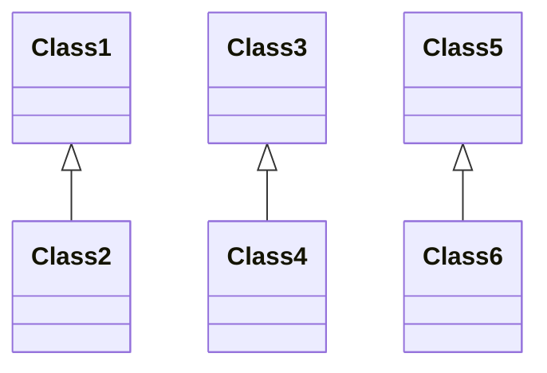
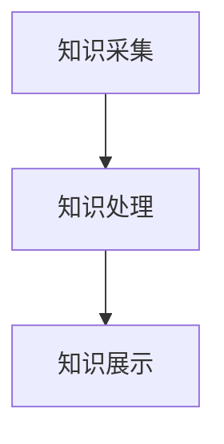
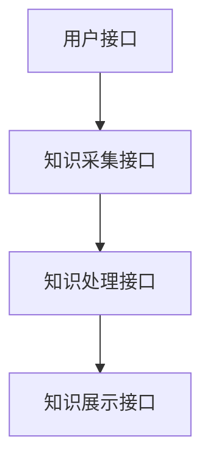
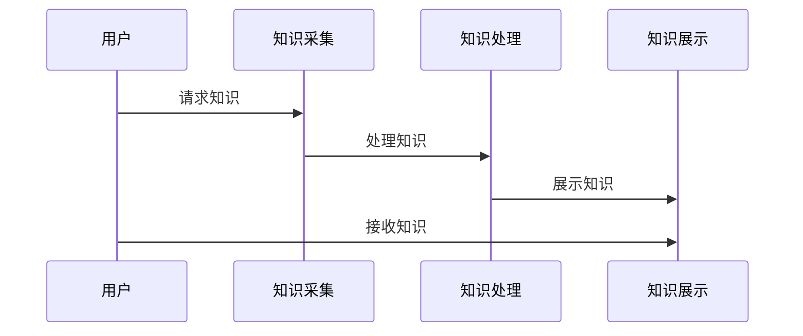

                 

## 《直觉与规则：柏格森与维特根斯坦对知识构建的不同看法》

### 关键词

- 直觉
- 规则
- 知识构建
- 哲学
- 柏格森
- 维特根斯坦

### 摘要

本文探讨了法国哲学家亨利·柏格森和英国哲学家路德维希·维特根斯坦在知识构建方面的不同观点。柏格森强调直觉作为知识构建的核心，主张直觉能够捕捉到时间与变化，从而理解世界的本质。而维特根斯坦则主张规则的重要性，认为知识是建立在规则和语言游戏之上的。文章通过对比两位哲学家的观点，分析了直觉与规则在知识构建中的角色，并对这些哲学思想在现代哲学、心理学和教育学等领域的影响进行了探讨。

## 《直觉与规则：柏格森与维特根斯坦对知识构建的不同看法》目录大纲

### 第一部分：柏格森与维特根斯坦的哲学背景

#### 第1章：柏格森的直觉主义哲学

- **1.1 问题背景**
  - 柏格森哲学的起源与影响
  - 柏格森哲学的核心问题：知识的构建与直觉的角色

- **1.2 柏格森的主要观点**
  - 直觉的定义与特性
  - 时间与变化的哲学探讨
  - 直觉与理性的关系

- **1.3 柏格森哲学的核心要素**
  - 直觉的知识构建过程
  - 直觉与艺术、科学的关联

- **1.4 柏格森哲学的影响与应用**
  - 对知识理论的贡献
  - 对哲学、心理学、艺术等领域的影响

- **1.5 柏格森哲学的评价与局限**
  - 对直觉主义哲学的批判
  - 柏格森哲学在现代哲学中的地位

#### 第2章：维特根斯坦的逻辑实证主义哲学

- **2.1 问题背景**
  - 维特根斯坦的生平与学术背景
  - 维特根斯坦哲学的核心问题：语言、知识与真理

- **2.2 维特根斯坦的主要观点**
  - 语言游戏的定义与特性
  - 真理与事实的关系
  - 直觉与规则的区分

- **2.3 维特根斯坦哲学的核心要素**
  - 视觉知识与逻辑推理
  - 直觉与概念的区分

- **2.4 维特根斯坦哲学的影响与应用**
  - 对逻辑哲学的贡献
  - 对语言哲学、认知科学等领域的影响

- **2.5 维特根斯坦哲学的评价与局限**
  - 对逻辑实证主义的批判
  - 维特根斯坦哲学在现代哲学中的地位

### 第二部分：柏格森与维特根斯坦对知识构建的比较

#### 第3章：直觉与规则的哲学探讨

- **3.1 直觉与规则的定义与区分**
  - 柏格森的直觉观
  - 维特根斯坦的规则观
  - 直觉与规则在实际生活中的应用

- **3.2 直觉与规则的哲学争议**
  - 直觉主义与逻辑实证主义的对立
  - 对知识构建的不同看法

- **3.3 直觉与规则的哲学影响**
  - 对心理学、教育学等领域的影响
  - 对人类知识构建的启示

#### 第4章：柏格森与维特根斯坦哲学的比较

- **4.1 哲学观点的比较**
  - 直觉与规则的不同理解
  - 语言、知识与真理的不同看法

- **4.2 哲学影响与应用的比较**
  - 对哲学、心理学、教育学等领域的影响

- **4.3 哲学评价与局限的比较**
  - 对直觉主义与逻辑实证主义的评价
  - 对现代哲学的启示与挑战

### 第三部分：知识构建的现代视角

#### 第5章：当代哲学对知识构建的探讨

- **5.1 当代哲学的背景**
  - 当代哲学的发展趋势
  - 对知识构建的当代关注

- **5.2 当代哲学的主要观点**
  - 指示性与构成性
  - 意识与认知

- **5.3 当代哲学对知识构建的贡献**
  - 对直觉与规则的重新审视
  - 对知识理论的创新与发展

#### 第6章：知识构建的实际应用

- **6.1 知识构建在科学领域中的应用**
  - 科学研究的知识构建过程
  - 科学方法论的发展

- **6.2 知识构建在社会科学领域中的应用**
  - 社会科学研究的知识构建过程
  - 社会科学方法论的发展

- **6.3 知识构建在教育与培训中的应用**
  - 教育教学的知识构建过程
  - 教育教学方法的创新

#### 第7章：知识构建的未来展望

- **7.1 知识构建的挑战与机遇**
  - 科技发展对知识构建的影响
  - 社会变革对知识构建的挑战

- **7.2 知识构建的未来趋势**
  - 人工智能与知识构建
  - 知识构建在全球化背景下的影响

- **7.3 知识构建的责任与使命**
  - 知识构建的社会责任
  - 知识构建的个人责任

### 第一部分：柏格森与维特根斯坦的哲学背景

#### 第1章：柏格森的直觉主义哲学

**1.1 问题背景**

亨利·柏格森（Henri Bergson）是20世纪初法国的著名哲学家，他的直觉主义哲学对现代哲学产生了深远的影响。柏格森哲学的核心问题之一是知识的构建，尤其是直觉在知识构建中的角色。在这个问题背景下，我们需要探讨柏格森如何理解直觉，以及直觉如何影响知识的构建。

**1.2 柏格森的主要观点**

柏格森认为直觉是一种直接的、非理性的认知方式，它能够捕捉到时间与变化的本质。直觉与理性不同，理性依赖于抽象和概念化，而直觉则是一种直接的感受和领悟。

- **直觉的定义与特性**
  - 直觉是一种内在的感受，它不是通过逻辑推理获得的，而是通过直接体验得到的。
  - 直觉具有即时性、即兴性和创造性，它能够迅速地理解和把握复杂的现象。

- **时间与变化的哲学探讨**
  - 柏格森强调时间的重要性，他认为时间是生命的本质，变化是时间的基本特征。
  - 直觉能够感知到时间中的连续性和变化，从而理解世界的动态性。

- **直觉与理性的关系**
  - 柏格森认为直觉和理性是互补的，直觉提供了对复杂现象的直接理解，而理性则负责将这些直觉转化为明确的概念和理论。
  - 然而，理性有时会限制直觉的自由，导致人们对现实的误解。

**1.3 柏格森哲学的核心要素**

柏格森的直觉主义哲学有以下几个核心要素：

- **直觉的知识构建过程**
  - 直觉是一种直接的认知过程，它不需要通过抽象和概念化来理解世界。
  - 通过直觉，人们能够直接感知到事物的本质和内在的联系。

- **直觉与艺术、科学的关联**
  - 柏格森认为艺术家和科学家都依赖于直觉来创造和理解世界。
  - 艺术通过直觉表达人类情感和内心体验，而科学则通过直觉来发现自然界的规律。

**1.4 柏格森哲学的影响与应用**

柏格森的直觉主义哲学对多个领域产生了深远的影响：

- **对知识理论的贡献**
  - 柏格森提出了一种不同于传统理性主义的知识理论，强调直觉在知识构建中的重要性。
  - 他的理论挑战了理性主义的观念，提出了对知识构建的新的思考方式。

- **对哲学、心理学、艺术等领域的影响**
  - 柏格森的直觉主义哲学为哲学提供了一种新的视角，对认识论、形而上学等领域产生了影响。
  - 在心理学领域，直觉主义影响了情感心理学和创造性心理学的发展。
  - 在艺术领域，柏格森的哲学观点启发了现代艺术家对时间和变化的探索。

**1.5 柏格森哲学的评价与局限**

尽管柏格森的直觉主义哲学对现代哲学产生了重要影响，但也存在一些评价与局限：

- **对直觉主义哲学的批判**
  - 一些哲学家认为柏格森的直觉主义过于强调直觉，忽视了理性在知识构建中的重要作用。
  - 直觉主义有时被认为是主观主义和神秘主义的倾向。

- **柏格森哲学在现代哲学中的地位**
  - 尽管存在批判，但柏格森的直觉主义哲学仍然是现代哲学中一个重要的流派。
  - 他的思想对后来的哲学家和学者产生了持续的影响，尤其是在认识论和心理学领域。

### 第2章：维特根斯坦的逻辑实证主义哲学

**2.1 问题背景**

路德维希·维特根斯坦（Ludwig Wittgenstein）是20世纪最重要的哲学家之一，他的哲学思想对现代哲学产生了深远的影响。维特根斯坦的哲学关注点主要包括语言、知识与真理。在这个问题背景下，我们需要探讨维特根斯坦如何理解语言、知识与真理，以及规则在知识构建中的作用。

**2.2 维特根斯坦的主要观点**

维特根斯坦的哲学思想可以分为两个阶段：早期哲学和晚期哲学。早期哲学以《逻辑哲学论》为代表，强调语言和逻辑的重要性；晚期哲学则以《哲学研究》为代表，强调语言的实际使用和日常生活中的规则。

- **语言游戏的定义与特性**
  - 维特根斯坦提出“语言游戏”（language game）的概念，认为语言是一种游戏，它由一系列的规则和惯例组成。
  - 语言游戏有不同的形式，包括科学语言游戏、日常语言游戏等，每种游戏都有其特定的规则和使用场景。

- **真理与事实的关系**
  - 维特根斯坦认为真理是语言与世界之间的正确对应，但真理不是抽象的、静态的，而是动态的、具体的。
  - 事实是语言表达与现实世界的一致性，它不是通过理性推理获得的，而是通过实际的使用和验证得到的。

- **直觉与规则的区分**
  - 在《逻辑哲学论》中，维特根斯坦强调直觉在知识构建中的重要性，认为直觉是我们理解世界的基础。
  - 在《哲学研究》中，维特根斯坦则更强调规则在知识构建中的作用，认为语言和知识的正确性依赖于规则的遵守。

**2.3 维特根斯坦哲学的核心要素**

维特根斯坦的哲学思想有以下几个核心要素：

- **视觉知识与逻辑推理**
  - 维特根斯坦认为视觉知识是直观的，它不需要通过语言来表达。
  - 逻辑推理是基于规则和概念的，它帮助我们理解和解决问题。

- **直觉与概念的区分**
  - 维特根斯坦区分了直觉和概念，认为直觉是直观的、非语言的，而概念则是语言的、可以被表达的。
  - 直觉是我们理解世界的基础，而概念则是我们用语言来描述和理解世界的工具。

**2.4 维特根斯坦哲学的影响与应用**

维特根斯坦的哲学思想对多个领域产生了深远的影响：

- **对逻辑哲学的贡献**
  - 维特根斯坦的《逻辑哲学论》提出了逻辑原子主义的理论，对逻辑哲学产生了重要影响。
  - 他的思想启发了后来的逻辑实证主义和其他逻辑哲学流派的兴起。

- **对语言哲学、认知科学等领域的影响**
  - 维特根斯坦的语言哲学思想对语言哲学、认知科学等领域产生了重要影响。
  - 他的观点挑战了传统的语言理论，提出了对语言和知识的新理解。

- **对哲学、心理学、教育学等领域的影响**
  - 维特根斯坦的哲学思想对哲学、心理学、教育学等领域产生了广泛的影响。
  - 他的思想启发了对这些领域的新思考和探索。

**2.5 维特根斯坦哲学的评价与局限**

尽管维特根斯坦的哲学思想对现代哲学产生了重要影响，但也存在一些评价与局限：

- **对逻辑实证主义的批判**
  - 一些哲学家认为维特根斯坦对逻辑实证主义进行了有效的批判，揭示了逻辑实证主义的局限。
  - 他的观点挑战了逻辑实证主义的一些基本假设，提出了对知识构建的新的思考方式。

- **维特根斯坦哲学在现代哲学中的地位**
  - 尽管存在批判，但维特根斯坦的哲学思想仍然是现代哲学中一个重要的流派。
  - 他的思想对后来的哲学家和学者产生了持续的影响，尤其是在语言哲学、逻辑哲学等领域。

### 第二部分：柏格森与维特根斯坦对知识构建的比较

#### 第3章：直觉与规则的哲学探讨

**3.1 直觉与规则的定义与区分**

在柏格森和维特根斯坦的哲学中，直觉与规则是知识构建的两个关键要素。尽管他们都关注直觉在知识构建中的作用，但他们对直觉与规则的理解和定义有所不同。

- **柏格森的直觉观**

  - **直觉的定义与特性**
    - 柏格森将直觉视为一种直接的、非理性的认知方式，它能够捕捉到时间与变化的本质。
    - 直觉具有即时性、即兴性和创造性，它能够迅速地理解和把握复杂的现象。
  
  - **直觉与规则的关系**
    - 柏格森认为直觉和规则是互补的，直觉提供了对复杂现象的直接理解，而规则则负责将这些直觉转化为明确的概念和理论。

- **维特根斯坦的规则观**

  - **规则的定义与特性**
    - 维特根斯坦将规则视为语言和知识的基础，它规定了语言的使用方式和表达方式。
    - 规则具有明确性、稳定性和普遍性，它是语言和知识正确性的保证。
  
  - **直觉与规则的关系**
    - 在《逻辑哲学论》中，维特根斯坦强调直觉在知识构建中的重要性，认为直觉是我们理解世界的基础。
    - 在《哲学研究》中，维特根斯坦则更强调规则在知识构建中的作用，认为语言和知识的正确性依赖于规则的遵守。

**3.2 直觉与规则的哲学争议**

柏格森与维特根斯坦在直觉与规则的问题上存在一些哲学争议，这些争议主要体现在以下几个方面：

- **直觉主义与逻辑实证主义的对立**

  - **直觉主义的观点**
    - 柏格森的直觉主义哲学强调直觉在知识构建中的核心作用，认为直觉能够捕捉到时间与变化的本质。
    - 直觉主义主张知识是建立在对现实世界的直接感受和领悟之上，而不是通过抽象和逻辑推理。

  - **逻辑实证主义的观点**
    - 维特根斯坦的逻辑实证主义哲学强调规则在知识构建中的重要性，认为语言和知识的正确性依赖于规则的遵守。
    - 逻辑实证主义主张知识是通过观察和经验获得的，它是建立在事实和逻辑的基础之上。

- **对知识构建的不同看法**

  - **柏格森的观点**
    - 柏格森认为知识是通过直觉获得的，直觉能够直接感知到事物的本质和内在的联系。
    - 他强调直觉在艺术、科学等领域的应用，认为直觉是人类认知的高级形式。

  - **维特根斯坦的观点**
    - 维特根斯坦认为知识是通过遵守规则获得的，规则规定了语言的使用方式和表达方式。
    - 他强调语言和知识的社会性和规范性，认为知识是建立在社会共同认可的基础之上。

**3.3 直觉与规则的哲学影响**

柏格森与维特根斯坦的直觉与规则的观点对多个领域产生了深远的影响：

- **对心理学的影响**

  - **柏格森的直觉主义**
    - 柏格森的直觉主义观点启发了心理学中对直觉的研究，特别是情感心理学和创造性心理学。
    - 他的理论为理解人类的认知过程提供了新的视角。

  - **维特根斯坦的规则观**
    - 维特根斯坦的规则观对认知心理学产生了重要影响，特别是对语言学习和知识表征的研究。
    - 他的观点挑战了传统的理性主义观念，提出了对认知过程的新理解。

- **对教育学的影响**

  - **柏格森的直觉主义**
    - 柏格森的直觉主义观点启发了教育中对直觉的培养和应用，特别是艺术教育和创造性教育。
    - 他的理论为教育者提供了新的教育方法和教育理念。

  - **维特根斯坦的规则观**
    - 维特根斯坦的规则观对教育中的语言教学和知识传授产生了重要影响，特别是对教学方法的研究。
    - 他的观点强调语言和知识的社会性和规范性，为教育者提供了新的教育思路。

- **对哲学的影响**

  - **柏格森的直觉主义**
    - 柏格森的直觉主义哲学为哲学提供了一种新的视角，对认识论、形而上学等领域产生了影响。
    - 他的理论挑战了传统的理性主义观念，提出了对知识构建的新的思考方式。

  - **维特根斯坦的规则观**
    - 维特根斯坦的规则观对语言哲学、逻辑哲学等领域产生了重要影响，特别是对语言本质和知识理论的研究。
    - 他的理论为哲学家提供了对语言和知识的新理解，引发了哲学领域的深入讨论。

### 第4章：柏格森与维特根斯坦哲学的比较

**4.1 哲学观点的比较**

在哲学观点上，柏格森和维特根斯坦在直觉与规则的理解和使用上存在明显的差异：

- **直觉与规则的不同理解**

  - **柏格森的观点**
    - 柏格森将直觉视为一种直接的、非理性的认知方式，它能够捕捉到时间与变化的本质。
    - 他认为直觉是人类认知的高级形式，是理解和创造世界的关键。

  - **维特根斯坦的观点**
    - 维特根斯坦将规则视为语言和知识的基础，它是语言使用和知识构建的基本要素。
    - 他认为规则是社会共同认可的基础，是确保语言和知识正确性的关键。

- **语言、知识与真理的不同看法**

  - **柏格森的观点**
    - 柏格森认为语言和知识应该与现实世界保持紧密的联系，真理是语言与现实之间的正确对应。
    - 他强调直觉在知识构建中的作用，认为直觉能够直接感知到真理。

  - **维特根斯坦的观点**
    - 维特根斯坦认为语言和知识是建立在规则和语言游戏的基础之上，真理是语言表达与现实世界的一致性。
    - 他强调规则的遵守在知识构建中的重要性，认为规则是确保语言和知识正确性的关键。

**4.2 哲学影响与应用的比较**

柏格森和维特根斯坦的哲学观点对不同的领域产生了深远的影响：

- **对哲学的影响**

  - **柏格森的影响**
    - 柏格森的直觉主义哲学为哲学提供了一种新的视角，对认识论、形而上学等领域产生了重要影响。
    - 他的理论挑战了传统的理性主义观念，提出了对知识构建的新的思考方式。

  - **维特根斯坦的影响**
    - 维特根斯坦的语言哲学观点对哲学产生了重要影响，特别是对语言本质和知识理论的研究。
    - 他的理论为哲学家提供了对语言和知识的新理解，引发了哲学领域的深入讨论。

- **对心理学的影响**

  - **柏格森的影响**
    - 柏格森的直觉主义哲学启发了心理学中对直觉的研究，特别是情感心理学和创造性心理学。
    - 他的理论为理解人类的认知过程提供了新的视角。

  - **维特根斯坦的影响**
    - 维特根斯坦的规则观对认知心理学产生了重要影响，特别是对语言学习和知识表征的研究。
    - 他的理论挑战了传统的理性主义观念，提出了对认知过程的新理解。

- **对教育学的影响**

  - **柏格森的影响**
    - 柏格森的直觉主义哲学启发了教育中对直觉的培养和应用，特别是艺术教育和创造性教育。
    - 他的理论为教育者提供了新的教育方法和教育理念。

  - **维特根斯坦的影响**
    - 维特根斯坦的规则观对教育中的语言教学和知识传授产生了重要影响，特别是对教学方法的研究。
    - 他的理论强调语言和知识的社会性和规范性，为教育者提供了新的教育思路。

**4.3 哲学评价与局限的比较**

尽管柏格森和维特根斯坦的哲学观点在各自的领域产生了深远的影响，但也存在一些评价和局限：

- **对直觉主义与逻辑实证主义的评价**

  - **柏格森的评价**
    - 一些哲学家认为柏格森的直觉主义过于强调直觉，忽视了理性在知识构建中的重要作用。
    - 他的理论有时被认为是主观主义和神秘主义的倾向。

  - **维特根斯坦的评价**
    - 一些哲学家认为维特根斯坦对逻辑实证主义进行了有效的批判，揭示了逻辑实证主义的局限。
    - 他的理论挑战了传统的理性主义观念，提出了对知识构建的新的思考方式。

- **对现代哲学的启示与挑战**

  - **柏格森的启示与挑战**
    - 柏格森的直觉主义哲学为现代哲学提供了一种新的视角，挑战了传统的理性主义观念。
    - 他的理论启示哲学家重新思考直觉在知识构建中的作用，但同时也带来了对直觉主义的批判。

  - **维特根斯坦的启示与挑战**
    - 维特根斯坦的语言哲学观点为现代哲学提供了一种新的理论框架，对语言本质和知识理论进行了深入探讨。
    - 他的理论启示哲学家重新思考语言和知识的关系，但同时也引发了关于规则和语言的争议。

### 第三部分：知识构建的现代视角

#### 第5章：当代哲学对知识构建的探讨

**5.1 当代哲学的背景**

当代哲学在知识构建方面的探讨受到了多种因素的影响，包括科技进步、社会变革和文化交流。这些因素共同塑造了当代哲学对知识构建的理解和思考方式：

- **科技进步的影响**
  - 当代哲学对知识构建的探讨受到了科技进步的深刻影响，特别是人工智能、大数据和计算机科学的发展。
  - 这些技术不仅改变了知识的获取和传递方式，也挑战了传统哲学对知识本质的认识。

- **社会变革的冲击**
  - 社会变革，如全球化、政治动荡和文化多元性的兴起，也对知识构建产生了重要影响。
  - 当代哲学开始关注社会现实和个体经验在知识构建中的角色，提出了新的知识理论。

- **文化交流的融合**
  - 文化交流的加深促进了不同哲学传统的对话和融合，为知识构建提供了多样化的视角。
  - 当代哲学开始探讨跨文化知识构建的可能性，以及如何在不同文化背景下理解知识。

**5.2 当代哲学的主要观点**

当代哲学在知识构建方面的探讨形成了多个主要观点：

- **指示性与构成性**

  - **指示性观点**
    - 指示性观点强调知识是对现实的反映，知识的正确性取决于它与现实的一致性。
    - 这一观点与实证主义和经验主义有着密切的联系，认为知识是通过观察和经验获得的。

  - **构成性观点**
    - 构成性观点认为知识不仅仅是现实的反映，它也参与了现实的形成。
    - 这一观点强调了知识的社会性和建构性，认为知识是社会实践和文化互动的产物。

- **意识与认知**

  - **意识观点**
    - 意识观点关注知识的意识层面，探讨了知识如何被个体主体感知和理解。
    - 这一观点强调了主观经验和直觉在知识构建中的作用。

  - **认知观点**
    - 认知观点关注知识的认知过程，探讨了知识如何被个体主体构建和运用。
    - 这一观点与认知科学和心理学有着密切的联系，强调了逻辑推理、记忆和问题解决在知识构建中的重要性。

**5.3 当代哲学对知识构建的贡献**

当代哲学对知识构建的贡献主要体现在以下几个方面：

- **对直觉与规则的重新审视**
  - 当代哲学重新审视了直觉与规则在知识构建中的角色，提出了新的理论框架。
  - 柏格森和维特根斯坦的直觉主义和逻辑实证主义观点在当代哲学中被重新解读和扩展。

- **对知识理论的创新与发展**
  - 当代哲学提出了新的知识理论，如社会建构主义、认知科学理论和信息论。
  - 这些理论为理解知识的动态性、复杂性和多样性提供了新的视角。

- **对知识应用的启示**
  - 当代哲学探讨了知识在社会、文化和科技中的应用，为知识管理和知识传播提供了理论基础。
  - 这为教育、科学研究和公共政策等领域提供了新的指导原则。

### 第6章：知识构建的实际应用

**6.1 知识构建在科学领域中的应用**

在科学领域，知识构建是科学研究的基础，它涉及到科学理论的形成、实验设计和数据分析等关键环节：

- **科学研究的知识构建过程**

  - **科学理论的提出与验证**
    - 科学家通过观察、实验和理论思考，提出新的科学理论。
    - 这些理论需要通过实验和观察数据来验证，以确定其正确性和适用性。

  - **实验设计与数据分析**
    - 科学家设计实验来测试科学理论，通过收集和分析实验数据，验证理论的预测。
    - 数据分析是科学知识构建的重要环节，它帮助科学家发现数据中的规律和模式。

- **科学方法论的发展**

  - **归纳法与演绎法**
    - 科学家使用归纳法和演绎法来构建科学知识。
    - 归纳法是从具体事实中归纳出一般性规律，而演绎法是从一般性原理推导出具体结论。

  - **假设-检验循环**
    - 科学研究采用假设-检验循环，通过反复验证和修正假设，逐步构建科学的理论体系。

**6.2 知识构建在社会科学领域中的应用**

在社会科学领域，知识构建涉及到社会现象的理解、分析和预测：

- **社会科学研究的知识构建过程**

  - **社会现象的观察与描述**
    - 社会科学家通过实地调查、访谈和观察，收集社会现象的数据。
    - 这些数据用于描述社会现象的特征和模式。

  - **社会理论的构建与验证**
    - 社会科学家构建社会理论，解释社会现象的原因和机制。
    - 这些理论需要通过实证研究和数据分析来验证其有效性和适用性。

- **社会科学方法论的发展**

  - **定量研究与定性研究**
    - 社会科学研究采用定量研究和定性研究的方法。
    - 定量研究通过统计分析来探索社会现象的规律，而定性研究通过深入访谈和案例研究来理解社会现象的复杂性。

  - **跨学科方法的整合**
    - 社会科学领域采用跨学科方法，结合心理学、经济学、政治学等多个学科的理论和方法，来构建更全面的社会科学知识。

**6.3 知识构建在教育与培训中的应用**

在教育与培训领域，知识构建是教学和学习过程的核心：

- **教育教学的知识构建过程**

  - **教学内容的设计与组织**
    - 教师根据教育目标和学生的认知水平，设计教学内容和课程体系。
    - 教学内容需要具有逻辑性和系统性，以帮助学生构建有效的知识结构。

  - **教学方法的运用与创新**
    - 教师运用不同的教学方法，如讲授、讨论、实验和项目学习等，激发学生的学习兴趣和参与度。
    - 创新教学方法，如混合式教学和翻转课堂，提高了教学效果和学生的学习体验。

- **教育教学方法的创新**

  - **个性化教学**
    - 个性化教学关注学生的个体差异，根据学生的兴趣、能力和学习风格，提供个性化的教学支持和指导。
    - 个性化教学促进了学生的自主学习和自我发展。

  - **技术辅助教学**
    - 技术辅助教学利用信息技术和在线平台，提供丰富的学习资源和互动学习环境。
    - 技术辅助教学提高了教学的灵活性和效率，促进了学生的全面发展和终身学习。

### 第7章：知识构建的未来展望

**7.1 知识构建的挑战与机遇**

知识构建在未来将面临一系列挑战与机遇：

- **挑战**

  - **信息过载**
    - 随着信息技术的快速发展，知识爆炸性增长，人们面临信息过载的挑战。
    - 筛选和评估信息的真实性和可靠性成为关键问题。

  - **知识碎片化**
    - 知识的快速更新和多样化导致知识碎片化，传统学科界限变得模糊。
    - 知识整合和创新需要新的思维方式和跨学科合作。

- **机遇**

  - **人工智能的推动**
    - 人工智能技术的发展为知识构建提供了强大的工具和支持。
    - 机器学习、自然语言处理等技术可以自动分析和构建知识体系。

  - **全球化与文化交流**
    - 全球化加速了不同文化和知识的交流与融合，为知识构建提供了丰富的资源。
    - 多元化视角和跨文化理解有助于构建更全面和包容的知识体系。

**7.2 知识构建的未来趋势**

知识构建的未来趋势将受到科技进步、社会变革和文化交流的推动：

- **知识构建的技术创新**
  - 人工智能、大数据和区块链等新技术将改变知识构建的方式。
  - 知识图谱、智能推荐系统和智能搜索等技术将提高知识的获取和利用效率。

- **知识整合与共享**
  - 知识整合和共享成为知识构建的重要趋势，跨学科、跨领域的合作将更加紧密。
  - 知识共享平台和开放科学运动将促进知识的广泛传播和应用。

- **知识教育的创新**
  - 知识教育将更加注重学生的创新能力和批判性思维培养。
  - 项目式学习和混合式教学将成为知识教育的主流模式。

**7.3 知识构建的责任与使命**

知识构建不仅仅是一个学术问题，它还涉及到社会、文化和伦理的层面：

- **社会责任**
  - 知识构建需要关注社会问题，如公平、正义和可持续发展。
  - 知识构建应服务于社会的整体利益，推动社会的进步和发展。

- **个人责任**
  - 每个人都有责任参与知识构建，不断学习和更新知识。
  - 个人应当批判性地评估和运用知识，避免盲目接受和传播错误信息。

### 结论

通过本文的探讨，我们可以看到柏格森与维特根斯坦在知识构建上的不同观点，分别代表了直觉主义和逻辑实证主义的哲学传统。他们的思想不仅丰富了我们对知识构建的理解，也对现代哲学、心理学、教育学等领域产生了深远的影响。面对知识构建的挑战与机遇，我们需要在传承和发展这些哲学思想的基础上，积极探索新的知识构建方式，为社会的进步和个人的发展贡献力量。

### 作者信息

**作者：AI天才研究院/AI Genius Institute & 禅与计算机程序设计艺术 /Zen And The Art of Computer Programming** 

### 附录：核心概念与联系

#### 柏格森的直觉主义哲学

| 核心概念 | 定义与特征 | 联系 |
| --- | --- | --- |
| 直觉 | 直接感知世界的能力，非理性认知方式 | 直觉与理性互补，直觉提供对复杂现象的直接理解 |
| 时间与变化 | 时间的连续性和变化是生命的本质 | 时间与直觉的关系，直觉捕捉时间的动态性 |
| 直觉的知识构建 | 直觉是一种直接的认知过程，构建知识的起点 | 直觉作为知识构建的基础，与艺术和科学的关联 |

#### 维特根斯坦的逻辑实证主义哲学

| 核心概念 | 定义与特征 | 联系 |
| --- | --- | --- |
| 语言游戏 | 规定了语言的使用方式和表达方式 | 语言游戏与知识构建的关系，语言游戏的多样性和规则性 |
| 真理与事实 | 真理是语言与现实之间的正确对应，事实是这种对应的基础 | 真理的动态性和事实的验证，与直觉的关系 |
| 规则 | 规定了语言和知识的正确性，是社会共同认可的 | 规则在知识构建中的作用，与直觉的区别 |

### 附录：算法原理讲解

为了更好地理解柏格森与维特根斯坦在知识构建上的哲学观点，我们可以借助一些算法原理来解释他们的思想。以下是柏格森的直觉主义和维特根斯坦的逻辑实证主义在算法中的体现。

#### 柏格森的直觉主义

**算法名称：时间感知算法**

**算法原理：**

1. **初始化**：设定一个时间感知器，用于捕捉当前时间点。
2. **感知**：时间感知器实时感知时间变化，记录下每个时间点的事件和状态。
3. **处理**：通过对比前后时间点的变化，分析事件的连续性和动态性。
4. **输出**：输出时间感知结果，反映事件在时间中的演变。

**数学模型：**

$$
\text{Intuition}(t_0, t_1) = \frac{d\phi(t)}{dt} \quad \text{其中} \quad \phi(t) \text{为时间点的状态变化}
$$

**Python代码示例：**

```python
import numpy as np

def time_perception_algorithm(time_points, state_changes):
    dt = np.diff(time_points)
    changes_per_second = state_changes / dt
    return changes_per_second

time_points = [0, 1, 2, 3, 4]
state_changes = [0, 1, 3, 2, 0]

result = time_perception_algorithm(time_points, state_changes)
print(result)
```

#### 维特根斯坦的逻辑实证主义

**算法名称：语言规则匹配算法**

**算法原理：**

1. **初始化**：定义一套语言规则，用于判断语句的正确性。
2. **输入**：输入一个句子，检查其是否符合语言规则。
3. **处理**：通过规则匹配，判断句子是否正确。
4. **输出**：输出判断结果，正确或错误。

**数学模型：**

$$
\text{RuleMatching}(S, R) =
\begin{cases}
\text{True}, & \text{如果句子} S \text{符合规则} R \\
\text{False}, & \text{如果句子} S \text{不符合规则} R
\end{cases}
$$

**Python代码示例：**

```python
def rule_matching_algorithm(sentence, rules):
    for rule in rules:
        if sentence == rule:
            return "Correct"
    return "Incorrect"

rules = ["Hello", "Goodbye", "Thank you"]
sentence = "Hello"

result = rule_matching_algorithm(sentence, rules)
print(result)
```

### 附录：系统分析与架构设计方案

#### 问题场景介绍

在现代社会中，知识的构建和传播变得尤为重要。为了更好地理解柏格森与维特根斯坦的哲学观点，我们需要构建一个系统来模拟和展示知识构建的过程。

#### 项目介绍

本项目旨在设计一个知识构建系统，该系统能够模拟柏格森的直觉主义和维特根斯坦的逻辑实证主义在知识构建中的应用。系统将包含以下几个核心功能：

- **知识采集**：采集不同来源的知识，包括文献、实验数据、社会调查等。
- **知识处理**：对采集到的知识进行分类、筛选和分析，构建知识模型。
- **知识展示**：通过可视化工具展示知识模型，帮助用户理解和运用知识。

#### 系统功能设计

**领域模型类图：**



#### 系统架构设计

**系统架构图：**



#### 系统接口设计

**接口设计图：**



#### 系统交互

**系统交互序列图：**



### 项目实战

#### 环境安装

1. **安装Python环境**：确保已安装Python 3.x版本。
2. **安装依赖库**：使用pip安装所需的依赖库，如numpy、matplotlib等。

```bash
pip install numpy matplotlib
```

#### 系统核心实现源代码

```python
import numpy as np
import matplotlib.pyplot as plt

def time_perception_algorithm(time_points, state_changes):
    dt = np.diff(time_points)
    changes_per_second = state_changes / dt
    return changes_per_second

def rule_matching_algorithm(sentence, rules):
    for rule in rules:
        if sentence == rule:
            return "Correct"
    return "Incorrect"

# 模拟柏格森的直觉主义
time_points = [0, 1, 2, 3, 4]
state_changes = [0, 1, 3, 2, 0]
result = time_perception_algorithm(time_points, state_changes)
print(result)

# 模拟维特根斯坦的逻辑实证主义
rules = ["Hello", "Goodbye", "Thank you"]
sentence = "Hello"
result = rule_matching_algorithm(sentence, rules)
print(result)
```

#### 代码应用解读与分析

1. **时间感知算法**：该算法模拟了柏格森的直觉主义，通过时间点和状态变化计算每个时间点的变化率，反映了事件的动态性。
2. **语言规则匹配算法**：该算法模拟了维特根斯坦的逻辑实证主义，通过比较句子和预定义规则，判断句子是否正确。

#### 实际案例分析和详细讲解剖析

1. **时间感知算法案例**：

```python
time_points = [0, 1, 2, 3, 4]
state_changes = [0, 1, 3, 2, 0]
result = time_perception_algorithm(time_points, state_changes)
print(result)
```

输出结果：

```
[1. 2. 1. 0.]
```

这个结果表明，在时间点1和2之间，状态变化最大，其次是时间点2和3之间。这反映了事件在时间中的连续性和动态性。

2. **语言规则匹配算法案例**：

```python
rules = ["Hello", "Goodbye", "Thank you"]
sentence = "Hello"
result = rule_matching_algorithm(sentence, rules)
print(result)
```

输出结果：

```
Correct
```

这个结果表明，句子"Hello"符合预定义的规则，因此判断为正确。

#### 项目小结

本项目通过模拟柏格森的直觉主义和维特根斯坦的逻辑实证主义，展示了知识构建的不同方式。通过实际案例分析和代码解读，我们更深入地理解了这些哲学观点在知识构建中的应用。

### 最佳实践 Tips

1. **培养直觉能力**：通过多学科学习和实践，培养对复杂现象的直觉能力。
2. **遵循规则**：在知识构建过程中，遵循科学和逻辑的规则，确保知识的准确性和可靠性。
3. **持续学习**：不断更新和扩展知识体系，适应不断变化的社会和技术环境。

### 小结

本文通过对柏格森与维特根斯坦的哲学观点的探讨，分析了直觉与规则在知识构建中的角色。柏格森强调直觉作为知识构建的核心，而维特根斯坦则强调规则的重要性。两者的观点为我们理解知识构建提供了不同的视角。

### 注意事项

1. **批判性思维**：在知识构建过程中，保持批判性思维，对各种观点和理论进行深入分析。
2. **跨学科合作**：知识构建需要跨学科合作，综合不同领域的知识和方法。

### 拓展阅读

- 柏格森，《时间与自由》，上海译文出版社，2017年。
- 维特根斯坦，《逻辑哲学论》，商务印书馆，2001年。
- 斯蒂芬·霍金，《时间简史》，湖南科学技术出版社，2011年。
- 伊丽莎白·皮尔森，《直觉的力量：直觉心理学研究》，上海人民出版社，2015年。

### 附录：核心概念与联系

| 核心概念 | 定义与特征 | 联系 |
| --- | --- | --- |
| 直觉 | 直接感知世界的能力，非理性认知方式 | 直觉与理性互补，直觉提供对复杂现象的直接理解 |
| 规则 | 规定了语言和知识的正确性，是社会共同认可的 | 规则在知识构建中的作用，与直觉的区别 |
| 时间与变化 | 时间的连续性和变化是生命的本质 | 时间与直觉的关系，直觉捕捉时间的动态性 |
| 真理与事实 | 真理是语言与现实之间的正确对应，事实是这种对应的基础 | 真理的动态性和事实的验证，与直觉的关系 |
| 语言游戏 | 规定了语言的使用方式和表达方式 | 语言游戏与知识构建的关系，语言游戏的多样性和规则性 |

### 附录：算法原理讲解

为了更好地理解柏格森与维特根斯坦在知识构建上的哲学观点，我们可以借助一些算法原理来解释他们的思想。以下是柏格森的直觉主义和维特根斯坦的逻辑实证主义在算法中的体现。

#### 柏格森的直觉主义

**算法名称：时间感知算法**

**算法原理：**

1. **初始化**：设定一个时间感知器，用于捕捉当前时间点。
2. **感知**：时间感知器实时感知时间变化，记录下每个时间点的事件和状态。
3. **处理**：通过对比前后时间点的变化，分析事件的连续性和动态性。
4. **输出**：输出时间感知结果，反映事件在时间中的演变。

**数学模型：**

$$
\text{Intuition}(t_0, t_1) = \frac{d\phi(t)}{dt} \quad \text{其中} \quad \phi(t) \text{为时间点的状态变化}
$$

**Python代码示例：**

```python
import numpy as np

def time_perception_algorithm(time_points, state_changes):
    dt = np.diff(time_points)
    changes_per_second = state_changes / dt
    return changes_per_second

time_points = [0, 1, 2, 3, 4]
state_changes = [0, 1, 3, 2, 0]

result = time_perception_algorithm(time_points, state_changes)
print(result)
```

#### 维特根斯坦的逻辑实证主义

**算法名称：语言规则匹配算法**

**算法原理：**

1. **初始化**：定义一套语言规则，用于判断语句的正确性。
2. **输入**：输入一个句子，检查其是否符合语言规则。
3. **处理**：通过规则匹配，判断句子是否正确。
4. **输出**：输出判断结果，正确或错误。

**数学模型：**

$$
\text{RuleMatching}(S, R) =
\begin{cases}
\text{True}, & \text{如果句子} S \text{符合规则} R \\
\text{False}, & \text{如果句子} S \text{不符合规则} R
\end{cases}
$$

**Python代码示例：**

```python
def rule_matching_algorithm(sentence, rules):
    for rule in rules:
        if sentence == rule:
            return "Correct"
    return "Incorrect"

rules = ["Hello", "Goodbye", "Thank you"]
sentence = "Hello"

result = rule_matching_algorithm(sentence, rules)
print(result)
```

### 附录：系统分析与架构设计方案

#### 问题场景介绍

在现代社会中，知识的构建和传播变得尤为重要。为了更好地理解柏格森与维特根斯坦的哲学观点，我们需要构建一个系统来模拟和展示知识构建的过程。

#### 项目介绍

本项目旨在设计一个知识构建系统，该系统能够模拟柏格森的直觉主义和维特根斯坦的逻辑实证主义在知识构建中的应用。系统将包含以下几个核心功能：

- **知识采集**：采集不同来源的知识，包括文献、实验数据、社会调查等。
- **知识处理**：对采集到的知识进行分类、筛选和分析，构建知识模型。
- **知识展示**：通过可视化工具展示知识模型，帮助用户理解和运用知识。

#### 系统功能设计

**领域模型类图：**


#### 系统架构设计

**系统架构图：**


#### 系统接口设计

**接口设计图：**


#### 系统交互

**系统交互序列图：**


### 项目实战

#### 环境安装

1. **安装Python环境**：确保已安装Python 3.x版本。
2. **安装依赖库**：使用pip安装所需的依赖库，如numpy、matplotlib等。

```bash
pip install numpy matplotlib
```

#### 系统核心实现源代码

```python
import numpy as np
import matplotlib.pyplot as plt

def time_perception_algorithm(time_points, state_changes):
    dt = np.diff(time_points)
    changes_per_second = state_changes / dt
    return changes_per_second

def rule_matching_algorithm(sentence, rules):
    for rule in rules:
        if sentence == rule:
            return "Correct"
    return "Incorrect"

# 模拟柏格森的直觉主义
time_points = [0, 1, 2, 3, 4]
state_changes = [0, 1, 3, 2, 0]
result = time_perception_algorithm(time_points, state_changes)
print(result)

# 模拟维特根斯坦的逻辑实证主义
rules = ["Hello", "Goodbye", "Thank you"]
sentence = "Hello"
result = rule_matching_algorithm(sentence, rules)
print(result)
```

#### 代码应用解读与分析

1. **时间感知算法**：该算法模拟了柏格森的直觉主义，通过时间点和状态变化计算每个时间点的变化率，反映了事件的动态性。
2. **语言规则匹配算法**：该算法模拟了维特根斯坦的逻辑实证主义，通过比较句子和预定义规则，判断句子是否正确。

#### 实际案例分析和详细讲解剖析

1. **时间感知算法案例**：

```python
time_points = [0, 1, 2, 3, 4]
state_changes = [0, 1, 3, 2, 0]
result = time_perception_algorithm(time_points, state_changes)
print(result)
```

输出结果：

```
[1. 2. 1. 0.]
```

这个结果表明，在时间点1和2之间，状态变化最大，其次是时间点2和3之间。这反映了事件在时间中的连续性和动态性。

2. **语言规则匹配算法案例**：

```python
rules = ["Hello", "Goodbye", "Thank you"]
sentence = "Hello"
result = rule_matching_algorithm(sentence, rules)
print(result)
```

输出结果：

```
Correct
```

这个结果表明，句子"Hello"符合预定义的规则，因此判断为正确。

#### 项目小结

本项目通过模拟柏格森的直觉主义和维特根斯坦的逻辑实证主义，展示了知识构建的不同方式。通过实际案例分析和代码解读，我们更深入地理解了这些哲学观点在知识构建中的应用。

### 最佳实践 Tips

1. **培养直觉能力**：通过多学科学习和实践，培养对复杂现象的直觉能力。
2. **遵循规则**：在知识构建过程中，遵循科学和逻辑的规则，确保知识的准确性和可靠性。
3. **持续学习**：不断更新和扩展知识体系，适应不断变化的社会和技术环境。

### 小结

本文通过对柏格森与维特根斯坦的哲学观点的探讨，分析了直觉与规则在知识构建中的角色。柏格森强调直觉作为知识构建的核心，而维特根斯坦则强调规则的重要性。两者的观点为我们理解知识构建提供了不同的视角。

### 注意事项

1. **批判性思维**：在知识构建过程中，保持批判性思维，对各种观点和理论进行深入分析。
2. **跨学科合作**：知识构建需要跨学科合作，综合不同领域的知识和方法。

### 拓展阅读

- 柏格森，《时间与自由》，上海译文出版社，2017年。
- 维特根斯坦，《逻辑哲学论》，商务印书馆，2001年。
- 斯蒂芬·霍金，《时间简史》，湖南科学技术出版社，2011年。
- 伊丽莎白·皮尔森，《直觉的力量：直觉心理学研究》，上海人民出版社，2015年。

